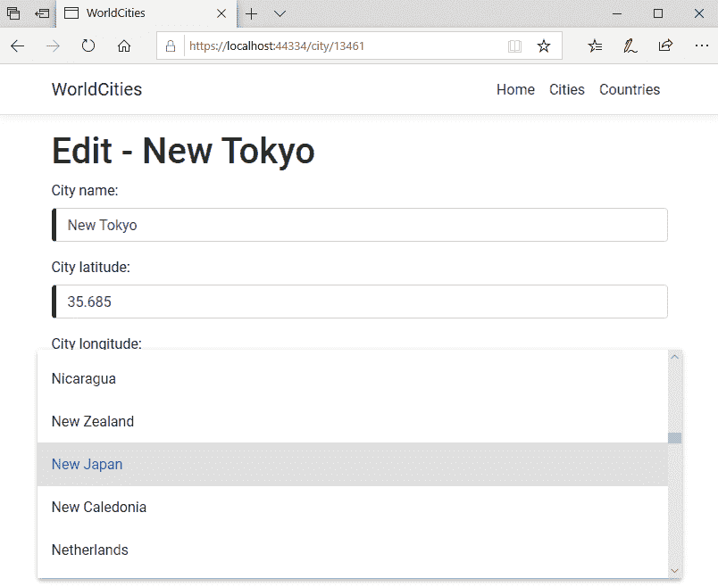

# 七、代码调整和数据服务

我们的`WorldCities`web 应用现在是一个成熟的项目，提供了许多有趣的功能：我们可以**检索我们 DBMS 中所有*城市*和*国家*的列表**，并通过分页表浏览它们，我们可以*订购*和*过滤* ;由于我们的*主/细节*UI 模式，我们还可以访问每个*城市*和*国家*的详细视图，在那里我们可以**阅读****和/或**编辑**这两个城市最相关的字段；最后但并非最不重要的是，由于上述*细节*视图中的*添加了新的*功能，我们可以**创建**新的*城市*和*国家*。**

 **现在，在继续之前，花一些时间巩固我们迄今所学的知识并改进我们遵循的基本模式可能是明智的：毕竟，改进我们的*前端*和*后端*以及他们目前所依赖的整体逻辑将肯定使他们更*通用*和*故障预防*为即将到来的事情。

本章完全致力于这些任务。下面是我们将要面对的各个部分的内容：

*   **优化和调整**，我们将实现一些高级源代码和 UI 改进。
*   **漏洞修复和改进**，我们将利用前面的调整来增强应用的一致性，并添加一些新功能。
*   **数据服务**，我们将学习如何从当前简化的实现（我们直接在组件内部使用原始`HttpClient`服务）迁移到更通用的方法，这将允许我们添加后处理、错误处理、重试逻辑等功能。

所有这些更改都是值得的，因为它们将增强我们应用的源代码，并为下一章将出现的*调试*和*测试*阶段做好准备。

好吧，那么。。。让我们开始工作吧。

# 技术要求

在本章中，我们将需要前面所有章节中列出的所有技术要求，而不需要额外的资源、库或包。

本章的代码文件可在[中找到 https://github.com/PacktPublishing/ASP.NET-Core-3-and-Angular-9-Third-Edition/tree/master/Chapter_07/](https://github.com/PacktPublishing/ASP.NET-Core-3-and-Angular-9-Third-Edition/tree/master/Chapter_07/)

# 优化和调整

在计算机编程中，术语**代码膨胀**通常用于描述不必要的长、慢或浪费的源代码。这样的代码是不可取的，因为它不可避免地使我们的应用更容易受到人为错误、回归错误、逻辑不一致、资源浪费等的影响。这也使得*调试*和*测试*更加困难和紧张；出于上述所有原因，我们应该尽可能地防止这种情况发生。

对付*代码膨胀*最有效的方法是采用并坚持**干式**原则，这是任何开发人员都应该尽可能遵循的原则。正如[第 5 章](05.html)中所述，*获取和显示数据*，**不要重复自己**（**干**）是一个广泛实现的软件开发原则：每当我们违反它，我们就会陷入*湿*的方法，这可能意味着*每件事都写两遍*、*我们喜欢打字*或*浪费每个人的时间*，这取决于我们最喜欢的内容。

在本节中，我们将尝试解决当前代码中一些比较潮湿的部分，看看如何使它们更干燥：这样做将极大地帮助我们以后调试和测试*会话*。

# 模板改进

如果我们再看看我们的`CityEditComponent`和`CountryEditComponent`模板文件，我们肯定会看到一定数量的代码膨胀。每个表单调用`form.get()`方法的次数不少于*10*次，这对模板的可读性构成了严重威胁。我们谈论的是非常小和简单的形式。与大公司打交道时会发生什么？有办法解决这个问题吗？

事实上，存在这样的问题：每当我们觉得自己编写了太多的代码或重复了太多的复杂任务时，我们都可以在组件类中创建一个或多个 helper 方法来集中底层逻辑。这些助手方法将充当我们可以调用的*快捷方式*，而不是重复整个验证逻辑。让我们尝试将它们添加到与*表单*相关的 Angular 分量中。

# 表单验证快捷方式

让我们看看如何在`CityEditComponent`课上做到这一点。

打开`/ClientApp/src/app/cities/city-edit.component.ts`文件，添加以下方法（新行高亮显示）：

```cs
// retrieve a FormControl
getControl(name: string) {
    return this.form.get(name);
}

// returns TRUE if the FormControl is valid
isValid(name: string) {
    var e = this.getControl(name);
    return e && e.valid;
}

// returns TRUE if the FormControl has been changed
isChanged(name: string) {
    var e = this.getControl(name);
    return e && (e.dirty || e.touched);
}

// returns TRUE if the FormControl is raising an error,
// i.e. an invalid state after user changes
hasError(name: string) {
    var e = this.getControl(name);
    return e && (e.dirty || e.touched) && e.invalid;
}
```

这些评论是不言自明的，所以没有什么要说的了。这些助手方法使我们有机会缩减以前的验证代码，如下所示：

```cs
<!-- ...existing code... --->

<div *ngIf="hasError('name')"
 class="invalid-feedback">
 <div *ngIf="form.get('name').errors?.required">
 Name is required.
 </div>
</div> <!-- ...existing code... --->

<div *ngIf="hasError('lat')"
 class="invalid-feedback">
 <div *ngIf="form.get('lat').errors?.required">
 Latitude is required.
 </div>
</div>

<!-- ...existing code... --->
```

... 等等好多了，对吧？

让我们对`CityEditComponent`的所有表单控件执行相同的操作，然后切换到`CountryEditComponent`并在那里执行相同的操作。。。

... 或者不是。

等一下：我们不是说过我们会尽可能地坚持*干燥*模式吗？如果我们要在不同的类中复制并粘贴相同的方法，我们怎么能合理地期望这样做呢？如果我们有 10 个基于表单的组件要修补，而不是只有 2 个，那会怎么样？听起来除了*湿*之外，什么都没有。既然我们已经找到了一种收缩模板代码的好方法，那么我们还需要找到一种体面的方法来实现那些与表单相关的方法，而不必到处产生克隆。

幸运的是，TypeScript 提供了一种很好的方法来处理这类场景：**类继承**。让我们来看看如何利用这些特性。

# 类继承

**面向对象编程**（**OOP**通常由两个核心概念定义：*多态性*和*继承性*。虽然这两个概念是相关的，但它们并不相同。简而言之，他们的意思是：

*   **多态性**允许我们在同一*实体*上分配多个接口（例如*变量*、*函数*、*对象*或*类型*），和/或在不同*实体*上分配相同的接口：换句话说，它允许*实体*有多个表单。
*   **继承**允许我们*通过*从另一个对象（*基于原型的继承*或类（*基于类的继承*派生*来扩展*一个对象或类，同时保留类似的实现；扩展类通常称为*子类*或*子类*，而继承类的名称为*超类*或*基类*。

现在让我们关注**继承**：在 TypeScript 中，与大多数基于类的面向对象语言一样，通过*继承*（一个*子*类）创建的类型获得父类型的所有属性和行为，除了构造函数、析构函数、重载运算符和*私有类型*属于*基类*的成员。

如果我们仔细想想，这正是我们在场景中需要的：如果我们创建一个基类并在那里实现所有与表单相关的方法，我们只需要*扩展*我们当前的组件类，而不必多次编写它。

让我们看看如何才能成功。

# 实现 BaseFormComponent

在解决方案资源管理器中，右键单击`/ClientApp/src/app/`文件夹并创建一个新的`base.form.component.ts`文件。打开它，并用以下内容填充它：

```cs
import { Component } from '@angular/core';
import { FormGroup } from '@angular/forms';

@Component({
  template: ''
}) 
export class BaseFormComponent {

  // the form model
  form: FormGroup;

  constructor() { }

  // retrieve a FormControl
  getControl(name: string) {
    return this.form.get(name);
  }

  // returns TRUE if the FormControl is valid
  isValid(name: string) {
    var e = this.getControl(name);
    return e && e.valid;
  }

  // returns TRUE if the FormControl has been changed
  isChanged(name: string) {
    var e = this.getControl(name);
    return e && (e.dirty || e.touched);
  }

  // returns TRUE if the FormControl is raising an error,
  // i.e. an invalid state after user changes
  hasError(name: string) {
    var e = this.getControl(name);
    return e && (e.dirty || e.touched) && e.invalid;
  }
}
```

现在，我们确实有一个`BaseFormComponent`*超类*，我们可以使用它*扩展*我们的子类；正如我们所看到的，这里没有什么，只有与表单相关的方法和`form`变量本身，因为这些方法使用（因此是必需的）。

一如既往，在使用新的*超类*之前，我们需要以以下方式在`/ClientApp/src/app/app.module.ts`文件中引用它：

```cs
// ... existing code...

import { AppComponent } from './app.component';
import { BaseFormComponent } from './base.form.component';

// ... existing code...

@NgModule({
  declarations: [
    AppComponent,
 BaseFormComponent,
    NavMenuComponent,
    HomeComponent,
    CitiesComponent,
    CityEditComponent,
    CountriesComponent,
    CountryEditComponent
  ],

// ... existing code...
```

From now on, we'll take for granted that we've got the logic behind our code samples; consequently, we're going to present them in a more succinct way to avoid wasting more pages by saying the obvious: please bear with it! After all, whenever we need to see the full file, we can always find it on the book's online source code repository on **GitHub**.

之后，我们可以更新当前的`CityEditComponent`类型脚本文件，以便相应地扩展其类。

# 扩展 cityedit 组件

打开`/ClientApp/src/app/cities/city-edit.component.ts`文件，然后在文件开头的`import`列表末尾添加`BaseFormComponent`*超类*：

```cs
import { Component, Inject } from '@angular/core';
import { HttpClient, HttpParams } from '@angular/common/http';
import { ActivatedRoute, Router } from '@angular/router';
import { FormGroup, FormControl, Validators, AbstractControl, 
 AsyncValidatorFn } from '@angular/forms';
import { Observable } from 'rxjs';
import { map } from 'rxjs/operators';

import { City } from './city';
import { Country } from '../countries/country';

import { BaseFormComponent } from '../base.form.component';

// ...existing code...
```

现在，我们需要使用类声明后面的`extends`修饰符来实现类继承：

```cs
// ...existing code...

export class CityEditComponent 
    extends BaseFormComponent {

// ...existing code...
```

就是这样：`CityEditComponent`现在正式成为`BaseFormComponent`*超类*的*子类*。

最后，我们需要在*子类*构造函数的实现中调用`super()`来调用*超类*构造函数：

```cs
// ...existing code...

constructor(
    private activatedRoute: ActivatedRoute,
    private router: Router,
    private http: HttpClient,
    @Inject('BASE_URL') private baseUrl: string) {
 super();
}

// ...existing code...
```

就是这样：现在我们可以自由地删除我们早期添加到`CityEditComponent`类文件中的所有与表单相关的方法——`getControl`、`isValid`、`isChanged`和`hasError`——因为我们的*子类*现在将透明地*从其*超类*继承*它们。

As for the `form` variable, it's worth noting that we're actually **overriding** it in the *child class* source code: in TypeScript, this can be done without any fancy modifier. We just need to re-define it: since we have already got it, we don't need to do anything.

现在，让我们通过点击*F5*并在*编辑*和*添加新*模式中导航`CityEditComponent`来测试我们所做的工作。如果我们做的每件事都是正确的，我们就不会看到任何问题：每件事都应该像以前一样工作——源代码的数量相当少。

Don't forget to test our validators, since the form-related methods that we have implemented mostly impact them: if the form validators are still working and show their errors when triggered, it means that the *child class* is able to inherit and use its *base class* methods – thus proving that our brand-new *superclass*/*subclass* implementation is working fine. 

# 扩展 CountryEditComponent

一旦我们确定一切正常，我们就可以扩展`CountryEditComponent`类，并使其成为`BaseFormComponent`的*子类*：让我们快点这样做，这样我们就可以继续前进。

我们不打算在这里显示源代码的更改，因为所需的步骤与我们刚才看到的几乎相同；如果我们有任何疑问，可以参考 GitHub 存储库中本章的源代码。

# Bug 修复和改进

老实说：尽管我们在构建*master*/*细节*UI 模式方面做得不错，并且我们使用最相关的*city*和*country*字段组合了这两个视图，但我们的应用仍然缺少我们的用户可能希望看到的东西。更具体地说，缺少以下详细信息：

*   **我们的城市细节视图没有正确验证 lat 和 lon*输入值****：例如，我们被允许输入字母而不是数字，这完全破坏了表单。*
**   **我们的国家视图没有显示每个*国家*实际包含的城市数量**。*   **我们的城市视图没有为每个列出的城市显示国家*名称****。**

 **让我们尽最大努力永久解决所有这些问题。

# 验证 lat 和 lon

让我们从唯一真正的*bug*开始：可以从*前端*中断的表单是我们应该始终避免的事情——即使这些输入类型在*后端*被我们的.NET Core API 隐式检查。

幸运的是，我们已经知道如何修复这些类型的错误：我们需要为`CityEditComponent`的`lat`和`lon`*表单控件*添加一些基于*模式的验证器*，就像我们对`CountryEditComponent`文件中的`iso2`和`iso3`控件所做的一样。我们已经知道，我们需要更新两个文件：

*   `CityEditComponent`*类*文件，用于实现验证器并基于*正则表达式*定义*验证模式*。
*   `CityEditComponent`*模板*文件，用于实现验证器的错误消息及其显示/隐藏逻辑。

让我们这样做！

# city-edit.component.ts

打开`/ClientApp/src/app/cities/city-edit.component.ts`文件，并相应更新其内容（突出显示新的/更新的行）：

```cs
// ...existing code...

  ngOnInit() {
    this.form = new FormGroup({
      name: new FormControl('', Validators.required),
 lat: new FormControl('', [
 Validators.required,
 Validators.pattern('^[-]?[0-9]+(\.[0-9]{1,4})?$')
 ]),
 lon: new FormControl('', [
 Validators.required,
 Validators.pattern('^[-]?[0-9]+(\.[0-9]{1,4})?$')
 ]),
      countryId: new FormControl('', Validators.required)
    }, null, this.isDupeCity());

    this.loadData();
  }

// ...existing code...
```

我们开始吧。从[第 6 章](06.html)、*表单和数据验证*中我们已经知道，该表单的实现仍然是基于手动实例化的`FormGroup`和`FormControl`对象，而不是使用`FormBuilder`：但是，现在没有理由更改它，因为我们仍然能够实现`Validators.pattern`没有任何问题。

让我们花几分钟解释一下我们在这里使用的*正则表达式*：

*   `^`定义我们需要检查的*用户输入*字符串的开始。
*   `[-]?`允许存在*可选*减号，处理负坐标时需要此减号。
*   `[0-9]+`要求输入一个或多个介于 0 和 9 之间的*数字。*
*   `(\.[0-9]{1,4})?`定义了一个*可选组*（感谢末尾的`?`，如果存在，需要遵守以下规则：
    *   `\.`：必须以*单点*（小数点）开头。点转义是因为它是保留的*正则表达式*字符，未转义时表示*任何字符*。
    *   `[0-9]{1,4}`要求在 0 和 9 之间提供*一到四个*数字（因为我们确实希望*在点后的 1 到 4 个十进制值*。
*   `$`定义*用户输入*字符串的结尾。

We could've used `\d` (*any digit*) as an alternative of `[0-9]`, which is a slightly more succinct syntax: however, we have chosen to stick with  `[0-9]` for better readability: feel free to replace it with `\d` at any time.

既然验证器已经设置到位，我们需要将错误消息添加到`CityEditComponent`模板文件中。

# city-edit.component.html

打开`/ClientApp/src/app/cities/city-edit.component.html`文件并相应更新其内容（突出显示新的/更新的行）：

```cs
<!-- ...existing code -->

        <div *ngIf="form.get('lat').errors?.required">
          Latitude is required.
        </div>
 <div *ngIf="form.get('lat').errors?.pattern">
 Latitude requires a positive or negative number with 0-4
           decimal values.
 </div>

<!-- ...existing code -->

        <div *ngIf="form.get('lon').errors?.required">
          Longitude is required.
        </div> <div *ngIf="form.get('lon').errors?.pattern">
 Longitude requires a positive or negative number with 0-4
           decimal values.
 </div>

<!-- ...existing code -->
```

我们开始吧。

让我们快速测试一下：

1.  点击*F5*以*调试*模式启动应用。
2.  在城市视图中导航。
3.  筛选列表以查找马德里。
4.  在城市纬度和城市经度输入字段中键入一些无效字符。

如果验证器已正确实现，我们将看到错误消息显示在所有页面中，并且“保存”按钮已禁用，如以下屏幕截图所示：


就这样。现在我们已经修复了第一个 UI 错误，让我们继续下一个任务。

# 增加城市数量

我们现在需要做的是找到一种方法，在 Countries（国家）视图中显示一个额外的列，允许用户立即看到每个列出的*国家*的*城市数量*。为了做到这一点，我们肯定需要改进我们的*后端*Web API，因为我们知道，目前无法从服务器检索此类信息。

好的，从技术上讲，有一种方法：我们可以使用 CitiesController 的`GetCities()`方法，使用一个巨大的`pageSize`参数（99999 左右）和一个合适的过滤器来检索每个给定国家的全部城市数量，然后计算该集合并输出数字

然而，这样做确实会对绩效产生*巨大*影响：我们不仅需要检索所有列出的*国家*的所有城市，但是我们必须通过为每个表行发出一个单独的 HTTP 请求来实现这一点。如果我们想以一种智能和高效的方式完成任务，这绝对不是我们想要的。

以下是我们将要做的：

*   从*后端*找到一种智能高效的方法来统计每个上市国家的城市数量。
*   将一个`totCities`属性添加到我们的`country`Angular*接口*中，以在*客户端*上存储相同的号码。

让我们这样做。

# 国家控制员

让我们从*后端*部分开始。找到一种*智能高效的方式*计算每个国家的城市数量可能比看起来要困难。

如果我们想在一次快照中检索这样的值，也就是说，不需要对 Angular 执行额外的 API 请求，毫无疑问，我们需要改进我们当前的 CountriesController 的`GetCountries()`方法——这就是我们目前用来获取*国家*数据的方法。

让我们打开我们的`/Controllers/CountriesController.cs`文件，看看.NET Core 和**实体框架核心**（**EF 核心**如何帮助我们实现我们想要的。

下面是我们需要更新的`GetCountries()`方法：

```cs
public async Task<ActionResult<ApiResult<Country>>> GetCountries(
        int pageIndex = 0,
        int pageSize = 10,
        string sortColumn = null,
        string sortOrder = null,
        string filterColumn = null,
        string filterQuery = null)
{
    return await ApiResult<Country>.CreateAsync(
            _context.Countries,
            pageIndex,
            pageSize,
            sortColumn,
            sortOrder,
            filterColumn,
            filterQuery);
}
```

正如我们所看到的，没有*城市*的痕迹。虽然我们知道我们的`Country`实体包含一个`Cities`属性，用于存储*城市*列表，但我们也记得（从[第 4 章](04.html)、*数据模型和实体框架核心*中）该属性设置为`null`，因为我们从未告诉 EF Core 加载实体的相关数据。

如果我们现在做呢？我们可能会试图通过激活*急切加载*模式来解决问题，并用实际值填充`Cities`属性，以满足我们的客户需求。我们可以这样做：

```cs
return await ApiResult<Country>.CreateAsync(
            _context.Countries
 .Include(c => c.Cities),
            pageIndex,
            pageSize,
            sortColumn,
            sortOrder,
            filterColumn,
            filterQuery);
```

然而，不需要一个天才就能理解这样一个变通方法很难聪明和高效：一个*国家*实体可能有很多城市，有时*数百个*。我们真的认为我们的*后端*可以从 DBMS 中检索它们吗？我们真的要用那些巨大的 JSON 数组来淹没我们的 Angular*前端*吗？

那绝对不行：我们可以做得更好。特别是考虑到，毕竟我们不需要检索每个国家的整个城市的数据来实现我们的目标：我们只需要知道它们的*编号*。

我们可以这样做：

```cs
[HttpGet]
public async Task<ActionResult<ApiResult<CountryDTO>>> GetCountries(
int pageIndex = 0,
int pageSize = 10,
string sortColumn = null,
string sortOrder = null,
string filterColumn = null,
string filterQuery = null)
{
    return await ApiResult<CountryDTO>.CreateAsync(
            _context.Countries
 .Select(c => new CountryDTO()
 {
 Id = c.Id,
 Name = c.Name,
 ISO2 = c.ISO2,
 ISO3 = c.ISO3,
 TotCities = c.Cities.Count
 }),
            pageIndex,
            pageSize,
            sortColumn,
            sortOrder,
            filterColumn,
            filterQuery);
}
```

正如我们所看到的，我们采取了一种完全不同的方法：`Include()`方法已经过时了；现在，我们不是急切地加载城市，而是使用`Select()`方法*将*我们生成的*国家*投影到一个全新的`CountryDTO`对象中，该对象包含与其源完全相同的属性，再加上一个新的`TotCities`变量：这样我们就永远不会得到城市，我们只获取它们的编号

It's also worth noting that, since we switched out our `Country` entity class for a new `CountryDTO`class, we had to change the `ApiResult` generic type (from `ApiResult<Country>` to `ApiResult<CountryDTO>`) in the method's return type.

虽然这个方法要复杂一点，但它绝对是一种处理我们任务的*聪明而高效的*方法；唯一的缺点是我们需要创建`CountryDTO`类，它还不存在

# 创建 CountryDTO 类

在解决方案资源管理器中，右键单击`/Data/`文件夹，然后添加一个新的`CountryDTO.cs`文件，打开它，并用以下内容填充它：

```cs
using System.Text.Json.Serialization;

namespace WorldCities.Data
{
    public class CountryDTO
    {
        public CountryDTO() { }

        #region Properties
        public int Id { get; set; }

        public string Name { get; set; }

        [JsonPropertyName("iso2")]
        public string ISO2 { get; set; }

        [JsonPropertyName("iso3")]
        public string ISO3 { get; set; }

 public int TotCities { get; set; }
        #endregion
    }
}
```

如我们所见，前面的`CountryDTO`类包含`Country`实体类已经提供的大部分属性，没有`Cities`属性（我们知道这里不需要该属性）和一个额外的`TotCities`属性：它是**数据传输对象**（**DTO***类*这仅用于向客户提供（仅）我们需要发送的数据。

As the name implies, a DTO is an object that carries data between processes. That's a widely used concept when developing web services and micro-services, where each HTTP call is an expensive operation that should always be *cut* to the bare minimum amount of required data.

The difference between DTOs and *business objects* and/or *data access objects* (such as *DataSets*, *DataTables*, *DataRows*, *IQueryables*, *Entities*, and so on) is that a DTO should only store, serialize, and deserialize their own data.

值得注意的是，我们在这里也必须使用`[JsonPropertyName]`属性，因为这个类将被转换为 JSON，`ISO2`和`ISO3`属性不会以我们期望的方式进行转换（正如我们已经在[第 5 章](05.html)**、***获取和显示数据*中看到的那样）。

# Angular 前端更新

现在是切换到 Angular 并相应更新*前端*的时候了，新的更改应用于*后端*。

遵循以下步骤：

1.  打开`/ClientApp/src/app/countries/country.ts`文件，将`TotCities`属性按如下方式添加到`Country`界面：

```cs
export interface Country {
    id: number;
    name: string;
    iso2: string;
    iso3: string;
 totCities: number;
}
```

2.  紧接着，打开`/ClientApp/src/app/countries/countries.component.ts`文件，按以下方式更新`displayedColumns`内部变量：

```cs
// ...existing code... 

public displayedColumns: string[] = ['id', 'name', 'iso2',
 'iso3', 'totCities'];

// ...existing code... 
```

3.  完成后，打开`/ClientApp/src/app/countries/countries.component.html`文件，按以下方式将`TotCities`列添加到*角材料*的`MatTable`模板中（更新的行高亮显示）：

```cs
<!-- ...existing code... -->

<!-- Lon Column -->
<ng-container matColumnDef="iso3">
  <th mat-header-cell *matHeaderCellDef mat-sort-header>
   ISO 3
  </th>
  <td mat-cell *matCellDef="let country"> {{country.iso3}} </td>
</ng-container>

<!-- TotCities Column -->
<ng-container matColumnDef="totCities">
 <th mat-header-cell *matHeaderCellDef mat-sort-header>
   Tot. Cities
  </th>
 <td mat-cell *matCellDef="let country"> {{country.totCities}} </td>
</ng-container>

<tr mat-header-row *matHeaderRowDef="displayedColumns"></tr>
<tr mat-row *matRowDef="let row; columns: displayedColumns;"></tr>

<!-- ...existing code... -->
```

4.  现在，我们终于可以点击*F5*，看到我们努力工作的成果。如果我们一切都做对了，我们应该能够看到新的托特。城市栏，如以下屏幕截图所示：


一点也不坏：最重要的是，新列也将是*可排序*，这意味着我们可以通过*升序*或*降序*的上市城市数量，点击一两下，对*国家*进行排序。通过这一新功能，我们可以了解到美国是拥有最多上市城市的国家（4864 个），而新日本，我们在[第 6 章](06.html)*表单和数据验证*中创建的虚拟国家，仍然拥有*零*。

在这里，让我们通过转到城市视图，使用它编辑新东京，并通过以下方式更改其*国家*，快速解决此问题：



如果我们将新东京的*国家*设置为新日本，点击保存按钮应用更改，然后返回国家视图，我们应该看到新日本现在只有一个城市（如以下屏幕截图所示）：


现在，我们已经成功地在我们的国家视图中显示了每个*国家*的城市数量——并在此过程中将新日本与新东京结合在一起——我们准备进行第三项改进。

然而，在这样做之前，花一些时间思考一下我们必须创建的*DTO 类*来完成我们的最新任务可能是有用的。

# DTO 类–我们真的应该使用它们吗？

现在我们已经看到`Country`*实体类*和`CountryDTO`*类*实际上是多么的相似，我们应该问问自己是否可以做得更好。例如，我们可以继承`CountryDTO`类中的`Country`实体类，从而避免重复四个属性；或者我们可以完全避免使用`CountryDTO`类，只需将`TotCities`属性添加到`Country`实体中即可。

好的，答案是**是**：我们肯定可以使用这些变通方法，从而避免创建额外的属性（或类）并使代码更*干燥*。我们为什么不这么做？

答案很简单：因为之前的两种解决方案都有一些相关的设计和*安全*缺陷。让我们尽最大努力解决这些问题，并理解为什么应该尽可能避免这些问题。

# 关注点分离

作为一般的经验法则，*实体类*不应该被只为满足*客户端*需求而存在的属性所拖累：每当我们需要创建它们时，明智的做法是创建一个中间类，然后分离*实体*从我们通过 Web API 发送给客户机的输出对象。

If we've worked with the ASP.NET MVC Framework, we can relate this *separation of concerns* with the one that distinguishes the **Model** from the **ViewModel** in the **Model-View-ViewModel** (**MVVM**) presentation pattern. The scenario is basically the same: both are simple classes with attributes, but they do have different audiences – the *controller* and the *view*. In our scenario, the *view* is nothing less than our Angular client.

现在，不用说，将`TotCities`属性放入*实体*类将打破*关注点分离*。我们的`Countries`数据库表中没有`TotCities`**列；该属性仅用于向*前端发送一些附加数据。***

 **除此之外，`TotCities`属性和已经存在的`Cities`属性之间没有关系：如果我们激活 EF 核心*急切加载*模式并填充`Cities`属性，`TotCities`属性仍将设置为零（反之亦然）；这种误导性的行为将是一个糟糕的设计选择，甚至可能导致那些合理预期我们的*实体类*是数据源的 C#版本的人的实现错误。

# 安全考虑

将实体类与*客户端*API 输出类分开通常是一个不错的选择，即使出于安全目的：现在我们处理的是*城市*和*国家*，我们并没有真正受到影响，但如果我们要处理*用户*呢包含个人和/或登录数据的表？如果我们仔细想想，有很多可能的情况下，从数据库中提取整个字段并以 JSON 格式发送给客户端是不明智的。当我们从 Visual Studio 界面添加它们时，.NET Core Web API 控制器创建的默认方法-这是我们在[第 4 章](04.html)中所做的，*具有实体框架核心的数据模型*——不必在意，这对于代码示例甚至简单的基于 API 的项目来说都是完美的。但是，当事情变得更加复杂时，建议以可控的方式向客户端提供有限的数据。

也就是说，在.NET 中实现这一点的最有效方法是创建和提供更薄、更安全的*DTO 类*，而不是主要的*实体*：这正是我们在前面几节中对`CountryDTO`类所做的。

# DTO 类与匿名类型

上述*DTO 类*唯一可接受的替代方案是使用`Select()`方法*将*主要实体类投影为*非特定类型*并为其提供服务。

这里是先前 CountriesController 的`GetCountries()`方法的另一个版本，使用*匿名类型*代替`CountryDTO`*类*（以下代码中突出显示了相关更改）：

```cs
[HttpGet]
public async Task<ActionResult<ApiResult<dynamic>>> GetCountries(
    int pageIndex = 0,
    int pageSize = 10,
    string sortColumn = null,
    string sortOrder = null,
    string filterColumn = null,
    string filterQuery = null)
{
    return await ApiResult<dynamic>.CreateAsync(
            _context.Countries
 .Select(c => new 
 {
 id = c.Id,
 name = c.Name,
 iso2 = c.ISO2,
 iso3 = c.ISO3,
 totCities = c.Cities.Count
 }),
            pageIndex,
            pageSize,
            sortColumn,
            sortOrder,
            filterColumn,
            filterQuery);
}
```

正如预期的那样，我们必须在代码中将我们的`ApiResult`泛型类型更改为`dynamic`，在方法的*返回值*中也要更改；除此之外，前面的方法似乎很好，它肯定会像前面的方法一样工作。

那么我们应该用什么呢？*DTO 类*还是*a*类*类*类？

说实话，这两种方法都很好：*匿名类型*通常是一个很好的选择，特别是当我们需要快速定义 JSON 返回类型时；但是，有一些特定的场景（例如*单元测试*，我们将在后面看到），我们更愿意处理*命名类型*。一如既往，选择取决于形势。在我们当前的场景中，我们将继续使用`CountryDTO`类，但在不久的将来我们也将使用*匿名类型*。

For additional info on the *anonymous types* in C#, read the following document:

[https://docs.microsoft.com/en-us/dotnet/csharp/programming-guide/classes-and-structs/anonymous-types](https://docs.microsoft.com/en-us/dotnet/csharp/programming-guide/classes-and-structs/anonymous-types)

# 保护实体

如果我们不想使用*DTO 类*，并且*匿名类型*不是我们喜欢的，那么我们可以考虑第三种可行的选择：保护我们的*实体*，以防止它们向 EF Core 发出错误的指令（例如创建错误的列），或者通过 RESTful API 发送太多数据：如果我们能够做到这一点，我们可以继续使用它们并保持 Web API 代码干燥。

我们可以通过使用一些特定的*D**ata 注释属性*来装饰实体的属性来实现这一结果，例如：

*   `[NotMapped]`：防止 EF Core 为该属性创建*数据库列*。
*   `[JsonIgnore]`：防止对属性进行序列化或反序列化。

*   `[JsonPropertyName("name")]`：允许我们在 JSON 类序列化和反序列化时覆盖属性名，覆盖`Startup.cs`文件中`JsonNamingPolicy`设置指定的属性名和任何命名策略。

前一个属性需要`Microsoft.EntityFrameworkCore`名称空间，而其他属性是`System.Text.Json.Serialization`名称空间的一部分。

我们已经在[第 5 章](05.html)中使用了`[JsonPropertyName]`*属性**获取和显示数据*，其中我们必须为`Country`*实体*的`ISO2`和`ISO3`属性指定 JSON 属性名称：让我们也实现另外两个。

# [NotMapped]和[JsonIgnore]属性

打开`/Data/Models/Country.cs`文件并更新文件末尾的现有代码，如下所示（突出显示新的/更新的行）：

```cs
#region Client-side properties
/// <summary>
/// The number of cities related to this country.
/// </summary>
[NotMapped]
public int TotCities 
{ 
 get
 {
 return (Cities != null)
 ? Cities.Count
 : _TotCities;
 }
 set { _TotCities = value; }
}

private int _TotCities = 0;
#endregion

#region Navigation Properties
/// <summary>
/// A list containing all the cities related to this country.
/// </summary>
[JsonIgnore]
public virtual List<City> Cities { get; set; }
#endregion
```

简而言之，我们所做的就是：

*   我们已经在*实体*代码中实现了`TotCities`属性，并用`[NotMapped]`属性对其进行了修饰，使得 EF Core 不会在任何*迁移*和/或*更新*任务时创建其对应的数据库列。
*   当我们在那里的时候，我们抓住机会写了一些额外的逻辑将*这个属性链接到`Cities`属性值（只有当它不是`null`时）：这样我们的*实体*就不会给出误导性的信息，比如`Cities`列表属性中有 20 多个城市和`TotCities`同时为零的值。*
*   最后但并非最不重要的一点是，我们将`[JsonIgnore]`属性添加到`Cities`属性中，从而防止此类信息被发送到客户端（无论其值如何–即使在`null`时）。

The `[NotMapped]` attribute, which we've never used before, helps mitigate the fact that we're using an Entity to store the properties that are required by the *front-end,* and are therefore completely unrelated to the *Data Model*: in a nutshell, such an attribute will tell EF Core that we do not want to create a database column for that property in the database. Since we've created our database using EF Core's *Code-First* approach (see [Chapter 4](04.html), *Data Model with Entity Framework Core*), and we're using *migrations* to keep the database structure updated, we need to use that attribute each and every time we want to create an *extra property* on our Entity classes. Whenever we forget to do that, we would definitely end with unwanted database fields.

使用`[JsonIgnore]`来防止服务器发送`Cities`属性似乎有些过分：既然它当前是`null`，我们为什么还要跳过这样一个值呢？

事实上，我们做出这个决定是为了预防：因为我们直接使用*实体*，而不是依赖*DTO 类*或*匿名类型*，所以我们希望对数据实施限制性方法。当我们不需要它时，明智的做法是应用`[JsonIgnore]`，以确保我们不会披露任何超出需要的信息；默认情况下，我们可以称之为*数据保护*方法，这将有助于我们控制我们的 Web API，防止其共享过多。毕竟，我们可以随时删除该属性。

不言而喻，如果我们想要采用*担保实体*替代方法，我们将不再需要`CountryDTO.cs`类；因此，我们可以*还原*我们刚才更改的`/Controllers/CountriesController.cs`文件的`GetCountries()`方法，并将`Country`引用放回原处：

```cs
return await ApiResult<Country>.CreateAsync(
        _context.Countries
 .Select(c => new Country()
            {
                Id = c.Id,
                Name = c.Name,
                ISO2 = c.ISO2,
                ISO3 = c.ISO3,
                TotCities = c.Cities.Count
            }),
        pageIndex,
        pageSize,
        sortColumn,
        sortOrder,
        filterColumn,
        filterQuery);
```

All three alternative implementations of the `GetCountries()` method that have been discussed in this section – `CountryDTO`, `dynamic`, and `Country` – are available in the `/Controllers/CountriesController.cs` file in the GitHub source code for `Chapter07`; the former is what we'll be using for this book's samples, while the other two have been commented out and put there for reference only: feel free to switch them at will!

就这样：现在我们终于可以开始我们的第三个也是最后一个任务了。

# 添加国家名称

现在，我们需要找到一种方法，在 Cities 视图中添加一个`Country`列，这样我们的用户就可以看到每个列出的城市的*国家*名称；考虑到我们刚刚对*国家*所做的，这应该是一项相当简单的任务。

# 花旗控制器

一如既往，让我们从 Web API 开始。遵循以下步骤：

1.  打开`/Controllers/CitiesController.cs`文件，按以下方式更改`GetCities()`方法：

```cs
// ...existing code...

[HttpGet]
public async Task<ActionResult<ApiResult<CityDTO>>> GetCities(
        int pageIndex = 0,
        int pageSize = 10,
        string sortColumn = null,
        string sortOrder = null,
        string filterColumn = null,
        string filterQuery = null)
{
    return await ApiResult<CityDTO>.CreateAsync(
            _context.Cities
                .Select(c => new CityDTO()
                {
                    Id = c.Id,
                    Name = c.Name,
                    Lat = c.Lat,
                    Lon = c.Lon,
                    CountryId = c.Country.Id,
                    CountryName = c.Country.Name
                }),
            pageIndex,
            pageSize,
            sortColumn,
            sortOrder,
            filterColumn,
            filterQuery);
}

// ...existing code...
```

正如我们所看到的，我们坚持基于 DTO 的模式——这意味着我们必须创建一个额外的`CountryDTO`类。

2.  使用 Visual Studio 的解决方案资源管理器添加新的`/Data/CityDTO.cs`文件，并用以下内容填充该文件：

```cs
namespace WorldCities.Data
{
    public class CityDTO
    {
        public CityDTO() { }

        public int Id { get; set; }

        public string Name { get; set; }

        public string Name_ASCII { get; set; }

        public decimal Lat { get; set; }

        public decimal Lon { get; set; }

        public int CountryId { get; set; }

        public string CountryName { get; set; }
    }
}
```

就这样：我们的 Web API 已经准备好了，所以让我们转到 Angular。

As we've seen when working with the CountriesController's `GetCountries()` method early on, we could've implemented the Web API by using *anonymous types*, or with a secured `City` entity, thus avoiding having to write the `CityDTO` class.

# Angular 前端更新

让我们从`/ClientApi/src/app/cities/city.ts`接口开始，在这里我们需要添加`countryName`属性；打开该文件，并按以下方式更新其内容：

```cs
interface City {
    id: number;
    name: string;
    lat: number;
    lon: number;
    countryId: number;
 countryName: string;
}
```

完成后，打开`/ClientApi/src/app/cities/cities.component.ts`类，需要添加`countryName`列定义：

```cs
// ...existing code... 

public displayedColumns: string[] = ['id', 'name', 'lat', 'lon', 'countryName'];

// ...existing code... 
```

然后，打开`/ClientApi/src/app/cities/cities.component.html`类并相应地添加一个新的`<ng-container>`：

```cs
<!-- ...existing code... -->

<!-- Lon Column -->
<ng-container matColumnDef="lon">
  <th mat-header-cell *matHeaderCellDef mat-sort-header>Longitude</th>
  <td mat-cell *matCellDef="let city"> {{city.lon}} </td>
</ng-container>

<!-- CountryName Column -->
<ng-container matColumnDef="countryName">
 <th mat-header-cell *matHeaderCellDef mat-sort-header>Country</th>
 <td mat-cell *matCellDef="let city">
 <a [routerLink]="['/country', 
     city.countryId]">{{city.countryName}}</a>
 </td>
</ng-container>

<!-- ...existing code... -->
```

如我们所见，我们将`countryName`包装在`routerLink`中，指向*编辑国家*视图，以便我们的用户能够将其用作导航元素。

让我们测试一下我们做了什么：点击*F5*以*调试*模式启动应用，然后进入城市视图。如果我们做的一切都正确，我们应该受到以下结果的欢迎：


不错吧

从那里，如果我们点击*国家*名称——比如约旦——我们应该进入*编辑国家*视图：


太棒了！

这就把我们带到了*次要*代码改进和 UI 调整的结尾：在下一节中，我们将面临一项更为艰巨的任务，这将需要*代码重构*我们迄今为止创建的所有 Angular 组件。

In software development, *code refactoring* is the process of restructuring existing source code without changing its external behavior: there could be multiple reasons to perform *refactoring* activities, such as improving the code's readability, extensibility or performance, making it more secure, reducing its complexity, and so on.

For additional information regarding the *code refactoring* high-level concept, check out the following URL:

[https://docs.microsoft.com/en-us/visualstudio/ide/refactoring-in-visual-studio](https://docs.microsoft.com/en-us/visualstudio/ide/refactoring-in-visual-studio)

# 数据服务

到目前为止，我们创建的两个 web 应用——*第 1 章*至*3 章*中的`HealthCheck`和*第 4 章*至*7*中的`WorldCities`都具有通过 HTTP（S）协议进行的*前端*至*后端*通信，为了建立这样的通信，我们充分利用了`HttpClient`类，这是`@angular/common/http`包附带的内置 Angular HTTP API 客户端，它位于`XMLHttpRequest`接口上。

Angular 的`HttpClient`类有很多好处，包括可测试性特性、*请求*和*响应*类型的对象、*请求*和*响应*拦截、*可观察的*API，以及简化的错误处理。它甚至可以在没有*数据服务器*的情况下使用，这要归功于*内存中的 Web API 包*，它在 RESTful API 上模拟 CRUD 操作：我们在[第 4 章](04.html)的开头简要介绍了*数据模型和实体框架核心*，当我们问自己是否真的需要*数据服务器*时（答案是肯定的，因此我们没有使用它）。

出于上述所有原因，对于任何想要使用 Angular 框架开发*前端*web 应用的人来说，充分利用`HttpClient`类无疑是最合理的选择；这就是说，有多种方法可以实现它，这取决于我们希望利用其宝贵功能的程度。

在本节中，在简要介绍了其他可用的替代方案之后，我们将了解如何重构我们的应用，以便将我们当前的`HttpClient`实现替换为一种基于专用*HTTP 数据服务*的更通用的方法。

# XMLHttpRequest 与 Fetch（与 HttpClient）

正如我们刚才所说，Angular 的`HttpClient`类是基于**XMLHttpRequest**（**XHR**）的 API，该 API 由浏览器通过其 JavaScript 引擎提供的对象组成，可用于以*异步*方式在 web 浏览器和 web 服务器之间传输数据，而且不必重新加载整个页面。这项技术最近庆祝了它的 20 周年，在 2017 年**FetchAPI**最终问世之前，它基本上是唯一可用的替代方法。

Fetch API 是另一个获取资源的接口，旨在成为`XMLHttpRequest`API 的现代替代品，提供更强大、更灵活的功能集；在下一节中，我们将快速回顾这两种方法，并讨论它们的优缺点。

# XMLHttpRequest

它背后的概念在 1999 年首次出现，当时微软发布了适用于 MS Exchange Server 2000 的第一版**Outlook Web Access**（**OWA**）。

以下是 Alex Hopmann 撰写的一篇非常古老的帖子的摘录，Alex Hopmann 是该帖子的开发者之一：

"XMLHTTP actually began its life out of the Exchange 2000 team. I had joined Microsoft in November 1996 and moved to Redmond in the spring of 1997 working initially on some Internet Standards stuff as related to the future of Outlook. I was specifically doing some work on meta-data for web sites including an early proposal called "Web Collections". During this time period Thomas Reardon one day dragged me down the hall to introduce me to this guy named Jean Paoli that had just joined the company. Jean was working on this new thing called XML that some people suspected would be very big some day (for some unclear reason at the time)."
  *   – Alex Hopmann, The Story of XMLHTTP, [http://www.alexhopmann.com/xmlhttp.htm](http://www.alexhopmann.com/xmlhttp.htm)*

Alex 是对的：几个月后，他的团队发布了一个名为`IXMLHTTPRequest`的接口，该接口被实现到第二版本的**Microsoft XML 核心服务**（**MSXML**）库中：该版本于 1999 年 3 月随 Internet Explorer 5.0 一起发布，这可能是第一个能够访问该界面（通过 ActiveX）的浏览器。

不久之后，Mozilla 项目开发了一个名为`nsIXMLHttpRequest`的接口，并将其应用到 Gecko 布局引擎中；这与 Microsoft 界面非常相似，但它还附带了一个包装器，允许通过 JavaScript 使用它，这要感谢浏览器返回的对象。该物体于 2000 年 12 月 6 日在 Gecko v0.6 上被称为`XMLHttpRequest`

在随后的几年中，`XMLHttpRequest`对象成为所有主要浏览器中的*事实上的*标准，在*Safari 1.2*（2004 年 2 月）、*Opera 8.0*（2005 年 4 月）、*iCab 3.0b352*（2005 年 9 月）和*Internet Explorer 7*（2006 年 10 月）中实施。这些早期采用使得谷歌工程师能够开发和发布两个领先的 web 应用*G**mail*（2004）和*谷歌地图*（2005），这些应用完全基于 XMLHttpRequestAPI。只要看一下这些应用就足以理解 web 开发已经进入了一个新时代。

这项激动人心的技术唯一缺少的是一个名字，这个名字是在 2005 年 2 月 18 日发现的，当时*Jesse James Garrett*写了一篇名为*AJAX:Web 应用的新方法*的标志性文章。

这是已知的术语 AJAX 的首次出现，*异步 JavaScript+XML*的首字母缩略词：`XMLHttpRequest`对象在*客户端*中起着关键作用，这是一组可用于创建异步 web 应用的 web 开发技术。

2006 年 4 月 5 日，**万维网联盟**（**W3C**）发布了`XMLHttpRequest`对象的第一份规范草案，试图创建一个官方的 Web 标准。

The latest draft of the `XMLHttpRequest` object was published on 6 October, 2016, and is available at the following URL:

[https://www.w3.org/TR/2016/NOTE-XMLHttpRequest-20161006/](https://www.w3.org/TR/2016/NOTE-XMLHttpRequest-20161006/)

W3C 草案为 AJAX 开发的广泛采用铺平了道路。然而，对于大多数 web 开发人员来说，最初的实现是相当困难的，因为不同浏览器对所涉及 API 的实现存在一些相关的差异。幸运的是，多亏了许多跨浏览器 JavaScript 库——比如*j**Query*、*Axios*和*MooTools*——它们足够聪明，可以将其添加到可用的工具集中：这允许开发人员使用底层的`XMLHttpRequest`通过一组标准化的高级方法间接实现对象功能。

随着时间的推移，XHR 数据格式迅速从 XML 转换为*JSON*、*HTML*和*纯文本*，更适合使用 DOM 页面，而不改变整体方式；另外，当 JavaScript（**RxJS**库的**反应式扩展出现时，`XMLHttpRequest`对象可以很容易地放在`Observable`后面，从而获得了很多优势（比如能够与其他观察对象混合匹配，*订阅/取消订阅*、*管道/地图*，等等）。**

这就是 Angular 的`HttpClient`类背后的主要思想，它可以被描述为*Angular 处理**XMLHttpRequest*的方式：一个非常方便的包装器，允许开发人员通过`Observable`模式有效地使用它。

# 取来

在早期，使用原始的`XMLHttpRequest`对象对大多数 web 开发人员来说相当困难，并且很容易产生大量 JavaScript 源代码，这些代码通常很难阅读和理解：这些问题最终由*等库带来的*上层结构*解决 jQuery*等，但代价是不可避免的代码（和资源）开销。

发布 Fetch API 是为了以更简洁的方式解决此类问题，使用了一种基于*内置*、*承诺的*方法，该方法可以轻松地执行相同的*异步*服务器请求，而无需第三方库。

下面是一个使用*XHR*的 HTTP 请求示例：

```cs
var oReq = new XMLHttpRequest();
oReq.onload = function() {
  // success
  var jsonData = JSON.parse(this.responseText);
};
oReq.onerror = function() {
  // error
  console.error(err);
};
oReq.open('get', './api/myCmd', true);
oReq.send();
```

下面是使用`fetch`执行的相同请求：

```cs
fetch('./api/myCmd')
  .then((response) => {
    response.json().then((jsonData) => { 
       // success
    });
  })
  .catch((err) => {  
    // error
    console.error(err);
  });
```

正如我们所看到的，基于 fetch 的代码显然更具可读性。它的通用接口提供了更好的一致性，原生 JSON 功能使代码更加枯燥，*承诺它返回的*允许更容易的*链接*和*异步*/*等待*任务，而无需定义回调。

长话短说，如果我们将原始 XHR 实现与全新的`fetch()`API 进行比较，不需要天才就能看出，后者显然获胜。

# HttpClient

然而，由于 Angular 的`HttpClient`类，使用原始 XHR 是不可能的；我们将使用客户端提供的内置抽象，它允许我们以以下方式编写前面的代码：

```cs
this.http.get('./api/myCmd')
  .subscribe(jsonData => {
    // success
  }, 
  error => { 
    // error
    console.error(error));
  };
```

如我们所见，前面代码中基于*的*代码`HttpClient`与基于*的获取*的代码提供了类似的好处：我们获得了一致的接口、本机 JSON 功能、*链接*和*异步*/*等待*任务。

除此之外，*可观察到的*也可以转换为*承诺*，这意味着我们甚至可以做到以下几点：

```cs
this.http.get('./api/myCmd')
  .toPromise()
  .then((response) => {
    response.json().then((jsonData) => { 
       // success
    });
  })
  .catch((err) => { 
    // error
    console.error(err);
  });
```

At the same time, it's true that *Promises* can also be converted to *Observables* using the RxJS library.

总而言之，*JavaScript 原生*Fetch API 和*Angular 原生*`HttpClient`类都是完全可行的，它们中的任何一个都可以在 Angular 应用中有效地使用。

以下是使用**获取**的主要优点：

*   它是*最新的*行业标准，可用于处理 HTTP*请求*和*响应*。
*   它是*JavaScript 原生*，因此，它不仅可以在*Angular*上使用，还可以在任何其他基于 JavaScript 的*前端*框架上使用（如*React*、*Vue*等）。
*   它简化了与*服务人员*的工作，因为*请求*和*响应*对象与我们在正常代码中使用的对象相同。
*   它是围绕 HTTP 请求具有*单个返回值*的*规范*构建的，因此返回的是*承诺*，而不是像*观察者*那样的流类型（这在大多数情况下可能是一个优势，但也可能成为一个缺点）。

以下是使用`HttpClient`最相关的优点：

*   它是*Angular native*，因此受到框架的广泛支持和不断更新（很可能在将来也会如此）。
*   它可以方便地混合和匹配多个*观测值*。
*   它的抽象级别允许我们轻松实现一些*HTTP 魔力*（例如定义*自动重试*尝试，以防请求失败）。
*   *观察者*可以说比*承诺的*更通用，功能更丰富，在一些复杂场景中可能有用，例如执行*顺序调用*，能够在发送 HTTP*请求*后取消 HTTP*请求，等等。*
*   它可以*注入*，因此用于编写各种场景的*单元测试*。

出于所有这些原因，在仔细考虑之后，我们真诚地认为在 Angular 中采用`HttpClient`可能是一个更好的选择，因此我们将在本书的其余部分坚持使用它。这就是说，由于 fetchapi 在大多数场景中几乎都是可行的，因此读者可以肯定地尝试这两种方法，看看哪种方法最适合任何给定的任务。

For the sake of simplicity, we're not going any further with these topics. Those who wants to know more about *XMLHttpRequest*, *Fetch API*, *Observables*, and *Promises* are encouraged to check out the following URIs:

**XMLHttpRequest Living Standard (September** **24,** **2019)**:
[https://xhr.spec.whatwg.org/](https://xhr.spec.whatwg.org/)

**Fetch API - Concepts and usage**:
[https://developer.mozilla.org/en-US/docs/Web/API/Fetch_API](https://developer.mozilla.org/en-US/docs/Web/API/Fetch_API) 
**RxJS - Observable**:
[http://w3sdesign.com/?gr=b07&ugr=proble](http://w3sdesign.com/?gr=b07&ugr=proble)

**MDN - Promise**:
[https://developer.mozilla.org/en-US/docs/Web/JavaScript/Reference/Global_Objects/Promise](https://developer.mozilla.org/en-US/docs/Web/JavaScript/Reference/Global_Objects/Promise)

# 构建数据服务

既然我们选择了 Angular 的`HttpClient`类，我们已经在所有地方使用过了，这意味着我们很好，对吗？

事实上，没有。虽然使用`HttpClient`绝对是一个不错的选择，但我们使用了一种过于简单的方法来实现它。如果我们从 Angular 来看我们的源代码，我们可以看到实际的 HTTP 调用是如何放置在*组件*中的，这对于小规模的示例应用来说是可以接受的，但在现实场景中，这绝对不是最好的方法。如果我们想以更复杂的方式处理 HTTP 错误（例如，为了统计目的将它们全部发送到远程服务器），该怎么办？如果我们需要*缓存*和/或*后处理*我们通过*后端*API 获取的数据，该怎么办？更不用说我们肯定会实施重试逻辑来处理潜在的连接问题——这是任何*渐进式 Web 应用*的典型要求。

我们应该在每个*组件的*方法集中实现前面的所有内容吗？如果我们想坚持干模式，那绝对不是一个选择；也许我们可以定义一个*超类*，为其提供 HTTP 功能，并通过调用*super*方法和一系列高度定制的参数，调整我们的*子类*源代码以执行所有操作。这样的解决方案可以用于小任务，但一旦事情变得更加复杂，它很容易变得一团糟。

一般来说，我们应该尽最大努力防止我们的*TypeScript*类——无论是*标准*、*超级*还是*子*——被大量的数据访问代码弄乱；一旦我们陷入这种困境，我们的组件将变得更加难以理解，无论何时我们想要升级、标准化和/或测试它们，我们都会遇到困难。为了避免这种结果，最好将*数据访问层*与*数据表示逻辑*分离，这可以通过将前者封装在单独的服务中，然后*将*服务注入组件本身来实现

这正是我们要做的。

# 创建 BaseService

由于我们处理的是多个组件类，它们根据*上下文*（即它们需要访问的数据源）处理不同的任务，因此非常建议创建多个服务：每个*上下文*对应一个服务。

更具体地说，我们需要以下内容：

*   `CityService`，处理*城市相关*角组件和.NET Core Web API。
*   `CountryService`，处理*国家相关*角组件和.NET Core Web API。

另外，假设它们很可能有一些相关的共同点，那么为它们提供一个*超类*将作为*公共接口，这可能会很有用。*我们开始吧。

Using an abstract superclass as a common interface might seem a bit counter intuitive: why don't we just create an *interface*, then? We already have two of them, for *cities* (`/citirs/city.ts`) and *countries* (`/countries/country.ts`).

As a matter of fact, we did that for a good reason: Angular does not allow us to provide interfaces as providers, because interfaces aren't compiled into the JavaScript output of TypeScript; therefore, to create an *interface* for a *service* to an interface, the most effective way to do that is to use an *abstract* class.

在解决方案资源管理器中，浏览到`/ClientApp/src/app/`文件夹，*右键点击*创建一个新的`base.service.ts`文件，并用以下代码填充其内容：

```cs
import { Injectable } from '@angular/core';
import { HttpClient } from '@angular/common/http';

@Injectable()
export abstract class BaseService {
  constructor(
    protected http: HttpClient,
    protected baseUrl: string
  ) {
  }
}
```

之前的源代码（减去`abstract`和`protected`突出显示的修饰符）也是典型 HTTP 数据服务的*核心*：我们将其用作*基类*，用于`extend`我们的服务类；更准确地说，我们将有一个*超类*（`BaseService`，其中包含两个不同*超类*（`CityService`和`CountryService`的*公共接口*，将注入我们的*组件*。

我们在类声明之前使用的`@Injectable`修饰符将告诉 Angular，这个类将提供一个*可注入的*服务，通过*依赖注入*其他类和组件可以使用该服务。

对于两个高亮显示的修改器，让我们尝试对它们进行一些说明：

*   `abstract`：在 TypeScript 中，抽象类是可能有一些未实现的方法的类：这些方法称为抽象方法。抽象类不能作为实例创建，但其他类可以扩展抽象类，从而重用其构造函数和成员。
*   `protected`：所有服务*子类*都需要`HttpClient`类，因此，它是我们将提供给它们的第一个成员（也是唯一的一个，至少目前是这样）。为了做到这一点，我们需要使用允许子类使用它的*访问修饰符*。在我们的样本中，我们使用了*保护*，但我们也可以使用*公共*。

在进一步讨论之前，简要回顾一下 TypeScript 支持了多少*访问修饰符*，以及它们实际上是如何工作的可能是有用的；如果我们已经从 C#或其他 OO 编程语言中了解了它们，那么在大多数情况下，这将是一个熟悉的故事。

# 类型脚本访问修饰符

访问修饰符是一种类型脚本概念，允许开发人员将方法和属性声明为*public*、*private*、*protected*和*只读*。如果未提供修改器，则假定该方法或属性为*public*，这意味着它可以在内部和外部访问而不会出现问题。相反，如果标记为*private*，则该方法或属性将仅在类*中可访问，不包括其子类*（如果有）。*Protected*表示该方法或属性只能在类及其所有子类内部*访问，即任何扩展它的类，但不能在外部访问。最后，*只读*将导致 TypeScript 编译器在类构造函数中初始赋值后，如果属性值发生更改，则抛出错误。*

但是，重要的是要记住，*这些访问修饰符将仅在编译时*强制执行。TypeScript transpiler 将警告我们所有不适当的使用，但它无法在运行时停止不适当的使用。

# 添加公共接口方法

现在，让我们用一些高级方法来扩展我们的`BaseService`*公共接口*，这些方法对应于我们在子类中需要做的事情。由于我们正在重构的*组件*已经存在，定义这些*通用接口方法*的最佳方式是查看它们的源代码，并相应地采取行动。

这是一个好的开始：

```cs
import { Injectable } from '@angular/core';
import { HttpClient } from '@angular/common/http';
import { Observable } from 'rxjs';

@Injectable()
export abstract class BaseService {
  constructor(
    protected http: HttpClient,
    protected baseUrl: string
  ) {
  }

 abstract getData<ApiResult>(
 pageIndex: number,
 pageSize: number,
 sortColumn: string,
 sortOrder: string,
 filterColumn: string,
 filterQuery: string): Observable<ApiResult>;

 abstract get<T>(id: number): Observable<T>;
 abstract put<T>(item: T): Observable<T>;
 abstract post<T>(item: T): Observable<T>;
}

interface ApiResult<T> {
 data: T[];
 pageIndex: number;
 pageSize: number;
 totalCount: number;
 totalPages: number;
 sortColumn: string;
 sortOrder: string;
 filterColumn: string;
 filterQuery: string;
}
```

让我们简要回顾一下前面的每个抽象方法：

*   `getData<ApiResult>()`：这是为了取代我们在`CitiesComponent`和`CountriesComponent`类型脚本文件中的`getData()`方法的当前实现，分别检索*城市*和*国家*列表。正如我们所见，我们借此机会指定了一个新的*强类型*接口–`ApiResult`–将填充结构化 JSON 输出，我们已经从`GetCities`和`GetCountries`.NET Core Web API 接收到这些输出。
*   `get<T>()`：这将取代我们的`CityEditComponent`和`CountryEditComponent`类型脚本文件的`loadData()`方法的当前实现。
*   `put<T>()`和`post<T>()`：这将取代我们当前对`CityEditComponent`和`CountryEditComponent`类型脚本文件的`submit()`方法的实现。

因为我们使用了大量的泛型类型变量，所以简要回顾一下它们是什么以及它们如何帮助我们定义公共接口是非常有用的。

# 类型变量和泛型类型–<t>和</t>

值得注意的是，对于*get*、*put*和*post*方法，我们没有使用*强类型*接口，而是使用了*类型变量*；我们被迫这样做，因为这些方法将返回一个`City`或`Country`接口，具体取决于将实现它们的*派生的*类。

考虑到这一点，我们将选择使用`<T>`，而不是`<any>`，这样我们就不会在函数返回时丢失关于该类型的信息。`<T>`泛型类型允许我们推迟对返回变量类型的指定，直到类或方法被客户端代码声明和实例化，这意味着*无论何时我们在派生类*中实现该方法，我们都能够捕获*给定参数的类型（也就是说，当我们知道返回的内容时）。*

The *type* `<T>` *variable* is a great way to deal with unknown types in an interface, to the point that we've also used it in the preceding `ApiResult` Angular interface – just like we did in the `/Data/ApiResult.cs` C# file in the .NET Core back-end.

这些概念并不是什么新鲜事，因为我们已经在*后端*代码中使用了它们：感谢 TypeScript 编程语言，我们还可以在 Angular*前端*上使用它们，这真是太棒了。

# 为什么返回可观察对象而不是 JSON？

在继续之前，最好简单地解释一下为什么我们选择返回`Observable`类型，而不是我们已有的基于*JSON 的接口*，例如`City`、`Country`和`ApiResult`：这不是一个更实际的选择吗？

事实上，情况恰恰相反：如果我们将*接口*类型与前面提到的功能丰富的`Observable`集合进行比较，我们的*接口*类型的选项确实非常有限。为什么我们要限制自己——以及调用这些方法的组件？即使我们希望（或需要）实际执行 HTTP 调用并从中检索数据，我们也可以重新创建`Observable`，并在完成此任务后返回它：我们将在下一章中详细讨论这一点。

# 创建城市服务

现在让我们创建我们的第一个派生服务，即我们的第一个 BaseService 的*派生*类（或*子类*。

在解决方案资源管理器中，浏览到`/ClientApp/src/app/cities/`文件夹，*右键点击*创建一个新的`city.service.ts`文件，并用以下代码填充：

```cs
import { Injectable, Inject } from '@angular/core';
import { HttpClient, HttpParams } from '@angular/common/http';
import { BaseService, ApiResult } from '../base.service';
import { Observable } from 'rxjs';

@Injectable({
  providedIn: 'root',
})
export class CityService
  extends BaseService {
  constructor(
    http: HttpClient,
    @Inject('BASE_URL') baseUrl: string) {
      super(http, baseUrl);
  }

  getData<ApiResult>(
    pageIndex: number,
    pageSize: number,
    sortColumn: string,
    sortOrder: string,
    filterColumn: string,
    filterQuery: string
  ): Observable<ApiResult> {
    var url = this.baseUrl + 'api/Cities';
    var params = new HttpParams()
      .set("pageIndex", pageIndex.toString())
      .set("pageSize", pageSize.toString())
      .set("sortColumn", sortColumn)
      .set("sortOrder", sortOrder);

      if (filterQuery) {
        params = params
          .set("filterColumn", filterColumn)
          .set("filterQuery", filterQuery);
      }

      return this.http.get<ApiResult>(url, { params });
  }

  get<City>(id): Observable<City> {
    var url = this.baseUrl + "api/Cities/" + id;
    return this.http.get<City>(url);
  }

  put<City>(item): Observable<City> {
    var url = this.baseUrl + "api/Cities/" + item.id;
    return this.http.put<City>(url, item);
  }

  post<City>(item): Observable<City> {
    var url = this.baseUrl + "api/Cities/" + item.id;
    return this.http.post<City>(url, item);
  }
}
```

前面的源代码最相关的方面是服务的`@Injectable()`decorator 中的`providedIn`属性，我们已将其设置为`root`：这将告诉 Angular 在应用根中提供此可注入，从而使其成为*单例*服务。

A *singleton* service is a service for which only one instance exists in an app: in other words, Angular will create only one instance of that service, which will be shared to all the Components that will use it (through *dependency injection*) in our application. Although Angular services are not required to be singleton, such a technique provides an efficient use of memory and good performance, thus being the most used implementation approach. For additional info about singleton services, check out the following URL:

[https://angular.io/guide/singleton-services](https://angular.io/guide/singleton-services)

除此之外，前面的代码中没有什么新内容：我们只是复制了`CitiesComponent`和`CityEditComponent`TypeScript 文件中已经存在的实现（并稍加修改）。主要的区别是我们现在在那里使用了`HttpClient`，这意味着我们可以将其从组件类中删除，并将`abstract`与`CityService`一起使用

# 实施城市服务

现在让我们重构我们的 Angular 组件，使用全新的`CityService`而不是原始的`HttpClient`。我们将在短时间内看到，我们之前使用（并讨论）的新单例服务模式将使事情比以前稍微容易一些。

# 应用模块

在 6.0 之前的 Angular 版本中，使*单例*服务在整个应用中可用的唯一方法是在`AppModule`文件中以以下方式引用它：

```cs
// ...existing code...

import { CityService } from './cities/city.service';

// ...existing code...

  providers: [ CityService ],

// ...existing code...
```

如我们所见，我们应该在`AppModule`文件的开头添加新服务的`import`语句，并在现有（但仍然是空的）`providers: []`部分中注册服务本身。

幸运的是，由于我们使用了 Angular 6.0 引入的`providedIn: root`方法，因此不再需要以前的技术——尽管它仍然作为可行的替代方案受到支持

As a matter of fact, the `providedIn: root` approach is preferable, because it makes our service *tree-shakable*. **Tree shaking** is a method of optimizing the JavaScript-compiled code bundles by eliminating any code from the final file that isn't actually being used.

For additional info about tree shaking in JavaScript, take a look at the following URL:

[https://developer.mozilla.org/en-US/docs/Glossary/Tree_shaking](https://developer.mozilla.org/en-US/docs/Glossary/Tree_shaking)

长话短说，由于新方法，我们不再需要更新`AppModule`文件：我们只需要重构将使用该服务的组件。

# CitiesComponent

在解决方案资源管理器中，打开`/ClientApp/src/app/cities/cities.component.ts`文件并相应更新其内容：

```cs
import { Component, Inject, ViewChild } from '@angular/core';
// import { HttpClient, HttpParams } from '@angular/common/http';
import { MatTableDataSource } from '@angular/material/table';
import { MatPaginator, PageEvent } from '@angular/material/paginator';
import { MatSort } from '@angular/material/sort';

import { City } from './city';
import { CityService } from './city.service';
import { ApiResult } from '../base.service';

@Component({
  selector: 'app-cities',
  templateUrl: './cities.component.html',
  styleUrls: ['./cities.component.css']
})

// ...existing code...

  constructor(
    private cityService: CityService) {
  }

// ...existing code...

getData(event: PageEvent) {

 var sortColumn = (this.sort)
 ? this.sort.active
 : this.defaultSortColumn;

 var sortOrder = (this.sort)
 ? this.sort.direction
 : this.defaultSortOrder;

 var filterColumn = (this.filterQuery)
 ? this.defaultFilterColumn
 : null;

 var filterQuery = (this.filterQuery)
 ? this.filterQuery
 : null;

 this.cityService.getData<ApiResult<City>>(
 event.pageIndex,
 event.pageSize,
 sortColumn,
 sortOrder,
 filterColumn,
 filterQuery)
      .subscribe(result => {
        this.paginator.length = result.totalCount;
        this.paginator.pageIndex = result.pageIndex;
        this.paginator.pageSize = result.pageSize;
        this.cities = new MatTableDataSource<City>(result.data);
      }, error => console.error(error));
  }
}
```

正如我们所看到的，我们只需要执行一些小的更新：

*   在`import`部分，我们添加了一些对新文件的引用。
*   在构造函数中，我们将现有的`HttpClient`类型的`http`变量切换为一个全新的`CityService`类型的`cityService`变量：我们也可以保留旧的变量名，只需更改类型，但为了避免混淆，我们更愿意更改它。
*   因为我们不再直接处理`HttpClient`，所以我们不需要在这个组件类中注入`BASE_URL`；因此，我们从构造函数的参数中删除了 DI 条目。
*   最后但并非最不重要的一点是，我们在`HttpClient`的基础上更改了`getData()`方法的现有实现——使用了一个依赖于新`CityService`的新实现。

值得注意的是，我们已经注释掉了`@angular/common/http`包中的所有`import`引用，这仅仅是因为我们不再需要它们，因为我们不再直接在这个类中使用这些东西。

# 城市编辑组件

在`CityEditComponent`中实现`CityService`将和`CitiesComponents`一样简单。

在解决方案资源管理器中，打开`/ClientApp/src/app/cities/city-edit.component.ts`文件并相应更新其内容：

```cs
import { Component, Inject } from '@angular/core';
import { HttpClient, HttpParams } from '@angular/common/http';
import { ActivatedRoute, Router } from '@angular/router';
import { FormGroup, FormControl, Validators, AbstractControl, AsyncValidatorFn } from '@angular/forms';
import { Observable } from 'rxjs';
import { map } from 'rxjs/operators';
import { BaseFormComponent } from '../base.form.component';

import { City } from './city';
import { Country } from '../countries/country';
import { CityService } from './city.service';
import { ApiResult } from '../base.service'; // ...existing code...

  constructor(
    private activatedRoute: ActivatedRoute,
    private router: Router,
    private http: HttpClient,
 private cityService: CityService,
    @Inject('BASE_URL') private baseUrl: string) {
      super();
  }

// ...existing code...

  onSubmit() {

    var city = (this.id) ? this.city : <City>{};

    city.name = this.form.get("name").value;
    city.lat = +this.form.get("lat").value;
    city.lon = +this.form.get("lon").value;
    city.countryId = +this.form.get("countryId").value;

    if (this.id) {
 // EDIT mode
 this.cityService
 .put<City>(city)
        .subscribe(result => {

          console.log("City " + city.id + " has been updated.");

          // go back to cities view
          this.router.navigate(['/cities']);
        }, error => console.log(error));
    }
    else {
 // ADD NEW mode
 this.cityService
 .post<City>(city)
        .subscribe(result => {

          console.log("City " + result.id + " has been created.");

          // go back to cities view
          this.router.navigate(['/cities']);
        }, error => console.log(error));
    }
  }

// ...existing code...
```

正如我们所看到的，这一次我们无法摆脱`@angular/common/http`包引用，因为我们仍然需要`HttpClient`来执行一些特定的任务—`loadCountries()`和`isDupeCity()`，而我们目前的服务无法处理这些任务。为了解决这些问题，我们显然需要在`CityService`中实现另外两种方法。

让我们这样做！

# 在 CityService 中实现 loadCountries（）和 IsDupeCity（）

在解决方案资源管理器中，打开`/ClientApp/src/app/cities/city.service.ts`文件，并在文件末尾，即最后一个花括号之前添加以下方法：

```cs
// ...existing code...

getCountries<ApiResult>(
  pageIndex: number,
  pageSize: number,
  sortColumn: string,
  sortOrder: string,
  filterColumn: string,
  filterQuery: string
): Observable<ApiResult> {
  var url = this.baseUrl + 'api/Countries';
  var params = new HttpParams()
    .set("pageIndex", pageIndex.toString())
    .set("pageSize", pageSize.toString())
    .set("sortColumn", sortColumn)
    .set("sortOrder", sortOrder);

  if (filterQuery) {
    params = params
      .set("filterColumn", filterColumn)
      .set("filterQuery", filterQuery);
  }

  return this.http.get<ApiResult>(url, { params });
}

isDupeCity(item): Observable<boolean> {
  var url = this.baseUrl + "api/Cities/IsDupeCity";
  return this.http.post<boolean>(url, item);
}
```

通过这种新的服务方式，我们可以通过以下方式修补我们的`CityEditComponent`类文件：

```cs
import { Component, Inject } from '@angular/core';
// import { HttpClient, HttpParams } from '@angular/common/http';

// ...existing code...

  constructor(
 private activatedRoute: ActivatedRoute,
 private router: Router,
 private cityService: CityService) {
    super();
  }

// ...existing code...

  loadCountries() {
    // fetch all the countries from the server
 this.cityService.getCountries<ApiResult<Country>>(
 0,
 9999,
 "name",
 null,
 null,
 null,
 ).subscribe(result => {
        this.countries = result.data;
      }, error => console.error(error));
  }

// ...existing code...

  isDupeCity(): AsyncValidatorFn {
    return (control: AbstractControl): Observable<{ [key: string]: 
     any } | null> => {

      var city = <City>{};
      city.id = (this.id) ? this.id : 0; 
      city.name = this.form.get("name").value;
      city.lat = +this.form.get("lat").value;
      city.lon = +this.form.get("lon").value;
      city.countryId = +this.form.get("countryId").value;

 return this.cityService.isDupeCity(city)
        .pipe(map(result => {
          return (result ? { isDupeCity: true } : null);
        }));
    }
  }
}
```

就这样！现在，我们可以从我们的`CityEditComponent`代码中删除`@angular/common/http`引用、`HttpClient`用法和`BASE_URL`注入参数。

在下一节中，我们将对与*国家相关的*组件执行相同的操作。

Before going further, it could be wise to check what we have done so far by hitting *F5*, and ensuring that everything is still working like before. If we did everything correctly, we should see no differences: our new `CityService` should be able to transparently perform all the tasks that were previously handled by `HttpClient`; that's expected since we're still using it under the hood!

# 创建 CountryService

现在是创建`CountryService`的时候了，它将是我们的第二个也是最后一个 BaseService 的*派生*类（或*子类*。

在解决方案资源管理器中，浏览到`/ClientApp/src/app/countries/`文件夹，*右键点击*创建一个新的`country.service.ts`文件，并用以下代码填充：

```cs
import { Injectable, Inject } from '@angular/core';
import { HttpClient, HttpParams } from '@angular/common/http';
import { BaseService, ApiResult } from '../base.service';
import { Observable } from 'rxjs';

import { Country } from './country';

@Injectable({
  providedIn: 'root',
})
export class CountryService
  extends BaseService {
  constructor(
    http: HttpClient,
    @Inject('BASE_URL') baseUrl: string) {
    super(http, baseUrl);
  }

  getData<ApiResult>(
    pageIndex: number,
    pageSize: number,
    sortColumn: string,
    sortOrder: string,
    filterColumn: string,
    filterQuery: string
  ): Observable<ApiResult> {
    var url = this.baseUrl + 'api/Countries';
    var params = new HttpParams()
      .set("pageIndex", pageIndex.toString())
      .set("pageSize", pageSize.toString())
      .set("sortColumn", sortColumn)
      .set("sortOrder", sortOrder);

    if (filterQuery) {
      params = params
      .set("filterColumn", filterColumn)
      .set("filterQuery", filterQuery);
    }

      return this.http.get<ApiResult>(url, { params });
  }

  get<Country>(id): Observable<Country> {
    var url = this.baseUrl + "api/Countries/" + id;
    return this.http.get<Country>(url);
  }

  put<Country>(item): Observable<Country> {
    var url = this.baseUrl + "api/Countries/" + item.id;
    return this.http.put<Country>(url, item);
  }

  post<Country>(item): Observable<Country> {
    var url = this.baseUrl + "api/countries/" + item.id;
    return this.http.post<Country>(url, item);
  }

  isDupeField(countryId, fieldName, fieldValue): Observable<boolean> {
    var params = new HttpParams()
      .set("countryId", countryId)
      .set("fieldName", fieldName)
      .set("fieldValue", fieldValue);
    var url = this.baseUrl + "api/Countries/IsDupeField";
    return this.http.post<boolean>(url, null, { params });
  }
}
```

正如我们所看到的，这次我们先走了一步，抓住机会直接添加了`isDupeField()`方法，因为我们肯定需要它在短时间内重构`CountryEditComponent`的验证器。

一如往常，既然我们已经创建了服务，我们需要在我们的应用中实现它。幸运的是，正如我们前面所解释的，我们不必在我们的`AppModule`文件中引用它，我们只需要在我们国家相关的组件中正确地实现它。

# Countries 组件

在解决方案资源管理器中，打开`/ClientApp/src/app/countries/countries.component.ts`文件并相应更新其内容：

```cs
import { Component, Inject, ViewChild } from '@angular/core';
// import { HttpClient, HttpParams } from '@angular/common/http';
import { MatTableDataSource } from '@angular/material/table';
import { MatPaginator, PageEvent } from '@angular/material/paginator';
import { MatSort } from '@angular/material/sort';

import { Country } from './country';
import { CountryService } from './country.service';
import { ApiResult } from '../base.service';

@Component({
  selector: 'app-countries',
  templateUrl: './countries.component.html',
  styleUrls: ['./countries.component.css']
})
export class CountriesComponent {
  public displayedColumns: string[] = ['id', 'name', 'iso2', 'iso3', 'totCities'];
  public countries: MatTableDataSource<Country>;

  defaultPageIndex: number = 0;
  defaultPageSize: number = 10;
  public defaultSortColumn: string = "name";
  public defaultSortOrder: string = "asc";

  defaultFilterColumn: string = "name";
  filterQuery: string = null;

  @ViewChild(MatPaginator) paginator: MatPaginator;
  @ViewChild(MatSort) sort: MatSort;

  constructor(
 private countryService: CountryService) {
  }

  ngOnInit() {
    this.loadData(null);
  }

  loadData(query: string = null) {
    var pageEvent = new PageEvent();
    pageEvent.pageIndex = this.defaultPageIndex;
    pageEvent.pageSize = this.defaultPageSize;
    if (query) {
      this.filterQuery = query;
    }
    this.getData(pageEvent);
  }

  getData(event: PageEvent) {

 var sortColumn = (this.sort)
 ? this.sort.active
 : this.defaultSortColumn;

 var sortOrder = (this.sort)
 ? this.sort.direction
 : this.defaultSortOrder;

 var filterColumn = (this.filterQuery)
 ? this.defaultFilterColumn
 : null;

 var filterQuery = (this.filterQuery)
 ? this.filterQuery
 : null;

 this.countryService.getData<ApiResult<Country>>(
 event.pageIndex,
 event.pageSize,
 sortColumn,
 sortOrder,
 filterColumn,
 filterQuery)
 .subscribe(result => {
 this.paginator.length = result.totalCount;
 this.paginator.pageIndex = result.pageIndex;
 this.paginator.pageSize = result.pageSize;
 this.countries = new MatTableDataSource<Country>(result.data);
 }, error => console.error(error));
  }
}
```

这里没什么新鲜事，我们只是重复了刚才在`CitiesComponent`上做的事情。

# CountryEditComponent

在解决方案资源管理器中，打开`/ClientApp/src/app/countries/country-edit.component.ts`文件并按以下方式更改其内容：

```cs
import { Component, Inject } from '@angular/core';
// import { HttpClient, HttpParams } from '@angular/common/http';
import { ActivatedRoute, Router } from '@angular/router';
import { FormBuilder, Validators, AbstractControl, AsyncValidatorFn } from '@angular/forms';
import { map } from 'rxjs/operators';
import { Observable } from 'rxjs';
import { BaseFormComponent } from '../base.form.component';

import { Country } from '../countries/country';
import { CountryService } from './country.service';

@Component({
  selector: 'app-country-edit',
  templateUrl: './country-edit.component.html',
  styleUrls: ['./country-edit.component.css']
})
export class CountryEditComponent
  extends BaseFormComponent {

  // the view title
  title: string;

  // the form model
  form = this.fb.group({
    name: ['',
      Validators.required,
      this.isDupeField("name")
    ],
    iso2: ['',
      [
        Validators.required,
        Validators.pattern('[a-zA-Z]{2}')
      ],
      this.isDupeField("iso2")
    ],
    iso3: ['',
      [
        Validators.required,
        Validators.pattern('[a-zA-Z]{3}')
      ],
      this.isDupeField("iso3")
    ]
  });

  // the city object to edit or create
  country: Country;

  // the city object id, as fetched from the active route:
  // It's NULL when we're adding a new country,
  // and not NULL when we're editing an existing one.
  id?: number;

  constructor(
    private fb: FormBuilder,
    private activatedRoute: ActivatedRoute,
    private router: Router,
    private countryService: CountryService) {
    super();
  }

  ngOnInit() {
    this.loadData();
  }

  loadData() {

    // retrieve the ID from the 'id'
    this.id = +this.activatedRoute.snapshot.paramMap.get('id');
    if (this.id) {
      // EDIT MODE

      // fetch the country from the server
 this.countryService.get<Country>(this.id)
        .subscribe(result => {
          this.country = result;
          this.title = "Edit - " + this.country.name;

          // update the form with the country value
          this.form.patchValue(this.country);
        }, error => console.error(error));
    }
    else {
      // ADD NEW MODE

      this.title = "Create a new Country";
    }
  }

  onSubmit() {

    var country = (this.id) ? this.country : <Country>{};

    country.name = this.form.get("name").value;
    country.iso2 = this.form.get("iso2").value;
    country.iso3 = this.form.get("iso3").value;

    if (this.id) {
      // EDIT mode
 this.countryService
 .put<Country>(country)
        .subscribe(result => {

          console.log("Country " + country.id + " has been updated.");

          // go back to cities view
          this.router.navigate(['/countries']);
        }, error => console.log(error));
    }
    else {
      // ADD NEW mode
 this.countryService
 .post<Country>(country)
        .subscribe(result => {

          console.log("Country " + result.id + " has been created.");

          // go back to cities view
          this.router.navigate(['/countries']);
        }, error => console.log(error));
    }
  }

  isDupeField(fieldName: string): AsyncValidatorFn {
    return (control: AbstractControl): Observable<{ [key: string]: any } | null> => {

 var countryId = (this.id) ? this.id.toString() : "0";

 return this.countryService.isDupeField(
 countryId,
 fieldName,
 control.value)
 .pipe(map(result => {
 return (result ? { isDupeField: true } : null);
 }));
    }
  }
}
```

正如我们所看到的，我们在这里应用的代码更改与我们在`CityEditComponent`中所做的非常相似：因为我们抓住机会在`CountryService`类中预防性地添加了`isDupeField()`方法，所以这次我们能够一次性摆脱`@angular/common/http`包。

就这样，至少现在是这样。在下一章中，我们将充分利用这些新服务。但是，在继续之前，强烈建议您执行一些调试运行（通过点击*F5】*，以确保一切仍在运行。

# 总结

在本章中，我们花了一些宝贵的时间整合我们的 WorldCities Angular 应用的现有源代码：我们通过充分利用 TypeScript 类继承特性成功地实现了一些优化和调整：我们学习了如何创建基类（*超类*和派生类（*子类*，从而使我们的源代码更易于维护和干燥。同时，我们还借此机会进行了一些 bug 修复，并在应用的 UI 中添加了一些新功能。

紧接着，我们改进了 Angular 应用的数据获取功能，从组件中直接使用 Angular 的`HttpClient`类转变为更通用的*基于服务的*方法：最终，我们创建了`CityService`和`CountryService`——都扩展了`BaseService`抽象类–处理所有 HTTP 请求，从而为后处理、错误处理、重试逻辑和下一章将介绍的更有趣的内容铺平道路。

# 建议的主题

面向对象编程、多态性、继承、AJAX、XMLHttpRequest、Fetch API、Angular HttpClient、Angular services、RxJS、Observables、Promises、树抖动、singleton 服务、TypeScript 访问修饰符、TypeScript 泛型、基类和派生类、超类和子类、访问修饰符。

# 工具书类

*   *Jesse James Garrett–AJAX：Web 应用的新方法*：[https://web.archive.org/web/20061107032631/http://www.adaptivepath.com/publications/essays/archives/000385.php](https://web.archive.org/web/20061107032631/http://www.adaptivepath.com/publications/essays/archives/000385.php)
*   *XMLHttpRequest 对象——W3C 第一份工作草案（**2006 年 4 月**5 日）*：[https://www.w3.org/TR/2006/WD-XMLHttpRequest-20060405/](https://www.w3.org/TR/2006/WD-XMLHttpRequest-20060405/)
*   *XMLHttpRequest 一级–W3C 最新草案（**2016 年 10 月**62016）*：[https://www.w3.org/TR/2016/NOTE-XMLHttpRequest-20161006/](https://www.w3.org/TR/2016/NOTE-XMLHttpRequest-20161006/)
*   *xmlHttp 要求的生活水平（**2019 年 9 月**24 日）*：[https://xhr.spec.whatwg.org/](https://xhr.spec.whatwg.org/)
*   *获取 API–概念和用法*：[https://developer.mozilla.org/en-US/docs/Web/API/Fetch_API](https://developer.mozilla.org/en-US/docs/Web/API/Fetch_API)
*   *RxJS-可观察*：*[http://w3sdesign.com/?gr=b07 &ugr=问题](https://rxjs-dev.firebaseapp.com/guide/observable)*
**   *MDN–承诺*：[https://developer.mozilla.org/en-US/docs/Web/JavaScript/Reference/Global_Objects/Promise](https://developer.mozilla.org/en-US/docs/Web/JavaScript/Reference/Global_Objects/Promise)*   *Angular-单件服务*：[https://angular.io/guide/singleton-services](https://angular.io/guide/singleton-services)*   *JavaScript 中的树抖动*：[https://developer.mozilla.org/en-US/docs/Glossary/Tree_shaking](https://developer.mozilla.org/en-US/docs/Glossary/Tree_shaking)*   *类型脚本：访问修饰符*：[http://www.typescriptlang.org/docs/handbook/classes.html#public-专用和受保护的修改器](http://www.typescriptlang.org/docs/handbook/classes.html#public-private-and-protected-modifiers)*   *类型脚本：泛型类型*：[https://www.typescriptlang.org/docs/handbook/generics.html](https://www.typescriptlang.org/docs/handbook/generics.html)*   *C#*[中的匿名类型 https://docs.microsoft.com/en-us/dotnet/csharp/programming-guide/classes-and-structs/anonymous-types](https://docs.microsoft.com/en-us/dotnet/csharp/programming-guide/classes-and-structs/anonymous-types)*   *创建数据传输对象（DTO）*：[https://docs.microsoft.com/en-us/aspnet/web-api/overview/data/using-web-api-with-entity-framework/part-5](https://docs.microsoft.com/en-us/aspnet/web-api/overview/data/using-web-api-with-entity-framework/part-5)*   *数据传输对象的利弊*：[https://docs.microsoft.com/en-us/archive/msdn-magazine/2009/brownfield/pros-and-cons-of-data-transfer-objects](https://docs.microsoft.com/en-us/archive/msdn-magazine/2009/brownfield/pros-and-cons-of-data-transfer-objects)*   *Microsoft.EntityFrameworkCore 命名空间*：[https://docs.microsoft.com/en-us/dotnet/api/microsoft.entityframeworkcore](https://docs.microsoft.com/en-us/dotnet/api/microsoft.entityframeworkcore)*   *System.Text.Json.Serialization 命名空间*：[https://docs.microsoft.com/en-us/dotnet/api/system.text.json.serialization](https://docs.microsoft.com/en-us/dotnet/api/system.text.json.serialization)*   *重构代码*：[https://docs.microsoft.com/en-us/visualstudio/ide/refactoring-in-visual-studio](https://docs.microsoft.com/en-us/visualstudio/ide/refactoring-in-visual-studio)*******