# 四、Razor 视图引擎

构建动态和数据驱动的 web 应用非常容易；然而，事情有时会令人困惑，特别是如果你是这项技术的新手。作为初学者，您可能会发现自己很难理解 web 的无状态特性是如何工作的。这主要是因为您从未接触过如何应用框架，或者仅仅是因为您对 web 开发完全陌生，不知道从哪里开始。

尽管有很多教程可以作为学习的参考，但您可能仍然会发现很难连接各个部分，这可能会导致您失去兴趣。好消息是 ASP.NETCore 使您更容易学习如何进行 web 开发。只要您了解 C#、基本 HTML 和 CSS，您就应该能够很快学会 web 开发。如果您是新手，困惑不解，不知道如何开始构建 ASP.NET Core 应用，那么本章适合您。

本章主要针对初学者到中级.NET 开发人员，他们希望跳入 ASP.NET Core 5，了解不同的 web 框架，并通过编写示例来解决问题。

您可能知道，有很多技术可以选择将某些功能与 ASP.NET Core 集成，如图 4.1 所示：

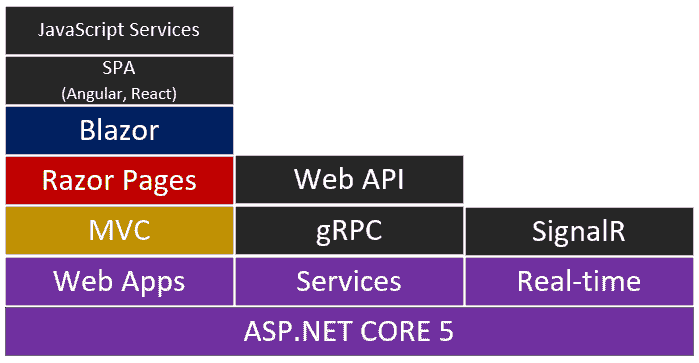

图 4.1–ASP.NET Core 技术堆栈

在上图中，您可以看到 ASP.NET Core 提供了大多数可以与应用集成的通用功能。这使您可以灵活地选择在构建应用时要使用的任何框架和服务。事实上，您甚至可以组合这些框架中的任何一个来生成功能强大的应用。请记住，我们不会在本章中涵盖前一张图中显示的所有技术。

在本章中，我们将主要关注**Web 应用**堆栈，通过查看在 ASP.NET Core 中构建 Web 应用时可以选择的几种 Web 框架风格。我们将通过一些实际的编码练习来介绍 MVC 和 Razor 页面的基础知识，这样您就可以了解它们的工作原理并理解它们的差异。

以下是我们将在本章中讨论的主要主题列表：

*   了解 Razor 视图引擎
*   学习 Razor 语法的基础知识
*   用 MVC 构建待办应用
*   使用 Razor 页面构建待办应用
*   MVC 和 Razor 页面之间的差异

在本章结束时，您应该了解 Razor 视图引擎的基本原理及其语法，并了解如何使用 ASP.NET Core 附带的两个流行 web 框架构建一个基本的、交互式的、数据驱动的 web 应用。然后，您应该能够权衡它们的优缺点，并决定哪种 web 框架最适合您。最后，您将了解在构建真实的 ASP.NET Core 应用时何时使用每个 web 框架。

# 技术要求

本章使用 Visual Studio 2019 演示各种示例，但如果您使用的是 Visual Studio 代码，则过程应该是相同的。

在[查看本章的源代码 https://github.com/PacktPublishing/ASP.NET-Core-5-for-Beginners/tree/master/Chapter%2004/Chapter_04_RazorViewEngine_Examples](https://github.com/PacktPublishing/ASP.NET-Core-5-for-Beginners/tree/master/Chapter%2004/Chapter_04_RazorViewEngine_Examples) 。

在深入阅读本章之前，请确保您对 ASP.NET Core 和 C#有基本的了解，并了解它们是如何分别工作以及如何一起工作的。虽然这不是必需的，但掌握 HTML 和 CSS 的基本知识有助于您轻松理解页面的构造方式。

请访问以下链接查看 CiA 视频：[https://bit.ly/3qDiqYY](https://bit.ly/3qDiqYY)

如果你准备好了，我们就开始吧。

# 了解 Razor view 引擎

在我们深入探讨 ASP.NET Core 环境下的 Razor 视图引擎之前，让我们先谈谈 ASP.NET 中各种视图引擎的历史。

以前版本的 ASP.NET 框架有自己的视图/标记引擎，用于呈现动态 web 页面。回到过去，**活动服务器页面**（经典 ASP）使用`.ASP`文件扩展名。ASP.NET Web 表单，通常称为**Web 表单视图引擎**，使用`.ASPX`文件扩展名。这些文件类型是包含服务器端代码（如 VBScript、VB.NET 或 C#）的标记引擎，这些代码由 web 服务器（IIS）处理以在浏览器中输出 HTML。几年后，在 ASP.NET Web 窗体变得流行之后，Microsoft 引入了 ASP.NET MVC 1.0 作为一种新的替代 Web 框架，用于在完整的.NET 框架中构建动态 Web 应用。将 MVC 引入.NET 为更广泛的开发人员打开了大门，因为它重视关注点的清晰分离和友好的 URL 路由，允许更深入的可扩展性，并遵循真实的 web 开发经验。

尽管早期版本的 MVC 解决了大多数 Web 表单的缺点，但它们仍然使用基于`.ASPX`的标记引擎来提供页面。许多人对 MVC 中的`.ASPX`标记引擎的集成并不满意，因为它太复杂，无法与 UI 一起工作。由于其处理开销，可能会影响应用的整体性能。当微软在 2011 年 1 月初发布 ASP.NET MVC 3.0 时，**Razor 视图引擎**作为一个新的视图引擎，在增强 ASP.NET MVC 视图的基础上诞生了。ASP.NET 完整.NET 框架中的 Razor 视图引擎支持 VB.NET（`.vbhtml`）和 C#（`.cshtml`）作为服务器端语言。

当 ASP.NET Core 被引入时，很多事情都发生了改进。由于该框架被重新设计为模块化、统一和跨平台，整个.NET 框架中的许多特性和功能都被中断，例如 Web 窗体和 VB.NET 支持。由于这些更改，Razor 视图引擎也放弃了对`.vbhtml`文件扩展名的支持，只支持 C#代码。

现在，您已经了解了不同 ASP.NET web 框架中各种视图引擎的一些背景知识，让我们进入下一节。在这里，您将更好地理解为什么 ASP.NET 团队决定使用**Razor 视图引擎**作为默认标记引擎来支持所有 ASP.NET Core web 框架。

## 查看 Razor view 引擎

随着 ASP.NET Core 框架的发展，ASP.NET Core 团队一直在努力提供一个更好的视图引擎，它提供了很多好处和生产力。新的 Razor 视图引擎是所有 ASP.NET Core web 框架的默认视图引擎，它经过优化，使用以代码为中心的模板方法为我们提供了更快的 HTML 生成速度。

**Razor 视图引擎**通常被称为**Razor**，是一种基于 C#的模板标记语法，用于生成包含动态内容的 HTML。视图引擎不仅支持 ASP.NET Core MVC，还支持所有其他 ASP.NET Core web 框架来生成动态页面（如图 4.2 所示）。


图 4.2–Razor 视图引擎

在上图中，我们可以看到，**Blazor**、**Razor 页面**和**MVC**web 框架依赖 Razor 视图引擎生成内容页面和组件。Blazor 与 MVC 和 Razor Pages 稍有不同，因为它是一个**单页应用**（**SPA**）web 框架，使用基于组件的方法。Blazor 组件是使用`.razor`扩展名的文件，它仍然在引擎盖下使用 Razor 引擎。内容页通常被称为**UI**，只是具有`.cshtml`扩展名的 Razor 文件。Razor 文件主要由 HTML 和 Razor 语法组成，这使您能够在内容本身中嵌入 C#代码。因此，如果您请求一个页面，C 代码将在服务器上执行。然后，它处理所需的任何逻辑，从某处获取数据，然后将生成的数据以及组成页面的 HTML 返回到浏览器。

能够使用相同的模板语法来构建 UI 使您能够轻松地从一个 web 框架过渡到另一个 web 框架，而不需要太多的学习曲线。事实上，您可以组合任何 web 框架来构建 web 应用。但是，不建议这样做，因为事情可能会变得混乱，并且可能会导致应用代码难以维护。但有一个例外，即如果您要将整个应用从一个 web 框架迁移到另一个 web 框架，并且希望开始替换应用的某些部分以使用其他 web 框架；然后，将它们结合起来是很有意义的。

Razor 提供了很多好处，包括：

*   **易学**：只要你知道基本的 HTML 和一点 C#，那么学习 Razor 就很容易而且很有趣。Razor 的设计目的是让 C#开发人员在为其 ASP.NET Core 应用构建 UI 时能够充分利用他们的技能并提高生产效率。
*   **干净流畅**：Razor 设计紧凑简单，无需编写大量代码。与其他视图模板引擎不同，您需要在 HTML 中指定特定区域来表示服务器端代码块，Razor 引擎足够智能，可以检测 HTML 中的服务器代码，这使您能够编写干净且更易于管理的代码。
*   **编辑不可知论**：Razor 与 Visual Studio 这样的特定编辑无关。这使您能够在任何文本编辑器中编写代码，以提高生产率。
*   **IntelliSense 支持**：虽然您可以在任何文本编辑器中编写基于 Razor 的代码，但由于内置了语句完成支持，使用 Visual Studio 可以进一步提高您的工作效率。
*   **易于单元测试**：基于 Razor 的页面/视图支持单元测试。

在 ASP.NET Core 中构建动态和交互式页面时，了解 Razor 视图引擎的工作原理非常重要。在下一节中，我们将讨论 Razor 的一些基本语法。

# 学习 Razor 语法基础

与其他模板化视图引擎相比，Razor 的优点在于，它最大限度地减少了构建视图或内容页时所需的代码。这使得在编写 UI 时，可以使用干净、快速、流畅的编码工作流来提高生产率。

要将 C 代码嵌入 Razor 文件（`.cshtml`，您需要告诉引擎您正在使用`@`符号注入服务器端代码块。通常，您的 C 代码块必须出现在`@{…}`表达式中。这意味着，只要您键入`@`，引擎就会足够智能，知道您正在开始编写 C#代码。在开始`{`符号之后的所有内容都假定为服务器端代码，直到它到达匹配的结束块`}`符号。

让我们看一些示例，以便更好地理解 Razor 语法基础。

## 呈现简单数据

在默认模板生成的典型 ASP.NET Core MVCweb 应用中，您将在主页的`Index.cshtml`文件中看到以下代码：

```cs
@{
    ViewData[“Title”] = “Home Page”;
}
```

前面的代码是称为**剃刀代码块**。Razor 代码块通常以`@`符号开头，并用大括号`{}`括起。在前面的示例中，您将看到该行以`@`符号开头，它告诉 Razor 引擎您将要嵌入一些服务器代码。开放大括号和闭合大括号内的代码被假定为 C#代码。块中的代码将在服务器上计算和执行，允许您访问值并在视图中引用它。此示例与在`Controller`类中设置变量相同。

下面是创建一个新的`ViewData`变量并在`HomeController`类的`Index()`方法中为其赋值的另一个示例，如下代码块所示：

```cs
public IActionResult Index()
{
    ViewData[“Message”] = “Razor is Awesome!”;
    return View();
}
```

在前面的示例中，我们将`ViewData[“Message”]`值设置为`“Razor is Awesome!”`。`ViewData`不过是一本对象字典，可以通过`string`作为键访问。现在，让我们通过添加以下代码来显示每个`ViewData`对象的值：

```cs
<h1>@ViewData[“Title”]</h1>
<h2>@ViewData[“Message”]</h2>
```

前面的代码是**隐式 Razor 表达式**的示例。这些表达式通常以`@`符号开头，然后后跟 C#代码。与**Razor 代码块**不同，Razor 表达式代码呈现在浏览器中。

在前面的代码中，引用了`ViewData[“Title”]`和`ViewData[“Message”]`的值，然后将它们包含在`<h1>`和`<h2>`HTML 标记中。任何变量的值都与 HTML 一起呈现。图 4.3 显示了我们刚才所做工作的示例输出。

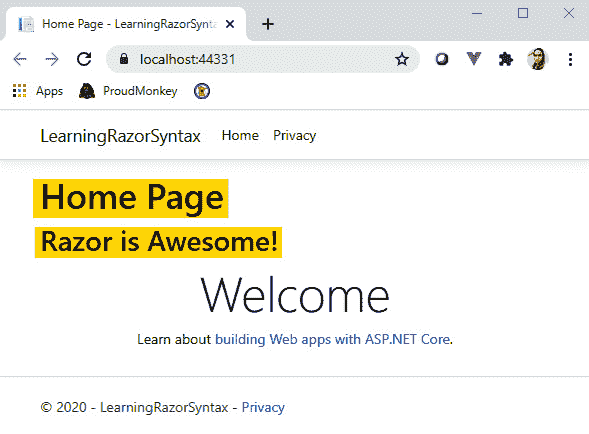

图 4.3–隐式 Razor 表达式输出

在前面的屏幕截图中，我们可以看到`ViewData`中的每个值都打印在页面上。这就是 Razor 的意义所在；它使您能够使用简化的语法将 HTML 与服务器端代码混合使用。

上一示例中描述的**Razor 隐式表达式**通常不应包含空格，但使用 C#`await`关键字除外：

```cs
<p>@await SomeService.GetSomethingAsync()</p>
```

前面代码中的`await`关键字表示通过调用`SomeService`类的`GetSomethingAsync()`方法对服务器进行异步调用。Razor 允许您使用**视图注入**将服务器端方法注入内容页面。有关**依赖注入**的更多信息，请查阅[*第三章*](03.html#_idTextAnchor063)、*依赖注入*。

隐式表达式也不允许使用 C#泛型，如下代码所示：

```cs
<p>@SomeGenericMethod<T>()</p>
```

前面的代码无法工作并且会抛出错误的原因是，`<>`括号内的数据类型`T`被解析为 HTML 标记。要在 Razor 中使用泛型，您需要使用**Razor 代码块**或**显式表达式**，就像下面的代码一样：

```cs
<p>@(SomeGenericMethod<T>())</p> 
```

**Razor 显式表达式**以`@`符号开头，带平衡匹配括号。下面是显示从昨天开始的日期的显式表达式示例：

```cs
<p>@((DateTime.Now - TimeSpan.FromDays(1)).	 	    	      	    ToShortDateString())</p>
```

前面的代码获取昨天的日期，并使用`ToShortDateString()`扩展方法将值转换为短日期格式。Razor 将处理`@()`表达式中的代码，并将结果呈现给页面。

Razor 将忽略文本之间包含`@`符号的任何内容。例如，Razor 解析不会触及以下行：

```cs
<a href=”mailto:user@email.com”>user@email.com</a>
```

显式表达式对于字符串连接也很有用。例如，如果要将静态文本与动态数据结合起来并进行渲染，可以执行以下操作：

```cs
<p>Time@(DateTime.Now.Hour) AM</p>
```

前面的代码将呈现类似于`<p>Time@10 AM</p>`的内容。如果不使用显式的`@()`表达式，代码将改为`<p>Time@DateTime.Now.Hour AM</p>`。Razor 会将其评估为与电子邮件地址类似的纯文本。

如果您想显示在文本前包含一个`@`符号的静态内容，那么您可以简单地附加另一个`@`符号来转义它。例如，如果我们想在页面上显示文本`@vmsdurano`，那么您可以简单地执行以下操作：

```cs
<p>@@vmsdurano</p>
```

现在您已经了解了 Razor 的基本语法是如何工作的，让我们进入下一节，看看一些高级示例。

## 从视图模型渲染数据

在大多数情况下，当使用真实的应用时，您通常会处理真实数据以在页面上显示动态内容。这些数据通常来自`ViewModel`，其中包含一些与您感兴趣的内容相关的信息。

在本节中，我们将了解如何使用 Razor 语法在页面上显示来自服务器的数据。让我们首先在 MVC 应用的`Models`文件夹中创建以下类：

```cs
public class BeerModel
{
    public int Id { get; set; }
    public string Name { get; set; }
    public string Type { get; set; }
}
```

前面的代码只是一个表示`ViewModel`的普通类。在本例中，`ViewModel`被称为`BeerModel`，其中包含视图所期望的一些属性。接下来，我们将创建一个新类来填充视图模型。新类的外观如下所示：

```cs
public class Beer
{
    public List<BeerModel> GetAllBeer()
    {
        return new List<BeerModel>
        {
            new BeerModel { Id =1, Name=”Redhorse”, 	 	 	                Type=”Lager” },
            new BeerModel { Id =2, Name=”Furious”, Type=”IPA” 	            },
            new BeerModel { Id =3, Name=”Guinness”, 	 	  	                Type=”Stout” },
            new BeerModel { Id =4, Name=”Sierra”, Type=”Ale” },
            new BeerModel { Id =5, Name=”Stella”, 	 	  	                Type=”Pilsner” },
        };
    }
}
```

前面的代码只是一个表示模型的普通类。此类包含一个`GetAllBeer()`方法，该方法负责返回列表中的所有项目。在本例中，我们返回一个`List<BeerModel>`类型。根据您的数据存储和使用的数据访问框架，实现可能会有所不同。您可以从数据库或通过 API 调用提取数据。然而，在这个例子中，为了简单起见，我们只返回一个静态数据列表。

您可以将`ViewModel`视为占位符，用于保存仅视图需要的属性。另一方面，`Model`是一个实现应用的域逻辑的类。通常，检索这些类并将数据存储在数据库中。我们将在本章后面讨论这些概念。

现在我们已经对一些样本数据进行了建模，让我们修改`HomeController`类的`Index()`方法，使其看起来像这样：

```cs
public IActionResult Index()
{
    var beer = new Beer();
    var listOfBeers = beer.GetAllBeer();
    return View(listOfBeers);
}
```

前面的代码初始化`Beer`类的一个实例，然后调用`GetAllBeer()`方法。然后，我们将结果设置为一个名为`listOfBeers`的变量，然后将其作为参数传递给视图以返回响应。

现在，让我们看看如何在页面上显示结果。继续并切换回位于`Views/Home`文件夹中的`Index.cshtml`文件。

要从视图模型访问数据，我们需要做的第一件事是使用`@model`指令声明一个类引用：

```cs
@model IEnumerable<Chapter_04_LearningRazorSyntax.Models. 	 	    BeerModel>
```

前面的代码将对视图模型的引用声明为一种类型`IEnumerable<BeerMode>`，这使视图成为强类型视图。`@model`指令是**保留关键字**之一。此特定指令使您能够指定要在视图或页面中传递的类的类型。Razor 指令也通过使用`@`符号，后跟指令名称或 Razor 保留关键字，表示为*隐式表达式*。

现在，我们可以访问前面创建的视图模型。因为我们将视图模型声明为可枚举的，所以您可以轻松地迭代集合中的每个项，并以您想要的方式呈现数据。下面是一个仅显示`BeerModel`类的`Name`属性的示例：

```cs
<h1>My favorite beers are:</h1>
<ul>
    @foreach (var item in Model)
    {
        <li>@item.Name</li>
    }
</ul>
```

在前面的代码中，我们使用了`<ul>`HTML 标记以项目符号列表格式显示数据。在`<ul>`标记中，您应该注意到，我们已经使用`@`符号开始在 C#代码中操作数据。`foreach`关键字是**C#保留关键字**之一，用于迭代集合中的数据。在`foreach`块中，我们构建了要在`<li>`标签中显示的项目。在这种情况下，使用*隐式表达式*呈现`Name`属性。

请注意，在 HTML 中嵌入 C#逻辑是多么流畅和容易。它的工作方式是 Razor 将在表达式中查找任何 HTML 标记。如果它看到一个，它会跳出 C 代码，只有在看到匹配的结束标记时才会跳回。

以下是在浏览器中渲染时的输出：


图 4.4–隐式 Razor 表达式输出

前面只是一个示例，说明了如何轻松地在页面上显示格式化的数据列表。如果要根据某些条件筛选列表，可以执行以下操作：

```cs
<ul>
    @foreach (var item in Model)
    {
        if (item.Id == 2)
        {
            <li>@item.Name</li>
        }
    }
</ul>
```

在前面的代码中，我们在`foreach`循环中使用了 C#`if-statement`来只过滤我们需要的项目。在本例中，我们检查了`Id`属性是否等于`2`，然后构造了一个`<li>`元素来显示满足条件时的值。

根据您的要求，在页面上显示信息的方式有很多种。在大多数情况下，您可能需要提供一个复杂的 UI 来显示信息。在这种情况下，HTML 和标记帮助程序就可以发挥作用。

## HTML 帮助程序和标记帮助程序介绍

在**标记助手**被引入之前，**HTML 助手**被用于在 Razor 文件中呈现动态 HTML 内容。通常，您会在 MVC 应用视图中找到与此类似的代码：

```cs
<h1>List of beers:</h1>
<table class=”table”>
    <thead>
        <tr>
            <th>
                @Html.DisplayNameFor(model => model.Id)
            </th>
            @* Removed other headers for brevity *@
        </tr>
    </thead>
    <tbody>
        @foreach (var item in Model)
        {
            <tr>
                <td>
                    @Html.DisplayFor(modelItem => item.Id)
                </td>
                @* Removed other rows for brevity *@
            </tr>
        }
    </tbody>
</table>
```

前面的代码使用`<table>`标记以表格形式呈现数据。在`<thead>`部分中，我们使用`DisplayNameFor`HTML 帮助程序显示视图模型中的每个属性名称。然后，我们使用 C#`foreach`迭代器对`<tbody>`部分中的每个项目进行迭代。这与我们在前面的示例中所做的几乎相同。现在的区别是，我们已经构建了以表格格式显示的数据。

`<tr>`元素表示行，`<td>`元素表示列。在每一列中，我们都使用了`DisplayFor`HTML 助手在浏览器中显示实际数据。请记住，`DisplayFor`助手在呈现时不会生成任何 HTML 标记；相反，它将仅以纯文本显示值。所以，只有当你有理由使用`DisplayFor`时才使用它。理想情况下，上述代码中的`foreach`块可以替换为以下代码：

```cs
<tbody>
    @foreach (var item in Model)
    {
        <tr>
            <td>@item.Id</td>
            @* Removed other rows for brevity *@
        </tr>
    }
</tbody>
```

前面的代码比更干净，渲染速度比使用`DisplayFor`HTML 助手快得多。运行代码应该会产生如图 4.5 所示的输出。


图 4.5–HTML 帮助程序输出

虽然其他 HTML 帮助程序在处理集合、复杂对象、模板和其他情况时很有用，但在某些情况下，事情可能会变得很麻烦，特别是在处理 UI 自定义时。例如，如果我们想对 HTML 助手生成的元素应用一些 CSS 样式，那么我们必须使用重载方法，而不需要任何 IntelliSense 帮助。下面是一个简单的例子：

```cs
<h1>My most favorite beer:</h1>
@{ var first = Model.FirstOrDefault(); }
@* Removed other line for brevity *@
@Html.LabelFor(model => first.Name, new { @class = “font-weight-bold” })
: @first.Name
@* Removed other line for brevity *@
```

前面的代码使用`LabelFor`HTML 助手显示信息。在本例中，我们仅使用 LINQ`FirstOrDefault`扩展方法显示`ViewModel`集合中的第一个项集。`LabelFor`方法中的第二个参数表示`htmlAttributes`参数，在该参数中，我们被迫传递一个匿名对象来设置 CSS 类。在本例中，我们将 CSS 类属性应用于 label 元素的`font-weight-bold`。这是因为`class`关键字是 C#中的*保留关键字*，因此我们需要告诉 Razor 使用前面的`@`符号将`@class=expression`作为元素属性进行求值。这种情况使得页面变得越来越大，维护起来有点困难，阅读起来也不太友好，特别是对于不熟悉 C#的前端开发人员。为了解决这个问题，我们可以使用**标签助手**。

ASP.NET Core 提供了一系列内置的**标记帮助程序**，在 Razor 标记中创建和呈现 HTML 元素时，您可以使用它们来帮助提高工作效率。与作为 C#方法调用的**HTML 帮助程序**不同，**标记帮助程序**直接附加到 HTML 元素。这使得标记助手对前端开发人员的使用更加友好和有趣，因为他们可以完全控制 HTML。

虽然**标签助手**是一个需要涵盖的庞大主题，但我们将尝试看一个常见的示例，让您了解它们的用途和好处。

回到前面的示例，我们可以使用以下代码使用**标记帮助程序**重写代码：

```cs
<h1>My most favorite beer:</h1>
@* Removed other line for brevity *@
<label asp-for=”@first.Name” class=”font-weight-bold”></label>
: @first.Name
@* Removed other line for brevity *@
```

在前面的代码中，请注意，我们现在使用了一个标准的`<label>`HTML 标记，并使用`asp-for`标记助手来显示`ViewModel`中的`Name`属性。请注意，结束标记是必需的。如果使用自动关闭标记，例如`<label asp-for=”@first.Id” />`，则不会呈现该值。

如果您想更改要在 HTML 中呈现的属性名称，您可以使用`[Display]`属性。例如，如果我们想显示属性 ID 的值`Beer Id`，我们可以简单地执行如下代码：

```cs
Display(Name = “Beer Id”)]
public int Id { get; set; }
```

我们在前面的代码中所做的被称为**数据注释**。这使您能够定义要应用于模型/视图模型中属性的某些元数据，例如条件、验证、自定义格式等。有关数据注释的更多信息，请参见[https://docs.microsoft.com/en-us/dotnet/api/system.componentmodel.dataannotations](https://docs.microsoft.com/en-us/dotnet/api/system.componentmodel.dataannotations) 。

图 4.6 显示了运行代码时的示例输出。


图 4.6–标记帮助器输出

您可以使用**标记助手**完成许多事情。ASP.NET Core 提供了大多数用于构建页面的常用标记帮助程序，如表单操作、输入控件、路由、验证、组件、脚本和许多其他。事实上，您甚至可以创建自己的或扩展标记帮助程序来定制您的需求。

**标记助手**在生成 HTML 元素时为您提供了很大的灵活性，提供了丰富的 IntelliSense 支持，并提供了 HTML 友好的开发体验，这有助于您在构建 UI 时节省一些开发时间。

有关 ASP.NET Core 中标记帮助程序的更多信息，请参阅[https://docs.microsoft.com/en-us/aspnet/core/mvc/views/tag-helpers](https://docs.microsoft.com/en-us/aspnet/core/mvc/views/tag-helpers) 。

学习**Razor view engine**的基本原理并理解语法的工作原理对于构建任何 ASP.NET Core web 应用至关重要。在以下部分中，我们将通过在各种 web 框架中构建一个待办应用来进行一些实践练习。这是为了让您更好地了解每个 web 框架是如何工作的，并帮助您决定在构建真实的 web 应用时选择哪种方法。

# 用 MVC 构建待办应用

待办事项应用是演示如何在网页上添加和修改信息的一个很好的示例。在构建真实世界、数据驱动的 web 应用时，了解这在 web 的无状态特性中是如何工作的非常有价值。

在我们开始之前，让我们先快速复习一下 MVC，以便您更好地理解它是什么。

## 了解 MVC 模式

为了更好地理解 MVC 模式方法，图 4.7 展示了一种以图形方式描述高级流程的尝试：

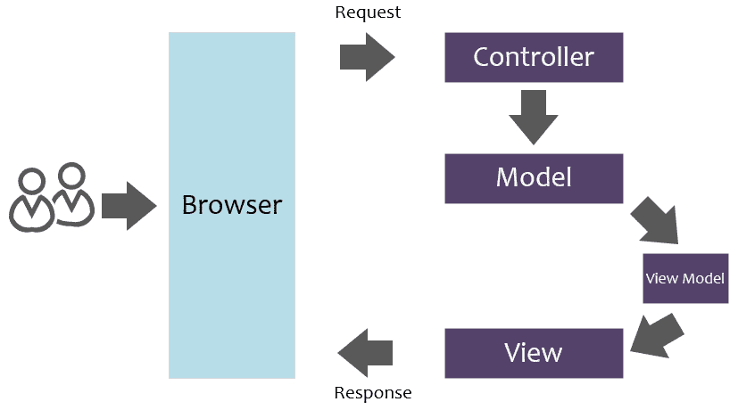

图 4.7–MVC 请求和响应流

通过查看请求流，前面的图表几乎是不言自明的。但为了验证您的理解，简要解释一下过程可能会有所帮助。术语 MVC 表示构成应用的三个组件：**模型**的**M**、视图**视图**的**V**和控制器**的**C**。在上图中，您可以看到控制器是用户在浏览器中请求页面时调用的第一个条目。控制器负责处理任何用户交互和请求，处理完成请求所需的任何逻辑，并最终向用户返回响应。换句话说，控制器协调逻辑流。**

模型是实际实现领域特定逻辑的组件。通常，模型包含实体对象、业务逻辑和检索和存储数据的数据访问代码。请记住，在实际应用中，您应该考虑分离业务逻辑和数据访问层，以评估关注点和单个责任的分离。`ViewModel`只是一个类，其中包含一些仅用于视图的属性。`ViewModel`是可选的，因为从技术上讲，您可以直接将模型返回到视图。事实上，它不是 MVC 术语的一部分。但是，值得将其包含在流程中，因为在构建实际应用时，它非常有用，值得推荐。添加此额外层使您能够仅公开所需的数据，而不是通过模型从实体对象返回所有数据。最后，视图是组成 UI 或页面的组件。通常，视图只是包含 HTML、CSS、JavaScript 和 C#嵌入代码的 Razor 文件（`.cshtml`。

现在您已经对 MVC 的工作原理有了一个概念，让我们从头开始构建一个 web 应用，以应用这些概念并了解框架。

## 创建 MVC 应用

让我们继续启动 Visual Studio 2019，然后选择**创建新项目**框，如图 4.8 所示。


图 4.8–创建新项目

此时会出现**新建项目**对话框。在对话框中选择**Web**作为项目类型，然后找到**ASP.NET Core Web 应用**项目模板，如图 4.9 所示。


图 4.9–创建新的 ASP.NET Core web 应用

要继续，请双击**ASP.NET Core Web 应用**模板或只需单击**下一步**按钮。此时会出现**配置新项目**对话框，如图 4.10 所示。


图 4.10–配置新项目

前面的对话框允许您配置项目名称和创建项目的位置路径。在实际应用中，您应该考虑给项目赋予一个有意义的名称，从而清楚地表明项目的全部内容。在本例中，我们将项目命名为`ToDo.MVC`。现在，点击**创建**，应该会弹出如图 4.11 所示的对话框。

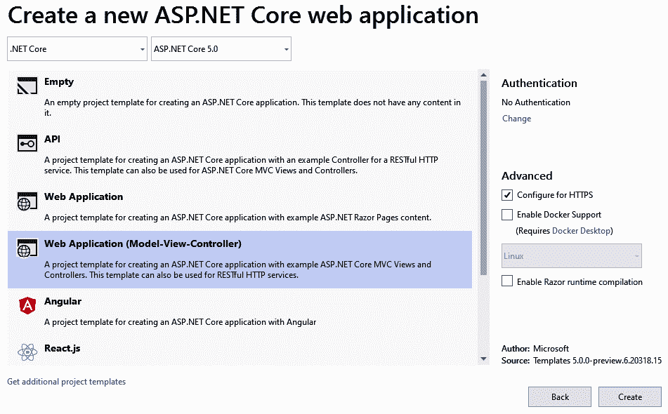

图 4.11–创建新的 MVC 项目

前面的对话框允许您选择要创建的 web 框架类型。对于本例，只需选择**Web 应用（模型视图控制器）**，然后单击**创建**即可让 Visual Studio 为您生成必要的文件。生成的默认文件如图 4.12 所示。


图 4.12–默认 MVC 项目结构

前面的屏幕截图显示了 MVC 应用的默认结构。您会注意到模板会自动生成`Models`、`Views`和`Controllers`文件夹。每个文件夹的名称对于应用的运行来说并不重要，但建议使用符合 MVC 模式的文件夹名称，这是一种良好的做法。在 MVC 应用中，功能分为多个功能。这意味着表示 MVC 的每个文件夹将包含其自己的专用逻辑函数。`Models`包含数据和验证；`Views`包含用于显示数据的 UI 相关元素，`Controllers`包含处理任何用户交互的操作。

如果您已经知道 ASP.NET Core 项目结构的重大变化，那么您可以跳过这一部分，但是如果您是 ASP.NET Core 的新手，那么有必要介绍一些生成的核心文件，以便更好地了解它们的用途。以下是除 MVC 文件夹外的核心文件的剖析：

*   `Connected Services`：允许您连接到应用所依赖的服务，如 Application Insights、Azure Storage、mobile 和其他 ASP.NET Core 服务，而无需手动配置它们的连接和配置。
*   `Dependencies`：这是项目依赖项所在的位置，例如应用所需的 NuGet 包、外部程序集、SDK 和框架依赖项。
*   `Properties`：此文件夹包含`launchSettings.json`文件，您可以在其中定义用于运行应用的应用变量和配置文件。
*   `wwwroot`：此文件夹包含您的所有静态文件，这些文件将直接提供给客户端，包括 HTML、CSS、图像和 JavaScript 文件。
*   `appsettings.json`：这是您配置应用特定设置的地方。请记住，不应将敏感数据添加到此文件中。你应该考虑将秘密和敏感信息存储在仓库或秘密管理器中。
*   `Program.cs`：此文件是应用的主要入口点。这是您为应用构建主机的地方。默认情况下，ASP.NET Core 应用构建一个通用主机，封装运行应用所需的所有框架服务。
*   `Startup.cs`：此文件是任何.NET 应用的核心。这是您配置应用所需的服务和依赖项的地方。

## 首次运行应用

让我们尝试构建并运行默认生成的模板，以确保一切正常。继续并按*Ctrl*+*F5*键盘键，或者只需单击 Visual Studio 菜单工具栏上的播放按钮，如图 4.13 所示。

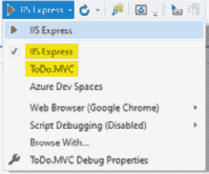

图 4.13–运行应用

在前面的屏幕截图中，您将看到默认模板从 Visual Studio 内部自动配置两个 web 服务器配置文件，用于在`localhost`中运行应用：**IIS Express**和**ToDo.MVC**。使用的默认配置文件是 IIS Express，ToDo.MVC 配置文件在 Kestrel web 服务器上运行。通过查看`launchSettings.json`文件，您可以看到这是如何配置的。有关配置 ASP.NET Core 环境的更多信息，请参阅[https://docs.microsoft.com/en-us/aspnet/core/fundamentals/environments](https://docs.microsoft.com/en-us/aspnet/core/fundamentals/environments) 。

VisualStudio 将编译、构建并自动应用您为应用中的每个概要文件设置的任何配置。如果一切都成功构建，那么您应该看到如图 4.14 所示的输出。

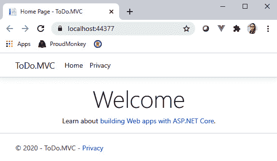

图 4.14–首次运行输出

凉的现在，让我们继续下一步。

## 配置内存数据库

ASP.NET Core 的一个重要特性是，它允许您在内存中创建数据库。这使您能够轻松创建数据驱动的应用，而无需启动真正的服务器来存储数据。话虽如此，我们将在与**实体框架**（**EF**核心）的配合下利用这一功能，以便我们可以处理数据，并在不再需要时进行处理。

[*第 7 章*](07.html#_idTextAnchor149)、*API 和数据访问*将介绍如何使用真实数据库，因为它主要关注 API 和数据访问。现在，让我们仅将内存中的工作数据库用于此演示应用的唯一目的。

### 安装 EF 核心

我们需要做的第一件事是添加`Microsoft.EntityFrameworkCore`和`Microsoft.EntityFrameworkCore.InMemory`NuGet 包作为项目引用，这样我们就能够使用 EF 作为我们的数据访问机制来查询内存数据存储中的数据。要执行此操作，请导航到 Visual Studio 菜单，然后转到**工具****NuGet Package Manager****Package Manager 控制台**。在 console 窗口中，通过运行以下命令安装每个软件包：

```cs
Install-Package Microsoft.EntityFrameworkCore -Version 5.0.0
Install-Package Microsoft.EntityFrameworkCore.InMemory -Version 5.0.0
```

前面代码中的每个命令都将提取应用所需的所有依赖项。

笔记

截至本文撰写时，`Microsoft.EntityFrameworkCore`的最新官方版本为`5.0.0`。将来的版本可能会更改，并可能影响本章中演示的示例代码。因此，在决定升级到新版本时，请确保始终检查是否有任何中断性更改。

在项目中安装 NuGet 依赖项的另一种方法是使用**Manage NuGet Packages for Solution…**选项，或者只需右键单击项目的**dependencies**文件夹，然后选择**Manage NuGet Packages…**选项。这两个选项都提供了一个 UI，您可以在其中轻松搜索和管理项目依赖关系。

成功安装两个包后，请确保检查您的项目**依赖项**文件夹，并验证它们是否已添加，如图 4.15 所示。


图 4.15–NuGet 包依赖关系

现在我们有了 EF 核心，让我们继续下一步。

### 创建视图模型

接下来，我们需要创建一个模型，该模型将包含我们的待办事项页面所需的一些属性。让我们继续在`Models`文件夹中创建一个名为`Todo`的新类，然后复制以下代码：

```cs
namespace ToDo.MVC.Models
{
    public class Todo
    {
        public int Id { get; set; }
        public string TaskName { get; set; }
        public bool IsComplete { get; set; }
    }
}
```

前面的代码只不过是一个包含一些属性的普通类。

### 定义 DbContext

**EF Core**要求我们查询数据存储。这通常是通过创建一个继承自`DbContext`类的类来完成的。现在，让我们将另一个类添加到`Models`文件夹中。将类别命名为`TodoDbContext`，然后复制以下代码：

```cs
using Microsoft.EntityFrameworkCore;
namespace ToDo.MVC.Models
{
    public class TodoDbContext: DbContext
    {
        public TodoDbContext(DbContextOptions<TodoDbContext> 	            options)
        : base(options) { }
        public DbSet<Todo> Todos { get; set; }
    }
}
```

前面的代码定义了`DbContext`和将`Model`公开为`DbSet`的单个实体。`DbContext`需要`DbContextOptions`的实例。然后，我们可以重写`OnConfiguring()`方法来实现我们自己的代码，或者只将`DbContextOptions`传递给`DbContext`基构造函数，就像我们在前面的代码中所做的那样。

### 在内存中植入测试数据

现在，由于我们没有实际的数据库来提取一些数据，我们需要创建一个助手函数，在应用启动时初始化一些数据。让我们继续在`Models`文件夹中创建一个名为`TodoDbSeeder`的新类，然后复制以下代码：

```cs
public class TodoDbSeeder
{
    public static void Seed(IServiceProvider serviceProvider)
    {
        using var context = new TodoDbContext(serviceProvider.	        GetRequiredService<DbContextOptions<TodoDbContext>>());
        // Look for any todos.
        if (context.Todos.Any())
        {
            //if we get here then the data already seeded
            return;
        }
        context.Todos.AddRange(
            new Todo
            {
                Id = 1,
                TaskName = “Work on book chapter”,
                IsComplete = false
            },
            new Todo
            {
                Id = 2,
                TaskName = “Create video content”,
                IsComplete = false
            }
        );
        context.SaveChanges();
    }
}
```

前面的代码从`IServiceCollection`中查找`TodoDbContext`服务并创建其实例。该方法负责在应用启动时生成两个测试`Todo`项。这是通过将数据添加到`TodoDbContext`的`Todos`实体来完成的。

现在，我们有了`DbContext`可以访问`Todo`项，还有一个将生成一些数据的助手类。我们接下来需要做的是将它们连接到`Startup.cs`和`Program.cs`文件中，以填充数据。

### 修改启动类

我们将`Startup`类的`ConfigureServices()`方法更新为以下代码：

```cs
public void ConfigureServices(IServiceCollection services)
{
    services.AddDbContext<TodoDbContext>(options => options.	        UseInMemoryDatabase(“Todos”));
    services.AddControllersWithViews();
}
```

前面的代码将`TodoDbContext`注册到`IServiceCollection`中，并定义了一个名为`Todos`的内存数据库。我们需要这样做，以便我们可以通过**依赖项注入**引用`Controller`类中的`DbContext`实例或应用中代码的任何地方。

现在，让我们通过调用 seeder helper 函数来生成测试数据，从而进入下一步。

### 修改程序类

更新`Program.cs`文件的`Main()`方法，使其看起来类似于以下代码：

```cs
public static void Main(string[] args)
{
    var host = CreateHostBuilder(args).Build();
    using (var scope = host.Services.CreateScope())
    {
        var services = scope.ServiceProvider;
        TodoDbSeeder.Seed(services);
    }
    host.Run();
}
```

前面的代码在`Host`生存期内创建一个作用域，并查找可从`Host`获得的服务提供者。最后，我们调用`TodoDbSeeder`类的`Seed()`方法，并将服务提供者作为参数传递给该方法。

此时，当应用启动并准备在应用中使用时，测试数据应该加载到内存“数据库”中。

## 创建待办事项控制器

现在，让我们为我们的`Todo`页面创建一个新`Controller`类。继续导航到`Controllers`文件夹并创建一个名为`TodoController`的新**MVC 控制器空**类。替换默认生成的代码，使其看起来类似于以下代码：

```cs
public class TodoController : Controller
{
    private readonly TodoDbContext _dbContext;
    public TodoController(TodoDbContext dbContext)
    {
        _dbContext = dbContext;
    }
    [HttpGet]
    public IActionResult Index()
    {
        var todos = _dbContext.Todos.ToList();
        return View(todos);
    }
}
```

前面的代码首先定义了`TodoDbContext`的`private`和`read-only`字段。下一行代码定义了`constructor`类，使用**构造函数注入**方法初始化依赖对象。在这种情况下，`TodoController`类中的任何方法都将能够访问`TodoDbContext`的实例，并可以调用其所有可用的方法和属性。有关依赖注入的更多信息，请查看[*第 3 章*](03.html#_idTextAnchor063)、*依赖注入*。

`Index()`方法负责将内存数据存储中的所有`Todo`项返回到视图。您可以看到，该方法已使用`[HttpGet]`属性修饰，这表示该方法只能在 HTTP`GET`请求中调用。

现在，我们已经配置了`TodoController`，让我们进入下一步，创建用于显示页面上所有项目的视图。

## 创建视图

在创建视图之前，请确保首先构建应用以验证任何编译错误。成功构建后，右键单击**索引（）**方法，然后选择**添加视图…**。在窗口对话框中，选择**Razor View**，它将弹出如图 4.16 所示的对话框。

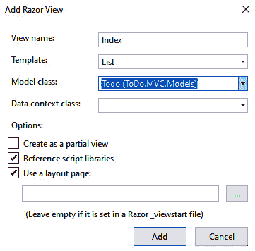

图 4.16–添加新视图

在前面的对话框中，为**模板**选择**列表**，为**模型类**选择**Todo（Todo.MVC.Models）**。最后点击**添加**生成视图（如图 4.17 所示）。


图 4.17–生成的视图

在前面的屏幕截图中，请注意脚手架引擎以符合 MVC 模式的方式自动创建视图。在本例中，`Index.cshtml`文件是在`Todo`文件夹下创建的。

笔记

如果愿意，您可以手动添加视图文件。但是，使用脚手架模板生成与控制器操作方法匹配的简单视图要方便得多。

现在我们已经将模型、控制器和视图连接在一起，让我们运行应用以查看结果。

## 运行待办事项应用

按*Ctrl*+*F5*键在浏览器中启动应用，然后将`/todo`追加到 URL。您应该被重定向到待办事项页面，并显示如图 4.18 所示的输出。

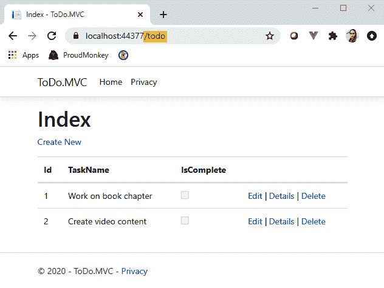

图 4.18–待办事项列表页面

请注意，在前面的屏幕截图中，已经显示了我们之前配置的测试数据，并且脚手架模板基于`ViewModel`自动构建 HTML 标记。这非常方便，在应用中创建简单页面时，肯定可以节省一些开发时间。

要了解 MVC 路由是如何工作的以及它是如何配置的，只需导航到`Startup`类。您应该在`Configure()`方法中找到以下代码：

```cs
app.UseEndpoints(endpoints =>
{
    endpoints.MapControllerRoute(
        name: “default”,
        pattern: “{controller=Home}/{action=Index}/{id?}”);
});
```

前面的代码使用`UseEndpoints()`中间件为应用配置默认路由模式。默认模式设置一个值`Home`作为默认控制器，`Index`作为默认`Action`值，`id`作为任何路由的可选参数保持器。换句话说，`/home/index`路径是应用启动时的默认路径。MVC 模式遵循这种路由约定，将 URL 路径路由到`Controller`操作中。因此，如果您想为应用配置自定义路由规则，那么这就是您应该关注的中间件。有关 ASP.NET Core 路由的更多信息，请参阅[https://docs.microsoft.com/en-us/aspnet/core/fundamentals/routing](https://docs.microsoft.com/en-us/aspnet/core/fundamentals/routing) 。

此时，我们可以确认我们的待办事项页面已启动并使用测试数据运行。现在，让我们看看如何通过实现一些基本功能来扩展应用，例如添加、编辑和删除项目。

## 实现添加项功能

让我们修改我们的`TodoController`类，并为添加新项功能添加以下代码段：

```cs
[HttpGet]
public IActionResult Create()
{
    return View();
}
[HttpPost]
public IActionResult Create(Todo todo)
{
    var todoId = _dbContext.Todos.Select(x => x.Id).Max() + 1;
    todo.Id = todoId;
    _dbContext.Todos.Add(todo);
    _dbContext.SaveChanges();
    return RedirectToAction(“Index”);
}
```

正如您在前面的代码中所注意到的，有两个方法具有相同的名称。第一个`Create()`方法负责在用户请求页面时返回视图。我们将在下一步中创建此视图。第二个`Create()`方法是一个重载方法，它接受`Todo`视图模型作为参数，负责在内存数据库中创建一个新条目。您可以看到，这个方法已经被`[HttpPost]`属性修饰，这意味着该方法只能被`POST`请求调用。请记住，我们通过增加数据存储中现有的最大 ID 来手动生成 ID。在使用真实数据库的真实应用中，您可能不需要这样做，因为您可以让数据库自动为您生成 ID。

现在，让我们创建`Create()`方法的相应视图。要创建一个新视图，只需按照与我们对`Index()`方法相同的步骤进行操作，但这次选择**创建**作为脚手架模板。此过程应在`View/Todo`文件夹中生成名为`Create.cshtml`的 Razor 文件。

如果查看生成的视图，`Todo`视图模型的`Id`属性也已生成。这是正常的，因为脚手架模板将根据提供的视图模型生成 Razor 视图。我们不希望在代码中生成`Id`属性时将其包含在视图中。因此，请从视图中删除以下 HTML 标记：

```cs
<div class=”form-group”>
    <label asp-for=”Id” class=”control-label”></label>
    <input asp-for=”Id” class=”form-control” />
    <span asp-validation-for=”Id” class=”text-danger”></span>
</div>
```

现在，再次运行应用并导航到`/todo/create`，您将看到一个类似于图 4.19 的页面。

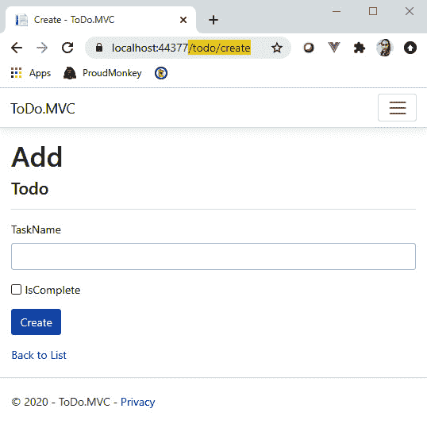

图 4.19–待办事项添加页面

现在，在**任务名**文本框中输入值`Write Tech Blog`，并勾选**IsComplete**复选框。点击**创建**按钮，将向我们的内存数据库添加一个新条目，并将您重定向到**索引**页面，如图 4.20 所示。

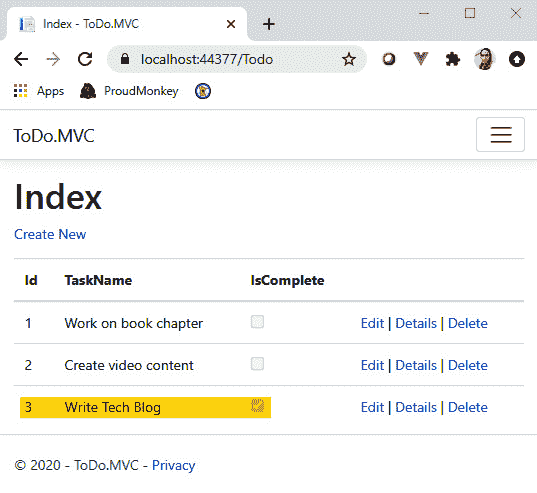

图 4.20–待办事项列表页面

含糖的要添加更多项目，您可以单击列表顶部的**新建**链接，您应该被重定向回创建视图。请记住，为了简单起见，我们在这里没有实现任何输入验证。在实际应用中，您应该考虑使用 MultT3e 数据注释 To4 T4 或 Po.T5。您可以参考以下链接阅读更多关于这些的：

*   [https://docs.microsoft.com/en-us/aspnet/core/mvc/models/validation](https://docs.microsoft.com/en-us/aspnet/core/mvc/models/validation)
*   [https://docs.fluentvalidation.net/en/latest/aspnet.html](https://docs.fluentvalidation.net/en/latest/aspnet.html)

现在，让我们进入下一步。

## 实现编辑功能

切换回到`TodoController`类，并为编辑功能添加以下代码段：

```cs
[HttpGet]
public IActionResult Edit(int id)
{
    var todo = _dbContext.Todos.Find(id);
    return View(todo);
}
[HttpPost]
public IActionResult Edit(Todo todo)
{
    _dbContext.Todos.Update(todo);
    _dbContext.SaveChanges();
    return RedirectToAction(“Index”);
}
```

前面的代码也只有两个操作方法。第一个`Edit()`方法负责根据传递给路由的 ID 填充视图中的字段。第二个`Edit()`方法将在 HTTP`POST`请求期间调用，该请求处理对数据存储的实际更新。

要为`Edit`操作创建相应的视图，只需按照与前面功能相同的步骤进行操作，但这次选择**编辑**作为脚手架模板。此过程应在`View/Todo`文件夹中生成名为`Edit.cshtml`的 Razor 文件。

下一步是更新我们的`Index`视图，以映射编辑和删除操作的路由。继续并将`Action`链接更新为以下内容：

```cs
@Html.ActionLink(“Edit”, “Edit”, new { id = item.Id }) |
@Html.ActionLink(“Delete”, “Delete”, new { id = item.Id })
```

前面的代码定义了两个用于在具有参数的视图之间导航的`ActionLink`HTML 帮助程序。我们在前面的代码中所做的更改是将 ID 作为参数传递给每个路由，并删除 details 链接，因为我们在这里将不介绍这一点。无论如何，实现细节页面应该非常简单。您还可以查看本章的 GitHub 代码库，了解它是如何实现的。

现在，当您运行应用时，您应该能够通过点击**编辑**链接从待办事项`Index`页面导航到`Edit`页面。图 4.21 显示了**编辑**页面的示例屏幕截图。


图 4.21–待办事项编辑页面

在前面的屏幕截图中，请注意，ID 现在包含在路由中，页面将自动填充相应的数据。现在，让我们进入下一步。

实现删除功能

切换回类，并为删除功能添加以下代码段：

```cs
public IActionResult Delete(int? id)
{
    var todo = _dbContext.Todos.Find(id);
    if (todo == null)
    {
        return NotFound();
    }
    return View(todo);
}
[HttpPost]
public IActionResult Delete(int id)
{
    var todo = _dbContext.Todos.Find(id);
    _dbContext.Todos.Remove(todo);
    _dbContext.SaveChanges();
    return RedirectToAction(“Index”);
}
```

前面代码中的第一个`Delete()`方法负责根据 ID 向页面填充相应的数据。如果我们的内存数据存储中不存在 ID，那么我们只返回一个`NotFound()`结果。点击**删除**按钮会触发第二种`Delete()`方式。此方法执行从数据存储中删除项。图 4.22 显示了**删除**页面的示例屏幕截图。


图 4.22–待办事项删除页面

此时，您应该更好地了解 MVC 的工作原理，以及我们如何在页面上轻松实现**创建**、**读取**、**更新**和**删除**（**CRUD**操作。我们可以做很多事情来改进应用，所以花点时间添加缺少的功能作为额外练习。您可以尝试集成模型验证、日志记录或希望在应用中看到的任何功能。您还可以参考以下项目模板，以帮助您加快使用 MVC 与其他技术构建 web 应用的速度：

[https://github.com/proudmonkey/MvcBoilerPlate](https://github.com/proudmonkey/MvcBoilerPlate)

让我们继续到下一节，看看 Razor 页面。

# 使用 Razor 页面构建待办应用

Razor Pages 是另一个 web 框架，用于构建 ASP.NET Core web 应用。它最初是在 ASP.NET Core 2.0 发布时引入的，并成为 ASP.NET Core 的默认 web 应用模板。

## 查看 Razor 页面

为了更好地理解 Razor Pages 方法，图 4.23 提供了描述 HTTP 请求和响应流的流程的高级图表。


图 4.23–Razor 页面请求和响应流程

如果您以前使用过 ASP.NET Web 表单，或者使用过任何以页面为中心的 Web 框架，那么您应该会发现 Razor 页面很熟悉。与 MVC 不同，MVC 在控制器中处理请求，Razor 页面中的路由系统基于将 URL 与物理文件路径匹配。也就是说，所有请求都默认为根文件夹，默认名为`Pages`。

然后，将根据根文件夹中的文件和文件夹路径构建路由集合。例如，如果您有一个位于`Pages/Something/MyPage.cshtml`下的 Razor 文件，那么您可以使用`/something/mypage`路径在浏览器中导航到该页面。Razor 页面中的路由也很灵活，您可以根据需要自定义它。有关 Razor 页面路由的详细参考资料，请参阅以下资源：

[https://www.learnrazorpages.com/razor-pages/routing](https://www.learnrazorpages.com/razor-pages/routing)

Razor 页面仍然使用**Razor 视图引擎**生成 HTML 标记，就像使用 MVC 一样。这两个 web 框架之间的主要区别之一是 Razor 页面不再使用控制器，而是使用单个页面。通常，Razor 页面由两个主要文件组成：一个`.cshtml`文件和一个`.cshtml.cs`文件。`.cshtml`文件是包含 Razor 标记的 Razor 文件，`.cshtml.cs`文件是定义页面功能的类。

为了让您更好地理解 Razor 页面与 MVC 的区别，让我们模拟一下我们之前用 MVC 构建的待办应用。请注意，我们将只讨论本示例中的显著差异，而不讨论诸如配置内存中的数据存储和运行应用以查看输出等常见问题。这是因为过程和实现与 MVC 几乎相同。此练习的源代码可在此处找到：

[https://github.com/PacktPublishing/ASP.NET-Core-5-for-Beginners/tree/master/Chapter%2004/Chapter_04_RazorViewEngine_Examples/ToDo.RazorPages](https://github.com/PacktPublishing/ASP.NET-Core-5-for-Beginners/tree/master/Chapter%2004/Chapter_04_RazorViewEngine_Examples/ToDo.RazorPages)

## 创建 Razor Pages 应用

继续启动 Visual Studio 2019，然后创建一个新项目。这次，从 ASP.NET Core Web 应用项目模板中选择**Web 应用**，如图 4.24 所示。

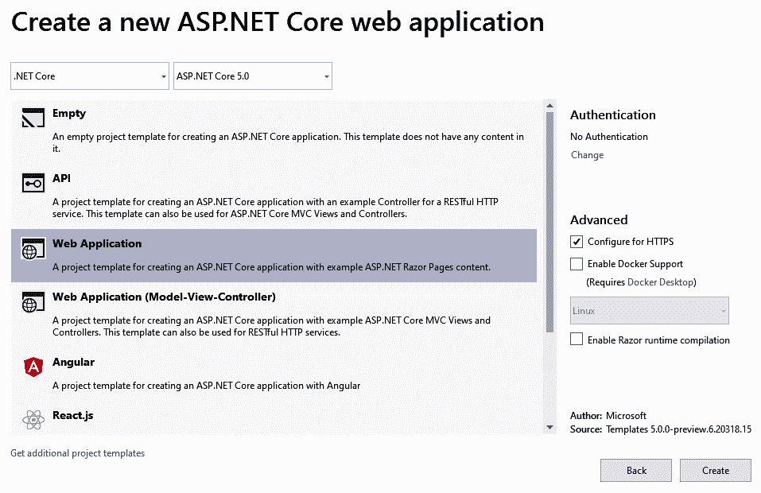

图 4.24–创建新的 Razor Pages web 应用

点击**创建**按钮生成默认文件。图 4.25 显示了 Razor Pages 项目结构的外观。


图 4.25–Razor Pages 项目结构

在前面的截图中，您会立即注意到不再有`Controllers`、`Models`和`Views`文件夹。相反，您只有`Pages`文件夹。Razor Pages 应用使用`Startup`类的`ConfigureServices()`方法中的`AddRazorPages()`服务进行配置：

```cs
public void ConfigureServices(IServiceCollection services)
{
    services.AddRazorPages();
}
```

现在，让我们看一看`Index.cshtml`文件，看看页面结构与 MVC 视图的区别。

## 了解 Razor 页面结构

以下是标记的外观：

```cs
@page
@model IndexModel
@{
    ViewData[“Title”] = “Home page”;
}
<div class=”text-center”>
    <h1 class=”display-4”>Welcome</h1>
</div>
```

我们可以看到，前面的标记与 MVC 视图非常相似，除了两件事：

*   它在文件的最开始使用`@page`指令。此指令告诉 Razor 引擎将页面视为 Razor 页面，以便将任何页面交互正确地路由到正确的处理程序方法。换句话说，`@page`指令表示不应在`Controllers`中处理动作和路由。
*   与 MVC 中的`@model`表示视图中要使用的`ViewModel`或`Model`类不同，Razor 页面中的`@model`指令表示 Razor 文件的“代码隐藏”类的名称。在这种情况下，`Index.cshtml`文件是指`Index.cshtml.cs`文件中定义的`IndexModel`类，如下代码所示：

```cs
public class IndexModel : PageModel
{
    private readonly ILogger<IndexModel> _logger;
    public IndexModel(ILogger<IndexModel> logger)
    {
        _logger = logger;
    }
    public void OnGet() { }
}
```

前面的代码显示了 Razor 页面类结构背后的典型代码。表示页面模型的每个类都应该继承自`PageModel`基类。这个类封装了执行诸如`ModelState`、`HttpContext`、`TempData`、`Routing`等事物所需的几个特性和函数。

## 创建待办事项页面

让我们继续在`Pages`文件夹中创建一个名为`Todos`的新文件夹。我们将从显示待办事项列表的`Index`页面开始。

### 构建索引页

要创建新的 Razor 页面，只需右键单击`Todos`文件夹，然后选择**添加****Razor 页面……**。将页面名称设置为`Index`并点击**添加**按钮。此过程应在`Todos`文件夹中生成`Index.cshtml`（Razor 标记）和`Index.cshtml.cs`（代码隐藏类）文件。

现在，将以下代码段复制到代码隐藏类中：

```cs
public class IndexModel : PageModel
{
    private TodoDbContext _dbContext;
    public IndexModel(TodoDbContext dbContext)
    {
        _dbContext = dbContext;
    }
    public List<Todo> Todos { get; set; }
    public void OnGet()
    {
        Todos = _dbContext.Todos.ToList();
    }
}
```

前面的代码与 MVC 中的`Controllers`代码有些相似，除了以下几点：

*   它现在使用`OnGet()`方法获取数据。`PageModel`公开了一些用于执行请求的处理程序方法，如`OnGet()`、`OnPost()`、`OnPut()`、`OnDelete()`等。Razor Pages 框架使用命名约定将适当的 HTTP 请求方法（HTTP 谓词）匹配到执行。这是通过在 handler 方法前面加上`On`前缀，后跟 HTTP 动词名称来完成的。换句话说，Razor 页面在执行请求时不使用 HTTP 谓词属性，如`[HttpGet]`、`[HttpPost]`等。
*   它将公共财产公开为`ViewModel`。在这种情况下，当您在浏览器中请求`Index`页面时，`Todos`属性将填充来自数据存储的数据。然后，将在 Razor 标记中使用或使用此属性来表示数据。以以下为例：

```cs
<tbody>
    @foreach (var item in Model.Todos)
    {
        <tr>
            @*Removed other rows for brevity*@
            <td>
                <a asp-page=”Edit” asp-route-id=”@item. 	 	                    Id”>Edit</a> |
                <a asp-page=”Details” asp-route-id=”@item.	 	                    Id”>Details</a> |
                <a asp-page=”Delete” asp-route-id=”@item. 	 	                    Id”>Delete</a>
            </td>
        </tr>
    }
</tbody>
```

前面的标记使用了与我们在 MVC 中所做的相同的结构，只是我们现在引用了来自`Model.Todos`属性的数据。此外，我们现在使用`asp-page`和`asp-route`标记帮助器在具有路由参数的页面之间导航。

现在，当您运行应用并导航到`/todos`时，您应该看到以下输出，如图 4.26 所示。


图 4.26–Razor 页面待办事项列表页面

含糖的现在，让我们继续添加其余的功能。

### 添加项实现

以下代码片段相当于在 Razor 页面中添加一个新的`Todo`项：

```cs
public class CreateModel : PageModel
{
    //removed constructor and private field for brevity
    [BindProperty]
    public Todo Todo { get; set; }
    public IActionResult OnGet()
    {
        return Page();
    }
    public IActionResult OnPost()
    {
        _dbContext.Todos.Add(Todo);
        _dbContext.SaveChanges();
        return RedirectToPage(“./Index”);
    }
}
```

前面的代码包含一个名为`Todo`的公共属性，它表示`ViewModel`和两个主处理程序方法。`Todo`属性用`[BindProperty]`属性修饰，以便服务器能够引用`POST`页面上的值。`OnGet()`方法只返回一个页面。`OnPost()`方法获取发布的`Todo`对象，将新记录插入数据存储，最后将您重定向回`Index`页面。有关 Razor 页面中模型绑定的更多信息，请参见[https://www.learnrazorpages.com/razor-pages/model-binding](https://www.learnrazorpages.com/razor-pages/model-binding) 。

### 编辑项实现

以下是 Razor 页面中编辑功能的代码片段：

```cs
public class EditModel : PageModel
{
    //removed constructor and private field for brevity
    [BindProperty]
    public Todo Todo { get; set; }
    public void OnGet(int id)
    {
        Todo = _dbContext.Todos.Find(id);
    }
    public IActionResult OnPost()
    {
        _dbContext.Todos.Update(Todo);
        _dbContext.SaveChanges();
        return RedirectToPage(“./Index”);
    }
}
```

前面的代码有点类似于`Create`页面，只是`OnGet()`方法现在接受 ID 作为参数。`Id`值用于从数据存储中查找相关数据，如果找到，则填充`Todo`对象。然后将`Todo`对象绑定到页面，并在提交页面时捕获相关属性的任何更改。`OnPost()`方法负责将数据更新到数据存储。

`id`值被添加到路线数据中。这是通过在`@page`指令中设置`{id}`模板保持架来完成的，如下代码所示：

```cs
@page “{id:int}”
```

前面的代码将创建`/Edit/{id}`路由，其中`id`表示一个值。`:int`表达式表示路由约束，表示`id`值必须是整数。

### 删除项目实现

以下是 Razor 页面中删除功能的代码片段：

```cs
[BindProperty]
public Todo Todo { get; set; }
public void OnGet(int id)
{
    Todo = _dbContext.Todos.Find(id);
}
public IActionResult OnPost()
{
    _dbContext.Todos.Remove(Todo);
    _dbContext.SaveChanges();
    return RedirectToPage(“./Index”);
}
```

前面的代码与`Edit`页面非常相似。唯一的区别是我们在`OnPost()`处理程序方法中删除项目的行。

既然您已经了解了 MVC 和 Razor 页面之间的核心区别，并且通过以下实践练习对这两种 web 框架都有了感觉，那么您应该能够决定在构建实际应用时使用哪种方法。

# MVC 和 Razor 页面之间的差异

总之，这里是 MVC 和 Razor 页面之间的关键区别：

*   两者都是构建动态 web 应用的优秀 web 框架。他们有自己的好处。您只需使用哪种方法更适合某些情况。
*   MVC 和 Razor 页面都重视关注点的分离。MVC 更严格，因为它遵循特定的模式。
*   由于 MVC 的复杂性，学习 MVC 可能需要更多的时间。你必须理解它背后的基本概念。
*   学习 Razor 页面更容易，因为它不那么神奇，更直接，更有条理。您不必为了构建页面而在文件夹之间切换。
*   MVC 结构按功能分组。例如，视图中的所有操作都应该位于`Controller`类中，以遵循约定。这使得 MVC 非常灵活，尤其是在处理复杂的 URL 路由时。
*   Razor Pages 结构按功能和用途分组。例如，待办事项页面的任何逻辑都包含在单个位置中。这使您能够轻松地在应用中添加或删除功能，而无需修改代码中的不同区域。此外，代码维护更容易。

# 总结

这一章是巨大的！我们了解了 Razor 视图引擎的概念，以及它如何支持不同的 web 框架使用统一的标记语法生成 HTML 标记。这是 ASP.NET Core 功能强大的主要原因之一；它使您可以灵活地选择自己喜欢的 web 框架，而无需学习用于构建 UI 的不同标记语法。

我们已经介绍了 ASP.NET Core 到目前为止的两个热门 web 框架。MVC 和 Razor 页面可能都应该有专门的章节来详细介绍它们的特性。然而，我们仍然设法解决了这些问题，并通过使用内存数据库从头开始构建应用来探索它们的共同特性和差异。学习创建简单的数据驱动 web 应用的基础知识是成为一名成熟的 ASP.NET Core 开发人员的良好开端。

我们可以得出结论，Razor 页面非常适合初学者或构建简单的动态 web 应用，因为它将复杂性降至最低。另一方面，MVC 是构建大规模和更复杂应用的理想选择。

了解不同的 web 框架对于构建真实世界的应用至关重要，因为它有助于您了解优点和缺点，允许您根据项目范围和需求选择应采用的方法。

在下一章中，我们将探讨 Blazor 作为构建现代 web 应用的一种新的替代方法。

# 进一步阅读

*   ASP.NET Core web 应用：[https://dotnet.microsoft.com/apps/aspnet/web-apps](https://dotnet.microsoft.com/apps/aspnet/web-apps)
*   Razor 语法：[https://docs.microsoft.com/en-us/aspnet/core/mvc/views/razor](https://docs.microsoft.com/en-us/aspnet/core/mvc/views/razor)
*   学习 ASP.NET Core：[https://dotnet.microsoft.com/learn/aspnet](https://dotnet.microsoft.com/learn/aspnet)
*   ASP.NET Core 内置标记帮助程序：[https://docs.microsoft.com/en-us/aspnet/core/mvc/views/tag-helpers/built-in](https://docs.microsoft.com/en-us/aspnet/core/mvc/views/tag-helpers/built-in)
*   ASP.NET Core 标记帮助程序：[https://docs.microsoft.com/en-us/aspnet/core/mvc/views/tag-helpers/intro](https://docs.microsoft.com/en-us/aspnet/core/mvc/views/tag-helpers/intro)
*   C#`=>`操作员：[https://docs.microsoft.com/en-us/dotnet/csharp/language-reference/operators/lambda-operator](https://docs.microsoft.com/en-us/dotnet/csharp/language-reference/operators/lambda-operator)
*   ASP.NET Core 基础知识：[https://docs.microsoft.com/en-us/aspnet/core/fundamentals](https://docs.microsoft.com/en-us/aspnet/core/fundamentals)
*   页面模型类：[https://docs.microsoft.com/en-us/dotnet/api/microsoft.aspnetcore.mvc.razorpages.pagemodel](https://docs.microsoft.com/en-us/dotnet/api/microsoft.aspnetcore.mvc.razorpages.pagemodel)
*   学习 Razor 页面：[https://www.learnrazorpages.com/razor-pages](https://www.learnrazorpages.com/razor-pages)
*   EF 核心：[https://docs.microsoft.com/en-us/ef/core/](https://docs.microsoft.com/en-us/ef/core/)
*   EF 核心内存提供程序：[https://docs.microsoft.com/en-us/ef/core/providers/in-memory](https://docs.microsoft.com/en-us/ef/core/providers/in-memory)