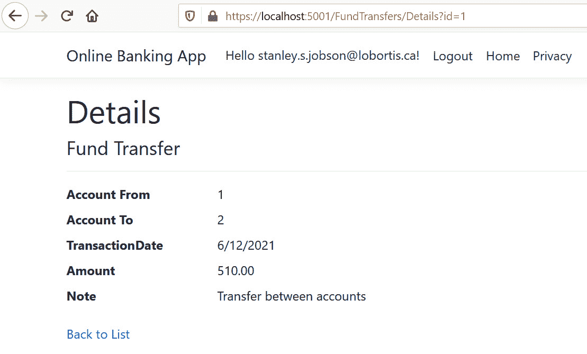
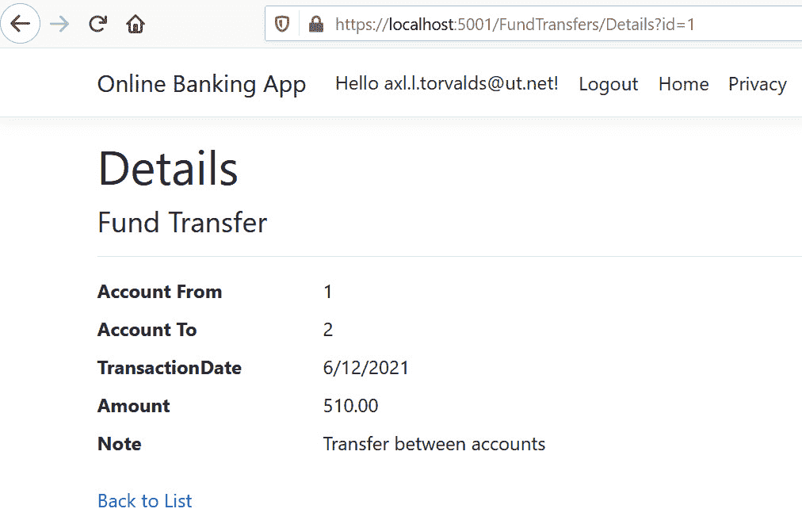
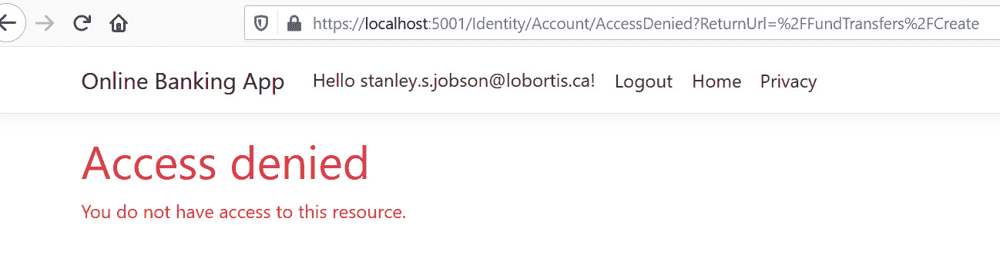

# 六、访问控制中断

**授权**与认证一样重要和必要。它定义了经过身份验证的用户可以执行的操作，资源和网页需要具有定义的权限来限制未经授权的访问。权限绕过和缺少或不正确的访问控制是在 ASP.NET Core web 应用中发现的一些损坏的访问控制漏洞。

在本章中，我们将介绍以下配方：

*   固定**不安全的直接对象引用**（**IDOR**）
*   修复不正确的授权
*   修复丢失的访问控制
*   修复开放重定向漏洞

本章结束时，您将学习如何使用 ASP.NET Core 中的内置授权机制。您将正确实现基于角色的授权，以防止未经授权访问 web 应用中的资源。此外，您还将看到如何利用更安全的重定向方法来防止开放式重定向攻击。

# 技术要求

这本书是为配合 VisualStudio 代码、Git 和.NET5.0 而编写和设计的。ASP.NET Core Razor 页面中提供了配方中的代码示例。示例解决方案还使用 SQLite 作为**数据库**（**DB**引擎，以简化设置。本章的完整代码示例可在[上找到 https://github.com/PacktPublishing/ASP.NET-Core-Secure-Coding-Cookbook/tree/main/Chapter06](https://github.com/PacktPublishing/ASP.NET-Core-Secure-Coding-Cookbook/tree/main/Chapter06) 。

# 固定 IDOR

当访问数据库中的记录时，我们通常使用**标识符**（**ID**）的形式来唯一标识数据集。数据库的设计和结构依赖于这些键，有时它们很容易被猜测或枚举。对手可以在您对 ASP.NET Core 网页的请求中找到这些标识符。如果没有足够的访问控制保护，恶意用户可以查看、修改或删除这些记录，最坏的情况是删除这些记录。

在此配方中，我们将发现代码中的 IDOR 漏洞，并通过使用经过身份验证的客户的身份来缓解问题。

## 准备好了吗

对于本章的食谱，我们需要一个在线银行应用示例。

打开命令 shell 并通过克隆`ASP.NET-Core-Secure-Coding-Cookbook`存储库下载示例网银应用，如下所示：

```cs
git clone https://github.com/PacktPublishing/ASP.NET-Core-Secure-Coding-Cookbook.git
```

运行示例应用以验证没有生成或编译错误。在命令 shell 中，导航到位于`\Chapter06\insecure-direct-object-references\before\OnlineBankingApp`的示例应用文件夹，并运行以下命令：

```cs
dotnet build
```

`dotnet build`命令将构建示例`OnlineBankingApp`项目及其依赖项。

让我们看看 IDOR 漏洞是如何被利用的。

### 测试 IDOR

以下为步骤：

1.  导航至菜单中的**终端****新终端**，或在 VS 代码中按*Ctrl*+*Shift*+*即可。*
**   在终端中键入以下命令以构建并运行示例应用：

    ```cs
    dotnet run
    ```

    *   打开浏览器并转到`https://localhost:5001/Fundtransfers/Details?id=1`。*   Log in using the following credentials:

    a） 电邮：`stanley.s.jobson@lobortis.ca`

    b） 密码：`rUj5jtV8jrTyHnx!`

    *   Once authenticated, you will be redirected to Stanley's fund transfer details page, as shown in the following screenshot:

    

    图 6.1–资金转账详情页面

    *   Click on **Logout** to log out from the sample solution, as shown in the following screenshot:

    

    图 6.2–注销链接

    *   转到`https://localhost:5001/FundTransfers/Details?id=1`。*   Now, log in using Axl's credentials:

    a） 电邮：`axl.l.torvalds@ut.net`

    b） 密码：`6GKqqtQQTii92ke!`

    *   注意下面的截图，Axl 可以看到 Stanley 的资金转账详情页面：*

 *

图 6.3–未经授权的访问

前面的测试表明，此页面容易受到 IDOR 安全漏洞的影响。

在此配方中，我们将通过添加验证检查来确定特定用户是否可以查看资金转账详细信息页面，从而修复代码中的 IDOR 漏洞。

## 怎么做…

让我们来看看这个食谱的步骤：

1.  在开始练习文件夹中，通过键入以下命令启动 VS 代码：

    ```cs
    code .
    ```

2.  Open `Models\FundTransfer.cs` and change the `ID` property from `int` to a `Guid` type. **Globally unique identifiers** (**GUIDs**) are unique identifiers and are harder to guess:

    ```cs
        [Key]
        public Guid ID { get; set; }
    ```

    用`Key`属性注释`ID`属性，使该属性成为实体框架识别的主键。

3.  在`Services`文件夹下，创建一个新文件并将其命名为`FundTransferIsOwnerAuthorizationHandler.cs`。
4.  在`FundTransferIsOwnerAuthorizationHandler.cs`中，添加对以下名称空间的引用：

    ```cs
    using Microsoft.AspNetCore.Authorization;
    using Microsoft.AspNetCore.Identity;
    using System.Threading.Tasks;
    using OnlineBankingApp.Models;
    ```

5.  Next, define a `FundTransferIsOwnerAuthorizationHandler` class that inherits from `AuthorizationHandler`:

    ```cs
    namespace OnlineBankingApp.Authorization {
        public class         FundTransferIsOwnerAuthorizationHandler             : AuthorizationHandler<                FundTransferOwnerRequirement,                 FundTransfer>{
        }
    }
    ```

    顾名思义，授权处理程序处理授权，在前面突出显示的代码中，它确定用户是否具有访问权限。

6.  使用**依赖注入**（**DI**），使用`UserManager`服务能够从当前登录的客户

    ```cs
            UserManager<Customer> _userManager;
            public FundTransferIsOwnerAuthorizationHandler             (UserManager<Customer>             userManager){
                _userManager = userManager;
            }
    ```

    中检索用户 ID 信息
7.  在`FundTransferIsOwnerAuthorizationHandler`类中，定义一个`Task`对象，该对象将使用传递的`requirement`和`resource`参数处理授权检查：

    ```cs
        protected override Task
        HandleRequirementAsync(AuthorizationHandlerContext         context,
            FundTransferOwnerRequirement requirement,
            FundTransfer resource){
                if (context.User == null || resource == null){
                    return Task.CompletedTask;
                }
                if (resource.CustomerID ==                    _userManager.GetUserId                         (context.User)){
                    context.Succeed(requirement);
                }
                return Task.CompletedTask;
            }
        }
    ```

8.  Define a `FundTransferOwnerRequirement` class that will inherit from the `IauthorizationRequirement` empty marker interface within the same `FundTransferIsOwnerAuthorizationHandler.cs` file:

    ```cs
    public class FundTransferOwnerRequirement :    IAuthorizationRequirement { }
    }
    ```

    `FundTransferOwnerRequirement`不需要有任何属性或数据，因此我们将保留该类为空。

9.  打开`Startup.cs`并包含以下名称空间引用：

    ```cs
    using OnlineBankingApp.Authorization;
    using Microsoft.AspNetCore.Authorization
    .Infrastructure;
    ```

10.  在`ConfigureServices`中，添加一个新的授权策略，并注册我们在*步骤 3*中创建的授权处理程序：

    ```cs
    services.AddAuthorization(options => {
        options.AddPolicy("Owner", policy =>
            policy.Requirements.Add(new             FundTransferOwnerRequirement()));
    });
    services.AddScoped<IAuthorizationHandler,    FundTransferIsOwnerAuthorizationHandler>();
    ```

11.  接下来，打开文件`\Pages\FundTransfers\Details.cshtml.cs`并添加以下名称空间引用：

    ```cs
    using Microsoft.AspNetCore.Authorization;
    using Microsoft.AspNetCore.Identity;
    ```

12.  通过 DI，将我们在*步骤 5*中注册的授权服务中突出显示的以下代码添加到`DetailsModel`构造函数中：

    ```cs
    protected IAuthorizationService _authorizationService     { get; }
    protected UserManager<Customer> _userManager { get; }
    public DetailsModel(OnlineBankingApp.Data     .OnlineBankingAppContext context,
               IAuthorizationService authorizationService,
               UserManager<Customer> userManager)
    {
        _context = context;
    _userManager = userManager;
        _authorizationService = authorizationService;
    }
    ```

13.  Refactor the whole code under the `OnGetAsync` page handler:

    ```cs
    public async Task<IActionResult> OnGetAsync(Guid? id)
    {
        if (!id.HasValue){
            return NotFound();
        }
        if (!User.Identity.IsAuthenticated){
            return Challenge();
        } 
        fundTransfer = await _context.FundTransfer
                    .Where(f => f.ID == id)
                    .Include(f => f.Customer)
                    .OrderBy(f => f.TransactionDate)
                    .FirstOrDefaultAsync<FundTransfer>();
        var isAuthorized = await         _authorizationService.AuthorizeAsync                  (User, fundTransfer,"Owner");
        if (!isAuthorized.Succeeded){
            return Forbid();
        }
        return Page();
    } 
    ```

    通过我们执行的步骤，我们使用基于策略的授权方法实现了一种更健壮的授权方式。

    重复*测试 IDOR*部分中的步骤以验证修复是否有效，但不要使用 IDOR 易受攻击的**统一资源定位器**（**URL**，而是转到[https://localhost:5001/FundTransfers/Details?id=7c281d46-f2ab-4027-a4d4-3B97A60012C](https://localhost:5001/FundTransfers/Details?id=7c281d46-f2ab-4027-a4d4-3bb97a60012c)和您应在屏幕上看到以下消息：


图 6.4–拒绝访问消息

请注意，Axl 的帐户不再可以访问 Stanley 的资金转账详细信息页面，并被重定向到**拒绝访问**页面。

## 它是如何工作的…

首先，我们将`FundTransfer`主键更改为不易猜测的类型。我们使用`Guid`类型允许我们拥有**唯一 ID**（**UID**）作为每次资金转账的`Key`：

```cs
    [Key]
    public Guid ID { get; set; }
```

然后，我们通过首先创建一个授权处理程序来实现基于策略的授权。在`FundTransferIsOwnerAuthorizationHandler`类中，是确定资源（资金转账）`CustomerID`是否与客户用户 ID 匹配的代码。如果满足要求，调用`AuthorizationHandlerContext`的`Succeed`方法表示评估成功：

```cs
if (resource.CustomerID ==    _userManager.GetUserId(context.User)){
    context.Succeed(requirement);
}
```

授权处理程序注册为服务，分别使用`AddScoped`和`AddPolicy`方法添加预配置策略：

```cs
services.AddAuthorization(options => {
    options.AddPolicy("Owner", policy =>
        policy.Requirements.Add(new             FundTransferOwnerRequirement()));
});
services.AddScoped<IAuthorizationHandler,    FundTransferIsOwnerAuthorizationHandler>();
```

我们在`DetailsModel`页面模型中通过 DI 使用这些服务。

# 修复不当授权

错误地使用 ASP.NET Core 的授权组件可能会导致代码不安全。授权特性提供了一种简单的声明性方式来强制授权，但是在实现时可能会出错。在此配方中，我们将在示例网上银行应用中正确实现 ASP.NET Core 的基于角色的授权功能。

运行示例应用以验证没有生成或编译错误。在命令行中，导航到位于`\Chapter06\improper-authorization\before\OnlineBankingApp`的示例应用文件夹。

让我们看看不恰当的授权如何导致某人使用客户无权使用的功能。

## 测试授权不当

以下是步骤：

1.  导航至菜单中的**终端****新终端**，或在 VS 代码中按*Ctrl*+*Shift*+*即可。*
**   在终端中键入以下命令以构建并运行示例应用：

    ```cs
    dotnet run
    ```

    *   打开浏览器并转到`https://localhost:5001/FundTransfers/Create`。*   Log in using the following credentials:

    a） 电邮：`axl.l.torvalds@ut.net`

    b） 密码：`6GKqqtQQTii92ke!`

    *   一旦通过身份验证，您将被重定向到可以进行资金转账的页面。*

 *我们的样本网上银行解决方案只创建了 Axl 的客户帐户；因此，他的角色是`Customer`和`PendingCustomer`。在 Axl 的账户进入`ActiveCustomer`角色之前，他不应该进行资金转账。

## 准备好了吗

我们将使用上一个配方中使用的网上银行应用。使用 VS 代码，在`\Chapter06\missing-access-control\before\OnlineBankingApp\`处打开样本网银应用文件夹。

您也可以在此文件夹中执行*修复不当授权*配方的步骤。

## 怎么做…

让我们来看看这个食谱的步骤：

1.  在开始练习文件夹中，通过键入以下命令启动 VS 代码：

    ```cs
    code .
    ```

2.  Open the `\Pages\FundTransfers\Create.cshtml.cs` file and notice the `Authorize` annotation on top of the `CreateModel` class:

    ```cs
    namespace OnlineBankingApp.Pages.FundTransfers
    {
        [Authorize(Roles = "Customer,ActiveCustomer")]
        public class CreateModel : AccountPageModel
        {
            private readonly OnlineBankingApp.Data             .OnlineBankingAppContext _context;
            public CreateModel (OnlineBankingApp.Data             .OnlineBankingAppContext context)
            {
                _context = context;
            }
    // code removed for brevity
    ```

    `Authorize`注释似乎被正确使用，但并不完全正确。`CreateModel`页面模型只对具有`Customer`*或*角色的客户开放。在此格式中设置`Authorize`注释意味着任何角色的客户都可以汇款，根据我们的业务规则，这不是我们所期望的，只允许活跃客户进行资金转账。

3.  使用以下代码更改`Authorize`注释的格式：

    ```cs
    namespace OnlineBankingApp.Pages.FundTransfers
    {
    [Authorize(Roles = "Customer")]
        [Authorize(Roles = "ActiveCustomer")]
        public class CreateModel : AccountPageModel
        {
            private readonly OnlineBankingApp.Data             .OnlineBankingAppContext _context;
            Public CreateModel(OnlineBankingApp.Data             .OnlineBankingAppContext context)
            {
                _context = context;
            }
    // code removed for brevity
    ```

4.  导航至菜单中的**终端****新终端**，或在 VS 代码中按*Ctrl*+*Shift*+*即可。*
**   在终端中键入以下命令以构建并运行示例应用：

    ```cs
    dotnet run
    ```

    *   打开浏览器并转到`https://localhost:5001/Fundtransfers/Create`。*   Log in with the following credentials:

    a） 。电邮：`axl.l.torvalds@ut.net`

    b） 。密码：`6GKqqtQQTii92ke!`

    *   请注意，您将被重定向到**拒绝访问**页面，如下图所示：*

 *

图 6.5–访问被拒绝页面

设置`AuthorizeAttribute`属性可在`CreateModel`页面模型中配置必要的授权。这要求经过身份验证的用户同时具有`Customer`*和*`ActiveCustomer`角色。

## 它是如何工作的…

声明性角色检查使 web 开发人员能够轻松地在页面模型中添加授权，但是注释之间有很大的区别。例如，看看这个：

```cs
    [Authorize(Roles = "Customer,ActiveCustomer")]
```

现在，将其与以下注释进行对比：

```cs
    [Authorize(Roles = "Customer")]
    [Authorize(Roles = "ActiveCustomer")]
```

第一个表示具有`Customer`或`ActiveCustomer`角色的经过身份验证的用户可以访问资金转账页面。后者规定客户需要*两个角色*才有权汇款。

提示

*基于策略的授权*检查也是伴随声明性授权的必要技术，以确保用户有权查看资金转账。有关如何实现此类授权的更多信息和详细信息，请参阅*修复 IDOR*配方。

# 修复丢失的访问控制

访问控制漏洞允许恶意参与者只需注册帐户并获得身份验证即可访问您的 ASP.NET Core web 应用。此安全漏洞可能导致未经授权访问敏感信息。

在此配方中，我们向示例网上银行应用添加角色，以集成基于**策略的**授权。

## 准备好了吗

我们将使用上一个配方中使用的网上银行应用。使用 VS 代码，在`\Chapter06\missing-access-control\before\OnlineBankingApp\`处打开样本网银应用文件夹。

您还可以在此文件夹中执行*修复缺少的访问控制*配方的步骤。

## 怎么做…

让我们来看看这个食谱的步骤。

1.  在启动练习文件夹中，通过键入以下命令启动 VS 代码：

    ```cs
    code .
    ```

2.  Open the `\Pages\FundTransfers\Create.cshtml.cs` file and notice the `Authorize` annotation on top of the `CreateModel` class:

    ```cs
    namespace OnlineBankingApp.Pages.FundTransfers
    {
        [Authorize]
        public class CreateModel : AccountPageModel
        {
            private readonly OnlineBankingApp.Data             .OnlineBankingAppContext _context;
            public CreateModel(OnlineBankingApp.Data             .OnlineBankingAppContext context)
            {
                _context = context;
            }
    // code removed for brevity
    ```

    `CreateModel`类中的`Authorize`属性提供了最基本的授权，表明此 Razor pages 模型需要授权。但是，由于缺乏关于哪些类型的客户可以进行资金转账的定义角色，因此对手有可能滥用此授权。

3.  We need to implement policy-based authorization with criteria defined based on the current roles that our customer has. Under the `Models` folder, create a new file, name it `PrincipalPermission.cs`, and add the following code:

    ```cs
    using System;
    using System.Collections.Generic;
    using Microsoft.AspNetCore.Authorization;
    using OnlineBankingApp.Models;
    namespace OnlineBankingApp.Authorization{
        public static class PrincipalPermission{
            public static List             <Func<AuthorizationHandlerContext, bool>>                Criteria = new List<Func                 <AuthorizationHandlerContext, bool>> 
        {
                CanCreateFundTransfer
        };

            public static bool CanCreateFundTransfer              (this AuthorizationHandlerContext ctx){
                return ctx.User.IsInRole                 (Role.ActiveCustomer.ToString());
            }
        }
    }
    ```

    在前面的代码片段中，我们使用`Func`来实现策略。`Func`是一名代表，将指向我们的`CanCreateFundTransfer`方法。我们还创建了一个`List<Func<AuthorizationHandlerContext, bool>>`实例来为我们的策略配置`Criteria`列表。我们将`CanCreateFundTransfer`方法定义为我们的标准之一，表明只有`ActiveCustomer`角色的客户才能创建资金转账。

    笔记

    您可以为客户定义更多的条件，使其能够提交资金转账，但为了简化示例，我们将使用客户的当前角色。

4.  打开`Startup.cs`，在`ConfigureServices`中添加对`OnlineBankingApp.Authorization`的引用，这是我们`PrincipalPermission`类的名称空间：

    ```cs
    using OnlineBankingApp.Authorization;
    ```

5.  Include the following highlighted code in the authorization middleware:

    ```cs
    services.AddAuthorization(options =>
    {
        options.FallbackPolicy = new         AuthorizationPolicyBuilder()
                .RequireAuthenticatedUser()
                .Build();
        foreach (var criterion in PrincipalPermission         .Criteria)
        {
            options.AddPolicy(criterion.Method.Name,
                    policy =>
                      policy.RequireAssertion(criterion));
        }
    }); 
    ```

    我们将循环到我们定义的每个标准列表中，并为每个标准创建一个授权策略。

6.  Open `Pages\FundTransfers\Create.cshtml.cs` and annotate the `CreateModel` page model with the highlighted code:

    ```cs
    namespace OnlineBankingApp.Pages.FundTransfers
    {
    [Authorize(Policy =        nameof(PrincipalPermission             .CanCreateFundTransfer))]
        public class CreateModel : AccountPageModel
        {
    // code removed for brevity
    ```

    放置前面突出显示的属性将应用我们添加到授权服务的授权策略。

7.  导航至菜单中的**终端****新终端**，或在 VS 代码中按*Ctrl*+*Shift*+*即可。*
**   在终端中键入以下命令以构建并运行示例应用：

    ```cs
    dotnet run
    ```

    *   打开浏览器并转到`https://localhost:5001/Fundtransfers/Create`。*   Log in with the following credentials:

    a） 电邮：`axl.l.torvalds@ut.net`

    b） 密码：`6GKqqtQQTii92ke!`

    请注意，用户被重定向到`https://localhost:5001/Identity/Account/AccessDenied?ReturnUrl=%2FFundTransfers%2FCreate`**拒绝访问**URL：* 

 *

图 6.6–具有 PendingCustomer 角色的用户的访问被拒绝页面

Axl 预先分配了一个`PendingCustomer`角色（请参见`Models\SeedData.cs`，这将阻止他根据我们创建的策略提交资金转账。

## 它是如何工作的…

基于策略的方法为 ASP.NET Core web 开发人员提供了定义授权矩阵所需的粒度。在前面的配方中，我们使用了一个简单的示例，使用角色作为授权策略的标准。在执行一项政策时，我们提供了一个包含我们定义的每个`Criteria`的`Func<AuthorizationHandlerContext, bool>`的`List`：

```cs
public static List<Func<AuthorizationHandlerContext, bool>>        Criteria = new List<Func             <AuthorizationHandlerContext, bool>>
{
    CanCreateFundTransfer,
    CanViewFundTransfer
};
```

`Criteria`表示将用于设置条件接收的委托。在我们的案例中，我们将使用客户的角色作为标准，但如有必要，您可以扩展它：

```cs
public static bool CanCreateFundTransfer(this         AuthorizationHandlerContext ctx)
{
    return ctx.User.IsInRole(Role.ActiveCustomer         .ToString());
}
```

最后，我们使用`RequireAssertion`策略以`Criteria`的`List`构建我们的策略：

```cs
foreach (var criterion in PrincipalPermission.Criteria)
{
    options.AddPolicy(criterion.Method.Name,
        policy => policy.RequireAssertion(criterion));
}   
```

# 修复开放重定向漏洞

用户可以被诱骗点击 ASP.NET Core web 应用生成的链接，但这最终会将他们重定向到恶意网站。当用户控制的参数确定要重定向到的 URL 没有验证或白名单时，可能会发生打开重定向。在此配方中，我们将通过使用更安全的重定向方法来补救代码中的开放重定向攻击风险。

首先，让我们来看看如何使用开放重定向漏洞。

## 准备好了吗

我们将使用上一个配方中使用的网上银行应用。使用 VS 代码，在`\Chapter06\unvalidated-redirect\before\OnlineBankingApp\`处打开样本网银应用文件夹。

您还可以针对*修复打开重定向漏洞*配方执行此文件夹中的步骤。

### 测试开放重定向

以下是步骤：

1.  导航至菜单中的**终端****新终端**，或在 VS 代码中按*Ctrl*+*Shift*+*即可。*
**   在终端中键入以下命令以构建并运行示例应用：

    ```cs
    dotnet run
    ```

    *   打开浏览器并转到`https://localhost:5001/Identity/Account/Login?ReturnUrl=https://www.packtpub.com`。*   Log in using the following credentials:

    a） 电邮：`stanley.s.jobson@lobortis.ca`

    b） 密码：`rUj5jtV8jrTyHnx!`

    *   Once authenticated, you will be redirected to the *Packt Publishing* website.

    前面的测试表明，此页面容易受到开放重定向攻击。* 

 *## 怎么做…

让我们来看看这个食谱的步骤。

1.  在开始练习文件夹中，通过键入以下命令启动 VS 代码：

    ```cs
    code .
    ```

2.  Open `Areas\Identity\Pages\Account\Login.cshtml.cs` and notice the `Redirect` method call:

    ```cs
    public async Task<IActionResult> OnPostAsync(string   url = null)
    {
      . . . .
    // code removed for brevity
        var signInResult = await _signInManager         .PasswordSignInAsync(Input.Email,             Input.Password, Input.RememberMe,                lockoutOnFailure: false);
        if (signInResult .Succeeded)
        {
            _log.LogInformation("User logged in.");
            if (string.IsNullOrEmpty(HttpContext             .Session.GetString(SessionKey)))
            {
                HttpContext.Session.SetString(SessionKey,                Input.Email);
            }
            return Redirect(url);
        }
    // code removed for brevity
    ```

    调用时，`Redirect`方法向浏览器发送临时重定向响应。在没有 URL 验证的情况下，只要被欺骗的客户单击恶意 URL，URL 重定向就会被滥用并发送到攻击者控制的网站。

3.  Another security flaw found in this sample Online Banking app is in its logout page redirection. Open `Areas\Identity\Pages\Account\Logout.cshtml.cs` and go to the `OnGet` method of the page method:

    ```cs
    public async Task<IActionResult> OnGet(string url =  null)
    {
        await _signInManager.SignOutAsync();
        _log.LogInformation("User logged out.");
        if (url != null)
        {
            return Redirect(url);
        }
        else
        {
            return RedirectToPage();
        }
    }
    // code removed for brevity
    ```

    同样地，重定向是无效的，对手可以创建一个 URL，该 URL 可以重定向到通过网络钓鱼或其他欺骗手段提供的黑客控制的网站。

4.  To remediate these security flaws, open `Areas\Identity\Pages\Account\Login.cshtml.cs` and change the `Redirect` method to `LocalRedirect`:

    ```cs
    if (ModelState.IsValid)
    {
        // This doesn't count login failures towards     account lockout
        // To enable password failures to trigger account     lockout, set lockoutOnFailure: true
        var signInResult = await _signInManager         .PasswordSignInAsync(Input.Email,            Input.Password, Input.RememberMe,                 lockoutOnFailure: false);
        if (signInResult.Succeeded)
        {
            _log.LogInformation("User logged in.");
            if (string.IsNullOrEmpty           (HttpContext.Session.GetString(SessionKey)))
            {
                HttpContext.Session.SetString(SessionKey,                Input.Email);
            }
            return LocalRedirect(url);
        }
    // code removed for brevity
    ```

    `LocalRedirect`方法执行相同的重定向，只是当 URL 试图重定向到非本地网站时，它会抛出`InvalidOperationException`异常。

5.  Another way to fix this security bug is to use the `Url.IsLocalUrl` method. Open `Areas\Identity\Pages\Account\Logout.cshtml.cs` and go to the `OnGet` method of the page method. Change the method from `OnGet` to `OnPost` for this method to be invoked on **HyperText Transfer Protocol** (**HTTP**) `POST` requests, not HTTP `GET` requests. Replace the `Redirect` method call with a validation check using the `IsLocalUrl` method:

    ```cs
    public async Task<IActionResult> OnPost(string url =  null)
    {
        await _signInManager.SignOutAsync();
        _log.LogInformation("User logged out.");
        if (url != null)
        {
    if (Url.IsLocalUrl(url)) 
                return Redirect(url);
    else 
                return RedirectToPage();
        }
        else
        {
            return RedirectToPage();
        }
    }
    // code removed for brevity
    ```

    对`Url.IsLocalUrl`方法的调用会检查 URL 是否为本地 URL，从而防止客户冒被重定向到任意 URL 的风险。

## 它是如何工作的…

恶意网站可能模仿合法网站，欺骗用户使用其凭据登录，最终窃取受害者的用户名和密码。我们同时使用`LocalRedirect`和`Url.IsLocalUrl`方法，取代了危险的`Redirect`方法来验证作为参数接收的 URL。实现这些更安全的功能可以保护我们不被重定向到不需要的 URL。

如果某些用例需要将用户重定向到外部 URL，则必须应用白名单验证技术来确定是否允许 URL。*****