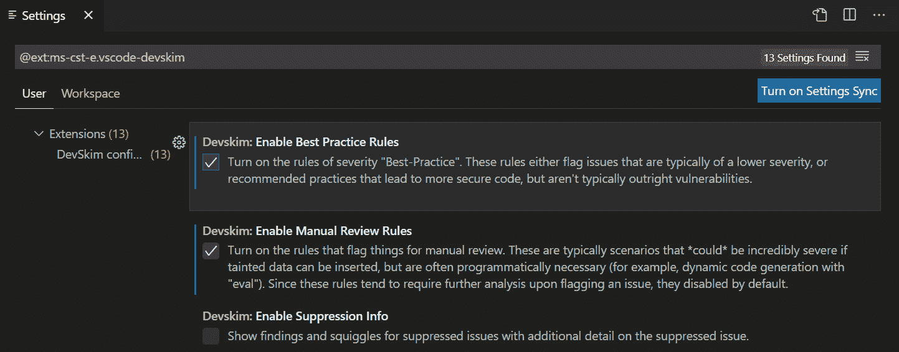
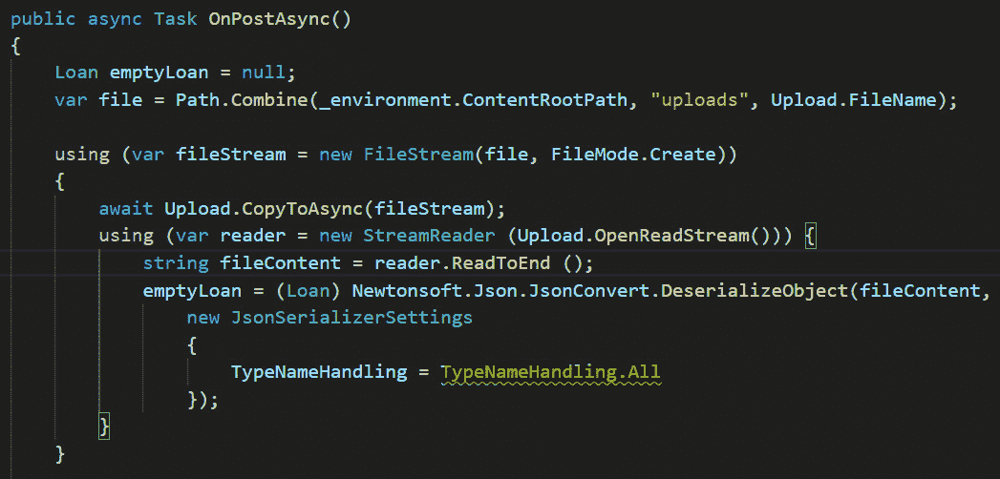
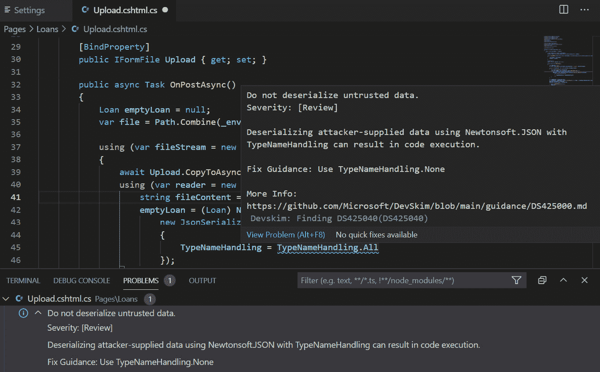
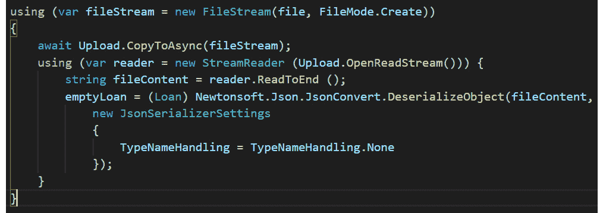
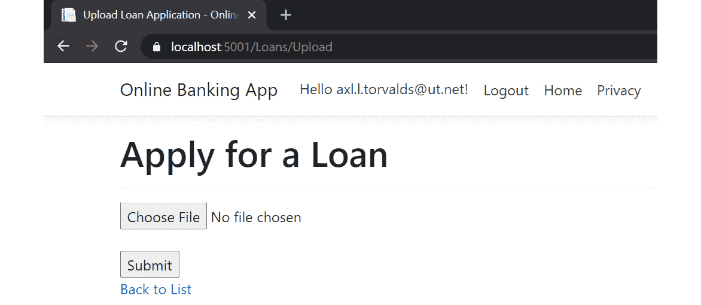
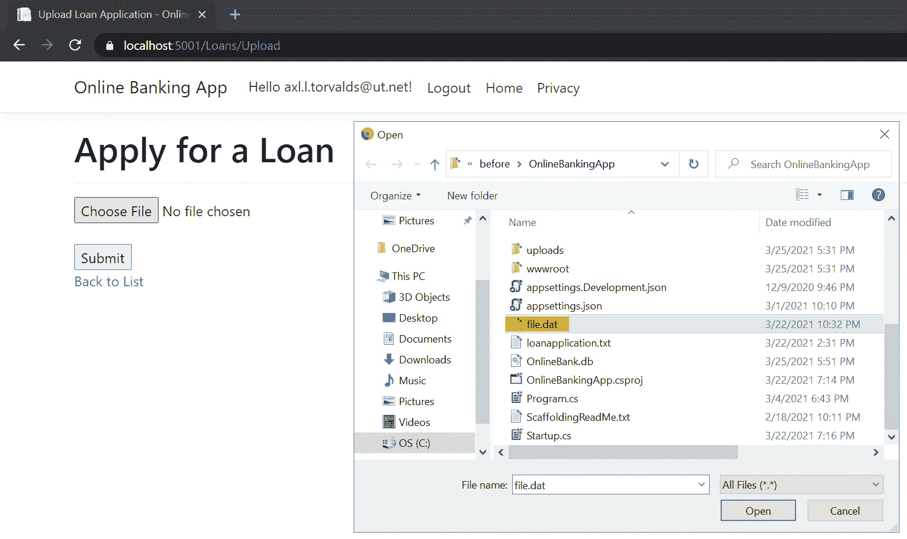

# 九、不安全反序列化

.NET 完全支持数据的**序列化**和**反序列化**。此语言功能允许 ASP.NET Core web 应用将内存中的对象转换为字节流（序列化），并将这些字节流重建回对象（反序列化）。序列化使数据的传输、存储和缓存以及系统之间的状态持久化成为可能。

在反序列化过程中，数据格式可以是**JavaScript 对象表示法**（**JSON**）或**可扩展标记语言**（**XML**），也可以是二进制格式。但是，与任何输入类型一样，数据源在作为内存对象反序列化回 web 应用之前可能不可信或被篡改。此漏洞通常称为**不安全反序列化**。使用过时且危险的反序列化程序、缺少数据验证和错误配置库是导致不安全反序列化攻击发生的一些根本原因。此安全漏洞可归因于不安全的代码，在最坏的情况下可能导致**拒绝服务**（**DoS**攻击和**远程代码执行**（**RCE**攻击）。

在本章中，我们将介绍以下配方：

*   修复不安全的反序列化
*   修复不安全反序列化程序的使用
*   修复不受信任的数据反序列化

在本章末尾，您将学习如何使用正确配置的库安全地反序列化输入，如何减轻过时的.NET 类给 ASP.NET Core web 应用带来的风险，以及如何使用更好的反序列化器替代方案来安全地反序列化数据流。

# 技术要求

这本书是为配合 VisualStudio 代码、Git 和.NET5.0 而编写和设计的。ASP.NET Core Razor 页面中提供了配方中的代码示例。示例解决方案还使用 SQLite 作为数据库引擎，以简化设置。本章的完整代码示例可在[上找到 https://github.com/PacktPublishing/ASP.NET-Core-Secure-Coding-Cookbook/tree/main/Chapter09](https://github.com/PacktPublishing/ASP.NET-Core-Secure-Coding-Cookbook/tree/main/Chapter09) 。

# 修复不安全的反序列化

**Json.NET**一直以来都是.NET 开发人员处理 Json 的流行框架，直到.NET 最近在`System.Text.Json`名称空间下引入了自己的一组序列化器/反序列化器类。这组新类删除了.NETCore 以前版本对库的依赖关系。

Json.NET 具有类型处理功能，如果使用不当，ASP.NET Core web 应用容易受到不安全的反序列化攻击。自动类型处理将允许`Json.NET`流反序列化程序在传入请求中使用声明的.NET 类型。允许您的应用根据不受信任的源中声明的.NET 类型自动反序列化对象可能是有害的，并且可能会导致意外对象的实例化，从而导致在主机中执行任意代码。在此配方中，我们将修复此不安全的反序列化，并防止有害的自动类型处理。

## 准备好了吗

对于本章的食谱，我们需要一个在线银行应用示例。

打开命令 shell 并通过克隆`ASP.NET-Core-Secure-Coding-Cookbook`存储库下载示例网银应用，如下所示：

```cs
git clone https://github.com/PacktPublishing/ASP.NET-Core-Secure-Coding-Cookbook.git
```

运行示例应用以验证没有生成或编译错误。在命令 shell 中，导航到位于`\Chapter09\unsafe-deserialization\before\OnlineBankingApp`的示例应用文件夹，并运行以下命令：

```cs
dotnet build
```

`dotnet build`命令将构建示例`OnlineBankingApp`项目及其依赖项。

让我们看看如何使用工具来发现不安全的反序列化漏洞。

## 测试不安全的反序列化

为了搜索代码漏洞，我们可以使用代码分析器或 linter 等工具执行**静态应用安全测试**（**SAST**）。这个方法将使用开源的**DevSkim**VS 代码扩展来搜索代码中的安全缺陷。我们首先安装插件并查看结果：

1.  在开始练习文件夹中，通过键入以下命令启动 VS 代码：

    ```cs
    code .
    ```

2.  只需按*Ctrl*+*Shift*+*X*或点击 VS 代码左侧面板**活动栏**中的**扩展**图标，即可打开**扩展**视图。
3.  In the Search box, type in `devskim` to bring up the DevSkim extension, as shown in the following screenshot:

    

    图 9.1–DevSkim 与代码扩展

4.  Click **Install** to install the DevSkim VS Code extension, as shown next:

    

    图 9.2–安装

5.  Once installed, let's configure the extension settings by clicking the gear icon in the **DevSkim** view and selecting **Extension Settings**:

    

    图 9.3–扩展设置选项

6.  Enable these **DevSkim** settings, as shown in the following screenshot:

    

    图 9.4–启用可选设置

    这两个设置将启用提醒 ASP.NET Core 开发人员编写安全代码的最佳实践的规则：

    a） **启用最佳实践规则**

    b） **启用手动审核规则**

7.  Open `Pages\Loans\Upload.cshtml.cs` and examine the code underlined with a squiggly line in one of the lines of code under the `OnPostAsync` method, indicating that a secure coding rule has been triggered, as shown in the following screenshot:

    

    图 9.5–警告

8.  按*Ctrl*+*Shift*+*M*在**问题**选项卡中查看发现的详细信息，或将鼠标悬停在曲线上了解更多关于安全性发现的信息，如下图所示：



图 9.6–DevSkim 修复指南

修复指南将建议您不要反序列化不受信任的数据，而是使用`TypeNameHandling.None`。

笔记

Visual Studio**集成开发环境**（**IDE**的全功能版本）具有内置的代码分析，其安全规则与 DevSkim 插件工具的规则相匹配：

*CA2300:不要使用不安全的反序列化程序二进制格式化程序*

*CA2301:不调用 BinaryFormatter.Deserialize 而不首先设置 BinaryFormatter.Binder*

*CA2302:确保在调用 BinaryFormatter.Deserialize*之前设置 BinaryFormatter.Binder

要了解关于不同 VS 代码分析安全规则的更多信息，请参见[上.NET 基础官方文档中的*安全规则*https://docs.microsoft.com/en-us/dotnet/fundamentals/code-analysis/quality-rules/security-warnings](https://docs.microsoft.com/en-us/dotnet/fundamentals/code-analysis/quality-rules/security-warnings) 。

## 怎么做…

让我们来看看这个食谱的步骤：

1.  打开`Pages\Loans\Upload.cshtml.cs`并在`OnPostAsync`方法中定位易受攻击的代码，正如 DevSkim 扩展

    ```cs
    using (var reader = new StreamReader   (Upload.OpenReadStream())) {
        string fileContent = reader.ReadToEnd ();
        emptyLoan = (Loan) Newtonsoft.Json.JsonConvert       .DeserializeObject(fileContent,         new JsonSerializerSettings
     {
     TypeNameHandling = TypeNameHandling.All
     });
    }
    ```

    所指出的
2.  Change the `TypeNameHandling` property to `TypeNameHandling.None`:

    ```cs
    using (var reader = new StreamReader   (Upload.OpenReadStream())) {
        string fileContent = reader.ReadToEnd ();
        emptyLoan = (Loan) Newtonsoft.Json.JsonConvert       .DeserializeObject(fileContent,         new JsonSerializerSettings
            {
                TypeNameHandling = TypeNameHandling.None
            });
    }
    ```

    请注意，在以下屏幕截图中，DevSkim VS 代码扩展不再标记代码以供查看：



图 9.7-已纠正的不安全反序列化

更改属性不再将`TypeNameHandling`属性标记为安全代码检查。

## 它是如何工作的…

**JSON**是标准数据格式，ASP.NET Core web 开发人员使用*JSON.NET*等框架来处理反序列化此数据格式的任务也就不足为奇了。大多数库都具有有助于反序列化的功能（如自动类型处理），但这些功能可能会引起安全问题。在这个配方中，我们已经看到，在将`JsonSerializerSettings`设置为`TypeNameHandling.All`的情况下启用类型处理会从我们的**DevSkim**工具中引发一个**不反序列化不可信数据**安全规则。在序列化过程中，分配除`TypeNameHandling.None`之外的`TypeNameHandling`属性包括.NET 类型名称，这将使我们的示例网上银行 web 应用面临不安全的反序列化攻击。我们通过简单地将`TypeNameHandling`属性设置为`TypeNameHandling.None`来修复代码中的此安全漏洞，从而阻止自动.NET 类型解析。

提示

确保您使用的是最新版本的序列化程序/反序列化程序库。旧版本可能有一个众所周知的漏洞，威胁参与者可能会利用该漏洞进行攻击。

记录反序列化异常和失败也很重要。当传入类型（`Loan`）不是使用强类型对象的预期类型时引发异常。

这里是一个修改后的代码片段，我们使用强类型对象，实现正确的日志记录（更多信息参见[*第 11 章*](11.html#_idTextAnchor254)、*日志记录和监控不足*），并执行异常处理（更多信息参见[*第 13 章*](13.html#_idTextAnchor302)、*最佳实践*：

`try {`

`emptyLoan = (Loan) Newtonsoft.Json.JsonConvert .DeserializeObject<Loan>(fileContent, new JsonSerializerSettings`

`{`

`TypeNameHandling = TypeNameHandling.None`

`});`

`}`

`catch (JsonException je) {`

`_logger.LogError($"Unexpected error deserializing data '{je.Message}'.");`

`throw new JsonException(je.Message);`

`}`

## 还有更多…

商业 SAST 供应商为测试代码的安全性提供了企业级解决方案。这些解决方案要么托管在本地，要么基于云。它们允许用户和开发人员运行扫描并生成报告，按严重性和类别列出不同的漏洞。这些报告提供了修复方法和修复解决方案中发现的安全漏洞的方法，并可以指向发现问题的代码行。SAST 解决方案还显示**数据流图**（**DFGs**），供用户了解漏洞如何从源传播到接收器。

要了解更多关于 SAST 的，请访问**开放式 Web 应用安全项目**（**OWASP**）*源代码分析工具*文档。此 OWASP 参考资料将提供有关您的 SAST 选择过程的提示，以确定哪种解决方案适合您的组织，可在以下链接中找到：[https://owasp.org/www-community/Source_Code_Analysis_Tools](https://owasp.org/www-community/Source_Code_Analysis_Tools) 。

# 修复不安全反序列化程序的使用

`BinaryFormatter`是 ASP.NET 开发人员可以用来序列化和反序列化数据的类型之一。微软官方的*BinaryFormatter 安全指南*文档中有一条关于将`BinaryFormatter`用作反序列化程序的严格警告。`BinaryFormatter`是一个不安全的类型，无法使用，因为此反序列化程序未检查其反序列化的类型。

## 准备好了吗

我们将使用上一个配方中使用的网上银行应用。使用 VS 代码打开`\Chapter09\insecure-deserializer\before\OnlineBankingApp\`处的样本`OnlineBankingApp`文件夹。

您可以执行此文件夹中的步骤来修复不安全反序列化程序的使用。

## 怎么做…

让我们来看看这个食谱的步骤。

1.  打开`Pages\Loans\Upload.cshtml.cs`并检查`OnPostAsync`方法中利用危险的`BinaryFormatter`类反序列化`FileStream`：

    ```cs
    public async Task OnPostAsync()
    {
        Loan emptyLoan = null;
        var file = Path.Combine(_environment         .ContentRootPath, "uploads", Upload.FileName);
        using (var fileStream = new FileStream(file,        FileMode.Create))
        {
            await Upload.CopyToAsync(fileStream);
            BinaryFormatter formatter = new
    BinaryFormatter();
            fileStream.Position = 0;
            emptyLoan = (Loan) formatter.Deserialize             (fileStream);
        }
    ```

    的代码
2.  导航至菜单中的**终端****新终端**，或在 VS 代码中按*Ctrl*+*Shift*+*即可。*
**   Type the following command in the terminal to build and run the sample app:

    ```cs
    dotnet build
    ```

    请注意，生成成功，但出现警告：

    ```cs
    warning SYSLIB0011: 'BinaryFormatter.Deserialize(Stream)' is obsolete: 'BinaryFormatter serialization is obsolete and should not be used. 
    See https://aka.ms/binaryformatter for more information.
    ```

    `BinaryFormatter`不仅过时，而且不安全。强烈建议避免使用此类，并使用更安全的序列化程序/反序列化程序。

    *   To remediate the risk, we must use a `SerializationBinder` class to validate the type that is being deserialized. We begin by adding a new file under the `Models` folder by pressing *Ctrl* + *N* and name it `LoanDeserializationBinder.cs`:

    

    图 9.8–LoanDeserializationBinder.cs

    *   定义一个继承自`SerializationBinder`的`LoanDeserializationBinder`类，并添加以下代码：

    ```cs
    using System;
    using System.Runtime.Serialization;
    namespace OnlineBankingApp.Models
    {
        public class LoanDeserializationBinder :        SerializationBinder
        {
            public override Type BindToType(string             assemblyName, string typeName)
            {
                if (typeName.Equals               ("OnlineBankingApp.Models.Loan")){
                    return typeof(Loan);
                }
                return null;
            }
        }
    }
    ```

    *   Next, we refactor the code that uses `BinaryFormatter`, assigning its `Binder` property with the instance of the `LoanDeserializationBinder` class:

    ```cs
    using (var fileStream = new FileStream(file,  FileMode.Create))
    {
       await Upload.CopyToAsync(fileStream);
       BinaryFormatter formatter = new BinaryFormatter();
       formatter.Binder = new LoanDeserializationBinder();
       fileStream.Position = 0;
       emptyLoan = (Loan) formatter.Deserialize       (fileStream);
    }
    ```

    通过使用`LoanDeserializationBinder`类，我们可以检查被反序列化的类型，防止我们的示例网上银行 web 应用被利用。

    笔记

    由于项目文件中启用了设置，此示例网上银行 web 应用能够使用`BinaryFormatter`。

    在`OnlineBankingApp.csproj`文件中有一个基于布尔值的`EnableUnsafeBinaryFormatterSerialization`节点，允许您的应用使用不安全的`BinaryFormatter`类：

    `<PropertyGroup>`

    `<TargetFramework>net5.0</TargetFramework>`

    `<EnableUnsafeBinaryFormatterSerialization>true </EnableUnsafeBinaryFormatterSerialization>`

    `<UserSecretsId>4869bcd3-3dab-4dae-a167-31816b317c8b</UserSecretsId>`

    `</PropertyGroup>`

    强烈建议*避免*启用此设置。* 

 *## 它是如何工作的…

如果没有`Binder`属性集，`BinaryFormatter`可能对我们的示例网上银行 web 应用有害。就其本身而言，`BinaryFormatter`接受传入的类型，没有验证。为了解决我们的代码安全问题，我们定义了一个从`SerializationBinder`类继承的新类，并将其分配给`BinaryFormatter`实例的`Binde`r 属性：

```cs
formatter.Binder = new LoanDeserializationBinder();
```

`LoanDeserializationBinder`类检查类型并确保返回预期的`Loan`对象：

```cs
if (typeName.Equals("OnlineBankingApp.Models.Loan")){
    return typeof(Loan);
}
```

然而，尽管这种方法降低了不需要的数据反序列化的风险，但它并不能完全防止其他类型的攻击。

## 还有更多…

评估您的 ASP.NET Core web 应用的风险状况对于确定`BinaryFormatter`是否适合此工作至关重要。建议避免使用这种类型，并选择更安全的替代品。根据要处理的数据，诸如`DataContractSerializer`、`XmlSerializer`、`BinaryReader`、`BinaryWriter`-甚至`System.Text.Json`名称空间下的类等安全选项都是更好的选择。

例如，为了在代码中使用`DataContractSerializer`类，我们将名称空间引用从`System.Runtime.Serialization.Formatters.Binary`更改为：

```cs
using System.Runtime.Serialization;
```

然后我们移除`BinaryFormatter`以将其替换为`DataContractSerializer`类：

```cs
using (var fileStream = new FileStream(file, FileMode.Create))
{
    await Upload.CopyToAsync(fileStream);
 var safeDeserializer = new DataContractSerializer         (typeof(OnlineBankingApp.Models.Loan));
    fileStream.Position = 0;
    emptyLoan = (OnlineBankingApp.Models.Loan)        safeDeserializer.ReadObject(fileStream);
}
```

使用时，`DataContractSerializer`类提供自动类型检查，使得 DoS 和 RCE 等攻击更难成功执行。

# 修复不可信数据反序列化

缺少类型检查并不是反序列化时需要注意的唯一事项。必须验证数据本身的完整性。

让我们看看不可信数据反序列化如何利用我们的示例网上银行 web 应用。

## 测试不可信数据反序列化

为了测试我们的样本网上银行 web 应用是否容易受到不可信数据反序列化的攻击，我们遵循以下步骤并使用受污染的文件：

1.  导航至菜单中的**终端****新终端**，或在 VS 代码中按*Ctrl*+*Shift*+*即可。*
**   在终端中键入以下命令以构建并运行示例应用：

    ```cs
    dotnet run
    ```

    *   打开浏览器并转到`https://localhost:5001/Loans/Upload`。*   Log in using the following credentials:

    a） 电邮：`axl.l.torvalds@ut.net`

    b） 密码：`6GKqqtQQTii92ke!`

    *   Once authenticated, you will be redirected to the **Upload Loan Application** page. This page will allow a loan officer to process a loan application by uploading a loan binary file:

    

    图 9.9–上传贷款申请页面

    *   Start uploading a file by clicking **Choose File**, browse to the current directory, and select `file.dat`. Hit **Submit** to upload the `file.dat` file:

    

    图 9.10–file.dat

    让我们看看当我们上传一个假定可信的文件时会发生什么。

    *   Open the **DB Browser for SQLite** (**DB4S**) tool and select the `OnlineBank.db` file to view the loan record:

    

    图 9.11–DB4S

    *   要查看`Loan`表下的记录，请进入**浏览数据**页签，在**表**下拉列表中选择**借款**，如下图所示：*

 *

图 9.12-篡改贷款申请

请注意，**状态**设置立即处于批准状态，因为上传的文件被篡改。由于代码中缺少数据验证，因此存在此安全缺陷。

## 准备好了吗

我们将使用上一个配方中使用的网上银行应用。使用 VS 代码打开`\Chapter09\deserialized-untrusted-data\before\OnlineBankingApp\`处的样本`OnlineBankingApp`文件夹。

您可以执行此文件夹中的步骤来修复不受信任的数据反序列化。

## 怎么做…

让我们看看这个食谱的步骤：

1.  打开`Pages\Loans\Upload.cshtml.cs`并检查`OnPostAsync`方法中的代码。请注意，未执行任何数据检查或验证，将贷款状态设置为其初始预期值`LoanStatus.Pending`：

    ```cs
    using (var fileStream = new FileStream(file,  FileMode.Create))
    {
       await Upload.CopyToAsync(fileStream);
       BinaryFormatter formatter = new BinaryFormatter();
       formatter.Binder = new LoanDeserializationBinder();
       fileStream.Position = 0;
       emptyLoan = (Loan)      formatter.Deserialize(fileStream);
    }
    var loggedInUser = HttpContext.User;
    var customerId = loggedInUser.Claims.FirstOrDefault   (x => x.Type == ClaimTypes.NameIdentifier).Value;
        emptyLoan.CustomerID = customerId;
    emptyLoan.TransactionDate = DateTime.Now;
    if (await TryUpdateModelAsync<Loan>(
        emptyLoan,
        "loan",
        l => l.ID, l => l.CustomerID, l => l.Amount, l =>        l.PeriodInMonths, l => l.TransactionDate, l =>            l.Note))
    {
        _context.Loan.Add(emptyLoan);
        await _context.SaveChangesAsync();
    }
    ```

2.  To fix this security bug, we make sure that the business rules are followed and the state of important properties such as `LoanStatus` is initialized:

    ```cs
    var loggedInUser = HttpContext.User;
    var customerId = loggedInUser.Claims.FirstOrDefault
        (x => x.Type == ClaimTypes.NameIdentifier).Value;
    emptyLoan.CustomerID = customerId;
    emptyLoan.TransactionDate = DateTime.Now;
    emptyLoan.Status = LoanStatus.Pending;
    ```

    通过前面的代码添加，我们可以防止反序列化过程中可能的数据篡改。

## 它是如何工作的…

*数据验证检查*阻止攻击者滥用我们的样本网上银行 web 应用。在检查代码的安全缺陷时，我们必须了解每个 ASP.NET Core 网页背后的业务规则。在前面的配方中，我们执行了一项测试，并查看了存储数据的完整性。我们发现`file.dat`文件被篡改，提交该文件导致贷款申请被自动批准。缺少安全控制，我们盲目地反序列化了文件，没有进行任何完整性检查。我们通过正确地初始化具有初始值的`Loan`对象，将`Loan.Status`属性设置为`LoanStatus.Pending`，解决了这个问题。**