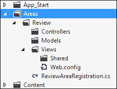
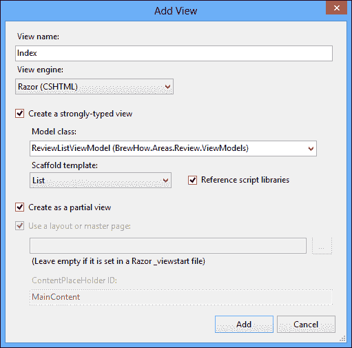
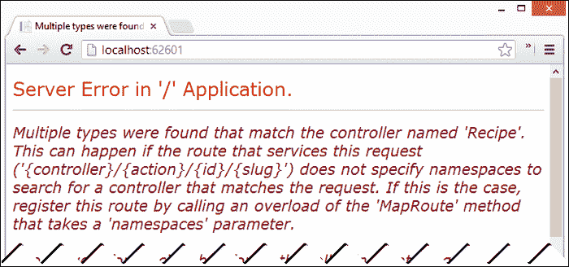
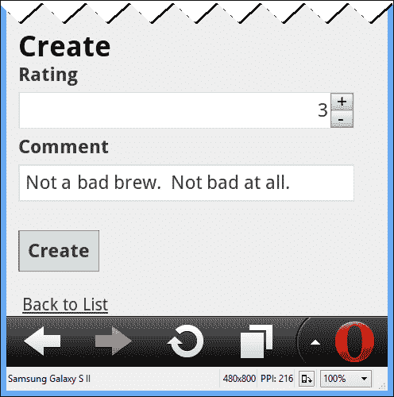

# 七、使用路由和区域分离功能

想想所有以[facebook.com](http://facebook.com)或[twitter.com](http://twitter.com)开头的网址。想想微软网站的 MSDN 部分。想象一下，如果您必须维护控制器和操作来处理从这些站点返回的每一条内容。可以非常肯定地说，这项任务是艰巨的，几乎是不可能的。

虽然我们非常幸运，能够在自己创造的东西中处理这些问题，但很可能我们永远也不会关心如此大规模的可伸缩性和功能。这并不意味着我们的应用永远不会超过某个维护门槛。当它发生时，我们可能会决定我们需要把它分成不同的逻辑部分。我们可能会选择这样做，因为我们的应用变得太大或太复杂，无法让每个控制器都位于`Controllers`文件夹中。有时候只是希望我们的应用的网址简单、有意义、有 RESTful。

在这一章中，我们将把我们的应用分成逻辑部分。这些划分，在架构上，将强制分离关注点。对于我们的用户来说，这些划分将产生有意义和可预测的网址。为了实现这一点，我们将利用 ASP.NET MVC 4 框架的两个特性:路由和区域。

# 路由

在[第 3 章](03.html "Chapter 3. Introducing ASP.NET MVC 4")、*介绍 ASP.NET MVC 4*中，我们了解到 ASP.NET MVC 4 框架通过查看添加到我们路由表中的路由来决定哪个控制器应该处理传入请求。实际上，它使用路由表不仅仅是匹配传入路由。它还使用路由表来确定如何使用 HTML 助手`ActionLink`和`RouteLink`生成网址。当确定如何路由传入请求或生成链接时，运行时从路由表中选择第一个匹配的路由。

目前，我们的`RouteConfig`类注册了一个名为`Default`的单一路由:

```cs
routes.MapRoute(name: "Default",url: "{controller}/{action}/{id}",defaults: new { 
  controller = "Recipe", 
  action = "Index", 
  id = UrlParameter.Optional 
  }
);
```

这条路由对于大多数应用来说已经足够了，在这些应用中，用户只需创建对象，然后通过`id`检索它们。然而，我们的要求之一是允许我们的应用用户根据风格过滤食谱类型的能力。过滤后的食谱列表最好有一个`/Recipe/{style}`的网址，这对用户来说是有意义和清晰的。

由于我们的应用目前正在运行，如果我们使用`/Recipe/{style}`格式的网址调用我们的应用，`Default`路由将导致 404 错误，除非样式名称碰巧与控制器内的动作名称一致；即便如此，它也可能导致我们的应用抛出一个错误。我们需要做的是注册一个新的路由来支持`/Recipe/{style}`格式，并提供一个用户可以调用新路由的机制。

## 按样式定位

我们的默认路由是简单的三段路由，有两个默认值和一个可选值。我们的应用在 0 到 3 段之间的任何请求都将映射到此路由。假设此路由是路由表中注册的第一条路由，它将始终被选择用于具有 3 个或更少网段的任何 URL。我们要注册的新样式路由有两段，因此在默认路由之前注册我们的样式路由似乎是我们需要采取的解决方案。

诚然，在大多数情况下，在默认路由之前注册我们的`Recipe/{style}`路由可以解决问题，但这并不是万无一失的解决方案。考虑网址`/Recipe/Details?id=3`。它不是通常预期的格式，但它仍然是一个非常有效的网址。网址由 2 段组成，以`Recipe`开头。我们希望这个网址显示具有`3`的`id`的食谱的细节，但是如果我们在默认路由之前注册风格路由，运行时将尝试显示具有`Details`风格的所有食谱，这不是我们想要的。

我们需要的是能够先注册我们的风格路由，但只有在`{style}`段确实是一种风格的情况下才能选择它。为此，我们可以对路由应用约束。

### 路由约束

在路由上放置约束允许我们减少运行时在路由选择中涉及的模糊性。为了帮助我们，ASP.NET MVC 框架为我们提供了`IRouteConstraint`界面:

```cs
public interface IRouteConstraint
{
  bool Match(
    HttpContextBase httpContext, 
    Route route, 
    string parameterName, 
    RouteValueDictionary values, 
    RouteDirection routeDirection);
}
```

当一条路由在运行时注册时，我们可以为路由表提供一组约束，每个约束实现`IRouteConstraint`接口。当评估路由匹配时，运行时不仅会尝试将请求与路由的网址进行匹配，还会确保请求通过了所有使用每个注册约束的`Match`方法设置的约束。

我们应该在样式路径上设置约束，以检查传入的样式是否存在。如果样式不存在，则该请求要么是针对由`Default`路由标识的动作，要么是无效的请求。

我们的`RecipeStyleConstraint`约束如下:

```cs
public bool Match(HttpContextBase httpContext,Route route,string parameterName,RouteValueDictionary values,RouteDirection routeDirection)
{
  if (!values.ContainsKey(parameterName))
    {
      return false;
    }

  var styleRepository = DependencyResolver.Current.GetService(typeof(IStyleRepository))as IStyleRepository;

  string styleName =(string)values[parameterName];

  var style = styleRepository.GetStyles().FirstOrDefault(s =>s.Name == styleName);

  return style != null;
}
```

下一步是在路由表中注册路由。我们的风格路由`BeerByStyle`应该限制`{style}`段以匹配我们新的`RecipeStyleConstraint`类中设置的规则:

```cs
routes.MapRoute(name: "BeerByStyle",url: "Recipe/{style}",defaults: new { 
    controller = "Recipe", 
    action = "Style" 
  },
 constraints: new { 
 style = new RecipeStyleConstraint() 
 }
);
```

`BeerByStyle`路由在`Default`路由之前注册，确保先选中。它还确定任何映射到我们路由的请求都应该调用`RecipeController`上的`Style`操作。这是一种新的动作方法，重新使用了当前由`Index`方法使用的`Index`视图。`Index`视图被重用，因为`Index`和`Style`动作的内容没有什么不同。只有上下文发生了变化:

```cs
public ActionResult Style(string style, int page = 0)
{
  var model = new PagedResult<RecipeEntity, RecipeDisplayViewModel>(
    _recipeRepository.GetRecipesByStyleSlug(style),page,ToDisplayModel);

  var styleEntity = _styleRepository.GetStyleBySlug(style);

  if (style != null)
  {
    ViewBag.Title = styleEntity.Name + " Recipes";
  }

  return View("Index", model);
}
```

通过向`ViewBag`添加一个属性，在`Style`动作中解决上下文的这种变化。如果存在`Index`视图，则属性用作标题，否则`Index`视图会将标题设置为简单阅读`Recipes`:

```cs
@model BrewHow.ViewModels.ITypedPagedResult<BrewHow.ViewModels.RecipeDisplayViewModel>
@{
  ViewBag.Title = ViewBag.Title ?? "Recipes";
}
<h2>@ViewBag.Title</h2>
```

通过样式来支持位置，剩下要做的就是为用户提供一种实际调用功能的方法。

### 风格互动

为了让用户使用我们创建的新功能，我们需要做一些事情。首先，我们需要修改`RecipeController`的`Index`视图，使样式名成为实际的链接。这将允许用户看到与他们可能喜欢的食谱风格相同的其他食谱。

我们还需要为用户提供一个直接的机制来找到一种风格，并从该风格中查看该风格的所有食谱。这将需要我们创建一个新的控制器和视图。

#### 配方列表修改

食谱列表当前显示了该食谱的风格以及其他信息。我们需要修改配方列表，将样式的名称转换为实际的链接，这将调用我们的新路由。

到目前为止，我们对`ActionLink` HTML 帮助器的调用非常普通。我们为`ActionLink`助手提供链接文本和控制器动作。我们还将当前正在查看的实体的`id`以匿名类型的形式传递到路由数据字典中，如下所示:

```cs
@Html.ActionLink(item.Name, "Details", new { id=item.RecipeId })
```

为了调用我们的`Recipe`控制器的`Style`动作，我们需要将样式的`Name`属性传递给路由数据字典。为了将`RecipeController's Style`动作的路由与我们将要创建的样式控制器的路由区分开来，我们还希望将控制器的名称传递到 HTML 帮助器中。

用以下代码替换`RecipeController`类的`Index`视图中的`Html.DisplayFor` ( `modelItem => item.Style`)会将样式名称转换为链接:

```cs
@Html.ActionLink(
  Html.DisplayFor(modelItem => item.Style).ToHtmlString(), "Style", "Recipe", new { style = item.Style }, null)
```

现在，请求将`/Recipe/Heffeweisen`适当映射到我们的`Style`行动。该操作过滤配方列表并将结果返回给用户。


#### 样式控制器和视图

创建 `StyleController`类与我们创建的任何控制器没有什么不同。它是存在于我们项目的`Controllers`文件夹中的一个类，并且扩展了`Controller`类。

`StyleController`有一个单独的`Index`动作，从注入到构造函数中的`IStyleRepository`的实现中检索一系列`StyleEntity`对象。`Index`行动的实施在这一点上应该不是什么新鲜事:

```cs
public ActionResult Index(int page = 0)
{
  var model = new PagedResult<StyleEntity, StyleDisplayViewModel>(
    _styleRepository.GetStyles(),page,ToDisplayModel);

  return View(model);
}
```

`Index`动作返回数据的视图也不是什么新鲜事。这是一个分页列表视图，向用户显示应用中的所有啤酒风格。列表中的每一行都显示了样式的名称、样式所属的类别以及查看与该样式相关联的所有食谱的链接:

```cs
@model IEnumerable<BrewHow.ViewModels.StyleDisplayViewModel>
@{
  ViewBag.Title = "Styles";
}
<h2>@ViewBag.Title</h2>
<table>
  <tr>
    <th>
      @Html
      .DisplayNameFor(
        model => model.Name)
    </th>
  <th>
      @Html
       .DisplayNameFor(
        model => model.Category)
    </th>
    <th></th>
  </tr>

  @foreach (var item in Model) {
  /* ... */
}
</table>
```

在我们对网站导航进行所有这些调整的同时，打开我们应用的布局文件，添加一个到`Style`控制器的链接，并删除【关于】的**和**联系我们**的链接。还要更改页面底部的版权和顶部的徽标文本。带有导航调整的样式列表如下图所示:**


我们的解决方案并非没有问题。例如，如果用户正在使用 Opera(或者这个例子中的模拟器)，请求`/Recipe/Brown Ale`将用户重定向到谷歌。出现这种情况是因为 Opera 和一些移动浏览器(以及一些桌面浏览器)将包含空格的 URL 视为对搜索结果的请求。为了解决这个问题，我们需要稍微改变一下策略。我们希望我们的网址是人类可读的，但我们也希望它们能够唯一地识别它们所解析的内容。我们需要的是子弹。

## 重击酿酒

Slugs 是人类可读的标识符，可以单独使用，也可以与另一条可识别信息结合使用，以唯一地识别资源。蛞蝓不仅通过帮助用户唯一识别其浏览器当前显示的内容而对用户有益(`/Recipe/Heffeweisen`比`/Recipe/1`信息量大得多)，蛞蝓在搜索引擎如何对待您的网站方面也发挥着巨大的作用，是常见的 **搜索引擎优化** ( **SEO** )技术。

鉴于 slugs 可以解决我们现有的关于样式名称中空格的网址问题，并且它们可以为我们提供一些搜索引擎优化的好处，我们需要调整我们的模型、实体、视图模型和网址来支持 slugs。

### 模型蛞蝓

我们希望在我们的应用中增加对风格和配方实体、模型和视图模型的支持。实现这一点的第一步是修改`Recipe`和`Style`数据模型类以支持段塞流。这就像给每个模型添加一个`Slug`属性一样简单。而且，正如我们所了解的，对模型的修改将要求我们对数据库进行迁移。

#### 暂存数据库

我们需要修改数据库以支持添加到`Recipe`和`Style`模型中的新`Slug`属性。我们可以通过打开包管理器控制台并执行添加-迁移 Slugs 来做到这一点。这将在项目的`Migration`文件夹中生成我们的 Slugs 迁移类，分别使用`Up`和`Down`方法添加和移除`Slug`属性。

当数据库被植入时，新属性将需要应用于它们的值。我们可以使用`Configuration`类的`Seed`方法来实现这一点，因为它将在应用这些新的更改时执行:

```cs
protected override void Seed(BrewHowContext context)
{
  var brownAle = new Style 
  { 
    Name = "Brown Ale", 
    Category = Category.Ale, 
 Slug = "brown-ale" 
  };

  /* ... */

  context.Styles.AddOrUpdate(
    style => style.Name,
    brownAle,
    /* ... */
  );

  context.Recipes.AddOrUpdate(
    recipe => recipe.Name,
    new Recipe 
    { 
      Name = "Sweaty Brown Ale", 
      Style = brownAle, 
      OriginalGravity = 1.05f, 
      FinalGravity = 1.01f, 
      Slug = "sweaty-brown-ale" 
    },
    /* ... */
  );
}
```

### 注

虽然我们能够使用配置类的`Seed`方法对数据进行这些调整，但有时这可能是不可能的，例如，如果您正在生产数据库上运行迁移。发生这种情况时，您可以使用`DbMigration`类的`Sql`方法直接对数据库执行 SQL，作为迁移过程的一部分。

将变更提交给模型所剩下的就是在包管理器控制台中运行`Update-Database`命令。

#### 修改实体

域级别的实体需要进行调整，以支持对 slugs 的检索和设置，以及对属性施加的任何规则或逻辑。由于我们目前没有提供创建或编辑样式的机制，对`StyleEntity`类的调整就像在定义中添加`Slug`属性一样简单。给`RecipeEntity`类添加一个`Slug`属性有点不同。

一个**网址**，顾名思义就是一个**统一资源定位符**。网址永远唯一地标识一个资源在互联网上的位置。因为我们将使蛞蝓成为网址的一部分，我们的蛞蝓不能改变。其含义是`RecipeEntity`类的`Slug`属性被设置一次，而且只设置一次。因此，我们的`RecipeEntity`类需要逻辑放入`Slug`属性中，只允许`Slug`设置一次:

```cs
public string Slug
{
  get
  {
    if (string.IsNullOrEmpty(this._slug))
    {
      if (string.IsNullOrEmpty(this.Name))
      {
        return string.Empty;
      }
      this._slug = Regex.Replace(
        this
        Name
        ToLower()
        .Trim(), 
        "[^a-z0-9-]", 
        "-");
    }

    return this._slug;
  }

  set
  {
    if (!string.IsNullOrEmpty(this._slug))
    {
      throw new InvalidOperationException(
        "The slug for the recipe has already been set.");
    }

    this._slug = value;
  }
}
```

我们的`RecipeEntity`类中的 slug 是在第一次检索时生成的，只有在不存在任何值的情况下才能赋值。如果生成，`Name`属性将用作`Slug`属性的种子值。任何其他设置都是无效操作。

### 类型

**DDD 在行动**

将我们的领域实体从我们的数据模型中分离出来，使我们能够独立于存储和表示来实施领域规则。从模型到实体的映射仍然发生在存储库中，但是存储库不负责知道应用于实体的规则。这只是将域转移到持久存储的一种方式。同样，我们的视图和控制器对域实体的规则一无所知。他们只是在存储库和用户之间封送它们。

#### 蛞蝓检索

如果我们要通过它们的 slug 来检索样式，我们应该修改`BrewByStyle`路由来获取 slug，而不是样式的名称。我们需要修改仓库界面`IStyleRepository`来提供一个支持功能的方法。这个方法可以通过注入到`RecipeController`中的`StyleRepository`类来实现，并通过`RecipeStyleConstraint`中的依赖关系解析来使用:

```cs
public StyleEntity GetStyleBySlug(string slug)
{
  return this.StyleEntities.FirstOrDefault(s => s.Slug == slug);
}
```

我们还需要对`Default`路由进行调整，以接受可选的废料。这里的废料对数据检索或存储没有影响。它只是用来让网址更清晰:

```cs
routes.MapRoute(
  name: "Default",
  url: "{controller}/{action}/{id}/{slug}",
  defaults: new { 
    controller = "Recipe", 
    action = "Index", 
    id = UrlParameter.Optional, 
 slug = UrlParameter.Optional 
  }
);
```

最后，我们的视图和视图模型也应该可以访问`Slug`属性。这里的工作相当直接。在视图模型上为配方和样式创建`Slug`属性，然后更改任何生成的链接，将废料传递回控制器。给生成的网址添加一个 slug 就像给`ActionLink`和`RouteLink` HTML 助手的`routeValues`参数添加一个 slug 键一样简单:

```cs
@Html.ActionLink(item.Name, "Details", new 
{ 
  id=item.RecipeId, 
 slug=item.Slug 
})
```

通过阅读本书附带的代码，可以看到这些变化的全部范围。这些更改的结果可以在下面的截图中查看，该截图显示了网址中包含的废料配方的详细信息:


# 区域

虽然我们可以使用路由来创建友好且有意义的 URL，但是在分组功能方面，路由并不是最好的工具。当我们需要将功能分组到不同的逻辑容器中时，无论是减少控制器或动作方法的数量，还是创建一个位置来放置代码来处理横切关注点，区域都是您想要的。

虽然我们的应用专注于食谱的收集，但我们也希望为用户提供一个社交组件，允许他们查看他人提交的食谱。鉴于评审带来了他们自己的一套管理需求，我们有理由将这一功能划分到一个领域。

## 创建评论区

要将区域添加到我们的项目中，只需右键单击该项目，然后从上下文菜单导航到**添加** | **区域……**。


当出现**添加区域**对话框时，在标有**区域名称:**的文本框中输入`Review`，点击**添加**按钮。


MVC 项目中的区域都包含在`Areas`文件夹中。对于项目中包含的每个区域，都有一个文件夹结构，它在很大程度上反映了 MVC 项目根的结构。



我们的 `Review`区域包含一个名为`ReviewAreaRegistration.cs`的文件。该文件是一个区域注册文件，用于通知框架该区域的存在。

## 注册评论区

我们的`Review`区域中的`ReviewAreaRegistration.cs`文件扩展了一个名为`AreaRegistration`的特殊类。它包含一个向应用注册区域的方法和一个通过名称识别区域的属性:

```cs
public class ReviewAreaRegistration : AreaRegistration
{
  public override string AreaName
  {
    get
    {
      return "Review";
    }
  }

  public override void RegisterArea(AreaRegistrationContext context)
  {
    context.MapRoute(
    "Review_default",
    "Review/{controller}/{action}/{id}",
    new { 
      action = "Index", 
      id = UrlParameter.Optional   
    });
  }
}
```

通过调用`AreaRegistration.RegisterAllAreas`方法，应用被告知该区域和应用内的所有其他区域。我们在`Global.asax.cs`文件中这样做:

```cs
protected void Application_Start()
{
  ServiceLocatorConfig.RegisterTypes();
 AreaRegistration.RegisterAllAreas();
  WebApiConfig.Register(GlobalConfiguration.Configuration);
  FilterConfig.RegisterGlobalFilters(GlobalFilters.Filters);
  RouteConfig.RegisterRoutes(RouteTable.Routes);
  BundleConfig.RegisterBundles(BundleTable.Bundles);
  AuthConfig.RegisterAuth();
}
```

### 注

你没疯。我们实际上并没有将这段代码放在这里，它是我们在创建 BrewHow 应用解决方案时选择的应用模板的一部分。除非您使用知道这些区域的模板，否则它们不会自动在应用中注册，然后它们会自动注册。

调用时，`RegisterAllAreas`方法在应用集中搜索所有继承`AreaRegistration`的类。然后它调用它找到的每个类的`RegisterArea`方法。在我们的`RegisterArea`方法中，我们注册运行时应该用来将传入请求映射到我们的`Review`区域中的控制器的任何路由。

如果您检查前面显示的我们的`RegisterArea`方法中的路由，您将看到所有根为`Review/`的请求都可以映射到我们的区域，并且随后的请求的任何部分都将映射到控制器、动作和标识中。继续添加一条蛞蝓作为评论区路由的一部分。如果您需要帮助，可以参考随附的代码。

## 配方审查控制器

我们的评论区需要一个控制器来处理列出和创建评论的请求。要添加控制器，只需右键单击`Review`区域的`Controller`文件夹，并添加名为`RecipeController`的控制器。

在**添加控制器**对话框中，确保选择**清空 MVC 控制器**模板，然后点击**添加**。一旦我们创建了视图模型，我们将返回来填写我们的`RecipeController`类。

### 配方审查视图模型

视图模型是我们的`RecipeController`动作方法和它们向其发送数据的视图的先决条件。右键单击`Review`区域文件夹，创建一个文件夹来保存我们的视图模型，并创建一个名为`ViewModels`的新文件夹。在这个文件夹中，创建两个名为`ReviewEditViewModel`和`ReviewListViewModel`的新类。这些类除了名字之外都是相同的。这些类的代码如下:

```cs
public class ReviewEditViewModel
{
  public int Rating { get; set; }
  public string Comment { get; set; }
}

public class ReviewListViewModel
{
  public int Rating { get; set; }
  public string Comment { get; set; }
}
```

### 配方审查行动方法

现在视图模型已经存在，我们可以填写我们的`RecipeController`类了。`RecipeController`类将有三个动作。

第一个动作`Index`包含检索由`id`参数识别的配方的所有评审的代码。

另外两种操作方法允许我们为一个食谱创建评论；用`HttpGet`修饰的动作方法返回用户进入评审的视图，而用`HttpPost`修饰的动作方法调用存储库来持久化评审，并将用户重定向回配方的细节:

```cs
public class RecipeController : Controller
{
  public ActionResult Index(int id)
  {
    /* ... */
  }

  [HttpGet]
  public ActionResult Create(int id)
  {
    /* ... */
  }

  [HttpPost]
  public ActionResult Create(
    int id, 
    ReviewEditViewModel reviewEditViewModel)
  {
    /* ... */
  }
}
```

应该指出的是，我们的新`RecipeController`使用的是`IReviewRepository`的实例，但是没有实现该接口的类注册到我们的依赖解析器中。要解决这个问题，打开`App_Start`文件夹中的`ServiceLocatorConfig.cs`文件，并将`IReviewRepository`界面添加到导出中:

```cs
private static void RegisterRepositories(RegistrationBuilder rb)
{
  rb.ForTypesDerivedFrom<IRecipeRepository>()
  .Export<IRecipeRepository>()
  .SetCreationPolicy(CreationPolicy.NonShared);

  rb.ForTypesDerivedFrom<IStyleRepository>()
  .Export<IStyleRepository>()
  .SetCreationPolicy(CreationPolicy.NonShared);

 rb.ForTypesDerivedFrom<IReviewRepository>()
 .Export<IReviewRepository>()
 .SetCreationPolicy(CreationPolicy.NonShared);
}
```

我们现在已经创建了我们的控制器，它运行的视图模型，以及允许我们创建和检索评论的操作方法。最后一步是创建我们的视图。

### 创建视图

我们将使用 Visual Studio 脚手架为我们的动作方法创建视图。我们首先需要构建我们的应用，让 Visual Studio 知道我们的视图模型。通过按下*Ctrl*+*Shift*+*B*或从**构建**菜单中选择**构建解决方案**来完成此操作。

构建完成后，右键单击`Index`操作中的任意位置，并从上下文菜单中选择**添加视图**。由于我们想要创建一个强类型视图来列出一个食谱的评论，所以勾选标记为**的复选框创建一个强类型视图**，将**模型**类设置为`ReviewListViewModel`，并在**支架模板**中选择**列表**。由于该视图将被放置在配方的详细信息下方，因此也要勾选标记为**的复选框，创建为部分视图**。完成这些步骤后，确认对话框看起来类似于下面的截图，然后点击**添加**。



选择 **ReviewEditViewModel** 作为**模型类**和**为**脚手架模板**创建**，对`Create`动作方法重复相同的步骤。确保此视图不是作为局部视图创建的。

在`Review`区域打开我们的`RecipeController`的`Index.cshtml`视图，并用以下代码替换:

```cs
@model IEnumerable<BrewHow.Areas.Review.ViewModels.ReviewListViewModel>

<table>
  <tr>
    <th>
      @Html.DisplayNameFor(model => model.Rating)
    </th>
    <th>
      @Html.DisplayNameFor(model => model.Comment)
    </th>
  </tr>

  @foreach (var item in Model) {
    <tr>
      <td>
        @Html.DisplayFor(modelItem => item.Rating)
      </td>
      <td>
        @Html.DisplayFor(modelItem => item.Comment)
      </td>
    </tr>
  }

</table>
<p>
 @Html.ActionLink("Create New", 
 "Create", 
 new {
 area = "Review", 
 id = ViewBag.RecipeId 
 } 
 )
</p>
```

`Index`视图现在列出了给定食谱的所有评论。它还提供了一种机制通过使用突出显示的`ActionLink`调用来创建新的审查。在`ActionLink`调用中，我们为路由数据字典提供了额外的值，因此当运行时构建 URL 时，它有足够的信息来创建到适当的`Create`动作方法的链接。

显示审核列表的最后一步是将其添加到我们根`RecipeController`中的详细视图中。打开`Details.ascx`文件，在底部增加以下一行:

```cs
@{Html.RenderAction("Index", "Recipe", new { 
  area = "Review", 
  id = Model.RecipeId, 
  slug = Model.Slug 
  });
}
```

### 区域路由值

请注意我们的`RenderAction`，就像在它之前突出显示的`ActionLink`代码一样，也在向路由数据字典传递一些额外的路由值。路由的区域通过路由数据字典传递，就像控制器和动作的值一样。在`ActionLink`和`RenderAction`链接中，运行时将在构建路由时使用当前请求的区域，除非另有指示。这在某些情况下会导致一些不必要的行为。

在这个特定的场景中，我们指示运行时使用`Review`区域为我们的配方控制器的视图呈现链接和动作。这将强制选择`Review`区域内的路由，而不是我们应用的任何其他区域。

我们的布局页面还包含链接，呈现与名为`RecipeController`的控制器相关联的视图。这些链接位于顶部导航横幅中:

```cs
@Html.ActionLink("Recipes", "Index", "Recipe")
```

当在我们应用的默认区域，这些链接呈现为`/Recipes/Index`。当在`Review`区域时，路由数据字典中的区域值为`Review`，前面的评估为`/Review/Recipes/Index`。这不是我们想要的。我们希望这些路由始终符合我们的食谱清单。如果我们将该区域提供给路由数据字典，我们可以解决这个问题:

```cs
@Html.ActionLink(
  "Recipes", 
  "Index", 
  "Recipe", 
  new { area = "" }, 
  null)
```

虽然说我们到此为止很好，但是运行时有不同的意见。如果我们现在启动我们的应用，我们仍然会看到一个不错的例外:



这个屏幕的概要是这样的:当确定作为请求的一部分执行的控制器时，运行时实际上并不评估整个名称空间，除非明确告诉这样做。因为我们的 app 包含两个名为`RecipeController`的控制器，所以运行时无法区分我们 app 根目录中的`RecipeController`和我们`Review`区域中的`RecipeController`。我们需要给它一个提示。

### 路由命名空间

当我们的路由在`MapRoute`方法中声明时，我们可以限制路由引擎搜索控制器的命名空间。我们目前在两个地方申报航线，我们的`Review`地区的`ReviewAreaRegistration`班和`App_Start`的`RouteConfig`班。

为了限制名称空间，我们只需要向`ReviewAreaRegistration`和`RouteConfig`添加一个`namespaces`参数。`RouteConfig`中新参数的值如下代码所示:

```cs
routes.MapRoute(
  name: "BeerByStyle",
  url: "Recipe/{style}",
  defaults: new { controller = "Recipe", action = "Style" },
  constraints: new { style = new RecipeStyleConstraint() },
 namespaces: new [] { "BrewHow.Controllers" }
);
```

至于我们的`ReviewAreaRegistration`类，修改如下:

```cs
context.MapRoute(
  name: "Review_default",
  url: "Review/{controller}/{action}/{id}/{slug}",
  defaults: new { 
    action = "Index", 
    id = UrlParameter.Optional, 
    slug=UrlParameter.Optional },
 namespaces: new[] {
 "BrewHow.Areas.Review.Controllers"}
);
```

现在，如果我们启动我们的应用，我们会收到我们熟悉的食谱列表。点击菜谱的详细信息，我们将看到一个屏幕，下面显示了新的评论列表:


如果我们点击**创建新的**链接，我们将被带到我们的`Review`区域中我们的新`RecipeController`返回的`Create`视图:



并且，如果我们点击**创建**按钮，我们将返回到`Detail`视图，该视图现在将显示我们的审查:


# 总结

我们从在路由表中添加路由开始本章的工作。这条新路由为我们的用户提供了一个有意义和可预测的网址，允许他们根据风格过滤其他用户贡献给我们应用的食谱。我们还了解到，创建这些有意义的网址有助于优化我们的搜索引擎网站。

我们的应用也分为几个区域。这些领域将管理食谱和评论的关注点分开，并将使我们的应用在未来更容易维护。

在下一章中，我们将通过向控制器和视图添加用户输入验证来继续改进我们的应用。