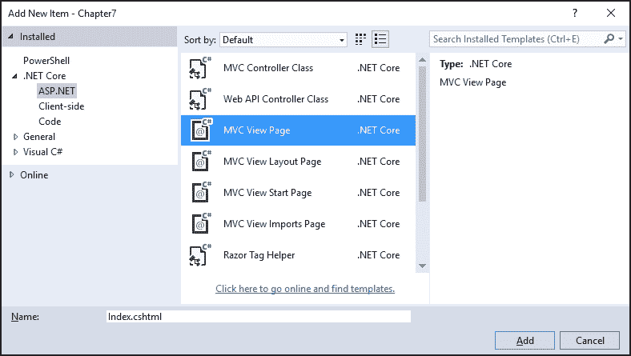
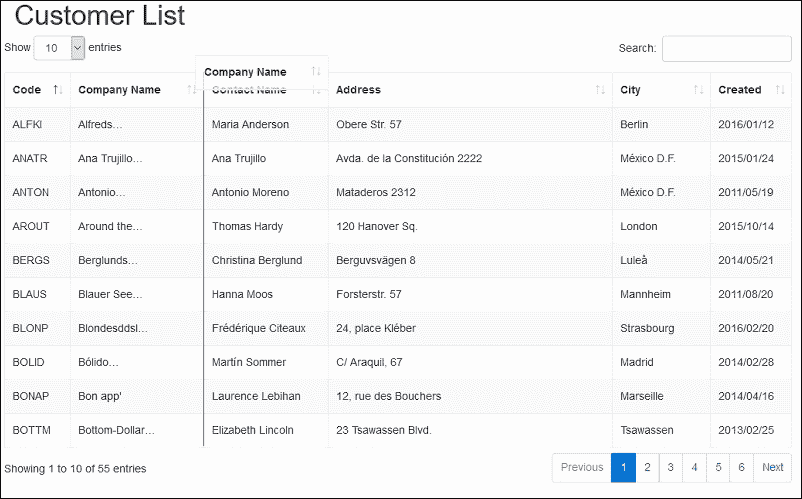
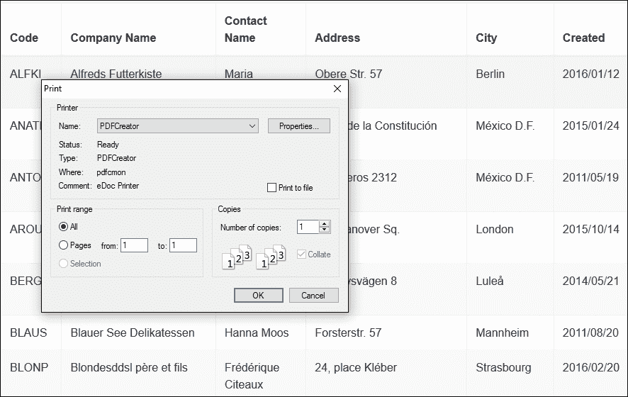

# 七、在 Bootstrap 4 中使用 jQuery 数据表插件

jQuery `DataTables`插件允许开发人员向任何 HTML 表格添加创新的交互控件。

它支持多种选项和广泛的扩展。ASP.NET MVC 开发人员也能够在他们自己的项目中包含这个插件。这一章的目的不仅仅是向你展示如何使用`DataTables`插件，也是为了说明你如何使用几乎任何带有 ASP.NET MVC 的开源 JavaScript 和 CSS 插件或框架。

在本章中，我们将涵盖以下主题:

*   jQuery 概述`DataTables`
*   如何在你的 ASP.NET MVC 项目中包含 jQuery `DataTables`
*   更改 jQuery `DataTables`以支持 Bootstrap 4
*   用 jQuery `DataTables`和 ASP.NET 加载和显示数据
*   使用`DataTables`插件和扩展

# jQuery 约会对象

DataTables 是 jQuery JavaScript 库的一个免费开源插件，由一家名为 SpryMedia Ltd .的公司设计和创建。这个插件使得向任何标准 HTML 表添加排序、过滤、分页和搜索等功能变得非常容易实现。

它还提供了各种扩展，支持类似 Excel 的功能、内联编辑和固定列等。数据表网站提供了大量的例子、博客和论坛，你可以在[www.datatables.net](http://www.datatables.net)上找到。

jQuery DataTables 插件可以通过多种方式添加到您的 ASP.NET MVC 项目中，包括 NPM、鲍尔或 DataTables **内容交付网络** ( **CDN** )。

# 向您的 ASP.NET MVC 项目添加数据表

要添加数据表插件的基本功能，需要以下两个文件:

*   第一个是`jquery.dataTables.css`，它包含了表格的默认 CSS 样式
*   第二个是`jquery.dataTables.js`，它包含用于渲染`DataTables`插件和添加必要功能的 JavaScript 逻辑

这两个文件都可以通过以下链接在数据表 CDN 中找到:

*   [https://cdn . datatable . net/1 . 10 . 11/CSS/jquery . datatable . min . CSS](https://cdn.datatables.net/1.10.11/css/jquery.dataTables.min.css)
*   [https://cdn . datatable . net/1 . 10 . 11/js/jquery . datatable . min . js](https://cdn.datatables.net/1.10.11/js/jquery.dataTables.min.js)

## 使用数据表鲍尔包

您还可以使用 Bower 添加 jQuery `DataTables`所需的所有 CSS 和 JavaScript 文件，以及扩展所需的所有 CSS 和 JavaScript 文件。使用 Bower 时，完成以下步骤添加 jQuery `DataTables`:

1.  在 Visual Studio 中，打开`bower.json`文件。如果在 Visual Studio 解决方案资源管理器中没有看到`bower.json`文件，请单击**显示所有文件**按钮。
2.  将以下两个包添加到文件内部的依赖列表中:

    ```cs
            "datatables.net": "1.10.12", 
            "datatables.net-dt": "1.10.12" 

    ```

3.  `datatables.net`包会将 jQuery DataTables 包添加到项目的`wwwroot\lib`文件夹中，`datatables.net-dt`包会为 jQuery `DataTables`添加基础样式。
4.  `datatables.net`包包含 JavaScript 文件，`datatables.net-dt`包将包含`jQuery DataTables`的 CSS/样式表。

## 使用 CDN

您可以从上述位置保存文件，将它们添加到项目中，或者添加对 CDN 上托管的文件的引用。后一种选择是首选方法，将有助于提高您的网站的性能。

要从 CDN 引用它，请完成以下步骤:

1.  在 Visual Studio 中，打开本书附带的示例项目，打开位于`Views\Shared`文件夹内的`_Layout.cshtml`文件。
2.  在`_Layout.cshtml`文件的`<head>`元素中，通过插入以下标记行来添加对 jQuery DataTables 样式表的引用:

    ```cs
            <link rel="stylesheet" type="text/css" href="//cdn.datatables.net 
            /1.10.12/css/jquery.dataTables.css"> 

    ```

3.  打开需要`DataTables`功能的视图，通过在视图底部添加以下代码来添加对 JavaScript 库的引用:

    ```cs
            @section scripts{ 
                <script type="text/javascript" language="javascript"         
                src="//cdn.datatables.net/1.10.12/js/jquery.dataTables.min.js">
                </script> 
            }  

    ```

## 向数据表添加 Bootstrap 数据库样式

前面提到的步骤将向视图和布局文件中添加最少的必需文件，以便为 jQuery `DataTables`生成基本的样式和功能。然而，默认的`DataTables` CSS 样式在 Bootstrap 网站中看起来有些不合适。

幸运的是，数据表项目背后的团队创建了一个特定于 Bootstrap 的 CSS 样式和 JavaScript 库，以匹配您的站点的外观。这两个文件也可以在数据表 CDN 上获得:

*   [https://cdn . datatable . net/1 . 10 . 12/CSS/datatable。bootstrap 4 . min . CSS](https://cdn.datatables.net/1.10.12/css/dataTables.bootstrap4.min.css)
*   [https://cdn . datatables . net/1 . 10 . 12/js/datatables . bootstrap 4 . min . js](https://cdn.datatables.net/1.10.12/js/dataTables.bootstrap4.min.js)

这两个文件的添加方式与普通`DataTables` CSS 和 JavaScript 文件相同。请记住，当在视图中包含特定于 Bootstrap 的`DataTables` JavaScript 文件时，您需要同时包含对默认`DataTables` JavaScript 文件和特定于 Bootstrap 的文件的引用，如以下标记所示:

```cs
@section scripts{ 
    <script type="text/javascript" language="javascript" 
      src="//cdn.datatables.net/1.10.12/js/jquery.dataTables.min.js">
     </script> 
    <script type="text/javascript" language="javascript" 
     src="//cdn.datatables.net/1.10.12/js/dataTables.bootstrap4.min.js">
    </script> 
   } 

```

# 在 jQuery 数据表中加载和显示数据

为了实现 jQuery `DataTables`插件，您首先需要创建一个新的视图，在一个 HTML 表中列出数据。在本例中，您将创建一个显示客户列表的视图。该列表可以从任何数据源读取，例如 SQL Server 数据库。在本例中，将使用一个简单的列表对象。

为此，请完成以下步骤:

1.  在 Visual Studio 中，将名为`CustomerController.cs`的新控制器类添加到`Controllers`文件夹中。
2.  将名为`Models`的新文件夹添加到项目的根目录，并向其中添加名为`Customer.cs`的新类。
3.  `Customer`类将用于检索样本客户记录列表。该类的代码如下:

    ```cs
            public class Customer 
            { 
                public string CustomerCode { get; set; } 
                public string CompanyName { get; set; } 
                public string ContactName { get; set; } 
                public string ContactTitle { get; set; } 
                public string Address { get; set; } 
                public string City { get; set; } 
                public DateTime CreatedDate { get; set; } 
            } 

    ```

4.  接下来，打开`CustomerController`类，添加一个名为`GetCustomers`的新方法。有关`GetCustomers`方法的完整列表，请参考本章随附的示例项目。这个方法将简单地返回一个样本客户数据列表，如下面的代码所示:

    ```cs
            public List<Customer> GetCustomers() 
            { 
                var customers = new List<Models.Customer> 
                { 
                    new Models.Customer() {
                      CustomerCode = "ALFKI", 
                      CompanyName = "Alfreds Futterkiste", 
                      ContactName = "Maria Anderson", 
                      ContactTitle = "Sales Representative", 
                      Address = "Obere Str. 57", 
                      City = "Berlin", 
                      CreatedDate = new DateTime(2016,01,12) }, 
                    new Models.Customer() {
                      CustomerCode = "AROUT", 
                      CompanyName = "Around the Horn", 
                      ContactName = "Thomas Hardy", 
                      ContactTitle = "Sales Representative", 
                      Address = "120 Hanover Sq.", 
                      City = "London", 
                      CreatedDate = new DateTime(2015,10,14)}, 
                    new Models.Customer() { 
                       CustomerCode = "CHOPS", 
                       CompanyName = "Chop-suey Chinese", 
                       ContactName = "Yang Wang", 
                       ContactTitle = "Owner", 
                       Address = "Hauptstr. 29", 
                       City = "Bern", 
                       CreatedDate = new DateTime(2010,7,14)}, 
                    new Models.Customer() { 
                       CustomerCode = "EASTC", 
                       CompanyName = "Eastern Connection", 
                       ContactName = "Ann Devon", 
                       ContactTitle = "Sales Agent", 
                       Address = "35 King George", 
                       City = "London", 
                       CreatedDate = new DateTime(2015,10,15)}, 
                    ... 
                }; 
                return customers; 
            } 

    ```

5.  为了检索客户列表并将数据传递给视图，将`CustomerController`上的`Index`方法改为如下:

    ```cs
    public IActionResult Index() 
    { 
        var model = GetCustomers(); 
        return View(model); 
    } 

    ```

6.  接下来，在`Views`文件夹内创建一个名为`Customer`的新子文件夹。
7.  右键单击新创建的`Customer`文件夹，选择**添加** | **新项目...**从上下文菜单中选择。
8.  Select **MVC View Page** from the list of items, name the file `Index.cshtml`, and click on **Add**, as shown in the following screenshot:

    

9.  将新添加视图的标记更改为以下内容:

    ```cs
            @model IEnumerable<Chapter8.Models.Customer> 
            @{ 
                Layout = "_Layout"; 
            } 
            <div class="container"> 
                <h1>Customer List</h1> 
                <div class="row"> 
                    <table id="customer-table" 
                     class="table table-striped table-bordered"> 
                        <thead> 
                        <tr> 
                            <th>Code</th> 
                            <th>Company Name</th> 
                            <th>Contact Name</th> 
                            <th>Address</th> 
                            <th>City</th> 
                            <th>Created</th> 
                        </tr> 
                        </thead> 
                        <tbody> 
                        @foreach (var customer in Model) 
                        { 
                            <tr> 
                                <td>@customer.CustomerCode</td> 
                                <td>@customer.CompanyName</td> 
                                <td>@customer.ContactName</td> 
                                <td>@customer.Address</td> 
                                <td>@customer.City</td> 
                                <td>@customer.CreatedDate.ToString("d")</td> 
                            </tr> 
                        } 
                        </tbody> 
                    </table> 
                </div> 
            </div> 

    ```

在此标记中，`table-striped`、`table-hover`和`table-bordered`样式已添加到其`id`属性已设置为`customer-table`的表格中。您还会注意到，列标题名称被包装在`<thead>`元素中，表格行被包装在`<tbody>`元素中。

视图的 HTML 标记现在已经准备好了。完成以下步骤，为表启用 jQuery 数据表功能:

1.  打开`Views\Shared`文件夹中的`_Layout.cshtml`文件。
2.  通过在`<head>`元素中添加以下标记，添加对 jQuery `DataTables`基础和 Bootstrap 样式表的引用:

    ```cs
          <link rel="stylesheet" type="text/css" href="~/css/bootstrap.css" /> 
          <link rel="stylesheet" type="text/css" href="//cdn.datatables.net    
           /1.10.11/css/dataTables.bootstrap4.min.css"> 

    ```

3.  滚动到`_Layout.cshtml`文件的底部，添加对 jQuery 以及 Bootstrap JavaScript 文件的引用:

    ```cs
            <script src="~/lib/jquery/dist/jquery.js"></script> 
            <script src="~/lib/bootstrap/dist/js/bootstrap.js"></script> 

    ```

4.  另外，确保在`_Layout.cshtml`文件的底部有一个名为脚本的部分声明:

    ```cs
            @RenderSection("scripts", required: false) 

    ```

5.  打开`Views\Customer`文件夹中的`Index.cshtml`文件。在文件底部添加以下代码:

    ```cs
            @section scripts{ 
                <script type="text/javascript" 
                  src="//cdn.datatables.net/1.10.11/js/jquery.dataTables.min.js">
                 </script> 
                <script type="text/javascript" 
                  src="//cdn.datatables.net/1.10.11
                    /js/dataTables.bootstrap4.min.js">
                </script> 
                <script type="text/javascript"> 
                    $(document).ready(function () { 
                        $('#customer-table').DataTable(); 
                    }); 
                </script> 
            } 

    ```

在前面的步骤中，您已经添加了对`DataTables`样式表以及 JavaScript 文件的必要引用。您还创建了一个 jQuery 事件处理程序，一旦页面加载，它将在类名为`table`的所有 HTML 元素上启用 DataTable 功能。

当您运行项目并导航到客户视图时，您将看到客户列表自动分页为十个一组，并且您能够在表中搜索和排序数据，如下图所示。表的默认 Bootstrap 4 样式也得到正确应用:


# 数据表插件

jQuery DataTables 提供了很多内置特性和灵活性，但是如果您希望添加自己的特性或者需要额外的灵活性，它确实提供了插件架构。

### 注

这些只是数据表库可用的一些插件。要查看可用插件的完整列表，请访问[https://datatables.net/plug-ins/index](https://datatables.net/plug-ins/index)

## 日期排序

由于各种不同的日期格式，日期排序有时会非常具有挑战性。幸运的是，jQuery `DataTables`提供了一个使用`Moment.js` JavaScript 库对日期字段进行排序的灵活解决方案。

### 注

Moment.js 是一个免费的开源库，可以很容易地在 JavaScript 中显示、解析、操作和验证日期。你可以在[http://momentjs.com/](http://momentjs.com/)阅读更多关于 Moment.js 图书馆的信息。

要在上一示例中使用的`Created Date`列上启用日期排序，请完成以下步骤:

1.  打开`Views\Customer`文件夹内的`Index.cshtml`文件。
2.  通过在`Index.cshtml`文件的末尾添加以下代码，将`moment.js`库包含在您的视图中。请务必将其添加到`dataTables.bootstrap.min.js`文件之后:

    ```cs
            <script type="text/javascript" 
              src="//cdnjs.cloudflare.com/ajax/libs/moment.js/2.8.4/moment.min.js">        </script> 

    ```

3.  接下来，通过在`moment.js`文件后添加以下行，将`DataTables`排序插件添加到视图中:

    ```cs
            <script type="text/javascript" src="//cdn.datatables.net/plug-
            ins/1.10.11/sorting/datetime-moment.js"></script> 

    ```

4.  最后，更改视图中的 JavaScript 代码，初始化时刻排序库。您可以通过将其作为参数传递来指定应该排序的日期格式:

    ```cs
            <script type="text/javascript"> 
                $(document).ready(function () { 
                    $(document).ready(function () { 
                        $.fn.dataTable.moment('DD/MM/YYYY'); 
                        $('#customer-table').DataTable(); 
                    }); 
                }); 
            </script> 

    ```

## 渲染

jQuery DataTables 呈现插件可以用来改变数据在表中的显示方式。为了将数据(在本例中是公司名称)限制在特定的长度，并以省略号(...)，例如，北风...，完成以下操作:

1.  打开`Views\Customer`文件夹内的`Index.cshtml`文件。
2.  通过在视图底部和 jQuery `DataTables`库之后添加以下内容来添加`DataTables`省略号数据呈现插件:

    ```cs
            <script type="text/javascript" src="//cdn.datatables.net/plug-
            ins/1.10.11/dataRender/ellipsis.js"></script> 

    ```

3.  更改`DataTables`初始化代码以使用省略号插件。targets 参数用于指定在哪个列上使用插件:

    ```cs
            $('#customer-table').DataTable({ 
                columnDefs: [{ 
                    targets: 1, 
                    render: $.fn.dataTable.render.ellipsis(15, true) 
                }] 
            }); 

    ```

省略号插件接受三个参数；第一个是限制显示的字符数，第二个是布尔值，指示截断是否不应出现在单词中间。最后一个布尔参数用于转义 HTML 实体。

# 数据表扩展

jQuery DataTables 插件提供了各种各样的扩展，可以极大地增强插件的功能。

### 注

要查看数据列表库所有可用扩展的列表，请参见[https://datatables.net/extensions/index](https://datatables.net/extensions/index)

## ColReorder 扩展

ColReorder 扩展允许用户通过单击列标题并将其拖动到他们喜欢的位置来对表列重新排序。要为数据表启用列重新排序，请完成以下步骤:

1.  打开`_Layout.cshtml`文件，添加对`dataTables.colReorder.css`文件的引用:

    ```cs
            <link rel="stylesheet" type="text/css" href="https://cdn.datatables.net        /colreorder/1.3.1/css/colReorder.bootstrap.min.css" /> 

    ```

2.  打开视图`.cshtml`文件，添加对`DataTables` `colReorder`扩展名 JavaScript 文件的引用:

    ```cs
            <script type="text/javascript" charset="utf8" src="//cdn.datatables.net
            /colreorder/1.3.1/js/dataTables.colReorder.min.js"></script> 

    ```

3.  最后，使用 jQuery，在页面加载后添加一个事件处理程序来初始化`DataTables`插件和 colReorder 扩展:

    ```cs
            $('#customer-table').DataTable({ 
                colReorder: true 
            }); 

    ```

4.  When navigating to the page, you should now be able to drag and reorder the columns in the table. A blue line will be displayed when dragging a column, as illustrated in the following screenshot:

    

    ### 类型

    请注意，扩展的所有样式表和 JavaScript 文件都是从`DataTables` CDN 中引用的。CDN 可在[cdn.datatables.net](http://cdn.datatables.net)获得

## 颜色按钮扩展

ColVis 扩展将一个按钮添加到数据表的顶部，单击该按钮时，会显示表中的列名列表，旁边有一个复选框。然后，用户可以取消选择他们不希望在网格中看到的列名。

要启用列可见性扩展，请执行以下步骤:

1.  打开`_Layout.cshtml`文件，并添加对`DataTables`按钮扩展:

    ```cs
            <link rel="stylesheet" type="text/css" href="https://cdn.datatables.net
            /buttons/1.1.2/css/buttons.bootstrap4.min.css" /> 

    ```

    的 Bootstrap 4 特定样式表的引用
2.  打开`view.cshtml`文件，添加对`DataTables`按钮扩展名、Bootstrap 4 特定按钮扩展名以及按钮 ColVis 扩展名:

    ```cs
            <script type="text/javascript" 
              src="//cdn.datatables.net/buttons/1.1.2/js/dataTables.buttons.min.js">
            </script> 
            <script type="text/javascript" 
              src="//cdn.datatables.net/buttons/1.1.2/js/buttons.bootstrap4.min.js">
            </script> 
            <script type="text/javascript" 
              src="//cdn.datatables.net/buttons/1.1.2/js/buttons.colVis.min.js">
            </script> 

    ```

    的引用
3.  最后，使用 jQuery，在页面加载后添加一个事件处理程序来初始化`DataTables`插件和 ColVis 扩展:

    ```cs
            $('#customer-table').DataTable({ 
                dom: 'Bfrtip', 
                buttons: [ 
                    'colvis' 
                ] 
            }); 

    ```

最后一步中的代码使用`dom`参数来指定控件元素在 DOM 中的位置。对于按钮，使用字母`B`。当导航到视图时，您应该会看到搜索框旁边的按钮，您可以使用该按钮显示或隐藏表中的列，如下图所示:


## 复印和打印按钮扩展

使用相同的`DataTables`扩展，可以给表格添加一个工具栏，用户可以用它将表格内的数据复制到剪贴板，或者显示表格内数据的打印视图。这是一种非常简单的方法，让您的用户能够导出或打印他们的数据。

要启用表格的复制和打印功能，请执行以下步骤:

1.  打开`_Layout.cshtml`文件，并添加对`DataTables`按钮扩展:

    ```cs
            <link rel="stylesheet" type="text/css" href="https://cdn.datatables.net
            /buttons/1.1.2/css/buttons.bootstrap4.min.css" /> 

    ```

    的 Bootstrap 4 特定样式表的引用
2.  接下来，打开视图并添加对`DataTables`按钮扩展、Bootstrap 4 特定按钮扩展、HTML 5 按钮扩展以及打印按钮扩展:

    ```cs
            <script type="text/javascript" 
              src="//cdn.datatables.net/buttons/1.1.2/js/dataTables.buttons.min.js">
            </script> 
            <script type="text/javascript" 
              src="//cdn.datatables.net/buttons/1.1.2/js/buttons.bootstrap4.min.js">
            </script> 
            <script type="text/javascript" 
              src="//cdn.datatables.net/buttons/1.1.2/js/buttons.html5.min.js">
            </script> 
            <script type="text/javascript" 
              src="//cdn.datatables.net/buttons/1.1.2/js/buttons.print.min.js">
            </script> 

    ```

    的引用
3.  最后，使用 jQuery，添加一个事件处理程序来初始化 DataTable 插件，并在页面加载后添加打印和复制按钮:

    ```cs
            $(document).ready(function () { 
                $('#customer-table').DataTable({ 
                    dom: 'Bfrtip', 
                    buttons: [ 
                       'copy', 'print' 
                    ] 
                }); 
            }); 

    ```

打开带有数据表的视图时，您应该会看到数据表上方有两个按钮，如下图所示:


当用户点击**复制**按钮时，他们会看到一条消息，通知他们表格中的行数已经被复制到他们的剪贴板:


如果用户点击**打印**按钮，将打开一个新的浏览器窗口，其中包含数据表中数据的打印机友好版本，并显示打印对话框:



# 总结

在本章中，您已经使用 jQuery `DataTables`插件实现了一个可排序、可搜索和可扩展的 HTML 表。您还探索了如何指定插件应该使用 Bootstrap 4 风格。这一章也应该给你信心去探索其他开源插件，并把它们整合到你自己的 ASP.NET MVC 项目中。

在下一章也是最后一章，您将了解更多关于使用免费的 Visual Studio 代码编辑器创建使用 Bootstrap 4 进行样式设计的 ASP.NET MVC 站点的信息。