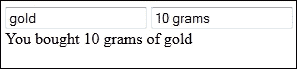
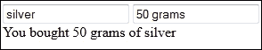
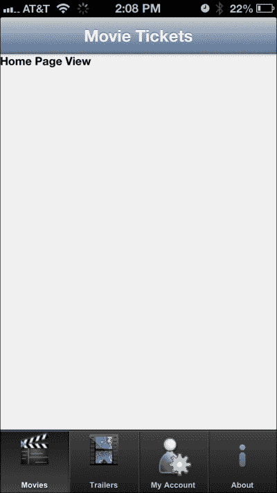
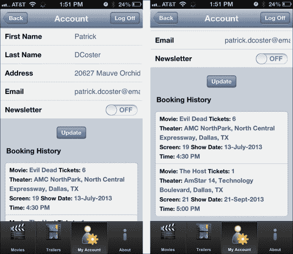

# 四、使用框架元素的集成

在本章中，我们将介绍一些重要的剑道框架元素，如数据源、模板、MVVM 等。在本章的后面，我们将讨论并查看如何通过构建电影票应用的用户帐户屏幕来将网络应用编程接口后端与剑道用户界面前端集成。我们还将讨论如何通过实现揭示模块模式来模块化我们的 JavaScript 代码，并看看如何 CORS 启用我们的网络应用编程接口服务。

我们将在本章中讨论以下主题:

*   数据源
*   模板
*   视图模型
*   与电影票应用集成

剑道用户界面的框架元素通过提供强大的组件将剑道用户界面与市场上所有其他 HTML5/JavaScript 框架区分开来，这为构建网络和移动应用奠定了坚实的基础。虽然大多数其他框架只是单独提供某些功能，如用户界面小部件、路由、模板等，但由于框架元素，剑道用户界面提供了“简单的一切”来构建端到端的网络和移动应用。

剑道的所有核心框架元素都可以在网络和移动应用中使用，没有任何限制。

# 数据源

对于程序员来说，用大量的 JavaScript 数据操作来开发屏幕是一个颇具挑战性的体验，比如过滤、排序、分页、分组、聚合等等。当涉及远程和本地数据源时，开发变得更加复杂。

Kendo 对这个问题的解决方案是 **DataSource** 框架元素，它通过提供命令来执行常见操作，并成为各种外部和本地数据源的单一接口，从而抽象出所有这些复杂性，让开发人员的生活变得轻松。它支持 CRUD 操作(创建、读取、更新和销毁)以及数据的过滤、排序、分页、分组和聚合。

简单的`DataSource`对象可以初始化为:

```cs
var kendoDS = new kendo.data.DataSource();
```

这段代码除了初始化一个没有任何数据的`DataSource`对象之外什么都不做。为了使这个对象有用，我们需要向该对象提供数据，或者告诉该对象可以从哪里获取数据。让我们看看将本地和远程数据馈送到数据源的一些选项。

## 本地数据源

有时开发人员会以 JavaScript 对象的形式在本地获得数据，他们需要将这些数据绑定到一个或多个小部件中，以便用户可以对其进行操作。将本地数据绑定到`DataSource`对象非常方便，因为大多数常见的操作都可以在数据上执行，而无需编写太多自定义代码。

### 注

从这一章开始，你会看到很多例子上传到[jsfiddle.net](http://jsfiddle.net)。**js 提琴** 是一个在线 JavaScript 实时编码环境，它帮助开发人员执行 JS/HTML/CSS 代码，并使用他们的网络浏览器查看结果。一旦您在 jshutch 中打开了示例代码，您就可以点击 fork 按钮，以现有代码为基础创建您自己的代码版本。如果您是在线 JS IDEs 的新手，以下链接中提供的 JS 提琴教程将是一个很好的探索场所:

[http://doc.jsfiddle.net/tutorial.html](http://doc.jsfiddle.net/tutorial.html)

让我们看看如何将本地 JavaScript 数组绑定到`DataSource`对象:

```cs
var videoGames = [{
    name: "Need for Speed: Underground",
    year: 2004,
    copiesSold: "1.10 million"
}, {
    name: "Halo: Combat Evolved",
    year: 2001,
    copiesSold: "5 million"
}, {
    name: "Grand Theft Auto Double Pack",
    year: 2003,
    copiesSold: "1.70 million"
}];
var videoGamesDS = new kendo.data.DataSource({
    data: videoGames
});
```

这很简单，只需在初始化时将本地 JavaScript 对象分配给`data`属性。

现在，让我们调用方法，该方法给出了`alert()`方法中`DataSource`的项目数，以查看我们的数据是否被正确加载，如代码片段所示:

```cs
alert(videoGamesDS.total());
```

警报将返回`0`，因为我们只初始化了`DataSource`，没有用数据填充`DataSource`对象。为了使数据在`DataSource`对象中可用，我们需要调用`read()`方法。`read()`方法从提供的来源读取`DataSource`对象内部的数据。用`read()`更新代码后，我们可以看到警报将显示 **3** ，确认数据源中所有三个项目都可用:

```cs
videoGamesDS.read();
alert(videoGamesDS.total());
```


### 类型

试试 js 提琴:[http://jsfiddle.net/kendomobile/6FfWs/](http://jsfiddle.net/kendomobile/6FfWs/)

## 远程数据源

这是移动应用常见的场景，其中数据(通常是 JSON)需要使用提供的网址从远程服务获取。在这种情况下，我们需要在初始化`DataSource`的同时增加一些配置。以下是如何为使用 JSON 格式的远程服务初始化`DataSource`:

```cs
var remoteDataSource = new kendo.data.DataSource({
    transport: {
        read: {
            // the remote url
            url: "http://yourdomain.com/jsonservice",

            // specify data format
            dataType: "json",

            // optional input parameters 
            data: {
                inputParam: "inputParameterValue"
            }
        }
    },
    // describe result format
    schema: {
       // use data available in the "listOfItems" field
        data: "listOfItems"
    }
});
```

*   `transport`:指定加载和保存数据的设置。数据可以从远程服务、本地文件或内存数据中加载。
*   `read`:读取数据的设置指定为:
    *   `url`:是远程数据/本地文件的 URL
    *   `dataType`:是用于通讯的数据格式
    *   `data`:是远程服务的输入参数
*   `schema`:定义接收到的原始数据的结构组织。在前面的代码中，我们指定字段`listOfItems`包含数据项。我们可以在`schema`配置中定义聚合、错误、总计、分组和解析的数据字段。

`DataSource`是剑道 UI 框架中一个非常强大的对象，我们刚刚对它进行了介绍。关于`DataSource`的完整讨论超出了本书的范围，因此我们强烈建议您使用以下网址中的剑道文档进一步探索数据源:

*   [http://goo.gl/psi3E](http://goo.gl/psi3E)
*   [http://goo . GL/immd](http://goo.gl/iMVmD)

# 模板

**模板** 是一种简单方便的方法来构建复杂的 UI 结构，通常带有重复的块，代表您的视图模型。剑道 UI 在核心框架中提供了强大的模板引擎，针对高性能进行了优化。它简化了语法，使得只需要了解 JavaScript 就可以更容易地使用。

剑道用户界面的模板语法(称为哈希模板)使用`#`符号来识别模板中要插入数据的区域。它们可以通过以下三种方式使用:

1.  `#= lastName #`:这会渲染变量`lastName`中存储的值。
2.  `#: address #`: This renders the value with its HTML encoding. This is useful to prevent rendering issues with user-input fields. For example, if the value of the address is provided as:

    ```cs
    <div> 123, streetname, state </div>
    ```

    然后屏幕上呈现的 HTML 将显示:

    ```cs
    <div> 123, streetname, state </div>

    ```

3.  `#for(... ){# ... #}#`:这将执行模板中的 JavaScript 代码，以便根据特定条件(如循环)进行渲染。模板`#for(i=0;i<3; i++){#value of i: #=i# <br/> #}#`将渲染如下:

    ```cs
    value of i: 0
    value of i: 1
    value of i: 2
    ```

## 渲染模板

`kendo.template()`方法用于剑道 UI 框架中的模板化。它将编译后的模板作为 JavaScript 函数返回，该函数使用提供给它的数据呈现 HTML。用法很简单；将模板作为输入提供给`kendo.template()`，用输入数据调用编译后的函数生成 HTML。

### 内嵌模板

模板可以定义为 JavaScript 字符串(内嵌)或者为 HTML `<script>`块(外部)。简单的模板是内联定义的合适的候选对象，而更复杂的模板(带有 HTML 块和 JS 表达式)更适合在外部定义。

以下是内联模板的一个简单示例:

```cs
<div id="renderHere"> </div>

var kendoTemplate = kendo.template("This awesome HTML5 framework is called : #= frameworkName # !");
var localData = { frameworkName: "Kendo UI" };
$("#renderHere").html(kendoTemplate(localData));
```

前面代码的输出会显示**这个牛逼的 HTML5 框架叫做:剑道 UI！**

### 注

如果模板中需要一个`#`，需要用反斜杠(`\`)转义。在内联模板中，由于模板是 JavaScript 字符串，\\必须在`#`之前使用。

在前面的例子中，如果我们想将输出显示为**，那么#1 HTML5 框架就是剑道 UI！**，那么我们需要将模板修改为:

```cs
 var kendoTemplate = kendo.template("The \\#1 HTML5 framework is #= frameworkName # !");
```

### 类型

试试 js 提琴:**[http://jsfiddle.net/kendomobile/LHfbg/](http://jsfiddle.net/kendomobile/LHfbg/)**

 **### 外部模板

外部模板在`<script>`块内的 HTML 文件中定义，类型为`text/x-kendo-template`，如图所示:

```cs
<script id="kendoExternalTemplate" type="text/x-kendo-template" >
        <!--Template content goes here-->
    </script>
```

因为它们是在代码之外定义的，所以很容易编码和维护。外部模板应该有一个标识，因为它是用于选择模板内容的句柄。现在让我们看一个更复杂的外部模板示例。

在本例中，我们将使用包含移动操作系统名称和版本号的数据数组。如果版本过时，将显示一条消息，要求用户升级操作系统。

在模板中，我们使用转义字符在输出窗口中显示`#`，模板使用`kendo.render(template, data)`方法渲染。

### 注

`kendo.render()`方法用于渲染 JS 对象的数组。

```cs
<!-- div in which template will be rendered --> 
<div id="renderHere"></div>

<!-- External Template definition --> 
<script id="kendoExternalTemplate" type="text/x-kendo-template">
    #    switch (data.osName) {
        case "iOS":
            if (data.version < 6.1) {
                # <div> Your iOS version \# #= data.version# needs to be updated </div>
         #}
         break;
         case "Android":
         if(data.version < 3 ){#
         <div> Your Android version \# #=data.version# needs to be updated </div > #
            }
            break;
    }#
</script>

<script>
var localData = [{
            osName: "iOS",
            version: 6.1
        }, {
            osName: "Android",
            version: 2.3
        }, {
            osName: "iOS",
            version: 5.1
        }, {
            osName: "Android",
            version: 4.2
        }
    ];
    var kendoTemplate = kendo.template($("#kendoExternalTemplate").html());
    $("#renderHere").html(kendo.render(kendoTemplate, localData));
</script>
```

该代码的输出为:

**你的安卓 2.3 版本需要更新**

**你的 iOS 版本# 5.1 需要更新**

### 类型

试试 js 提琴:[http://jsfiddle.net/kendomobile/WpBZa/](http://jsfiddle.net/kendomobile/WpBZa/)

# MVVM

选择剑道 UI 而不是其他 HTML5 框架的另一个重要原因是对 MVVM 的内置支持。大多数竞争框架需要开发人员使用第三方 JS 框架，如**击倒 JS** 来实现 MVVM 模式。自从 MVVM 作为框架的一部分被提供以来，开发人员就不必担心集成问题和支持。

## MVVM 设计图案

**Model-View-View Model**(**MVVM**)是微软演化而来的架构设计模式，试图将数据模型与用户界面分离。所有三名成员都有自己的责任，这清楚地将他们区分开来:

*   **模型:**包含数据点或应用数据(通常由应用逻辑层返回)。
*   **视图**:数据呈现给用户的是用户界面层。
*   **视图模型**:也是被称为视图的模型，充当视图和模型之间的中介。它将视图的抽象层创建为具有数据、命令和抽象的模型，通常聚合多个模型。

由于视图模型是视图及其数据的反映，因此对视图所做的更改可以自动反映在视图模型上，反之亦然，这是通过**数据绑定** 实现的。因此，通过使用 MVVM，编写的从数据源更新用户界面和从用户界面更新数据源的 JavaScript 代码量大大减少，因为这两个过程是自动发生的。开发人员只需要定义视图模型和用户界面元素之间的绑定。

### 类型

Addy Osmani 的一篇优秀文章见此链接，文章详细讨论了 JavaScript 开发人员的 MVVM:

[http://goo.gl/PahnJY](http://goo.gl/PahnJY)

## **剑道 MVVM 入门**

剑道 MVVM 入门的过程很简单。我们要做的是:

*   使用 `kendo.observable()`从 JavaScript 数据创建一个可观察的视图模型
*   使用 `kendo.bind()`将视图模型中的方法和属性绑定到用户界面中的 HTML 元素

现在，当数据更改视图模型时，更改会反映在用户界面中，当用户界面数据因用户交互或任意代码而更改时，视图模型也会随着更改而自动更新。让我们看看如何使用一个简单的例子来实现这一点，稍后我们将进入复杂的例子:

### HTML

```cs
<div id="mainView" >
    <input type="text" id="item" data-bind="value: item" /> 
    <input type="text" id="quantity" data-bind="value: quantity" /> 
    <br/>
     <label data-bind="text: description"> </label> 
</div>
```

### JavaScript

```cs
<script>
var observableViewModel = kendo.observable({
    item: "gold",
    quantity: "10 grams",
    description: function(){
     return    "You bought " + this.get("quantity") + " of " + this.get("item") ; 
    }    
});
//bind the view model
kendo.bind($("#mainView"),observableViewModel);
</script>
```

我们创建了一个可观察的视图模型，它有两个属性`item`和`quantity`以及一个函数。然后，属性被绑定到两个文本框和一个名为`description`的**相关方法** ，该方法实时使用属性的值来创建绑定到标签的购买描述。



当文本框中的值发生变化时，它会自动反映在描述中。



在`description`功能中，我们已经使用`this.get()`读取了`quantity`和`item`的值。`get()`方法用于获取`observableViewModel`对象中的属性值。同样，使用`set`方法设置值。

如果不使用`get`方法，就不会检测到对绑定的依赖，读取时也不会反映更新后的值。同样，当视图模型的单个属性被修改时，我们需要使用`set`方法，以便对绑定的依赖保持不变。

### 类型

试试 js 提琴:[http://jsfiddle.net/kendomobile/wY74g/](http://jsfiddle.net/kendomobile/wY74g/)

## 绑定

MVVM 绑定将 HTML 元素/小部件绑定到视图模型中的属性或方法。在前面的例子中，我们探索了`text`和`value`绑定:

```cs
    <input type="text" id="item" data-bind="value: item"/> 
    <input type="text" id="quantity" data-bind="value: quantity"/> 
     <label data-bind="text: description"> </label> 
```

剑道 MVVM 还支持其他几种绑定，以涵盖经常使用数据绑定的常见场景。以下是 MVVM 绑定的完整列表:

<colgroup><col style="text-align: left"> <col style="text-align: left"></colgroup> 
| 

有约束力的

 | 

描述

 |
| --- | --- |
| 属性 | DOM 元素属性绑定到视图模型字段或方法。例如`<a id="anchor" data-bind="attr: { href: url }"> Link </a>` |
| 检查 | 它根据视图模型中的值检查/取消检查可检查的 DOM 元素和小部件。例如`<input type="checkbox" data-bind="checked: IsSelected" />` |
| 点击 | 在这个绑定中，视图模型的一个方法被附加到被绑定元素的点击 DOM 事件。例如`<a data-role="button"``data-bind="click:updateUserDetails"> Update </a>` |
| 习俗 | 通过扩展`kendo.data.Binder`对象可以注册自定义绑定。如果您对更多信息感兴趣，可以在[http://goo.gl/tFksg](http://goo.gl/tFksg)找到完整的文档 |
| 有缺陷的 | 绑定的 DOM 元素(仅适用于`input`、`select`和`textarea`)将被禁用，具体取决于视图模型的属性值或方法。例如`<input type="text" data-bind="disabled: isDisabled" />` |
| 使能够 | 绑定的 DOM 元素(仅适用于`input`、`select`和`textarea`)将根据视图模型的属性值或方法启用。例如`<input type="text" data-bind="disabled: isEnabled" />` |
| 事件 | 视图模型方法绑定到 DOM 事件。例如`<input type="text" data-bind="value:randomText, events:{focus: onFocus}" />` |
| 超文本标记语言 | 目标 DOM 元素的 HTML 内容(`innerHTML`)绑定到视图模型的值。例如`<div data-bind="html:htmlText"> </div>` |
| 看不见的 | 绑定的 DOM 元素或小部件是隐藏还是显示取决于视图模型的值。例如`<input type="text" data-bind="invisible: isInvisible" />` |
| 看得见的 | 根据视图模型的值，显示或隐藏绑定的 DOM 元素或小部件。例如`<input type="text" data-bind="visible: isVisible" />` |
| 来源 | 目标元素的 HTML 内容是通过用视图模型的值渲染一个剑道模板来设置的，该模板被指定为元素的`data-template`属性。例如`<ul data-role="listview" data-style="inset" id="usracc-bkng-hstry-list" data-template="usracc-booking-history-tmpl" data-bind="source: userBookingHistory"></ul>` |
| 风格 | 这种绑定方式设置了目标 DOM 元素的`style`属性。例如`<span data-bind="style:{color:movieColor, fontSize:movieFontSize }, text: movieName"></span>` |
| 文本 | 目标 DOM 元素的文本内容绑定到视图模型的值。例如`<label data-bind="text: description"> </label>` |
| 价值 | 值绑定支持 HTML 元素输入，`textarea`和`select`。还支持所有具有值属性的小部件。例如`<input type="text" id="item" data-bind="value: item" />` |

### 类型

剑道团队在以下链接中详细解释了所有绑定:

[http://goo.gl/sMrfp](http://goo.gl/sMrfp)

## MVVM 在移动

剑道也在移动框架中为 MVVM 提供了出色的支持。使用`model`配置选项，移动视图中的所有小部件都可以绑定到视图模型。初始化移动视图时，使用`model`配置中提供的视图模型在其所有子元素上调用`kendo.bind()`。由于剑道为其网络和数据可视化小部件提供了出色的触摸支持，它们也可以添加到移动应用中。在这种情况下，移动视图将以相同的顺序绑定移动、网络和数据可视化小部件。

### 注

为了使声明性绑定起作用，正如本节前面所解释的，模型对象必须在应用的**全局范围** 中可用。

现在让我们看一下移动视图中的一个复杂示例，它使用模板和 MVVM。

下面的代码将在文本框中输入电影名称，并将其附加到电影列表中。通过点击 **X** 按钮，电影可以从列表中删除。

### HTML

```cs
<div data-role="view" style="margin: 10 0 0 4" data-model="viewModel">
        Movie:
        <input type="text" data-bind="value: movie" />
        <a data-bind="click: addMovie" data-role="button" id="btnAdd">Add</a>
        <div style="margin-top: 10px">
            Watched movies list:
            <ul data-template="movie-list-template" data-bind="source: movieList">
 </ul>
        </div>
    </div>
    <!--Kendo template -->
    <script id="movie-list-template" type="text/x-kendo-template">
    <li>        
        Movie: <span data-bind="style:{color:movieColor,
 fontSize:movieFontSize }, 
 text: movieName"></span> | 
        Added: <span data-bind="text: addedDate, 
 style:{color:addedDateColor}"></span>
        <a data-bind="click: removeMovie" 
 data-role="button"  id="btnRemove" >X</a>
    </li>
    </script>
```

### JavaScript

```cs
<script>
        var app = new kendo.mobile.Application(document.body);
        var viewModel = {
            movie: '',
            movieList: [],
            addMovie: function (e) {

//when addMovie function is called, add the movie
// property which is bound to the movie text box to 
//movieList array along with styles and added date

                if (this.movie != '') {
                    this.get("movieList").push(
      { movieName: this.get("movie"),
                        movieColor: "green",
                        movieFontSize: "16px",
                        addedDate: new Date().toLocaleDateString(),
                        addedDateColor: "navy"
                    });
                }

                //clear the value in the text box.
                this.set("movie", '');
            },

            removeMovie: function (e) {
                alert('Remove: ' + e.data.movieName);

                //Remove the movie name from the movieList array.
                this.set("movieList", 
jQuery.grep(this.movieList,
 function (item, i) {
                    return (item.movieName != e.data.movieName);
                }));
            }
        }
    </script>
```

使用`data-model`属性将`viewModel`对象配置为移动视图的模型。**添加**按钮的`click`事件绑定到`addMovie`功能，在文本框中输入的文本被添加到`movieList`数组中。使用剑道 UI **MVVM 源绑定** ，将`movieList`数组绑定到 ID 为:`movie-list-template`的模板。所以点击**添加**按钮时，电影列表会自动更新。`removeMovie`功能绑定到模板内的 **X** 按钮，将所选电影从列表中移除。

在模板内，应用于添加的电影名称和日期的样式使用剑道 **MVVM 风格绑定** 进行绑定。使用此绑定绑定的属性是`movieList`对象的`movieColor`、`movieFontSize`和`addedDateColor`。


### 类型

试试 js 提琴:[http://jsfiddle.net/kendomobile/2PGkJ/](http://jsfiddle.net/kendomobile/2PGkJ/)

# 与电影票应用整合

现在我们已经介绍了剑道用户界面框架的一些重要元素，让我们把它们放在一起，通过创建用户帐户屏幕来看看这在现实应用中是如何工作的——电影票。我们还将把我们的网络应用编程接口服务与用户界面集成起来，并处理一些真实的数据。

## 用户账户屏幕

通过用户帐户屏幕，一个注册用户可以登录到应用。一旦用户登录，他/她就可以查看和更新他/她的详细信息。在该屏幕中，用户也可以看到他/她的订票历史。用户登录后，导航栏上显示一个**注销**按钮。

### 后端–设置网络应用编程接口服务

作为第一步，让我们用`Account`控制器、一个`GET`和一个`POST`方法来配置网络应用编程接口服务，并在存储库类中设置一些硬编码数据。

### 类型

本章中创建的服务方法可通过以下网址在线访问:

[http://api.kendomobilebook.com/api/Account/](http://api.kendomobilebook.com/api/Account/)

1.  在`BusinessObjects\BLL`文件夹中创建两个名为`UserBO.cs`和`TicketsBO.cs`的类。这些类别的对象将包含用户和票证详细信息:

    ```cs
    namespace MovieTickets.WebAPI.BLL
    {
        public class TicketBO
     {        
             public int TicketId { get; set; }
             public string TheaterName { get; set; }
             public string MovieName { get; set; }
             public  string Screen { get; set; }
             public int NoOfPersons { get; set; }
             public string ShowDate { get; set; }
             public string ShowTime { get; set; }
        }
    }

    namespace MovieTickets.WebAPI.BLL
    {
        public class UserBO
        {
            public string FirstName { get; set; }
            public string LastName { get; set; }
            public string UserName { get; set; }
            public string Password { get; set; }
            public string EmailId { get; set; }
            public string Address { get; set; }
            public bool SubscribedForNewsLetter { get; set; }
            public List<TicketBO> BookingHistory { get; set; }
        }
    }
    ```

2.  在`MovieRepository.cs`类中，创建一个名为`GetUserDetails`的方法。该方法包含所有用户的硬编码数据及其订票历史，如下所示:

    ```cs
    //This method will send user details back to the app
    public static UserBO GetUserDetails(string userName)
    {
        //2 users are created by default            
        var usersList = new List<UserBO>{
            new UserBO(){
                Address = "123 North Field Pkwy,
                            Buffalo Grove, Illinois",
                EmailId = "alison.massey@email.com",
                FirstName = "Alison",
                LastName = "Massey",
                UserName = "username1", 
                SubscribedForNewsLetter = true,
                BookingHistory = new List<TicketBO>{
                        new TicketBO(){
                        TicketId = new Random().Next(10000),
                        TheaterName = "AMC, South 
                                        Barrington, IL",
                        MovieName = "The Call",
                        Screen = "12",
                        NoOfPersons = 5,
                        ShowDate = "15-Aug-2013",
                        ShowTime = "4:30 PM"
                        },
                        new TicketBO(){
                        TicketId = new Random().Next(10000),
                        TheaterName = "Regal Cinemas,
                            Lincolnshire, IL",
                        MovieName = "Argo",
                        Screen = "7",
                        NoOfPersons = 2,
                        ShowDate = "25-Aug-2013",
                        ShowTime = "7:00 PM"
                        }

                    },
                },

        new UserBO(){
                Address = "20627 Mauve Orchid Way,Dallas, TX ",
                EmailId = "patrick.dcoster@email.com",
                FirstName = "Patrick",
                LastName = "DCoster",
                UserName = "username",  
                SubscribedForNewsLetter = false,
                BookingHistory = new List<TicketBO>{
                        new TicketBO(){
                        TicketId = new Random().Next(10000),
                        TheaterName = "AMC NorthPark, North 
                                        Central Expressway,
                                        Dallas, TX",
                        MovieName = "Evil Dead",
                        Screen = "19",
                        NoOfPersons = 6,
                        ShowDate = "13-July-2013",
                        ShowTime = "4:30 PM"
                        },
                        new TicketBO(){
                        TicketId = new Random().Next(10000),
                        TheaterName = "AmStar 14, Technology 
                                        Boulevard, Dallas, TX",
                        MovieName = "The Host",
                        Screen = "21",
                        NoOfPersons = 1,
                        ShowDate = "21-Sept-2013",
                        ShowTime = "5:00 PM"
                        }  
                    },
                }
        };

        return usersList.FirstOrDefault(x => x.UserName.Equals(userName)); 
    }
    ```

3.  在我们在[第 3 章](3.html "Chapter 3. Service Layer with ASP.NET Web API")、*服务层用 ASP.NET Web API*创建的`MovieTicketsBLL`类中，创建一个名为`GetLoggedInUserDetails`的方法，该方法将从上一步创建的`GetUserDetails`方法中检索用户的详细信息和票证历史:

    ```cs
    public static UserBO GetLoggedInUserDetails(string userName)
    {
    return MovieRepository.GetUserDetails(userName);
    }
    ```

4.  现在在 `AccountController`(如果你还没有创建一个名为`AccountController`的网络应用编程接口控制器)中，创建两个名为`Get`和`Post`的方法，如下面的代码所示。`Get`方法会返回用户的详细信息，`Post`方法会更新用户的详细信息(同样，我们不会像使用硬编码数据那样以持久的方式更新详细信息；我们正在演示如何进行开机自检并检索控制器中的值。):

    ```cs
    [Authorize]
    public UserBO Get()
    {
        /* The user will be authenticated andThread.CurrentPrincipal is set in theValidateCredentials method of AuthMessagehandler class before the control reaches this action method */

     MovieTicketsPrincipal currentPrincipal = 
    Thread.CurrentPrincipal as MovieTicketsPrincipal
    ;

        return MovieTicketsBLL.GetLoggedInUserDetails(currentPrincipal.UserName);
    }

    [Authorize]
    public bool Post(UserBO updatedUserDetails)
    {
     //Code to update user details in the DB.
     //Since we are using hard coded values for the 
     //demo, no save operation is done here. 

     return true;
    }

    ```

## 前端–架构

现在我们的 Web API 已经为用户帐户屏幕准备好了两种操作方法，是时候关注我们移动视图的前端 UI 了。首先，让我们使用 jQuery/JavaScript 创建前端架构，以创建视图模型、数据访问方法和一些实用方法。我们将通过使用 JavaScript 闭包和实现封装，将这些模块作为单独的模块来对待。我们将在自己的文件中创建每个模块，并且只允许通过模块对象公开访问某些函数和变量。

### 显示模块模式

我们在 JavaScript 代码的示例应用中遵循的设计模式被称为**揭示模块模式** ( **RMP** )。的概念很简单；我们将使用闭包在 JavaScript 中引入`private`和`public`封装。只有特别返回的方法和变量是公开的，我们可以在公共方法中提供对私有方法和变量的引用。让我们看一个用 RMP 编写的模块的例子:

```cs
var applicationModule = (function() {

    //private variable. Existence limited within
    //this closure
    var privateVariable = 10;

    var privateFunction = function() {
        //Not accessible publicly
    };

 //accessibly publicly as   //applicationModule.publiclyReturnPrivateVar
    var publicFunction = function() {

         return privateVariable;

    };

    return {

 publiclyReturnPrivateVar: publicFunction 

 };

})();

//prints value of privateVariable
console.log(applicationModule.publiclyReturnPrivateVar());

```

### 类型

试试 js 提琴:[http://jsfiddle.net/kendomobile/gejfm/](http://jsfiddle.net/kendomobile/gejfm/)

我们创建了一个名为`applicationModule`的模块，它包含一个名为`privateVariable`的`private`变量、一个名为`privateFunction`的`private`函数和一个名为`publicFunction` 的`public`函数。方法`publicFunction`仅使用`applicationModule.publiclyReturnPrivateVar`对外开放。物体`privateVariable`和`privateFunction`在封闭物之外根本无法接近。最后一个括号导致函数被调用。

因此，利用 JavaScript 中的闭包，我们实现了其他传统面向对象语言中可用的封装。因此，我们可以像在 C#中一样，通过创建一个`private`对象并通过创建`public`方法来“获取”和“设置”`private`对象的值来实现`Get`和`Set`属性。

#### 优势

通过实现揭示模块模式，我们可以使用 JavaScript 构建可扩展的和复杂的应用。这种模式的一些优点是:

*   将方法和属性隐藏在模块外部的能力
*   在调试器中显示调用堆栈更容易
*   它通过清晰区分`return`语句中的`public`对象来增加可读性

### 注

如果你想探索更多，我们建议你阅读 Addy Osmani 的书*学习 JavaScript 设计模式*中关于模块模式和揭示模块模式的内容，可在以下链接中找到:

[http://goo.gl/y7wsV](http://goo.gl/y7wsV)

在大型项目中，设计您的 JavaScript 模块非常重要，因为团队变得越来越大，因为程序员在全局范围内滥用免费可用的 JavaScript 对象的机会越来越多。

### 名称间距

许多编程语言实现**命名空间** 以避免与全局命名空间中的其他对象或变量冲突。它还有助于将应用的代码分组到多个块中。名字间距在用 JavaScript 编写的应用中非常重要，因为在全球范围内发生冲突的风险很高。即使 JavaScript 没有内置名称空间，我们仍然可以使用 JavaScript 对象来提供名称空间支持。

在我们的电影票应用中，我们定义了一个全局对象作为我们的命名空间，如图所示:

```cs
var MovieTickets = MovieTickets || {}; 
```

在引用任何其他自定义 JS 文件之前，`MovieTickets`对象在`<head> </head>`部分中定义，因此这是我们的应用中第一个要初始化的对象。现在我们将创建其他模块作为这个对象的属性，这样就不会与我们可能使用的其他第三方 JS 库定义的名称有任何冲突。

例如，我们的`configuration`模块和`common`模块将作为:

```cs
MovieTickets.configuration
MovieTickets.common
```

#### 配置

通常在每个软件项目中，都会有一个处理所有配置数据的模块。为此，在我们的项目中，让我们在`scripts`文件夹中创建一个名为`configuration.js`的文件。该模块存储所有可配置的数据，如网络应用编程接口服务的基础和相关的控制器网址:

```cs
MovieTickets.configuration = (function () {
    var serviceUrl = "http://localhost/movietickets.webapi/api/";
    return {
        serviceUrl: serviceUrl,
        accountUrl: serviceUrl + "Account/"
    }
})();
```

现在，服务和帐户控制器 URL 可以通过以下方式在应用中使用:

`MovieTickets.configuration.serviceUrl MovieTickets.configuration.accountUrl`

如果您使用不同的网址来托管您的网络应用编程接口服务，请用您的网址替换`private`变量`serviceUrl`的值。

#### 数据访问

现在我们需要创建一个可重复使用的数据访问模块，该模块将用于连接到网络应用编程接口并获取每个视图的数据。为此，在`scripts`文件夹中创建一个名为`data-access.js`的文件，并在其中添加以下代码:

```cs
MovieTickets.dataAccess = (function() {

    //options input parameter will have all the data needed
    //to perform the ajax call
    function callService(options) {

        $.ajax({
            url: options.url,
            type: options.requestType,
            data: options.data,
            dataType: options.dataType,

            //Add HTTP headers if configured
            beforeSend: function (xhr) {
 if (typeof options.httpHeader !== 'undefined'
 && typeof options.headerValue !== 'undefined')
 xhr.setRequestHeader(options.httpHeader,
 options.headerValue);
 },
            //on successful ajax call back
            success: function (resultData, status, xhr) {
                var result = {
                    data: resultData,
                    success: true
                };
                options.callBack(result);
            },
            //Callback function in case of an error
            error: function (xhr, status, errorThrown) {

                switch (xhr.status) {

                    case '401':
                        alert('401 Unauthorized access detected.
                                Please check the credentials
                         you entered.' + errorThrown);
                        break;
                    case '500':
                        alert('500 Internal Server Error.
                               Please check the service code.'
                                + errorThrown);
                        break;
                    default:
                        alert('Unexpected error: ' + errorThrown);
                        break;
                }
                var result = { success: false };
                options.callBack(result);
            }
        });
    }

    return {
        callService: callService
    }
})(); 
```

该模块公开了一个名为`MovieTickets.dataAccess.callService()`的方法，该方法使用提供的网址调用服务，并执行在`options`对象中配置的操作:

*   `options.url`:要调用的网址
*   `options.requestType`:请求类型，如 GET、POST、PUT、DELETE 等
*   `options.data`:发送给服务的数据
*   `options.dataType`:期望从服务器返回的数据类型，例如 JSON/XML 等
*   `options.httpHeader`:需要随请求一起添加的 HTTP 头
*   `options.headerValue`:添加的 HTTP 头的值
*   `options.callBack`:收到响应后要调用的功能

使用选项对象中的这些配置，对服务进行 jQuery Ajax 调用，并调用`callback`函数。如果请求成功，从服务器返回的数据将与包含成功标志值`true` ( `{ success: true }`)的`callback`函数一起返回，如果遇到错误，将使用错误标志(`{ success: false }`)调用`callback`函数。

在 jQuery 的`error`功能中，我们根据常见的错误代码显示友好的错误信息，如 **500** (内部服务器错误) **401** (未授权访问)等。

### 初始化

让我们从[第二章](2.html "Chapter 2. Building Your First Mobile Application")、*构建您的第一个移动应用*中重新组织应用的初始化代码，以便为项目创建一个正式的结构。为了做到这一点，让我们在`scripts`文件夹中创建一个名为`movie-tickets.js`的文件，并将应用初始化代码以及一些其他代码移动到该文件中。名为`MovieTickets.main`的模块将作为应用的主要入口点:

```cs
MovieTickets.main = (function () {
    var application;

    function getApplication() {
        return application;
    }

    function initializeApp() {

        //initialize app
        application = new kendo.mobile.Application(document.body,
         {
             transition: 'slide',
             loading: "<h3>Loading...</h3>"

         });

        //Display loading image on every ajax call
        $(document).ajaxStart(function () {

            //application.showLoading calls the showLoading()
            //method of the pane object inside the application.
            //During the application's initial view's init
            //method this pane object may not be initialized
            //and so application.showLoading() may throw error.
            //To prevent this we need to do a check for existence
            //application.pane before calling
            //application.showLoading();
            if (application.pane) {
                application.showLoading();
            }
        });

        //Hide ajax loading image on after ajax call
        $(document).ajaxStop(function () {

            if (application.pane) {
                application.hideLoading();
            }
        });
    }

    return {
        initializeApp: initializeApp,
        getKendoApplication: getApplication
    }
})();
```

在本模块中，我们使用`kendo.mobile.Application()`方法初始化应用，并将初始视图设置为主页，将视图转换效果设置为`slide`，将 Ajax 加载文本设置为`<h3>Loading...</h3>`。一旦剑道用户界面移动应用被初始化，我们就使用 jQuery 的`$(document).ajaxStart`和`$(document).ajaxStop`事件来显示和隐藏加载消息，无论何时从我们的应用触发 Ajax 调用，从而避免了在 Ajax 调用中显式显示和隐藏加载消息的需要。

#### 常用效用方法

现在，让我们在`scripts`文件夹中一个名为`common.js`的文件中创建模块，在这里可以编写多个模块调用的实用方法。我们将添加三种方法:

*   `navigateToView(view)`:在这个方法中，我们使用剑道`application`对象的`navigate()`方法来编程导航到特定的视图。视图可以是本地视图、远程视图或外部视图。
*   `showLogOffButton()`:这个方法，当被调用时，在导航栏上显示**注销**按钮(这个的 HTML 代码将在本章后面添加)。
*   `hideLogOffButton()`:这个方法隐藏了导航栏上的**注销**按钮。

    ```cs
    MovieTickets.common = (function () {

        function navigateToView(view) {
            //Navigate to local/remote or external view
            MovieTickets.main.getKendoApplication().navigate(view);
        }
        function showLogOffButton() {
            //show log off button.
            $(".mt-main-layout-btn-logoff").show();
        }

        function hideLogOffButton() {
            //hide log off button
            $(".mt-main-layout-btn-logoff").hide();
        }

        return {
            navigateToView: navigateToView,
            showLogOffButton: showLogOffButton,
            hideLogOffButton: hideLogOffButton
        }

    })();
    ```

### 注

在`navigateToView`功能中，我们甚至可以使用`#:back`作为输入参数导航到上一个视图。

#### 用户账户视图模型

由于现在已经有了项目集的基础，我们可以为用户帐户屏幕创建一个可观察的视图模型，它将使用`data-model`属性绑定到视图，如 *MVVM* 部分所述。让我们在`scripts`文件夹中创建一个名为`user-account.js`的文件，并添加以下代码:

```cs
 MovieTickets.userAccount = (function () {
    //ViewModel for User Account view
    var viewModel = kendo.observable({
        isUserLoggedIn: false,
        firstName: "",
        lastName: "",
        userName: "username", //hardcoded
        password: "password", //hardcoded
        userAddress: "",
        userEmailAddress: "",
        subscribedForNewsLetter: false,
        userBookingHistory: [],
        userLogin: function () {
            var loginOptions = {
                url: MovieTickets.configuration.accountUrl,
                requestType: "GET",
                dataType: "JSON",
                //for HTTP Basic authentication
                httpHeader: "Authorization", 

                //btoa function will convert the text to
                //base 64 encoding
                headerValue: "Basic "
                    + btoa(this.userName + ":" + this.password),
                callBack: this.fnLoginCallBack
            };
            MovieTickets.dataAccess.callService(loginOptions);

        },
        //method for user login
        fnLoginCallBack: function (result) {
            if (result.success === true) {
                viewModel.set("firstName", result.data.FirstName);
                viewModel.set("lastName", result.data.LastName);
                viewModel.set("userAddress", result.data.Address);
                viewModel.set("userEmailAddress",
                    result.data.EmailId);
                viewModel.set("userBookingHistory",
                    result.data.BookingHistory);
                viewModel.set("isUserLoggedIn", true);
                viewModel.set("subscribedForNewsLetter",
                    result.data.SubscribedForNewsLetter);

                MovieTickets.common.showLogOffButton();

            } else {
                //any error handling code
            }
        },

        //method to update user details
        updateUserDetails: function () {
            var updateOptions = {
                url: MovieTickets.configuration.accountUrl,
                requestType: "POST",
                dataType: "JSON",
                data: {
                    firstName: viewModel.get("firstName"),
                    lastName: viewModel.get("lastName"),
                    address: viewModel.get("userAddress"),
                    emailId: viewModel.get("userEmailAddress"),
                    subscribedForNewsLetter:
                        viewModel.get("subscribedForNewsLetter")
                },

                //for HTTP Basic authentication
                httpHeader: "Authorization",
                //btoa function will convert the text to
                //base 64 encoding
                headerValue: "Basic " + btoa(this.userName + ":"
                    + this.password),
                callBack: function () {
                    //if you are using PhoneGap to deploy
                    //as an app, you should use the 
                    //notification api
                    alert('Details updated...');
                }
            };
            MovieTickets.dataAccess.callService(updateOptions);
        },

        //method called when log off button is clicked
        logOff: function () {
            console.log('inside logOff');
            viewModel.set("firstName", "");
            viewModel.set("lastName", "");
            viewModel.set("userAddress", "");
            viewModel.set("userEmailAddress", "");
            viewModel.set("userBookingHistory", "");
            viewModel.set("isUserLoggedIn", false);

            //hide log off button
            MovieTickets.common.hideLogOffButton();

            //navigate to User Account screen.
            MovieTickets.common.navigateToView("UserAccount.html");
        }
    });

    return {
        viewModel: viewModel
    }
})();
```

在前面的视图模型代码中，我们创建了与用户详细信息相关的属性，例如名字、姓氏、等。我们还为显示在**用户帐户**屏幕上的用户预订历史创建了属性。可通过`mtUserAccount.viewModel`访问的视图模型将使用`data-model`属性绑定到视图。我们还在视图模型中添加了以下功能，这些功能将从用户帐户屏幕中调用:

*   `userLogin()`:此功能用于通过调用`AccountController's`方法的`Get`动作方法登录系统。由于`Get`方法是使用`[Authorize]`属性的安全方法，我们在 HTTP 头中发送用户的用户名和密码(当属性绑定到相应的字段时将可用)用于基本身份验证。要进行 Base64 编码，我们使用`btoa()`功能。
*   `fnLoginCallBack()`:当收到服务对登录 Ajax 调用(`callback`)的响应时，调用此功能。如果登录调用成功，将使用服务中的值设置视图模型属性。`isUserLoggedIn` 属性也设置为`true`，表示用户已登录该应用。当用户导航到“用户帐户”屏幕时，此属性将决定是向用户显示用户登录屏幕还是用户详细信息屏幕。然后调用`MovieTickets.common.showLogOffButton()`方法，在导航栏中显示**注销**按钮。
*   `updateUserDetails()`: The updated values of the `firstName`, `lastName`, `address`, `emailId`, and `subscribedForNewsLetter` properties which are collected from the User Account screen are sent to the Web API for saving.

    为此，我们使用编码为 Base64 值的用户凭证调用帐户控制器的`POST`方法，这些值作为标头发送。

*   `Logoff()`:此方法用于从视图模型中清除用户详细信息并注销用户。它还会将用户重定向到**用户帐户**屏幕，因为用户可以从应用中的任何位置注销。为此，我们使用`MovieTickets.C` `ommon`模块的`navigateToView`功能。

### 注

因为我们使用的是基于无状态 HTTP 的服务，所以您不必通知该服务注销，因为该服务不会跟踪服务器端会话。

### HTML 界面

你现在应该已经厌倦了；当你真的想获得真正的剑道 UI Mobile 代码时，编写 JavaScript 代码。让我们马上开始，编写一些 HTML 代码，并带来一些剑道小部件、模板和绑定。

#### 添加用户账户标签按钮

现在让我们打开`index.html`文件，它是我们在[第 2 章](2.html "Chapter 2. Building Your First Mobile Application")、*构建您的第一个移动应用*中创建的，并在布局页脚中的`TabStrip`小部件上再添加一个按钮，以导航到**用户帐户**屏幕。我们正在使用随源代码一起提供的`user_profile.ico`图标文件作为按钮的图标。修改后的`TabStrip`代码如下:

```cs
<div data-role="tabstrip">
    <a href="#mt-home-main-view">
        
        <br />
        Movies
    </a>
    <a href="Trailers.html">
        
        <br />
        Trailers
    </a>
    <a href="UserAccount.html">
        
        My Account
    </a>

    <a href="#mt-about-view" data-icon="about">
        <br />
        About
    </a>
</div>
```

现在在`index.html`文件中，用新的初始化代码替换[第二章](2.html "Chapter 2. Building Your First Mobile Application")、*构建您的第一个移动应用*中的初始化代码:

```cs
<script>
  //Kendo Mobile is initialized in this method
  MovieTickets.main.initializeApp();
</script>
```

现在主屏幕看起来像下面的截图:



#### 用户账户视图

我们在上一节新增新`TabStrip`按钮的时候，也已经将**我的账号**按钮链接到`UserAccount.html`了，现在我们要把这个视图创建为**远程视图**。在根文件夹中创建`UserAccount.html`，并创建一个具有两个`div`值的视图；一个用于登录部分，如果用户没有登录，将显示该部分，另一个部分将在用户登录后显示用户详细信息。然后，我们将使用`data-model="movieTickets.userAccount.viewModel"`将视图绑定到用户帐户视图模型。然后使用剑道 MVVM **不可见绑定**将登录部分的可见性绑定到视图模型的`isUserLoggedIn`属性(参见*绑定*部分)。同样，用户详细信息部分使用剑道 MVVM **可见绑定**绑定到属性`isUserLoggedIn`，因为我们需要在用户登录时显示该部分。

```cs
<div data-role="view" data-layout="mt-main-layout"
     data-title="Account"
 data-model="MovieTickets.userAccount.viewModel"
     id="mt-theaters-view">

    <!-- This section is bound by Kendo MVVM Invisible binding -->
    <div id="usracc-login-section" 
         data-bind="invisible: isUserLoggedIn">
    </div>

    <div id="usracc-user-details"
         data-bind="visible: isUserLoggedIn">
    </div>
</div>
```

##### 登录部分

现在让我们添加一些字段并绑定到两个部分。对于登录部分，让我们定义一个剑道`ListView`小部件，并添加用于输入用户名和密码的字段以及登录按钮。`ListView`小部件在这里只是用来排列元素的，下一章会详细讨论。然后，我们将它们绑定到视图模型中相应的属性和函数:

```cs
<ul data-role="listview" data-style="inset">
<li>
        <label>User Name:  </label>
          <input type="text" data-bind="value:userName" 
 id="user-acc-username" />
       </li>
   <li>
             <label>Password:  </label>
   <input type="text" id="user-acc-password" 
data-bind="value:password" />
</li>
</ul>     

<div class="centerAlign">
<a data-role="button" id="user-acc-login-button" 
   data-bind="click:userLogin">Login </a>
</div>
```


##### 用户详细信息部分

接下来，让我们为用户详细信息部分添加用户界面元素，其中包含显示用户详细信息的文本字段和显示用户预订历史的模板化`ListView`。

首先，我们将创建一个 Kendo 模板来显示用户的预订历史，该模板将被添加到视图外部的文件底部:

```cs
<script type="text/x-kendo-template"
 id="usracc-booking-history-tmpl">

    Movie: <span class="valueText"> #=MovieName #</span>
        Tickets:  <span class="valueText"> #=NoOfPersons # </span>
    <br/>
    Theater:<span class="valueText"> #=TheaterName # </span>
    <br/>
    Screen: <span class="valueText">#=Screen # </span>
         Show Date: <span class="valueText"> #=ShowDate# </span>
    <br/>        
    Time: <span class="valueText">#=ShowTime # </span>

</script>

```

该模板将显示预订的门票的详细信息，例如，电影名称、门票数量、影院地址、屏幕号码、放映日期和放映时间。

现在我们将使用以下代码更新 ID 为`usracc-user-details`的用户详细信息`div`:

```cs
<div id="usracc-user-details"
 data-bind="visible: isUserLoggedIn ">
    <div>
        <ul data-role="listview">
            <li>First Name                       
                <input type="text" id="usracc-firstName"
                    data-bind="value: firstName" />
            </li>
            <li>Last Name
                <input type="text" id="usracc-lastName"
                    data-bind="value: lastName" />
            </li>
            <li>Address
                <input type="text" id="usracc-address"
                    data-bind="value: userAddress" />
            </li>
            <li>Email
                <input type="text" id="usracc-emailAddress"
                    data-bind="value: userEmailAddress" />
            </li>
            <li>Newsletter
                <span style="text-align: left">
                    <input type="checkbox" id="usracc-newsletter"
 data-role="switch"
 data-bind=
 "checked: subscribedForNewsLetter" />
                </span>

            </li>
        </ul>
    </div>
    <br />
    <div class="centerAlign">

        <a data-role="button" id="usracc-btn-update"
            data-bind="click:updateUserDetails">Update </a>
    </div>

    <!--Booking History section-->
    <div>
        <h3>Booking History </h3>

        <!--Render template using MVVM Source binding -->
        <ul data-role="listview" data-style="inset"
 id="usracc-bkng-hstry-list"
 data-template="usracc-booking-history-tmpl"
 data-bind="source: userBookingHistory">
 </ul>
    </div>
</div>

```

在前面的代码中，我们添加了显示用户详细信息的字段和一个**更新**按钮。我们使用了剑道**开关**小部件显示用户的简讯订阅状态，其`checked`状态绑定到`subscribedForNewsLetter`属性。这个小部件将在下一章详细讨论。当我们点击**更新**按钮时，它会调用视图模型中的`updateUserDetails`函数，该函数会将更新后的用户详细信息作为 HTTP POST 请求发送给服务。在用户详细信息部分之后，使用`ListView`小部件呈现预订历史模板，数据源作为视图模型中的`userBookingHistory`属性。

一旦用户使用用户名/密码或用户名 1/密码 1 等凭据登录到应用，用户详细信息将显示在视图上，如下图所示:



### 修复跨域访问问题

如果您在一个域中托管您的网络应用编程接口服务，而您的移动应用在另一个域中托管(或者如果您试图从手机上打开的移动网站访问您电脑上托管的网络应用编程接口)，您可能会看到您对网络应用编程接口服务的 Ajax 调用被阻止。发生这种情况是因为在网络浏览器中实施的**同源策略** 限制了对发出调用的资源的域的调用。用 JSONP(带填充的 JSON)代替 JSON 是常见的解决方案，但被认为是黑客，推荐的解决方案是让你的服务 **CORS** ( **跨来源资源共享**)启用。CORS 是一个 **W3C** 标准，它允许网页向不同的域发出 Ajax 请求。这个标准放松了浏览器强加的同源策略。

### 注

如果您想详细探索 CORS，这里有一篇来自 Mozilla 开发者网络的好文章，可通过以下链接获得:

我们可以通过向网络应用编程接口的`web.config`文件的`<system.webServer> </system.webServer>`部分添加以下配置，使我们的网络应用编程接口服务在全球范围内启用 CORS:

```cs
<httpProtocol>
    <customHeaders>
    <add name="Access-Control-Allow-Origin"
         value="*"/>
    <add name="Access-Control-Allow-Headers"
         value="accept, authorization, origin, content-type"/>
    <add name="Access-Control-Allow-Methods"
         value="GET, POST, PUT, DELETE, OPTIONS"/>
    </customHeaders>
</httpProtocol>
```

前面的配置允许来自任何来源的带有头的请求接受方法类型 GET、POST、PUT、DELETE 和 OPTIONS 的授权、来源和内容类型。

在对您的`web.config`进行此更新后，您可以将您的网络应用编程接口服务托管在`xyz.com`的一个域中，而您的网络应用托管在另一个域中，例如，`abc.com`可以使用 Ajax 访问网络应用编程接口的服务方法！

### 注

在写这本书的时候，ASP.NET 网络应用编程接口提供了内置的 CORS 支持，可以通过夜间构建访问。姚黄·林在以下网址提供了如何使用新的 CORS 支持的详细说明:

[http://goo.gl/s6lEJG](http://goo.gl/s6lEJG)

# 总结

在本章中，我们详细介绍了一些重要的剑道用户界面框架元素，如数据源、模板和 MVVM。我们还将[第三章](3.html "Chapter 3. Service Layer with ASP.NET Web API")、*服务层创建的 Web API 服务与 ASP.NET Web API*集成，与电影票 app 集成，开发了用户账号界面。我们在电影票应用中实现了 HTTP 基本身份验证，以访问一些安全的操作方法。使用电影票应用，我们还讨论了如何使用显示模块模式构建剑道用户界面移动应用。在下一章中，我们将深入剑道 UI Mobile，了解更多剑道 UI Mobile 小部件，并进行大量的实践练习！**