# 一、电子书管理器和目录应用

.NET Core 3 标志着. NET 重新启动的一个重要版本。现在基本框架已经到位，微软已经能够查看那些虽然不再流行，但正在全球数百万台机器上运行的技术。

WinForms 和 WPF 已经成为他们自身成功的受害者:微软根本不敢改变他们周围的框架，冒着破坏可能已经成功运行了几年的应用的风险。

C# 8 有一个类似的主题，它引入了可空引用类型等特性，以及旨在改进遗留代码库的接口实现。

A legacy code base is any code that has already been written, whether that was 10 years or 10 minutes ago!

在第一章中，我们将创建电子书管理器应用。接下来，我们将继续学习我们的电子书管理器.NET Core 2 并将其迁移到.NET Core 3。

英寸 NET Core 2，进行了许多显著的性能增强，因此有一个真正的动力来升级现有的 WinForms 应用.NET Core 3。微软吹嘘说.NET Core 2.1 对 Bing 的性能提升超过 30%。

我们将讨论的主题如下:

*   在中创建新的 WinForms 应用。网络核心 3.0
*   将现有 WinForms 应用迁移到。网络核心 3.0
*   可空引用类型
*   XAML 群岛，以及如何使用它们为现有的 WinForms 应用添加功能
*   树摇动和编译

# 技术要求

要继续本章的第一部分，您将需要 WinForms 设计器。撰写本文时，这是预发布版本，可从[https://aka.ms/winforms-designer](https://aka.ms/winforms-designer)下载。

对于 XAML 群岛部分，您将需要运行 Windows 10 1903 或更高版本。到这本书出版的时候，预计 1903 版本已经自动交付给所有 Windows 10 机器；但是，如果您运行的是早期版本，则可以通过访问以下链接来强制更新:[https://www.microsoft.com/en-us/software-download/windows10](https://www.microsoft.com/en-us/software-download/windows10)。

At the time of writing, this WinForms designer was nowhere near ready for production. Try it out while following the chapter; however, if you find that it is too glitchy, feel free to copy the designer code from the GitHub project.

# 创建新的 WinForms 应用

让我们从创建一个新的.NET Core 3.0 WinForms 应用，稍后我们还将看到如何升级旧的.NET Core WinForms 应用到 3.0，这样我们就可以展示实现这一点的两种方式。

To follow this section, you'll need to install the WinForms designer described in the *Technical requirements* section. It's worth pointing out that this tool is in preview at the time of writing and therefore has a number of limitations, so the instructions have changed in order to cater to those limitations.

使用 Visual Studio 2019，我们将创建一个简单的 Windows 窗体应用模板项目。你可以随意调用应用，但我调用了我的`eBookManager`:


在 Visual Studio 2019 中，创建新项目的过程略有变化，您需要选择应用的类型，然后选择创建它的位置:


该项目将被创建，如下所示:


Since this is .NET Core, you can do all of this from the command line. In PowerShell, running the following command will create an identical project: `dotnet new winforms -n eBookManager`.

我们的解决方案需要一个类库项目来包含驱动`eBookManager`应用的类。英寸 NET Core 3.0，我们可以选择创建. NET Core 类库或. NET 标准类库。

.NET 标准是一个有点奇怪的概念。就其本身而言，它不是一项技术，而是一份合同；创建. NET 标准类库只是防止您使用任何.NET Core—(或框架—)特定的，不符合.NET 标准。下面的文档说明了.NET 标准版，以及哪些版本的 Core 和 Framework 支持它们:[https://github . com/dotnet/Standard/blob/master/docs/versions . MD](https://github.com/dotnet/standard/blob/master/docs/versions.md)。

添加新的类库(.NET 标准)投影到您的解决方案中，并将其称为`eBookManager.Engine`:

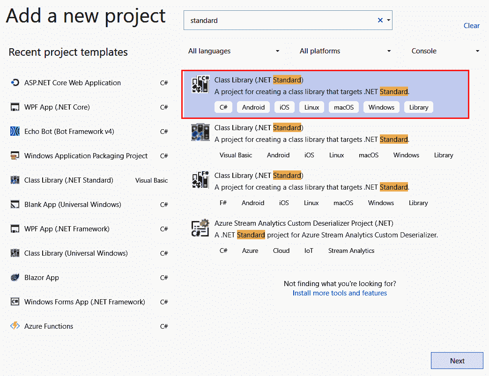

使用默认类名将类库项目添加到解决方案中。将此类更改为`Document`:


`Document`类将代表一个电子书。当考虑一本书时，我们可以有多个属性来代表一本书，但这将代表所有的书。作者就是一个例子。所有的书都必须有作者；否则，它们就不会存在。

我添加到类中的属性仅仅是我对一本书的解释。请随意添加额外的代码，使其成为您自己的代码。打开`Document.cs`文件，将以下代码添加到类中:

```cs
public class Document
{
    public string Title { get; set; }
    public string FileName { get; set; }
    public string Extension { get; set; }
    public DateTime LastAccessed { get; set; }
    public DateTime Created { get; set; }
    public string FilePath { get; set; }
    public string FileSize { get; set; }
    public string ISBN { get; set; }
    public string Price { get; set; }
    public string Publisher { get; set; }
    public string Author { get; set; }
    public DateTime PublishDate { get; set; }
    public DeweyDecimal Classification { get; set; }
    public string Category { get; set; }
}
```

你会注意到我包含了一个名为`Classification`的属性，类型为`DeweyDecimal`。我们还没有添加这个类，接下来会添加。在`eBookManager.Engine`项目中，添加一个名为`DeweyDecimal`的类。如果你不想为你的电子书进行这种级别的分类，你可以不去上这门课。为了完整起见，我把它包括在内了。我们将介绍一个已经在 Visual Studio 中使用了一段时间的小功能:如果您将鼠标悬停在`DeweyDecimal`文本上，您将看到一个灯泡出现(您可以通过按住 Ctrl 键和圆点键( *Ctrl +)手动调出该菜单。*)。在本书的其余部分，我将大量使用这个快捷方式！):


这允许我们通过几次击键创建一个新的类。这也意味着类的名称将与调用代码中的类名相匹配。

You can use the lightbulb menu to create methods, add using statements, and even import NuGet libraries!

`DeweyDecimal`系统挺大的。由于这个原因，我没有迎合每一个可用的图书分类。我还假设你只想要用电子书编程。然而，实际上，您可能想要添加其他分类，例如文学、科学、艺术等等。这取决于你:

1.  打开`DeweyDecimal`类，并在该类中添加以下代码:

```cs
public class DeweyDecimal
{
    public string ComputerScience { get; set; } = "000";
    public string DataProcessing { get; set; } = "004";
    public string ComputerProgramming { get; set; } = "005";
}
```

文字书呆子可能不同意我的观点，但我想提醒他们，我是一个代码书呆子。这里表示的分类只是为了让我能够将编程和计算机科学相关的电子书分类。如前所述，您可以根据自己的需要进行更改。

2.  我们现在需要在`eBookManager.Engine`解的中心添加。这是一个名为`DocumentEngine`的类，将包含处理文档所需的方法:


您的`eBookManager.Engine`解决方案现在将包含以下类:

*   `DeweyDecimal`
*   `Document`
*   `DocumentEngine`

3.  我们现在需要从`eBookManager`项目中添加对`eBookManager.Engine`的引用:

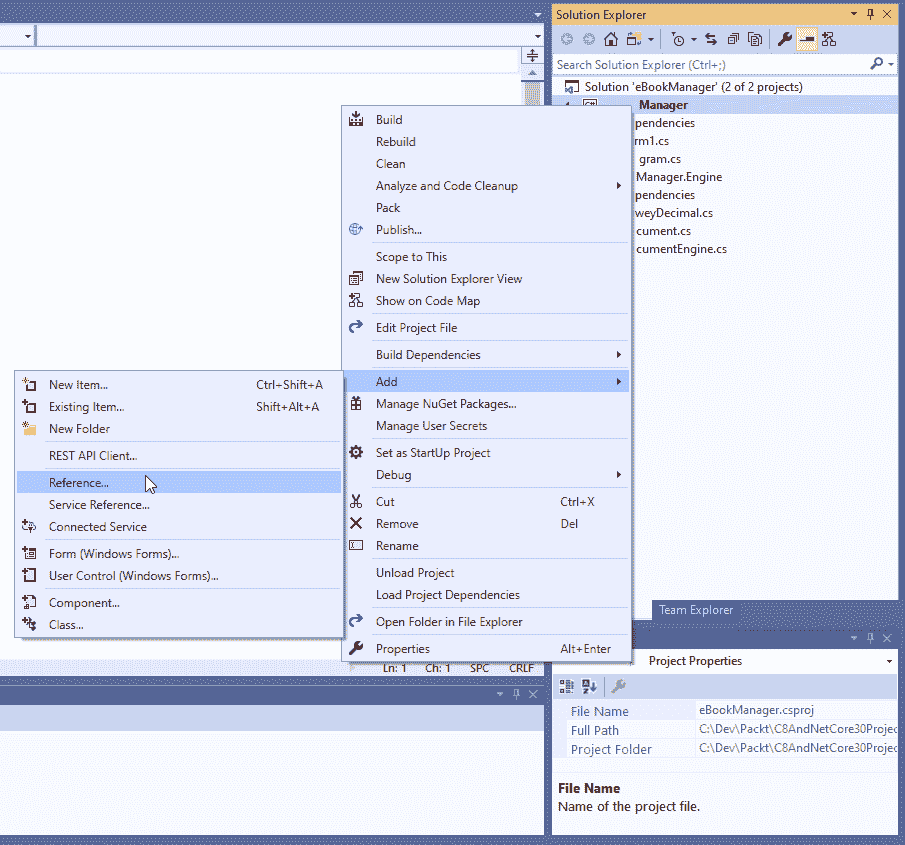

`eBookManager.Engine`项目将出现在参考管理器屏幕的项目部分:


4.  一旦我们添加了引用，我们就需要一个负责导入新书的窗口表单。在`eBookManager`解决方案中添加一个名为`ImportBooks`的新表单:

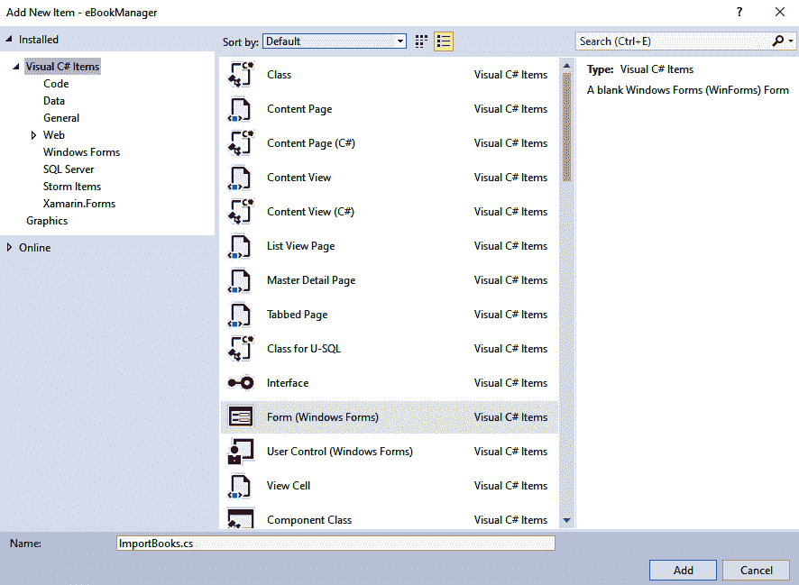

5.  我们将为扩展方法创建一个单独的项目。添加`eBookManager.Helper`类库项目(再次作为. NET 标准类库项目):

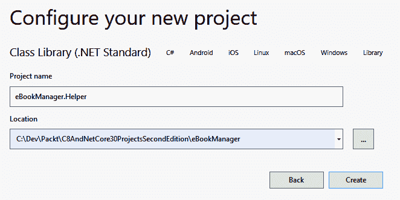

6.  我们将从我们的主要项目中引用它(如前):

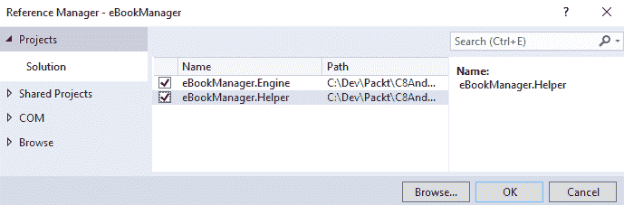

我们现在已经设置了我们的`eBookManager`应用所需的基础。接下来，我们将通过编写一些代码来进一步深入应用的内部。

# 虚拟存储空间和扩展方法

让我们从讨论虚拟存储空间背后的逻辑开始。这是硬盘上几个物理空间的单一虚拟表示。存储空间将被视为存储一组特定电子书的单一区域。我松散地使用“存储”这个术语，因为存储空间不存在。它比硬盘上的物理空间更能代表一个分组:

1.  要开始创建虚拟存储空间，请在`eBookManager.Engine`项目中添加一个名为`StorageSpace`的新类。打开`StorageSpace.cs`文件并添加以下代码:

```cs
using System;
using System.Collections.Generic;
namespace eBookManager.Engine
{
    [Serializable]
    public class StorageSpace
    {
        public int ID { get; set; }
        public string Name { get; set; }
        public string Description { get; set; }
        public List<Document> BookList { get; set; }
    }
}
```

Note that you need to include the `System.Collections.Generic` namespace here, because the `StorageSpace` class contains a property called `BookList` of type `List<Document>` that will contain all the books in that particular storage space.

现在我们需要将注意力集中在`eBookManager.Helper`项目上，并添加一个名为`ExtensionMethods`的新类。这将是一个静态类，因为扩展方法需要本质上是静态的，以便作用于由扩展方法定义的各种对象。

2.  新的`ExtensionMethods`类最初将如下所示:

```cs
public static class ExtensionMethods
{
}
```

让我们将第一个扩展方法添加到名为`ToInt()`的类中。这个扩展方法所做的是获取一个字符串值，并尝试将其解析为一个整数值。每当需要将字符串转换为整数时，我都懒得打`Convert.ToInt32(stringVariable)`。正是因为这个原因，我使用了一个扩展方法。

3.  将以下静态方法添加到`ExtensionMethods`类中:

```cs
public static int ToInt(this string value, int defaultInteger = 0)
{
    try
    {
        if (int.TryParse(value, out int validInteger))
        {
            // Out variables
            return validInteger;
        }
        else
        {
            return defaultInteger;
        }
    }
    catch
    {
        return defaultInteger;
    }
}
```

`ToInt()`扩展方法只作用于字符串。这是由方法签名中的`this string value`定义的，其中`value`是包含您试图转换为整数的字符串的变量名。它还有一个默认参数`defaultInteger`，设置为`0`。除非调用扩展方法的开发人员想要返回一个默认的整数值`0`，否则他们可以向这个扩展方法传递一个不同的整数(例如`-1`)。

`ExtensionMethods`类的其他方法用于提供以下逻辑:

*   读写数据源
*   检查存储空间是否存在
*   将字节转换为兆字节
*   将字符串转换为整数(如前所述)

`ToMegabytes`方法相当简单。为了避免必须到处写这个计算，在扩展方法中定义它是有意义的:

```cs
public static double ToMegabytes(this long bytes) => 
    (bytes > 0) ? (bytes / 1024f) / 1024f : bytes;
```

我们还需要一种方法来检查特定的存储空间是否已经存在。

Be sure to add a project reference to `eBookManager.Engine` from the `eBookManager.Helper` project.

这个扩展方法还会将下一个存储空间标识返回给调用代码。如果存储空间不存在，返回的标识将是创建新存储空间时可以使用的下一个标识:

```cs
public static bool StorageSpaceExists(this List<StorageSpace> space, string nameValueToCheck, out int storageSpaceId)
{
    bool exists = false;
    storageSpaceId = 0;
    if (space.Count() != 0)
    {
        int count = (from r in space
                     where r.Name.Equals(nameValueToCheck)
                     select r)
            .Count();
        if (count > 0) exists = true;
        storageSpaceId = (from r in space
                          select r.ID).Max() + 1;
    }
    return exists;
}
```

If you're pasting this code in, remember the *Ctrl + .* tip from earlier. Wherever you see code that is not recognized, simply place the cursor there and press *Ctrl + .*, or click the lightbulb, and it should bring in the necessary references.

我们还需要创建一个方法，在将数据转换为 JSON 后，将数据写入文件:

```cs
public async static Task WriteToDataStore(this List<StorageSpace> value,
string storagePath, bool appendToExistingFile = false)
{
    using (FileStream fs = File.Create(storagePath)) 
    await JsonSerializer.SerializeAsync(fs, value); 
}
```

本质上，我们在这里所做的就是创建一个流并将`StorageSpace`列表序列化到该流中。

Note that we're using the new syntactical sugar here from C# 8, allowing us to add a `using` statement with an implicit scope (that is, until the end of the method).

您需要从包管理器控制台安装`System.Text.Json`:

```cs
Install-Package System.Text.Json -ProjectName eBookManager.Helper
```

这允许您使用新的.NET Core 3 JSON 序列化程序。除了比它的前身，甚至像 Json.NET 这样的第三方工具更简洁之外，微软声称你会看到速度的提高，因为它利用了中引入的性能改进.NET Core 2.x。

最后，我们需要能够再次将数据读回`List<StorageSpace>`对象，并将其返回给调用代码:

```cs
public async static Task<List<StorageSpace>> ReadFromDataStore(this List<StorageSpace> value, string storagePath)
{
    if (!File.Exists(storagePath))
    {
        var newFile = File.Create(storagePath);
        newFile.Close();
    }

    using FileStream fs = File.OpenRead(storagePath);
    if (fs.Length == 0) return new List<StorageSpace>();

    var storageList = await JsonSerializer.DeserializeAsync<List<StorageSpace>>(fs);

    return storageList;
}
```

该方法将返回一个空列表，即一个`<StorageSpace>`对象，文件中不包含任何内容。`ExtensionMethods`类可以包含更多您可能经常使用的扩展方法。这是分离常用代码的好方法。

As with any other class, you should consider whether your extension method class is getting too large, or becoming a dumping ground for unrelated functionality, or functionality that may be better extracted into a self-contained class.

# 文档引擎类

这个类的目的仅仅是为文档提供支持代码。在`eBookManager`应用中，我将使用一个名为`GetFileProperties()`的方法，它将(你猜对了)返回所选文件的属性。这个类也只包含这个方法。当应用根据您的特定目的进行修改时，您可以修改这个类并添加特定于文档的其他方法。

在`DocumentEngine`类中，添加以下代码:

```cs
public (DateTime dateCreated, DateTime dateLastAccessed, string fileName, string fileExtension, long fileLength, bool error) GetFileProperties(string filePath)
{
    var returnTuple = (created: DateTime.MinValue,
    lastDateAccessed: DateTime.MinValue, name: "", ext: "",
    fileSize: 0L, error: false);
    try
    {
        FileInfo fi = new FileInfo(filePath);
        fi.Refresh();
        returnTuple = (fi.CreationTime, fi.LastAccessTime, fi.Name,
                       fi.Extension, fi.Length, false);
    }
    catch
    {
        returnTuple.error = true;
    }
    return returnTuple;
}
```

`GetFileProperties()`方法返回一个元组作为`(DateTime dateCreated, DateTime dateLastAccessed, string fileName, string fileExtension, long fileLength, bool error)`，并允许我们轻松检查从调用代码返回的值。

在获取特定文件的属性之前，通过执行以下操作初始化元组:

```cs
var returnTuple = (created: DateTime.MinValue, lastDateAccessed: DateTime.MinValue, name: "", ext: "", fileSize: 0L, error: false);
```

如果有异常，我可以返回默认值。使用`FileInfo`类读取文件属性非常简单。然后，我可以通过执行以下操作将文件属性分配给元组:

```cs
returnTuple = (fi.CreationTime, fi.LastAccessTime, fi.Name, fi.Extension, fi.Length, false);
```

然后，元组被返回给调用代码，在那里它将根据需要被使用。接下来我们将看一下调用代码。

# 进口书籍表格

`ImportBooks`形式确实如其名。它允许我们创建虚拟存储空间，并将书籍导入这些空间。表单设计如下:


*TreeView* controls are prefixed with `tv`, buttons with `btn`, combo boxes with `dl`, textboxes with `txt`, and date time pickers with `dt`.

Although this kind of prefixing isn't widely used today, this used to be a common practice for WinForms developers. The reason behind it is that WinForms never really lent itself very well to a separation of business and presentation layers (there have been attempts to rectify this, notably with the MVP pattern), meaning that referencing controls directly from code-behind was a common practice and, as such, it made sense to indicate the type of control you were dealing with.

当此表单加载时，如果已经定义了任何存储空间，那么它们将在`dlVirtualStorageSpaces`组合框中列出。点击选择源文件夹按钮将允许我们选择一个源文件夹，在其中寻找电子书。

如果某个存储空间不存在，我们可以通过点击`btnAddNewStorageSpace`按钮添加一个新的虚拟存储空间。这将允许我们为新的存储空间添加名称和描述，并点击`btnSaveNewStorageSpace`按钮。从`tvFoundBooks`树形视图中选择一个电子书将填充表单右侧的文件详细信息控件组。然后您可以添加额外的图书详情，并点击`btnAddeBookToStorageSpace`按钮将图书添加到我们的空间。

You can access the code-behind of a Windows Form by simply pressing *F7*, or right-clicking in Solution Explorer and selecting View Code.

以下步骤描述了要对`ImportBooks`代码隐藏进行的更改:

1.  您需要确保将以下命名空间添加到您的类中(这些命名空间应该替换那里的任何现有命名空间):

```cs
using eBookManager.Engine;
using System;
using System.Collections.Generic;
using System.IO;
using System.Linq;
using System.Windows.Forms;
using static eBookManager.Helper.ExtensionMethods;
using static System.Math;
```

2.  接下来，让我们从最符合逻辑的地方开始:构造函数`ImportBooks()`和类级变量。在构造函数上方添加以下声明:

```cs
private string _jsonPath;
private List<StorageSpace> _spaces;
private enum _storageSpaceSelection { New = -9999, NoSelection = -1 }
```

枚举器的用处将在代码的后面变得明显。`_jsonPath`变量将包含用于存储我们电子书信息的文件的路径。

Some people, including myself, like to prefix private class-level variables with an underscore (as in this example). This is a personal preference; however, there are settings in Visual Studio that will aid in the auto-generation of such variables if you tell it what your preference is.

3.  按如下方式修改构造函数:

```cs
public ImportBooks()
{
    InitializeComponent();
    _jsonPath = Path.Combine(Application.StartupPath, "bookData.txt"); 
}
```

`_jsonPath`在应用的执行文件夹中初始化，文件被硬编码到`bookData.txt`。如果您选择改进此项目，可以提供设置屏幕来配置这些设置。

4.  因为我们想在表单加载时加载一些数据，所以我们将附加`Form_Load`事件。在 WinForms 中创建事件处理程序的一种简单方法是，在表单设计器中选择事件，然后双击要处理的事件旁边的:

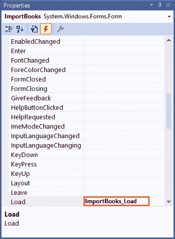

新事件应该异步从数据存储中加载以下代码:

```cs
private async void ImportBooks_Load(object sender, EventArgs e)
{
    _spaces = await _spaces.ReadFromDataStore(_jsonPath);
}
```

5.  接下来，我们需要添加另外两个枚举器，它们定义了我们将能够保存在应用中的文件扩展名:

```cs
private HashSet<string> AllowedExtensions => new HashSet<string>(StringComparer.InvariantCultureIgnoreCase) 
{ ".doc", ".docx", ".pdf", ".epub", ".lit" };

private enum Extension { doc = 0, docx = 1, pdf = 2, epub = 3, lit = 4 }
```

当我们查看`PopulateBookList()`方法时，我们可以看到`AllowedExtensions`属性的实现。

# 填充 TreeView 控件

`PopulateBookList()`方法所做的只是用在所选源位置找到的文件和文件夹填充`TreeView`控件。考虑`ImportBooks`代码中的以下代码:

```cs
public void PopulateBookList(string paramDir, TreeNode paramNode)
{
    DirectoryInfo dir = new DirectoryInfo(paramDir);
    foreach (DirectoryInfo dirInfo in dir.GetDirectories())
    {
        TreeNode node = new TreeNode(dirInfo.Name);
        node.ImageIndex = 4;
        node.SelectedImageIndex = 5;
        if (paramNode != null)
            paramNode.Nodes.Add(node);
        else
            tvFoundBooks.Nodes.Add(node);
        PopulateBookList(dirInfo.FullName, node);
    }
    foreach (FileInfo fleInfo in dir.GetFiles()
        .Where(x => AllowedExtensions.Contains(x.Extension)).ToList())
    {
        TreeNode node = new TreeNode(fleInfo.Name);
        node.Tag = fleInfo.FullName;
        int iconIndex = Enum.Parse(typeof(Extension),
        fleInfo.Extension.TrimStart('.'), true).GetHashCode();
        node.ImageIndex = iconIndex;
        node.SelectedImageIndex = iconIndex;
        if (paramNode != null)
            paramNode.Nodes.Add(node);
        else
            tvFoundBooks.Nodes.Add(node);
    }
}
```

我们需要调用这个方法的第一个地方显然是从它自身内部，因为这是一个递归方法。我们需要调用的第二个地方是来自`btnSelectSourceFolder`按钮的点击事件(还是和以前一样，选择点击属性并双击):

```cs
private void btnSelectSourceFolder_Click(object sender, EventArgs e)
{
    try
    {
        FolderBrowserDialog fbd = new FolderBrowserDialog();
        fbd.Description = "Select the location of your eBooks and documents";
        DialogResult dlgResult = fbd.ShowDialog();
        if (dlgResult == DialogResult.OK)
        {
            tvFoundBooks.Nodes.Clear(); 
            string path = fbd.SelectedPath;
            DirectoryInfo di = new DirectoryInfo(path);
            TreeNode root = new TreeNode(di.Name);
            root.ImageIndex = 4;
            root.SelectedImageIndex = 5;
            tvFoundBooks.Nodes.Add(root);
            PopulateBookList(di.FullName, root);
            tvFoundBooks.Sort();
            root.Expand();
        }
    }
    catch (Exception ex)
    {
        MessageBox.Show(ex.Message);
    }
}
```

这些都是非常简单的代码。选择要递归的文件夹，并使用找到的与包含在我们的`AllowedExtensions`属性中的文件扩展名匹配的所有文件填充*树形视图*控件。当有人在`tvFoundBooks TreeView`控件中选择一本书时，我们还需要看代码。当选择一本书时，我们需要读取所选文件的属性，并将这些属性返回到文件详细信息部分:

```cs
private void tvFoundBooks_AfterSelect(object sender, TreeViewEventArgs e)
{
    DocumentEngine engine = new DocumentEngine();
    string path = e.Node.Tag?.ToString() ?? "";
    if (File.Exists(path))
    {
        var (dateCreated, dateLastAccessed, fileName, fileExtention, fileLength, hasError) = engine.GetFileProperties(e.Node.Tag.ToString());
        if (!hasError)
        {
            txtFileName.Text = fileName; 
            txtExtension.Text = fileExtention;
            dtCreated.Value = dateCreated;
            dtLastAccessed.Value = dateLastAccessed;
            txtFilePath.Text = e.Node.Tag.ToString();
            txtFileSize.Text = $"{Round(fileLength.ToMegabytes(), 2).ToString()} MB"; 
        }
    }
}
```

您会注意到，正是在这里，我们在返回元组的`DocumentEngine`类上调用`GetFileProperties()`方法。

# 填充存储空间列表

下一步是填充我们的存储空间列表:

```cs
private void PopulateStorageSpacesList()
{
    List<KeyValuePair<int, string>> lstSpaces =
        new List<KeyValuePair<int, string>>();
    BindStorageSpaceList((int)_storageSpaceSelection.NoSelection, "Select Storage Space");

    void BindStorageSpaceList(int key, string value) =>     
        lstSpaces.Add(new KeyValuePair<int, string>(key, value));    

    if (_spaces is null || _spaces.Count() == 0) // Pattern matching
    {
        BindStorageSpaceList((int)_storageSpaceSelection.New, " <create new> ");
    }
    else
    {
        foreach (var space in _spaces)
        {
            BindStorageSpaceList(space.ID, space.Name);
        }
    }
    dlVirtualStorageSpaces.DataSource = new
        BindingSource(lstSpaces, null);
    dlVirtualStorageSpaces.DisplayMember = "Value";
    dlVirtualStorageSpaces.ValueMember = "Key";
}
```

The `PopulateStorageSpacesList()` method is using a *local function,* essentially allowing us to declare a piece of functionality that is accessible *only* from within its parent.

让我们将对这个新方法的调用添加到`ImportBooks_Load`方法中:

```cs
private async void ImportBooks_Load(object sender, EventArgs e)
{
    _spaces = await _spaces.ReadFromDataStore(_jsonPath);
    PopulateStorageSpacesList();
    if (dlVirtualStorageSpaces.Items.Count == 0)
    {
        dlVirtualStorageSpaces.Items.Add("<create new storage space > ");
    }
    lblEbookCount.Text = "";
}
```

我们现在需要添加用于更改所选存储空间的逻辑。`dlVirtualStorageSpaces`控制的`SelectedIndexChanged()`事件修改如下:

```cs
private void dlVirtualStorageSpaces_SelectedIndexChanged(object sender, EventArgs e)
{
    int selectedValue = dlVirtualStorageSpaces.SelectedValue.ToString().ToInt();
    if (selectedValue == (int)_storageSpaceSelection.New) // -9999
    {
        txtNewStorageSpaceName.Visible = true;
        lblStorageSpaceDescription.Visible = true;
        txtStorageSpaceDescription.ReadOnly = false;
        btnSaveNewStorageSpace.Visible = true;
        btnCancelNewStorageSpaceSave.Visible = true;
        dlVirtualStorageSpaces.Enabled = false;
        btnAddNewStorageSpace.Enabled = false;
        lblEbookCount.Text = "";
    }
    else if (selectedValue != (int)_storageSpaceSelection.NoSelection)
    {
        // Find the contents of the selected storage space
        int contentCount = (from c in _spaces
            where c.ID == selectedValue
            select c).Count();
        if (contentCount > 0)
        {
            StorageSpace selectedSpace = (from c in _spaces
                where c.ID == selectedValue
                select c).First();
            txtStorageSpaceDescription.Text = selectedSpace.Description;
            List<Document> eBooks = (selectedSpace.BookList == null)
                ? new List<Document> { } 
                : selectedSpace.BookList;
            lblEbookCount.Text = $"Storage Space contains { eBooks.Count()} {(eBooks.Count() == 1 ? "eBook" : "eBooks")}";
        }
    }
    else
    {
        lblEbookCount.Text = "";
    }
}
```

我不会在这里详细解释代码，因为它正在做什么是相对显而易见的。

我们还需要添加代码来节省新的存储空间。在`btnSaveNewStorageSpace`按钮的*点击*事件中添加以下代码:

```cs
private void btnSaveNewStorageSpace_Click(object sender, EventArgs e)
{
    try
    {
        if (txtNewStorageSpaceName.Text.Length != 0)
        {
            string newName = txtNewStorageSpaceName.Text;
            bool spaceExists = 
                (!_spaces.StorageSpaceExists(newName, out int nextID)) 
                ? false 
                : throw new Exception("The storage space you are trying to add already exists.");
            if (!spaceExists)
            {
                StorageSpace newSpace = new StorageSpace();
                newSpace.Name = newName;
                newSpace.ID = nextID;
                newSpace.Description =
                txtStorageSpaceDescription.Text;
                _spaces.Add(newSpace);

                PopulateStorageSpacesList();
                // Save new Storage Space Name
                txtNewStorageSpaceName.Clear();
                txtNewStorageSpaceName.Visible = false;
                lblStorageSpaceDescription.Visible = false;
                txtStorageSpaceDescription.ReadOnly = true;
                txtStorageSpaceDescription.Clear();
                btnSaveNewStorageSpace.Visible = false;
                btnCancelNewStorageSpaceSave.Visible = false;
                dlVirtualStorageSpaces.Enabled = true;
                btnAddNewStorageSpace.Enabled = true;
            }
        }
    }
    catch (Exception ex)
    {
        txtNewStorageSpaceName.SelectAll();
        MessageBox.Show(ex.Message);
    }
}
```

最后几个方法涉及将电子书保存在选定的虚拟存储空间中。修改*点击`btnAddBookToStorageSpace`按钮的*事件。这段代码还包含一个抛出表达式。如果您尚未从组合框中选择存储空间，则会引发新的异常:

```cs
private async void btnAddeBookToStorageSpace_Click(object sender, EventArgs e)
{
    try
    {
        int selectedStorageSpaceID =
            dlVirtualStorageSpaces.SelectedValue.ToString().ToInt();
        if ((selectedStorageSpaceID != (int)_storageSpaceSelection.NoSelection)
            && (selectedStorageSpaceID != (int)_storageSpaceSelection.New))
        {
            await UpdateStorageSpaceBooks(selectedStorageSpaceID);
        }
        else throw new Exception("Please select a Storage Space to add your eBook to"); // throw expressions
    }
    catch (Exception ex)
    {
        MessageBox.Show(ex.Message);
    }
}
```

如果输入这个代码，你会注意到`UpdateStorageSpaceBooks`方法还不存在；让我们纠正一下。

# 将选定的书保存到存储空间

下面的代码基本上更新了所选存储空间中的图书列表，如果它已经包含了特定的图书(在与用户确认之后)。否则，它会将该书作为新书添加到图书列表中:

```cs
private async Task UpdateStorageSpaceBooks(int storageSpaceId)
{
    try
    {
        int iCount = (from s in _spaces
                      where s.ID == storageSpaceId
                      select s).Count();
        if (iCount > 0) // The space will always exist 
        {
            // Update
            StorageSpace existingSpace = (from s in _spaces
                                          where s.ID == storageSpaceId
                                          select s).First();
            List<Document> ebooks = existingSpace.BookList;
            int iBooksExist = (ebooks != null) 
                ? (from b in ebooks
                   where $"{b.FileName}".Equals($"{txtFileName.Text.Trim()}")
                   select b).Count() 
                : 0;
            if (iBooksExist > 0)
            { 
                DialogResult dlgResult = MessageBox.Show($"A book with the same name has been found in Storage Space {existingSpace.Name}. Do you want to replace the existing book entry with this one ?", "Duplicate Title", 
                    MessageBoxButtons.YesNo, 
                    MessageBoxIcon.Warning, 
                    MessageBoxDefaultButton.Button2);
                if (dlgResult == DialogResult.Yes)
                {
                    Document existingBook = (from b in ebooks
                                             where $"{ b.FileName}".Equals($"{txtFileName.Text.Trim()}")
                                             select b).First();
                    SetBookFields(existingBook);
                }
            } 
            else
            {
                // Insert new book
                Document newBook = new Document();
                SetBookFields(newBook);

                if (ebooks == null)
                    ebooks = new List<Document>();
                ebooks.Add(newBook);
                existingSpace.BookList = ebooks;
            }
        }
        await _spaces.WriteToDataStore(_jsonPath);
        PopulateStorageSpacesList();
        MessageBox.Show("Book added");
    }
    catch (Exception ex)
    {
        MessageBox.Show(ex.Message);
    }
}
```

我们在前面的方法中调用了一个辅助方法，叫做`SetBookFields`:

```cs
private void SetBookFields(Document book)
{
    book.FileName = txtFileName.Text;
    book.Extension = txtExtension.Text;
    book.LastAccessed = dtLastAccessed.Value;
    book.Created = dtCreated.Value;
    book.FilePath = txtFilePath.Text;
    book.FileSize = txtFileSize.Text;
    book.Title = txtTitle.Text;
    book.Author = txtAuthor.Text;
    book.Publisher = txtPublisher.Text;
    book.Price = txtPrice.Text;
    book.ISBN = txtISBN.Text;
    book.PublishDate = dtDatePublished.Value;
    book.Category = txtCategory.Text;
}
```

最后，作为内务处理，ImportBooks 表单包含以下代码，用于根据`btnCancelNewStorageSpace`和`btnAddNewStorageSpace`按钮的按钮点击事件显示和启用控件:

```cs
private void btnCancelNewStorageSpaceSave_Click(object sender, EventArgs e)
{
    txtNewStorageSpaceName.Clear();
    txtNewStorageSpaceName.Visible = false;
    lblStorageSpaceDescription.Visible = false;
    txtStorageSpaceDescription.ReadOnly = true;
    txtStorageSpaceDescription.Clear();
    btnSaveNewStorageSpace.Visible = false;
    btnCancelNewStorageSpaceSave.Visible = false;
    dlVirtualStorageSpaces.Enabled = true;
    btnAddNewStorageSpace.Enabled = true;
}

private void btnAddNewStorageSpace_Click(object sender, EventArgs e)
{
    txtNewStorageSpaceName.Visible = true;
    lblStorageSpaceDescription.Visible = true;
    txtStorageSpaceDescription.ReadOnly = false;
    btnSaveNewStorageSpace.Visible = true;
    btnCancelNewStorageSpaceSave.Visible = true;
    dlVirtualStorageSpaces.Enabled = false;
    btnAddNewStorageSpace.Enabled = false;
}
```

现在剩下的就是我们在`Form1.cs`表单中完成代码，这是启动表单。

# 创建主电子书管理器表单

首先将`Form1.cs`重命名为`eBookManager.cs`。这是应用的启动表单，它将列出以前保存的所有现有存储空间:


如下设计您的`eBookManager`表单:

*   现有存储空间的列表视图控件
*   所选存储空间中包含的电子书的列表视图
*   打开电子书文件位置的按钮
*   导航到 ImportBooks.cs 表单的菜单控件
*   显示所选电子书信息的各种只读字段:


Again, due to the nature of the WinForms designer, you may choose to simply copy and paste the designer code from the repository.

本节需要以下`using`语句:

```cs
using eBookManager.Engine;
using eBookManager.Helper;
using System;
using System.Collections.Generic;
using System.IO;
using System.Windows.Forms;
using System.Linq;
using System.Diagnostics;
```

As demonstrated earlier, you may choose to omit this and then press *Ctrl + .* each time a particular method or namespace isn't recognized.

Bear in mind that you won't be able to use this to include libraries with extension methods, so you'll need to include `eBookManager.Helper` manually.

现在让我们借助以下步骤开始设计我们的`eBookManager`表单:

1.  构造函数和加载方法与`ImportBooks.cs`表单中的非常相似。他们读取任何可用的存储空间，并用以前保存的存储空间填充存储空间列表视图控件:

```cs
private string _jsonPath;
private List<StorageSpace> _spaces;

public eBookManager()
{
    InitializeComponent();
    _jsonPath = Path.Combine(Application.StartupPath,
        "bookData.txt"); 
}

private async void eBookManager_Load(object sender, EventArgs e)
{
    _spaces = await _spaces.ReadFromDataStore(_jsonPath);

    // imageList1 
    this.imageList1.Images.Add("storage_space_cloud.png", Image.FromFile("img/storage_space_cloud.png"));
    this.imageList1.Images.Add("eBook.png", Image.FromFile("img/eBook.png"));
    this.imageList1.Images.Add("no_eBook.png", Image.FromFile("img/no_eBook.png"));
    this.imageList1.TransparentColor = System.Drawing.Color.Transparent;

    // btnReadEbook 
    this.btnReadEbook.Image = Image.FromFile("img/ReadEbook.png");
    this.btnReadEbook.Location = new System.Drawing.Point(103, 227);
    this.btnReadEbook.Name = "btnReadEbook";
    this.btnReadEbook.Size = new System.Drawing.Size(36, 40);
    this.btnReadEbook.TabIndex = 32;
    this.toolTip1.SetToolTip(this.btnReadEbook, "Click here to open the eBook file location");
    this.btnReadEbook.UseVisualStyleBackColor = true;
    this.btnReadEbook.Click += new System.EventHandler(this.btnReadEbook_Click);

    // eBookManager Icon 
    this.Icon = new System.Drawing.Icon("ico/mainForm.ico");

    PopulateStorageSpaceList();
}

private void PopulateStorageSpaceList()
{
    lstStorageSpaces.Clear();
    if (!(_spaces == null))
    {
        foreach (StorageSpace space in _spaces)
        {
            ListViewItem lvItem = new ListViewItem(space.Name, 0);
            lvItem.Tag = space.BookList;
            lvItem.Name = space.ID.ToString();
            lstStorageSpaces.Items.Add(lvItem);
        }
    }
}
```

2.  如果用户点击某个存储空间，我们需要能够阅读该选定空间中包含的书籍:

```cs
private void lstStorageSpaces_MouseClick(object sender, MouseEventArgs e)
{
    ListViewItem selectedStorageSpace =
    lstStorageSpaces.SelectedItems[0];
    int spaceID = selectedStorageSpace.Name.ToInt();
    txtStorageSpaceDescription.Text = (from d in _spaces
        where d.ID == spaceID
        select d.Description).First();
    List<Document> ebookList =
        (List<Document>)selectedStorageSpace.Tag;
    PopulateContainedEbooks(ebookList);
}
```

3.  我们现在需要创建一个方法，用所选存储空间中包含的书籍填充`lstBooks`列表视图:

```cs
private void PopulateContainedEbooks(List<Document> ebookList)
{
    lstBooks.Clear();
    ClearSelectedBook();
    if (ebookList != null)
    {
        foreach (Document eBook in ebookList)
        {
            ListViewItem book = new ListViewItem(eBook.Title, 1);
            book.Tag = eBook;
            lstBooks.Items.Add(book);
        }
    }
    else
    {
        ListViewItem book = new ListViewItem("This storage space contains no eBooks", 2);
        book.Tag = "";
        lstBooks.Items.Add(book);
    }
}
```

4.  当选定的存储空间改变时，我们还需要清除选定书籍的详细信息。我已经围绕文件和图书细节创建了两个组控件。这段代码只是遍历所有子控件；如果子控件是文本框，它会清除它:

```cs
private void ClearSelectedBook()
{
    foreach (Control ctrl in gbBookDetails.Controls)
    {
        if (ctrl is TextBox)
            ctrl.Text = "";
    }
    foreach (Control ctrl in gbFileDetails.Controls)
    {
        if (ctrl is TextBox)
            ctrl.Text = "";
    }
    dtLastAccessed.Value = DateTime.Now;
    dtCreated.Value = DateTime.Now;
    dtDatePublished.Value = DateTime.Now;
}
```

5.  添加到表单中的`MenuStrip`在`ImportEbooks`菜单项上有一个点击事件。它只是打开了`ImportBooks`的形式:

```cs
private async void mnuImportEbooks_Click(object sender, EventArgs e)
{
    ImportBooks import = new ImportBooks();
    import.ShowDialog();
    _spaces = await _spaces.ReadFromDataStore(_jsonPath);
    PopulateStorageSpaceList();
}
```

6.  以下方法包装了选择特定电子书的逻辑，并在`eBookManager`表单上填充文件和电子书详细信息:

```cs
private void lstBooks_MouseClick(object sender, MouseEventArgs e)
{
    ListViewItem selectedBook = lstBooks.SelectedItems[0];
    if (!String.IsNullOrEmpty(selectedBook.Tag.ToString()))
    {
        Document ebook = (Document)selectedBook.Tag;
        txtFileName.Text = ebook.FileName;
        txtExtension.Text = ebook.Extension;
        dtLastAccessed.Value = ebook.LastAccessed;
        dtCreated.Value = ebook.Created;
        txtFilePath.Text = ebook.FilePath;
        txtFileSize.Text = ebook.FileSize;
        txtTitle.Text = ebook.Title;
        txtAuthor.Text = ebook.Author;
        txtPublisher.Text = ebook.Publisher;
        txtPrice.Text = ebook.Price;
        txtISBN.Text = ebook.ISBN;
        dtDatePublished.Value = ebook.PublishDate;
        txtCategory.Text = ebook.Category;
    }
}
```

7.  最后，当所选的书是您想要阅读的书时，单击阅读电子书按钮打开所选电子书的文件位置:

```cs
private void btnReadEbook_Click(object sender, EventArgs e)
{
    string filePath = txtFilePath.Text;
    FileInfo fi = new FileInfo(filePath);
    if (fi.Exists)
    {
        Process.Start("explorer.exe", Path.GetDirectoryName(filePath));
    }
}
```

这就完成了`eBookManager`应用中包含的代码逻辑。

You can further modify the code to open the required application for the selected eBook instead of just the file location. In other words, if you click on a PDF document, the application can launch a PDF reader with the document loaded. Lastly, note that classification has not been implemented in this version of the application.

是时候启动应用并进行测试了。

# 运行电子书管理器应用

要运行应用，请执行以下步骤:

1.  当应用首次启动时，将没有可用的虚拟存储空间。要创建一个，我们需要导入一些书籍。单击“导入电子书”菜单项:

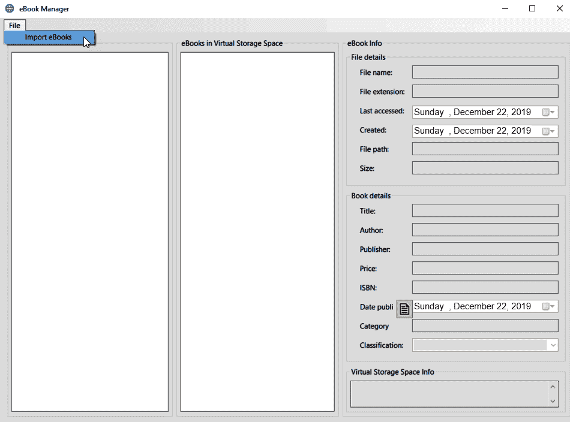

2.  将打开“导入电子书”屏幕。您可以添加新的存储空间，并选择电子书的源文件夹:


3.  选择电子书后，添加书籍的相关信息并将其保存到存储空间。添加所有存储空间和电子书后，您将看到虚拟存储空间列表。当您单击存储空间时，其中包含的书籍将会列出:


4.  选择电子书并点击阅读电子书按钮将打开包含所选电子书的文件位置。
5.  最后，让我们看看为*电子书管理器*应用生成的 JSON 文件。最初，它将存储在项目的输出位置:


在下面，我使用 VS 代码很好地格式化了 JSON:

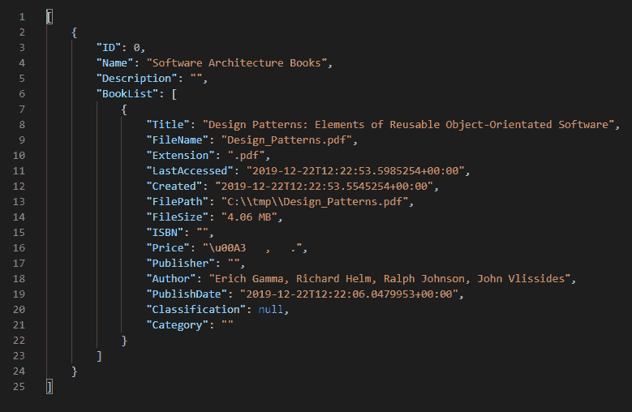

The keyboard shortcut to format JSON in VS Code is *Shift + Alt + F*.

正如您所看到的，JSON 文件布局非常好，并且很容易阅读。

现在让我们看看如何将现有的 WinForms 应用升级到.NET Core 3。

# 升级到.NET Core 3

为了遵循这一部分，您将不再需要第一版中的 WinForms 应用*——任何 WinForms 应用都可以；但是，建议您使用该应用，尤其是在后面我们将讨论 C# 8 特性的部分。*

 *您可以从以下位置下载原始项目:

[https://github.com/PacktPublishing/CSharp7-and-.网络核心 2.0 蓝图](https://github.com/PacktPublishing/CSharp7-and-.NET-Core-2.0-Blueprints)

如果您下载并运行该应用，您应该会发现它仍然可以正常工作:

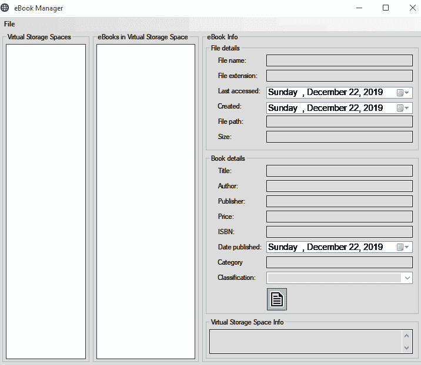

现在让我们研究如何在下运行这个完全相同的代码库.NET Core 3。我们将从项目文件开始。基本上，我们需要告诉 Visual Studio，我们现在有一个. NET Core 3 项目，而不是框架项目。

如果您安装了电动工具([https://marketplace.visualstudio.com/items?item name = visualstudioproductTeam。生产力 PowerPack2017](https://marketplace.visualstudio.com/items?itemName=VisualStudioProductTeam.ProductivityPowerPack2017) ，你可以在 Visual Studio 里面做这个；如果没有，那么只需使用您最喜欢的文本编辑器打开`.csproj`文件:

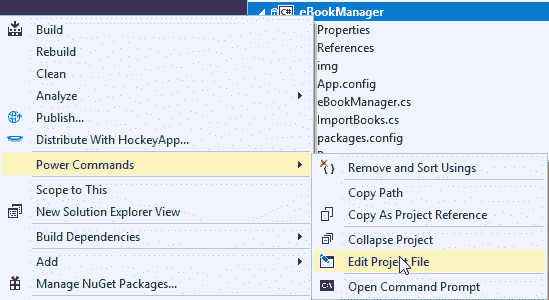

将`.csproj`文件的内容更改为以下内容:

```cs
<Project Sdk="Microsoft.NET.Sdk.WindowsDesktop">

  <PropertyGroup>
    <OutputType>WinExe</OutputType>
    <TargetFramework>netcoreapp3.0</TargetFramework>
    <LangVersion>8.0</LangVersion>

    <AssetTargetFallback>uap10.0.18362</AssetTargetFallback>
    <UseWindowsForms>true</UseWindowsForms>
  </PropertyGroup>

  <ItemGroup>
    <PackageReference Include="Newtonsoft.Json" Version="12.0.2" />
  </ItemGroup>

  <ItemGroup>
    <ProjectReference Include="..\eBookManager.Controls\eBookManager.Controls.csproj" />
    <ProjectReference Include="..\eBookManager.Engine\eBookManager.Engine.csproj" />
    <ProjectReference Include="..\eBookManager.Helper\eBookManager.Helper.csproj" />
  </ItemGroup>

  <ItemGroup>
    <Reference Include="System">
      <HintPath>System</HintPath>
    </Reference>
  </ItemGroup>

</Project>    
```

本质上，这是所有需要的。但是，您需要决定如何处理项目的资源。您可以手动检查它们是否都被设置为复制到输出目录；或者，我们可以向项目文件中添加一个*项目组*，如下所示:

```cs
  <ItemGroup>
    <None Update="ico\importBooks.ico">
      <CopyToOutputDirectory>PreserveNewest</CopyToOutputDirectory>
    </None>
    <None Update="ico\mainForm.ico">
      <CopyToOutputDirectory>PreserveNewest</CopyToOutputDirectory>
    </None>
    <None Update="img\add_ebook_to_storage_space.png">
      <CopyToOutputDirectory>PreserveNewest</CopyToOutputDirectory>
    </None>
    <None Update="img\add_new_storage_space.png">
      <CopyToOutputDirectory>PreserveNewest</CopyToOutputDirectory>
    </None>
    <None Update="img\docx16.png">
      <CopyToOutputDirectory>PreserveNewest</CopyToOutputDirectory>
    </None>
    <None Update="img\docxx16.png">
      <CopyToOutputDirectory>PreserveNewest</CopyToOutputDirectory>
    </None>
    <None Update="img\eBook.png">
      <CopyToOutputDirectory>PreserveNewest</CopyToOutputDirectory>
    </None>
    <None Update="img\epubx16.png">
      <CopyToOutputDirectory>PreserveNewest</CopyToOutputDirectory>
    </None>
    <None Update="img\folder-close-x16.png">
      <CopyToOutputDirectory>PreserveNewest</CopyToOutputDirectory>
    </None>
    <None Update="img\folder_exp_x16.png">
      <CopyToOutputDirectory>PreserveNewest</CopyToOutputDirectory>
    </None>
    <None Update="img\image sources.txt">
      <CopyToOutputDirectory>PreserveNewest</CopyToOutputDirectory>
    </None>
    <None Update="img\no_eBook.png">
      <CopyToOutputDirectory>PreserveNewest</CopyToOutputDirectory>
    </None>
    <None Update="img\pdfx16.png">
      <CopyToOutputDirectory>PreserveNewest</CopyToOutputDirectory>
    </None>
    <None Update="img\ReadEbook.png">
      <CopyToOutputDirectory>PreserveNewest</CopyToOutputDirectory>
    </None>
    <None Update="img\storage_space_cloud.png">
      <CopyToOutputDirectory>PreserveNewest</CopyToOutputDirectory>
    </None>
  </ItemGroup>
```

正如您所看到的，整个事情比文件的前一个版本简单得多。

At the time of writing, the first preview of a WinForms editor was released. The following article details what it is currently capable of: [https://devblogs.microsoft.com/dotnet/introducing-net-core-windows-forms-designer-preview-1/](https://devblogs.microsoft.com/dotnet/introducing-net-core-windows-forms-designer-preview-1/).

Unfortunately, *Preview 1* was not stable enough to make the changes necessary for this chapter, and so we are bypassing the designer.

下一步是删除以下文件，在`Properties`下找到:

*   `AssemblyInfo.cs`
*   `Settings.Designer.cs`
*   `Settings.settings`

事实上，到本章结束时，整个`Properties`文件夹都将不复存在。

实际上，就是这样。只需重新加载项目并点击 *F5* 。该应用现在正在运行.NET Core。然而，在这一点上很可能会出现错误。原因是我们还有另外两个项目仍在进行中.NET 框架:

*   `eBookManager.Engine`
*   `eBookManager.Helper`

我们需要以类似的方式迁移每个项目；先说`eBookManager.Engine`。如前所述，编辑项目文件并用以下内容替换您在那里找到的内容:

```cs
<Project Sdk="Microsoft.NET.Sdk">
  <PropertyGroup>
    <TargetFramework>netcoreapp3.0</TargetFramework>
  </PropertyGroup> 
</Project>
```

如你所见，这比以前更简单了。其实没有必要有这个目标 3.0；如果我们愿意，我们可以瞄准 2.2，甚至 2.1。再次，我们将删除`AssemblyInfo.cs`。

最后，我们来到`eBookManager.Helper`。再次编辑项目文件以匹配以下内容:

```cs
<Project Sdk="Microsoft.NET.Sdk"> 
  <PropertyGroup>
    <TargetFramework>netcoreapp3.0</TargetFramework>
  </PropertyGroup>

  <ItemGroup>
    <PackageReference Include="Newtonsoft.Json" Version="11.0.2" />
  </ItemGroup>

  <ItemGroup>
    <ProjectReference Include="..\eBookManager.Engine\eBookManager.Engine.csproj" />
  </ItemGroup>
</Project>
```

再次，我们将删除`AssemblyInfo.cs`。我们还需要删除在`ExtensionMethods.cs`中对`System.Windows.Forms`的不恰当引用。

# 修复编译错误

最后，我们需要重构一些依赖于嵌入式图像资源的代码。如果您按原样运行代码，您可能会收到类似以下内容的错误:

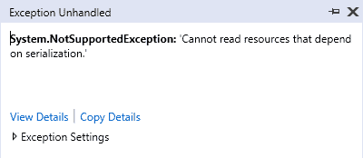

在写这篇文章的时候，WinForms 还在运行.NET Core 3.0 不支持二进制序列化。因此，我们需要做一些小的改变。

# 资源文件

我们需要做的第一件事是从输出目录中读取文件，因此我们将更改图像和图标文件上的“复制到输出目录”设置；突出显示所有文件，然后将复制到输出目录操作更改为复制(如果更新):


下一步是进入`eBookManager`画面。

# 电子书管理器屏幕

在`eBookManager.Designer.cs`文件中，删除`imageList1`部分:

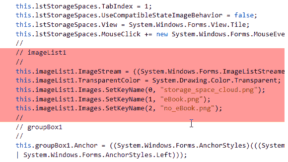

同时删除`btnReadEbook`部分:

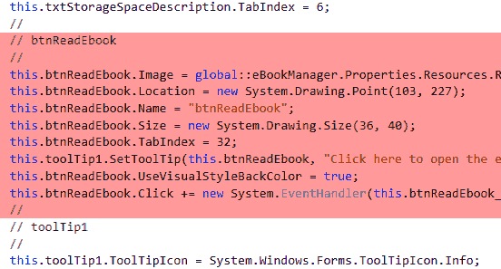

最后，删除`eBookManager`部分的`this.Icon`赋值:

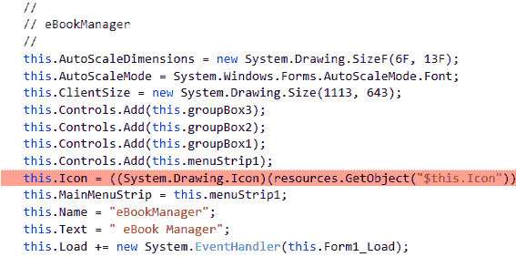

我们将把已经删除的代码移到`eBookManager.cs`的`Form_Load`事件中:

```cs
private void Form1_Load(object sender, EventArgs e)
{
    System.ComponentModel.ComponentResourceManager resources = new System.ComponentModel.ComponentResourceManager(typeof(eBookManager));

    this.components = new System.ComponentModel.Container();

    // imageList1
    //this.imageList1.ImageStream = ((System.Windows.Forms.ImageListStreamer)(resources.GetObject("imageList1.ImageStream")));            
    this.imageList1.Images.Add("storage_space_cloud.png", Image.FromFile("img/storage_space_cloud.png"));
    this.imageList1.Images.Add("eBook.png", Image.FromFile("img/eBook.png"));
    this.imageList1.Images.Add("no_eBook.png", Image.FromFile("img/no_eBook.png"));
    this.imageList1.TransparentColor = System.Drawing.Color.Transparent;

    // btnReadEbook            
    this.btnReadEbook.Image = Image.FromFile("img/ReadEbook.png");
    this.btnReadEbook.Location = new System.Drawing.Point(103, 227);
    this.btnReadEbook.Name = "btnReadEbook";
    this.btnReadEbook.Size = new System.Drawing.Size(36, 40);
    this.btnReadEbook.TabIndex = 32;
    this.toolTip1.SetToolTip(this.btnReadEbook, "Click here to open the eBook file location");
    this.btnReadEbook.UseVisualStyleBackColor = true;
    this.btnReadEbook.Click += new System.EventHandler(this.btnReadEbook_Click);

    // eBookManager Icon            
    this.Icon = new System.Drawing.Icon("ico/mainForm.ico");

    PopulateStorageSpaceList();
}
```

# 导入书籍屏幕

`importBooks.Designer.cs`也需要类似的改变。应删除以下部分:

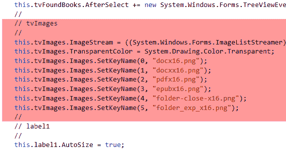

删除同一文件中`btnAddeBookToStorageSpace`图像的设置器:

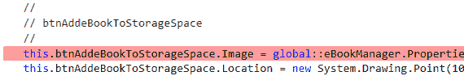

删除`btnAddNewStorageSpace`的图像(同样，在同一文件中):

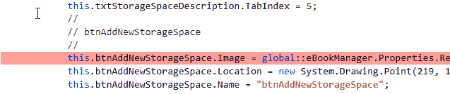

最后，移除表单的图标设置器:

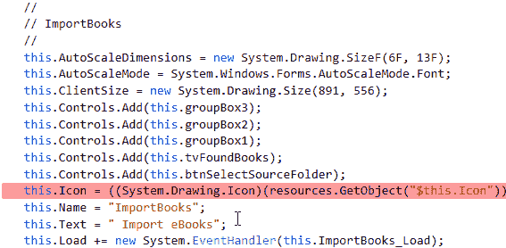

我们将把它移到`ImportBooks.cs`的`Form_Load`事件中，现在应该如下所示:

```cs
private void ImportBooks_Load(object sender, EventArgs e)
{
    // tvImages                        
    this.tvImages.Images.Add("docx16.png", Image.FromFile("img/docx16.png"));
    this.tvImages.Images.Add("docxx16.png", Image.FromFile("img/docxx16.png"));
    this.tvImages.Images.Add("pdfx16.png", Image.FromFile("img/pdfx16.png"));
    this.tvImages.Images.Add("epubx16.png", Image.FromFile("img/epubx16.png"));
    this.tvImages.Images.Add("folder-close-x16.png", Image.FromFile("img/folder-close-x16.png"));
    this.tvImages.Images.Add("folder_exp_x16.png", Image.FromFile("img/folder_exp_x16.png"));
    this.tvImages.TransparentColor = System.Drawing.Color.Transparent;

    // btnAddeBookToStorageSpace
    this.btnAddeBookToStorageSpace.Image = Image.FromFile("img/add_ebook_to_storage_space.png");

    // btnAddNewStorageSpace
    this.btnAddNewStorageSpace.Image = Image.FromFile("img/add_new_storage_space.png");

    // ImportBooks            
    this.Icon = new System.Drawing.Icon("ico/importBooks.ico");

    PopulateStorageSpacesList();

    if (dlVirtualStorageSpaces.Items.Count == 0)
    {
        dlVirtualStorageSpaces.Items.Add("<create new storage space>");
    }

    lblEbookCount.Text = "";
}
```

# ProcessStartInfo

最后，需要在`eBookManager.cs`中更改以下内容:

```cs
private void btnReadEbook_Click(object sender, EventArgs e)
        {
            string filePath = txtFilePath.Text;
            FileInfo fi = new FileInfo(filePath);
            if (fi.Exists)
            {
                var processStartInfo = new ProcessStartInfo(filePath, Path.GetDirectoryName(filePath))
                {
                    // Change in .NET Core - this defaulted to true in WinForms
                    UseShellExecute = true
                };
                Process.Start(processStartInfo);
            }
        }
```

原因是`ProcessStartInfo`在.NET Framework 用来默认为`UseShellExecute = true`。然而，在.NET Core，它现在默认为`false`，因此如果没有这个改变，它将会失败。

就这样！如果您运行该应用，您现在正在运行它.NET Core 3。这是同一个应用(尽管有一些小的代码更改)，但是现在它正在运行.NET Core 运行时！

# 升级到的好处.NET Core

让我们从房间里的大象开始。你现在不能拿着电子书管理器在 Linux 上运行——现在跨平台的是*而不是*。WinForms 一直是，现在仍然是，而且可能永远是一种特定于 Windows 的技术。

升级本质上给你三个好处:

*   **速度**:.NET Core 2.1 看到了一些显著的速度改进。您的里程可能会因此而有所不同，这很可能取决于您的应用正在做什么。例如，电子书管理器应用扫描硬盘来检索书籍:内存分配的改进不太可能在.NET Core 2.1 将对这一速度产生巨大的影响。

*   **支持**:一旦升级到.NET Core，你的应用现在将运行在一个更加活跃的技术上；未来，微软不太可能改变.NET 框架，除了安全漏洞补丁，但是.NET Core 有一个活跃的路线图。

*   **热情**:很难让人们对十五年前编写的 WinForms 应用感到兴奋(或者根本无法让人们兴奋)。

From the announcement with build 2019, it looks like .NET Framework will shortly be swallowed by .NET Core (to be known as .NET 5 at the time of writing). This means that, if you haven't converted by then, you may be on a train that ends (albeit in a few years) with Microsoft withdrawing support for the framework.

C# 8 带来了一系列新特性，包括:

*   可空引用类型
*   接口的默认实现
*   记录
*   递归模式
*   异步流
*   范围
*   静态局部函数
*   使用声明

从该列表中选取前两个主要特性，很明显能够在中运行遗留代码之间存在协同作用.NET Core 3，并且能够应用这些特性来帮助更新和维护遗留代码。

# 理解可空引用类型

英寸 NET Core 2.1(或. NET 的任何早期版本.NET)，我们可以合法地键入以下代码并运行它:

```cs
string test = null;
Console.WriteLine(test.Length);
```

当然，它会崩溃。显然，没有一个熟悉这种语言的人会写这个；但是，他们可能会写下如下内容:

```cs
string test = FunctionCanReturnNull();
Console.WriteLine(test.Length);
```

可空引用类型是一个选入特性(也就是说，你必须显式地打开它)，它只是给出一个警告，告诉你一个引用类型有可能成为`null`。让我们试着为我们的电子书管理器打开这个。通过在文件顶部添加以下指令，可以逐个类地打开它:

```cs
#nullable enable
```

但是，您也可以通过在`.csproj`文件中添加以下行来打开整个项目:

```cs
<PropertyGroup>
    <TargetFramework>netcoreapp3.0</TargetFramework>
    <LangVersion>8.0</LangVersion>
    <Nullable>enable</Nullable>
</PropertyGroup>
```

At the time of writing, this property will be automatically added to the `.csproj` file. There are other options that the `Nullable` option can be configured for; for further information, see the following URL:

[https://docs.microsoft.com/en-us/dotnet/csharp/nullable-references](https://docs.microsoft.com/en-us/dotnet/csharp/nullable-references)

这是一个粒度特性，因此可以针对特定的代码段关闭或打开它。有几个警告弹出，让我们关注`StorageSpace.cs`:

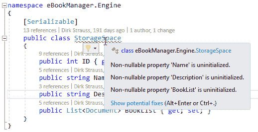

那么，这到底在告诉我们什么？

要回答这个问题，我们先来看看`ID`。`ID`是值类型，因此不能是`null`。如果没有给`ID`赋值，则默认值为:`0`。`Name`不过是一个字符串(是引用类型)，因此*可以*是`null`，实际上*也会*是`null`，除非我们另外设置。如果我们希望这些字段中的一个可以为空，那么我们当然可以这样做(在`Description`的情况下，我们可能应该这样做):


但是`Name`呢？我们可能不希望那是`null`。这里有几个选择:一种是添加一个空白字符串作为默认初始值，如下所示:

```cs
public string Name { get; set; } = string.Empty;
```

这并不理想。事实上，得到一个`null`引用异常实际上可能比它为空并绕过它更好。

This is just my opinion, but it is much better to have software crash at runtime and alert you to an error in the logic than to soldier on and potentially corrupt data or, worse, request or update data in a third-party system!

另一个选择是添加一个构造函数。以下是一个例子:

```cs
[Serializable]
public class StorageSpace
{
    public StorageSpace(string name)
    {
        Name = name;
    }
    public int ID { get; set; }
    public string Name { get; set; }
    public string? Description { get; set; }
    public List<Document>? BookList { get; set; }
}
```

这清除了警告，并确保创建该类的任何人都提供了一个名称，我们说这个名称永远不可能是`null`。这是在`ImportBooks.cs`中实例化的，所以现在我们必须提供该参数:

```cs
private void btnSaveNewStorageSpace_Click(object sender, EventArgs e)
{
    try
    {
        if (txtNewStorageSpaceName.Text.Length != 0)
        {
            string newName = txtNewStorageSpaceName.Text;

            // null conditional operator: "spaces?.StorageSpaceExists(newName) ?? false"
            // throw expressions: bool spaceExists = (space exists = false) ? return false : throw exception                    
            // Out variables
            bool spaceExists = (!spaces.StorageSpaceExists(newName, out int nextID)) ? false : throw new Exception("The storage space you are trying to add already exists.");

            if (!spaceExists)
            {
                StorageSpace newSpace = new StorageSpace(newName);                        
                newSpace.ID = nextID;
                newSpace.Description = txtStorageSpaceDescription.Text;
                spaces.Add(newSpace);
```

现在我们知道`Name`属性永远不可能是`null`，值得记住的是，你在这里得到的警告只是那个，警告；和所有的警告一样，忽略它们是你的特权。然而，C# 8 确实有一个特性(我听说被称为该死的操作符)，允许你坚持认为，不管编译器相信什么，你知道变量不会是`null`；它看起来如下:

```cs
string test = null;

Console.WriteLine(test!.Length);
Console.ReadLine();
```

显然，如果你这样做，前面的代码将崩溃，所以如果你决定你比编译器更了解，请确保！

# 探索 XAML 群岛

在本节中，您将需要运行 Windows 10 1903 或更高版本。到本书出版时，预计 1903 版本将自动交付给所有 Windows 10 机器；但是，如果您运行的是早期版本，则可以通过访问以下链接来强制更新:[https://www.microsoft.com/en-us/software-download/windows10](https://www.microsoft.com/en-us/software-download/windows10)。

2019 年写这一章的时候，我们注意到进口书籍部分的`TreeView`看起来有点过时。事实上，你会认为这是 2005 年 WinForms 风靡一时的一个`TreeView`！此外，我们希望将我们的数据绑定到`TreeView`，而不是单独建立。虽然 WinForms 中有一些数据绑定功能，但我们还是停留在`TreeView`的一般外观上。

除非，也就是说，我们在 WinForms 中使用了一个不错的新 UWP 控件。这正是 XAML 群岛给我们的！我们可以获取一个现有的 UWP 控件，甚至创建我们自己的控件，并直接从现有的 WinForms 应用中使用它。

让我们尝试在 WinForms 应用中使用 UWP 社区工具包中的`TreeView`。

# UWP 树景

对此有许多设置要求，我将在后面详细介绍。

By the time this is published, the process for setting this up may have been simplified considerably; please refer to the linked articles for the most recent advice.

第一步是确保(详见*技术要求*部分)您运行的是 Windows 10，版本 1903 或更高版本。如果您不是，请遵循该部分中的信息。第二步是安装 Windows 10 SDK 为此，您可以使用以下链接:[https://developer . Microsoft . com/en-us/windows/downloads/windows-10-SDK](https://developer.microsoft.com/en-us/windows/downloads/windows-10-sdk)。

我们将为下一步执行以下文章:[https://docs . Microsoft . com/en-us/windows/apps/desktop/现代化/desktop-to-uwp-enhanced # setup-your-project](https://docs.microsoft.com/en-us/windows/apps/desktop/modernize/desktop-to-uwp-enhance#set-up-your-project)。

将以下 NuGet 包添加到您的 WinForms 项目中:

```cs
Microsoft.Windows.SDK.Contracts
```

将`XamlHost` NuGet 包安装到 WinForms 应用中:

```cs
Install-Package Microsoft.Toolkit.Forms.UI.XamlHost
```

现在我们可以用 UWP 的替换我们现有的。

You'll notice that I've fully qualified all the XAML controls. Since we're dealing with two disparate frameworks, this kind of change makes it very easy to get confused and mix up which control you're dealing with. In the following code samples, I've included class-level variables with the code samples for clarity. I, personally, would suggest that these actually go at the top of your class file. Of course, it makes no functional difference.

我们首先需要考虑的是`XamlHost`。

# WIndowsXamlHost

让我们创造我们的`TreeView`；我们将在`ImportBooks.cs`的代码隐藏中这样做。我们将向构造函数添加一些代码，如下所示:

```cs
private readonly Microsoft.Toolkit.Forms.UI.XamlHost.WindowsXamlHost _windowsXamlHostTreeView;        

public ImportBooks()
{
    InitializeComponent();
    _jsonPath = Path.Combine(Application.StartupPath, "bookData.txt");
    spaces = spaces.ReadFromDataStore(_jsonPath);

    var windowsXamlHostTreeView = new WindowsXamlHost();
    windowsXamlHostTreeView.InitialTypeName = "Windows.UI.Xaml.Controls.TreeView";
    windowsXamlHostTreeView.AutoSizeMode = System.Windows.Forms.AutoSizeMode.GrowOnly;
    windowsXamlHostTreeView.Location = new System.Drawing.Point(12, 60);
    windowsXamlHostTreeView.Name = "tvFoundBooks";
    windowsXamlHostTreeView.Size = new System.Drawing.Size(513, 350);
    windowsXamlHostTreeView.TabIndex = 8;
    windowsXamlHostTreeView.Dock = System.Windows.Forms.DockStyle.None;
    windowsXamlHostTreeView.ChildChanged += windowsXamlHostTreeView_ChildChanged;            

    this.Controls.Add(windowsXamlHostTreeView); 
}
```

让我们快速回顾一下我们在这里做了什么(实际上没那么多)。首先，我们创建了一个新的`WIndowsXamlHost`对象。这是 XAML 群岛的基础；它充当 UWP 控件的包装器，因此它将在 WinForms 上下文中工作。

Although this chapter discusses WinForms, the same is true for WPF and, while the exact syntax may differ slightly, the basic principle is the same.

此代码示例中需要注意的事项如下:

*   我们正在将名称设置为`tvFoundBooks`，这与我们的 WinForms 应用的名称相同。
*   我们正在收听`ChildChanged`事件:这是为了我们可以设置控件本身的一些细节(我们将很快回到这一点)。
*   XAML 群岛就是这样知道该调用哪个 UWP 控制的。
*   我们将宿主控件添加到当前表单中(我们还设置了位置)。

# 模板列

现在我们已经设置了主机控件，我们可以看一下我们提到的`ChildChanged`事件；这是我们设置 UWP 控件(而不是主机控件)的地方:

```cs
private Windows.UI.Xaml.Controls.TreeView? _tvFoundBooks = null;

private void windowsXamlHostTreeView_ChildChanged(object? sender, EventArgs e)
{
    if (sender == null) return;

    var host = (WindowsXamlHost)sender;
    _tvFoundBooks = (Windows.UI.Xaml.Controls.TreeView)host.Child;
    _tvFoundBooks.ItemInvoked += _tvFoundBooks_ItemInvoked;
    _tvFoundBooks.ItemsSource = DataSource;

    const string Xaml = "<DataTemplate xmlns=\"http://schemas.microsoft.com/winfx/2006/xaml/presentation\"><TreeViewItem ItemsSource=\"{Binding Children}\" Content=\"{Binding Name}\"/></DataTemplate>";
    var xaml = XamlReader.Load(Xaml);
    _tvFoundBooks.ItemTemplate = xaml as Windows.UI.Xaml.DataTemplate;
}
```

不要太担心为什么`_tvFoundBooks`是类级变量，我们很快会回到这个问题。在前面的代码示例中，我们进行了门控检查以确保`sender`不是`null`，然后我们将其强制为`WindowsXamlHost`类型。一旦我们有了这个类型，我们就可以通过调用`.Child`属性来获取宿主内部的任何东西。

和以前一样，我们正在收听`ItemInvoked`事件(同样，我们将很快回到这一点)。这里第一个真正的新事物是我们正在设置`ItemsSource`*和`ItemTemplate`。我们会回到`ItemsSource`，但是模板值得探索。与 WinForms 不同，UWP 使用 XAML 来定义其控件的外观。这意味着你可以控制进入`TreeView`的东西；例如，每个节点可以有一个图像或文本，或者两者都有。但是如果不指定`ItemTemplate`，那么渲染引擎不知道显示什么，或者怎么显示。*

 *前面的 XAML 可能是能展示任何东西的最简单的一个。您会注意到有一些绑定语句；它们绑定到与`ItemsSource`相关的属性。让我们看看我们绑定的到底是什么。

# 树视图项目模型和项目源

为了将某个东西绑定到 UWP 的某个控件，您需要*某个东西*。本质上，这意味着我们需要一个*模型*。

A model, in .NET terms, is simply a class that holds data.

我们要创建一个新的类，我们称之为`Item`:

```cs
public class Item
{
    public string Name { get; set; }
    public ObservableCollection<Item> Children { get; set; } = new ObservableCollection<Item>();
    public ItemType ItemType { get; set; }
    public string FullName { get; set; }

    public override string ToString()
    {
        return Name;
    }
}
```

I would always recommend that models are held in their own file and sit in a folder called `Models`, but there's no technical reason why you couldn't add this class to the end of `ImportBooks.cs`.

这个类的大部分应该是不言自明的；我们持有文件的`Name`和`FullName`(即名称和路径)。`ObservableCollection`是`Collection`的一种特殊类型，它允许用户界面框架在变化时得到通知。

For the code that we're writing here, we could get away with this simply being a `List`; however, `ObservableCollection` is good practice when dealing with desktop XAML frameworks such as UWP, and this will make extensibility easier.

最后，我们保留该项的类型，这是一个新的枚举类型:

```cs
public enum ItemType
{
    Docx,
    Docxx,
    Pdfx,
    Epubx,
    Folder
}
```

回到`ImportBooks.cs`，我们将设置我们的`ItemsSource`。第一步是添加一个名为`DataSource`的类级变量:

```cs
public ObservableCollection<Models.Item> DataSource { get; set; }
```

我们的下一个变化是在`btnSelectSourceFolder_Click`事件处理程序中:

```cs
private void btnSelectSourceFolder_Click(object sender, EventArgs e)
{
    try
    {
        FolderBrowserDialog fbd = new FolderBrowserDialog();
        fbd.Description = "Select the location of your eBooks and documents";

        DialogResult dlgResult = fbd.ShowDialog();
        if (dlgResult == DialogResult.OK)
        {
            UpdateBookList(fbd.SelectedPath);
        }
    }
    catch (Exception ex)
    {
        MessageBox.Show(ex.Message);
    }
}
```

正如你所看到的，与以前的版本相比，新方法大大简化了；我们已经将所有真正的逻辑提取到一个新方法中，接下来让我们看看:

```cs
private void UpdateBookList(string path)
{            
    DirectoryInfo di = new DirectoryInfo(path);
    var bookList = new List<Models.Item>();
    var rootItem = new Models.Item()
    {
        Name = di.Name
    };

    rootItem.ItemType = Models.ItemType.Folder;

    PopulateBookList(di.FullName, rootItem);
    bookList.Add(rootItem);

    DataSource = new ObservableCollection<Models.Item>(bookList);
    _tvFoundBooks.ItemsSource = DataSource.OrderBy(a => a.Name);
}
```

这里，我们正在设置`TreeView`的根项目；然而，你会注意到我们对`TreeView`的唯一引用是在最后，我们刷新`ItemsSource`。`PopulateBookList`是我们的下一个停靠港。和以前一样，这种方法本质上分为两部分；让我们看看第一部分:

```cs
public void PopulateBookList(string paramDir, Models.Item rootItem)
{
    if (rootItem == null) throw new ArgumentNullException();

    rootItem.FullName = paramDir;
    rootItem.ItemType = Models.ItemType.Folder;

    DirectoryInfo dir = new DirectoryInfo(paramDir);
    foreach (DirectoryInfo dirInfo in dir.GetDirectories())
    {
        var item = new Models.Item();
        item.Name = dirInfo.Name;

        rootItem.Children.Add(item);

        PopulateBookList(dirInfo.FullName, item);
    }
```

在这里，我们递归地遍历目录结构并填充我们的新模型。请注意，我们在开始设置项目类型和`FullName`(目录路径)，然后我们遍历所有子目录，重新调用我们的方法。

Recursion is the practice of calling a method from itself. Is can be very useful in scenarios such as this, where you wish to perform exactly the same operation on nested objects. It is faster than using a loop; however, it does have the potential to fill up the stack very quickly if used incorrectly.

对于函数的第二部分，我们将处理当前目录中的任何文件(也就是说，无论哪个目录当时位于递归堆栈的顶部):

```cs
    foreach (FileInfo fleInfo in dir.GetFiles().Where(x => AllowedExtensions.Contains(x.Extension)).ToList())
    {
        var item = new Models.Item();
        item.Name = fleInfo.Name;

        item.FullName = fleInfo.FullName;
        item.ItemType = (Models.ItemType)Enum.Parse(typeof(Extention), fleInfo.Extension.TrimStart('.'), true);

        rootItem.Children.Add(item);
    }
}
```

我们的下一个变化是`ItemInvoked`方法；新方法应该如下所示:

```cs
private void _tvFoundBooks_ItemInvoked(Windows.UI.Xaml.Controls.TreeView sender, Windows.UI.Xaml.Controls.TreeViewItemInvokedEventArgs args)
{
    var selectedItem = (Models.Item)args.InvokedItem;

    DocumentEngine engine = new DocumentEngine();
    string path = selectedItem.FullName.ToString();

    if (File.Exists(path))
    {
        var (dateCreated, dateLastAccessed, fileName, fileExtention, fileLength, hasError) = engine.GetFileProperties(selectedItem.FullName.ToString());

        if (!hasError)
        {
            txtFileName.Text = fileName;
            txtExtension.Text = fileExtention;
            dtCreated.Value = dateCreated;
            dtLastAccessed.Value = dateLastAccessed;
            txtFilePath.Text = selectedItem.FullName.ToString();
            txtFileSize.Text = $"{Round(fileLength.ToMegabytes(), 2).ToString()} MB";
        }
    }
}
```

同样，这是非常微小的变化；我们现在只是引用底层模型，而不是将完整的文件名(带有路径)存储在节点*标签*属性中，这样就更清楚了。我们的下一步是移除现有的 WinForms `TreeView`控件。

# 删除现有的树形视图

以下代码应从`ImportBooks.Designer.cs`中删除:

```cs
// 
// tvFoundBooks
// 
this.tvFoundBooks.Location = new System.Drawing.Point(12, 41);
this.tvFoundBooks.Name = "tvFoundBooks";
this.tvFoundBooks.Size = new System.Drawing.Size(513, 246);
this.tvFoundBooks.TabIndex = 8;
this.tvFoundBooks.AfterSelect += new System.Windows.Forms.TreeViewEventHandler(this.tvFoundBooks_AfterSelect);
```

这将移除控件本身。稍后，我们需要删除将`TreeView`添加到控件集合中的以下代码:

```cs
this.Controls.Add(this.tvFoundBooks);
```

就这样。如果您现在运行该项目，您将在 WinForms 应用的正中间看到一个 UWP `TreeView`控件。

# 树摇动和编译成单个可执行文件

web 应用越来越受欢迎，超过桌面应用的主要原因是部署问题。从表面上看，这听起来是一个微不足道的问题，但绝对不是。已经有很多尝试来解决这个问题，从 ClickOnce 等技术到应用商店模型(UWP、苹果和谷歌的模型)。这在桌面世界如此困难，在网络世界如此简单的原因之一是，虽然两者可能都有复杂的依赖关系树，但网络允许这些依赖关系主要存在于服务器上，因此它们不需要直接部署到客户端机器上。

中的一个有用特性.NET Core 3 能够将所有依赖项捆绑到一个可执行文件中。

This has previously been possible using the concept of IL weavers. This topic is beyond the scope of this book; however, because IL is not compiled, it opens the door to changing it after the project has been deployed.

英寸 NET Core 3，我们可以通过在`.csproj`文件中添加以下行，将我们的项目编译成单个可执行文件:

```cs
<PublishSingleFile>true</PublishSingleFile>
<RuntimeIdentifier>win-x64</RuntimeIdentifier>
<PublishReadyToRun>true</PublishReadyToRun>
```

当您发布应用时，您将获得一个可执行文件。

你甚至可以通过使用内置的*树摇动*来减少这个可执行文件的大小。这是删除应用不使用的依赖项的过程；这需要在`.csproj`文件中增加以下行:

```cs
<PublishTrimmed>true</PublishTrimmed>

```

At the time of writing, this method did *not* copy across assets (images), so you will need to do that manually until that issue is fixed. Please see the following link for the current details on this feature: [https://docs.microsoft.com/en-us/dotnet/core/whats-new/dotnet-core-3-0](https://docs.microsoft.com/en-us/dotnet/core/whats-new/dotnet-core-3-0).

# 摘要

在本章中，我们将一个现有的 WinForms 应用迁移到.NET Core 3。这意味着，即使我们可能有一个使用了 10 年或 15 年的应用，您也可以更新它，以使用最新的框架，并利用所提供的性能改进和新功能.NET Core 3。

利用这次升级，我们研究了 C# 8 的一个关键特性:可空引用类型。这意味着，在不使用任何第三方软件的情况下，我们能够暴露遗留代码库中的几十个潜在错误。

我们没有止步于此；然后，我们使用 XAML 群岛来扩展我们的应用，将 UWP 功能合并到 WinForms 中。这可能是最令人兴奋的特性，因为它本质上意味着您可以从外部重写遗留的 WinForms 应用。

在最后一节中，我们利用了中提供的新打包方法.NET Core 3。我们使用树摇动的过程来减小输出文件的大小，并将代码编译成单个可执行文件。

和我一样，你可能会看到一个具有这些特征的模式。。在这个版本中，NET Core 加入了只支持 Windows 的功能，这意味着你现在可以使用一个旧的 WinForms 应用，并将其转换为使用最新的.NET Core，从而受益于所有的性能改进。您可以使用在 WPF 或 UWP 创建的组件来扩展它，而无需重写应用。此外，部署现在变得更加容易，因为我们现在可以编译成一个可执行文件。

在下一章中，我们将研究 ASP.NET Core 3，并创建一个使用 Cosmos DB 的 MVC 应用。**