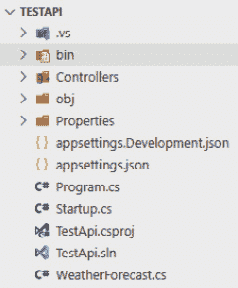
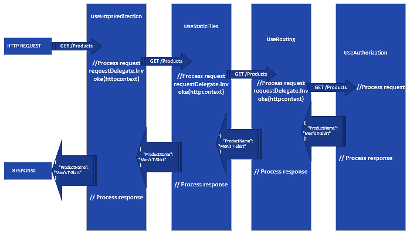
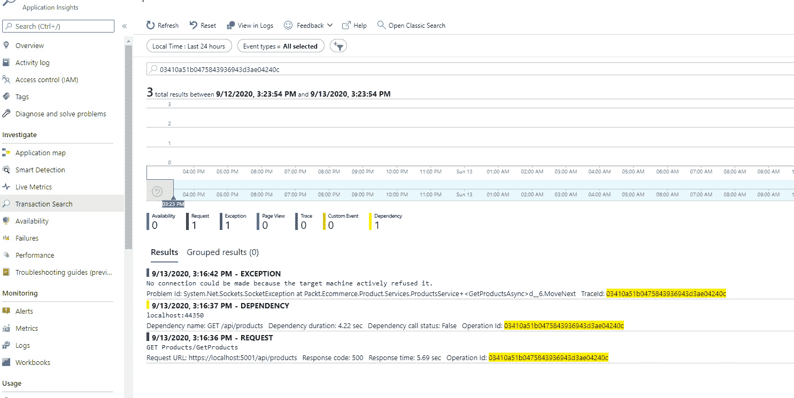
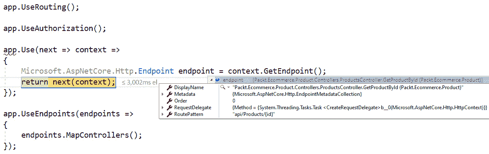
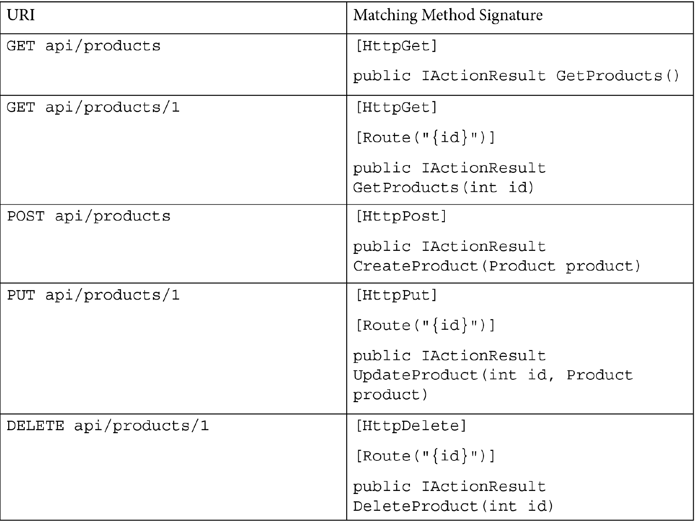
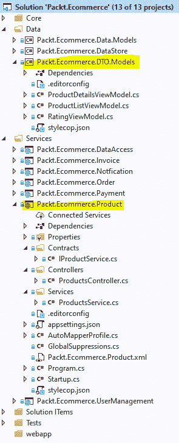
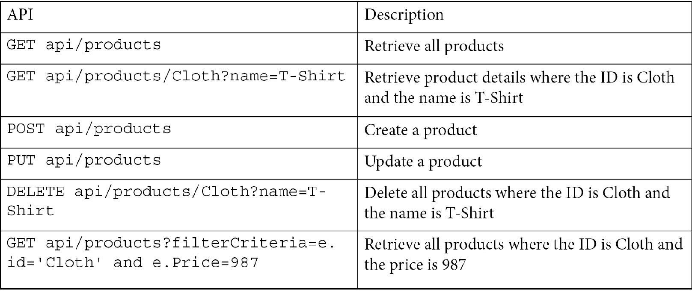
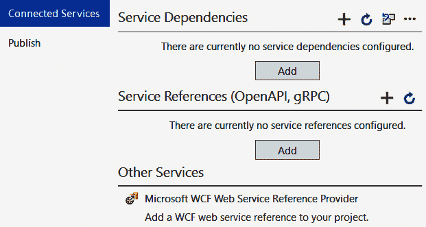

# 十、创建 ASP.NET Core 5 网络应用编程接口

近年来，web 服务已经成为 web 应用开发的重要组成部分。随着需求的不断变化和业务复杂性的增加，松散耦合 web 应用开发中涉及的各种组件/层非常重要，没有什么比将应用的用户界面部分与核心业务逻辑解耦更好的了。这就是使用 **RESTful** 方法的 web 服务的简单性帮助我们开发可扩展的 web 应用的地方。

在本章中，我们将学习如何使用**ASP.NET**核心网络应用编程接口来构建 RESTful 服务，同时，我们将构建电子商务应用所需的所有应用编程接口。

在本章中，我们将详细介绍以下主题:

*   **表征状态转移介绍** ( **REST** )
*   了解 ASP.NET Core 5 网络应用编程接口的内部结构
*   使用控制器和动作处理请求
*   与数据层的集成
*   了解 gRPC

# 技术要求

这一章，你将需要 C#的基础知识.NET Core、web APIs、HTTP、Azure、依赖注入、邮递员等.NET 命令行界面。

本章的代码可以在这里找到:[https://github . com/PacktPublishing/Enterprise-Application-Development-with-C-Sharp-9-and-.NET-5/树/主/第 10 章/测试程序](https://github.com/PacktPublishing/Enterprise-Application-Development-with-C-Sharp-9-and-.NET-5/tree/master/Chapter10/TestApi)。

更多代码示例，请参考以下链接:[https://github . com/PacktPublishing/Enterprise-Application-Development-with-C-Sharp-9-and-.NET-5/树/主/企业% 20 应用](https://github.com/PacktPublishing/Enterprise-Application-Development-with-C-Sharp-9-and-.NET-5/tree/master/Enterprise%20Application)

# 表征状态转移介绍

**表示状态转移** ( **REST** )是一个用于构建 web 服务的架构指南。首先，它定义了一组在设计 web 服务时可以遵循的约束。主要的 REST 方法之一是建议 API 应该围绕资源进行设计，并且应该与媒体和协议无关。应用编程接口的底层实现独立于使用该应用编程接口的客户端。

考虑我们的电子商务应用的一个例子，假设我们正在使用产品的搜索字段在用户界面上搜索产品。应该有一个为产品创建的应用编程接口，在这里，产品只不过是电子商务应用上下文中的一种资源。该 API 的 **URI** 可能类似于以下内容，其中明确表示我们正在尝试对产品实体执行`GET`操作:

```cs
GET http://ecommerce.packt.com/products
```

应用编程接口的响应应该独立于调用应用编程接口的客户端，也就是说，在这种情况下，我们使用浏览器在产品搜索页面上加载产品列表。但是，相同的应用编程接口也可以在移动应用中使用，而无需任何更改。其次，在这种情况下，为了在内部检索产品信息，应用可能使用一个或多个物理数据存储；但是，这种复杂性对客户端应用是隐藏的，API 作为单个业务实体——产品——暴露给客户端。虽然 REST 原则没有规定协议是 HTTP，但是大多数 RESTful 服务都是建立在 HTTP 之上的。基于 HTTP 的 RESTful APIs 的一些关键设计原则/约束/规则如下:

*   确定系统的业务实体，并围绕这些资源设计应用编程接口。在我们的电子商务应用中，我们所有的 API 都围绕着资源，比如产品、订单、支付和用户。
*   REST APIs 应该有一个统一的接口，帮助它独立于客户端。由于所有的应用编程接口都需要面向资源，每个资源都由一个 URI 唯一标识；此外，对资源的各种操作由 HTTP 动词唯一标识，如`GET`、`POST`、`PUT`、`PATCH`和`DELETE`。例如，应该使用`GET` ( `http://ecommerce.packt.com/products/1`)来检索 ID 为`1`的产品。同样，应该使用`DELETE` ( `http://ecommerce.packt.com/products/1`)来删除产品。
*   由于 HTTP 是无状态的，REST 为 RESTful APIs 规定了许多事情。这意味着 API 应该是原子的，并在同一个调用中完成请求的处理。任何后续请求，即使来自同一个客户端(同一个 IP)，都会被视为新请求。例如，如果应用编程接口接受身份验证令牌，它应该接受每个请求的身份验证。无状态的一个主要优势是服务器最终可以实现的可伸缩性，因为客户端可以对任何可用的服务器进行 API 调用，并且仍然会收到相同的响应。
*   除了发回响应之外，应用编程接口还应该利用 HTTP 状态代码和响应头向客户端发送任何附加信息。例如，如果一个响应可以被缓存，那么应用编程接口应该向客户端发送相关的响应头，以便它可以被缓存。**响应缓存**，在 [*第 8 章*](08.html#_idTextAnchor156)*中讨论，理解缓存*就是基于这些头。另一个例子是，在成功和失败的情况下，应用编程接口都应该返回相关的 HTTP 状态代码，也就是说，`1xx`表示信息，`2xx`表示成功，`3xx`表示重定向，`4xx`表示客户端错误，`5xx`表示服务器错误。
*   **Hypermedia As The Engine Of Application State** (**HATEOAS**): APIs should give information about the resource such that client should be easily able to discover them without any prior information relating to the resource. For example, if there is an API to create a product, once a product is created, the API should respond with the URI of that resource so that the client can use that to retrieve the product later.

    请参考以下对检索所有产品列表(`GET /products`)的应用编程接口的响应，该应用编程接口具有检索每个产品的更多详细信息的信息:

    ```cs
    {
     "Products": [
     {
    	"Id": "1",
    	"Name": "Men's T-Shirt",
    	"Category": "Clothing"
    	"Uri": "http://ecommerce.packt.com/products/1"
     }
     {
    	"Id": "2",
    	"Name": "Mastering enterprise application development Book",
    	"Category": "books"
    	"Uri": "http://ecommerce.packt.com/products/2"
     }		
    ]
    }
    ```

前面的例子是实现*HATEOAS*原则的一种方式，但是它可以用一种更具描述性的方式来设计，比如包含关于被接受的 HTTP 动词、关系等信息的响应。

## REST 成熟度模型

这些是各种各样的指导方针，一个应用编程接口应该遵循这些指导方针，才能使它成为 RESTful。然而，没有必要遵循所有的原则来使它完美地 RESTFUL。更重要的是，应用编程接口应该实现业务目标，而不是 100%符合 REST。RESTful API 设计专家 Leonard Richardson 提出了以下模型来对 API 的成熟度进行分类:

*   **0 级:普通旧 XML 的沼泽**–任何有一个`POST` URI 来执行所有操作的应用编程接口都属于这一类。一个例子是基于 SOAP 的 web 服务，它只有一个 URI，所有的操作都是基于 SOAP 信封隔离的。
*   **级别 1:资源**–所有的资源都是由 URI 驱动的，每个资源都有一个专用的 URI 模式的 API 都属于这个成熟度模型。
*   **第 2 级:HTTP 动词**–除了每个资源有一个单独的 URI，每个 URI 都有一个基于 HTTP 动词的单独动作。如前所述，支持使用相同 URI 和不同 HTTP 动词的`GET`和`DELETE`的产品应用编程接口属于这种成熟度模型。大多数企业应用 RESTful APIs 都属于这一类。
*   **第 3 级:HATEOAS**–API 设计有所有额外的发现信息(资源的 URI，资源支持的各种操作)属于这个成熟度模型。很少有 API 符合这个成熟度级别；然而，正如前面所讨论的，重要的是，我们的 API 应该满足业务目标，并尽可能符合 RESTful 原则，而不是 100%符合但不满足业务目标。

下图说明了理查森的成熟度模型:


图 10.1–理查森的成熟度模型

到目前为止，我们已经讨论了 REST 架构的各种原理。在下一节中，让我们开始使用 ASP.NET Core 网络应用编程接口，我们将在我们的电子商务应用中为其创建各种 RESTful 服务。

# 了解 ASP.NET Core 5 网络应用编程接口的内部结构

**ASP.NET Core**是一个统一框架，运行在之上.NET Core，用于开发 web 应用(MVC/Razor)、RESTful 服务(web API)以及最近的基于 web 程序集的客户端应用(Blazor 应用)。ASP.NET Core 应用的基本设计基于**模型视图控制器** ( **MVC** )模式，该模式将代码分为三个主要类别:

*   **模型**:这是一个 **POCO** 类保存数据，用于在应用的各个层之间传递数据。层次包括在*存储库*类和服务*类*之间传递数据，或者在*客户端*和*服务器*之间来回传递信息。该模型主要表示应用的资源状态或域模型，并包含您请求的信息。例如，如果我们想要存储用户简档信息，它可以由 POCO 类`UserInformation`来表示，并且可以包含所有的简档信息。这将进一步用于在存储库和服务类之间传递，也可以在被发送回客户端之前序列化为 JSON/XML。在企业应用中，在*与数据层的集成*部分为我们的电子商务应用创建模型时，我们会遇到不同类型的模型。
*   **控制器**:这些是一组类，它们接收所有请求，执行所有需要的处理，填充模型，然后将其发送回客户端。在企业应用中，它们通常利用服务类来处理业务逻辑，并利用存储库来与底层数据存储进行通信。使用 ASP.NET Core 的统一方法，MVC/Razor 应用和 web API 应用都使用同一个`Microsoft.AspNetCore.Mvc.ControllerBase`类来定义控制器。
*   **查看**:这些是代表 ui 的页面。我们从控制器中检索的所有模型都绑定到视图上的各种 HTML 控件，并呈现给用户。视图通常在 MVC/Razor 应用中很常见；对于 web API 应用，该过程结束于将模型序列化为响应。

因此，在使用 ASP.NET Core 开发的网络应用中，每当请求来自客户端(浏览器、移动应用和类似来源)时，它都会通过 ASP.NET Core 请求管道，到达与数据存储交互的控制器，以填充模型/视图模型，并将它们作为 JSON/XML 形式的响应发送回视图，以进一步绑定响应并将其呈现给用户。正如您所看到的，在控制器不知道任何用户界面方面并在当前上下文中执行业务逻辑并通过模型做出响应的情况下，存在明显的关注点分离，而另一方面，视图接收模型并使用它们在 HTML 页面中向用户呈现它们。这种关注点的分离很容易帮助单元测试应用，以及根据需要维护和扩展它。MVC 模式不仅适用于 web 应用，而且可以用于任何需要分离关注点的应用。

由于本章的重点是构建 RESTful 服务，因此我们将在本章中重点介绍 ASP.NET Core Web API，并在 [*第 11 章*](11.html#_idTextAnchor228)*中讨论 ASP.NET MVC 和 Razor 页面创建 ASP.NET Core 5 Web 应用*。

为了开发 RESTful 服务，有很多可用的框架，但以下是继续使用 ASP.NET Core 的一些优势.NET 5:

*   **跨平台支持**:不像 ASP.NET，以前是.NET 框架，它与 Windows 操作系统相结合，ASP.NET Core 现在是应用的一部分，从而消除了平台依赖性，使其兼容所有平台。
*   **高度可定制的请求** **管道**使用中间件和支持注入各种开箱即用的模块，比如日志和配置。
*   **Out-of-the-box HTTP server implementation**, which can listen to HTTP requests and forward them to controllers. The server implementation includes cross-platform servers such as Kestrel, and platform-specific servers such as `IIS` and `HTTP.sys`.

    注意

    默认情况下，红隼是 ASP.NET Core 模板中使用的 HTTP 服务器；但是，这可以根据需要被覆盖。

*   **强大的工具支持**，以 VS Code、Visual Studio 和 DOTNET CLI 的形式，加上项目模板，意味着开发人员只需很少的设置就可以开始着手实现业务逻辑。
*   最后，整个框架是**开源的**，可在[https://github.com/aspnet/AspNetCore](https://github.com/aspnet/AspNetCore)获得。

所以现在我们知道为什么选择 ASP.NET Core 作为我们开发 RESTful 服务的框架了。现在让我们研究一些有助于执行请求的关键组件，并使用以下命令创建一个示例 web API:

```cs
dotnet new webapi -o TestApi
```

前面的命令成功执行后，让我们导航到`TestApi`文件夹，在 Visual Studio 2019 或 VS Code 中打开，查看生成的各种文件，如下图截图所示:



图 10.2–用 VS 代码测试网络应用编程接口项目

这里可以看到几个类，比如`Program`、`Startup`，还有设置文件，比如`appsettings.json`，用来运行一个 web API 项目，还有`WeatherForecast`，是控制器类中使用的一个模型类。让我们在下面的部分中检查测试应用编程接口的每个组件。

## 程序和启动类

**程序**和**启动**类是用于引导 ASP.NET Core 中的网络应用编程接口项目的类。让我们按照以下步骤来看看**程序**类执行的活动:

1.  `Program`类是我们的网络应用编程接口的入口点，它告诉 ASP.NET Core 每当有人执行网络应用编程接口项目时，就从`Main`方法开始执行。首先，这是用于引导应用的类。如您所见，它遵循控制台应用的典型惯例，具有`static void Main`方法和.NET Core 寻找开始执行的主要方法。类似地，在 ASP.NET Core 应用中，`Program`类有这个`static void Main`方法，ASP.NET Core 运行时寻找这个方法来开始应用的执行。
2.  在`Main`方法中，我们有`CreateHostBuilder(args).Build().Run()`，它调用`CreateHostBuilder`方法来获取`IHostBuilder`的实例，对于我们的应用来说，这个实例只不过是**宿主**。前面，我们讨论了这样一个事实，即 ASP.NET Core 附带了一个内置的 HTTP 服务器实现和各种中间件来插入，**主机**只不过是一个封装这些组件的对象，就像默认为红隼的 HTTP 服务器、所有中间件组件以及注入的任何附加服务，如日志记录。`CreateHostBuilder`内部调用`CreateDefaultBuilder`和`ConfigureWebHostDefaults`。
3.  `CreateDefaultBuilder`方法加载来自各种提供者的所有配置，例如`appsettings.json`、环境变量和任何命令行参数(请参见`args`作为参数传递)。然后，加载默认日志记录提供程序，以便将所有日志记录到控制台和调试窗口中。
4.  `ConfigureWebHostDefaults`启用红隼作为默认 HTTP 服务器，并初始化`Startup`类。
5.  Additionally, we can call additional methods on both `CreateDefaultBuilder` and `ConfigureWebHostDefaults`. Let's say, for example, that we wanted to call an additional configuration provider, along the lines of what we implemented in [*Chapter 6*](06.html#_idTextAnchor125), *Configuration in .NET Core*, or change some Kestrel default parameters, we can configure additional parameters as shown in the following code snippet:

    ```cs
    public static IHostBuilder CreateHostBuilder(string[] args) =>
        Host.CreateDefaultBuilder(args)
            .ConfigureWebHostDefaults(webBuilder =>
            {
                webBuilder.UseStartup<Startup>()
                .ConfigureKestrel((options) =>
                {
                    options.AddServerHeader = false;
                });
            });
    ```

    从前面的代码中，我们看到最后，在`IhostBuilder`的对象上，应用了以下内容:

    *   调用`Build()`方法运行动作并初始化`Host`。
    *   调用`Run()`方法保持`Host`运行。

现在我们已经将`Host`加载了所有默认组件，并且它已经启动并运行。作为其中的一部分，我们已经看到其中的一个步骤是实例化`Startup`类。让我们研究一下`Startup`类是干什么的，看看它如何被用来注入额外的 ASP.NET Core 类/特定于应用的类(存储库、服务、选项)和中间件。`Startup`类如下所示:

```cs
public Startup(IConfiguration configuration)
{
    Configuration = configuration;
}
public IConfiguration Configuration { get; }
public void ConfigureServices(IServiceCollection services)
{
    services.AddControllers();
}
public void Configure(IApplicationBuilder app, IWebHostEnvironment env)
{
    if (env.IsDevelopment())
    {
        app.UseDeveloperExceptionPage();
    }
    app.UseHttpsRedirection();
    app.UseRouting();
    app.UseAuthorization();
    app.UseEndpoints(endpoints =>
    {
        endpoints.MapControllers();
    });
}
```

如您所见，除了`IConfiguration`属性之外，`Startup`类主要有两种方法，使用*构造函数注入*在构造函数中初始化为应用配置(该配置在主机设置期间加载)。此属性还可以在`Startup`类中用于加载任何配置，如中的 [*第 6 章*](06.html#_idTextAnchor125)*配置中所述。网芯*。`Startup`类中的另外两个方法具有以下功能:

*   **ConfigureServices**: This method is used to inject any ASP.NET Core provided services so that applications can use those services. A few of the common services that enterprise applications can inject are shown in the following code snippet:

    ```cs
    services.AddAuthentication() // To enable authentication.
    services.AddControllers(); // To enable controllers like web API.
    services.AddControllersWithViews(); // To enable controller with views.
    services.AddDistributedMemoryCache(); // To enable distributed caching.
    services.AddApplicationInsightsTelemetry(appInsightInstrumentKey); // To enable application insights telemetry.
    services.AddDbContext<EmployeeContext>(options =>
    { 
     options.UseSqlite(Configuration.GetConnectionString("EmployeeContext"));
    }); // Integrating SQL lite.
    ```

    除了 Apart 芯提供的服务，我们还可以注入任何针对我们应用的定制服务。例如，`ProductService`可以映射到`IProductService`并可用于整个应用。首先，这是我们可以使用将任何东西垂直放入**依赖注入** ( **DI** )容器的地方，如中的 [*第 5 章*](05.html#_idTextAnchor110) 、*依赖注入所述.NET* 。`ConfigureServices`方法的一些要点如下:

*   由于这将加载特定于应用的服务，因此该方法是可选的。
*   所有服务，包括 ASP.NET Core 服务和定制服务，都可以接入到应用中，并作为`IServiceCollection`的扩展方法提供。
*   **Configure**: This method is used to integrate all the middlewares required to be applied to the request pipeline. This method primarily controls how applications respond to the HTTP requests, that is, how applications should respond to exceptions or how they should respond to static files, or how URI routing should happen. All can be configured in this method. Additionally, any specific handling on a request pipeline, such as calling a custom middleware or adding specific response headers, or even defining a specific endpoint, can be implemented here in the `configure` method. So, apart from what we have seen earlier, the following code snippet shows a few common additional configurations that can be integrated in this method:

    ```cs
    // Endpoint that responds to /subscribe route.
    app.UseEndpoints(endpoints =>
    {
     endpoints.MapGet("/subscribe", async context =>
     {   
      await context.Response.WriteAsync("subscribed");
     });
    });
    // removing any unwanted headers.
    app.Use(async (context, next) =>
    {
     context.Response.Headers.Remove("X-Powered-By");
     context.Response.Headers.Remove("Server");
     await next().ConfigureAwait(false);
    });
    ```

    这里，`app.UseEndpoints`正在为匹配`/subscribe`的 URI 配置响应。`app.UseEndPoints`与路由规则一起工作，并在*使用控制器和动作处理请求*一节中解释，而`app.Use`则用于添加内联中间件。在这种情况下，我们将从响应中删除`X-Powered-By, Server`响应头。

总而言之，`Program`和`Startup`类在引导应用，然后根据需要定制应用服务和 HTTP 请求/响应管道方面起着至关重要的作用。现在让我们看看中间件如何帮助定制 HTTP 请求/响应管道。

注意

`Configure`和`ConfigureServices`方法可以是`Program`类的一部分，因为`IHostBuilder`、`IWebHostBuilder`和`WebHostBuilderExtensions`中有可用的方法。然而，使用`Startup`类使代码更加清晰。

## 理解中间件

我们提到中间件已经有一段时间了，所以让我们了解什么是中间件，以及我们如何构建一个中间件并在我们的企业应用中使用它。中间件是拦截传入请求，对请求执行一些处理，然后根据需要将其交给下一个中间件或跳过它的类。中间件是双向的，因此所有的中间件都会拦截请求和响应。让我们假设一个应用编程接口检索产品信息，在这个过程中，它通过各种中间件。用图片的形式表现它们看起来像这样:



图 10.3–中间件处理

每个中间件都有一个`Microsoft.AspNetCore.Http.RequestDelegate`实例。使用这个的结果是，中间件调用下一个中间件。通常，流程会按照您希望中间件对请求执行的一些处理逻辑来处理请求，然后调用`RequestDelegate`将请求移交给管道中的下一个中间件。

如果我们从制造的角度进行类比，它就像制造过程中的装配线，零件从一个工作站到另一个工作站被添加/修改，直到最终产品被生产出来。在上图中，让我们将每个中间件视为一个工作站，因此它将经历以下步骤:(下面对每个中间件的解释只是对我们理解的假设性解释；这些中间件的内部工作原理与这里解释的略有不同。更多详情可以在这里找到:[https://docs . Microsoft . com/en-us/dotnet/API/Microsoft . aspnetcore . builder？view = aspnetcore-3.1&view fallbackfrom = aspnetcore-5.0](https://docs.microsoft.com/en-us/dotnet/api/microsoft.aspnetcore.builder?view=aspnetcore-3.1&viewFallbackFrom=aspnetcore-5.0)。

*   **使用 HTTP 重定向**:一个 HTTP 请求到达`GET/Products`并检查协议。如果请求是通过 HTTP 发送的，则通过 HTTP 状态代码发回重定向；如果请求在 HTTPS，它将被移交给下一个中间件。
*   **使用静态文件**:如果请求是针对静态文件的(通常根据扩展名 MIME 类型来检测)，这个中间件会处理请求并发回响应，否则会将请求交给下一个中间件。在这里，正如您所看到的，如果请求是针对静态文件的，那么管道的其余部分甚至不会被执行，因为这个中间件可以处理完整的请求，从而减少服务器上任何不需要的处理的负载，也减少了响应时间。这个过程也被称为*短路*，每个中间件都可以支持。
*   **用户退出**:进一步检查请求，识别能够处理该请求的控制器/动作。如果没有匹配，这个中间件通常会用一个 404 HTTP 状态代码来响应。
*   **使用授权**:这里，如果控制器/动作需要对认证用户可用，那么这个中间件会在报头中寻找任何有效的令牌并做出相应的响应。

一旦控制器从服务/存储库中获取数据，响应就以相反的顺序通过相同的中间件，即先`UseAuthorization`，后`UseHttpsRedirection`，并根据需要处理响应。

如前所述，所有中间件都是使用`Configure`方法安装的(在`Startup`类或`Program`类中)，并使用实现`IApplicationBuilder`接口的类实例的扩展方法进行配置，该接口作为参数传递给`Configure`方法。因此，中间件执行的顺序将精确地遵循它在`Configure`方法中的配置方式。

有了这种理解，让我们创建一个中间件，它将用于处理我们电子商务应用的 RESTful 服务中的异常，因此我们将创建一个中间件，它将在请求管道的开始安装，然后捕获所有的异常，而不是用`try…catch`块污染代码。

## 构建定制中间件

由于中间件将在所有 RESTful 服务中被重用，我们将把中间件添加到`Middlewares`文件夹内的`Packt.Ecommerce.Common`项目中。

让我们首先创建一个概念验证类来表示错误情况下的响应。通常，这个模型将保存错误消息，一个在我们的日志存储应用洞察中搜索的唯一标识符，以及一个内部异常(如果需要)。在生产环境中，不应暴露内部异常；但是，对于开发环境，我们可以发送内部异常用于调试目的，我们将使用配置标志在中间件逻辑内部控制这种行为。因此，在此基础上，在`Packt.Ecommerce.Common`项目的`Models`文件夹中添加一个名为`ExceptionResponse`的类文件，并添加以下代码:

```cs
public class ExceptionResponse
{
    public string ErrorMessage { get; set; }
    public string CorrelationIdentifier { get; set; }
    public string InnerException { get; set; }
}
```

现在，创建另一个 POCO 类，它可以保存配置来切换在我们的响应中发送内部异常的行为。此类将使用**选项**模式填充，该模式已在中的 [*第 6 章*](06.html#_idTextAnchor125)*配置中讨论过。网芯*。因为它只需要保存一个设置，所以它将有一个属性。在`Options`文件夹中添加一个名为`ApplicationSettings`的类文件，然后向其中添加以下代码:

```cs
public class ApplicationSettings
{
    public bool IncludeExceptionStackInResponse { get; set; }
}
```

这个类将被进一步扩展，用于我们所有 API 中通用的任何配置。

导航到`Middlewares`文件夹并创建一个名为`ErrorHandlingMiddleware`的类。正如我们所讨论的，任何中间件的关键属性之一都是`RequestDelegate`类型的属性。此外，我们将为`ILogger`添加一个属性，以将异常记录到我们的日志提供程序中，最后，我们将添加一个`bool` `includeExceptionDetailsInResponse`类型的属性，以保存控制屏蔽内部异常的标志。这样，`ErrorHandlingMiddleware`等级将如下:

```cs
public class ErrorHandlingMiddleware
{
	private readonly RequestDelegate requestDelegate;
	private readonly ILogger logger;
	private readonly bool includeExceptionDetailsInResponse;
} 
```

添加一个参数化构造函数，在这里我们为日志提供者注入`RequestDelegate`和`ILogger`，为配置注入`IOptions<ApplicationSettings>`，并将它们分配给前面创建的属性。这里，我们再次依赖 ASP.NET Core 的构造函数注入来实例化相应的对象。有了这个，`ErrorHandlingMiddleWare`的构造器会出现如下:

```cs
public ErrorHandlingMiddleware(RequestDelegate, ILogger<ErrorHandlingMiddleware> logger, IOptions<ApplicationSettings> applicationSettings)
{
    NotNullValidator.ThrowIfNull(applicationSettings, nameof(applicationSettings));
    this.requestDelegate = requestDelegate;
    this.logger = logger;
    this.includeExceptionDetailsInResponse = applicationSettings.Value.IncludeExceptionStackInResponse;
}
```

最后，添加`InvokeAsync`方法，该方法将具有处理请求的逻辑，然后使用`RequestDelegate`调用下一个中间件。由于这是异常处理中间件作为我们逻辑的一部分，我们要做的就是将请求包装在`try…catch`块中。在`catch`块中，我们将使用`ILogger`将其记录到各自的日志提供者，最后发送一个对象`ExceptionResponse`，作为响应返回。这样，`InvokeAsync`会出现如下:

```cs
public async Task InvokeAsync(HttpContext context)
{
    try
    {
        if (this.requestDelegate != null)
        {
            // invoking next middleware.
		this.requestDelegate.Invoke(context).ConfigureAwait(false);
        }
    }
    catch (Exception innerException)
    {
        this.logger.LogCritical(1001, innerException, "Exception captured in error handling middleware"); // logging.
        ExceptionResponse currentException = new ExceptionResponse()
        {
            ErrorMessage = Constants.ErrorMiddlewareLog,
            CorrelationIdentifier = System.Diagnostics.Activity.Current?.RootId,
        };
        if (this.includeExceptionDetailsInResponse)
        {
            currentException.InnerException = $"{innerException.Message} {innerException.StackTrace}";
        }
        context.Response.StatusCode = StatusCodes.Status500InternalServerError;
        context.Response.ContentType = "application/json";
  await context.Response.WriteAsync(JsonSerializer.Serialize(innerException)).ConfigureAwait(false);
    }
}
```

现在我们可以将这个中间件注入到`Startup`类的`Configure`方法中，代码如下:

```cs
app.UseMiddleware<GlobalExceptionHandlingMiddleware>();
```

由于这是一个异常处理程序，建议在`Configure`方法的开始配置它，以便捕获所有后续中间件中的任何异常。此外，我们需要确保将`ApplicationSettings`类映射到一个配置，因此将以下代码添加到`ConfigureServices`方法中:

```cs
services.Configure<ApplicationSettings>(this.Configuration.GetSection("ApplicationSettings")); 
```

在`appsettings.json`增加相关章节:

```cs
"ApplicationSettings": {
    "IncludeExceptionStackInResponse": true
  }
```

现在，如果我们的任何一个 API 中有任何错误，那么响应将会像下面的代码片段中所示的那样:

```cs
{
	"ErrorMessage": "Exception captured in error handling middleware",
	"CorrelationIdentifier": "03410a51b0475843936943d3ae04240c ",
	"InnerException": "No connection could be made because the target machine actively refused it.    at System.Net.Http.ConnectHelper.ConnectAsync(String host, Int32 port, CancellationToken cancellationToken)\r\n   at System.Net.Http.HttpConnectionPool.ConnectAsync(HttpRequestMessage request, Boolean allowHttp2, CancellationToken cancellationToken)\r\n   at System.Net.Http.HttpConnectionPool.CreateHttp11ConnectionAsync(HttpRequestMessage request, CancellationToken cancellationToken)\r\n   at System.Net.Http.HttpConnectionPool.GetHttpConnectionAsync(HttpRequestMessage request, CancellationToken cancellationToken)\r\n   at System.Net.Http.HttpConnectionPool.SendWithRetryAsync(HttpRequestMessage request, Boolean doRequestAuth, CancellationToken cancellationToken)\r\n   at System.Net.Http.RedirectHandler.SendAsync(HttpRequestMessage request, CancellationToken cancellationToken)\r\n   at System.Net.Http.DiagnosticsHandler.SendAsync(HttpRequestMessage request, CancellationToken cancellationToken)\r\n   at Microsoft.Extensions.Http.Logging.LoggingHttpMessageHandler.SendAsync(HttpRequestMessage request, CancellationToken cancellationToken)\r\n   at Microsoft.Extensions.Http.Logging.LoggingScopeHttpMessageHandler.SendAsync(HttpRequestMessage request, CancellationToken cancellationToken)\r\n   at System.Net.Http.HttpClient.FinishSendAsyncBuffered(Task`1 sendTask, HttpRequestMessage request, CancellationTokenSource cts, Boolean disposeCts, CancellationToken callerToken, Int64 timeoutTime)\r\n   at Packt.Ecommerce.Product.Services.ProductsService.GetProductsAsync(String filterCriteria) in src\\platform-apis\\services\\Packt.Ecommerce.Product\\Services\\ProductsService.cs:line 82\r\n   at Packt.Ecommerce.Product.Controllers.ProductsController.GetProductsAsync(String filterCriteria) in src\\platform-apis\\services\\Packt.Ecommerce.Product\\Controllers\\ProductsController.cs:line 46\r\n   at Microsoft.AspNetCore.Mvc.Infrastructure.ActionMethodExecutor.TaskOfIActionResultExecutor.Execute(IActionResultTypeMapper mapper, ObjectMethodExecutor executor, Object controller, Object[] arguments)\r\n   at Microsoft.AspNetCore.Mvc.Infrastructure.ControllerActionInvoker.<InvokeActionMethodAsync>g__Logged|12_1(ControllerActionInvoker invoker)\r\n   at Microsoft.AspNetCore.Mvc.Infrastructure.ControllerActionInvoker.<InvokeNextActionFilterAsync>g__Awaited|10_0(ControllerActionInvoker invoker, Task lastTask, State next, Scope scope, Object state, Boolean isCompleted)\r\n   at Microsoft.AspNetCore.Mvc.Infrastructure.ControllerActionInvoker.Rethrow(ActionExecutedContextSealed context)\r\n   at Microsoft.AspNetCore.Mvc.Infrastructure.ControllerActionInvoker.Next(State& next, Scope& scope, Object& state, Boolean& isCompleted)\r\n   at Microsoft.AspNetCore.Mvc.Infrastructure.ControllerActionInvoker.<InvokeInnerFilterAsync>g__Awaited|13_0(ControllerActionInvoker invoker, Task lastTask, State next, Scope scope, Object state, Boolean isCompleted)\r\n   at Microsoft.AspNetCore.Mvc.Infrastructure.ResourceInvoker.<InvokeFilterPipelineAsync>g__Awaited|19_0(ResourceInvoker invoker, Task lastTask, State next, Scope scope, Object state, Boolean isCompleted)\r\n   at Microsoft.AspNetCore.Mvc.Infrastructure.ResourceInvoker.<InvokeAsync>g__Logged|17_1(ResourceInvoker invoker)\r\n   at Microsoft.AspNetCore.Routing.EndpointMiddleware.<Invoke>g__AwaitRequestTask|6_0(Endpoint endpoint, Task requestTask, ILogger logger)\r\n   at Microsoft.AspNetCore.Authorization.AuthorizationMiddleware.Invoke(HttpContext context)\r\n   at Packt.Ecommerce.Common.Middlewares.ErrorHandlingMiddleware.InvokeAsync(HttpContext context) in src\\platform-apis\\core\\Packt.Ecommerce.Common\\Middlewares\\ErrorHandlingMiddleware.cs:line 65"
}
```

从前面的代码片段中，我们可以取`CorrelationIdentifier`，也就是`03410a51b0475843936943d3ae04240c`，在我们的日志提供程序 **Application Insights** 中搜索该值，我们可以确定关于该异常的其他信息，如下图所示:



图 10.4–在应用洞察中追踪相关标识符

`CorrelationIdentifier`在没有内部异常的生产环境中非常有用。

我们关于中间件的讨论到此结束。在下一节中，让我们看看**控制器**和**动作**是什么，以及它们如何帮助处理请求。

# 使用控制器和动作处理请求

**控制器**是使用 ASP.NET Core 网络应用编程接口设计 RESTful 服务的基本模块。这些是保存处理请求的逻辑的主要类，包括从数据库中检索数据，将记录插入数据库，等等。控制器是我们定义方法来处理请求的类。这些方法通常包括验证输入、与数据存储对话、应用业务逻辑(在企业应用中，控制器也会调用服务类)，最后将响应序列化，并以 JSON/XML 形式使用 HTTP 协议发送回客户端。所有这些包含处理请求逻辑的方法都被称为**动作**。HTTP 服务器接收的所有请求都通过路由引擎传递给动作方法。然而，路由引擎根据可以在请求管道中定义的特定规则将请求转移到**动作**。这些规则就是我们在路由中定义的。让我们看看 URI 是如何映射到控制器中的特定动作的。

## 了解 ASP.NET Core 路由

到目前为止，我们已经看到任何 HTTP 请求都要经过中间件，最终移交给配置方法中定义的控制器或端点，但是谁来负责这种移交给控制器/端点，ASP.NET Core 如何知道控制器内部的哪个控制器和方法来触发？这就是路由引擎的用途，它是在添加以下中间件时注入的:

```cs
app.UseRouting();
app.UseEndpoints(endpoints =>
{
     endpoints.MapControllers();
});
```

这里，`app.UseRouting()`注入`Microsoft.AspNetCore.Routing.EndpointRoutingMiddleware`，用于基于 URI 做出所有的路由决策。这个中间件的主要工作是用特定 URI 需要执行的动作的值来设置`Microsoft.AspNetCore.Http.Endpoint`方法的实例。

例如，如果我们试图根据产品的标识获取产品的详细信息，并且有一个产品控制器具有`GetProductById`方法来满足这个请求，当我们对`api/products/1` URI 进行 API 调用时，在`EndpointRoutingMiddleware`之后的中间件中放置一个断点，向您显示`Endpoint`类的一个实例是可用的，其中包含了与 URI 匹配并且应该执行的操作的信息。我们可以在下面的截图中看到这一点:



图 10.5–路由中间件

如果没有任何匹配的控制器/操作，此对象将为空。在内部，`EndpointRoutingMiddleware`使用 URI、查询字符串参数以及 HTTP 谓词和请求头来找到正确的匹配。

一旦识别出正确的动作方法，`app.UseEndPoints`的工作就是将控制权交给`Endpoint`对象识别的动作方法并执行。`UseEndPoints`注射`Microsoft.AspNetCore.Routing.EndpointMiddleware`以执行适当的方法来完成请求。填充适当的`EndPoint`对象的一个重要方面是在`UseEndPoints`中配置的各种 URIs，这可以通过 ASP.NET Core 中可用的静态扩展方法来实现。例如，如果我们只想配置控制器，我们可以使用`MapControllers`扩展方法，为`UseRouting`添加控制器中所有动作的端点，以进一步匹配。如果我们正在构建 RESTful APIs，建议使用`MapControllers`扩展。但是，对于以下常用的扩展，有许多这样的扩展方法:

*   **MapGet** / **MapPost** :这些是扩展方法，可以为`GET` / `POST`动词匹配特定的模式，执行请求。它们接受两个参数，一个是 URI 的模式，第二个是当模式匹配时可以用来执行的请求委托。例如，以下代码可用于匹配`/aboutus`路线，并用文本`Welcome to default products route`进行响应:

    ```cs
    endpoints.MapGet("/aboutus", async context =>
    {
     await context.Response.WriteAsync("Welcome to default products route");
    });
    ```

*   **RazorPages**:如果我们使用的是 Razor Pages，需要根据路线路由到合适的页面，就使用这个扩展方法。
*   **mapcontrolleroute**:这个扩展方法可以用来匹配特定模式的控制器；例如，在 ASP.NET Core MVC 模板中可以看到下面的代码，它匹配基于模式的方法:

    ```cs
    endpoints.MapControllerRoute(
    name: "default",
    pattern: "{controller=Home}/{action=Index}/{id?}");
    ```

请求 URI 基于正斜杠(`/`)被拆分，并与控制器、动作方法和标识相匹配。因此，如果你想匹配控制器中的一个方法，你需要在 URI 传递控制器名(ASP.NET Core 自动给控制器关键字加后缀)和方法名。或者，可以将该标识作为参数传递给该方法。例如，如果我在`ProductsController`有`GetProducts`，你会用绝对的 URI`products/GetProducts`来称呼它。这种路由被称为**常规路由**，非常适合基于 UI 的 web 应用，因此可以在 ASP.NET Core MVC 模板中看到。

我们对路由基础知识的讨论到此结束，在 ASP.NET Core 中有许多这样的扩展方法，可以根据应用的需求将其引入请求管道。现在，让我们看看基于属性的路由，这是为使用 ASP.NET Core 构建的 RESTful 服务推荐的路由技术。

注意

与任何其他中间件序列一样，路由的另一个重要方面是注入非常重要，应该在`UseEndpoints`之前调用`UseRouting`。

## 基于属性的路由

对于 RESTful 服务，常规的路由违反了一些 REST 原则，尤其是声明动作方法对实体执行的操作应该基于 HTTP 动词的原则，所以理想情况下，为了得到产品，URI 应该是`GET api/products`。这就是基于属性的路由开始发挥作用的地方，在这种情况下，路由是在控制器级别、操作方法级别或两者都使用属性来定义的。这是使用`Microsoft.AspNetCore.Mvc.Route`属性实现的，该属性将字符串值作为输入参数，用于映射控制器和动作。我们以`ProductsController`为例，其代码如下:

```cs
[Route("api/[controller]")]
[ApiController]
public class ProductsController : ControllerBase
{
    [HttpGet]
    [Route("{id}")]
    public IActionResult GetProductById(int id)
    {
        return Ok($"Product {id}");
    }
    [HttpGet]
    public IActionResult GetProducts()
    {
        return Ok("Products");
    }
}
```

这里，在控制器级别的`Route`属性中，我们传递的是值`api/[controller]`，这意味着任何匹配`api/products`的 **URI** 都映射到这个控制器，其中`products`是控制器的名称。使用方括号内的`controller`关键字是告诉 ASP.NET Core 自动将控制器名称映射到路线的一种特定方式。但是，如果您想坚持使用一个特定的名称，而不考虑控制器名称，则可以不使用方括号。作为最佳实践，建议将控制器名称与路由分离。因此，对于我们的电子商务应用，我们将使用路线中的精确值，即`ProductsController`将具有`[Route("api/products")]`的路线前缀。

`Route`属性也可以添加到动作方法中，并且可以用来唯一地附加识别特定的方法。在这里，我们还传递了一个可以用来标识方法的字符串。例如，`[Route("GetProductById/{id}")]`将与 URI `api/products/GetProductById/1`匹配，花括号内的值是一个动态值，可以作为参数传递给 action 方法并与参数名匹配。这意味着在前面的代码中，有一个参数标识，花括号内的值也应该命名为`ID`，这样 ASP.NET Core 就可以将 URI 的值映射到`method`参数。因此，对于`api/products/1` URI，如果路线属性看起来像`[Route("{id}")]`，则`GetProductById`方法中的标识参数将具有值`1`。

最后，HTTP 动词由`[HttpGet]`等属性表示，这些属性将用于将 HTTP 动词从 URI 映射到方法。下表显示了各种示例和可能的匹配，假设`ProductsController`有`[Route("api/products")]`:



表 10.1

如您所见，方法的名称在这里是不重要的，因此不是 URI 匹配的一部分，除非在`Route`属性中指定。

注意

一个重要的方面是，web API 支持从请求中的不同位置读取参数，无论是请求体、头、查询字符串还是 URI。以下文档涵盖了各种可用选项:[https://docs.microsoft.com/en-us/aspnet/core/web-api/?view = aspnetcore-5.0 #绑定-源-参数-推断](https://docs.microsoft.com/en-us/aspnet/core/web-api/?view=aspnetcore-5.0#binding-source-parameter-inference)。

ASP.NET Core 中整个应用编程接口路由的概要可以表示如下:


图 10.6–ASP.NET Core 应用编程接口路由

基于属性的路由更 RESTful，我们在电商服务中也会遵循这种路由。现在，让我们看看 ASP.NET Core 中可用的各种助手类，它们可以用来简化 RESTful 服务的构建。

小费

路由中的表达式`{id}`被称为路由约束，ASP.NET Core 附带了各种各样的路由约束，也可以在这里找到:[https://docs . Microsoft . com/en-us/aspnet/Core/foundation/routing？视图= aspnetcore-5.0 #路线-约束-参考](https://docs.microsoft.com/en-us/aspnet/core/fundamentals/routing?view=aspnetcore-5.0#route-constraint-reference)。

## controller base 类、ApiController 属性和 ActionResult 类

如果我们回到迄今为止创建的任何控制器，您可以看到所有控制器都是从`ControllerBase`类继承的。在 ASP.NET Core 中，`ControllerBase`是一个抽象类，它提供了各种帮助方法来帮助处理请求和响应。例如，如果我想发送一个 HTTP 状态代码 400(错误请求)，在`ControllerBase`中有一个助手方法`BadRequest`，可以用来发送一个 HTTP 状态代码 400，否则我们必须手动创建一个对象并用 HTTP 状态代码 400 填充它。`ControllerBase`有很多现成的辅助方法；然而，并不是每个 API 控制器都必须继承自`ControllerBase`类。这里提到了`ControllerBase`类的所有助手方法:[https://docs . Microsoft . com/en-us/dotnet/API/Microsoft . aspnetcore . MVC . controller base？view = aspnetcore-3.1&view fallbackfrom = aspnetcore-5.0](https://docs.microsoft.com/en-us/dotnet/api/microsoft.aspnetcore.mvc.controllerbase?view=aspnetcore-3.1&viewFallbackFrom=aspnetcore-5.0)。

这让我们开始讨论我们的控制器方法的返回类型应该是什么，因为一般来说，对于任何 API，至少有两种可能的响应，如下所示:

*   具有 2xx 状态代码的成功响应，并且可能以资源或资源列表进行响应
*   带有 4xx 状态代码的验证失败案例

为了处理这样的场景，我们需要创建一个可以用来发送不同响应类型的泛型类型，这就是 ASP.NET Core 的`IActionResult`和`ActionResult`类型发挥作用的地方，为我们提供了各种场景的派生响应类型。`IActionResult`支持的一些重要的响应类型如下:

*   `OkObjectResult`:这是一种响应类型，将 HTTP 状态代码设置为`200`，并将资源添加到包含资源详细信息的响应正文中。这种类型非常适合所有用资源或资源列表进行响应的 API，例如 get products。
*   `NotFoundResult`:这是将 HTTP 状态码设置为`404`的响应类型，为空体。如果找不到特定的资源，可以使用此选项。但是，在没有找到资源的情况下，我们将使用`NoContentResult` ( `204`)，因为`404`也将用于没有找到的应用编程接口。
*   `BadRequestResult`:这是一种将 HTTP 状态码设置为`400`的响应类型，在响应正文中有一条错误消息。这是任何验证失败的理想选择。
*   `CreatedAtActionResult`:这是一种将 HTTP 状态代码设置为`201`的响应类型，可以将新创建的资源 URI 添加到响应中。这是创建资源的 API 的理想选择。

所有这些响应类型都是从`IActionResult`继承而来的，并且`ControllerBase`类中有可以创建这些对象的方法，所以`IActionResult`和`ControllerBase`将解决大部分业务需求，这就是我们所有 API 控制器方法的返回类型。

ASP.NET Core 中最后一个有用的重要类是`ApiController`类，它可以作为属性添加到控制器类或程序集，并为我们的控制器添加以下行为:

*   它禁用常规路由，并强制使用基于属性的路由。
*   它自动验证模型，所以我们不需要在每个方法中显式调用`ModelState.IsValid`。这种行为在插入/更新方法的情况下非常有用。
*   它有助于从正文/路由/头/查询字符串自动映射参数。这意味着我们不指定应用编程接口的参数是否将成为主体或路线的一部分。例如，在下面的代码中，我们不需要明确地说 ID 参数将是路线的一部分，因为`ApiController`自动地使用了被称为**推理规则**的东西，以及 ID 中带有`[FromRoute]`的前缀:

    ```cs
    [Route("{id}")]
    public IActionResult GetProductById(int id)
    {
      return Ok($"Product {id}");
    }
    ```

*   同样，在下面的代码片段中，`ApiController`会根据推理规则自动添加`[FromBody]`:

    ```cs
    public IActionResult CreateProduct(Product product)
    {
     //
    }
    ```

*   `ApiController`添加的其他一些行为是根据[https://tools.ietf.org/html/rfc7807](https://tools.ietf.org/html/rfc7807)推断多部分/表单数据的请求内容和更详细的错误响应。

因此，总而言之，`ControllerBase`、`ApiController`、`ActionResult`提供了各种各样的助手方法和行为，从而为开发人员提供了编写 RESTful APIs 所需的所有工具，并允许他们在使用 ASP.NET Core 编写 API 时专注于业务逻辑。

在此基础上，让我们在下一节为我们的电子商务应用设计各种 API。

# 与数据层的集成

来自我们的 API 的响应可能或者可能看起来不像我们的领域模型。相反，它们的结构可以类似于用户界面或视图需要绑定的字段。因此，建议创建一组单独的概念验证类，与我们的用户界面集成。这些概念验证对象被称为**数据传输对象** ( **数据验证对象**)。

在本节中，我们将实现我们的 dto，与数据层集成的域逻辑，并使用 Cache-average 模式集成 [*第 8 章*](08.html#_idTextAnchor156)*中讨论的缓存服务，然后使用控制器和动作最终集成所需的 RESTful APIs。一路走来，我们将使用 **HTTP 客户端工厂**进行我们的服务到服务的通信，使用`AutoMapper`库将领域模型映射到 dto。*

我们将选择属于`Packt.Ecommerce.Product`的产品服务，这是一个使用的网络应用编程接口项目.NET 5，并详细讨论了它的实现。到本节结束时，我们将已经实现了下面截图中突出显示的项目:



图 10.7–产品服务和 dto

类似的实现在所有 RESTful 服务中进行复制，根据需要对业务逻辑稍作修改，但高级实现在以下各种服务中保持不变:

*   `Packt.Ecommerce.DataAccess`
*   `Packt.Ecommerce.Invoice`
*   `Packt.Ecommerce.Order`
*   `Packt.Ecommerce.Payment`
*   `Packt.Ecommerce.UserManagement`

首先，我们将在`appsettings.json`中有相应的部分，如下所示:

```cs
    "ApplicationSettings": {
    "UseRedisCache": false, // For in-memory
    "IncludeExceptionStackInResponse": true,
    "DataStoreEndpoint": "",
    "InstrumentationKey": ""
  },
  "ConnectionStrings": {
    "Redis": ""
  }
```

对于本地开发环境，我们将使用**管理用户机密**，如这里所解释的，[https://docs . Microsoft . com/en-us/aspnet/core/security/app-Secrets？view=aspnetcore-5.0 &选项卡=windows](https://docs.microsoft.com/en-us/aspnet/core/security/app-secrets?view=aspnetcore-5.0&tabs=windows) ，设置如下值。但是，一旦部署了服务，它将使用 Azure `KeyVault`，如中的 [*第 6 章*](06.html#_idTextAnchor125)*配置所述。网芯*:

```cs
{
  "ApplicationSettings:InstrumentationKey": "", //relevant key
  "ConnectionStrings:Redis": "" //connection string
}
```

让我们从为产品应用编程接口创建 **DTOs** 开始。

## 创建 dto

在产品服务方面的关键要求是提供搜索产品、查看与产品相关的其他详细信息，然后继续购买的能力。由于产品列表可能有有限的细节，让我们创建一个概念验证(所有的 dto 都是在`Packt.Ecommerce.DTO.Models`项目中创建的)，并将其命名为`ProductListViewModel`。这个类将具有我们想要在产品列表页面上显示的所有属性，它应该如下所示:

```cs
public class ProductListViewModel
{
        [JsonProperty(PropertyName = "id")]
        public string Id { get; set; }
        public string Name { get; set; } 
        public int Price { get; set; }
        public Uri ImageUrl { get; set; }
        public double AverageRating { get; set; }
}
```

如您所见，这些是任何电子商务应用中通常显示的最小字段。因此，我们将继续这些领域，但想法是随着应用的发展而扩展。这里，`Id`和`Name`属性是重要的属性，因为一旦用户想要检索关于产品的所有进一步细节，这些属性将被用于查询数据库。我们正在用`JsonProperty(PropertyName = "id")`属性注释`Id`属性，以确保属性名在序列化和反序列化期间保持为`Id`。这很重要，因为在我们的宇宙数据库实例中，我们使用`Id`作为大多数容器的密钥。现在让我们创建另一个代表产品细节的 POCO，如下面的代码片段所示:

```cs
public class ProductDetailsViewModel
{
        [Required]
        public string Id { get; set; }
        [Required]
        public string Name { get; set; }
        [Required]
        public string Category { get; set; }
        [Required]
        [Range(0, 9999)]
        public int Price { get; set; }
        [Required]
        [Range(0, 999, ErrorMessage = "Large quantity, please reach out to support to process request.")]
        public int Quantity { get; set; }
        public DateTime CreatedDate { get; set; }
        public List<string> ImageUrls { get; set; }
        public List<RatingViewModel> Rating { get; set; }
        public List<string> Format { get; set; }
        public List<string> Authors { get; set; }
        public List<int> Size { get; set; }
        public List<string> Color { get; set; }
        public string Etag { get; set; }
}
public class RatingViewModel
{
        public int Stars { get; set; }
        public int Percentage { get; set; }
}
```

在这里，您可以看到 POCO 非常像我们的领域模型，这是因为我们的反规范化领域模型。但是，一般来说，如果我们使用规范化的领域模型，您会注意到领域模型和 dto 之间的显著差异。在这里，可以进一步讨论为什么我们不能重用产品领域模型。然而，出于可扩展性的目的，以及为了进一步将领域模型与我们的用户界面松散耦合，最好使用单独的 POCO 类。因此，在这个 DTO，除了`Id`和`Name`之外，一个重要的属性是`Etag`，它将用于实体跟踪，以避免对实体的并发覆盖。例如，如果两个用户访问一个产品，用户 A 在用户 B 之前更新，使用`Etag`，我们可以阻止用户 B 覆盖用户 A 的更改，并强制用户 B 在更新之前获取产品的最新副本。

另一个重要的方面是，我们在模型上使用 ASP.NET Core 的内置验证属性来定义模型上的所有约束。首先，我们将按照 https://docs . Microsoft . com/en-us/aspnet/core/MVC/models/validation 使用`[Required]`属性和任何相关属性？视图= aspnetcore-5.0 #内置属性。

所有的 d to 都将是`Packt.Ecommerce.DTO.Models`项目的一部分，因为它们将在我们的 ASP.NET MVC 应用中重用，该应用将用于构建我们的电子商务应用的用户界面。现在，让我们看看`Products`服务所需的合同。

## 服务类合同

在`Packt.Ecommerce.Product`中添加一个`Contracts`文件夹，并创建一个产品的服务类的合同/接口，我们将根据需要参考我们的需求并定义方法。首先，它将拥有基于该接口对产品执行 CRUD 操作的所有方法，如下所示:

```cs
public interface IProductService
    {
        Task<IEnumerable<ProductListViewModel>> GetProductsAsync(string filterCriteria = null);
        Task<ProductDetailsViewModel> GetProductByIdAsync(string productId, string productName);
        Task<ProductDetailsViewModel> AddProductAsync(ProductDetailsViewModel product);
        Task<HttpResponseMessage> UpdateProductAsync(ProductDetailsViewModel product);
        Task<HttpResponseMessage> DeleteProductAsync(string productId, string productName);
    }
```

在这里你可以看到我们在所有方法中返回`Task`，从而坚持我们在 [*第 4 章*](04.html#_idTextAnchor073)*线程和异步操作*中讨论的异步方法。

## 使用自动映射器的映射器类

接下来我们需要的是一种将我们的领域模型转换为 dto 的方法，这里我们将使用一个名为`AutoMapper`的著名库来配置和添加以下包:

*   `Automapper`
*   `AutoMapper.Extensions.Microsoft.DependencyInjection`

要配置`AutoMapper`，我们需要定义一个继承自`AutoMapper.Profile`的类，然后定义各种域模型和 d to 之间的映射。让我们添加一个类`AutoMapperProfile`，到项目`Packt.Ecommerce.Product`:

```cs
    public class AutoMapperProfile : Profile
    {
        public AutoMapperProfile()
        {
        }
    }
```

`AutoMapper`有许多内置的映射方法，其中之一是`CreateMap`，它接受源类和目标类，并基于相同的属性名来映射它们。任何不同名的属性都可以使用`ForMember`方法手动映射。由于`ProductDetailsViewModel`与我们的领域模型有一对一的映射，`CreateMap`应该足够好，可以进行映射。对于`ProductListViewModel`，我们有一个额外的字段，`AverageRating`，我们想要为其计算特定产品的所有评级的平均值。为了简单起见，我们将从`Linq`开始使用`Average`方法，然后将其映射到平均评级。对于模块化，我们将在一个单独的方法`MapEntity`中实现，如下所示:

```cs
private void MapEntity()
{
            this.CreateMap<Data.Models.Product, DTO.Models.ProductDetailsViewModel>();
            this.CreateMap<Data.Models.Rating, DTO.Models.RatingViewModel>();
            this.CreateMap<Data.Models.Product, DTO.Models.ProductListViewModel>()
                .ForMember(x => x.AverageRating, o => o.MapFrom(a => a.Rating != null ? a.Rating.Average(y => y.Stars) : 0));
}
```

现在，修改构造函数来调用这个方法。

设置`AutoMapper`涉及的最后一步是将其作为服务之一注入，为此我们将使用`ConfigureServices`方法的`Startup`类，使用下面的行:

```cs
services.AddAutoMapper(typeof(AutoMapperProfile));
```

如前所述，这将把`AutoMapper`库注入到我们的 API 中，这将允许我们把`AutoMapper`注入到各种服务和控制器中。现在我们来看看`HttpClient`工厂的配置，用于调用数据访问服务。

## 用于服务对服务调用的 HttpClient 工厂

为了检索数据，我们必须调用由我们在`Packt.Ecommerce.DataAccess`中定义的数据访问服务公开的 API。为此，我们需要一个能够有效使用可用套接字的弹性库，允许我们定义断路器以及重试/超时策略。`IHttpClientFactory`非常适合这类场景。

注意

`HttpClient`的一个常见问题是潜在的`SocketException`，这种情况发生在`HttpClient`即使在对象被处理掉之后仍然保持 TCP 连接打开的情况下，建议将`HttpClient`创建为静态/单例，它有自己的开销，同时连接到多个服务。以下链接总结了所有这些问题，[https://software engineering . stackexchange . com/questions/330364/我们是否应该为所有请求创建一个新的 httpclient 单实例](https://softwareengineering.stackexchange.com/questions/330364/should-we-create-a-new-single-instance-of-httpclient-for-all-requests)，这些问题现在都由`IhttpClientFactory`解决。

要配置`IHttpClientFactory`，请执行以下步骤:

1.  安装`Microsoft.Extensions.Http`。
2.  我们将使用类型化客户端配置`IHttpClientFactory`，所以添加一个`Services`文件夹和一个`ProductsService`类，并从`IProductService`继承它们。目前，将实现留空。现在，使用以下代码在`Startup`类的`ConfigureServices`中映射`IProductService`和`ProductsService`

这里，我们将`ProductsService`使用的`HttpClient`超时定义为 5 分钟，另外配置了重试策略和断路器。

### 实施断路器政策

为了定义这些策略，我们将使用一个名为`Polly`的库，它提供了现成的弹性和故障处理能力。安装`Microsoft.Extensions.Http.Polly`包，然后将以下静态方法添加到定义我们的断路器策略的`Startup`类中:

```cs
private static IAsyncPolicy<HttpResponseMessage> CircuitBreakerPolicy()
{
    return HttpPolicyExtensions
        .HandleTransientHttpError()
        .CircuitBreakerAsync(5, TimeSpan.FromSeconds(30));
} 
```

在这里，我们说如果在 30 秒内有 5 次故障，电路就会断开。断路器有助于避免不必要的 HTTP 调用，因为存在无法通过重试修复的严重故障。

### 实施重试策略

现在，让我们添加我们的重试策略，与在指定时间范围内退出的标准重试相比，该策略稍微聪明一点。因此，我们定义了一个策略，该策略将在五种情况下实现重试和 HTTP 服务调用，并且每次重试都有一个以秒为单位的时间差，其幂为 2。为了在时间变化方面增加一些随机性，我们将使用 C#的一个`Random`类来生成一个随机数，并将其添加到时间间隙中。该随机生成将如以下代码所示:

```cs
Random random = new Random();
TimeSpan.FromSeconds(Math.Pow(2, retry))  + TimeSpan.FromMilliseconds(random.Next(0, 100));
```

这里，`retry`是一个整数，每`retry`增加 1。有了这个，给`Startup`类添加一个静态方法，它有前面的逻辑:

```cs
private static IAsyncPolicy<HttpResponseMessage> RetryPolicy()
{
    Random random = new Random();
    var retryPolicy = HttpPolicyExtensions
        .HandleTransientHttpError()
        .OrResult(msg => msg.StatusCode == System.Net.HttpStatusCode.NotFound)
        .WaitAndRetryAsync(
        5,
        retry => TimeSpan.FromSeconds(Math.Pow(2, retry))
                          + TimeSpan.FromMilliseconds(random.Next(0, 100)));
    return retryPolicy;
}
```

这就完成了我们的 HTTP 客户端工厂配置，`ProductsService`可以使用构造函数注入来实例化`IHttpClientFactory`，可以进一步用来创建`HttpClient`。

有了所有这些配置，我们现在可以实现我们的服务类了。让我们在下一节看看。

## 实现服务类

现在让我们通过定义我们已经构建的各种属性并使用构造函数注入实例化它们来实现，如下面的代码块所示:

```cs
private readonly IOptions<ApplicationSettings> applicationSettings;
private readonly HttpClient httpClient;
private readonly IMapper autoMapper;
private readonly IDistributedCacheService cacheService;
public ProductsService(IHttpClientFactory httpClientFactory, IOptions<ApplicationSettings> applicationSettings, IMapper autoMapper, IDistributedCacheService cacheService)
{
    NotNullValidator.ThrowIfNull(applicationSettings, nameof(applicationSettings));
    IHttpClientFactory httpclientFactory = httpClientFactory;
    this.applicationSettings = applicationSettings;
    this.httpClient = httpclientFactory.CreateClient();
    this.autoMapper = autoMapper;
    this.cacheService = cacheService;
}
```

我们所有的服务都将使用我们在本章中定义的相同的异常处理中间件，因此在服务对服务调用期间，如果另一个服务出现故障，响应将是`ExceptionResponse`类型。因此，让我们创建一个私有方法，反序列化`ExceptionResponse`类并相应地提升它。这是必需的，因为在使用`IsSuccessStatusCode`和`StatusCode`属性时`HttpClient`将代表成功或失败，所以如果有异常，我们需要检查`IsSuccessStatusCode`并重新启动它。我们称这个方法为`ThrowServiceToServiceErrors`和参考下面的代码:

```cs
private async Task ThrowServiceToServiceErrors(HttpResponseMessage response)
{
    var exceptionReponse = await response.Content.ReadFromJsonAsync<ExceptionResponse>().ConfigureAwait(false);
    throw new Exception(exceptionReponse.InnerException);
}
```

现在让我们实现`GetProductsAsync`方法，其中我们将使用`CacheService`从缓存中检索数据，如果数据在缓存中不可用，我们将使用`HttpClient`调用数据访问服务，最后将`Product`域模型映射到 DTO 并异步返回。代码如下所示:

```cs
public async Task<IEnumerable<ProductListViewModel>> GetProductsAsync(string filterCriteria = null)
{
    var products = await this.cacheService.GetCacheAsync<IEnumerable<Packt.Ecommerce.Data.Models.Product>>($"products{filterCriteria}").ConfigureAwait(false);
    if (products == null)
    {
        using var productRequest = new HttpRequestMessage(HttpMethod.Get, $"{this.applicationSettings.Value.DataStoreEndpoint}api/products?filterCriteria={filterCriteria}");
        var productResponse = await this.httpClient.SendAsync(productRequest).ConfigureAwait(false);
        if (!productResponse.IsSuccessStatusCode)
        {
            await this.ThrowServiceToServiceErrors(productResponse).ConfigureAwait(false);
        }
        products = await productResponse.Content.ReadFromJsonAsync<IEnumerable<Packt.Ecommerce.Data.Models.Product>>().ConfigureAwait(false);
        if (products.Any())
        {
            await this.cacheService.AddOrUpdateCacheAsync<IEnumerable<Packt.Ecommerce.Data.Models.Product>>($"products{filterCriteria}", products).ConfigureAwait(false);
        }
    }
    var productList = this.autoMapper.Map<List<ProductListViewModel>>(products);
    return productList;
}
```

我们将遵循类似的模式，实施`AddProductAsync`、`UpdateProductAsync`、`GetProductByIdAsync`和`DeleteProductAsync`。每种方法的唯一区别是使用相关的`HttpClient`方法并相应地处理它们。现在我们已经实现了我们的服务，让我们实现我们的控制器。

## 在控制器中实现动作方法

让我们首先将上一节中创建的服务注入到 ASP.NET Core 5 DI 容器中，这样我们就可以使用构造函数注入来创建一个`ProductsService`的对象。我们将在`Startup`类的`ConfigureServices`中使用以下代码来实现这一点:

```cs
services.AddScoped<IProductService, ProductsService>();
```

还要确保配置了所有需要的框架组件，如`ApplicationSettings`、`CacheService`和`AutoMapper`。

在`Controllers`文件夹中添加一个控制器并命名为`ProductsController`，默认路由为`api/products`，然后添加`IProductService`的属性，并使用构造函数注入进行注入。控制器应该实现五个动作方法，每个方法调用一个服务方法，并使用本章的*控制器类*、*加速控制器属性和动作结果类*一节中讨论的各种现成的助手方法和属性。下面的代码块显示了检索特定产品和创建新产品的方法:

```cs
[HttpGet]
[Route("{id}")]
public async Task<IActionResult> GetProductById(string id, [FromQuery][Required]string name)
{
    var product = await this.productService.GetProductByIdAsync(id, name).ConfigureAwait(false);
    if (product != null)
    {
        return this.Ok(product);
    }
    else
    {
        return this.NoContent();
    }
}
[HttpPost]
public async Task<IActionResult> AddProductAsync(ProductDetailsViewModel product)
{
    // Product null check is to avoid null attribute validation error.
    if (product == null || product.Etag != null)
    {
        return this.BadRequest();
    }
    var result = await this.productService.AddProductAsync(product).ConfigureAwait(false);
    return this.CreatedAtAction(nameof(this.GetProductById), new { id = result.Id, name = result.Name }, result); // HATEOS principle
}
```

方法的实现是不言自明的，并且纯粹基于*中讨论的使用控制器和动作*处理请求的基本原理。同样，我们将通过调用相应的服务方法并返回相关的`ActionResult`来实现所有其他方法(`Delete`、`Update`、`Get`所有产品)。这样，我们将有下表所示的 API 来处理与产品实体相关的各种场景:



表 10.2

小费

应用编程接口的另一个常见场景是拥有一个支持文件上传/下载的应用编程接口。上传场景通过将`IFormFile`作为输入参数传递给应用编程接口来实现。这将序列化上传的文件，也可以保存在服务器上。同样，对于文件下载，`FileContentResult`可用，可以将文件流式传输到任何客户端。这是留给你进一步探索的活动。

对于测试原料药，我们将使用波兹曼([https://www.postman.com/downloads/](https://www.postman.com/downloads/))。所有邮差收藏都可以在`Solution Items`文件夹文件`Mastering enterprise application development Book.postman_collection.json`下找到。要在安装 Postman 后导入集合，请执行以下步骤:

1.  打开邮差，然后点击**文件**。
2.  点击**导入** | **上传文件**，导航到`Mastering enterprise application development Book.postman_collection.json`文件的位置，然后点击**导入**。

成功导入会在邮递员的**收藏**菜单中显示该收藏，如下图截图所示:


图 10.8–邮差中的收集

这就完成了我们的`Products` RESTful 服务实现。本节开头提到的所有其他服务都是以类似的方式实现的，其中每个服务都是一个单独的 web API 项目，并为该实体处理相关的域逻辑。

# 了解 gRPC

按照`grpc.io`，gRPC 是一个高性能、开源通用**远程过程调用** ( **RPC** )框架。gRPC 最初是由谷歌开发的，使用 HTTP/2 进行传输，一个**协议缓冲区** ( **protobuf** )作为接口描述语言。gRPC 是一个基于契约的二进制通信系统。它适用于多个生态系统。gRPC 官方文档中的下图( [https://grpc.io](https://grpc.io) )说明了使用 grpc 的客户端-服务器交互:


图 10.9–gRPC 客户端-服务器交互

像许多分布式系统一样，gRPC 是基于定义服务和指定接口的思想，这些接口的方法可以随契约一起远程调用。在 gRPC 中，服务器实现接口并运行 gRPC 服务器来处理客户端调用。在客户端，它有存根，提供与服务器定义的相同的接口。客户端调用存根的方式与调用任何其他本地对象中的方法来调用服务器上的方法的方式相同。

默认情况下，数据协定使用协议缓冲区来序列化来自和去往客户端的数据。protobufs 在扩展名为`.proto`的文本文件中定义。在 protobuf 中，数据被结构化为字段中包含的信息的逻辑记录。在下一节中，我们将学习如何在 Visual Studio 中为. NET 5 应用定义 protobuf。

注意

参考官方文档了解更多关于 gRPC: [https://grpc.io](https://grpc.io) 的信息。要了解更多关于 protobuf 的信息，请参考[https://developers . Google . com/protocol-buffers/docs/概述](https://developers.google.com/protocol-buffers/docs/overview)。

考虑到高性能、语言无关的实现以及与 gRPC 的 protobuf 相关的网络使用减少的好处，许多团队正在探索 gRPC 在他们构建微服务的努力中的使用。

在下一节中，我们将学习在中构建 gRPC 服务器和客户端.NET 5。

## 在中构建 gRPC 服务器。网

年首次亮相后.NET core 3.0，gRPC 已经成为了一等公民中的佼佼者.NET 生态系统。使用 Visual Studio 2019 和，完全托管的 gRPC 实现现已在. NET 中提供.NET 5，我们可以轻松创建 gRPC 服务器和客户端应用。让我们使用 Visual Studio 中的 gRPC 服务模板创建一个 gRPC 服务，并将其命名为`gRPCDemoService`:


图 10.10–gRPC VS 2019 项目模板

这将创建一个名为`GreetService`的示例 gRPC 服务解决方案。现在让我们理解用模板创建的解决方案。创建的解决方案将包含对`Grpc.AspNetCore`的包引用。这将包含托管 gRPC 服务和`.proto`文件的代码生成器所需的库。该解决方案将在`Protos`解决方案文件夹下为`GreetService`创建原型文件。以下代码片段定义了`Greeter`服务:

```cs
service Greeter {
  // Sends a greeting
  rpc SayHello (HelloRequest) returns (HelloReply);
}
```

`Greeter`服务只有一个名为`SayHello`的方法，该方法将输入参数作为`HelloRequest`，并返回一条`HelloReply`类型的消息。`HelloRequest`和`HelloReply`消息在同一个原型文件中定义，如以下代码片段所示:

```cs
message HelloRequest {
  string name = 1;
}
message HelloReply {
  string message = 1;
}
```

`HelloRequest`有一个名为`name`的文件，`HelloReply`有一个名为`message`的字段。字段旁边的数字显示该字段在缓冲区中的序号位置。原型文件是用`Protobuf`编译器编译的，以生成带有所有必需管道的存根类。我们可以从原型文件的属性中指定要生成的存根类的类型。由于这是一个服务器，它将配置设置为**服务器仅**。

现在，我们来看看`GreetService`的实现。这将如下面的代码片段所示:

```cs
public class GreeterService : Greeter.GreeterBase
{
    private readonly ILogger<GreeterService> _logger;
    public GreeterService(ILogger<GreeterService> logger)
    {
        _logger = logger;
    }
    public override Task<HelloReply> SayHello(HelloRequest request, ServerCallContext context)
    {
        return Task.FromResult(new HelloReply
        {
            Message = "Hello " + request.Name
        });
    }
}
```

`GreetService`继承自`Greeter.GreeterService`，由 protobuf 编译器生成。通过构造原型文件中定义的`HelloReply`，覆盖`SayHello`方法以提供实现，从而将问候返回给呼叫者。

要在. NET 5 应用中公开 gRPC 服务，需要通过调用`Startup`类的`ConfigureServices`方法中的`AddGrpc`将所有需要的 gRPC 服务添加到服务集合中。`GreeterSerivce` gRPC 服务通过调用`MapGrpcService`暴露:

```cs
app.UseEndpoints(endpoints =>
{
 endpoints.MapGrpcService<GreeterService>();
});
```

这就是在. NET 5 应用中公开 gRPC 服务所需的一切。在下一节中，我们将实现一个. NET 5 客户端来消费`GreeterService`。

## 在中构建 gRPC 客户端。网

如*理解 gRPC* 一节所述.NET 5 也有很好的工具来构建一个 gRPC 客户端。在本节中，我们将在控制台应用中构建一个 gRPC 客户端:

1.  创建一个. NET 5 控制台应用并命名为`gRPCDemoClinet`。
2.  Now, right-click on the project and click on the menu items **Add** | **Service reference…**. This will open the **Connected Services** tab, as shown in the following screenshot:

    

    图 10.11–gRPC 连接服务选项卡

3.  点击**服务参考(OpenAPI，gRPC)** 下的**添加**按钮，在**添加服务参考**对话框中选择 **gRPC** ，然后点击**下一步**。
4.  In the **Add new gRPC service reference** dialog, select the **File** option, select the `greet.proto` file from `gRPCDemoService`, and then click on the **Finish** button. This will add the proto file link to the project and marks the protobuf compiler to generate the `Client` stub classes:

    

    图 10.12–添加 gRPC 服务参考

    这还会将所需的 NuGet 包`Google.Protobuf`、`Grpc.Net.ClientFactory`和`Grpc.Tools`添加到项目中。

5.  Now, add the following code snippet to the main method of the `gRPCDemoClient` project:

    ```cs
    static async Task Main(string[] args)
    {
     var channel = GrpcChannel.ForAddress("https://localhost:5001");
     var client = new Greeter.GreeterClient(channel);
     HelloReply response = await client.SayHelloAsync(new HelloRequest { Name="Suneel" });
     Console.WriteLine(response.Message);
    }
    ```

    在这段代码中，我们创建了到`gRPCDemoService`端点的 gRPC 通道，然后通过传入 gRPC 通道实例化`Greeter.GreeterClinet`，这是到`gRPCDemoService`的存根。

现在，要调用服务，我们只需要通过传递`HelloRequest`消息来调用存根上的`SayHelloAsync`方法。该呼叫将从服务中返回`HelloReply`。

到目前为止，我们已经创建了一个简单的 gRPC 服务和该服务的控制台客户端。在下一节中，我们将了解 gRPC curl，这是一个测试 gRPC 服务的通用客户端。

## 测试 gRPC 服务

为了测试或调用一个 REST 服务，我们使用了一些工具，比如邮递员或提琴手。`gRPCurl`是一个命令行实用程序，帮助我们与 gRPC 服务交互。使用 grpcurl，我们可以在不构建客户端应用的情况下测试 grp 服务。grpcurl 可从[https://github.com/fullstorydev/grpcurl](https://github.com/fullstorydev/grpcurl)下载。

一旦`grpcurl`被下载，我们可以使用以下命令调用`GreeterService`:

```cs
grpcurl -d "{\"name\": \"World\"}" localhost:5001 greet.Greeter/SayHello
```

注意

目前 gRPC 应用只能在 Azure App Service 和 IIS 中托管。因此，我们没有在 Azure 应用服务上托管的演示电子商务应用中利用 gRPC。但是，在本章演示中有一个版本的电子商务应用，其中根据产品的标识获取产品被公开为自托管服务中的 gRPC 端点。

# 总结

在本章中，我们介绍了 REST 的基本原理，并为我们的电子商务应用设计了企业级 RESTful 服务。

在此过程中，我们掌握了 ASP.NET Core 5 网络应用编程接口的各种网络应用编程接口内部，包括路由和示例中间件，并熟悉了用于测试我们的服务的工具，同时学习了如何使用控制器及其动作来处理请求，这也是我们学习构建的。此外，我们还看到了如何在中创建和测试基本的 gRPC 客户端和服务器应用.NET 5。到目前为止，您应该能够自信地使用 ASP.NET Core 5 网络应用编程接口构建 RESTful 服务。

在下一章中，我们将学习 ASP.NET MVC 的基础知识，使用 ASP.NET MVC 构建我们的 UI 层，并将其与我们的 API 集成。

# 问题

1.  Which of the following HTTP verbs is recommended for creating a resource?

    a.`GET`

    b.`POST`

    c.`DELETE`

    d.`PUT`

2.  Which of the following HTTP status codes represents `No Content`?

    a.`200`

    b.`201`

    c.`202`

    d.`204`

3.  Which of the following middlewares is used to configure routing?

    a.`UseDeveloperExceptionPage()`

    b.`UseHttpsRedirection()`

    c.`UseRouting()`

    d.`UseAuthorization()`

4.  If a controller is annotated with the `[ApiController]` attribute, do I need to class `ModelState.IsValid` explicitly in each action method?

    a.是的，模型验证不是`ApiController`属性的一部分，因此，您需要在每个动作方法中调用`ModelState.Valid`。

    b.不，模型验证是作为`ApiController`属性的一部分来处理的，因此，对于所有的动作项都自动触发`ModelState.Valid`。

# 进一步阅读

*   [https://docs . Microsoft . com/en-us/dotnet/architecture/microservice/implement-resilient-applications/use-httpclientfactory-to-implement-resilient-http-requests](https://docs.microsoft.com/en-us/dotnet/architecture/microservices/implement-resilient-applications/use-httpclientfactory-to-implement-resilient-http-requests)
*   [https://docs . Microsoft . com/en-us/aspnet/core/signor/introduction？view=aspnetcore-5.0](https://docs.microsoft.com/en-us/aspnet/core/signalr/introduction?view=aspnetcore-5.0)
*   [https://docs . Microsoft . com/en-us/aspnet/core/tutories/web-API-help-pages-using-swag？view=aspnetcore-5.0](https://docs.microsoft.com/en-us/aspnet/core/tutorials/web-api-help-pages-using-swagger?view=aspnetcore-5.0)
*   [https://docs . Microsoft . com/en-us/aspnet/core/grp c/？view = aspnet store-5.0](https://docs.microsoft.com/en-us/aspnet/core/grpc/?view=aspnetcore-5.0)