# 二、重构整体

在前一章中，我们讨论了分层整体建筑的问题。本章旨在讨论单片到基于微服务的应用的过渡。我们将在这一章开始讨论我们的新技术堆栈(C#和实体框架)，然后讨论好服务的特性，以及我们如何从现有系统中重构它们，并为产品和订单构建单独的微服务。

我们将涵盖以下主题:

*   了解当前和新的技术堆栈
*   微服务的规模
*   什么是好的服务？
*   理解接缝的概念
*   微服务之间的通信
*   重新审视 FlixOne 案例研究

# 技术要求

本章包含解释这些概念的各种代码示例。代码保持简单，仅用于演示目的。

要运行和执行代码，以下是先决条件:

*   Visual Studio 2019
*   。网络核心 3.1

要运行这些代码示例，您需要安装 Visual Studio 2019(首选的 IDE)。为此，请从安装说明中提到的下载链接下载 Visual Studio 2019:[https://docs . Microsoft . com/en-us/Visual Studio/install/install-Visual Studio](https://docs.microsoft.com/en-us/visualstudio/install/install-visual-studio)。有多个版本的 Visual Studio 可供安装，包括免费版本的 Visual Studio Community。我们使用的是视窗操作系统。

如果你没有.NET Core 3.1 安装完毕，可以从这个链接下载:[https://www.microsoft.com/net/download/windows](https://www.microsoft.com/net/download/windows)。

The complete source code is available here: [https://github.com/PacktPublishing/Hands-On-Microservices-with-CSharp-8-and-.NET-Core-3-Third-Edition/tree/master/Chapter%2002](https://github.com/PacktPublishing/Hands-On-Microservices-with-CSharp-8-and-.NET-Core-3-Third-Edition/tree/master/Chapter%2002)

# 了解当前和新的技术堆栈

在我们继续讨论实现微服务的概念之前，值得一提的是我们将用来实现这些微服务的核心概念、语言和工具。在本章中，我们将对这些主题进行概述。

# 讨论–当前堆栈(C#、EF 和 SQL Server)

在本节中，我们将讨论我们在演示应用中使用的技术堆栈。

# C# 8

C#是微软开发的一种编程语言，写这本书时的当前版本是 C# 8。这种面向对象和面向组件的语言始于 2002 年。当前版本有各种新特性，如 ValueTuple、解构器、模式匹配和 switch 语句本地函数。

我们不会详细讨论这些特性，因为这超出了本书的范围。详见[https://docs.microsoft.com/en-us/dotnet/csharp/whats-new/](https://docs.microsoft.com/en-us/dotnet/csharp/whats-new/)。

# 实体框架核心

**实体框架核心** ( **EF 核心**)是微软实体框架的跨平台版本，是目前最流行的**对象关系映射器** ( **表单**)之一。

ORM is a technique that helps you to query and manipulate data, according to the required business output.

英孚核心支持各种数据库。这里有完整的数据库列表:[https://docs.microsoft.com/en-us/ef/core/providers/index](https://docs.microsoft.com/en-us/ef/core/providers/index)。EF Core 的当前版本(撰写本文时)为 3.1([https://devblogs . Microsoft . com/dotnet/公告-实体-框架-Core-3-1-和-实体-框架-6-4/](https://devblogs.microsoft.com/dotnet/announcing-entity-framework-core-3-1-and-entity-framework-6-4/) )。

# Visual Studio 2019

Visual Studio 是最好的 IDEs 之一，由微软创建。它使开发人员能够使用流行的语言以各种方式工作，如 C#、VB.NET 和 F#。Visual Studio 2019 当前版本为 VS16.4([https://docs . Microsoft . com/en-us/visualstudio/releases/2019/releases-notes](https://docs.microsoft.com/en-us/visualstudio/releases/2019/release-notes))。要找到最新版本的 Visual Studio，请查看官方页面:[https://docs . Microsoft . com/en-us/Visual Studio/install/update-Visual Studio？view=vs-2019](https://docs.microsoft.com/en-us/visualstudio/install/update-visual-studio?view=vs-2019) 。

An IDE is an integrated development environment, a software application that provides a facility for programmers to write programs by using programming languages. For more information, visit [https://en.wikipedia.org/wiki/Integrated_development_environment.](https://en.wikipedia.org/wiki/Integrated_development_environment)

微软也为 macOS 发布了 Visual Studio，Visual Studio 有很多新功能。更多信息请参考[https://www.visualstudio.com/vs/whatsnew/](https://www.visualstudio.com/vs/whatsnew/)。在这本书里，所有的例子都是用 Visual Studio 2019 写的。您也可以在以下链接下载免费的社区版:[https://www.visualstudio.com/.](https://www.visualstudio.com/)

# 搜寻配置不当的

**微软 SQL Server** ( **MSSQL** )是一个软件应用，是一个关系数据库管理系统。它主要用作数据库软件来存储和检索数据；它建立在**结构化查询语言**(**SQL**):[http://searchsqlserver.techtarget.com/definition/SQL](http://searchsqlserver.techtarget.com/definition/SQL)之上。

当前版本——即 SQL Server 2019——更加健壮，可以在 Windows 和 Linux 上使用。您可以从这里获得 SQL Server 2019:[https://www.microsoft.com/en-IN/sql-server/sql-server-2019](https://www.microsoft.com/en-IN/sql-server/sql-server-2019)。请注意，我们将在本书中使用 SQL Server 2008 R2 或更高版本。

在开始阅读本书的实际操作说明之前，让我们先了解一下中的新功能.NET Core 和 C# 8.0，我们将在本书中利用它们。以下两个部分更像是对中*新特性的探索.NET Core 3.1* 和*在 C# 8.0* 中的新特性。我们将为这些特性添加深入的细节和说明。如果您已经了解新功能，可以跳过这些部分。

# 中的新功能.NET Core

在前一节中，我们概述了当前的技术堆栈。本节和下一节的目的是简要介绍即将推出的技术堆栈的预期特性.NET Core 3.1 和 C# 8.0)，并利用我们的代码示例中的新功能。请注意，在写这本书的时候.NET Core 3.1 刚刚发布。

的释放.NET Core 3.1 是一个小版本，由早期版本的修复组成.NET Core 3.0。因此，在本节中，我们将重点讨论的新功能.NET Core 3.0。

.NET Core 3.1 is announced as a Long Term Support (LTS) release for three years.

.NET Core 3.0 应该会让桌面应用的开发人员兴奋不已。这个版本带来了最大的增强，现在它支持 Windows 桌面应用的开发。目前，此增强功能仅适用于在 Windows 机器上工作的用户，因为支持仅限于 Windows。支持包括开发视窗窗体和视窗演示基金会(WPF)应用。

我想你已经安装了.NET Core 3.1；如果还没有，请重访*技术要求*部分。

验证的安装.NET Core 3.1，可以查看当前安装版本的信息.NET Core。为此，请打开命令提示符并键入以下命令:

```cs
dotnet --info
```

前面的命令将告诉您有关已安装的的完整信息.NET Core 版本，如下图截图所示:

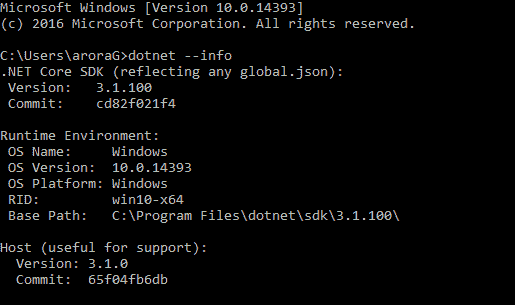

前面的截图显示了所有可用的信息.NET Core 版本。我们版本的.NET Core 是 3.1.100。

现在让我们看看如何利用我们之前提到的新功能。如果您想开发 Windows 桌面应用，那么您可以使用**命令行界面** ( **命令行界面** ) `dotnet`命令或 Visual Studio 2019 来创建 WPF 和 Windows 窗体应用。

要从命令行界面开始，请执行以下步骤:

1.  打开您的命令提示符或 Windows PowerShell(我们将使用 PowerShell)。
2.  转到您想要的文件夹(在那里您想要创建一个新项目)——在我们的例子中，我们将使用`Chapter02`文件夹。
3.  传递以下命令创建一个 Windows 窗体应用:

```cs
dotnet new winforms
```

前面的代码片段如下:

*   `dotnet new`:这将初始化一个有效的.NET Core 项目。
*   `winforms`:这是一个在初始化有效时被调用的模板.NET Core 项目。

If you want to use the VB language instead of C#, you just need to pass the preceding command with the language as `dotnet new winforms -lang VB`.

使用`WinForms`模板处理前面的命令并创建一个 Windows 窗体应用。下面的截图描述了项目步骤的创建:


我们已经创建了一个`WinForms`应用。要运行此项目，请传递以下命令:

```cs
dotnet run
```

前面的命令将运行项目并显示项目的输出。我们没有添加任何内容，因此我们将看到空白的 Windows 窗体，如下图所示:

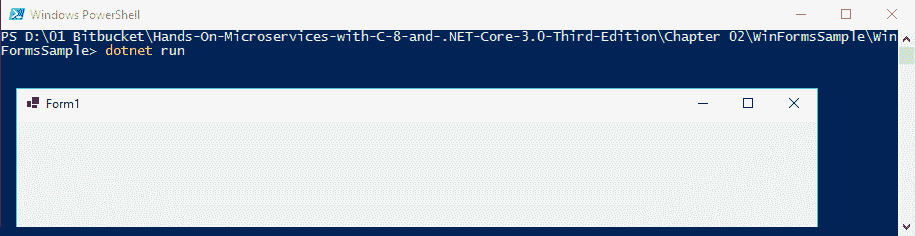

4.  传递以下命令创建一个 Windows 窗体应用:

```cs
dotnet new wpf
```

前面的命令使用`wpf`模板创建了一个 WPF 应用。下面的截图显示了创建应用的步骤:

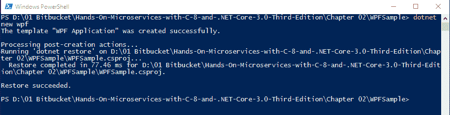

我们已经创建了一个`wpf`应用。要运行此项目，请传递以下命令:

```cs
dotnet run
```

前面的命令将运行项目并显示项目的输出。我们没有添加任何内容，因此我们将看到空白的 WPF 表单，如下图所示:


可以使用更多带有`dotnet new`命令的模板；如果您不确定模板名称，只需传递以下命令:

```cs
dotnet new -l
```

前面的命令以表格形式给出了所有可用模板的列表。请参考下面的截图，其中显示了可用的模板:

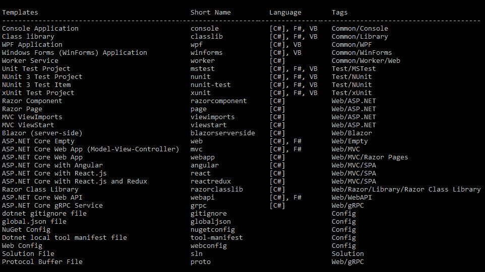

前面的截图显示了可用的预安装模板；如果要安装任何附加模板，可以使用`dotnet new -i <Tempate>`命令。上一个快照包含以下内容:

*   `Templates`:这是模板的完整名称。
*   `Short Name`:这是与`dotnet new`命令一起使用的模板名称。
*   `Language`:这是支持模板的编程语言。模板的默认语言显示在括号`[ ]`中。
*   `Tags`:表示模板的类型。例如，`Web`标签指的是 ASP.NET Core(网络)项目模板。

`dotnet new`命令有各种选项，如下表所示:

| [计]选项 | 描述 | 句法 |
| `-h`、`--help` | 这为命令提供了帮助，并提供了关于命令及其使用的信息。 | `dotnet new -h` |
| `-l`、`--list` | 这给出了模板的完整列表。 | `dotnet new wpf -l`
`dotnet new -l` |
| `-n`、`--name` | 这是使用特定模板创建的项目/应用名称。如果未指定名称，则使用当前文件夹的名称。 | `dotnet new wpf -n "MyProjName"` |
| `-i`、`-install` | 这将安装一个新模板。 | `dotnet new -i Microsoft.AspNetCore.Blazor.Templates::3.0.0` |
| `-lang`、`--language` | 这指定了在其中创建项目的语言。 | `dotnet new winforms -lang VB` |

如果您使用的是 VS16.4，并且有早期版本的.NET Core 3.0 和/或.NET Core3.1 安装后，您可能会看到以下屏幕。在这种情况下，版本、`WinForms`和`WPF`设计器支持不可用。如果您尝试打开我们之前创建的项目，您会注意到一个设计器错误，如下图所示。当您尝试打开窗体 1 的设计布局时，会出现此错误:

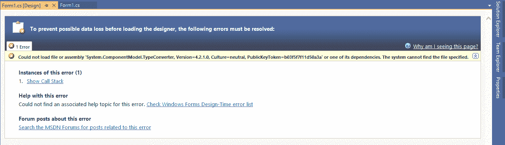

上一张截图中显示的问题可以在经典设计师的帮助下解决.NET 框架)。通过这种变通方法，我们可以看到一个设计者，并可以安排或设计我们的表单布局。这个话题超出了本书的范围，我们就不多赘述了。

To get more details and to know how we can fix the designer issue, you can refer to the official GitHub repository: [https://github.com/dotnet/winforms/blob/master/Documentation/winforms-designer.md](https://github.com/dotnet/winforms/blob/master/Documentation/winforms-designer.md).

此修复程序随 Visual Studio Preview 一起提供(在撰写本书时)；您至少需要 VS16.5 才能查看 WinForms 或 WPF 的设计器。您可以通过安装 VS16.5 进行检查。要确保您从 Visual Studio 选项中标记了预览 SDK，请转到工具|选项|环境|预览功能中的设置，然后确保您选中了使用预览窗口窗体设计器进行.NET Core 应用，如下图所示:

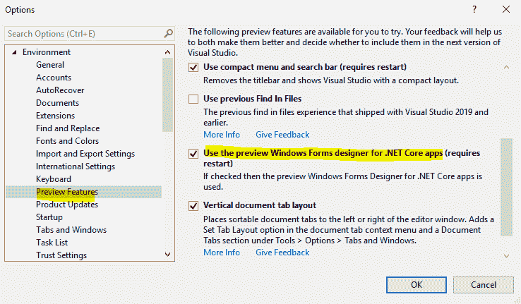

您需要重新启动 Visual Studio，打开 Windows 项目，然后在要在设计器中打开的文件名上单击“Shift+F7”。

# C# 8.0 中的新特性

在本节中，我们将讨论 C# 8.0 中尚未发布的新特性(在撰写本书时)。在我们的代码示例中，我们使用了 C# 8.0 的最新预览版。

在开始讨论新特性之前，我们应该首先启用对 C#8.0 语言的支持。

# 使用 Visual Studio 支持 C# 8.0 语言

如果没有最新安装的 Visual Studio(参考*技术要求*，按照以下步骤启用对 C# 8.0 的支持:

打开项目属性，然后打开构建选项卡，然后单击高级...按钮，靠近页面底部。选择 C# 8.0(测试版)，如下图所示，或者从“常规”组下的“语言版本”下拉列表中选择任何最新版本。下面的截图说明了每一步:


如果安装了最新版本的 Visual Studio，您将看到以下窗口:


根据前面的截图，Visual Studio 不允许我们更改/选择 C#版本。这是因为已经选择了 C#版本。C#编译器已经根据我们项目的目标框架为我们确定了默认语言版本。

下表显示了编译器如何选择默认版本:

| **目标框架**  | **C#语言版本** |
| .NET Core 3.x | Eight |
| .NET Core 2.x | Seven point three |
| .NET 标准(所有版本) | Seven point three |
| .NET 框架(所有版本) | Seven point three |

If a project targets a preview framework, then the compiler accepts all of the language syntaxes from the latest preview version.

现在，我们讨论一下 C# 8.0 的新特性。

# 指数和范围

作为一项新功能，现在开发人员可以根据数组的索引或指定范围轻松获取数组的元素值。这可以通过引入两个运算符来实现:`^`运算符代表从末尾开始的索引，`..`运算符代表范围。下面的截图代表了我们的一系列图书名称:

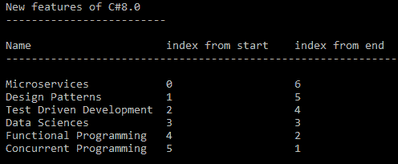

上一张截图显示了`Books []`每个元素的值，以及索引位置。

To showcase the feature, we have created a console app, using Visual Studio 2019.

在早期版本的 C#中，只能通过数组的第一个索引获取数组第一个元素的值；在这种情况下，我们将编写以下代码:

```cs
Console.WriteLine($"\tFirst element of array (index from start): Books{{0}} => {Books[0]}");
```

借助 C# 8.0 的一个新特性，现在可以使用`^`运算符获取元素值，它从末尾开始取索引和计数。我们的`Books[]`阵总长度为`6`。因此，为了获得第一个元素的值，我们将编写以下代码:

```cs
Console.WriteLine($"\tFirst element of array (index from end): Books{{^6}} => {Books[^6]}");
```

现在，运行代码，您将获得如下截图所示的输出:


在早期版本的 C#中，当我们需要一个数组的所有元素的值时，我们必须迭代数组的元素，从第 *0 <sup>第</sup>* 个索引开始，直到数组的长度。在 C# 8.0 中，当我们需要打印一个数组的值时，我们可以使用一个范围，在从开始索引值到结束索引值的范围内。在`..`算子的帮助下，现在我们可以这样得到`Book []`的值:`Book [1..4]`。

为了使用这个特性，让我们编写以下代码:

```cs
//Print using range
Range book = 1..4;
var res =  Books[book] ;
Console.WriteLine($"\tElement of array using Range: Books[{book}] => {Books[book]}");
```

在前面的代码中，我们已经声明了一个范围值为`1`到`4`的`book`变量，然后我们使用该变量打印范围内`Books[]`的值。运行代码并查看输出；输出显示在下面的截图中:


在上一个截图的高亮行中，你可能已经注意到我们的输出不如预期；我们得到`System.String[]`作为输出，但是我们期待数组的值。前面的输出是正确的——我们将`Books[]`的值存储在一个新的变量`book`中，并且我们必须迭代该变量来获得值。

要验证这一点，请在调试模式下运行前面的代码(从 Visual Studio 2019 开始)，方法是按下 *F5* 功能键或使用菜单选项:调试|开始调试。确保您在正确的位置放置了一个断点来查看调试结果。以下截图是在调试过程中捕获的:

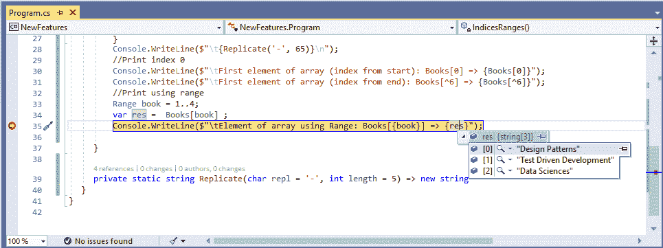

为了获取这些值，我们修改了前面的代码，下面是获取输出的代码:

```cs
//Print using range
Range book = 1..4;
var books =  Books[book] ;
Console.WriteLine($"\n\tElement of array using Range: Books[{book}] => {books}\n");
foreach (var b in books)
{
    Console.WriteLine($"\t{b}");
}    
```

现在，运行前面的代码，您应该会看到如下截图所示的输出:

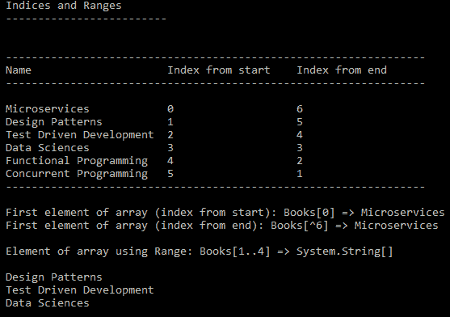

根据我们的范围，前面的截图给出了准确的输出。有更多的指数和范围场景，但我们没有涵盖所有内容，因为它不在本书的范围内。

# 只读成员

有了这个特性，我们现在可以在结构中定义一个`readonly`成员。这意味着该成员不能被修改，也不能从任何成员函数中更改。`static` `readonly`成员的值只能在运行时从静态构造函数更改。`readonly`字段不可修改的重要性在于，它将有助于避免整个代码中的任何意外更改或错误分配。这在我们有默认值并希望在运行时更改字段的情况下也很重要。

以下代码定义了`readonly`成员:

```cs
private static readonly int num1=5;
private static readonly int num2=6;
```

前面的代码声明了两个预先赋值的`readonly`成员。您可以编写一个方法来使用这些成员的值——类似于`public static int Add => num1 + num2;`。

运行代码，您应该会看到如下截图所示的输出:

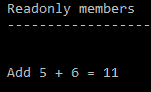

前面的截图显示了我们`Add`方法的输出。此方法不应声明为只读，否则会给你一个错误。例如，以下代码会给您一个错误:

```cs
public readonly static int Add => num1 + num2;
```

前面的代码不起作用，如果您构建代码，它会给您一个错误。考虑以下截图:

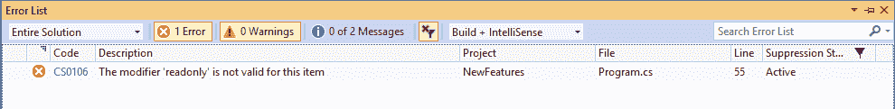

您将看到一条消息，如前面的截图所示。

# 默认接口方法

有了这个特性，现在，开发人员可以在接口中添加带有主体的方法。之前我们必须在后续的类中显式地编写接口方法的功能。但是现在，我们将获得这些默认接口方法的优势，当这些方法在后续类中被调用时，我们可以从中获得预定义的结果。为了更好地理解这个特性，请考虑下面的代码:

```cs
public interface IProduct
{
    public int Id { get; set; }
    public string Name { get; set; }
    public decimal Price { get; set; }
    public string ProductDesc() => $"Book:{Name} has Price:{Price}";
}
```

在前面的代码中，我们声明了一个`IProduct`接口，它有以下内容:

*   `Id`:这是唯一的产品 ID。
*   `Name`:这是产品名称。
*   `Price`:这是产品价格。
*   `ProductDesc`:这是我们界面的默认方法，总是会产生结果；在我们的例子中，它将返回`string`作为这个方法的结果。此外，该方法适用于所有实现`IProduct`接口的类。

让我们在`Product`类上实现`IProduct`接口。考虑以下代码:

```cs
public class Product : IProduct
{
    public Product(int id, string name, decimal price)
    {
        Id = id;
        Name = name;
        Price = price;
    }
    public int Id { get; set; }
    public string Name { get; set; }
    public decimal Price { get; set; }
}
```

除了`IProduct`接口的属性之外，我们的`Product`类没有定义任何额外的东西。这个类中没有额外的方法。`ProductDesc()`方法适用于本课程。考虑下面的代码，让我们在代码中使用这个默认方法:

```cs
IProduct product = new Product(1, "Design Patterns", 350.00M);
Console.WriteLine($"\t{product.ProductDesc()}");
```

在前面的代码中，我们声明了一个`IProduct`类型的`product`变量，然后简单地调用了`ProductDesc()`方法。这将产生如下截图所示的输出:

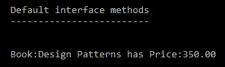

在`IProduct`接口中定义的`ProductDesc()`方法适用于我们的`Product`类。

在本节中，我们讨论了 C# 8.0 的一些特性。请注意，我们还添加了已随 C# 8.0 预览版 5 发布的功能。然后我们使用 C#8.0 更新了特性；在 C# 8.0 的正式版本中，有可能会排除一些功能，或者添加更多功能。在这里，我概述了 C# 8.0 的预期特性，但是为了完整地引用这些特性，我建议查看 C#语言的官方文档。

现在，让我们详细看看微服务的规模，以及这如何有助于构建它们。

# 微服务的规模

在我们开始构建我们的微服务之前，我们应该清楚它们的一些基本方面，例如在调整我们的微服务时要考虑哪些因素，以及如何确保它们与系统的其他部分隔离开来。

顾名思义，微服务应该是微的。但是什么是微？微服务都是关于大小和粒度的。为了更好地理解这一点，让我们考虑一下在[第 1 章](02.html)*微服务简介*中讨论的应用。

我们希望在这个项目上工作的团队在他们的代码方面始终保持同步。当我们发布完整的项目时，保持同步更加重要。我们首先需要将我们的应用及其特定部分分解成主服务的更小的功能/部分。让我们讨论微服务高级隔离需要考虑的因素:

*   **需求变化带来的风险**:一个微服务的需求变化应该独立于其他微服务。在这种情况下，我们将把我们的软件隔离/分割成更小的服务，这样，如果一个服务中有任何需求变化，它们将独立于另一个微服务。
*   **功能改变**:我们将把很少改变的功能从可以频繁修改的依赖功能中分离出来。例如，在我们的应用中，客户模块通知功能很少会改变。然而，其相关模块，如`Order`，更有可能在其生命周期中有频繁的业务变更。
*   **团队变化**:我们还应该考虑以一个团队可以独立于所有其他团队工作的方式隔离模块。如果让一个新开发人员富有成效的过程——关于这些模块中的任务——不依赖于团队之外的人，这意味着我们处于有利地位。
*   **技术变化**:技术使用需要在每个模块内部垂直隔离。一个模块不应依赖于另一个模块的技术或组件。我们应该严格隔离在不同技术或堆栈中开发的模块，或者将它们转移到一个公共平台作为最后的手段。

我们的主要目标不应该是使服务尽可能小。相反，我们的目标应该是隔离已识别的有界上下文，并保持它很小。

现在我们知道了微服务的大小。接下来，让我们学习什么是好的服务。

# 什么是好的服务？

在微服务被概念化之前，每当我们想到企业应用集成，中间件看起来是最可行的选择。软件供应商提供了**企业服务总线** ( **ESB** ，这是中间件的最佳选择之一。

除了考虑这些解决方案，我们的主要优先事项应该是架构特性。当微服务到来时，中间件不再是一个考虑因素。相反，重点转移到业务问题的思考以及如何借助架构解决这些问题。

为了使服务易于开发人员和用户使用和维护，服务必须具有以下特征(我们也可以将这些视为好服务的特征):

*   **标准数据格式**:好的服务应该遵循标准化的数据格式，同时与其他组件交换服务或系统。中使用的最流行的数据格式.NET 栈是 XML 和 JSON。
*   **标准通信协议**:好的服务应该遵守标准的通信格式，比如 SOAP 和 REST。
*   **松耦合**:好的服务最重要的一个特点就是跟松耦合。当服务松散耦合时，我们不必担心变化。一项服务的更改不会影响其他服务。

本节帮助我们了解什么使服务变得好以及如何变得好。我们接下来将讨论领域驱动设计及其对微服务的重要性。

# DDD 及其对微服务的重要性

**领域驱动设计** ( **DDD** )是设计复杂系统的方法和过程。在本节中，我们将简要讨论 DDD 以及它在微服务环境中的重要性。

# 领域模型设计

领域设计的主要目标是理解确切的领域问题，然后起草一个可以用任何语言或一组技术编写的模型。例如，在我们的 FlixOne 书店应用中，我们需要了解订单管理和库存管理。

以下是领域驱动模型的一些特征:

*   一个领域模型应该关注一个特定的业务模型，而不是多个业务模型。
*   它应该是可重用的。
*   它应该被设计成可以以松散耦合的方式调用，而不像系统的其他部分。
*   它应该独立于持久性实现进行设计。
*   它应该从一个项目中被拉到另一个位置，所以它不应该基于任何基础设施框架。

接下来，让我们看看这个模型对微服务有多重要。

# 微服务的重要性

DDD 是蓝图，可以通过微服务来实现。换句话说，一旦 DDD 完成，我们就可以使用微服务来实现它。这就像在我们的应用中，我们可以轻松地实现订单服务、库存服务、跟踪服务等等。

一旦你满意地处理了过渡过程，就应该进行一个简单的练习。这将帮助您验证微服务的大小是否足够小。每个系统都是独一无二的，有自己的复杂程度。考虑到您的域的这些级别，您需要有一个可以相互对话的域对象的最大数量的基线。如果有任何服务没有达到这个评估标准，那么您就有可能再次评估您的过渡。然而，不要带着特定的数字进入这个练习；你总是可以放松。只要你正确地遵循了所有的步骤，系统对你来说应该没问题。

如果您觉得这个基线过程对您来说很难实现，您可以通过遍历每个微服务中的所有接口和类来走另一条路线。考虑到我们已经遵循的所有步骤，以及行业标准的编码准则，任何对系统不熟悉的人都应该能够理解它的目的。

您还可以执行另一个简单的测试来检查是否实现了服务的正确垂直隔离。您可以部署它们中的每一个，并让它们与仍然不可用的其余服务一起使用。如果你的服务上线了，并继续监听收到的请求，你可以拍拍自己的背。

隔离部署能力可以带来许多好处。独立部署它们的能力允许它们中的主机进入自己的独立进程。它还允许您利用云的力量以及您能想到的任何其他混合托管模式。你也可以自由选择不同的技术。

了解了 DDD 之后，我们现在可以继续讨论 seam 的概念。

# 理解接缝的概念

微服务的核心是独立于系统的其他部分来处理特定功能的能力。这转化为前面讨论的所有优势，例如减少模块依赖性、代码可重用性、更容易的代码维护和更好的部署。

在我看来，在微服务的实现过程中，应该保持相同的属性。为什么将单片迁移到微服务的整个过程会很痛苦，而且不如使用微服务本身有回报？请记住，过渡不能一蹴而就，需要精心规划。许多有能力的解决方案架构师在展示他们的高能力团队时有不同的方法。答案不仅在于已经提到的几点，还在于企业本身的风险。

这是完全可以实现的。然而，我们必须正确识别我们的方法来实现它。否则，将单一应用转换为微服务的整个过程可能会非常糟糕。让我们看看这是如何做到的。

# 模块相互依赖

当试图将一个单一的应用转换成一个微服务风格的架构时，这应该永远是一个起点。识别并挑选应用中其他模块最不依赖的部分，也是最不依赖它们的部分。

理解这一点非常重要，通过识别应用的这些部分，您不只是试图挑选最不具挑战性的部分来处理。但是，与此同时，您已经确定了接缝，这是最容易看到的变化部分。这些是应用的一部分，我们将首先在其中执行必要的更改。这使我们能够将这部分代码与系统的其他部分完全隔离开来。它应该准备好成为微服务的一部分，或者在本练习的最后阶段进行部署。

尽管已经发现了这些漏洞，但实现微服务式开发的能力还有点远。在这一节中，我们介绍了 seam 的概念，然后我们看到了什么是模块相互依赖。这是一个好的开始。然而，基于微服务的应用需要更多的模式，我们需要了解这项技术。在接下来的部分，我们将讨论这项技术。

# 技术

这里需要双管齐下。首先，您必须确定应用基础框架的哪些不同特性正在被利用。例如，这种区别可以是基于对某些数据结构、正在执行的进程间通信或报告生成活动的严重依赖的实现。这是容易的部分。

然而，作为第二步，我建议您变得更加自信，并选择使用不同于当前使用的技术类型的代码片段。例如，可能有一段代码依赖于简单的数据结构或基于 XML 的持久性。在系统中识别此类行李，并将其标记为过渡。这种双管齐下的方法需要非常谨慎。做出过于雄心勃勃的选择可能会让你走上一条类似于我们一直试图完全避免的道路。

对于最终的微服务风格的架构应用来说，其中一些部分可能看起来不太有希望。现在仍然应该处理它们。最终，它们将允许您轻松执行过渡。技术和框架在任何应用的开发中都起着重要的作用，但是当我们处理基于微服务架构风格的应用时，技术是最重要的。

这一节解释了技术；在下一节中，我们将讨论团队结构。

# 团队结构

随着识别过程的每一次迭代，这个因素变得越来越重要。可能会有基于不同理由的不同团队，例如他们的技术技能、地理位置或安全要求(员工对自由职业者)。

如果有一部分功能需要特定的技能组合，那么您可能会考虑另一个可能的 seam 候选人。团队可以由不同程度的这些分化因素组成。作为向微服务过渡的一部分，使他们能够独立工作的明显差异可以进一步优化他们的生产力。

这也可以以保护公司知识产权的形式提供好处；将应用的特定部分外包给顾问并不少见。允许顾问或合作伙伴仅在特定模块上为您提供帮助的能力使流程更加简单和安全。

团队及其成员对于任何应用的执行都非常重要。在基于微服务的应用中，我们为团队提供了灵活性，任何人都可以在不干扰他人任务或活动的情况下处理单个服务。为了了解这是如何发生的，在下一节中，我们将讨论数据库。

# 数据库

任何企业系统的核心和灵魂都是它的数据库。这是系统在任何一天的最大资产。在这样的演习中，它也是整个系统中最脆弱的部分。(难怪每当你要求数据库架构师做哪怕是最小的更改时，他们听起来都很刻薄和碍眼。)它们的域由数据库表和存储过程定义。

它们的域的健康状况也是由引用完整性和执行各种事务所需的时间来判断的。我不再责怪建筑师做得过头了。他们这样做是有原因的:他们过去的经历。是时候改变这种状况了。让我告诉你，这并不容易，因为当我们走上这条路时，我们将不得不使用一种完全不同的方法来处理数据完整性。

您可能会认为最简单的方法是一次性划分整个数据库，但事实并非如此。这可能会导致我们一直试图避免的局面。让我们看看如何更有效地进行这项工作。

在模块依赖关系分析之后，当您继续挑选片段时，请确定用于与数据库交互的数据库结构。这里需要执行两个步骤。首先，检查是否可以隔离代码中要分解的数据库结构，然后将其与新定义的垂直边界对齐。其次，确定需要什么来分解底层数据库结构。

如果分解底层数据结构似乎很困难，也不要担心。如果它似乎涉及到您还没有开始转移到微服务的其他模块，这是一个好的迹象。不要让数据库的变化定义了您将挑选并迁移到微服务风格架构的模块；反过来说。这确保了当数据库发生变化时，依赖于变化的代码已经准备好吸收变化。

这确保了当您已经忙于修改依赖于这部分数据库的代码时，您不会再挑起数据完整性的战斗。然而，这样的数据库结构应该引起您的注意，以便接下来选择依赖于它们的模块。这将允许您一次轻松完成所有相关模块向微服务的转移。参考下图:


这里，我们还没有破坏数据库。相反，作为第一步的一部分，我们已经简单地将数据库访问部分分成了几层。

我们在这里所做的是将代码数据结构映射到数据库，以便它们不再相互依赖。让我们看看当我们移除外键关系时，这一步将如何进行。

如果我们可以将用于访问数据库的代码结构与数据库结构一起转换，我们将节省时间。这种方法可能因系统而异，并且会受到我们个人偏见的影响。如果您的数据库结构变化似乎正在影响尚未标记为过渡的模块，现在就继续。

当您分解这个数据库表或将其与另一个部分结构合并时，您还需要了解什么样的更改是可以接受的。最重要的是不要回避打破那些外来的关键关系。这听起来可能与我们维护数据完整性的传统方法有很大不同。

然而，在重组数据库以适应微服务架构时，移除外键关系是最基本的挑战。请记住，微服务意味着独立于其他服务。如果与系统的其他部分存在外键关系，这就使得它依赖于拥有该部分数据库的服务。参考下图:


作为第二步的一部分，我们保留了数据库表中的外键字段，但删除了外键约束。因此， **ORDER** 表仍然保存着关于 **ProductID** 的信息，但是外键关系现在被破坏了。参考下图:


这就是我们的微服务式架构最终的样子。中央数据库将被移走，取而代之的是每个服务都有自己的数据库。因此，通过分离代码中的数据结构和移除外键关系，我们已经准备好最终进行更改。上图中微服务的连接边界表示服务间的通信。

执行了这两个步骤后，您的代码现在可以将 **ORDER** 和 **PRODUCT** 拆分为单独的服务，每个服务都有自己的数据库。

如果这里的讨论让你对迄今为止安全执行的所有交易感到困惑，那么你并不孤单。交易挑战的结果无论如何都不小，值得重点关注。稍后我们将详细介绍这一点。

在本节中，我们讨论了一个数据库，我们称之为应用的**主存储**。我们还可以将单个数据库分解成每个服务可以使用的小数据库，因此我们可以说每个服务有一个数据库。

在我们更进一步之前，数据库中还有另一部分成为无人区。这是主数据，或者说是静态数据，有些人可能会这样称呼它。

# 主数据

处理主数据取决于您的个人选择和系统特定要求。如果您看到主数据在很长一段时间内都不会改变，并且占据了少量的记录，那么您最好使用配置文件甚至代码枚举。

这需要有人在发生更改时偶尔推出配置文件。然而，这在未来仍然留下了空白。由于系统的其余部分将依赖于这一个模块，它将负责这些更新。如果该模块运行不正常，依赖它的系统的其他部分也会受到负面影响。

另一种选择是将主数据打包到一个单独的服务中。通过服务交付主数据将提供这样的优势，即服务可以立即了解变化，并了解使用它的能力。

需要时，请求此服务的过程可能与读取配置文件的过程没有太大区别。它可能会慢一些，但是只需要做必要的次数。

此外，您还可以支持不同的主数据集。维护每年都不同的产品集是相当容易的。有了微服务架构风格，将来独立于任何类型的外部依赖总是一个好主意。

在本节中，我们讨论了主数据。当我们与数据交互时，事务起着重要的作用，所以在下一节中，我们将讨论它们。

# 处理

随着外键的消失以及数据库被分成更小的部分，我们需要设计自己的机制来处理数据完整性。在这里，我们需要考虑到并非所有服务都将在其各自的数据存储范围内成功完成事务的可能性。

一个很好的例子是用户订购特定的产品。接受订单时，有足够的数量可供订购。但是，在记录订单时，由于某种原因，产品服务无法记录订单。我们还不知道是因为数量不足还是系统内部的其他通信故障。这里有两种可能的选择。我们一个一个来讨论。

第一种选择是再试一次，并在以后某个时间执行事务的剩余部分。这将要求我们以跨服务跟踪单个事务的方式编排整个事务。因此，必须跟踪导致为多个服务执行事务的每个事务。如果其中一个没有通过，就应该重试。这可能适用于长期运营。

但是，对于其他操作，这可能会导致真正的问题。如果操作持续时间不长，而您仍然决定重试，结果将导致锁定其他事务或使事务等待，这意味着不可能完成它。

另一种选择是取消分散在各种服务中的整个事务集。这意味着在整个交易集的任何阶段的单个失败将导致所有先前交易的逆转。

这是一个需要最大限度谨慎的领域，是时候好好投资了。只有当事务在任何微服务风格的架构应用中被很好地规划时，才能保证稳定的结果。

当我们处理数据库操作时，事务非常重要；这些操作可以是提取、插入等等。在事务的帮助下，如果任何操作失败，我们可以回滚事务范围内的流程中的完整操作。

现在，让我们继续了解微服务之间的通信。

# 微服务之间的通信

在前一节中，我们将`Order`模块分为**订单服务**，并讨论了如何分解`ORDER`和`PRODUCT`表之间的外键关系。

在一个单一的应用中，我们有一个单一的存储库，它查询数据库以从`ORDER`和`PRODUCT`表中获取记录。然而，在我们即将推出的微服务应用中，我们将在**订单服务**和**产品服务**之间隔离存储库。每个服务都有各自的数据库，每个服务只能访问自己的数据库。**订单服务**只能访问订单**数据库**，而**产品服务**只能访问产品**数据库**。**订单服务**不允许访问产品**数据库**，反之亦然。

We will discuss communication between microservices in [Chapter 3](02.html), *Effective Communication between Services*, in detail.

下图显示了使用**应用编程接口网关**与不同服务的交互:

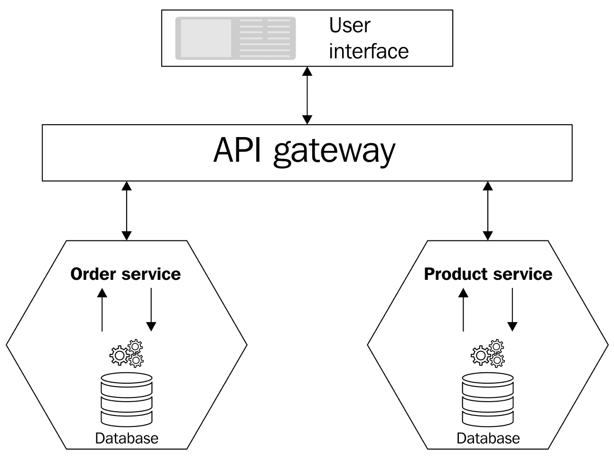

在上图中，我们可以看到我们的 UI 正在通过 **API 网关**与**订单服务**和**产品服务**进行交互。这两种服务在物理上是相互分离的，并且这些服务之间没有直接的交互。以这种方式执行的通信也被称为基于**应用编程接口网关**模式的通信。

应用编程接口网关只是一个中间层，用户界面可以通过它与微服务交互。它还提供了一个更简单的界面，并简化了使用这些服务的过程。它根据需要为不同的客户端(浏览器和桌面)提供不同的粒度级别。

我们可以说，它向移动客户端提供粗粒度的 API，向桌面客户端提供细粒度的 API，并且它可以在引擎盖下使用高性能网络，以提供一些重要的吞吐量。

我们可以很容易地将粒度定义为(另请参见[https://software engineering . stackexchange . com/questions/385313/什么是粒度](https://softwareengineering.stackexchange.com/questions/385313/what-is-granularity)):

"...a system is broken down into small parts; large systems can further be broken or torn down to finer parts."

# 应用编程接口网关对微服务的好处

毫无疑问，API 网关对微服务是有益的。使用应用编程接口网关，您可以执行以下操作:

*   通过应用编程接口网关调用服务
*   减少客户端和应用之间的往返行程
*   客户端可以在一个地方访问不同的应用编程接口，由网关隔离

它为客户提供了灵活性，使他们可以在需要时与不同的服务进行交互。这样，根本不需要公开完整的/所有的服务。应用编程接口网关是完整应用编程接口管理的一个组成部分。在我们的解决方案中，我们将使用 Azure API Management，我们将在[第 3 章](02.html)、*服务之间的有效通信*中进一步解释。

# 应用编程接口网关与应用编程接口管理

在前一节中，我们讨论了应用编程接口网关如何对其客户端隐藏实际的应用编程接口，然后简单地将调用从这些客户端重定向到实际的应用编程接口。应用编程接口管理解决方案提供了一个完整的管理系统来管理其外部消费者的所有应用编程接口。所有的应用编程接口管理解决方案，如 Azure 应用编程接口管理([https://docs.microsoft.com/en-us/azure/api-management/](https://docs.microsoft.com/en-us/azure/api-management/))都提供了各种功能，例如:

*   设计
*   发展
*   安全
*   出版
*   可量测性
*   监视
*   分析
*   货币铸造

接下来，让我们重温 FlixOne 案例研究，以便更好地理解。

# 重新审视 FlixOne 案例研究

在前一章中，我们看了一个虚构公司 FlixOne Inc .的例子，该公司在电子商务领域运营，并拥有自己的.NET 单片应用:FlixOne 书店。

我们已经讨论了以下内容:

*   如何隔离代码
*   如何隔离数据库
*   如何反规范化数据库
*   如何开始过渡
*   可用的重构方法

前面几点很重要，因为我们正在将我们的整体应用转换为基于微服务的应用。在[第 1 章](01.html)*微服务简介*中，我们已经讨论了为什么我们想要构建基于微服务的应用。在现有的电子商务市场中，需要应用的需求、频繁的更新和 100%的正常运行时间(应用的可用性)。

在接下来的部分中，我们将开始将. NET 整体转换为微服务应用。

# 先决条件

我们将使用以下工具和技术，同时将我们的整体应用转变为微服务风格的体系结构:

*   Visual Studio 2019 或更高版本
*   C# 8.0
*   ASP.NET Core MVC/网络应用编程接口
*   实体框架核心
*   SQL Server 2008 R2 或更高版本

# 过渡到我们的产品服务

我们已经有了我们的产品模块。我们现在将收回这个模块，从一个新的 ASP.NET Core MVC 项目开始。为此，请遵循我们在前面章节和[第 1 章](02.html)、*微服务简介*中讨论的所有步骤。让我们检查一下我们将使用的技术和数据库:

*   **技术栈**:我们的产品服务已经选择了这个；我们将和 ASP.NET 芯、c#**实体框架** ( **EF** )等一起走。微服务可以使用不同的技术堆栈编写，并且可以由不同技术创建的客户端使用。对于我们的产品服务，我们将选择 ASP.NET 芯。
*   **数据库**:我们已经在[第 1 章](02.html)、*微服务介绍*中讨论过这个问题，当时我们讨论了一个单一应用和分离它的数据库。在这里，我们将使用 SQL Server，数据库模式将是`Product`而不是`dbo`。

我们的产品数据库是独立的。我们将在产品服务中使用该数据库，如下图所示:

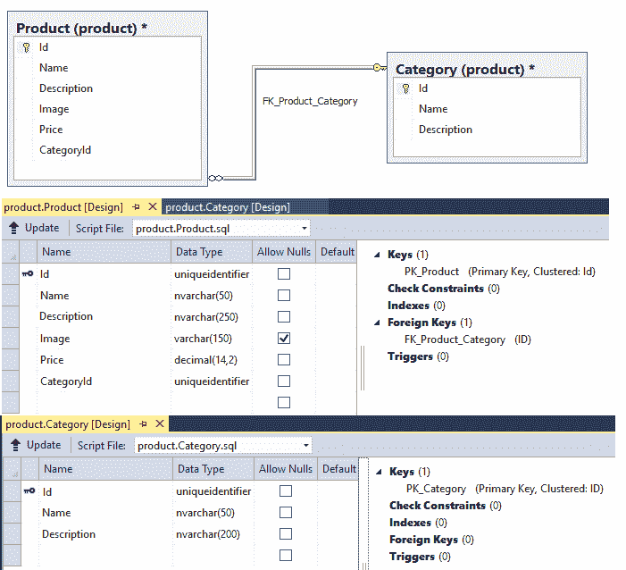

我们为我们的产品服务创建了一个独立的产品数据库。我们没有迁移整个数据集。在接下来的部分中，我们还将讨论产品数据库迁移。

迁移很重要，因为我们有许多 FlixOne 书店客户的现有记录。我们不能忽略这些记录，它们需要迁移到我们修改过的结构中。我们开始吧。

# 迁移

在前面的部分中，我们分离了我们的产品数据库，以确保它只被我们的产品服务使用。我们还选择了我们选择的技术堆栈来构建我们的微服务(产品服务)。

在本节中，我们将讨论如何迁移我们现有的代码和数据库，以确保它们适合我们的新架构风格。

# 代码迁移

代码迁移不仅仅涉及从现有的单一应用中拉出几层代码，然后将其与我们新创建的**产品服务**捆绑在一起。为了实现这一点，你需要实现你所学到的一切，直到现在。在现有的单片应用中，我们有一个单一的存储库，它对所有模块都是通用的。但是，对于微服务，我们将分别为每个模块创建存储库，并保持它们彼此隔离:

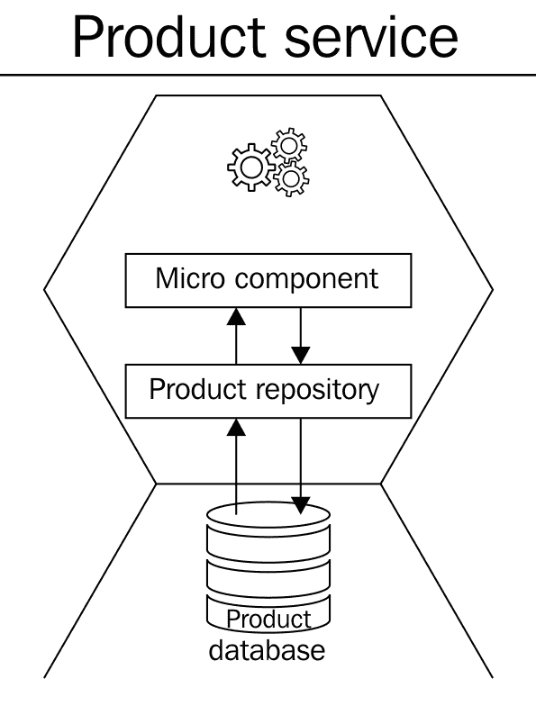

在上图中，**产品服务**有一个**产品存储库**，它进一步与其指定的数据存储交互，命名为**产品数据库**。我们现在将进一步讨论微组件。它们只不过是应用(微服务)的独立部分，即公共类和业务功能。这里值得注意的是**产品存储库**本身是微服务世界中的一个微组件。

在我们的最终产品服务中，这将在 ASP.NET Core 完成，我们将与模型和控制器一起创建我们的 RESTful 应用编程接口。让我们简单描述一下这两者:

*   **模型**:这是一个表示产品服务中数据的对象。在我们的例子中，识别的模型被堆叠到产品和类别字段中。在我们的代码中，模型只不过是一组简单的 C#类。当我们用英孚核心来说话时，它们通常被称为**普通旧 CLR 对象** ( **POCOs** )。POCOs 只不过是没有任何数据访问功能的简单实体。
*   **控制器**:这是一个简单的 C#类，继承了`Microsoft.AspNetCore.Mvc`命名空间的抽象类控制器。它处理 HTTP 请求，并负责创建要发回的 HTTP 响应。在我们的产品服务中，我们有一个产品控制器来处理一切。

让我们按照一步一步的方法来创建我们的产品服务。

# 创建我们的项目

正如前面几节已经决定的，我们将使用 Visual Studio 在 ASP.NET Core 3.0 或 C# 8.0 中创建`ProductService`。让我们看看要做到这一点需要哪些步骤:

1.  启动 Visual Studio。
2.  通过导航到文件|新建|项目来创建新项目。
3.  从可用的模板选项中，选择 ASP.NET Core 网络应用，然后单击下一步。以下屏幕截图显示了“创建新项目”窗口:


4.  输入项目名称为`FlixOne.BookStore.ProductService`，点击确定。

5.  从模板屏幕中，选择网络应用(模型-视图-控制器)，并确保您已选择.NET Core 和 ASP.NET Core 3.1，如下图所示:


6.  将其余选项保留为默认选项，然后单击创建。新的解决方案应该如下图所示:

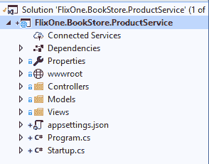

7.  在解决方案资源管理器中，右键单击(或按下 *Alt* + *进入*)项目，然后单击属性。
8.  在属性窗口中，单击构建|高级。语言版本是根据框架版本自动选择的。我们的框架是.NET Core 3.0，所以我们的语言应该是 C# 8.0，如下图截图所示:

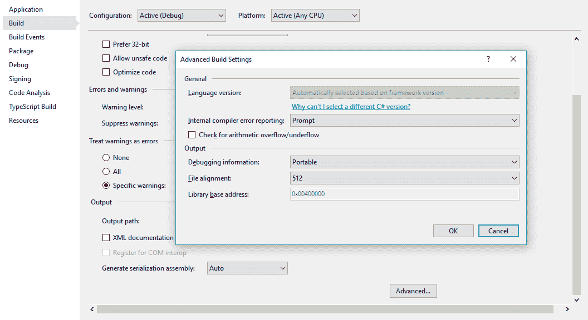

Please make sure you select the latest version of C# 8.0\. The use of older versions might be troublesome.

# 添加模型

在我们的单片应用中，我们还没有任何模型类。因此，让我们按照要求添加一个新模型。

要添加新模型，如果项目中不存在，则添加一个新文件夹并命名为`Models`。在解决方案资源管理器中，右键单击项目，然后单击添加|新建文件夹:

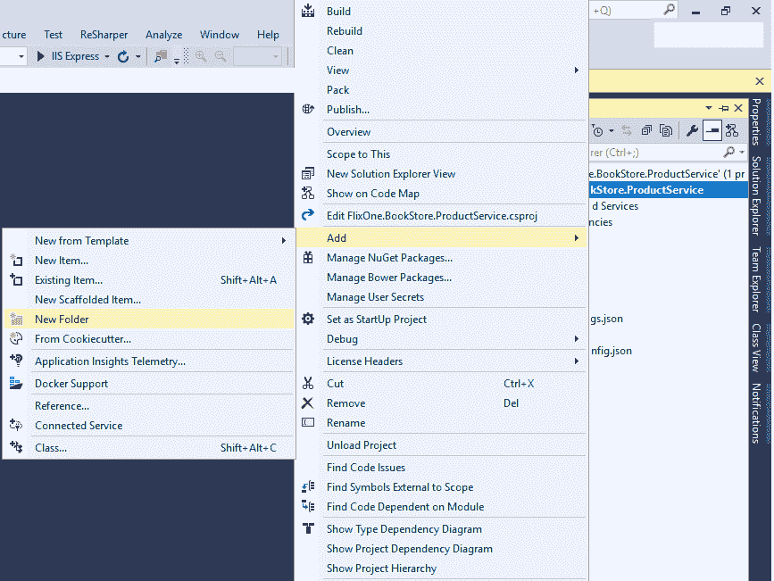

将所有模型类放入名为`Models`的文件夹中没有硬性规定。事实上，我们可以将模型类放在应用中项目的任何地方。我们遵循这种做法，因为它从文件夹名称中变得不言自明。同时，它很容易识别出这个文件夹是用于模型类的。

要添加新的`Product`和`Category`类(这些类将代表我们的概念验证操作)，请执行以下操作:

1.  右键点击`Models`文件夹，选择【添加|新项目|类】，命名为`Product`；重复此步骤，添加另一个类，并将其命名为`Category`。

2.  现在，将描述我们的产品数据库列名的属性分别添加到`Product`和`Category`表中。

There is no restriction, regarding having the property name match the table column name. It is just a general practice.

下面的代码片段描述了我们的`Product`模型类的样子:

```cs
using System;
namespace FlixOne.BookStore.ProductService.Models
{
    public class Product
    {
        public Guid Id { get; set; }
        public string Name { get; set; }
        public string Description { get; set; }
        public string Image { get; set; }
        public decimal Price { get; set; }
        public Guid CategoryId { get; set; }
        public virtual Category Category { get; set; }
    }
}
```

前面的代码示例表示一个产品模型，它包含以下内容:

*   `Id`是**全球唯一标识符** ( **GUID** )并且代表记录 ID。
*   `Name`是字符串类型的属性，保存产品名称。
*   `Description`是一个字符串类型的属性，保存了产品的完整描述。
*   `Image`是一个字符串类型的属性，包含一个 Base64 字符串。
*   `Price`是十进制类型的属性，保存产品的价格。
*   `CategoryId`为 GUID 它保存产品类别的记录标识。
*   `Category`为虚拟财产，包含产品类别的完整信息。

下面的代码片段显示了我们的`Category.cs`模型类的样子:

```cs
using System;
using System.Collections.Generic;
namespace FlixOne.BookStore.ProductService.Models
{
    public class Category
    {
        public Category()
        {
            Products = new List<Product>();
        }
        public Guid Id { get; set; }
        public string Name { get; set; }
        public string Description { get; set; }
        public IEnumerable<Product> Products { get; set; }
    }
}
```

前面的代码代表了我们的类别模型，它包含以下内容:

*   `Id`是一个 GUID，代表一个记录 ID。
*   `Name`是字符串类型属性，保存类别名称。
*   `Description`是一个字符串类型属性，保存了类别的完整描述。
*   `Products`是属于当前记录类别的所有产品的集合。

让我们在代码示例中添加一个存储库，这样我们就可以进行一些实际的数据库调用。

# 添加存储库

在我们的整体应用中，我们在整个项目中都有一个公共的存储库。在`ProductService`中，通过遵循到目前为止所学的所有原则，我们将创建微组件，这意味着封装数据层的独立存储库。

A repository is nothing but a simple C# class that contains the logic to retrieve data from the database and map it to the model.

添加存储库就像执行以下步骤一样简单:

1.  新建一个文件夹，然后命名为`Persistence`。
2.  添加`IProductRepository`接口和一个将实现`IProductRepository`接口的`ProductRepository`类。
3.  同样，我们命名文件夹`Persistence`是为了遵循易于识别的一般原则。

以下代码片段概述了`IProductRepository`界面:

```cs
using System;
using System.Collections.Generic;
using FlixOne.BookStore.ProductService.Models;

namespace FlixOne.BookStore.ProductService.Persistence
{
  public interface IProductRepository
 {
 void Add(Product product);
 IEnumerable<Product> GetAll();
 Product GetBy(Guid id);
 void Remove(Guid id);
    void Update(Product product);
  }
}
```

我们的`IProductRepository`界面有所有需要的方法:

*   `Add`:这个方法负责添加一个新产品。
*   `GetAll`获取所有产品记录，返回产品集合。
*   `GetBy`根据给定的产品标识获取一个产品。
*   `Remove`删除特定记录。
*   `Update`负责更新现有记录。

下一个代码片段提供了`ProductRepository`类的概述(它仍然没有任何实现，并且还没有与数据库进行任何交互):

```cs
using FlixOne.BookStore.ProductService.Contexts;
using FlixOne.BookStore.ProductService.Models;
using Microsoft.EntityFrameworkCore;

 namespace FlixOne.BookStore.ProductService.Persistence
 {
 public class ProductRepository : IProductRepository
 {
 public void Add(Product Product)
 {
 throw new NotImplementedException();
 }
 public IEnumerable<Product> GetAll()
 {
       throw new NotImplementedException();
     }
     public Product GetBy(Guid id)
     {
       throw new NotImplementedException();
     }
 public void Remove(Guid id)
     {
       throw new NotImplementedException();
     }
     public void Update(Product Product)
     {
       throw new NotImplementedException();
     }
   }
 }
```

前面的代码实现了`IProductRepository`接口。该代码示例用于演示目的，因此我们没有向实现的方法添加定义。

接下来，让我们看看如何使用`Startup.cs`的`ConfigureServices`注册我们的存储库。

# 注册存储库

对于`ProductService`，我们将使用内置的依赖注入支持与 ASP.NET Core。为此，请遵循以下简单步骤:

1.  打开`Startup.cs`。
2.  将存储库添加到`ConfigureServices`方法中。应该是这样的:

```cs
using FlixOne.BookStore.ProductService.Persistence;
public void ConfigureServices(IServiceCollection services)
{
 // Add framework services.

  services.AddSingleton<IProductRepository, 
  ProductRepository>();
}
```

在前面的代码中，我们将我们的存储库注册为由提供的**控制反转** ( **IoC** )的单一服务.NET Core 框架。

在接下来的部分中，我们将讨论我们的产品控制器，并了解如何在代码中添加控制器。

# 添加产品控制器

最后，我们已经到了可以继续添加控制器类的阶段。该控制器将负责用适用的 HTTP 响应来响应传入的 HTTP 请求。如果你想知道该怎么做，你可以看到`HomeController`类，因为它是 ASP.NET Core 模板提供的默认类。

右键点击`controllers`文件夹，选择添加|新建项目选项，选择 API 控制器类。命名为`ProductController`。在这里，我们将利用单片应用中的任何代码和功能。回到遗留代码，看看您在那里执行的操作；你可以借它们来上我们的`ProductController`课。参考以下截图:

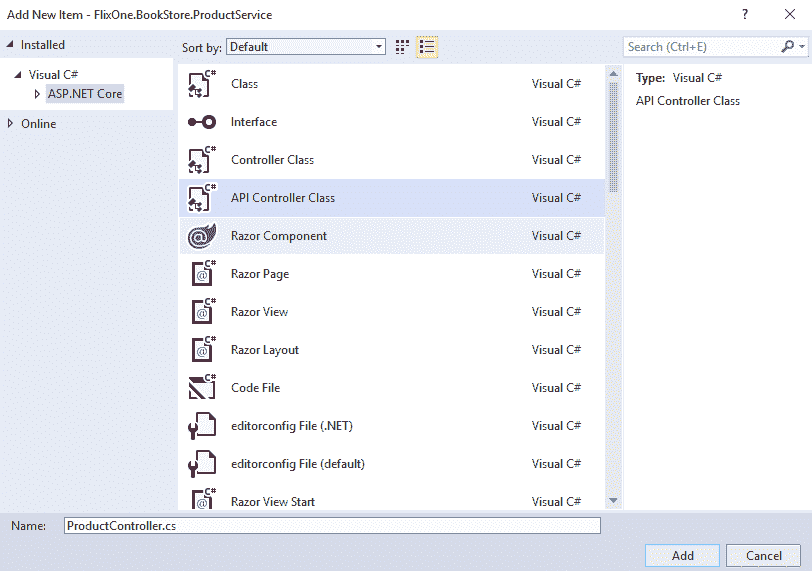

在我们对`ProductController`进行了所需的修改之后，它应该看起来类似于这样:

```cs
 using Microsoft.AspNetCore.Mvc;
 using FlixOne.BookStore.ProductService.Persistence;
 namespace FlixOne.BookStore.ProductService.Controllers
 {
   [Route("api/[controller]")]
   public class ProductController : Controller
   {
     private readonly IProductRepository _ProductRepository;
     public ProductController(IProductRepository ProductRepository)
     {
       _ProductRepository = ProductRepository;
     }
   }
 }
```

在前一节中，我们为 IoC 注册了`ProductRepository`，在`ProductController`中，我们正在使用存储库。在前面的代码示例中，我们使用了构造函数注入，并且使用了带有`IProductRepository`类型参数的参数化构造函数。

# 产品服务应用编程接口

在我们的单片应用中，对于`Product`模块，我们正在执行以下操作:

*   添加新的`Product`模块
*   更新现有的`Product`模块
*   删除现有的`Product`模块
*   检索`Product`模块

现在，我们将创建`ProductService`；我们需要以下 API:

| **原料药资源** | **描述** |
| `GET` / `api` / `Product` | 获取产品列表 |
| `GET` / `api` / `Product` / `{id}` | 获取产品 |
| `PUT` / `api` / `Product` / `{id}` | 更新现有产品 |
| `DELETE` / `api` / `Product` / `{id}` | 删除现有产品 |
| `POST` / `api` / `Product` | 添加新产品 |

接下来，我们将看看如何为这些添加 EF Core 支持。

# 添加英孚核心支持

在进一步之前，我们需要添加 EF Core 支持，这样我们的服务就可以与产品数据库进行交互。到目前为止，我们还没有向存储库中添加任何可以与数据库交互的方法。要添加 EF Core 支持，我们需要添加 EF Core 的`sqlserver`包(我们正在添加`sqlserver`包，因为我们使用 SQL Server 作为我们的 DB 服务器)。打开获取包管理器(工具|获取包管理器|管理获取包)。

打开 NuGet 包，搜索`Microsoft.EntityFrameworkCore.SqlServer`:


前面的截图显示了`Microsoft.EntityFrameworkCore.SqlServer`的搜索结果作为输入。

# EF Core DbContext

在前一节中，我们添加了支持 SQL Server 的 EF Core 3.1 包；现在我们需要创建一个上下文，这样我们的模型就可以与我们的产品数据库交互。我们有`Product`和`Category`两种型号，你可以参考以下步骤:

1.  添加新文件夹，然后命名为`Contexts`—不强制添加新文件夹。

2.  在`Contexts`文件夹中，添加一个新的 C#类并命名为`ProductContext`。我们正在为`ProductDatabase`创建`DbContext`，所以为了使它在这里相似，我们创建`ProductContext`。
3.  确保`ProductContext`类继承了`DbContext`类。

4.  进行更改，我们的`ProductContext`类将如下所示:

```cs
 using FlixOne.BookStore.ProductService.Models;
 using Microsoft.EntityFrameworkCore;
 namespace FlixOne.BookStore.ProductService.Contexts
 {
   public class ProductContext : DbContext
   {
     public ProductContext(DbContextOptions<
     ProductContext>options): base(options)
     { }
     public ProductContext()
     { }
     public DbSet<Product> Products { get; set; }
     public DbSet<Category> Categories { get; set; }
   }
 }
```

我们已经创建了上下文，但是这个上下文独立于产品数据库。我们需要添加一个提供者和连接字符串，这样`ProductContext`就可以和我们的数据库对话了。

5.  再一次，打开`Startup.cs`文件，在`ConfigureServcies`方法下，为我们的英孚核心支持添加`SQL Server db`提供商。一旦添加了提供商的`ConfigureServcies`方法，我们的`Startup.cs`文件将如下所示:

```cs
 public void ConfigureServices(IServiceCollection services)
 {
   // Add framework services.

   services.AddSingleton<IProductRepository, ProductRepository>();
   services.AddDbContext<ProductContext>(o =>o.UseSqlServer
   (Configuration.GetConnectionString("ProductsConnection" )));
 }
```

6.  打开`appsettings.json`文件，然后添加需要的数据库连接字符串。在我们的提供商中，我们已经将连接密钥设置为`ProductConnection`。现在，添加以下代码以设置具有相同键的连接字符串(将`Data Source`更改为您的数据源):

```cs
 {
   "ConnectionStrings": 
   {
     "ProductConnection":
     "Data Source=.SQLEXPRESS;Initial Catalog=ProductsDB;
     IntegratedSecurity=True;MultipleActiveResultSets=True"
   }
 }
```

前面的代码包含连接我们的应用和数据库的连接字符串。

# 英孚核心迁移

虽然我们已经创建了产品数据库，但我们不应低估 EF Core 迁移的力量。EF Core 迁移将有助于我们对数据库执行任何未来的修改。这种修改的形式可以是简单的字段添加或对数据库结构的任何其他更新。我们每次都可以简单地依靠这些 EF Core 迁移命令来为我们进行必要的更改。要利用这一功能，请执行以下简单步骤:

1.  转到工具|否获取包管理器|包管理器控制台。
2.  从包管理器控制台运行以下命令:

```cs
Install-Package Microsoft.EntityFrameworkCore.Tools
Install-Package Microsoft.EntityFrameworkCore.Design 
```

3.  要启动迁移，请运行以下命令:

```cs
 Add-Migration ProductDB
```

需要注意的是，这只能在第一次执行(当我们还没有通过这个命令创建数据库时)。

4.  现在，只要您的模型有任何变化，只需执行以下命令:

```cs
Update-Database
```

从前面的命令中，我们可以更新数据库。

至此，我们完成了我们的`ProductDatabase`创造。现在，是时候迁移我们现有的数据库了。

# 数据库迁移

从旧数据库迁移到现有数据库有许多不同的方法。我们的整体应用目前有一个巨大的数据库，也包含大量的记录。简单地使用数据库 SQL 脚本是不可能迁移它们的。

我们需要显式创建一个脚本来迁移数据库及其所有数据。另一种选择是根据需要创建数据库包。根据数据和记录的复杂性，您可能需要创建多个数据包，以确保数据正确迁移到我们新创建的数据库`ProductDB`。

在本节中，我们学习了数据迁移，并在我们想象的应用中找到了数据迁移的范围。一般来说，SQL 脚本足以进行数据库(模式和数据)迁移。但是如果数据库很大，即使我们已经将它分解成每个服务的小数据库，我们在进行数据库迁移时也需要采取更多的预防措施。

在下一节中，我们将重新访问应用存储库和控制器，看看我们的应用如何与数据库交互。

# 重访存储库和控制器

我们现在准备通过新创建的存储库来促进模型和数据库之间的交互。对`ProductRepository`进行适当的修改后，会是这样的:

```cs
using Microsoft.EntityFrameworkCore;
using System.Collections.Generic;
using System.Linq;
using FlixOne.BookStore.ProductService.Contexts;
using FlixOne.BookStore.ProductService.Models;
namespace FlixOne.BookStore.ProductService.Persistence
 {
   public class ProductRepository : IProductRepository
   {
     private readonly ProductContext _context;
     public ProductRepository(ProductContext context)
     {
       _context = context;
     }
     public void Add(Product Product)
     {
       _context.Add(Product);
       _context.SaveChanges();
     }
     public IEnumerable<Product> GetAll() =>
     _context.Products.Include(c => c.Category).ToList();
     ...
   }
 }
```

在前面的代码中，我们使用构造函数注入来初始化`_context`字段。此外，`Add`方法将新产品插入我们的数据库。类似地，`GetAll`方法返回我们数据库中所有可用产品的集合。

在这一节中，我们回顾了想象中的应用的代码，并讨论了使用存储库从应用获取、添加和执行其他操作到数据库的流程。

在我们的应用中，模型代表我们的数据库表，视图模型是为视图提供输出的模型。在下一节中，我们将讨论这个视图模型。

# 引入视图模型

在`models`文件夹中添加一个新的类并命名为`ProductViewModel`。我们这样做是因为，在我们的单片应用中，每当我们搜索一个产品时，它都应该显示在其产品类别中。

A ViewModel contains the various properties to hold/represent the data. This data is displayed on our View of the application. ViewModel doesn't need to have all read/write properties. This data is meant to be shown to the end user on the UI page. This is not a domain model; in our case, we have `ProductViewModel` as our ViewModel and `Product` as our domain model.

为了支持这一点，我们需要将必要的字段合并到视图模型中。我们的`ProductViewModel`课会是这样的:

```cs
 using System;
 namespace FlixOne.BookStore.ProductService.Models
 {
   public class ProductViewModel
   {
     public Guid ProductId { get; set; }
     public string ProductName { get; set; }
     public string ProductDescription { get; set; }
     public string ProductImage { get; set; }
     public decimal ProductPrice { get; set; }
     public Guid CategoryId { get; set; }
     public string CategoryName { get; set; }
     public string CategoryDescription { get; set; }
   }
 }
```

从前面的代码中，我们看到`ProductViewModel`由以下内容组成:

*   `ProductId`包含产品的 GUID。
*   `ProductName`包含产品名称。
*   `ProductImage`包含产品形象。
*   `ProductPrice`包含产品价格。
*   `CategoryId`代表当前产品类别的 GUID。
*   `CategoryName`代表类别名称。
*   `CategoryDescription`给出了类别的完整描述。

我们已经看到了我们的`ProductViewModel`是如何组成的；这是一个与视图绑定并在屏幕上为最终用户生成结果的工具。

我们的`ProductViewModel`进入画面并获取值，同时我们的控制器的动作方法正在被使用。在下一节中，我们将讨论`ProductController`。

# 重温产品控制器

最后，我们准备为`ProductService`创建一个 RESTful API。更改完成后，`ProductController`如下图:

```cs
 using System.Linq;
 using FlixOne.BookStore.ProductService.Models;
 using FlixOne.BookStore.ProductService.Persistence;
 using Microsoft.AspNetCore.Mvc;
 namespace FlixOne.BookStore.ProductService.Controllers
 {
   [Route("api/[controller]")]
   public class ProductController : Controller
   {
     private readonly IProductRepository _productRepository;
     public ProductController(IProductRepository 
     productRepository) => _productRepository = productRepository;

    [HttpGet]
    [Route("productlist")]
    public IActionResult GetList() => new
    OkObjectResult(_productRepository.GetAll().
    Select(ToProductvm).ToList());

    [HttpGet]
    [Route("product/{productid}")]
    public IActionResult Get(string productId)
 {
 var productModel = _productRepository.GetBy(new Guid(productId));
      return new OkObjectResult(ToProductvm(productModel));
    }

     ...
   }
 }
```

我们已经完成了创建网络应用编程接口所需的所有任务。现在，我们需要调整一些东西，以便客户端可以获得关于我们的 web APIs 的信息。因此，在接下来的部分中，我们将把 Swagger 支持添加到我们的 web API 文档中。

# 添加斯瓦格支持

我们在我们的应用编程接口文档中使用了斯瓦格。我们不会在这里深入讨论斯瓦格的细节，因为这超出了本书的范围。Swagger 是一个工具，建立在 OpenAPI 规范之上，它帮助我们轻松地记录我们的 API。在斯瓦格的帮助下，我们可以轻松地为各种应用编程接口/服务创建文档。这些文档对于将要使用这些 API 的最终用户非常有用。

Swagger is a famous open source library that provides documentation for web APIs. Refer to the official link, [https://swagger.io/](https://swagger.io/), for more information.

使用斯瓦格添加文档非常容易。请遵循以下步骤:

1.  打开“获取包管理器”。
2.  搜索`Swashbuckle.AspNetCore`包。
3.  选择软件包，然后安装软件包:


4.  它将安装以下内容:
    *   Swashbuckle。AspNetCore
    *   Swashbuckle。AspNetCore . Swagger
    *   Swashbuckle。AspNetCore.SwaggerGen
    *   Swashbuckle。AspNetCore.SwaggerUI

这显示在下面的截图中:


5.  打开`Startup.cs`文件，转到 ConfigureServices 方法，添加以下几行来注册 Swagger 生成器:

```cs
//Register Swagger
services.AddSwaggerGen(swagger =>
{
    swagger.SwaggerDoc("v1", new Info { Title = "Product APIs", Version = "v1" });
});
```

6.  接下来，在 Configure 方法中，添加以下代码:

```cs
app.UseSwagger();

app.UseSwaggerUI(option =>
{
 option.SwaggerEndpoint("/swagger/v1/swagger.json", "Product API V1");
});
```

7.  按 *F5* ，然后运行应用；你会得到一个默认页面。
8.  通过在网址中添加`swagger`打开斯瓦格文档。所以，网址是`http://localhost:44338/swagger/`:

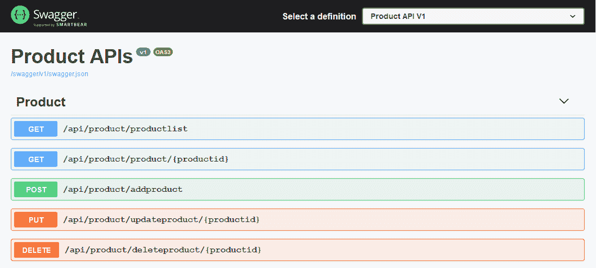

前面的截图显示了产品应用编程接口资源，您可以在 Swagger 文档页面中尝试这些应用编程接口。

最后，我们完成了整体的过渡.NET 应用到微服务中，我们讨论了`ProductService`的逐步过渡。这个应用还有更多步骤:

*   **微服务如何通信**:这将在[第三章](02.html)*服务之间的有效通信中讨论。* 
*   **如何测试微服务**:这将在[第 4 章](02.html)、*用微软单元测试框架测试微服务中讨论。*
*   **部署微服务**:这将在[第 5 章](02.html)、*使用 Docker* 部署微服务中讨论。

*   **我们如何确保我们的微服务是安全的，以及我们如何监控我们的微服务**:这将在[第 6 章](02.html)、*使用 Azure 活动目录*和[第 7 章](02.html)、*监控微服务中讨论。*
*   **如何扩展微服务**:这将在[第 8 章](02.html)、*用 Azure 扩展微服务中讨论。* 

在斯瓦格的帮助下，我们展示了我们产品服务的全部应用编程接口，并讨论了应用编程接口文档。

这整个部分为我们提供了一个完整的工作产品应用编程接口，从它的基础到文档。有了这些，我们重新审视了我们想象中的应用的整体。我们已经看到了我们的应用如何与数据库交互，以及我们的用户界面如何提供各种值。在这一部分，我们还创建了我们的产品服务。同样，我们现在可以创建其他所需的服务。为了使我们的代码更简单，我们以产品服务为例，并在本书中对此进行了详细阐述。

# 摘要

在本章中，我们从高层次讨论了可用于识别和隔离微服务的不同因素。我们还讨论了好服务的各种特征。谈到 DDD，我们了解到它在微服务领域的重要性。

此外，我们详细分析了如何通过各种参数正确实现微服务的垂直隔离。我们借鉴了之前对单片应用及其解决方案在微服务中带来的挑战的理解，并了解到我们可以利用模块相互依赖性、技术利用率和团队结构等因素来识别接缝，并以有组织的方式执行从单片架构到微服务的过渡。

很明显，在这个过程中，数据库会带来明显的挑战。然而，我们通过使用一个简单的策略，确定了我们仍然可以如何执行这个过程，并且我们讨论了可能的方法来做到这一点。然后我们确定，随着外键的减少/移除，事务可以以完全不同的方式处理。

从单块到有限上下文，我们进一步应用我们的知识将 FlixOne 应用转变为微服务架构。

在下一章中，我们将通过涵盖集成模式和 Azure 服务结构来讨论服务之间的通信。

# 问题

1.  重构一个整体应用时，我们应该考虑哪些因素？
2.  C# 8.0 的默认接口方法有哪些？
3.  我们为什么要用斯瓦格？

# 进一步阅读

*   *Hands-* *关于使用 C#的微服务，*作者:Matt R. Cole，来自 Packt Publishing，可访问:[https://www . Packt pub . com/in/application-development/Hands-微服务-c](https://www.packtpub.com/in/application-development/hands-microservices-c)
*   *动手微服务-监控和测试*作者:Dinesh Rajput，来自 Packt Publishing，可在*:*[https://www . packtpub . com/in/application-development/动手微服务-监控和测试](https://www.packtpub.com/in/application-development/hands-on-microservices-monitoring-and-testing)获得