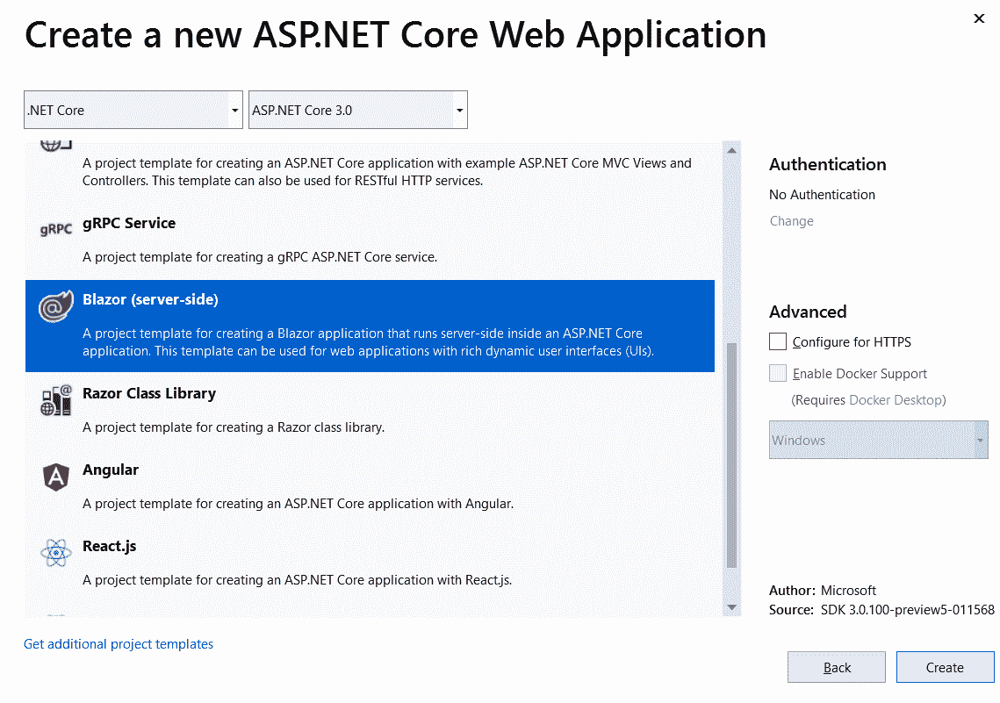
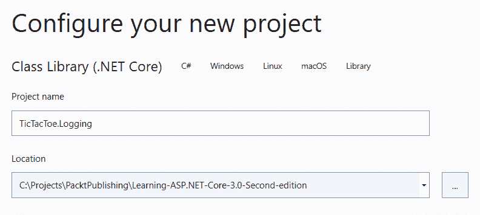
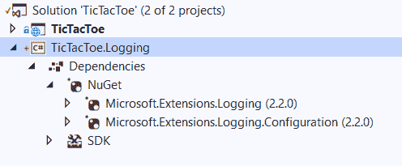
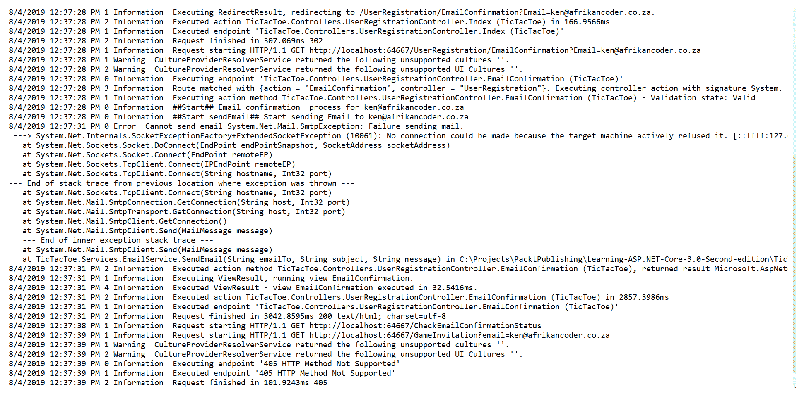

# 六、Razor 组件和 SignalR 简介

到目前为止，我们已经看到了 ASP.NET Core 3 中引入的许多更改，这些更改与以前版本的框架相比，包括.NET Core 的早期版本。在前面的章节中，我们已经通过使用我们的演示应用提到了这些，但现在是时候介绍一下 ASP.NET Core 3：服务器端 Blazor，以前称为**Razor 组件**的重要介绍内容了。

在[第 5 章](05.html)*ASP.NET Core 3 的基本概念：第 2 部分*的一节中，我们探讨了使用 JavaScript 进行客户端开发。对于许多习惯于使用 Microsoft 技术堆栈带来的强类型和其他语法优势的开发人员来说，Blazor 起到了解救作用。Blazor 是 JavaScript 的替代品。

Blazor 与.NET Core 集成为服务器端 Blazor，与 WebAssembly 集成为客户端 Blazor，使直接在浏览器上运行 C#并完全取代 JavaScript 成为可能。

**WebAssembly** (abbreviated to **Wasm**), as defined on its official page, [https://webassembly.org/](https://webassembly.org/), is a binary instruction format for a stack-based virtual machine. Wasm is designed as a portable target for the compilation of high-level languages such as C/C++/Rust (and, in our case, C#), enabling deployment on the web for client and server applications.

客户端 Blazor 只在客户端工作。目前，在预览版中，它有望与更高版本的 ASP.NET Core 一起发布。

服务器端 Blazor 在这一点上依赖于现有的技术，Signal。一个简短的介绍是值得的，我们将在后面的章节中适当地介绍您需要了解的内容。

您将学习如何构建一个简单的 Blazor 应用，以及它与普通 ASP.NET Core 3 的区别。您将了解构成基本 Blazor 页面的组件。我们通过解释日志记录和遥测来完成本章，以帮助在生产环境中进行调试。您将了解在记录应用的重要信息时使用的不同选项，以及如何配置应用以使用文件记录器进行记录。

您将学习如何配置您的应用，以便可以在不同的托管环境中运行它，无论是在开发、暂存还是生产环境中。

本章将介绍以下主题：

*   使用 C#Razor 组件进行客户端开发
*   与信号员合作
*   使用测井和遥测进行监测和监督
*   一次构建并在多个环境中运行

# 使用 C#Razor 组件进行客户端开发

为了在.NET Core 框架上提供真正的完整堆栈体验，微软一直在尝试使用 C#Razor 组件进行客户端开发；在撰写本文时，这被称为服务器端 Blazor。将来有计划发布直接在 WebAssembly 上运行的客户端 Blazor，但这超出了本书的范围。

微软最初为 ASP.NETCore3 发布了一个 C#Razor 组件模板，但现在已经改名为 Blazor（服务器端）模板。

Note that C# Razor and Blazor (server-side) components are essentially the same. Agreement was reached on using the name *server-side Blazor*, influenced by the long-running previously experimental Blazor project: [https://dotnet.microsoft.com/apps/aspnet/web-apps/client](https://dotnet.microsoft.com/apps/aspnet/web-apps/client)

*服务器端 Blazor*的名称可能会产生误导，因为 Blazor 主要是为了通过动态丰富的用户界面增强客户端开发。

让我们从 Tic Tac Toe 演示应用中休息一下，使用服务器端 BLAZOR 模板创建一个简单的 Web 应用。首先使用 ASP.NET Core 应用框架，然后使用 Blazor 模板创建一个新项目，如下所示：



创建 web 应用时，您会立即注意到它的项目结构通常类似于任何 ASP.NET Core 模板，具有以下`Startup`和`Program`类：


您将立即注意到的一个区别是新的`.razor`文件扩展名，用于标识任何 Razor 组件，例如`App.razor`，如前面的屏幕截图所示。我们将`AddServerSideBlazor()`方法调用到服务集合中的另一个差异是在`ConfigureServices`方法中的`Startup`类中发现的：

```cs
public void ConfigureServices(IServiceCollection services)
{
    ...
    services.AddServerSideBlazor();
    ...
}
```

在前面的代码块中，我们可以看到服务器端 Blazor 被添加为服务，接下来在`Configure`方法中，Blazor 的端点被配置，主要是为了通过`MapBlazorHub()`方法接受交互组件的传入连接：

```cs
            app.UseEndpoints(endpoints =>
            {
                endpoints.MapBlazorHub();
                endpoints.MapFallbackToPage("/_Host");
            });
```

按原样运行应用而不做任何更改，您应该能够在浏览器中看到以下内容：


主页显示 Hello，world！文本，它是在`Index.razor`组件中定义的，同样，我们还有`Counter.razor`和`FetchData.razor`组件，它们确定单击相应选项卡时显示的内容。

作为整个应用的共享组件，我们有`MainLayout.razor`，负责应用的布局，`NavMenu.razor`在左侧定义导航项。

在此示例模板中，`Counter`组件自行执行其所有功能，但`FetchData`组件依赖外部 C#service 类为其提供所需的数据。

如果您仔细查看计数器功能，大多数开发人员都希望使用 JavaScript，但您会注意到，`Counter`组件中没有 JavaScript。仔细查看 Razor 组件，您将发现没有 JavaScript 或任何对它的引用！事实上，在`wwwroot`部分，对于任何传统的 ASP.NET Core 模板，都会有一个`js`文件夹，这是我们`BlazorDemo`中明显的遗漏！这一切都是有意的；如果您像许多后端 C#开发人员一样不太擅长使用 JavaScript，Blazor 将让您如释重负！

Blazor 的设计方式是，作为开发人员，您将能够在客户端使用 C#**而不是 JavaScript 的**。必须注意的是，Blazor 还可以与 JavaScript 并行工作。

现在，让我们看一下以下代码块：

```cs
@page "/counter"

<h1>Counter</h1>

<p>Current count: @currentCount</p>

<button class="btn btn-primary" onclick="@IncrementCount">Click me</button>

@functions {
    int currentCount = 0;

    void IncrementCount()
    {
        currentCount++;
    }
}
```

前面的代码片段表示 Blazor 应用中的基本页面组件。这一切都从路由开始，在路由中，页面的确切 URL 在`@page`指令之后指定。在前面的示例中，您可以通过向 URL 添加`/counter`来访问此页面，并将能够访问此特定页面。

在我们给`body`一些内容之前，就在`@page`指令下，如果您需要访问应用的另一部分，您可以有`@using`指令，例如`@using BlazorDemo.Data`。

您还可以使用 DI，如果需要，可以在页面中注入`@inject WeatherForecastService ForecastService`之类的服务。

最后，我们有`@functions`部分，您可以根据需要添加任意多的 C#函数，这通常是您放置 JavaScript 函数的地方。

服务器端 Blazor 之所以如此命名，是因为为了让前面的所有代码正常工作，它实际上是在服务器上执行的。它使用什么通信通道来确保实时渲染？我们将在下一节回答这个问题：

# 与信号员合作

SignalR 是一种为服务器端 Blazor 提供实时功能的技术。但首先，让我们试着了解这项技术到底是什么，以及所有东西是如何结合在一起的。

# 什么是信号员

SignalR 在引入 ASP.NET Core 框架系列版本之前就已经存在，它只是被设计为一个库，以满足服务器与其客户端之间的实时通信。

它利用并改进了 WebSockets 技术的使用，我们在上一章中已经介绍过。如果您阅读**万维网**（**WWW**），您会注意到，Signal 的大多数示例都解释了它在实时聊天应用上的用法，这是正确的，但也有很多应用场合可以使用它，包括仪表板、实时股票交易应用等。

SignalR 作为一种技术一直在发展和成熟，因此它与 Blazor 或 Razor 组件一起工作，后者的客户端特性依赖于与服务器的强大通信。我们将在下一节中解释这项技术如何为服务器端 Blazor 提供动力。

# 带有服务器端 Blazor 或 Razor 组件的 SignalR

我们已经简要介绍了服务器端 Blazor，但我们需要始终牢记的一点是，服务器端 Blazor 使用 SignalR 将内容从服务器端即时推送到客户端。SignalR 是一个库，用于处理 web 应用中需要实时、客户端和服务器交互的情况，使用**集线器**。

对于聊天应用，signar 的使用已经有很好的文档记录，但是关于何时使用 signar 的一个简单指南是查看需要从服务器进行大量更新的场景。在服务器端 Blazor 的情况下，客户端和服务器之间有很多更新，所有更新都是通过 Signal 进行的。下图说明了这一点：


对于这本涉及 ASP.NET Core 3 的书来说，只需了解围绕 Signal 使用的生态系统就足够了。您将遇到的大多数 signar 实现实际上都是在后台工作的（如服务器端 Blazor），是从您那里抽象出来的，因此我们将不深入研究如何使用它。

# 使用测井和遥测进行监测和监督

在开发应用时，您将使用一种著名的集成开发环境，如 Visual Studio 2019 或 Visual Studio 代码，如本书最初几章所述。你每天都这样做，你做的大部分事情都会变成第二天性，一段时间后你会自动完成它们。

例如，通过使用 Visual Studio 2019 的高级调试功能，您自然能够调试应用并了解运行时发生的事情。查找变量值、查看以何种顺序调用哪些方法、了解注入了哪些实例以及捕获异常，这些都是构建健壮且响应业务需求的应用的关键。

然后，在将应用部署到生产环境时，您突然错过了所有这些功能。您很少会发现安装了 VisualStudio 的生产环境，但会发生错误和意外行为，您需要能够尽快理解和修复它们。

这就是日志记录和遥测技术发挥作用的地方。通过在输入和离开方法中检测应用和日志记录，以及重要的变量值或在运行时认为重要的任何类型的信息，您将能够在应用日志中查看在发生问题时在生产环境中发生的情况。

在本节中，我们将回到我们的 Tic-Tac-Toe 演示应用，在这里我们将向您展示如何使用日志记录和异常处理来提供一个工业化的解决方案，以解决我们只在生产中遇到异常的问题，而没有更精细的细节来帮助您调试问题。

ASP.NET Core 3 为登录到以下目标提供内置支持：

*   Azure 应用服务
*   安慰
*   Windows 事件源
*   查出
*   调试器输出
*   应用见解

但是，默认情况下不支持文件、数据库和日志记录服务。如果要将日志发送到这些目标，则需要使用第三方记录器解决方案，如 Log4net、Serilog、NLog、Apache、ELMAH 或 Loggr。

您还可以通过实现`ILoggerProvider`接口轻松创建自己的提供者，如下所示：

1.  向解决方案中添加一个新的类库（.NET Core）项目，并将其命名为`TicTacToe.Logging`（删除自动生成的`Class1.cs`文件）：



2.  通过 NuGet 软件包管理器添加`Microsoft.Extensions.Logging`和`Microsoft.Extensions.Logging.Configuration`NuGet 软件包：



3.  添加来自`TicTacToe`web 应用项目的项目引用，以便我们可以使用`TicTacToe.Logging`类库中的资产：


4.  将名为`LogEntry`的新**POCO**（简称**普通旧 CLR 对象**）类添加到 TicTacToe.Logging 项目中。这将包含日志数据、事件`id`、实际日志的消息、日志级别、级别（信息、警告或关键），以及创建日志时的时间戳：

```cs
        public class LogEntry 
        { 
          public int EventId { get; internal set; } 
          public string Message { get; internal set; } 
          public string LogLevel { get; internal set; } 
          public DateTime CreatedTime { get; internal set; } 
        } 
```

5.  添加一个名为`FileLoggerHelper`的新类，该类将用于文件操作。然后我们添加字段定义和构造函数。构造函数确保每次实例化`FileLoggerHelper`时，都会强制接受文件名，并使其可用于`InsertLog`等内部方法，如下所示：

```cs
        public  class FileLoggerHelper 
        { 
          private string fileName; 

          public FileLoggerHelper(string fileName) 
          { 
            this.fileName = fileName; 
          } 

          static ReaderWriterLock locker = new ReaderWriterLock(); 

          //....
          } 

        }
```

然后，让我们向`FileLoggerHelper`类添加一个`InsertLog`方法。如果文件目录不存在，该方法将创建一个文件目录，在获取锁后将事件记录到文件中，然后在使用后释放它们。`InsertLog`的实施方式如下：

```cs
public void InsertLog(LogEntry logEntry) 
{ 
  var directory = System.IO.Path.GetDirectoryName(fileName); 

  if (!System.IO.Directory.Exists(directory)) 
     System.IO.Directory.CreateDirectory(directory); 

  try 
  {   
    locker.AcquireWriterLock(int.MaxValue); 
    System.IO.File.AppendAllText(fileName,
    $"{logEntry.CreatedTime} {logEntry.EventId} {logEntry.LogLevel} 
  {
    logEntry.Message}" + Environment.NewLine); 
  } 
  finally 
  { 
    locker.ReleaseWriterLock(); 
  } 
```

添加一个名为`FileLogger`的新类并实现`ILogger`接口。file logger concrete 类将允许我们使用 Microsoft 在.NET Core framework 中提供的`ILogger`接口模板中提供的日志功能：

```cs
public sealed class FileLogger : ILogger
{
 public IDisposable BeginScope<TState>(TState state)
 {
   return null;
 }
 public bool IsEnabled(LogLevel logLevel)
 {
   return (_filter == null || _filter(_categoryName, logLevel));
 }
 public void Log<TState>(LogLevel logLevel, EventId eventId,
 TState state, Exception exception,             Func<TState, Exception, string> formatter)
 {
     throw new NotImplementedException();
 }
}
```

在实现`Log`方法之前，让我们先创建构造函数和字段定义。我们确保提供了类别名称、日志级别和文件名，并创建了一个新的`FileLoggerHelper`实例，如下所示：

```cs
          private string _categoryName; 
          private Func<string, LogLevel, bool> _filter; 
          private string _fileName; 
          private FileLoggerHelper _helper; 

          public FileLogger(string categoryName, Func<string, 
            LogLevel,
           bool> filter, string fileName) 
          { 
            _categoryName = categoryName; 
            _filter = filter; 
            _fileName = fileName; 
            _helper = new FileLoggerHelper(fileName); 
          }
```

然后是我们的主要`Log`方法，现在实现如下：

```cs
public void Log<TState>(LogLevel logLevel, EventId eventId, TState state, Exception exception,     Func<TState, Exception, string> formatter) 
{
   if (!IsEnabled(logLevel)) return; 
   if (formatter == null) throw new 
     ArgumentNullException(nameof(formatter));          
   var message = formatter(state, exception);
   if (string.IsNullOrEmpty(message)) return;         
   if (exception != null) message += "\n" + exception.ToString();           
   var logEntry = new LogEntry
   {
      Message = message,
      EventId = eventId.Id,
      LogLevel = logLevel.ToString(),
      CreatedTime = DateTime.UtcNow
   };
   _helper.InsertLog(logEntry);
} 
```

6.  添加一个名为`FileLoggerProvider`的新类并实现`ILoggerProvider`接口。用于在 ASP.NET Core 需要时提供`ILogger`的`FileLogger`实例，稍后注入：

```cs
        public class FileLoggerProvider : ILoggerProvider 
        { 
          private readonly Func<string, LogLevel, bool> _filter; 
          private string _fileName; 

          public FileLoggerProvider(Func<string, LogLevel, bool> 
            filter, string fileName) 
          { 
            _filter = filter; 
            _fileName = fileName; 
          } 

          public ILogger CreateLogger(string categoryName) 
          { 
            return new FileLogger(categoryName, _filter, _fileName); 
          } 

          public void Dispose()   { } 
        }
```

7.  为了简化从 web 应用调用**文件日志提供程序**，我们需要添加一个名为`FileLoggerExtensions`的静态类（配置部分、文件名和日志详细程度作为参数）：

```cs
        public static class FileLoggerExtensions 
        { 
          const long DefaultFileSizeLimitBytes = 1024 * 1024 *
           1024; 
          const int DefaultRetainedFileCountLimit = 31;          
        } 
```

我们的`FileLoggerExtensions`类在`AddFile`方法上有三种不同的重载。现在，让我们添加`AddFile`方法的第一个实现：

```cs
public static ILoggingBuilder AddFile(this ILoggingBuilder loggerBuilder, IConfigurationSection configuration)
{
  if (loggerBuilder == null) throw new 
    ArgumentNullException(nameof(loggerBuilder))
  if (configuration == null) throw new 
    ArgumentNullException(nameof(configuration));
  var minimumLevel = LogLevel.Information;
  var levelSection = configuration["Logging:LogLevel"];
  if (!string.IsNullOrWhiteSpace(levelSection))
  {
   if (!Enum.TryParse(levelSection, out minimumLevel))
   {
   System.Diagnostics.Debug.WriteLine("The minimum level setting
     `{0}` is invalid", levelSection); 
   minimumLevel = LogLevel.Information;
   }
  }
  return loggerBuilder.AddFile(configuration[
      "Logging:FilePath"], (category, logLevel) =>  (logLevel >= 
        minimumLevel), minimumLevel);
 }
```

然后是`AddFile`方法的第二个过载：

```cs
public static ILoggingBuilder AddFile(this ILoggingBuilder
         loggerBuilder, string filePath, Func<string, LogLevel,
         bool> filter, LogLevel minimumLevel =
          LogLevel.Information)
        {
            if (String.IsNullOrEmpty(filePath)) throw
             new ArgumentNullException(nameof(filePath));

            var fileInfo = new System.IO.FileInfo(filePath);

            if (!fileInfo.Directory.Exists)
                fileInfo.Directory.Create();

            loggerBuilder.AddProvider(new FileLoggerProvider
             (filter, filePath));

            return loggerBuilder;
        }
```

然后，`AddFile`方法有第三个重载实现：

```cs
public static ILoggingBuilder AddFile(this ILoggingBuilder
         loggerBuilder, string filePath,  LogLevel minimumLevel = 
          LogLevel.Information)
        {
            if (String.IsNullOrEmpty(filePath)) throw
             new ArgumentNullException(nameof(filePath));

            var fileInfo = new System.IO.FileInfo(filePath);

            if (!fileInfo.Directory.Exists)
                fileInfo.Directory.Create();

            loggerBuilder.AddProvider(new FileLoggerProvider
            ((category,
             logLevel) => (logLevel >= minimumLevel), filePath));

            return loggerBuilder;
        }
```

8.  在`TicTacToe`web 项目中，向`Options`文件夹中添加两个名为`LoggingProviderOption`和`LoggingOptions`的新选项：

```cs
        public class LoggingProviderOption 
        { 
          public string Name { get; set; } 
          public string Parameters { get; set; } 
          public int LogLevel { get; set; } 
        } 
        public class LoggingOptions 
        { 
          public LoggingProviderOption[] Providers { get; set; } 
        }
```

9.  在`TicTacToe`web 项目中，将名为`ConfigureLoggingExtension`的新扩展添加到`Extensions`文件夹中：

```cs
        public static class ConfigureLoggingExtension 
        { 
          public static ILoggingBuilder AddLoggingConfiguration(this 
           ILoggingBuilder loggingBuilder, IConfiguration 
            configuration) 
          { 
            var loggingOptions = new LoggingOptions(); 
            configuration.GetSection("Logging").
             Bind(loggingOptions); 

            foreach (var provider in loggingOptions.Providers) 
            { 
              switch (provider.Name.ToLower()) 
              { 
                case "console": {  loggingBuilder.AddConsole();  
                break;   
              } 
                case "file": { 
                  string filePath = System.IO.Path.Combine(
                    System.IO.Directory.GetCurrentDirectory(), 
                     "logs",
                     $"TicTacToe_{System.DateTime.Now.ToString( 
                        "ddMMyyHHmm")}.log"); 
                  loggingBuilder.AddFile(filePath, 
                    (LogLevel)provider.LogLevel); 
                  break; 
                } 
                default:  {  break;   } 
              } 
            }  
            return loggingBuilder; 
          } 
        }
```

10.  进入`TicTacToe`web 应用项目的`Program`类，更新`BuildWebHost`方法，调用扩展：

```cs
        public static IHostBuilder CreateHostBuilder(string[] args) 
          =>
            Host.CreateDefaultBuilder(args)
                .ConfigureWebHostDefaults(webBuilder =>
                {
                    webBuilder.UseStartup<Startup>();
                    webBuilder.CaptureStartupErrors(true);
                    webBuilder.PreferHostingUrls(true);
                    webBuilder.UseUrls("http://localhost:5000");
                    webBuilder.ConfigureLogging((hostingcontext, 
                     logging) =>
                    {
                        logging.AddLoggingConfiguration(
                         hostingcontext.Configuration);
                    });
                });
```

Don't forget to add the following `using` statement at the beginning of the class:
`using TicTacToe.Extensions;`.

11.  在`appsettings.json`文件中添加一个名为`Logging`的新节：

```cs
        "Logging": { 
          "Providers": [ 
            { 
              "Name": "Console", 
              "LogLevel": "1" 
            }, 
            { 
              "Name": "File", 
              "LogLevel": "2" 
            } 
          ], 
          "MinimumLevel": 1 
        }
```

12.  启动应用并验证是否已在应用文件夹中名为`logs`的文件夹中创建了新的日志文件：


这是第一步，简单易懂，很快就能完成。现在您有了一个日志文件，可以将日志写入其中。您将看到，使用集成的日志功能从 ASP.NET Core 3 应用中的任何位置创建日志（包括`Controllers`、`Services`等）都同样容易。

让我们快速向 Tic-Tac-Toe 应用添加一些日志：

1.  更新`UserRegistrationController`构造函数实现，以便我们为整个控制器提供一个记录器实例：

```cs
       readonly IUserService _userService; 
       readonly IEmailService _emailService; 
       readonly ILogger<UserRegistrationController> _logger; 
       public UserRegistrationController(IUserService userService,
        IEmailService emailService, 
         ILogger<UserRegistrationController>
        logger) 
       { 
         _userService = userService; 
         _emailService = emailService; 
         _logger = logger; 
       } 
```

2.  更新`UserRegistrationController`中的`EmailConfirmation`方法，并在方法开始处添加日志：

```cs
        _logger.LogInformation($"##Start## Email confirmation 
            process for {email}");
```

3.  更新`EmailService`实现，并将记录器添加到其构造函数中，以使其可用于电子邮件服务：

```cs
public class EmailService : IEmailService 
        { 
          private EmailServiceOptions _emailServiceOptions; 
          readonly ILogger<EmailService> _logger; 
          public EmailService(IOptions<EmailServiceOptions>
           emailServiceOptions, ILogger<EmailService> logger) 
          { 
            _emailServiceOptions = emailServiceOptions.Value; 
            _logger = logger; 
          } 
 }
```

然后将`EmailService`中的`SendMail`方法替换为：

```cs

          public Task SendEmail(string emailTo, string subject,  
            string message) 
          { 
            try 
            { 
              _logger.LogInformation($"##Start sendEmail## Start 
                sending Email to {emailTo}"); 

              using (var client =  new 
                SmtpClient(_emailServiceOptions.MailServer,
                int.Parse(_emailServiceOptions.MailPort))) 
              { 
                if (bool.Parse(_emailServiceOptions.UseSSL)
                 == true) 
                 client.EnableSsl = true; 

                if (!string.IsNullOrEmpty
                (_emailServiceOptions.UserId)) 
                    client.Credentials =  new NetworkCredential
                     (_emailServiceOptions.UserId,
                     _emailServiceOptions.Password); 

                  client.Send(new MailMessage
                ("ken@afrikancoder.co.za", emailTo, subject, 
                 message)); 
              } 
            } 
            catch (Exception ex) { _logger.LogError($"Cannot
             send email {ex}");  } 

            return Task.CompletedTask; 
          } 

```

4.  然后，在运行应用并注册新用户后，打开生成的日志文件并分析其内容：



您会注意到，电子邮件确认过程的开始和发送电子邮件的开始都已正式记录在日志中。发送电子邮件本身的失败也被记录为异常及其堆栈跟踪。

# 一次构建并在多个环境中运行

在构建应用之后，您必须考虑将它们部署到不同的环境中。正如您在前面关于配置的部分中所看到的，您可以使用配置文件来更改服务甚至应用的配置。

在多个环境的情况下，您必须为每个环境复制`appsettings.json`文件，并相应地将其命名为：`appsettings.{EnvironmentName}.json`。

ASP.NET Core 3 将按照分层顺序自动检索配置设置，首先从公共`appsettings.json`文件，然后从相应的`appsettings.{EnvironmentName}.json`文件，同时在必要时添加或替换值。

然而，开发基于不同部署环境和配置使用不同组件的条件代码一开始似乎很复杂。在传统的应用中，您必须创建大量代码来自行处理所有不同的操作，然后对其进行维护。

在 ASP.NET Core 3 中，您可以使用大量的内部功能来实现此目标。然后，您可以简单地使用环境变量（开发、登台、生产等）来指示特定的运行时环境，从而为该环境配置应用。

正如您将在本节中看到的，您可以使用特定的方法名甚至类名来使用 ASP.NET Core 3 现成提供的现有注入和重写机制来配置应用。

在下面的示例中，我们将向应用添加特定于环境的组件（SendGrid），只有当应用部署到特定的生产环境（Azure）时，才需要使用该组件：

1.  将 Sendgrid NuGet 包添加到项目中。这将用于 Tic Tac Toe 应用的未来 Azure 生产部署：


2.  在`Services`文件夹中添加名为`SendGridEmailService`的新服务。这将用于通过`SendGrid`发送电子邮件。让它继承`IEmailService`接口并实现具体的`SendEmail`方法。首先，建造商：

```cs
        public class SendGridEmailService : IEmailService 
        { 
          private EmailServiceOptions _emailServiceOptions; 
          private ILogger<EmailService> _logger; 
          public SendGridEmailService(IOptions<EmailServiceOptions>
           emailServiceOptions, ILogger<EmailService> logger) 
          { 
            _emailServiceOptions = emailServiceOptions.Value; 
            _logger = logger; 
          } 
         //....
        }
```

3.  然后在同一`SendGridEmailService`类中添加`SendMail`方法：

```cs
public Task SendEmail(string emailTo, string subject, string 
  message) 
{ 
  _logger.LogInformation($"##Start## Sending email via 
             SendGrid to :{emailTo} subject:{subject} message:
              {message}"); 
  var client = new SendGrid.SendGridClient(_emailServiceOptions.
    RemoteServerAPI); 
  var sendGridMessage = new SendGrid.Helpers.Mail.SendGridMessage 
  { 
    From = new SendGrid.Helpers.Mail.EmailAddress( 
     _emailServiceOptions.UserId) 
  }; 
  sendGridMessage.AddTo(emailTo); 
  sendGridMessage.Subject = subject; 
  sendGridMessage.HtmlContent = message; 
  client.SendEmailAsync(sendGridMessage); 
  return Task.CompletedTask; 
} 
```

4.  添加新的扩展方法，以便更轻松地为特定环境声明特定的电子邮件服务。为此，请转到`Extensions`文件夹并添加一个新的`EmailServiceExtension`类：

```cs
        public static class EmailServiceExtension 
        { 
          public static IServiceCollection AddEmailService(
            this IServiceCollection services, IHostingEnvironment
             hostingEnvironment, IConfiguration configuration) 
          { 
            services.Configure<EmailServiceOptions>
             (configuration.GetSection("Email")); 
            if (hostingEnvironment.IsDevelopment() || 
                hostingEnvironment.IsStaging()) 
            { 
              services.AddSingleton<IEmailService, EmailService>(); 
            } 
            else 
            { 
              services.AddSingleton<IEmailService, 
                SendGridEmailService>(); 
            } 
            return services; 
          } 
        } 
```

5.  更新`Startup`类以使用创建的资产。为了更好的可读性和可维护性，我们将更进一步，为我们必须支持的每个环境创建一个专用的`ConfigureServices`方法，删除现有的`ConfigureServices`方法，并添加以下特定于环境的`ConfigureServices`方法。首先，我们配置定义和构造函数：

```cs
public IConfiguration _configuration { get; }
        public IHostingEnvironment _hostingEnvironment { get; }
        public Startup(IConfiguration configuration,
         IHostingEnvironment hostingEnvironment)
        {
          _configuration = configuration;
          _hostingEnvironment = hostingEnvironment;
        }
```

其次，我们配置公共服务：

```cs
public void ConfigureCommonServices(IServiceCollection services) 
{ 
  services.AddLocalization(options => options.ResourcesPath = 
   "Localization"); 
  services.AddMvc().AddViewLocalization(
    LanguageViewLocationExpanderFormat.Suffix, options =>  
            options.ResourcesPath =  "Localization").AddDataAnnotationsLocalization(); 
  services.AddSingleton<IUserService, UserService>(); 
  services.AddSingleton<IGameInvitationService, 
  GameInvitationService>(); 
  services.Configure<EmailServiceOptions>
   (_configuration.GetSection("Email")); 
  services.AddEmailService(_hostingEnvironment, _configuration); 
  services.AddRouting(); 
  services.AddSession(o => 
  { 
     o.IdleTimeout = TimeSpan.FromMinutes(30); 
  });             
 } 
```

最后，我们配置了一些特定的服务：

```cs

        public void ConfigureDevelopmentServices(
         IServiceCollection services) 
        { 
          ConfigureCommonServices(services);             
        } 

        public void ConfigureStagingServices(
         IServiceCollection services) 
        { 
          ConfigureCommonServices(services); 
        } 

        public void ConfigureProductionServices(
         IServiceCollection services) 
        { 
          ConfigureCommonServices(services); 
        } 
```

Note that you could also apply the same approach to the `Configure` method in the `Startup` class. For that, you just remove the existing `Configure` method and add new methods for the environments you would like to support, such as `ConfigureDevelopment`, `ConfigureStaging`, and `ConfigureProduction`. The best practice would be to combine all common code into a `ConfigureCommon` method and call it from the other methods, as shown here for specific `ConfigureServices` methods.

6.  按*F5*启动应用，并确认所有程序仍在正确运行。您应该看到添加的方法将自动使用，并且应用功能齐全。

那很简单，很直接！没有特定的环境条件代码，没有复杂的进化和维护；只是非常清晰和容易理解的方法，其中包含了开发它们的环境名称。这是一个非常干净的解决方案，可以解决一次构建并在多个环境中运行的问题。

但这还不是全部！如果我们告诉你，你不需要一节`Startup`课怎么办？如果您可以为每个环境提供一个专用的`Startup`类，其中只包含适用于其上下文的代码，该怎么办？那太好了，对吧？这正是 ASP.NETCore3 提供的。

为了能够为每个环境使用专用的`Startup`类，您只需更新`Program`类，它是 ASP.NET Core 3 应用的主要入口点。您可以在`BuildWebHost`方法中更改一行来传递程序集名称`.UseStartup("TicTacToe")`而不是`.UseStartup<Startup>()`，然后您就可以使用这个奇妙的功能：

```cs
    public static IWebHost BuildWebHost(string[] args) => 
      WebHost.CreateDefaultBuilder(args) 
        .CaptureStartupErrors(true) 
        .UseStartup("TicTacToe") 
        .PreferHostingUrls(true) 
        .UseUrls("http://localhost:5000") 
        .UseApplicationInsights() 
        .Build(); 
      } 
    }
```

现在，您可以为不同的环境添加专用的`Startup`类，如`StartupDevelopment`、`StartupStaging`和`StartupProduction`。与之前的方法一样，它们将自动使用；在你这方面不需要做任何其他事情。只需更新`Program`类，实现特定于环境的`Startup`类，就可以了。ASP.NET Core 3 提供了这些有用的功能，使我们的生活变得更加轻松。

# 总结

在本章中，我们介绍了服务器端 Blazor，它在各个方面都值得一本书，如果您想熟练使用 ASP.NET Core 中的新添加内容，我们鼓励您查找有关 Blazor 的额外阅读材料。我们研究了如何使用服务器端 Blazor 创建基本应用，以及每个 Blazor 应用最重要的组件。

然后，我们介绍了 signar 作为使服务器端 Blazor 工作的底层技术之一，并且再次建议更高级的读者阅读更多内容。对于大多数开发人员来说，现在只需了解 signar 如何适应 Blazor 生态系统就可以了。

我们研究了遥测和日志技术，以帮助我们在生产中发布应用时解决问题。我们详细了解了如何配置和使用文件日志记录。

最后，我们向您介绍了一个事实，即您可以根据环境更改设置，甚至配置要运行的服务。

从第一章开始，我们已经了解了 ASP.NET Core 3 最重要的构建块的演练和高级视图，现在可以开始更详细的讨论，在下一章中从 ASP.NET Core MVC 开始。