# 十二、托管 ASP.NET Core 3 应用

就这样：本书快结束了，这意味着我们几乎完成了整个应用开发生命周期，因此，客户很快就能使用您的应用了！值得骄傲的是，在阅读并理解了本书倒数第二章之后，您将拥有强大的技能，能够创建和部署自己的具有强大技术基础的令人激动的应用！

让我们回顾一下：从本书开始到现在，您已经了解了如何设置开发环境，如何使用 ASP.NET Core 3 的各种功能开发现代 web 应用，如何通过 Entity Framework Core 将它们连接到数据库，最后，在前两章中，如何保护他们免受恶意网络罪犯的攻击。

现在，我们需要讨论开发周期的最后一步，这包括在应用生产就绪后托管和部署应用。

在我们讨论将应用部署到云中的具体细节之前，我们将首先了解应用的一般托管情况，这两个平台是最常见的：**Amazon Web Services**（**AWS**）和 Microsoft Azure；最后，我们将研究如何使用 Docker 容器来承载我们的应用。

本章的目标是解释托管应用时的不同选项，如何选择正确的选项，以及如何使用最新的技术和云提供商部署 ASP.NET Core 3 web 应用。

在本章中，我们将介绍以下主题：

*   托管应用
*   在 AWS 中部署应用
*   在 Microsoft Azure 中部署应用
*   将应用部署到 Docker 容器中

# 托管应用

您可以构建世界上最好、最有用的应用，但如果您的客户无法轻松地从任何设备访问这些应用，您可能无法获得预期的成功。如下图所示，应用越来越需要全渠道，这意味着客户需要能够在一台设备上启动，然后在另一台设备上继续：

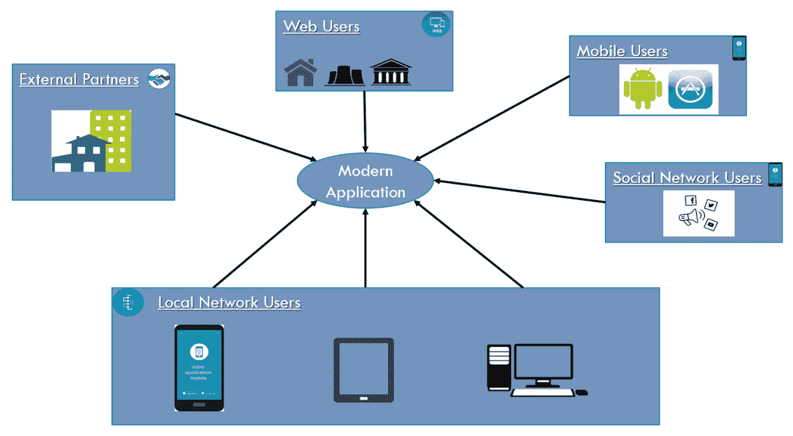

您的应用需要可部署到多个目标，在某些情况下，还需要部署到多个操作系统，以实现高度的灵活性和设备可用性。这就是托管发挥作用的地方。

主机负责应用启动和生存期管理，包括提供和配置服务器以及请求处理。根据您托管 ASP.NET Core 3 应用的方式，您可以为应用支持不同的设备。所选技术对设备和操作系统的可能选择有重大影响。

ASP.NET Core 3 完全支持多种平台和操作系统上的所有当前托管机制。这完全取决于您特定的应用上下文。

ASP.NET Core 应用的一些托管示例如下：

*   通过**互联网信息服务**（**IIS**在 Windows 上托管）
*   Windows 服务中的主机
*   Linux 上的主机，使用 NGINX
*   主机在 Linux 上，使用 Apache

在开发期间，或者如果您不需要与其他人共享您的应用，那么使用自托管机制或 IIS Express 可能会很有趣，它为断开连接、**概念验证**（**PoC**）或测试项目提供了一个快速简便的解决方案。

但是，如果您开始与他人共享应用，则需要更复杂的托管解决方案和相应的服务器技术。

例如，要通过 internet 公开 ASP.NET Core 应用，您需要一个可在本地网络之外访问的 web 服务器。实现这一目标有几种可能的解决方案，以下是其中两种：

*   一种是使用 internet 主机提供商托管 web 服务器。但是，您需要大小，并且需要自己管理服务器，这可能既昂贵又耗时。
*   另一种选择是使用公共云提供商，它提供了更大的灵活性和可扩展性，同时允许降低成本，因为您只需支付所需费用。最著名的是 AWS 和 Microsoft Azure，它们在世界各地都有数据中心。

此外，当使用公共云**平台作为**（**PaaS**提供的服务时，您甚至不必再管理操作系统或平台。云平台为您提供一切。相反，您可以访问云服务，云服务通过高**服务级别协议**（**SLA**提供 web 服务器或数据库服务器功能。两个例子是 AWS Elastic Beanstalk 和 Microsoft Azure 应用服务。

在看到您可以使用的各种托管选项之后，您将能够决定部署目标。对于公开可用的 web 应用，您将希望部署到公共云提供商。下一节将向您展示如何部署到最常见和最著名的公共云提供商，以及如何使用最新的技术来实现这一点。

# 在 AWS 中部署应用

AWS 是 Amazon.com，Inc.的子公司，提供一个公共云计算平台，用于在全球可用的 AWS 数据中心内构建、测试、部署和管理应用和服务。它支持许多不同的编程语言、工具、框架和系统。

在本节中，我们将探讨 AWS，并将了解如何创建帐户并将 ASP.NET Core 3 应用部署到 AWS Elastic Beanstalk。

首先，你必须在 AWS 上注册一个帐户；这只需要五分钟，但你需要一张信用卡。

让我们按照以下步骤完成帐户注册步骤：

1.  打开浏览器，进入[https://aws.amazon.com](https://aws.amazon.com) ，点击创建免费账户按钮，如下图所示：

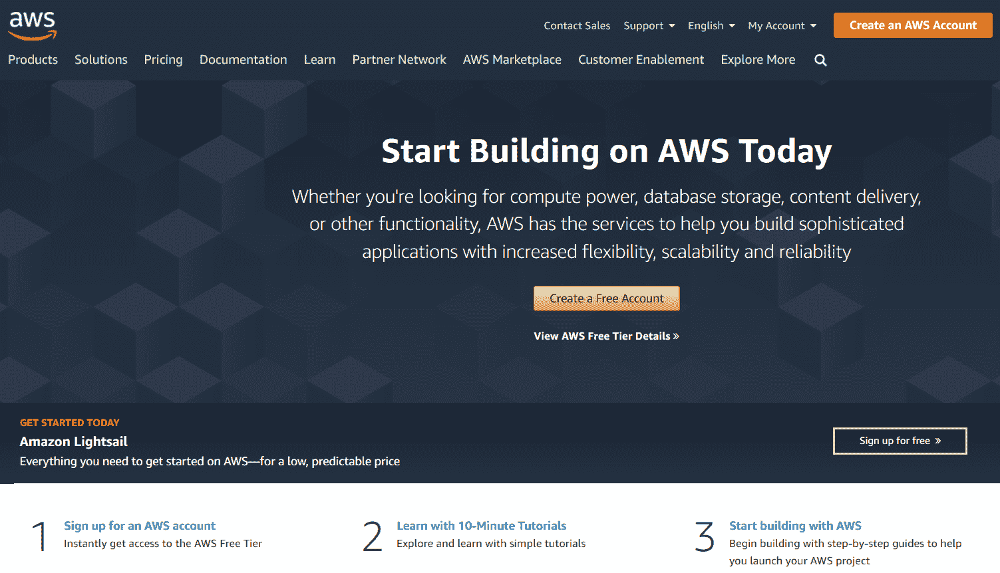

2.  填写“创建新 AWS 帐户”表单，继续填写联系信息，然后单击“继续”，如以下屏幕截图所示：

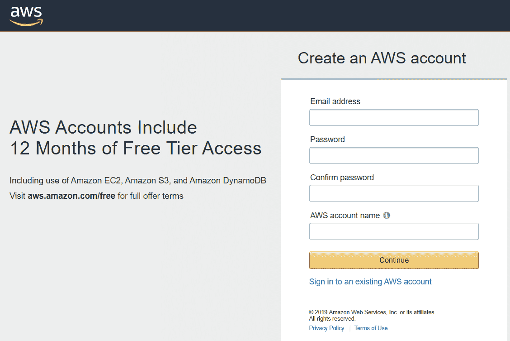

3.  填写付款信息，然后单击“继续”。填写身份信息验证表并单击“继续”，然后选择支持计划并单击“继续”，如以下屏幕截图所示：

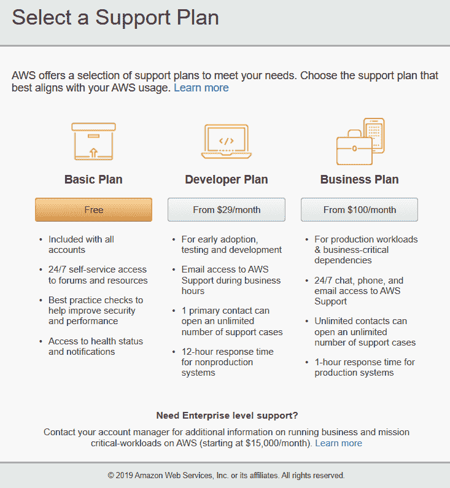

4.  注册完成后，系统会自动将您重定向到欢迎页面，您应在该页面中单击登录控制台按钮，如以下屏幕截图所示：

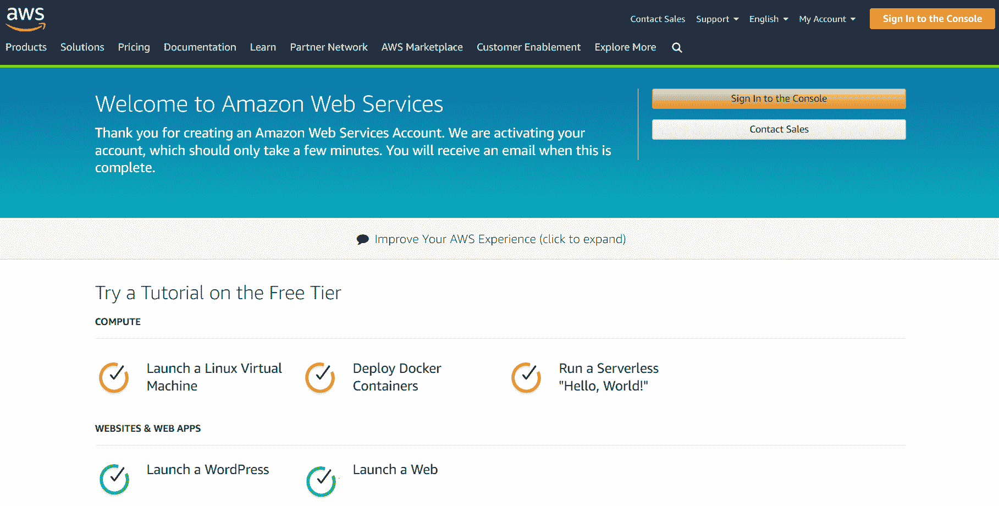

创建新的 AWS 用户帐户后，现在可以在 AWS 中部署第一个 ASP.NET Core 应用。

使用 AWS 时，在部署 ASP.NET Core web 应用方面，您基本上有以下两种选择：

*   弹性豆茎
*   AWS EC2 集装箱服务

下一节将介绍如何在 AWS Elastic Beanstalk 中部署应用。所以，请继续关注，系好安全带，享受旅程！

# 在 AWS Elastic Beanstalk 中部署应用

AWS Elastic Beanstalk 是针对 AWS 中基于 web 的应用的 PaaS 产品，包括自动缩放功能。在这方面，它可以与 Microsoft Azure 应用服务相媲美，您将在本章后面的章节中看到。

AWS Elastic Beanstalk 不再需要管理基础设施，相反，您只需要关注应用的构建和托管。对于完整的 DevOps 方法，如果您想使用 AWS，建议您使用此 PaaS 服务。

For more information on AWS Elastic Beanstalk, check out [https://aws.amazon.com/elasticbeanstalk/](https://aws.amazon.com/elasticbeanstalk/).

以下说明逐步说明如何在 AWS Elastic Beanstalk 中部署 Tic-Tac-Toe 应用。

让我们从创建 AWS Beanstalk 应用开始，如下所示：

1.  登录 AWS，进入 AWS 管理控制台，在 AWS 服务文本框中输入`Beanstalk`，点击显示的链接；您将被重定向到 Beanstalk 欢迎页面，如下所示：

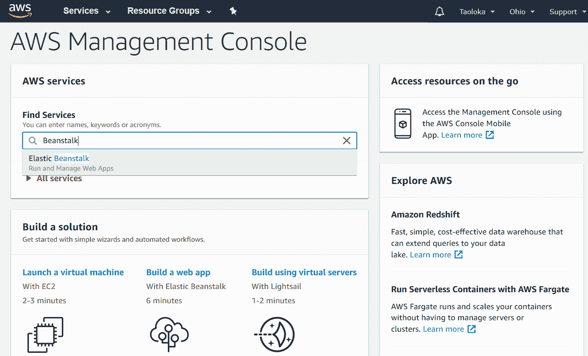

2.  在 Beanstalk 欢迎页面上，单击“开始”按钮，如以下屏幕截图所示：


这将带您进入以下屏幕截图中显示的页面。选择.NET（Windows/IIS）作为平台，然后单击“创建应用”按钮，如下所示：


Note that you can change the IIS version and network settings (Network Load Balancer or single instance) by clicking on the Configure more options link, shown in the preceding screenshot.

3.  等待创建 Beanstalk 应用（取决于您的 internet 连接和 AWS，这可能需要一段时间），如下所示：

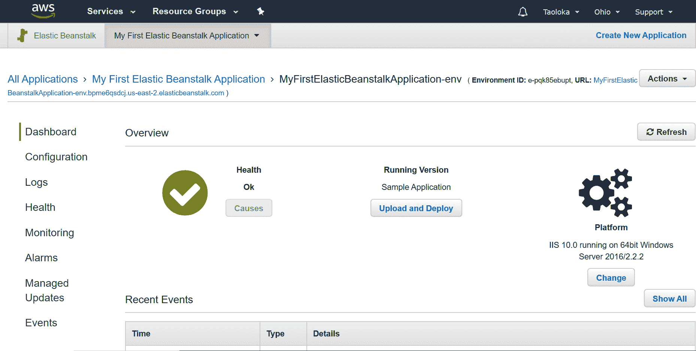

在部署 Tic-Tac-Toe 应用并最终运行它之前，需要在接下来的步骤中准备好技术环境。

正如您在前面几章中所看到的，应用需要一个数据库来持久化用户和应用数据。为此，我们将在 AWS 中提供名为**亚马逊关系数据库服务**（**亚马逊 RDS**）的 SQL Server PaaS 服务，如下例所示：

1.  返回 AWS 管理控制台，单击最近访问的服务部分中的 Elastic Beanstalk，如以下屏幕截图所示：


2.  在 Beanstalk 所有应用页面上，选择所需的环境，然后单击默认环境，您将看到以下结果屏幕：

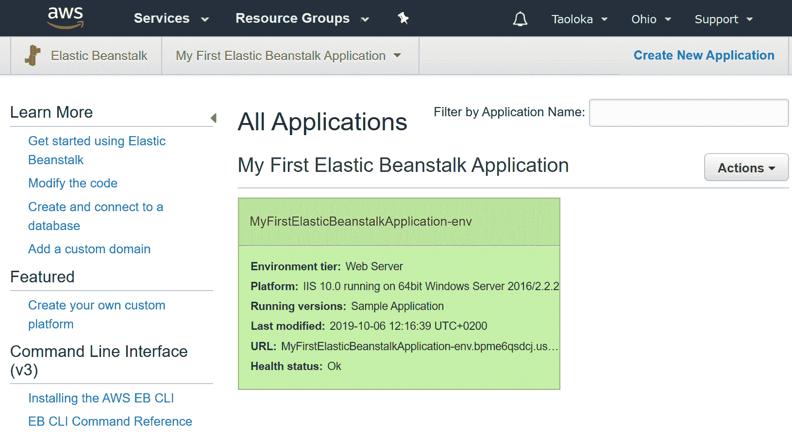

3.  在特定 Beanstalk 应用页面上，单击左侧菜单中的配置，如以下屏幕截图所示：

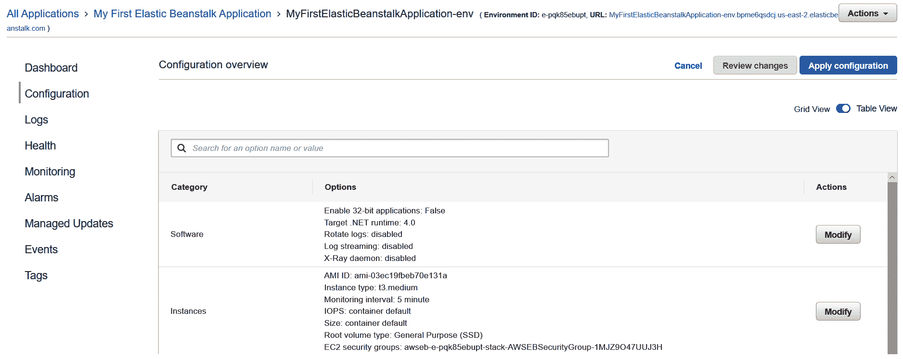

4.  向下滚动，然后单击修改数据库链接，如以下屏幕截图所示：

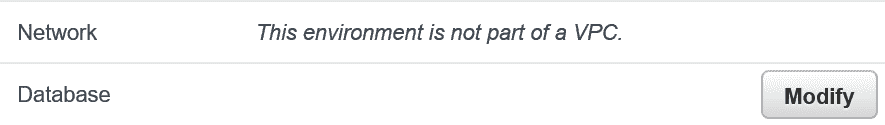

5.  选择作为 DB Engine SQL Server Express（sqlserver ex）并输入主用户名和密码；将其余字段保留为默认值，单击页面底部的应用按钮，等待数据库创建完成，如以下屏幕截图所示：

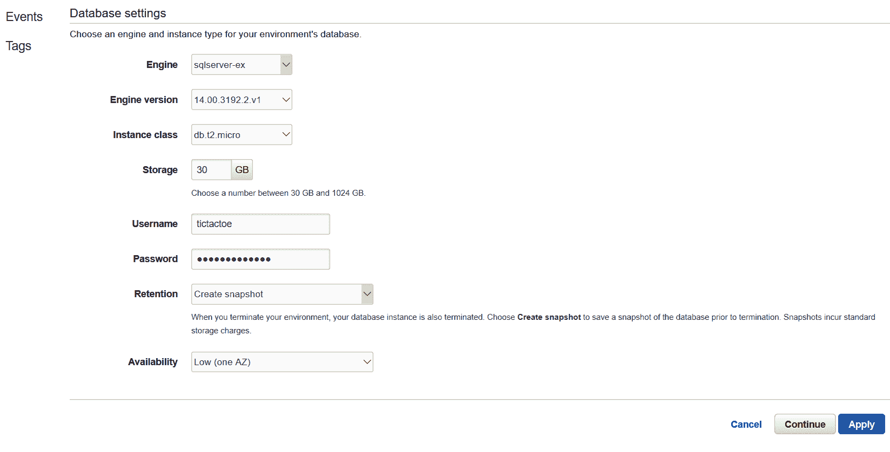

Note that, depending on your application's needs, the SQL Server Express edition may not be enough since it is limited in size, meaning that the Enterprise or Web editions may be necessary, which will result in higher cloud-provider costs. For the Tic-Tac-Toe sample application, it is, however, largely sufficient.

6.  转到 AWS 管理控制台，在 AWS 服务文本框中输入`RDS`，然后单击显示的链接。您将被重定向到 Amazon RDS 页面；单击资源菜单中的 DB 实例，如以下屏幕截图所示：


7.  单击实例，将显示实例仪表板。向下滚动以检索端点地址，该地址将用于在部署前更新应用连接字符串，如以下屏幕截图所示：


8.  在右侧，在 Amazon RDS 实例页面的连接和安全选项卡中，单击 VPC 安全组链接，如前面的屏幕截图所示。
9.  在“安全组”页面上，单击页面底部菜单中的“入站”选项卡，然后单击“编辑”，以便能够更新刚刚创建的数据库安全组的入站规则，如以下屏幕截图所示：


10.  单击添加规则按钮，选择 MS SQL 作为类型，自定义作为源，并输入默认安全组，然后单击保存按钮，如以下屏幕截图所示：

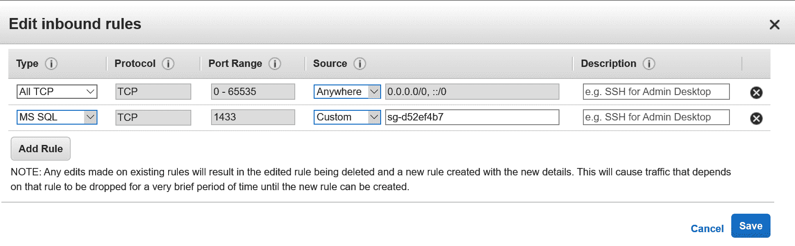

Note that you should configure stricter security group inbound rules in a real production environment, and set real IP restrictions. The source Anywhere should not be used for production environments.

11.  您可以选择使用**SQL Server Management Studio**（**SSMS**）、Visual Studio 2019 中的 SQL Server 对象资源管理器或 Azure Data Studio（如下注释所述）来处理云中的数据库。让我们在 Visual Studio 2019 中使用 SQL Server 对象资源管理器。打开它，右键单击 SQL Server，然后添加 SQL Server，并使用以前的端点地址、用户名和密码登录，如以下屏幕截图所示：

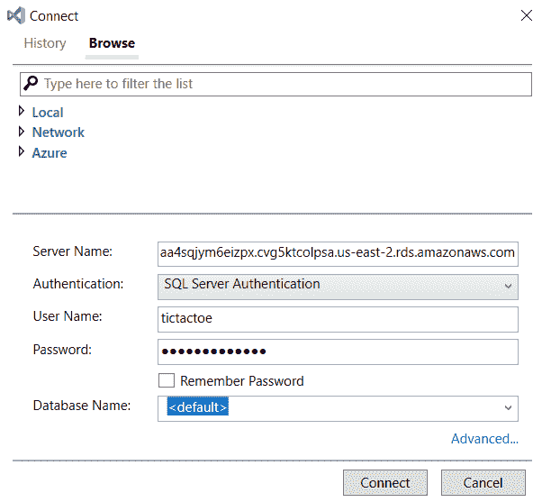

12.  创建一个名为`TicTacToe`的新数据库，如下所示：


13.  更新`appsettings.json`文件中的`DatabaseConnectionString`，并用以下相应值替换参数。您可能还记得，在*步骤 7*中，我们提到了将用于在部署之前更新应用连接字符串的检索到的端点。这是我们需要更新的地方：

```cs
        "Server=<YourEndPoint>;Database=TicTacToe;
          MultipleActiveResultSets=true;
          User id=<YourUser>;pwd=<YourPassword>" 
```

您已经成功地配置了技术环境，这意味着您现在可以发布数据库架构以及部署 web 应用。

Note that Azure Data Studio is another great cross-platform option for working with SQL Server in the cloud. This is useful when you are not in need of Visual Studio for running **Entity Framework** (**EF**) Migrations. A comparison of its features compared to the commonly used SSMS, to help you decide when it is best to use Azure Data Studio or SSMS can be found here: [https://docs.microsoft.com/en-us/sql/azure-data-studio/what-is?view=sql-server-ver15](https://docs.microsoft.com/en-us/sql/azure-data-studio/what-is?view=sql-server-ver15)[.](https://docs.microsoft.com/en-us/sql/azure-data-studio/what-is?view=sql-server-ver15)

您是否急切地等待在云中运行应用？只要保持专注，再继续一点，您很快就会看到您的应用在 AWS 中运行。

发布数据库架构时有三种选择，如下所示：

*   生成 SQL 脚本以通过 EF 迁移从 Visual Studio 2019 中创建数据库。
*   更改`Data\GameDbContextFactory.cs`中的默认连接字符串，并在 Package Manager 控制台中执行`Update-Database`指令。
*   运行应用以创建数据库。

最合适的解决方案取决于应用及其数据库的类型和大小。根据经验，最好生成一个脚本，然后为较大的应用创建数据库，而对于较小的应用，可以在应用首次运行时自动创建数据库。

# 让应用在 AWS 上运行

让我们看看在 AWS 中运行 Tic Tac Toe 应用之前需要做什么，如下所示：

1.  在 Visual Studio 2019 中打开 Package Manager 控制台，执行`Script-Migration`指令，如下图：

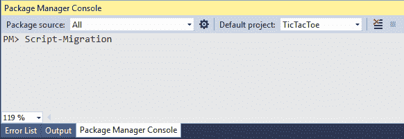

2.  将生成的脚本复制到 Amazon RDS 数据库的查询窗口中，然后执行脚本以创建数据库和各种数据库对象。
3.  从[下载并安装适用于 Visual Studio 2017 和 2019 的 AWS 工具包 https://marketplace.visualstudio.com/items?itemName=AmazonWebServices.AWSToolkitforVisualStudio201](https://marketplace.visualstudio.com/items?itemName=AmazonWebServices.AWSToolkitforVisualStudio2017) [7](https://marketplace.visualstudio.com/items?itemName=AmazonWebServices.AWSToolkitforVisualStudio2017)，如下图截图所示（如果您使用的是 Visual Studio 代码，您还可以从[获得一个针对 Visual Studio 代码的 AWS 工具包。）https://aws.amazon.com/visualstudiocode/](https://aws.amazon.com/visualstudiocode/) [：](https://marketplace.visualstudio.com/items?itemName=AmazonWebServices.AWSToolkitforVisualStudio2017)

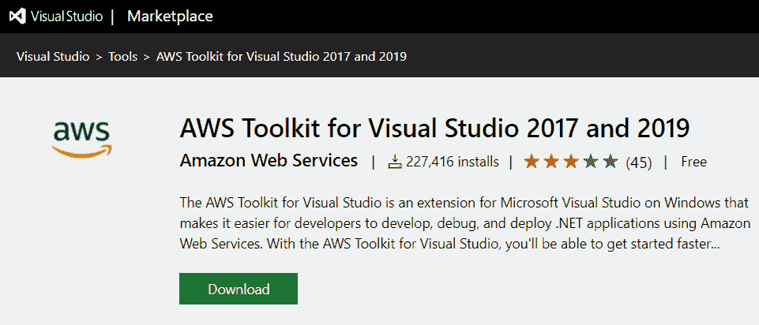

4.  进入 AWS 管理控制台，在 AWS 服务文本框中输入`IAM`，点击显示的链接；您将被重定向到 Amazon 身份和访问管理（IAM）页面，如以下屏幕截图所示：


5.  在 Amazon 身份和访问管理（IAM）页面上，单击创建单个 IAM 用户，然后单击管理用户并单击添加用户按钮，如以下屏幕截图所示：

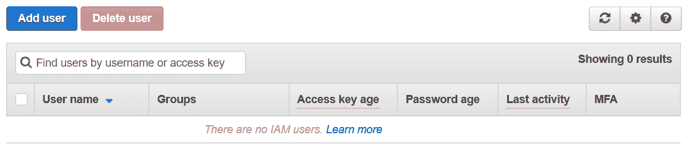

6.  在“添加用户”页面上，为新用户提供一个有意义的用户名并授予他们编程访问权限，然后单击页面底部的“下一步：权限”按钮，如以下屏幕截图所示：


7.  您现在必须为新用户设置权限；为此，请单击“直接附加现有策略”按钮，如以下屏幕截图所示：

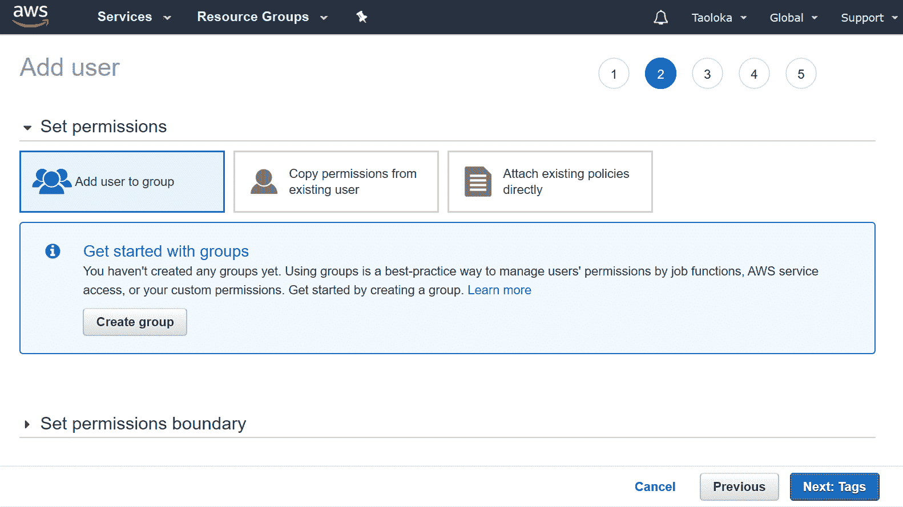

8.  从现有策略中选择 AdministratorAccess，然后单击页面底部的 Next:Tags 按钮，如以下屏幕截图所示：


9.  我们现在可以忽略标记，因为我们不打算有很多用户，只需转到下一步：检查并验证用户名和 AWS 访问类型以及所选策略是否正确，然后单击“创建用户”按钮，如以下屏幕截图所示：


10.  等待创建新用户；当显示成功页面时，您可以下载`.csv`文件，我们将使用该文件配置 Visual Studio 2019 和 AWS，如以下屏幕截图所示：

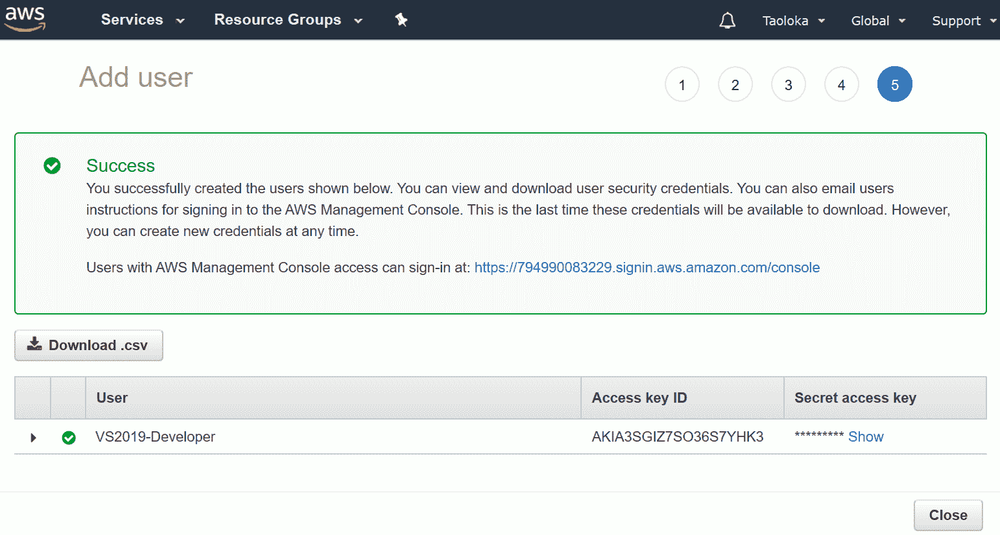

11.  打开 Visual Studio 2019 并通过查看| AWS Explorer 显示 AWS Explorer，如以下屏幕截图所示：

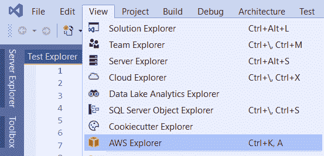

12.  单击“新建帐户配置文件”按钮（唯一活动的按钮），如以下屏幕截图所示：

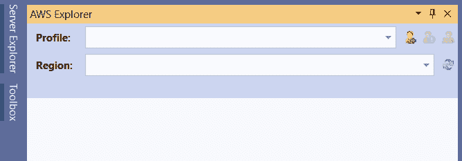

13.  将显示一个向导；在 AWS 上创建新用户的过程中，保留配置文件名为默认值，并使用您以前下载的`.csv`文件中的值填写访问密钥 ID 和机密访问密钥字段，如以下屏幕截图所示：


14.  由于 AWS 基于 IIS 作为.NET Core 应用的主机，因此您现在必须向`TicTacToe`应用添加一个`web.config`文件，该文件指定 IIS web 服务器属性。用于处理外部请求并给出响应的处理程序被分配了`aspNetCore`属性，并设置为允许所有 HTTP 动词，如`GET`、`POST`、`PUT`、`DELETE`等。`aspNetCore`实例的处理路径被分配了我们的`dll`路径，我们还通过将`forwardWindowsAuthToken`属性设置为`true`来确保支持 Windows 身份验证，如下代码块所示：

```cs
        <?xml version="1.0" encoding="utf-8"?> 
        <configuration> 
          <system.webServer> 
            <handlers> 
              <add name="aspNetCore" path="*" verb="*"
                modules="AspNetCoreModule" 
                 resourceType="Unspecified" /> 
            </handlers> 
            <aspNetCore processPath="dotnet" 
              arguments=".\TicTacToe.dll"
              stdoutLogEnabled="true"
              stdoutLogFile=".\logs\stdout" 
              forwardWindowsAuthToken="true" /> 
          </system.webServer> 
        </configuration> 
```

15.  此外，我们必须启用 IIS 集成。为此，我们打开`Program.cs`文件，并通过添加`webBuilder.UseIISIntegration()`更改 WebHost builder 配置以启用 IIS 集成，如下所示：

```cs
        public static IHostBuilder CreateHostBuilder(string[]
         args) =>
            Host.CreateDefaultBuilder(args)
                .ConfigureWebHostDefaults(webBuilder =>
                {
                    webBuilder.UseStartup<Startup>();
                    webBuilder.CaptureStartupErrors(true);
                    webBuilder.PreferHostingUrls(true);
                    webBuilder.UseUrls("http://localhost:5000");
                    webBuilder.ConfigureLogging((hostingcontext, 
                      logging) =>
                    {
                        logging.AddLoggingConfiguration(
                         hostingcontext.Configuration);
                    });
                    webBuilder.UseIISIntegration();
                });
```

16.  右键单击 TictaToe 项目，然后单击发布到 AWS Elastic Beanstalk。。。在关联菜单中，如以下屏幕截图所示：


17.  将显示一个向导；单击 Createanewapplicationenvironment 并单击 Next 按钮，如以下屏幕截图所示：


18.  对于环境，您有三个选项：开发、测试或生产，但请选择之前创建的默认环境，然后单击下一步按钮，如以下屏幕截图所示：

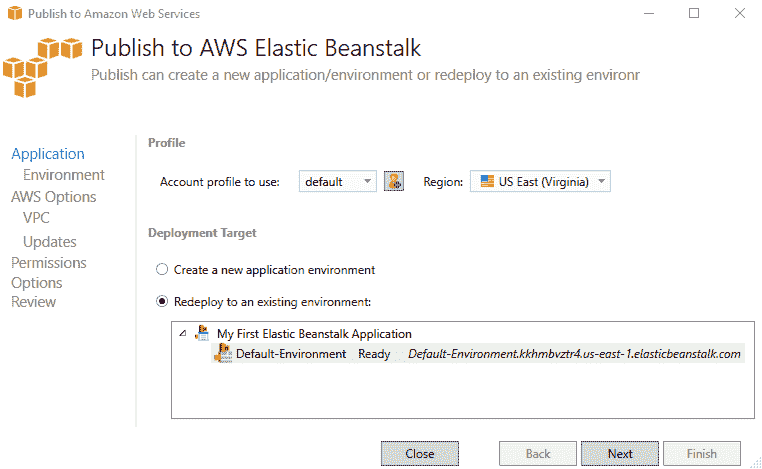

19.  验证框架版本是否设置为 netcoreapp3.0，表示 ASP.NET Core 3 应用，并保留所有默认值，然后单击下一步按钮，如以下屏幕截图所示：


20.  选择 Generate AWSDeploy configuration，这将允许您使用 AWS 重新部署应用的副本，然后单击 Deploy 按钮，如以下屏幕截图所示：

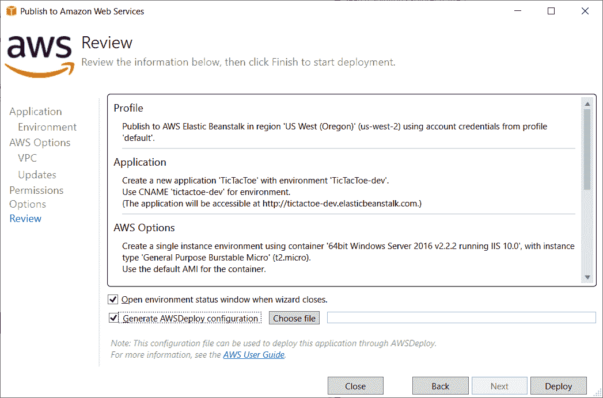

21.  部署将开始；通过转到 Output | Amazon Web Services，您可以看到部署过程的进展，如以下屏幕截图所示：

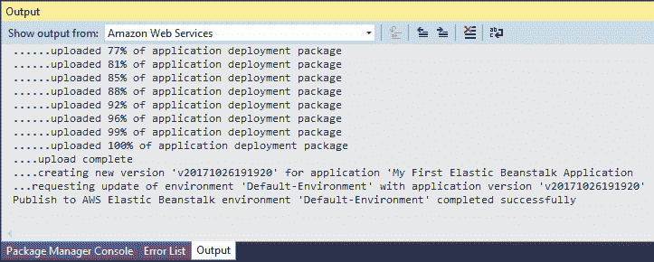

22.  部署应用时，可以使用 AWS 资源管理器获取应用的 URL，如下所示：


23.  打开浏览器并转到 AWS 中的应用 URL，启动应用，然后尝试注册新用户。

Note that if the application is not working as expected, you will get a `404 Not Found` HTTP response. Everything is working locally and the deployment in AWS was successful, but something is wrong. You will see in the next chapter, which is about logging and monitoring, how to analyze, diagnose, understand, and fix this problem.

祝贺您在公共云中成功部署了第一个应用。它现在对外开放，用户可以连接到它并开始使用它。

以下是与 AWS 相关的示例。但是，我们仍然有一些引人注目的内容，因为我们将在接下来的部分中探索如何部署到其他目标，例如 Microsoft Azure 和 Docker 容器；所以，保持敏锐，继续阅读以下章节。

# 在 Microsoft Azure 中部署应用

Microsoft Azure 是 Microsoft 提供的一个公共云计算平台，用于在全球可用的 Microsoft 数据中心内构建、测试、部署和管理应用和服务。Microsoft Azure 不仅旨在满足来自 Microsoft 的编程语言和框架方面的工具，而且还包括专有或开源的第三方语言、框架和工具。

在 Microsoft Azure 中部署 web 应用时，您基本上有四种选择，如下所示：

*   Azure 应用服务
*   Azure 服务结构
*   Azure 容器服务
*   Azure 虚拟机

但是，在开始在 Microsoft Azure 中部署应用之前，您需要注册订阅；那么，让我们现在就这样做，如下所示：

1.  您需要 Microsoft 帐户才能注册 Microsoft Azure 订阅。您可以使用您在**Azure DevOps**订阅中使用的同一个，但如果您还没有，请转到[创建它 http://www.live.com](http://www.live.com) 点击创建一个！链接，如以下屏幕截图所示：


2.  转到[https://portal.azure.com](https://portal.azure.com) 并使用您的 Microsoft 帐户登录；你会被问到是否想去旅游。选择 Maybe later（不过，您真的应该稍后再进行巡演！），您将被重定向到 Microsoft Azure 管理门户，如以下屏幕截图所示：


3.  单击左侧菜单底部的“更多服务”，然后单击“订阅”按钮，如以下屏幕截图所示：

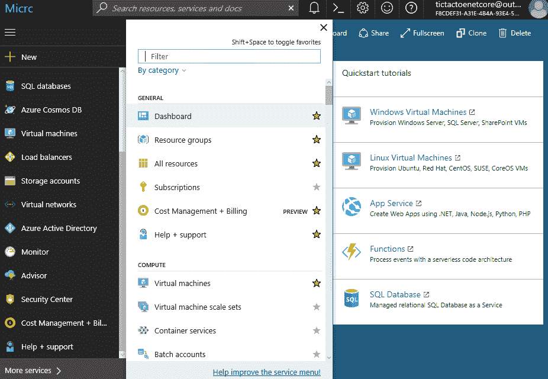

4.  单击添加按钮，如以下屏幕截图所示：

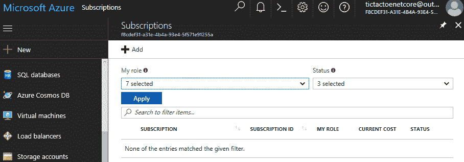

5.  单击“免费试用”按钮并填写不同的表单，直到您创建了 Microsoft Azure 订阅，如下所示：

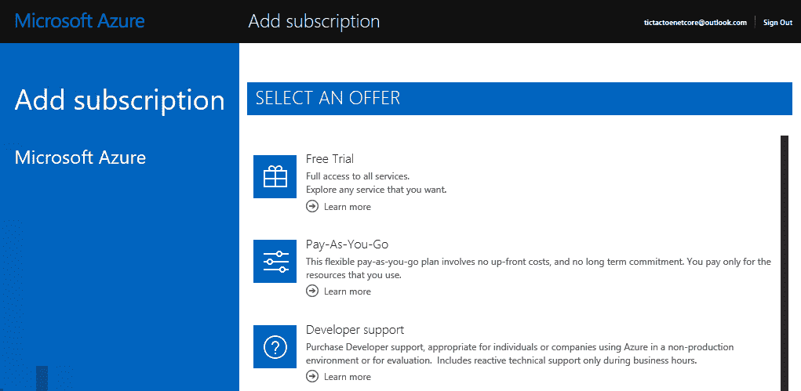

Note that there is no credit card required for Microsoft Azure (unlike AWS), and this is great, especially if you are a student.

令人兴奋的您现在已经准备好提供技术环境，然后将您的 ASP.NET Core 3 web 应用部署到世界各地的 Microsoft Azure 数据中心！

# 在 Microsoft Azure 应用服务中部署应用

Azure 应用服务是针对 Microsoft Azure 中基于 web 的应用的 PaaS 产品，包括自动扩展功能。在这方面，它可以与 AWS Elastic Beanstalk 相媲美，您之前已经在 AWS 部分中看到过。

Azure 应用服务不再需要管理基础架构；相反，您只需要关心构建和托管应用。对于完整的 DevOps 方法，如果您想使用 Microsoft Azure，建议使用此 PaaS 服务。

For more information on Microsoft Azure App Service, check out [https://docs.microsoft.com/en-us/azure/app-service/app-service-web-overview](https://docs.microsoft.com/en-us/azure/app-service/app-service-web-overview)[.](https://docs.microsoft.com/en-us/azure/app-service/app-service-web-overview)

# 正在运行 Azure 应用服务实例

以下示例说明了我们如何准备逐步将 Tic-Tac-Toe 应用部署到 Azure 应用服务：

1.  转到 Microsoft Azure 管理门户，您会发现有许多服务可供您使用，包括最常用的服务，它们位于欢迎页面的显著位置，如以下屏幕截图所示：

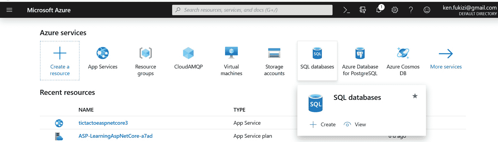

2.  此时我们需要的是应用服务，所以将鼠标指针悬停在应用服务图标上，它将显示以下弹出窗口。单击创建，如下所示：

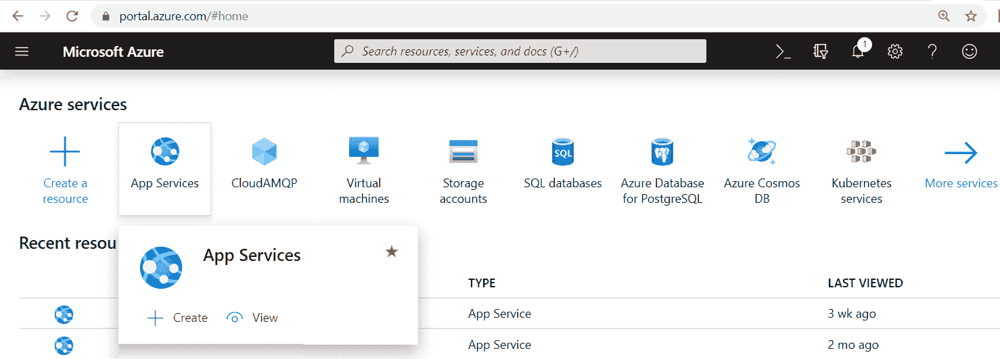

3.  您将获得一个新的 Web 应用表单。填写项目细节。在这个屏幕截图中，我已经有了一个 VisualStudioEnterprise 订阅，但是您可以使用您创建的试用订阅，或者您可能拥有的任何其他订阅。我已经创建了一个资源组，但是正如您所看到的，您可以创建一个新的资源组；如果您将鼠标悬停在信息图标上，它将告诉您资源组是共享相同生命周期、权限和策略的资源的简单集合。为应用填写唯一的名称，然后选择以代码形式发布应用。选择.NET Core 3.0（当前版本）作为运行时堆栈，将自动为您选择操作系统。对于该地区，我选择了南非北部，因为它是离我最近的地区，但你可以在现实生活中的应用中选择任何你觉得更接近目标受众的地区。

如果您没有决定要使用和付费的应用服务计划，请创建该计划，并确保再次检查您是否选择了使用共享基础架构并允许最多 1 GB 内存的免费层，如下所示：

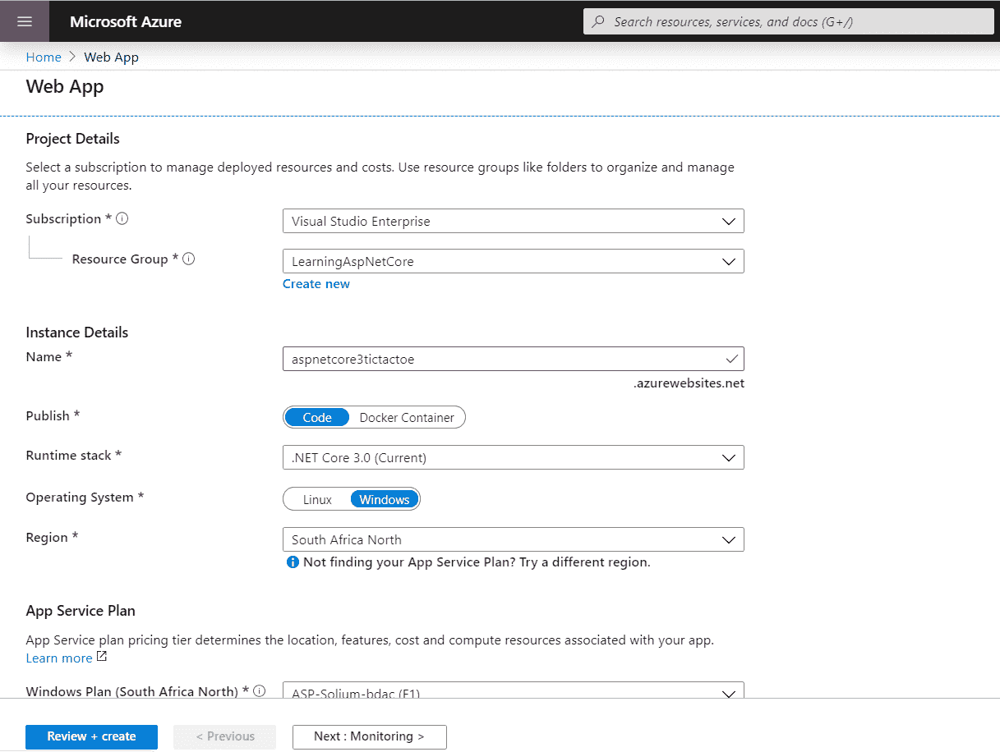

4.  填写上表并单击 Next:Monitoring 之后，您将看到以下屏幕，您可以在其中选择是否要启用 Application Insights。选择“是”，然后单击“下一步：标记”，如下所示：


5.  单击下一步：标记后，您将进入标记部分。此应用不需要它们，因此单击最后一个“下一步”按钮查看并创建，您将看到以下摘要：


6.  点击下载自动化模板链接，将下载一个`template.zip`文件夹，里面有两个文件：`parameters.json`和`template.json`，我们可能需要这两个文件以备将来使用。下载后，通过导航链接返回 web 应用，它仍然会有摘要。单击 Create（创建），您将看到部署正在进行屏幕，然后是部署完成屏幕，如下所示：


7.  单击上一屏幕中的 Go to resource（转到资源），然后将为您部署的应用显示一个仪表板，如下所示：


8.  此时，如果您点击您在*步骤 3*：`https://[your-unique-project-name].azurewebsites.net/`中创建的具有唯一名称的链接，您将看到您已经拥有一个网站，如以下屏幕截图所示：


祝贺如果你已经做到了这一点，你在 Azure 上运行了一个健康的应用服务，但是你会注意到，我们仍然没有在 Azure 上运行我们的 Tic-Tac-Toe 演示应用。接下来，在下一节中，让我们看看如何做到这一点。

# 在 Azure 上发布您的代码

现在您已经知道您的应用服务实例正在运行，继续并单击前面屏幕截图中显示的 Deployment Center 按钮，您将看到下面屏幕截图中显示的屏幕。也可以转到部署中心，方法是转到主页，浏览最近的资源，选择项目，然后在左侧窗格中的“部署”下选择“部署中心”，如下所示：

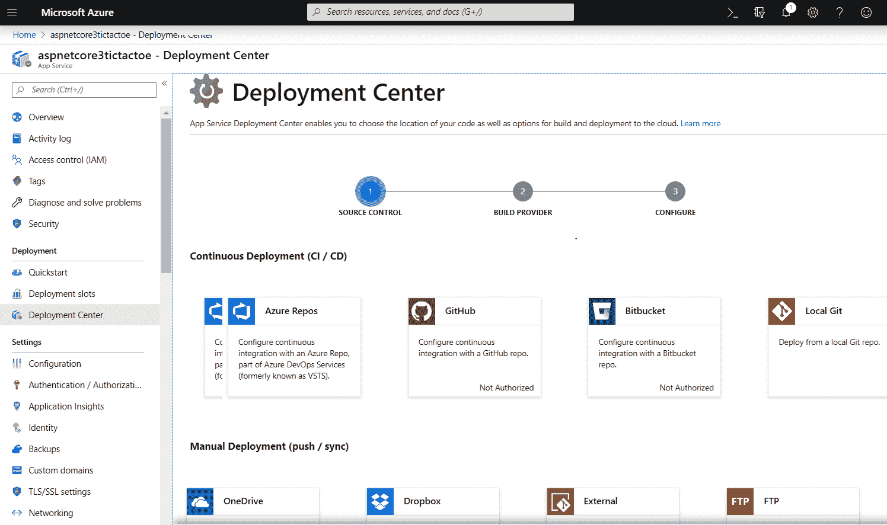

您会很高兴看到您有几个选项可以用来部署应用。你会记得在 Azure DevOps 中的[第 3 章](03.html)*持续集成管道*中，我们在**Azure Repos**中有我们的应用，你可能在 Azure Repos 或本地 Git 项目的整章中都在更新你的代码。无论哪种方式，我们都可以选择从 Azure Repos 或本地 Git 进行部署。

GitHub now has a cool feature called GitHub Actions that makes deployment much easier. It has a lot of workflows provided by its vibrant community, such as *Deploy to Kubernetes*, *AWS*, *and Azure App Service*, and you can create your own actions using the starter workflows here: [https://github.com/actions/starter-workflows](https://github.com/actions/starter-workflows). You can find out more about GitHub Actions at [https://github.com/features/actions](https://github.com/features/actions).

我们还可以选择通过 GitHub 存储库或 Bitbucket 进行部署，但我们还需要进行更多的配置，这不在本书的范围之内。

出于演示目的，我们将使用 Azure 回购，如下一节所示。

# 与 Azure Repos 的持续集成

如果您一直在更新 Azure Repos 上的代码，只需单击 Azure Repos 按钮即可继续此过程。如果您尚未进行更新，并且一直在使用本地开发环境，请确保您查看了 Azure DevOps 中[第 3 章](03.html)、*持续集成管道中的 Azure Repos 代码，并使用最新版本进行更新，然后提交。遵循以下步骤：*

1.  在部署中心，单击 Azure Repos 并继续，如以下屏幕截图所示：

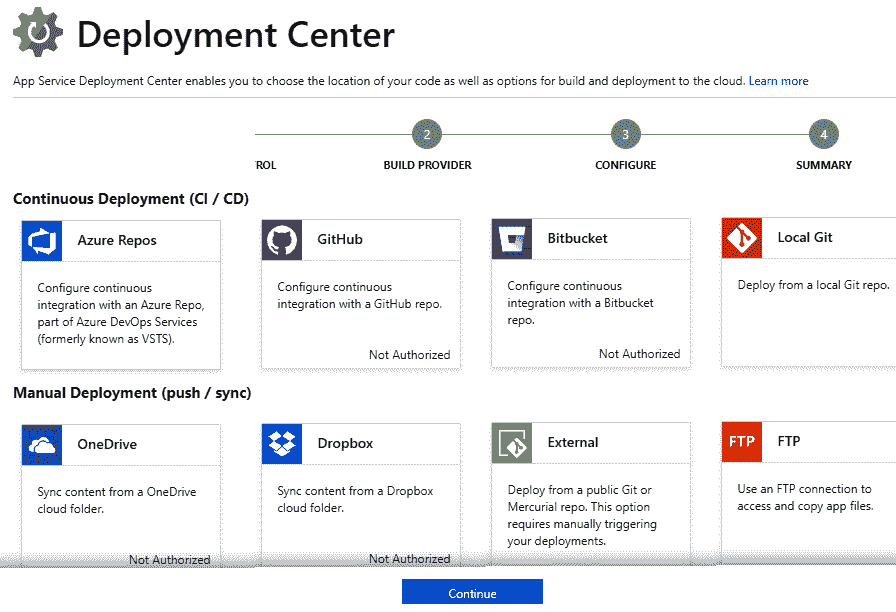

2.  您将看到构建提供商的两个选项，应用服务构建服务或 Azure 管道（预览）。它们之间的主要区别在于 Azure 管道做了一些额外的工作，例如运行负载测试，并首先部署到暂存，然后部署到生产环境。此时，请确保您同时拥有暂存和生产插槽，您可以通过单击左侧的 Deployment slots 菜单来添加它们。选择 Azure Pipelines（预览）并单击 Continue，如下所示：


3.  然后，添加在 Azure DevOps 中[第 3 章](03.html)*持续集成管道中创建的 Azure 回购项目的配置，如以下屏幕截图所示。单击“继续”，如下所示：*

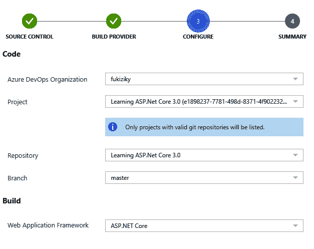

4.  然后会显示一个摘要页面，您可以使用该页面检查所有参数是否正常。如果没有，您可以返回并更正；但假设一切正常，单击 Finish，如果一切正常，您将看到以下成功设置连续交付和触发生成消息：


5.  执行刷新，您将看到一条已成功部署的消息。该消息还将包含发布版本，以及指向构建详细信息和源版本的链接，如下所示：

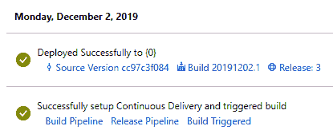

6.  单击“同步”以确保您的 web 应用具有最新的代码，您将从存储库中获得消息“已成功触发连续交付”，其中包含最新的源代码，如以下屏幕截图所示：


这是个好消息。您的代码现在位于 Azure 门户上，但是如果您检查项目的 URL-`https://[your-unique-project-name].azurewebsites.net/`，您将面临一个错误。不要绝望；这仍然是个好兆头。我们在网站上有我们的代码，但我们没有连接到任何数据库。这就是我们将在下一节中看到的。

# 连接数据库

在以前的 Microsoft Azure 版本中，曾经有一个选项可以将 Web App+SQL 作为单个 Azure 服务，但最近它们被拆分。我们需要创建一个单独的数据库实例，以下是我们需要完成的步骤，以使数据库启动并运行，并准备好供演示应用使用：

1.  转到您的个人主页[portal.azure.com](https://portal.azure.com)并将鼠标悬停在 SQL 数据库上，然后单击“创建”按钮：


2.  在生成的表格上填写所需信息，如下所示：


3.  为服务器名称、服务器管理员登录名和密码输入一些值，然后单击确定按钮，如下所示：


4.  单击上一屏幕中的下一步：联网，在下一屏幕中配置是否允许公众访问此数据库。就我们的应用而言，我们只需要对其进行内部访问，如下所示：


5.  单击 Review+create，然后单击 Finally create，如果部署成功，您将看到类似于以下屏幕的最终屏幕：


6.  您需要允许访问 SQL 数据库以执行`TicTacToe`应用的数据库生成脚本。在左侧下拉菜单或主页中，单击 SQL 数据库并选择`TicTacToe`数据库，如下图所示：

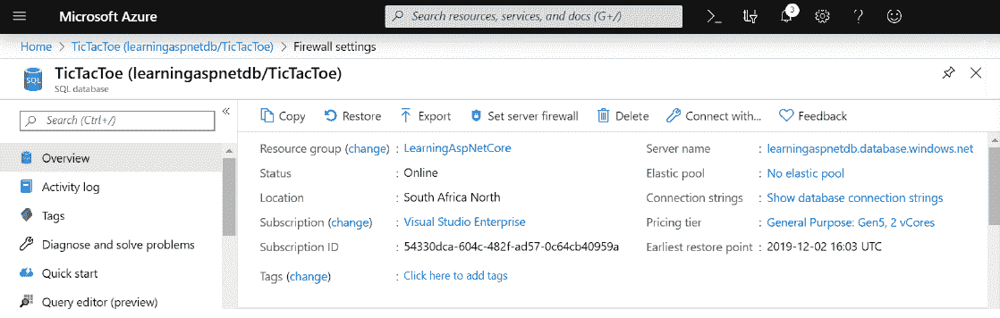

7.  单击前面屏幕中的 Set server firewall（设置服务器防火墙），可以添加允许从 IP 访问 SQL 数据库的新规则。单击添加客户端 IP，验证您的 IP，然后单击保存以添加新规则，结果显示以下屏幕：

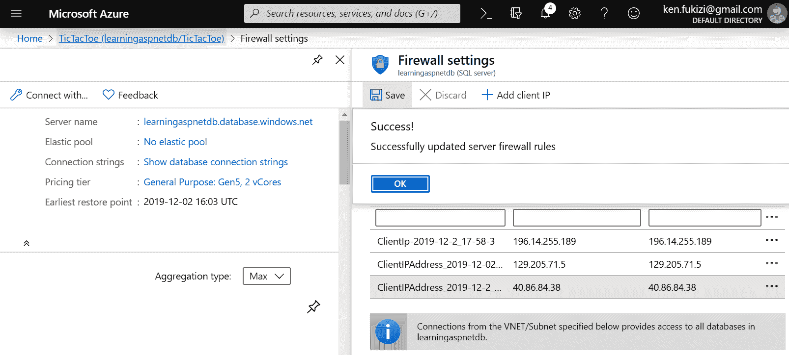

8.  打开 Visual Studio 2019，转到 SQL Server 对象资源管理器，并使用`TicTacToe`Azure 数据库连接字符串中的连接信息添加新的 SQL Server。如果您单击 Azure 链接，您会发现此内容已自动填写，如下所示：


9.  向 Azure SQL Server 实例添加一个新数据库，就像您在 AWS 示例中所做的那样；它将用于执行`TicTacToe`数据库生成脚本，如下所示：


10.  如果您没有遵循 AWS 示例，请在 Visual Studio 2019 中打开 Package Manager 控制台并执行脚本迁移指令；否则，您可以重复使用相同的脚本，如前一个示例中所示。
11.  将生成的脚本复制到 Azure`TicTacToe`数据库的查询窗口中，然后执行脚本创建数据库和各种数据库对象，如下所示：

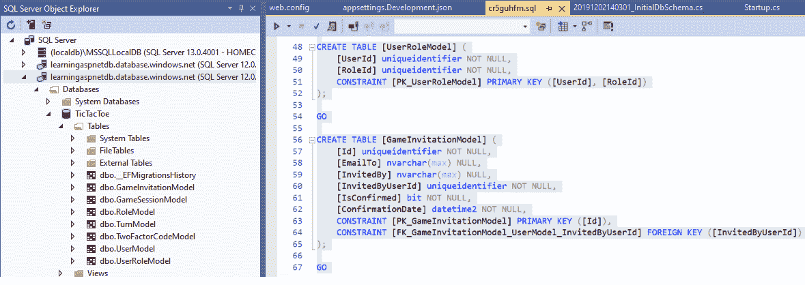

12.  如果您没有阅读 AWS 部署示例，请记住添加与前面 AWS 示例相同的`web.config`文件，并在`Program.cs`中的`CreateHostBuilder`方法中添加`webBuilder.UseIISIntegration()`，因为 App Service 基于 IIS 作为.NET Core 应用的主机。

现在，您已经在部署方面做了足够的工作。所有代码文件都在中，数据库已设置并连接。在下一章也是最后一章中，我们将了解下一步要做什么，以确保用户能够看到正在运行的应用。但同时，如果您发现使用 CI/CD 工具和 Azure DevOps 进行部署有点牵连，那么您有一个更简单的选择，这将在下一节中讨论：*通过 Web 部署**l*进行部署。保持专注。

# 通过 Web 部署工具进行部署

前面的示例使用了通过 Azure DevOps CI/CD 功能进行部署。或者，您可以使用**Web Deploy**直接从 Visual Studio 2019 将您的项目发布到 Azure，因此让我们严格准备应用，并通过 Visual Studio 2019 将其部署到您之前创建的 Microsoft Azure 应用服务实例中，如下所示：

1.  由于应用服务基于 IIS 作为.NET Core 应用的主机，因此您现在必须向`TicTacToe`项目添加一个`web.config`文件。但是，如果您以前遵循 AWS 示例，您应该已经这样做了，如下所示：

```cs
        <?xml version="1.0" encoding="utf-8"?> 
        <configuration> 
          <system.webServer> 
            <handlers> 
              <add name="aspNetCore" path="*"
               verb="*" modules="AspNetCoreModule"
               resourceType="Unspecified" /> 
            </handlers> 
            <aspNetCore processPath="dotnet"
             arguments=".\TicTacToe.dll"
             stdoutLogEnabled="true"
             stdoutLogFile=".\logs\stdout"
             forwardWindowsAuthToken="true" /> 
          </system.webServer> 
        </configuration> 
```

2.  此外，您必须启用 IIS 集成；为此，请打开`Program.cs`文件并更改 WebHost builder 配置以启用 IIS 集成。但是，如果您以前遵循 AWS 示例，您应该已经这样做了，如下所示：

```cs
public static IHostBuilder CreateHostBuilder(string[] args) => Host.CreateDefaultBuilder(args)
      .ConfigureWebHostDefaults(webBuilder =>
      {
         webBuilder.UseStartup<Startup>();
         webBuilder.CaptureStartupErrors(true);
         webBuilder.PreferHostingUrls(true);
         webBuilder.UseUrls("http://localhost:5000");
         webBuilder.ConfigureLogging((hostingcontext, logging) =>
         {
             logging.AddLoggingConfiguration(hostingcontext.
              Configuration); });
              webBuilder.UseIISIntegration();
      });
```

3.  转到 Microsoft Azure 管理门户并单击左侧菜单中的应用服务。选择您之前创建的`TicTacToe`应用，单击获取发布配置文件，然后下载 Azure 应用服务发布配置文件，如下所示：


4.  右键点击`TicTacToe`项目，点击上下文菜单中的发布，然后点击导入配置文件按钮，如下图：


5.  选择下载的 Azure App Service 发布配置文件，发布过程应自动启动，如下所示：


6.  您可以在“Web 发布活动”视图中看到发布过程，如下所示：

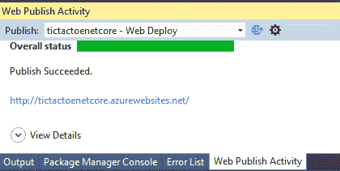

7.  打开浏览器并转到 Microsoft Azure 中的应用 URL，启动应用，然后尝试注册新用户。

Note that if the application is not working as expected, you will get a 404 Not Found HTTP response. Everything is working locally and the deployment in Microsoft Azure was successful, but something is wrong. You will see in the next chapter (which is about logging and monitoring) how to analyze, diagnose, understand, and fix this problem.

以下是 Microsoft Azure 的示例。下一节将解释如何将应用部署到 Docker 容器中。

# 将应用部署到 Docker 容器中

Docker 通过使用容器简化了应用的构建、部署和运行。容器允许将库以及任何其他依赖项打包到单个应用包（容器映像）中，然后可以将该应用包作为单个一致性资源提供。此技术可确保打包的应用在容器可以使用的任何位置都能正确运行，而不考虑任何特定于环境的设置或配置。

以下是 Docker 工作原理的高级模式：

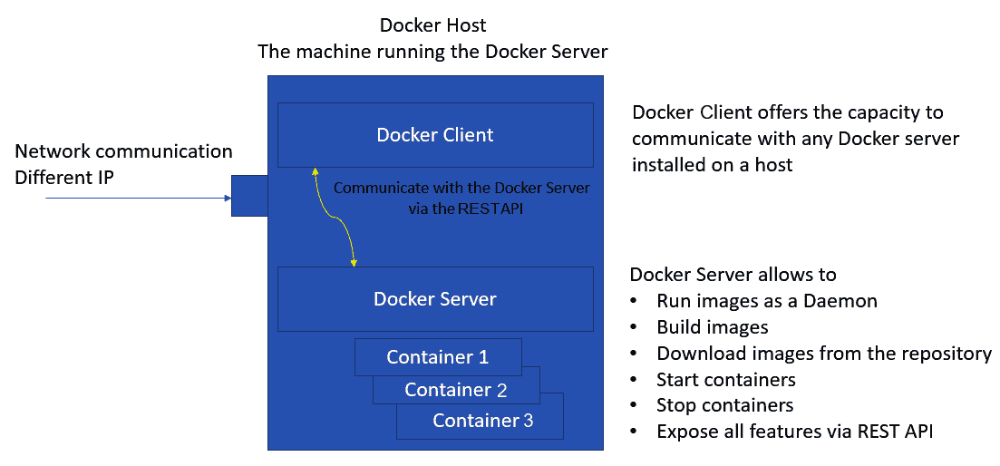

使用 Docker 容器时，基本上有三种选择，如下所示：

*   根据操作系统的不同，在本地或云中使用**虚拟机**（**VM**）与**Docker for Windows**或**Docker Enterprise**（Windows Server 2019 和 2016）一起使用
*   使用 Docker Hub（[https://hub.docker.com](https://hub.docker.com/) ）
*   使用 Microsoft Azure 容器服务或 AWS EC2 容器服务

For more information on Docker, visit the following links:

*   [https://www.docker.com](https://www.docker.com)

*   [https://docs.microsoft.com/en-us/dotnet/core/docker/build-container](https://docs.microsoft.com/en-us/dotnet/core/docker/build-container)

# 将应用部署到 Docker 容器中

Docker for Windows 提供了在 Windows 环境中开始使用 Docker 容器所需的一切，而 Docker Enterprise（Windows Server 2019 和 2016）专为需要基于 Docker 技术为生产环境提供必要支持的公司而设计。

让我们看看如何在 Windows 中使用 Docker，以及在这种情况下如何部署应用，如下所示：

1.  如果尚未安装 Docker for Windows，请转至[https://hub.docker.com](https://hub.docker.com) 。如果您有 Docker ID，请使用 Docker ID 登录；否则，单击“注册”并填写您选择的 Docker ID，以及密码和电子邮件地址，如下所示：


2.  然后，您将在您的帐户上填写个性化详细信息，验证后，在欢迎页面上，单击“Docker 桌面入门”，您将看到以下弹出窗口。单击下载 Docker Desktop for Windows 并在下载后安装，如下所示：


To install Docker Enterprise Edition for Windows 2016, go to [https://hub.docker.com/editions/enterprise/docker-ee-server-windows](https://hub.docker.com/editions/enterprise/docker-ee-server-windows) and follow the installation instructions. After the installation, you should skip the following step, and continue directly with *Step 4*.

3.  在安装过程中，请确保选择 Windows 容器，如下所示：


4.  您也可以在安装后通过右键单击 Docker 托盘图标并进一步单击切换到 Windows 容器来切换到 Windows 容器。。。在关联菜单中，如下所示：

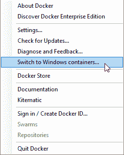

5.  如果您的 Windows 安装中尚未启用容器功能，Docker 将询问您是否希望这样做。单击确定按钮，如下所示：

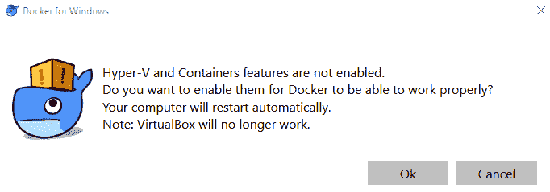

6.  打开一个新的具有管理员权限的提升命令提示符，下载 Docker 官方 Microsoft SQL Server 映像，并执行`docker pull microsoft/mssql-server-windows-express`指令，如下所示：


7.  下载 Docker 官方 Microsoft ASP.NET Core 镜像，执行`docker pull microsoft/aspnetcore`指令，如下：

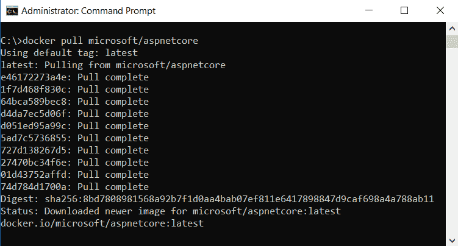

8.  为了能够将 Visual Studio 2019 中的应用直接编译并发布到 Docker 中，您还需要下载特定的构建映像并执行`docker pull microsoft/aspnetcore-build`指令，如下所示：


9.  如果检查到目前为止已安装的 Docker 映像，则应具有以下内容：


10.  打开 Visual Studio 2019，然后打开`TicTacToe`项目；在菜单中，单击 Project | Docker Support 并选择 Windows 操作系统，如下所示：

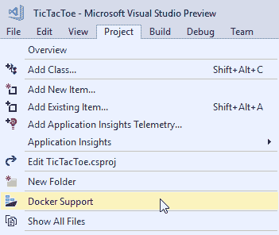

11.  一个名为`docker-compose`的新项目将自动生成并添加到解决方案中；它应该包含一个`.dockerignore`文件（部署过程中要忽略的文件）和一个`docker-compose.yml`文件（部署说明），如下所示：

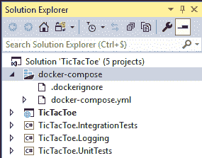

12.  更新 Docker Compose 项目中的`docker-compose.yml`文件，如下所示：

```cs
        version: '3' 
        services: 
          sql: 
            image: "microsoft/mssql-server-windows-express" 
            environment: 
              sa_password: "123TicTacToe!" 
              ACCEPT_EULA: "Y" 
          tictactoe: 
            image: tictactoe 
            build: 
              context: . 
              dockerfile: TicTacToe\Dockerfile 
            ports: 
              - "8081:5000" 
            depends_on: 
              - sql
```

13.  更新`TicTacToe`应用中`appsettings.json`文件中的`DefaultConnection`，如下所示：

```cs
        "DefaultConnection":
         "Server=sql;Database=Master;MultipleActiveResultSets=true;
          User id=sa;pwd=123TicTacToe!"
```

14.  更新`TicTacToe`项目中的`Program.cs`文件；删除 IIS 集成，因为 Docker ASP.NET Core 映像基于 Kestrel 而不是 IIS，如下所示：

```cs
public static IHostBuilder CreateHostBuilder(string[] args) => Host.CreateDefaultBuilder(args)
      .ConfigureWebHostDefaults(webBuilder =>
      {
         webBuilder.UseStartup<Startup>();
         webBuilder.CaptureStartupErrors(true);         
      });
```

15.  按*F5*键启动应用（应将`docker-compose`项目设置为启动）。应用现在应该已经自动部署到 Docker 容器中；按如下所示，验证一切仍按预期工作：


16.  打开命令提示符，执行`docker ps`指令，查看所有正在运行的 Docker 进程。应该有多个正在运行的容器实例，如下所示：


在本例中，我们有一个用于开发环境的 TictaToe 应用映像实例，以及 microsoft/mssql server windows express 版本。在下一节中，我们将看到如何将此类图像发布到 Docker Hub。

# 将图像发布到 Docker Hub

您可以将应用映像上载到名为 Docker Hub 的基于云的 Docker 中央存储库，然后在 Microsoft Azure、AWS 或任何其他 Docker 支持的环境中使用它们。

Note that there are also other Docker registries you could use, such as **Azure Container Registry** and others. Since Docker provides its own registry via Docker Hub, it is, however, advised to use that.

有关 Docker Hub 的更多信息，请查看[https://docs.docker.com/docker-hub](https://docs.docker.com/docker-hub) 。

以下示例演示如何将示例`TicTacToe`应用发布并上载到 Docker Hub：

1.  右键点击`TicTacToe`项目，在关联菜单中选择发布；由于您已经在前面的示例中创建了发布配置文件，因此必须添加一个新的发布配置文件。单击创建新配置文件，如下所示：

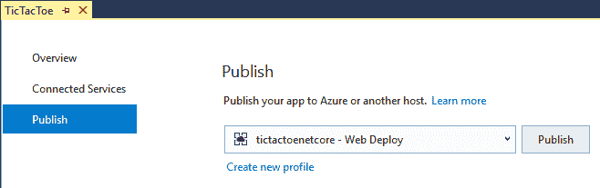

2.  单击容器注册表按钮，选择 Docker Hub，然后单击发布按钮，如以下屏幕截图所示：

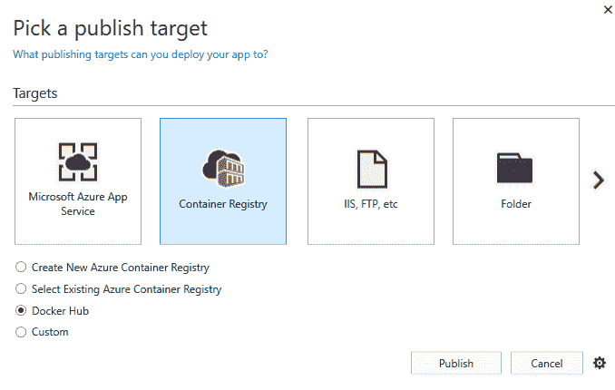

3.  输入您的 Docker Hub 用户名和密码，然后单击保存，如以下屏幕截图所示：


4.  您的集装箱图像将发布到 Docker Hub；完成后，转到 Docker Hub 并验证图像是否已上载，如下所示：


做得很好，在应用开发方面，我们几乎从各个角度研究了如何开发出世界级的应用。你应该庆幸你的应用终于进入了容器中心。

# 总结

在本章中，我们讨论了托管和部署 ASP.NET Core 3 web 应用时的各种选项。您已经了解了托管是什么，以及如何为给定用例选择适当的解决方案。这将允许您为自己的应用做出更好的决策。

您已经了解了如何注册 AWS 帐户、如何提供技术环境以及如何部署 ASP.NET Core 3 web 应用。此外，您还了解了如何注册 Microsoft Azure 帐户，如何提供技术环境，以及如何使用这个强大的公共云计算平台部署 ASP.NET Core 3 web 应用。

然后，我们讨论了 Docker 以及当您使用这一现代、越来越多地被采用且具有影响力的技术时，您所拥有的各种部署选择。您已经为未来做好了充分的准备，因为 Docker 可能会完全改变我们部署和管理应用的思维方式。

您已经获得了任何一个认真的开发人员都应该具备的非常重要的技能，包括托管 web 应用、部署到 Docker 容器以及部署到 AWS 或 Microsoft Azure；最后但并非最不重要的一点是，您已经获得了持续部署所需的技能。

在下一章中，我们将解释如何有效地管理和监督已部署的 web 应用，这对于 DevOps 方法非常重要。