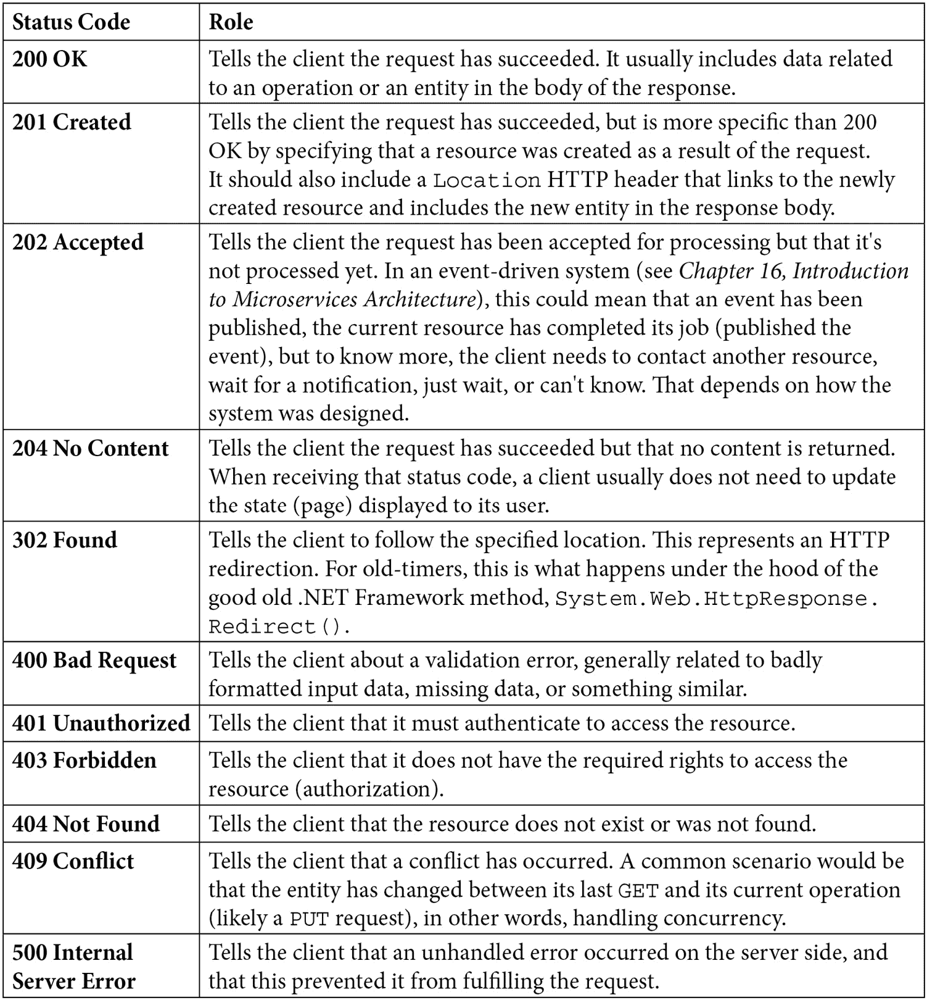
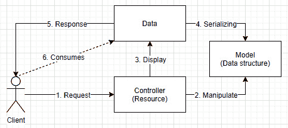
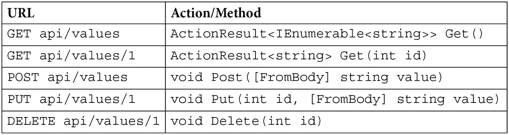
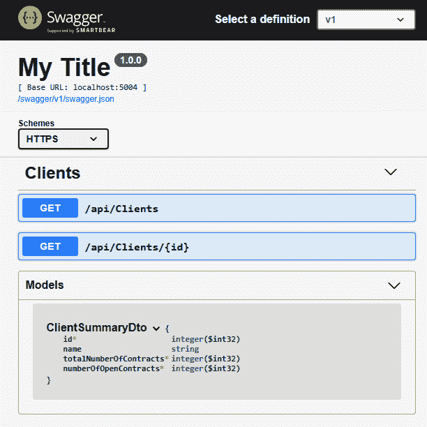

# 五、Web API 的 MVC 模式

正如我们在前一章中看到的，模型-视图-控制器模式可能是用于显示 web 用户界面的最广泛适用的体系结构模式之一，因为它几乎完美地匹配了 HTTP 和 web 背后的概念。

在本章中，我们将介绍 ASP.NET Core 的 web API 版本，它是大多数现代技术堆栈的关键部分。此外，我们在本书中使用了这些技术和本章中学习的模式。避免使用用户界面使代码更容易理解。Web API 用于各种类型和规模的项目，从微服务到移动应用。

在本章中，我们将介绍以下主题：

*   REST 概述
*   剖析 webapi
*   C 语言的几个特点
*   数据传输对象（DTO）设计模式
*   API 合同

# REST 概述

**REST**或**表示状态传输**是一种创建基于互联网的服务的方法，称为 web 服务或 web API，通常使用 HTTP 作为其传输协议。它允许重用众所周知的 HTTP 规范，而不是重新创建交换数据的新方法。例如，返回 HTTP 状态代码 200OK 表示成功，而 400BAD 请求表示失败。

简言之，我们可以说：

*   每个 HTTP 端点都是一个资源。
*   每个资源都可以独立保护。
*   Calling the same resource twice should result in the same operation executed twice.

    例如，执行两个`POST /entities`将产生两个新实体，而获取`GET /entities/some-id`将返回同一实体两次。

*   该服务应该是无状态的，这意味着它不会在请求之间保留有关客户端的信息。
*   来自 RESTful 服务的响应应该是可缓存的；您应该能够使用 HTTP 标准控制该缓存。

我们可以在这里讨论多个其他元素，但这些是最基本的元素，可以让新手初步了解什么是 RESTful 服务。

我们可以写一整本专门介绍 web API 的书，但我将把这本书的信息控制在最低限度，刚好可以开始。然而，这里有一些关于 web API 中使用的 HTTP 方法和状态代码的广泛适用的指导，应该可以帮助您启动。

## 请求 HTTP 方法

所使用的 HTTP 方法是 web API 端点可以执行的操作的良好指标。这有助于明确目的。下面列出了最常用的方法、它们的用途以及它们的预期成功状态代码：


## 响应状态码

HTTP 状态码是将发生的事情传输回 web API 消费者的方式。下表说明了在探索状态代码的预定义组之前最常见的组：



如果您再看一看上一张表，您可能会注意到，涉及类似主题的状态代码被分组在同一个“第一百个”下，例如：

*   1XX 状态码（上表中省略）表示信息延续结果，通常由服务器自动处理，如**100 延续**和**101 交换协议**。
*   2XX 是成功的结果。
*   3XX 与重定向相关。
*   4XX 是请求错误（来自客户端），通常由用户引入，例如空的必填字段。
*   5XX 是客户端无法处理的服务器端错误。

如果您不熟悉 REST，并且对 web API 感兴趣，我建议您在完成本书或构建一些项目后阅读更多关于该主题的内容，以便自己掌握它。

# 对 web API 的剖析

现在我们已经在[*第 4 章*](04.html#_idTextAnchor056)*中探讨了 ASP.NET MVC 的基础知识，*使用 Razor 的 MVC 模式*以及呈现网页的方法，现在是跳转到 web API 并返回数据而不是用户界面的时候了。在过去的几年里，web API 的数量从几个激增到了数百万个；现在每个人都这样做。在这种情况下，我不认为这是因为人们盲目地追随一种趋势，而是基于使 web API 如此吸引人的充分理由，例如：*

*   这是系统间共享数据的有效方式。
*   通过使用通用语言（如 JSON 或 XML）进行对话，它允许技术之间的互操作性。
*   它允许您的后端集中并与多个前端（如移动、桌面和 web 应用）共享。

这些原因使得重用后端系统和与多个用户界面或其他后端系统共享它们变得更加容易。例如，想想你知道的任何移动应用；他们很可能要维护一个 iOS 应用、一个 Android 应用和一个 web 应用。在这种情况下，共享后端是节省时间和金钱的最佳方式。

我更新了 MVC 图以表示 web API 的流程：



图 5.1–web API 的工作流程

呈现用户界面和构建 web API 之间只有一些区别：

*   API 不向浏览器发送 HTML，而是输出序列化的数据结构。
*   客户机通常希望使用数据，而不是直接显示数据。

基于此图，我们将模型直接发送给客户机。在大多数情况下，我们不想这样做。相反，我们只想以我们想要的格式发送我们需要的部分数据。接下来我们将用 DTO 模式讨论这个问题，但首先，让我们深入了解 ASP.NET Core 5 web API。

## 设置 web API

要使用 ASP.NET Core 5 MVC 的全部功能，而不加载 Razor 引擎和其他视图相关组件，在`Startup`类中，最低要求如下：

```cs
public class Startup
{
    public void ConfigureServices(IServiceCollection services)
    {
        services.AddControllers();
    }
    public void Configure(IApplicationBuilder app)
    {
        app.UseRouting();
        app.UseEndpoints(endpoints =>
        {
            endpoints.MapControllers();
        });
    }
}
```

`AddControllers()`扩展方法添加与 web API 控制器相关的类，而不需要使用 Razor 页面或呈现视图所需的额外元素。

然后，我们像在任何 MVC 项目中一样添加路由中间件和端点路由。然而，我们感兴趣的部分是`endpoints.MapControllers();`扩展方法。它支持使用基于属性的路由（见下文）。就这样,；我们不需要更多的服务。从那里，我们可以添加控制器并开始编码。

与 ASP.NET Core 2.x`AddMvc()`方法相比，注册分离是一个显著的改进。以前，我们必须向`IServiceCollection`注册 web API、Razor 页面和 MVC。现在，我们可以挑选我们想要的 ASP.NET 的哪一部分。接下来，我们将探索一种使用属性将 HTTP 请求路由到代码的方法。

## 属性路由

属性路由允许将 HTTP 请求映射到**控制器**。控制器继承自`ControllerBase`或用`[ApiController]`属性修饰。与 MVC 一样，控制器随后执行动作。

为了涵盖属性路由，让我们使用以下控制器模板：

```cs
[Route("api/[controller]")]
[ApiController]
public class ValuesController : ControllerBase
{
    [HttpGet]
    public ActionResult<IEnumerable<string>> Get()
        => new string[] { "value1", "value2" };
    [HttpGet("{id}")]
    public ActionResult<string> Get(int id) => "value";
    // POST api/values
    [HttpPost]
    public void Post([FromBody] string value){}
    [HttpPut("{id}")]
    public void Put(int id, [FromBody] string value){}
    [HttpDelete("{id}")]
    public void Delete(int id){}
}
```

根据该模板，我们在控制器中使用`RouteAttribute`和`Http[Method]Attribute`。这些属性定义了用户应该查询什么以访问特定资源。

`RouteAttribute`允许您定义适用于所有 HTTP 方法的路由模式，类似于我们在上一章中使用的模式。`Http[Method]Attribute`定义了一个特定的 HTTP 方法，并提供了设置可选路由模式的可能性。这些属性非常有助于创建简洁明了的 URI，同时使路由靠近控制器。

根据代码，`[Route("api/[controller]")]`表示可通过`api/values`访问该控制器的动作（与 MVC 一样忽略`Controller`后缀）。然后，其他属性告诉 ASP.NET 将特定请求映射到特定方法。例如，`[HttpGet]`告诉 ASP.NET`GET /api/values`应该映射到`Get()`方法。`[HttpGet("{id}")]`属性告诉路由引擎`GET /api/values/1`请求应该路由到`Get(int id)`方法。两者都映射了`GET`方法，但`id`参数有助于区分它们；它是鉴别器。其他属性也在做同样的事情，但针对的是不同的 HTTP 方法。

`FromBody`属性告诉模型绑定器查看 HTTP 请求主体中的该值。其他属性告诉模型绑定器在获取装饰值时要查看的方向。名单如下：

*   `FromBody`，查看主体并根据`Content-Type`选择格式化程序。
*   `FromForm`，查看表单集合（已发布表单值）。
*   `FromHeader`，查看 HTTP 头。
*   `FromQuery`，查看查询字符串。
*   `FromRoute`查看 MVC 路线数据。
*   `FromServices`，从依赖注入容器注入服务。

如果我们回顾一下`ValuesController`，它定义了以下端点：



在设计 web API 时，指向端点的 URI 应该清晰简洁，使消费者更容易发现和学习您的 API。这些规则在某种意义上类似于手工制作软件：您希望根据关注点（通常是层次结构）对资源进行分组，从而创建一个易于浏览和使用的内聚 URI 空间。客户端必须能够轻松理解端点背后的逻辑。将端点视为 web API 的用户。我甚至会将这一建议扩展到任何 API，始终考虑代码的使用者，以创建尽可能最好的 API。

接下来，我们将探索从端点返回值的不同方法，以响应 HTTP 请求。

## 返回值

使用 ASP.NET Core 5 时，有多种方式向客户端返回数据。这里我们看两种不同的退货类型：

*   `ActionResult<TValue>`
*   `IActionResult`

然后，我们将探讨如何使用相同的技术异步返回值。

### 行动结果<tvalue></tvalue>

当动作指定返回类型`ActionResult<TValue>`时，使用`ControllerBase`类提供的方法，如`Ok()`、`NotFound()`、`BadRequest()`返回序列化对象。

以下代码反映了这一点：

```cs
[HttpGet("ActionResultMyResult/{input}")]
public ActionResult<MyResult> GetActionResultMyResult(int input)
{
    return Ok(new MyResult
    {
        Input = input,
        Value = nameof(GetActionResultMyResult)
    });
}
```

`https :// localhost:5010/ActionResultMyResult/1`的输出如下：

```cs
{
    "input": 1,
    "value": "GetActionResultMyResult"
}
```

您也可以直接返回`TValue`，无需调用`Ok()`方法，如下：

```cs
[HttpGet("GetMyResult/{input}")]
public ActionResult<MyResult> GetMyResult(int input)
{
    return new MyResult
    {
        Input = input,
        Value = nameof(GetMyResult)
    };
}
```

“魔力”是使用类转换运算符编程的（参见*C#功能*部分）。导航到`https :// localhost: 5010 /GetMyResult/1`应输出以下结果：

```cs
{
    "input": 1,
    "value": "GetMyResult"
}
```

### IActionResult

您也可以使用一个更通用的返回类型`IActionResult`接口。这样做可以让您有机会使用在`ControllerBase`类上定义的方法，例如`Ok()`、 `NotFound()`和`BadRequest()`。但是，不能直接返回对象。

以下代码反映了`Ok()`方法的用法：

```cs
[HttpGet("ActionResultMyResult/{input}")]
public IActionResult GetIActionResult(int input)
{
    return Ok(new MyResult
    {
        Input = input,
        Value = "GetActionResultMyResult"
    });
}
```

`https :// localhost:5010/GetIActionResult/1`的输出如下：

```cs
{
    "input": 1,
    "value": "GetIActionResult"
}
```

接下来，我们将探讨如何在从端点返回值时利用`async`/`await`C#特性。

### 异步返回值

为了保持简单，所有不需要异步处理的示例都直接返回值。在未来的一些示例中，我们将使用异步返回值。每当您要执行异步任务时，必须使用异步控制器操作。要做到这一点，只需返回`Task<T>`或`ValueTask<T>`即可，其中`T`实现`IActionResult`接口或我们之前探讨过的另一种可能的返回类型。下面是一个例子：

```cs
public async Task<IActionResult> GetAsync()
{
    var result = await SomeAsynMethod();
    return Ok(result);
}
```

NET 中的`async`/`await`模式将提高应用的性能。简而言之，当任务等待资源响应时，它将处理其他任务。总之，您将能够使用相同的硬件服务更多的请求。

另一个微妙之处是`CancellationToken`。我认为官方文件非常准确，所以我在这里引用：

CancellationToken 支持线程、线程池工作项或任务对象之间的协作取消

简而言之，取消请求，并取消所有正在运行的任务。使用 ASP.NET，您只需在任何操作中插入一个`CancellationToken`。以下是一个例子：

```cs
public async Task<IActionResult> GetAsync(CancellationToken cancellationToken)
{
    var result = await SomeAsynMethod(cancellationToken);
    return Ok(result);
}
```

在该代码中，我们注入令牌，然后将其传递给方法，该方法也可以将其传递给其底层异步操作，等等。尽可能使用`CancellationToken`。

接下来，在进入**数据传输对象**模式之前，我们将探索一些 C#特性，以将 API 的模型与域模型分离。我们将在[*第 12 章*](12.html#_idTextAnchor230)*理解分层*中深入挖掘模型、数据和领域。

# C#特征

这一小节深入探讨了上一节中简要讨论的类转换运算符。然后我们探索局部函数，允许我们在方法内部创建函数。这些是我们可以在任何地方使用的通用特性，而不仅仅是在构建 web API 时。

## 类转换运算符（C#）

类转换运算符是用户定义的函数，用于隐式或显式地将一种类型转换为另一种类型。许多内置类型都提供这种转换，例如在不进行任何强制转换或方法调用的情况下将`int`转换为`long`：

```cs
int var1 = 5;
long var2 = var1; // This is possible due to a class conversion operator
```

接下来是一个自定义转换的示例。我们将一个`string`转换为一个`SomeGenericClass<string>`类的实例，而不使用强制转换：

```cs
using System;
using Xunit;
namespace ConversionOperator
{
    public class SomeGenericClass<T>
    {
        public T Value { get; set; }
        public static implicit operator 
 SomeGenericClass<T>(T value)
 {
 return new SomeGenericClass<T>
 {
 Value = value
 };
 }
    }
```

`SomeGenericClass<T>`定义一个名为`Value`的泛型属性，可以设置为任何类型。突出显示的代码块是转换运算符，允许在不使用强制转换的情况下从类型`T`转换为`SomeGenericClass<T>`。下面我们来看一下结果：

```cs
    public class Tests
    {
        [Fact]
        public void Value_should_be_set_implicitly()
        {
            var value = "Test";
 SomeGenericClass<string> result = value;
            Assert.Equal("Test", result.Value);
        }
```

第一个测试方法使用我们刚刚检查过的转换操作符将一个`string`转换为`SomeGenericClass<string>`类的一个实例。它适用于方法甚至泛型，下一个测试方法将向您展示：

```cs
        [Fact]
        public void Value_should_be_set_implicitly_using_local_function()
        {
            var result1 = GetValue("Test");
            Assert.Equal("Test", result1.Value);
            var result2 = GetValue(123);
            Assert.Equal(123, result2.Value);
            static SomeGenericClass<T> GetValue<T>(T value)
            {
 return value;
            }
        }
    }
}
```

前面的代码隐式地将`string`转换为`SomeGenericClass<string>`对象，然后将`int`转换为`SomeGenericClass<int>`对象。这就是动作结果转换的方式，就像我们在突出显示的行中所做的那样。我们直接将`T`类型的值作为`SomeGenericClass<T>`类的实例返回。

这并不是本书最重要的主题，但是如果你对.NET 是如何进行隐式转换感到好奇的话，这就是为什么。现在您知道，当您需要这种行为时，可以在类中实现自定义转换运算符。

## 局部函数（C#7）和静态局部函数（C#8）

在之前的示例中，我们使用了一个静态局部函数（C#8 新增）来演示类转换运算符。

本地函数可以在方法、构造函数、属性访问器、事件访问器、匿名方法、lambda 表达式、终结器和其他本地函数中定义。这些函数是其包含成员的私有函数。它们非常有用，可以使代码更加明确和自解释，而不会污染类本身，使它们保持在消费成员的范围内。本地函数可以访问声明成员的变量和参数，如下所示：

```cs
[Fact]
public void With_no_parameter_accessing_outer_scope()
{
    var x = 1;
    var y = 2;
    var z = Add();
    Assert.Equal(3, z);
    x = 2;
    y = 3;
    var n = Add();
    Assert.Equal(5, n);
    int Add()
    {
        return x + y;
    }
}
```

这不是一个健壮的函数，代码也没有那么优雅，但它展示了本地函数如何访问其父作用域的成员。以下代码块显示了一个混合：

```cs
[Fact]
public void With_one_parameter_accessing_outer_scope()
{
    var x = 1;
    var z = Add(2);
    Assert.Equal(3, z);
    x = 2;
    var n = Add(3);
    Assert.Equal(5, n);
    int Add(int y)
    {
        return x + y;
    }
}
```

该块显示如何来传递参数，以及局部函数如何仍然可以使用其外部作用域的变量来改变其结果。现在，如果我们想要一个独立的函数，与它的外部作用域分离，我们可以编写以下代码：

```cs
[Fact]
public void With_two_parameters_not_accessing_outer_scope()
{
    var a = Add(1, 2);
    Assert.Equal(3, a);
    var b = Add(2, 3);
    Assert.Equal(5, b);
    int Add(int x, int y)
    {
        return x + y;
    }
}
```

该代码比我们的其他代码更清晰、更明确。但它仍然允许稍后修改它并使用外部范围（没有说明限制访问外部范围的意图），如下所示：

```cs
[Fact]
public void With_two_parameters_accessing_outer_scope()
{
    var z = 5;
    var a = Add(1, 2);
    Assert.Equal(8, a);
    var b = Add(2, 3);
    Assert.Equal(10, b);
    int Add(int x, int y)
    {
        return x + y + z;
    }
}
```

为了阐明这一意图，**静态本地功能**起到了的作用。它们删除了访问封闭范围变量的选项，并用`static`关键字清楚地说明了这一点。以下的是之前功能的静态等价物：

```cs
[Fact]
public void With_two_parameters()
{
    var a = Add(1, 2);
    Assert.Equal(3, a);
    var b = Add(2, 3);
    Assert.Equal(5, b);
    static int Add(int x, int y)
    {
        return x + y;
    }
}
```

然后，有了明确的定义，更新后的版本可以变成以下版本，从而保持本地功能的独立性：

```cs
[Fact]
public void With_three_parameters()
{
    var c = 5;
    var a = Add(1, 2, c);
    Assert.Equal(8, a);
    var b = Add(2, 3, c);
    Assert.Equal(10, b);
    static int Add(int x, int y, int z)
    {
        return x + y + z;
    }
}
```

没有什么可以阻止某人删除`static`修饰符，也许是一次很好的代码审查，但至少没有人可以说意图不够清楚。

使用封闭的范围有时可能有用，但我更愿意尽可能避免这种情况，原因与我尽最大努力避免全局内容相同：代码会变得更混乱、更快。

总而言之，我们可以通过在另一个受支持的成员中声明本地函数来创建本地函数，而无需指定任何访问修饰符（`public`、`private`等等）。该函数可以访问其声明范围、公开参数，并执行方法可以执行的几乎所有操作，包括作为`async`和`unsafe`。然后是 C#8，它添加了将本地函数定义为`static`的选项，阻止了对其外部范围的访问，并明确说明了独立、独立、私有本地函数的意图。

现在我们已经对这些 C#特性有了初步了解，现在是时候回到 web API 并探索**数据传输对象**。

# 数据传输对象设计模式

**数据传输****对象**（**DTO**模式）与视图模型模式等效，但用于 web API。我们的目标不是视图，而是 web API 端点的消费者。

## 目标

目标是限制和控制端点的输入和输出到我们需要的数据，将 API 的契约与应用的内部工作分离。DTO 应该使我们能够在不考虑底层数据结构的情况下定义 API，让我们可以选择按照自己的方式设计 web 服务。更准确地说，我们可以按照我们希望消费者与他们互动的方式来制作它们。因此，无论底层系统是什么，我们都可以使用 DTO 来设计易于使用和维护的端点。另一个可能的结果是通过限制 API 传输的信息量来节省带宽。

## 设计

让我们从分析一个模式开始，您可能会发现它与我们在访问视图模型时看到的模式类似：


图 5.2–带 DTO 的 MVC 工作流

视图模型和 DTO 之间相同的几个差异也可以应用于此，遵循相同的思想：将域与视图分离。这些设计模式是相同的，但一个是针对视图的，另一个是针对 web 服务的输入和输出的。

## 项目–DTO

**上下文**：在一个新的应用中，我们的用户体验专家认为，在一个新的仪表板上显示客户合同的统计数据将是一个非常好的主意，这将为管理者节省大量时间。除此之外，当用户单击客户机时，我们的用户体验专家决定最好显示客户机的全部详细信息，以防经理需要深入挖掘该客户机的数据。

该系统由查询单个 web API 的多个用户界面组成。然而，我们只关注系统的后端部分。

在设计新功能的圆桌会议之后，以下是对两个新端点的要求：

第一个端点应返回包含以下信息的客户端列表：

```cs
[
    {
        "id": 0,
        "name": "...",
        "totalNumberOfContracts": 0,
        "numberOfOpenContracts": 0
    }
]
```

第二个端点应返回指定的客户机及其契约的完整列表。我们需要以以下格式提供信息：

```cs
{
    "id": 0,
    "name": "...",
    "contracts": [
        {
            "id": 0,
            "name": "...",
            "description": "...",
            "workTotal": 0,
            "workDone": 0,
            "workState": "Completed",
            "primaryContactFirstname": "...",
            "primaryContactLastname": "...",
            "primaryContactEmail": "..."
        }
    ]
}
```

我们的数据结构如下：

```cs
public class Client
{
    public int Id { get; set; }
    public string Name { get; set; }
    public List<Contract> Contracts { get; set; }
}
public class Contract
{
    public int Id { get; set; }
    public string Name { get; set; }
    public string Description { get; set; }
    public ContractWork Work { get; set; }
    public ContactInformation PrimaryContact { get; set; }
}
public class ContractWork
{
    public int Total { get; set; }
    public int Done { get; set; }
    public WorkState State => 
        Done == 0 ? WorkState.New : 
        Done == Total ? WorkState.Completed : 
        WorkState.InProgress;
}
public enum WorkState
{
    New,
    InProgress,
    Completed
}
public class ContactInformation
{
    public string Firstname { get; set; }
    public string Lastname { get; set; }
    public string Email { get; set; }
}
```

作为一名优秀的开发人员，我们从分析特性开始。问题很快就出现了：我们拥有的数据和我们需要提供给 UI 的数据是不同的。

如果要直接使用数据结构，用户界面必须发出多个 HTTP 请求来构建仪表板。这会将逻辑推送到 UI，甚至可能复制它。这可能会让维护变得单调乏味，特别是如果我们添加其他用户界面的话。

**解决方案**：我们需要在 web API 中创建两个专门的资源来运行计算并只返回所需的数据。

笔记

为了保持它的简单性并从控制器中抽象出数据访问逻辑，我们将该代码移动到`ClientRepository`类，该类向控制器提供静态数据，此处省略。

对于第一个端点，我们创建一个名为`ClientSummaryDto`的新类，该类保存两个统计信息和客户机信息：

```cs
public class ClientSummaryDto
{
    [JsonPropertyName("id")]
    public int Id { get; set; }
    [JsonPropertyName("name")]
    public string Name { get; set; }
    [JsonPropertyName("totalNumberOfContracts")]
    public int TotalNumberOfContracts { get; set; }
    [JsonPropertyName("numberOfOpenContracts")]
    public int NumberOfOpenContracts { get; set; }
}
```

属性由`JsonPropertyNameAttribute`修饰，以明确定义序列化的属性名称。这是 DTO 模式的优点之一。由于 DTO 与我们的其他对象无关，因此我们可以在不影响数据源的情况下对其进行操作，从而降低发生不可预见的后果（例如更新 DTO 和破坏数据库）的可能性。

例如，在`ClientSummaryDto`中添加`JsonPropertyNameAttribute`对`Client`类没有影响。

返回数据的操作，代表我们的第一个端点，如下所示：

```cs
[HttpGet]
public ActionResult<IEnumerable<ClientSummaryDto>> Get()
{
    var clients = _clientRepository.ReadAll();
    var dto = clients.Select(client => new ClientSummaryDto
    {
        Id = client.Id,
        Name = client.Name,
        TotalNumberOfContracts = client.Contracts.Count,
        NumberOfOpenContracts = client.Contracts.Count(x => x.Work.State != WorkState.Completed)
    }).ToArray();
    return dto;
}
```

发生的情况是：

1.  我们从`ClientRepository`实例读取数据（可能来自数据库）。
2.  我们将其转换为 DTO 对象数组（将数据复制到新对象中）。
3.  我们将该 DTO 返回给客户机。

如果我们运行应用并导航到`GET /api/clients`，我们将看到以下输出：

```cs
[
    {
        "id": 1,
        "name": "Jonny Boy Inc.",
        "totalNumberOfContracts": 2,
        "numberOfOpenContracts": 1
    },
    {
        "id": 2,
        "name": "Some mega-corporation",
        "totalNumberOfContracts": 1,
        "numberOfOpenContracts": 1
    }
]
```

既然第一个端点正在工作，那么让我们攻击第二个端点。根据我们的需求，我们需要为此创建两个类：

```cs
public class ClientDetailsDto
{
    [JsonPropertyName("id")]
    public int Id { get; set; }
    [JsonPropertyName("name")]
    public string Name { get; set; }
    [JsonPropertyName("contracts")]
    public IEnumerable<ContractDetailsDto> Contracts { get; set; }
}
public class ContractDetailsDto
{
    [JsonPropertyName("id")]
    public int Id { get; set; }
    [JsonPropertyName("name")]
    public string Name { get; set; }
    [JsonPropertyName("description")]
    public string Description { get; set; }
    [JsonPropertyName("workTotal")]
    public int WorkTotal { get; set; }
    [JsonPropertyName("workDone")]
    public int WorkDone { get; set; }
    [JsonPropertyName("workState")]
    [JsonConverter(typeof(JsonStringEnumConverter))]
    public WorkState WorkState { get; set; }
    [JsonPropertyName("primaryContactFirstname")]
    public string PrimaryContactFirstname { get; set; }
    [JsonPropertyName("primaryContactLastname")]
    public string PrimaryContactLastname { get; set; }
    [JsonPropertyName("primaryContactEmail")]
    public string PrimaryContactEmail { get; set; }
}
```

再一次，我们用属性修饰属性以控制输出，而不影响数据模型类。

我们使用`ContractDetailsDto.WorkState`属性上的属性告诉序列化程序`WorkState`枚举应该序列化为`string`而不是数字索引。

笔记

过去，ASP.NET Core 使用 JSON.NET 作为底层 JSON 序列化程序。自.NET Core 3.0 以来，他们添加了`System.Text.Json`名称空间，其中包含一个全新的序列化程序。新的序列化程序速度更快，但功能更少。如果您需要 JSON.NET 功能，或者出于兼容性原因，可以通过引用`Microsoft.AspNetCore.Mvc.NewtonsoftJson`NuGet 包来使用它。然后，在`IMvcBuilder`对象上添加对`AddNewtonsoftJson()`扩展方法的调用，如`services.AddControllers().AddNewtonsoftJson();`。

现在我们有一个数据结构来表示我们的 DTO，让我们看一下控制器的代码：

```cs
// GET api/clients/1
[HttpGet("{id}")]
public IActionResult Get(int id)
{
    var client = _clientRepository.ReadOne(id);
    if (client == default(Client))
    {
        return NotFound();
    }
    var dto = new ClientDetailsDto
    {
        Id = client.Id,
        Name = client.Name,
        Contracts = client.Contracts.Select(contract => new ContractDetailsDto
        {
            Id = contract.Id,
            Name = contract.Name,
            Description = contract.Description,
            // Flattening PrimaryContact
            PrimaryContactEmail = contract.PrimaryContact.Email,
            PrimaryContactFirstname = contract.PrimaryContact.Firstname,
            PrimaryContactLastname = contract.PrimaryContact.Lastname,
            // Flattening Work
            WorkDone = contract.Work.Done,
            WorkState = contract.Work.State,
            WorkTotal = contract.Work.Total
        })
    };
    return Ok(dto);
}
```

正如您可能已经注意到的，此操作返回一个`IActionResult`而不是一个`ActionResult<ClientDetailsDto>`；这是为了向你展示我们之前看到的可能性。

该操作将`Client`的细节平坦化为`ClientDetailsDto`，如果`Client`不存在，则返回`404 Not Found`。

如果我们运行应用并导航到`GET /api/clients/2`，我们应该有以下输出：

```cs
{
    "id": 2,
    "name": "Some mega-corporation",
    "contracts": [
        {
            "id": 3,
            "name": "Huge contract",
            "description": "This is a huge contract of Some mega-corporation.",
            "workTotal": 15000,
            "workDone": 0,
            "workState": "New",
            "primaryContactFirstname": "Kory",
            "primaryContactLastname": "O'Neill",
            "primaryContactEmail": "kory.oneill@ megacorp.com"
        }
    ]
}
```

瞧！我们的小应用正在按预期工作，而且没有付出太多努力。我们获取了一些数据，将其转换为不同的格式，计算了一些统计数据，展平了一些对象，并将其序列化为 JSON，以便消费者可以开始使用这两个端点。所有这些都是在没有对初始模型进行任何修改的情况下完成的，而是通过创建 DTO 实现的。

笔记

在一个更重要的项目中，我建议将尽可能多的逻辑移出控制器，因为我们不想打破单一责任原则。然而，将模型扁平化为 DTO 可以说是控制器的责任。我们也可以使用 AutoMapper 来实现这一点。更多信息请参见[*第 13 章*](13.html#_idTextAnchor248)*开始使用对象映射器*。

可以将控制器看作 HTTP 和应用逻辑之间的桥梁，或者如果您愿意，可以将其看作一个非常薄的层，允许用户通过 HTTP 访问您的软件。

既然我们已经研究了 DTO，那么让我们深入挖掘并讨论定义 web API 的 API 契约。

# API 合同

API 合同是 web API 的定义。像任何标准 API 一样，消费者应该知道如何调用端点，以及期望从中得到什么。每个端点都应该有一个签名，就像一个方法一样，并且应该强制执行该签名。

使用 DTO 作为输入和输出使它们成为契约的一部分，为它们增加更多的价值，锁定契约，而不是使用更易波动的模型，在系统的多个部分共享。从这一点开始，DTO 不仅仅是一个简单的“用于传输数据的对象”。它成为合同不可分割的一部分，DTO 更改的唯一原因与该合同直接相关。

现在我们已经了解了 API 契约的概念，让我们看看如何共享定义 API 的契约。对于团队合作来说，沟通是关键，系统协作也是如此。因此，API 的使用者应该能够访问契约，以便更有效地使用公开的资源。

为此，我们可以采取以下措施：

*   打开任何文本编辑器，如 MS Word 或记事本，并开始编写描述 web API 的文档；这可能是最乏味、最不灵活的方法。
*   使用现有标准，例如 OpenAPI 规范（以前称为 Swagger）。
*   Use any other tools that fit our requirements.

    提示

    我喜欢使用 Postman 来构建 web API 的文档，描述合同。Postman 还允许编写测试，这些测试被组织到集合和文件夹中，并且可以与其他人共享或公开。工具不是排他性的，使用多个工具可以带来更大的生产率提高。我建议您尽可能探索现有的和新的工具。

有些人在定义 API 合同时甚至更进一步，但这又取决于每个项目、您的团队、团队或您所在的公司。现在，让我们保持最低限度，将 API 契约定义为 API 曲面：其输入和输出。

## 分析 DTO 样品

从开发人员的角度来看，契约是与 URI 和 HTTP 方法关联的模型。例如，如果我们从前面的代码示例中剖析`ClientsController`，我们将得到以下两个端点：

1.  阅读所有客户端。
2.  阅读一个客户。

“读取所有客户端”使用`GET`方法并侦听`api/clients`URI。它没有输入参数，返回一个集合`ClientSummaryDto`。

“读取一个客户机”也使用`GET`方法，但侦听`api/clients/{id}`URI。两个`GET`动作之间的鉴别器是`id`参数。成功时，操作返回一个`ClientDetailsDto`实例。

这些是以文本格式定义 API 的合同。这不是分享这些信息的最技术性的方式，但它应该有助于理解这个想法。尽管如此，当你不能用口语解释一个想法时，这可能表明你的分析或理解是不完整的。

## 项目——OpenAPI

基于前面的代码示例和我们的快速分析，让我们看看生成 OpenAPI 规范文档有多容易。多个工具允许自动生成 OpenAPI 规范。其中最常见的两种是虚张声势和自命不凡。在本示例中，我们将使用后者，因为入门所需的代码量很小。

提示

我绝不会告诉你 NSwag 比 Swashback 好，相反，我建议你看看这两个，然后自己决定。

默认情况下，.NET5 模板现在包括斜扣卫浴。所以作为奖励，你不需要做任何事情就可以准备好。

基于 DTO 示例的副本，要使用 NSwag 创建 OpenAPI 文档，我们需要执行以下操作：

1.  通过运行`dotnet add package``NSwag.AspNetCore`或使用 VS 软件包管理器安装`NSwag.AspNetCore`NuGet 软件包。
2.  通过调用`services.AddSwaggerDocument();`扩展方法将依赖项添加到容器中。
3.  通过调用`app.UseOpenApi();`扩展方法配置生成 OpenAPI 文档的中间件。
4.  通过调用`app.UseSwaggerUi3();`扩展方法，可以选择配置通过 OpenAPI 文档生成用户界面的中间件。

只有这几行代码，当运行项目并导航到`/swagger`时，我们应该访问以下 UI：



图 5.3–使用 NSwag 生成的招摇过市用户界面

然后，通过导航到`/swagger/v1/swagger.json`，我们可以查阅生成的 OpenAPI 文档。简而言之，我不会在这里复制整个 JSON 文档。让我们只研究相关部分，从 DTO 的描述符开始：

```cs
"ClientSummaryDto": {
  "type": "object",
  "required": ["id", "totalNumberOfContracts", "numberOfOpenContracts"],
  "properties": {
    "id": {
      "type": "integer",
      "format": "int32"
    },
    "name": {
      "type": "string"
    },
    "totalNumberOfContracts": {
      "type": "integer",
      "format": "int32"
    },
    "numberOfOpenContracts": {
      "type": "integer",
      "format": "int32"
    }
  }
}
```

这是我们 C#类的一个清晰的表示：

```cs
public class ClientSummaryDto
{
    [JsonPropertyName("id")]
    public int Id { get; set; }
    [JsonPropertyName("name")]
    public string Name { get; set; }
    [JsonPropertyName("totalNumberOfContracts")]
    public int TotalNumberOfContracts { get; set; }
    [JsonPropertyName("numberOfOpenContracts")]
    public int NumberOfOpenContracts { get; set; }
}
```

然后，这里是“读取所有客户端”端点，它返回一个`ClientSummaryDto`数组：

```cs
"/api/Clients": {
  "get": {
    "tags": ["Clients"],
    "operationId": "Clients_GetAll",
    "produces": ["text/plain", "application/json", "text/json"],
    "responses": {
      "200": {
        "x-nullable": false,
        "description": "",
        "schema": {
          "type": "array",
          "items": {
            "$ref": "#/definitions/ClientSummaryDto"
          }
        }
      }
    }
  }
}
```

所有这些都是在几行代码中为我们生成的。有多个扩展点，扩展这些定义的方法很多，但是 OpenAPI 规范超出了本书的范围。

最后需要注意的是，由于我们在“read One client”端点中使用了`IActionResult`，OpenAPI 中间件无法理解该操作自动返回的内容。响应仅限于以下描述，非常不清楚：

```cs
"responses": {
  "200": {
    "x-nullable": true,
    "description": "",
    "schema": {
      "type": "file"
    }
  }
}
```

ASP.NET Core 5 提供了一种机制，NSwag 等生成器可以利用该机制缓解此问题（即，`ApiExplorer`。例如，通过向动作添加两个`ProducesResponseType`属性，OpenAPI 生成器现在知道要生成什么。以下是装饰方法：

```cs
[HttpGet("{id}")]
[ProducesResponseType(StatusCodes.Status200OK, Type = typeof(ClientDetailsDto))]
[ProducesResponseType(StatusCodes.Status404NotFound)]
public IActionResult Get(int id)
// …
```

OpenAPI 规范现在更清晰了。以下是该端点的更新`responses`对象：

```cs
"responses": {
  "200": {
    "x-nullable": false,
    "description": "",
    "schema": {
      "$ref": "#/definitions/ClientDetailsDto"
    }
  },
  "404": {
    "x-nullable": false,
    "description": "",
    "schema": {
      "$ref": "#/definitions/ProblemDetails"
    }
  }
}
```

在`definitions`节点下也创建了缺失的对象，描述了`ClientDetailsDto`类。这里还明确定义了一个新的`404`响应，返回默认的`ProblemDetails`对象。

请记住，大多数元素都是可自定义的。ASP.NET Core 5 还支持使用约定描述 API 的 API 约定，而不是逐个修饰每个操作。如果您正在构建 CRUD API 或者可以遵循预定义的一组约定，那么这可以节省大量时间。您还可以使用`ProducesResponseType`属性装饰控制器，声明所有操作都可以返回该响应。我们将不再深入探讨 OpenAPI 主题，但了解这一点将有助于您在需要 OpenAPI 文档时开始使用。也可以随意探索其他工具。我选择 NSwag 是因为它简单，但通常使用招摇。也许另一种工具更适合您的需要。

## 项目-API 合同

**上下文**：我们正在构建多个.NET 应用，我们希望在项目之间共享我们的合同类（DTO），这样我们就不必在每个项目中复制/粘贴它们。我们知道，最终将有多个客户端与单个后端 web API 通信。

为了实现我们的目标，我们必须将契约类移动到外部程序集中。类库的最佳目标是.NET 标准，将我们的类库用于.NET 5、较旧的.NET Core，甚至.NET Framework 项目。

对于此场景，我们创建了以下项目：

*   `My.Api`，引用`My.Api.Contracts`并公开与*数据传输对象*代码样本相同的动作。
*   `My.Api.Contracts`，其中包含 DTO。
*   `My.Client`, which references `My.Api.Contracts` and queries `My.Api` using an instance of `HttpClient`.

    笔记

    我发现这些类型的程序集的名称`[name of the api project].Contracts`是明确的，但再一次，这是个人偏好。您也可以选择`[name of the api``project].DTOs`或`[name of the api project].DTO`，或者您喜欢的任何其他名称。命名时，重要的是确保名称清晰，即使不太了解项目。

依赖关系图如下所示：


图 5.4-组件之间的依赖关系；共享合同

由于表示数据契约的所有类都在共享的`My.Api.Contracts`库中，`My.Client`可以在查询`My.Api`时直接序列化。另一方面，可以反序列化相同的类，使得此设计非常适合在项目之间重用 DTO。

这里没有太多代码要显示，因为它与上一个示例相同，但被拆分为多个程序集。您可以随时查看并运行完整的示例来探索设计：[https://net5.link/HYCY](https://net5.link/HYCY) 。

以下屏幕截图显示了新的解决方案结构和项目之间的依赖关系：


图 5.5–Visual Studio 解决方案资源管理器显示项目之间的依赖关系

但是，在继续之前，我将`My.Client.Program`类粘贴在这里，这是唯一可以可视化的新代码：

```cs
namespace My.Client
{
    public class Program
    {
        private static readonly HttpClient http = new HttpClient();
        static async Task Main(string[] args)
        {
            var uri = "https :// localhost:5002/api/clients";
            // Read all summaries
            WriteTitle("All clients summaries");
            var clients = await FetchAndWriteFormattedJson <ClientSummaryDto[]>(uri);
            // Read all details
            foreach (var summary in clients)
            {
                WriteTitle($"Details of {summary.Name} (id: {summary.Id})");
                await FetchAndWriteFormattedJson <ClientDetailsDto>($"{uri}/{summary.Id}");
            }
            Console.ReadLine();
        }
        private static async Task<TContract> FetchAndWriteFormattedJson<TContract>(string uri)
        {
            var response = await http.GetStringAsync(uri); var deserializedObject = JsonSerializer.Deserialize<TContract> (response);
            var formattedJson = JsonSerializer.Serialize (deserializedObject, new JsonSerializerOptions { WriteIndented = true });
            Console.WriteLine(formattedJson);
            return deserializedObject;
        }
        private static void WriteTitle(string title)
        {
            var initialColor = Console.ForegroundColor;
            Console.ForegroundColor = ConsoleColor.Yellow;
            Console.WriteLine();
            Console.WriteLine(title);
            Console.ForegroundColor = initialColor;
        }
    }
}
```

该代码读取所有客户端并将输出写入控制台。然后，它逐个查询每个客户端的详细信息，并将这些详细信息输出到控制台。

结果是：


图 5.6–控制台中显示为 JSON 的所有客户端

如果不共享 DTO，我们将需要复制该信息，并且需要维护的 DTO 数量将增加一倍。

作为一个小小的警告，这并不是解决所有问题的灵丹妙药。共享意味着耦合，这意味着您可以通过更新另一部分的契约来破坏应用的一部分。复制 DTO 的一个好处是，在更改合同之前，由于所需的工作量，您必须更认真地考虑它。您需要手动更新多个项目，而不是在 VisualStudio 中点击*F2*来重命名属性，或者通过添加或删除属性并假设其他一切仍然有效。最重要的是，通过手动更新每个项目，它迫使您分析更改的影响，从而避免 bug。一个可靠的测试套件应该有助于这些变化。

尽管如此，这是一种在项目之间共享 DTO 的好方法。与所有事情一样，不要每次都盲目地选择这个解决方案，而是首先权衡利弊。

## 创意——创建类型化客户端库

对之前代码示例的扩展可以是创建另一个扮演类型化 HTTP 客户端角色的项目。然后，该项目将插入到`My.Client`和`My.Api.Contract`之间。通过采用相同的命名方式，我们可以将其命名为`My.Api.Client`。它将引用`My.Api.Contract`并公开更多定义的方法，例如`http.Clients.ReadAllAsync()`和`http.Clients.ReadOneAsync(id)`，例如：


图 5.7–使用 API 客户端与 API 通信的多个项目

这将允许在多个应用中重用`My.Api.Client`，甚至为`My.Api`分发 SDK。

如果您希望练习，这可能是一个很好的项目：创建一个通过 HTTP 查询 web API 的类型化库。

在这种情况下，我们只有一个控制器，但假设我们有更多控制器，例如以下两个控制器：

*   客户
*   合同

我们的类型化客户端界面可以如下所示：

```cs
public interface IMyApiClient
{
    IClientsClient Clients { get; }
    IContractsClient Contracts { get; }
}
public interface IClientsClient
{
    Task<IEnumerable<ClientSummaryDto>> ReadAllAsync();
    Task<ClientDetailsDto> ReadOneAsync(int clientId);
    // ...
}
public interface IContractsClient
{
    // ...
}
```

如果你不太确定，别担心。我们将在后面更多地讨论接口，并介绍依赖注入和策略模式等技术，这将帮助您设计这样一个类型化的客户机。

## 最后一个观察结果

我不知道您是否注意到，在那些最后的设计中，通过共享 DTO，我们能够共享我们的 API 契约，而不向其他应用公开我们的域模型。想想看；如果我们不使用 DTO，我们会直接公开我们的内部类。由于多个应用直接依赖于这些内部类，因此在模型演化时，这可能会导致摩擦。现在，由于 DTO 屏蔽了我们的系统，我们可以共享一个模型，但将内部数据模型隐藏在外部世界之外，从而从长远来看更容易维护我们的 API。

如前所述，DTO 是共享的，但只要我们不更改它们，我们就可以更改数据建模的方式，而不会对外部使用者产生任何影响。

# 总结

在本章中，我们探讨了如何利用 web API 并创建 web 服务，这些 web 服务公开 REST 端点以通过 HTTP 共享数据。我们还了解了如何使用 DTO 将模型与“表示”分离。

DTO 等同于视图模型，但适用于 web 服务。它们是围绕特定资源（HTTP 端点）精心编制的类。DTO 不需要将原始数据返回给客户端，而是可以封装计算结果、限制公开属性的数量、聚合结果并展平数据结构，从而仔细地构建代表其端点输入和输出的 API 契约。

然后，我们通过定义 DTO 是 API 契约的一部分，沿着这条路径进一步挖掘。契约是我们的 web API 的定义，因此它的消费者知道如何与之通信。我们还研究了在.NET 项目之间共享 DTO。

最后，我们确定必须将组件与系统分离，这是前几章的后续内容，在前几章中，我们探讨了体系结构原则、自动化测试等。

在接下来的两章中，我们将探索我们的第一个**四人帮**（**GoF**）设计模式，并深入研究 ASP.NET Core**依赖注入**（**DI**系统。所有这些都将帮助我们继续走我们开始的道路：**设计更好的软件**。

# 问题

让我们看几个练习问题：

1.  在 RESTAPI 中，创建实体后发送的最常见状态代码是什么？
2.  什么属性告诉 ASP.NET 将请求正文的数据绑定到参数？
3.  如果您想从服务器读取数据，您会使用什么 HTTP 方法？
4.  DTO 能否为系统增加灵活性和健壮性？
5.  DTO 是 API 合同的一部分吗？

# 进一步阅读

以下是我们在本章所学知识的基础上建立的链接：

*   OpenAPI 规范：[https://net5.link/M4Uz](https://net5.link/M4Uz)