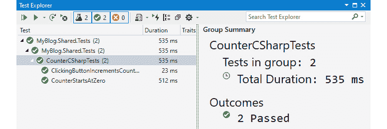
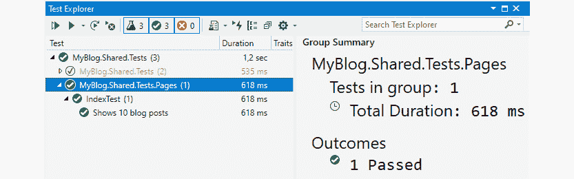

# 十三、测试

在本章中，我们将看一下测试。为我们的项目编写测试将帮助我们快速开发东西。

我们可以运行测试，并确保我们没有破坏任何与最新的变化，而且我们也不必投资我们自己的时间来测试组件，因为这一切都是由测试完成的。测试将会提高产品的质量，因为我们知道以前有效的东西仍然可以正常工作。

但是为用户界面元素编写测试并不总是那么容易；最常见的方法是旋转网站，使用点击按钮的工具，然后读取输出来确定事情是否有效。这种方法的好处是我们可以在不同的浏览器和设备上测试我们的网站。缺点是做这些测试通常需要很多时间。我们需要旋转网络，启动网络浏览器，验证测试，关闭网络浏览器，然后重复下一个测试。

我们也可以在 Blazor 中使用这种方法(和任何 ASP.NET 站点一样)，但是有了 Blazor，我们就有了测试的其他机会。

史蒂夫·桑德森为 Blazor 创建了一个测试框架的胚胎，微软 MVP 埃吉尔·汉森捡起了这个胚胎，并继续开发。

Egil 的框架被称为 **bUnit** ，已经成为 Blazor 社区中测试 Blazor 组件的行业标准。

本章涵盖以下主题:

*   什么是 bUnit？
*   设置测试项目
*   嘲笑美国石油学会
*   写作测试

# 技术要求

确保您已经阅读了前面的章节，或者使用`Chapter12`文件夹作为起点。

你可以在[https://github . com/PacktPublishing/Web-Development-wit-Blazor/tree/master/chapter 13](https://github.com/PacktPublishing/Web-Development-with-Blazor/tree/master/Chapter13)找到本章最终结果的源代码。

注意

如果您使用 GitHub 中的代码进入本章，请确保使用电子邮件注册用户，并按照说明添加用户和向数据库添加管理员角色。可以在 [*第八章*](08.html#_idTextAnchor122) *【认证授权】中找到说明。*

# 什么是 bUnit？

正如在介绍中提到的，一些测试旋转网络浏览器来测试页面/组件，但是 bUnit 采用了另一种方法。

bUnit 是专门为 Blazor 制造的。它可以使用 C#或 Razor 语法定义和设置测试。它可以模拟 JavaScript 互操作以及 Blazor 的身份验证和授权。为了使我们的组件更加可测试，有时我们需要从一开始就考虑这些事情，或者对我们的代码进行一些小的更改。

bUnit 不依赖于网络浏览器，而是在内部呈现输出，并将其展示给我们，以便我们可以根据预定义的输出进行测试。

是我们动手的时候了，所以让我们创建一个测试项目。

# 设置测试项目

为了能够做测试，我们需要一个测试项目:

1.  T o 安装 bUnit 模板，打开 PowerShell，运行如下命令:

    ```cs
    dotnet new --install bunit.template
    ```

2.  确保在 bUnit 网页上查看哪个是模板的最新版本:[https://bunit.egilhansen.com/](https://bunit.egilhansen.com/)。
3.  在 Visual Studio 中，右键单击**我的解决方案**，选择**添加** | **新项目**。
4.  搜索`bUnit`并在结果中选择 **bUnit 测试项目**，然后点击**下一步**。有时候找到一个模板需要时间。我们还可以将项目类型下拉列表更改为 **bUnit** 来查找模板。我们可能需要重新启动 Visual Studio 才能找到它。
5.  命名项目`MyBlog.Shared.Tests`，保持位置不变，点击**下一步**。
6.  选择**。下拉列表中的 NET 5** 。

太好了。我们现在有一个测试项目。

在我们开始嘲笑这个应用编程接口之前，让我们看看我们可以使用的不同方法，这样我们就可以了解一下 bUnit 是如何工作的。

在`MyBlog.Shared.Tests`中，我们应该有以下三个文件:

*   `_Imports.razor`包含我们希望所有 Razor 文件都可以访问的名称空间。
*   `Counter.razor`是我们在 Blazor 模板中默认获得的相同`Counter`组件的副本。
*   `CounterCSharpTest.cs`包含用 C#编写的测试。

让我们从`CounterCSharpTest.cs`文件开始，它包含两个测试:一个检查计数器是否从`0`开始，另一个点击按钮并验证计数器现在是`1`。这两个简单的测试对测试`Counter`组件很有意义。

`CounterStartsAtZero`测试如下:

```cs
[Fact]
public void CounterStartsAtZero()
{
    // Arrange
    var cut = RenderComponent<Counter>();
    // Assert that content of the paragraph shows counter 
    // at zero
    cut.Find("p").MarkupMatches("<p>Current count: 0</p>");
} 
```

让我们把它分解一下。`Fact`属性告诉测试运行人员这是一个不需要参数的*正常*测试。我们也可以使用`Theory`属性告诉测试运行人员测试方法需要参数值，但是对于这个用例，我们不需要参数。

首先，我们安排测试。简单地说，我们设置了做测试所需的一切。Egil 使用`cut`作为组件的名称，代表正在测试的**组件**。

我们在组件类型中运行`RenderComponent`方法和传递，在这种情况下是`Counter`组件。接下来，我们断言组件是否输出了正确的东西。我们使用`Find`方法找到第一个段落标签，然后验证 HTML 看起来像`<p>Current count: 0</p>`。

第二个测试稍微高级一点，看起来像这样:

```cs
[Fact]
public void ClickingButtonIncrementsCounter()
{
    // Arrange
    var cut = RenderComponent<Counter>();
    // Act - click button to increment counter
    cut.Find("button").Click();
    // Assert that the counter was incremented
    cut.Find("p").MarkupMatches("<p>Current count: 1</p>");
}
```

就像前面的测试一样，我们从渲染我们的`Counter`组件开始安排。下一步是在我们点击按钮的地方行动。我们寻找按钮，然后点击`counter`组件中的按钮。只有一个按钮，所以在这种情况下，以这种方式寻找按钮是安全的。

然后是再次断言的时候了，在这里，我们以与前面测试相同的方式检查标记，但是我们寻找`1`而不是`0`。

现在让我们运行测试，看看它们是否通过:

1.  在 Visual Studio 中，通过使用 *Ctrl* + *Q* 搜索来调出**测试资源管理器**。我们也可以在**视图** | **测试浏览器**中找到。
2.  Press **Run all test** in the view. Test Explorer should look like *Figure 13.1*:

    

图 13.1–Visual Studio 测试资源管理器

太好了，现在我们进行了第一次测试，希望能通过。

接下来我们来看看嘲讽 API。

# 嘲讽 API

有种不同的方式来测试我们的应用。测试 API 超出了本书的范围，但是我们仍然需要测试组件，组件依赖于 API。我们可以加速应用编程接口，并针对应用编程接口进行测试，但是在这种情况下，我们只对测试 Blazor 组件感兴趣。

然后，我们可以模拟应用编程接口，或者创建一个不从数据库读取而是从预定义数据集读取的应用编程接口的假副本。这样，我们总是知道输出应该是什么。

幸运的是，我们为 API 创建的接口正是我们创建模拟 API 所需要的。

我们不会为项目实现 100%的测试，所以我们不必模仿所有的方法。请在这一章的最后随意对所有的方法进行测试。

我们可以通过两种方式实现模拟 API。我们可以创建一个内存数据库，但为了简单起见，我们会选择其他选项，并在需要时生成帖子:

1.  在`MyBlog.Shared.Tests`下，右键单击**依赖关系**节点，选择**添加项目引用**。
2.  查看**我的博客。分享**点击**确定**。现在我们的测试项目可以访问共享项目中的所有类以及共享项目引用的所有类，例如`MyBlog.Data.Shared`项目中的**接口**。
3.  选择**我的博客。共享测试**项目。按 *Shift* + *F2* 创建一个新文件并命名文件`MyBlogApiMock.cs`。
4.  添加以下名称空间:

    ```cs
    using MyBlog.Data.Interfaces;
    using MyBlog.Data.Models;
    ```

5.  Implement the `IMyBlogApi` interface; the class should look like this:

    ```cs
    public class MyBlogApiMock :IMyBlogApi
    {
    }
    ```

    现在我们将实现每种方法，这样我们就可以获得数据。

6.  For `BlogPost`, add the following code in the class:

    ```cs
    public async Task<BlogPost>GetBlogPostAsync(int id)
    {
    BlogPost post=new()
        {
            Id = id,
            Text = $"This is a blog post no {id}",
            Title = $"Blogpost {id}",
            PublishDate = DateTime.Now,
            Category = await GetCategoryAsync(1),
        };
        post.Tags.Add(await GetTagAsync(1));
        post.Tags.Add(await GetTagAsync(2));
        return post;
    } 
    public Task<int>GetBlogPostCountAsync()
    {
        return Task.FromResult(10);
    }
    public async Task<List<BlogPost>>GetBlogPostsAsync(int numberofposts, int startindex)
    {
        List<BlogPost> list = new();
        for (int a = 0; a <numberofposts; a++)
        {
             list.Add(await GetBlogPostAsync(startindex +           a));
        }
        return list;
    }
    ```

    当我们得到一个博客帖子时，我们简单地创建一个，并用预定义的信息填充它，我们可以在以后的测试中使用。同样的事情也适用于获得博客文章的列表。

    我们还说数据库里总共有`10`篇博文。

    对于类别，添加以下代码:

    ```cs
    public async Task<List<Category>>GetCategoriesAsync()
    {
        List<Category> list = new();
        for (int a = 0; a < 10; a++)
        {
              list.Add(await GetCategoryAsync(a));
        }
        return list;
    }
    public Task<Category>GetCategoryAsync(int id)
    {
        return Task.FromResult(new Category() { Id = id,      Name = $"Category {id}" });
    } 
    ```

    在这里我们做同样的事情:我们创建名为`Category`后跟一个数字的类别。

7.  The same thing goes for tags; add the following code:

    ```cs
    public Task<Tag>GetTagAsync(int id)
    {
        return Task.FromResult(new Tag() { Id = id, Name =      $"Tag {id}" });
    }
    public async Task<List<Tag>>GetTagsAsync()
    {
        List<Tag> list = new();
        for (int a = 0; a < 10; a++)
        {
             list.Add(await GetTagAsync(a));
        }
        return list;
    }
    ```

    我们不会在 API 中添加其他方法的测试。我们确实需要将它们添加到模拟类中来实现接口。添加以下方法:

    ```cs
    public Task<BlogPost>SaveBlogPostAsync(BlogPost item)
    {
        return Task.FromResult(item);
    }
    public Task<Category>SaveCategoryAsync(Category item)
    {
        return Task.FromResult(item);
    }
    public Task<Tag>SaveTagAsync(Tag item)
    {
        return Task.FromResult(item);
    }
    public Task DeleteBlogPostAsync(BlogPost item)
    {
        return Task.CompletedTask;
    } 
    public Task DeleteCategoryAsync(Category item)
    {
        return Task.CompletedTask;
    }
    public Task DeleteTagAsync(Tag item)
    {
        return Task.CompletedTask;
    }
    ```

我们现在有了一个模拟应用编程接口，它一遍又一遍地做同样的事情，这样我们就可以进行可靠的测试。

# 写作测试

是时候写一些测试了。正如我在本章前面提到的，我们不会为整个站点创建测试；如果你想的话，我们会让你稍后完成。这只是为了了解如何编写测试:

1.  Right-click and select **MyBlog.Shared.Tests**, then select **Add** | **New folder**. Name the folder `Pages`.

    这只是为了我们可以保留一点结构(与我们正在测试的项目相同的文件夹结构)。

2.  选择`Pages`文件夹。按下 *Shift* + *F2* 创建一个新的 Razor 组件并命名文件`IndexTest.cs`。只要记住不要将其命名为与我们正在测试的组件相同；否则，将很难确保我们测试的是正确的。
3.  打开`IndexTest.cs`并添加 bUnit 命名空间:

    ```cs
    using Bunit;
    using Microsoft.Extensions.DependencyInjection;
    using MyBlog.Data.Interfaces;
    using Xunit;
    ```

4.  通过添加以下代码从`TestContext`继承:

    ```cs
        public class IndexTest: TestContext
        {
        } 
    ```

5.  Now we will add the test. Add the following code:

    ```cs
    [Fact(DisplayName ="Shows 10 blog posts")]
    public void Shows10Blogposts()
    {
          var cut = RenderComponent         <MyBlog.Shared.Pages.Index>();
          Assert.Equal(10,cut.FindAll("article").Count());
    } 
    ```

    我们给我们的测试一个显示名称，以便我们理解它的作用。测试非常简单；我们知道我们有 10 篇博文来自模拟 API。我们也知道每篇博文都呈现在一个`article`标签中。我们找到所有`article`标签，并确保总共有 10 个。

    由于我们使用注入，我们需要配置依赖注入，这是我们可以在构造函数中做的事情。

6.  We need to add the `IndexTest` method:

    ```cs
    public IndexTest()
    {
          Services.AddScoped<IMyBlogApi, MyBlogApiMock>();
    }
    ```

    这个方法将在创建类时运行，这里我们声明，如果组件请求`IMyBlogApi`的实例，它将返回我们的模拟 API 的实例。

    这与 Blazor Server 的工作方式相同，在 Blazor Server 中，我们返回一个直接与数据库对话的 API，在 Blazor WebAssembly 中，我们返回一个与 web API 对话的 API 实例。

    在这种情况下，它将返回我们的模拟 API，该 API 返回易于测试的数据。现在我们需要编写实际的测试。

7.  In Visual Studio, bring up Test Explorer by searching for it using *Ctrl* + *Q*. We can also find it in **View** | **Test Explorer**.

    运行我们的测试，看看我们是否得到绿灯，如图*图 13.2* :

    

图 13.2–带索引测试的测试资源管理器

现在我们有一个测试，测试第一个帖子和第十个帖子。考虑到我们所拥有的测试数据，假设中间的帖子按照预期呈现是可以的，但是当然也有可能进一步进行测试。

bUnit 是一个很好的测试框架，而且它是专门为 Blazor 编写的，因此它可以利用 Blazor 的强大功能，这一事实使得它的使用非常令人惊讶。

现在我们有一个简单的测试来测试我们的博客，但是 bUnit 也支持更高级的功能，例如身份验证。

## 认证

使用 bUnit，我们可以测试认证和授权。

然而，进行认证的并不是组件本身。我们在 [*第八章*](08.html#_idTextAnchor122)*认证和授权*中添加到`app.razor`的是`AuthorizeRouteView`，所以在单个组件中测试不会有什么不同。

但是我们可以使用`AuthorizeView`，例如，在我们这样的组件中:

```cs
<AuthorizeView>
    <Authorized>
        <strong>Authorized</strong>
    </Authorized>
    <NotAuthorized>
        <strong>Not Authorized</strong> 
    </NotAuthorized>
</AuthorizeView>
```

我们可以使用`AddTestAuthorization`方法授权我们的测试，如下所示:

```cs
[Fact(DisplayName = "Shows not authorized")]
public void ShowsNotAuthorized()
{
     var authContext = this.AddTestAuthorization();
     var cut = RenderComponent        <MyBlog.Shared.Pages.AuthorizedOrNot>();
     var content = cut.Find("strong").TextContent;
     Assert.Equal("Not Authorized", content);
} 
```

这个方法增加了`TestAuthorization`但是没有授权。然后页面将显示文本**“未授权”**。为了测试用户何时被授权，我们只需将用户设置为已授权:

```cs
[Fact(DisplayName = "Shows authorized")]
public void ShowsAuthorized()
{
    var authContext = this.AddTestAuthorization();
     authContext.SetAuthorized("Testuser",       AuthorizationState.Authorized);
     var cut = RenderComponent        <MyBlog.Shared.Pages.AuthorizedOrNot>();
     var content = cut.Find("strong").TextContent;
     Assert.Equal("Authorized", content);
} 
```

我们可以添加声明、角色等等。我们用于测试的用户与数据库中的用户或角色无关；授权被 bUnit 嘲笑。

认证和授权可能很难测试，但是使用 bUnit，它真的很简单。更难做的事情是测试 JavaScript，但是 bUnit 对此也有很好的支持。

## 测试 JavaScript

bUnit 不支持测试 JavaScript，可以理解。然而，我们可以自己测试互操作。

在这本书里，我们使用了新的.NET 5 语法。在我们的`MyBlog.Shared\Components\ItemList.razor`组件中，我们进行一个 JavaScript 互操作来确认一个项目的删除。

JavaScript 调用如下所示:

```cs
jsmodule = await jsRuntime.InvokeAsync<IJSObjectReference>("import", "/_content/MyBlog.Shared/ItemList.razor.js");
return await jsmodule.InvokeAsync<bool>("showConfirm", "Are you sure?");
```

我们确保加载了 JavaScript 模块，然后执行`showConfirm`方法。

bUnit 中的 JavaScript 测试可以在两种不同的模式下完成–`strict`和`loose`。默认值是`strict`，这意味着我们需要指定每个模块和每个方法。

如果我们选择`loose`，所有的方法都会返回默认值。例如，对于布尔值，它将返回`false`。

为了测试前面的 JavaScript 调用，我们可以添加以下代码:

```cs
    var moduleInterop = fixture.JSInterop.SetupModule       ("/_content/MyBlog.Shared/ItemList.razor.js");
    var showconfirm = moduleInterop.Setup<bool>      ("showConfirm", "Are you sure?").SetResult(true);
```

我们建立了一个模块，其路径与之前的 JavaScript 相同，然后我们指定方法和任何`in`参数。

最后，我们具体说明结果应该是什么。在这种情况下，我们返回`true`，如果我们想删除该项目，这将是 JavaScript 的结果。

干得好！我们现在在项目中有测试。即使我们没有涵盖所有的组件，我们也应该拥有完成测试的所有构件。

# 总结

在这一章中，我们着眼于测试我们的应用。我们研究了如何模拟应用编程接口来进行可靠的测试。我们还介绍了如何测试 JavaScript 互操作以及身份验证。

测试可以加速我们的开发，最重要的是，可以提高我们构建的质量。使用 bUnit 结合依赖注入，可以很容易地构建测试，帮助我们测试组件。

因为我们可以单独测试每个组件，所以我们不必像许多其他测试框架那样登录、导航到站点中的特定位置，然后测试整个页面。

现在我们有了自己的站点，包含可重用组件、身份验证、API、Blazor Server 和 WebAssembly、身份验证、共享代码、JavaScript 互操作、状态管理和测试。我们只有一件事要做:运送它！

下一章 [*第十四章*](14.html#_idTextAnchor201)*部署到生产*了，该出货了。