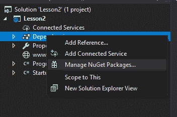
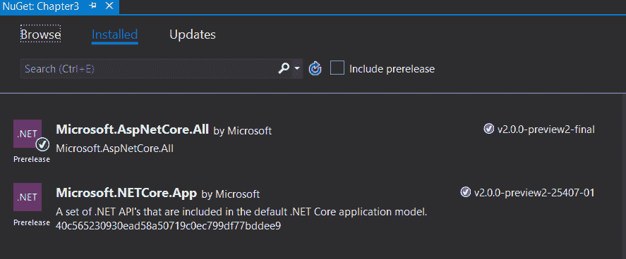
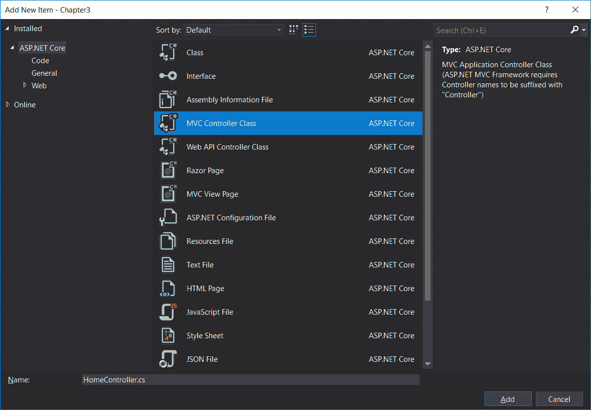
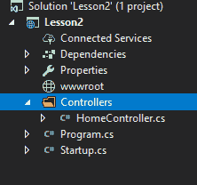
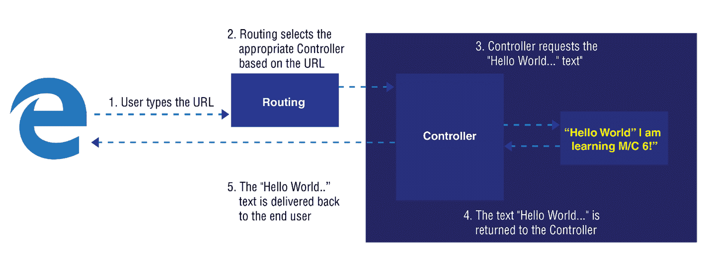
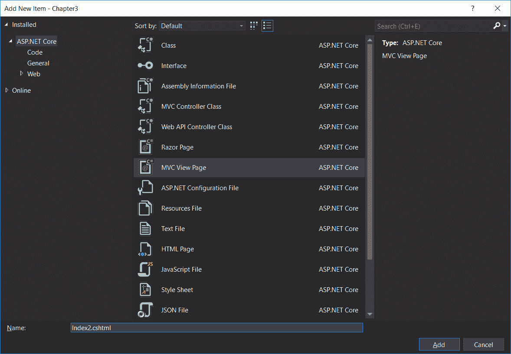
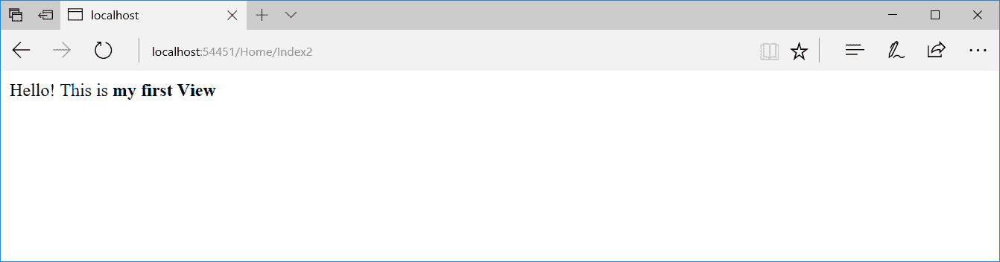
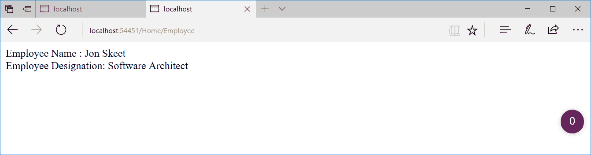
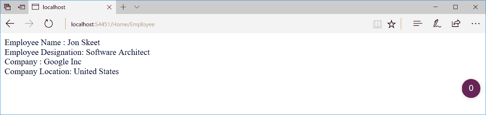

# 控制器

在上一章中，我们讨论了所有 web 应用程序都接收来自服务器的请求，并生成一个返回给最终用户的响应。本章介绍了 ASP.NET MVC 应用程序中控制器的角色，并详细介绍了创建控制器的过程和操作方法

在本章结束时，您将能够：

*   解释 ASP.NET MVC 应用程序中控制器的角色
*   使用路由引擎
*   在应用程序中安装 ASP.NET 核心 NuGet 软件包
*   创建第一个控制器和操作方法
*   添加视图并进行更改，以允许控制器使用该视图
*   添加模型并将该模型数据传递到视图

# ASP.NET MVC 应用程序中控制器的角色

在 ASP.NET MVC 中，控制器负责接收请求并根据输入数据生成输出。您可以将控制器想象为组织应用程序流的业务流的入口点。

If you are intending to write a complex application, it is best to avoid business logic in your controllers. Instead, your controllers should call your business logic. In this way, you can keep the core part of your business technology-agnostic.

在高层，控制器在模型和视图之间进行协调，并将输出发送回用户。这也是通常通过操作过滤器进行身份验证的地方。动作过滤器基本上是拦截器，将在本章的*过滤器*部分详细讨论。下图说明了 ASP.NET MVC 中请求的高级流程（包括步骤），并向我们展示了控制器如何融入全局：


以下是当用户访问 ASP.NET 核心应用程序时将在高层发生的事件序列：

1.  用户在浏览器中键入 URL。
2.  路由引擎根据 URL 的模式选择适当的控制器。
3.  控制器与模型对话，通过其动作方法获取任何相关数据。动作方法是控制器类中的方法。
4.  然后，控制器将数据传递给视图，以可视格式（通常为 HTML 元素）呈现数据。
5.  视图最终被交付给用户，用户将在浏览器中查看该视图。

在讨论控制器之前，让我们先讨论路由概念的基本原理，因为路由引擎在运行时只选择适当的`controller`和`action`方法。

# 分层 Web 应用程序的理想数据流

让我们看看分层 web 应用程序的理想数据流是什么样子的。请看下图：


让我们分析一下图表。解释如下：

*   **浏览器**是用户输入 URL 的媒介
*   相应的**控制器**开始工作
*   **控制器**与**业务层**和**数据层**通信
*   **业务层**将用户请求的数据返回**控制器**

业务层和数据层构成了 MVC 的模型部分。现在，这些层是什么？业务层的工作是使用业务逻辑或功能。数据层涉及外部系统，如数据库。它提供对这些系统的访问。

# 路由简介

路由引擎负责获取传入请求，并根据 URL 模式将该请求路由到适当的控制器。我们可以配置路由引擎，以便它可以根据相关信息选择适当的控制器。换句话说，路由是一种编程映射，它根据某个 URL 模式声明要调用哪个控制器的哪个方法。

按照惯例，ASP.NET MVC 遵循以下模式：`Controller/Action/Id`。

如果用户键入 URL`http://yourwebsite.com/Hello/Greeting/1`，路由引擎选择`Hello controller`中的`Hello controller`类和`Greeting action`方法，并传递`Id`值，因为`1\. XXXController`是一种命名约定，并且假设您的控制器总是以控制器后缀结尾。您可以为某些参数指定默认值，并使某些参数成为可选参数。

以下是示例配置：

```cs
The template: "{controller=Hello}/{action=Greeting}/{id?}");
```

在前面的配置中，我们为路由引擎提供三条指令：

*   使用路由模式`controller/action/id`。
*   如果 URL 中未提供`controller`或`action`的值，则分别使用`controller`和`action`的默认值`Hello`和`Greeting`。
*   将`id`参数设置为可选，以便 URL 不需要此信息。如果 URL 包含此 Id 信息，它将使用它。否则，id 信息将不会传递给`action`方法。

让我们讨论一下路由引擎如何为不同的 URL 选择`controller`类、`action`方法和`id`值。我们将从`URL1`开始，这里：

```cs
URL1: http://localhost/
Controller: Hello
Action method: Greeting
Id: no value is passed for the id parameter
```

The `Hello` controller is passed as the default value as per the routing configuration, as no value is passed as the controller in the URL.

当传递前面的 URL 时，路由处理程序将拾取以下`action`方法：

```cs
public class HelloController : Controller
{
  public ActionResult Greeting(int id)
  {
    return View();
  }
}
```

我们来看`URL2`，这里：

```cs
URL2: http://localhost/Hello/Greeting2
Controller: Hello
Action method: Greeting2
Id: no value is passed for the id parameter
```

The `Hello` controller will be chosen as the URL contains `Hello` as the first parameter, and the `Greeting2` action method will be chosen as the URL contains `Greeting2` as the second parameter. Please note that the default value mentioned in the configuration would be picked only when no value is present in the URL. As the `id` parameter is optional and the URL does not contain the value for `id`, no value is passed to the `id` parameter.

当传递前面的 URL 时，路由处理程序将拾取以下操作方法`Greeting2`：

```cs
public class HelloController : Controller
{
  public ActionResult Greeting(int id)
  {
    return View();
  }
  public ActionResult Greeting2(int id)
  {
      return View();
  }
}
```

我们来看`URL3`，这里：

```cs
URL3: http://localhost/Hello2/Greeting2
Controller: Hello2
Action method: Greeting2
Id: no value is passed for the id parameter
```

As `Hello2` is passed as the first parameter, the `Hello2` controller will be selected, and `Greeting2` is the action method selected since `Greeting2` is passed as the second parameter. As the `id` parameter is optional and no value is passed for the parameter `id`, no value will be passed for the `id`.

当传递前面的 URL 时，路由处理程序将选择以下操作方法：

```cs
public class Hello2Controller : Controller
{
  public ActionResult Greeting2(int id)
  {
    return View();
  }
}
```

我们来看`URL4`，这里：

```cs

URL4: http://localhost/Hello3/Greeting2/1
Controller: Hello3
Action method: Greeting2
Id: 1
```

`Hello3` is the controller selected as it is mentioned as the first parameter. `Greeting4` is the action method, and `1` is the value passed as the `id`.

当传递前面的 URL 时，路由处理程序将选择以下操作方法：

```cs
public class Hello3Controller : Controller
{
  public ActionResult Greeting2(int id)
  {
    return View();
  }
}
```

另一种常见的模式是使用更多 RESTful 编程实践。相反，我们将 URL 视为资源 ID，并将操作作为 HTTP 方法发送，如`GET`或`POST`。

因此，从经典的 MVC 的角度来看，如果你需要编辑一本书，你可以向`http://yourwebsite.com/Books/Edit/1`发送一篇带有`POST`请求的帖子，正文包含新书的详细信息。

但是，从 RESTful 的角度来看，您可以将`http://yourwebsite.com/Books/1`与`PUT`或`PATCH`请求一起使用，请求主体包含书籍细节。

RESTful 编程的要点是要有某种人人都同意的标准化，至少在一定程度上是如此。对于 RESTful，您不必记录 API。每个人都知道，`PUT`请求会替换 HTTP 标准的资源。但是，对于操作，有人可以将其称为“编辑”，而另一个人可以将其称为“更新”。当然，对于不打算用作 API 的 web 应用程序，这就没有什么价值了。但是，您可能希望 web 应用程序附带一个可重用的 API。这就是 RESTful 方法的亮点所在。在这种情况下，您的 web 页面只会成为 API 的一个特例，并且复制更少。

# 活动：查找为 URL 调用的正确方法

**场景**

你们公司发生了网络攻击。管理员想知道黑客通过向您发送恶意 URL 调用了哪个方法。

**瞄准**

查找针对给定 URL（`http://localhost/Hello3/Welcome/1`调用的正确方法。

**完成步骤**

打开编辑器并键入以下代码：

Go to [https://goo.gl/2Jy3W4](https://goo.gl/2Jy3W4) to access the code.

```cs
public class Hello3Controller : Controller
{
    public ActionResult Welcome(int id)
    {
      return View();
    }
...
...
    {
      return View();
    }
}
```

一旦请求到达控制器，控制器将通过与模型对话创建响应，并可能将数据传递给视图，然后将视图呈现给最终用户。

We will discuss routing in detail in a later chapter.

# 在应用程序中安装 ASP.NET Core NuGet 包

我们将立即开始在您的应用程序中安装 ASP.NET Core NuGet 包。

按照以下步骤安装 ASP.NET MVC 的 NuGet 软件包：

1.  在依赖项上单击鼠标右键，然后选择“管理 NuGet 软件包”选项：



2.  我们将看到安装了一个名为 Microsoft.ASPNetCore.All 的包（如下面的屏幕截图所示）。这个包实际上是一个元包，它安装了我们需要的大多数依赖项。



3.  如果我们从依赖项扩展此包，我们将看到：


因此，无论是否使用空项目，我们所需的一切都已安装。

我们的应用程序中安装了 ASP.NET 内核。现在，我们需要告诉我们的应用程序使用 ASP.NETMVC。

这需要对`Startup.cs`文件进行一些更改：

1.  配置应用程序以添加 MVC 服务。这可以通过在 Startup 类的`ConfigureServices`方法中添加以下行来实现：

Go to [https://goo.gl/RPXUaw](https://goo.gl/RPXUaw) to access the code.

```cs
public void ConfigureServices(IServiceCollection services)
{
  services.AddMvc();
}
```

2.  配置路由，以便根据输入的 URL 为传入请求选择正确的控制器。以下代码段需要在`Startup.cs`文件的`Configure`方法中更新：

Go to [https://goo.gl/Xa1YcD](https://goo.gl/Xa1YcD) to access the code.

```cs
public void Configure(IApplicationBuilder app,IHostingEnvironment env)
{
  if (env.IsDevelopment())
  {
    app.UseDeveloperExceptionPage();
  }
  app.UseMvc(routes => 
  {
    routes.MapRoute(
    name: "default",
    template: "{controller=Home}
    /{action=Index}/{id?}");
  });
}
```

在前面的语句中，我们正在为应用程序配置路由。

在本章以及本课程的大部分章节中，我们将手动编写代码或选择一个空模板，而不是依赖脚手架模板。对于那些不熟悉术语 scaffolding 的人来说，scaffolding 是一种功能，它为您生成所选项目（例如，控制器）的所有必要样板代码，而不是您需要编写所有内容。

Though scaffolding templates are useful and save time in generating the boilerplate code, they hide many of the details that beginners have to understand. Once you write code manually, you'll know all the intricacies of how each of the components is contributing to the big picture. Once you are strong in the fundamentals, you can use scaffolding templates to save you time in writing the boilerplate code. Scaffolding is also useful for creating quick administrative pages to edit our database.

# 我们的第一个控制器

在创建控制器之前，我们需要删除以下`app.Run`语句，因为这将返回 Hello World！对于所有传入的请求。由于我们希望传入的请求由控制器处理，因此需要从`Startup`类的 Configure 方法中删除以下代码：

```cs
app.Run(async (context) =>
{
  await context.Response.WriteAsync("Hello World!");
};
```

我们已经在应用程序中安装了 ASP.NET Core。因此，我们准备创建我们的第一个 ASP.NET 核心控制器。创建一个名为`Controllers`的文件夹，并从上下文菜单中添加一个新控制器，如下图所示：


上下文基本上表示请求-响应对以及处理请求所需的其他元数据

For people who used OWIN to develop your own web custom framework without using MVC, it is analogous to `IOwinContext`. And apparently, `app.Run` would be a good entry point to handle HTTP requests manually or for writing a custom framework. After all, HTTP is about retrieving requests and returning responses.

导航到添加|新项目后，将显示以下选项列表。我们将向项目中添加一个 MVC 控制器类：





将创建包含以下内容的类：

```cs
public class HomeController : Controller
{
  // GET: /<controller>/
  public IActionResult Index()
  {
    return View();
  }
}
```

所有控制器，包括 MVC 和 Web API 控制器，都继承自`Controller`基类。在 ASP.NET MVC 的早期版本中，MVC 控制器将从`Controller`类继承，而 Web API 控制器将从`APIController`类继承。

在前面的`HomeController`类中，我们有一个由`Index`执行的单一操作方法，该方法返回相应的视图。当您按原样运行应用程序时，将出现 500 个内部服务器错误。原因是没有为`HomeController`的`Index`操作创建任何视图，ASP.NET 内核试图搜索该视图。由于视图不可用，它返回一个 500 内部服务器错误，并显示消息“InvalidOperationException:未找到视图“Index”。搜索了以下位置：”。无论何时状态码以`5XX`开头，我们都认为是服务器故障。每当状态代码以`4XX`开头时，它就与客户端相关。

与其创建并返回该视图，不如对该操作方法进行简单更改。让我们回传一串，你好世界！我正在学习 MVC！，并更改`IActionResult`的退货类型：

```cs
public string Index()
{
  return "Hello World! I am learning MVC!";
}
```

运行应用程序。你会看到你好世界！我正在学习 MVC！在浏览器中，如以下屏幕截图所示。请确保删除`Configure`方法中的`app.Run`语句，如前所述：


瞧！我们已经更改了 ASP.NET 核心应用程序，以呈现自定义内容，而不是无聊的 Hello World！我们所做的似乎只是一个小小的改进，但我们在 ASP.NET 核心应用程序中使用了控制器和操作方法，这为 web 应用程序开发带来了很多结构和灵活性。

以下屏幕截图显示了运行应用程序时在后台发生的情况：



以下是运行应用程序时发生的一系列步骤：

1.  应用程序在 URL`http://localhost:50140`上运行，其中`50140`是 IIS Express 选择的在我的本地系统上运行应用程序的端口号。这个数字可能会有所不同。
2.  由于我们没有传递任何参数，因此将选择`Controller`和动作方法的默认值。在我们的案例中，`HomeController`将被选为`Controller`，而`HomeController`中的`Index`将被选为动作方式。由于`ID`是可选值且未传递，因此忽略此`ID`参数。
3.  路由引擎选择`Controller`和`action`方法后，控制传递给所选控制器的`action`方法。在我们的案例中，它将是`HomeController`的`Index`动作方式。
4.  在`Index`动作方法中，我们返回一个字符串，Hello World！我正在学习 ASP.NETMVC！该文本从控制器返回，然后返回给用户。

# IActionResult

如果您注意到，控制器的`action`方法中的默认返回类型是`IActionResult`，然后我们将返回类型更改为字符串，以便返回文本 Hello World！。

`IActionResult`是我们可以用来返回不同类型`ActionResult`的接口，从简单的字符串到复杂的 JSON 数据，所以我们不需要改变`action`方法的返回类型来返回字符串。

在前面的示例中，将返回类型更改为字符串以简化操作。现在，让我们做一个简单的更改，通过保持返回类型（`IActionResult`）不变来返回字符串：

```cs
// GET: /<controller>/
public IActionResult Index()
{
  return Content("Hello World! I am learning MVC!");
}
```

在返回字符串时，我们在前面的`action`方法中使用`Controller`类（继承`HomeController`的基础控制器）中名为`Content`的虚拟方法。此`Content()`方法的目的是将字符串转换为`IActionResult`类型。

`IActionResult`能够返回不同的数据类型：

*   `ContentResult`：可以返回文本结果。
*   `EmptyResult`：返回空结果。
*   `FileResult`：返回二进制输出以写入响应。
*   `HttpStatusCodeResult`：提供返回的方式。
*   `JavaScriptResult`：返回可以从客户端执行的脚本。
*   `JSonResult`：返回一个序列化的 JSON 对象。
*   `RedirectResult`：重定向到另一个动作方法。
*   `RedirectToRouteResult`：表示使用指定的路由值字典执行重定向的结果。

These are actually methods in the `ControllerBase` class.

# 活动：实现您自己的 IActionResult

**场景**

您希望了解如何访问字符串的底层响应流。

**瞄准**

编写一个将给定字符串大写的活动结果。

**完成步骤**

1.  首先，将以下类添加到项目中：

Go to [https://goo.gl/GDi6JS](https://goo.gl/GDi6JS) to access the code.

```cs
public class UpperStringActionResult : ActionResult
{
  readonly string str;
  public UpperStringActionResult(string str)
  {
    this.str = str;
  }
  public override void ExecuteResult(ActionContext context)
  {
    var upperStringBytes =
    Encoding.UTF8.GetBytes(str.ToUpper());
    context.HttpContext.Response.Body.Write(
    upperStringBytes, 0, upperStringBytes.Length);
  }
}
```

What is encoding? Encoding is basically a process in which a sequence of characters is put into a specialized format. The characters could be numerical, alphabet, symbols, and so on. The purpose is to serve efficient transmission and storage. What is UTF-8? UTF-8 is the encoding for the web for efficiency reasons.

2.  然后，修改控制器操作，如下所示：

Go to [https://goo.gl/DTWzN4](https://goo.gl/DTWzN4) to access the code.

```cs
public IActionResult IndexUpper()
{
  return new UpperStringActionResult("Hello World! I am learning MVC!");
}
```

3.  然后，运行应用程序。您将获得以下输出：


正如你所看到的，所有的字母都是大写的。

# 添加视图

到目前为止，我们正在从控制器返回一个简单的字符串。虽然这解释了`Controller`和`action`方法如何工作的概念，但它没有太多实际用途。

让我们创建一个名为`Index2`的新`action`方法：

Go to [https://goo.gl/UhaHyz](https://goo.gl/UhaHyz) to access the code.

```cs
public IActionResult Index2()
{
  return View(); // View for this 'Index2' action method
}
```

现在，我们已经创建了返回视图的`action`方法，但是我们仍然没有添加视图。按照惯例，ASP.NETMVC 将尝试在`Views\{ControllerName}\{ActionMethod.cshtml}`文件夹中搜索我们的视图。对于前面的示例，它将尝试搜索`Views\Home\Index2.cshtml`。请注意，`controller`文件夹的名称是`Home`，而不是`HomeController`。前缀仅根据约定需要。由于此文件夹结构和文件不可用，当您尝试通过 URL`http://localhost:50140/Home/Index2`访问此操作方法时，将出现 500 内部服务器错误。

那么，让我们创建一个文件夹结构。右键单击解决方案，从关联菜单中导航到添加|新文件夹，创建名为`Views`的文件夹，然后在`Views`文件夹中创建名为`Home`的子文件夹：


右键点击`Home`文件夹，从关联菜单中导航至添加新项目。将出现一个对话框，如下面的屏幕截图所示。将文件名命名为`Index2.cshtml`，因为我们的`action`方法名为`Index2`。`cshtml`是使用 C#时使用的 Razor 视图引擎（这将在下一章的*视图引擎*和*Razor 视图引擎*部分中详细讨论）扩展。



单击上一屏幕中的添加按钮时，将创建一个名为`Index2.cshtml`的文件，其中包含以下内容：


`@*`是 Razor 视图引擎中的注释语法。您可以在`@{}`块中编写任何 C#代码。

让我们在生成的代码之后添加一个简单的 HTML 块：

```cs
<html>
<body>
  Hello! This is <b>my first View</b>
</body>
</html>
```

现在，当您运行应用程序时，您将获得以下输出：



下图说明了请求流以及我们如何通过视图生成响应：


# 添加模型

模型代表您的业务领域类。现在，我们将学习如何在控制器中使用模型。创建一个`Models`文件夹并添加一个简单的`Employee`类。这只是一个普通的老 C#类：

Go to [https://goo.gl/uBtpw3](https://goo.gl/uBtpw3) to access the code.

```cs
public class Employee
{
  public int EmployeeId { get; set; }
  public string Name { get; set; }
  public string Designation { get; set; }
}
```

在我们的`HomeController`中创建一个新的`action`方法`Employee`，并使用一些值创建`Employee`模型的对象，并将模型传递给视图。我们的想法是使用视图中的员工价值模型将其呈现给用户：

Go to [https://goo.gl/r4Jc9x](https://goo.gl/r4Jc9x) to access the code.

```cs
public IActionResult Employee()
{
  //Sample Model - Usually this comes from database
  Employee emp1 = new Employee
  {
    EmployeeId = 1,
    Name = "Jon Skeet",
    Designation = " Software Architect"
  };
  return View(emp1);
}
```

现在，我们需要为这个`action`方法添加相应的视图。在`View\Home`文件夹中添加一个名为`Employee.cshtml`的新 Razor 视图文件。

添加以下代码段。`@`符号后面的任何内容都被视为剃刀代码。在下面的代码中，我们试图访问传递给视图的`Model`对象的属性。在我们的例子中，`Model`表示我们在`action`方法中构造的`employee`对象。您可以使用`Model`关键字从视图访问对象：

Go to [https://goo.gl/u4gCzN](https://goo.gl/u4gCzN) to access the code.

```cs
<html>
<body>
  Employee Name : @Model.Name <br />
  Employee Designation: @Model.Designation <br />
</body>
</html>
```

当您运行应用程序并键入 URL`http://localhost:50140/Home/ Employee`时，您将看到以下输出：



**Optional**: **Take Up a Challenge** Alter your View code so that it displays `EmployeeID`.
Try to display a non-existing property such as `@Model.Age`. What happens when you do it?
Note that we get an error message if we try to access a non-existing property.

# 将数据从控制器传递到视图

我们刚刚讨论了如何使用`Model`对象将数据从控制器传递到视图。调用视图时，我们将模型数据作为参数传递。但有时您需要从
控制器向视图传递一些临时数据。此临时数据可能不值得使用`model`类。在这种情况下，我们可以使用`ViewBag`或`ViewData`。

`ViewData`是字典，`ViewBag`是相同值的动态表示。

让我们使用`ViewBag`和`ViewData`添加 company name 和 company location 属性，如下代码片段所示：

Go to [https://goo.gl/oYH7am](https://goo.gl/oYH7am) to access the code.

```cs
public IActionResult Employee()
{
  //Sample Model - Usually this comes from database
  Employee emp1 = new Employee
  {
    EmployeeId = 1,
    Name = "Jon Skeet",
    Designation = " Software Architect"
  };
  ViewBag.Company = "Google Inc";
  ViewData["CompanyLocation"] = "United States";
  return View(emp1);
}
```

在`Employee.cshtml`视图文件中进行相应的更改，以便我们可以显示`Company`名称和`CompanyLocation`值：

Go to [https://goo.gl/KmqUhx](https://goo.gl/KmqUhx) to access the code.

```cs
<html>
<body>
  Employee Name : @Model.Name <br />
  Employee Designation: @Model.Designation <br />
  Company : @ViewBag.Company <br />
  Company Location: @ViewData["CompanyLocation"] <br />
</body>
</html>
```

在进行上述更改后运行应用程序：



`ViewBag`和`ViewData`代表同一个集合，尽管集合中的条目是通过不同的方法访问的。`ViewBag`值是动态值，在运行时执行，`ViewData`是通过字典访问的。

为了测试这一点，让我们对`view`文件做一个简单的更改：

```cs
<html>
<body>
  Employee Name : @Model.Name <br />
  Employee Designation: @Model.Designation <br />
  Company : @ViewData["Company"] <br />
  Company Location : @ViewBag.CompanyLocation <br />
</body>
</html>
```

尽管`Company`值是使用`Controller`中的`ViewBag`存储的，但我们正在使用`ViewData`访问它。`CompanyLocation`值的情况也是如此。我们已经使用`ViewData`在控制器中存储了该值，但我们正在使用`ViewBag`访问该值。

在进行上述更改后运行应用程序时，您将看到与以前相同的结果。

# 过滤器

ASP.NET MVC 中的过滤器使您能够在执行管道中的特定阶段之前或之后运行代码。它们可以全局配置、按控制器配置或按操作配置。可以将过滤器视为拦截器。

有不同种类的过滤器，每个过滤器在管道中的不同阶段执行。例如，在执行`action`方法时执行动作过滤器。

让我们用一个简单的例子来看看动作过滤器（一种过滤器）是如何工作的。

我们已经创建了一个简单的控制器，`DateController`，在这里我们只是显示时间。在这个`action`方法中，我们使用一个名为`ResponseCache`的预定义操作过滤器，它在指定的持续时间（以秒为单位）内缓存响应。在下面的代码片段中，我们提到了持续时间为`600`秒。因此，响应将被缓存 10 分钟：

Go to [https://goo.gl/pEBqt6](https://goo.gl/pEBqt6) to access the code.

```cs
public class DateController : Controller
{
  [ResponseCache(Duration = 600)]
  public IActionResult Index()
  {
    return Content(DateTime.Now.ToShortTimeString());
  }
}
```

当我们第一次运行它时，它会按预期显示时间。但是，当您刷新浏览器（这会间接再次触发请求）时，时间不会更新，因为响应已被应用程序缓存。

在下面的屏幕截图中，即使时间是 7:43，应用程序仍显示为 7:40：


现在，我们来看看 ASP.NET 核心中可用的一些预定义类型的过滤器。

以下是一些不同类型的过滤器：

*   **授权过滤器**：这些过滤器用于授权，主要用于确定当前用户是否被授权进行请求。
*   **资源过滤器**：这些过滤器在授权后处理请求，是在请求离开过滤管道之前最后处理请求的过滤器。它们用于实现缓存或通过传递过滤器管道。
*   **动作过滤器**：这些 wrap 调用指向单个`action`方法调用，可以操作动作中传递的参数以及从中返回的动作结果。
*   **异常过滤器**：异常过滤器用于管理 ASP.NET MVC 中未处理的异常。
*   **结果过滤器**：结果过滤器包装单个动作结果，仅在`action`方法成功执行时运行。

With the help of caching we can immediately return results that are calculated previously, thus totally avoiding executing the request-response pipeline. The disadvantage is that we would be showing stale data.

# 活动：编写自定义筛选器

**场景**
您需要编写一个过滤器，该过滤器只允许在周日应用的操作。你会怎么做？

**瞄准**
编写自定义过滤器。

**完成步骤**

1.  打开编辑器并编写以下代码：

Go to [https://goo.gl/9QKgbS](https://goo.gl/9QKgbS) to access the code.

```cs
public class SundayFilter : Attribute, IActionFilter
{
  public void OnActionExecuting(ActionExecutingContext context)
  {
    if (DateTime.Now.DayOfWeek != DayOfWeek.Sunday)
    context.Result = new ContentResult()
    {
      Content = "Sorry only on sundays!"
    };
}
  public void OnActionExecuted(ActionExecutedContext context)
  {
  // do something after the action executes
  }
}
```

Setting results in the filter causes short circuiting, so our action does not run.

2.  现在，我们可以将此属性应用于我们的操作：

Go to [https://goo.gl/x1ij7Z](https://goo.gl/x1ij7Z) to access the code.

```cs
[SundayFilter]
public IActionResult Employee()
{
…
…
}
```

您已成功创建自定义筛选器。

# 总结

在本章中，我们从头构建了第一个 ASP.NET 核心应用程序。我们已经了解了控制器如何适应整个 ASP.NET MVC 应用程序，以及如何使用`action`方法构建我们的第一个控制器。我们还学习了如何在控制器中使用模型和视图。我们还讨论了使用`ViewBag`和`ViewData`将数据从控制器传递到视图的不同方式。我们还学习了 ASP.NET MVC 中的过滤器以及如何使用 ASP.NET 核心中预定义的过滤器。