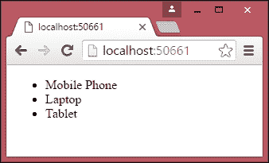
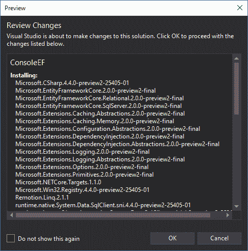
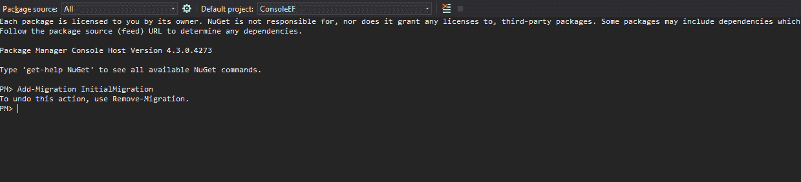
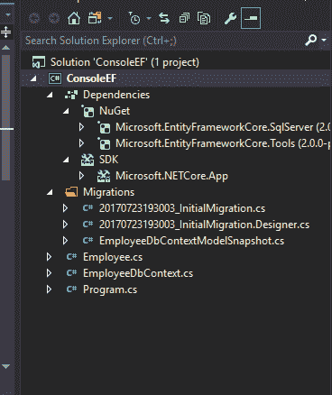
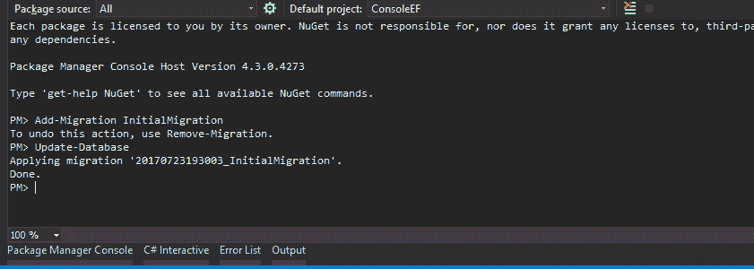
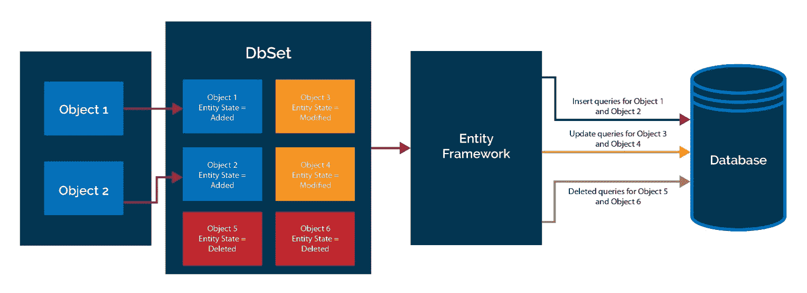
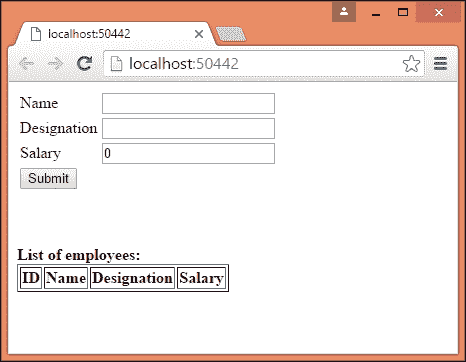

# 四、模型

数据是每个应用的核心。用户将数据输入应用，编辑输入的数据，然后搜索数据。我们甚至可以说，我们构建的应用只是我们对应用数据执行的操作的接口。因此，任何框架都绝对有必要提供一种机制，使数据操作更容易和更易于管理。ASP.NET MVC 中的模型用于表示业务域数据。

在本章结束时，您将能够：

*   解释模型及其用途
*   创建一个简单的模型，并在 ASP.NET MVC 应用的控制器和视图中使用它
*   创建特定于 ViewModel 的模型
*   在模型和 ViewModels 上下文中使用 ASP.NET MVC 应用中的数据流
*   解释实体框架的目的及其特点和优点
*   使用实体框架添加、更新和删除数据
*   在 ASP.NET MVC 应用中使用实体框架

# 模型简介

模型是简单的**POCO**（**普通的旧 C#Objects**类）类，代表您的业务领域数据。它们基本上模拟真实世界的实体。我们可以将它们视为真实世界概念和实体的代码反射。对于电子商务业务，模型类应为`Product`、`Order`和`Inventory`。如果你正在为一所大学申请，示范班应该是`Student`、`Teacher`和`Subject`。模型表示应用中的业务域数据，它们不知道应用中正在使用的底层数据库。事实上，您甚至不需要数据库来处理模型。

# 创建 ASP.NET Core 应用

以下是创建 ASP.NET Core 应用的步骤：

1.  确保使用空模板创建 ASP.NET Core 应用。
2.  创建一个`Controllers`文件夹，用一个`Index`动作方法创建一个`HomeController`。
3.  为 ViewModel 创建以下文件夹/文件：
    *   `Views`：此文件夹位于您的项目中。
    *   `Views\_ViewStart.cshtml`：标识`Layout`文件的名称。
    *   `Views\Shared`：此文件夹保存应用的所有共享视图组件。
    *   `Shared\_Layout.cshtml`：此文件标识 web 应用结构的外观。
    *   `Views\Home`：此文件夹包含您的`HomeController`的所有视图。
    *   `Views\Home\Index.cshtml`：这是`HomeController`索引动作方式对应的视图。
4.  并确保您的`Startup.cs`如下所示：

Go to [https://goo.gl/edbYJx](https://goo.gl/edbYJx) to access the code.

```cs
public class Startup
{
// This method gets called by the runtime. Use this method to add services to the container.
// For more information on how to configure your application, visit
https://go.microsoft.com/fwlink/?LinkID=398940
public void ConfigureServices( IServiceCollection services)
…
…
}
```

现在，我们已经创建了一个带有控制器和视图的 ASP.NET Core 应用。

让我们在应用中创建一个`Models`文件夹；此文件夹将包含所有模型文件。在实际应用中，此文件夹和相应的模型文件将位于不同的项目中。为了简单起见，我们将`Models`文件夹及其文件保存在同一个项目中。

让我们在`Models`文件夹中创建一个简单的`Product`模型类：

```cs
public class Product
{
  public int ProductId { get; set; }
  public string Name { get; set; }
  public decimal Price { get; set; }
}
```

这个`Product`模型类与任何其他 C#类没有什么不同，它包含一些关于产品的属性。

更新`HomeController`中的`Index`动作方法，使用`Product`模型，如下代码片段所示。我们正在构建模型数据，并将模型数据传递给视图，以便向用户显示。但是，*不建议*在控制器的操作方法中构建模型数据，因为它违反了关注点分离。仅为了简单起见，我们在 action 方法中构建模型数据：

Go to [https://goo.gl/Pobwwi](https://goo.gl/Pobwwi) to access the code.

```cs
public IActionResult Index()
{
  /* Build the products model. It is NOT RECOMMENDED to build models in Controller action methods like         this.
  * In real world application, these models and the respective Data Access Layer(DAL) would be in separate     projects. 
  * We are creating it here to make things simpler to explain */
  List<Product> Products = new List<Product> 
  {
…
…
  };
  return View(Products);
}
```

更新相应的`Index`视图方法，在每个产品中使用模型数据循环，并将其显示为无序列表项。第一行中的`@model`表示模型元数据，即传递给视图的数据类型。`foreach`循环中的模型表示实际数据本身，即我们案例中的产品列表：

When copying from GitHub remember to remove the comments before the return statement and the curly brace.

```cs
@model List<Lesson4.Models.Product>
<ul>
  @foreach (var Product in Model)
  {
    <li>@Product.Name</li>
  }
</ul>
```

运行应用时，将获得以下输出：



我们已经成功地创建了一个模型，并在控制器和视图中使用了它。

让我们创建一个相对复杂的模型类，`Order`（`Models`文件夹中的`Order.cs`，其中包含产品及其总量的列表：

Go to [https://goo.gl/p97rGp](https://goo.gl/p97rGp) to access the code.

```cs
public class Order
{
  public int OrderId { get; set; }
  public List<Product> Products { get; set; }
  public decimal Total { get; set; }
}
```

对于`Total`字段，我们选择十进制而不是双精度，因为为了提高效率，双精度在内存中存储为二进制。然而，这使得一些十进制数字无法表示，因此计算机会进行一些舍入来近似。另一方面，十进制的存储方式和我们人类的计算方式完全一样，所以十进制对于货币价值来说很有用。双倍有利于科学计算。

以下是您的文件夹结构的外观：


现在我们必须更新`Index`动作方法以使用`Order`模型。一旦我们建立了产品列表，我们就将产品列表分配给`Order`属性，并计算订单的总成本。这些计算通常作为业务层的一部分进行。同样，为了简单起见，我们在这里构建数据模型和计算；在现实世界的应用中永远不应该出现这种情况。

粗体突出显示的代码是我们在操作方法中所做的更改：

```cs
// GET: /<controller>/
public IActionResult Index()
{
…
…
  };
  Order order = new Order();
 order.Products = Products;
 order.Total = Products.Sum(product =>
 product.Price);
 return View(order);
}
```

视图将更新以适应模型更改。模型元数据（`@model`已更改，表示`Order`的信息已传递给视图，而不是产品列表。

然后，我们以表格形式显示产品列表。请注意，所有模型数据（本例中为`Order`对象及其属性）都可以通过模型访问。例如，`Products`类可以通过`Model.Products`访问，`Total`的值可以通过`Model.Total`获取：

Go to [https://goo.gl/efhye6](https://goo.gl/efhye6) to access the code.

```cs
@model Lesson4.Models.Order
<table border="1">
  <tr>
    <th>Product Name</th>
    <th>Price</th>
  </tr>
  @foreach (var Product in Model.Products)
...
...
</table>
```

运行应用时，您将看到以下输出：


# 特定于视图组件的模型

在某些情况下，您可能只想更新大型模型中的几个属性，或者希望基于几个模型创建新模型。在这种情况下，最好创建特定于视图的新模型。

例如，假设我们正在构建一个屏幕，您可以在其中更新产品的价格。这个简单的屏幕可能只包含三个属性：产品 ID、产品名称和产品价格。但是产品的模型可能包含 30 多个属性来保存产品的所有细节，例如制造商、颜色和尺寸。我们不需要发送包含所有属性的完整模型，而是可以创建一个特定于此视图的新模型，该模型只包含几个属性 ID、名称和价格。

# 视图模型

ViewModels 是更新模型时，视图将自动更新的实体，反之亦然。在许多在线文章中，甚至在一些书籍中，作者提到了**视图模型**，而实际上它们指的是特定于视图的**模型。**

在 ViewModels 中，绑定是双向的：当您更新模型或视图时，另一个将自动更新。

Let us consider a simple example. You have a form with various fields on the left-hand side and print preview on the right-hand side. In this case, whatever you type in real time in the form will be reflected immediately on the right-hand side. In such cases, you can use pure ViewModels when you type; your ViewModel will be updated and that ViewModel will be consumed in the right-hand side print preview. These pure ViewModels are being used in advanced JavaScript frameworks such as KnockoutJS and AngularJS.

在特定于视图的模型中，我们仅以一种方式进行绑定，即从模型到视图。这里，我们将发送一个特定于视图的模型，而不是通用模型（表示业务域类）。

然而，在本课程中，为了简洁起见，我们将特定于视图的模型称为 ViewModels。除非另有规定，否则应将所有视图模型作为特定于视图的模型来读取。所以，我犯了其他作者犯的同样的错误（我不打算这么做）。

Using ViewModels is entirely optional.

使用 ViewModels 有几个缺点。首先，必须为 ViewModel 创建一个新类。其次，您需要编写从 ViewModel 到 view 的转换代码，反之亦然。有一些框架可以自动化这个过程，比如 AutoMapper。

ViewModels 在任何有意义的地方都是很好的实践，因为它减少了耦合。

# 关于模型的数据流

以下框图显示了 ASP.NET MVC 应用中的数据流：


数据流的两个重要方面如下所示：

*   **数据源**：表示您的应用数据。应用数据可以驻留在任何地方，从成熟的 RDBMS（如 SQL Server）到简单的 Excel 电子表格，或者介于两者之间的任何东西。
*   **模型**：如前所述，这些模型代表应用的业务域数据，与所使用的数据源无关。同一模型可用于不同的数据源。

我们可以使用我们视图中的**模型**来获取数据或呈现数据。在某些视图中，可能不需要模型的所有属性。因此，我们不是将整个模型发送到视图，而是创建特定于视图的模型，并在视图中使用它们。这使事情变得更简单。

以下是使用模型在 ASP.NET Core 中存储或检索记录时发生的高级事件序列：

1.  用户在应用中以表单（使用视图创建）的形式输入数据。表单中的字段不需要表示完整的模型，因为我们只需要模型中的一些属性。
2.  输入的数据被传递到发生模型绑定的控制器。模型绑定是将在视图中输入的数据映射到模型或 ViewModel 的过程。

3.  如果在 ViewModel 中接收到数据，那么我们将把 ViewModel 转换为模型。
4.  最后，模型数据存储在数据源中。

Until now, we have been handling only in-memory data in our application. In almost all real-world applications, some form of the database will be used for data storage, access, and retrieval. In the next section, we will discuss Entity Framework (ORM framework), which makes data access simpler from a .NET application.

# 活动：修改代码以显示总折扣

**场景**

您希望修改代码，使其在总额大于 1000 的情况下将总额折扣 10%，并在总额中显示此折扣。

**瞄准**

修改代码以显示总折扣。

**完成步骤**

1.  更改`Order`类，如下所示：

Go to [https://goo.gl/Q58VD2](https://goo.gl/Q58VD2) to access the code.

```cs
public class Order
{
  public int OrderId { get; set; }
  public List<Product> Products { get; set; }
  public decimal Total { get; set; }
  public decimal Discount => Total > 1000M ? Total * 0.1M : Total;
}
```

2.  更改视图，如下所示：

Go to [https://goo.gl/ScepWa](https://goo.gl/ScepWa) to access the code.

```cs
@model Lesson4.Models.Order
<table border="1">
  <tr>
    <th>Product Name</th>
    <th>Price</th>
  </tr>
  @foreach (var Product in Model.Products)
  {
  <tr>
    <td>@Product.Name</td>
    <td>@Product.Price</td>
  </tr>
  }
...
...
</table>
```

# 模型绑定

模型绑定是将来自视图的模型数据映射到控制器中动作方法的 ViewModel 参数的过程。

模型绑定消除了手动读取表单数据并将其分配给现有对象的需要。这将是非常乏味和容易出错的。还可以增强和自定义模型绑定。它是自动解析传入请求的强大机制。

让我们考虑一个简单的表单，有两个表单字段：提交表单时，这些值将映射到控制器动作方法的 ViewModel 对象。模型绑定负责这个映射。模型绑定器在表单字段、查询字符串和请求参数中查找匹配项。

在前面的示例中，ModelBinder 将无任何问题地拾取具有这些属性的任何类。

由于以下`Person`类包含`Name`和`EmailID`属性，因此模型绑定器不会抱怨使用此模型映射表单中输入的值：

```cs
public class Person
{
  public string Name { get; set; }
  public string EmailID { get; set; }
}
```

下面的代码片段展示了如何在 action 方法中使用`Person`类：

```cs
public ActionResult Add(Person p)
{
  return View();
}
```

# 实体框架

如果我们使用关系数据库，那么数据和域类之间存在阻抗不匹配，因为数据是关系的，而域是由对象组成的。使用 ORM 的目的是消除（或隐藏）这种不匹配，这样我们就可以完全忽略持久性问题，转而关注代码，而不是试图生成讨厌的 SQL 语句。话虽如此，仍有许多有效的案例可以回溯到 SQL 语句，例如性能调优案例或复杂报告。

**实体框架**（**EF**）是**对象关系映射**（**ORM**）框架，使开发人员能够直接处理特定领域的对象进行数据访问，而不是处理数据库查询。这大大降低了应用数据访问层的代码复杂性。

在讨论实体框架及其功能之前，让我们暂停片刻，思考一下在使用 ADO.NET 时尝试将某些信息保存到数据库时所遵循的步骤：

1.  构造业务域对象。
2.  创建到数据库的连接。
3.  打开连接。
4.  与命令类型一起创建命令对象。
5.  将业务域对象的属性添加到命令对象的参数中。
6.  执行将数据保存到数据库中的命令。

对于常见的操作，例如将一段数据保存到数据库中，我们必须遵循以下六个步骤。

如果您使用的是 ORM 框架，如实体框架，则只需要三个步骤：

1.  构造业务域对象。
2.  为您的业务域对象创建`DbContext`类。`DbContext`类的实例表示与数据库的会话。
3.  使用`DBContext`类的实例将其保存到数据库中。

你可能想知道这怎么可能。

事实上，在后台，Entity Framework 创建到数据库的连接并执行查询以将业务域对象保存到数据库。为了简单起见，Entity Framework 为您编写所有数据访问代码，以便您能够集中精力实现应用的业务功能，而不是编写数据库层代码。

**实体框架独立于 ASP.NET MVC**

如前所述，Entity Framework 是用于访问数据的 ORM 框架，独立于 ASP.NET MVC。实体框架可以应用于 Type T0\. Windows 通信基金会 Ty1 T1（MultT2WCF PosiT3）服务、Web API 服务，甚至在控制台应用中。您可以在任何类型的应用中使用实体框架，并利用它使用对象访问数据。实体框架的概念和功能保持不变，而与您使用的应用类型无关。

现在，我们将在控制台应用中使用实体框架。这使我们能够专注于手头的任务并演示实体框架的功能，而不是处理 ASP.NET Core 应用的样板代码。在本章后面的部分中，我们将集成实体框架和 ASP.NET Core 应用。

SQL server 实体框架的最新版本是 EntityFrameworkCore。与以前的版本（Entity Framework 6）相比，它带来了显著的变化。但是，在构建 ASP.NET Core 应用时，EntityFrameworkCore 是推荐的版本，因此我们将在本书中使用该版本。

We need a database to explain many of the features of Entity Framework. Before continuing, please use the following link to install SQL Server 2016 Express or (LocalDB)j or newer on your PC: [https://www.microsoft.com/en-us/sql-server/sql-server-editions-express](https://www.microsoft.com/en-us/sql-server/sql-server-editions-express)

# 使用实体框架创建控制台应用

接下来我们将研究如何使用实体框架创建控制台应用。请按照以下步骤创建一个简单的控制台应用：

1.  导航到文件|新建项目并选择控制台应用（.NET Core）。

2.  将项目命名为`ConsoleEF`并单击确定：


# 安装实体框架核心 NuGet 包

有两种方法可以在应用中安装任何 NuGet 软件包：

*   使用 NuGet 包管理器
*   使用包管理器控制台

我们将研究使用 NuGet 包管理器的第一个选项。

# 使用 NuGet 包管理器

喜欢图形界面的人可以使用此选项：

1.  右键单击 console 项目并从上下文菜单中选择 Manage NuGet Packages：


2.  在 NuGet 包中搜索`Microsoft.EntityFrameworkCore.SqlServer`。选择 Microsoft.EntityFrameworkCore.SqlServer 后，单击安装：


3.  单击 Install 后，NuGet 软件包管理器将要求您查看更改。单击“确定”：



4.  在许可证接受窗口中单击我接受：


5.  单击 I Accept 后，它将安装实体框架及其所有依赖项。在输出窗口中，安装完成后，您将收到一条完成消息：

```cs
Time Elapsed: 00:00:03.0619983
========== Finished ==========
Restoring NuGet packages...
Time Elapsed: 00:00:00.3355224
========== Finished ==========
```

# 安装实体框架命令

为了执行迁移活动，我们需要安装 EntityFramework 工具包。迁移包括创建数据库及其关联表。架构中的任何更改也将由迁移来处理：


如前所述，在使用实体框架时，为了与数据库交互，我们需要遵循三个步骤：

1.  创建模型类。
2.  为您的业务域对象创建`DbContext`类。`DbContext`类的实例表示与数据库的会话。
3.  构造业务域对象，并使用`DBContext`类的实例将其保存到数据库中。

让我们详细讨论前面的每个步骤，并尝试将对象保存到数据库中。

# 创建模型类

`Model`类是简单的 POCO 对象，可以与实体框架一起使用。

让我们为我们的业务域对象创建一个 POCO 类，在我们的例子中是`Employee`类。在我们的控制台应用中命名新文件名`Employee.cs`。这个`Employee`类包含员工的一些属性，并且没有特殊的属性或字段使其与实体框架一起工作。

让我们看看下面的代码片段：

```cs
public class Employee
{
  public int EmployeeId { get; set; }
  public string Name { get; set; }
  public decimal Salary { get; set; }
  public string Designation { get; set; }
}
```

按照惯例，如果属性名为`Id`或`ClassName`+`Id`，则实体框架在创建数据库表时会将其视为主键。

具有字符串数据类型的属性将创建为`nvarchar(max)`类型的字段。但是，我们可以通过使用注释来覆盖此行为，这将在后面讨论。

# 创建 DbContext 类

`DbContext`类的实例表示到数据库的会话，该`DbContext`类为您的应用执行大部分繁重的数据访问。创建一个名为 EmployeeDbContext 的新类，其内容如下：

Go to [https://goo.gl/hbju3w](https://goo.gl/hbju3w) to access the code.

```cs
using Microsoft.EntityFrameworkCore;
namespace ConsoleEF
{
  public class EmployeeDbContext : DbContext
  {
    public DbSet<Employee> Employees { get; set; }
    protected override void OnConfiguring(DbContextOptionsBuilder optionsBuilder)
    {
      optionsBuilder.UseSqlServer(@"Data Source=
      (localdb)\MSSQLLocalDB;Initial Catalog=
      EFConsole;Integrated Security=True;Connect
      Timeout=30;
        Encrypt=False;TrustServerCertificate=True;
        ApplicationIntent=ReadWrite;
        MultiSubnetFailover=False");
    }
}
```

在前面的代码片段中有几点需要注意：

*   将`Microsoft.EntityFrameworkCore`名称空间包括在此名称空间中可用的`DbContext`类。我们的连接字符串目前是硬编码的，但我们可以很容易地使其可配置。
*   为了使用`DbContext`API，必须创建一个继承自`DbContext`类的类，以便我们可以访问`DbContext`API 的方法。我们已经创建了`EmployeeDbContext`类，它是从 DbContext 类继承的。
*   `DbSet`是允许对给定实体类型执行实体框架操作的类。我们需要为应用中使用的每个实体类型创建`DbSet`对象。在本例中，我们只使用一个`DbSet`对象，因为我们正在使用`Employee`类。

# 创建迁移

迁移是记录数据库所有更改的过程。编写迁移可以确保数据库模式也随着应用的发展而发展。它还解决了版本控制问题。如果我们有 10 个客户，并且每个客户都运行不同版本的应用，那么我们就不必跟踪哪个客户安装了哪个模式。由于迁移的自动化过程和迁移是代码本身的一部分，我们所要做的就是运行迁移，并保证数据库模式将处于正确的状态。

按照以下步骤创建迁移：

1.  `Add-Migration`是增加迁移的实体框架命令，如下图：



2.  添加迁移后，您可以通过执行`Remove-Migration`实体框架命令撤销更改。`Migrations`目录如下：



3.  通过发出实体框架命令`Update-Database`更新数据库，该命令根据迁移中可用的信息更新数据库表。由于我们之前已经安装了`EntityFramework.Commands`包，这些命令将可用于应用：



4.  更新数据库后，通过从“视图”菜单中检查 SQL Server 对象资源管理器，可以查看数据库中的更改：


5.  执行数据库操作以将业务域对象保存在数据库中。您可以手动创建数据库，如果数据库不可用，它将为您创建一个数据库。`Main`方法更新为以下代码：

```cs
using System;
namespace ConsoleEF
{
  class Program
  {
    static void Main(string[] args)
    {
      AddEmployee();
    }
    static void AddEmployee()
    {
      using (var db = new EmployeeDbContext())
      {
        Employee employee = new Employee
        {
          Designation = "Software Engineer",
          Name = "Scott",
          Salary = 5600
        };
        db.Employees.Add(employee);
        int recordsInserted = db.SaveChanges();
        Console.WriteLine("Number of records inserted:" + recordsInserted);
        Console.ReadLine();
      }
    }
  }
}
```

首先，我们正在构建业务域对象。然后，我们将构造的 Employee 对象添加到`DbContext`类的 Employee 的`DbSet`中。最后，我们将调用`SaveChanges`方法`DbContext`API，它将保存对数据库的所有挂起的更改。

您可能想知道，当我们甚至没有为它提供连接字符串时，它如何将其保存到数据库中。

让我们讨论一下运行程序时幕后发生了什么：

*   当您更改任何`DbSet`集合时，Entity Framework 会检查数据库是否存在。如果不存在，则使用<`Namespace of DbContextName`>模式创建一个新的。在我们的例子中，将创建一个名为`EF6.EmployeeDbContext`的数据库。
*   然后，为`DbSet`中声明的实体创建数据库表。按照惯例，实体框架使用实体的复数形式作为表名。正如我们为`Employee`实体声明的`DbSet`，实体框架创建了`Employee`的复数形式，并创建了名为`Employees`的表。

执行以下代码时，将创建数据库和表：

```cs
db.Employees.Add(employee);
```

当执行`SaveChanges`方法时，`Employee`对象中的数据将保存到数据库中，并返回受影响的记录数。在前一种情况下，它返回`1`。

再次运行应用时，将跳过前面提到的前两个步骤，因为数据库和表已经创建。

查询数据库时，可以看到新插入的记录：


以下是查询数据的屏幕截图：


# SaveChanges 方法的工作原理

当我们进行更改时，实体框架跟踪每个对象的状态，并在调用`SaveChanges`方法时执行相应的查询。这使得开发人员无法跟踪在代码的不同位置发生的对象更改。开发人员很难自己跟踪这些更改。

`SaveChanges`方法为您带来了透明的持久性，也就是说，您的应用将在业务对象上设置数据，并且在底层的某个地方，它将被保存，但会自动保存。`SaveChanges`方法只是将跟踪的更改刷新到数据库中，保持内存和数据库同步。

例如，当我们将一个`Employee`对象添加到员工集合（`DbSet`中时，该对象在`Addedstate`中被跟踪为`Entity`。调用`SaveChanges`时，实体框架为其创建`insert`查询并执行。更新和删除对象的情况也是如此。实体框架将各个对象的`Entity`状态设置为`Modified`和`Deleted`。调用`SaveChanges`时，创建并执行`Update`和`Delete`查询：



上图解释了`SaveChanges`方法如何在不同类型变更的高级别上工作。我们有两个 POCO 对象（对象 1 和对象 2），它们已添加到 employees`DbSet`对象中。假设对象 3 和对象 4 已修改，对象 5 和对象 6 处于删除状态。当您调用`SaveChanges`方法时，它会创建三组查询。第一组查询用于添加对象，从而针对数据库执行`insert`查询。在第二组查询中，为状态被修改的对象创建并执行`Update`查询。最后，对所有删除的状态对象执行`Delete`查询。

# 更新记录

让我们尝试使用实体框架更新插入的员工记录的工资：

Go to [https://goo.gl/4k5J6a](https://goo.gl/4k5J6a) to access the code.

```cs
static void UpdateSalary()
{
  using (var db = new EmployeeDbContext())
  {
    Employee employee = db.Employees.Where(emp
    => emp.EmployeeId == 1).FirstOrDefault();
    if (employee != null)
    {
      employee.Salary = 6500;
      int recordsUpdated = db.SaveChanges();
      Console.WriteLine("Records updated:" +recordsUpdated);
      Console.ReadLine();
    }
  }
}
```

在前面的方法中，我们找到带有`EmployeeId = 1`的员工。然后，我们将员工的工资更新为`6500`并将`employee`对象保存到数据库中。请注意，在前面的方法中，我们与数据库交互两次，一次找到正确的员工记录（读取操作），另一次更新记录（更新操作）：

```cs
static void Main(string[] args)
{
  UpdateSalary();
}
```

还要确保您添加了`using System.Linq`；到文件的顶部。

更新`Main`方法以调用`UpdateSalary`方法。查询数据库时，您应该会看到包含更新信息的记录：


确保单击“刷新”按钮。

# 删除记录

删除记录有点棘手，因为它需要直接设置状态。在下面的方法中，我们首先获取对象并将对象的状态设置为 Deleted。使用`db.Delete`方法而不是设置状态将意味着该记录立即从数据库
中删除。然而，情况并非如此。实际删除将一直挂起，直到我们调用`SaveChanges`。一旦我们调用了`SaveChanges`方法，它将为对象生成删除查询并执行，然后最终删除数据库中的记录：

Go to [https://goo.gl/QgqKCM](https://goo.gl/QgqKCM) access the code.

```cs
static void DeleteEmployee()
{
  using (var db = new EmployeeDbContext())
  {
    Employee employeeToBeDeleted =
    db.Employees.Where(emp => emp.EmployeeId ==1).FirstOrDefault();
    if (employeeToBeDeleted != null)
...
...
  }
}
```

在 Main 方法中进行更改，并确保其外观如下所示：

```cs
static void Main(string[] args)
{
  DeleteEmployee();
}
```

# 活动：手动控制事务

**瞄准**

手动控制事务并自己提交。

**完成步骤**

代码如下：

Go to [https://goo.gl/Wk9RUH](https://goo.gl/Wk9RUH) to access the code.

```cs
static void DeleteEmployee()
{
  using (var db = new EmployeeDbContext())
  using(var transaction =  db.Database.BeginTransaction())
...
...
}
```

# 在 ASP.NET MVC 应用中使用实体框架

在控制台应用中使用实体框架与 ASP.NET MVC 应用之间没有太大区别。现在，我们将用一个屏幕构建一个简单的应用，如下面的屏幕截图所示。

在这个屏幕中，我们将有一个表单，用户将在其中输入有关员工的信息；用户提交表单后，信息将保存到数据库中，如以下屏幕截图所示：


我们可以为员工创建一个简单的模型。我们需要为此视图构建一个 ViewModel，因为我们需要从用户那里获取员工信息，并且我们还需要在同一屏幕上显示员工列表。

以下是为上述目标创建应用的分步说明：

1.  通过选择空的 ASP.NET Core Web 应用，在 Visual Studio 中创建 ASP.NET Core 项目。
2.  我们需要的所有实体框架软件包都是现成的，因此不需要安装任何东西。

3.  使用 Visual Studio 添加一个`appsettings.json`文件，如下图：


4.  并改变`appsettings.json`使其类似于：

```cs
{
  "ConnectionStrings": 
  {
    "DefaultConnection": "Server=(localdb)
    \\MSSQLLocalDB;Database=Validation;
    Trusted_Connection=True;
    MultipleActiveResultSets=true"
  }
}
```

5.  在`Startup`类（`Startup.cs`类）中配置 MVC：
    *   在构造函数中，我们通过读取`appsettings.json`文件来构建配置。
    *   将 MVC 服务和实体框架服务添加到`ConfigureServices`方法中的服务中。
    *   以`Configure`方式配置 MVC 路由：

Go to [https://goo.gl/VezQkv](https://goo.gl/VezQkv) to access the code.

```cs
using System;
using System.Collections.Generic;
using System.Linq;
using System.Threading.Tasks;
using Microsoft.AspNetCore.Builder;
using Microsoft.AspNetCore.Hosting;
using Microsoft.AspNetCore.Http;
using Microsoft.Extensions.DependencyInjection;
using Microsoft.Extensions.Configuration;
using Microsoft.EntityFrameworkCore;
using MVCEF.Models;
namespace MVCEF
{
  public class Startup
  {
...
...
  }
}
```

6.  创建`Models`和`DbContext`类。
7.  创建`Models`文件夹并添加`Employee`模型类和`EmployeeDbContext`类。
8.  创建`Employee`模型类（`Models`文件夹中的`Employee.cs`：

```cs
public class Employee
{
  public int EmployeeId { get; set; }
  public string Name { get; set; }
  public decimal Salary { get; set; }
  public string Designation { get; set; }
}
```

9.  创建`EmployeeDbContext`（`Models`文件夹中的`EmployeeDbContext.cs`：

Go to [https://goo.gl/G9Sm11](https://goo.gl/G9Sm11) to access the code.

```cs
using Microsoft.EntityFrameworkCore;
using MVCEF.Models;
using System;
using System.Collections.Generic;
using System.Linq;
using System.Threading.Tasks;
namespace MVCEF.Models
{
  public class EmployeeDbContext : DbContext
  {
    public EmployeeDbContext(DbContextOptions<EmployeeDbContext> options) :
    base(options)
    {
    }
    public DbSet<Employee> Employees { get; set; }
  }
}
```

10.  创建视图模型。

由于我们将在同一屏幕中显示员工列表和添加员工的表单，我们将构建一个特定于此视图的模型。此模型将包含有关员工列表和要添加的员工的信息。

11.  创建`ViewModels`文件夹并添加`EmployeeAddViewModel`。

Go to [https://goo.gl/Z7rSRa](https://goo.gl/Z7rSRa) to access the code.

```cs
using MVCEF.Models;
using System;
using System.Collections.Generic;
using System.Linq;
using System.Threading.Tasks;
namespace MVCEF.ViewModels
{
  public class EmployeeAddViewModel
  {
    public List<Employee> EmployeesList { get; set; }
    public Employee NewEmployee { get; set; }
  }
}
```

这个`ViewModel`有两个属性：`EmployeesList`和`NewEmployee`。`EmployeesList`将包含员工名单。此列表将从数据库中获取。`NewEmployee`将保存用户输入的员工信息。

12.  创建`Controllers`来处理传入请求：
    *   创建一个`Controllers`文件夹并添加`EmployeeController`类，其中包含两个动作方法，一个用于`GET`，另一个用于`POST`。当您访问 URL（`http://localhost/Employee/Index`或运行应用时，将调用`GET`操作方法对应的索引操作方法。当您提交以下表单时，将调用`POST Index`操作方法：

Go to [https://goo.gl/Yivh8J](https://goo.gl/Yivh8J) to access the code.

```cs
public IActionResult Index()
{
  EmployeeAddViewModel
  employeeAddViewModel = new EmployeeAddViewModel();
  var db = this.employeeDbContext;
  employeeAddViewModel.EmployeesList = db.Employees.ToList();
  employeeAddViewModel.NewEmployee = new Employee();
  return View(employeeAddViewModel);
}
```

Go to [https://goo.gl/gsoJnE](https://goo.gl/gsoJnE) to access the code.

```cs
[HttpPost]
public IActionResult Index(EmployeeAddViewModel employeeAddViewModel)
{
  var db = this.employeeDbContext;
  db.Employees.Add(employeeAddViewModel.NewEmployee);
  db.SaveChanges();
  //Redirect to get Index GET method
  return RedirectToAction("Index");
}
```

```cs
readonly EmployeeDbContext
employeeDbContext;
public EmployeeController(EmployeeDbContext employeeDbContext)
{
  this.employeeDbContext = employeeDbContext;
}
```

Constructor parameter `EmployeeDbContext` comes from `services.AddEntityFrameworkSqlServer()`. Once this line is executed, we are basically instructing the runtime to inject this service wherever it is necessary within our controllers. This way, we don't have to keep track of it. When the request ends, the context returns to its own pool, waiting to be used.
Go to [https://goo.gl/eQHBT6](https://goo.gl/eQHBT6) to access the code.

```cs
using System;
using System.Collections.Generic;
using System.Linq;
using System.Threading.Tasks;
using Microsoft.AspNetCore.Mvc;
using MVCEF.ViewModels;
using MVCEF.Models;
namespace MVCEF.Controllers
{
...
...
}
```

13.  添加`Views`文件夹。
14.  创建具有以下内容的`Views\_ViewStart.cshtml`：

```cs
@{
  Layout = "_Layout";
}
```

15.  创建具有以下内容的`Views\Shared\_Layout.cshtml`：

```cs
<html>
<head>
  <meta name="viewport" content="width=device-width" />
  <title>@ViewBag.Title</title>
</head>
<body>
  <div>
    @RenderBody()
  </div>
</body>
</html>
```

16.  创建具有以下内容的`Views\Employee\Index.cshtml`：

Go to [https://goo.gl/Nf8kep](https://goo.gl/Nf8kep) to access the code.

```cs
@model MVCEF.ViewModels.EmployeeAddViewModel
@*
//For more information on enabling MVC for empty projects, visit http:
//go.microsoft.com/fwlink/?LinkID=397860
*@
@{
}
<div>
  @using (Html.BeginForm("Index", "Employee", FormMethod.Post))
...
...
</div>
```

在前面的`Index`视图中，我们创建了一个表单，从最上面的`div`元素中的用户那里获取员工信息。在下一个`div`元素中，我们以表格格式显示员工列表。

创建所有文件夹和文件后，项目结构应如下所示：


**修改索引（EmployeeAddViewModel EmployeeAddViewModel）方法**

我们将考虑修改`Index(EmployeeAddViewModel employeeAddViewModel)`方法，以便首先检查是否存在同名员工。如果它存在，它将更新该记录。

代码如下：

```cs
[HttpPost]
public IActionResult Index(EmployeeAddViewModel employeeAddViewModel)
{
  var db = this.employeeDbContext;
  var newRecord = employeeAddViewModel.NewEmployee;
  var existingEmployee =
  db.Employees.FirstOrDefault(k => k.Name == newRecord.Name);
  if (existingEmployee != null)
  {
    existingEmployee.Designation = newRecord.Designation;
    existingEmployee.Salary = newRecord.Salary;
  }
  else
  {
    db.Employees.Add(existingEmployee);
  }
  db.SaveChanges();
  //Redirect to get Index GET method return RedirectToAction("Index");
}
```

The version might be different in your case.

# 数据库迁移

我们已经创建了业务实体`Employee`类。现在，我们可以继续迁移了。迁移过程分为两步：第一步，我们创建迁移文件。我们已经了解了如何从 PackageManager 控制台创建迁移。还有一种方法可以从命令行工具创建迁移。为此，首先我们需要编辑`MVCEF.csproj`项目文件，并在文件末尾添加工具。因此，项目文件的结尾应如下所示：

```cs
...
  <ItemGroup>
    <DotNetCliToolReference Include="Microsoft.VisualStudio.Web.CodeGeneration.Tools"
    Version="2.0.0-preview2-final" />
    <DotNetCliToolReference Include="Microsoft.EntityFrameworkCore.Tools.DotNet"
    Version="2.0.0-preview2-final" />
  </ItemGroup>
</Project>
```

接下来，我们将执行命令行工具。这可以通过从项目上下文的命令提示符执行以下命令来完成：

```cs
dotnet ef migrations add InitialMigration 
```

`InitialMigration` is just a name. You can give it any name you like.

最后，此命令将在项目中创建迁移文件，如以下屏幕截图所示：


您还将看到创建了一个模型快照。这允许 EF 从现有模型中获得新的差异，以便随着模型的发展，它可以为您生成迁移。

快照文件必须与创建它的迁移保持同步，因此您不能仅通过删除名为`_.cs`的文件来删除迁移。如果删除该文件，其余迁移将与数据库快照文件不同步。要删除上次添加的迁移，请使用`dotnet ef migrations remove`命令。

然后执行以下命令以创建数据库：


此命令将读取在上一步中创建的迁移文件，并创建数据库以及相关表：


以下屏幕截图显示了创建的数据库：


运行应用。您将看到以下屏幕，用户可以在其中以表单的形式输入员工信息。当我们在视图中使用强类型模型时，它接受所有属性的默认值。`Name`和`Designation`是`string`类型的属性，这些字段的默认值是空字符串，`Salary`是十进制类型，`decimal`的`default`值是`0`，因此`Salary`字段加载时会在表单中显示`0`。

由于没有记录，我们在`List of employees`表中显示`0`记录：



当您在表单中输入信息并提交时，信息将保存在数据库中，`Employees`表中的所有数据库记录将显示如下：


**向 Employee 类添加 Age 属性并进行新迁移**

`Employee`类将类似于此：

Go to [https://goo.gl/2i6iRj](https://goo.gl/2i6iRj) to access the code.

```cs
public class Employee
{
  public int EmployeeId { get; set; }
  public string Name { get; set; }
  public decimal Salary { get; set; }
  public string Designation { get; set; }
  public int Age { get; set; }
}
```

然后从包管理器控制台运行`Add-Migration EmployeeAge`命令。

# 总结

在本章中，我们了解了什么是模型以及它如何适合 ASP.NET MVC 应用。然后，我们创建了一个简单的模型，在控制器中构建模型数据，将模型传递给视图，并使用视图显示数据。我们已经了解了特定于视图的模型，并讨论了与模型相关的数据流。我们了解了 Entity Framework，一个来自 Microsoft 的 ORM 框架，以及它如何简化.NET 应用的数据库访问。我们创建了一个简单的控制台应用，在其中插入、更新和删除记录。最后，我们构建了一个 ASP.NET Core 应用，它使用模型、视图模型和实体框架。