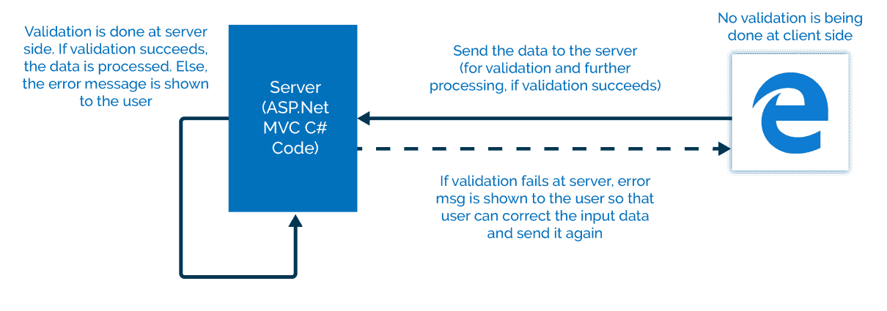
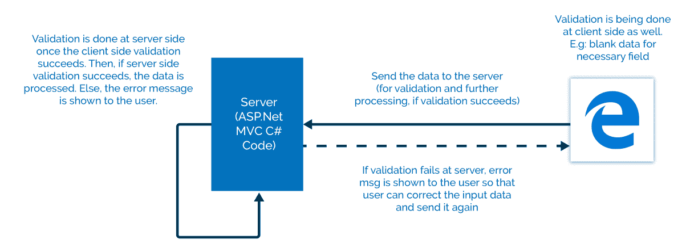
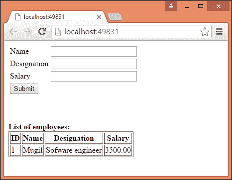
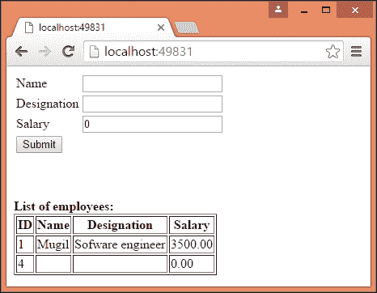
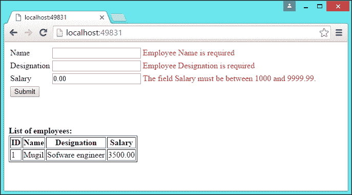
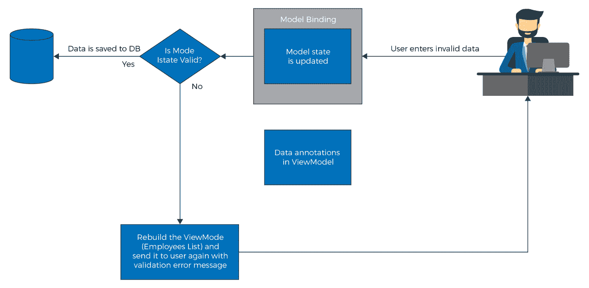

# 验证

我们永远不能依赖用户输入的数据。有时，他们可能对应用程序一无所知，因此可能在不知不觉中输入了错误的数据。有时，一些恶意用户可能希望通过在应用程序中输入不适当的数据来破坏应用程序。在任何一种情况下，我们都需要在存储数据以供进一步处理之前验证输入数据。

在本章结束时，您将能够：

*   解释不同类型的验证
*   使用示例执行服务器端验证
*   使用示例执行客户端验证
*   使用 jQuery unobtrusive 库执行 unobtrusive JavaScript 验证

# 验证简介

在理想情况下，用户将以适当的格式在应用程序中输入有效数据。但是，正如你可能意识到的，现实世界并不那么理想。用户将在应用程序中输入不正确的数据。作为开发人员，验证应用程序中的用户输入是您的责任。如果输入的输入无效，您需要通知用户，解释错误，以便用户更正输入数据并再次提交表单。

验证可以在客户端、服务器端或两端进行。如果验证是在将数据发送到服务器之前完成的，则称为客户端验证。例如，如果用户没有在必填字段中输入任何数据，我们可以在客户端本身验证表单（通过查找未输入的数据）。

不需要将表单数据发送到服务器。JavaScript 是客户端验证最常用的语言：


如果验证在服务器端完成（将表单数据发送到服务器），则称为服务器端验证。例如，您可能希望根据数据库中的数据验证用户输入的数据。在这种情况下，最好进行服务器端验证，因为我们不能将数据库中的所有数据都放在客户端：



即使我们不使用数据库，服务器端验证也是必不可少的，因为您无法信任用户。恶意用户可以在浏览器中更改您的数据、HTML 或 JavaScript，并提交实际上不正确的数据。服务器端验证是您唯一真正的防御。

Never trust client-side validation. For critical data, always do the validation on the server.

# 客户端和服务器端验证

在现实世界中，这不是服务器端或客户端验证的情况。服务器端验证有利于我们自身的安全。客户端验证对用户来说很方便。它还提高了我们的性能。由于验证会立即在用户的浏览器中运行，因此不会对我们的服务器产生任何影响。我们可以同时进行两种类型的验证。事实上，建议在两端验证数据，以避免不必要的处理：



上图显示在客户端和服务器端都在执行验证。如果数据没有输入到 required 字段中，我们可以在客户端本身发现这个问题。无需将数据发送到服务器以最终发现没有输入数据。输入所有必需的数据后，数据将发送回服务器，以根据某些业务逻辑验证输入的数据。如果验证失败，表单数据将再次发送到浏览器并显示错误消息，以便用户可以再次发送数据。

我们已经介绍了有关验证需求和应用程序中通常使用的验证类型的足够理论。让我们通过向上一章中构建的应用程序添加验证来解决问题。

下面的屏幕截图是我们在上一章中构建的表单。这种形式没有什么特别之处，只有三个字段。

当用户在表单中输入数据时，数据将存储在数据库中，所有员工信息将被取回并以表格格式显示：



在我们构建的现有应用程序中，即使用户没有在任何字段中输入任何信息并提交，我们也不会向用户显示任何消息。相反，我们静默地存储字段的默认值（字符串类型为空值，十进制类型为`0.00`），如以下屏幕截图所示：



但事实并非如此。我们应该通知用户输入的数据无效，并要求用户更正输入的数据。

# 服务器端验证

让我们继续上一章中构建的应用程序。要执行服务器端验证，我们需要执行以下操作：

1.  向`ViewModels`模型类添加数据注释属性。根据此元数据验证输入数据，并自动更新模型状态。
2.  更新`view`方法以显示每个字段的验证消息。具有`asp-validation-for`属性的`span`标记帮助器将用于显示验证错误消息。
3.  更新控制器操作方法以验证模型状态。如果模型状态有效，我们将数据插入数据库。否则，将更新 ViewModel，并使用验证错误消息再次呈现`view`方法，以便用户可以使用有效的输入数据进行更新并再次提交表单。

# 使用“数据注释”属性更新 ViewModels

数据注释属性定义了`Model/ViewModel`属性的验证规则。如果输入数据与模型中的属性定义不匹配，验证将失败，从而使关联的模型状态无效。向 ViewModels 添加注释的原因是我们将 ViewModels 公开给外部世界，而不是模型。此外，我们不想用 ASP.NET 特定属性污染我们的业务类。

有几个数据注释属性可用于验证数据。以下是最常用的数据批注属性：

*   **必选**：该属性表示该属性为必选属性。
*   **范围**：该属性定义最小约束和最大约束。
*   **MinLength**：定义属性必须具有的最小长度，以便验证成功。
*   **MaxLength**：顾名思义，该属性定义属性的最大长度。如果属性值的长度超过最大长度，验证将失败。
*   **RegularExpression**：如果使用此属性，可以使用正则表达式进行数据验证。

由于数据注释属性在`System.ComponentModel.DataAnnotations`名称空间中可用，我们需要包含此名称空间。以下为[第 4 章](4.html)、*车型*更新后的 ViewModel 代码：

Go to [https://goo.gl/EgT2vC](https://goo.gl/EgT2vC) to access the code.

```cs
using MVCEF.Models;
using System;
using System.Collections.Generic;
using System.ComponentModel.DataAnnotations;
using System.Linq;
using System.Threading.Tasks;
namespace MVCEF.ViewModels
{
  public class EmployeeAddViewModel
  {
    public List<Employee> EmployeesList { get; set; }
    [Required(ErrorMessage = "Employee Name is required")]
    public string Name { get; set; }
    [Required(ErrorMessage = "Employee Designation is required")]
    [MinLength(5, ErrorMessage = "Minimum length of designation should be 5 characters")]
    public string Designation { get; set; }
    [Required]
    [Range(1000, 9999.99)]
    public decimal Salary { get; set; }
  }
}
```

我们为所有三个属性添加了数据注释属性：`Name`、`Designation`和`Salary`。

`ErrorMessage`属性显示验证失败时将显示的消息。如果验证失败且未提及`ErrorMessage`，则显示默认错误消息。

使用属性的缺点是它只能处理编译时可用的文本。如果我们需要更多的动态验证，我们可以从`ValidationAttribute`派生并添加我们自己的逻辑。此外，还可以使用资源文件对项目进行本地化。

# 更新 ViewModel 以显示验证错误消息

对于每个字段，我们都添加了一个 span 标记，当验证失败时，错误消息以红色显示。验证成功后，将不会显示任何错误消息。`asp-validation-for`的属性值表示必须显示验证错误消息的字段名。例如，我们使用了带有`asp-validation-for`属性和`Name`值的 span 标记，它告诉 ASP.NET MVC 显示`Name`字段的验证错误消息。

`Views/Employee/Index.cshtml`如下所示：

Go to [https://goo.gl/k9JMRf](https://goo.gl/k9JMRf) to access the code.

```cs
@model MVCEF.ViewModels.EmployeeAddViewModel
@*
  //For more information on enabling MVC for empty projects, visit http://go.microsoft.com/fwlink/?LinkID=397860 *@
@{
}
...
  <td>
    <span asp-validation-for="Name" style="color:red"></span>
  </td>
...
```

Make sure you have `Views\_ViewImports.cshtml` to enable tag helpers, as follows: `@addTagHelper *, Microsoft.AspNetCore.Mvc.TagHelpers`

# 更新控制器操作方法以验证模型状态

模型状态将根据在 ViewModel 和输入数据上指定的数据注释属性自动更新。我们正在验证以下`Index`方法中的模型状态是否有效，这是一种`POST`操作方法。如果模型状态有效（当验证成功时），我们将输入的数据保存到数据库中。如果验证失败，则自动将`ModelState`设置为`invalid`。然后，我们用输入的数据填充`ViewModel`并再次呈现`View`方法，以便用户可以更正输入数据并重新提交数据：

Go to [https://goo.gl/iQHZYS](https://goo.gl/iQHZYS) to access the code.

```cs
[HttpPost]
public IActionResult Index(EmployeeAddViewModel employeeAddViewModel)
{
  if (ModelState.IsValid)
  {
...
...
  }
  employeeAddViewModel.EmployeesList =
  employeeDbContext.Employees.ToList();
  return View(employeeAddViewModel);
}
```

在进行上述更改后运行应用程序并提交表单而不输入值时，字段旁边将显示错误消息，如以下屏幕截图所示。请注意，即使在验证错误的情况下，我们也会在下表中显示员工的数据，这是通过使用前面代码段中的代码块实现的：



在前面的验证及其错误消息中，有几点需要注意：

*   如果验证失败，将按预期显示错误消息。
*   如果同一字段有多个验证，它将一次显示一条错误消息。例如，`Designation`字段有两个验证：`Required`和`MinLength`属性。如果没有为字段输入数据，则只显示所需的字段错误消息。只有在解决所需字段错误时（通过在字段中输入一些字符），才会显示第二条验证错误消息。
*   如果没有可用的错误消息，并且验证失败，则显示默认错误消息。我们没有为`Salary`字段提供错误消息。因此，当该字段的验证失败时，ASP.NET MVC 将根据字段名称和验证失败的类型显示默认错误消息。

It's not possible to circumvent the validation by editing the HTML code from the browser. The validation happens on the server side. It is safe and there is no way to work around it.

下图描述了服务器端验证中的高级事件序列：



以下是上图的描述：

1.  用户输入的数据无效。
2.  基于 ViewModel 中的“数据注释”属性，模型状态将自动更新。这在模型绑定过程中发生，视图方法中的数据映射到模型或视图模型中的数据。
3.  在控制器的动作方法中，我们正在验证模型状态。
4.  如果模型状态有效，我们将把输入的数据保存到数据库中。
5.  如果模型状态无效，我们将再次呈现 ViewModel 并显示验证错误消息，以便用户可以更正输入数据并使用有效的输入数据再次提交表单。

# 活动：为指定添加新的验证规则

**场景**

您的公司希望您为指定添加新的验证规则，使其至少包含两个单词。（提示：使用正则表达式。）

**瞄准**

为指定特性添加新的验证规则。

**完成步骤**

将`EmployeeAddViewModel.cs`中的`designation`属性修改如下：

Go to [https://goo.gl/bK5Ece](https://goo.gl/bK5Ece) to access the code.

```cs
[Required(ErrorMessage = "Employee Designation is required")]
[MinLength(5, ErrorMessage = "Minimum length of designation should be 5 characters")]
[RegularExpression(@"^[a-z]+(?:\s[a-z]+)+$", ErrorMessage = "Designation should be at least two
words")]
public string Designation { get; set; }
```

# 客户端验证

有些情况下，我们不需要去服务器验证输入数据。在前面的服务器端验证示例中，我们不需要去服务器验证用户是否已经输入了`Name`字段的数据。我们可以在客户端本身进行验证。这可以防止往返服务器并减少服务器负载。

我们将使用 JavaScript 来验证来自客户端的数据。JavaScript 是一种高级解释语言，主要用于客户端编程。

At present, JavaScript is also being used at the server side as part of Node.js.

# 执行客户端验证

按照以下步骤执行客户端验证：

1.  我们将在 ViewModel（即`Index.cshtml`文件）中做一些更改，以在客户端验证表单：
    1.  表单更改：将`id`属性添加到所有 span 标记中，以便我们可以访问此 HTML 元素以显示 HTML 错误消息。提交表单时，调用 JavaScript 函数验证输入数据。
    2.  添加 scripthtml 元素并创建一个 JavaScript 函数来验证输入数据。
2.  在下面的代码中，我们在提交表单时调用`validateForm`JavaScript 函数。如果`validateForm`函数返回`true`，数据将被发送到服务器。否则，将不发送数据。我们为所有 span 标记添加了`id`属性，以便我们可以识别`span`标记并在那里显示验证错误消息：

Go to [https://goo.gl/vjjtRp](https://goo.gl/vjjtRp) [to access the code.](https://goo.gl/vjjtRp)

```cs
<form asp-controller="Employee" asp-action="Index" onsubmit="return validateForm()">
  <table>
    <tr>
      <td><label asp-for="Name"></label></td>
      <td><input asp-for="Name" /></td>
      <td>
      <span id="validationName" asp-validation-for="Name" style="color:red"></span>
      </td>
    </tr>
...
...
    </tr>
  </table>
</form>
```

The purpose of `onsubmit="return validateForm()"` function is that returns false due to a validation error, then it will prevent the form from getting submitted to the server. Do not forget the return keyword, otherwise it won't work as expected.

3.  我们添加了 JavaScript 函数来验证这三个字段。我们得到三个字段的值，并将它们存储在单独的变量中。然后我们验证每个变量的值是 null 还是空。如果该值为空，我们将获取相应字段的 span 元素，并使用验证错误消息设置文本上下文：

Go to [https://goo.gl/3uPtH1](https://goo.gl/3uPtH1) to access the code.

```cs
<script type="text/javascript">
  function validateForm() 
  {
    var isValidForm = true;
    var nameValue = document.getElementById("Name").value;
    var designationValue = document.getElementById("Designation").value;
    var salaryValue = document.getElementById("Salary").value;
...
...
  }
</script>
```

4.  当您运行应用程序并在不输入数据的情况下提交表单时，您将收到从客户端本身生成的错误消息，而无需转到服务器：


In real-world applications, we would not be hand coding the validation code on the JavaScript. Instead, most applications use
unobtrusive validation, where we do not write JavaScript code for validating each of the fields. Simply adding the respective JavaScript libraries will do.

您可能想知道，在没有编写代码的情况下，字段是如何得到验证的。神奇之处在于基于数据注释属性添加到输入 HTML 元素的`data`属性。这个 jQuery unobtrusive 库获取一个字段列表，其中添加了`data`-属性，并对其进行了验证。

运行应用程序并按*Ctrl*+*U*查看源代码。源代码如下所示：

Go to [https://goo.gl/gTYZKb](https://goo.gl/gTYZKb) to access the code.

```cs
<div>
  <form action="/" method="post">
    <table>
      <tr>
        <td><label for="Name">Name</label></td>
        <td><input type="text" data-val="true" data-val-required="Employee Name is required"
        id="Name" name="Name" value="" /></td>
...
...
  </form>
</div>
```

不同的属性将添加到不同类型的数据注释属性中。数据属性是根据我们在 ViewModel 顶部定义的属性生成的。对于要验证的字段，`data-val`属性将设置为`true`。对于在 ViewModel 中标记为 required 的属性，`data-val-required`属性将具有关联属性的错误消息的值。

# 活动：向 JavaScript 函数添加新的验证规则

**瞄准**

将新的验证规则添加到 JavaScript 函数中进行指定，使其至少包含两个单词。（提示：使用正则表达式。）

**完成步骤**

我们需要修改 JavaScript。检查以下各项：

Go to [https://goo.gl/u8y4Ur](https://goo.gl/u8y4Ur) to access the code.

```cs
//validate the designation field
if (designationValue == null || designationValue == "" ) 
{
  document.getElementById("validationDesignation").textContent =
  "Employee Designation is required - from
  client side";
isValidForm = false;
}
else if (!(/^[a-z]+(?:\s[a-z]+)+$/.test(designationValue )))
{ 
  document.getElementById(
"validationDesignation").textContent =
  "Employee Designation must be at least two
  words - from client side";
isValidForm = false;
}
```

# 实施

布局文件（`_Layout.cshtml`定义 web 应用程序的布局结构。由于 JavaScript 库将在所有页面中使用，因此这是添加常见功能（如不引人注目的验证）的正确位置。

只需将 JavaScript 库（在下面的代码段中以粗体突出显示）添加到布局文件（`_Layout.cshtml`中），以便它们可用于所有`View`文件：

Go to [https://goo.gl/MKJ39B](https://goo.gl/MKJ39B) to access the code.

```cs
<!DOCTYPE html>
<html>
<head>
  <meta name="viewport" content="width=device-width" />
  <title>@ViewBag.Title</title>
</head>
<body>
  <div>
    @RenderBody()
  </div>
  <script src="http://ajax.aspnetcdn.com/ajax/jQuery/jquery-2.2.3.js"></script>
 <script src="https://ajax.aspnetcdn.com/ajax/jquery.validate/ 1.14.0/jquery.validate.min.js">  </script>
 <script src="https://ajax.aspnetcdn.com/ajax/mvc/5.2.3/jquery.validate.unobtrusive.min.js"></script>
</body>
</html>
```

`ViewModel`没有任何更改，只是删除了我们前面编写的用于验证字段的 JavaScript 函数。视图的完整代码如下所示：

Go to [https://goo.gl/pxazJH](https://goo.gl/pxazJH) to access the code.

```cs
@model MVCEF.ViewModels.EmployeeAddViewModel
@*
//For more information on enabling MVC for empty projects, visit http://go.microsoft.com/fwlink/?LinkID=397860
*@
@{
}
...
...
  </table>
</div>
```


上图描述了不引人注目的客户验证过程：

1.  `Model/ViewModels`中增加了数据注释。
2.  视图获取`Model/ViewModels`并生成 HTML。
3.  从 ViewModel 生成的 HTML 包含`data-*`属性：
    *   对于设置了`Required`属性的字段，将创建`data-val-required`属性，并将错误消息作为其值。
    *   对于具有`MinLength`数据注释属性的字段，`data-val-minlength`属性设置为错误消息作为其值。
    *   对于范围、数据注释，`data-val-range`属性设置为错误消息作为其值。`data-val-range-max`表示范围内的最大值，`data-val-range-min`属性表示范围内的最小值。
4.  jQuery unobtrusive validation 库读取这些具有`data-*`属性的元素，并执行客户端验证。这意味着开发人员不必使用 JavaScript 编写分离验证代码，因为所有问题都由配置本身解决。

The data-val attributes are only generated from our pre-defined data attributes. If we had a complex custom logic and if we need
them to validate from the client side, then we need to go back to write JavaScript.

# 活动：通过扩展 ValidationAttribute 为指定添加新的验证规则

**瞄准**

为名称添加新的验证规则，使其至少包含两个单词。但这次不要在服务器端使用正则表达式。而是扩展`ValidationAttribute`。

**完成步骤**

1.  创建 validator 属性，如下所示：

Go to [https://goo.gl/m63jKP](https://goo.gl/m63jKP) to access the code.

```cs
public class TwoWordsValidationAttribute : ValidationAttribute, IClientModelValidator
{
  public void AddValidation(ClientModelValidationContext context)
...
...
}
```

2.  请注意，通过使用客户机模型验证器，我们还可以与 jQuery 不引人注目的验证框架进行交互。然后将以下代码放入页面底部的布局文件中：

Go to [https://goo.gl/Px3d12](https://goo.gl/Px3d12) to access the code.

```cs
...
<script type="text/javascript">
$(function () {
jQuery.validator.addMethod('twowords', function (value, element, params) 
{
  var value = $(params[0]).val();
  return /^[a-z]+(?:\s[a-z]+)+$/.test(value);
});
...
...
  </script>
</body>
</html>
```

# 总结

在本章中，我们了解了验证的必要性以及可用的各种验证。我们甚至讨论了客户端和服务器端验证是如何工作的，以及每种类型验证的优缺点。后来，我们进行了代码更改，以在服务器端验证输入数据。然后，我们使用 JavaScript 在客户端本身验证输入数据。最后，我们使用 jQuery unobtrusive 库进行客户端验证，而无需编写 JavaScript 代码在客户端验证输入数据。

在下一章中，我们将讨论路由原则以及如何定制路由。在前面的一章中，我们看到了 ASP.NET 5 应用程序中路由的基础知识。现在我们将深入探讨这个话题。