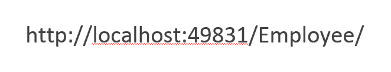
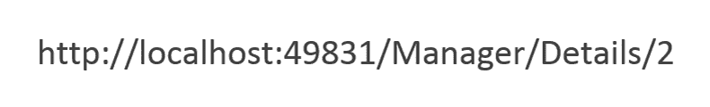
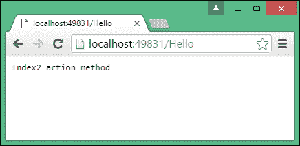
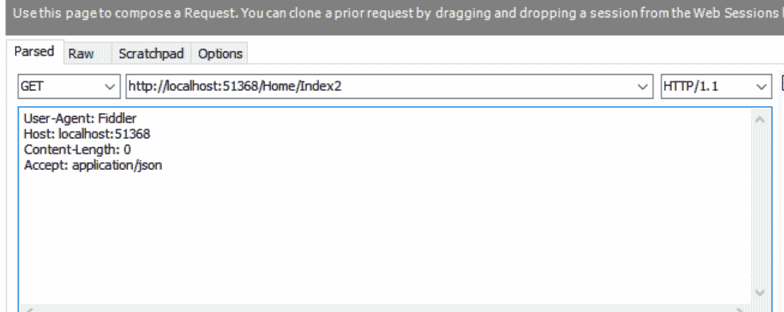

# 六、路由

路由是 ASP.NET MVC 应用程序中最重要的概念之一，因为它负责处理传入的请求并将它们映射到相应的控制器操作。

我们在[第 2 章](2.html)、*控制器*中简要讨论了路由。在本章中，我们将讨论路由以及在 ASP.NETCore 中定制路由的几个选项。

在本章结束时，您将能够：

*   使用 MapRoute 方法配置路由
*   使用基于约定和属性的示例处理不同类型的路由
*   在基于属性的路由中使用 HTTP 谓词

# 基于约定的路由

路由引擎负责将传入请求映射到控制器的适当操作方法。

我们应该有路由名称，因为它为路由提供了一个逻辑名称，这样命名的路由就可以用于 URL 生成。这大大简化了 URL 创建，因为路由的顺序可能会使 URL 生成变得复杂。路由名称在应用程序范围内必须是唯一的。

路由名称对 URL 匹配或请求处理没有影响；它们仅用于生成 URL。虽然 URL 生成是一个不同的研究主题，但我们可以简单地说，我们使用它在视图中生成从一个页面到另一个页面的链接。

在`Startup`类的`Configure`方法中，我们映射了以下路径：

```cs
app.UseMvc(routes => 
{
  routes.MapRoute(
    name: "default",
    template: "{controller=Employee}/{action=Index}/{id?}");
});
```

Alternatively, you can use the following code:
`app.UseMvcWithDefaultRoute();`
This is equal to the following:
`app.UseMvc(routes =>`
`{`
`  routes.MapRoute(`
`    name: "default",`
`    template: "{controller=Home}/{action=Index}/{id?}");`
`});`

`MapRoute`方法有两个参数：

*   `name`：这表示路由的名称，因为我们可以为同一应用程序配置多个路由。
*   `template`：表示路线的实际配置。此配置值包含三个部分。由于我们提供默认参数，如果没有传递值，它将采用默认参数值。
    *   `{controller=Employee}`：第一个值作为控制器的名称。当控制器值在 URL 中不可用时，我们使用 Employee 控制器作为默认控制器。
    *   `{action=Index}`：`Index`动作方式将作为默认动作方式。URL 中的第二个参数将作为操作方法名称。
    *   `{id?}`：在 id 参数后指定“？”，表示`id`为可选参数。如果该值作为第三个参数传递，则取`id`值。否则，将不予考虑。

让我们看几个例子并观察路由引擎是如何工作的。对于前面的示例，我们假设以下路由：

```cs
"{controller=Employee}/{action=Index}/{id?}"
```

**例 1**

以下是 URL 的显示方式：


在此 URL 中，我们没有传递`controller`、`action`或`id`参数的值。由于我们没有传递任何内容，因此它将采用控制器和操作的默认值。因此，路由引擎将 URL 转换为以下 URL：


**例 2**

以下是 URL 的显示方式：



在这个 URL 中，我们已经为控制器（第一个参数）传递了值，它是`Employee`，而我们没有为`action`方法（第二个参数）或`id`（第三个参数）传递任何内容。因此，URL 将转换为以下 URL，取`action`方法的默认值：


**例 3**

以下是 URL 的显示方式：


路由引擎将第一个参数`Manager`作为控制器名称，第二个参数`List`作为动作方法名称。

**例 4**

以下是 URL 的显示方式：



我们已在此 URL 中传递了所有三个参数。因此，第一个参数值`Manager`将被视为控制器方法名称。第二个参数值将被视为`action`方法名称。第三个参数值将被视为`id`。

在定义地图路线时，我们使用带有几个参数的`MapRoute`方法。第一个参数 name 表示路由的名称，第二个参数`template`表示要与默认值匹配的 URL 模式。下面是一些示例代码供您观察：

```cs
routes.MapRoute(name: "default",
  template:
  "{controller=Employee}/{action=Index}/{id?}");
```

这个`MapRoute`方法还有其他重载变体。下面是另一个常见的重载`MapRoute`方法，其中传入的 URL 模式和默认值是针对不同的参数传递的。路由名称为`FirstRoute`，此路由将应用于以`Home`开头的所有 URL。控制器和动作的默认值分别为`Home`和`Index2`，如下所示：

```cs
routes.MapRoute(name: "FirstRoute",
  template: "Home",
  defaults: new { controller = "Home", action = "Index2" });
```

您可以为 ASP.NET MVC 应用程序定义任意数量的路由映射。路由图没有限制或限制。让我们向应用程序添加另一个路由映射。我们在应用程序中添加了另一个名为`FirstRoute`的路线图：

Go to [https://goo.gl/36qj7c](https://goo.gl/36qj7c) to access the code.

```cs
public void Configure(IApplicationBuilder app, IHostingEnvironment env)
{
  app.UseMvc(routes =>
  {
    routes.MapRoute(name: "FirstRoute",
    template: "Home", defaults: new
    {
      controller = "Home",
      action = "Index2"
    });
    routes.MapRoute(name: "default",
    template:
    "{controller=Employee}/{action=Index}/{id?}");
  });
}
```

我们添加了另一个名为`HomeController`的控制器方法，其中包含两个返回不同字符串的简单操作方法：

Go to [https://goo.gl/avdJM9](https://goo.gl/avdJM9) to access the code.

```cs
public class HomeController : Controller
{
  // GET: /<controller>/
  public IActionResult Index()
  {
    return Content("Index action method");
  }
  public IActionResult Index2()
  {
    return Content("Index2 action method");
  }
}
```

当您尝试通过 URL`http://localhost:49831/Hello`访问应用程序时，路由映射`FirstRoute`和默认值都与 URL 模式匹配。

路由引擎根据以下因素映射传入 URL：

*   匹配模式
*   在路由引擎中定义的顺序

第一个因素是显而易见的。对于路由引擎拾取的路由映射，传入 URL 的模式应该与路由映射中定义的模板匹配。

第二个因素是微妙但重要的。如果有多个路由映射与传入 URL 匹配，则路由引擎将选择配置中定义的第一个 URL。

例如，如果传入 URL 与`FirstRoute`和`default`映射都匹配，路由引擎将按照配置中首先定义的方式选择`FirstRoute`映射：



如果路由引擎无法将传入 URL 映射到任何映射路由，我们会得到一个`HTTP 404 error`，这意味着找不到任何资源。您可以通过查看开发者工具中的“网络”选项卡查看状态（**200**表示**正常**，**404**表示**未找到资源**），如下图所示：


# 基于属性的路由

到目前为止，我们一直使用基于约定的路由。在基于约定的路由中，我们在适用于所有可用控制器的集中位置定义路由模板（仅为参数化字符串）。基于约定的路由的问题在于，如果我们想为不同的控制器定义不同的 URL 模式，我们需要定义一个所有控制器都通用的自定义 URL 模式。此外，基于约定的路由设置了我们的通用路由模板。它更加灵活；可以在运行时以编程方式更改它。这使事情变得困难。

还有另一个选项用于配置基于属性的引擎路由。在基于属性的路由中，不是在集中的位置配置所有路由，而是在控制器级别进行配置。我们可以自定义和覆盖我们的约定。基于属性的路由更为静态，并在运行时确定。

# 正在处理一个基于属性的路由示例

按照以下步骤探索基于属性的路由：

1.  首先，让我们删除前面在`startup.cs`类文件的`Configure`方法中创建的基于约定的路由：

```cs
public void Configure(IApplicationBuilder app,
IHostingEnvironment env)
{
  app.UseMvc();
  //app.UseMvc(routes =>
  //{
  //   routes.MapRoute(name: "FirstRoute",
  //   template: "Home", defaults: new
  //   {
  //     controller = "Home",
  //     action = "Index2"
  //   });
  //   routes.MapRoute(name: "default",
  //   template:
   "{controller=Employee}/{action=Index}/{id?}");
  //});
  }
```

2.  然后，我们可以在控制器本身配置路由。在下面的代码中，我们为前面创建的`home`控制器添加了路由配置：

```cs
public class HomeController : Controller
{
  // GET: /<controller>/
  [Route("Home")]
  public IActionResult Index()
  {
    return Content("Index action method");
  }
  [Route("Home/Index3")]
  public IActionResult Index2()
  {
    return Content("Index2 action method");
  }
}
```

我们在控制器的`action`方法中使用了 Route 属性。路由`attribute`中传递的值将作为 URL 模式。例如，当我们访问`http://localhost:49831/Home/ URL`时，会调用`HomeController`的索引方法。当我们访问`http://localhost:49831/Home/Index3 URL`时，会调用`HomeController`的`Index2`方法。

The URL pattern and `action` method name do not need to match.

在前面的示例中，我们正在调用`Index2`操作方法，但是 URL 模式使用`Index3`、`http://localhost:49831/Home/Index3`。

当同时使用基于属性的路由和基于约定的路由时，将优先使用基于属性的路由。

# 控制器级别的路由属性

您会注意到，对于`action`方法`Index`和`Index2`的 URL 模式，我们在两种 URL 模式`Home`和`Home/Index3`中重复控制器名称`Home`。我们不必在`action`方法级别重复`controller`方法名称（或 URL 中的任何公共部分），而可以在控制器级别定义它。

在下面的代码中，URL 的公共部分（主页）在控制器级别定义，唯一部分在`action`方法级别定义。当 URL 模式被映射到控制器的`action`方法时，两个路由部分（在`controller`级别和`action`方法级别）被合并和匹配。因此，前面定义的路线与后面定义的路线没有区别。

如果希望在基于属性的布线中使用任何参数，可以在花括号内传递它们。在下面的示例中，我们对`SayHello`操作方法执行了此操作。

例如，`http://localhost:49831/Home/Index3`URL 模式仍然会映射到`Homecontroller`的`Index2`方法：

```cs
[Route("Home")]
public class HomeController : Controller
{
  // GET: /<controller>/
  [Route("")]
  public IActionResult Index()
  {
    return Content("Index action method");
  }
  [Route("Index3")]
  public IActionResult Index2()
  {
    return Content("Index2 action method");
  }
  [Route("SayHello/{id}")]
  public IActionResult SayHello(int id)"
  {
    return Content("Say Hello action method" + id);
  }
}
```

# 路由模板中的令牌替换

如果您希望路由基于类和操作名称，并且仍然希望使用属性，那么有一种在常规路由中使用属性的中间方法：令牌替换。

[`action`、`area`和[`controller`将替换为定义路由的操作中的操作名称、区域名称和控制器名称的值。让我们看一个例子。以下是原始代码：

```cs
[Route("[controller]/[action]")]
public class ProductsController : Controller
  {
  [HttpGet] // Matches '/Products/List'
  public IActionResult List() 
  {
    // ...
  }
  [HttpGet("{id}")] // Matches '/Products/Edit/{id}'
  public IActionResult Edit(int id) 
  {
    // ...
  }
}
```

以下代码显示了更改：

```cs
public class ProductsController : Controller
{
  [HttpGet("[controller]/[action]")] // Matches '/Products/List'
  public IActionResult List() 
  {
    // ...
  }
  [HttpGet("[controller]/[action]/{id}")] // Matches '/Products/Edit/{id}'
  public IActionResult Edit(int id) 
  {
    // ...
  }
}
```

属性路由也可以与继承相结合。与代币替换相结合，这一功能尤其强大：

```cs
[Route("api/[controller]")]
public abstract class MyBaseController : Controller { ... }
public class ProductsController : MyBaseController
{
  [HttpGet] // Matches '/api/Products'
  public IActionResult List() { ... }
  [HttpPost("{id}")] // Matches '/api/Products/{id}'
  public IActionResult Edit(int id) { ... }
}
```

# 活动：组合以开头的路线模板/

**场景**

应用于以`/`开头的操作的路由模板不会与应用于控制器的路由模板组合。此示例匹配一组类似于*默认路由*的 URL 路径。根据这些信息，修改`SayHello`以便我们可以通过编写`http://localhost:<yourport>/Employee/SayHello/1`来访问它。

**瞄准**

解决了将以应用于控制器的路由模板开头/与应用于控制器的路由模板相结合的问题。

**完成步骤**

使用以下代码：

Go to [https://goo.gl/q97bvZ](https://goo.gl/q97bvZ) to access the code.

```cs
[Route("/Employee/SayHello/{id}")]
public IActionResult SayHello(int id)
{
  return Content("Say Hello action method" + id);
}
```

以下代码显示了多个路由的使用：

```cs
[Route("Store")]
[Route("[controller]")]
public class ProductsController : Controller
{
  [HttpPost("Buy")] // Matches 'Products/Buy' and 'Store/Buy'
  [HttpPost("Checkout")] // Matches 'Products/Checkout' and 'Store/Checkout'
  public IActionResult Buy()
}
```

# 在控制器中的 HTTP 操作谓词中传递路由值

我们不需要将路由值作为路由属性传递，而是可以在 HTTP 动作动词中传递路由值，例如`HTTPGet`和`HTTPPost`。

在下面的代码中，我们使用了`HTTPGet`属性来传递路由值。对于`Index`方法，我们没有传递任何值，因此在`controller`方法级别定义的路由值不会附加任何路由值。对于`Index2`方法，我们传递`Index3`值。`Index3`将附加到`controller`级别定义的路由值。请注意，只有带有 GET 方法的 URL 才会映射到`action`方法。如果您使用`POST`方法访问相同的 URL 模式，这些路由将不会匹配，因此这些`action`方法将不会被调用：

```cs
[Route("Home")]
public class HomeController : Controller
{
  // GET: /<controller>/
  [HttpGet()]
  public IActionResult Index()
  {
    return Content("Index action method");
  }
  [HttpGet("Index3")]
  public IActionResult Index2()
  {
    return Content("Index2 action method");
  }
}
```

# 活动：用不同的动词定义两个同名的动作

**场景**

你的任务是用不同的动词定义两个名称相同的动作，如`POST`和`GET`。您将如何做到这一点，使您对控制器更加安心？

**瞄准**

定义两个名称相同但动词不同的动作，如`POST`和`GET`。

**完成步骤**

使用以下代码：

Go to [https://goo.gl/nxs7tK](https://goo.gl/nxs7tK) to access the code.

```cs
[Route("Home")]
public class HomeController : Controller
{
  // GET: /<controller>/
  [HttpGet()]
  public IActionResult Index()
  {
    return Content("Index action method");
  }
  [HttpGet("Index3")]
  public IActionResult Index2()
  {
    return Content("Index2 action method");
  }
  [HttpPost("Index3")]
  public IActionResult Index2_Post()
  {
    return Content("Index2 post method");
  }
}
```

请参见 Fiddler 输出，如下所示：


# 路线约束

路由约束使您能够约束传递给控制器操作的值的类型。这完全是关于路由的操作选择。所以，我们可以说一个动作应该触发整数输入，而另一个动作应该触发非整数输入。例如，如果要限制传递给`int`类型的值，可以这样做。以下是其中一个例子：

```cs
[HttpGet("details2/{id:int}")]
  public IActionResult Details2(int id = 123)
  {
    return View();
  }
```

ASP.NET Core 甚至支持默认参数值，以便您可以传递默认参数：

```cs
[HttpGet("details2/{id:int}")]
  public IActionResult Details2(int id = 123)
  {
    return View();
  }
```

有许多可用的约束，例如`int`和`bool`。

# 活动：创建实现 IActionConstraintFactory 的属性

**场景**

通过使用`IActionConstraint`和`IActionConstraintFactory`接口，我们可以添加自定义约束。创建一个实现`IActionConstraintFactory`并返回`IActionConstraint`的属性。使用它并修改下面的代码，以便对`Accept: text/html header`调用`Index2_HTML`，而对`Accept: application/json`调用`Index2_Json`。您可以使用 Fiddler 发送请求。

```cs
[Route("Home")]
public class HomeController : Controller
{
  // GET: /<controller>/
  [HttpGet()]
  public IActionResult Index()
  {
    return Content("Index action method");
  }
  [HttpGet("Index2")]
  public IActionResult Index2_HTML()
  {
    return Content("HTML response returns");
  }
  [HttpGet("Index2")]
  public IActionResult Index2_JSON()
  {
    return Content("Json response returns");
  }
}
```

**瞄准**

创建实现`IActionConstraintFactory`并返回`IActionConstraint`的属性

**完成步骤**

1.  我们首先创建`AcceptHeaderActionConstraint`如下：

Go to [https://goo.gl/nUvECW](https://goo.gl/nUvECW) to access the code.

```cs
public class AcceptHeaderActionConstraint : IActionConstraint
{
  readonly string headerValue;
  public AcceptHeaderActionConstraint(string headerValue)
  {
    this.headerValue = headerValue;
  }
  public int Order => 0;
  public bool Accept(ActionConstraintContext context)
  {
    var headerVal = context.RouteContext.
    HttpContext.Request.Headers["Accept"];
    return headerVal.Contains(this.headerValue);
  }
}
```

2.  然后，我们创建我们的行动，如下所示：

Go to [https://goo.gl/HdMzjq](https://goo.gl/HdMzjq) to access the code.

```cs
public class AcceptHeaderAttribute : Attribute,
IActionConstraintFactory
{
  readonly string value;
  public AcceptHeaderAttribute(string value)
  => this.value = value;
  public bool IsReusable => true;
  public IActionConstraint CreateInstance(IServiceProvider services)
  => new AcceptHeaderActionConstraint(this.value);
}
```

3.  并装饰我们的行为，如下所示：

Go to [https://goo.gl/dK9ZJ1](https://goo.gl/dK9ZJ1) to access the code.

```cs
[Route("Home")]
public class HomeController : Controller
{
  // GET: /<controller>/
  [HttpGet()]
  public IActionResult Index()
  {
    return Content("Index action method");
  }
  [AcceptHeader("text/html")]
  [HttpGet("Index2")]
  public IActionResult Index2_HTML()
  {
    return Content("HTML response returns");
  }
  [AcceptHeader("application/json")]
  [HttpGet("Index2")]
  public IActionResult Index2_JSON() 
  {
    return Content("Json response returns");
  }
}
```

示例请求的输出如下所示：



注意，为了简单起见，我们只返回任意字符串。在实际应用程序中，我们将返回真实对象。

# 总结

在本章中，我们学习了路由及其工作原理。我们了解了各种可用的路由。我们用不同的例子讨论了基于约定的路由和基于属性的路由。我们还讨论了路由约束和可以传递的默认参数值。

在下一章中，我们将开始构建 Rest Buy 应用程序。