# 七、RestBuy

路由是 ASP.NET MVC 应用中最重要的概念之一，因为它负责处理传入的请求并将它们映射到相应的控制器操作。

在本章中，我们将尝试应用所学知识，并开始构建一个简化的实际应用。我们将开始开发一个名为**Rest Buy**的简单购物车应用。我们称之为 Rest-Buy，因为在开发过程中，我们还将尝试使用 Rest-ful 策略。

在 Rest Buy 项目中，我们将使用 ASP.NET 核心 MVC 以及实体框架和 SQL Server，因为这是本书的主题，并尝试采用 RESTful 策略。通过开发，您将更好地理解我们所说的 RESTful 是什么意思。

请注意，现在，**单页应用**（**SPA**）非常流行。对于在 Angular 和 React（用于单页应用）等框架上工作的开发人员来说，有很多工作机会。这些应用可以将整个页面变成一个 HTML 文档。这有一些显著的优势，因为客户端开发人员几乎可以完全独立于服务器端工作，他们开发 UI 就像开发任何移动应用一样。此外，它们还可以将自己与服务器中使用的技术堆栈隔离开来。除此之外，Visual Studio 2017 现在还提供了可供使用的单页应用模板。然而，在本课程中，我们将不构建单页应用，因为我们认为这种方法也有一些潜在的缺点，或者至少有时会有点不舒服。

在 SPA 方法中，我们通常首先加载 HTML 页面而不加载任何数据。稍后，数据将通过第二个 AJAX 请求加载。这可能需要，至少是第一次，您的应用具有某种初始加载屏幕。这种加载屏幕在移动应用中是可以容忍的。然而，当涉及到 web 应用时，您的访问者甚至不希望等待几秒钟。

其次，尽管现在的搜索引擎可以呈现 JavaScript，但使用 SPA 方法进行搜索引擎优化仍然很棘手。

第三，路由机制可能存在一些差异，因为使用 SPA，您开始从 JavaScript 以及服务器端管理 URL 路由。这种二元性有时很难处理。

最后，从 RESTful 的角度来看，我们想，一旦我们点击了一个 URL，比如`/Products`，当我们使用`text/html`accept 头时，我们的目的是将产品表示为 HTML，而不仅仅是伪 SPA HTML，然后在那里加载产品。我们知道万维网是一项经过验证的技术，它背后的理念，如 Rest 和超媒体，是我们可以信赖的。

尽管如此，这并不意味着我们可以忽略客户端状态。我们仍然需要使用 AJAX，这不仅是为了改善用户体验，也是因为浏览器负责维护其内存中的应用状态。（我们也可以使用 cookies 和本地存储，但这会有点困难。）

总之，我们决定采用混合方法。我们将在需要时简要地将这些 SPA 框架用于页面片段，但通常也会坚持使用服务器端呈现和路由。在某些情况下，可以先从服务器端渲染某些部分，然后从客户端渲染。这是一种固执己见的方法，我们建议你在职业生涯中坚持任何适合你的方法。

在本章结束时，您将能够：

*   设计休息购买
*   为应用创建实体
*   创建 EF 上下文和迁移

# 设计 Rest 购买

我们将以迭代的方式开始开发一个简单的购物车应用。功能、屏幕和用户故事也将在此过程中进行解释。但是，为了简单起见，我们将为您提供一个基本的框架或框架，您需要填充剩余的事务。本应用的目的是了解实际应用是如何完成的。我们将假定数据（如产品）是通过其他方式输入数据库的。在本例中，我们将手工编辑或使用数据库迁移。

在本书中，我们将在[第 8 章](8.html)中介绍注册特性，*添加特性、测试和部署*。如前所述，我们正在跟踪应用的迭代构建。因此，当开发下一个功能并且您希望参考它们时，您可以在此处找到它们：[https://github.com/OnurGumus/Packt_ASPNET_Core_RestBuy](https://github.com/OnurGumus/Packt_ASPNET_Core_RestBuy)

# 特色和故事

让我们定义我们的用户故事和功能：

| **特征** | **故事** |
|  | **功能**
**1** | **功能**
**2** | **功能**
**3** | **功能**
**4** |
| 列出产品 | 作为已注册或未注册的客户，当您访问主页时，应显示产品列表。 | 作为产品列表页面中的已注册或未注册客户，当您单击产品时，应显示产品详细信息页面。 |  |  |
| 搜索
并过滤产品 | 作为已注册或未注册的客户，您应该能够按类别筛选产品。一个产品可以与多个类别关联。因此，当您选择一个或多个类别并单击过滤器时，应该应用过滤器，直到页面更改。 | 作为已注册或未注册的客户，您应该能够按价格范围筛选产品。在这里，将有一个最低和最高的价格，当您选择一个范围，这应该与类别过滤器一起应用。 | 作为已注册或未注册的客户，当您在搜索文本框中写入一些文本时，它应该过滤产品的描述和名称。 |  |
| 展示
产品
详情 | 作为已注册或未注册的客户，您应该能够为每个产品添加书签，并使用唯一的 URL 显示这些产品。 | 作为已注册或未注册的客户，当您访问产品页面时，该页面应显示产品的名称、照片、说明和价格。 |  |  |
| 购物车 | 作为已注册或未注册的客户，您应该能够向购物车添加或删除产品。 | 作为已注册或未注册的客户，您应该能够利用“结帐”面板查看当前添加的项目。 | 作为已注册或未注册的客户，您应该能够通过单击“结帐”面板转到“结帐”页面。 | 作为注册
客户，您应该能够签出
并确认
您的购物车
转换为订单。 |
| 管理
订单 | 作为注册客户，您应该能够查看您的订单详细信息。 |  |  |  |
| 登录 | 作为注册客户，您应该能够登录到应用。 |  |  |  |
| 注销 | 作为注册客户，您应该能够注销应用。 |  |  |  |

From the agile point of view, features and stories are not hierarchical. Features are more like tags to the user stories. Still, for simplicity and clarification, it is shown as hierarchical.

# 布局和页面

在定义了我们的特性之后，设计应用的一个好方法是 UX。用户体验指的是用户体验。用户体验并不意味着我们应该首先编程或设计用户界面。UX 帮助我们从用户的角度确定应用的可能流程，这些流程必须得到功能的支持和补充。

# 主页

主页的外观可以类似于以下屏幕截图所示：


# 产品详情

“产品详细信息”页面的外观可能与以下屏幕截图中显示的类似：

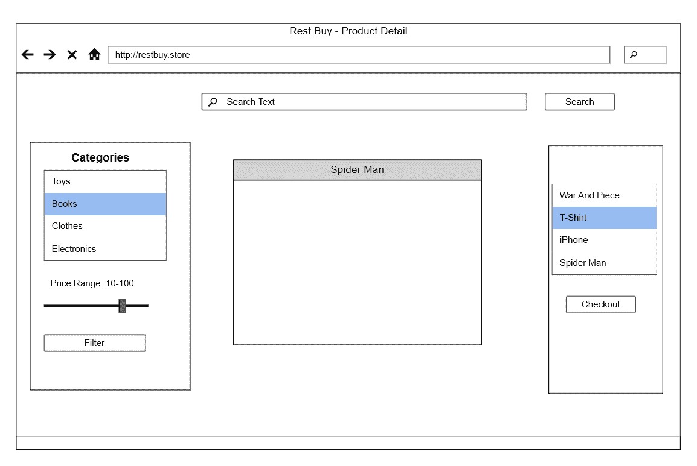

# 结账

“签出”页面的外观可能类似于以下屏幕截图中显示的内容：


# 结帐成功

“Checkout Successful”（签出成功）页面的外观可能类似于以下屏幕截图所示：

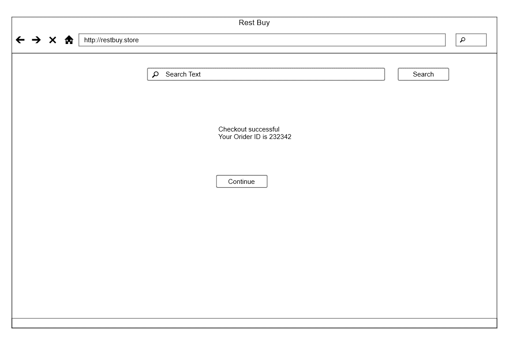

# 以前的订单

上一个订单页面的外观可能类似于以下屏幕截图中显示的内容：


正如您在一些屏幕截图中看到的，我们省略了过滤器。这是一个武断的决定；我们认为，对于我们没有显示产品的页面，保留过滤器是没有意义的，但我们仍然将搜索框保持在顶部。

# 定义我们的领域和模型

下一步是定义我们的模型。在这里，我们将尝试应用领域驱动设计。在领域驱动设计中，我们根据业务领域和术语对类进行建模。显然，如果您已经阅读了用户故事，我们已经有了很多关于域、类及其属性的线索。

目前，我们可以将我们的域建模为 5 个类：产品、订单、用户、订单项和库存量。在这种情况下，产品和用户是单独的聚合。聚合是一个领域驱动的开发概念。聚合用于指定域类的独立部分。通常，每个聚合由一个或多个类组成，每个类表示一组独立的不变量。我们有以下不变量：

*   订单至少有一个订单项。
*   订单具有创建日期和用户 ID。
*   订单项表示数量、价格和产品 ID。
*   对于订单项，数量和价格不能为零。
*   未确认订单表示当前购物车。
*   客户最多可以有 1 个未确认订单。（签出完成时降至零）
*   对于订单项，产品 ID 必须有效。对于产品，库存量和价格必须大于或等于零。
*   对于 StockAmount，数量必须等于订单项中的数量。

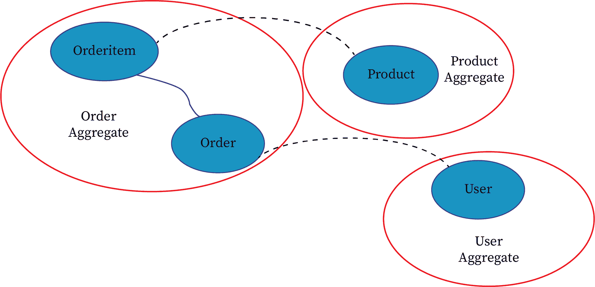

在上图中，我们定义了三个聚合为**订单**、**产品**和**用户**。上面的虚线表示通过 ID 字段的间接引用，**订单**和**订单项**之间的实线表示直接引用。我们选择这种方法的原因是，应用的不同模块（如管理模块）可能希望独立处理聚合。更改用户的邮政地址不应影响用户的现有订单和订单项目。他们彼此非常独立。我们还可以将这些实体移动到不同的微服务。毕竟，我们的业务不变量和约束只适用于每个聚合。同样，没有绝对正确的方法可以做到这一点，这取决于项目以及您对未来的投资。对于购物车本身，如果订单未确认，我们将使用**订单**实体。

# 创建 RestBuy 项目

在掌握了最初的设计思想后，我们可以开始在实践中实施我们的项目。遵循以下步骤：

1.  创建一个新的解决方案和 Web 应用，如下面的屏幕截图所示。确保我们将项目命名为`RestBuy.Web`，解决方案名称为`RestBuy`：


2.  选择 MVC 选项并单击 OK：

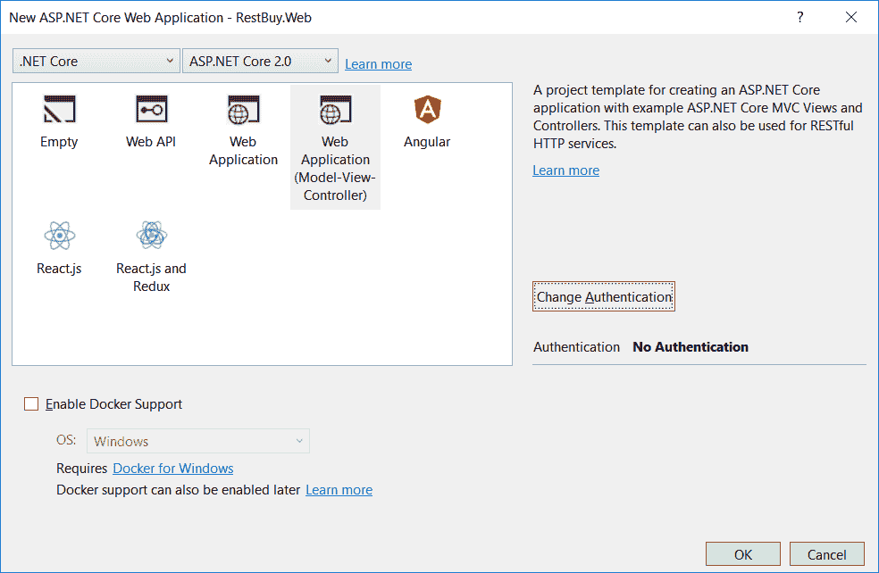

您将看到：


3.  将新项目添加为名为`RestBuy`的.NET 标准类库：

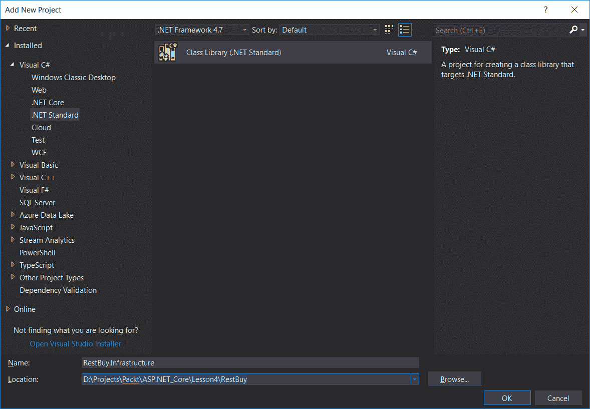

4.  将另一个项目添加为名为`RestBuy.InfraStructure`的.NET 标准类库：

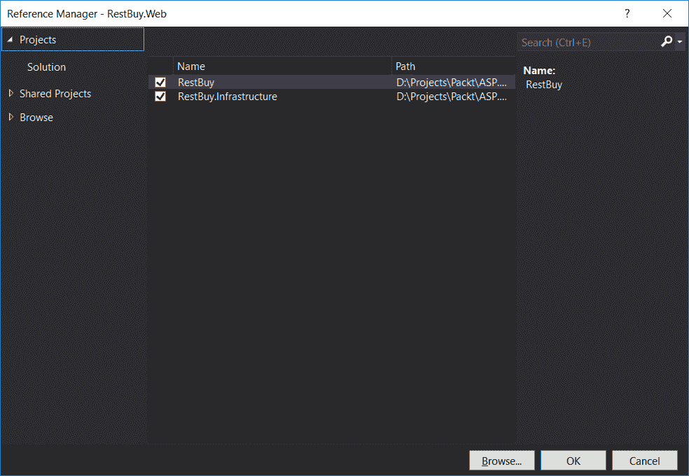

5.  右键单击`RestBuy.Web`项目解决方案资源管理器中的依赖项部分，并将依赖项添加到其他项目：


6.  与`RestBuy.InfraStructure`类似，添加对`RestBuy`的引用。

The `RestBuy` project itself references no other project.

现在，您的项目结构将如下所示：

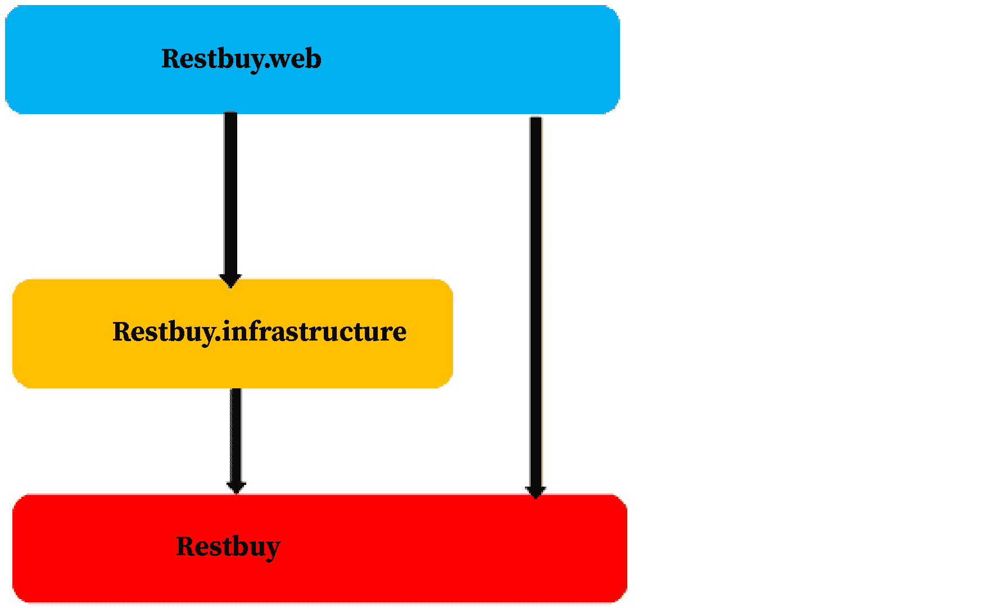

In case our business logic is not aware of the database layer, we will put our database interfaces to the business layer and do their implementations in the infrastructure and use a dependency injection (not inversion) framework to inject those interfaces to retrieve data from the database. This is the dependency inversion principle.

# 活动：为网站准备功能和故事

**场景**

你的客户碰巧是一位时装设计师。他想让你为他建一个网站。你需要先为他的网站准备功能和故事。

**瞄准**

为网站准备功能和故事。

**完成步骤**

1.  列出时装设计师所做的所有活动。
2.  列出他开展业务所需的网页。
3.  写下这些特征以及伴随它们的故事。

# 活动：为网站准备线框图

**场景**

您的客户，即时装设计师，希望查看网页的线框图。您可以为主页准备线框图。

**瞄准**

为网页准备线框图。

**完成步骤**

1.  转到[https://www.draw.io/](https://www.draw.io/) [。](https://www.draw.io/)
2.  在“将图表保存到：”对话框中，选择“设备”。
3.  在“设备”对话框中，单击“创建新图表”。
4.  在下一个窗口中，选择 Basic（1），为文件命名，然后单击 Create。
5.  您将看到工作区屏幕，如以下屏幕截图所示：

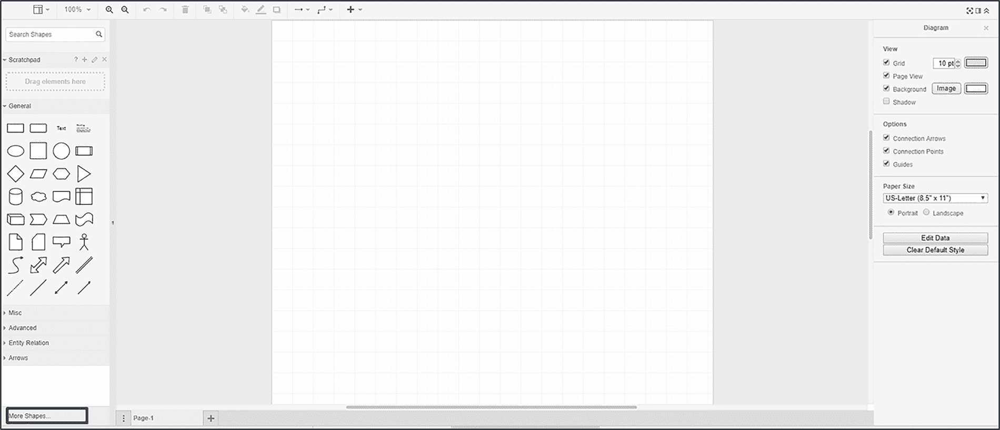

6.  单击屏幕左下角的“更多形状”按钮（在前面的屏幕截图中用蓝色框标记）。
7.  在“形状”对话框中，选择“软件”类别下的“实体模型”。您可以取消选中其余选项。
8.  单击应用。你准备好出发了。

# 活动：为网站设计域模型

**场景**

你想为你正在为你的客户（时装设计师）构建的网站设计一个域模型。

**瞄准**

为网站设计域模型。

**完成步骤**

1.  列出为域建模所需的类。
2.  定义聚合。
3.  使用 draw.io 设计图表，并提及聚合和类。
4.  使用虚线显示类之间的间接引用。
5.  使用实线显示类之间的直接引用。

# 创建实体

现在我们已经澄清了依赖关系，我们可以开始创建实体了。您可以删除库中已有的`Class1.cs`文件。

按照以下步骤为 Rest Buy 创建实体：

1.  在`RestBuy`项目中创建`Entities`文件夹，如下图所示：


2.  在`Entities`文件夹中，我们需要创建四个类：
    *   `BaseEntity`：这是我们所有实体的基类
    *   `Order`：此类将包含产品订购背后的逻辑。
    *   `OrderItem`：此类用于包含订单明细。
    *   `Product`：此类用于包含产品的详细信息。
    *   `StockAmount`：此类表示一个类型的商店中剩余的产品数量。
3.  在`BaseEntity`内有此代码：

Go to [https://goo.gl/E8DaGb](https://goo.gl/E8DaGb) to access the code.

```cs
using System;
using System.Collections.Generic;
using System.Text;
namespace RestBuy.Entities
public abstract class BaseEntity
{
  protected int id;
  public int Id => this.id;
}
}
```

4.  在`Order`内有此代码：

Go to [https://goo.gl/7JBmVH](https://goo.gl/7JBmVH) to access the code.

```cs
using System;
using System.Collections.Generic;
using System.Text;
namespace RestBuy.Entities
{
  public class Order : BaseEntity
  {
    int userId;
    DateTime createDate;
    List<OrderItem> orderItems = new List<OrderItem>();
    private Order() { }
...
...
  }
}
```

5.  在`OrderItem`内有此代码：

Go to [https://goo.gl/J11TQu](https://goo.gl/J11TQu) to access the code.

```cs
using System;
using System.Collections.Generic;
using System.Text;
namespace RestBuy.Entities
{
  public class OrderItem : BaseEntity
  {
    int productId;
    int quantity;
    decimal price;
    private OrderItem() { }
    public OrderItem(int productId, int quantity, decimal price)
...
...
  }
}
```

6.  在`Product`内有此代码：

Go to [https://goo.gl/MPukF3](https://goo.gl/MPukF3) to access the code.

```cs
using System;
using System.Collections.Generic;
using System.Text;
namespace RestBuy.Entities
{
  public class Product : BaseEntity
  {
    public string Name { get; set; }
    public string Description { get; set; }
    public decimal Price { get; set; }
    public string PictureUri { get; set; }
    public string Category { get; set; }
  }
}
```

7.  在`StockAmount`内有此代码：

Go to [https://goo.gl/RmgHzn](https://goo.gl/RmgHzn) to access the code.

```cs
using System;
using System.Collections.Generic;
using System.Text;
namespace RestBuy.Entities
{
  public class StockAmount : BaseEntity
...
...
}
```

# 创建 EF 上下文和迁移

首先，我们需要在`Infrastructure`项目中安装实体框架及其工具。

按照以下步骤创建 EF 上下文：

1.  只需右键单击 dependencies 并选择 Manage NuGet Packages。
2.  然后在搜索框中写入`Microsoft.EntityFramework.Core.SqlServer`并安装。

您的屏幕应如下所示：


3.  同样，安装`Microsot.EntityFrameworkCore.Tools`包，如下所示：


因此，您的`Infrastructure`项目文件夹如下所示：

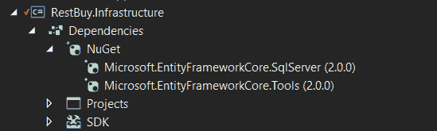

4.  接下来，我们在`Infrastructure`项目中创建`EF`文件夹，并使用名为`RestBuyContext`的类实现我们的`DbContext`。确保您在`Infrastructure.`中引用了`RestBuy`项目。请使用以下代码：

Go to [https://goo.gl/wYLwRA](https://goo.gl/wYLwRA) to access the code.

```cs
using Microsoft.EntityFrameworkCore;
using Microsoft.EntityFrameworkCore.Metadata.Builders;
using RestBuy.Entities;
using System;
using System.Collections.Generic;
using System.Text;
...
void ConfigureStockAmount(EntityTypeBuilder<StockAmount> builder)
{
...
  builder.Property(ci => ci.Quantity).IsRequired().IsConcurrencyToken();
}
...
```

In the preceding mapping, the `Quantity` property of `StockAmount` is marked as `ConcurrencyToken` as we don't want two orders to reduce the stock amount simultaneously. Suppose that we have two parallel requests racing to buy for the last item. Only one of them can win. Using `ConcurrencyToken` causes Entity Framework to generate a query that confirms that the value has not been changed. Doing so will cause `DbUpdateConcurrencyException`; in this case, we have to retry.

这里我们使用 HiLo 算法生成密钥。如果不使用 HiLo，通常 EF 和 SQL server 使用自动递增的 ID。虽然自动递增的 ID 更简单，但只要将实体添加到上下文中，此添加就会强制将实体插入到数据库中。这是因为只有在实际插入发生在自动递增 ID 的情况下，我们才能检索 ID。HiLo 算法通过使用数据库序列预先保留 ID，使我们摆脱了这种限制。我们还更改了序列的默认值，使其从 1000 开始，每增加 100。通过使用这种方法，我们可以将设计时数据插入到前 1000 个可用插槽中。

# 创建迁移

一旦定义了数据库上下文，下一步就是生成迁移。然而，由于我们现在有一个基础设施项目，我们更希望我们的基础设施项目成为迁移的宿主。

为此，请执行以下步骤：

1.  在`EF`文件夹中创建`RestBuyContextFactory`：

Go to [https://goo.gl/BnBPLD](https://goo.gl/BnBPLD) to access the code.

```cs
using Microsoft.EntityFrameworkCore;
using Microsoft.EntityFrameworkCore.Design;
using Microsoft.EntityFrameworkCore.Infrastructure;
using RestBuy.Infrastructure.EF;
using System;
using System.Collections.Generic;
using System.Text;
namespace RestBuy.Infrastructure.EF
{
  class RestBuyContextFactory : IDesignTimeDbContextFactory<RestBuyContext>
  {
    public RestBuyContext CreateDbContext(string[] args)
...
...
  }
}
```

2.  看看文件夹结构。我们的`EF`文件夹如下所示：


注意，我们将连接字符串嵌入到这个工厂类中。原因是，正如接口的名称所暗示的，任何实现`IDesignTimeDbContextFactory`的东西都只用于设计时。也就是说，我们的迁移生成工具将利用这一点。另一方面，由于我们使用了可信连接，因此将其作为字符串嵌入是相对安全的。如果它包含任何密码，无论设计时与否，将这些字符串嵌入二进制文件是一个非常糟糕的想法。

3.  显然，下一步是添加迁移。现在，让我们打开 package manager，您可以在快速启动搜索中键入 package：

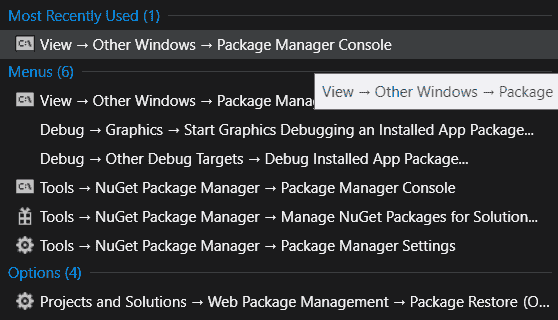

以下内容将显示在您的屏幕上：


4.  然后，确保在 package manager 控制台中选择我们的基础设施项目类型`Add-MigrationInitialMigration`。运行此命令将在我们的`Infrastructure`项目中生成迁移：


5.  接下来，我们使用`Update-Database`命令创建数据库：


然后，我们可以看到我们的表是从 SQL Server 对象资源管理器创建的：

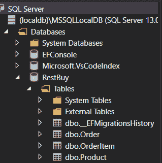

# 活动：添加表示产品供应商的供应商实体

**场景**

您希望添加一个表示产品供应商的供应商实体。

**瞄准**

为产品添加供应商实体。

**完成步骤**

1.  我们可以添加`Supplier`类如下：

Go to [https://goo.gl/pTCc56](https://goo.gl/pTCc56) [to access the code.](https://goo.gl/pTCc56)

```cs
namespace RestBuy.Entities
{
  class Supplier : BaseEntity
  {
    public string Name { get; set; }
  }
}
```

或者，我们可以向`Product`或`SupplierId`添加`Supplier`属性，具体取决于我们是否希望它们处于相同的聚合中。这是一个设计选择。

2.  对于迁移，我们使用以下代码：

```cs
void ConfigureSupplier(EntityTypeBuilder<Supplier>builder)
{
  builder.ToTable("Suppliers");
  builder.HasKey(ci => ci.Id);
  builder.Property(ci => ci.Name)
  .IsRequired()
  .HasMaxLength(50);
  builder.HasIndex(c => c.Name).IsUnique();
}
```

# 总结

在本章中，我们设计了我们的应用。我们继续为我们的应用创建实体。最后，我们研究了创建 EF 上下文和迁移。