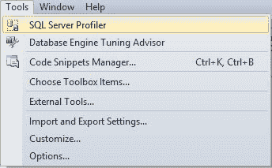
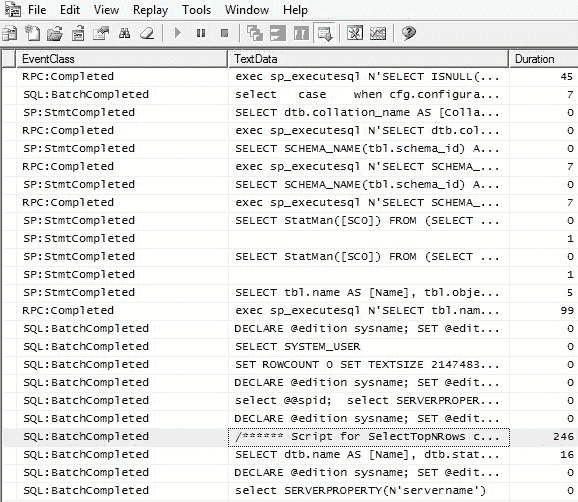
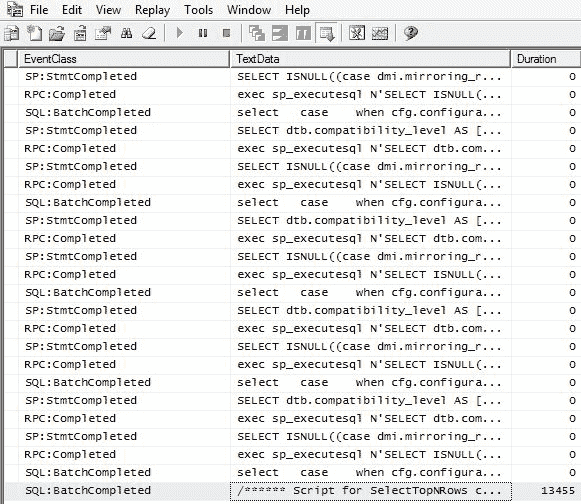
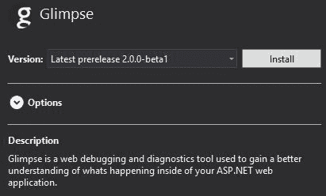
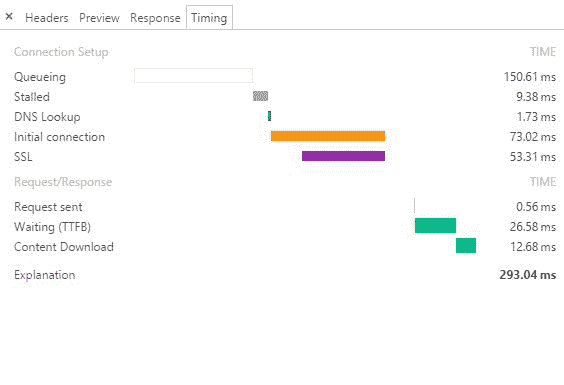
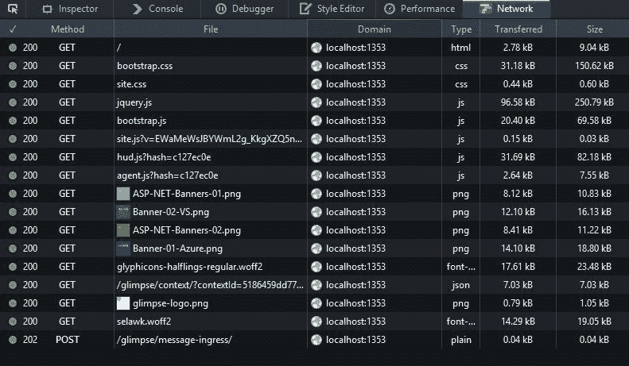
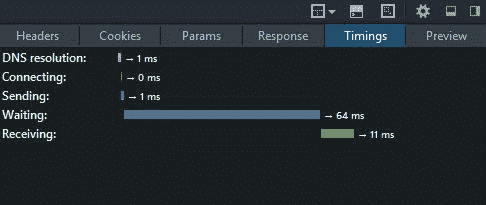

# 四、衡量性能瓶颈

测量是构建高性能系统最关键的方面。你不能改变你没有衡量的东西，因为你不知道你的改变产生了什么影响，如果有的话。如果不度量应用，您将无法知道它的性能是否良好。

如果你只是在你的软件感觉慢的时候路过，那么你已经离开它太晚了。你只是被动地解决问题，而不是主动地回避问题。您必须通过衡量来获得良好的性能，即使这种感觉对用户来说很重要。

有些书把测量、分析和剖析留到最后。然而，这是首先应该考虑的事情。修复错误的问题并优化没有性能问题的区域是很常见的。

在本章中，我们将涵盖以下主题:

*   结构化查询语言数据库分析
*   Web 应用分析
*   HTTP 监控
*   网络监视
*   科学方法和可重复性

本章将向您展示如何检查性能问题及其发生的位置。我们将描述可以为您提供这些信息的工具，并演示如何有效和正确地使用它们。我们还将向您展示如何始终如一地重复您的实验，以便您在发现问题后能够判断是否已经解决了问题。

在本书的最后，我们将再次讨论测量，但是在这里，我们将关注连续的自动化监控以避免回归。本章将更侧重于手动测试，以识别开发和调试过程中的潜在性能问题。

# 工具

当你试图发现问题所在时，好的调试工具是必不可少的。您可以编写自己的粗略计时代码，我们将向您展示如何开始计时。然而，专门构建的工具比简单地记录调试信息要好得多。VS 2017 包括一些非常有用的应用洞察工具，使有用的信息变得容易看到。

本章中讨论的许多工具帮助您检查代码外部的区域。我们也将讨论代码的概要分析，但是很难通过这种方式识别问题，除非工作是纯计算性的。变慢经常发生是因为你的应用在它的直接堆栈之外发起的动作，这些动作很难通过简单地单步执行代码来调试。VS 2017 可以向你展示你的应用会采取哪些外部动作，例如，触发 HTTP API 调用。

一行一行地遍历程序会大大降低执行速度，以至于很难识别哪些行快，哪些行慢。但是，VS 确实显示了自上一个调试步骤以来所花费的时间，这有助于解决这个问题。然而，用于修复功能性错误的相同方法不能总是应用于修复性能问题。

# 结构化查询语言

首先，我们将讨论与 SQL 相关的问题。所以，如果你没有使用关系数据库，你可以跳过这一部分；例如，如果您改用 NoSQL 商店或文档数据库。关系数据库是一种非常成熟的技术，使用起来非常灵活。然而，为了有效地使用它们，对 SQL 语法和数据库如何工作有一个基本的了解是很重要的。甚至 Azure Cosmos DB(以前称为 DocumentDB)也有一个可选的 SQL API。

当使用一个 O/RM 工具，比如**实体框架** ( **EF** )时，忽略 SQL，停留在 C#世界可能很有诱惑力；但是，有能力的开发人员应该能够编写高性能的 SQL 查询。忽视数据库引擎如何工作的现实往往会导致性能问题。使用操作系统工具编写代码很容易，该工具对数据库过于健谈，并且为一个操作发出太多的查询。表中没有正确的索引也会导致性能不佳。

在开发过程中，您可能不会注意到这些错误，除非您使用工具来识别发生的低效事件。在这里，我们将向您展示一些这样做的方法。

# 事件探查器

SQL Server 事件探查器是一个工具，它允许您检查在您的 SQL Server 数据库上正在执行哪些命令。如果您已经安装了管理工具，那么您的机器上应该已经安装了。您可以这样访问它:

1.  如果您使用的是微软的 SQL Server，那么可以通过 **SQL Server 管理工作室** ( **SSMS** )的工具菜单访问 SQL Server Profiler:



2.  加载 SQL Server 事件探查器并连接到您正在使用的数据库。命名您的跟踪并选择优化配置文件模板:


3.  单击运行，您应该会看到跟踪已经开始。现在，您已经准备好对数据库运行代码，以查看它实际执行的查询:


# 执行简单的查询

作为测试，您可以使用 Management Studio 执行一个简单的`SELECT`查询，配置文件窗口应该会充满条目。在噪音中找到您刚刚执行的查询。如果以注释开头，这就更容易了，如下图所示:



持续时间列显示查询花费的时间，单位为**毫秒** ( **毫秒**)。在本例中，从包含 100 多万个条目的表中选择前 1000 行需要 246 毫秒。对于用户来说，这看起来非常快，几乎是瞬间的。修改查询以返回所有行会使其速度慢很多，如下图所示:



该查询现在需要超过 13 秒(13，455 毫秒)的时间来完成，这是非常慢的。这是一个极端的例子，但是请求比需要更多的数据并在应用代码中过滤或排序是一个相当常见的错误。数据库通常更适合此任务，并且通常是选择所需数据的正确位置。

我们将在接下来的章节中介绍具体的 SQL 错误和补救措施。但是，第一步是知道如何检测应用和数据库之间的通信情况。如果您无法检测到您的应用正在进行低效的查询，那么将很难提高性能。

# MiniProfiler

MiniProfiler 是调试数据查询的优秀开源工具。它支持 SQL 数据库和一些 NoSQL 数据库，比如 MongoDB 和 RavenDB。它来自 Stack Exchange，也就是管理 Stack Overflow 问答网站的人。它在你的网页中嵌入一个小部件，向你显示他们获取数据需要多长时间。它还会向您显示 SQL 查询，并警告您常见的错误。虽然 MiniProfiler 是从.NET，它也可用于 Ruby、Go 和 Node.js

与 SQL Server Profiler 相比，MiniProfiler 的最大优势在于它始终存在。您不需要显式地查找 SQL 问题，因此它可以更早地突出问题。在生产环境中运行它甚至是一个好主意，尽管只有登录的管理员才能看到。这样，每次你在网站上工作，你就会看到数据访问是如何进行的。不过，在部署它之前，一定要测试它对性能的影响。

MiniProfiler 现在支持 ASP.NET Core！您可以在[http://miniprofiler.com/dotnet/AspDotNetCore](http://miniprofiler.com/dotnet/AspDotNetCore)阅读如何设置的简单说明。

# 应用分析

通常，您会想要一份应用中工作执行位置和大部分时间花费在哪里的明细。您可能希望了解计算资源是如何分配的，以及它们是如何变化的。有各种各样的工具可用于此，我们将在这里介绍其中的一些。

应用分析允许您缩小应用中性能不佳的区域。你可以从更高的层次开始，一旦你找到了广阔的领域，你就可以深入挖掘并找到具体的问题。将一个大问题分成几个小块是解决它的好方法，也是使它更容易管理的好方法。

# 一瞥

惊鸿一瞥是你的网络应用的一个极好的开源插件。像 MiniProfiler 一样，它在您的网页上添加了一个小部件，这样您就可以在浏览和处理网站时看到问题。它提供了类似于浏览器开发工具的信息，但也深入服务器端应用内部，向您展示了哪些操作花费了最多的时间。

惊鸿一瞥在[http://getglimpse.com/](http://getglimpse.com/)有售，你可以用 NuGet 为你正在使用的 web 框架和 O/RM 安装它。对于 ASP.NET Core，我们将需要使用惊鸿一瞥版本 2。在撰写本文时，这仍然是一个测试版预发行版。

惊鸿一瞥与应用洞察集成(通过一个 NuGet 包)，您可以在惊鸿一瞥工具栏中显示应用洞察收集的信息。现在 Node.js 也有一个新版本的 scope，可以在[http://node.getglimpse.com/](http://node.getglimpse.com/)找到。

# 使用惊鸿一瞥

安装惊鸿一瞥真的很简单。只有三个步骤:

1.  用 NuGet 安装。
2.  给`Startup.cs`添加线条。
3.  构建并运行该应用。

让我们看看这些步骤。

**安装包装**

在解决方案资源管理器中右键单击您的 web 应用项目，然后选择管理获取包...打开图形包管理器窗口。搜索惊鸿一瞥，选择它，然后点击安装按钮。如果您想安装测试版的惊鸿一瞥 2，那么请确保选中包括预发行复选框:



**添加代码**

您需要将三段代码添加到您的`Startup.cs`文件中。在文件顶部的`using`指令中，添加以下内容:

```cs
using Glimpse;
```

在`ConfigureServices`功能中，添加以下内容:

```cs
services.AddGlimpse(); 
```

在`Configure`功能中，添加以下内容:

```cs
app.UseGlimpse(); 
```

**运行您的网络应用**

通过按下 *F5* 来构建和运行您的网络应用。如果在运行时遇到重复类型错误，只需清理解决方案并进行完全重建。您可能需要将迁移应用于数据库，但这只是浏览器中的一个按钮点击。但是，如果将它添加到带有数据的现有项目中，则应该更加小心。

当您运行应用时，您会在浏览器窗口的底部发现一瞥栏，如下图所示。酒吧是一个长条状，但在这个截图中被分解了，以更清楚地显示它:


The first page load may take much longer than subsequent ones, so you should refresh your page for more representative data. However, we won't worry about this for the purposes of this demo.

将鼠标悬停在“浏览”工具栏中的每个部分上，以展开它了解更多信息。您可以通过单击标题来最小化和恢复每个部分(HTTP、HOST 或 AJAX)。

如果您使用默认的 web 应用模板(并保留所有单个用户帐户的身份验证默认值)，那么您可以注册一个新用户，使应用执行一些数据库操作。然后，您将在数据库查询字段中看到一些值，如下图所示:


点击惊鸿一瞥标志，查看所有页面请求的历史记录。选择一个来查看详细信息，并通过单击它们来展开 SQL 查询，如下图所示:


一瞥向您展示了应用的每一层花费了多少时间，以及正在运行哪些 SQL 查询。在这种情况下，英孚核心会生成 SQL。

惊鸿一瞥对于追踪性能问题所在非常有用。您可以很容易地看到页面管道的每个部分需要多长时间，并识别速度较慢的部分。

# 集成驱动电子设备

使用内置于 **Visual Studio** ( **VS** )中的分析工具可以非常有助于了解代码的 CPU 和内存使用情况。您还可以看到某些操作所花费的时间。当您将应用部署到服务器集群时，这些应用洞察工具可以集成到 Azure 中；但是，您仍然可以在本地使用它们，而无需将任何内容发送到云中。您不需要向程序中添加任何代码，因为框架是自动检测的。

VS 2017 提供的应用洞察可以执行类似于 MiniProfiler 和 scope 的操作。它不仅可以告诉你你的服务器是如何运行的，还可以通过添加到 web 应用页面的一些嵌入式 JavaScript 向你展示客户端的性能。我们将在[第 10 章](10.html)、*性能增强工具*的缺点中详细介绍应用洞察；这只是一个介绍。

运行应用时，在 VS 中打开诊断工具窗口，如下图所示:

您可以看到 CPU 和内存配置文件，包括用于释放内存的自动垃圾收集事件(内存使用减少之前的标记)。您将能够看到断点事件，如果您有 VS 的企业版，那么您也将能够看到智能跟踪事件。

IntelliTrace is only available in the Enterprise edition of Visual Studio. However, you can still use the performance and diagnostic tools in the free Community edition. You can also access them on Azure via a web interface, but this is optional.

如果您有智能跟踪，那么您可以在 VS 选项中找到它，如下图所示。但是，如果没有此高级功能，诊断工具仍然有用:


当你放入一个断点，你的代码命中它，然后 VS 会告诉你离上一个事件有多长时间了。这显示在事件列表中，并覆盖在断点附近。

VS 分析工具的一些替代工具包括 Redgate ANTS 和 Telerik JustTrace。JetBrains 也有 dotTrace 和 dotMemory。然而，所有这些工具都可能相当昂贵，我们在这里不涉及它们。

# 监控 HTTP

在处理 web 应用时，通常会使用 HTTP 作为应用协议。知道浏览器和服务器之间发生了什么请求是非常有用的。

# 浏览器

大多数现代浏览器都有优秀的开发工具，其中包括一个网络选项卡，用于监控对网络服务器的请求和响应。您通常可以通过按下 *F12* 来访问开发工具。这些都是方便查看网络流量，你仍然可以看到加密的通信，而不用乱动证书。

Chrome 和 Firefox 中的开发工具都非常棒。我们将重点关注网络和时序组件，但我们强烈建议您学习所有功能。如果你知道如何充分利用它们，那么网络开发就容易多了。

例如，Chrome dev 工具允许您在使用设备工具栏(用于模拟移动设备)时截图整个页面，即使页面并不完全适合屏幕。您还可以使用开发工具捕获图像的连续画面，显示页面如何逐渐加载。

# 铬

Chrome 中的网络开发工具非常有用。它们提供了请求时间的良好可视化，您可以限制连接，以查看它在各种不同的互联网连接上的行为。这对移动设备尤其重要。

从 Chrome 开发工具中选择的网络请求显示在下面的截图中。如果在标题栏上单击鼠标右键，则可以使用其他列:


您可以使用一个简单的复选框来禁用缓存，这样浏览器将始终从您的 web 服务器加载新的资产。您也可以点击某个资源了解更多信息，定时选项卡对于提供连接组件的细分非常有用，例如**到第一个字节的时间** ( **TTFB** )。下面的截图显示了本地 web 服务器的一些基本计时细节:


在本地网络服务器上，这种细分不会包含额外的信息，但是在远程服务器上，它会显示其他信息，例如**域名系统** ( **域名系统**)主机名查找和 SSL/TLS 握手。这些附加组件显示在下一个屏幕截图中:



# 火狐浏览器

火狐有类似于 Chrome 的开发工具，但是增加了一些功能。例如，您可以编辑请求并将其重新发送到 web 服务器。“网络”选项卡显示的信息与 Chrome 相同，如下图所示:



详细视图也非常相似，包括计时选项卡。该选项卡显示在以下屏幕截图中:



# 游手好闲的人

有时候，浏览器工具是不够的。比方说，您正在调试一个本机应用、代码中的 HTTP 客户端或移动浏览器。Fiddler 是一个免费的调试代理，可以捕获客户端和服务器之间的所有 HTTP 流量。只要稍加努力，它也能拦截 HTTPS 的交通。提琴手可以在[http://www.telerik.com/fiddler](http://www.telerik.com/fiddler)免费下载。

由于这本书的重点是网络开发，我们就不再赘述了。浏览器开发工具适用于目前的大部分工作。他们现在完成了 Fiddler 在获得相同功能(网络请求捕获、节流和计时)之前所扮演的大部分角色。如果您需要的话，Fiddler 仍然在那里，如果您的 web 服务器调用外部 HTTP API，它会很方便，尽管这也经常可以直接在 VS 内部调试。

# 网络

有时，您需要在比 HTTP 或 SQL 更低的级别进行调试。这就是网络监视器或数据包嗅探器的作用。也许，您想调试一个发送到 SQL Server 数据库的**表格数据流** ( **TDS** )消息，或者一个发送到 SSL 终端负载平衡器的 TLS 握手。或者，也许你想分析一个 SOAP web 服务信封或**简单邮件传输协议** ( **SMTP** )电子邮件连接，看看为什么它不能正常工作。

# 微软消息分析器

微软消息分析器取代微软**网络监视器** ( **Netmon** )是一个在 Windows 系统上捕获网络流量的工具.NETmon 要求您注销，然后在安装后再次登录，而 Wireshark 不要求。您可以在线阅读更多关于这两个微软工具的信息，但是为了清晰和简洁，我们将重点介绍用于低级网络监控的 Wireshark。

# Wireshark

Wireshark(以前称为 Ethereal)是一个开源的跨平台数据包捕获和网络分析应用。它可能是同类工具中最受欢迎的，有许多用途。您可以安装 Wireshark，而无需重启或注销，这使得调试难以重现的实时问题变得非常棒。你可以从[https://www.wireshark.org/](https://www.wireshark.org/)下载 Wireshark，它运行在 Windows、Mac 和 Linux 上。

Wireshark 对本地开发不是特别有用，因为它只捕获网络上的流量，而不是本地主机。如果您针对本地网络应用运行它，您唯一可能看到的是 VS 报告分析您在集成开发环境中所做的事情回到微软。

You can turn off the **Customer Experience Improvement Program** (**CEIP** ) in VS by clicking on the button next to the quick launch box and selecting Settings... . By default, it is on (it's now opt-out, not opt-in as in the previous products).

点击 Wireshark 左上角的鳍图标按钮开始追踪。然后，执行一些网络操作，例如从测试服务器加载网页。一旦你捕捉到一些数据包，点击停止按钮；然后，您可以随意检查收集的数据。

Ask your IT administrator before running Wireshark. It can often pick up sensitive information off of the LAN, which may be against your IT acceptable use policy.

下面的截图显示了 Wireshark 捕获的部分结果:


使用 Wireshark 时可能会有很大的噪音。你会看到低级别的网络数据包，比如**地址解析协议** ( **ARP** )流量，你可以过滤掉或者忽略掉。您可能还会看到来自网络电话和其他联网设备的数据，或者是打算提供给网络上其他计算机的数据。

从顶部窗格中选择您感兴趣的数据包。中间窗格将显示数据包的内容。您通常可以忽略网络堆栈的较低层，例如以太网和 TCP/IP(显示在列表的顶部)。

直接进入最后列出的应用层。如果这是 Wireshark 能够识别的协议，那么它将把它分解成由它组成的字段。

底部窗格显示原始数据包的十六进制转储。这通常不如中间窗格中的解析数据有用。

如果您使用 TLS/SSL(这是您真正应该使用的)，那么您将看不到 HTTP 流量的内容。您需要一份服务器私钥的副本来查看 TLS 连接内部，TLS 连接包装并加密 HTTP 应用数据。您将只能看到通过域名系统查找和顶级域名系统证书连接到的域，而不能看到完整的网址或任何有效负载数据。

使用 Wireshark 是一个巨大的话题，有很多很好的资源可以用来了解它，无论是在线的还是离线的。我们在此不再赘述，因为通常没有必要深入到如此低的网络审查级别。然而，这是一个很好的工具，放在你的后口袋里。

# 滚自己的

有时，您可能想要编写自己的性能度量代码。确保您已经用尽了所有其他选项，并首先研究了可用的工具。

Perhaps, you want to record the execution time of some process to write to your logs. Maybe you want to send this to a system such as Logstash and then visualize the changes over time with **Kibana** . Both are great open source products from Elastic, and they store data in the Elasticsearch search server. You can read more about both of these tools at [https://www.elastic.co/](https://www.elastic.co/) .

您可以通过存储任务开始前的当前时间并将其与任务完成后的当前时间进行比较来轻松记录任务的时间长度，但是这种方法有许多限制。测量的行为会在一定程度上影响结果，并且时钟在短时间内不准确。如果您需要在进程或多次运行之间共享状态，这对于非常慢的事件可能很有用，但是，为了进行基准测试，您通常应该使用`Stopwatch`类。

It is usually best to store timestamps in **Coordinated Universal Time** (**UTC** ), which is otherwise known as **Greenwich Mean Time** (**GMT** ). You will avoid many issues with time zones and daylight saving if you use `DateTimeOffset.UtcNow` (or at least `DateTime.UtcNow` ). Name variables and columns to indicate this, for example, `TimestampUtc` . Use `TimeSpan` for lengths of time, but if you must use primitives (such as integers), then include the units in the variable or column name, for example, `DurationInMilliseconds` or `TimeoutInSeconds` . This will help you avoid confusion when another developer (or your future self) comes to use them. However, to benchmark quick operations, you should use `Stopwatch` . This class is in the `System.Diagnostics` namespace.

如果你试图测量一个单一的快速事件，那么你不会得到准确的结果。解决这个问题的一个方法是重复这个任务很多次，然后取平均值。这对于基准测试很有用，但通常不适用于实际应用。然而，一旦你确定了什么对测试最有效，你就可以把它应用到你自己的程序中。

让我们用一个小实验来说明用 PBKDF2 算法(在`System.Security.Cryptography`命名空间中)对密码进行散列需要多长时间。在这种情况下，测试中的操作并不重要，因为我们只是对时序代码感兴趣。天真的方法可能看起来像下面的代码:

```cs
var s = Stopwatch.StartNew(); 
pbkdf2.GetBytes(2048); 
s.Stop(); 
Console.WriteLine($"Test duration = {s.ElapsedMilliseconds} ms"); 
```

由于测量过程中的缺陷，该代码每次运行时都会输出不同的值。更好的方法是多次重复测试并对输出进行平均，如下面的代码所示:

```cs
var s = Stopwatch.StartNew(); 
for (var ii = 0; ii < tests; ii++) 
{ 
    pbkdf2.GetBytes(2048); 
} 
s.Stop(); 
var mean = s.ElapsedMilliseconds / tests; 
Console.WriteLine($"{tests} runs mean duration = {mean} ms"); 
```

这段代码仍然非常原始，但每次都会输出非常相似的结果。`tests`值越高，越准确，但测试时间越长。

在启动计时器并进入循环之前，您可以通过预热测试中的函数，然后运行垃圾收集来改进基准测试。您还可以将输出存储在成员变量中，以防止编译器进行巧妙的优化。

然而，在这一点上，最好只使用一个完整的基准测试工具，比如 BenchmarkDotNet。我们这里没有这样做的原因只是为了让您更容易自己运行这些示例。

BenchmarkDotNet 是一个非常有用的工具，它现在已经加入了.NET 基金会。我们将在[第 8 章](08.html)、*理解代码执行和异步操作*中再次介绍。你可以在[https://github.com/dotnet/BenchmarkDotNet](https://github.com/dotnet/BenchmarkDotNet)了解更多。

In these examples, we are using C# 6 string interpolation, but you can use the traditional overloads to `Console.WriteLine` if you prefer.

让我们编写一个快速的示例应用，通过多次运行这两个不同的版本来演示不同之处。我们将把这两个测试提取到方法中，并分别调用它们几次:

```cs
var pbkdf2 = new Rfc2898DeriveBytes("password", 64, 256); 
SingleTest(pbkdf2); 
SingleTest(pbkdf2); 
SingleTest(pbkdf2); 

Console.WriteLine(); 
var tests = 1000; 
AvgTest(pbkdf2, tests); 
AvgTest(pbkdf2, tests); 
AvgTest(pbkdf2, tests); 

Console.WriteLine(); 
Console.WriteLine("Press any key..."); 
Console.ReadKey(true);
```

输出看起来像下面的截图。如果你想自己运行它，你可以在本书附带的代码中找到完整的应用列表。


你可以看到三个单独的测试可以给出截然不同的结果，但是平均的测试是相同的。

你的结果会有所不同。这是由于计算机系统固有的可变性。对时间敏感的嵌入式系统通常使用实时操作系统。正常的软件系统通常运行在分时操作系统上，在分时操作系统中，您的指令很容易被中断，虚拟机使问题变得更糟。

您将获得不同的结果，这取决于您是在调试模式还是发布模式下构建，以及您是否在调试模式下运行。不调试释放模式( *Ctrl* + *F5* )最快。

下面的截图显示了运行调试的同一个基准测试演示应用。因为`dotnet`可执行文件显示在命令提示符的标题栏中，所以您可以分辨出来。如果没有调试就运行了，那么就会显示`cmd.exe`(在 Windows 上)，就像前面的截图一样。


Unit testing is very valuable, and you may even practice **test-driven development** (**TDD** ), but you should be careful about including performance tests as unit tests. Unit tests must be quick to be valuable, and tests that accurately measure the time taken for operations are often slow. You should set a timeout on your unit tests to make sure that you don't write slow ones with external dependencies. You can still test performance, but you should do it at the integration testing stage along with tests that hit an API, DB, or disk.

# 科学

我们通过在[第 2 章](02.html)、*为什么性能是一个特性*中展示一些硬件访问速度来讨论计算机科学中的计算机。现在，是科学的时候了。

如果你想获得持续可靠的结果，采取科学的方法是很重要的。有一个方法或测试计划，每次都以同样的方式执行，只改变你想要衡量的东西。自动化对此有很大帮助。

始终用您的数据来衡量系统上的用例也很重要。对别人有效的东西对你来说可能并不太好。

我们将在本书后面更多地谈论科学和统计。取一个简单的平均值可能会误导人，但用它作为一个温和的介绍也没关系。阅读[第 10 章](10.html)、*性能增强工具的缺点、*了解更多关于中位数和百分位数等概念的信息。

# 可重复性

结果需要是可重复的。如果你每次测试都得到截然不同的结果，那就不能依赖它们。您应该重复测试，并取平均结果来标准化被测应用或硬件中的任何可变性。

清楚地记录测量单位也很重要。当你比较一个新值和一个历史值时，你需要知道这一点。美国宇航局因单位混乱而失去了一个著名的火星探测器。

# 只改变一件事

测试时，您的目标是衡量单个变更的影响。如果你一次改变一件以上的事情，那么你不能确定哪一件有所不同。

目的是将除了你感兴趣的变化之外的任何其他变化的影响降到最低。这意味着保持外部因素尽可能静态，并进行多次测试，取平均结果。

# 摘要

让我们总结一下本章和下一章中涉及的测量内容。我们讲述了度量在解决性能问题中的重要性。没有度量，就不能指望写出高性能的软件；你将在黑暗中编码。

我们重点介绍了一些可以用来衡量性能的工具。我们向您展示了如何使用这些选择，以及如何编写自己的选择。我们还讨论了采用科学方法进行测量的价值。确保您的结果是可重复的，并且您记录了正确的测量单位，这是重要的关注点。

在下一章中，我们将学习如何修复常见的性能问题。你将获得加速低挂水果的技能，并让自己在同事面前看起来像一个表演向导。不再是“它在测试中起作用；现在是运营问题”。