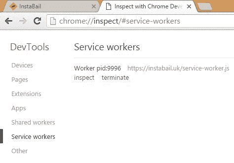
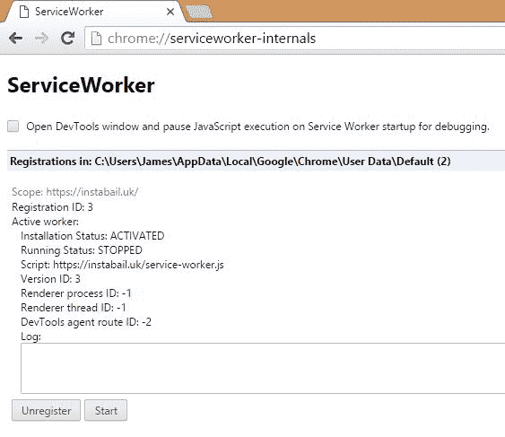
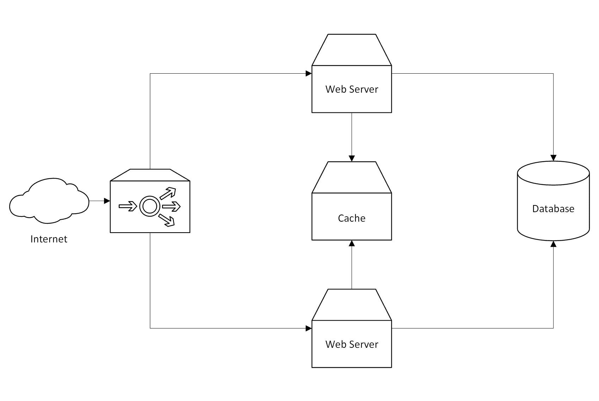

# 九、学习缓存和消息队列

缓存非常有用，几乎可以应用于应用堆栈的所有层。然而，很难总是让缓存正常工作。因此，在本章中，我们将讨论 web、应用和数据库级别的缓存。我们将向您展示如何使用反向代理服务器来存储呈现的网页和其他资产的结果。我们还将介绍较低级别的缓存，使用内存中的数据存储来加速访问。如果需要强制传播更新，您将学习如何确保总是能够刷新(或破坏)缓存。

本章还介绍了使用消息队列和抽象的异步架构设计，它们封装了各种消息模式。您将学习如何在后台执行长时间运行的操作(如视频编码)，同时让用户了解其进度。

您将学习如何应用缓存和消息队列软件设计模式来降低操作的执行速度，从而不必实时执行操作。您还将了解这些模式可能增加的复杂性，并了解其中的权衡。我们将在[第 10 章](10.html)、*性能增强工具*中看到如何克服这些复杂性并减轻其负面影响。

本章涵盖的主题包括以下内容:

*   Web 缓存背景
*   JavaScript 服务人员
*   清漆代理和 IIS 网络服务器
*   Redis 和 Memcached 内存中应用缓存
*   消息队列和消息模式
*   RabbitMQ 及其各种客户端库

# 为什么缓存很难

缓存并不难，因为缓存某些东西很难。缓存是无限容易的；当您想要进行更新时，困难的部分是使缓存无效。网景公司已故的菲尔·卡尔顿有一句话用得很好，内容如下:

"There are only two hard things in Computer Science: cache invalidation and naming things."

它也有许多幽默的变体，正如之前在本书中使用的那样。这种情绪可能有点夸张，但它凸显了从你的“T2”速食盒 2.0“T3”中移除你的“T0”成品电脑“T1”是多么复杂。不过，给事物命名确实很难。

缓存是存储一些数据的临时快照的过程。然后可以使用这个临时缓存，而不是每次需要时都重新生成原始数据(或从规范源中检索)。这样做有明显的性能优势，但它会使您的系统更加复杂，更难概念化。当您有许多缓存交互时，结果可能看起来几乎是随机的，除非您在方法上有纪律。

当您在推理缓存(和消息队列)时，消除数据只以单一一致状态存在的想法是有帮助的。如果你接受数据有新鲜感并且总是有一定数量的陈旧的概念，那就更容易了。事实上，情况总是如此，但是一个小系统所涉及的短时间框架意味着你通常可以忽略它，以简化你的思维。然而，当涉及到缓存时，时间尺度更长，所以新鲜度更重要。一个大规模的系统最终只能是一致的，它的各个部分将有不同的数据时间视图。你需要接受数据是可以运动的；否则，你只是没有四维思维！

举个简单的例子，考虑一个传统的静态网站。访问者在他们的浏览器中加载一个页面，但是这个页面现在立即过期了。服务器上的页面本可以在访问者检索后立即更新，但他们不会知道，因为旧版本将保留在他们的浏览器中，直到他们刷新页面。

如果我们将这个例子扩展到一个数据库支持的 web 应用，比如 ASP.NET 或 WordPress 网站，那么同样的原则也适用。用户检索从数据库中的数据生成的网页，但它可能在加载后就过期了。基础数据可能已经更改，但包含旧数据的页面仍保留在浏览器中。

默认情况下，网络应用通常会在每次页面加载时从数据库中重新生成 HTML，但是如果数据没有改变，这将会非常低效。这样做只是为了在进行更改时，在页面刷新时立即显示出来。

但是，用户的浏览器中可能有一个旧页面，而您对此的控制有限。因此，您也可以将该页面缓存在服务器上，并且只在数据库中的底层数据发生变化时删除它。像这样缓存呈现的 HTML 通常对于在不仅仅是少数用户的规模上保持性能至关重要。

# Web 缓存

我们将讨论的第一类缓存是在 web 级别。这包括存储您的网络堆栈的最终输出，因为它将被发送给用户，这样，当再次请求时，它就准备好了，不需要重新生成。此阶段的缓存消除了在应用层进行昂贵的数据库查找和 CPU 密集型渲染的需要。这减少了延迟并减少了服务器上的工作负载，使您能够处理更多用户并快速为每个用户提供服务。

Web 缓存通常发生在您的 web 服务器或反向代理服务器上，您已经将它们放在 web 服务器的前面，以保护它们免受过度负载的影响。您也可以选择将此任务交给第三方，如 CDN。在这里，我们将介绍两个网络服务器和代理服务器软件，IIS 和清漆。然而，更多的网络缓存和负载平衡技术是可用的，例如，NGINX 或 HAProxy。

web 层的缓存最适合静态资产和资源，如 JavaScript、CSS 和图像。然而，它也可以用于匿名的 HTML，这是很少更新，但经常访问，如主页或登陆页面，这是未经认证的，不是为用户定制的。

我们在[第 5 章](05.html)、*中讨论了代理服务器，在[第 6 章](06.html)、*中讨论了常见的性能问题*，并稍微介绍了 web 层缓存。然而，在本章中，我们将更详细地讨论 web 缓存。*

# 缓存背景

在我们深入研究实现细节之前，了解一下缓存在 web 上是如何工作的会有所帮助。如果您花时间研究工作中的机制，那么缓存将不会那么令人困惑，也不会像您刚刚直接跳入一样令人沮丧。

阅读和理解相关的 HTTP 规范是有帮助的。然而，不要假设软件总是严格遵守这些网络标准，即使它声称如此。

首先，让我们来看看一个典型的网络设置，您可能会通过您的 HTTP 流量。下图说明了 web 应用的常见配置示例:


如上图所示，笔记本电脑和平板电脑用户通过缓存转发代理服务器(可能位于公司网络或互联网服务提供商)进行连接。移动用户通过互联网直接连接。但是，所有用户在到达您的基础架构之前都要经过一个 CDN。

在防火墙(未显示)之后，有一个设备可以终止 TLS 连接，平衡 web 服务器之间的负载，并充当缓存反向代理。这些功能通常由不同的设备执行，但我们在这里保持简单。

您的资源副本将保存在您的网络服务器、您的反向代理、您的 CDN、任何正向代理以及所有用户设备的浏览器中。控制这些资源的缓存行为的最简单方法是使用带内信令，并向您的内容添加 HTTP 头，只在一个地方声明缓存控制元数据。

将相同的标准 HTTP 缓存技术应用于您自己的 web 服务器和代理是一个很好的实践，即使您可以随意定制它们并刷新它们的缓存。这不仅减少了您必须做的配置量，避免了重复的工作，而且还确保了任何不受您控制的缓存也应该正确运行。即使使用 HTTPS，浏览器仍会执行缓存，并且可能会有透明的公司代理或干涉的 ISP 专属门户。

# HTTP 头

HTTP 缓存包括在响应中设置缓存控制头。有许多这样的报头，这些报头是多年来从不同的标准和协议的不同版本中添加的。您应该知道这些是如何使用的，但是您也应该了解如何确定可缓存资源的唯一性，例如，通过更改网址或仅更改其中的一部分，如查询字符串参数。

这些头中的许多可以根据它们引入的函数和 HTTP 版本进行分类。有些头有多种功能，有些是非标准的，但几乎普遍使用。我们不会涵盖所有这些标题，但我们会挑选一些最重要的标题。

大体上有两种类型的缓存头类别。第一个定义了一个绝对时间，在此时间内可以重用缓存，而无需与服务器进行检查。第二个定义了规则，客户端可以使用这些规则来测试服务器缓存是否仍然有效。

大多数指令头(发出缓存命令的那些)都属于这两个头类别之一。除此之外，还有许多纯粹的信息头，它们提供了有关原始连接和客户端的详细信息，否则这些信息可能会被缓存所掩盖(例如，原始客户端的 IP 地址)。

有些头文件，如`Cache-Control`，是最新标准的一部分，但另一些头文件，如`Expires`，通常只用于向后兼容，以防有一个古老的浏览器或旧的代理服务器挡道。然而，随着基础设施和软件的升级，这种做法变得越来越没有必要。

The latest caching standard in this case is HTTP/1.1, as HTTP/2 uses the same caching directives (RFC 7234). Some headers date from HTTP/1.0, which is considered a legacy protocol. Very old software may only support HTTP/1.0\. Standards may not be implemented correctly in all applications. It is a sensible idea to test that any observed behavior is as expected.

`Age`头用于指示资源在缓存中的时间(以秒为单位)。另一方面，`ETag`头用于指定单个对象的标识符或该对象的特定唯一版本。

`Cache-Control`头告诉缓存资源是否可以被缓存。它可以有许多值，包括`max-age`(以秒为单位)或`no-cache`和`no-store`指令。`no-cache`和`no-store`之间令人困惑但又微妙的区别在于，`no-cache`表示客户端应该在使用资源之前与服务器进行检查，而`no-store`表示根本不应该缓存资源。为了防止缓存，一般应该使用`no-store`。

ASP.NET Core`ResponseCache`动作属性设置`Cache-Control`标题，包含在[第 6 章](06.html)、*寻址网络性能*中。但是，此标头可能会被一些较旧的缓存忽略。`Pragma`和`Expires`是用于向后兼容的旧标题，它们执行一些与`Cache-Control`标题现在处理的功能相同的功能。

`X-Forwarded-*`报头用于提供更多关于到代理或负载平衡器的原始连接的信息。这些都是非标准的，但被广泛使用，并被标准化为组合的`Forwarded`表头( **RFC 7239** )。`Via`头也提供了一些代理信息，`Front-End-Https`是非标微软头，类似于`X-Forwarded-Proto`。这些协议头有助于告诉您，当负载平衡器剥离原始连接时，该连接是否使用了 HTTPS。

If you are terminating the TLS connections at a load balancer or proxy server and are also redirecting users to HTTPS at the application level, then it is important to check the `Forwarded` headers. You can get stuck in an infinite redirection loop if your web servers desire HTTPS but only receive HTTP from the load balancer. Ideally, you should check all varieties of the headers, but if you control the proxy, you can decide what headers to use.

缓存中涉及到许多不同的 HTTP 头。下面的列表包括我们在这里没有涉及到的内容。大量的头应该让您了解缓存有多复杂:

*   `If-Match`
*   `If-Modified-Since`
*   `If-None-Match`
*   `If-Range`
*   `If-Unmodified-Since`
*   `Last-Modified`
*   `Max-Forwards`
*   `Proxy-Authorization`
*   `Vary`

# 缓存破坏

缓存破坏(也称为缓存爆发、缓存刷新或缓存无效)是缓存的难点。将一个项目放入缓存很容易，但是如果你没有提前制定策略来管理不可避免的变化，那么你可能会失败。

对于 web 级缓存来说，纠正缓存破坏通常更为重要。这是因为，使用服务器端缓存(我们将在本章后面讨论)，您可以完全控制，并且如果出错可以重置。网络上的一个错误可能会持续存在，并且很难补救。

除了设置正确的标题之外，当资源的内容发生变化时，改变资源的网址也是有帮助的。这可以通过添加时间戳来完成，但通常，一个方便的解决方案是使用资源内容的散列并将其作为参数追加。包括 ASP.NET Core 在内的许多框架都使用这种方法。例如，考虑网页中的以下 JavaScript 标记:

```cs
<script src="js/site.js"></script> 
```

如果您对`site.js`进行更改，那么浏览器(或代理)不会知道它已经更改，可能会使用以前的版本。但是，如果输出更改为如下所示，它将重新请求:

```cs
<script src="js/site.js?v=EWaMeWsJBYWmL2g_KkgXZQ5nPe-a3Ichp0LEgzXczKo"> 
</script> 
```

这里的`v`(版本)参数是 **Base64 URL 编码的**，SHA-256 哈希内容的`site.js`文件。由于**雪崩效应**，对文件做一个小的改变将从根本上改变散列。

Base64 URL encoding is a variant of standard Base64 encoding. It uses different non-alphanumeric characters (`+` becomes `-` while `/` changes to `_` ) and percent encodes the `=` character (which is also made optional). Using this safe alphabet (from RFC 4648) makes the output suitable for use in URLs and filenames.

在 ASP.NET Core 中，您可以通过在剃刀视图中添加值为`true`的`asp-append-version`属性来轻松使用该功能，如下所示:

```cs
<script src="~/js/site.js" asp-append-version="true"></script> 
```

# 服务人员

如果您正在编写客户端 web 应用，而不是简单的动态网站，那么您可能希望使用新的浏览器功能对缓存进行更多控制。您可以通过用 JavaScript 编写缓存控制指令来做到这一点(技术上是 **ECMAScript** )。当访问者离线使用你的网络应用时，这给了你更多的选择。

一个**服务工作者**给你比以前的 AppCache API 更大的控制权。它还为移动网络应用安装横幅(提示用户将你的网络应用添加到他们的主屏幕)等功能打开了大门。然而，它仍然是一项相对较新的技术。

Service workers are a new experimental technology, and as such, are currently only supported in some recent browsers (partially in Chrome, Firefox, and Opera). You may prefer to use the previous deprecated AppCache method (which is almost universally supported) until adoption is more widespread. Information on current browser support is available at [http://caniuse.com/#feat=serviceworkers](http://caniuse.com/#feat=serviceworkers) and [http://caniuse.com/#feat=offline-apps](http://caniuse.com/#feat=offline-apps) (for AppCache). A more detailed service worker breakdown is available at [https://jakearchibald.github.io/isserviceworkerready/](https://jakearchibald.github.io/isserviceworkerready/) .

一个服务工作者可以做很多有用的事情(比如后台同步和推送通知)，但是从我们的角度来看，有趣的部分是可脚本化的缓存，它支持离线使用。它有效地充当浏览器中的代理服务器，除了允许在没有互联网连接的情况下进行交互(当然是在初始安装之后)之外，还可以用来提高 web 应用的性能。

There are other types of **web workers** apart from service workers (for example, audio workers, dedicated workers, and shared workers), but we won't go into these here. All web workers allow you to offload work to a background task so that you don't make the browser unresponsive (by blocking the main UI thread with your work).

服务人员是异步的，并且严重依赖于 JavaScript **承诺**，我们假设您对此很熟悉。如果你不是，那么你应该仔细阅读它们，因为它们在涉及异步和并行脚本的许多其他环境中是有用的。

服务人员需要使用 HTTPS(在您的整个网站上使用顶级域名的另一个很好的理由)。但是`localhost`有个例外，你还是可以在本地开发。

# 服务人员示例

要安装一个服务人员，首先为其创建一个文件(通过 HTTPS 提供)。在下面的例子中，这个文件被称为`service-worker.js`。然后，在您的 HTML 页面上的一个`<script>`标签中(也在 HTTPS 提供)，添加以下 JavaScript 代码:

```cs

    navigator.serviceWorker.register('service-worker.js', { 
        scope: '/' 
    }); 
} 
```

前面的代码片段首先检查是否支持服务工作人员，如果支持，它会注册您的工作人员。现在，您可以获取资源并将其添加到缓存中。一个有趣的性能增强用例是提前预取资源(用户可能需要的)并将其放入缓存中。范围是一个可选参数，在这种情况下并不是绝对必要的，因为文件位于域的根目录。我们展示它只是为了演示用法，但是如果文件位于子文件夹中，那么指定它可能会很有用。

在继续之前，您应该检查您的工作人员是否已经正确安装。在 Chrome 中，你可以打开特殊的网址 `chrome://inspect/#service-workers` 来查看任何活跃的服务人员。例如，在一个选项卡中打开[https://instabail.uk/](https://instabail.uk/)后，可以在另一个选项卡中打开服务人员检查器；您应该会看到如下截图:



您也可以访问 Chrome 中的 `c hrome://serviceworker-internals` 查看所有已注册的服务人员的状态，即使这些网站仍然没有打开。例如，即使在关闭[https://instabail.uk/](https://instabail.uk/)后，您也应该会继续看到类似以下截图的内容:



您可以通过单击取消注册按钮来删除服务人员。如果服务正在运行，您将使用“停止”和“检查”按钮代替“启动”。在未来版本的 Chrome 中，该页面可能会被移除或合并到检查器中。

现在，您可以开始将内容添加到您的服务人员 JavaScript 文件中。我们首先需要安装 worker 并缓存一些文件，这是通过事件侦听器完成的，如以下代码所示:

```cs
self.addEventListener('install', function (event) { 
    event.waitUntil( 
        caches.open('cache-v01').then(function (cache) { 
            return cache.addAll([ 
                '/', 
                '/Content/bootstrap.min.css' 
            ]); 
        }) 
    ); 
}); 
```

我们已经命名了我们的缓存`cache-v01`，并提供了一个资源数组来缓存。您可能会在这里有更多的条目，并在函数之外定义数组，但是为了清楚起见，我们在这里保持了简单。

Don't cache your homepage if it dynamically renders live content. You may also want to use cache-busting parameters for resources, as mentioned previously.

然后，我们可以添加一个`fetch`事件侦听器来执行缓存和获取资源的神奇功能:

```cs
self.addEventListener('fetch', function (event) { 
    event.respondWith( 
        caches.match(event.request) 
            .then(function (response) { 
                if (response) return response; 
                var myReq = event.request.clone(); 
                return fetch(myReq).then( 
                    function (response) { 
                        var myResp = response.clone(); 
                        caches.open('cache-v01') 
                            .then(function (cache) { 
                                cache.put(event.request, myResp); 
                            }); 
                        return response; 
                    } 
                ); 
            } 
        ) 
    ); 
}); 
```

首先，我们检查请求的资源是否在缓存中，如果在，我们返回这个。有了承诺，你就可以将`then`的功能链接在一起，并通过它们而失效。如果由于资源不在缓存中而导致缓存未命中，我们对服务器执行`fetch`以获取资源并返回。然后，我们通过将资源放在同一个缓存中，将它添加到其他资源中。我们克隆请求和响应，因为它们是流，只能使用一次。

The `fetch` function is the modern version of an **XMLHttpRequest** (**XHR** ) and is used to retrieve data over the network. You can't use a synchronous XHR inside of a service worker, as they're designed to be asynchronous.

您可以使用浏览器开发工具( *F12* )更详细地检查您的服务人员和缓存。在“资源”选项卡上，选择“服务人员”，您将看到如下截图:


如果选择缓存存储，您将看到缓存的内容，如下所示:


您可以通过右键单击来刷新缓存并删除项目。缓存存储上方的应用缓存将显示不推荐使用的应用缓存资源。当您四处导航时，您的站点页面将被添加到缓存中(这些页面应该适合缓存，因为如果使用我们的演示代码，将不会再次从服务器请求它们)。

此后，刷新缓存视图后，您应该会看到列出了更多条目，可能类似于下面的截图:


您可以看到缓存条目是按字母顺序列出的，而不是按照它们被添加到缓存中的顺序。这些页面现在将成为快照，在检索它们的时间点进行修复。这可能不是您想要的功能！

为了简单起见，我们在这里构建的服务人员是一个微不足道的例子，您可能希望通过添加一个`catch`语句来扩展它，以至少处理网络`fetch`失败的情况。例如，您可以替代先前缓存的离线回退页面。您还应该检查您没有缓存来自服务器的错误页面，因此测试响应状态代码。

您还需要仔细考虑缓存失效策略。服务人员会给你构建这个的工具，因为他们不会像 HTML5 AppCache 那样做太多假设。例如，您现在可以通过编程方式从缓存中删除条目。

我们将把它留在这里，用于客户端脚本控制的缓存，但是您可能希望更详细地了解这一点，尤其是在规范稳定下来并且浏览器支持更加广泛之后。JavaScript 中现在有许多其他新特性，这使得像这样的异步编程比以前更容易。例如，箭头函数，它类似于 C#中的 LINQλ表达式。

记得衡量你的绩效。如果您不使用服务人员的功能，他们可能会减慢速度，因为他们会给流程增加额外的步骤。

# Web 和代理服务器

从服务器的角度来看，缓存与浏览器中的客户端缓存密切相关。除了在服务器上存储资源之外，您设置的头还将用于控制任何地方的缓存。

代理服务器和浏览器都使用您设置的 HTTP 头，不仅包括标准浏览，还包括从服务工作人员处获取。例如，如果`Cache-Control`头指定了`no-store`，那么您将无法从您的工作人员那里将资源添加到缓存中。

# （同 ImmigrationInspectors 移民检查）

**互联网信息服务** ( **IIS** )是微软的网络服务器。它可以用来提供来自 ASP.NET 应用的内容，或者作为代理服务器，以及许多其他东西，如 FTP。IIS 支持输出缓存，带有`OutputCache`动作属性。您也可以使用`ResponseCache`设置正确的报头，如第 6 章、*寻址网络性能*所述。

ASP.NET Core 2.0 现在支持在 Windows 上使用 IIS 时从 Visual Studio 2017 进行调试。您可以附加到流程中，并像在传统的 ASP.NET 项目中一样逐步执行代码。如果您计划在生产中使用 IIS 的完整版本，那么在该版本上进行测试是一个好主意。用红隼或 IIS Express 进行测试只能进行到此为止，您应该尽早将目标定为尽可能像真人一样。

IIS 也可以用作代理，例如，在单台机器上的红隼网络服务器前面。但是，当缓存多个网络服务器时，您最好使用专用的代理服务器软件，如清漆。

# 光泽面

清漆是一个免费的反向代理服务器，运行在类似 Unix 的操作系统上，如 **Linux** 和 **FreeBSD** 。你可以用你的包管理器(例如`apt`或`yum`)安装它，或者用 DevOps 软件配置代理服务器，如**厨师**或**木偶**。要配置清漆，您可以使用名为**清漆配置语言** ( **VCL** )的**特定领域语言** ( **DSL** )。

You can read more about Varnish at [http://varnish-cache.org/](http://varnish-cache.org/) .

如果您正确使用了 HTTP 缓存头，就不需要过多地配置清漆。但是，您也可以使用自定义的 HTTP `PURGE`方法从缓存中删除条目，这也适用于 Squid 代理软件。如果清漆没有正确配置，您可能偶尔会看到一个神秘的**大师冥想**错误，但是您应该能够在清漆日志中找到问题。这可能表明没有健康的网络服务器可用。

清漆配置超出了本书的范围，但它在清漆网站上有很好的记录。如果你不想运行自己的代理服务器，那么你可以使用 CDN。除了使用 CDN 之外，您可能还想要自己的代理，因为大型 CDN 具有许多**存在点** ( **PoP** )，可能会通过每个 PoP 请求相同的资源，而不会在它们之间共享资产。如果你为带宽付出很多，这可能是一个问题，尽管一些 cdn 有一个功能(通常称为原点屏蔽)可以帮助解决这个问题。

# 使用内容交付网络

CDN 通常以两种方式使用，一种是作为卸载内容的代理，另一种是作为公共第三方库和框架的托管提供商。对于第一种使用情况，您可以使用动态 CDN 服务，例如 CloudFlare 或 Akamai，但是第二种情况(使用谷歌或微软的静态 CDN)更常见，这就是我们将在这里介绍的内容。

尽管随着 HTTP/2 的采用，为您的库(如 jQuery 和 Twitter bootstrap)使用 CDN 变得不那么有用，但它仍然有助于降低您的托管成本。此外，如果您使用流行的 CDN 和库，那么用户可能已经拥有了一些所需资产的副本。例如，如果用户去过另一个使用来自谷歌 CDN 的 jQuery 的网站，那么它可能已经在他们的浏览器缓存中了。

无论您需要从 CDN 获得什么文件，都必须有一个后备副本。这比以往任何时候都更容易与剃刀视图引擎支持内置于 ASP.NET Core。

下面的代码展示了对于非开发环境，jQuery 是如何包含在默认的 MVC Razor 布局中的。CDN 和本地版本都与测试一起指定:

```cs
<script src="https://ajax.aspnetcdn.com/ajax/jquery/jquery-2.2.0.min.js"

        asp-fallback-src="~/lib/jquery/dist/jquery.min.js"

        asp-fallback-test="window.jQuery"

        crossorigin="anonymous"

        integrity="sha384-K+ctZQ+LL8q6tP7I94W+qzQsfRV2a+AfHIi9k8z8l9ggpc8X+Ytst4yBo/hH+8Fk">

</script>
```

前面的代码片段不仅呈现了微软 CDN 的标准`<script>`标记，还在之后添加了以下内联 JavaScript，如果 CDN 加载失败，则包括本地版本:

```cs
(window.jQuery||document.write("\u003Cscript src=\u0022\/lib\/jquery\/dist\/jquery.min.js\u0022 crossorigin=\u0022anonymous\u0022 integrity=\u0022sha384-K\u002BctZQ\u002BLL8q6tP7I94W\u002BqzQsfRV2a\u002BAfHIi9k8z8l9ggpc8X\u002BYtst4yBo\/hH\u002B8Fk\u0022\u003E\u003C\/script\u003E"));
```

以前，您必须手动完成这项工作，通常是在您的 CDN 关闭时匆忙完成。这个新的助手也适用于其他脚本和 CSS 文件。更多例子请看默认模板中的`_Layout.cshtml`。

It's important to use a secure HTTPS connection to CDN resources in order to avoid mixed content warnings or script loading errors in browsers. Most popular CDNs support HTTPS and for added safety you should use SRI hashes (as in the preceding examples). For additional information on CDNs, see [Chapter 6](06.html) , *Addressing Network Performance* .

# 何时不缓存

在某些情况下，您不应该缓存页面，或者至少您需要非常小心地处理页面。根据一般经验，缓存授权页面的渲染输出是一个坏主意。换句话说，如果一个用户已经登录了你的网站，而你正在为他们提供定制的内容(这很容易敏感)，那么你需要非常仔细地考虑缓存。

如果您不小心将一个用户的缓存内容提供给了另一个用户，那么充其量，这将是令人讨厌的，因为个性化将是不正确的。最坏的情况是，你可能会把私人信息暴露给错误的人，并有可能陷入法律麻烦。

这类似于一般规则，即如果您提供经过身份验证的内容，就不能普遍启用 CORS。它可以成功完成，但是您需要了解机制，以便配置它安全工作。

**Cross-Origin Resource Sharing** (**CORS** ) is generally used as a way of allowing JSON APIs to be accessed from JavaScript in a webpage on another domain. Without this, the browser will prevent communication between scripts that don't share the same origin.

对于缓存，您需要在 URL 中有一个不可猜测的唯一标识符。网络设备和 cdn 使用的一些动态缓存控制系统可以为此使用 cookies，但这超出了正常的基于 HTTP 的缓存控制。这类似于您可能需要负载平衡器上的粘性会话，因为您的应用不是为无状态而设计的。

对于经过身份验证的缓存，最好不要在 web 级别缓存，而是在应用级别及以下级别缓存。这允许您缓存较小的离散块，而不是整个页面，这可以提高可重用性。

# 应用层缓存

应用级(或层)缓存意味着将可重用数据临时存储在基础架构中，而不是主数据库中。这可能在您的应用或 web 服务器的内存中，但是对于多个服务器，这往往在分布式内存存储中，如 Memcached 或 Redis。

当然，您可以同时使用 web 服务器上的内存存储和集中式缓存。但是，如果您有多个 web 服务器，那么您将需要一种方法来同步缓存。您可以为此使用**发布/订阅** ( **发布/订阅**)消息，我们将在本章稍后介绍。

下图显示了一个简单的集中式缓存设置。在实际情况下，您可能会有多个集群缓存服务器:



web 服务器现在可以在转到数据库之前询问缓存他们需要的数据是否在那里。这减少了数据库的负载，并且通常更快，因为如果存在数据，数据将在内存中。如果缓存未命中，并且确实需要查询数据库，则可以将结果写入缓存，供其他服务器使用。

# 使用心得

Redis 是一种流行的内存存储，它也可以将数据持久存储到磁盘上。它在 Linux 上运行得最好，但是出于开发目的，在 Windows 上提供了一个版本。Redis 还支持发布/订阅消息，这对于缓存失效非常有用。你可以在 http://redis.io/阅读更多关于 Redis 的信息。

您可能希望使用 Windows 版本的 Redis 进行本地开发工作，但仍然部署到 Linux 上支持的版本。您可以在[http://github.com/MSOpenTech/redis](http://github.com/MSOpenTech/redis)获得 Windows 版本，也可以在虚拟机中运行 Linux 版本，或许可以使用 **Docker** 或**float**。

Redis 缓存作为服务在 Azure 和 AWS 上提供(**elastic cache**同时提供 Memcached 和 Redis)。您不需要管理自己的服务器，但是因为该技术不是特定于云的，所以如果您将来想要迁移，就不会被锁定。

由于 Redis 将整个数据集保存在内存中，但也能够保存到磁盘上，因此它可以适合作为主数据存储，这与 Memcached 不同。但是，它更常用于缓存，尤其是当使用云服务并且与云数据库(如 **Azure SQL Database** 或 AWS **关系数据库服务** ( **RDS** )配对时。

有两个推荐.NET C#客户端的 Redis: ServiceStack。堆栈交换客户端在堆栈溢出等网站上使用频繁，比服务堆栈客户端更容易正确使用。你可以在[http://github.com/StackExchange/StackExchange.Redis](http://github.com/StackExchange/StackExchange.Redis)了解更多，通过 NuGet 安装。

如果在应用层使用缓存，那么您可能需要编写大量的定制代码。您还需要确定将数据序列化为何种格式以存储在缓存中。如果直接服务于浏览器，那么 JSON 可能会很有用。但是如果要在内部使用，那么您可能更喜欢二进制格式，例如 MS Bond 或协议缓冲区。

See [Chapter 8](08.html) , *Understanding Code Execution and Asynchronous Operations* , for more on serialization formats and libraries.

# 数据库结果集缓存

数据库级别的缓存类似于应用级别的缓存，它使用类似的基础架构，但需要更少的自定义代码。您可以使用内置在操作系统中的缓存功能，这可能会使改装变得更加容易。

When we talk about database caching here, we are not referring to caching within the database engine itself. DBs use extensive performance-enhancing techniques, such as query caching, and hold lots of their data in memory. However, this is abstracted away from the developer and the caching we mention here refers to storing the output of a query in an application cache. This is similar to, but subtly different from, the previous section, where you will be storing custom objects.

在操作系统的上下文中(例如 NHibernate 和实体框架)，这被称为二级缓存。默认情况下，一级缓存通常已经在每个会话中发生，用于帮助避免类似*选择 N+1* 的问题。二级缓存在比单个事务更高的级别运行，允许您在整个应用的多个数据库会话之间共享缓存的数据。

# 消息队列

一个**消息队列** ( **MQ** )是一种在系统中移动数据的异步且可靠的方式。它对于将工作从 web 应用卸载到后台服务非常有用，但是也可以用于同时更新系统的多个部分。例如，将缓存失效数据分发给所有的 web 服务器。

MQs 增加了复杂性，我们将在[第 10 章](10.html)、*性能增强工具*的缺点中介绍管理这一点。然而，他们也可以帮助实现一个**微服务架构**，在这里你可以将你的整块分割成更小的部分，与合同对接。这使得在大型组织中进行推理变得更加容易，在大型组织中，不同的团队管理应用的不同部分。我们将在下一章更详细地讨论这一点，因为队列不是实现这种架构风格的唯一方式。您可以使用许多传输技术构建微服务，例如可以使用 HTTP APIs。

# 咖啡店类比

如果使用 MQs，那么您可能需要为后台发生的错误实现额外的协调逻辑。这最好用咖啡店的比喻来解释。

如果你购买了一杯外卖咖啡，也许是在一家受欢迎的特许含咖啡因饮料连锁店(不喜欢纳税)的分支机构，那么你的饮料是与支付过程异步准备的。通常，你下订单，咖啡师会在你付钱之前开始准备你的咖啡。此外，您通常会在收到饮料之前付款。这里有许多可能出错的地方，但它们非常罕见，以至于额外的成本是值得的，因为它加快了普通的工作流程。

例如，您可能会发现下单后无法付款，但咖啡制作过程已经开始。这将导致库存浪费，除非有另一个客户在等待可以使用它。或者，在你付款后，咖啡师发现你点的一种关键成分不见了。他们可以给你退款，或者协商换一种饮料。

虽然更复杂，但这个过程显然优于连续执行动作。如果你必须证明你有能力支付，你的饮料已经做好，然后你完成支付，一次只能为一个顾客服务。假设有足够的工作人员，支付处理和饮料准备可以并行进行，这样可以避免客户排很长的队。

以这种方式经营咖啡店很有直观意义，然而，在网络应用中，在通知用户结果之前完成相对长时间的交易是很常见的。在某些情况下，最好假设操作会成功，立即通知用户，并有一个适当的过程以防出错。

例如，支付处理网关可能缓慢且不可靠，因此在接受订单后向用户的信用卡收费可能会更好。但是，这意味着您不能再通过向用户显示错误消息来处理失败。你将不得不使用其他的交流方式。

当你在亚马逊上订购商品时，他们会立即获取付款细节，但他们会在后台处理付款，并向你发送带有结果的电子邮件。如果付款失败，他们需要取消订单并通知你。这需要额外的逻辑，但比处理支付交易和确认订单前检查库存更快。

# 消息队列样式

广义地说，消息队列有两种风格。这些风格有和没有中央经纪人。有了代理，所有的消息都通过管理通信的中枢。这种风格的例子包括**Rabbtmq**、 **ActiveMQ** 和 MS **BizTalk** 。

还有无代理风格(不使用代理)，节点之间的通信是直接的。这种风格的一个例子包括零 MQ(**MQ**)，它有一个名为**网络 MQ** 的本机 C#端口。

还提供云排队服务，包括 **Azure 服务总线**、Azure 队列存储、AWS **简单队列服务** ( **SQS** )。但是，与所有非通用云服务一样，您应该警惕被锁定。有标准 RabbitMQ 托管的云提供商，如果您最初不想运行自己的服务器，这使得迁移到自己的基础架构变得更加容易。例如，CloudAMQP 在多个云平台上提供 RabbitMQ 托管。

RabbitMQ 实现了**高级消息队列协议** ( **AMQP** )，这有助于确保不同 MQ 代理之间的互操作性，例如，允许与 **Java 消息服务** ( **JMS** )进行通信。Azure Service Bus 也支持 AMQP，但是 RabbitMQ 的一个很大的好处是你可以把它安装在你的开发机器上供本地使用，而不需要互联网连接。

还有**微软消息队列** ( **MSMQ** ，内置 Windows。虽然这对于单台机器上的进程之间的通信很有用，但是要让它在多台服务器之间可靠地工作可能很困难。

# 常见的消息模式

有两种常见的消息模式:点对点单播和发布/订阅。它们分别向单个收件人和多个收件人发送邮件。

# 单播

单播是标准的消息队列方法。消息从一个服务进程或软件代理发送到另一个服务进程或软件代理。排队框架将确保这种情况可靠地发生，并将提供一定的交付保证。

这种方法是可靠的，但是不能随着系统的增长而扩展，因为每个节点都需要知道它的所有接收者。最好将系统组件松散地耦合在一起，这样它们就不需要了解任何其他组件。

这通常通过使用代理来实现，代理有三个主要优点:

*   通过使用代理，您可以将进程相互分离，这样它们就不需要知道系统架构或者同时存在。他们只关心消息类型，代理负责将消息路由到正确的目的地。
*   代理队列使得工作模式的分布变得容易，尤其是当组合多个生产者时。您可以让多个进程使用同一个队列，代理将以循环方式向它们分配消息。这是一种构建并行系统的简单方法，无需进行任何异步编程或担心线程。您可以只运行代码的多个副本，如果受硬件限制，可能会在不同的机器上运行，它们将同时运行。
*   您可以轻松地广播或多播特定类型的消息，也许是为了指示某个事件已经发生。关心此事件的其他进程可以在发布者不知道的情况下监听消息。这就是众所周知的发布/订阅模式。

# 酒吧/酒馆

顾名思义，发布/订阅是软件代理将消息发布到队列中的地方，其他代理可以订阅这种类型的消息来接收它。当消息被发布时，所有的订阅者都会收到它，但关键是发布者不需要知道订阅者的任何信息，甚至不需要知道有多少(或者即使有)。

发布/订阅最好用消息队列体系结构的代理风格来完成。没有经纪人也可以做，但不是特别可靠。如果您的用例能够容忍消息丢失，那么您就可以在没有代理的情况下离开。但是，如果你需要保证交货，那么你应该使用一个。使用 RabbitMQ 代理还允许您利用可以执行复杂消息路由的交换。

如果您不想丢失消息，那么您需要仔细设计您的发布/订阅系统(即使使用经纪人)。没有订阅者的已发布消息可能会消失得无影无踪，这可能不是您想要的。

下图显示了简单消息转发、工作分配和发布/订阅之间的区别:


显然，如果你需要一个可靠的经纪人，那么它需要高度可用。通常，您会将多个代理聚集在一起以提供冗余。使用代理还允许您编写自定义规则来定义哪些订阅者接收哪些消息。例如，您的支付系统可能只关心订单，但您的日志服务器可能希望从所有系统获取所有消息。

您不仅要监控代理服务器，还要监控队列的长度。换句话说，每个队列中的消息数量应该总是稳定且接近于零。如果队列中的消息数量稳步增长，则这可能表明存在问题，您的运营团队需要解决该问题。这可能是因为你的消费者处理消息的速度不能超过生产者发送消息的速度，你必须构造额外的消费者。这可以是自动化的，您的监控软件可以增加一个额外的实例来扩展您的系统，以满足暂时的需求高峰。

# 拉比特

RabbitMQ 是一个免费的开源消息队列服务器。它是用 Erlang 编写的，Erlang 是 WhatsApp 用于其消息传递后端的同样健壮的语言。

RabbitMQ 目前由 Pivotal 维护(其实验室也制作 Pivotal Tracker 敏捷项目管理工具)，但最初是由 LShift 制作的。随后，它被 VMware 收购，随后被分拆为一家合资企业。它是在火狐浏览器使用的旧版本许可的 **Mozilla 公共许可** ( **MPL** ) v1.1 下发布的。

消息服务器可以从许多不同的语言和框架中使用，如 Java、Ruby 和. NET。这有助于将不同的应用链接在一起，例如，您希望与 ASP.NET Core 应用或 C#服务接口的 Rails 应用。

You can read more about RabbitMQ and download builds from [http://www.rabbitmq.com/](http://www.rabbitmq.com/) .

RabbitMQ 比 MSMQ 等系统更现代，包括 HTTP API 和网络管理界面等功能。除了 HTTP 和 AMQP，它还支持**简单文本消息协议** ( **STOMP** )和 **MQTT** ，这对轻量级**物联网** ( **物联网**)硬件应用非常有用。所有这些协议都提高了与其他消息传递系统的互操作性，并且通常可以使用标准 TLS 来保护它们。

web 管理界面向您显示有多少消息流经您的队列，以及它们是如何配置的。

它还允许您管理队列(任务，如清除或删除邮件)，类似于下面的截图:


# 排队框架和库

您通常希望使用预构建的客户端库或框架来与消息队列进行交互。各种排队系统有许多不同语言的官方图书馆，提供低级别的访问。例如，RabbitMQ 有一名官员.NET/C#客户端库。

然而，还有其他固执己见的客户端和框架，它们为常见的消息传递任务提供了更高级别的抽象。例如， **NServiceBus** ( **NSB** ，支持 RabbitMQ、MSMQ、SQL Server 和 Azure，是一个商业产品。

NSB 的一个免费替代品是**mass transit**([http://masstransit-project.com/](http://masstransit-project.com/))，这是一个轻量级的服务总线和分布式应用框架。它还推出了超级方便的 **Topshelf** 框架([http://topshelf-project.com/](http://topshelf-project.com/)，这使得创建视窗服务变得非常容易。

两者都还没有开始。但是移植这两个项目的工作正在进行中。

Library and framework support for .NET Core and ASP.NET Core is progressing rapidly, so check [http://anclafs.com/](http://anclafs.com/) for the latest information. Feel free to help out and contribute to this list or to any of the open source projects that need porting.

MassTransit(和 NSB)的一个有趣特性是支持传奇。传奇是一个复杂的状态机，它允许你为整个工作流程建模。您可以隐式地捕捉一个传奇中的黄金路径和错误流，而不是定义单个消息并记录它们是如何结合在一起的。

有一个优秀的开源库叫做 **EasyNetQ** ，它使得在 RabbitMQ 上实现 pub/sub 变得微不足道。你可以在[http://easynetq.com/](http://easynetq.com/)看到。官方的 RabbitMQ 客户端和 EasyNetQ 现在都支持.NET Core。

你也可以考虑使用 **RestBus** ，这是一个支持 ASP.NET Core 的 RabbitMQ 库。您可以在[http://restbus.org/](http://restbus.org/)了解更多，它还支持网络应用编程接口和服务堆栈。

# 摘要

在本章中，我们研究了用于缓存和消息队列的各种工具和方法。这两种技术通过将数据移动到其他位置，而不是让一个巨大的整体做所有的事情，提供了提高系统性能的不同方法。

这些都是高级话题，在这么小的篇幅里很难涵盖。希望你已经被介绍了一些新的想法，可以帮助你用不同的方式解决问题。您也可以访问作者在[https://unop.uk/](https://unop.uk/)的网站，获取更多话题的报道。如果您发现了一种您认为有帮助的新技术，我们鼓励您阅读所有实现细节的文档和规范。

但是，在深入研究之前，您应该了解高级技术是复杂的，并且有缺点，这会降低您的开发速度。在下一章中，我们将了解这些缺点，并发现管理复杂性的方法，例如微服务。