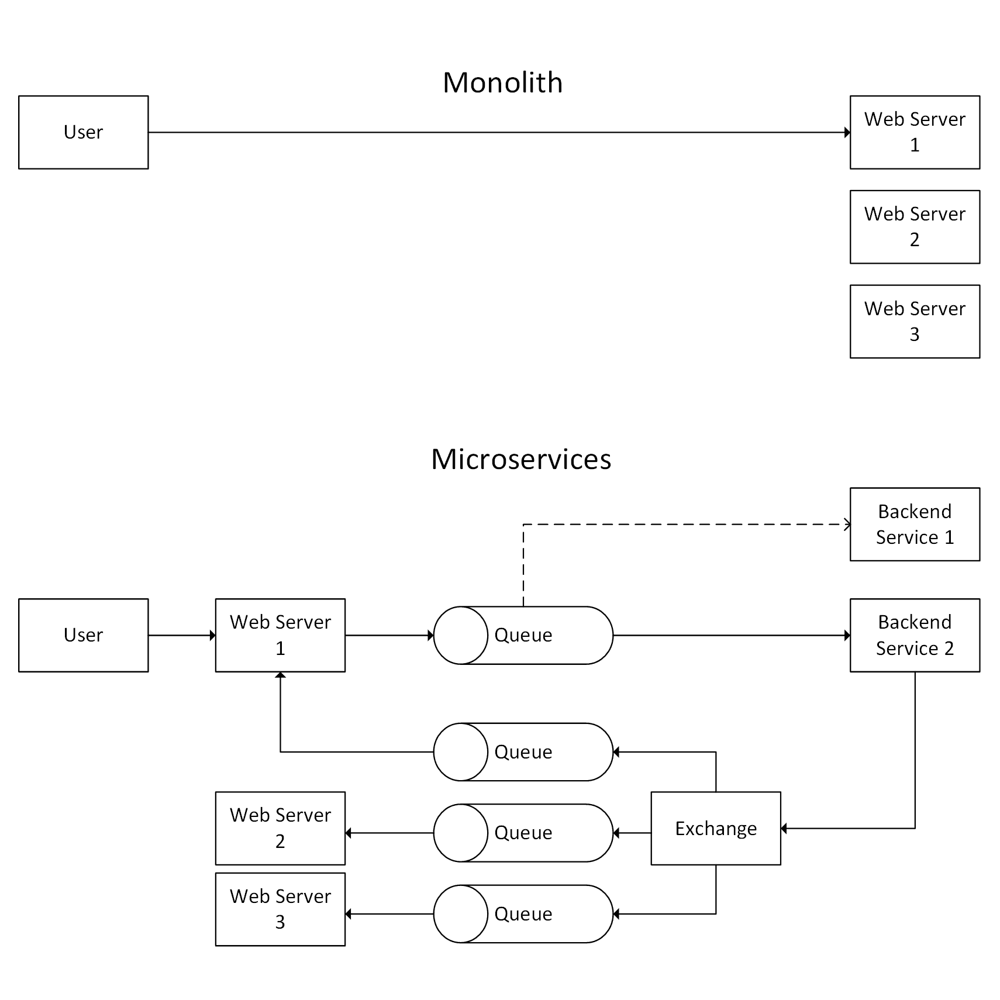
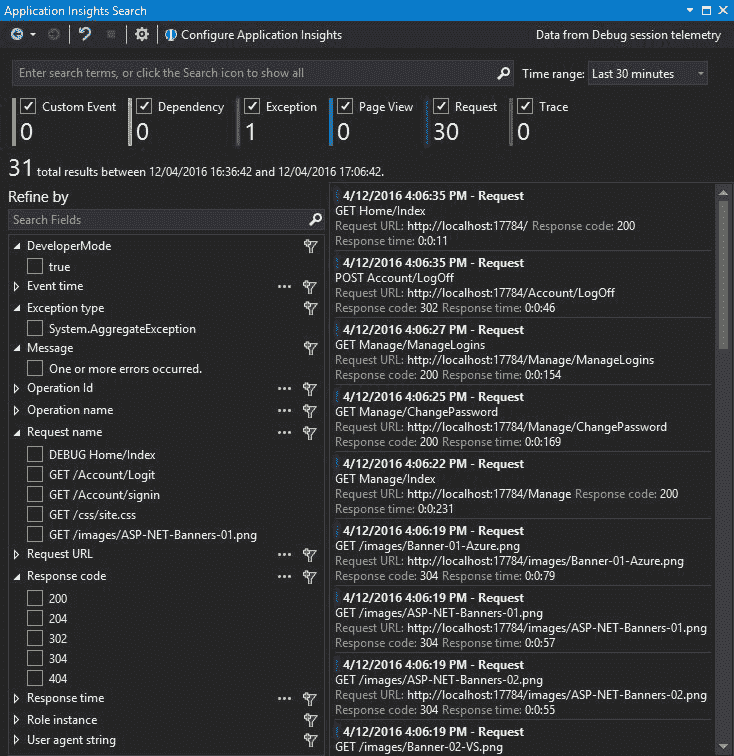

# 十、性能增强工具的缺点

我们在本书中涉及的许多主题都是以一定的代价来提高性能的。你的申请会变得更复杂，更难理解或推理。本章讨论这些权衡以及如何减轻它们的影响。

只有当你需要的时候，而不仅仅是因为它们有趣或有挑战性的时候，你才应该实施你在本书中学到的许多方法。如果现有的性能足够好，通常最好保持简单。

你将学习如何对你应该使用的技术和技巧做出务实的选择。如果您选择使用高级方法，您还将看到如何管理复杂性。

本章涵盖的主题包括以下内容:

*   用框架和架构管理复杂性
*   建立健康的文化以提供高性能
*   分布式调试和性能日志记录
*   了解统计数据和陈旧数据

许多书籍和指南只关注新工具和框架的积极方面。然而，没有什么是免费的，总是有惩罚，这可能不会立即显而易见。

你可能感觉不到你长期以来所做选择的影响，尤其是在技术架构方面。你可能不会发现一个决定是坏的，直到你试图在它的基础上，也许几年后。

# 管理复杂性

性能增强技术的主要问题之一是它们通常会使系统更加复杂。这可能会使系统更难修改，也可能会降低您的工作效率。因此，虽然您的系统运行得更快，但您的开发现在更慢。

我们通常在企业软件中发现这种复杂性问题，尽管通常是出于不同的原因。通常，会使用许多不必要的抽象层，以保持软件的灵活性。具有讽刺意味的是，这实际上会使添加新功能的速度变慢。在你意识到简单让改变变得更容易之前，这看起来可能是违背直觉的。

There's a satirical enterprise edition of the popular programmer interview coding test *FizzBuzz* , which is available on GitHub (via the short URL [http://www.fizzbuzz.enterprises/](http://www.fizzbuzz.enterprises/) ) . It's a good inspiration for how to not do things.

如果你还不需要某个特性，那么最好把它放在一边，而不是构建它，以防将来你可能需要它。你写的代码越多，它就会有越多的错误，并且越难理解。过度设计是一种常见的负面心理特征，如果你没有意识到，它很容易成为受害者，营销人员经常利用这一点。

举个非软件的例子，四轮驱动 SUV 卖给那些永远不需要越野能力的人，他们的错误假设是这种能力有一天可能会派上用场。然而，财务、安全、环境和停车便利成本超过了这种假定的好处，因为它从未被使用过。

我们通常将这种开发建议称之为“极限编程” ( **XP** )哲学，**你不需要它** ( **YAGNI** )。虽然我们有时候用的词略有不同，但意思是一样的。YAGNI 主张保持简单，只建立你急需的东西。

这并不意味着你应该让你的软件很难修改。保持灵活性仍然很重要，只是不要在需要之前添加功能。例如，当只有一个实现时，添加一个抽象基类可能是一种过度杀伤。如果您构建它，您可以很容易地将它与第二个实现一起添加。

做的时候很难动作快又不摔东西。除了持续良好的开发速度之外，如何实现高可靠性还取决于许多特定于您的情况的因素，例如您的团队规模、组织结构和公司文化。

一种方法是接受变化并开发一个系统，在这个系统中你可以自信地重构你的代码。使用像 C#这样的静态编译语言是一个好的开始，但是您也应该有一个全面的测试套件来避免回归。

您应该设计一个松散耦合的系统，这意味着您可以在没有很多连锁反应的情况下独立地更换部件。这也使得构建单元测试变得更加容易，这对于在重构时防止功能退化是非常宝贵的。

在下一章中，我们将使用**持续集成** ( **CI** )工作流程来涵盖测试和自动化。在本章中，我们将更多地讨论可以帮助您维护应用的各种架构风格。

# 理解复杂性

当学习新的做事方法时，你应该避免在不了解原因的情况下去做。你应该知道好处和坏处，然后衡量这些变化，以证明它们是你所期望的。不要只是盲目地执行某件事，并假设它会改善情况。尽量避免**货邪教编程**，始终客观评价一种新的做法。

Cargo cult programming is the practice of emulating something successful but failing to understand the reasons of why it works. Its name comes from the cargo cults of the Pacific, who built dummy airstrips after World War II to encourage cargo delivery. We use it to describe many things where correlation has been confused with causation. One example is a company encouraging long hours to deliver a project because they have heard of successful projects where employees worked long hours. However, they fail to understand that the successful project and long hours are both independent byproducts of a highly motivated and competent workforce, and they are not directly related.

保持代码的可读性很重要，不仅仅是为了团队中的其他人或新成员，也是为了你未来的自己(他们会忘记某件事是如何工作的，以及它为什么以原来的方式编写)。这不仅仅意味着在代码中编写有用的解释性注释，尽管这是一个非常好的实践。它也适用于采购控制意见和保持文件的最新。

可读性还包括保持事物的简单性，只让它们变得必要的复杂，而不在不必要的抽象层中隐藏功能，例如，当标准结构(例如，循环或`if`语句)可读性更强且长度稍长时，不使用巧妙的编程技术来减少文件行数。

在你的团队中有一个标准的做事方式有助于避免意外。在任何地方使用相同的方法可能比找到一种更好的方法，然后有很多不同的方法更有价值。如果有共识，那么你可以回去，在你需要的地方改进更好的方法。

# 复杂性降低

有各种解决方案来管理性能增强技术可能增加的复杂性。这些通常通过隐藏复杂性来减少你需要随时思考的逻辑量。

一种选择是使用标准化应用编写方式的框架，这样可以更容易推理。另一种方法是使用一种架构，该架构允许您只孤立地考虑代码库的一小部分。通过将一个复杂的应用分解成可管理的块，它变得更容易使用。

This idea of modularity is related to the **single responsibility principle** (**SRP** ), which is the first of the **SOLID** principles (the others are open/closed, Liskov substitution, interface segregation, and dependency inversion). It is also similar to the higher-level **Separation of Concerns** (**SoC** ) and to the simplicity of the Unix philosophy. It is better to have many tools that each do one thing well, rather than one tool that does many things badly.

# 结构

近年来，前端框架变得流行起来。脸书的 **React** 是一个库，旨在用 JavaScript 可靠地构建 web 应用视图，尽管专利许可有争议。目的是通过简化数据流和标准化方法来帮助大型团队完成项目。React 可以通过**ReactJS.NET**项目([https://reactjs.net/](https://reactjs.net/))与 ASP.NET 芯整合。

This is not to be confused with **React Native** , used to build cross-platform apps that share code across iOS, Android, and the **Universal Windows Platform** (**UWP** ). If you prefer coding in C#, then you can build your cross-platform mobile apps with **Xamarin** . However, we won't go further into any of these technologies in this book. Visit the author's website ([https://unop.uk/](https://unop.uk/) ) to read about ReactJS.NET and Xamarin.Forms.

在后端，我们有的服务器端框架。网芯和 ASP.NET 芯。除了 C#特性，这些特性还提供了简化历史上复杂特性的便捷方式。例如`async`和`await`关键字隐藏了很多与异步编程相关的复杂逻辑，lambda 函数简洁地表达了意图。

我们在本书的前面已经介绍了其中的许多特性，因此在这里不再赘述。我们还强调了一些库，通过隐藏用于复杂操作的样板代码，可以让您的生活更轻松，例如`EasyNetQ`和`RestBus`。

隐藏一个复杂的过程从来都不是完美的，您偶尔会遇到一些抽象，它们会泄露一些实现细节。例如，在处理异常时，您可能会发现您感兴趣的问题现在被包装在一个聚合异常中。如果你不小心，你的错误日志可能不再包含你想要的细节。

It's good practice not to log the individual properties of an exception, as exceptions already have built-in logic to output all of the relevant information. Simply log an exception as a string and you will get the message and stack trace, including any inner exceptions.

我们还需要详细讨论的是 web 应用的体系结构。将一个庞大的系统分解成几个独立的部分不仅可以提高性能，如果处理得当，还可以让它更容易维护。

# 体系结构

在前一章中，当讨论消息队列时，我们简要介绍了微服务体系结构。这种风格是对传统的**面向服务架构** ( **SOA** )的更现代的重新想象，虽然使用可靠的 MQ 通信是首选，但是我们也可以使用**表示状态转移**(**REST**)HTTP API 来执行这一操作。

通常，我们将传统的 web 应用构建为单个应用或整体。如果应用在很长一段时间内有机增长，这是很常见的，这是完全可以接受的做法。在没有任何需求之前过早地过度设计是一个糟糕的决定，这可能永远不会实现。

过度流行是一个很好的问题，但不要过早地为此进行优化。这不是让事情变得不必要的缓慢的借口，所以一定要理解其中的权衡。

Using a monolithic architecture is not an excuse to build something badly, and you should plan for expansion, even if you do not implement it immediately. You can keep things simple while still allowing for future growth. Although the application is a single unit, you should split the code base into well-organized modules, which are linked together in a simple, logical, and easy-to-understand way. Refer to the SOLID principles mentioned previously.

如果一个单一的应用不能很容易地扩展以满足用户需求，并因此表现不佳，那么您可以将其拆分成更小的独立服务。如果一个应用变得太麻烦而无法快速迭代，并且开发速度变慢，你也可能希望将其拆分。

# 整体服务与微服务

下图显示了典型的整体式和微服务架构之间的一些差异:



这里，用户向运行在 web 服务器场上的应用发出请求。为了清楚起见，我们省略了防火墙、负载平衡器和数据库，但是显示了多个 web 服务器来说明同一代码库在多台机器上运行。

在最初的整体架构中，用户直接与单个网络服务器通信。理想情况下，这是每个请求/响应对。但是，如果应用设计不佳，并且将状态保存在内存中，那么**粘性会话**可能会导致负载集中在某些服务器上。

图中的第二个例子，即微服务架构，显然更复杂，但也更灵活。用户再次向 web 服务器发送请求，但是服务器并不做所有的工作，而是将消息放入队列。

这个队列中的工作分布在多个后端服务之间，其中第一个服务很忙，所以第二个服务接收消息。当服务完成时，它向消息代理上的一个交换发送消息，该交换使用发布/订阅广播来通知所有的 web 服务器。

一个增加的复杂性是，架构应该已经发送了对用户原始 web 请求的响应，因此您需要更仔细地考虑**用户体验** ( **UX** )。例如，您可以显示一个进度指示器，并使用异步网络套接字连接更新其状态。

# 架构比较

整体方法很简单，你可以添加更多的网络服务器来处理更多的用户。然而，这种方法会变得很麻烦，因为应用(和开发团队)变得越来越大，因为最微小的变化都需要完全重新部署到每个 web 服务器。

此外，单块很容易纵向(向上)扩展，但很难横向(向外)扩展，这一点我们之前已经讨论过了。然而，单块更容易调试，所以你需要小心，并有良好的监控和记录。您不希望任何随机停机调查因为不必要的微服务实现而变成谋杀之谜搜索。

Historically, Facebook had a deployment process that consisted of slowly compiling their PHP code base to a gigantic gigabyte-scale binary (for runtime performance reasons). They then needed to develop a modified version of BitTorrent to efficiently distribute this huge executable to all of their web servers. Although this was impressive infrastructure engineering, it didn't address the root cause of their **technical debt** problem, and they have since moved on to better solutions, such as the **HipHop Virtual Machine** (**HHVM** ), which is similar to the .NET CLR

如果您希望练习连续交付，并且一周部署多次(甚至一天部署多次)，那么将您的 web 应用拆分开来是非常有利的。然后，您可以分别维护和部署每个部分，使用消息根据约定的应用编程接口相互通信。

这种分离也可以帮助您使用敏捷开发方法——例如，使用许多小团队而不是大团队，因为小团队表现更好。

你控制整块石头的工具非常粗糙，因为所有的工作都是在一个地方完成的。您不能将应用的某些部分独立扩展到应用的其他组件。即使高负荷集中在一小部分，你也只能缩放整件事。这类似于中央银行只控制一个单一的利率作为杠杆，这会同时影响许多事情。如果您的应用是分布式的，那么您只需要扩展需要它的部分，避免过度配置并降低成本。

亚伯拉罕·马斯洛的一句被广泛引用的话是这样说的:

"I suppose it is tempting, if the only tool you have is a hammer, to treat everything as if it were a nail."

这就是所谓的仪器定律，与确认偏差有关。如果你只有一个工具，那么你很可能什么都用这个工具，只看到支持你现有想法的东西。这通常适用于工具和框架，但也适用于缩放技术。

模块化的第一步可能是将一个大的 web 应用拆分成许多较小的 web 应用，这样您就可以分别部署它们。这种策略可以有一些好处，但也有很多局限性。某些逻辑可能不适合托管在 web 应用中，例如，长时间运行的进程，如监控文件系统或用于操作媒体的进程。

您可能还会发现，您需要复制原始单块中共享的代码。如果你坚持**不重复自己** ( **DRY** )的原则，那么你可能会把这个功能提取到一个库中。然而，现在您需要管理依赖关系和版本。您还需要在私有存储库中构建、打包和托管您的库的过程，所有这些都会减慢开发速度并降低您的敏捷性。

Sometimes, we also refer to DRY as **Duplication Is Evil** (**DIE** ), and this is the sensible idea that an implementation should only occur in a unique location. If other code requires this functionality, then it should call the original function and not have copied code pasted in. This means that you only need to make a change in a single place to apply it everywhere.

更高级的方法是将功能提取到一个单独的服务中，该服务可以处理许多不同的 web 应用。如果设计正确，那么这项服务不需要对这些应用有任何了解，只需对消息做出响应。这允许您添加新的 web 应用，而无需更改其他应用或服务的代码。

# 重构

如果应用已经成为一个紧密耦合的大泥球，那么将一个整体重构为服务可能会很棘手，但是如果它已经构建良好(具有大量的测试覆盖和松散耦合的代码)，那么它应该不会太费力。一个建造得很好的整体和一个不加思考的大泥球有很大的区别。

值得在测试覆盖范围上进行扩展，因为单元测试对于成功的重构是必不可少的，而不会引入回归或新的错误。单元测试允许您自信地重构和整理，并且它们防止了脆弱的代码的创建，这是开发人员不敢触及的。我们将在[第 11 章](11.html)、*监控性能回归*中更详细地介绍测试，包括自动化。

这两种设计模式表面上看起来很相似，但从内部来看却完全不同。下图说明了结构良好的整体建筑和杂乱无章的大泥球之间的区别。


大方框代表每个网络服务器上运行的代码(上图中整体示例中的**网络服务器 N** 方框)。从外部来看，它们看起来是一样的，但区别在于代码的内部耦合。

大泥球是一团混乱，代码在整个应用中引用了其他函数。整体结构良好，不同模块之间的关注点清晰分离。

对大泥球中代码的更改可能会有意想不到的副作用，因为它的其他部分可能依赖于您正在修改的实现细节。这使得它易碎，难以更改，开发人员可能害怕接触它。

构建良好的整体很容易重构，并分离成独立的服务，因为代码组织得很整齐。它使用抽象接口在模块之间进行通信，代码不会触及另一个类的具体实现细节。它还具有出色的单元测试覆盖率，在每次签入/推送时都会自动运行。

Tools are also very useful in refactoring and testing. We covered the Visual Studio IDE and ReSharper plugin previously, but there are many more tools for testing. We will cover more testing tools, including automation, in [Chapter 11](11.html) , *Monitoring Performance Regressions* .

虽然两者都是单一的代码库，但整体的质量要高得多，因为它在内部分布良好。好的设计对未来的验证很重要，因为它允许扩展。整块石头没有过早地被分割(在需要缩放之前)，但是设计使得这在以后很容易做到。相比之下，大泥球已经积累了大量的技术债务，在我们取得任何进一步进展之前，它需要还清这些债务。

Technical debt (or tech debt for short) is the concept of not finishing a job or cutting corners, which could lead to more difficulties until it is paid back. For example, failing to properly document a system will make it more difficult for new developers. Tech debt is not necessarily a bad thing if it is deliberately taken on in full knowledge, logged, and paid back later. For example, waiting to write the documentation until after a release can speed up the delivery. However, tech debt that is not paid back or is accumulated without knowledge (simply due to sloppy coding) will get worse over time and cause bigger issues later.

交付高质量且灵活的应用(易于重构)的最佳方式是拥有一个称职且尽职尽责的开发团队。然而，这些属性往往更多的是关于文化、交流和动机，而不仅仅是技能或天赋。虽然这不是一本关于团队管理的书，但是拥有一个健康的文化是非常重要的，所以我们将在这里介绍一点。运营和软件开发部门的每个人都可以帮助创造一种积极友好的文化，即使你通常也需要上级的支持。

# 高效的文化

如果你想获得高绩效，那么培养一种鼓励这一点并承认绩效至关重要的公司文化是很重要的。文化不能只是来自底层(只涉及工程师)。文化需要来自高层，管理层必须接受绩效特权。

This section is not very technical, so feel free to skip it if you don't care about management or the human side of software development.

# 无可指责的文化

高绩效文化最重要的属性是它应该是开放和无可指责的。每个人都需要专注于通过测量和学习来实现最好的结果。将错误归咎于个人对交付优秀的软件是有害的，这不仅仅是在性能方面。

如果出了问题，那么这就是一个过程问题，重点应该放在改进它和防止将来重复错误上，例如，通过自动化它。这类似于航空旅行等对安全至关重要的行业的行为，因为他们认识到，在灾难发生之前，责备人们会阻止他们尽早提出问题。

一个相关的哲学是日本的改善过程，它鼓励每个人不断改进。汽车制造商丰田开创了改善实践，以提高其生产线的效率，此后大多数汽车公司和许多其他不同行业都采用了这些实践。

一些行业也有鼓励举报的程序，以保护引起关注的个人。然而，如果这在 web 应用开发中是必需的，那么这肯定是文化需要工作的标志。开发人员应该觉得他们能够绕过他们的直线经理直接提出问题，而没有任何后果。如果每个人的意见都得到尊重，那么这甚至没有必要。

# 智力不诚实

如果团队成员在想法受到挑战时采取防御态度，那么这是事情可能进展不顺利的迹象。每个人都会犯错误，他们的知识也有差距，这是最好的工程师都信奉的真理。你应该努力营造一种文化，在这种文化中，每个人都乐于接受新的想法，并且总是问问题。

如果人们不能接受建设性的批评，他们的想法受到挑战，那么他们可能缺乏信心，并可能掩盖了缺乏能力。有经验的开发人员知道，你永远不会停止学习；他们承认自己的无知，并且总是乐于接受改进的建议。

不接受建议会改变其他人的行为，他们会提前停止提出小问题。这导致了关于质量差的公开秘密，而第一个已知的问题是在发布时，此时一切都变得更糟(或着火)。

这并不是对人恶语相向的借口，所以总是要试着对人好一点，委婉地解释你批评背后的原因。任何事情都很容易挑毛病，所以一定要提出一个替代方法。如果你有耐心，那么一个通情达理的人会对学习机会心存感激，对获得经验心存感激。

一个好的规则是*不要做一个混蛋*对待别人就像你希望别人对待你一样；所以要善良，想想如果情况逆转，你会有什么感受。请记住，友好并不总是与做正确的事情相一致。

一点点自我贬低可以让你变得更平易近人，而不是简单地发号施令。然而，当某件事是开玩笑或开玩笑时，你应该说清楚，尤其是在与更直接的文化打交道时，或者在文本交流时。

一概而论总是一个坏主意(从来没有例外)。然而，作为一个例子，北美人通常没有英国人那么含蓄，也没有英国人那么讽刺(英国人也用不同的方式拼写一些单词，有些人会说，更正确)。显然，用你自己的判断，因为这可能是可怕的建议，可能会引起冒犯，甚至更糟糕的是，一个全面的外交事件。希望不言而喻(或者也许不是)，整段都是在开玩笑。

对自己的想法有诚信和信心的人可以谦虚和自嘲，但公司内部文化也会影响这一点。一个特别糟糕的做法是通过*阶梯式*(也称为堆栈排名)进行绩效评估，这涉及到将每个人相对于其他人按顺序排列。这是有害的，因为它奖励的是那些更专注于推销自己的人，而不是那些认识到自己技术技能不足并试图提高这些技能的人。在病态的情况下，所有最优秀的人都被挤出去了，你最终进入了一个充满反社会的尖锐西装的公司，他们在技术上是文盲，甚至道德上是破产的。

# 放慢速度以走得更快

有时，公司必须允许开发团队放慢特性交付的速度，以便专注于性能和解决技术债务。他们应该有时间考虑设计决策，这样他们可以深思熟虑，避免过早的概括或粗心的优化。

性能是软件的一个重要卖点，在整个开发过程中构建质量比在最后的抛光阶段要容易得多。有大量证据表明，良好的绩效可以提高您的**投资回报** ( **RoI** )并创造客户。在网络上尤其如此，性能差会降低转化率和搜索引擎排名。

拥有健康的文化不仅对软件的运行时性能很重要，而且对开发速度也很重要。应该鼓励团队行为严谨，编写精确但简洁的代码。

你得到你所测量的，如果你只测量特征交付的速率，或者更糟的是，仅仅是所写的**行代码** ( **LoC** )，那么质量就会受到影响。从长远来看，这将伤害你，是一个虚假的经济。

虚假经济是指当你采取短期成本节约措施时，实际上会让你长期损失更多的钱。这方面的例子有:为开发人员节省硬件，或者在代码编写过程中打断某人做一些琐碎的事情，这很容易等到以后，迫使他们切换上下文。

另一个非软件的例子是目光短浅的政府削减研究投资，牺牲长期增长来换取短期储蓄。或者一个国家离开经济联盟时承诺会费将用于更好的事情，尽管会费与经济的长期损失相比相形见绌。

Hardware is significantly cheaper than a developer's time. Therefore, if everyone on your team doesn't have a beefy box and multiple massive monitors, then productivity is being needlessly diminished. Even over a decade ago, Facebook's software developer job adverts listed dual 24-inch widescreen monitors as a perk.

# 完全（或彻底）地

在一个健康和进步的文化中，从头重写低质量的软件很有诱惑力，也许是在最新的流行框架中，但这通常是一个错误。发布的软件是久经沙场的(不管它的构建有多糟糕)，如果你重写它，那么你可能会再次犯同样的错误，例如，重新实现你已经修补过的 bug。如果软件不是用良好的单元测试覆盖率构建的，这一点尤其正确，这有助于防止回归。

唯一可以从头开始重写应用的情况是，你故意做了一个原型来探索问题空间，唯一的目的是扔掉它。但是，您应该非常小心，因为如果您实际上已经构建了一个**最小可行产品** ( **MVP** )，那么这些实际上是 MVP 的原型有一个长期停留的习惯，并形成了更大应用的基础。

完全重写的一个更好的方法是向应用添加测试(如果它还没有测试的话)，并逐步重构它以提高质量和性能。

如果你构建一个应用的方式使得单元测试变得困难，那么你可以从**用户界面** ( **UI** )测试开始，也许可以使用无头网络浏览器。在下一章中，我们将讨论更多的测试，包括性能测试。

# 共享价值

文化实际上只是一套共同的价值观，包括开放、可持续性、包容性、多样性和道德行为等。将这些价值观正式记录下来会有所帮助，这样每个人都知道你代表什么。

你可能会有一个渐进式的公开薪资政策，这样其他人就不能用秘密的收入信息作为工具来少给人发工资了。然而，这需要普遍适用，因为有多种冲突的文化是不健康的，因为这可能会形成一种我们对他们的态度。

关于文化还有很多要说的，但是，正如你所看到的，有许多相互竞争的问题需要平衡。最重要的想法是进行有意和深思熟虑的权衡。没有一个正确的选择，但你应该始终意识到后果，并意识到微小的行动会如何改变团队的表现。

# 表演的代价

开发人员应该了解可用的性能预算，并了解他们编写的代码的成本，不仅仅是执行吞吐量，还包括可读性、可维护性和能效。在一个工作单元中投入更多的核心远不如重构它变得更简单。

效率变得越来越重要，尤其是随着移动设备和云计算基于时间的使用计费的兴起。并行化一个低效的算法可能会解决时域中的性能问题，但这是一种粗糙的暴力方法，改变底层实现可能会更好。

少往往就是多，有时候什么都不做是最好的方法。软件工程不仅仅是要知道要构建什么，还要知道不构建什么。保持事情简单有助于团队中的其他人使用你的工作。你应该尽量避免用不明显的行为让任何人吃惊。例如，如果你构建了一个应用编程接口，那么你应该给它常规的默认值。如果操作可能需要很长时间，那么将这些方法命名为 async 以表明这一事实。

在构建代码时，您应该致力于使成功变得容易，失败变得困难。让做错事变得困难；例如，如果一个方法不安全，命名它来记录这个事实。做一个称职的程序员只是做一个优秀开发人员的一小部分；你还需要乐于助人，并精通清晰的沟通。

事实上，如果你不刻意让事情变得简单来帮助团队中其他人的理解，成为一名专业的程序员可能会有不利的一面。您应该始终平衡性能改进和副作用，并且您不应该在没有充分理由的情况下以牺牲未来的开发效率为代价来实现它们。

# 分布式调试

分布式系统可能会使调试问题变得困难，您需要通过集成有助于可视性的技术来提前对此进行规划。你应该知道你想要测量什么指标，什么参数是重要的记录。

当你运行一个网络应用时，它不是一个部署和忘记的例子，就像移动应用或桌面软件一样。您需要持续自动关注您的应用，以确保它始终可用。如果您监控正确的性能指标，那么您可以获得问题的早期预警信号，并采取预防措施。如果您只测量正常运行时间或响应时间，那么您可能知道的第一个问题是停机通知，可能是在不合群的时间。

您可以将基础架构外包给云托管公司，这样您就不必担心硬件或平台故障。然而，这并不能完全免除你的责任，你的软件仍然需要持续的监控。您可能需要以不同的方式设计您的应用，以便与您的托管平台协调工作，并在出现问题时进行扩展或自我修复。

如果你正确地设计了你的系统，那么你的 web 应用就会自动运行，你很少会收到需要你注意的动作的通知。如果您能够成功地自动化所有事情，而不是临时照看一个实时部署，那么您就有更多的时间来构建未来。

在分布式架构中，您不能简单地将调试器附加到实时 web 服务器上，即使在可能的情况下，这也不是一个好主意。再也没有一台直播服务器了；现在有许多实时服务器，甚至更多的进程。为了全面了解系统，您需要同时检查多个模块的状态。

有许多工具可以帮助您集中调试信息。你可以改装其中一些。然而，为了充分利用它们，您应该决定提前测量什么，并从一开始就在软件中构建遥测功能。

# 记录

日志记录在高性能应用中至关重要，因此，虽然日志记录确实会增加一些开销，并会降低执行速度，但忽略它将是短视的，也是错误的节约。没有日志，你就不知道什么是慢的，什么是需要改进的。您还会有其他顾虑，例如可靠性，对于可靠性来说，日志记录是必不可少的。

# 错误记录

您可能熟悉名为**错误记录模块和处理程序** ( **ELMAH** )的优秀 ASP.NET 包，用于捕获未处理的异常([http://elmah.github.io/](http://elmah.github.io/))。ELMAH 非常适合现有的应用，因为你可以把它放到一个实时运行的网络应用中。然而，最好从一开始就将错误记录内置到软件中。

不幸的是，ELMAH 还不支持 ASP.NET Core，但是有一个类似的包叫做**错误记录中间件** ( **ELM** )。将它添加到您的 web 应用中就像安装 scope 一样简单，但是它没有 ELMAH 的所有功能。ELM 并不真正适合生产使用，但是它在本地仍然可以帮助调试。

首先，将`Microsoft.AspNetCore.Diagnostics.Elm` NuGet 包添加到您的项目中。您可以使用集成开发环境的图形工具来做到这一点(方法会根据您使用的集成开发环境而有所不同，例如 Visual Studio 或 VS Mac)。或者，您可以在终端中使用以下命令，该命令适用于所有受支持的平台:

```cs
dotnet add package Microsoft.AspNetCore.Diagnostics.Elm

```

这将在`.csproj`文件中添加一行，如下所示:

```cs
<PackageReference Include="Microsoft.AspNetCore.Diagnostics.Elm" Version="0.2.2" />
```

中引用包的方式。NET Core 2.0 不同于。NET Core 1.0。它们不再在 JSON 文件中指定，尽管您可以手动编辑 XML 项目文件，但使用提供的工具更容易。您可以使用`dotnet migrate`命令将基于旧`project.json`的解决方案升级为基于`msbuild`的`.csproj`解决方案。

然后，在`Startup`类的`ConfigureServices`方法中，添加以下代码行:

```cs
services.AddElm(); 
```

您还需要在同一类的`Configure`方法中添加以下几行:

```cs
app.UseElmPage(); 
app.UseElmCapture(); 
```

You may want to put these lines of code inside the `if` statement that tests for `env.IsDevelopment()` , so that they are only active on your workstation.

现在，您可以在浏览器中访问 web 应用的`/Elm`路径来查看日志，如下图所示。使用搜索框过滤结果，单击每行末尾的 v 展开条目的详细信息，然后单击^再次折叠它:


当使用 ELM、ELMAH 甚至默认错误页面时，您应该注意不要向真实用户显示详细的异常或堆栈跟踪。这不仅仅是因为他们不友好和没有帮助，而是因为他们是一个真正的安全问题。错误日志和堆栈跟踪可以揭示应用的内部工作方式，恶意行为者可以利用这一点。

You can use the website, ASafaWeb ([https://asafaweb.com/](https://asafaweb.com/) ), to check if you are unknowingly revealing more information about your app than you should be. It focuses more on traditional ASP.NET applications, but it's still useful.

您可能已经注意到，在终端中运行应用时，还会将任何日志条目流式传输到控制台(取决于您配置的日志记录级别)。您可以将这个输出传输到您喜欢的任何地方，这是 Unix 应用使用的一种非常常见的模式。将日志视为事件流并简单地将其写入`stdout`是十二因素应用的因素之一。

十二因素应用是设计网络应用的一种方式，以便它们非常适合在云托管环境中运行。这些规则是由 Heroku 的团队构想出来的，作为可以遵循的良好实践。他们专注于 Linux，但现在这是托管 ASP.NET Core网络应用的一个很好的选择。

You can read about the other eleven factors on the website dedicated to twelve-factor apps at [https://12factor.net/](https://12factor.net/) . The factor regarding logs is number eleven ([https://12factor.net/logs](https://12factor.net/logs) ).

ELM 是相当基本的，但它仍然是有用的。然而，默认模板中已经内置了更好的解决方案，例如对日志记录和**应用洞察**的集成支持。

# 应用洞察

Application Insights 是一项遥测服务，允许您监控应用的性能并查看请求或异常。您可以在 Azure 上使用它，但是它也可以在本地工作，不需要 Azure 帐户。但是，如果您没有在 Azure 上托管，那么您可能希望使用其他东西。

在 Visual Studio 2017 中，您可以右键单击您的 web 应用项目，单击添加，然后单击应用洞察遥测。然后，您可以单击开始按钮并注册您的应用。但是，请记住使用 Azure 的隐私和成本影响。您可以通过单击注册页面底部的低调链接在本地使用 SDK。

This practice of designing a user interface to encourage a particular behavior from users that may not be in their best interest is called a **dark pattern** . Microsoft is betting big on Azure, so it is understandable that much of their software is designed to funnel you into a Microsoft online account and Azure. However, you don't need to use VS or Windows to build software with .NET Core, and it's also fairly easy to switch off the telemetry in the SDK and development tools.

构建并运行项目，然后打开“应用洞察搜索”窗口查看输出。在浏览器中浏览 web 应用，您会看到记录开始出现，看起来应该如下所示:



If you don't see any records in the output, then you may need to update the NuGet package (`Microsoft.ApplicationInsights.AspNetCore` ) or click on the search icon.

您可以按事件类型进行筛选，例如，请求或异常，还有更详细的筛选来优化您的搜索。您可以选择单个记录来查看更多详细信息，如下所示:


这可以告诉你的一个更有趣的事情是，你的应用是否触发了任何外部事件。例如，您可以看到您的应用是否向另一个域上的网址发出了网络应用编程接口请求，以及该操作对其速度的影响。

我们没有足够的空间在这里更详细地介绍应用洞察，如果您没有使用 Azure，那么您无论如何都要考虑其他选项。你可以在[https://docs . Microsoft . com/en-us/azure/application-insights/app-insights-ASP-net-core](https://docs.microsoft.com/en-us/azure/application-insights/app-insights-asp-net-core)上在线阅读更多。

# 综合采伐

日志记录现在已经内置于 ASP.NET Core中，**依赖注入** ( **DI** )也是如此，两者都包含在默认模板中。这减少了进入的障碍，现在即使在最小的项目中使用这些有用的技术也是微不足道的。

以前，您需要在开始之前添加日志和 DI 库，这可能会使许多人不再使用它们。如果你还没有两者的标准选择，那么你就需要费力地完成过多的项目，并研究每一个项目的优点。

You can still use your preferred libraries if you are already acquainted with them. It's just that there are now sensible defaults, which you can override.

日志在`Program`类中被添加到你的应用中，但是在 ASP.NET Core 2.0 中的方式与在 ASP.NET Core 1.0 中的方式略有不同。在模板中，它是在调用`CreateDefaultBuilder`方法时添加的，这很容易设置合理的默认值。如果您想自定义它，那么语法与以前的版本不同。你不再叫伐木工人工厂，取而代之的是一种`ConfigureLogging`方法。参考文档([https://docs . Microsoft . com/en-us/aspnet/core/基本面/日志？tab = aspnetcore2x](https://docs.microsoft.com/en-us/aspnet/core/fundamentals/logging?tabs=aspnetcore2x))了解完整的详细信息，如果您想使用默认配置以外的其他配置。

在`Startup`类中配置了日志记录，如果您使用标准的 web 应用模板，那么这将已经包含在您的日志中。记录器工厂从`appsettings.json`文件中读取设置。在这里，您可以配置日志记录级别，默认情况下，相关部分如下所示:

```cs
"Logging": {

  "IncludeScopes": false,

  "Debug": {

    "LogLevel": {

      "Default": "Warning"

    }

  },

  "Console": {

    "LogLevel": {

      "Default": "Warning"

    }

  }

}
```

在开发模式下，将使用以下设置来覆盖这些设置(从`appsettings.Development.json`开始):

```cs
"Logging": {
  "IncludeScopes": false,
  "LogLevel": {
    "Default": "Debug",
    "System": "Information",
    "Microsoft": "Information"
  }
}
```

这设置了一个非常健谈的日志级别，这对开发很有用，但是当您在生产中运行时，您可能只想记录警告和错误。

Along with logging, useful development debugging tools included by default in the `Startup` class include a developer exception page, which is like an advanced version of the old **Yellow Screen Of Death** (**YSOD** ) ASP.NET error page. Also included is a database error page, which can helpfully apply EF migrations and which mitigates a common pitfall of the previous EF code-first migration deployments.

要通过构造函数注入将记录器添加到您的 MVC 主控制器，您可以使用以下代码(在文件顶部将`using Microsoft.Extensions.Logging;`添加到您的`using`语句之后):

```cs
private readonly ILogger Logger; 
public HomeController(ILoggerFactory loggerFactory) 
{ 
    Logger = loggerFactory.CreateLogger<HomeController>(); 
} 
```

之后，可以使用`Logger`记录动作方法内部的事件，如下所示:

```cs
Logger.LogDebug("Home page loaded"); 
```

有更多可用的日志记录级别和重载方法，以便您可以记录附加信息，例如异常。我们在此不再赘述，但您不必简单地记录文本事件；您还可以记录执行时间(可能使用秒表)或递增计数器，以查看特定事件发生的频率。接下来，我们将看到如何集中查看这些数字并正确阅读它们。

For more examples of how to use logging, you can examine the default account controller (if you've included individual user account authentication in the template).

# 集中式日志记录

伐木很棒。但是，在分布式系统中，您会希望将所有日志和异常馈送到一个位置，在那里您可以轻松地分析它们并生成警报。一个潜在的选择是 Logstash([https://www.elastic.co/products/logstash](https://www.elastic.co/products/logstash))，我们在[第 4 章](04.html)、*测量性能瓶颈*中短暂提到过。

如果您喜欢更模块化的方法，并且想要记录性能计数器和指标，那么有 **StatsD** ，它监听 UDP 数据包，并推送到石墨进行存储和绘图。你可以在[https://github.com/etsy/statsd](https://github.com/etsy/statsd)买到，还有一些。NET 客户端，以及主存储库中的一个示例 C#代码。另一个收集日志的开源选项是 Fluentd([https://www.fluentd.org/](https://www.fluentd.org/))。

您可能希望使用消息队列进行日志记录，这样您就可以快速地将记录的事件放入队列并忘记它，而不是直接命中日志服务器。如果您直接调用一个应用编程接口(并且没有使用 UDP)，那么请确保它是异步的和非阻塞的。您不想因为低效的日志记录而降低应用的速度。

也有云选项可用，尽管通常关于锁定的警告适用。AWS 有 **CloudWatch** ，你可以在[https://aws.amazon.com/cloudwatch/](https://aws.amazon.com/cloudwatch/)了解更多。Azure Diagnostics 也类似，您可以将其与 Application Insights 集成；在[了解更多信息。](https://docs.microsoft.com/en-us/azure/monitoring-and-diagnostics/azure-diagnostics)

还有其他可用的跨平台云服务，如 New Relic 或 Stackify，但这些服务可能相当昂贵，您可能希望将日志记录保留在自己的基础架构中。你可以把数据硬塞进分析软件，比如**谷歌分析**或者专注于隐私的 Piwik(它是开源的，可以自我托管)，但是这些不太合适，因为它们是为稍微不同的目的设计的。

# 统计数字

当解释您收集的指标时，了解一些基本的统计数据有助于正确阅读它们。取一个简单的*意味着*平均值会误导你，可能没有其他一些特征重要。

当检测您的代码以收集元数据时，您应该大致了解特定日志记录语句的调用频率。这不一定是精确的，粗略的数量级近似(或**费米估计**)通常就足够了。

你应该尝试回答的问题是应该收集多少数据——全部还是随机抽样？如果您需要执行采样，那么您应该计算样本大小应该有多大。我们在[第 7 章](07.html)、*优化输入输出性能*中介绍了与 SQL 相关的采样，这里的思路是相似的。性能统计要求与基准测试相同的严格程度，你很容易被误导或得出不正确的结论。

StatsD 包括对采样的内置支持，但是如果您想研究它们，还有许多其他方法可用。例如，在线流算法和水库是两个选项。性能方面需要牢记的重要一点是使用快速**随机数生成器** ( **RNG** )。至于采样，这不需要加密保护；一个**伪随机数发生器** ( **PRNG** )就可以了。英寸 NET 中，您可以使用`new Random()`作为 PRNG，而不是使用更安全的`RandomNumberGenerator.Create()`选项。有关如何使用这两者的更多示例，请参见[第 8 章](08.html)、*了解代码执行*、*和异步操作*。

当看你的结果时，异常值可能比平均值更有趣。虽然中位数比平均数更有价值，但在这种情况下，你真的应该看百分位数，比如第 90<sup>、第 95<sup>、第 99<sup>百分位数。这些数据点只能代表数据的一小部分，但在一定范围内，它们会频繁出现。您希望针对这些最坏的情况进行优化，因为如果您的用户在 10%的时间内经历了超过 5 秒钟的页面加载(即使平均速度看起来很快)，那么他们可能会去其他地方。</sup></sup></sup>

关于统计数据还有很多要说的，但是除了基本数据之外，还有收益递减。如果你的数学生疏了，那么复习一下可能是明智的(维基百科在这方面很棒)。然后，你可以探索一些更先进的技术，例如高性能的 **HyperLogLog** ( **HLL** )算法，它可以用很少的内存来估计一大组元素的大小。

Redis 支持 HLL 数据结构(使用`PFADD`、`PFCOUNT`和`PFMERGE`命令)。有关不同数据结构的更多信息，请参考[第 8 章](08.html)、*了解代码执行和异步* *操作*。

This is only a brief introduction to performance logging, but there is much more for you to explore. For example, if you want to standardize your approach, then you can look into APDEX ([http://www.apdex.org/](http://www.apdex.org/) ), which sets a standard method to record the performance of applications and compute scores.

# 管理陈旧缓存

值得提供一个快速提醒，在如此复杂的情况下仍然要考虑简单的问题。太容易迷失在复杂的 bug 或性能调整的细节中，而错过显而易见的东西。

A good technique to help with this is *rubber duck debugging* , which gets its name from the process of explaining your problem to a rubber duck on your desk. Most of us have experienced solving a problem after asking for help, even though the other person hasn't said anything. The process of explaining the problem to someone (or something) else clarifies it, and the solution becomes obvious.

如果修复后出现问题，首先检查简单的事情。查看补丁是否已经实际交付和部署。您可能会看到缓存中的陈旧代码，而不是新版本。

管理缓存时，版本控制是帮助您识别陈旧资产的有用技术。您可以更改文件名或添加注释以包含唯一的版本字符串。这可以是**语义版本** ( **版本**)、国际标准化组织日期和时间戳或内容的散列。有关缓存破坏的更多信息，请参考[第 9 章](09.html)、*学习缓存和消息队列*。

SemVer is a great way of versioning your code because it implicitly captures information on compatibility and breaking changes. You can read more about SemVer at [semver.org](http://semver.org) .

# 摘要

在这一章中，我们看到了每一个决定总是有不利的一面，每一个选择都有代价，因为没有什么是免费的。总会涉及到取舍，你需要意识到自己行为的后果，这可能是微小而微妙的。

关键的一课是采取深思熟虑和严格的方法来添加任何性能增强技术。测量对于实现这一点至关重要，但你也需要知道，如果你收集或解释不正确，数据会如何误导你。

在下一章中，我们将继续度量主题，并学习如何使用测试来监控性能回归。您将看到如何使用测试(包括单元测试)、自动化和持续集成来确保一旦您解决了一个性能问题，它就会一直保持下去。