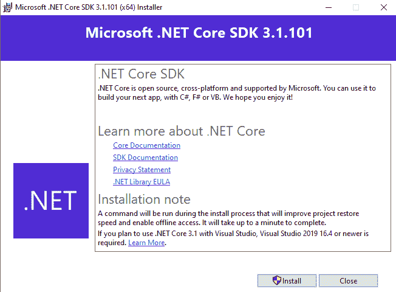
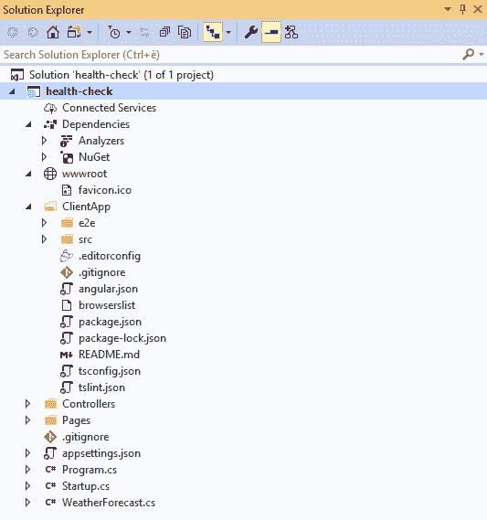

# 一、准备

在本章中，我们将结合 ASP.NET 和 Angular Travel 的最相关功能的理论介绍，并使用更实用的方法，构建它们的基础知识。更具体地说，在本章的下一部分中，我们将简要回顾 ASP.NET Core和 Angular 框架的最新历史，而在后一部分中，我们将学习如何配置本地开发环境，以便组装、构建和测试示例 web 应用样板。

在本章结束时，您将了解 ASP.NET Core 和 Angular 在过去几年中为改进 web 开发所采取的方法，并了解如何正确设置 ASP.NET 和 Angular web 应用。

以下是我们将要讨论的主要主题：

*   **ASP.NET Core革命**：ASP.NET Core的简史和 Angular 的最新成就。
*   **全堆栈方法**：学习如何设计、组装和交付完整产品的重要性。
*   **单页应用**（**SPAs**）、**原生 Web 应用**（**NWAs**）、**和渐进 Web 应用**（**PWAs**）：不同类型 Web 应用之间的关键特性和最重要的差异，以及 ASP.NET Core和 Angular 与它们之间的关系。
*   **水疗项目示例**：本书中我们将要做的事情。
*   **准备工作区**：如何设置我们的工作站以实现我们的第一个目标——实现一个简单的 Hello World 样板文件，该样板文件将在以下章节中进一步扩展。

# 技术要求

以下是用于编写本书和测试源代码的软件包（以及相关版本号）：

*   Visual Studio 2019 社区版 16.4.3
*   Microsoft.NET Core SDK 3.1.1
*   打字稿 3.7.5
*   NuGet 软件包管理器 5.1.0
*   Node.js 13.7.0（我们强烈建议使用**节点版本管理器**，也称为**NVM**进行安装）
*   Angular 9.0.0 决赛

If you're on Windows, I strongly suggest installing Node.js using NVM for Windows-a neat Node.js version manager for the Windows system. You can download it from the following URL:

[https://github.com/coreybutler/nvm-windows/releases](https://github.com/coreybutler/nvm-windows/releases).

我们强烈建议使用本书中使用的相同版本–或更新版本，但风险自负！除了笑话，如果你喜欢使用不同的版本，那很好，只要你知道，在这种情况下，*你可能需要对源代码*进行一些手动更改和调整。

# 两名球员，一个进球

从功能全面的基于 web 的应用的Angular来看，我们可以说 ASP.NET Core框架提供的 web API 接口是一组服务器端处理程序的编程集，服务器使用这些处理程序向定义的请求-响应消息系统公开多个钩子和/或端点。这通常用结构化标记语言（XML）、独立于语言的数据格式（JSON）或 API 查询语言（GraphQL）表示。如前所述，这是通过公开的 web 服务器（如 IIS、Node.js、Apache、Nginx 等）通过 HTTP 和/或 HTTPS 协议公开**应用编程接口**（**API**）来实现的。

类似地，Angular 可以被描述为一个现代的、功能丰富的客户端框架，它通过将 HTML 网页的输入和/或输出部分绑定到一个灵活、可重用且易于测试的模型中，将 HTML 和 ECMAScript 的最高级功能以及现代浏览器的功能推到最大程度。

我们能否结合 ASP.NET Core的*后端*优势和 Angular 的*前端*功能，构建一个现代化、功能丰富且高度通用的 web 应用？

简言之，答案是肯定的。在接下来的章节中，我们将通过分析一个编写良好、设计合理、基于 web 的产品的所有基本方面，以及如何使用最新版本的 ASP.NET Core 和/或 Angular 来处理每一个方面，来了解如何做到这一点。但是，在完成所有这些之前，回顾一下我们将要使用的两个框架的开发历史，花一些宝贵的时间回顾过去 3 年中发生的事情，这是非常有用的。尽管他们不断壮大的竞争对手做出了宝贵的努力，了解我们仍然给予他们充分信任的主要原因将非常有用。

# ASP.NET Core革命

总结过去 4 年 ASP.NET 世界发生的事情并不是一件容易的事情；简言之，我们可以说，自.NET Framework 面世以来，我们无疑见证了它最重要的一系列变化。这是一场革命，几乎在所有方面都改变了微软的软件开发方法。为了正确理解这些年来发生的事情，在一个缓慢但持续的过程中确定一些独特的关键框架是很有用的，这一过程使一家因其专有软件、许可证和专利而闻名（但有点讨厌）的公司成为全世界开源开发的驱动力。

第一次相关的步骤，至少在我的拙见上，是在 2014 年 4 月 3 日在旧金山莫斯康展览中心（欧美地区）举行的年度微软建筑会议上进行的。正是在那里，在一次令人难忘的主题演讲中，德尔福之父、C#的首席架构师安德斯·海尔斯伯格（Anders Hejlsberg）公开发布了.NET 编译器平台的第一个版本，称为 Roslyn，作为一个开源项目。微软云和 AI 集团的执行副总裁 Scott Guthrie 也宣布正式启动.NETFraseFund，这是一个非营利组织，旨在改善.NET 生态系统中的开源软件开发和协作工作。

从那关键的一天起，.NET 开发团队在 GitHub 平台上发布了一系列微软开源项目，包括：Entity Framework Core（2014 年 5 月）、TypeScript（2014 年 10 月）、.NET Core（2014 年 10 月）、CoreFX（2014 年 11 月）、CoreCLR 和 RyuJIT（2015 年 1 月）、MSBuild（2015 年 3 月）、.NET Core CLI（2015 年 10 月），Visual Studio 代码（2015 年 11 月）、.NET 标准（2016 年 9 月）等。

# ASP.NET Core 1.x

这些努力为开源开发带来的最重要成就是 ASP.NET Core 1.0 的公开发布，该版本于 2016 年第三季度发布。这是自 2002 年 1 月以来我们所知道的 ASP.NET 框架的一次完全重新实现，其核心架构没有重大变化，已经发展到版本 4.6.2（2016 年 8 月）。全新的框架将所有以前的 web 应用技术（如 MVC、web API 和 web 页面）整合到一个单独的编程模块中，以前称为 MVC6。新框架引入了一个功能齐全的跨平台组件，也称为.NET Core，与前面提到的整套开源工具一起提供，即编译器平台（Roslyn）、跨平台运行时（CoreCLR）和改进的 x64 即时编译器（RyuJIT）。

Some of you may be wondering what happened to ASP.NET 5 and Web API 2, as these used to be quite popular names until mid-2016.

ASP.NET 5 was no less than the original name of ASP.NET Core before the developers chose to rename it to emphasize the fact that it is a complete rewrite. The reasons for that, along with the Microsoft vision about the new product, are further explained in the following Scott Hanselman blog post that anticipated the changes on Jan 16, 2016:
[http://www.hanselman.com/blog/ASPNET5IsDeadIntroducingASPNETCore10AndNETCore10.aspx.](http://www.hanselman.com/blog/ASPNET5IsDeadIntroducingASPNETCore10AndNETCore10.aspx)

For those who don't know, Scott Hanselman is the outreach and community manager for .NET/ASP.NET/IIS/Azure and Visual Studio since 2007. Additional information regarding the perspective switch is also available in the following article by Jeffrey T. Fritz, program manager for Microsoft and a NuGet team leader:
[https://blogs.msdn.microsoft.com/webdev/2016/02/01/an-update-on-asp-net-core-and-net-core/.](https://blogs.msdn.microsoft.com/webdev/2016/02/01/an-update-on-asp-net-core-and-net-core/) As for Web API 2, it was a dedicated framework for building HTTP services that returned pure JSON or XML data instead of web pages. Initially born as an alternative to the MVC platform, it has been merged with the latter into the new, general-purpose web application framework known as MVC6, which is now shipped as a separate module of ASP.NET Core.

在 1.0 最终版本发布后不久，ASP.NET Core 1.1（2016 年第 4 季度）推出了一些新功能和性能增强，并解决了影响早期版本的许多错误和兼容性问题。这些新功能包括将中间件配置为过滤器（通过将其添加到 MVC 管道而不是 HTTP 请求管道）、内置的、独立于主机的 URL 重写模块（通过专用的`Microsoft.AspNetCore.Rewrite`NuGet 软件包提供）、将组件视为标记帮助器、在运行时而不是按需查看编译、，.NET 本机压缩和缓存中间件模块等。

For a detailed list of all the new features, improvements, and bug fixes of ASP.NET Core 1.1, check out the following links:

**Release notes**: [https://github.com/aspnet/AspNetCore/releases/1.1.0](https://github.com/aspnet/AspNetCore/releases/1.1.0).

**Commits list**: [https://github.com/dotnet/core/blob/master/release-notes/1.1/1.1-commits.md](https://github.com/dotnet/core/blob/master/release-notes/1.1/1.1-commits.md)[.](https://github.com/aspnet/AspNetCore/releases/1.1.0)

# ASP.NET Core 2.x

ASP.NET Core 2.0 又迈出了重要的一步，它在 2017 年第二季度作为预览版发布，然后在 2017 年第三季度作为最终版本发布。新版本有大量重要的界面改进，主要目的是标准化.NET Framework、.NET Core、，NET 标准，使其与.NET Framework 向后兼容。由于这些努力，将现有的.NET 框架项目迁移到.NET Core和/或.NET 标准变得比以前容易得多，这使许多传统开发人员有机会尝试并适应新的范例，而不会失去他们现有的专有技术。

同样，主版本之后不久又出现了一个经过改进和完善的版本：ASP.NET Core 2.1。它于 2018 年 5 月 30 日正式发布，并引入了一系列额外的安全性和性能改进，以及一系列新功能，包括 SignalR，一个开源库，可简化向.NET Core应用添加实时 web 功能；Razor 类库；RazorSDK 的一项重大改进，允许开发人员将视图和页面构建到可重用类库和/或库项目中，这些项目可以作为 NuGet 软件包发布；标识 UI 库和脚手架，用于向任何应用添加标识并自定义它以满足您的需要，默认情况下启用 HTTPS 支持；内置的**通用数据保护条例**（**GDPR**）支持使用面向隐私的 API 和模板，使用户可以控制其个人数据和 cookie 许可；为 Angular 和 ReactJS 客户端框架更新 SPA 模板；还有更多。

For a detailed list of all the new features, improvements, and bug fixes of ASP.NET Core 2.1, check out the following links:

**Release notes**: [https://docs.microsoft.com/en-US/aspnet/core/release-notes/aspnetcore-2.1.](https://docs.microsoft.com/en-US/aspnet/core/release-notes/aspnetcore-2.1)

**Commits list**: [https://github.com/dotnet/core/blob/master/release-notes/2.1/2.1.0-commit.md](https://github.com/dotnet/core/blob/master/release-notes/2.1/2.1.0-commit.md).

等一下：我们刚才说的是Angular吗？是的，没错。事实上，自最初发布以来，ASP.NET Core 就专门设计用于与流行的客户端框架（如 ReactJS 和 Angular）无缝集成。正是因为这个原因，像这样的书确实存在。ASP.NET Core 2.1 中引入的主要区别在于，默认的 Angular 和 ReactJS 模板已经更新，以使用标准项目结构并为每个框架构建系统（Angular CLI 和 NPX 的**`create-react-app`命令），而不是依赖于 Grunt 或 Gulp 等任务运行程序，模块构建器（如 webpack）或工具链（如 Babel）在过去被广泛使用，但安装和配置起来相当困难。**

**Being able to eliminate the need for these tools was a major achievement, which played a decisive role in revamping the .NET Core usage and growth rate among the developer communities since 2017\. If you take a look at the two previous installments of this book – *ASP.NET Core and Angular 2*, published in mid-2016, and *ASP.NET Core 2 and Angular 5*, out in late 2017 – and compare their first chapter with this one, you will see the huge difference between having to manually use Gulp, Grunt,or webpack and relying on the integrated framework-native tools. This is a substantial reduction in complexity that would greatly benefit any developer, especially those less accustomed to working with those tools.

在 2.1 版本发布后的 6 个月之后，.NET 基金会得到了进一步的改进：2018 年 12 月 4 日，ASP.NET Core 2.2 2.2 To0T0} ToRt1Ap 发布了几项修复和新功能，如改进的端点路由系统以更好地调度请求，更新的模板具有 Bootstrap 4 和 Angular 6 支持，这是一种新的运行状况检查服务，用于监控部署环境及其基础架构的状态，包括 Kubernetes 等容器编排系统，Kestrel 中内置的 HTTP/2 支持，一个新的 signarjava 客户端，用于简化 Android 应用中 signarjava 的使用，等等。

For a detailed list of all the new features, improvements, and bug fixes of ASP.NET Core 2.2, check out the following links:

**Release notes**: [https://docs.microsoft.com/en-US/aspnet/core/release-notes/aspnetcore-2.2.](https://docs.microsoft.com/en-US/aspnet/core/release-notes/aspnetcore-2.2)

**Commits list**: [https://github.com/dotnet/core/blob/master/release-notes/2.2/2.2.0/2.2.0-commits.md.](https://github.com/dotnet/core/blob/master/release-notes/2.2/2.2.0/2.2.0-commits.md)

# ASP.NET Core 3.x

ASP.NET Core 3 在 2019 年 9 月发布，并带来了另一组性能和安全改进和新的特性，如 AutoT44.Po.Ty5T.Windows 桌面应用支持（仅 Windows），具有先进的 Windows 窗体导入功能和 AutoT6\. Windows 演示基金会 T7 应用、C#8 通过一组新的内置 API 支持依赖于.NET 平台的内在访问，这些 API 可以在某些场景中带来显著的性能改进，通过在项目配置中使用`<PublishSingleFile>`XML 元素的`dotnet publish`命令或通过`/p:PublishSingleFile`支持单文件可执行文件命令行参数，一种新的内置 JSON 支持，具有高性能和低分配的特点，可以说比 JSON.NET 第三方库（在大多数 ASP.NET web 项目中成为事实上的标准）快 2-3 倍，在 Linux 中支持 TLS 1.3 和**OpenSSL 1.1.1，这是 Linux 中的一些重要安全改进`System.Security.Cryptography`名称空间，包括 AES-GCM 和 AES-CCM 密码支持等。**

 **为了提高框架在集装箱化环境中的性能和可靠性，已经做了大量的工作。ASP.NET Core 开发团队投入大量精力改进.NET Core Docker 在.NET Core 3.0 上的体验。更具体地说，这是第一个具有实质性运行时更改的版本，以使 CoreCLR 更高效，默认情况下更好地遵守 Docker 资源限制（如内存和 CPU），并提供更多配置调整。在各种改进中，我们可以提到默认情况下改进的内存和 GC 堆使用率，以及 PowerShell Core，这是著名的自动化和配置工具的跨平台版本，现在与.NET Core SDK Docker 容器映像一起提供。

.NETCoreFramework3 还引入了 Blazor，这是一个免费的开源 web 框架，使开发人员能够使用 C#和 HTML 创建 web 应用。

最后但并非最不重要的一点是，值得注意的是，新的.NET Core SDK 比以前的版本小得多，这主要是由于开发团队从最终版本中删除了用于组装以前的 SDK（包括 ASP.NET Core 2.2）的各种 NuGet 包中包含的大量不必要的构件，对于 Linux 和 macOS 版本来说，大小的改进是巨大的，而在 Windows 上则不那么明显，因为 SDK 还包含新的 WPF 和 Windows 窗体集，这些库都是平台特定的库。

For a detailed list of all the new features, improvements, and bug fixes of ASP.NET Core 3.0, check out the following links:

**Release notes**: [https://docs.microsoft.com/en-us/dotnet/core/whats-new/dotnet-core-3-0](https://docs.microsoft.com/en-us/dotnet/core/whats-new/dotnet-core-3-0).

**ASP.NET Core 3.0 releases page**: [https://github.com/dotnet/core/tree/master/release-notes/3.0](https://github.com/dotnet/core/tree/master/release-notes/3.0).

ASP.NET Core 3.1 是撰写本文时最新的稳定版本，于 2019 年 12 月 3 日发布。最新版本的变化主要集中在 Windows 桌面开发上，最终删除了许多旧版 Windows 窗体控件（*DataGrid、ToolBar、ContextMenu、Menu、MainMenu*等）*菜单项*并添加了对创建 C++/CLI 组件的支持（仅在 Windows 上）。

大多数 ASP.NET Core更新都是与 Blazor 相关的修复，例如防止事件的默认操作和停止 Blazor 应用中的事件传播，对 Razor 组件的部分类支持，附加的*标记帮助器组件*功能，等等；然而，与其他*.1*版本一样，.NET Core 3.1 的主要目标是完善和改进上一版本中已经提供的功能，修复了 150 多个性能和稳定性问题。

A detailed list of the new features, improvements, and bug fixes introduced with ASP.NET Core 3.1 is available at the following URL:

**Release notes**: [https://docs.microsoft.com/en-us/dotnet/core/whats-new/dotnet-core-3-1.](https://docs.microsoft.com/en-us/dotnet/core/whats-new/dotnet-core-3-1)

这就结束了我们关于 ASP.NET Core最新历史的旅程。在下一节中，我们将把重点转移到Angular生态系统，它经历了一个非常相似的事件转折。

# 有什么新鲜事吗？

如果遵循微软和.NET 基金会近年来的脚步并不是一件容易的事情，那么当我们把目光转向客户端的 Web 框架时，事情就不会变得更好了。为了了解那里发生了什么，我们必须追溯到 10 年前，当 jQuery 和 MooTools 等 JavaScript 库在客户端场景中占据主导地位时，Dojo、Backbone.js 和 Knockout.js 等第一个客户端框架正努力获得普及和广泛采用，像 React 和 Vue.js 这样的东西根本不存在

Truth be told, jQuery is still dominating the scene to a huge extent, at least according to Libscore ([http://libscore.com/#libs](http://libscore.com/#libs)) and w3Techs ([https://w3techs.com/technologies/overview/javascript_library/all](https://w3techs.com/technologies/overview/javascript_library/all)). However, despite being used by 74.1% of all websites, it's definitely a less chosen option for web developers than it was 10 years ago. 

# 长角的

AngularJS 的故事始于 2009 年，当时 Miško Hevery（现在是谷歌的高级计算机科学家和敏捷教练）和 Adam Abrons（现在是 Grand Rounds 的工程总监）正在进行一项端到端的项目**（**E2E**）web 开发工具，该工具将提供一个在线 JSON 存储服务和一个客户端库，用于根据它构建 web 应用。为了发布他们的项目，他们使用了`GetAngular.com`主机名。**

 **在此期间，已经在谷歌工作的 Hevery 与另外两名开发者一起被分配到谷歌反馈项目。他们一起在 6 个月内编写了 17000 多行代码，慢慢陷入了代码膨胀和测试问题的令人沮丧的场景。鉴于这种情况，Hevery 要求他的经理使用 GetAngular（前面提到的副项目）重写应用，并打赌他可以在两周内单独完成。他的经理接受了，不久他就输掉了赌注，因为整件事花了他三个星期而不是两个星期；然而，新的应用只有 1500 行代码，而不是 17000 行。这足以引起谷歌对新框架的兴趣，该框架不久后被命名为 AngularJS。

To listen to the full story, take a look at the following Miško Hevery keynote speech at ng-conf 2014:

[https://www.youtube.com/watch?v=r1A1VR0ibIQ](https://www.youtube.com/watch?v=r1A1VR0ibIQ).

# 安格拉斯

AngularJS 的第一个稳定版本（版本 0.9.0，也称为 dragon Breathe）于 2010 年 10 月在 GitHub 上发布，获得麻省理工学院许可；2012 年 6 月，AngularJS 1.0.0（也称为时间支配）问世时，该框架已经在全球 web 开发社区中获得了巨大的普及。

取得如此巨大成功的原因很难用几句话来概括，但我将通过强调一些基本的关键卖点来尝试做到这一点：

*   **依赖注入**：AngularJS 是第一个实现它的客户端框架。不可否认，这是相对于竞争对手（包括 jQuery 等 DOM 操作库）的巨大优势。使用 AngularJS，开发人员可以编写松散耦合且易于测试的组件，而框架的任务是创建组件，解析它们的依赖关系，并在请求时将它们传递给其他组件。
*   **指令**：这些可以描述为特定 DOM 项上的标记，如元素、属性、样式等：一个强大的功能，可用于指定自定义和可重用的类似 HTML 的元素和属性，这些元素和属性定义数据绑定和/或表示组件的其他特定行为。
*   **双向数据绑定**：模型和视图组件之间的数据自动同步。当模型中的数据发生变化时，视图反映了变化；当视图中的数据更改时，模型也会更新。这会立即自动发生，从而确保模型和视图随时更新。
*   **单页方法**：AngularJS 是第一个完全消除页面重新加载需求的框架。这在服务器端（更少、更小的网络请求）和客户端（更平滑的过渡、更响应的体验）两个方面都提供了巨大的好处，并为单页应用模式铺平了道路，React、Vue.js 和其他亚军框架稍后也将采用这种模式。
*   **缓存友好**：所有的 AngularJS 魔术都是在客户端进行的，没有任何服务器端的工作来生成 UI/UX 部分。正是由于这个原因，所有 AngularJS 网站都可以缓存在任何地方和/或通过 CDN 提供。

For a detailed list of AngularJS features, improvements, and bug fixes from 0.9.0 through 1.7.8, check out the following link:

Angularjs 1.x Changelog: [https://github.com/angular/angular.js/blob/master/CHANGELOG.md](https://github.com/angular/angular.js/blob/master/CHANGELOG.md).

# Angular 2

2016 年 9 月 14 日发布的 AngularJS 的新版本称为 Angular2，完全基于新的 ECMAScript 版本 6（正式称为 ECMAScript 2015）规范，是对前一版本的完全重写。与 ASP.NET Core重写一样，这场革命在体系结构层面带来了如此多的突破性变化，HTTP 管道处理、应用生命周期和状态管理——将旧代码移植到新代码几乎是不可能的。尽管保留了以前的名称，新的 Angular 版本是一个全新的框架，与以前的版本几乎没有共同之处。

选择不使 Angular2 向后兼容 AngularJS 清楚地表明了作者团队采用全新方法的意图：不仅在代码语法方面，而且在思维方式和设计客户端应用方面。新的 Angular 是高度模块化的，基于组件的，附带了一个新的和改进的依赖注入模型，以及许多它的前辈从未听说过的编程模式。

以下是 Angular 2 引入的最重要改进的简要列表：

*   **语义版本控制**：Angular 2 是第一个使用语义版本控制的版本，也称为 SemVer：一种通用的版本控制方法，用于控制各种软件版本，以帮助开发人员跟踪正在发生的事情，而无需深入了解变更日志的详细信息。SemVer 基于三个数字——*X.Y.Z–*，其中*X*代表*主要*版本；*Y*代表*次要*版本；*Z*代表*补丁*版本。更具体地说，当对稳定的 API 进行不兼容的 API 更改时，代表*主要*版本的*X*号会增加；当添加向后兼容功能时，代表*次要*版本的*Y*号会增加；而*Z*数字代表*补丁*版本，在修复向后兼容的 bug 时会增加。这种改进很容易被低估，但对于**连续交付**（**CDE**的大多数现代软件开发场景来说，这是必须的最重要的是，新版本发布频率很高。
*   **类型脚本：**如果你是一名经验丰富的 web 开发人员，你可能已经知道什么是类型脚本。如果你不这样做，不用担心，你会在后面得到更多，因为我们将在本书的Angular相关章节中大量使用它。现在，让我们假设 TypeScript 是微软制造的 JavaScript 超集，它允许使用所有 ES2015 功能（如默认的 Rest 排列参数、模板文本、箭头函数、承诺*、*等），并在开发过程中添加强大的类型检查和面向对象的功能 TypeScript 源代码可以转换成所有浏览器都能理解的标准 JavaScript 代码。
*   **服务器端渲染**（**SSR**）：Angular 2 配备 Angular Universal，这是一种开源技术，允许*后端*服务器运行 Angular 应用，并仅向客户端提供生成的静态 HTML 文件。简言之，服务器将第一次呈现页面，以便更快地传递到客户端，然后立即使用客户端代码刷新页面。SSR 有它的警告，例如要求主机上安装 Node.js 以执行必要的预渲染步骤，以及将整个`node_modules`文件夹放在主机上，但可以大大增加应用对典型 internet 浏览器的响应时间，从而缓解已知的 AngularJS 性能问题。
*   **Angular Mobile Toolkit**（**AMT**）：一套专门为构建高性能移动应用而设计的工具。
*   **命令行界面****CLI**：**Angular 2 引入的新 CLI 可供开发人员使用，通过控制台/终端命令以及简单的测试 shell 生成组件、路由、服务和管道。**
***   **组件**。这些是 Angular2 的主要构建块，完全取代了 AngularJS 的控制器和作用域，也提升了以前指令中涵盖的大部分任务。Angular 2 应用的应用数据、业务逻辑、模板和样式都可以使用组件制作。**

**I did my best to explore most of these features in my first book, *ASP.NET Core and Angular 2*, which was published in October 2016, right after the final release of the two frameworks:

[https://www.packtpub.com/application-development/aspnet-core-and-angular-2](https://www.packtpub.com/application-development/aspnet-core-and-angular-2).

# Angular 4

2017 年 3 月 23 日，谷歌发布了 Angular 4：第 3 个版本被完全跳过，以统一在此之前单独开发的许多 Angular 组件的所有主要版本，例如 Angular Router，当时已经是 3.x 版本。从 Angular 4 开始，整个 Angular 框架被统一到同一个 MAJOR.MINOR.PATCH SemVer 模式中。

新的主要版本带来了数量有限的突破性更改，例如新的和改进的路由系统、TypeScript 2.1+支持（和需求），以及一些不推荐使用的接口和标记。还有很多改进，包括：

*   **提前****AOT****编译**：Angular 4 在构建阶段编译模板并相应生成 JavaScript 代码。与 AngularJS 和 Angular2 在运行时编译应用时使用的 JIT 模式相比，这是一个巨大的架构改进。例如，当应用启动时，不仅应用速度更快，因为客户端不必编译任何东西，而且对于大多数组件错误，它在构建时而不是在运行时抛出/中断，从而导致更安全和稳定的部署。
*   **动画 npm 包**：所有现有的 UI 动画和效果，以及新的 UI 动画和效果，都已移至`@angular/animations`专用包，而不是`@angular/core`的一部分。这是一个聪明的举动，让非动画应用有机会删除这部分代码，从而变得更小、更快。

其他值得注意的改进包括：检查有效电子邮件地址的新表单验证程序、HTTP 路由模块中 URL 参数的新 paramMap 接口、更好的内部化支持，等等。

# Angular 5

Angular 5 于 2017 年 11 月 1 日发布，提供了 TypeScript 2.3 支持、另一系列突破性更改、许多性能和稳定性改进，以及一些新功能，例如：

*   **新的 HTTP 客户端 API**：从 Angular 4.3 开始，`@angular/http`模块被搁置一旁，取而代之的是一个新的`@angular/common/http`包，该包具有更好的 JSON 支持、拦截器和不可变的请求/响应对象等功能。该切换在 Angular 5 中完成，之前的模块已弃用，建议在所有应用中使用新模块。
*   **状态转移 API**：一项新功能，使开发人员能够在服务器和客户端之间转移应用的状态。
*   **一组新的路由器事件，用于对 HTTP 生命周期**进行更精细的控制：`ActivationStart`、`ActivationEnd`、`ChildActivationStart`、`ChildActivationEnd`、`GuardsCheckStart`、`GuardsCheckEnd`、`ResolveStart`和`ResolveEnd`。

November 2017 was also the release month of my *ASP.NET Core 2 and Angular 5* book, which covers most of the aforementioned improvements:

[https://www.packtpub.com/application-development/aspnet-core-2-and-angular-5.](https://www.packtpub.com/application-development/aspnet-core-2-and-angular-5)

In June 2018, that book was made available as a video course:

[https://www.packtpub.com/web-development/asp-net-core-2-and-angular-5-video](https://www.packtpub.com/web-development/asp-net-core-2-and-angular-5-video).

# Angular 6

Angular 6 于 2018 年 4 月发布，主要是一个维护版本，其重点是改进框架及其工具链的整体一致性，而不是添加新功能。因此，没有重大突破性变化。RxJS 6 支持注册提供程序的新方法、新的`providedIn`可注入装饰器、改进的 Angular Material 支持（专门用于在 Angular 客户端 UI 中实现材质设计的组件）、更多 CLI 命令/更新，等等。

另一个值得一提的改进是新的 CLI`ng add`命令，该命令使用包管理器下载新的依赖项，并调用安装脚本以使用配置更改更新项目，添加其他依赖项和/或特定于 scaffold 包的初始化代码。

最后，Angular 团队引入了 Ivy，这是下一代的 Angular 渲染引擎，旨在提高速度并减小应用的大小。

# Angular 7

Angular 7 于 2018 年 10 月发布，这无疑是一次重大更新，我们可以通过阅读谷歌开发者关系负责人斯蒂芬·弗洛因*和 Angular 著名发言人在 Angular development 官方博客正式发布时所写的文字轻松猜到：*

"This is a major release spanning the entire platform, including the core framework, Angular Material, and the CLI with synchronized major versions. This release contains new features for our toolchain, and has enabled several major partner launches."

以下是新功能的列表：

*   **轻松升级**：得益于版本 6 的基础工作，Angular 团队能够减少将现有 Angular 应用从旧版本升级到最新版本所需的步骤。详细程序可访问[查看 https://update.angular.io](https://update.angular.io/) ，一本非常有用的 Angular upgrade 交互式指南，可用于快速恢复所需步骤，如 CLI 命令、软件包更新等。要将现有 Angular 应用从 Angular 的旧版本升级到最新版本，需要执行此操作。
*   **CLI update**：一个新命令，尝试按照前面提到的过程自动升级 Angular 应用及其依赖项。
*   **CLI 提示**：Angular 命令行界面经过修改，可以在运行`ng new`或`ng add @angular/material`等常用命令时提示用户，帮助开发者发现路由、SCSS 支持等内置功能。
*   **Angular Material 和 CDK**：**额外的 UI 元素，如虚拟滚动，一个基于列表可见部分从 DOM 加载和卸载元素的组件，使用户可以通过非常大的可滚动列表、CDK 本机拖放支持，为用户建立非常快速的体验，改进的下拉列表元素等。**
***   **合作伙伴发布**：改善了与许多第三方社区项目的兼容性，如：Angular Console；一个可下载的控制台，用于在本地计算机上启动和运行 Angular 项目，`AngularFire`，Firebase 集成的官方 Angular 包，Angular for NativeScript；Angular 和 NativeScript 之间的集成–一个使用 JavaScript 和/或基于 JS 的客户端框架构建本机 iOS 和 Android 应用的框架，为*StackBlitz 提供了一些有趣的新 Angular 特定功能；可用于创建 Angular 和 React 项目的在线 IDE，例如选项卡式编辑器和与 Angular 语言服务的集成，等等。***   **更新依赖项**：增加了对 TypeScript 3.1、RxJS 6.3 和 Node 10 的支持，尽管之前的版本仍然可以用于向后兼容。***

***The Angular Language Service is a way to get completions, errors, hints, and navigation inside Angular templates: think about it as a virtuous mix between a syntax highlighter, IntelliSense, and a real-time syntax error checker. Before Angular 7, which added the support for StackBlitz, such a feature was only available for Visual Studio Code and WebStorm.

For additional information about the Angular Language Service, take a look at the following URL:

[https://angular.io/guide/language-service](https://angular.io/guide/language-service)

# Angular 8

Angular 7 紧随其后的是 Angular 8，于 2018 年 5 月 29 日发布。新版本主要是关于 Ivy，Angular 期待已久的新编译器/运行时：尽管从 Angular 5 开始就是一个正在进行的项目，但版本 8 是第一个正式提供运行时切换以实际选择使用 Ivy 的版本，这将成为 Angular 9 开始的默认运行时。

In order to enable Ivy on Angular 8, the developers had to add an `"enableIvy": true` property to the `angularCompilerOptions` section within the app's `tsconfig.json` file.

Those who want to know more about Ivy are encouraged to give an extensive look at the following post by Cédric Exbrayat, co-founder and trainer at the Ninja-Squad website and now part of the Angular developer team:

[https://blog.ninja-squad.com/2019/05/07/what-is-angular-ivy/](https://blog.ninja-squad.com/2019/05/07/what-is-angular-ivy/).

其他值得注意的改进和新功能包括：

*   **Bazel 支持**：Angular 8 是支持 Bazel 的第一个版本，Bazel 是由谷歌开发并用于构建和测试软件自动化的自由软件工具。它对于希望自动化交付管道的开发人员非常有用，因为它允许增量构建和测试，甚至允许在构建场上配置远程构建（和缓存）。
*   **路由**：引入了一种新语法，使用 TypeScript 2.4+中的`import()`语法来声明延迟加载路由，而不是依赖字符串文本。为了向后兼容，保留了旧语法，但可以说很快就会被删除。
*   **服务工作者**：引入了一种新的注册策略，允许开发者选择何时注册他们的工作者，而不是在应用启动生命周期结束时自动注册。还可以使用新的`ngsw-bypass`头绕过特定 HTTP 请求的服务工作者。
*   **工作空间 API**：一种新的、更方便的方式来读取和修改Angular工作空间配置，而不是手动修改`angular.json`文件。

In client-side development, a service worker is a script that the browser runs in the background to do any kind of stuff that doesn't require either a user interface or any user interaction.

新版本还引入了一些引人注目的突破性变化——主要是由于常春藤的缘故——并删除了一些长期不推荐使用的软件包，如`@angular/http`，在 Angular 4.3 中被`@angular/common/http`取代，然后在 5.0 中正式不推荐使用。

A comprehensive list of all the deprecated APIs can be found in the official Angular deprecations guide at the following URL:

[https://angular.io/guide/deprecations](https://angular.io/guide/deprecations).

# Angular 9

最后，但并非最不重要的一点是，《Angular 9》在 2019 年第 4 季度之前的一系列候选发行之后于 2020 年 2 月发布，目前是最新版本。

新版本带来了以下新功能：

*   **JavaScript 捆绑包和性能**：试图修复非常大的捆绑包文件，这是 Angular 早期版本中最麻烦的问题之一，极大地增加了下载时间，降低了整体性能。
*   **常春藤编译器**：新的 Angular 构建和渲染管道（Angular 8 随附作为可选预览）现在是默认渲染引擎。
*   **无选择器绑定**：以前的渲染引擎提供了一个有用的功能，但 Angular 8 Ivy 预览中缺少了该功能，现在 Ivy 也可以使用该功能。
*   **国际化**：另一项常春藤增强功能，利用 Angular CLI 生成为翻译人员创建文件和以多种语言发布 Angular 应用所需的大部分标准代码，这得益于新的`i18n`属性。

The new  `i18n` attribute  is a numeronym, which is often used as an alias of internationalization. The number 18 stands for the number of letters between the first i and the last n in the word internationalization. The term seems to have been coined by the **Digital Equipment Corporation** (**DEC**) around the 1970s or 1980s, together with `l10n` for localization, due to the excessive length of the two words.

期待已久的 Ivy 编译器值得多说几句，这是 Angular 未来的一个非常重要的功能。

您很可能已经知道，渲染引擎在任何*前端*框架的总体性能中起着重要作用，因为它是将表示逻辑（Angular、组件和模板）执行的动作和意图转换为将更新 DOM 的指令的工具。如果渲染器效率更高，则可以说它需要更少的指令，从而提高总体性能，同时减少所需的 JavaScript 代码量。由于 Ivy 生成的 JavaScript 包比以前的渲染引擎小得多，Angular 9 的整体改进在性能和大小方面都是相关的。

这就结束了我们对 ASP.NET Core和角生态系统最近历史的简要回顾。在下一节中，我们将总结导致我们在 2020 年实际选择它们的最重要原因。

# 选择.NET Core 和 Angular 的原因

正如我们所看到的，这两个框架都经历了三年激烈的变化。这导致了他们的核心的整体重建，并且在那之后，他们需要不断地努力重新回到顶端——或者至少不会在他们现在已经离开黄金时代后出现的大多数现代框架面前失利。他们渴望在开发领域占据主导地位：Python、Go 和 Rust 用于服务器端部分，React、Vue.js 和 Ember.js 用于客户端部分，更不用说 Node.js 和 Express 生态系统，以及 90 年代和 2000 年代的大多数老竞争对手，如 Java、Ruby 和 PHP，它们仍然活跃和活跃。

也就是说，下面列出了 2019 年选择 ASP.NET Core 的理由：

*   **性能**：新的.NET Core web 堆栈速度相当快，尤其是自 3.x 版以来。
*   **集成：**它支持大多数（如果不是全部的话）现代客户端框架，包括 Angular、React 和 Vue.js。
*   **跨平台方法**：.NET Core web 应用可以以几乎无缝的方式在 Windows、macOS 和 Linux 上运行。
*   **托管**：**。NET Core web 应用几乎可以托管在任何地方：从使用 IIS 的 Windows 机器到使用 Apache 或 Nginx 的 Linux 设备，从 Docker 容器到 edge case，使用 Kestrel 和 WebListener HTTP 服务器的自托管场景。**
***   **依赖注入**：框架支持内置依赖注入设计模式，在开发过程中提供了大量优势，如减少依赖性、代码重用性、可读性和测试性。*   **模块化 HTTP 管道**：ASP.NET Core中间件为开发人员提供了对 HTTP 管道的细粒度控制，可以将 HTTP 管道简化为其核心（用于超轻量任务），也可以使用强大的、高度可配置的功能（如国际化、第三方身份验证/授权、缓存、路由等）进行丰富。*   **开源**：**整个.NET Core栈已经作为开源发布，完全专注于强大的社区支持，因此每天都有数千名开发人员对其进行审查和改进。*****   **并行执行**：支持在同一台机器上同时运行一个应用或组件的多个版本。这基本上意味着可以在同一台计算机上同时拥有公共语言运行库的多个版本，以及使用运行库版本的应用和组件的多个版本。这对于大多数实际开发场景来说都很好，因为它让开发团队能够更好地控制应用绑定到哪个版本的组件，以及应用使用哪个版本的运行时。****

 ****至于 Angular 框架，我们之所以选择它而不是 React、Vue.JS 和 Ember.JS 等其他优秀的 JS 库，最重要的原因是它已经提供了大量现成的功能，这使它成为最合适的选择，尽管可能没有其他框架/库那么简单。如果我们将其与 TypeScript 语言带来的一致性优势结合起来，我们可以说 Angular 从 2016 年重生至今，在过去三年中，该项目经历了六个主要版本，在稳定性、性能和功能方面取得了很大的进步，但在向后兼容性、最佳实践和，和总体方法。所有这些理由都足以投资于 it，希望它能继续跟上这些引人注目的前提。

既然我们已经认识到了使用这些框架的原因，那么让我们问问自己，找到更多关于它们的最佳方法是什么：接下来的部分应该为我们提供我们需要的答案。

# 全堆栈方法

学习使用 ASP.NET Core和 Angular 将意味着能够同时使用 web 应用的*前端*（客户端）和*后端*（服务器端）；换句话说，它意味着能够设计、组装和交付完整的产品。

最终，为了做到这一点，我们需要深入研究以下内容：

*   *后端*编程
*   *前端*编程
*   用户界面样式和用户体验设计
*   数据库设计、建模、配置和管理
*   Web 服务器配置和管理
*   Web 应用部署

乍一看，这种做法似乎违背了常识；不应允许单个开发人员独自完成所有工作。每个开发人员都知道*后端*和*前端*需要完全不同的技能和经验，我们到底为什么要这样做？

在回答这个问题之前，我们应该理解我们所说的*能够*的真正含义。我们不必成为每一层的专家；没有人期望我们这样做。当我们选择采用全堆栈方法时，我们真正需要做的是提高我们在整个堆栈中的意识水平；这意味着我们需要知道*后端*是如何工作的，以及它如何能够并且将如何连接到*前端*。我们需要知道如何存储、检索数据，然后通过客户端提供服务。我们需要确认我们需要在 web 应用所用的各种组件之间分层的交互，并且我们需要了解安全问题、身份验证机制、优化策略、负载平衡技术等等。

这并不意味着我们必须在所有这些领域拥有强大的技能；事实上，我们几乎永远不会。尽管如此，如果我们想采用全栈方法，我们需要理解所有这些方法的含义、作用和范围。此外，我们应该能够在需要时通过这些领域中的任何一个努力。

# SPA、NWA 和 PWA

为了演示 ASP.NET Core 和 Angular 如何充分协同工作，我们想不出比使用大多数（如果不是全部）构建一些小型 SPA 项目更好的方法，本机 Web 应用特性。选择这样一个选项的原因很明显：没有更好的方法来展示他们现在提供的一些最好的特性。我们将有机会使用现代接口和模式，如 HTML5 pushState API、webhooks、基于数据传输的请求、动态 web 组件、UI 数据绑定，以及能够完美涵盖所有这些内容的无状态 AJAX 驱动体系结构。我们还将充分利用一些独特的 NWA 特性，如服务人员、web 清单文件等。

如果您不知道这些定义和首字母缩略词的含义，请不要担心，我们将在接下来的几节中探讨这些概念，这些章节将专门列举以下类型的 web 应用的最相关功能：SPA、NWA 和 PWA。在这里，我们还将尝试找出最常见的产品所有者对典型的基于 web 的项目的期望。

# 单页应用

简而言之，SPA 是一种基于 web 的应用，它难以提供与桌面应用相同的用户体验。如果我们考虑到所有的 SPA 仍然通过 Web 服务器来服务，从而与其他标准网站一样被 Web 浏览器访问，那么我们可以很容易地理解如何通过改变 Web 开发中常用的一些默认模式（如资源加载、DOM 管理）来实现所期望的结果。和 UI 导航。在一个好的 SPA 中，内容和资源——HTML、JavaScript、CSS 等——要么在单个页面加载中检索，要么在需要时动态获取。这也意味着页面不会重新加载或刷新，它只是根据用户操作进行更改和调整，在后台执行所需的服务器端调用。

以下是当今竞争激烈的水疗中心提供的一些关键功能：

*   **无服务器端往返**：竞争性 SPA 可以重新绘制客户端 UI 的任何部分，而不需要完整的服务器端往返来检索完整的 HTML 页面。这主要是通过实现**关注点分离**（**SOC**）设计原则来实现的，这意味着数据源、业务逻辑和表示层将被分离。
*   **高效路由**：有竞争力的 SPA 能够使用有组织的、基于 JavaScript 的路由器在其整个导航体验中跟踪用户的当前状态和位置。我们将在接下来的章节中介绍服务器端和客户端路由的概念时进一步讨论这一点。
*   **性能和灵活性**：由于选择了 JavaScript SDK（Angular、JQuery、Bootstrap 等），竞争性 SPA 通常会将其所有 UI 传输到客户端。这通常有助于提高网络性能，因为增加客户端渲染和脱机处理可以减少网络上的 UI 影响。然而，这种方法带来的真正好处是赋予 UI 的灵活性，因为开发人员可以完全重写应用*前端*，而对服务器几乎没有影响，除了一些静态资源文件。

这个列表很容易增长，因为这些只是一个设计合理、竞争激烈的水疗中心的主要优势之一。如今，这些方面发挥着重要作用，因为许多商业网站和服务正在从传统的**多页面应用**（**MPA**模式）转向完全承诺或混合的基于 SPA 的方法。

# 本机 web 应用

自 2015 年以来越来越流行的多页应用通常被称为 NWA，因为它们倾向于实现多页框架上绑定在一起的多个小规模单页模块，而不是构建单个单一 SPA。

答：更不用说还有很多企业级 SPA 和 NWA 每天完美地为成千上万的用户提供服务。想举几个例子吗？WhatsApp Web 和 Teleport Web、Flickr，以及广泛的 Google Web 服务，包括 Gmail、联系人、电子表格、地图等。这些服务，加上他们庞大的用户群，最终证明我们所说的不是一个愚蠢的趋势，它将随着时间的推移而消失；相反，我们正在见证一个整合模式的完成，这一模式肯定会持续下去。

# 渐进式 web 应用

2015 年，当弗朗西斯·贝里曼（英国自由设计师）和亚历克斯·拉塞尔（谷歌浏览器工程师）被曝光时，另一种网络开发模式也被曝光首次使用术语 PWAs 来指代那些可以利用现代浏览器支持的两个新的重要功能的 web 应用：服务工作者和 web 清单文件*。*这两项重要的改进可以成功地用于提供一些通常仅在移动应用上可用的功能——推送通知、脱机模式、基于权限的硬件访问等——使用标准的基于 web 的开发工具，如 HTML、CSS 和 JavaScript。

进步网络应用的兴起始于 2018 年 3 月 19 日，当时苹果在 Safari 11.1 中实施了对服务人员的支持。从那一天开始，PWA 由于其相对于 MPA、SPA 和 NWA 的无可否认的优势而在整个行业中得到广泛采用：更快的加载时间、更小的应用大小、更高的受众参与度等等。

以下是渐进式 Web 应用的主要技术特征（根据谷歌的说法）：

*   **渐进式**：**适用于每一位用户，无论选择何种浏览器，都采用渐进式增强原则**
***   **响应性**：适合任何形式因素：台式机、手机、平板电脑或尚未出现的形式。*   独立于连接：服务人员允许脱机使用，或在低质量网络上使用。*   **类似**的应用：对于用户来说，感觉就像一个应用，具有应用风格的交互和导航。*   **新鲜**：由于服务人员更新过程，始终保持最新*   **安全**：通过 HTTPS 提供服务，防止窥探并确保内容未被篡改*   **可发现**：可通过 web 清单（`manifest.json`文件和注册服务人员识别为应用，并可通过搜索引擎发现*   **可重新参与**：能够使用推送通知与用户保持互动*   **可安装**：提供主屏幕图标，无需使用应用商店*   **可链接**：可通过 URL 轻松共享，无需复杂安装**

 **但是，它们的技术基线标准可限于以下子集：

*   **HTTPS**：必须从安全来源提供服务，这意味着通过带有绿色挂锁显示的 TLS（无活动混合内容）。
*   **最小离线模式**：即使设备未连接到网络，也必须能够启动，功能有限或至少显示自定义离线页面。
*   **服务工作者**：他们必须向获取事件处理程序注册服务工作者（如前所述，这是最低限度的离线支持所必需的）。
*   **Web 清单文件**：他们需要引用一个有效的`manifest.json`文件，该文件至少有四个关键属性（`name`、`short_name`、`start_url`、`display`）和一组最少需要的图标。

For those interested in reading about this directly from the source, here's the original link from the Google Developers website:

[https://developers.google.com/web/progressive-web-apps/.](https://developers.google.com/web/progressive-web-apps/)

In addition, here are two follow-up posts from Alex Russell's *Infrequently Noted* blog:

[https://infrequently.org/2015/06/progressive-apps-escaping-tabs-without-losing-our-soul/](https://infrequently.org/2015/06/progressive-apps-escaping-tabs-without-losing-our-soul/).
[https://infrequently.org/2016/09/what-exactly-makes-something-a-progressive-web-app/](https://infrequently.org/2016/09/what-exactly-makes-something-a-progressive-web-app/).

For those who don't know, Alex Russell has worked as a senior staff software engineer at Google since December 2008.

虽然有一些相似之处，但 PWA 和 SPA 是两个不同的概念，有不同的要求，并且在许多重要方面有所不同。正如我们所看到的，前面提到的 PWA 要求都不是指单页应用或服务器端往返。渐进式 Web 应用*可以*在单个 HTML 页面和基于 AJAX 的请求中工作（因此也是 SPA），但它*也可以*请求其他服务器呈现（或静态）页面和/或执行标准 HTTP GET 或 POST 请求，很像 MPA。相反，任何 SPA 都可以实现任何单一的 PWA 技术标准，这取决于产品所有者的需求（稍后将详细介绍）、采用的服务器端和客户端框架以及开发人员的最终目标。

由于我们将使用 Angular，这是关于开发单页应用的，并且自版本 5 以来，还附带了一个强大而稳定的 service worker 实现，因此我们完全有权利用这两个方面的优势。正是出于这个原因，我们将在需要的时候使用服务人员——以及他们提供的可靠性和性能提高的好处——同时保持坚实的 SPA 方法。此外，我们肯定会实施一些战略性的 HTTP 往返（和/或其他基于重定向的技术），只要我们能够利用微服务从我们的应用中释放一些工作负载，就像任何优秀的原生 Web 应用都应该做的那样。

所有这些功能是否都能满足现代市场需求？让我们试试看。

# 产品所有者期望

许多现代敏捷软件开发框架（如 Scrum）提出的最有趣但被低估的概念之一是角色的含义和定义的重要性。其中，没有什么比产品所有者（在极限编程方法中也称为客户）或其他地方的客户代表更重要。他们是那些将我们难以满足的期望带到发展表上的人。他们将告诉我们什么是最重要的交付内容，以及何时根据其明显的业务价值而不是基础架构价值对我们的工作进行优先排序。他们将有权由管理层做出决定并做出艰难的决定，这有时是好的，有时不是；这通常会对我们的开发进度产生很大影响。简而言之，他们是项目的负责人；这就是为什么，为了交付一个符合他们期望的 web 应用，我们需要理解他们的愿景，并将其视为我们自己的愿景。

即使项目的产品所有者是我们的父亲、妻子或最好的朋友，这也是事实：这就是它的工作原理。

现在我们已经明确了，让我们来看看一些最常见的产品所有者对一个典型的基于网络的 SPA 项目的期望。我们应该看看使用 ASP.NET Core 和 Angular 的选择是否足以满足其中的每一项要求，如下所示：

*   **提前发布**：无论我们销售什么，客户都会希望看到他在买什么。例如，如果我们计划使用一个敏捷开发框架，比如 Scrum，我们必须在每个 sprint*结束时发布一个潜在的可交付产品。*如果我们希望采用基于瀑布的方法，我们将有里程碑，等等。有一点是肯定的，为了有效地组织我们的开发工作，我们能做的最好的事情就是采用迭代和/或面向模块的方法。ASP.NET Core和 Angular，以及它们底层基于 MVC 或 MVVM 的模式所赋予的强大的关注点分离，将优雅地将我们推入这样做所需的思维模式。
*   **后端的 GUI**：我们经常被要求处理 GUI 和*前端*功能，因为这将是客户唯一真正可以查看和测量的东西。这基本上意味着我们必须模拟数据模型，尽快开始*前端*的工作，延迟所有依赖于引擎盖下的东西，即使这意味着让它空着；我们可以说，引擎盖是我们最需要的。注意，这种方法不一定是坏的；无论如何，我们不会仅仅为了满足产品所有者的期望而这样做。相反，选择使用 ASP.NET Core和 Angular 将使我们有机会轻松地将表示层和数据层解耦，实现第一层并模拟后者，这是一件很好的事情。在浪费宝贵的时间或被迫做出可能错误的决定之前，我们将能够看到我们将走向何方。ASP.NET Core 的 Web API 接口将提供适当的工具来实现这一点，它允许我们使用 Visual Studio 中可用的控制器模板和 Entity Framework Core 支持的内存数据上下文，在几秒钟内创建一个示例 Web 应用框架，我们将能够首先使用实体模型和代码访问该框架。一旦我们做到这一点，我们就可以使用 Angular presentation layer 工具箱切换到 GUI 设计，直到达到预期的结果。一旦我们满意了，我们只需要正确地实现 WebAPI 控制器接口并连接实际数据。
*   **快速完成**：除非我们也能在合理的时间内完成所有工作，否则上述任何一项都不会起作用。这是选择采用服务器端框架和客户端框架轻松协作的关键原因之一。ASP.NET Core 和 Angular 是首选工具，不仅因为它们都建立在坚实、一致的基础上，而且因为它们的目的就是要做到这一点——在各自的方面完成工作，并为其他合作伙伴提供可用的界面。
*   **适应性**：正如敏捷宣言所述，能够响应变更请求比遵循计划更重要。这在软件开发中尤其如此，在软件开发中，我们甚至可以声称任何不能处理更改的东西都是失败的项目。这是接受由我们选择的两个框架强制实施的关注点分离的另一个很好的理由，因为这使开发人员能够管理甚至在某种程度上欢迎在开发阶段预期的大多数布局或结构更改。

A few lines ago, we mentioned Scrum, which is one of the most popular Agile software development frameworks out there. Those who don't know it yet should definitely take a look at what it can offer to any results-driven team leader and/or project manager. Here's a good place to start:

[https://en.wikipedia.org/wiki/Scrum_(software_development)](https://en.wikipedia.org/wiki/Scrum_(software_development)).

For those who are curious about the Waterfall model, here's a good place to learn more about it:

[https://en.wikipedia.org/wiki/Waterfall_model](https://en.wikipedia.org/wiki/Waterfall_model).

就这样。请注意，我们在这里没有涵盖所有内容，因为如果不知道实际的任务，这是不可能的。我们只是试图对以下一般问题给出一个广泛的答案：如果我们要建立一个 SPA 和/或 PWA，ASP.NET Core和 Angular 是否是一个合适的选择？答案无疑是肯定的，尤其是在一起使用时。

这是否意味着我们已经完成了？这不是一个机会，因为我们无意将这一假设视为理所当然。相反，是时候我们停止笼统的说话，开始行动起来，以此来证明这一点了。这正是我们在下一节中要做的：准备、构建和测试一个示例单页应用项目。

# 水疗项目示例

我们现在需要的是构思一个合适的测试用例场景，类似于我们最终必须处理的场景——一个样本 SPA 项目，包含我们期望从潜在可交付产品中获得的所有核心方面。

为了做到这一点，我们需要做的第一件事是成为我们自己的客户一分钟，并提出一个想法；与他人分享的愿景。然后，我们将能够重新穿上开发人员的鞋子，并将抽象计划拆分为需要实现的项目列表；这些将是我们项目的核心要求。最后，我们将通过获取所需的包、添加资源文件以及在 VisualStudioIDE 中配置 ASP.NET Core和 Angular 框架来设置工作站。

# 不是你平常的你好世界！

我们将在本书中编写的代码不仅仅是对全堆栈开发概念的简单演示；我们不会在这里或那里抛出一些工作代码，并期望您将这些点连接起来。我们的目标是使用我们选择的框架创建坚实、逼真的 web 应用，包括服务器端 web API 和客户端 UI，我们还将遵循当前的开发最佳实践。

每章将专门讨论一个核心方面。如果你觉得你已经知道了去那里的路，请跳到下一个。相反，如果您愿意跟随我们完成整个循环，您将有一个伟大的旅程，了解 ASP.NET Core 和 Angular 最有用的方面，以及它们如何协同工作以交付最常见和有用的 web 开发任务，从最琐碎的任务到更复杂的任务。这是一项可以带来回报的投资，因为它将为您带来一个可维护、可扩展、结构良好的项目，以及构建您自己的项目所需的知识。在这次旅行中，我们还将学习如何处理一些重要的高级方面，如 SEO、安全性、性能问题、最佳编码实践和部署，因为如果我们的应用最终在生产环境中发布，它们将变得非常重要。

为了避免让事情变得太无聊，我们将尝试选择在现实世界中也有一些用处的有趣的主题和场景：为了更好地理解我们的意思——这里没有破坏者——你只需要继续阅读。

# 准备工作区

我们要做的第一件事就是设置我们的工作站；这并不困难，因为我们只需要一小部分基本工具。这些包括 VisualStudio 2019、更新的 No.js 运行时、开发 Web 服务器（如内置的 IIS Express）和一个像样的源代码控制系统，如 Git、Myuri 或 Team Foundation。我们将后者视为理所当然，因为我们很可能已经启动并运行了它。

In the unlikely case you don't, you should really make amends before moving on! Stop reading, go to [www.github.com](http://www.github.com), [www.bitbucket.com](http://www.bitbucket.com) or whichever online SCM service you like the most, create a free account, and spend some time learning how to effectively use these tools; you won't regret it, that's for sure.

在接下来的部分中，我们将设置 web 应用项目，安装或升级包和库，构建并最终测试我们的工作结果。然而，在这样做之前，我们将花几分钟来理解一个非常重要的概念，这是正确使用这本书而不会（在情感上）受到伤害所必需的——至少在我看来是这样。

# 免责声明–不要在家里尝试

在继续之前，我们需要了解一些非常重要的事情。如果你是一个经验丰富的网络开发者，你很可能已经知道了；然而，由于这本书是为（几乎）每个人准备的，我觉得尽快处理这件事非常重要。

本书将广泛使用许多不同的编程工具、外部组件、第三方库等。其中大多数，如 TypeScript、NPM、NuGet、大多数.NET Core框架/包/运行时等，都是与 Visual Studio 2019 一起提供的，而其他的，如 Angular、其所需的 JS 依赖项以及其他第三方服务器端和客户端包，则将从其官方存储库中获取。这些东西意味着以 100%兼容的方式一起工作；然而，它们都会在不可避免的时间过程中发生变化和更新。随着时间的推移，这些更新可能会影响它们之间的交互方式以及项目的运行状况的可能性将会降低。

# 破译的代码神话

为了尽量减少发生这种情况的可能性，本书将始终使用可使用配置文件处理的任何第三方组件的固定版本/构建。但是，其中一些更新（如 Visual Studio 和/或.NET Framework 更新）可能超出该范围，并可能给项目带来严重破坏。源代码可能停止工作，或者 VisualStudio 可能突然无法正确编译它。

当这样的事情发生时，经验不足的人总是会把责任推到书上。他们中的一些人甚至会开始这样想：

There are a lot of compile errors, hence the source code must be broken!

或者，他们可能会这样想：

The code sample doesn't work: the author must have rushed things here and there, and forgot to test what he was writing.

不言而喻，这些假设很少是正确的，特别是考虑到这些书的作者、编辑和技术评论员在构建源代码、使其在 GitHub 上可用之前在编写、测试和完善源代码上花费的时间，甚至经常将生成的应用的工作实例发布到全球公共网站。

The GitHub repository for this book can be found here:

[https://github.com/PacktPublishing/ASP.NET-Core-3-and-Angular-9-Third-Edition](https://github.com/PacktPublishing/ASP.NET-Core-3-and-Angular-9-Third-Edition)

It contains a Visual Studio solution file for each chapter (`Chapter_01.sln`, `Chapter_02.sln` and so on), as well as an additional solution file (`All_Chapters.sln`) containing the source code for all the chapters.

任何有经验的开发人员都会很容易理解，如果某个地方有一些坏代码，这些事情中的大多数都无法完成；这本书要想上架是不可能的，除非它有 100%的可用源代码，除了一些可能的小错误，这些错误会很快报告给出版商，并在短时间内在 GitHub 存储库中修复。在看起来不太可能的情况下，例如引发意外的编译错误，新手开发人员应该花费合理的时间试图理解根本原因。

以下是他们应该在回答其他问题之前先尝试回答的问题列表：

*   我是否使用了与本书相同的开发框架、第三方库、版本和构建？
*   如果我更新了一些东西，因为我觉得我需要，我是否意识到可能会影响源代码的更改？我看过相关的变更记录了吗？我是否花了合理的时间四处寻找可能对源代码产生影响的破坏性更改和/或已知问题？
*   该书的 GitHub 存储库是否也受到此问题的影响？我是否尝试将其与我自己的代码进行比较，可能会替换我的代码？

如果这些问题的答案是*否*，那么这个问题很有可能不是本书造成的。

# 保持饥饿，保持愚蠢，同时也要负责任

请不要误解我的意思：每当您想要使用较新版本的 VisualStudio 时，请更新您的 Typescript 编译器或升级任何第三方库，我们鼓励您这样做。这正是本书的主要内容——让您完全了解自己在做什么，以及能够做什么，远远超出给定的代码示例。

然而，如果您觉得已经准备好这样做，那么您还必须相应地修改代码；大多数时候，我们谈论的都是琐碎的事情，尤其是现在，你可以用谷歌搜索问题和/或在 StackOverflow 上获得解决方案。他们换了打字机？然后你需要加载新的打字。他们把班级搬到别的地方去了？然后您需要找到新的名称空间并相应地更改它，依此类推。

仅此而已——不多也不少。代码反映了时间的流逝；开发人员只需要跟上流程，在需要时对其执行最小的更改。如果您更新了您的环境，并且没有意识到您必须更改一堆代码行才能使其再次工作，那么您不可能迷失方向并责怪别人而不是您自己。

我是在暗示作者不对本书的源代码负责吗？恰恰相反；作者总是有责任的。他们应该尽最大努力修复所有报告的兼容性问题，同时保持 GitHub 存储库的更新。但是，你也应该有自己的责任感；更具体地说，您应该了解*任何*开发书籍的工作原理，以及时间流逝对任何给定源代码的不可避免影响。无论作者如何努力维护它，补丁永远不会足够快或全面，使这些代码行始终在任何给定场景下工作。这就是为什么你需要理解的最重要的事情——甚至在书的主题之前——是现代软件开发中最有价值的概念：能够有效地处理*将*总是发生的不可避免的变化。

谁拒绝理解，谁就注定要失败；这是没有办法的。

# 建立项目

假设我们已经安装了 Visual Studio 2019 和 Node.js，下面是我们需要做的：

1.  下载并安装.NET Core SDK
2.  检查.NET CLI 是否将使用该 SDK 版本
3.  创建新的.NET Core 和 Angular 项目
4.  在 VisualStudio 中签出新创建的项目
5.  将所有软件包和库更新到我们选择的版本

让我们开始工作吧。

# 安装.NET Core SDK

我们可以从 Microsoft 官方 URL（[下载最新版本 https://dotnet.microsoft.com/download/dotnet-core](https://dotnet.microsoft.com/download/dotnet-core) 或来自 GitHub 官方发布页面（[https://github.com/dotnet/core/blob/master/release-notes/README.md](https://github.com/dotnet/core/blob/master/release-notes/README.md) [）。](https://dotnet.microsoft.com/download/dotnet-core)

安装非常简单–只需按照向导进行操作，直到完成工作，如下所示：



整个安装过程不应超过几分钟。

# 检查 SDK 版本

一旦安装了.NET Core SDK，我们需要确认新的 SDK 路径已正确设置和/或.NET CLI 将实际使用它。最快的检查方法是打开命令提示符并键入以下内容：

```cs
> dotnet --help
```

请确保.NET CLI 执行时没有问题，并且给定的版本号与我们刚才安装的版本号相同。

If the prompt is unable to execute the command, go to Control Panel | System | Advanced System Settings | Environment Variables and check that the `C:\Program Files\dotnet\` folder is present within the `PATH` environment variable; manually add it if needed.

# 创建.NET Core 和 Angular 项目

接下来我们要做的就是创建我们的第一个.NET Core plus Angular 项目——换句话说，我们的第一个应用。我们将使用.NET Core SDK 附带的 Angular 项目模板来实现这一点，因为它通过添加所有必需的文件和一个通用配置提供了一个方便的起点，我们以后可以自定义该配置以更好地满足我们的需要。

在命令行中，创建一个根文件夹，该文件夹将包含我们的所有项目并进入其中。

In this book, we're going to use `\Projects\`as our root folder: non-experienced developers are strongly advised to use the same folder to avoid possible path errors and/or issues related to path names being too long (Windows 10 has a 260-character limit that can create some issues with some deeply nested NPM packages). It would also be wise to use something other than the `C:` drive to avoid permission issues.

到达后，键入以下命令以创建 Angular 应用：

```cs
> dotnet new angular -o HealthCheck
```

此命令将在`C:\Projects\HealthCheck\`文件夹中创建我们的第一个 Angular 应用。正如我们很容易猜到的，它的名字将是`HealthCheck`：有一个很好的理由这样一个名字，我们将在短时间内看到（没有剧透，记得吗？）。

# 在 VisualStudio 中打开新项目

现在是时候启动 Visual Studio 2019 并对我们新创建的项目进行快速检查了。这可以通过双击`HealthCheck.csproj`文件或通过 VS2019 主菜单（文件|打开|项目/解决方案）完成

完成后，我们应该能够看到项目的源代码树，如下面的屏幕截图所示：



正如我们从前面的屏幕截图中看到的，它是一个相当紧凑的样板文件，只包含所需的.NET Core和Angular配置文件、资源和依赖项：这正是我们开始编码所需要的！

但是，在此之前，让我们继续简要回顾一下。通过查看各种文件夹，我们可以看到，工作环境包含以下内容：

*   默认的 ASP.NET MVC`/Controllers/`和`/Pages/`文件夹，都包含一些工作示例。
*   `/ClientApp/src/`文件夹，其中包含一些 TypeScript 文件，其中包含示例 Angular 应用的源代码。
*   `/ClientApp/e2e/`文件夹包含一些使用量角器测试框架构建的样本 E2E 测试。
*   `/wwwroot/`文件夹，VisualStudio 将使用该文件夹构建客户端代码的优化版本，无论何时我们需要在本地执行或在别处发布。该文件夹最初为空，但将在项目第一次运行时填充。

如果我们花一些时间浏览这些文件夹并查看它们的内容，我们将看到.NET Core开发人员如何通过 Angular 项目设置过程简化.NET。如果我们将此样板与 Visual Studio 2015/2017 附带的内置 Angular 2.x/5.x 模板进行比较，我们将看到可读性和代码清洁度方面的巨大改进，以及更好的文件和文件夹结构。此外，那些在最近与 Grunt 或 Gulp 等任务运行程序和/或 webpack 等客户端构建工具进行过斗争的人很可能会意识到，此模板与此不同：所有打包、构建和编译任务都完全由 Visual Studio 通过底层的.NET Core 和 Angular CLI 来处理，具有特定的开发和生产装载策略。

Truth be told, the choice to use a pre-made template such as this one comes with its flaws. The fact that the *back-end* (the .NET Core APIs) and the *front-end* (the Angular app) are both hosted within a single project can be very useful, and will greatly ease up the learning and development phase, but it's not a recommended approach for production.

Ideally, it would be better to split the server-side and the client-side parts into two separate projects to enforce decoupling, which is paramount when building microservice-based architectures. That said, being able to work with the *back-end* and the *front-end* within the same project is a good approach for learning, thus making these templates an ideal approach for the purpose of a programming book – and that's why we're going to always use them.

在继续之前，我们一定要执行一个快速的测试运行，以确保我们的项目正常工作。这就是下一节的内容。

# 执行测试运行

幸运的是，在这一点上执行测试运行就像点击运行按钮或*F**5*键一样简单：


这是一个很好的一致性检查，以确保我们的开发系统配置正确。如果我们看到示例 Angular SPA 启动并运行，如前面的屏幕截图所示，这意味着我们可以开始了；如果我们不这样做，这可能意味着我们缺少了一些东西，或者我们有一些冲突的软件阻止 Visual Studio 和/或底层.NET Core和 Angular CLI 正确编译项目。

为了解决这个问题，我们可以尝试执行以下操作：

*   卸载/重新安装 Node.js，因为我们可能安装了过时的版本。
*   卸载/重新安装 Visual Studio 2019，因为我们当前的安装可能已损坏。.NET Core SDK 应该已经随附；但是，我们也可以尝试重新安装它。

如果一切仍然失败，我们可以尝试在干净的环境（无论是物理系统还是虚拟机）中安装 VS2019 和前面提到的软件包，以克服与当前操作系统配置相关的任何可能问题。

If none of these work, the best thing we can do is to ask for specific support on the .NET Core community forum at [htt](https://forums.asp.net/1255.aspx/1?ASP+NET+Core)[ps://forums.asp.net/1255.aspx/1?ASP+NET+Core](https://forums.asp.net/1255.aspx/1?ASP+NET+Core)[.](https://forums.asp.net/1255.aspx/1?ASP+NET+Core)

如果我们成功地执行了测试运行，这意味着示例应用正在工作：我们准备继续

# 总结

到目前为止，一切顺利；我们刚刚建立了一个即将到来的工作框架。在继续之前，让我们快速回顾一下我们在本章中所做的（可以说是学到的）工作。

我们简要介绍了我们选择的平台——ASP.NET Core 和 Angular——并承认它们在构建现代 web 应用过程中的综合潜力。我们花了一些宝贵的时间回忆过去 3 年中发生的事情，并总结了两个开发团队重新启动和改进各自框架的努力。这些概述非常有助于列举和理解我们仍在使用它们而不是其不断增长的竞争对手的主要原因。

在那之后，我们尽了最大的努力来理解当今可用于创建 web 应用的各种方法之间的差异：SPA、MPA 和 PWA。我们还解释说，由于我们将使用.NET Core 和 Angular，因此我们将坚持 SPA 方法，但我们也将实现大多数 PWA 功能，如服务人员和 web 清单文件。为了再现真实的生产案例场景，我们还介绍了最常见的 SPA 功能，首先从技术Angular来看，然后设身处地为典型的产品所有者着想，同时列举他们的期望。

最后，但并非最不重要的是，我们学会了如何正确设置我们的开发环境；我们选择使用.NET Core SDK 附带的最新 Angular SPA 模板，从而采用标准 ASP.NET Core 方法。我们使用.NET Core CLI 创建了我们的应用，然后在 Visual Studio 上对其进行了测试，以确保其正常工作。

在下一章中，我们将深入了解刚刚创建的示例应用，以便正确理解.NET Core*后端*和Angular*前端*如何执行各自的任务以及它们可以一起做什么。

# 建议的主题

敏捷开发、Scrum、极限编程、MVC 和 MVVM 架构模式、ASP.NET Core、.NET Core、Roslyn、CoreCLR、RyuJIT、单页应用（SPA）、渐进式 Web 应用（PWA）、原生 Web 应用（NWA）、多页应用（MPA）、NuGet、NPM、ECMAScript 6、JavaScript、TypeScript、网页包、SystemJS、RxJS、缓存控制、，HTTP 头、.NET 中间件、Angular Universal、服务器端呈现（SSR）、提前（AOT）编译器、服务人员、web 清单文件。

# 工具书类

*   *原生网络应用*、*亨里克·乔雷泰格*、*2015*：[https://blog.andyet.com/2015/01/22/native-web-apps/](https://blog.andyet.com/2015/01/22/native-web-apps/)
*   *敏捷软件开发宣言，Kent Beck、Mike Beedle 和其他许多人，2001 年*：*[https://agilemanifesto.org/](https://agilemanifesto.org/)*
**   *ASP.NET 5 已死——引入 ASP.NET Core 1.0 和.NET Core 1.0*：[http://www.hanselman.com/blog/ASPNET5IsDeadIntroducingASPNETCore10AndNETCore10.aspx](http://www.hanselman.com/blog/ASPNET5IsDeadIntroducingASPNETCore10AndNETCore10.aspx)*

 **   *ASP.NET Core和.NET Core的更新*：[https://blogs.msdn.microsoft.com/webdev/2016/02/01/an-update-on-asp-net-core-and-net-core/](https://blogs.msdn.microsoft.com/webdev/2016/02/01/an-update-on-asp-net-core-and-net-core/)
*   *ASP.NET Core 1.1.0 发行说明*：[https://github.com/aspnet/AspNetCore/releases/1.1.0](https://github.com/aspnet/AspNetCore/releases/1.1.0)
*   *ASP.NET Core 1.1.0 提交列表*：[https://github.com/dotnet/core/blob/master/release-notes/1.1/1.1-commits.md](https://github.com/dotnet/core/blob/master/release-notes/1.1/1.1-commits.md)
*   *ASP.NET Core 2.1.0 发行说明*：[https://docs.microsoft.com/en-US/aspnet/core/release-notes/aspnetcore-2.1](https://docs.microsoft.com/en-US/aspnet/core/release-notes/aspnetcore-2.1)
*   *ASP.NET Core 2.1.0 提交列表*：[https://github.com/dotnet/core/blob/master/release-notes/2.1/2.1.0-commit.md](https://github.com/dotnet/core/blob/master/release-notes/2.1/2.1.0-commit.md)
*   *ASP.NET Core 2.2.0 发行说明*：[https://docs.microsoft.com/en-US/aspnet/core/release-notes/aspnetcore-2.2](https://docs.microsoft.com/en-US/aspnet/core/release-notes/aspnetcore-2.2)
*   *ASP.NET Core 2.2.0 提交列表*：[https://github.com/dotnet/core/blob/master/release-notes/2.2/2.2.0/2.2.0-commits.md](https://github.com/dotnet/core/blob/master/release-notes/2.2/2.2.0/2.2.0-commits.md)
*   *ASP.NET Core 3.0.0 发行说明*：[https://docs.microsoft.com/en-us/dotnet/core/whats-new/dotnet-core-3-0](https://docs.microsoft.com/en-us/dotnet/core/whats-new/dotnet-core-3-0)
*   *ASP.NET Core 3.0 发布页面*：*[https://github.com/dotnet/core/tree/master/release-notes/3.0](https://github.com/dotnet/core/tree/master/release-notes/3.0)*
**   *ASP.NET Core 3.1.0 发行说明*：[https://docs.microsoft.com/en-us/dotnet/core/whats-new/dotnet-core-3-1](https://docs.microsoft.com/en-us/dotnet/core/whats-new/dotnet-core-3-1)*   *Libscore:JavaScript 库使用情况统计*：[http://libscore.com/#libs](http://libscore.com/#libs)*   *网站使用 JavaScript 库*：[https://w3techs.com/technologies/overview/javascript_library/all](https://w3techs.com/technologies/overview/javascript_library/all)*   *米什科·海弗利和布拉德·格林——基调——2014 年国家地理论坛**：*[https://www.youtube.com/watch?v=r1A1VR0ibIQ](https://www.youtube.com/watch?v=r1A1VR0ibIQ)*   *AngularJS 1.7.9 变更记录*：[https://github.com/angular/angular.js/blob/master/CHANGELOG.md](https://github.com/angular/angular.js/blob/master/CHANGELOG.md)*   *ASP.NET Core与角 2*：[https://www.packtpub.com/application-development/aspnet-core-and-angular-2](https://www.packtpub.com/application-development/aspnet-core-and-angular-2)*   *ASP.NET Core 2 和 Angular 5*：[https://www.packtpub.com/application-development/aspnet-core-2-and-angular-5](https://www.packtpub.com/application-development/aspnet-core-2-and-angular-5)*   *ASP.NET Core 2 和 Angular 5-视频课程*：[https://www.packtpub.com/web-development/asp-net-core-2-and-angular-5-video](https://www.packtpub.com/web-development/asp-net-core-2-and-angular-5-video)*   *Angular更新指南*：[https://update.angular.io](https://update.angular.io)*   *角语言服务*：[https://angular.io/guide/language-service](https://angular.io/guide/language-service)*   *不推荐的 API 和特性*：[https://angular.io/guide/deprecations](https://angular.io/guide/deprecations)*   *什么是角常春藤？*：[https://blog.ninja-squad.com/2019/05/07/what-is-angular-ivy/](https://blog.ninja-squad.com/2019/05/07/what-is-angular-ivy/)*   *渐进式网络应用*：[https://developers.google.com/web/progressive-web-apps/](https://developers.google.com/web/progressive-web-apps/)*   *渐进式网络应用：逃离标签而不失去灵魂*：[https://infrequently.org/2015/06/progressive-apps-escaping-tabs-without-losing-our-soul/](https://infrequently.org/2015/06/progressive-apps-escaping-tabs-without-losing-our-soul/)*   *到底是什么让某些东西成为一个进步的 Web 应用？*：[https://infrequently.org/2016/09/what-exactly-makes-something-a-progressive-web-app/](https://infrequently.org/2016/09/what-exactly-makes-something-a-progressive-web-app/)*   *Scrum（软件开发）*：[https://en.wikipedia.org/wiki/Scrum_（软件开发）](https://en.wikipedia.org/wiki/Scrum_(software_development))*   *瀑布模型*：[https://en.wikipedia.org/wiki/Waterfall_model](https://en.wikipedia.org/wiki/Waterfall_model)*   *ASP.NET Core论坛*：[https://forums.asp.net/1255.aspx/1?ASP+网络+核心](https://forums.asp.net/1255.aspx/1?ASP+NET+Core)*******************