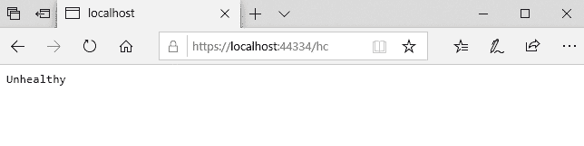
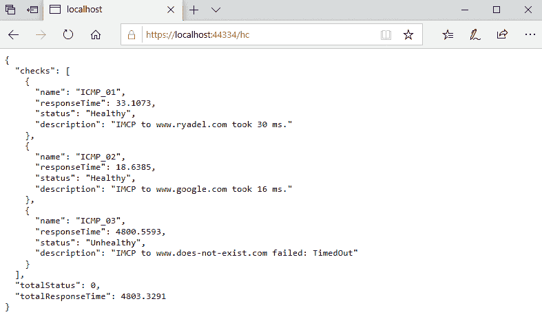
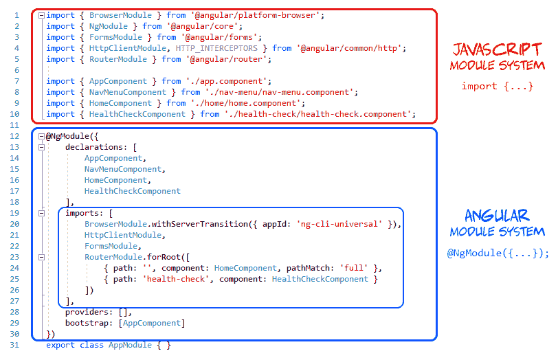

# 三、前端和后端交互

现在我们已经有了一个极简但完全可以运行的.NETCore3 和 Angular8Web 应用，我们可以开始构建一些东西了。在本章中，我们将学习客户端和服务器端交互的基础知识：换句话说，*前端*（Angular）如何从*后端*（.NET Core）获取一些相关数据，并以可读的方式显示在屏幕上。

等等……事实上，我们应该已经知道它的工作原理了，对吧？我们在[第 2 章](02.html)中看到了这一点，*环顾了*，然后摆脱了 Angular 的`FetchDataComponent`和.NET Core 的`WeatherForecastController.cs`类和文件。Angular组件（*前端*）从.NET 控制器（*后端*）中提取数据，然后将其放在浏览器屏幕（UI）上显示。

这种说法是绝对正确的。然而，控制器并不是我们的.NET Core*后端*向*前端*提供数据的唯一方式：它还可以提供静态文件、Razor 页面和任何其他中间件，用于处理请求和输出某种响应流或内容，只要我们将其添加到应用管道中。这种高度模块化的方法是.NET Core最相关的概念之一。在本章中，我们将通过引入（并使用）一个与.NET 控制器几乎没有或根本没有关系的内置中间件来利用它，尽管它能够像处理请求和响应一样处理请求和响应：`HealthChecksMiddleware`。

下面是我们将要实现的目标的快速细分：

*   **介绍.NET Core运行状况检查**：它们是什么，以及我们如何使用它们来学习有关.NET Core和Angular交互的一些有用概念。
*   **HealthCheckMiddleware**：如何在我们的.NET Core*后端*中正确实现它，在我们的 web 应用的管道中配置它，并输出一条 JSON 结构化消息，供我们的 Angular 应用使用。
*   **HealthCheckComponent**：如何构建一个Angular组件，从.NET Core*后端*获取`HealthCheck`结构化数据，并以可读的方式将其全部带到*前端*。

你准备好了吗？让我们这样做！

# 技术要求

在本章中，我们需要前面章节中列出的所有技术要求，不需要额外的资源、库或包。

本章代码文件可在此处找到：[https://github.com/PacktPublishing/ASP.NET-Core-3-and-Angular-9-Third-Edition/tree/master/Chapter_03/](https://github.com/PacktPublishing/ASP.NET-Core-3-and-Angular-9-Third-Edition/tree/master/Chapter_03/) 。

# 介绍.NET Core运行状况检查

我们之所以称我们的第一个项目为`HealthCheck`是因为：我们将要构建的 web 应用将充当监控和报告服务，它将检查目标服务器和/或其基础设施的*运行状况*状态，并实时显示在屏幕上。

为了做到这一点，我们将充分利用`Microsoft.AspNetCore.Diagnostics.HealthChecks`包，这是.NET Core框架的一个内置功能，最初在 2.2 中引入，然后在 3.0 版本中进行了改进。这个包旨在允许监控服务检查另一个正在运行的服务的状态，例如，另一个 web 服务器，这正是我们要做的。

For additional information about .NET Core health checks, we strongly suggest reading the official MS documentation at the following URL:

[https://docs.microsoft.com/en-us/aspnet/core/host-and-deploy/health-checks?view=aspnetcore-3.0](https://docs.microsoft.com/en-us/aspnet/core/host-and-deploy/health-checks?view=aspnetcore-3.0).

# 添加 HealthChecks 中间件

我们需要做的第一件事是将`HealthChecks`中间件添加到我们的 web 应用中。这可以通过以下方式完成：

1.  打开`Startup.cs`文件。
2.  在`ConfigureServices`方法中添加以下行：

```cs
public void ConfigureServices(IServiceCollection services)
{
    services.AddControllersWithViews();
    // In production, the Angular files will be served 
    // from this directory
    services.AddSpaStaticFiles(configuration =>
    {
        configuration.RootPath = "ClientApp/dist";
    });

 services.AddHealthChecks();
}
```

3.  `Configure`方法的以下行：

```cs
public void Configure(IApplicationBuilder app, IWebHostEnvironment env)
{
    // ...existing code...

    app.UseRouting();

 app.UseHealthChecks("/hc");

    app.UseEndpoints(endpoints =>
    {
        endpoints.MapControllerRoute(
            name: "default",
            pattern: "{controller}/{action=Index}/{id?}");
    });

    // ...existing code...
}
```

The `// ...existing code...` comment is just a way to tell us to leave the already existing code as it is, without altering it. We're going to use that *keyword* whenever we need to add a few lines of code to an existing block instead of rewriting the unmodified lines—thus saving some valuable space!

我们传递给`UseHealthChecks`中间件的`/hc`参数将创建用于健康检查的服务器端路由。还值得注意的是，我们在`UseEndpoints`之前添加了中间件，这样我们的新路由就不会被此处指定的通用控制器路由模式覆盖。

我们可以通过执行以下操作立即查看新路线：

1.  按*F5*使我们的 web 应用在*调试*模式下运行。
2.  手动在起始 URL 的末尾键入`/hc`并点击*输入*。

一旦我们做到这一点，我们应该能够看到这样的情况：


正如我们所看到的，我们的系统是`Healthy`：这很明显，因为我们还没有定义检查。

加一个怎么样？这就是我们在下一节要做的。

# 添加 Internet 控制消息协议（ICMP）检查

我们要实现的第一个检查是最流行的检查之一：一个**互联网控制消息协议**（**ICMP**）请求检查外部主机，也称为**PING**。

我们很可能已经知道，PING 请求是检查服务器存在性的一种非常基本的方法，因此我们知道我们应该能够在**局域网**（**LAN**或**广域网**（**WAN**连接中访问服务器。简而言之，它的工作方式如下：执行 PING 的机器向目标主机发送一个或多个 ICMP echo 请求数据包，并等待回复；如果收到，则报告整个任务的往返时间；否则，它会超时并报告一个`host not reachable`错误。

`host not reachable`错误可能是由于以下几种可能的情况造成的：

*   目标主机**不可用**。
*   目标主机**可用，但主动拒绝任何类型的 TCP/IP 连接**。
*   目标主机**可用并接受 TCP/IP 传入连接，但已将其配置为显式拒绝 ICMP 请求**和/或不发送 ICMP 回显回复。
*   目标主机**可用并正确配置以接受 ICMP 请求并发送回显回复，但连接速度非常慢或****由于未知原因（性能、负载等）阻碍**，因此往返时间过长甚至超时。

正如我们所看到的，这是进行健康检查的理想场景：如果我们正确地配置目标主机以接受 PING 并始终应答它，那么我们肯定可以使用它来确定主机何时处于健康状态。

# 可能的结果

现在我们知道了 PING 测试请求背后的常见场景，我们可以列出一个可能的结果列表，如下所示：

*   【谚】：无论何时 ping 成功，都没有错误和超时，我们可以考虑主机 To1 T1。
*   【方法】T2、T2、T3、Ping 在 TIP 成功时均可考虑，但往返时间太长。
*   【方法】To 2 t2。

既然我们已经确定了这三种*状态*，我们只需要在健康检查中正确地实施它们。

# 创建 ICMPHealthCheck 类

我们要做的第一件事是在项目的根文件夹中创建一个新的`ICMPHealthCheck.cs`类。

完成后，填写以下内容：

```cs
using Microsoft.Extensions.Diagnostics.HealthChecks;
using System;
using System.Net.NetworkInformation;
using System.Threading;
using System.Threading.Tasks;

namespace HealthCheck
{
    public class ICMPHealthCheck : IHealthCheck
    {
        private string Host = "www.does-not-exist.com";
        private int Timeout = 300;

        public async Task<HealthCheckResult> CheckHealthAsync(
            HealthCheckContext context, 
            CancellationToken cancellationToken = default)
        {
            try
            {
                using (var ping = new Ping())
                {
                    var reply = await ping.SendPingAsync(Host);

                    switch (reply.Status)
                    {
                        case IPStatus.Success:
                            return (reply.RoundtripTime > Timeout)
                                ? HealthCheckResult.Degraded()
                                : HealthCheckResult.Healthy();

                        default:
                            return HealthCheckResult.Unhealthy();
                    }
                }
            }
            catch (Exception e)
            {
                return HealthCheckResult.Unhealthy();
            }
        }
    }
}
```

正如我们所看到的，我们实现了`IHealthCheck`接口，因为它是.NET 处理健康检查的官方方式：这样的接口需要一个`async`方法`CheckHealthAsync`，我们用来确定 ICMP 请求是否成功

该代码非常容易理解，可以处理我们在上一节中定义的三种可能的场景。让我们看一下主机可以被认为是什么：

*   `Healthy`，如果 PING 请求得到成功的回复，且往返时间不超过 300 毫秒
*   `Degraded`，如果 PING 请求得到成功回复，且往返时间大于 300ms
*   `Unhealthy`，如果 PING 请求失败或抛出`Exception`

Notice that the host is hardcoded to a non-existing name, which is rather awkward! Don't worry! We did that for demonstration purposes so that we'll be able to simulate an *unhealthy* scenario: we're going to change it later on.

差不多就是这样。我们的健康检查已经准备好进行测试，我们只需要找到一种方法将其加载到我们的 web 应用的管道中。

# 将 ICMPHealthCheck 添加到管道

为了将 ICMP 健康检查加载到 web 应用管道中，我们需要将其添加到`HealthChecks`中间件中。为此，请再次打开`Startup.cs`类，并按以下方式更改之前添加到`ConfigureServices`方法的行：

```cs
public void ConfigureServices(IServiceCollection services)
{
    /// ...existing code...

 services.AddHealthChecks()
 .AddCheck<ICMPHealthCheck>("ICMP");
}
```

就是这样：现在，我们可以点击*F5*并尝试一下。以下是我们应该能够看到的：



太好了，对吗？

事实上，没那么好。我们的健康检查确实有效，但存在以下三个主要缺陷：

*   **硬编码值**：`Host`和`Timeout`变量应作为参数传递，以便我们可以通过编程进行设置。
*   **非信息性响应**：`Healthy`和`Unhealthy`都不是很好，我们应该找到一种方法来定制（更好）输出消息。
*   **非类型化输出**：当前响应是以纯文本形式发送的，如果我们想使用 Angular 获取它，JSON 内容类型肯定会更好（而且更有用）。

让我们一次解决一个问题。

# 改进 ICMPHealthCheck 类

在本节中，我们将通过添加`host`和`timeout`参数、每个可能状态的自定义结果消息以及 JSON 结构化输出来改进`ICMPHealthCheck`类。

# 添加参数和响应消息

打开`ICMPHealthCheck.cs`类文件并执行以下更改（添加/修改的行突出显示）：

```cs
using Microsoft.Extensions.Diagnostics.HealthChecks;
using System;
using System.Net.NetworkInformation;
using System.Threading;
using System.Threading.Tasks;

namespace HealthCheck
{
    public class ICMPHealthCheck : IHealthCheck
    {
 private string Host { get; set; }
 private int Timeout { get; set; }

 public ICMPHealthCheck(string host, int timeout)
 {
 Host = host;
 Timeout = timeout;
 }

        public async Task<HealthCheckResult> CheckHealthAsync(
            HealthCheckContext context, 
            CancellationToken cancellationToken = default)
        {
            try
            {
                using (var ping = new Ping())
                {
                    var reply = await ping.SendPingAsync(Host);

                    switch (reply.Status)
                    {
                        case IPStatus.Success:
 var msg = String.Format(
 "IMCP to {0} took {1} ms.",
 Host,
 reply.RoundtripTime);

                            return (reply.RoundtripTime > Timeout)
 ? HealthCheckResult.Degraded(msg)
 : HealthCheckResult.Healthy(msg);

                        default:
 var err = String.Format(
 "IMCP to {0} failed: {1}",
 Host,
 reply.Status);
 return HealthCheckResult.Unhealthy(err);
                    }
                }
            }
            catch (Exception e)
            {
 var err = String.Format(
 "IMCP to {0} failed: {1}",
 Host,
 e.Message);
 return HealthCheckResult.Unhealthy(err);
            }
        }
    }
}
```

正如我们所见，我们改变了一些事情，如下所示：

*   我们添加了一个构造函数，它接受我们希望通过编程设置的两个参数：`host`和`timeout`。旧的*硬编码*变量现在是属性，因此我们可以在初始化时使用它们来存储参数，然后在类中使用它们（例如在 main 方法中）。
*   我们创建了各种不同的*结果消息*，其中包含目标主机、ping 结果和往返持续时间（或运行时错误），并将它们作为参数添加到`HealthCheckResult`返回对象中。

差不多就是这样。现在，我们只需要通过编程方式设置`host`名称和`timeout`，因为旧的*硬编码默认值*已经不存在了。为此，我们必须更新`Startup.cs`文件中的中间件设置。

# 更新中间件设置

再次打开`Startup.cs`文件，按以下方式更改`ConfigureServices`方法中的中间件初始化代码：

```cs
public void ConfigureServices(IServiceCollection services)
{
    /// ...existing code...

    services.AddHealthChecks()
 .AddCheck("ICMP_01", new ICMPHealthCheck("www.ryadel.com",
         100))
 .AddCheck("ICMP_02", new ICMPHealthCheck("www.google.com",
         100))
 .AddCheck("ICMP_03", new ICMPHealthCheck("www.does-not-
         exist.com", 100));
}
```

我们来看看：正如我们所看到的，能够以编程方式配置主机的另一个优点是，我们可以为每个要实际检查的主机添加多次 ICMP 运行状况检查。在前面的示例中，我们利用这个机会测试了三个不同的主机：`www.ryadel.com`、`www.google.com`和我们之前使用的同一个不存在的主机，这允许我们模拟`Unhealthy`状态以及`Healthy`状态。

现在，我们可以试着点击*F5*并尝试一下。。。然而，如果我们这样做，我们将面临一个相当令人失望的结果，如以下屏幕截图所示：


原因很明显：即使我们运行多个检查，我们仍然依赖默认的结果消息。。。这只不过是所有已检查主机返回的状态的布尔和。正是由于这个原因，如果其中至少有一个是`Unhealthy`，那么整个检查也将标记为`Unhealthy`。

幸运的是，通过处理`ICMPHealthCheck`的第三个缺陷，我们可以避免这个总和，并获得更细粒度的输出：实现定制的 JSON 结构化输出消息。

# 实现自定义输出消息

要实现自定义输出消息，我们需要重写`HealthCheckOptions`类。为此，向项目的根文件夹中添加一个新的`CustomHealthCheckOptions.cs`文件，并用以下内容填充它：

```cs
using Microsoft.AspNetCore.Diagnostics.HealthChecks;
using Microsoft.AspNetCore.Http;
using System.Linq;
using System.Net.Mime;
using System.Text.Json;

namespace HealthCheck
{
    public class CustomHealthCheckOptions : HealthCheckOptions
    {
        public CustomHealthCheckOptions() : base() 
        {
            var jsonSerializerOptions = new JsonSerializerOptions() 
            { 
                WriteIndented = true 
            };

            ResponseWriter = async (c, r) =>
            {
                c.Response.ContentType = 
                 MediaTypeNames.Application.Json;
                c.Response.StatusCode = StatusCodes.Status200OK;

                var result = JsonSerializer.Serialize(new
                   {
                      checks = r.Entries.Select(e => new
                          {
                              name = e.Key,

                              responseTime = 
                               e.Value.Duration.TotalMilliseconds,
                              status = e.Value.Status.ToString(),
                              description = e.Value.Description
                          }),
                      totalStatus = r.Status,
                      totalResponseTime = 
                       r.TotalDuration.TotalMilliseconds,
                   }, jsonSerializerOptions);
                await c.Response.WriteAsync(result);
            };
        }
    }
}
```

代码是自解释的：我们用自己的自定义类重写标准类，该类输出我们想要更改的一个单词的输出，这样我们就可以更改它的`ResponseWriter`属性，以便让它输出我们想要的任何东西

更具体地说，我们希望输出一条自定义的 JSON 结构化消息，其中包含来自每个检查的大量有用内容，如下所示：

*   `name`：我们在`Startup.cs`文件`"ICMP_01"`、`"ICMP_02"`等的`ConfigureServices`方法中将其添加到管道中时提供的标识字符串
*   `responseTime`：单次检查的整个持续时间
*   `status`：不要与整个`HealthCheck`的状态混淆，即所有内部检查状态的布尔和
*   `description`：我们在前面优化`ICMPHealthCheck`类时配置的自定义信息消息

所有这些值都将是 JSON 输出中包含的数组项的属性：每个检查一个。值得注意的是，JSON 文件除了该数组之外，还将包含以下两个附加属性：

*   `totalStatus`：所有内部检查状态的布尔和-`Unhealthy`如果至少有`Unhealthy`主机，`Degraded`如果至少有`Degraded`主机，`Healthy`否则。
*   `totalResponseTime`：所有检查的整个持续时间。

这是很多有用的信息，对吗？我们只需要将中间件配置为输出它们，而不是我们以前看到的一个单词的响应。

# 关于运行状况检查响应和 HTTP 状态代码

在继续之前，值得注意的是，在前面的`CustomHealthCheckOptions`类中，我们确实将*ResponseWriter*的 HTTP 状态代码设置为固定的`StatusCodes.Status200OK`。这背后有什么原因吗？

事实上，有，而且这也是一个相当重要的问题。`HealthChecks`中间件的默认行为返回 HTTP 状态代码 200（如果所有检查都正常）（`Healthy`），或者返回 HTTP 状态代码 503（如果一个或多个检查为 KO）（`Unhealthy`）。由于我们已经切换到 JSON 结构的输出，我们不再需要 503，因为如果处理不当，它很可能会破坏我们的*前端*客户端 UI 逻辑。因此，为了简单起见，我们只是强制执行 HTTP200 响应，而不管最终结果如何。我们将找到一种在即将到来的 Angular UI 中适当强调错误的方法。

# 配置输出消息

打开`Startup.cs`文件，向下滚动至`Configure`方法，并相应更改以下行（更新的代码突出显示）：

```cs
public void Configure(IApplicationBuilder app, IWebHostEnvironment env)
{
    /// ...existing code...

    app.UseHealthChecks("/hc", new CustomHealthCheckOptions());

    /// ...existing code...
}
```

一旦完成，我们最终可以点击*F5*并正确测试它。这一次，我们不会对结果感到失望，如以下屏幕截图所示：



这是一个很好的回答，不是吗？

现在，每一次检查以及*总计*结果数据都正确地记录在结构化 JSON 对象中。这正是我们需要提供的一些Angular组件，我们可以在屏幕上以一种人类可读（和时尚）的方式显示，我们正准备这样做，从下一节开始。

# 医院的健康检查

现在是时候构建一个**Angular 组件**，它能够获取和显示我们在前面几节中成功获取的结构化 JSON 数据。

从[第 2 章](02.html)*环顾*可知，一个Angular分量通常由三个单独的文件组成，如下所示：

*   **组件**（`.ts`文件，以 TypeScript 编写，包含组件类，以及所有模块引用、函数、变量等。
*   **模板**（`.html`文件，用 HTML 编写，扩展了*角模板语法*，定义了 UI 布局架构。
*   **样式**（**`.css`****文件，用 CSS 编写，包含用于绘制 UI 的级联样式表规则和定义。**

**Although the aforementioned *three-files approach* is arguably the most practical one, the only required file is the *Component* one, as both the *Template* and the *Style* files could also be embedded as inline elements within the Component file. The choice between using separate files or going inline is a matter of taste; however, we strongly suggest adopting the *three-files approach* because it enforces the *separation of concerns* embodied within the C*omponent/template* duality featured by Angular.

If we're used to the **model-view-controller** (**MVC**) and **model-view-viewmodel** (**MVVM**) patterns, we can say that, in Angular, the Component is the *Controller*/*viewmodel* and the template represents the *view*.

在下一节中，我们将全部实现它们。

# 创建Angular组件

在解决方案资源管理器中，浏览`/ClientApp/src/app`文件夹并创建一个新的`health-check`文件夹。

进入后，创建以下`.ts`、`.html`和`.css`文件：

*   `health-check.component.ts`
*   `health-check.component.html`
*   `health-check.component.css`

完成后，用以下内容填充它们。

# health-check.component.ts

以下是` /ClientApp/src/app/health-check/health-check.component.ts`源代码：

```cs
import { Component, Inject } from '@angular/core';
import { HttpClient } from '@angular/common/http';

@Component({
    selector: 'app-health-check',
    templateUrl: './health-check.component.html',
    styleUrls: ['./health-check.component.css']
})
export class HealthCheckComponent {
  public result: Result;

  constructor(
    private http: HttpClient,
    @Inject('BASE_URL') private baseUrl: string) {
  }

  ngOnInit() {
    this.http.get<Result>(this.baseUrl + 'hc').subscribe(result => {
      this.result = result;
    }, error => console.error(error));
  }
}

interface Result {
    checks: Check[];
    totalStatus: string;
    totalResponseTime: number;
}

interface Check {
    name: string;
    status: string;
    responseTime: number;
}
```

如果你对我们在那里做的事情感到好奇，下面是最相关的东西的分类：

*   在文件开始时，我们确保`import`所有Angular*指令*、*管道*、*服务*和*组件*一言以蔽之，*模块*是我们在整个课程中需要的。
*   在组件的构造函数中，我们使用**依赖注入**（**DI**实例化了`HttpClient`服务和`baseUrl`变量；`baseUrl`值是通过使用`/ClientApp/src/main.ts`文件中定义的`BASE_URL`提供程序来设置的，我们在[第 2 章](02.html)中简要介绍了*环顾*，通过查看该文件的源代码可以看出，它将解析为我们应用的根 URL：`HttpClient`需要这样一个值服务，以构建 URL，该 URL 将用于通过 HTTP GET 请求从服务器获取数据，该请求发送到我们前面设置的.NET`HealthChecks`中间件（请参见`'hc'`字符串）。
*   最后但并非最不重要的一点是，我们定义了两个接口来处理我们期望从`HealthChecks`中间件接收的 JSON 请求：`Result`和`Check`，我们设计这两个接口分别承载整个 JSON 结果对象和内部数组的每个元素。

在进一步讨论之前，花一些宝贵的时间通过实现前面的代码来扩展我们刚刚遇到的一些非常重要的主题可能会很有用，如下所示：

*   **导入和模块**
*   **迪**
*   **ngOnInit**（和其他生命周期挂钩）
*   **施工单位**
*   **HttpClient**
*   **可观测值**
*   **接口**

因为我们将在本书中看到它们，所以现在回顾它们绝对是明智的。

# 导入和模块

我们在前面的`HealthCheckComponent`中多次使用的静态`import`语句用于导入由其他 JavaScript 模块导出的绑定。

使用*模块*的概念始于 ECMAScript 2015，并已被 TypeScript 完全采用，因此也被 Angular 采用。*模块*基本上是一个变量、函数、类等的集合，分组在一个类中：每个*模块*在自己的范围内执行，而不是在全局范围内执行，这意味着其中声明的所有元素从外部看不到，除非它们显式地*使用`export`语句导出*。相反，要使用包含在*模块*中的变量、函数、类、接口等（以及*导出的*，必须使用`import`语句导入该*模块*。这与我们在大多数编程语言中对*名称空间*所做的操作非常相似（例如，C#有`using`语句）。

事实上，所有Angular的*指令*、*pi**pes*、*服务*、*C**组件*也都打包到了*JavaScript 模块*集合中，我们必须*导入*任何类型的脚本类，只要我们想使用它们。这些集合基本上是模块库：我们可以很容易地识别它们，因为它们的名称以`@angular`前缀开头。我们的`/ClientApp/packages.json`文件（NPM 包文件），我们在前面的章节中看到过，包含了其中的大部分。

To know more about ECMAScript *modules* and better understand the *module resolution* strategy in TypeScript, check out the following URLs:

**TypeScript modules**:
[https://www.typescriptlang.org/docs/handbook/modules.html](https://www.typescriptlang.org/docs/handbook/modules.html).
 **Module resolution**:
[https://www.typescriptlang.org/docs/handbook/module-resolution.html](https://www.typescriptlang.org/docs/handbook/module-resolution.html).

**重要**：*JavaScript 模块*不应与 Angular 自己的模块化系统混淆，后者基于`@NgModule`装饰器。我们已经从[第一章](01.html)、*准备*、[第二章](02.html)、*环顾*了解到，Angular 的*NgModules*是*构建块-*即专用于应用领域的内聚代码块的容器，工作流或公共功能集。从前面的章节中我们知道，每个 Angular 应用至少有一个`NgModule`类，称为根模块，通常称为`AppModule`，位于应用根目录中的`app.module.ts`文件中；在接下来的章节中，将添加其他模块。

不幸的是，*JavaScript 模块系统*和*模块系统*使用了非常相似的词汇表（*导入*与*导入*、*导出*与*导出*），这可能会导致混淆，尤其是考虑到*Angular 应用要求开发人员同时使用这两种应用*（通常在同一类文件中）。幸运的是，虽然一开始被迫将这两个系统交织在一起可能有点棘手，但最终，我们将熟悉它们使用的不同上下文。

下面是一个示例屏幕截图，取自我们的`HealthCheck`应用的`AppModule`类文件，它将帮助您区分两个不同的系统：



For additional information regarding the *Angular module system* and the `NgModule` decorator, check out the following URLs:

**NgModule**: **[https://angular.io/guide/ngmodules](https://angular.io/guide/ngmodules).

Angular architecture: NgModules and JavaScript modules**:[https://angular.io/guide/architecture-modules#ngmodules-and-javascript-modules](https://angular.io/guide/architecture-modules#ngmodules-and-javascript-modules). [](https://www.typescriptlang.org/docs/handbook/modules.html) 

# DI

我们已经多次讨论过 DI，这是有充分理由的，因为它是.NET Core 或 Angular 的重要应用设计模式，两个框架都广泛使用它来提高效率和模块化。

为了解释 DI 实际上是什么，我们必须首先讨论类中的*依赖项*是什么：它们可以定义为*服务*或*对象*，类需要*将*实例化为*变量*或*属性*以执行一项或多项任务。

在*经典*编码模式中，这些依赖项在类本身中动态*实例化，例如在初始化阶段，例如在构造函数方法中。这是一个典型的例子：*

```cs
public MyClass() {
    var myElement = new Element();
    myElement.doStuff();
}
```

在前面的示例中，`myElement`变量是`Element`类型的对象实例，也是`MyClass`的（本地）*依赖项*：正如我们所看到的，它在构造函数中被实例化，因为我们很可能需要在那里使用它。从那里，我们可以将其用作局部变量（并让它在构造函数的*生命周期*结束时*死亡*，或者将其分配给类属性以进一步延长其*生命周期*和*范围*。

DI 是另一种软件设计模式，在这种模式中，类从外部源请求依赖项*，而不是自己创建依赖项。为了更好地理解这样一个概念，让我们尝试使用*DI*方法重写与之前相同的代码，如下所示：*

```cs
public MyClass(Element myElement) {
    myElement.doStuff();
}
```

正如我们所看到的，没有必要实例化`myElement`变量，因为**依赖项注入器**已经处理了这样的任务，这是一个外部代码，负责创建*可注入*对象并*将*对象注入类中。

整个 DI 编码模式基于**控制反转**（**IoC**的概念，以解决依赖关系。这样一个概念围绕着这样一个基本思想，即在形式上，如果`ObjectA`依赖于`ObjectB`，那么`ObjectA`就不能直接创建或导入`ObjectB`，而是提供了一种*注入*`ObjectB`的方式。在前面的代码块示例中，`ObjectA`显然是`MyClass`，而`ObjectB`是`myElement`实例。

For additional information about the DI software design pattern, check out the following links:

**DI in .NET Core**:
[https://docs.microsoft.com/en-us/aspnet/core/fundamentals/dependency-injection](https://docs.microsoft.com/en-us/aspnet/core/fundamentals/dependency-injection).

**DI in Angular**:
[https://angular.io/guide/dependency-injection](https://angular.io/guide/dependency-injection).

在 Angular 中，DI 框架在实例化类时向该类提供声明的依赖关系。

在前面的`HealthCheckComponent`类中，我们在组件的构造函数方法中使用 DI 注入`HttpClient`服务实例和`baseUrl`实例；如我们所见，我们还借此机会将`private`*访问修饰符*分配给了这两个修饰符。由于该修改器，这些变量将通过整个组件类进行访问。

As per Angular conventions, a parameter injected without an *access modifier* can only be accessed within the constructor; conversely, if it gets an access modifier such as *private* or *public*, it will be defined as a class member, hence changing its *scope* to the class. Such a technique is called **variable scoping**, and we're going to use it a lot in our Angular Components from now on.

# ngOnInit（和其他生命周期挂钩）

我们在`HealthCheckComponent`类中使用的`ngOnInit`方法是组件的*生命周期钩子方法*之一：在本节中，我们将尝试对它们进行一些说明，因为在本书中我们将大量使用它们。

每个Angular组件都有一个*生命周期*，由Angular组件管理。每次用户访问我们应用中的视图时，Angular 框架都会创建并呈现所需的*组件*（和*指令*）以及他们的孩子，在用户与他们交互时对他们的更改做出反应，并最终将其销毁并从**文档对象模型**中删除（**DOM**）当用户在别处导航时。所有这些“关键时刻”都会触发 Angular 向开发人员公开的一些*生命周期钩子方法*，以便他们能够在每一个方法实际发生时执行某些操作：事实上，它们与 C#*事件处理程序*非常相似。

以下是可用钩子的列表，按执行顺序排列（如果可能，因为其中一些钩子在组件的生命周期中被多次调用）：

*   `ngOnChanges()`：当 Angular（重新）设置数据绑定输入属性时响应。该方法接收当前和以前属性值的`SimpleChanges`对象。在`ngOnInit()`之前调用，并且每当一个或多个数据绑定输入属性更改时调用。
*   `ngOnInit()`：首先显示数据绑定属性并设置指令/组件的输入属性后，初始化指令/组件。在第一个`ngOnChanges()`方法之后调用一次。
*   `ngDoCheck()`：检测 Angular 自身无法或不会检测到的变化并对其采取行动。在每次变更检测运行期间，在`ngOnChanges()`和`ngOnInit()`之后立即调用。
*   `ngAfterContentInit()`：Angular 将外部内容投射到组件视图/指令所在视图后响应。在第一个`ngDoCheck()`方法之后调用一次。
*   `ngAfterContentChecked()`：检查投射到指令/组件中的内容后响应。在`ngAfterContentInit()`方法和随后的每一个`ngDoCheck()`方法之后调用。
*   `ngAfterViewInit()`：Angular 初始化组件视图和子视图/指令所在视图后响应。在第一个`ngAfterContentChecked()`方法之后调用一次。
*   `ngAfterViewChecked()`：Angular检查组件视图和子视图/指令所在视图后响应。在`ngAfterViewInit()`方法和随后的每一个`ngAfterContentChecked()`方法之后调用。
*   `ngOnDestroy()`：在 Angular 销毁指令/组件之前进行清理。取消订阅`Observables`并取消活动。
*   避免内存泄漏的处理程序：在 Angular 销毁指令/组件之前调用。

上述**生命周期挂钩方法**适用于所有Angular*组件*和*指令*。要调用它们，我们只需将它们添加到我们的组件类中，这正是我们在前面`HealthCheckComponent`中所做的。

现在我们已经理解了`ngOnInit()`的作用，我们应该花点时间来解释为什么我们将`HttpClient`源代码放在`ngOnInit()`生命周期钩子方法中，而不是使用组件的`constructor()`方法：我们不应该使用它吗？

下一节将极大地帮助我们理解这样一个选择的原因。

# 建造师

我们很可能已经知道，所有 TypeScript 类都有一个`constructor()`方法，每当我们创建该类的实例时都会调用该方法：因为 TypeScript 无论如何都是 JavaScript 的超集，任何 TypeScript`constructor()`方法都会被转换成 JavaScript`constructor()`函数。

以下代码块显示了 TypeScript 类的示例：

```cs
class MyClass() {
  constructor() {
    console.log("MyClass has been instantiated");
  }
}
```

这将被传输到以下 JavaScript 函数中：

```cs
function MyClass() {
  console.log("MyClass has been instantiated");
}
```

如果在 TypeScript 中省略构造函数，JavaScript Transpile 函数将为空；但是，无论框架是否具有构造函数，只要框架需要实例化它，它仍将以以下方式调用它：

```cs
var myClassInstance = new MyClass();
```

理解这一点非常重要，因为它极大地帮助我们理解组件的`constructor()`方法与其`ngOnInit()`生命周期挂钩之间的差异，这是一个巨大的差异，至少从组件初始化阶段的Angular来看是如此。

整个Angular引导过程可分为两个主要（及后续）阶段：

*   **实例化组件**
*   **执行变更检测**

我们很容易猜到，`constructor()`方法在前一阶段被调用，而包括`ngOnInit()`方法在内的所有生命周期挂钩在后一阶段都被调用。

如果我们从这个Angular来看这些方法，很容易理解以下关键概念：

*   如果我们需要在一个Angular分量中创建或*注入*一些*依赖项*，我们应该使用`constructor()`方法；事实上，这也是我们能够做到这一点的唯一方法，因为构造函数是在Angular注入器上下文中被调用的唯一方法。
*   相反，每当我们需要执行任何组件*初始化*和/或*更新*任务时，比如执行 HTTP 请求、更新 DOM 等等，我们都应该使用*生命周期挂钩*中的一个来完成。

顾名思义，`ngOnInit()`方法通常是组件初始化任务的最佳选择，因为它发生在指令和/或组件输入属性设置之后。这就是我们使用 Angular 内置的`HttpClient`服务来实现 HTTP 请求的原因。

# HttpClient

能够高效地从.NET Core控制器发送和接收 JSON 数据可能是我们的**单页应用**（**SPA**的最重要要求。我们选择使用 Angular`HttpClient`服务来实现这一点，Angular`HttpClient`服务首先在 Angular 4.3.0-RC.0 中引入，这是框架能够提供的完成工作的最佳答案之一。正是因为这个原因，我们将在本书中大量使用它；但是，在这样做之前，最好正确地理解它是什么，为什么它比以前的实现更好，以及如何正确地实现它。

新的`HttpClient`服务于 2017 年 7 月推出，作为前 Angular HTTP 客户端 API（也称为`@angular/http`或简称`HTTP`的改进版本。Angular 开发团队没有替换`@angular/http`包中的旧版本，而是将新类放在一个单独的包`@angular/common/http`中。他们选择这样做是为了保持与现有代码库的*向后兼容性*，同时也为了确保缓慢而稳定地迁移到新 API。

那些至少使用过一次旧 Angular HTTP 服务类的人很可能会记住它的主要限制，如下所示：

*   默认情况下未启用**JSON**，这迫使开发人员在使用 RESTful API 时，在请求*头*-和`JSON.parse`/`JSON.stringify`数据中显式设置它。
*   **没有简单的方法访问 HTTP 请求/响应管道**，从而阻止开发人员在*请求*和/或*响应*调用发出或接收后，使用一些丑陋且破坏模式的
    黑客拦截或更改这些调用。事实上，扩展和包装类基本上是定制服务的唯一方法，至少在全局范围内是这样。
*   **请求和响应对象**没有本机的强类型，尽管这可以通过将 JSON 转换为接口作为解决方法来解决。

好消息是新的`HttpClient`做到了所有这些，而且做得更多；其他特性包括可测试性支持和通过完全基于`Observables`的 API 更好地处理错误。

It's worth noting that putting the `HttpClient` service within the Component itself is not good practice because it will often lead to unnecessary code repetitions among the various Components that need to perform HTTP calls and handle their results. This is a known issue that greatly affects production-level apps, which will likely require post-processing of the received data, handling errors, adding retry logic to deal with intermittent connectivity, and so on.

To better deal with those scenarios, it's strongly advisable to separate the data access logic and the data presentation role by encapsulating the former in a separate service, which can be then *injected* into all the Components that require it, in a standardized and centralized way. We'll talk more about that in [Chapter 7](07.html), *Code Tweaks and Data Services*, where we'll eventually replace multiple `HttpClient` implementations and centralize their source code within a couple of *D**ata Services*.

# 可观测

*观测值*是管理异步数据的强大功能；它们是**ReactiveX****JavaScript**（**RxJS**）库的主干，该库是必需的依赖项之一，计划包含在 ECMAScript 7 的最终版本中。如果您熟悉 ES6*承诺*，您可以将其视为该方法的改进版本。

*可观测*可配置为*同步*或*异步*发送文字值、结构化值、消息和事件：可通过使用`subscribe`方法钩子订阅*可观测*本身来接收值，这意味着整个数据流都在其中处理，直到我们以编程方式选择*取消订阅*。这种方法的好处在于，无论选择何种方法（*同步*或*异步*）、流式传输*频率*和*数据类型*，用于监听值和停止监听的编程接口都是相同的。

*可观测物*的巨大优势是 Angular 在处理数据时广泛使用它们的原因。如果我们仔细看一下我们的`HealthCheckComponent`源代码，我们可以看到当我们的`HttpClient`服务从服务器获取数据并将结果存储在`this.result`局部变量中时，我们如何使用它们。这样的任务是通过调用两个连续的方法来执行的：`get<Result>()`和`subscribe()`。

让我们试着总结一下他们的工作，如下所示：

*   `get<Result>()`：顾名思义，该方法向我们的.NET Core`HealthChecks`中间件发出标准 HTTP 请求，获取*结果*JSON 响应对象。这个方法需要一个 URL 参数，我们通过向 Angular 应用的`BASE_URL`添加`hc`文本字符串（与我们之前在`Startup.cs`文件的`Configure`方法中设置的字符串相同）来动态创建该参数。
*   `subscribe()`：此方法实例化一个*可观察的*对象，该对象将在结果之后和/或出现错误时执行两个非常不同的操作。不用说，所有这些都将以异步方式*完成*，这意味着它将在单独的线程中运行（或计划稍后执行），而其余代码将继续执行。

Those who want to get additional information can take a look at the following URLs, taken from the RxJS official documentation:

**ReactiveX Library—Observables guide**:
[http://reactivex.io/rxjs/class/es6/Observable.js~Observable.html](http://reactivex.io/rxjs/class/es6/Observable.js~Observable.html).

**Angular.io—Observables guide**:
[https://angular.io/guide/observables](https://angular.io/guide/observables).

理解这一点非常重要，因为我们只是触及了*可观测*的作用的表面。然而，这就是我们现在所需要的：稍后我们将有机会更多地讨论它们。

# 接口

现在我们知道了 Angular`HttpClient`服务是如何工作的，我们有权问自己几个问题：我们为什么还要使用那些**接口**？我们不能只使用我们早期定义的.NET Core`HealthChecks`*中间件发送的原始 JSON 数据，将其作为匿名 JavaScript 对象使用吗？*

 *从理论上讲，我们可以，就像我们可以从控制器输出原始 JSON 一样，而不是像我们那样创建所有 ViewModel 类。但是，在一个编写良好的应用中，我们应该始终抵制处理原始 JSON 数据和/或使用匿名对象的诱惑，原因有很多：

*   **我们之所以选择 TypeScript 而不是 JavaScript，是因为我们希望使用类型定义**：匿名对象和属性正好相反；它们导致了 JavaScript 的工作方式，这是我们首先要避免的。
*   **匿名对象（及其属性）不容易验证**：我们不希望数据项容易出错或被迫处理丢失的属性。
*   **匿名对象几乎不可重用**，并且不会从许多Angular方便的功能中受益，例如*对象映射*，这些功能要求我们的对象是接口和/或类型的实际实例。

前两个参数非常重要，特别是如果我们的目标是生产就绪的应用；无论我们的开发任务一开始看起来有多么简单，我们都不应该认为我们可以承受失去对应用源代码的控制。

第三个原因也是至关重要的，只要我们想充分利用Angular。如果是这样，使用未定义的属性数组（如原始 JSON 数据）基本上是不可能的；相反，使用结构化 TypeScript 接口可以说是以*强类型*方式处理结构化 JSON 数据的最轻量级的方式。

It's worth noting that we've not added the `export` statement to our interface: we did that on purpose since we're only going to use this within the `HealthCheckComponent` class. Should we need to change such behavior in the future—for example, to create an external *Data Service—*we'll have to add such a statement (and, arguably, move each one of them into a separate file) to enable us to `import` them into other classes.

# health-check.component.html

以下是`/ClientApp/src/app/health-check/health-check.component.html`源代码：

```cs
<h1>Health Check</h1>

<p>Here are the results of our health check:</p>

<p *ngIf="!result"><em>Loading...</em></p>

<table class='table table-striped' aria-labelledby="tableLabel" *ngIf="result">
  <thead>
    <tr>
      <th>Name</th>
      <th>Response Time</th>
      <th>Status</th>
      <th>Description</th>
    </tr>
  </thead>
  <tbody>
    <tr *ngFor="let check of result.checks">
      <td>{{ check.name }}</td>
      <td>{{ check.responseTime }}</td>
      <td class="status {{ check.status }}">{{ check.status }}</td>
      <td>{{ check.description }}</td>
    </tr>
  </tbody>
</table>
```

我们可以看到，Angular 组件的*模板*部分基本上是一个 HTML 页面，包含一个带有 Angular 指令的表。在继续之前，让我们仔细看看，如下所示：

*   `ngIf`：这是一个*结构指令*，根据等号（`=`）后指定的布尔表达式值，有条件地包含 container HTML 元素：当该表达式的计算结果为*true*时，Angular 渲染该元素；否则，它不会。它可以链接到一个`else`块，当表达式的计算结果为*false*或*null*时，如果存在该块，将显示该块。在前面的代码块中，我们在`<table>`元素中使用它，因此它仅在`result`内部变量（我们在**组件**类中定义）停止为*null*时出现，这将在从服务器获取数据后发生。
*   `ngFor`：另一个*结构指令*，为给定集合中包含的每个项目提供模板。该指令放置在元素上，该元素将成为克隆模板的父元素。在前面的代码块中，我们在主`<table>`元素中使用它为`result.checks`数组中的每个`check`项创建并显示一个`<tr>`元素（一行）。
*   `{{ check.name }}`、`{{ check.responseTime }}`等：这些被称为*插值*，可用于将计算字符串合并到 HTML 元素标记之间和/或属性分配内的文本中。换句话说，我们可以将它们用作类变量属性值的占位符。正如我们所看到的，*插值*默认分隔符是双大括号，`{{`和`}}`。

To understand more about `ngIf`, `ngFor`, *interpolations,* and other Angular UI fundamentals, we strongly suggest taking a look at the official documentation:

**Displaying data**:
[https://angular.io/guide/displaying-data](https://angular.io/guide/displaying-data).

**Template syntax**:
[https://angular.io/guide/template-syntax](https://angular.io/guide/template-syntax).

**Structural directives**:
[https://angular.io/guide/structural-directives](https://angular.io/guide/structural-directives).

# health-check.component.css

以下是`/ClientApp/src/app/health-check/health-check.component.css`源代码：

```cs
.status {
  font-weight: bold;
}

.Healthy {
  color: green;
}

.Degraded {
  color: orange;
}

.Unhealthy {
  color: red;
}
```

这里没什么好说的；只是一些普通的 CSS 来设计组件模板的样式。

Due to space, we won't be able to talk much about *CSS styling* in this book: we will just take it for granted that the average web programmer knows how to handle the simple definitions, selectors, and styling rules we will use in our examples.

Those who want (or need) to understand more about CSS and CSS3 are encouraged to take a look at this great online tutorial:

[https://developer.mozilla.org/en-US/docs/Web/CSS](https://developer.mozilla.org/en-US/docs/Web/CSS).

注意我们如何处理表格单元格的样式，它将包含各种检查的*状态*。强烈建议尽可能突出显示它们，因此我们制作了它们`bold`，并使用了与`status`类型匹配的`color`：`green`表示`Healthy`，`orange`表示`Degraded`，红色表示`Unhealthy`。

# 将组件添加到 Angular 应用

现在我们的*组件*已经准备好了，我们需要将其正确地添加到 Angular 应用中。为此，我们需要对以下文件进行一些最小的更改：

*   `app.module.ts`
*   `nav-menu.component.ts`
*   `nav-menu.component.html`

让我们把这件事做完。

# 应用模块

我们从[第 2 章](02.html)中了解到*环顾*，每一个新的*组件*都必须在`AppModule`中引用，以便在我们的应用中注册。除此之外，我们需要在`RoutingModule`配置中创建相关条目，以便用户能够导航到该页面。

打开`/ClientApp/src/app/app.module.ts`文件并添加以下突出显示的行：

```cs
import { BrowserModule } from '@angular/platform-browser';
import { NgModule } from '@angular/core';
import { FormsModule } from '@angular/forms';
import { HttpClientModule, HTTP_INTERCEPTORS } from '@angular/common/http';
import { RouterModule } from '@angular/router';

import { AppComponent } from './app.component';
import { NavMenuComponent } from './nav-menu/nav-menu.component';
import { HomeComponent } from './home/home.component';
import { HealthCheckComponent } from './health-check/health-check.component';

@NgModule({
  declarations: [
    AppComponent,
    NavMenuComponent,
    HomeComponent,
 HealthCheckComponent
  ],
  imports: [
    BrowserModule.withServerTransition({ appId: 'ng-cli-universal' }),
    HttpClientModule,
    FormsModule,
    RouterModule.forRoot([
      { path: '', component: HomeComponent, pathMatch: 'full' },
 { path: 'health-check', component: HealthCheckComponent }
    ])
  ],
  providers: [],
  bootstrap: [AppComponent]
})
export class AppModule { }
```

任务完成：让我们继续前进。

# 导航组件

将我们新的*组件*导航路径添加到`RoutingModule`是让我们的用户能够到达的必要步骤；但是，我们还需要添加一个链接，供用户点击。由于`NavMenuComponent`是处理导航用户界面的组件，我们也需要在那里执行一些操作。

打开`ClientApp/src/app/nav-menu/nav-menu.component.ts`**文件，添加以下高亮显示的行：**

```cs
// ... existing code...

<ul class="navbar-nav flex-grow">
  <li
    class="nav-item"
    [routerLinkActive]="['link-active']"
    [routerLinkActiveOptions]="{ exact: true }"
  >
    <a class="nav-link text-dark" [routerLink]="['/']">Home</a>
  </li>
 <li class="nav-item" [routerLinkActive]="['link-active']">
 <a class="nav-link text-dark" [routerLink]="['/health-check']"
 >Health Check</a
 >
 </li>
</ul>

// ... existing code...
```

现在我们新的*组件*已经添加到我们的 Angular 应用中，我们只需要对其进行测试。

# 测试它

要看到我们新的`HealthCheckComponent`的辉煌，我们只需要点击*F5*并查看浏览器的结果，如果我们做的一切都正确，应该与下面的屏幕截图非常相似：


看起来肯定是我们干的！

我们的健康检查已经启动并运行，自豪地向我们展示我们在.NET Core的`HealthChecksMiddleware`中设置的三个 ICMP 请求的结果。

# 总结

让我们花一分钟时间简要回顾一下我们在本章学到的内容。首先，我们承认，*.NET 控制器*并不是 shed 中唯一的工具：事实上，任何中间件都几乎能够处理 HTTP*请求*和*响应*周期，只要它在我们的应用管道中。

为了演示这样一个概念，我们引入了`HealthChecksMiddleware`，这是一个整洁的.NET Core内置功能，可用于实现状态监视服务。。。。这就是我们在本章中所做的。我们从.NET Core*后端*开始，不断完善我们的工作，直到能够创建 JSON 结构的输出；然后，我们切换到 Angular，在那里我们学习了如何使用*组件*正确地获取它，并通过浏览器基于 HTML 的 UI 在屏幕上显示它。最终，最终的结果是好的，足以奖励我们的辛勤工作。

这对于健康检查来说已经足够了，至少目前是这样：从下一章开始，我们将带回标准的.NET*控制器*模式，看看如何利用它来学习新的东西。

# 建议的主题

运行状况监视、运行状况检查、运行状况检查软件、运行状况检查选项、HTTP 请求、HTTP 响应、ICMP、PING、ResponseWriter、JSON、JSON 序列化配置。组件、路由、模块、AppModule、HttpClient、ngIf、ngFor、指令、结构指令、插值、NgModule、Angular模块系统、JavaScript 模块系统（导入/导出）。

# 工具书类

*   *ASP.NET Core中的健康检查*：[https://docs.microsoft.com/en-US/aspnet/core/host-and-deploy/health-checks](https://docs.microsoft.com/en-US/aspnet/core/host-and-deploy/health-checks?view=aspnetcore-3.0)
*   *ASP.NET Core中的请求和响应操作*：[https://docs.microsoft.com/en-us/aspnet/core/fundamentals/middleware/request-response](https://docs.microsoft.com/en-us/aspnet/core/fundamentals/middleware/request-response?view=aspnetcore-3.0)
*   *ASP.NET Core健康监控*：[https://docs.microsoft.com/en-us/dotnet/architecture/microservices/implement-resilient-applications/monitor-app-health](https://docs.microsoft.com/en-us/dotnet/architecture/microservices/implement-resilient-applications/monitor-app-health)
*   *类型脚本模块*：**[https://www.typescriptlang.org/docs/handbook/modules.html](https://www.typescriptlang.org/docs/handbook/modules.html)**
***   *模块分辨率*：*[https://www.typescriptlang.org/docs/handbook/module-resolution.html](https://www.typescriptlang.org/docs/handbook/module-resolution.html)***   *ASP.NET Core中的依赖项注入*：[https://docs.microsoft.com/en-us/aspnet/core/fundamentals/dependency-injection](https://docs.microsoft.com/en-us/aspnet/core/fundamentals/dependency-injection)*   *Angular io 依赖注入*：[https://angular.io/guide/dependency-injection](https://angular.io/guide/dependency-injection)*   *弯钩*：[https://angular.io/guide/lifecycle-hooks](https://angular.io/guide/lifecycle-hooks)*   *反应性 X 库可见物*：[http://reactivex.io/rxjs/class/es6/Observable.js~Observable.html](http://reactivex.io/rxjs/class/es6/Observable.js~Observable.html)*   *Angular io 可观测引导*：*[https://angular.io/guide/observables](https://angular.io/guide/observables)***   *JavaScript 导入语句*：[https://developer.mozilla.org/en-US/docs/Web/JavaScript/Reference/Statements/import](https://developer.mozilla.org/en-US/docs/Web/JavaScript/Reference/Statements/import)*   *JavaScript 导出语句*：[https://developer.mozilla.org/en-US/docs/Web/JavaScript/Reference/Statements/export](https://developer.mozilla.org/en-US/docs/Web/JavaScript/Reference/Statements/export)*   *Angular HttpClient*：[https://angular.io/guide/http#httpclient](https://angular.io/guide/http#httpclient)*   *角模件*[https://angular.io/guide/ngmodules](https://angular.io/guide/ngmodules)*   *Angular模块和 JavaScript 模块*：[https://angular.io/guide/architecture-modules#ngmodules-和 javascript 模块](https://angular.io/guide/architecture-modules#ngmodules-and-javascript-modules)*   *Angular显示数据*：[https://angular.io/guide/displaying-data](https://angular.io/guide/displaying-data)*   *Angular模板语法*：[https://angular.io/guide/template-syntax](https://angular.io/guide/template-syntax)*   *角结构指令*：**[https://angular.io/guide/structural-directives](https://angular.io/guide/structural-directives)*****   *CSS 级联样式表*：[https://developer.mozilla.org/en-US/docs/Web/CSS](https://developer.mozilla.org/en-US/docs/Web/CSS)***********