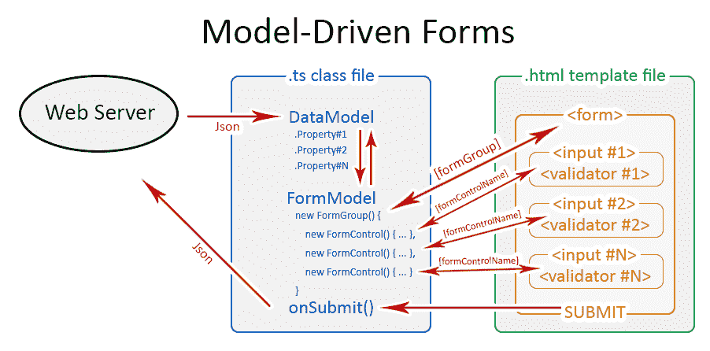
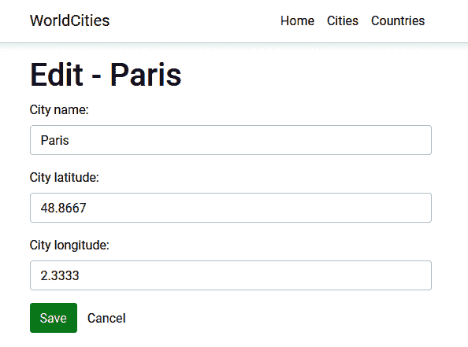
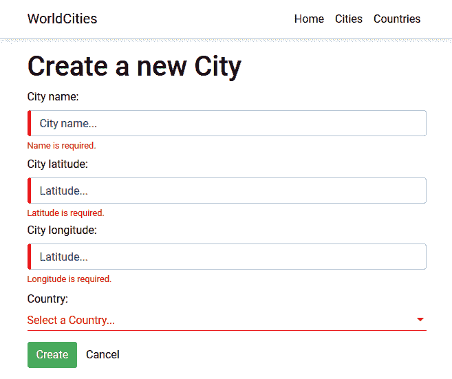
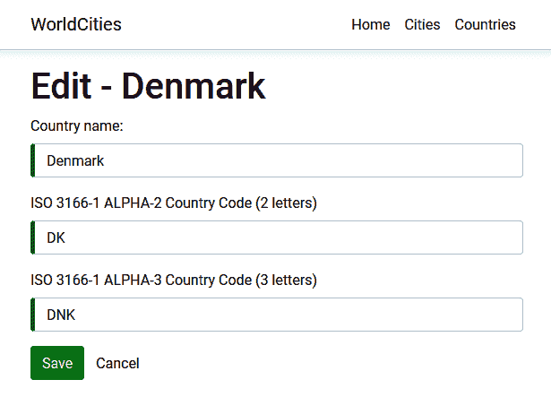

# 表格和数据验证

在本章中，我们将主要讨论表单、数据输入和验证技术。我们已经知道，HTML 表单是任何业务应用程序中最重要和最微妙的方面之一。如今，表单几乎用于完成任何涉及用户提交数据的任务，例如注册或登录网站、支付款项、预订酒店房间、订购产品、执行和检索搜索结果等等。

如果要求我们从开发人员的角度定义表单，我们会得出这样的结论：“*表单是一个基于 UI 的界面，允许授权用户输入数据，这些数据将发送到服务器进行处理*。当我们接受这一定义时，应考虑两个额外的因素：

*   每个表单应提供足够好的数据输入体验，以有效地指导用户完成预期的工作流程；否则，他们将无法正确使用它。
*   每个表单，只要它给服务器带来潜在的不安全数据，就可能在数据完整性、数据安全性和系统安全性方面产生重大的安全影响，除非开发人员具备所需的*专有技术*来采取和实施适当的对策。

这两个短语很好地概括了本章的内容；我们将尽最大努力引导用户以最合适的方式提交数据，我们还将学习如何正确检查这些输入值，以防止、避免和/或最小化各种完整性和安全威胁。理解这两个主题经常相互交织也很重要；因此，我们通常会同时处理这些问题。

在本章中，我们将介绍以下主题：

*   **角度表单**，我们将处理模板驱动表单以及**反应表单**，同时了解这两种方法的优缺点，并查看哪种方法最适合在各种常见场景中使用
*   **数据验证**，我们将学习如何在*前端*和*后端*双重检查用户的输入数据，以及在用户发送错误或无效值时提供视觉反馈的各种技术
*   **表单生成器**，我们将使用一些工厂方法实现另一个反应式表单，而不是手动实例化各种表单模型元素

在每个任务结束时，我们还将花一些时间使用 web 浏览器验证我们的工作结果。

# 技术要求

在本章中，我们需要前面章节中提到的所有技术要求，以及以下外部库：

*   **System.Linq.Dynamics.Core**（可选）

和往常一样，建议不要直接安装它们。我们将在本章中介绍它们，以便我们可以在项目中对它们的用途进行上下文分析。

本章的代码文件可在[中找到 https://github.com/PacktPublishing/ASP.NET-Core-3-and-Angular-9-Third-Edition/tree/master/Chapter_06/](https://github.com/PacktPublishing/ASP.NET-Core-3-and-Angular-9-Third-Edition/tree/master/Chapter_06/)

# 探索角形

如果我们看看我们目前的.NET 内核和 Angular 项目，我们会发现它们都不允许我们的用户*与数据*交互：

*   对于`HealthCheck`应用程序，这是意料之中的，因为根本没有数据可处理：这是一个不存储任何内容且不需要用户输入的监控应用程序。
*   然而，`WorldCities`应用程序讲述了一个完全不同的故事：我们确实有一个数据库，可以用来将结果返回给用户，至少在理论上，用户可以被允许进行更改。

不用说，`WorldCities`应用程序将是我们实现表单的最佳候选程序。在下面的部分中，我们将这样做，从角度的*前端*开始，然后移动到.NET 核心*后端。*

# 角形

让我们花一分钟简单地回顾一下我们在 Po.T7 结尾的状态下的我们的应用程序。如果我们看一下`CitiesComponent`和`CountriesComponent`模板，我们会发现我们实际上已经有了某种类型的数据输入元素：我们显然在谈论`<mat-form-field>`，它是角材料`MatInputModule`的*选择器*，我们在[第 5 章](https://cdp.packtpub.com/asp_net_core_3_and_angular_7___third_edition/wp-admin/post.php?post=45&action=edit#post_50)*中添加到循环中获取并显示数据*，让我们的用户按名称过滤`cities`和`countries`。

以下是相关的代码片段：

```cs
<mat-form-field [hidden]="!cities">
    <input matInput (keyup)="loadData($event.target.value)"
        placeholder="Filter by name (or part of it)...">
</mat-form-field>
```

这意味着我们已经在接受某种类型的用户操作——由单个输入字符串组成——并对其做出相应的反应：这样的操作+反应链是用户和应用程序之间交互的基础，这基本上就是绝大多数表单的全部内容。

但是，如果我们查看生成的 HTML 代码，我们可以清楚地看到，我们没有任何实际的`<form>`元素。我们可以通过在浏览器窗口中右键单击该视图的输入元素并选择 Inspect element 来测试它，如以下屏幕截图所示：


正如我们所看到的，没有主表单，只有一个`input`字段可以完美地处理我们分配给它的任务。由于我们没有使用表单数据提交任何内容，因此没有忽略表单的存在：我们使用 Angular`HttpClient`模块执行数据获取，从技术上讲，该模块通过 JavaScript 使用异步**XMLHttpRequest**（**XHR**）来实现这一点——简言之，就是 AJAX。

这种方法不需要`<form>`容器元素来使用以下支持的方法处理数据编码和传输任务：

*   `application/x-www-form-urlencoded`
*   `multipart/form-data`
*   `text/plain`

它只需要实际的输入元素就可以获得用户的输入。

For further details regarding the encoding method supported by the HTML `<form>` element, take a look at the following specifications:
 [](https://www.w3.org/Protocols/rfc1341/7_2_Multipart.html) **URL Living Standard, – URL-encoded Form Data**:[https://url.spec.whatwg.org/#concept-urlencoded](https://url.spec.whatwg.org/#concept-urlencoded).
 [](https://html.spec.whatwg.org/multipage/form-control-infrastructure.html#url-encoded-form-data) **HTML Living Standard, section 4.10.21.7 – Multipart Form Data**:[https://html.spec.whatwg.org/multipage/form-control-infrastructure.html#multipart-form-data](https://html.spec.whatwg.org/multipage/form-control-infrastructure.html#multipart-form-data). [](https://html.spec.whatwg.org/multipage/form-control-infrastructure.html#url-encoded-form-data) **HTML Living Standard, section 4.10.21.8 – Plain Text Form Data**:[https://html.spec.whatwg.org/multipage/form-control-infrastructure.html#plain-text-form-data](https://html.spec.whatwg.org/multipage/form-control-infrastructure.html#plain-text-form-data).

尽管不是必需的，`form`元素——或用于输入元素的任何 HTML 容器——对于许多不属于数据编码和传输主题的重要任务可能非常有用。让我们看看它们是什么，为什么我们可能需要它们。

# 使用表格的理由

让我们试着总结一下我们当前无形方法最明显的不足：

*   我们无法跟踪全局表单状态，因为我们无法判断输入文本是否有效。
*   我们没有简单的方法向用户显示错误消息，让他们知道如何使表单有效。
*   我们不以任何方式验证输入数据；我们只需收集并将其扔到服务器上，无需三思而后行。

在我们的特定场景中，这是非常好的，因为我们只处理单个文本字符串，而不太关心它的长度、输入文本等等。然而，如果我们必须处理多个输入元素和多个值类型，这些限制可能会严重阻碍我们的工作——无论是在数据流控制、数据验证还是用户体验方面。

当然，通过在基于表单的*组件*中实现一些自定义方法，我们可以轻松解决上述大多数问题；我们可以到处抛出一些错误，比如`isValid()`、`isNumber()`等等，然后将它们连接到我们的模板语法，并借助于`*ngIf`、`*ngFor`等结构指令来显示/隐藏验证消息。但是，这肯定是解决我们问题的一种可怕的方式；我们没有选择像 Angular 这样功能丰富的客户端框架来实现这一点。

幸运的是，我们没有理由这么做，因为 Angular 为我们提供了两种替代策略来处理这些常见的表单相关场景：

*   **模板驱动表单**
*   **模型驱动表单**，又称**反应表单**

两者都与框架高度耦合，因此非常可行；它们都属于`@angular/forms`库，并且共享一组通用的表单控制类。然而，它们也有自己的特定功能集，以及它们的优点和缺点，这最终会导致我们选择其中之一。

让我们尝试快速总结这些差异。

# 模板驱动表单

如果您来自 AngularJS，那么模板驱动的方法很有可能会敲响一两声警钟。顾名思义，模板驱动表单承载了模板代码中的大部分逻辑；使用模板驱动表单意味着在`.html`模板文件中构建表单，使用`ngModel`实例将数据绑定到各个输入字段，并使用与整个表单相关的专用`ngForm`对象，包含所有输入，每个输入都可以通过其名称访问，以执行所需的有效性检查。

为了理解这一点，以下是模板驱动表单的外观：

```cs
<form novalidate autocomplete="off" #form="ngForm" 
    (ngSubmit)="onSubmit(form)">

    <input type="text" name="name" value="" required
        placeholder="Insert the city name..." 
        [(ngModel)]="city.Name" #title="ngModel"
        />

    <span *ngIf="(name.touched || name.dirty) && 
     name.errors?.required">
        Name is a required field: please enter a valid city name.
    </span>

    <button type="submit" name="btnSubmit" 
      [disabled]="form.invalid">
      Submit
    </button>

</form>
```

如我们所见，我们可以使用一些方便的别名访问任何元素，包括表单本身——带有`#`符号的属性——并检查它们的当前状态，以创建我们自己的验证工作流。这些状态由框架提供，并将根据各种情况实时更改：`touched`例如，当控件至少被访问一次时变为`True`；`dirty`与`pristine`相反，表示控制值已经改变，依此类推。我们在前面的示例中使用了这两种方法，因为我们希望只有当用户将焦点移到`<input name="name">`然后离开时，才会显示验证消息，并通过删除其值或不设置其值将其保留为空。

简言之，这些是模板驱动的表单；现在，我们已经全面了解了它们，让我们尝试总结一下这种方法的优缺点。

# 职业选手

以下是模板驱动表单的主要优点：

*   **模板驱动表单非常容易编写**。我们可以回收大部分 HTML 知识（假设我们有）。最重要的是，如果我们来自 AngularJS，我们已经知道一旦我们掌握了这项技术，我们可以让它们发挥多大的作用。
*   **它们非常容易阅读和理解**，至少从 HTML 的角度来看是如此；我们有一个简单易懂的 HTML 结构，其中包含一个接一个的所有输入字段和验证器。每个元素都有一个名称，一个与底层`ngModel`的双向绑定，以及（可能）基于别名构建的模板驱动逻辑，这些别名已连接到我们也可以看到的其他元素或表单本身。

# 犯人

以下是他们的弱点：

*   **模板驱动的表单需要大量 HTML 代码**，这些代码很难维护，通常比纯 TypeScript 更容易出错。
*   出于同样的原因，**这些表单无法进行单元测试**。除了使用浏览器运行端到端测试之外，我们没有办法测试它们的验证器，也没有办法确保我们实现的逻辑能够正常工作，这对于复杂的表单来说并不理想。
*   **随着我们添加越来越多的验证器和输入标签，它们的可读性将迅速下降**。将它们的所有逻辑保留在模板中对于小表单来说可能很好，但是在处理复杂数据项时，它不能很好地扩展。

最终，我们可以说，当我们需要使用简单的数据验证规则构建小型表单时，模板驱动表单可能是一种可行的方法，在这种情况下，我们可以从它们的简单性中获得更多好处。除此之外，它们与我们已经习惯的典型 HTML 代码非常相似（假设我们有一个简单的 HTML 开发背景）：我们只需要学习如何用别名修饰标准`<form>`和`<input>`元素，并加入一些由结构指令处理的验证器，比如我们已经看到的那些指令，我们马上就要出发了。

For additional information on Template-Driven Forms, we highly recommend that you read the official Angular documentation at [https://angular.io/guide/forms](https://angular.io/guide/forms).

这就是说，缺乏单元测试、最终产生的 HTML 代码膨胀以及伸缩困难最终将引导我们为任何非平凡的表单找到一种替代方法。

# 模型驱动/反应式表单

Angular 2+中专门添加了模型驱动方法，以解决模板驱动表单的已知限制。使用这种替代方法实现的表单称为**模型驱动表单**或反应式表单，它们完全相同。

这里的主要区别是（几乎）模板中什么都没有发生，它只是对更复杂的 TypeScript 对象的引用，该对象在组件类中以编程方式定义、实例化和配置：表单**模型**。

为了理解整体概念，让我们尝试以模型驱动/反应式的方式重写前面的表单（突出显示了相关部分）。这样做的结果如下：

```cs
<form [formGroup]="form" (ngSubmit)="onSubmit()">

    <input formControlName="name" required />

    <span *ngIf="(form.get('name').touched || form.get('name').dirty) 
 && form.get('name').errors?.required">
        Name is a required field: please enter a valid city name.
    </span>

    <button type="submit" name="btnSubmit"
        [disabled]="form.invalid">
        Submit
    </button>

</form>
```

正如我们所看到的，所需的代码量要少得多。

下面是我们将在组件类文件中定义的基础表单模型（以下代码中突出显示了相关部分）：

```cs
import { FormGroup, FormControl } from '@angular/forms';

class ModelFormComponent implements OnInit {
  form: FormGroup; 

  ngOnInit() {
 this.form = new FormGroup({
 title: new FormControl()
 });
  }
}
```

让我们试着了解这里发生了什么：

*   `form`属性是`FormGroup`的一个实例，表示表单本身。
*   顾名思义，`FormGroup`是一个具有相同用途的表单控件容器。正如我们所看到的，`form`本身充当`FormGroup`，这意味着我们可以将`FormGroup`对象嵌套在其他`FormGroups`中（尽管我们在样本中没有这样做）。
*   表单模板中的每个数据输入元素——在前面的代码`name`中——由`FormControl`的一个实例表示。
*   每个`FormControl`实例封装了相关控件的当前状态，如`valid`、`invalid`、`touched`、`dirty`，包括其实际值。
*   每个`FormGroup`实例封装了每个子控件的状态，这意味着它只有在其所有子控件都有效时才有效。

另外，请注意，我们无法直接访问`FormControls`，就像我们在模板驱动表单中所做的那样；我们必须使用主`FormGroup`的`.get()`方法来检索它们，这就是表单本身。

乍一看，模型驱动的模板似乎与模板驱动的模板没有太大区别；我们还有一个`<form>`元素，一个`<input>`元素连接到`<span>`验证器，还有一个`submit`按钮；最重要的是，检查输入元素的状态需要更多的源代码，因为它们没有我们可以使用的别名。那么，真正的交易是什么？

为了帮助我们直观地看到差异，让我们看下面的图表；下面是一个模式，描述了**模板驱动的表单**是如何工作的：


通过看箭头，我们可以很容易地看到，在**模板驱动****表单**中，所有事情都发生在模板中；HTML 表单元素直接绑定到**D****ataModel**组件，该组件由一个属性表示，该属性填充了对**Web 服务器**的异步 HTML 请求，这与我们对城市和国家表所做的非常类似。即**数据模型**将在用户更改某些内容时立即更新，也就是说，除非验证器阻止他们这样做。如果我们仔细想想，我们很容易理解为什么整个工作流程中没有一个部分恰好在我们的控制之下；Angular 使用模板中定义的数据绑定中的信息自行处理一切。这就是*模板驱动*的实际含义：模板在发号施令。

现在，让我们来看看 Apple T0.模型驱动的窗体：To1 T1（或反应式）方法：



正如我们所见，描绘**模型驱动****表单**工作流的箭头讲述了一个完全不同的故事。它们显示了数据如何在**数据模型**组件（我们从**Web 服务器**获取）和面向 UI 的表单模型之间流动，该表单模型保留呈现给用户的 HTML 表单（及其子输入元素）的状态和值。这意味着我们将能够进入数据和表单控件对象之间，并直接执行许多任务：推拉数据、检测和响应用户更改、实现我们自己的验证逻辑、执行单元测试等等。

我们可以通过编程方式跟踪和影响工作流，而不是被不受我们控制的模板取代，因为调用快照的表单模型也是一个`TypeScript`类；这就是模型驱动表单的意义所在。这也解释了为什么它们也被称为**反应式表单**——这是对反应式编程风格的明确引用，它支持在整个工作流中进行明确的数据处理和更改管理。

For additional information on Model-Driven/Reactive Forms, we highly recommend reading the official Angular documentation at [https://angular.io/guide/reactive-forms](https://angular.io/guide/reactive-forms).

理论已经足够了；是时候用一些反应形式来增强我们的组件了。

# 构建我们的第一个反应式表单

在本节中，我们将创建第一个反应式表单。更具体地说，我们将建立一个`CityEditComponent`，让我们的用户有机会编辑现有*城市*记录。

为此，我们将执行以下操作：

*   在我们的`AppModule`类中添加对`ReactiveFormsModule`的引用。
*   创建`CityEditComponent`类型脚本和模板文件。

# 反应窗体模块

我们首先要做的是在`AppModule`类中添加对`ReactiveFormsModule`的引用，以开始使用被动形式。

在解决方案资源管理器中，打开`/ClientApp/src/app/app.module.ts`文件并添加以下代码（突出显示更新的源代码）：

```cs
import { BrowserModule } from '@angular/platform-browser';
import { NgModule } from '@angular/core';
import { FormsModule } from '@angular/forms';
import { HttpClientModule, HTTP_INTERCEPTORS } from '@angular/common/http';
import { RouterModule } from '@angular/router';

import { AppComponent } from './app.component';
import { NavMenuComponent } from './nav-menu/nav-menu.component';
import { HomeComponent } from './home/home.component';
import { CitiesComponent } from './cities/cities.component';
import { CountriesComponent } from './countries/countries.component';
import { BrowserAnimationsModule } from '@angular/platform-browser/animations';
import { AngularMaterialModule } from './angular-material.module';
import { FormControl, ReactiveFormsModule } from '@angular/forms';

@NgModule({
  declarations: [
    AppComponent,
    NavMenuComponent,
    HomeComponent,
    CitiesComponent,
    CountriesComponent
  ],
  imports: [
    BrowserModule.withServerTransition({ appId: 'ng-cli-universal' }),
    HttpClientModule,
    FormsModule,
    RouterModule.forRoot([
      { path: '', component: HomeComponent, pathMatch: 'full' },
      { path: 'cities', component: CitiesComponent },
      { path: 'countries', component: CountriesComponent }
    ]),
    BrowserAnimationsModule,
    AngularMaterialModule,
 ReactiveFormsModule
  ],
  providers: [],
  bootstrap: [AppComponent]
})
export class AppModule { }
```

现在我们已经在应用程序的`AppModule`文件中添加了对`ReactiveFormsModule`的引用，我们可以实现承载实际表单的角度组件。

# 城市编辑组件

由于我们的`CityEditComponent`旨在允许我们的用户修改一个城市，我们需要让它知道它必须从服务器获取（并发送到）哪个城市。最好的方法是使用`GET`参数，例如城市`id`。

因此，我们将实现一个标准的**主控**/**细节**UI 模式，非常类似于下面的模式：


听起来像个计划：让我们做吧！

在`WorldCities`项目的解决方案浏览器中，执行以下操作：

1.  导航到`/ClientApp/src/app/cities`文件夹。
2.  右键单击文件夹名称并选择“添加|新项目”三次以创建以下文件：
    *   `city-edit.component.ts`
    *   `city-edit.component.html`
    *   `city-edit.component.css`

根据[第 3 章](03.html)、***前端和后端交互*中的内容，我们知道我们在这里做什么：我们正在创建一个新的角度组件。**

 **# city-edit.component.ts

完成后，打开三个新（空）文件并用以下代码填充它们。

以下是`/ClientApp/src/app/cities/city-edit.component.ts`文件的源代码：

```cs
import { Component, Inject } from '@angular/core';
import { HttpClient } from '@angular/common/http';
import { ActivatedRoute, Router } from '@angular/router';
import { FormGroup, FormControl } from '@angular/forms';

import { City } from './City';

@Component({
  selector: 'app-city-edit',
  templateUrl: './city-edit.component.html',
  styleUrls: ['./city-edit.component.css']
})
export class CityEditComponent {

  // the view title
  title: string;

  // the form model
  form: FormGroup;

  // the city object to edit
  city: City;

  constructor(
    private activatedRoute: ActivatedRoute,
    private router: Router,
    private http: HttpClient,
    @Inject('BASE_URL') private baseUrl: string) {
  }

  ngOnInit() {
    this.form = new FormGroup({
      name: new FormControl(''),
      lat: new FormControl(''),
      lon: new FormControl('')
    });
  }

  loadData() {

    // retrieve the ID from the 'id' parameter
    var id = +this.activatedRoute.snapshot.paramMap.get('id');

    // fetch the city from the server
    var url = this.baseUrl + "api/cities/" + id;
    this.http.get<City>(url).subscribe(result => {
      this.city = result;
      this.title = "Edit - " + this.city.name;

      // update the form with the city value
      this.form.patchValue(this.city);
    }, error => console.error(error));
  }

  onSubmit() {

    var city = this.city;

    city.name = this.form.get("name").value;
    city.lat = +this.form.get("lat").value;
    city.lon = +this.form.get("lon").value;

    var url = this.baseUrl + "api/cities/" + this.city.id;
    this.http
      .put<City>(url, city)
        .subscribe(result => {

          console.log("City " + city.id + " has been updated.");

          // go back to cities view
          this.router.navigate(['/cities']);
        }, error => console.log(error));
      }
  }
}
```

这是相当多的源代码：幸运的是，有很多注释可以帮助我们理解每个相关步骤的目的。

让我们来总结一下我们在这里所做的工作：

*   我们添加了一些`import`对我们将要在这个类中使用的模块的引用：在这些模块中，我们可以看到一些新的模块：`@angular/router`和`@angular/form`。前者需要定义一些内部路由模式，而后者包含构建表单所需的`FormGroup`和`FormControl`类。
*   在类定义的正下方，我们在一个`form`变量中创建了一个`FormGroup`实例：这是我们的表单模型。
*   `form`变量实例包含三个`FormControl`对象，它们将存储我们希望允许用户更改的*城市*值：`name`、`lat`和`lon`。我们不想让他们改变`Id`或`CountryId`——至少现在不想。
*   在`form`变量的正下方，我们定义了一个`city`变量，当我们从数据库检索时，它将承载实际的城市。
*   城市检索任务是通过`loadData()`方法处理的，这与我们在`cities.component.ts`文件中实现的方法非常相似：由`constructor()`注入的`HttpClient`模块处理的标准数据获取任务。这里最相关的区别是，该方法在 HTTP 请求/响应周期之后，在表单模型中主动加载检索到的城市数据（使用表单的`patchValue()`方法）不要依赖角度数据绑定特性：这并不奇怪，因为我们使用的是模型驱动/反应式方法，而不是模板驱动的方法。
*   `onSubmit()`方法是发生更新魔法的地方：`HttpClient`在这里也起着主要作用，它向服务器发出 PUT 请求，正确地发送`city`变量。一旦处理了*可观察的*订阅，我们使用`router`实例将用户重定向回`CitiesComponent`（*主*视图）。

The `patchValue()` method that we used previously is one of a few more words. The `@angular/forms` package gives us two ways to update a Reactive Form's model: the `setValue()` method, which sets a new value for each individual control, and the `patchValue()` method, which will replace any properties that have been defined in the object that have changed in the form model. The main difference between them is that `setValue()` performs a strict check of the source object and will throw errors if it doesn't fully adhere to the model structure (including all nested `FormControl` elements), while `patchValue()` will silently fail on those errors. Therefore, we can say that the former method might be a better choice for complex forms and/or whenever we need to catch nesting errors, while the latter is the way to go when things are simple enough – like in our current samples.

`@angular/router`包值得特别提及，因为这是我们第一次在组件 TypeScript 文件中看到它：我们以前只使用过两次：

*   在`app.module.ts`文件中，定义我们的客户端路由规则
*   在`nav.component.html`文件中，实现上述路由规则，并使其显示为 web 应用程序主菜单中的导航链接

这一次，我们必须`import`它，因为我们需要一种从 URL 检索*城市*参数的方法。为此，我们使用了`ActivatedRoute`接口，它允许我们检索关于当前活动路由的信息，以及我们正在寻找的 GET 参数。

# city-edit.component.html

以下是`/ClientApp/src/app/cities/city-edit.component.html`模板文件的内容：

```cs
<div class="city-edit">
    <h1>{{title}}</h1>

    <p *ngIf="!city"><em>Loading...</em></p>

    <div class="form" [formGroup]="form" (ngSubmit)="onSubmit()">

        <div class="form-group">
          <!--
             <div class="form-group" [ngClass]="{ 'has-error has-
               feedback' : hasError('name') }">
          -->

            <label for="name">City name:</label>
            <br />
            <input type="text" id="name"
                   formControlName="name" required
                   placeholder="City name..."
                   class="form-control" />
          <!--
            <span *ngIf="hasError('name')" 
                  class="glyphicon glyphicon-remove form-control-
                   feedback" 
                  aria-hidden="true"></span>
            <div *ngIf="hasError('name')"
                 class="help-block">
                Name is a required field: please insert a valid name.
            </div>
          -->
        </div>

        <div class="form-group">
          <!--
             <div class="form-group" [ngClass]="{ 'has-error has-
               feedback' : hasError('name') }">
          -->

            <label for="lat">City latitude:</label>
            <br />
            <input type="text" id="lat"
                   formControlName="lat" required
                   placeholder="Latitude..."
                   class="form-control" />
          <!--
            <span *ngIf="hasError('lat')" 
                  class="glyphicon glyphicon-remove form-control-
                   feedback" 
                  aria-hidden="true"></span>
            <div *ngIf="hasError('lat')"
                 class="help-block">
                Latitude is a required field: please insert a valid 
                 latitude value.
            </div>
          -->
        </div>

        <div class="form-group">
          <!--
             <div class="form-group" [ngClass]="{ 'has-error has-
               feedback' : hasError('name') }">
          -->

            <label for="lon">City longitude:</label>
            <br />
            <input type="text" id="lon"
                   formControlName="lon" required
                   placeholder="Latitude..."
                   class="form-control" />
          <!--
            <span *ngIf="hasError('lon')" 
                  class="glyphicon glyphicon-remove form-control-
                   feedback" 
                  aria-hidden="true"></span>
            <div *ngIf="hasError('lon')"
                 class="help-block">
                Longitude is a required field: please insert a valid 
                 longitude value.
            </div>
          -->
        </div>

        <div class="form-group commands">
            <button type="submit"
                    (click)="onSubmit()"
                    class="btn btn-success">
                Create City
            </button>
            <button type="submit"
                    [routerLink]="['/countries']"
                    class="btn btn-default">
                Cancel
            </button>
        </div>
    </div>
</div>
```

等等：我们的`<form>`HTML 元素在哪里？我们不是说过我们使用基于表单的方法是因为它们比在这里和那里放置一堆单独的`<input>`字段要好得多吗？

事实上，我们**确实**有一种形式：我们只是使用了`<div>`而不是经典的`<form>`元素。正如您可能已经猜到的，Angular 中的表单不一定必须使用`<form>`HTML 元素创建，因为我们不会使用其独特的功能：正是出于这个原因，我们可以使用`<div>`、`<p>`或任何可能合理包含`<input>`字段的 HTML 块级元素来自由定义它们。

# city-edit.component.css

最后但并非最不重要的是，以下是我们的`/ClientApp/src/app/cities/city-edit.component.css`内容：

```cs
/* empty */
```

是的，就是这样：我们现在不需要特定的样式，所以我们就让它空着吧。

# 添加导航链接

现在我们的`CityEditComponent`已经准备好了，我们需要通过添加一个导航链接来加强我们的主/详细模式，该链接允许我们的用户从我们的城市列表（主）导航到城市编辑表单（详细）。

为此，我们需要执行两项任务：

*   在`app.module.ts`文件中创建新路由。
*   在`CitiesComponent`的模板代码中执行前面的路由。

让我们这样做！

# app.module.ts

打开`/ClientApp/src/app/app.module.ts`**文件，用以下源代码定义新路由（新行高亮显示）：**

```cs
import { BrowserModule } from '@angular/platform-browser';
import { NgModule } from '@angular/core';
import { FormsModule } from '@angular/forms';
import { HttpClientModule, HTTP_INTERCEPTORS } from '@angular/common/http';
import { RouterModule } from '@angular/router';

import { AppComponent } from './app.component';
import { NavMenuComponent } from './nav-menu/nav-menu.component';
import { HomeComponent } from './home/home.component';
import { CitiesComponent } from './cities/cities.component';
import { CityEditComponent } from './cities/city-edit.component';
import { CountriesComponent } from './countries/countries.component';
import { BrowserAnimationsModule } from '@angular/platform-browser/animations';
import { AngularMaterialModule } from './angular-material.module';
import { FormControl, ReactiveFormsModule } from '@angular/forms';

@NgModule({
  declarations: [
    AppComponent,
    NavMenuComponent,
    HomeComponent,
    CitiesComponent,
 CityEditComponent,
    CountriesComponent
  ],
  imports: [
    BrowserModule.withServerTransition({ appId: 'ng-cli-universal' }),
    HttpClientModule,
    FormsModule,
    RouterModule.forRoot([
      { path: '', component: HomeComponent, pathMatch: 'full' },
      { path: 'cities', component: CitiesComponent },
 { path: 'city/:id', component: CityEditComponent },
      { path: 'countries', component: CountriesComponent },
    ]),
    BrowserAnimationsModule,
    AngularMaterialModule,
    ReactiveFormsModule
  ],
  providers: [],
  bootstrap: [AppComponent]
})
export class AppModule { }
```

如我们所见，我们导入了`CityEditComponent`，将其添加到`@NgModule`声明列表中，最后但并非最不重要的是，定义了一个与路由对应的新`city/:id`。我们使用的语法将路由由`city`和一个将注册为`id`名称的参数组成的任何 URL。

# cities.component.html

现在我们已经有了导航路线，我们需要在*主*视图中实现它，以便可以到达*细节*视图。

打开`/ClientApp/src/app/cities/cities.component.html`文件，按以下方式更改城市`Name`栏的 HTML 模板代码：

```cs
<!-- ...existing code... -->

<!-- Name Column -->
<ng-container matColumnDef="name">
  <th mat-header-cell *matHeaderCellDef mat-sort-header>Name</th>
  <td mat-cell *matCellDef="let city">
 <a [routerLink]="['/city', city.id]">{{city.name}}</a>
  </td>
</ng-container>

<!-- ...existing code... -->
```

完成后，点击*F5*并导航到城市视图进行测试。如以下屏幕截图所示，城市名称现在是可单击的链接：


从那里，过滤表格中的`Paris`，点击第一个结果访问`CityEditComponent`，我们最终可以看到它（如下面的屏幕截图所示）：



正如我们所看到的，一切都和我们预期的一样。我们有三个文本框，一个保存按钮和一个取消按钮，它们都准备好执行分配给它们的任务。前者将修改后的文本发送到服务器进行更新，然后将用户重定向到*主*视图，而后者将在不进行任何更改的情况下重定向用户。

这绝对是一个好的开始！然而，我们还远远没有完成：我们仍然需要添加验证器，实现错误处理，并为客户端和服务器端编写几个单元测试。让我们开始吧。

# 添加一个新城市

在继续之前，让我们再花几分钟为我们的`CityEditComponent`添加一个非常有用的功能：添加一个全新`City`的机会。这是具有编辑功能的*细节*视图的一个非常经典的要求，可以用同一个组件来处理，只要我们执行一些小的修改来处理两种可能的场景。

为此，我们必须执行以下步骤：

1.  **扩展我们的 CityEdit 组件的功能**，使其能够添加新城市，以及编辑现有城市。
2.  **在我们组件的模板文件中添加新的添加****城市****按钮**，并将其绑定到新的客户端路由。
3.  实现所需的功能**为新添加的城市选择国家**，这在编辑模式下也很有用（它将允许用户更改现有城市的国家）。

让我们开始工作吧！

# 扩展 cityedit 组件

打开`/ClientApp/src/app/cities/city-edit.component.ts`文件并添加以下代码（新的/更新的行高亮显示）：

```cs
import { Component, Inject } from '@angular/core';
import { HttpClient } from '@angular/common/http';
import { ActivatedRoute, Router } from '@angular/router';
import { FormGroup, FormControl } from '@angular/forms';

import { City } from './City';

@Component({
  selector: 'app-city-edit',
  templateUrl: './city-edit.component.html',
  styleUrls: ['./city-edit.component.css']
})
export class CityEditComponent {

  // the view title
  title: string;

  // the form model
  form: FormGroup;

  // the city object to edit or create
  city: City;

 // the city object id, as fetched from the active route:
 // It's NULL when we're adding a new city,
  // and not NULL when we're editing an existing one.
 id?: number;

  constructor(
    private activatedRoute: ActivatedRoute,
    private router: Router,
    private http: HttpClient,
    @Inject('BASE_URL') private baseUrl: string) {
    }

  ngOnInit() {
    this.form = new FormGroup({
      name: new FormControl(''),
      lat: new FormControl(''),
      lon: new FormControl('')
    });

    this.loadData();
  }

  loadData() {

    // retrieve the ID from the 'id'
    this.id = +this.activatedRoute.snapshot.paramMap.get('id');
 if (this.id) {
 // EDIT MODE

 // fetch the city from the server
 var url = this.baseUrl + "api/cities/" + this.id;
 this.http.get<City>(url).subscribe(result => {
 this.city = result;
 this.title = "Edit - " + this.city.name;

 // update the form with the city value
 this.form.patchValue(this.city);
 }, error => console.error(error));
 }
 else {
 // ADD NEW MODE

 this.title = "Create a new City";
 }
  }

  onSubmit() {

 var city = (this.id) ? this.city : <City>{};

    city.name = this.form.get("name").value;
    city.lat = +this.form.get("lat").value;
    city.lon = +this.form.get("lon").value;

 if (this.id) {
 // EDIT mode

 var url = this.baseUrl + "api/cities/" + this.city.id;
 this.http
 .put<City>(url, city)
 .subscribe(result => {

 console.log("City " + city.id + " has been updated.");

 // go back to cities view
 this.router.navigate(['/cities']);
 }, error => console.log(error));
 }
 else {
 // ADD NEW mode
 var url = this.baseUrl + "api/cities";
 this.http
 .post<City>(url, city)
 .subscribe(result => {

 console.log("City " + result.id + " has been created.");

 // go back to cities view
 this.router.navigate(['/cities']);
 }, error => console.log(error));
 }
  }
}
```

HTML 模板文件还可以执行小更新，以通知用户新特性。

打开`/ClientApp/src/app/cities/cities.component.html`文件，按以下方式修改（新的/更新的行高亮显示）。

在文件开头附近添加以下突出显示的代码：

```cs
<!-- ... existing code ... -->

<p *ngIf="this.id && !city"><em>Loading...</em></p>

<!-- ... existing code ... -->
```

通过这样的改进，我们将确保在添加新城市时不会出现`"Loading..."`消息，因为`city`变量将为空。

另外，在文件末尾添加以下突出显示的代码：

```cs
<!-- ... existing code ... -->

<div class="form-group commands">
    <button *ngIf="id" type="submit"
            (click)="onSubmit()"
            class="btn btn-success">
        Save
    </button>
 <button *ngIf="!id" type="submit"
 (click)="onSubmit()"
 class="btn btn-success">
 Create
 </button>
    <button type="submit"
            [routerLink]="['/cities']"
            class="btn btn-default">
        Cancel
    </button>
</div>

<!-- ... existing code ... -->
```

这个小而有用的添加将让我们知道表单是否按预期工作：每当我们添加一个新城市时，我们将看到一个更合适的创建按钮，而不是保存按钮，该按钮在编辑模式下仍然可见。

现在，我们需要做两件事：

1.  找到一个好方法，让我们的用户知道他们可以添加新城市，也可以修改现有城市。
2.  使他们能够访问此新功能。

一个简单的“添加新城市”按钮将同时解决这两个问题：让我们将其添加到我们的`CitiesComponent`中。

# 添加“添加新城市”按钮

打开`/ClientApp/src/app/cities/cities.component.html`文件，添加以下代码：

```cs
<!-- ... existing code ... -->

<h1>Cities</h1>

<p>Here's a list of cities: feel free to play with it.</p>

<p *ngIf="!cities"><em>Loading...</em></p>

<div class="commands text-right" *ngIf="cities">
 <button type="button"
 [routerLink]="['/city']"
 class="btn btn-success">
 Add a new City
 </button>
</div>

<!-- ... existing code ... -->
```

我们开始吧。这里没有什么新鲜事；我们在容器中添加了通常基于*路线*的按钮和`*ngIf`*结构指令*，使其在*城市*阵列可用后出现。

# 添加新路线

现在，我们需要定义“添加新城市”按钮所引用的新路线。

为此，打开`/ClientApp/src/app/app.module.ts`文件并更新代码，如下所示：

```cs
// ...existing code...

RouterModule.forRoot([
  { path: '', component: HomeComponent, pathMatch: 'full' },
  { path: 'cities', component: CitiesComponent },
  { path: 'city/:id', component: CityEditComponent },
 { path: 'city', component: CityEditComponent },
  { path: 'countries', component: CountriesComponent },
]),

// ...existing code...
```

我们可以看到，添加新城市的（新）路线和编辑现有城市的（现有）路线非常相似，因为它们都将用户重定向到同一组件：唯一的区别是后者没有`id`参数，这是我们用来让组件知道它被调用的任务的技术。如果`id`存在，则表示用户正在编辑现有城市；否则，他们会添加一个新的。

我们做得很好。。。但我们还没有完全做到。如果我们要通过点击*F5*并尝试添加一个新城市来测试我们迄今为止所做的工作，我们的`HttpClient`模块将收到来自服务器的 HTTP 500-内部服务器错误，类似于以下屏幕截图中所示的错误：


以下是完整的错误文本（突出显示相关部分）：

```cs
---> Microsoft.Data.SqlClient.SqlException (0x80131904): The INSERT statement conflicted with the FOREIGN KEY constraint "FK_Cities_Countries_CountryId". The conflict occurred in database "WorldCities", table "dbo.Countries", column 'Id'.The statement has been terminated.
```

显然，我们似乎忘记了`City`实体的`CountryId`属性：当我们必须定义 Angular city 接口时，我们是故意这么做的，因为当时我们不需要它。当我们实现 city edit 模式时，我们没有遇到缺少该属性的问题，因为该属性是从服务器以*静默方式*获取的，然后存储在我们的角度局部变量中，当 HTTP`PUT`请求执行更新时，我们将该变量发送回服务器。然而，现在我们确实想从头开始创建一个新的城市，这样一个缺失的财产最终将付出代价。

为了解决这个问题，我们需要通过以下方式将`CountryId`属性添加到`/ClientApp/src/app/cities/city.ts`文件中（新行高亮显示）：

```cs
export interface City {
    id: number;
    name: string;
    lat: number;
    lon: number;
 countryId: number;
}
```

然而，这还不够：我们还需要给我们的用户分配一个特定的`Country`给新城市的机会；否则，`countryId`属性将永远看不到实际值——除非我们用固定值以编程方式定义它，这将是一个相当难看的解决方法（至少可以说）。

让我们通过在`CityEditComponent`中添加一个国家列表来解决这个问题，这样用户可以在点击`Create`按钮之前选择一个国家。这样一个新功能将非常有用——即使组件在编辑模式下运行——因为它将允许我们的用户更改现有城市的国家。

# HTML 选择

允许我们的用户从国家列表中选择一个国家的最简单方法是使用`<select>`元素，并通过 CountriesController 的`GetCountries()`方法从.NET*后端*获取我们的数据来填充它。我们现在就开始吧。

打开`/ClientApp/src/app/cities/city-edit.component.ts`文件并添加以下代码（新行高亮显示）：

```cs
import { Component, Inject } from '@angular/core';
import { HttpClient, HttpParams } from '@angular/common/http';
import { ActivatedRoute, Router } from '@angular/router';
import { FormGroup, FormControl } from '@angular/forms';

import { City } from './City';
import { Country } from './../countries/Country';

@Component({
  selector: 'app-city-edit',
  templateUrl: './city-edit.component.html',
  styleUrls: ['./city-edit.component.css']
})
export class CityEditComponent {

  // the view title
  title: string;

  // the form model
  form: FormGroup;

  // the city object to edit or create
  city: City;

  // the city object id, as fetched from the active route:
  // It's NULL when we're adding a new city,
  // and not NULL when we're editing an existing one.
  id?: number;

 // the countries array for the select
 countries: Country[];

  constructor(
    private activatedRoute: ActivatedRoute,
    private router: Router,
    private http: HttpClient,
    @Inject('BASE_URL') private baseUrl: string) {
  }

  ngOnInit() {
    this.form = new FormGroup({
      name: new FormControl(''),
      lat: new FormControl(''),
      lon: new FormControl(''),
 countryId: new FormControl('')
    });

    this.loadData();
  }

  loadData() {

 // load countries
 this.loadCountries();

    // retrieve the ID from the 'id'
    this.id = +this.activatedRoute.snapshot.paramMap.get('id');
    if (this.id) {
      // EDIT MODE

      // fetch the city from the server
      var url = this.baseUrl + "api/cities/" + this.id;
      this.http.get<City>(url).subscribe(result => {
        this.city = result;
        this.title = "Edit - " + this.city.name;

        // update the form with the city value
        this.form.patchValue(this.city);
      }, error => console.error(error));
    }
    else {
      // ADD NEW MODE

      this.title = "Create a new City";
    }
  }

 loadCountries() {
 // fetch all the countries from the server
 var url = this.baseUrl + "api/countries";
 var params = new HttpParams()
 .set("pageSize", "9999")
 .set("sortColumn", "name");

 this.http.get<any>(url, { params }).subscribe(result => {
 this.countries = result.data;
 }, error => console.error(error));
 }

  onSubmit() {

    var city = (this.id) ? this.city : <City>{};

    city.name = this.form.get("name").value;
    city.lat = +this.form.get("lat").value;
    city.lon = +this.form.get("lon").value;
 city.countryId = +this.form.get("countryId").value;

    if (this.id) {
      // EDIT mode

      var url = this.baseUrl + "api/cities/" + this.city.id;
      this.http
        .put<City>(url, city)
        .subscribe(result => {

          console.log("City " + city.id + " has been updated.");

          // go back to cities view
          this.router.navigate(['/cities']);
        }, error => console.log(error));
    }
    else {
      // ADD NEW mode
      var url = this.baseUrl + "api/cities";
      this.http
        .post<City>(url, city)
        .subscribe(result => {

          console.log("City " + result.id + " has been created.");

          // go back to cities view
          this.router.navigate(['/cities']);
        }, error => console.log(error));
    }
  }
}

```

我们在这里做了什么？

*   我们将`HttpParams`模块添加到`@angular/common/http`的`import`列表中。
*   我们在`Country`接口中添加了一个引用，因为我们还需要处理国家/地区。
*   我们添加了一个`countries`变量来存储我们的国家。
*   我们在表单中添加了一个`countryId`表单控件（带有必需的验证器，因为它是必需的值）。
*   我们添加了一个`loadCountries()`方法来从服务器获取国家。
*   我们从`loadData()`方法中添加了对`loadCountries()`方法的调用，以便在执行`loadData()`其余工作（例如加载城市和/或设置表单）时异步获取国家。
*   我们更新了城市的`countryId`，使其与`onSubmit()`方法中表单中选择的内容相匹配，以便将其发送到服务器以执行插入或更新任务。

It's worth noting how, in the `loadCountries()` method, we had to set up some GET parameters for the `/api/countries` URL to comply with the strict default values that we set in [Chapter 5](05.html), *Fetching and Displaying Data*: we don't need paging here since we need to fetch the entire countries list to populate our select list. More specifically, we set a `pageSize` of `9999` to ensure that we get all our countries, as well as an appropriate `sortColumn` to have them ordered by their name. 

现在，我们可以在 HTML 模板上使用全新的`countries`变量。

打开`/ClientApp/src/app/cities/city-edit.component.html`文件并添加以下代码（新行高亮显示）：

```cs
<!-- ...existing code... -->

<div class="form-group">
    <label for="lon">City longitude:</label>
    <br />
    <input type="text" id="lon"
            formControlName="lon" required
            placeholder="Latitude..."
            class="form-control" />
</div>

<div class="form-group" *ngIf="countries">
 <label for="lon">Country:</label>
 <br />
 <select id="countryId" class="form-control" 
      formControlName="countryId">
 <option value="">--- Select a country ---</option>
 <option *ngFor="let country of countries" [value]="country.id">
 {{country.name}}
 </option>
 </select>
</div>

<!-- ...existing code... -->
```

如果我们按*F5*来测试代码并导航到添加新城市或编辑城市视图，我们将看到以下输出：


现在，通过点击---选择一个国家---选择列表，我们的用户将能够从可用的国家中选择一个国家。这还不错，对吧？

然而，我们可以做得更好：我们可以通过使用**Angle Material**包库`MatSelectModule`中更强大的组件替换标准 HTML`select`来改善视图的用户体验。

# 角度材质选择（模块）

因为我们以前从未使用过`MatSelectModule`，所以我们需要将其添加到`/ClientApp/src/app/angular-material.component.ts`文件中，就像我们在[第 5 章](https://cdp.packtpub.com/asp_net_core_3_and_angular_7___third_edition/wp-admin/post.php?post=45&action=edit#post_50)*获取和显示数据*中对`MatPaginatorModule`、`MatSortModule`和`MatInputModule`所做的一样。

以下是如何做到这一点（新行突出显示）：

```cs
import { NgModule } from '@angular/core';
import { MatTableModule } from '@angular/material/table';
import { MatPaginatorModule } from '@angular/material/paginator';
import { MatSortModule } from '@angular/material/sort';
import { MatInputModule } from '@angular/material/input';
import { MatSelectModule } from '@angular/material/select';

@NgModule({
  imports: [
    MatTableModule,
    MatPaginatorModule,
    MatSortModule,
    MatInputModule,
 MatSelectModule
  ],
  exports: [
    MatTableModule,
    MatPaginatorModule,
    MatSortModule,
    MatInputModule,
 MatSelectModule
  ]
})

export class AngularMaterialModule { }
```

紧接着，我们可以用以下方式替换刚才添加到`/ClientApp/src/app/cities/city-edit.component.ts`文件中的`<select>`HTML 元素（更新的行高亮显示）：

```cs
<!-- ...existing code... -->

<div class="form-group">
    <label for="lon">Country:</label>
    <br />
 <mat-form-field *ngIf="countries">
 <mat-label>Select a Country...</mat-label>
 <mat-select id="countryId" formControlName="countryId">
 <mat-option *ngFor="let country of countries" 
          [value]="country.id">
 {{country.name}}
 </mat-option>
 </mat-select>
 </mat-form-field>
</div>

<!-- ...existing code... -->
```

就这样！点击*F5*可以看到更新结果（输出见以下截图）：


`MatSelectModule`肯定比 stock`<select>`HTML 元素更漂亮，同时保留了相同的特性：我们甚至不需要更改底层`Component`类文件，因为它使用相同的绑定接口。

现在，我们可以将我们的全新城市添加到我们的数据库中。让我们使用以下数据执行此操作：

*   **名称**：`New Tokyo`
*   **纬度**：`35.685`
*   **经度**：`139.7514`
*   **国家**：`Japan`

用这些值填写我们的`Create a new City`表格，然后单击“创建”按钮。如果一切顺利，我们应该回到城市视图，在那里我们可以使用过滤器找到我们的`New Tokyo`城市（见以下截图）：


我们来了：我们成功地添加了我们的第一个城市！

现在，我们的反应式表单工作正常，我们对它的工作方式有了相当好的了解，我们准备花一些时间对它进行调整，添加一些在生产场景中可能非常有用的功能：一些错误处理功能。我们将通过添加一些数据验证器来获得这些数据。

# 理解数据验证

向表单中添加数据验证几乎不是一个选项：它是检查用户输入的准确性和完整性的必需功能，通过验证我们想要或需要收集的数据来提高总体数据质量。它在用户体验方面也非常有用，因为它附带的错误处理功能将使我们的用户能够理解为什么表单不工作，以及他们可以做些什么来解决阻止他们提交数据的问题。

为了理解这样一个概念，让我们以我们当前的`CityEditComponent`反应式表单为例：如果我们的用户填写了所有必需的字段，那么它工作得很好；然而，他们无法理解所需的值实际上是什么，或者如果他们忘记填写所有值会发生什么。。。除了一条`console.log`错误消息，这是当我们的 PUT 和 POST 请求最终出现任何类型的*后端*错误时，我们的源代码当前正在执行的操作。

在本节中，我们将学习如何从*前端*UI 验证用户输入，并使用当前的反应式表单显示有用的验证消息。在这里，我们还将借此机会创建一个`Edit Country/Add new Country`表单，并在此过程中学习一些新的东西。

# 模板驱动验证

为了简单起见，我们选择不使用模板驱动的表单，而是将重点放在模型驱动/反应式表单上。然而，花几分钟时间了解如何将验证添加到模板驱动的表单中可能是明智的。

好消息是，我们可以使用通常用于验证原生 HTML 表单的相同标准验证属性：Angular 框架使用指令在内部以完全透明的方式将它们与验证器函数匹配。更具体地说，每当表单控件的值发生更改时，Angular 将运行这些函数并生成验证错误列表，从而导致无效状态，或 null，这意味着表单是有效的。

可以通过将`ngModel`导出到本地模板变量来检查/检查表单的状态以及每个表单控件的状态。以下是一个有助于澄清这一点的示例：

```cs
<input id="name" name="name" class="form-control" required minlength="4"
    [(ngModel)]="city.name" #name="ngModel">

<div *ngIf="name.invalid && (name.dirty || name.touched)" class="alert alert-danger">
    <div *ngIf="name.errors?.required">Name is required.</div>
    <div *ngIf="name.errors?.minlength">Name must be at least 4 
      characters long.</div>
</div>
```

*数据验证指令*以粗体突出显示。如我们所见，只要城市的`name`不存在或其字符数小于 4，因为这是名称输入允许的最小长度，前面的表单就会引发错误，并向用户显示带有警报样式的`<div>`元素。

值得注意的是，我们正在检查两个听起来很奇怪的属性：`name.dirty`和`name.touched`。下面简要解释一下他们的意思以及为什么检查他们的状态是明智的：

*   `dirty`属性开始时为 false，当用户更改其起始值时变为 true。
*   `touched`属性开始时为 false，当用户模糊表单控件元素时变为 true，也就是说，它在聚焦后离开表单控件元素。

现在我们知道了这些属性是如何工作的，我们应该能够理解为什么要检查它们：我们希望只有当用户离开控件时，才能看到数据验证器错误，留下无效值，或者根本没有值。

That's it for Template-Driven validation, at least for the purpose of this book. Those who need additional information should check out the following guide at [https://angular.io/guide/forms#template-driven-forms](https://angular.io/guide/forms#template-driven-forms).

# 安全导航操作员

在继续之前，花几分钟时间解释我们在需要检查是否存在表单错误时一直使用的`?`问号的含义可能会很有用，例如在下面的示例中，该示例取自前面的代码：

```cs
name.errors?.required
```

这样的问号是 Angular 的安全导航操作符，也称为**Elvis 操作符**，对于防止属性路径中出现空值和未定义的值非常有用。当安全导航操作符存在时，Angular 在遇到第一个`null`值时停止计算表达式。在前面的代码中，如果`name.errors`是`null`，则整个表达式将返回 false 而不检查`required`属性，从而避免了以下空引用异常：

TypeError: Cannot read property 'required' of null.

事实上，安全导航操作符通过返回对象路径的值（如果存在）或 null，使我们能够导航对象路径，即使我们不知道该路径是否存在。如果我们希望检查角度形式中是否存在有条件的错误，则这种行为是完美的，`null`返回值与*false*（=无错误）具有相同的含义。正是因为这个原因，从现在起，我们将大量使用它。

有关**安全导航操作员**的更多信息，请查看以下网址[https://angular.io/guide/template-syntax#safe-导航操作员](https://angular.io/guide/template-syntax#safe-navigation-operator)。

# 模型驱动验证

在处理反应式表单时，整个验证方法是完全不同的。简而言之，我们可以说这项工作的大部分都必须在组件类中完成：我们不需要在模板中使用 HTML 属性添加验证器，而是必须将验证器函数直接添加到组件类中的表单控件模型中，以便 Angular 能够在控件值发生更改时调用它们。

由于我们主要处理函数，我们还可以选择使它们同步或异步，从而有机会添加同步和/或异步验证器：

*   **同步验证程序**立即返回一组验证错误或`null`。当我们实例化需要检查的`FormControl`时，可以使用第二个参数设置它们（第一个参数是默认值）。
*   **异步验证器**返回一个*承诺*或*可观察的*，该承诺已配置为发出一组验证错误或`null`。当我们实例化需要检查的`FormControl`时，可以使用第三个参数设置它们

It's important to know that `async` validators will only be executed/checked after the `sync` validators, and only if all of them successfully pass. Such an architectural choice has been made for performance reasons.

在接下来的部分中，我们将创建它们并将它们添加到表单中。

# 我们的第一批验证器

理论已经足够了：让我们以 CityEdit 组件的形式添加第一组验证器。

打开`/ClientApp/src/app/cities/city-edit.component.ts`文件，添加以下代码：

```cs
import { Component, Inject } from '@angular/core';
import { HttpClient, HttpParams } from '@angular/common/http';
import { ActivatedRoute, Router } from '@angular/router';
import { FormGroup, FormControl, Validators } from '@angular/forms';

import { City } from './City';
import { Country } from './../countries/Country';

@Component({
  selector: 'app-city-edit',
  templateUrl: './city-edit.component.html',
  styleUrls: ['./city-edit.component.css']
})
export class CityEditComponent {

  // the view title
  title: string;

  // the form model
  form: FormGroup;

  // the city object to edit or create
  city: City;

  // the city object id, as fetched from the active route:
  // It's NULL when we're adding a new city,
  // and not NULL when we're editing an existing one.
  id?: number;

  // the countries array for the select
  countries: Country[];

  constructor(
    private activatedRoute: ActivatedRoute,
    private router: Router,
    private http: HttpClient,
    @Inject('BASE_URL') private baseUrl: string) {
  }

  ngOnInit() {
    this.form = new FormGroup({
      name: new FormControl('', Validators.required),
      lat: new FormControl('', Validators.required),
      lon: new FormControl('', Validators.required),
      countryId: new FormControl('', Validators.required)
    }, null, this.isDupeCity());

    this.loadData();
  }

// ...existing code...
```

如我们所见，我们添加了以下内容：

*   从`@angular/forms`包导入对`Validators`类的引用。
*   A`Validators.required`到我们的`FormControl`元素。顾名思义，这样的验证器期望这些字段的值为非空；否则返回`invalid`状态。

`Validators.required` is a built-in sync validator among those available from the `Validators` class. Other built-in validators provided by this class include `min`, `max`, `requiredTrue`, `email`, `minLength`, `maxLength`, `pattern`, `nullValidator`, `compose`, and `composeAsync`.

For more information regarding Angular's built-in validators, take a look at the following URL at [https://angular.io/api/forms/Validators](https://angular.io/api/forms/Validators).

完成后，打开`/ClientApp/src/app/cities/city-edit.component.html`文件并添加以下代码：

```cs
<div class="city-edit">
    <h1>{{title}}</h1>

    <p *ngIf="this.id && !city"><em>Loading...</em></p>

    <div class="form" [formGroup]="form" (ngSubmit)="onSubmit()">

        <div class="form-group">
            <label for="name">City name:</label>
            <br />
            <input type="text" id="name"
                formControlName="name" required
                placeholder="City name..."
                class="form-control"
                />

 <div *ngIf="form.get('name').invalid &&
 (form.get('name').dirty || form.get('name').touched)"
 class="invalid-feedback">
 <div *ngIf="form.get('name').errors?.required">
 Name is required.
 </div>
 </div>
        </div>

        <div class="form-group">
            <label for="lat">City latitude:</label>
            <br />
            <input type="text" id="lat"
                   formControlName="lat" required
                   placeholder="Latitude..."
                   class="form-control" />

 <div *ngIf="form.get('lat').invalid &&
 (form.get('lat').dirty || form.get('lat').touched)"
 class="invalid-feedback">
 <div *ngIf="form.get('lat').errors?.required">
 Latitude is required.
 </div>
 </div>
        </div>

        <div class="form-group">
            <label for="lon">City longitude:</label>
            <br />
            <input type="text" id="lon"
                   formControlName="lon" required
                   placeholder="Latitude..."
                   class="form-control" />

 <div *ngIf="form.get('lon').invalid &&
 (form.get('lon').dirty || form.get('lon').touched)"
 class="invalid-feedback">
 <div *ngIf="form.get('lon').errors?.required">
 Longitude is required.
 </div>
 </div>
        </div>

        <div class="form-group">
            <label for="lon">Country:</label>
            <br />
            <mat-form-field *ngIf="countries">
              <mat-label>Select a Country...</mat-label>
              <mat-select id="countryId" formControlName="countryId">
                <mat-option *ngFor="let country of countries" 
                  [value]="country.id">
                  {{country.name}}
                </mat-option>
              </mat-select>
            </mat-form-field>

 <div *ngIf="form.get('countryId').invalid &&
 (form.get('countryId').dirty || 
                   form.get('countryId').touched)"
 class="invalid-feedback">
 <div *ngIf="form.get('countryId').errors?.required">
 Please select a Country.
 </div>
 </div>
        </div>

        <div class="form-group commands">
            <button *ngIf="id" type="submit"
                    (click)="onSubmit()"
 [disabled]="form.invalid"
                    class="btn btn-success">
                Save
            </button>
            <button *ngIf="!id" type="submit"
                    (click)="onSubmit()"
 [disabled]="form.invalid"
                    class="btn btn-success">
                Create
            </button>
            <button type="submit"
                    [routerLink]="['/cities']"
                    class="btn btn-default">
                Cancel
            </button>
        </div>
    </div>
</div>
```

在这里，我们添加了四个`<div>`元素（每个输入一个）来检查输入值并有条件地返回错误。正如我们所看到的，这些验证器都以相同的方式工作：

*   第一个`<div>`（父项）检查`FormControl`是否有效。只有当它无效、脏或被触摸时才会显示，直到用户有机会设置它时才会显示。
*   第二个`<div>`（子项）检查所需的验证器。

我们使用这种方法是因为我们可以为每个`FormControl`使用多个验证器。因此，为它们中的每一个都有一个单独的子元素和一个包含它们的单个*父*元素是很有用的（`invalid`被设置为`true`，只要任何配置的验证器没有通过）。

在这里，我们添加了一个绑定到`Create`和`Save`按钮的`[disabled]`属性，以便在窗体具有无效状态时有条件地禁用它们。这是防止用户提交错误或无效值的好方法。

然后打开`/ClientApp/src/app/cities/city-edit.component.css`**文件，添加以下代码：**

```cs
input.ng-valid {
  border-left: 5px solid green;
}

input.ng-invalid.ng-dirty,
input.ng-invalid.ng-touched {
  border-left: 5px solid red;
}

input.ng-valid ~ .valid-feedback,
input.ng-invalid ~ .invalid-feedback {
  display: block;
}
```

这些简单而强大的样式利用现有的 Angular 和 Bootstrap CSS 类，以便在输入字段处于有效或无效状态时对其进行修饰。

让我们快速检查到目前为止所做的一切：点击*F5*，导航到城市视图，点击`Add a new City`按钮，在尝试触发验证程序的同时玩表单。

下面是我们在不键入任何内容的情况下循环各种输入值时发生的情况：



不错吧？输入错误再明显不过了，创建按钮将一直处于禁用状态，直到它们全部修复，从而防止意外提交。所有这些彩色警告都应该帮助我们的用户了解他们做错了什么，并解决这些问题。

在结束数据验证之旅之前，我们还需要讨论一个主题：服务器端验证，这通常是防止某些复杂错误的唯一合理方法。

# 服务器端验证

服务器端验证是在服务器端检查错误（并相应地处理错误）的过程，即在数据发送到*后端之后。*这是**客户端验证**的一种完全不同的方法，其中*前端*正在检查数据，也就是说，在数据发送到服务器之前。

在*客户端*上处理错误在速度和性能上都有很多优势，因为用户无需查询服务器即可立即知道输入数据是否有效。然而，*服务器端*验证是任何体面的 web 应用程序所必需的功能，因为它可以防止许多潜在的有害场景，例如：

*   *客户端验证*过程的**实现错误**，可能无法阻止格式错误的数据
*   **由经验丰富的用户、浏览器扩展或插件执行的客户端黑客**可能希望允许用户向*后端*发送不受支持的输入值
*   **请求伪造**，即包含错误或恶意数据的虚假 HTTP 请求

所有这些技术都是基于绕过*客户端验证程序*的基础上的，这总是可能的，因为我们无法阻止我们的用户（或黑客）跳过、修改或删除它们；相反，*服务器端验证程序*无法避免，因为它们将由处理输入数据的相同*后端*执行。

因此，简而言之，我们可以合理地说，*客户端验证*是一个可选且方便的功能，而**服务器端验证**验证*是任何关心输入数据质量的体面 web 应用程序的一个要求。*

*To avoid confusion, it is important to understand that s*erver-side validation*, although being implemented on the *back-end*, also requires a *front-end* implementation, such as calling the *back-end* and then showing the validation results to the user. The main difference between *client-side validation* and s*erver-side validation* is that the former only exists on the client-side and never calls the *back-end*, while the latter relies upon a *front-end* + *back-end* coordinated effort, thus being more complex to implement and test.

此外，在某些情况下，服务器端验证是检查某些条件或要求的唯一可能方法，而这些条件或要求不能仅通过*客户端*验证进行验证。为了解释这个概念，让我们看一个简单的例子。

点击*F5*在*d*和*ebug*模式下启动我们的`WorldCities`应用程序，进入我们的城市视图，在过滤文本框中输入`paris`。

您应该看到以下输出：


前面的屏幕截图告诉我们以下内容：

*   全世界至少有五座被称为`Paris`的*城市。(!)*
*   多个城市可以有相同的名称。

这并不奇怪：当我们首先使用带有*代码*的实体框架创建数据库时，我们没有使`name`字段*唯一*，因为我们知道*同名*城市的可能性很高。幸运的是，这不是一个问题，因为我们仍然可以通过查看`lat`、`lon`和`country`值来区分它们。

For example, if we check the first three on **Google Maps**, we will see that the first one is in *France*, the second is in *Texas (US)*, and the third is in *Tennessee (US)*. Same name, different cities.

现在，添加一个*验证器*怎么样？它可以检查我们试图添加的城市是否与我们数据库中已经存在的城市具有相同的`name`、`lat`和`lon`值？这样的功能将阻止我们的用户多次插入相同的城市，从而避免真正的重复，而不会阻止具有不同坐标的*同名词*。

不幸的是，仅在*客户端*上无法做到这一点。为了完成这个任务，我们需要创建一个角度*自定义**验证器*，它可以*异步*检查*服务器*上的这些值，然后返回*OK*（*有效*或 KO（*无效*）结果：换句话说，是一个*服务器端验证*任务。

让我们现在就试着去做吧。

# 双重验证器

在本节中，我们将创建一个自定义验证器，该验证器将对我们的.NET 核心*后端*执行异步调用，以确保我们尝试添加的*城市*与现有城市`name`、`lat`、`lon`和`country`不相同。

# city-edit.component.ts

我们要做的第一件事是创建验证器本身并将其绑定到我们的反应式表单。为此，打开`/ClientApp/src/app/cities/city-edit.component.ts`文件并相应更改其内容（新的/更新的行突出显示）：

```cs
import { Component, Inject } from '@angular/core';
import { HttpClient, HttpParams } from '@angular/common/http';
import { ActivatedRoute, Router } from '@angular/router';
import { FormGroup, FormControl, Validators, AbstractControl, AsyncValidatorFn } from '@angular/forms';
import { Observable } from 'rxjs';
import { map } from 'rxjs/operators';

import { City } from './City';
import { Country } from './../countries/Country';

// ...existing code...

  ngOnInit() {
    this.form = new FormGroup({
      name: new FormControl('', Validators.required),
      lat: new FormControl('', Validators.required),
      lon: new FormControl('', Validators.required),
      countryId: new FormControl('', Validators.required)
    }, null, this.isDupeCity());

    this.loadData();
  }

// ...existing code...

 isDupeCity(): AsyncValidatorFn {
 return (control: AbstractControl): Observable<{ [key: string]: any } | null> => {

 var city = <City>{};
 city.id = (this.id) ? this.id : 0; 
 city.name = this.form.get("name").value;
 city.lat = +this.form.get("lat").value;
 city.lon = +this.form.get("lon").value;
 city.countryId = +this.form.get("countryId").value;

 var url = this.baseUrl + "api/cities/IsDupeCity";
 return this.http.post<boolean>(url, city).pipe(map(result => {

 return (result ? { isDupeCity: true } : null);
 }));
 }
 }
}
```

正如我们所看到的，我们在前面的代码中做了一些重要的更改：

*   我们添加了一些用于实现新的异步自定义验证器的*导入*引用（`AbstractControl`、`AsyncValidatorFn`、`Observable`和`map`。如果你没有得到我们所需要的，不要担心：我们稍后会讨论这个话题。
*   我们创建了一个新的`isDupeCity()`方法，其中包含我们的异步自定义验证器的整个实现。
*   我们将新的验证器配置为供主`FormGroup`（与整个表单相关的验证器）使用。

至于我们的自定义验证器，它似乎比实际复杂得多。让我们试着总结一下它的作用：

*   首先值得一提的是，该函数被定义为返回一个`Observable`的`AsyncValidatorFn`：这意味着我们不返回一个值，而是返回一个最终将返回一个值的*订户函数实例*——它将是一个*键/值*对象或*null*。只有在执行*可观察的*时，才会*发出*。
*   *内部函数*创建一个临时`city`对象，用实时表单数据填充它，调用一个我们还不知道的`IsDupeCity`*后端*URL（但我们很快就会知道），最终根据结果返回`true`或`null`。值得注意的是，我们这次不是像过去那样订阅`HttpClient`*了*：我们使用`pipe`和`map`*ReactJS*（*RxJS*操作符来操作它，我们将在稍后讨论。

For more information regarding *custom async validators*, read the following guide at [https://angular.io/guide/form-validation#implementing-custom-async-validator](https://angular.io/guide/form-validation#implementing-custom-async-validator).

由于我们的自定义验证器依赖于发送到.NET 核心*后端的 HTTP 请求，*我们也需要实现该方法。

# 花旗控制器

打开`/Controllers/CitiesController.cs`文件，在文件底部添加以下方法：

```cs
// ...existing code...

private bool CityExists(int id)
{
    return _context.Cities.Any(e => e.Id == id);
}

[HttpPost]
[Route("IsDupeCity")]
public bool IsDupeCity(City city)
{
 return _context.Cities.Any(
 e => e.Name == city.Name
 && e.Lat == city.Lat
 && e.Lon == city.Lon
 && e.CountryId == city.CountryId
        && e.Id != city.Id
    );
} // ...existing code...
```

NET 方法非常简单：它检查与*前端*提供的`Name`、`Lat`、`Lon`和`CountryId`相同的`City`数据模型（以及不同的 Id），并分别返回`true`或`false`作为结果。添加了`Id`检查，当用户编辑现有城市时，有条件地禁用*重复检查*。如果是这样的话，使用*相同的*`Name`、`Lat`、`Lon`和`CountryId`将是允许的，因为我们基本上覆盖了同一个城市，而不是创建一个新的城市。当用户添加新城市时，`Id`值将始终设置为*零*，防止*重复检查*被禁用。

# city-edit.component.html

既然*后端*代码已经准备好，我们需要从 UI 创建一条合适的错误消息。打开`/ClientApp/src/app/cities/city-edit.component.html`文件并按以下方式更新其内容（新行高亮显示）：

```cs
<div class="city-edit">
    <h1>{{title}}</h1>

    <p *ngIf="this.id && !city"><em>Loading...</em></p>

    <div class="form" [formGroup]="form" (ngSubmit)="onSubmit()">

 <div *ngIf="form.invalid && form.errors?.isDupeCity"
 class="alert alert-danger">
 <strong>ERROR</strong>:
 A city with the same <i>name</i>, <i>lat</i>,
 <i>lon</i> and <i>country</i> already exists.
 </div>

<!-- ...existing code... -->
```

如前代码所示，我们添加的警报`<div>`只有在表单无效时才会显示。存在与表单本身严格相关的错误，`isDupeCity`错误返回`true`；所有这些条件都需要满足，否则我们就有可能显示出这样的警报，即使不需要这样做。

# 测试它

现在组件 HTML 模板已经设置好，我们可以测试我们努力工作的结果：按*F5*，导航到城市视图，单击添加新城市按钮，插入以下值：

*   **名称**：`New Tokyo`
*   **纬度**：`35.685`
*   **经度**：`139.7514`
*   **国家**：`Japan`

如果一切正常，您将收到以下错误消息：


太好了！我们定制的*异步*验证器工作正常，同时触发*前端*和*后端*验证逻辑。

# 可观测与 RxJS 算子

用于执行调用的*异步*逻辑广泛使用了*可观察的*/*RxJS*模式：不过，这次我们选择了`pipe`+`map`方法，而不是依赖于我们已经使用过多次的`subscribe()`方法。这是两个非常重要的*RxJS*操作符，允许我们执行数据操作任务，同时保留返回值的*可观察*状态，而订阅将*执行*可观察*并返回实际数据。*

这样的概念可能很难理解。换言之，我们试着说：

*   当我们想要执行*可观测*并得到其实际结果时，我们应该使用`subscribe()`方法；例如，JSON 结构化响应。这种方法返回一个可以取消的*订阅*，但**不能再订阅**。
*   当我们想要在不执行的情况下转换/操作*可观测*的数据事件时，我们应该使用`map()`操作符，以便它可以传递给其他*异步*参与者，这些参与者也将操作（并最终执行）它。这样的方法返回一个可观察到的**可以订阅**。

至于`pipe()`，它只是一个*RxJS*操作符，组成/链接其他操作符（如`map`、`filter`等）。

*可观察的*方法**与 RxJS 操作符之间最重要的区别在于后者总是返回*可观察的*，而前者返回不同的（且大部分是最终的）对象类型。它响了吗？**

 **如果我们回想一下我们在[章](05.html)[er 5](https://cdp.packtpub.com/asp_net_core_3_and_angular_7___third_edition/wp-admin/post.php?post=45&action=edit#post_50)*获取和显示数据*中学到的东西，在处理.NET*实体框架*时，它听起来肯定很熟悉。还记得我们玩`IQueryable<T>`界面的时候吗？我们在构建`ApiResult`类时使用的各种`Where`、`OrderBy`和`CountAsync`可量化方法与我们通过`pipe`操作符链接多个`map`函数在 Angular 中所做的非常相似。相反，`subscribe()`方法与我们在.NET 中用于执行`IQueryable`并在可用对象中检索其结果的各种`ToListAsync()`/`ToArrayAsync()`方法非常相似。

# 性能问题

在继续之前，让我们尝试回答以下问题：*何时检查此验证器？*换句话说，考虑到它在每次检查时执行*服务器端*API 调用，我们是否可以合理地预期性能问题？

如果我们回想前面所说的，*异步*验证器只有在所有*同步*验证器返回`true`时才会被检查。因为`isDupeCity`是*异步*，所以我们之前在所有`FormControl`元素中设置的`Validators.required`返回`true`后才会调用。这确实是一个好消息，因为检查一个`name`、`lat`、`lon`和/或`countryId`为空的现有城市是没有意义的。

根据我们刚才所说的，我们可以合理地预期每次表单提交都会调用`isDupeCity`验证器一次或两次，这在性能影响方面是非常好的。那么一切都好了。让我们继续。

# 介绍 FormBuilder

现在我们的`CityEditComponent`已经建立，我们可能会尝试重用相同的技术来创建`CountryEditComponent`并完成工作，就像我们在[第](05.html)章[er 5](https://cdp.packtpub.com/asp_net_core_3_and_angular_7___third_edition/wp-admin/post.php?post=45&action=edit#post_50)*中使用`CitiesComponent`和`CountryComponent`文件获取和显示数据*。然而，我们不会这样做。相反，我们将借此机会向 shed 介绍一种在处理多种表单时非常有用的新工具：`FormBuilder`服务。

在以下章节中，我们将执行以下操作：

*   使用所有必需的 TypeScript、HTML 和 CSS 文件创建我们的`CountryEditComponent`。
*   了解如何使用`FormBuilder`服务以更好的方式生成表单控件。
*   向新表单实现中添加一组新的`Validators`（包括一个全新的`isDupeCountry`自定义验证器）。
*   测试我们新的基于 FormBuilder 的实现，以检查一切是否正常。

在本节结束时，我们将有一个功能完整的`CountryEditComponent`，它将以`CityEditComponent`相同的方式工作，只是它将基于一个稍微不同的方法。

# 创建 CountryEditComponent

让我们先放好需要的文件。在`WorldCities`项目的解决方案资源管理器中，执行以下操作：

1.  导航到`/ClientApp/src/app/countries`**文件夹。**
***   右键点击文件夹名称，选择`Add`|`New Item`三次，创建以下文件：**

 ***   `country-edit.component.ts`
*   `country-edit.component.html`
*   `country-edit.component.css`

完成后，用以下内容填充它们。

# country-edit.component.ts

打开`/ClientApp/src/app/countries/country-edit.component.ts`文件，填写以下代码。注意突出显示的部分，与前面的`CityEditComponent`有很大不同；其他细微差异，如`country`而非`city`，未突出显示，因为它们超出预期：

```cs
import { Component, Inject } from '@angular/core';
import { HttpClient, HttpParams } from '@angular/common/http';
import { ActivatedRoute, Router } from '@angular/router';
import { FormGroup, FormBuilder, Validators, AbstractControl, AsyncValidatorFn } from '@angular/forms';
import { map } from 'rxjs/operators';
import { Observable } from 'rxjs';

import { Country } from './../countries/Country';

@Component({
    selector: 'app-country-edit',
    templateUrl: './country-edit.component.html',
    styleUrls: ['./country-edit.component.css']
})
export class CountryEditComponent {

  // the view title
  title: string;

  // the form model
  form: FormGroup;

  // the city object to edit or create
  country: Country;

  // the city object id, as fetched from the active route:
  // It's NULL when we're adding a new country,
  // and not NULL when we're editing an existing one.
  id?: number;

  constructor(
 private fb: FormBuilder,
    private activatedRoute: ActivatedRoute,
    private router: Router,
    private http: HttpClient,
    @Inject('BASE_URL') private baseUrl: string) {
      this.loadData();
  }

  ngOnInit() {
 this.form = this.fb.group({
 name: ['',
 Validators.required,
 this.isDupeField("name")
 ],
 iso2: ['',
 [
 Validators.required,
 Validators.pattern('[a-zA-Z]{2}')
 ],
 this.isDupeField("iso2")
 ],
 iso3: ['',
 [
 Validators.required,
 Validators.pattern('[a-zA-Z]{3}')
 ],
 this.isDupeField("iso3")
 ]
 });

    this.loadData();
  }

  loadData() {

    // retrieve the ID from the 'id'
    this.id = +this.activatedRoute.snapshot.paramMap.get('id');
    if (this.id) {
      // EDIT MODE

      // fetch the country from the server
      var url = this.baseUrl + "api/countries/" + this.id;
      this.http.get<Country>(url).subscribe(result => {
          this.country = result;
          this.title = "Edit - " + this.country.name;

          // update the form with the country value
          this.form.patchValue(this.country);
      }, error => console.error(error));
    }
    else {
      // ADD NEW MODE

      this.title = "Create a new Country";
    }
  }

  onSubmit() {

    var country = (this.id) ? this.country : <Country>{};

    country.name = this.form.get("name").value;
    country.iso2 = this.form.get("iso2").value;
    country.iso3 = this.form.get("iso3").value;

    if (this.id) {
      // EDIT mode

      var url = this.baseUrl + "api/countries/" + this.country.id;
      this.http
        .put<Country>(url, country)
        .subscribe(result => {

          console.log("Country " + country.id + " has been updated.");

          // go back to cities view
          this.router.navigate(['/countries']);
        }, error => console.log(error));
    }
    else {
      // ADD NEW mode
      var url = this.baseUrl + "api/countries";
      this.http
        .post<Country>(url, country)
        .subscribe(result => {

          console.log("Country " + result.id + " has been created.");

          // go back to cities view
          this.router.navigate(['/countries']);
        }, error => console.log(error));
    }
  }

 isDupeField(fieldName: string): AsyncValidatorFn {
 return (control: AbstractControl): Observable<{ [key: string]: any 
     } | null> => {

 var params = new HttpParams()
 .set("countryId", (this.id) ? this.id.toString() : "0")
 .set("fieldName", fieldName)
 .set("fieldValue", control.value);
 var url = this.baseUrl + "api/countries/IsDupeField";
 return this.http.post<boolean>(url, null, { params })
 .pipe(map(result => {
 return (result ? { isDupeField: true } : null);
 }));
 }
 }
}
```

正如我们所见，组件的源代码与`CityEditComponent`非常相似，除了一些有限但重要的差异，我们将在这里总结：

*   `FormBuilder`服务已添加到`@angular/forms`导入列表中，取代了我们不再需要的`FormControl`引用。事实上，我们仍然在创建表单控件，但我们将通过`FormBuilder`来实现，而不是手动实例化它们，这意味着我们不需要*显式引用*它们。
*   `form`变量现在使用另一种方法实例化，这种方法强烈依赖于新的`FormBuilder`服务。
*   在`form`中实例化的各种`FormControl`元素具有一些我们以前从未见过的*验证器*。

`FormBuilder`服务为我们提供了三种*工厂方法*，以便我们可以创建我们的表单结构：`control()`、`group()`和`array()`。每个生成对应的`FormControl`、`FormGroup`和`FormArray`类的实例。在我们的示例中，我们创建了一个包含三个控件的组，每个控件都有自己的一组*验证器*。

至于*验证器*，我们可以看到两个新条目：

*   `Validator.pattern`：一个内置的*验证器*，需要控件的*值*匹配给定的正则表达式（*正则表达式*模式。由于我们的`ISO2`和`ISO3`国家字段是使用严格的格式定义的，因此我们将使用它们来确保用户输入正确的值。
*   `isDupeField`：这是我们第一次在这里实现的自定义异步验证器。它类似于我们为`CityEditComponent`创建的`isDupeCity`验证器，但有一些关键区别，我们将在下一节中总结。

Those who don't know much about *regular expressions* (or regex for short) and want to use the `Validator.pattern` to its full extent should definitely visit the following website, which contains a good amount of resources regarding *regex* and a great online builder and tester with full *JavaScript* and *PHP/PCRE* *regex* support: [https://regexr.com/](https://regexr.com/).

# isDupeField 验证器

通过查看前面组件的源代码可以看出，`isDupeField`自定义验证器没有像`isDupeCity`那样分配给主`FormGroup`；相反，它设置了三次：需要检查的每`FormControl`一次。原因很简单：与`isDupeCity`相比`isDupeCity`意味着使用四字段复制键检查重复的城市，`isDupeField`需要**单独检查分配给它的每个字段。我们需要这样做，因为我们不希望超过一个国家拥有相同的`name`、**或**相同的`iso2`、**或**相同的`iso3`。**

这也解释了为什么我们需要指定一个`fieldName`和一个相应的`fieldValue`而不是传递一个`Country`接口：`isDupeField`*服务器端*API 必须对我们要传递的每个`fieldName`执行不同的检查，而不是像`isDupeCity`API 那样依赖单一的通用检查。

对于`countryId`参数，需要防止*重复检查*在编辑现有*国家时引发验证错误。`isDupeCity`验证器中的*作为`city`类的属性传递。现在，我们需要显式地将其添加到`POST`参数中。

# IsDupeField 服务器端 API

现在，我们需要实现定制验证器的*后端*API。

打开`/Controllers/CountriesController.cs`文件，在文件底部添加以下方法：

```cs
// ...existing code...

private bool CountryExists(int id)
{
    return _context.Countries.Any(e => e.Id == id);
}

[HttpPost]
[Route("IsDupeField")]
public bool IsDupeField(
    int countryId, 
    string fieldName, 
    string fieldValue)
{
 case "name":
 return _context.Countries.Any(
 c => c.Name == fieldValue && c.Id != countryId);
 case "iso2":
 return _context.Countries.Any(
 c => c.ISO2 == fieldValue && c.Id != countryId);
 case "iso3":
 return _context.Countries.Any(
 c => c.ISO3 == fieldValue && c.Id != countryId);
 default:
 return false;
}
```

虽然代码类似于`IsDupeCity`*服务器端*API，但我们正在切换`fieldName`参数，并根据其值执行不同的*重复检查*；这种逻辑是通过一个标准的`switch`/`case`条件块来实现的，对于我们可以合理预期的每个字段，都有*强类型*LINQ lambda 表达式。同样，我们也在检查`countryId`是否不同，以便我们的用户可以*编辑*现有国家。

如果从客户端收到的`fieldName`与支持的三个值不同，我们的 API 将以`false`响应。

# 一种使用 Linq.Dynamic 的替代方法

在继续之前，我们可能想问问自己，为什么我们在`switch...case`块中使用*强类型*LAMBDA 表达式来实现`IsDupeField`API，而不是依赖`System.Linq.Dynamic.Core`库。

事实上，我们这样做是为了简单，因为*动态*方法需要我们编写额外的代码来保护我们的方法免受*SQL 注入*攻击。然而，既然我们已经在`ApiResult`类的`IsValidProperty()`方法中实现了这样一个任务，也许我们可以使用它并缩减前面的代码：毕竟，我们已经将它*公开*和*静态*，以便我们可以在任何地方使用它。

下面是使用上述工具的替代实现（注释旧代码，突出显示新代码）：

```cs
using System.Linq.Dynamic.Core;

// ...existing code...

[HttpPost]
[Route("IsDupeField")]
public bool IsDupeField(
    int countryId, 
    string fieldName, 
    string fieldValue)
{
    // Default approach (using strongly-typed LAMBA expressions)
    //switch (fieldName)
    //{
    // case "name":
    // return _context.Countries.Any(c => c.Name == fieldValue);
    // case "iso2":
    // return _context.Countries.Any(c => c.ISO2 == fieldValue);
    // case "iso3":
    // return _context.Countries.Any(c => c.ISO3 == fieldValue);
    // default:
    // return false;
    //}

 // Alternative approach (using System.Linq.Dynamic.Core)
 return (ApiResult<Country>.IsValidProperty(fieldName, true))
 ? _context.Countries.Any(
            String.Format("{0} == @0 && Id != @1", fieldName),
 fieldValue,
 countryId)
 : false;
}
```

不错吧

*备选**动态*方法显然比*默认*方法更干练、更通用，同时对*SQL 注入*攻击保持相同的安全级别。唯一的缺点可能是由于`System.Linq.Dynamics.Core`库带来的额外开销，这可能会对性能产生一些较小的影响。虽然在大多数情况下这不应该是一个问题，但只要我们希望 API 尽快响应 HTTP 请求，我们就应该支持默认方法。

# country-edit.component.html

是时候实现我们的`CountryEditComponent`模板了。

打开`/ClientApp/src/app/countries/country-edit.component.html`文件，填写以下代码。再次注意高亮部分，与`CityEditComponent`模板有较大差异；其他细微差异，如`country`而非`city`，由于超出预期，因此未突出显示：

```cs
<div class="country-edit">
    <h1>{{title}}</h1>

    <p *ngIf="this.id && !country"><em>Loading...</em></p>

    <div class="form" [formGroup]="form" (ngSubmit)="onSubmit()">

        <div class="form-group">
            <label for="name">Country name:</label>
            <br />
            <input type="text" id="name"
                formControlName="name" required
                placeholder="Country name..."
                class="form-control"
                />

            <div *ngIf="form.get('name').invalid &&
                 (form.get('name').dirty || form.get('name').touched)"
                 class="invalid-feedback">
                <div *ngIf="form.get('name').errors?.required">
                  Name is required.
                </div>
 <div *ngIf="form.get('name').errors?.isDupeField">
 Name already exists: please choose another.
 </div>
            </div>
        </div>

        <div class="form-group">
            <label for="iso2">ISO 3166-1 ALPHA-2 Country Code (2 
              letters)</label>
            <br />
            <input type="text" id="iso2"
                   formControlName="iso2" required
                   placeholder="2 letters country code..."
                   class="form-control" />

            <div *ngIf="form.get('iso2').invalid &&
                 (form.get('iso2').dirty || form.get('iso2').touched)"
                 class="invalid-feedback">
                <div *ngIf="form.get('iso2').errors?.required">
                  ISO 3166-1 ALPHA-2 country code is required.
                </div>
 <div *ngIf="form.get('iso2').errors?.pattern">
 ISO 3166-1 ALPHA-2 country code requires 2 letters.
 </div>
 <div *ngIf="form.get('iso2').errors?.isDupeField">
 This ISO 3166-1 ALPHA-2 country code already exist: 
                   please choose another.
 </div>
            </div>
        </div>

              <div class="form-group">
            <label for="iso3">ISO 3166-1 ALPHA-3 Country Code (3 
              letters)</label>
            <br />
            <input type="text" id="iso3"
                   formControlName="iso3" required
                   placeholder="3 letters country code..."
                   class="form-control" />

            <div *ngIf="form.get('iso3').invalid &&
                 (form.get('iso3').dirty || form.get('iso3').touched)"
                 class="invalid-feedback">
                <div *ngIf="form.get('iso3').errors?.required">
                  ISO 3166-1 ALPHA-3 country code is required.
                </div>
 <div *ngIf="form.get('iso3').errors?.pattern">
 ISO 3166-1 ALPHA-3 country code requires 3 letters.
 </div>
 <div *ngIf="form.get('iso3').errors?.isDupeField">
 This ISO 3166-1 ALPHA-3 country code already exist: 
                   please choose another.
 </div>
            </div>
        </div>

        <div class="form-group commands">
            <button *ngIf="id" type="submit"
                    (click)="onSubmit()"
                    [disabled]="form.invalid"
                    class="btn btn-success">
                Save
            </button>
            <button *ngIf="!id" type="submit"
                    (click)="onSubmit()"
                    [disabled]="form.invalid"
                    class="btn btn-success">
                Create
            </button>
            <button type="submit"
                    [routerLink]="['/countries']"
                    class="btn btn-default">
                Cancel
            </button>
        </div>
    </div>
</div>
```

我们可以看到，最相关的差异都与显示新的*模式*和`isDupeField`验证器所需的 HTML 代码有关。现在，我们的字段有多达*三个*不同的验证器，这非常棒：我们的用户不会有机会输入错误的值！

# country-edit.component.css

最后但并非最不重要的一点，让我们应用 UI 样式。

打开`/ClientApp/src/app/countries/country-edit.component.css`**文件，填写以下代码：**

```cs
input.ng-valid {
  border-left: 5px solid green;
}

input.ng-invalid.ng-dirty,
input.ng-invalid.ng-touched {
  border-left: 5px solid red;
}
input.ng-valid ~ .valid-feedback,
input.ng-invalid ~ .invalid-feedback {
  display: block;
}
```

在这里没有意外；前面的样式表代码与我们用于`CityEditComponent`的样式表代码相同。

我们的组件终于完成了！现在，我们需要在`AppModule`文件中引用它，并在`CountriesComponent`中实现*导航路线*。

# 应用模块

打开`/ClientApp/src/app/app.module.ts`文件并添加以下代码（新行高亮显示）：

```cs
import { BrowserModule } from '@angular/platform-browser';
import { NgModule } from '@angular/core';
import { FormsModule } from '@angular/forms';
import { HttpClientModule, HTTP_INTERCEPTORS } from '@angular/common/http';
import { RouterModule } from '@angular/router';

import { AppComponent } from './app.component';
import { NavMenuComponent } from './nav-menu/nav-menu.component';
import { HomeComponent } from './home/home.component';
import { CitiesComponent } from './cities/cities.component';
import { CityEditComponent } from './cities/city-edit.component';
import { CountriesComponent } from './countries/countries.component';
import { CountryEditComponent } from './countries/country-edit.component';
import { BrowserAnimationsModule } from '@angular/platform-browser/animations';
import { AngularMaterialModule } from './angular-material.module';
import { FormControl, ReactiveFormsModule } from '@angular/forms';

@NgModule({
  declarations: [
    AppComponent,
    NavMenuComponent,
    HomeComponent,
    CitiesComponent,
    CityEditComponent,
    CountriesComponent,
 CountryEditComponent
  ],
  imports: [
    BrowserModule.withServerTransition({ appId: 'ng-cli-universal' }),
    HttpClientModule,
    FormsModule,
    RouterModule.forRoot([
      { path: '', component: HomeComponent, pathMatch: 'full' },
      { path: 'cities', component: CitiesComponent },
      { path: 'city/:id', component: CityEditComponent },
      { path: 'city', component: CityEditComponent },
      { path: 'countries', component: CountriesComponent },
 { path: 'country/:id', component: CountryEditComponent },
 { path: 'country', component: CountryEditComponent }
    ]),
    BrowserAnimationsModule,
    AngularMaterialModule,
    ReactiveFormsModule
  ],
  providers: [],
  bootstrap: [AppComponent]
})
export class AppModule { }
```

现在我们已经制定了两条路线，以便*编辑*和*添加*国家，我们只需要在 countries 组件的模板文件中实现它们。

# countries.component.ts

打开`/ClientApp/src/app/countries/countries.component.html`文件并添加以下代码（新行高亮显示）：

```cs
<h1>Countries</h1>

<p>Here's a list of countries: feel free to play with it.</p>

<p *ngIf="!countries"><em>Loading...</em></p>

<div class="commands text-right" *ngIf="countries">
 <button type="submit"
 [routerLink]="['/country']"
 class="btn btn-success">
 Add a new Country
 </button>
</div>

<mat-form-field [hidden]="!countries">
  <input matInput (keyup)="loadData($event.target.value)"
      placeholder="Filter by name (or part of it)...">
</mat-form-field>

<table mat-table [dataSource]="countries" class="mat-elevation-z8" [hidden]="!countries"
    matSort (matSortChange)="loadData()"
    matSortActive="{{defaultSortColumn}}" matSortDirection="{{defaultSortOrder}}">

  <!-- Id Column -->
  <ng-container matColumnDef="id">
    <th mat-header-cell *matHeaderCellDef mat-sort-header>ID</th>
    <td mat-cell *matCellDef="let country"> {{country.id}} </td>
  </ng-container>

  <!-- Name Column -->
  <ng-container matColumnDef="name">
    <th mat-header-cell *matHeaderCellDef mat-sort-header>Name</th>
 <td mat-cell *matCellDef="let country">
 <a [routerLink]="['/country', country.id]">{{country.name}}</a>
 </td>
  </ng-container>

<!-- ...existing code... -->
```

... 就这样！现在，我们准备好测试一切。

# 测试组件

现在，是时候按下*F5*并欣赏我们努力工作的成果了。

在*调试*模式下启动应用程序后，导航至国家视图，查看添加新国家按钮和各个国家名称上的编辑链接，如以下屏幕截图所示：


现在，让我们使用我们的过滤器搜索`Denmark`并点击名称，在*编辑模式*中输入`CountryEditComponent`。如果一切正常，`name`、`iso2`和`iso3`字段都应该是绿色的，这意味着我们的`isDupeField`自定义验证器没有引发错误：



现在，让我们尝试将国家名称更改为`Japan`，将 ISO 3166-1 ALPHA-2 国家代码更改为`IT`，看看会发生什么：


这是一个很好的结果：这意味着我们的自定义验证器正在做他们的工作，积极地提高了一些重复错误，因为这些值已保留给其他现有国家（分别为`Japan`和`Italy`）。

现在，让我们点击取消按钮并返回国家视图。从那里，单击添加新国家/地区按钮，尝试插入具有以下值的国家/地区：

*   国家名称：`New Japan`
*   ISO 3166-1 阿尔法-2 国家代码：`JP`
*   ISO 3166-1 阿尔法-2 国家代码：`NJ2`

如果一切正常，我们应该再提出两个验证错误，如以下屏幕截图所示：


前一个错误是由我们的`isDupeField`海关验证器引起的，原因是 ALPHA-2 国家代码已经属于现有国家（`Japan`）；后者由内置的`Validators.pattern`引发，我们配置了*正则表达式*、`'[a-zA-Z]{3}'`，不允许数字。

让我们通过键入以下值来修复这些错误：

*   国家名称：`New Japan `
*   ISO 3166-1 阿尔法-2 国家代码：`NJ`
*   ISO 3166-1 阿尔法-2 国家代码：`NJP`

完成后，单击“创建”以创建新国家。如果一切都按预期进行，那么这个观点应该把我们引向主要国家的观点。

从那里，我们可以在文本过滤器中键入`New Japan`，以确保我们的全新国家确实存在：


... 给你！这意味着我们最终完成了`CountryEditComponent`并准备好继续新的令人兴奋的任务。

# 总结

本章完全致力于角形。我们首先阐明了表单的实际含义，列举了表单履行职责所需的功能，并将其分为两个主要要求：提供良好的用户体验和正确处理提交的数据。

然后，我们将重点转向 AngularJS 框架和它提供的两种形式设计模型：*模板驱动*方法，主要继承自 AngularJS，以及*模型驱动*或*反应式*替代方案。我们花了一些宝贵的时间分析了两者的利弊，然后对底层逻辑和工作流进行了详细的比较。最后，我们选择了*反应式*方式，因为它给了开发者更多的控制权，并在*数据模型*和*表单模型*之间实施了更一致的职责分离。

紧接着，我们从理论到实践，创建了一个`CityEditComponent`，并用它实现了一个功能齐全的*反应形式*；我们还通过充分利用*Angular 模板语法*以及 Angular 的`ReactiveFormsModule`授予的类和指令，添加了*客户端*和*服务器端*数据验证逻辑。完成后，我们对`CountryEditComponent`也做了同样的操作，我们借此机会尝试使用`FormBuilder`而不是之前使用的`FormGroup`/`FormControl`实例。

完成后，我们使用浏览器进行了一次表面测试，以检查所有的*内置*和*自定义*验证器，确保它们在*前端*以及*后端*API 上正常工作。

在下一章中，我们将通过以更好的方式重构角度组件的一些粗略方面来完善我们迄今为止所做的工作。通过这样做，我们将学习如何对数据进行后处理，添加适当的错误处理，实现一些重试逻辑来处理连接问题，使用 Visual Studio*客户端*调试器调试表单，以及最重要的是执行一些*单元测试*。

# 建议的主题

模板驱动表单、模型驱动表单、反应式表单、JSON、RFC 7578、RFC 1341、URL 生活标准、HTML 生活标准、数据验证、角度验证器、自定义验证器、异步验证器、正则表达式（RegEx）、角度管道、FormBuilder、RxJS、可观察对象、安全导航操作符（Elvis 操作符）。

# 工具书类

*   *申请表/www-form-urlencoded format-draft-hoehrmann-urlencoded-01*：[https://tools.ietf.org/html/draft-hoehrmann-urlencoded-01](https://tools.ietf.org/html/draft-hoehrmann-urlencoded-01)
*   *RFC 7578-表单返回值*：*多部分/表单数据*：[https://tools.ietf.org/html/rfc7578](https://tools.ietf.org/html/rfc7578)
*   *RFC 1341，第 7.2 节-多部分内容类型*：[https://www.w3.org/Protocols/rfc1341/7_2_Multipart.html](https://www.w3.org/Protocols/rfc1341/7_2_Multipart.html)
*   *URL 生活标准，-URL 编码表单数据*：*[https://url.spec.whatwg.org/#concept-URL 编码](https://url.spec.whatwg.org/#concept-urlencoded)*
**   *HTML 生活标准，第 4.10.21.7 节-多部分表格数据*：**[https://html.spec.whatwg.org/multipage/form-control-infrastructure.html#multipart-表格数据](https://html.spec.whatwg.org/multipage/form-control-infrastructure.html#multipart-form-data)*****   *HTML 生活标准，第 4.10.21.8 节-纯文本表格数据*：[https://html.spec.whatwg.org/multipage/form-control-infrastructure.html#plain-文本表单数据](https://html.spec.whatwg.org/multipage/form-control-infrastructure.html#plain-text-form-data)*   *角度：模板驱动表单*：[https://angular.io/guide/forms#template-驱动形式](https://angular.io/guide/forms#template-driven-forms)*   *角度：反应形式*：[https://angular.io/guide/reactive-forms](https://angular.io/guide/reactive-forms)*   *角度：表单验证*：[https://angular.io/guide/form-validation](https://angular.io/guide/form-validation)*   *角度：验证器*：*[https://angular.io/api/forms/Validators](https://angular.io/api/forms/Validators)***   *角度：自定义异步验证程序*：[https://angular.io/guide/form-validation#implementing-自定义异步验证程序](https://angular.io/guide/form-validation#implementing-custom-async-validator)*   *正则表达式：学习、构建和测试正则表达式*：*[https://regexr.com/](https://regexr.com/)***   *安全导航操作员*：[https://angular.io/guide/template-syntax#safe-导航操作员](https://angular.io/guide/template-syntax#safe-navigation-operator)******************