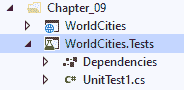
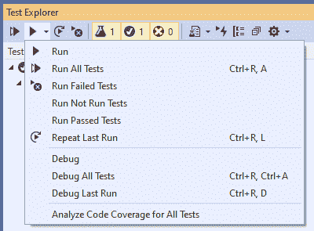
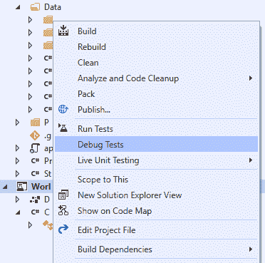
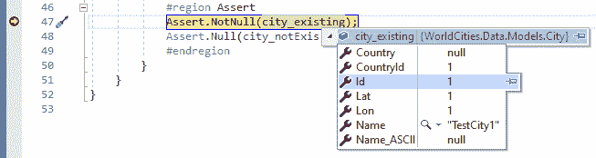
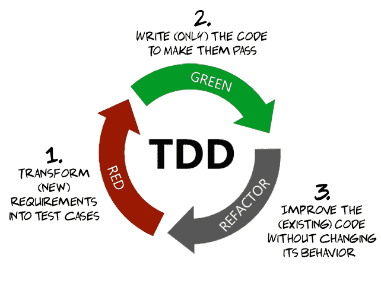
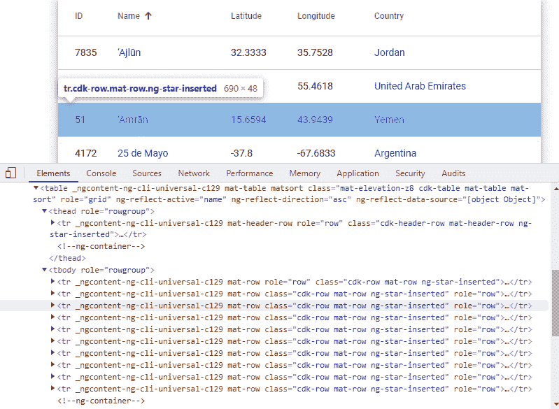
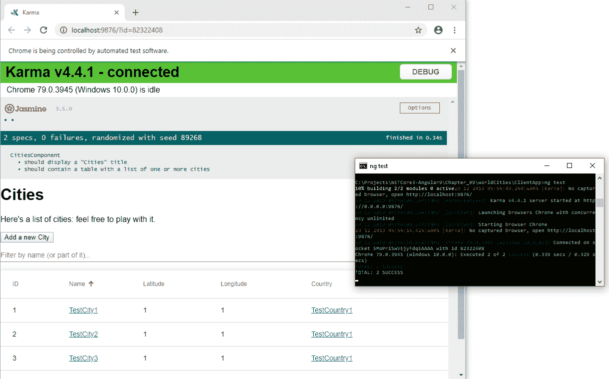
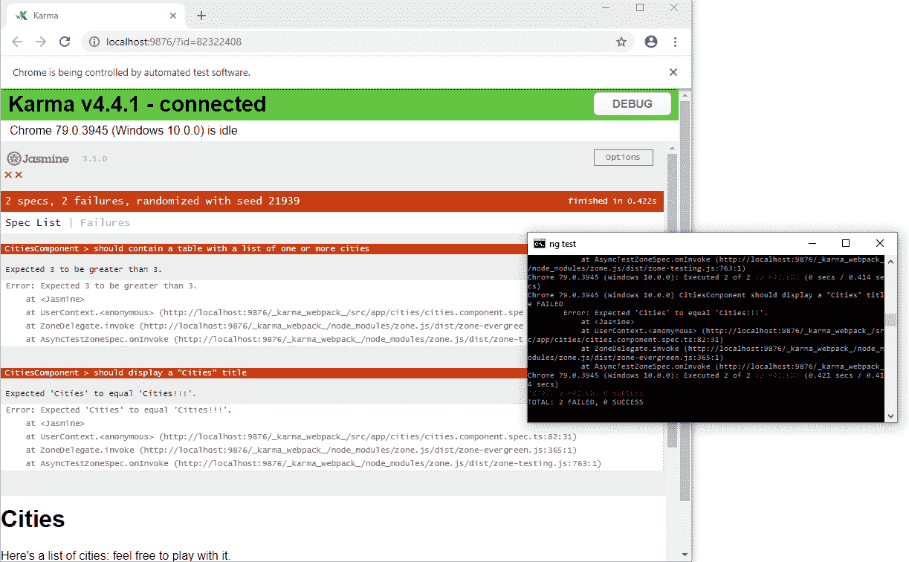

# ASP.NET 内核和角度单元测试

**单元测试**是一种软件测试方法的名称，它有助于确定程序（单元）的独立模块是否正常工作。在对各个单元进行验证后，可以将它们合并在一起并作为一个整体进行测试（集成测试和系统测试）和/或在生产中发布。

根据这个定义，很容易理解正确定义和隔离各个单元的重要性。这些是我们软件中最小的可测试部分，具有少量输入和单个输出。在**O****面向对象编程****OOP**中，程序的源代码被划分为类，单元通常是超级、抽象或派生类的方法，但也可以是辅助类的静态函数。

尽管单元测试已经成为高质量项目的一个事实上的标准，但大多数开发人员和项目经理往往低估了单元测试，他们渴望加快整个开发过程，从而降低总体成本。这种方法对于利润率低的小规模项目可能是不可接受的，因为创建单元测试无疑需要一些额外的工作。然而，了解它们对中大型项目和企业解决方案的巨大好处是非常重要的，特别是当它们需要大量开发人员的协调工作时。

本章完全致力于单元测试。更准确地说，我们将学习如何定义、实现和执行以下内容：

*   **后端单元在.NET 内核**中测试，使用**xUnit.NET**测试工具
*   **前端单元角度测试，**使用**Jasmine**测试框架和[第 2 章](02.html)*环视**和*中简要介绍的**Karma**测试运行器

我们还将有机会简要介绍一些广泛使用的测试实践，它们可以帮助我们从测试中获得最大收益，例如**测试驱动开发***（**TDD**）和**行为驱动开发**（**BDD**）。到本章结束时，我们将学习如何按照这些实践正确设计和实现*后端*和 f*前端*单元测试。*

 *为了简单起见，我们将在现有的`WorldCities`Angular 应用程序中执行单元测试。然而，为了做到这一点，我们将向我们的项目中添加一些新的包。

# 技术要求

在本章中，我们需要前面章节中列出的所有先前的技术要求，以及以下附加包：

*   **Microsoft.NET.Test.Sdk**
*   **迅特**
*   **xunit.runner.visualstudio**
*   **最低起订量**
*   **Microsoft.EntityFrameworkCore.InMemory**

一如既往，建议避免直接安装它们。在本章中，我们将引入它们，以便更好地将它们的目的置于项目中。

本章代码文件可在此处找到：[https://github.com/PacktPublishing/ASP.NET-Core-3-and-Angular-9-Third-Edition/tree/master/Chapter_09/](https://github.com/PacktPublishing/ASP.NET-Core-3-and-Angular-9-Third-Edition/tree/master/Chapter_09/) 。

# .NET 核心单元测试

在本节中，我们将学习如何使用 xUnit.NET 构建.NET 核心单元测试项目：一个免费、开源、以社区为中心的.NET 框架单元测试工具，由 Brad Wilson 创建，他也是 NUnit v2 的开发者。我们之所以选择这个工具，是因为它可以说是当今最强大、最易于使用的单元测试工具之一。它是.NET 基金会的一部分，因此在其行为准则下运行，并在 Apache 许可证（2 版）下进行授权。

在继续之前，我们还将借此机会在以下部分讨论 TDD 和 BDD。这是两种广泛使用的测试方法，它们有许多相似之处和不同之处，值得探讨。

# 创建世界城市测试项目

要创建测试项目，请执行以下步骤：

1.  打开命令行终端。
2.  导航到`WorldCities`解决方案的根文件夹（注意：*解决方案*根文件夹，而不是项目根文件夹！）。
3.  键入以下命令并点击*回车键：*

```cs
> dotnet new xunit -o WorldCities.Tests
```

NET CLI 应该为我们创建一个新项目，并处理一些创建后操作。完成后，一条文本消息将通知我们恢复任务已完成（恢复已完成）。如果我们做的一切都正确，那么新的`WorldCities.Test`项目应该与现有的`WorldCities`项目处于相同的文件夹级别。

在此之后，我们可以通过以下方式将新的`WorldCities.Tests`项目添加到我们的主解决方案中：

1.  在解决方案资源管理器中，右键单击根解决方案的节点，然后选择“添加现有项目”。
2.  在`/WorldCities.Tests/`文件夹内导航并选择`WorldCities.Tests.proj`文件。

新的`WorldCities.Tests`**项目将加载到`WorldCities`现有项目正下方的现有解决方案中，如下图所示：**

 **

让我们删除现有的`UnitTest1.cs`文件，因为我们不需要它。我们将在短时间内创建自己的单元测试类。

新的`WorldCities.Test`项目应该已经有以下 NuGet 包参考：

*   **Microsoft.NET.Test.Sdk**（版本 1.6.4 或更高版本）
*   **xunit**（版本 2.4.1 或更高版本）
*   **xunit.runner.visualstudio**（版本 2.4.1 或更高版本）

The preceding packages' version numbers are the latest at the time of writing and the ones that we're going to use in this book.

但是，我们还需要另外两个 NuGet 软件包：**Moq**和**Microsoft.EntityFrameworkCore.InMemory**，下面我们来看看如何添加它们。

# 最小起订量

**Moq**可以说是.NET 最流行、最友好的模拟框架。为了更好地理解我们为什么需要它，我们需要引入模仿的概念。

**模拟**是一种方便的功能，我们可以在单元测试中使用，只要我们要测试的单元具有外部依赖项，而这些依赖项不能在测试项目中轻松创建。模拟框架的主要目的是创建模拟真实对象行为的替换对象。**Moq**是一个最低限度的框架，可以做到这一点。

要安装它，请执行以下操作：

1.  在解决方案资源管理器中，右键单击`WorldCities.Test`项目并选择管理 NuGet 软件包。
2.  搜索`Moq`关键字。
3.  查找并安装 Moq NuGet 软件包。

或者，只需在 Visual Studio 的包管理器控制台中键入以下命令：

```cs
> Install-Package Moq
```

At the time of writing, we're using **Moq 4.13.1**, this being the latest stable version. To be sure that you are using this version as well, just add `-version 4.13.1` to the preceding command.

The latest **Moq** NuGet package, as well as all of the previous versions, are available here:
[https://www.nuget.org/packages/moq/](https://www.nuget.org/packages/moq/)

就这样！我们现在需要安装另一个 NuGet 软件包。

# Microsoft.EntityFramework.InMemory

`Microsoft.EntityFrameworkCore.InMemory`**是实体框架核心的内存数据库提供程序，可用于测试目的。这与我们在[第 4 章](04.html)、*数据模型和实体框架核心*中提到的角度内存 Web API 的概念基本相同。简而言之，我们可以把它看作是一个方便的数据库模拟。**

 **要安装它，请执行以下操作：

1.  在解决方案资源管理器中，右键单击`WorldCities.Test`项目并选择管理 NuGet 软件包。
2.  搜索`Microsoft.EntityFrameworkCore.InMemory`关键字。
3.  查找并安装 Microsoft.EntityFrameworkCore.InMemory**NuGet 软件包。**

 **或者，只需在 Visual Studio 的包管理器控制台中键入以下命令：

```cs
> Install-Package Microsoft.EntityFrameworkCore.InMemory
```

At the time of writing, we're using Microsoft.EntityFrameworkCore.InMemory 3.1.1, this being the latest stable version. To be sure that you are using this version as well, just add `-version 3.1.1` to the preceding command.

The latest `Microsoft.EntityFrameworkCore.InMemory` NuGet package, as well as all of the previous versions, are available here:
[https://www.nuget.org/packages/Microsoft.EntityFrameworkCore.InMemory/](https://www.nuget.org/packages/Microsoft.EntityFrameworkCore.InMemory/)

有了这个，我们都准备好了。

# 添加 WorldCities 依赖项引用

我们需要做的下一件事是在新的`WorldCities.Test`项目的依赖项中添加对主项目的引用，以便我们能够导入所需的类和类型。

为此，右键单击新项目的 Dependencies 节点以添加对`WorldCities`项目的引用，如以下屏幕截图所示，然后按 OK：


通过这样做，我们的测试项目将能够访问（从而测试）整个`WorldCities`代码。

我们现在准备学习**xUnit**的实际工作原理。和往常一样，最好的方法是创建我们的第一个单元测试。

# 我们的第一次测试

在标准测试开发实践中，我们将从现在起称之为 STD，单元测试通常用于确保现有代码正常工作。一旦准备就绪，这些单元将受到保护，防止回归错误和破坏性更改。

由于我们的*后端*代码是一个 Web API，我们可以在单元测试中首先介绍的应该是单个控制器的方法。然而，在 web 应用程序生命周期之外实例化控制器并不是那么简单，因为它们至少有两个重要的依赖项：`HttpContext`和`ApplicationDbContext`。在我们的`WorldCities.Test`项目中，有没有一种方法可以实例化它们？

多亏了`Microsoft.EntityFrameworkCore.InMemory`，这可能是一项相当简单的任务。。。只要我们知道如何使用它。

从解决方案资源管理器中，打开`WorldCities.Test`项目。在项目的根目录中创建一个新的`CitiesController_Test.cs`文件，并用以下内容填充：

```cs
using Microsoft.EntityFrameworkCore;
using WorldCities.Controllers;
using WorldCities.Data;
using WorldCities.Data.Models;
using Xunit;

namespace WorldCities.Tests
{
    public class CitiesController_Tests
    {
        /// <summary>
        /// Test the GetCity() method
        /// </summary>
        [Fact]
        public async void GetCity()
        {
 #region Arrange
            // todo: define the required assets
            #endregion

 #region Act
            // todo: invoke the test            
 #endregion

            #region Assert
            // todo: verify that conditions are met.
 #endregion
        }
    }
}
```

通过查看突出显示的区域，我们可以看到，我们已将单元测试分为三个代码块或阶段：

*   **安排**：定义运行测试所需的资产
*   **行为**：调用测试对象的行为
*   **断言**：通过评估行为的返回值或根据一些用户定义的规则对其进行度量来验证是否满足预期条件

这种方法被称为**排列**、**动作**、**断言**模式。这是描述 TDD 中软件测试各个阶段的典型方式。然而，也有其他名称用于描述这些相同的测试阶段；例如，BDD 框架通常将它们称为*给定*、*时、*和*然后*。

TDD and BDD are two development practices that enforce a different coding approach when compared to **Standard Testing Development** (**STD**). We'll talk more about these soon enough.

无论名称如何，重要的是理解以下关键概念：

*   将三个阶段分开可以提高测试的可读性。
*   以适当的顺序执行这三个阶段可以使测试更容易理解。

现在让我们看看我们是如何实施这三个阶段的。

# 安排

`Arrange`阶段是我们定义运行测试所需的资产的地方。在我们的场景中，由于我们要测试`CitiesController`的`GetCity()`方法的功能，我们需要为控制器提供合适的`ApplicationDbContext`。

然而，因为我们不是在测试`ApplicationDbContext`本身，所以实例化真实的东西是不可取的，至少目前是这样。我们不希望因为数据库不可用或数据库连接不正确而导致测试失败，因为这些是不同的单元，因此应通过不同的单元测试进行检查。此外，我们绝对不能允许我们的单元测试对实际数据源进行操作：如果我们想测试更新或删除任务，该怎么办

我们可以做的最好的事情是测试我们的 Web API 控制器，找到一种方法为它们提供一个替换对象，它可以像我们真实的`ApplicationDbContext`一样工作；换句话说，这是一个嘲弄。这就是我们早期安装的`Microsoft.EntityFrameworkCore.InMemory`NuGet 包可能派上用场的地方。

下面是我们如何使用它来正确实施`Arrange`阶段：

```cs
// ...existing code...

#region Arrange
var options = new DbContextOptionsBuilder<ApplicationDbContext>()
 .UseInMemoryDatabase(databaseName: "WorldCities")
 .Options;
using (var context = new ApplicationDbContext(options))
{
 context.Add(new City() { 
 Id = 1, 
 CountryId = 1, 
 Lat = 1, 
 Lon = 1, 
 Name = "TestCity1" 
 });
 context.SaveChanges();
}
City city_existing = null;
City city_notExisting = null;
#endregion

// ...existing code...
```

如我们所见，我们使用了`Microsoft.EntityFrameworkCore.InMemory`包提供的`UseInMemoryDatabase`扩展方法来创建合适的`DbContextOptionsBuilder`。一旦我们有了它，我们就可以用它来实例化一个带有内存数据库的`ApplicationDbContext`会话，而不是`WorldCities`项目使用的 SQL Server。

一旦创建了**上下文**就可以通过创建新的城市来填充，这就是我们在前面的代码中所做的，用一些随机数据创建`TestCity1`。这将允许我们的`GetCity()`方法`CitiesController`实际检索某些内容，前提是我们将传递该城市 ID。

除此之外，我们还定义了两个`City`对象，其中包含本测试的两个样本。

# 行为

`Act`阶段是进行测试的阶段。它通常由一条与我们要检查的单元行为相对应的指令组成。

以下是`Act`阶段的实施：

```cs
// ...existing code...

#region Act
using (var context = new ApplicationDbContext(options))
{
 var controller = new CitiesController(context);
 city_existing = (await controller.GetCity(1)).Value;
 city_notExisting = (await controller.GetCity(2)).Value;
}
#endregion

// ...existing code...
```

正如我们所看到的，整个实现都包含在一个`using`指令中，该指令确保我们的内存`ApplicationDbContext`实例将在阶段结束时被正确处理。

代码的其余部分完全是不言自明的。我们已经使用内存上下文创建了一个`CitiesController`实例，并执行了两次`GetCity()`方法：

*   第一种情况是检索现有的城市（使用我们用来填充内存数据库的相同的`Id`）。
*   第二种情况是检索不存在的城市（使用不同的`Id`。

这两个返回值随后存储在`city_existing`和`city_notExisting`变量中。理想情况下，第一个应该包含我们在排列阶段创建的`TestCity1`，而后一个应该是`null`。

# 明确肯定

`Assert`阶段的目的是验证`Act`阶段检索到的值是否正确满足我们预期的条件。为此，我们将使用**xUnit**提供的`Assert`类，该类包含各种静态方法，可用于验证这些条件是否满足。

以下是`Assert`阶段的实施：

```cs
#region Assert
Assert.True(
 city_existing != null 
 && city_notExisting == null
 );
#endregion
```

如我们所见，我们只是检查两个变量的值，这两个变量包含在`Act`阶段进行的`CitiesController`的两个`GetCity()`方法调用的返回值。我们有理由预计`city_existing`不会是`null`，而`city_notExisting`肯定应该是`null`。

我们的测试现在已经准备好了，让我们看看如何执行它。

# 执行测试

每个单元测试可通过两种方式执行：

*   **从命令行**，使用.NET 核心 CLI
*   **来自 Visual Studio GUI**，使用 Visual Studio 的内置测试运行程序（测试浏览器）

让我们快速尝试这两种方法。

# 使用 CLI

要使用.NET CLI 执行我们的测试单元，请执行以下步骤：

1.  打开命令提示符。
2.  导航到`WorldCities.Tests`项目根文件夹。
3.  执行以下命令：

```cs
> dotnet test
```

如果我们做的每件事都是正确的，我们应该看到这样的情况：


就这样。我们的测试正在运行，并且它确实通过了，这意味着`CitiesController`的`GetCity()`方法的行为符合预期。

# 使用 VisualStudio 测试资源管理器

如果我们想自动化此类任务，那么能够从命令行运行测试是一个很好的特性。然而，在大多数情况下，我们更希望能够直接从 VisualStudioGUI 中运行这些测试。

幸运的是，这完全可以通过 Test Explorer 窗口实现，该窗口可以通过按*Ctrl*+*E*、*T*或从菜单视图激活，如以下屏幕截图所示：


一旦激活，测试资源管理器窗口应该可以在 Visual Studio GUI 最右侧的解决方案资源管理器窗口下方访问。从那里，我们可以运行所有测试，或者只运行当前测试，方法是按面板左上角的前两个绿色*播放*图标，称为“全部运行”和“运行”，分别（参考以下屏幕截图）：


因为我们现在只有一个测试，所以这两个命令都会做同样的事情：运行我们的单元测试，并使用绿色复选（成功）或红色十字（失败）显示结果。

As we can see in the preceding screenshot, those green and/or red icons will be used to determine the combined results of the testing class, the namespace, and the whole assembly.

在继续之前，我们应该再花几分钟学习如何调试这些单元测试。

# 调试测试

如果单击测试资源管理器窗口左上角第二次运行图标旁边的箭头手柄，我们可以看到可以为测试提供许多其他可能的命令，包括 Debug、Debug All tests 和 Debug Last Run（请参阅以下屏幕截图）：



或者，我们可以使用 Debug Tests 命令，该命令在解决方案资源管理器窗口中右键单击`WorldCities.Tests`项目节点时显示：



这两个命令都将在调试模式下执行测试，这意味着我们可以设置断点（或条件断点）并评估结果。

要快速测试，请在`Assert`区域的第一行设置断点，然后执行前面的调试测试命令，等待命中：



好了。现在，我们知道了如何调试单元测试。在采用阶段，当我们仍然不知道如何正确使用它们和/或我们仍在学习各种 xUnit.net 命令时，这可能非常有用。

Those readers who want to know more about xUnit.net for .NET Core and the unique unit test classes and methods provided by this package are strongly encouraged to check out the following URL:

[https://xunit.net/docs/getting-started/netcore/cmdline](https://xunit.net/docs/getting-started/netcore/cmdline)

在切换到*前端*之前，花几分钟熟悉 TDD 和 BDD 的概念可能是值得的，因为这可以极大地帮助我们创建有用的相关测试。

# 测试驱动开发

TDD 与其说是一种测试方法，不如说是一种编程实践，至少对于某些场景来说，它是一种非常好的实践。

简言之，采用 TDD 方法的软件开发人员会将所有软件需求转换为特定的测试用例，然后编写新代码（或改进现有代码），以便通过测试。

让我们试着借助一个小图表来可视化这些编程实践的实际生命周期：



正如我们所看到的，TDD 主要是一种设计代码的方法，它要求开发人员在编写任何实际代码之前开始编写测试用例，以表达他们希望代码做什么（红色）。一旦完成，它要求他们**只编写使测试用例通过所需的代码（绿色）。**最终，**当所有测试用例都通过时，可以对现有代码进行改进（重构）**，直到出现更多的测试用例。这种短的开发周期通常被称为**红-绿-重构**，是 TDD 实践的支柱。值得注意的是，**红色**始终是任何循环的初始步骤，因为测试在开始时总是会失败，因为可能允许他们通过的代码尚未编写。

这样的实践与 STD 实践非常不同，在 STD 实践中，我们首先生成代码，然后（可能）生成测试。换句话说，我们的源代码可以在测试用例之前（甚至没有测试用例的情况下）编写（因此通常会编写）。这两种方法之间的主要区别在于，在 TDD 中，测试是我们在 STD 中需要满足的需求条件，正如我们刚才所说的，它们主要是我们现有代码工作的证明。

在下一章中，在处理身份验证和授权时，我们将尝试使用 TDD 方法创建两个*后端*单元测试；毕竟，由于 TDD 实践仅在我们必须实现附加需求时才需要创建测试用例，因此使用它的最佳方式是在我们需要添加一些新特性时。

# 行为驱动开发

BDD 是一个敏捷的软件开发过程，与 TDD 的测试优先方法相同，但**强调最终用户视角的结果，而不是专注于实现**。

为了更好地理解 TDD 和 BDD 之间的关键区别，我们可以问自己以下问题：

What are we testing for?

当我们准备编写一些单元测试时，这是一个很好的问题。

如果我们想测试方法/单元的实际实现，TDD 可能是正确的方法。然而，如果我们的目标是找出我们的应用程序在特定情况下的最终用户行为，TDD 可能会给我们带来误报，特别是在系统发展的情况下（如敏捷驱动的项目通常所做的那样）。更具体地说，我们可能会遇到这样一种情况：一个或多个单元通过了测试，尽管未能交付预期的最终用户结果。

更笼统地说，我们可以说：

*   TDD 旨在**强制开发人员控制他们编写的**源代码。
*   BDD 旨在**满足开发商*和*最终用户**（或客户）。

因此，我们可以很容易地看到 BDD 如何取代 TDD 而不是取代它

让我们试着将这些概念总结成一个图表：


正如我们所看到的，BDD 就像 TDD 的一个扩展。我们不是编写测试用例，而是从编写行为开始。一旦我们这样做，我们将开发应用程序能够执行它所需的代码（可以使用 TDD），然后我们继续定义其他行为或重构现有行为。

由于这些行为是针对最终用户的，因此也必须使用可理解的术语编写。正是由于这个原因，BDD 测试通常使用一种半正式的格式来定义，这种格式借鉴了敏捷的用户故事，具有强烈的叙述性和明确的上下文。这些用户情景通常要符合以下结构：

*   **标题：**明确的标题，如*编辑现有城市*
*   **叙述：**一个描述性部分，使用*角色*/*功能*/*从敏捷用户故事中受益*模式，例如*作为用户，我想编辑一个现有城市，以便我可以更改其值*
*   **验收标准：**对三个测试阶段的描述，使用/*给出的*当*/*然后*模型，这基本上是 TDD 中使用的*排列*/*动作*/*断言*循环的一个更容易理解的版本，例如：**给定***一个包含一个或多个城市的世界城市数据库；***当***用户选择一个城市时；***然后***应用程序必须从数据库中检索并在前端*上显示*

正如我们所看到的，我们只是试图用一种典型的 BDD 方法来描述我们刚才创建的单元测试。尽管它基本上是有效的，但很明显，单个行为可能需要多个*后端*和*前端*单元测试。这让我们了解 BDD 实践的另一个显著特征。*前端*测试阶段最重要的是测试用户行为的最佳方式，而不是实现规范。

总之，如果我们能够正确设计所需的*前端*和*后端*测试，BDD 可以是扩展标准 TDD 方法来设计测试的一个很好的方式，从而使测试结果能够面向更广泛的受众。

在下一节中，我们将学习如何做到这一点。

# 角单元测试

我们在本章前面几节中所说的关于.NET 核心测试目的、意义和方法的所有内容也适用于 Angular。

幸运的是，这次我们不需要安装任何东西，因为我们用来创建`WorldCities`项目的.NET Core 和 Angular Visual Studio 模板已经包含了我们为 Angular 应用程序编写应用程序测试所需的一切。

更具体地说，我们已经可以依赖以下软件包，我们在[第 2 章](02.html)*环顾*中简要介绍了这些软件包：

*   **Jasmine**：一个 JavaScript 测试框架，完全支持我们前面提到的 BDD 方法
*   **Karma**：一个让我们从命令行生成浏览器并在其中运行 Jasmine 测试（并显示结果）的工具
*   **量角器**：一种端到端测试框架，在真实的浏览器中对角度应用程序运行测试，并像真实用户一样与之交互

For additional information regarding Jasmine and Karma, check out the following guides:

**Karma:**
[https://karma-runner.github.io/](https://karma-runner.github.io/)

**Jasmine:** [https://jasmine.github.io/](https://jasmine.github.io/)

**Protractor:**
[https://www.protractortest.org/](https://www.protractortest.org/)

**Angular Unit Test:**
[https://angular.io/guide/testing](https://angular.io/guide/testing)

在以下部分中，我们将执行以下操作：

*   **查看我们`WorldCities`Angular app 中仍然存在的测试配置文件**
*   **介绍角度测试最重要的概念之一的测试台接口**
*   **探索茉莉花和因果报应**以了解它们实际上是如何工作的
*   **创建一些.spec.ts 文件**来测试我们现有的组件
*   **为我们的 Angular app 设置并配置一些测试**

让我们开始吧！

# 一般概念

相反，从我们在.NET Core 中所做的，我们在单独的`WorldCities.Tests`项目中创建了单元测试，所有*前端*测试都将在托管 Angular 应用程序的同一项目中编写。

事实上，当我们第一次探索角度文件夹时，我们已经在[第 2 章](https://cdp.packtpub.com/asp_net_core_3_and_angular_7___third_edition/wp-admin/post.php?post=47&action=edit#post_51)、*环视**和*中看到了其中一个测试。测试写在`counter.component.spec.ts`文件中，我们在该章末尾删除了该文件，因为我们不再需要`CounterComponent`。

幸运的是，我们没有从`/ClientApp/src/app/`文件夹中删除以下文件：

*   `karma.conf.js`：特定于应用程序的 Karma 配置文件，包含有关报告者、要使用的浏览器、TCP 端口等的信息
*   `test.ts`：项目单元测试的角度入口点；这是 Angular 初始化测试环境的地方，配置`.spec.ts`扩展以识别测试文件，并从`@angular/core/testing`和`@angular/platform-browser-dynamic/testing`包加载所需的模块

这是一件好事，因为现在我们只需要为新组件编写测试。然而，在这样做之前，明智的做法是花更长的时间解释角度测试实际上是如何工作的。

# 介绍测试平台接口

**试验台**接口是角度测试方法中最重要的概念之一。简而言之，测试台是一个动态构建的角度测试模块，模拟角度**@NgModule**的行为。

首先，Angular 2 引入了测试台概念，作为测试具有真实 DOM 的组件的便捷方法。由于它支持将服务（真实或模拟）注入到我们的组件中，以及自动绑定组件和模板，所以 TestBed 接口在这方面有很大的帮助。

为了更好地理解测试平台是如何工作的以及我们如何使用它，让我们来看看在 Tyt T0x 文件中所提供的测试平台的实现，我们在后面的第 2 章中删除了它。

```cs
TestBed.configureTestingModule({
  declarations: [ CounterComponent ]
})
  .compileComponents();
```

在前面的代码中，我们可以看到测试床如何再现一个简约的`AppModule`文件的行为——Angular 应用程序的引导`@NgModule`，其唯一目的是编译我们需要测试的组件。它使用 Angular 模块系统（我们在[第 3 章](03.html)、*前端和后端交互*中讨论过）来声明和编译`CounterComponent`，以便我们可以在测试中使用其源代码。

# 茉莉花试验

Jasmine 测试通常使用以下三个主要 API 构建：

*   `describe()`：用于创建一组测试的包装上下文（也称为*测试套件*）
*   `it()`：单次试验的声明
*   `expect()`：测试的预期结果

由于与 Jasmine 测试框架的内置角度集成，这些 API 将以静态方法的形式出现在我们的`*.spec.ts`文件中。

记住这一点，让我们为 Angular 应用程序创建第一个测试类文件。

# 我们的第一个角度测试套件

现在，让我们尝试为现有的一个 Angular 组件创建我们自己的测试套件和相应的测试台。我们将使用`CitiesComponent`，因为我们非常了解它。

Unfortunately, the Angular CLI doesn't (yet) provide a way to automatically generate `spec.ts` files for existing Component classes. However, there are a number of third-party libraries that generate the specs based on Angular CLI spec presets.

The most popular (and widely used) package that does that is called `ngx-spec` and is available on GitHub at the following URL:

[https://github.com/smnbbrv/ngx-spec](https://github.com/smnbbrv/ngx-spec)

However, we're not going to use it in our specific scenario; we'll create and implement our `spec.ts` files manually so that we can better understand how they work.

从解决方案资源管理器中，创建一个新的`/ClientApp/src/app/cities/cities.component.spec.ts`文件并打开它。因为我们将要编写大量的源代码，所以明智的做法是将其分成多个块。

# 进口部

让我们从定义所需的`import`语句开始：

```cs
import { async, ComponentFixture, TestBed } from
 '@angular/core/testing';
import { BrowserAnimationsModule } from
 '@angular/platform-browser/animations';
import { AngularMaterialModule } from '../angular-material.module';
import { of } from 'rxjs';

import { CitiesComponent } from './cities.component';
import { City } from './city';
import { CityService } from './city.service';
import { ApiResult } from '../base.service';

// ...to be continued...
```

如我们所见，我们添加了一系列模块，这些模块已经在`AppModule`和`CitiesComponent`类中使用。这当然是意料之中的，因为我们的测试平台需要复制一个合适的`@NgModule`来运行我们的测试。

# 在每一节之前描述和说明

现在，我们已经获得了所有必需的参考资料，让我们看看如何使用`describe()`API 来布局我们的测试套件：

```cs
// ...existing code...

describe('CitiesComponent', () => {
  let fixture: ComponentFixture<CitiesComponent>;
  let component: CitiesComponent;

  // async beforeEach(): testBed initialization
  beforeEach(async(() => {

 // todo: initialize the required providers

    TestBed.configureTestingModule({
      declarations: [CitiesComponent],
      imports: [
        BrowserAnimationsModule,
        AngularMaterialModule
      ],
      providers: [

 // todo: reference the required providers 
      ]
    })
      .compileComponents();
  }));

  // synchronous beforeEach(): fixtures and components setup
  beforeEach(() => {
    fixture = TestBed.createComponent(CitiesComponent);
    component = fixture.componentInstance;

 // todo: configure fixture/component/children/etc. 
  });

 // todo: implement some tests

});
```

正如我们通过查看前面的代码所看到的，一切都发生在一个`describe()`包装上下文中，它代表了我们的`CitiesComponent`测试套件。与我们的`CitiesComponent`类相关的所有测试都将在此套件中实现。

我们在测试套件中做的第一件事是定义两个重要变量，这两个变量将在我们的测试中广泛使用：

*   `fixture`：该属性为运行测试承载`CitiesComponent`的固定状态；我们可以使用该装置与实例化的组件及其子元素进行交互。
*   `component`：此属性将包含从前面的 fixture 创建的`CitiesComponent`实例。

紧接着，我们定义了两个连续的`beforeEach()`方法调用。为了更好地区分它们，我们使用内联注释为它们提供了不同的名称：

*   `async beforeEach()`，其中创建并初始化了测试床
*   `synchronous beforeEach()`，其中夹具和组件被实例化和配置

在`async beforeEach()`*内部，我们通过声明我们的`CitiesComponent`并导入其所需的两个模块`BrowserAnimationModule`和`AngularMaterialModule`定义了一个测试平台。从我们留下的*todo*注释中可以看出，我们还需要定义和配置我们的`providers`（例如`CityService`，否则`CitiesComponent`将无法注入它们；我们马上就去。在`synchronous beforeEach()`中，我们实例化了`fixture`和`component`变量。由于我们可能需要正确地设置它们和/或配置组件的一些子元素，因此我们在这里也留下了另一条*todo*注释。*

 *在文件末尾，还有另一条*todo*注释。这就是我们将使用 Jasmine 框架提供的`it()`和`expect()`API 实现测试的地方。

# 添加模拟城市服务

现在，我们将通过实现一个*模拟*`CityService`来替换我们的第一个*todo*，这样我们就可以在我们的测试床中引用它。

As we already know from the *back-end* testing using .NET Core and xUnit, a mock is a replacement object that simulates the behavior of the real ones. 

就像.NETCore 和 xUnit 一样，Jasmine 提供了多种方法来设置模拟对象。在以下段落中，我们将简要回顾一些最常用的方法。

# 假服务班

我们可以创建一个假的`CityService`，它只返回我们测试所需的任何内容。一旦完成，我们可以在`.spec.ts`类中`import`它，并将它添加到测试床的`providers`列表中，这样我们的组件就可以像真正的组件一样调用它。

# 扩展和覆盖

我们不需要创建一个完整的双类，只需扩展真正的服务，然后重写执行测试所需的方法。完成后，我们可以使用@NgModule 的`useValue`特性在测试床中设置扩展类的实例。

# 接口实例

我们可以实例化服务的接口，实现测试所需的方法，而不是创建新的双类或扩展类。完成后，我们可以使用@NgModule 的`useValue`特性在测试床上设置该实例。

# 间谍

这种方法依赖于一种称为*spy*的 Jasmine 特定功能，它允许我们获取现有的类、函数或对象并对其进行模拟，以便控制其返回值。由于不会执行真正的方法，因此 spy 方法将像重写一样工作，而无需创建扩展类。

我们可以使用这样的特性来创建我们服务的真实实例，监视我们想要覆盖的方法，然后使用@NgModule 的`useValue`特性在我们的测试床上设置该特定实例。或者，我们可以使用`jasmine.createSpyObj()`静态函数创建一个具有多种间谍方法的模拟对象，然后以各种方式进行配置。

# 实现模拟城市服务

我们应该走哪条路线？不幸的是，对于所有场景都没有最佳答案，因为最佳方法通常取决于我们想要测试的功能的复杂性和/或我们想要如何构建测试套件。

从理论上讲，创建一个完整的**假服务类**可以说是最安全和通用的选择，因为我们可以完全定制我们的模拟服务返回值。然而，只要我们处理的是简单的服务和/或小规模的测试，它也可能非常耗时，而且通常是不必要的。相反，**扩展和覆盖**、**接口**、**和**间谍**方法通常是解决大多数测试基本需求的好方法，但在复杂的测试场景中，它们可能会产生意想不到的结果，除非我们密切注意覆盖/监视所有必需的方法。**

 **考虑到所有因素，由于我们的`CityService`非常小，并且具有一个简单的实现和少量的方法，我们将使用 spy 方法，这似乎是最适合我们给定场景的方法。

让我们回到`/ClientApp/src/cities/cities.components.spec.ts`文件。到达后，需要更换以下代码行：

```cs
// todo: initialize the required providers
```

前一行代码必须替换为以下代码：

```cs
// Create a mock cityService object with a mock 'getData' method
let cityService = jasmine.createSpyObj<CityService>('CityService', ['getData']);

// Configure the 'getData' spy method
cityService.getData.and.returnValue(
  // return an Observable with some test data
  of<ApiResult<City>>(<ApiResult<City>>{
    data: [
      <City>{
        name: 'TestCity1',
        id: 1, lat: 1, lon: 1,
        countryId: 1, countryName: 'TestCountry1'
      },
      <City>{
        name: 'TestCity2',
        id: 2, lat: 1, lon: 1,
        countryId: 1, countryName: 'TestCountry1'
      },
      <City>{
        name: 'TestCity3',
        id: 3, lat: 1, lon: 1,
        countryId: 1, countryName: 'TestCountry1'
      }
    ],
    totalCount: 3,
    pageIndex: 0,
    pageSize: 10
  }));
```

就这样。现在，我们可以将新的模拟`CityService`添加到测试床配置中，替换第二个*todo*：

```cs
// todo: reference the required providers
```

这将替换为以下代码中突出显示的行：

```cs
// ...existing code...

TestBed.configureTestingModule({
  declarations: [CitiesComponent],
  imports: [
    BrowserAnimationsModule,
    AngularMaterialModule
  ],
  providers: [
 {
 provide: CityService,
 useValue: cityService
 }
  ]
})
  .compileComponents();

// ...existing code... 
```

该模拟`CityService`现在将被注入`CitiesComponent`，从而使我们能够控制每次测试返回的数据。

# 使用接口方法的替代实现

下面是我们如何使用接口方法实现模拟`CityService`：

```cs
// Create a mock cityService object with a mock 'getData' method
let cityService = <CityService>{
  get: () => { return null; },
  put: () => { return null; },
  post: () => { return null; },
  getCountries: () => { return null; },
  isDupeCity: () => { return null; },
  http: null,
  baseUrl: null,
  getData: () => {
    // return an Observable with some test data
    return of<ApiResult<City>>(<ApiResult<City>>{
      data: [
        <City>{
          name: 'TestCity1',
          id: 1, lat: 1, lon: 1,
          countryId: 1, countryName: 'TestCountry1'
        },
        <City>{
          name: 'TestCity2',
          id: 2, lat: 1, lon: 1,
          countryId: 1, countryName: 'TestCountry1'
        },
        <City>{
          name: 'TestCity3',
          id: 3, lat: 1, lon: 1,
          countryId: 1, countryName: 'TestCountry1'
        }
      ],
      totalCount: 3,
      pageIndex: 0,
      pageSize: 10
    });
  }
};
```

正如我们所看到的，代码非常相似，但是如果我们想要维护`<CityService>`类型断言，实现接口需要额外的代码。这就是我们使用**间谍**方法的原因。

# 配置夹具和组件

现在是移除我们`/ClientApp/src/cities/cities.components.spec.ts`**课程中第三个*todo*的时候了：**

```cs
// todo: configure fixture/component/children/etc.
```

这需要替换为以下突出显示的行：

```cs
// ...existing code...

// synchronous beforeEach(): fixtures and components setup
beforeEach(() => {
  fixture = TestBed.createComponent(CitiesComponent);
  component = fixture.componentInstance;

 component.paginator = jasmine.createSpyObj(
 "MatPaginator", ["length", "pageIndex", "pageSize"]
 );

 fixture.detectChanges();
});

// ...existing code...
```

上述代码将在每次测试前直接执行以下步骤：

*   创建一个模拟`MatPaginator`对象实例。
*   触发组件上的更改检测运行。

As we might easily surmise, change detection isn't done automatically there, so we have to manually trigger it by calling the `detectChanges` method on our **fixture**. This will make our `ngOnInit()` method fire and populate the table with the cities. Since we're testing the Component behavior, that's definitely something to do before running our tests.

# 创建标题测试

我们终于准备好创建第一个测试了。

我们`/ClientApp/src/cities/cities.components.spec.ts`班上剩下的最后一行*todo*需要更换：

```cs
// todo: implement some tests
```

需要按如下方式替换前一行代码：

```cs
it('should display a "Cities" title', async(() => {
  let title = fixture.nativeElement
    .querySelector('h1');
  expect(title.textContent).toEqual('Cities');
}));
```

正如我们所看到的，我们最终使用了`it()`和`expect()`茉莉花方法。第一个声明了我们测试的意义，而后一个根据预期评估组件的行为并确定测试结果。

在第一个测试中，我们要检查组件是否向用户显示`Cities`标题。因为我们知道我们的组件的模板在`<H1>`HTML 元素中保存标题，所以我们可以通过对`fixture.nativeElement`执行 DOM 查询来检查它，该根组件元素包含所有呈现的 HTML 内容。

一旦我们得到了`title`元素，我们就检查它的`textContent`属性，看看它是否是我们所期望的（`Cities`。这就是测试通过或失败的原因。

# 创建城市测试

在运行测试套件之前，让我们添加另一个测试。

再次打开`/ClientApp/src/cities/cities.components.spec.ts`文件，在上一次测试的正下方添加以下行：

```cs
// ...existing code...

it('should contain a table with a list of one or more cities', async(() => {
  let table = fixture.nativeElement
    .querySelector('table.mat-table');
  let tableRows = table
    .querySelectorAll('tr.mat-row');
  expect(tableRows.length).toBeGreaterThan(0);
}));

// ...existing code...
```

这一次，我们正在检查包含城市列表的表。更准确地说，我们正在计算表体行数，以确保生成的数字大于零，这意味着该表已填充至少一个城市。要执行此计算，我们使用 Angular Material 默认分配给其`MatTable`组件的 CSS 类。

为了更好地理解这一点，请查看以下屏幕截图：



我们可以看到，`mat-row`CSS 类只应用于表体行，而表头行有`mat-header-row`类。因此，如果测试通过，这肯定意味着组件在表中至少创建了一行。

**IMPORTANT**: It goes without saying that relying upon CSS classes applied by a third-party package to define our tests is not a good practice. We're doing that just to demonstrate what we can do with our current implementation. A safer approach for such DOM-based tests would arguably require defining custom CSS classes and checking for their presence instead.

# 运行测试套件

现在是时候运行我们的测试套件了，看看我们得到了什么。

为此，请执行以下步骤：

1.  打开命令提示符。
2.  导航到`WorldCities`应用程序的`/ClientApp/`文件夹。
3.  执行以下命令：

```cs
> ng test
```

这将启动 Karma test runner，它将打开一个专用浏览器来运行测试。如果我们已经正确地完成了所有操作，我们应该能够看到以下结果：



就这样。两项测试都通过了。为了 100%确定我们做的每件事都是正确的，现在让我们试着让他们失败。

再次打开`/ClientApp/src/cities/cities.components.spec.ts`文件，按以下方式修改测试的源代码（更新的行高亮显示）：

```cs
it('should display a "Cities" title', async(() => {
  let title = fixture.nativeElement
    .querySelector('h1');
  expect(title.textContent).toEqual('Cities!!!');
}));

it('should contain a table with a list of one or more cities', async(() => {
  let table = fixture.nativeElement
    .querySelector('table.mat-table');
  let tableRows = table
    .querySelectorAll('tr.mat-row');
  expect(tableRows.length).toBeGreaterThan(3);
}));
```

现在，我们的第一个测试将期望一个不正确的标题值，第二个测试将查找三行以上的内容，但情况并非如此，因为我们的模拟`CityService`已配置为服务其中三行

保存文件后，Karma 测试运行程序应自动重新加载测试页面并显示更新的结果（请参阅以下屏幕截图）：



好了。现在，我们正经历两次失败，正如预期的那样。Jasmine 框架还告诉我们出了什么问题，以便我们能够及时解决这些问题。

让我们这样做。打开`/ClientApp/src/cities/cities.components.spec.ts`文件，将测试的源代码恢复到以前的状态：

```cs
it('should display a "Cities" title', async(() => {
  let title = fixture.nativeElement
    .querySelector('h1');
  expect(title.textContent).toEqual('Cities');
}));

it('should contain a table with a list of one or more cities', async(() => {
  let table = fixture.nativeElement
    .querySelector('table.mat-table');
  let tableRows = table
    .querySelectorAll('tr.mat-row');
  expect(tableRows.length).toBeGreaterThan(0);
}));
```

就这样。现在我们已经*测试了*我们的测试套件，我们可以通过在`ng test`终端窗口上按*Ctrl*+*C*关闭测试运行程序，然后选择*Y*（并点击*Enter**终止批处理作业。*

 *至此，我们通过*前端*测试结束了我们的学习之旅。

# 总结

本章完全致力于测试和单元测试的概念。在简要介绍了这些概念的含义和各种可用的测试实践之后，我们花了一些宝贵的时间学习如何正确地实现它们。

在 xUnit.net 测试工具的帮助下，我们开始关注*后端*测试。这种方法要求我们创建一个新的测试项目，在那里我们实现了第一个*后端*单元测试。在学习过程中，我们了解了一些与测试相关的概念的重要性，例如 mocking，我们用来模拟`ApplicationDbContext`类的行为，以提供一些内存中的数据，而不是使用 SQL Server 数据源。

*后端*测试方法极大地帮助我们理解 TDD 的含义及其与 BDD 方法的异同，BDD 方法是一种独特的*前端*测试实践。

这样的比较将我们引向 Angular，我们使用**Jasmine**测试框架和**Karma**测试运行器开发了一些*前端*测试。在这里，我们有机会学习一些良好的测试实践，以及与 Jasmine 框架严格相关的其他重要概念，如测试床、测试套件和 spies。最终，我们在`WorldCities`应用程序中成功地看到了我们的测试。

在下一章中，我们将尝试在处理授权和身份验证主题时设计更多的测试。我们在这里学到的概念在必须实现注册和登录工作流时肯定非常有用。

# 建议的主题

单元测试、xUnit、Moq、TDD、BDD、模拟、存根、夹具、Jasmine、Karma、量角器、Spy、测试套件、测试床。

# 工具书类

*   *迅网入门*：[https://xunit.net/docs/getting-started/netcore/cmdline](https://xunit.net/docs/getting-started/netcore/cmdline)
*   *在.NET 内核和.NET 标准中进行单元测试*：[https://docs.microsoft.com/en-US/dotnet/core/testing/](https://docs.microsoft.com/en-US/dotnet/core/testing/)
*   *ASP.NET 内核中的单元测试控制器逻辑*：[https://docs.microsoft.com/en-us/aspnet/core/mvc/controllers/testing](https://docs.microsoft.com/en-us/aspnet/core/mvc/controllers/testing)
*   *使用说明（C#）*：[https://docs.microsoft.com/en-US/dotnet/csharp/language-reference/keywords/using-statement](https://docs.microsoft.com/en-US/dotnet/csharp/language-reference/keywords/using-statement)
*   *xUnit.net–使用.net 内核和.net SDK 命令行*：[https://xunit.net/docs/getting-started/netcore/cmdline](https://xunit.net/docs/getting-started/netcore/cmdline)
*   *角度测试*：[https://angular.io/guide/testing](https://angular.io/guide/testing)
*   *量角器：端对端测角*：[https://www.protractortest.org/](https://www.protractortest.org/)
*   *Jasmine:行为驱动 JavaScript*：[https://jasmine.github.io/](https://jasmine.github.io/)
*   *Karma:JavaScript 的壮观测试运行者*：[https://karma-runner.github.io/latest/index.html](https://karma-runner.github.io/latest/index.html)
*   *角度测试：组件夹具*：[https://angular.io/api/core/testing/ComponentFixture](https://angular.io/api/core/testing/ComponentFixture)
*   *角度参考：ngAfterViewInit*：[https://ngrefs.com/latest/core/ng-after-view-init](https://ngrefs.com/latest/core/ng-after-view-init)*************