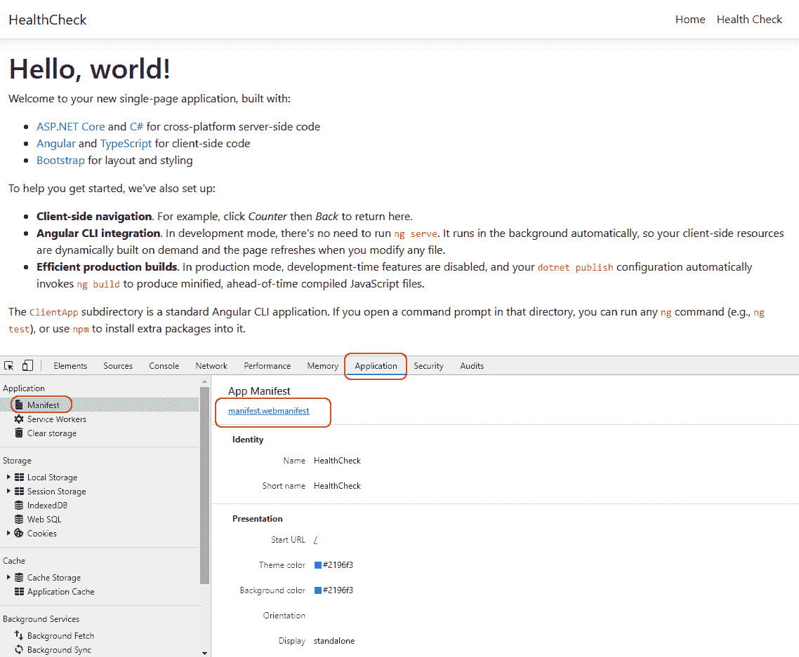
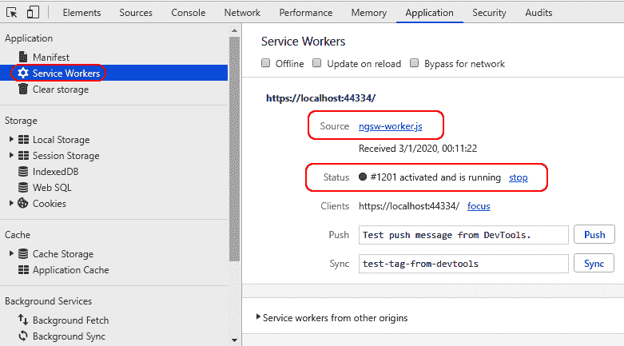
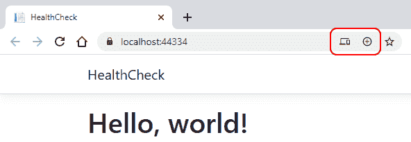
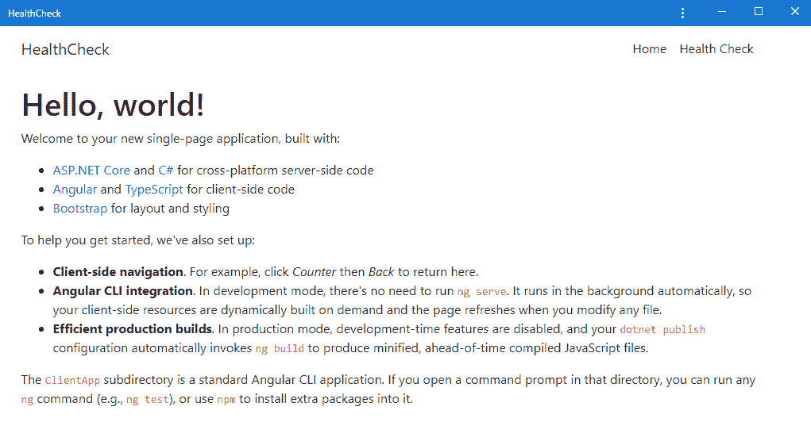

# 十一、渐进式 Web 应用

在本章中，我们将关注一个话题，我们刚刚在[第一章](01.html)、***准备就绪*中提到过，当我们第一次谈论当今可用的 web 应用的不同开发模式时：**渐进式 web 应用**（**PWAs***.***

 **事实上，我们的`HealthCheck`和`WorldCities`应用目前都坚持**单页应用**（**SPA**）模式，至少在大部分情况下是这样的：在以下部分中，我们将看到如何通过实现这种开发方法所需的几个成熟功能，将它们转化为 PWA。

正如我们在[第 1 章](01.html)、***准备就绪*中了解到的，PWA 是一种 web 应用，它利用现代 web 浏览器的功能向用户提供类似应用的体验。为了实现这一点，PWA 需要满足一些技术要求，包括（但不限于）一个*Web 应用清单文件*和一个服务人员，以允许他们在*离线模式*下工作，并像移动应用一样工作。**

 **更准确地说，我们要做的是：

*   **按照 PWA 的已知规范确定 PWA 所需的技术要求**。
*   **在我们现有的`HealthCheck`和`WorldCities`应用上实现这些要求**，将它们转化为 PWA。更准确地说，我们将使用两种不同的方法来实现这一点：手动执行`HealthCheck`应用所需的所有步骤，然后使用 Angular CLI 为`WorldCities`应用提供的*PWA 自动设置*。
*   **测试这两个应用的新 PWA 功能**。

本章结束时，我们将学习如何成功地将现有 SPA 转换为 PWA。

# 技术要求

在本章中，我们需要第 1-10 章中列出的所有以前的技术要求，以及以下附加包：

*   `@angular/service-worker`（npm 包）
*   `ng-connection-service`（npm 包）
*   `Microsoft.AspNetCore.Cors`（NuGet 套餐）
*   `WebEssentials.AspNetCore.ServiceWorker`（NuGet 套装，*可选*
*   `http-server`（npm 包，*可选*

和往常一样，避免直接安装它们是明智的：我们将在本章中引入它们，以便更好地将它们的用途与我们的项目联系起来。

本章的代码文件位于：[https://github.com/PacktPublishing/ASP.NET-Core-3-and-Angular-9-Third-Edition/tree/master/Chapter_11/](https://github.com/PacktPublishing/ASP.NET-Core-3-and-Angular-9-Third-Edition/tree/master/Chapter_11/)

# PWA–独特特征

让我们从总结 PWA 的主要区别特征开始：

*   **渐进式**：无论使用何种平台和/或浏览器，PWA 都应适用于每个用户。
*   **响应性**：他们必须很好地适应任何形式因素：台式机、手机、平板电脑等。
*   **独立于连接的**：它们必须至少在一定程度上能够脱机工作，例如通知用户某些功能可能无法在*脱机模式*-或低质量网络上工作。
*   **类似**的应用：它们需要提供与移动应用相同的导航和交互机制。这包括点击支持、基于手势的滚动等。
*   **安全**：他们必须提供 HTTPS 支持以提高安全性，例如防止窥探和确保其内容未被篡改。
*   **可发现**：由于 W3C 清单文件和服务人员注册范围，它们必须被识别为*web 应用*，以便搜索引擎能够找到、识别和分类它们。

*   **可重新订婚**：他们应该通过*推送通知*等功能使重新订婚变得容易。
*   **可安装**：他们应该允许用户在桌面和/或移动主屏幕上安装和保存它们，就像任何标准的移动应用一样，但不必从应用商店下载和安装它们。
*   **可链接**：可以通过 URL 轻松共享，无需复杂的安装。

The preceding characteristics can be inferred from the following articles written by the Google developers and engineers who spent their efforts to introduce the PWA concept and define its core specs:

[https://developers.google.com/web/progressive-web-apps](https://developers.google.com/web/progressive-web-apps)
[https://developers.google.com/web/fundamentals](https://developers.google.com/web/fundamentals)
[https://infrequently.org/2015/06/progressive-apps-escaping-tabs-without-losing-our-soul/](https://infrequently.org/2015/06/progressive-apps-escaping-tabs-without-losing-our-soul/)

这些高级需求可以转化为我们必须执行的特定技术任务。最好的方法是从谷歌 Chrome 工程师亚历克斯·拉塞尔（Alex Russell）描述的技术基线标准开始，他在 2015 年与设计师弗朗西斯·贝里曼（Frances Berriman）共同创造了 PWA 一词：

*   **来源于安全来源**：换句话说，完全支持 HTTPS，没有混合内容（*绿色挂锁*显示）。
*   **离线加载**，即使只是*离线*信息页面：这显然意味着我们需要实现一个服务工作者。
*   **引用至少具有四个关键属性的 Web 应用清单**：`name`、`short_name`、`stat_url`和`display`（具有*独立*或*全屏*值）。
*   **PNG 格式的 144×144 图标**：支持其他尺寸，但最低要求为 144×144。
*   **使用矢量图形**，因为它们可以无限扩展，并且需要更小的文件大小。

这些技术要求可以转化为我们必须执行的特定技术任务。在下面的部分中，我们将全部实现它们。

# 安全来源

实现**安全源**功能基本上意味着通过 HTTPS 证书为我们的应用提供服务。如今，这样的要求很容易实现：由于有很多经销商，TLS 证书非常便宜。由 Comodo Inc.发行的正面 SSL 可在线购买，价格为 10 美元/年左右，可立即下载。

如果我们不想花钱，还有一个由**Let's Encrypt**提供的免费替代方案：一个免费、自动化、开放的证书颁发机构，可以用来免费获得 TLS 证书。但是，他们用于发布证书的方法需要对部署 web 主机进行 shell 访问（也称为 SSH 访问）。

For additional information about **Let's Encrypt** and how to obtain an HTTPS certificate for free, check out the official site:

[https://letsencrypt.org/](https://letsencrypt.org/)

为了简单起见，我们将不讨论 HTTPS 证书发布和安装部分：我们将理所当然地认为读者能够正确安装它，这要感谢各个经销商网站提供的许多操作指南（包括**Let's Encrypt**）。

# 脱机加载和 Web 应用清单

*连接独立性*是 PWAs 最重要的功能之一：为了正确地实现它，我们需要引入并实现一个我们到目前为止很少提到的概念：服务人员。它们是什么？它们如何帮助我们的应用在脱机时工作？

了解服务工作者是什么的最好方法是将其视为在 web 浏览器内运行的 s*脚本，并为注册它的应用处理特定任务：此类任务可以包括*缓存支持*和*推送通知*。*

在正确实施和注册后，服务人员将通过提供与本地移动应用类似的用户体验来增强标准网站提供的用户体验；从技术上讲，他们的角色是拦截用户发出的任何正在进行的 HTTP 请求，并且无论何时该请求被定向到 web 应用，他们都会注册以检查 web 应用的可用性并相应地采取行动。换句话说，我们可以说，当应用无法处理请求时，它们充当具有回退功能的 HTTP 代理。

这种*回退*可以由开发人员配置为以多种方式进行操作，例如：

*   **缓存服务**（也称为 o*ffline 模式*：服务人员通过查询之前从应用构建的内部（本地）缓存（在线时）来传递缓存响应。
*   **离线警告**：当没有缓存内容可用时（或者如果我们没有实现缓存机制），服务人员可以提供*离线状态*信息文本，警告用户应用无法工作。

Those who are familiar with forward cache services might prefer to imagine service workers as reverse proxies (or CDN edges) installed in the end user's web browser instead.

*缓存服务*功能非常适合提供静态内容的 web 应用，例如基于 HTML5 的游戏应用和不需要任何*后端*交互的Angular应用。不幸的是，它并不适合我们的两个应用：`HealthCheck`和`WorldCities`都强烈依赖 ASP.NET Core 提供的*后端*web API。相反，这些应用肯定可以从*离线模式*中获益，这样它们的用户将被告知需要互联网连接，而不会收到*连接错误*、*404-未找到*消息或任何其他消息。

# 服务人员与 HttpInterceptor

如果我们还记得我们在[第 10 章](10.html)*认证和授权*中介绍的各种Angular特征，我们可以看到上述行为如何提醒我们`HttpInterceptors`所扮演的角色。

然而，由于*拦截器*是 Angular 应用脚本包的一部分，因此每当用户关闭包含 web 应用的浏览器选项卡时，拦截器总是停止工作。相反，在用户关闭选项卡后需要保留服务人员，以便他们可以在连接到应用之前拦截浏览器请求*。*

理论已经足够了：现在让我们看看如何在现有应用中实现*离线模式*、*Web 应用清单*和*PNG 图标*。

# 介绍@angular/服务人员

从 5.0.0 版开始，Angular 提供了一个功能齐全的 service worker 实现，可以轻松集成到任何应用中，而无需针对低级 API 编写代码；此类实现由`@angular/service-worker`npm 包处理，并依赖于从服务器加载的清单文件，该文件描述要缓存的资源，并将由服务工作者用作索引，其行为如下：

*   **当 app 上线**时，会对每个索引资源进行检查，以检测变化；如果源已更改，服务工作者将更新或重建缓存。
*   **当应用离线**时，将提供缓存版本。

前面提到的清单文件是从名为`ngsw-config.json`的 CLI 生成的配置文件生成的，我们必须相应地创建和设置该文件。

It's worth mentioning that web browsers will always ignore service workers if the website that tries to register them is served over an unsecured (non-HTTPS) connection. The reason for that is quite simple to understand: since service workers' defining role is to proxy their source web application and potentially serve alternative content, malicious parties could be interested in tampering them; therefore, allowing their registration to secure websites only will provide an additional security layer to the whole mechanism.

# .NET Core PWA 中间件替代方案

值得注意的是，`@angular/service-worker`并不是我们实现 service worker 和*Web App Manifest*文件 PWA 功能的唯一可用方法。事实上，.NETCore 提供了自己的方法，通过一组中间件来处理这些需求，这些中间件可以轻松安装并集成到我们项目的 HTTP 堆栈中。

在提供的各种解决方案中，至少在我们看来，最有趣的是由 Mads Kristensen 开发的`WebEssentials.AspNetCore.ServiceWorker`NuGet 包，Mads Kristensen 是 Visual Studio extensions 和.NET Core库的多产作者；该软件包提供功能齐全的 ASP.NET Core PWA 中间件，该中间件附带完整的*W**eb 应用清单*支持和预构建的服务人员，是`@angular/service-worker`NPM 软件包提供的纯*前端*解决方案的有效后端和*前端*替代方案。

To get additional information about the `WebEssentials.AspNetCore.ServiceWorker` NuGet package, check out the following URLs:

[https://github.com/madskristensen/WebEssentials.AspNetCore.ServiceWorker](https://github.com/madskristensen/WebEssentials.AspNetCore.ServiceWorker)

[https://www.nuget.org/packages/WebEssentials.AspNetCore.ServiceWorker/](https://www.nuget.org/packages/WebEssentials.AspNetCore.ServiceWorker/)

总而言之，似乎我们确实有两种方便的方式来完成与 PWA 相关的任务：我们应该选择哪一种？

理想情况下，我们很乐意实现这两种方法：然而，出于空间的原因，我们将只使用`@angular/service-worker`npm 包，将.NET Core PWA 中间件的替代方案留到下一次使用。

在下一节中，我们将学习如何在现有 Angular 应用中实现`@angular/service-worker`包，方法有两种非常不同但同样有益的方法。

# 实施 PWA 要求

要执行我们在上一节中重点介绍的所需实施步骤，我们有两个选择：

*   **手动更新我们应用的源代码**。
*   **使用 Angular CLI 提供的自动安装功能**。

要想从这段经历中获得最大的收获，这两条路至少应该走一次。幸运的是，我们有两个现有的 Angular 应用可供实验。因此，我们将首先为`HealthCheck`应用选择手动路径，然后为`WorldCities`应用体验自动 CLI 设置。

# 手动安装

在本节中，我们将了解如何手动实施我们仍然缺少的必要技术步骤，以使我们的`HealthCheck`应用完全符合 PWA 要求

让我们简要回顾一下：

*   添加`@angular/service-worker`npm 包（`package.json`）
*   在 Angular CLI 配置文件（`angular.json`中启用 service worker 支持
*   在`AppModule`类（`app.module.ts`中导入并注册`ServiceWorkerModule`
*   更新主应用的 HTML 模板文件（`index.html`）
*   添加合适的图标文件（`icon.ico`）
*   添加清单文件（`manifest.webmanifest`）
*   添加服务工作者配置文件（`ngsw-config.json`）

对于每个步骤，我们都提到了必须在括号之间更新的相关文件。

# 添加@angular/service worker npm 包

首先要做的是将`@angular/service-worker`npm 包添加到我们的`package.json`文件中。正如我们很容易猜到的，这样一个包包含 Angular 的 service worker 实现，我们刚才讨论过。

打开`/ClientApp/package.json`文件，将以下包引用添加到`@angular/router`包正下方的`"dependencies"`部分：

```cs
// ...

"@angular/router": "9.0.0",
"@angular/service-worker": "9.0.0",
"@nguniversal/module-map-ngfactory-loader": "9.0.0-next.9",

// ...
```

保存文件后，VisualStudio 将自动下载并安装 npm 包。

# 更新 angular.json 文件

打开`/ClientApp/angular.json`配置文件，将`"serviceWorker"`和`"ngswConfigPath"`键添加到项目|健康检查|架构师|构建|选项|配置|生产部分的末尾：

```cs
// ...

"vendorChunk": false,
"buildOptimizer": true,
"serviceWorker": true,
"ngswConfigPath": "ngsw-config.json"

// ...
```

As always, whenever we have issues while applying these changes, we can check out the source code available from this book's GitHub repository.

我们刚刚设置的`"serviceWorker"`标志将导致生产构建在输出文件夹中包含两个额外文件：

*   `ngsw-worker.js`：主要服务人员档案
*   `ngsw.json`：Angular服务人员的运行时配置

这两个文件都是我们的服务人员执行其工作所必需的。

# 导入 ServiceWorkerModule

由`@angular/service-worker`npm 包库提供的`ServiceWorkerModule`将负责注册服务人员，并提供一些我们可以用来与之交互的服务。

要在我们的`HealthCheck`应用上安装它，请打开`/ClientApp/src/app/app.module.ts`文件并添加以下行（新行高亮显示）：

```cs
import { BrowserModule } from '@angular/platform-browser';
import { NgModule } from '@angular/core';
import { FormsModule } from '@angular/forms';
import { HttpClientModule, HTTP_INTERCEPTORS } from '@angular/common/http';
import { RouterModule } from '@angular/router';
import { ServiceWorkerModule } from '@angular/service-worker';
import { environment } from '../environments/environment';

// ...

imports: [
  BrowserModule.withServerTransition({ appId: 'ng-cli-universal' }),
  HttpClientModule,
  FormsModule,
  RouterModule.forRoot([
      { path: '', component: HomeComponent, pathMatch: 'full' },
      { path: 'health-check', component: HealthCheckComponent }
  ]),
 ServiceWorkerModule.register(
    'ngsw-worker.js',
    { registrationStrategy: 'registerImmediately' })
],

// ...
```

正如我们前面提到的，前面代码中引用的`ngsw-worker.js`文件是主服务工作者文件，它将在构建应用时由 Angular CLI 自动生成：`registrationStrategy`属性将确保在应用启动后立即注册。

For additional information regarding the service worker registration options and the various `registrationStrategy` available settings, read the following URL:

[https://angular.io/api/service-worker/SwRegistrationOptions](https://angular.io/api/service-worker/SwRegistrationOptions)

# 更新 index.html 文件

`/ClientApp/index.html`文件是我们 Angular 应用的主要入口点。它包含`<app-root>`元素，该元素将在引导阶段结束时被我们的应用 GUI 所取代，以及一些描述我们应用行为和配置设置的资源引用和元标记。

打开该文件并在`<head>`元素末尾添加以下代码（更新的行高亮显示）：

```cs
<!DOCTYPE html>
<html lang="en">
  <head>
    <meta charset="utf-8" />
    <title>HealthCheck</title>
    <base href="/" />

    <meta name="viewport" content="width=device-width,
     initial-scale=1" />
    <link rel="icon" type="img/x-icon" href="favicon.ico" />

 <!-- PWA required files -->
 <link href="https://fonts.googleapis.com/css?family=Roboto:300,400,
     500&amp;display=swap" rel="stylesheet">
 <link href="https://fonts.googleapis.com/icon?family=Material+Icons"
     rel="stylesheet">
 <link rel="manifest" href="manifest.webmanifest">
 <meta name="theme-color" content="#1976d2">

  </head>
  <body>
    <app-root>Loading...</app-root>
  </body>
</html>
```

突出显示的行配置了应用的`font`、`theme-color`以及最重要的`manifest.webmanifest`文件链接，正如其名称所明确暗示的，这是应用的*清单*文件，这是任何 PWA 的关键要求之一。

听到这个消息真是太好了，不过我们的应用中还没有这个消息：让我们现在来弥补这个差距。

# 添加 Web 应用清单文件

我们可以使用位于[的**Firebase Web App Manifest Generator**自动生成*Web App Manifest*文件，而不是从头开始手动创建*Web App Manifest*文件 https://app-manifest.firebaseapp.com](https://app-manifest.firebaseapp.com/) 。

这个方便的工具还将为我们生成所有必需的 PNG 图标文件，从而节省我们很多时间。但是，我们需要一个 512 x 512 的图像源。如果我们没有，我们可以使用*DummyImage*网站轻松创建一个，这是另一个有用的免费工具，可用于生成任意大小的占位符图像，可在[上找到 https://dummyimage.com/](https://dummyimage.com/) [。](https://dummyimage.com/)

下面是一个生成的 PNG 文件，我们可以使用它为前面的 Firebase*Web 应用清单生成器*工具提供信息：


我们很容易猜到，**HC**代表**健康检查**；我们不太可能用这张图片赢得一场图形竞赛，但它对我们当前的任务来说效果很好。

The preceding PNG file can be downloaded from [https://dummyimage.com/512x512/361f47/fff.png&text=HC](https://dummyimage.com/512x512/361f47/fff.png&text=HC).

读者可以自由地使用它，使用相同的工具创建另一个文件，或者提供另一个图像。

完成后，返回 Web App Manifest Generator online 工具，并使用以下参数对其进行配置：

*   **应用名称**：`HealthCheck`
*   **简称**：`HealthCheck`
*   **主题色**：`#2196f3`
*   **背景色**：`#2196f3`
*   **显示方式**：`Standalone`
*   **方向**：`Any`
*   **适用范围**：`/`
*   **起始 URL**：`/`

然后，单击图标按钮并选择我们刚才生成的 HC 图像，如以下屏幕截图所示：


通过单击 Generate.ZIP 按钮生成归档文件，将其解压缩，然后按以下方式复制包含的文件：

*   `/ClientApp/src/`文件夹中的`manifest.json`文件
*   `/icons/`文件夹及其所有内容位于`/ClientApp/src/img/`文件夹中，因此实际的 PNG 文件将放置在`/ClientApp/src/img/icons/`文件夹中

完成后，我们需要对`manifest.json`文件执行以下更改：

*   将所有图标起始路径从`images/icons/`更改为`img/icons/`。
*   将其从`manifest.json`重命名为`manifest.webmanifest`，因为这是 Web 应用清单 W3C 规范定义的名称。

Those who want to take a look at the *Web App Manifest W3C Working Draft* 09 December 2019 can visit the following URL:

[https://www.w3.org/TR/appmanifest/](https://www.w3.org/TR/appmanifest/)

As a matter of fact, the `.json` and `.webmanifest` extensions will both work, as long as we remember to set the `application/manifest+json` MIME type; however, since most web servers set the MIME type based upon the file extension, opting for the `.webmanifest` choice will arguably make things easier.

Those who want to know more about this `.json` versus `.webmanifest` extension debate should take a look at this interesting discussion in the Web App Manifest GitHub repository:

[https://github.com/w3c/manifest/issues/689](https://github.com/w3c/manifest/issues/689)

# 更新 Startup.cs 文件

如果我们选择遵循 Web 应用清单 W3C 规范并使用`.webmanifest`扩展名，我们需要对.NET Core`Startup`类进行一个小的修改，使 Kestrel Web 服务器能够为这些文件提供服务。

在`HealthCheck`和`WorldCities`项目中，打开`Startup.cs`文件并更新其`Configure()`方法的内容，如下所示（新的/更新的行突出显示）：

```cs
using Microsoft.AspNetCore.StaticFiles;

// ...

app.UseHttpsRedirection();

// add .webmanifest MIME-type support
FileExtensionContentTypeProvider provider = new FileExtensionContentTypeProvider();
provider.Mappings[".webmanifest"] = "application/manifest+json";

app.UseStaticFiles(new StaticFileOptions()
{
 ContentTypeProvider = provider,

// ...

if (!env.IsDevelopment())
{
    app.UseSpaStaticFiles(new StaticFileOptions()
 {
 ContentTypeProvider = provider
 });
}

// ...
```

就是这样：现在所有扩展名为`.webmanifest`的文件都将被正确地用作具有`application/manifest+json`MIME 类型的静态文件。

It's worth noting that we configured either the `app.UseStaticFiles()` or `app.useSpaStaticFiles()` middleware; the first one controls the static files in the `/www/` folder, while the latter handles those located within the `/ClientApp/dist/` app.

# 发布 Web 应用清单文件

要将我们的`/ClientApp/src/manifest.webmanifest`文件与 HealthCheck 的 Angular 应用文件一起发布，我们需要将其添加到`/ClientApp/angular.json`CLI 配置文件中。

打开该文件并替换以下所有条目：

```cs
"assets": ["src/assets"]
```

将其替换为以下更新值：

```cs
"assets": [
  "src/assets",
  "src/manifest.webmanifest"
],
```

`angular.json`文件中应该有两个`"asset"`键条目：

*   `projects > health_check > architect > build > options`
*   `projects > health_check > architect > test > options`

如前所述，它们都需要修改。

通过此更新，`manifest.webmanifest`文件将在我们构建 Angular 应用时发布到输出文件夹。

# 添加 favicon

*favicon*（也称为收藏夹图标、快捷方式图标、网站图标、选项卡图标、URL 图标或书签图标）是包含一个或多个小图标的文件，可用于识别特定网站；每当我们在浏览器的地址栏、历史记录和/或包含给定网站的选项卡中看到一个小图标时，我们就会看到该网站的*favicon*。

favicon 可以手动生成，但如果我们不是平面设计师，我们可能希望使用在线可用的各种*favicon 在线生成器*之一，尤其是考虑到其中大多数都是完全免费使用的；我们唯一需要的是一个合适的图像，它需要手动提供（并上传到服务）。

Here's a couple of recommended *favicon online generator* available nowadays:

**favicon.io** ([https://favicon.io/](https://favicon.io/))
 **Real Favicon Generator**([https://realfavicongenerator.net/](https://realfavicongenerator.net/))

或者，我们可以在线下载众多*免费*favicon 套装中的一套：

Here are some free websites that offer free favicons to download:

**Icons8 **([https://icons8.com/icons/set/favicon](https://icons8.com/icons/set/favicon))

**FreeFavicon **([https://www.freefavicon.com/freefavicons/icons/](https://www.freefavicon.com/freefavicons/icons/))

事实上，我们用来创建`HealthCheck`项目的.NET Core和 Angular Visual Studio 模板已经为我们提供了一个*favicon*：我们可以在项目的`/www/`根文件夹中找到它。

老实说，这样一个*favicon*是相当丑陋的，我们可以从下面的截图中看到：


虽然不是很好，但这样的 favicon 不会阻止我们的应用成为 PWA：我们可以保留它，也可以使用前面提到的网站之一更改它。

# 添加 ngsw-config.json 文件

在解决方案资源管理器中，在`HealthCheck`项目的`/ClientApp/`文件夹中创建一个新的`ngsw-config.json`文件，并用以下源代码填充其内容：

```cs
{
  "$schema": "./node_modules/@angular/service-worker/config/
   schema.json",
  "index": "/index.html",
  "assetGroups": [
    {
      "name": "app",
      "installMode": "prefetch",
      "resources": {
        "files": [
          "/favicon.ico",
          "/index.html",
          "/manifest.webmanifest",
          "/*.css",
          "/*.js"
        ]
      }
    }, 
    {
      "name": "assets",
      "installMode": "lazy",
      "updateMode": "prefetch",
      "resources": {
        "files": [
          "/img/**",
          "/*.(eot|svg|cur|jpg|png|webp|gif|otf|ttf|woff|woff2|ani)"
        ]
      }
    }
  ]
}
```

通过查看`assetGroup > app`部分，我们可以看到，前面的文件告诉 Angular 缓存`favicon.ico`文件和`manifest.webmanifest`文件（我们不久前创建的），以及主`index.html`文件和所有 CSS 和 JS 包，换句话说，我们应用的静态资产文件。紧接着，还有一个`assetGroup > assets`部分，它定义了图像文件。

这两部分之间的主要区别在于`installMode`参数值，它决定了这些资源最初是如何缓存的：

*   **预取**告知服务工作者在缓存当前版本的应用时获取这些资源；换句话说，一旦这些内容可用，即浏览器第一次访问在线应用时，它会将所有这些内容放在缓存中。我们可以称之为*预先缓存策略*。
*   **lazy**告诉服务工作者，当浏览器第一次显式请求这些资源时，只缓存这些资源。这可以称为*按需缓存策略*。

上述设置适用于仅依赖于*前端*（无*后端*所需调用）的通用 Angular 应用，因为*这些文件基本上包含整个应用*；更具体地说，一个托管 HTML5 游戏的 Angular 应用可能会考虑将其部分图像文件（甚至全部）从资产部分移动到应用部分，这样整个应用（包括图标、精灵、，所有图像资源都将被提前缓存，即使在应用离线时也完全可用。

然而，对于我们的`HealthCheck`和`WorldCities`应用来说，这样的缓存策略是不够的：即使我们告诉我们的服务人员缓存整个应用文件，我们的所有应用的 HTTP 调用仍然会在浏览器离线时失败，而不会让用户知道任何相关信息。事实上，我们的*后端*可用性要求迫使我们为这两个应用做一些额外的工作。

然而，在这样做之前，让我们让我们的`WorldCities`应用加速。

# 自动安装

我们在上一节中手动执行的所有步骤都可以通过使用以下 CLI 命令自动完成，以便为我们的`HealthCheck`应用启用*Service Worker*支持：

```cs
> ng add @angular/pwa
```

让我们在`WorldCities`应用中采用这种替代技术。

打开命令提示符并导航到 WorldCities 应用的`/ClientApp/`文件夹，然后执行前面的命令：Angular CLI 将通过添加`@angular/service-worker`包并执行其他所需步骤自动配置我们的应用。

整个操作的最相关信息将写入控制台输出，如以下屏幕截图所示：


从日志中我们可以看到，自动过程执行的步骤与我们刚刚应用于`HealthCheck`应用的步骤相同。

At the time of writing, the latest available version of the `@angular/pwa` package is `0.900.0`: however, the ng add command will likely install an older version, such as `^0.803.21`. We can either keep that version or manually upgrade it to the latest available one: both of them will work just fine.

# Angular PNG 图标集

PWA 自动设置功能还将在`/ClientApp/src/img/icons/`文件夹中提供一些不同大小的 PNG 图标。如果我们用图形应用打开它们，我们可以看到它们都复制了有Angular的徽标，如下所示：


无论何时，只要我们想让我们的应用向公众开放，我们都可能想要更改这些图标。然而，它们已经足够了，至少目前是这样：让我们保持这些文件的原样，继续完成剩下的最后一项任务，将 SPA 转换为 PWA。

# 处理脱机状态

现在，我们在两个应用中都配置了一个服务工作者，我们可以想出一种方法来处理*脱机状态*消息，这样当应用脱机时，我们的每个组件都可以以不同的方式运行，例如限制其功能并显示*脱机状态*向我们的用户发送信息性消息。

要实现这些条件行为，我们需要找到一种方法来正确确定浏览器连接状态，即浏览器是否在线；在下面的部分中，我们将简要回顾几种不同的方法，我们可以使用它们来做出（可以说）最好的选择。

# 选项 1–窗口的 isonline/ISOFLINE 事件

如果我们愿意接受一种纯 JavaScript 的方式来处理这个问题，那么使用`window.ononline`和`window.onoffline`JavaScript 事件就可以很容易地完成这样的任务，这些事件可以直接从任何 Angular 类访问。

以下是我们如何使用它们：

```cs
window.addEventListener("online", function(e) {
  alert("online");
}, false);

window.addEventListener("offline", function(e) {
  alert("offline");
}, false);
```

然而，如果我们愿意采用纯 JavaScript 方法，还有更好的方法来实现它。

# 选项 2–Navigator.onLine 属性

由于我们不想跟踪网络状态的变化，只想寻找一种简单的方法来确定浏览器是否在线，我们只需检查`window.navigator.onLine`属性就可以让事情变得更简单：

```cs
if (navigator.onLine) {
  alert("online");
}
else {
  alert("offline");
}
```

正如我们可以很容易地从其名称猜到的那样，这样的属性返回浏览器的联机状态。该属性返回一个布尔值，`true`表示在线，`false`表示离线，并在浏览器连接到网络的能力发生变化时更新。

由于这一特性，我们的Angular实现可以简化为：

```cs
ngOnInit() {
  this.isOnline = navigator.onLine;
}
```

然后，我们可以在组件的模板文件中使用`isOnline`局部变量，这样我们就可以使用`ngIf`结构指令向用户显示不同的内容。这将非常简单，对吗？

不幸的是，事情从来没有这么简单：让我们试着去理解为什么。

# JavaScript 方法的缺点

我们提到的两种基于 JS 的方法都有一个严重的缺陷，这是因为现代浏览器以不同的方式实现了`navigator.online`属性（以及`window.isononline`和`window.isonoffline`事件）。

更具体地说，当浏览器可以连接到局域网或路由器时，Chrome 和 Safari 会将该属性设置为`true`：这很容易产生误报，因为大多数家庭和商业连接都是通过本地局域网连接到互联网的，即使实际的互联网接入中断，本地局域网也会保持正常。

For additional information regarding the `Navigator.onLine` property and its drawbacks, check out the following URL:

[https://developer.mozilla.org/en-US/docs/Web/API/NavigatorOnLine/onLine](https://developer.mozilla.org/en-US/docs/Web/API/NavigatorOnLine/onLine)

综上所述，这基本上意味着我们不能使用前面描述的方便方法来检查浏览器的在线状态；只要我们想认真处理这件事，我们就需要找到更好的办法。

# 选项 3–ng 连接服务 npm 包

幸运的是，有一个整洁的 npm 软件包正是我们所需要的：它的名字是`ng-connection-service`，它基本上是一个*互联网连接监控服务*，可以检测浏览器是否有活动的互联网连接。

在线检测任务正在使用（可配置的）*心跳*系统执行，该系统将定期向（可配置的）URL 发出*头*请求，以确定互联网连接状态。

以下是软件包的默认值：

*   `enableHeartbeat`：`true`
*   `heartbeatUrl`：`//internethealthtest.org`
*   `heartbeatInterval`：`1000`（毫秒）
*   `heartbeatRetryInterval`：`1000`
*   `requestMethod`：``head``

For additional information about the `ng-connection-service` npm package, check out the following URL:

[https://github.com/ultrasonicsoft/ng-connection-service](https://github.com/ultrasonicsoft/ng-connection-service)

除了`heartbeatUrl`之外，大多数都是好的——原因很多，我们将在后面解释。

不用说，它是一个Angular服务，我们将能够以集中的方式配置它，然后在需要时注入它，而无需每次手动配置：这似乎太好了，不可能是真的！

让我们看看如何实现它。

# 安装 ng 连接服务

不幸的是，引入心跳的`ng-connection-service`最新版本到今天为止还没有在 npm 上提供：最新的更新版本是**1.0.4**，它是在一年多前（在撰写本文时）为 Angular 6 开发的，仍然基于我们早期讨论的`window.isononline`和`window.isonoffline`事件。

在撰写本文时，我不知道作者（Balram Chavan）为什么还没有更新 npm 软件包：但是，由于他在 GitHub 上发布了最新版本的源代码，并获得了**MIT**许可证，我们完全可以手动将其安装到`HealthCheck`和`WorldCities`应用中。

为此，我们需要在`HealthCheck`和`WorldCities`项目中执行以下步骤：

1.  访问位于[的项目 GitHub 存储库 https://github.com/ultrasonicsoft/ng-connection-service](https://github.com/ultrasonicsoft/ng-connection-service)
2.  使用 GIT 克隆项目或在本地下载 ZIP 文件并将其解压缩到某个地方
3.  创建一个新的`/ClientApp/src/ng-connection-service/`**文件夹，并在其中复制以下文件：

    *   `connection-service.module.ts`
    *   `connection-service.service.spec.ts`
    *   `connection-service.service.ts`** 

 **这些文件可在`ng-connection-service`npm 包包的以下子文件夹中找到：

*   `ng-connection-service-master\projects\connection-service\src\lib`

就这样！现在，我们可以在我们的应用中实现该服务。

# 正在更新 app.component.ts 文件

*离线状态*提示信息应显示给我们的用户：

*   **尽快**，以便他们在导航到某个地方之前了解应用的连接状态
*   **无处不在**，这样即使他们访问一些内部视图，也会收到警告

因此，实现它的一个好方法是`AppComponent`类，它包含我们所有的应用，而不管用户选择的*前端*路径。

打开`/ClientApp/src/app/app.component.ts`文件并相应修改其类文件（更新的行高亮显示）：

```cs
import { Component } from '@angular/core';
import { ConnectionService } from '../ng-connection-service/connection-service.service';

@Component({
  selector: 'app-root',
  templateUrl: './app.component.html'
})
export class AppComponent {
  title = 'app';

 hasNetworkConnection: boolean;
 hasInternetAccess: boolean;
  isConnected = true;
 status: string;
 constructor(private connectionService: ConnectionService) {
    this.connectionService.updateOptions({
      heartbeatUrl: "/isOnline.txt"
    }); this.connectionService.monitor().subscribe(currentState => {
 this.hasNetworkConnection = currentState.hasNetworkConnection;
 this.hasInternetAccess = currentState.hasInternetAccess;
 if (this.hasNetworkConnection && this.hasInternetAccess) {
 this.isConnected = true;
        this.status = 'ONLINE';
 } else {
 this.isConnected = false;
        this.status = 'OFFLINE';
 }
 });
 }
}
```

正如我们所见，我们借此机会修改了`heartbeatUrl`值：我们将检查一个专用的`sOnline.txt`文件，我们将在应用中创建并正确配置该文件，而不是查询第三方网站。我们选择这一选择有几个很好的理由，其中最重要的是：

*   **避免对第三方主机造成麻烦**
*   **避免针对第三方资源的跨来源资源共享（CORS）问题**

We'll talk more about CORS in a dedicated mini-section in a short while. 

由于前面提到的`isOnline.txt`文件还不存在，我们现在就创建它。

在解决方案资源管理器中，右键单击`HealthCheck`项目的`/www/`文件夹，然后在那里创建一个新的`isOnline.txt`文件，并用以下行填充其内容：

```cs
.
```

事实上，内容并不相关；因为我们只需要对它执行一些 HEAD 请求来检查我们的应用的在线状态，一个点就足够了。

**IMPORTANT**: Remember to perform the preceding changes (and to create the `isOnline.txt` file) for both our projects (`HealthCheck` and `WorldCities`).

# 从缓存中删除 isOnline.txt 静态文件

`isOnline.txt`文件当然是*静态*文件；因此，它受我们在[第 2 章](02.html)*环顾*中为`HealthCheck`应用设置的*静态文件缓存规则*的约束。然而，由于该文件将用于定期检查我们的应用的在线状态，因此将其缓存在*后端*几乎不是一个好主意。

要将其从我们设置的全局静态文件缓存规则中删除，请打开`HealthCheck`的`Startup.cs`文件，并按以下方式更新其内容（新的/更新的行高亮显示）：

```cs
// ...

app.UseStaticFiles(new StaticFileOptions()
{
    ContentTypeProvider = provider,
    OnPrepareResponse = (context) =>
    {
 if (context.File.Name == "isOnline.txt")
 {
 // disable caching for these files
 context.Context.Response.Headers.Add("Cache-Control",
             "no-cache, no-store");
 context.Context.Response.Headers.Add("Expires", "-1");
 }
 else
        {
            // Retrieve cache configuration from appsettings.json
            context.Context.Response.Headers["Cache-Control"] =
                Configuration["StaticFiles:Headers:Cache-Control"];
            context.Context.Response.Headers["Pragma"] =
                Configuration["StaticFiles:Headers:Pragma"];
            context.Context.Response.Headers["Expires"] =
                Configuration["StaticFiles:Headers:Expires"];
        }
    }
});

// ...
```

现在我们已经从*后端*缓存中排除了`isOnline.txt`文件，我们可以进入下一步。

**IMPORTANT**: Remember to configure the `isOnline.txt` file no-cache features in the `WorldCities` project as well. Even if no caching rules have been defined there, it's definitely a good idea to explicitly keep it outside the cache by adding the above headers.

# 通过 NPM 安装 ng 连接服务（备用路线）

如果我们不想手动安装`ng-connection-service`，我们仍然可以使用 1.0.4 版本，方法是在`"dependencies"`部分末尾为前面两个项目的`/ClientApp/src/package.json`文件添加以下高亮显示的行：

```cs
// ...

"zone.js": "0.10.2",
"ng-connection-service": "1.0.4"

// ...
```

并以以下方式在 AppComponent 的文件中实现它：

```cs
import { Component } from '@angular/core';
import { ConnectionService } from 'connection-service';

@Component({
  selector: 'app-root',
  templateUrl: './app.component.html'
})
export class AppComponent {
 status = 'ONLINE';
 isConnected = true;

 constructor(private connectionService: ConnectionService) {
 this.connectionService.monitor().subscribe(isConnected => {
 this.isConnected = isConnected;
 if (this.isConnected) {
 this.status = "ONLINE";
 }
 else {
 this.status = "OFFLINE";
 }
 })
 }
}
```

正如我们所看到的，`ConnectionService`接口在这个版本中略有不同：因此，我们将无法依赖`hasNetworkConnection`和`hasInternetAccess`变量，以及它们在新版本中提供的有用信息。

However, if we choose that (simplified and less robust) approach, we won't have to configure the `internethealthtest.org` website to our app's CORS policy: we'll talk about it later on.

# 正在更新 app.component.html 文件

最后但并非最不重要的一点是，我们需要修改`AppComponent`的模板文件，以便在`isConnected`局部变量计算为`false`时向用户显示“脱机状态”信息消息。

打开`/ClientApp/src/app/app.component.html`文件并相应更新其内容：

```cs
<body>

 <div class="alert alert-warning" *ngIf="!isConnected">
 <strong>WARNING</strong>: the app is currently <i>offline</i>:
 some features that rely upon the back-end might not work as
    expected. This message will automatically disappear as soon
    as the internet connection becomes available again.
 </div>

  <app-nav-menu></app-nav-menu>
  <div class="container">
    <router-outlet></router-outlet>
  </div>
</body>
```

就是这样：因为我们的应用的*主视图*不直接需要*后端*HTTP 请求，所以我们选择只显示一条警告消息，通知用户我们的应用的某些功能在脱机时可能无法工作。相反，我们可以通过向其他元素添加一个额外的`ngIf="isConnected"`结构指令来完全关闭应用，这样*离线状态*消息将是唯一可见的输出。

# 跨请求资源共享

正如我们前面所说的，`ng-connection-service`的最新版本允许我们在定义的时间（“心跳”）内执行 HEAD 请求，以确定我们是否在线。但是，我们已经选择使用我们为此目的创建的本地文件（`isOnline.txt`）更改在服务默认值（`internethealthtest.org`中设置的第三方网站。

我们为什么这么做？定期向第三方网站发出 HEAD 请求有什么不对？

第一个原因很容易理解：我们不想成为这些网站的麻烦，因为它们绝对不是让我们检查它们的在线状态的。如果他们的系统管理员在他们的日志中看到我们的请求，他们可能会禁止我们，或者采取一些措施阻止我们的心跳检查工作，或者更糟糕地损害它的可靠性状态。

然而，避免这种做法还有另一个重要原因。

允许我们的应用向*外部*网站发出 HTTP 请求可能违反这些网站的默认 CORS 策略设置；在这里，花几句话来更好地理解这个概念可能会很有用。

我们可能已经知道，现代浏览器具有内置的安全设置，可防止网页向服务于该网页的域以外的域发出 JavaScript 请求：这种限制称为*同源策略*它的引入是为了防止恶意第三方网站从其他网站读取数据。

然而，大多数网站可能希望（或需要）向其他网站发出一些外部请求：例如，`ng-connection-service`中配置的默认`heartbeatUrl`会告诉我们的应用向`internethealthtest.org`外部网站发出 HEAD 请求，以检查其在线状态。

这些要求在大多数应用中非常常见，称为 CORS：为了允许这些要求，浏览器希望从接收服务器接收托管所需资源的要求——一个合适的**CORS 策略**这将允许他们通过：如果此策略不出现或不包括请求源，HTTP 请求将被阻止。

For additional information about CORS and its settings, visit the following URL:

[https://developer.mozilla.org/en-US/docs/Web/HTTP/CORS](https://developer.mozilla.org/en-US/docs/Web/HTTP/CORS)

如果我们是**远程**服务器，我们可以通过配置`Microsoft.AspNetCore.Cors`NuGet 包中的.NET CORS 中间件来配置这样的策略：`ng-connection-service`npm 包使用的心跳机制使我们的应用及其主机名成为**源**服务器，这意味着只有当远程服务器具有与我们兼容的 CORS 策略时，这种方法才会起作用，而不会改变它。

由于这种基于*心跳的*机制现在是我们应用的一个关键部分，我们不能承担被切断的风险：因此，我们用一个更安全的 URL 取代了*不安全的*第三方引用，该 URL 指向我们控制下的*内部*资源，并且没有 CORS 策略要求，因为它被托管在为 Angular 应用服务的同一台服务器上。

To know more about the `Microsoft.AspNetCore.Cors` NuGet package and how to configure CORS in .NET Core apps, check out the following URL:

[https://docs.microsoft.com/en-us/aspnet/core/security/cors](https://docs.microsoft.com/en-us/aspnet/core/security/cors)

有了这些，我们成功地实现了所有必需的 PWA 特性。现在，让我们找到一种方法来正确地测试我们所做的事情：由于 PWAs 的独特功能，在 Visual Studio 中这样做并不容易，但是我们可以使用一些变通方法来实现它。

# 测试 PWA 能力

在本节中，我们将尝试测试`HealthCheck`应用的服务人员注册。不幸的是，在 Visual Studio 开发环境中执行此操作是一项相当复杂的任务，原因有以下几点：

*   `ng serve`Angular CLI 命令不支持服务人员，该命令在我们以*调试*模式运行应用时预安装软件包并启动应用
*   刚才我们放在`AppModule`a 类中的服务人员注册任务只在应用在*生产*环境中运行时注册
*   Angular CLI 使用我们早期修改的`angular.json`配置文件生成的所需静态文件将仅在*生产*环境中可用

幸运的是，我们可以通过一些小调整来克服这些限制，这将允许我们从 Visual Studio 和 IIS Express 中正确测试我们的*Web 应用清单*文件和*服务人员*。

# 使用 VisualStudio 和 IIS Express

简而言之，我们需要做以下几点：

1.  为我们的`HealthCheck`和`WorldCities`项目创建发布配置文件，并使用*生产*环境将我们的项目发布到临时文件夹中，这是发布我们的应用时的默认配置
2.  将 CLI 生成的文件从发布文件夹复制到我们项目的`/www/`文件夹
3.  在*调试*模式下运行这两个应用，并正确检查它们的 PWA 功能

The tweak is to copy the CLI-generated files to the `/www/` folder so that they will be available to the web browser even if the app is being built and launched from a *development* environment.

让我们开始工作吧。

# 创建发布配置文件

我们可能已经知道，**发布****概要文件**是 Visual Studio 为生产环境部署 web 应用项目提供的一种便捷方式。这样的功能允许我们在文件系统上发布应用，通过 FTP/FTPS 服务器，在 Windows 或 Linux 上的 Azure 应用服务上发布应用，等等。

在我们的特定场景中，我们需要将我们的.NET Core 和 Angular web 应用发布到一个文件系统文件夹中，这样我们就可以通过命令行的`http-server`为其提供服务；为此，我们需要执行以下步骤：

1.  在解决方案资源管理器中的项目上单击鼠标右键，然后选择“发布”。
2.  从右侧可用的各种选项中选择文件夹。
3.  选择合适的文件夹路径，如`C:\Temp\HealthCheck\`-并单击高级链接（参见以下屏幕截图）：


4.  在高级设置中，选择以下参数：
    *   配置：发布
    *   目标框架：netcoreapp3.1
    *   部署模式：依赖于框架
    *   目标运行时：可移植

您可以在以下屏幕截图中看到这一点：


5.  完成后，单击“保存”保存高级设置，然后创建配置文件以完成任务。因此，新的`FolderProfile.pubxml`文件将添加到项目的`Properties/PublishProfiles`文件夹中。

现在我们可以按发布按钮发布所选文件夹中的`HealthCheck`应用文件。完成后，我们可以对`WorldCities`应用重复相同的任务，相应地更改目标文件夹。

# 复制 CLI 生成的文件

现在我们已经有了一个生产构建，我们可以将以下 CLI 生成的文件从示例中的文件系统发布文件夹`C:\Temp\HealthCheck\`和`C:\Temp\WorldCities\`复制到项目的`/www/`文件夹中。

The `/www/` folder, as we already know since [Chapter 2](02.html), *Looking Around*, can be used to host the web app's static files, that is, those that we want to make available to the public; that's just what we need to make those CLI-generated files available to the browser to fetch the Web Manifest File and register the service worker.

以下是我们需要复制的文件：

*   `manifest.webmanifest`
*   `ngsw.json`
*   `ngsw-worker.js`
*   `safety-worker.js`
*   `worker-basic.min.js`

完成后，我们可以按*F5*以调试模式启动应用，就像我们一直做的那样。

# 测试我们的 PWA

最后，我们能够正确地测试我们应用的 PWA 功能：为了简单起见，下面的屏幕截图将全部与`HealthCheck`相关，但同样的检查也可以应用于`WorldCities`应用，因为我们使用相同的实现模式对其进行了配置。

It's strongly advisable to perform the following tests with Google Chrome since it comes with some neat built-in tools to check for *Web App Manifest* and service workers presence. Also, be sure to use the *incognito mode* to ensure that the service worker will always start from scratch, without reading previously built caches or states.

在应用的主页*vie**w*正确加载后，按*Shift*+*Ctrl*+*J*打开 Chrome 开发者工具，如下图所示：



如我们所见，如果我们导航到开发者工具的应用选项卡，我们可以看到我们的*Web 应用清单*文件已正确加载：如果我们向下滚动应用清单面板，我们将能够看到我们的 PNG 图标。

我们可以检查的下一件事是 Application | Service Workers 面板，该面板应与以下屏幕截图中显示的面板非常相似：



*服务人员*JavaScript 文件应清晰可见，并带有注册日期和当前*启动和运行*状态。

现在让我们尝试将 web 浏览器脱机。要做到这一点，请激活 Chrome Developer Tools 应用选项卡左上方的 Offline 复选框，然后查看发生了什么：


由于我们的`ng-connected-service`实施，我们的*离线警告*信息消息应该立即生效。如果我们移动到网络选项卡，我们可以看到`isOnline.txt`文件不再可访问，这意味着`AppComponents`的`isConnected`变量现在计算为`false`*。*

现在，我们可以恢复连接（通过取消选中 Offline 复选框）并检查另外两个功能：*可链接的*和*可安装的*PWA 功能。它们都清楚地显示在浏览器地址栏的最右侧，如下面的屏幕截图所示：



如果我们使用鼠标指针，我们应该能够看到上下文消息，要求我们分别将应用的 URL 发送到其他设备并安装到桌面。

# 安装 PWA

现在让我们点击**安装**按钮（圆圈中刻有*加*符号的按钮），确认我们要本地安装`HealthCheck`PWA

一个新的弹出窗口应该能够在*桌面应用（如*窗口）中显示我们新安装的应用的主视图，如以下屏幕截图所示：



然后，执行以下操作：

1.  点击*Shift*+*Ctrl*+*J*再次打开*谷歌 Chrome 开发者工具*
2.  导航到应用|服务人员面板
3.  单击脱机复选框以再次选中/激活它

应用应再次显示*离线警告*信息消息；完成后，单击应用导航菜单右上角附近的最右侧链接，尝试导航到“健康检查”视图。

我们应该可以看到这样的情况：


正如我们所看到的，我们的应用即使在离线状态下也能工作：*离线*消息显示给用户。

The "912" attempts shown in the top-right section of the *Google Chrome Developer tools* containing window also shows that our heartbeat is doing its job, periodically trying to find to the `isOnline.txt` file back up.

不用说，我们将看不到我们的健康检查结果表：然而，*离线警告*信息消息足以让我们的用户意识到这样的行为在应用离线时是完全可以接受的。

就是这样：我们已经成功地将水疗变成了 PWA。事实上，我们刚刚触及了这种有前途的部署方法所提供的许多可能性的表面：然而，我们已经成功地证明了我们的*前端*和*后端*框架完全能够正确且一致地处理其主要需求。

# 替代测试方法

如果我们不想使用前面的调整，可以使用多种可能的选项，例如：

*   在类似产品的环境中发布我们的应用
*   使用支持服务工作者的 HTTP 服务器本地提供用于发布应用的文件系统文件夹的内容

第一个选项将在[第 12 章](12.html)、***Windows 和 Linux 部署*中广泛介绍；为了实现第二个选项，我们可以使用`http-server`，一个简单、轻量级的命令行 HTTP 服务器，可以在几秒钟内安装和启动。**

 **# 使用 http 服务器为我们的 PWA 提供服务

`http-server`可以使用`npm`安装，也可以使用`npx`直接启动，这是 Node.js 附带的一个工具，可用于执行`npm`包二进制文件，而无需安装它们。

如果我们想在启动之前对其进行全局安装，可以使用以下命令：

```cs
> npm install http-server -g
> http-server -p 8080 -c-1 C:\Temp\HealthCheck\ClientApp\dist\
```

如果我们只想测试我们的服务人员，我们可以使用以下命令：

```cs
> npx http-server -p 8080 -c-1 C:\Temp\HealthCheck\ClientApp\dist\
```

这两个命令都将启动`http-server`并将我们的`HealthCheck`应用服务于本地`8080`TCP 端口，如下图所示：


一旦我们这样做，我们就可以通过打开浏览器并在地址栏中键入以下 URL 连接到它：[http://localhost:8080](http://localhost:8080) 。

我们可以查看应用的 PWA 功能，就像我们早期使用 Visual Studio 和 IIS Express 时一样；但是，我们无法测试*后端*HTTP 请求，因为`http-server`本机不支持.NET Core。幸运的是，我们不需要*后端*来运行这些测试。

# 总结

这一章是关于 PWA 的：我们花了一些宝贵的时间来更好地理解这种现代 web 开发模式的高级独特功能，以及如何将它们转化为技术规范。紧接着，我们开始实施它们，考虑到我们的*前端*和*后端*框架提供的各种可用选项。

由于 PWA 概念与我们应用的*前端*方面密切相关，我们选择采用Angular的方式来实现其所需的功能：考虑到这一点，我们选择首先为我们的`HealthCheck`应用采用手动路径，然后体验由 Angular CLI 为`WorldCities`应用提供的自动安装功能。在这两种情况下，我们都很好地利用了`@angular/service-worker`npm 包，这是自 Angular 5 开始提供的一个模块，它提供了一个功能齐全的 service worker 实现，可以轻松地集成到我们的应用中。

一旦我们做到了这一点，我们就手动运行了一些一致性测试，使用谷歌 Chrome 及其开发工具检查我们应用的全新 PWA 功能。为此，我们借此机会学习如何使用 VisualStudio 的*发布配置文件*功能发布我们的应用。

在本章结束时，我们终于看到我们的服务人员*、*以及*Web 应用清单*文件能够为 PNG 图标提供服务，并为我们的应用提供安装和链接功能。

我们在本章中学习的各种概念也帮助我们关注了一些非常重要的问题，这些问题与*开发*和*生产*环境之间的差异有关，从而使我们准备好正确面对旅程的最后一部分：Windows 和 Linux 部署，这将是下一章的主要主题。

# 建议的主题

渐进式 Web 应用（PWA）、@angular/service worker、安全源、HTTPS、TLS、Let's Encrypt、service workers、HTTP 拦截器、favicon、Web 应用清单文件、Microsoft.AspNetCore.Cors、跨源资源共享（Cors）、脱机状态、window.navigator、ng 连接服务、IIS Express、HTTP 服务器。

# 工具书类

*   *渐进式网络应用*：[https://developers.google.com/web/progressive-web-apps](https://developers.google.com/web/progressive-web-apps)
*   *网络基础*：[https://developers.google.com/web/fundamentals](https://developers.google.com/web/fundamentals)
*   *渐进式网络应用：逃离标签而不失去灵魂*：[https://infrequently.org/2015/06/progressive-apps-escaping-tabs-without-losing-our-soul/](https://infrequently.org/2015/06/progressive-apps-escaping-tabs-without-losing-our-soul/)
*   *让我们加密*：[https://letsencrypt.org/](https://letsencrypt.org/)
*   *网络应用清单*：[https://developers.google.com/web/fundamentals/web-app-manifest](https://developers.google.com/web/fundamentals/web-app-manifest)
*   *角服工*：[https://angular.io/guide/service-worker-getting-started](https://angular.io/guide/service-worker-getting-started)
*   *服务人员配置*：[https://angular.io/guide/service-worker-config](https://angular.io/guide/service-worker-config)
*   *服务人员-实践指导介绍（多个示例）*：[https://blog.angular-university.io/service-workers/](https://blog.angular-university.io/service-workers/)
*   *安格尔大学：服务人员分步指导*、[https://blog.angular-university.io/angular-service-worker/](https://blog.angular-university.io/angular-service-worker/)
*   *favicon.io*：[https://favicon.io/](https://favicon.io/)
*   *真法维康发生器*：[https://realfavicongenerator.net/](https://realfavicongenerator.net/)
*   *Icons8*：[https://icons8.com/icons/set/favicon](https://icons8.com/icons/set/favicon)
*   *免费电视*：[https://www.freefavicon.com/freefavicons/icons/](https://www.freefavicon.com/freefavicons/icons/)
*   *Firebase Web App 清单生成器*：[https://app-manifest.firebaseapp.com](https://app-manifest.firebaseapp.com)
*   *DummyImage-占位符图像生成器*：[https://dummyimage.com/](https://dummyimage.com/)
*   *网络应用清单-W3C 工作草案 2019 年 12 月 09 日*：[https://www.w3.org/TR/appmanifest/](https://www.w3.org/TR/appmanifest/)
*   *在 ASP.NET Core*：[中启用跨源请求（COR）https://docs.microsoft.com/en-us/aspnet/core/security/cors](https://docs.microsoft.com/en-us/aspnet/core/security/cors)
*   *http 服务器*：[https://www.npmjs.com/package/http-server](https://www.npmjs.com/package/http-server)
*   *npx-执行 npm 包二进制文件*：[https://www.npmjs.com/package/npx](https://www.npmjs.com/package/npx)
*   *ng 发球*：[https://angular.io/cli/serve](https://angular.io/cli/serve)
*   *用于 ASP.NET Core应用部署的 Visual Studio 发布配置文件（.pubxml）*：[https://docs.microsoft.com/en-us/aspnet/core/host-and-deploy/visual-studio-publish-profiles](https://docs.microsoft.com/en-us/aspnet/core/host-and-deploy/visual-studio-publish-profiles)
*   *Angular-服务人员注册选项*：[https://angular.io/api/service-worker/SwRegistrationOptions](https://angular.io/api/service-worker/SwRegistrationOptions)********