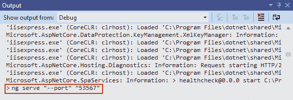
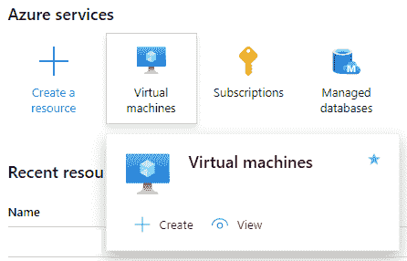
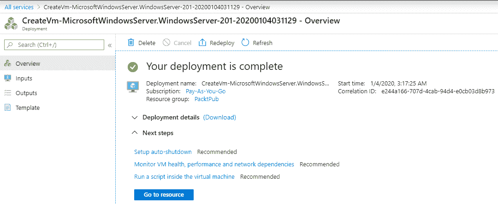
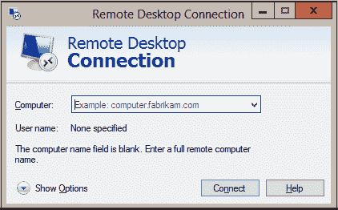
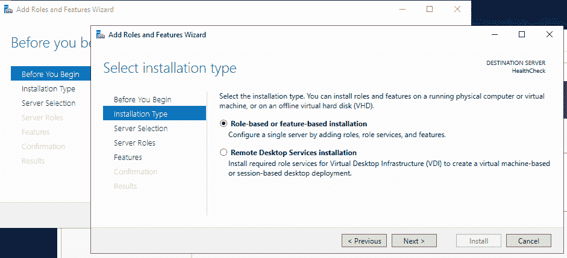
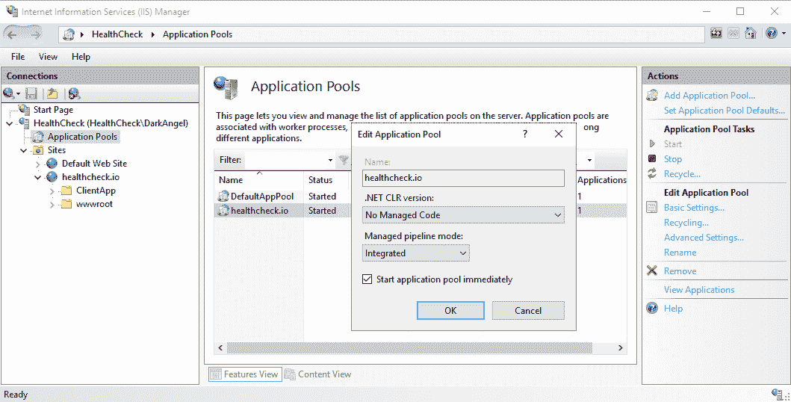
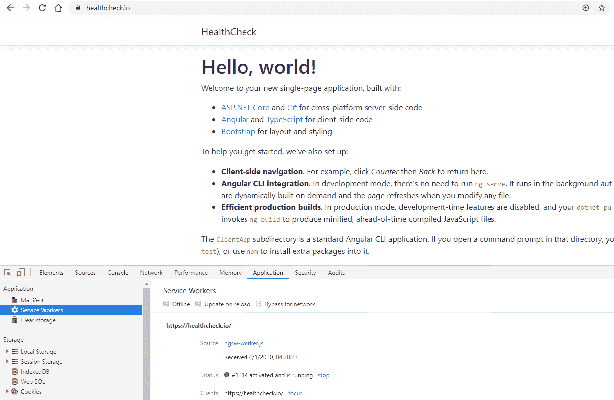
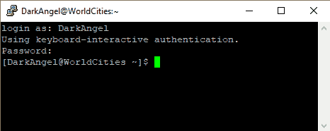
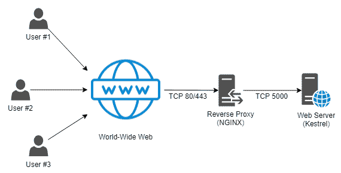
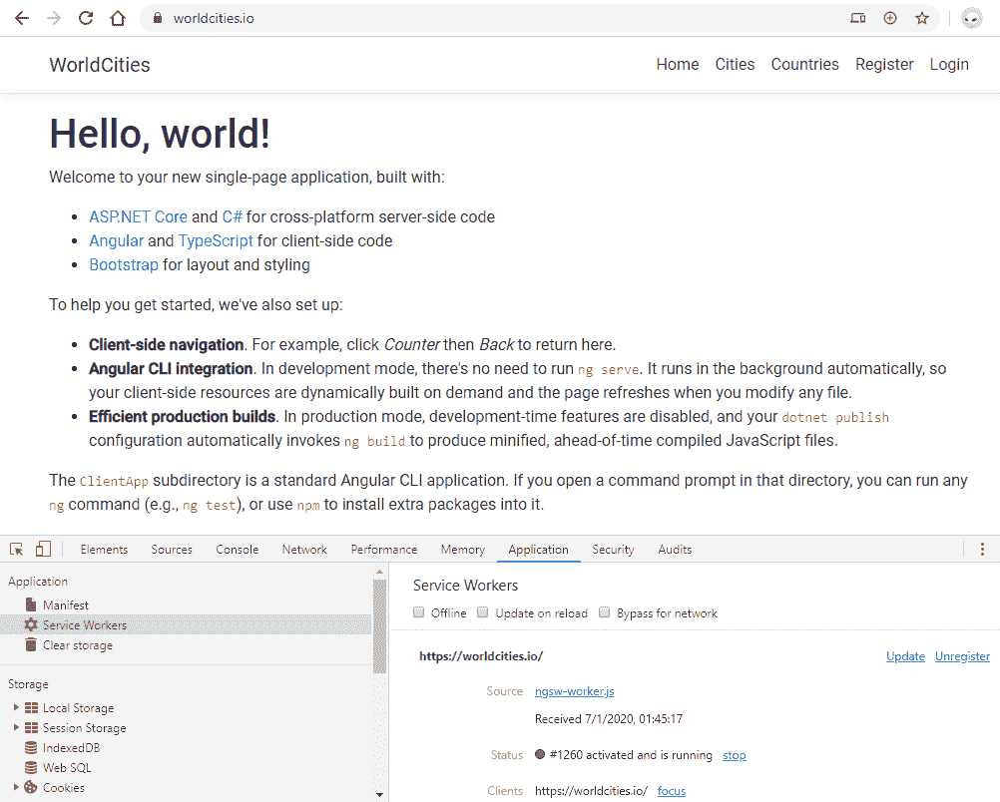

# 十二、Windows 和 Linux 部署

我们通过 ASP.NET 核心和Angular开发的宝贵旅程即将结束。自[第 1 章](01.html)、*准备就绪*-`HealthCheck`*和`WorldCities`*-*以来，我们一直在开发的 web 应用现在都是潜在的可交付产品，并且大部分都准备在合适的环境中发布，以便进行评估。*

 *在本章中，我们将讨论以下主题：

*   **准备我们的应用投入生产**，我们将学习一些有用的优化策略，将我们的应用移动到生产文件夹中
*   **Windows 部署**，我们将在这里了解如何将我们的`HealthCheck`*web 应用部署到 Windows Server 2019 环境，并使用新的进程内托管模式的 IIS 在 web 上发布*
**   **Linux 部署**，我们将在 Linux CentOS 服务器上部署`WorldCities`web 应用，并通过基于 Nginx 的代理使用 Kestrel web 服务器在 web 上发布*

 *这一漫长而雄心勃勃的章节的最终目标是学习在生产 Windows 和/或 Linux 托管服务器上部署.NET 核心和 Angular 应用所需的工具和技术，因此让我们开始这最后的工作。

# 技术要求

在本章中，我们需要*第 1 章*-*11*中列出的所有先前的技术要求，以及以下附加包：

对于 Windows 部署：

*   **互联网信息服务****IIS**（Windows 服务器）
*   **ASP.NET Core 3.1 运行时和 Windows 托管捆绑包 Win64 安装程序**（ASP.NET Core 官方网站）

对于 Linux 部署：

*   **ASP.NET Core 3.1 Linux 运行时**（百胜软件包管理器）
*   **.NET Core 3.1 CLR for Linux**（百胜软件包管理器）
*   **Nginx HTTP 服务器**（百胜软件包管理器）

和往常一样，避免直接安装它们是明智的：我们将在本章的过程中引入它们，以便在我们的项目中更好地了解它们的用途。

本章代码文件可在此处找到：[https://github.com/PacktPublishing/ASP.NET-Core-3-and-Angular-9-Third-Edition/tree/master/Chapter_12/](https://github.com/PacktPublishing/ASP.NET-Core-3-and-Angular-9-Third-Edition/tree/master/Chapter_12/) 。

# 准备生产

在本节中，我们将了解如何进一步完善应用的源代码，以便为生产使用做好准备。我们将主要处理服务器端和客户端缓存、环境配置等问题。在这里，我们将借此机会学习我们的*前端*和*后端*框架提供的一些有用的生产优化技巧。

更具体地说，我们将介绍以下内容：

*   **.NET 核心部署提示**，在这里我们将了解我们的*后端*是如何针对生产使用进行优化的
*   **Angular部署提示**，这里我们将回顾 Visual Studio 模板用于优化*前端*制作构建阶段的一些策略

让我们开始工作吧！

# .NET 核心部署提示

我们很可能已经知道，ASP.NET Core允许开发人员跨多个环境调整应用的行为：其中最常见的是开发、登台和生产环境*。*通过检查可从项目配置文件中配置和修改的环境变量，在运行时识别当前活动环境。

这个变量称为`ASPNETCORE_ENVIRONMENT`，当我们在 Visual Studio 上运行项目时，可以使用`/Properties/launchSettings.json`文件来设置它，该文件控制各种设置，这些设置将在 web 应用启动时应用于本地开发机器。

# launchSettings.json 文件

如果我们看一下`launchSettings.json`文件，我们可以看到它包含我们应用的每个执行配置文件的一些特定设置。下面是`HealthCheck`项目`/Properties/launchSettings.json`文件的内容：

```cs
{
  "iisSettings": {
    "windowsAuthentication": false,
    "anonymousAuthentication": true,
    "iisExpress": {
      "applicationUrl": "http://localhost:40082",
      "sslPort": 44334
    }
  },
  "profiles": {
    "IIS Express": {
      "commandName": "IISExpress",
      "launchBrowser": true,
      "environmentVariables": {
 "ASPNETCORE_ENVIRONMENT": "Development"
      }
    },
    "HealthCheck": {
      "commandName": "Project",
      "launchBrowser": true,
      "applicationUrl": 
        "https://localhost:5001;http://localhost:5000",
      "environmentVariables": {
 "ASPNETCORE_ENVIRONMENT": "Development"
      }
    }
  }
}
```

如我们所见，当前设置了两个执行配置文件：

*   **IIS Express 配置文件**，与 IIS Express HTTP 服务器相关。每当我们在调试模式下启动项目时，都会使用此配置文件，我们可以通过按*F5*来执行此操作（除非我们更改了默认调试行为）。
*   **HealthCheck 配置文件**，与应用本身相关。每当我们使用.NET Core CLI（换句话说，`dotnet run`控制台命令）启动应用时，都将使用此配置文件。

对于这两个变量，`ASPNETCORE_ENVIRONMENT`变量当前设置为*开发*值，这意味着我们将始终在 Visual Studio 的*开发*模式下运行应用，除非我们更改这些值。

# 开发、暂存和生产环境

不同的环境如何影响我们的 web 应用的行为？

web 应用启动后，ASP.NET Core 立即读取`ASPNETCORE_ENVIRONMENT`环境变量，并将其值存储在应用的`IWebHostEnvironment`实例的`EnvironmentName`属性中，顾名思义，该实例提供有关应用运行的 web 托管环境的信息。一旦设置，该变量可以通过编程方式直接使用，也可以与一些助手方法一起使用，以确定我们的应用在*后端*生命周期的任何时刻的行为。

我们已经在我们的.NET 核心应用的`Startup`类中看到了这些方法的作用。例如，我们可以在`HealthCheck``Startup.cs`源代码中找到以下内容：

```cs
// ...

if (env.IsDevelopment())
{
    app.UseDeveloperExceptionPage();
}
else
{
    app.UseExceptionHandler("/Error");
    // The default HSTS value is 30 days. You may want to change this
    // for production scenarios, see https://aka.ms/aspnetcore-hsts.
    app.UseHsts();
}

// ...
```

在前面的几行中，`Startup`类的`Configure()`方法的一部分，我们告诉我们的应用有条件地使用以下内容：

*   在开发环境中运行时的开发人员异常页面
*   舞台和生产环境中的定制`ExceptionHandler`中间件

这基本上意味着，每当我们的.NET 核心应用崩溃时，它都会有条件地显示以下内容：

*   给开发人员的低级/详细错误消息（如异常信息和堆栈跟踪）
*   向最终用户发送的高级/通用不可用消息

The developer exception page includes a detailed series of useful information about the exception and the request, such as exception and inner exception(s), stack trace, query string parameters, cookies, and HTTP headers.

For additional information about this, and error handling in ASP.NET Core in general, visit the following URL:

[https://docs.microsoft.com/en-us/aspnet/core/fundamentals/error-handling](https://docs.microsoft.com/en-us/aspnet/core/fundamentals/error-handling)

从中，我们还可以看到我们的应用在生产环境中执行时，将如何设置 30 天的**HTTP 严格传输安全性**（**HSTS**）最大年龄头值。这种行为符合一些良好的 HTTP 安全实践，因此在应用公开面向 web 时非常可取，在调试过程中通常是无用的（并且可能是一种障碍），这就是为什么没有设置它的原因。

此外，在下面几行，我们可以找到以下代码：

```cs
// ...

if (!env.IsDevelopment())
{
    app.UseSpaStaticFiles(new StaticFileOptions()
    {
        ContentTypeProvider = provider
   });
}

// ...
```

这是我们应用的另一个关键结构点，我们在[第 2 章](02.html)*环顾*中简要提到过，当时我们第一次看到.NET Core 的`Startup`类。

`UseAngularCliServer()`方法将把所有发往 Angular 应用的请求传递给 Angular CLI 服务器的内存实例（`ng serve`。对于大多数开发场景来说，这种方法无疑是可行的，因为它将确保我们的应用能够提供最新的 CLI 构建资源；但是，对于生产场景来说，它并不是那么好，在生产场景中，这些文件不会发生更改，可以使用 Angular CLI（`ng build`生成的静态文件提供服务，而不会浪费服务器的 CPU 和内存资源。

# 经验法则

既然我们已经了解了如何以编程方式确定 web 应用的执行环境并使 HTTP 管道相应地工作，那么我们应该学习如何正确地采用和调整这些有条件的实践，以最适合这些环境。

由于开发环境只对开发人员可用，因此它应该始终支持调试功能而不是性能。因此，它应该避免缓存，使用内存加载策略快速响应更改，并发出尽可能多的诊断信息（日志、异常等），以帮助开发人员及时了解发生了什么。

If we remember what we said in [Chapter 9](09.html), *ASP.NET Core and Angular Unit Testing,* regarding **Test-Driven Development** (**TDD**), we should easily understand how the development environment is where the TDD practice mostly shines.

相反，在处理生产环境时，做出这些决策的一个好方法是应用以下经验法则：

*   **尽可能打开缓存**以节省资源和提高性能
*   **确保所有客户端资源**（JavaScript、CSS 文件等）都已绑定、缩小，并可能由**内容交付网络**（**CDN**提供服务
*   **关闭诊断错误页面**和/或替换为友好的、人类可读的错误页面
*   **使用应用性能管理工具或其他实时监控、审核和看门狗策略启用生产日志记录和监控**
*   **实现框架提供的最佳安全实践**，如采用**开放式 Web**
*   **实施开放式 Web 应用安全项目**（**OWASP**）的软件开发方法，以及网络、防火墙和服务器配置

这些是我们在改进 web 应用的*后端*部分以供生产使用时应始终认真考虑的一般准则（或良好实践）。

那么暂存环境呢？事实上，它主要用作预生产环境，我们可以在批准生产部署之前执行（或让一些测试人员执行）我们的*前端*测试。理想情况下，其物理特性应反映生产的物理特性，以便生产中可能出现的任何问题都首先出现在登台环境中，在登台环境中可以解决这些问题，而不会影响用户。

Again, if we think back to our behavior-driven development analysis back in [Chapter 9](https://cdp.packtpub.com/asp_net_core_3_and_angular_7___third_edition/wp-admin/post.php?post=563&action=edit#post_47),* ASP.NET Core and Angular Unit Testing*, we can definitely acknowledge that the staging environment would be the perfect place to test for the expected behavior of any newly added feature of our apps before releasing them into production.

# 在生产中设置环境

当我们发布用于生产部署的 web 应用时，`ASPNETCORE_ENVIRONMENT`变量会发生什么变化，就像我们在[第 11 章](11.html)、*渐进式 web 应用、*中为`HealthCheck`和`WorldCities`应用配置基于文件夹的发布配置文件时所做的那样？

通过查看这些文件夹，我们可以看到，`launchSettings.json`文件在那里找不到，因为它没有被发布。这当然是意料之中的，因为它只适用于 VisualStudio 和其他本地开发工具。

每当我们在生产服务器上托管应用时，我们都必须使用以下方法之一手动设置该值：

*   一个同名的专用**环境变量**
*   具体**平台设置**
*   一个**命令行**开关

这些方法强烈依赖于服务器的操作系统。在接下来的部分中，我们将了解如何在 Windows 和 Linux 服务器上执行这些操作。

It's important to remember that the environment, once set, can't be changed while the web app is running.

如果未找到与环境相关的设置，web 应用将始终使用生产值作为默认值，这是性能和安全性方面最保守的选择，因为大多数调试功能和诊断消息将被禁用。

相反，如果多次设置环境（例如通过环境变量和命令行开关），应用将使用上次读取的环境设置，从而遵循级联规则。

# ASP.NET 核心部署模式

在[第 11 章](11.html)*渐进式网络应用*中，当我们创建第一个发布配置文件以将我们的应用部署到本地文件夹时，我们没有更改**部署模式**设置，保持原样。说实话，我们这样做是因为它不会有任何区别，因为我们使用该构建只是为了*窃取*一些与 PWA 相关的生成文件，并使用它们从标准 Visual Studio 调试运行中注册我们的服务人员。

然而，.NET 核心部署模式是一个非常重要的配置功能，我们必须了解它，以便在需要部署应用以供生产使用时做出正确的选择。

现在，让我们尝试了解 Visual Studio for.NET 核心应用提供的三种不同类型的部署：

*   **框架依赖部署**（**FDD**）：顾名思义，这种部署模式需要存在.NET 核心框架，必须在目标系统上安装并可用；换句话说，只要宿主服务器支持.NET 核心，我们就将构建一个可移植的.NET 应用。
*   **自包含部署****SCD**：此部署模式不依赖目标系统上是否存在.NET 组件。所有组件，包括.NET 核心库和运行时，都将包含在生产构建中。如果托管服务器支持.NET Core，则该应用将以隔离模式运行，将自身与其他.NET Core 应用分离。SCD 部署版本将包括一个可执行文件（Windows 平台上的.exe 文件）以及一个包含应用运行时的.dll 文件。
*   **依赖于框架的可执行文件**（**FDE**）：此部署模式将生成一个可执行文件，该文件将在托管服务器上运行，托管服务器必须安装.NET 核心运行时。因此，这种模式与 FDD 非常相似，因为它们都依赖于框架。

现在让我们试着了解每种部署模式的优缺点。

# 依赖于框架的部署利弊

使用 FDD 模式为开发人员提供了许多优势，包括：

*   **平台独立性**：无需定义目标操作系统，因为安装在托管服务器上的.NET Core 运行时将无缝处理应用的执行，无论其平台如何。
*   **小软件包大小**：部署包将很小，因为它只包含应用的运行时和第三方依赖项。NET Core 本身不会出现，因为我们希望它在设计时已经出现在目标机器上。
*   **最新版本**：根据其默认设置，FDD 将始终使用目标系统上安装的最新服务运行时，以及所有最新的安全补丁。
*   **在多主机场景下性能更好**：如果主机服务器安装了多个.NET 核心应用，共享资源将使我们能够节省一些存储空间，最重要的是，减少内存使用。

然而，这种部署模式也有一些弱点，包括：

*   **兼容性降低**：我们的应用将需要一个.NET 核心运行时，其版本与我们的应用（或更高版本）使用的版本兼容。如果托管服务器停留在以前的版本，我们的应用将无法运行。
*   **稳定性问题**：如果.NET 核心运行时和/或库改变了它们的行为（换句话说，如果它们由于安全或许可原因发生了破坏性的更改或兼容性降低），我们的应用可能也会受到这些改变的影响。

# 自包含部署的优点和缺点

使用 SCD 模式有两大优势，这两大优势很容易超过某些特定场景的劣势：

*   **完全控制已发布的.NET 核心版本**，无论托管服务器上安装了什么（或将来会发生什么）
*   **没有兼容性问题**，因为捆绑包中提供了所有必需的库

不幸的是，还有一些相关的缺点：

*   **平台依赖性**：能够为.NET 核心运行时提供生产包需要开发人员提前选择目标构建平台。
*   **增加的捆绑包大小**：增加.NET Core 肯定会在磁盘空间需求方面付出代价。如果我们计划将多个 SCD.NET 核心应用部署到一台托管服务器上，这将是一个巨大的打击，因为每一个应用都需要大量的磁盘空间。

# 依赖于框架的可执行文件的优点和缺点

.NET Core 2.2 中引入了 FDE 部署模式，从 3.0 版开始，它是基本`dotnet publish`命令的默认模式（如果未指定选项）。这种新方法具有以下优点：

*   **封装尺寸小**、**最新版本**、**多主机场景下性能更好**，与 FDD 模式类似。
*   **易运行**：部署的可执行文件可以直接启动执行，无需调用**dotnet**CLI。

这种方法也有一些缺点：

*   **兼容性降低**：与 FDD 一样，该应用需要一个.NET 核心运行时，其版本与我们的应用（或更高版本）使用的版本兼容。
*   **稳定性问题**：同样，如果.NET 核心运行时和/或库更改其行为，这些更改可能会破坏应用或改变其行为。
*   **平台依赖性**：由于 app 是一个可执行文件，必须针对不同的目标平台发布。

正如我们很容易猜测的那样，这三种部署模式可能是好的，也可能是坏的，这取决于许多因素，例如我们对部署服务器的控制程度、我们计划发布多少.NET 核心应用以及目标系统的硬件和软件功能。

一般来说，只要我们有权在部署服务器上安装和更新系统包，FDD 模式就应该可以正常工作；相反，如果我们在没有我们想要的.NET 核心运行时的云托管提供商上托管我们的应用，SCD 可以说是最合乎逻辑的选择。可用磁盘空间和内存大小也将发挥重要作用，特别是如果我们计划发布多个应用。

也就是说，我们将使用 FDD（默认）部署模式，因为我们当前的场景需要在同一服务器上发布两个不同的应用，它们共享相同的.NET 核心版本。

# Angular展开尖端

现在，让我们将目光转向*前端*，以正确理解用于构建两个应用的 Visual Studio 模板如何处理 Angular 的生产部署任务。

不言而喻，我们为*后端*确定的相同良好实践在*前端*也保留了它们的价值，我们将在短时间内看到这一点。换言之，业绩和安全仍然是这方面的主要目标。

现在，让我们尝试了解 Angular CLI 是如何处理应用的发布和部署任务的，它由新的编译和渲染管道 Ivy 提供支持。

# ng serve、ng build 和 package.json 文件

我们应该已经知道，每当我们在 VisualStudio 中点击*F5*时，Angular 应用都会使用 Angular CLI 服务器的内存实例提供服务。这样的服务器由 VisualStudio 使用`ng serve`命令启动。

如果我们在 web 浏览器启动之前的初始调试阶段查看 Visual Studio 输出窗口，我们可以在以下屏幕截图中清楚地看到它：



相反，当我们使用发布配置文件部署应用进行生产时，VisualStudio 使用带有`--prod`标志的`ng build`命令：


这两个命令都可以在`/ClientApp/package.json`文件中找到，在那里我们可以修改或配置它们以满足我们的需要，即使默认设置已经适合开发和生产部署。

Visual Studio 添加到`ng build`命令的`--prod`标志激活了许多有用的优化功能，包括以下功能：

*   **提前****AOT****编译**：将 HTML 和 TypeScript 代码转换成高效的 JavaScript 代码，以便在浏览器中提供更快的渲染；默认模式（用于`ng serve`且`--prod`标志未启用时）称为**即时**（**JIT**编译），在运行时在浏览器中编译应用，因此是一种速度较慢、优化程度较低的替代方案
*   **生产模式**：通过禁用某些特定于开发的检查，例如双更改检测周期，可以加快应用的运行速度
*   **捆绑**：将各种应用和第三方文件（NPM 包）连接成几个捆绑包
*   **缩小**：这将删除 HTML、JS 和 CSS 文件中的空白、注释、可选标记以及任何不必要的字符和工件
*   **Uglification**：这会在内部重写 JavaScript 代码，以缩短变量和函数名，使其无法读取，同时也会使恶意的反向工程尝试更加困难
*   **死代码清除**：删除任何未引用的模块和/或未使用的代码文件、片段或节

正如我们所看到的，前面的所有功能都旨在提高生产构建的性能和安全能力。

# 差动加载

另一个值得一提的特性是差异加载，它是在 Angular 8 中引入的。我们没有将它添加到前面的`--prod`交换机优化好处列表中，因为它默认存在，因此不限于该交换机的使用。

差异加载是 Angular 解决各种浏览器之间兼容性问题的方法，尤其是旧浏览器；换句话说，那些仍然基于旧版本的 JavaScript。

通过查看`/ClientApp/tsconfig.json`文件，我们可以看到，我们的 TypeScript 代码将被传输并绑定到*ES2015*，也称为*ECMAScript 2015*、*ECMAScript version 6、*或*ES6、*JavaScript 语法中，该语法与绝大多数现代浏览器兼容。但是，仍然有一些用户使用旧客户端，例如旧台式机、笔记本电脑和/或移动设备，这些用户仍然绑定到**ES5*和早期版本。*

 *为了解决这个问题，Angular 的早期版本以及大多数其他*前端*框架提供了大量支持库（称为 polyfills），这些库会有条件地为那些本机不支持它们的浏览器实现缺失的功能。不幸的是，这样的解决方案极大地增加了产品包，从而导致所有用户的性能下降，包括那些使用现代浏览器的用户，这些浏览器一开始就不需要这些多边形填充。

差异加载通过在构建阶段生成两个单独的捆绑包集来解决此问题：

*   第一个包包含应用的代码，该代码已使用现代 ES2015 语法进行了传输、缩小和丑陋化。这样的束装运的多边形填充更少，因此尺寸更小。
*   第二个包包含以旧 ES5 语法传输的相同代码，以及所有必要的多边形填充。不用说，这个捆绑包的特点是捆绑包的大小要大得多，但它正确地支持较旧的浏览器。

可以通过更改两个文件来配置差异加载功能：

*   `/ClientApp/browserlist`文件，其中列出了我们的应用支持的最低浏览器
*   `/ClientApp/tsconfig.json`文件，它确定代码编译到的 ECMAScript 目标版本

通过考虑这两种设置，Angular CLI 将自动确定是否启用差异加载功能。

在我们的特定场景中，这样一个功能被启用，我们可以通过查看我们应用的 production deploy 文件夹中生成的`index.html`文件的`<body>`部分看到（相关部分突出显示）：

```cs
<!-- ... -->

<body>
  <app-root>Loading...</app-root>
 <script src="runtime-es2015.e59a6cd8f1b6ab0c3f29.js"
   type="module"></script>
 <script src="runtime-es5.e59a6cd8f1b6ab0c3f29.js" nomodule
   defer></script>
 <script src="polyfills-es5.079443d8bcab7d711023.js" nomodule
   defer></script>
 <script src="polyfills-es2015.58725a5910daef768ca8.js"
   type="module"></script>
 <script src="main-es2015.fc7dc31b264662448f17.js"
   type="module"></script>
 <script src="main-es5.fc7dc31b264662448f17.js" nomodule
   defer></script>
</body>

<!-- ... -->
```

这样的策略非常有效，因为它将允许我们的 Angular 应用支持多个浏览器，而不会迫使我们的*现代*用户检索所有不必要的捆绑包。

# angular.json 配置文件

`npm serve`和`npm build`之间最重要的区别在于后者是将生成的构建工件实际写入输出文件夹的唯一命令：这些文件是使用 webpack 构建工具构建的，可以使用`/ClientApp/src/angular.json`配置文件进行配置

输出文件夹也设置在该文件中，更准确地说，设置在项目|[projectName]|架构师|构建|选项|输出路径部分。在我们的示例应用中，它是`dist`文件夹，这意味着它们将部署在`/ClientApp/dist/`文件夹中。

# 自动部署

Angular 8.3.0 引入了新的`ng deploy`命令，该命令可用于将 Angular 应用部署到一个可用的生产平台上，这要感谢一些第三方建设者，他们可以使用`ng add`安装 Angular 应用。

以下是撰写本文时支持的构建器列表：

*   `@angular/fire`（火基）
*   `@azure/ng-deploy`（微软 Azure）
*   `@zeit/ng-deploy`（ZEIT Now）
*   `@netlify-builder/deploy`（Netlify）
*   `angular-cli-ghpages`（GitHub 页面）
*   `ngx-deploy-npm`（NPM）

尽管 Visual Studio 尚不支持`ng deploy`CLI 选项，但使用可在`angular.json`文件的*部署*部分中配置的一些预设立即部署我们的应用可能非常有用。此类节在我们项目的`angular.json`文件中不可用，但在使用`ng add`CLI 命令（及其相应的默认设置）安装之前的一个项目后，它将自动添加。

# CORS 政策

我们已经在[第 11 章](11.html)、*渐进式 Web 应用*中讨论了**交叉请求资源共享**（**CORS**，当我们通过 ping 由我们托管的本地`.txt`文件而不是第三方 URL 来更改`ng-connection-service``heartbeatUrl`默认设置时。由于这一修改，我们的两个应用都不会面临 CORS 错误，因为它们只会向我们的.NET 核心*后端*发出 HTTP 请求，该后端可能托管在同一台服务器中，因此具有相同的 IP 地址/主机名。

但是，我们可能希望将来移动*后端*，或者向其他远程服务（多个*后端*系统和/或存储）添加一些额外的 HTTP 调用。如果我们计划这样做，那么在客户端级别我们就无能为力。我们需要对目标服务器实施合适的 CORS 策略。

For additional information regarding CORS and instructions on how to enable it for specific servers, go to:
[https://enable-cors.org](https://enable-cors.org).

幸运的是，我们不需要为即将介绍的 Windows 和 Linux 部署场景实施任何特定于 CORS 的策略。

# Windows 部署

在本节中，我们将学习如何在 Microsoft Azure 上托管的 Windows 2019 数据中心版服务器上部署我们的`HealthCheck`**web 应用。**

 **下面是我们要做的：

*   **使用 Windows 2019 数据中心版模板在 MS Azure**上创建新 VM，并将其配置为接受到 TCP 端口 3389（用于远程桌面）和 443（用于 HTTPS）的入站呼叫
*   **通过下载和/或安装所有必要的服务和运行时来配置 VM**以托管`HealthCheck`应用
*   **将 HealthCheck 应用**发布到我们刚刚设置的 web 服务器上
*   **从远程客户端测试 HealthCheck 应用**

让我们开始工作吧！

In this deployment example, we're going to set up a brand new VM on the MS Azure platform, which requires some additional work; those users who already have a production-ready Windows server should likely skip the paragraphs related to the VM setup and go directly to the publishing topics.

# 在 MS Azure 上创建 Windows Server 虚拟机

如果我们还记得我们在[第 4](04.html)*章【实体框架核心数据模型】*中通过 MS Azure 的旅程，当我们在那里部署 SQL 数据库时，我们应该已经为我们将要做的事情做好了准备：

*   **访问微软 Azure 门户**
*   **添加并配置新 VM**
*   **设置入站安全规则**从互联网访问云主机。

让我们这样做。

# 访问 MS Azure 门户

像往常一样，让我们从访问以下 URL 开始，它将把我们带到 MS Azure 网站：[https://azure.microsoft.com/](https://azure.microsoft.com/en-us/free/services/sql-database/)

同样，我们可以使用已经存在的 MS Azure 帐户登录，也可以创建一个新帐户（如果我们还没有使用免费的 30 天试用版，可能会利用这个机会）。

Refer to [Chapter 4](04.html)*, Data Model with Entity Framework Core*, for additional information on creating a free MS Azure account.

一旦我们创建了账户，我们就可以转到[https://portal.azure.com/](https://portal.azure.com/) 访问 MS Azure 管理门户，在那里我们可以创建新的虚拟机。

# 添加和配置新 VM

登录后，单击虚拟机图标（请参阅以下屏幕截图）：



在下一页中，单击添加（位于页面左上角附近）以访问创建虚拟机面板。

“创建虚拟机”面板基本上是一个详细的向导，允许我们从头开始配置新的 VM。各种配置设置分为多个面板，每个面板专用于一组特定的功能，如以下屏幕截图所示：


以下是各种设置面板的简要摘要：

*   基础：**订阅类型、VM 名称、部署区域、映像、登录凭据等**
***   磁盘：为虚拟机提供的 HDD/SDD 的数量和容量*   网络：与网络相关的配置设置*   管理：监控功能、自动关机功能、备份等*   高级：附加配置、代理、脚本、扩展等*   标记：这些允许一些名称-值对，这些名称-值对可用于对要设置的各种 MS Azure 资源进行分类**

 **在我们当前的场景中，我们只需稍微修改前四个选项卡，将其余选项卡保留为默认设置。

*   在“基本”选项卡中：
*   资源组：使用与 SQL 数据库相同的资源组（或创建一个新的资源组）。
*   虚拟机名称：使用`HealthCheck`（或任何其他合适的名称）。
*   地区：选择离我们地理位置最近的地区。
*   可用性选项：无需基础架构冗余。
*   图像：在我们的示例中，我们将使用 WindowsServer2019 数据中心默认图像；也可以随意使用它或选择另一个。
*   Azure Spot 实例：否。
*   **大小**：标准 B1ms（1 个 VCPU，2 个 GiB 内存）。如果我们愿意花更多的钱，请随意选择不同的尺寸：B1ms 是一款入门级机器，具有非常有限的资源集，足以满足此部署示例，但在生产中性能不佳。
*   **管理员账号**：选择密码认证类型，然后创建合适的用户名和密码集。请记住在一个安全的地方写下这些，因为我们肯定需要这些凭证来访问我们的机器。
*   **公共入站端口**：无（目前，我们稍后将以更安全的方式进行设置）。
*   在“磁盘”选项卡中：
*   操作系统磁盘类型：选择*标准硬盘；*这是最便宜的选择。
*   数据盘：为操作系统创建一个新的*标准 HDD*（或者高级 SSD，如果我们愿意支付额外费用的话）磁盘，不需要额外的数据盘。
*   在“网络”选项卡中：
*   虚拟网络：选择用于 SQL 数据库的同一个 VNET（或创建一个新的 VNET）。
*   在“管理”选项卡中：
*   监控|引导诊断：关闭。

完成后，单击 Review+create 按钮查看配置设置并启动 VM 部署过程。

在流程结束时，我们将看到一个屏幕截图，大致如下所示：



在这里，我们可以点击**G****o 到资源**按钮，进入*虚拟机*概览面板

# 设置入站安全规则

进入设置|网络选项卡，记录机器的公共 IP 地址；我们很快就会需要这个。完成后，添加以下入站安全规则：

*   **TCP 和 UDP 端口 3389**，以便我们能够使用远程桌面访问机器
*   **TCP 端口 443**，用于从互联网访问 HTTP 服务器（以及我们的`HealthCheck`web 应用）

对于此部署测试，强烈建议将对这些入站规则的访问限制为安全的**源 IP 地址**（或地址范围），该地址可以设置为静态 IP 地址或 ISP 的 IP 掩码。这样的设置将确保没有第三方能够尝试远程桌面访问或访问我们的 web 应用。

以下屏幕截图描述了 Azure VM 门户上的添加入站安全规则面板，单击相应按钮时将打开该面板：


现在，我们应该能够通过开发系统的标准远程桌面连接访问我们的新 VM。

# 配置虚拟机

TCP 端口 3389 打开后，我们可以从本地基于 Windows 的开发机器启动远程桌面连接内置工具。键入 Azure VM 的公共 IP 地址，然后单击连接以启动与远程主机的 RDC 会话：



如果入站安全规则已正确配置，我们应该能够连接到新 VM 的桌面，并设置 VM 以服务于 ASP.NET 核心和 Angular`HealthCheck`web 应用。执行此操作需要一系列配置任务，这些任务将在下一节中描述。

我们将在下一节中讨论的第一步是安装**互联网信息服务（IIS）**，这是一个灵活、安全且可管理的 HTTP 服务器，我们将使用它在 web 上托管我们的 ASP.NET 核心和 Angular 应用。

For obvious reasons of space, we're not going to talk about IIS or explore its functionalities. For additional information regarding this, check out the following URL:
[https://www.iis.net/overview](https://www.iis.net/overview).

# 添加 IIS web 服务器

通过远程桌面连接后，我们可以访问控制面板|程序和功能|打开和关闭 Windows 功能（或服务器管理器仪表板中的添加角色和功能向导），将 IIS 安装到 VM，如以下屏幕截图所示：



从各种可用角色中，选择 Web 服务器（IIS），如以下屏幕截图所示。确保选中“包括管理工具”复选框，然后单击“添加功能”开始安装：


在安装阶段结束之前，无需更改任何内容，默认设置对于我们的部署场景来说可以正常工作。

# 安装 ASP.NET 核心 Windows 托管捆绑包

一旦安装了 IIS，我们就可以继续下载并安装**ASP.NET 核心运行时**。

It's strongly advisable to install the ASP.NET Core runtime after installing IIS because the package bundle will perform some modifications to the IIS default configuration settings.

要下载 ASP.NET 核心运行时，请访问以下 URL:[https://dotnet.microsoft.com/download/dotnet-core/3.1](https://dotnet.microsoft.com/download/dotnet-core/3.1)

请务必为**Windows x64**选择**ASP.NET Core 3.1.1 Runtime–Windows 主机包安装程序**包，如以下屏幕截图所示：


这样的捆绑包包括.NET Core 运行时、ASP.NET Core 运行时和 ASP.NET Core IIS 模块，以及从 VM 运行.NET Core 和 Angular 应用所需的一切。

# 在 ASP.NET 核心运行时安装后重新启动 IIS

ASP.NET 核心运行时安装过程完成后，强烈建议发出停止/启动命令以重新启动 IIS 服务。

为此，请打开具有管理权限的命令提示符窗口，并执行以下控制台命令：

```cs
> net stop was /y
> net start w3svc
```

这些命令将允许 IIS 获取 Windows 主机包安装程序对系统`PATH`所做的更改。

# 发布和部署 HealthCities 应用

现在，我们必须找到发布`HealthCities`应用并将其部署到服务器的方法。为此，有许多备选方案，包括：

*   使用我们现有的**文件夹发布配置文件**，然后以某种方式将文件复制到 web 服务器。
*   在我们的 web 服务器上安装 FTP/FTPS 服务器，然后设置**FTP 发布配置文件。**
*   使用 Visual Studio 的**Azure 虚拟机发布配置文件。**

后者可以说是最明显的选择。然而，只要我们能妥善处理，其他替代方案也很好。

# 文件夹发布配置文件

由于我们在[第 11 章](11.html)*中创建了**文件夹发布配置文件**，渐进式 Web 应用*，因此我们也将在这里使用它。

如果我们想创建一个新的，下面是我们需要做的：

1.  选择文件夹选项（或选择上一个发布配置文件）。
2.  指定将包含已发布应用的文件夹的路径。
3.  单击“创建配置文件”按钮以创建配置文件。
4.  单击发布按钮将我们的`HealthCheck`应用部署到所选的本地文件夹。

Visual Studio will suggest a path located within the application's `/bin/Release/` subfolder; we can either use this or choose another folder of our choice.

否则，我们只需单击现有配置文件的“发布”按钮，就可以通过这种方式完成工作。

发布任务完成后，我们可以将整个`HealthCheck`文件夹复制到远程 VM 的`C:\inetpub\`**文件夹中。一个简单的方法是使用远程桌面资源共享功能，它允许从远程实例访问本地硬盘。**

 **# FTP 发布配置文件

如果我们的 web 服务器可以接受 FTP（或 FTPS）连接，那么发布我们的项目的合适替代方式是创建基于 FTP 的*发布配置文件*，该文件将使用 FTP/FTPS 协议自动将我们的 web 项目上传到我们的 web 服务器。

If we don't want to use the built-in FTP server provided by Windows Server, we can install a third-party FTP server, such as Filezilla FTP Server, a great open source alternative that comes with full FTPS support. You can find Filezilla FTP Server at the following URL:

[https://filezilla-project.org/download.php?type=server](https://filezilla-project.org/download.php?type=server) [](https://filezilla-project.org/download.php?type=server) 

为了使用 FTP 发布配置文件，我们还需要通过添加另一个入站安全规则来打开 VM 的 TCP 端口 21（或另一个非默认端口），就像我们对端口 443 和 3389 所做的那样。

我们需要做的就是使用 IIS 将 FTP 目标文件夹链接到一个新的网站项目，我们将能够实时发布/更新我们的网站，因为发布任务完成后，所有内容都将立即联机。

As we said earlier, we're doing all this assuming that we have a web server accessible through FTP or that we're willing to install an FTP server. If that's not the case, we might as well skip this paragraph and use a different publishing profile, such as Azure Virtual Machine or Folder.

要设置 FTP 发布配置文件，请选择 IIS、FTP 和其他图标，等待类似向导的模式窗口出现，然后选择以下选项：

*   **发布方式**：选择 FTP。
*   **服务器**：指定 FTP 服务器 URL，如`ftp.our-ftp-server.com`。
*   **站点路径**：从 FTP 服务器根目录插入目标文件夹，如`/TestMakerFree/`。我们还可以避免斜杠，因为该工具将自动处理它们。
*   **被动模式、用户名、密码**：根据我们的 FTP 服务器设置和给定凭证设置这些值。如果要让 Visual Studio 存储密码，请激活“保存密码”，这样就不必在每次发布尝试时都写入密码。
*   **目标 URL**：使用默认浏览器发布任务成功结束后，将自动启动此 URL。将其设置为 web 应用的基本域（如`www.our-website-url.com`）或将其留空通常是明智的。

完成后，单击 Validate Connection（验证连接）按钮检查前面的设置，并确保我们能够通过 FTP 访问服务器。如果我们没有，那么最好执行全面的网络检查，查找防火墙、代理、防病毒软件或其他可以阻止建立 FTP 连接的软件。

# Azure 虚拟机发布配置文件

**Azure 虚拟机**发布配置文件是实施**连续集成**和**连续交付**（**CI**/**CD**）DevOps 模式的一种很好的方式，因为它要么充当构建系统（用于生成包和其他构建工件）或者发布管理系统来部署我们的更改

要使用它，请选择**Azure 虚拟机**选项，单击浏览，然后选择我们刚才创建的 VM（请参见以下屏幕截图）：


但是，为了做到这一点，我们需要对 VM 执行一些额外的配置更改，包括以下内容：

*   安装 WebDeploy 服务工具（就像我们在早期对 IIS 所做的那样）
*   打开 80 和 8172 个 TCP 端口（就像我们刚才对 443 和 3389 所做的那样）
*   为虚拟机设置全局唯一的 DNS 名称：这可以从我们虚拟机的 MS Azure portal 概览页面（DNS 名称属性）完成

由于空间的原因，我们将不进行这些设置。但是，有关上述任务的更多信息，请查看以下指南：[https://github.com/aspnet/Tooling/blob/AspNetVMs/docs/create-asp-net-vm-with-webdeploy.md](https://github.com/aspnet/Tooling/blob/AspNetVMs/docs/create-asp-net-vm-with-webdeploy.md)

完成这些设置后，我们将能够以无缝和透明的方式将 web 应用发布到 VM。

# 配置 IIS

既然我们的 web 应用的文件已经复制到服务器，我们需要配置 IIS 来发布它

在本节中，我们将配置 IIS 服务，使其使用进程内托管模型为我们的`HealthCheck`web 应用提供服务，该模型自 ASP.NET Core 2.2 以来就已提供，与以前的进程外模型相比有了显著改进。

为了快速总结两种托管模型之间的差异，我们可以说：

*   在**进程外**托管模型中，IIS 将 HTTP 请求代理给 ASP.NET Core Kestrel 服务器，该服务器使用不同的 TCP 端口（仅供内部使用）直接为应用服务：换句话说，IIS 充当反向代理。
*   在**进程中**托管模型中，ASP.NET 核心应用托管在 IIS 应用池中；因此，所有 HTTP 请求都由 IIS 直接处理，无需代理到运行.NET 核心本机 Kestrel web 服务器的外部`dotnet.exe`实例。

事实上，进程内模型根本不使用 Kestrel，而是使用直接托管在 IIS 应用池中的新 Web 服务器实现（`IISHttpServer`来替代它。因此，我们可以说，这个新模型在某种程度上类似于我们从 ASP.NET 版本 1.x（然后是 2.x，直到 4.x）开始使用的经典 ASP.NET 托管模型。

进程内模型是 ASP.NET Core 3.1 项目的默认方法，在为 ASP.NET Core web 应用提供服务时，它通常是一种更好的方法，为我们提供以下好处：

*   它提供了更好的性能，因为它不使用 Kestrel，而是依赖于直接与 IIS 请求管道接口的自定义`IISHttpServer`实现
*   它的资源密集度较低，因为它避免了 IIS 和 Kestrel 之间额外的网络跳跃

在下一节中，我们将看到如何正确配置它。

# 添加 SSL 证书

由于我们的应用将使用 HTTPS 提供服务，因此我们有两种选择：

*   从第三方经销商处购买并安装 SSL 证书。
*   创建一个自签名的。

对于实际的生产场景，我们绝对应该遵循前一条路径：然而，在我们的部署示例中，我们将采用自签名路径，它提供了一种更快（且无成本）的替代方案来实现我们的目标。请遵循以下步骤：

1.  打开 Internet Information Services（IIS）Manager 桌面应用，从左侧树状视图中选择`HealthCheck`节点，然后单击服务器证书图标，如下图所示：


2.  进入“服务器证书”面板后，单击右侧“操作”列中的“创建自签名证书”链接。
3.  将出现一个模式窗口（请参见下面的屏幕截图），要求我们为证书指定一个友好的名称。键入`healthcheck.io`，选择个人证书存储，然后单击“确定”创建自签名证书：


完成后，我们最终可以将`HealthCheck`网站条目添加到 IIS 中。

# 添加新的 IIS 网站条目

从 Internet 信息服务（IIS）管理器主页面，右键单击`HealthCheck`根节点并选择添加网站选项以创建新网站。

填写添加网站模式窗口，如以下屏幕截图所示：


以下是最相关设置的摘要：

*   站点名称：`healthcheck.io`
*   物理路径：`C:\inetpub\HealthCheck`（复制开发机器本地部署文件夹的路径）
*   绑定类型：https
*   IP 地址：全部未分配
*   端口：``443``
*   主机名：`healthcheck.io`
*   需要服务器名称指示：是
*   禁用 HTTP/2：否
*   禁用 OCSP 装订：否
*   SSL 证书：`healthcheck.io`（我们刚才创建的自签名证书）
*   立即启动网站：是

完成后，单击“确定”添加新网站：`HealthCheck/Sites`文件夹右侧的树状视图中将显示一个新的`healthcheck.io`条目。

# 配置 IIS 应用池

您可能已经知道，IIS 服务在一个或多个应用池下运行各种配置的网站。每个配置的应用池将产生一个专用的`w3wp.exe`Windows 进程，该进程将用于为所有配置为使用它的网站提供服务。

根据我们需要托管的各种网站的发布要求，我们可以在几个应用池（甚至单个应用池）中运行所有网站，或者每个应用池都有自己的应用池。不用说，共享同一应用池的所有网站也将共享其各种设置，例如内存使用、管道模式、标识和空闲超时。

在我们的特定场景中，当我们在上一节中创建`healthcheck.io`网站时，我们选择创建一个具有相同名称的专用应用池，这是 IIS 的默认行为。因此，为了配置网站的应用池设置，我们需要在左侧树状视图中点击`Application Pools`文件夹，然后在`Application Pools`列表面板中双击`healthcheck.io`条目，如下图所示：



在编辑应用池模式窗口中，选择以下设置，如前一屏幕截图所示：

*   .NET CLR 版本：无托管代码
*   托管管道模式：集成

我们可能想知道为什么选择不使用托管代码，因为我们显然使用的是 ASP.NET 核心 CLR。答案很简单：由于 ASP.NET Core 在单独的进程和 IIS 中运行，因此无需在 IIS 上设置任何.NET CLR 版本。

For additional information regarding the ASP.NET Core hosting model on IIS, including the various differences between the in-process and out-of-process hosting models, check out the following URL:

[https://docs.microsoft.com/en-us/aspnet/core/host-and-deploy/iis/](https://docs.microsoft.com/en-us/aspnet/core/host-and-deploy/iis/)

# 测试 HealthCheck web 应用

我们的 web 应用现在应该准备好接收来自远程机器的 HTTP 请求。

但是，由于我们已经将其配置为接受发往`healthcheck.io`主机名而不是数字 IP 的 HTTP 请求，因此我们需要找到一种方法，将该主机名映射到我们将在其中执行测试的基于 Windows 的开发机器上远程 VM 的 IP 地址。

在任何 Windows 系统上实现此结果的最简单和最有效的方法是编辑`Windows\System32\drivers\etc\hosts`**文件，操作系统使用该文件在通过 DNS 查找解析主机名之前（而不是）将主机名映射到 IP 地址。**

**For additional information about the Windows HOSTS file, read the following URL:

[https://en.wikipedia.org/wiki/Hosts_(file)](https://en.wikipedia.org/wiki/Hosts_(file))

# 更新测试机的主机文件

要更改 Windows 主机文件，我们需要使用文本编辑器打开以下文件，如`notepad.exe`：`C:\Windows\System32\drivers\etc\hosts`

然后，我们需要添加以下条目：

```cs
VM.IP.ADDRESS   healthcheck.io
```

In order to edit the Windows HOST file, we'll need to acquire administrative privileges for it; otherwise, we won't be able to permanently change it on disk.

将前面的`VM.IP.ADDRESS`占位符替换为虚拟机的外部 IP 文件，以便 Windows 将`healthcheck.io`主机名映射到它，忽略默认 DNS 解析：换句话说，前面的一行将向我们的虚拟机发送所有寻址`healthcheck.io`主机名的 HTTP 请求，即使我们不拥有该域名。事实上，这是一种使用真实主机名（而不仅仅是 IP 地址）测试我们的应用的简单而有效的方法，而无需实际购买域。

# 使用 Google Chrome 测试应用

现在，我们终于可以启动我们最喜欢的 web 浏览器并调用以下 URL:`https://healthcheck.io`

For the sake of simplicity, we're going to use Google Chrome so that we'll be able to immediately check out the Web App Manifest file and the service worker, just like we did with the "local" publishing test that we performed in [Chapter 11](11.html),* Progressive Web Apps*.

如果我们做的一切都正确，我们应该能够看到 HealthCheck web 应用的辉煌：



除了看到主视图，我们还应该能够看到以下内容：

*   Google Chrome 开发控制台的应用清单面板中的应用清单文件（包含所有的*HC*图标）
*   服务人员在 Google Chrome 开发控制台的应用|服务人员面板中正确注册
*   *发送此页面*和*在浏览器地址栏最右侧安装*图标

In order to see those panels, remember to press *Shift* + *Ctrl* + *J* to bring the Google Chrome Development console into view.

从那里，我们现在可以安装应用并检查/取消检查其脱机状态，以测试服务人员的行为，就像我们在[第 11 章](11.html)、*渐进式 Web 应用*中所做的那样，当我们从标准 Visual Studio 调试运行中测试我们发布的应用时：如果我们一切正常，一切都应该以同样的方式工作和行为。

至此，我们完成了 Windows 部署之旅；我们的`HealthCheck`web 应用已经实现了它的最终目标。

在下一节中，我们将学习如何将`WorldCities`web 应用部署到完全不同的 Linux 机器上。

# Linux 部署

在本节中，我们将学习如何在 MS Azure 上托管的 CentOS 7.7 Linux 服务器*上部署`WorldCities`web 应用。*

 *更准确地说，我们要做的是：

*   **使用基于 CentOS 的 7.7 模板在 MS Azure**上创建新 VM
*   **将 VM 配置为接受到 TCP 端口 3389（用于远程桌面）和 443（用于 HTTPS）的入站呼叫**
*   **将 WorldCities 应用**改编为 Nginx+Kestrel edge origin 托管模式
*   **将世界城市*应用****发布到我们刚刚设置的 Web 服务器上*
**   **从远程客户端测试 WorldCities 应用***

 *让我们开始工作吧！

It's worth noting that the CentOS 7.7 template that we're going to use in this deployment sample can be easily replaced—with minor variations—with any other Linux VM template available on MS Azure.

Needless to say, those who already have a production-ready Linux server could probably skip the paragraphs related to the VM setup and go directly to the following publishing topics.

# 在 MS Azure 上创建 Linux CentOS 虚拟机

同样，我们需要执行以下步骤：

*   **访问微软 Azure 门户**
*   **添加并配置新 VM**
*   **设置入站安全规则**从互联网访问云主机

但是，由于我们在本章的前面已经解释了 Microsoft Azure VM 在 Windows 服务器上的创建过程，因此我们将简要总结所有常见任务，并避免重新提交相同的屏幕截图。

Those who require additional explanations regarding the various required steps can check out the *Creating a Windows Server VM on MS Azure* section.

让我们再次回到微软 Azure！

# 添加和配置 CentOS 7.7 虚拟机

再一次，我们需要使用我们的（现有或新）帐户登录到 MS Azure，并访问 MS Azure 门户管理仪表板。

然后点击虚拟机图标，点击**添加**进入**创建虚拟机**面板，进入以下设置。

*   在“基本”选项卡中：
    *   资源组：使用与 SQL 数据库相同的资源组（这是必需的，除非我们的数据库不在那里）。
    *   虚拟机名称：使用 WorldCities（或任何其他合适的名称）。
    *   地区：选择离我们地理位置最近的地区。
    *   可用性选项：无需基础架构冗余。
    *   图像：在我们的示例中，我们将使用基于 CentOS 的 7.7 默认图像；或者，我们可以选择任何其他基于 Linux 的 VM 模板，只要我们愿意并且能够根据不同 Linux 发行版之间的差异（可以说是微小的差异）调整以下说明。
    *   Azure Spot 实例：否。
    *   大小：标准 B1ms（1 个 VCPU，2 个 GiB 内存）。如果我们愿意花更多的钱，请随意选择不同的尺寸：*B1ms*是一款入门级机器，具有非常有限的资源集，足以满足此部署示例，但在生产中性能不佳。
    *   管理员帐户：选择密码身份验证类型，然后创建合适的用户名和密码集。请记住在一个安全的地方写下这些，因为我们肯定需要这些凭证来访问我们的机器。
    *   公共入站端口：无（目前，我们稍后将以更安全的方式设置它们）。
*   在“磁盘”选项卡中：
    *   操作系统磁盘类型：选择*标准硬盘*；这是最便宜的选择
    *   数据盘：为操作系统创建一个新的*标准 HDD*（或者高级 SSD，如果我们愿意支付额外费用的话）磁盘，不需要额外的数据盘
*   在“网络”选项卡中：
    *   虚拟网络：选择用于 SQL 数据库的同一个 VNET（或创建一个新的 VNET）
*   在“管理”选项卡中：
    *   监控|启动诊断：关闭

完成后，单击 Review+create 按钮查看配置设置并启动 VM 部署过程。

部署完成后，我们可以单击转到资源按钮访问*虚拟机*概览面板

# 设置入站安全规则

转到设置|网络选项卡，记录机器的公共 IP 地址。然后，添加以下入站安全规则：

*   **TCP 端口 22**，这样我们就可以使用 Secure Shell 协议（也称为*SSH*访问机器）
*   **TCP 端口 443**，用于从互联网访问 HTTP 服务器（以及我们的`WorldCities`web 应用）

同样，请确保将对这些入站规则的访问限制为安全的**源 IP 地址**（或地址范围），该地址可以设置为静态 IP 地址或 ISP 的 IP 掩码。

# 配置 Linux 虚拟机

现在，我们可以使用 SSH 协议访问新的 Linux VM 并执行两组不同（但都是必需的）任务：

*   **通过安装各种必需的包（ASP.NET 核心运行时、Nginx HTTP 服务器等）来设置和配置 VM**
*   **发布我们在[第 11 章](11.html)、*渐进式网络应用*中设置的发布配置文件生成的 WorldCities 文件夹**（及其全部内容）

在前一组任务中，我们将使用**Putty**，这是一个用于 Windows 的免费 SSH 客户端，可用于远程访问 Linux 机器的控制台。后者将使用 Secure Copy（也称为**SCP**）进行处理，这是一种 Windows 命令行工具，允许将文件从（本地）Windows 系统复制到远程 Linux 机器。

**Putty** can be downloaded and installed from the following URL:

[https://www.putty.org/](https://www.putty.org/)

The **SCP** command-line tool is already shipped with most Windows versions, including Windows 10; for additional information on it, visit the following URL:

[https://docs.microsoft.com/en-us/azure/virtual-machines/linux/copy-files-to-linux-vm-using-scp](https://docs.microsoft.com/en-us/azure/virtual-machines/linux/copy-files-to-linux-vm-using-scp)

# 连接到虚拟机

1.  安装完成后，启动**Putty**并插入 VM 公共 IP 地址，如下图所示：


2.  完成后，单击“打开”启动远程连接。

我们将被要求接受公共 SSH 密钥。一旦接受，我们将能够使用不久前在 MS Azure Portal 的虚拟机安装向导中指定的用户名和密码对自己进行身份验证：



一旦连接，我们将能够在远程 VM 上发出终端命令，根据我们的需要进行设置和配置。

# 安装 ASP.NET 运行时

成功登录到 Linux VM 终端后，我们可以开始配置远程系统，使其能够运行（并托管）ASP.NET 核心应用。要实现这一点，首先要下载并安装 ASP.NET 核心运行时

但是，在此之前，我们需要执行以下必要步骤：

*   注册 Microsoft 密钥
*   注册产品存储库
*   安装所需的依赖项

这些步骤需要在每台 Linux 机器上执行一次。幸运的是，所有这些步骤都可以通过以下命令完成：

```cs
$ sudo rpm -Uvh https://packages.microsoft.com/config/centos/7/
packages-microsoft-prod.rpm
```

完成此操作后，我们将能够按以下方式安装 ASP.NET Core 3.1 运行时：

```cs
$ sudo yum install aspnetcore-runtime-3.1
```

Alternatively, if we don't want to install the .NET Core runtime on the Linux server, we could publish the app as a **Self-Contained Deployment** (**SCD**), as explained in the first section of this chapter.

# 安装 Nginx

下一步涉及安装 Nginx 服务器包。同样，在执行此操作之前，我们需要添加 CentOS 7 EPEL 存储库，这是 yum 查找要安装的 Nginx 包所必需的：

```cs
$ sudo yum install epel-release
```

完成后，我们可以通过以下方式反向代理 Kestrel 服务来安装 Nginx HTTP 服务器，我们将使用该服务器为我们的 web 应用提供服务：

```cs
$ sudo yum install nginx
```

For additional information about installing an ASP.NET Core web application on Linux with Nginx, check out the following URLs:

[https://docs.microsoft.com/en-us/dotnet/core/install/linux-package-manager-centos7](https://docs.microsoft.com/en-us/dotnet/core/install/linux-package-manager-centos7)

[https://docs.microsoft.com/en-us/aspnet/core/host-and-deploy/linux-nginx](https://docs.microsoft.com/en-us/aspnet/core/host-and-deploy/linux-nginx)

# 启动 Nginx

当我们在 Windows 上安装 IIS 时，服务将自动启动，默认情况下将配置为自动启动类型。相反，Nginx 不会自行启动，也不会在启动时自动执行。

要启动 Nginx，请执行以下命令：

```cs
$ sudo systemctl start nginx
```

要将 Nginx 设置为在系统启动时自动运行，请使用以下命令：

```cs
$ sudo systemctl enable nginx
```

应用这些设置后，明智的做法是重新启动 Linux 计算机，以确保在重新启动时应用所有配置的设置。

# 检查 HTTP 连接

我们在此部署场景中使用的基于 CentOS7 的 MS Azure VM 模板没有本地防火墙规则阻止 TCP 端口 443。因此，一旦 Nginx 启动并运行，我们应该能够通过在开发机器的浏览器地址栏中键入 VM 的公共 IP 地址来正确连接到它。

在这里，我们不必直接使用数字 IP 地址，而是可以借此机会向 Windows`C:\Windows\System32\drivers\etc\hosts`文件添加另一个映射：

```cs
VM.IP.ADDRESS   worldcities.io
```

在这里，我们将前面的`VM.IP.ADDRESS`占位符替换为 VM 的外部 IP 文件，以便 Windows 将`worldcities.io`主机名映射到它（如 Windows 部署部分所述）。

完成后，我们应该能够使用该主机名地址连接到 VM 的 Nginx HTTP 服务器，如以下屏幕截图所示：


正如我们从前面的屏幕截图中看到的，我们可以跳过下面的一段，继续下一段。相反，如果无法建立连接，我们可能需要执行一些额外的步骤来打开 VM 的 TCP 443 端口。

Before altering the VM firewall rules, it might be wise to carefully check for the TCP 443 inbound security rule that we should have set on the MS Azure portal administration site, as explained in the *Setting the inbound security rules* section.

# 打开 443 TCP 端口

根据选择的 Linux 模板，可能需要更改本地防火墙设置以允许 443 TCP 端口的传入流量。执行此操作所需的命令可能会有所不同，具体取决于 Linux 发行版附带的内置防火墙抽象层。

在 Linux 中，基于内核的防火墙由`iptables`控制；然而，大多数现代发行版通常使用`firewalld`（CentOS、RHEL）或`ufw`（Ubuntu）抽象层来配置`iptables`**设置。**

**In a nutshell, both `firewalld` and `ufw` are firewall-management tools that can be used by the system administrators to configure the firewall features using a *managed* approach. We can think of them as *front-ends* for the Linux kernel's networking internals.

在 VM Azure 的基于 CentOS7 的 Linux 模板中，`firewalld`存在，但它通常被禁用（尽管它可以启动和/或启用，以便在每次启动时自动运行）；但是，如果我们使用不同的模板/VM/Linux 发行版，花几分钟时间学习如何正确配置这些工具可能会很有用。

# 防火墙

以下是检查是否安装了 firewalld 的命令：

```cs
$ sudo firewall-cmd --state
```

如果命令返回除*未运行*之外的其他内容，则表示该工具已安装并处于活动状态。因此，我们需要执行以下`firewalld`命令来打开 TCP 端口 443：

```cs
$ sudo firewall-cmd --permanent --add-port=443/tcp
$ sudo firewall-cmd --reload
```

需要使用`--reload`命令立即应用`firewalld`设置，而无需重新启动。

# ufw

下面是检查`ufw`是否正在运行的命令：

```cs
$ sudo ufw status
```

如果前面的命令返回的不是*未找到的命令*，这意味着该工具已安装并正在运行。

以下是打开 TCP 端口 443 所需的`ufw`终端命令：

```cs
$ sudo ufw allow 443/tcp
```

在执行这些命令之后，我们应该能够从开发人员机器连接 Nginx HTTP 服务器。

# 适应世界城市应用

在将`WorldCities`应用发布到 Linux 虚拟机之前，我们需要确保我们的 web 应用已正确配置为通过反向代理提供服务。

为此，我们需要使用来自`Microsoft.AspNetCore.HttpOverrides`包的**转发头中间件**。

When HTTPS requests are proxied over HTTP using an edge-origin technique, such as the one we're pulling off with Kestrel and Nginx, the originating client IP address, as well as the original scheme (HTTPS) are lost between the two actors. Therefore, we must find a way to forward this information. If we don't do this, we could run into various issues while performing routing redirects, authentication, IP-based restrictions or grants, and so on.

The most convenient way to forward this data is to use the HTTP headers: more specifically, using the `X-Forwarded-For` (client IP), `X-Forwarded-Proto` (originating scheme), and `X-Forwarded-Host` (host header field value). The built-in **Forwarded Headers Middleware** provided by ASP.NET Core performs this task by reading these headers and filling in the corresponding fields on the web application's `HttpContext`.

For additional information regarding forwarded headers middleware and its most common usage scenarios, check out the following URL:

[https://docs.microsoft.com/en-us/aspnet/core/host-and-deploy/proxy-load-balancer](https://docs.microsoft.com/en-us/aspnet/core/host-and-deploy/proxy-load-balancer)

在这里，我们还需要正确地检查我们在[第 4 章](04.html)*、实体框架核心数据模型*中设置的 SQL 数据库的连接字符串，以确保 Linux 虚拟机仍然可以访问它（或相应地更改它）。

# 添加转发头中间件

要添加*转发头中间件，请打开 WorldCities`Startup.cs`文件，并在`Configure()`方法中添加以下突出显示的行：*

```cs
using Microsoft.AspNetCore.HttpOverrides;

// ...

app.UseRouting();

// Invoke the UseForwardedHeaders middleware and configure it 
// to forward the X-Forwarded-For and X-Forwarded-Proto headers.
// NOTE: This must be put BEFORE calling UseAuthentication 
// and other authentication scheme middlewares.
app.UseForwardedHeaders(new ForwardedHeadersOptions
{
 ForwardedHeaders = ForwardedHeaders.XForwardedFor 
    | ForwardedHeaders.XForwardedProto
});

app.UseAuthentication();
app.UseIdentityServer();
app.UseAuthorization();

// ...
```

如我们所见，我们告诉中间件转发`X-Forwarded-For`和`X-Forwarded-Proto`头，从而确保重定向 URI 和其他安全策略正常工作。

**IMPORTANT**: As written in the comments, this middleware must be put *before* calling `UseAuthentication` or other authentication scheme middlewares.

现在，我们可以进入下一步。

# 正在检查数据库连接字符串

从解决方案资源管理器中，打开`appsettings.json`文件，查看我们在[第 4 章](04.html)、*数据模型和实体框架核心*中设置的连接字符串，从那时起，该连接字符串可以说在我们的开发机上工作得非常完美。我们需要确保这样的连接字符串也能在我们的 Linux 虚拟机上工作。

如果 SQL 数据库托管在 MS Azure 或可公开访问的服务器上，我们就不必做任何事情；但是，如果我们使用了安装在开发机器上的本地 SQL 数据库实例，则需要选择以下可用的解决方法之一：

1.  将`WorldCities`SQL 数据库移动和/或复制到 MS Azure。
2.  创建本地 SQL Server Express（或开发）实例后，立即在 CentOS VM 上安装该实例。
3.  为我们在[第 4 章](04.html)、*数据模型和实体框架核心*中设置的自定义本地（或远程）SQL Server Express（或开发）实例配置入站规则，可能仅限制外部访问新 VM 的公共 IP 地址。

For workaround #1, right-click the local SQL Database instance and select **Tasks** > **Deploy Database to MS Azure SQL Database**; check out* [Chapter 4](04.html), Data Model with Entity Framework Core*, for additional details.

For workaround #2, take a look at the following SQL Server Linux installation guide:

[https://docs.microsoft.com/en-us/sql/linux/sql-server-linux-setup](https://docs.microsoft.com/en-us/sql/linux/sql-server-linux-setup)

For workaround #3, check out the following URL:

[https://docs.microsoft.com/en-us/sql/sql-server/install/configure-the-windows-firewall-to-allow-sql-server-access](https://healthcheck.io)

连接字符串不是我们需要在`appsettings.json`文件中检查和/或更新的唯一值。我们还需要正确配置`IdentityServer`的`key`设置，替换我们在[第 10 章](10.html)、*认证和授权*中设置的*开发*值：

```cs
"IdentityServer": {
  "Key": {
    "Type": "Development"
  }
}
```

现在我们将在生产中部署我们的 web 应用，我们可以移动`appsettings.Development.json`文件中前面的整个`IdentityServer`部分，并用以下方式替换相应的`appsettings.json`块：

```cs
  "IdentityServer": {
    "Clients": {
      "WorldCities": {
        "Profile": "IdentityServerSPA"
      }
    },
    "Key": {
      "Type": "File",
      "FilePath": "/var/ssl/worldcities.pfx",
      "Password": "MyVerySecretCAPassword$"
    }
  }
```

这将确保`IdentityServer`在生产过程中检查真实的 SSL 证书。这样的证书还不存在，但我们稍后将从 LinuxVM 命令行生成它。

# 发布和部署 WorldCities 应用

现在，我们可以发布`WorldCities`应用并将其部署到 Linux 虚拟机服务器。这可以通过多种方式实现，包括：

*   使用我们现有的**文件夹发布配置文件**，然后使用 SCP 命令行工具将文件复制到 Web 服务器
*   使用我们现有的**文件夹发布配置文件**，然后使用基于 GUI 的 SFTP Windows 客户端将文件复制到 Web 服务器，例如：
    *   **WinSCP**：针对 Windows 的免费 SFTP、SCP、S3 和 FTP 客户端：[https://winscp.net/](https://winscp.net/)
    *   **FileZilla FTP 客户端**：另一个免费开源 FTP 客户端，支持 TLS 上的 FTP（FTPS）和 SFTP:[https://filezilla-project.org/](https://filezilla-project.org/)
*   在我们的 web 服务器上安装 FTP/FTPS 服务器，然后设置**FTP 发布配置文件**
*   使用 Visual Studio 的**Azure 虚拟机发布配置文件**

在这个部署场景中，我们将使用第一个选项，这可以说是最容易实现的选项。

至于可选的 FTP/FTPS 和 Azure 发布选项，在上一章有关 Windows 部署的部分中已简要介绍了这些选项。

# 创建/var/www 文件夹

我们需要做的第一件事是创建一个合适的文件夹，将应用发布的文件存储在 Linux 虚拟机上。对于这个部署场景，我们将使用`/var/www/<AppName>`文件夹，从而遵循典型的 Linux 约定

由于 Azure CentOS7 模板没有现有的`/var/www`文件夹，因此我们也需要创建该文件夹。要执行此操作，请从 Linux VM 控制台执行以下命令：

```cs
$ sudo mkdir /var/www
```

这个`/var/www/`文件夹将与 Windows`C:\inetpub\`文件夹相同，它是包含我们的 web 应用文件的目录。

紧接着，我们可以通过以下命令在那里创建一个新的`/var/www/WorldCities`子文件夹：

```cs
$ sudo mkdir /var/www/WorldCities
```

# 添加权限

现在，我们需要向 Nginx 默认用户的`/var/www/WorldCities`文件夹添加读写权限。

为此，请使用以下命令：

```cs
$ sudo chown -R nginx:nginx /var/www
$ sudo chmod -R 550 /var/www
```

这将使**Nginx**用户及其对应的**Nginx**组能够以读取和执行模式访问它，同时阻止任何其他用户/组的访问。

In this deployment scenario, we're taking for granted the fact that the Nginx instance is running with its default **Nginx** user and **Nginx** group. In other Linux environments, the username and/or group might vary—for example, in most Linux distributions, the *N**ginx* group is called **www** or **www-data**).

To determine which user Nginx is running in, use the following command:

`$ ps -eo pid,comm,euser,supgrp | grep nginx`

To list all available Linux users and/or groups, use the following commands:

`$ getent passwd`

`$ getent group`

在继续之前，还有一件事要做。由于我们将使用在 MS Azure 中设置的用户帐户发布我们的应用，因此我们还需要将其添加到 Nginx 组中；否则，它将无法在该文件夹上写入。

要执行此操作，请按以下方式使用`usermod`Linux 命令：

```cs
$ sudo usermod -a -G nginx <USERNAME>
```

将前面的`<USERNAME>`占位符替换为我们之前在 VM Azure 上设置的用户名（与我们登录 VM 终端时设置的用户名相同）。

# 复制 WorldCities 发布文件夹

在 Linux 虚拟机上正确设置`/var/www/WorldCities`文件夹后，我们可以打开命令提示符（具有管理权限）到本地开发机器，并发出以下 SCP 命令，将本地`C:\Temp\WorldCities`文件夹内容复制到那里：

```cs
> scp -r C:\Temp\WorldCities <USERNAME>@<VM.IP.ADDRESS>:/var/www
```

Remember to replace the `<USERNAME>` and `<VM.IP.ADDRESS>` placeholders with the actual values.

然后，SCP 命令将询问我们是否要连接到远程文件夹，如以下屏幕截图所示：


键入`yes`以授权连接，然后重复该命令将源文件夹复制到其目标。SCP 命令将开始将所有文件从本地开发计算机复制到 VM 文件夹，如以下屏幕截图所示：


既然我们的`WorldCities`应用文件已经复制到 Linux 虚拟机，我们只需要配置 Kestrel 服务，然后配置 Nginx 反向代理即可。

# 配置 Kestrel 和 Nginx

在启动之前，明智的做法是快速解释 Kestrel 服务和 Nginx HTTP 服务器将如何相互交互。

高级体系结构与自 ASP.NET Core 2.2 以来使用的 Windows 进程外托管模型非常相似：

*   Kestrel 服务将在 TCP 端口 5000（或任何其他 TCP 端口；5000 只是默认端口）上为我们的 web 应用提供服务。
*   Nginx HTTP 服务器将充当反向代理，将所有传入请求转发到 Kestrel web 服务器。

此模式称为边缘原点代理，可通过下图简要概括：



现在，我们已经了解了总体情况，让我们尽最大努力实现它。

# 创建自签名 SSL 证书

由于我们的应用将使用 HTTPS 提供服务，因此我们需要从第三方经销商处购买并安装 SSL 证书，或者创建一个自签名证书。对于这个部署场景，我们将坚持使用自签名方法，就像使用 Windows 一样。

在 Linux 中，我们可以使用`OpenSSL`命令行工具创建自签名证书

为此，请从 Linux VM 终端执行以下步骤：

1.  使用`sudo mkdir /var/ssl`创建`/var/ssl`文件夹。
2.  使用以下命令创建自签名 SSL 证书（`worldcities.crt`和私钥文件（`worldcities.key`）：

```cs
$ sudo openssl req -x509 -newkey rsa:4096 -sha256 -nodes -keyout /var/ssl/worldcities.key -out /var/ssl/worldcities.crt -subj "/CN=worldcities.io" -days 3650
```

3.  完成后，将证书和私钥合并到一个`worldcities.pfx`文件中：

```cs
$  openssl pkcs12 -export -out /var/ssl/worldcities.pfx -inkey /var/ssl/worldcities.key -in worldcities.crt
```

4.  当要求输入 PFX 文件密码时，请插入我们在`appSettings.json`文件中早期指定的相同密码。这将确保`IdentityServer`能够找到并使用预期的密钥。

之后，设置新的文件和文件夹权限，使其可以从 Nginx 和应用访问：

```cs
$ sudo chown -R nginx:nginx /var/ssl
$ sudo chmod -R 550 /var/ssl
```

最后但并非最不重要的一点是，我们需要更改`/var/ssl`文件夹（及其所有包含文件）的安全上下文，以便 Nginx 能够访问它：

```cs
$ sudo chcon -R -v --type=httpd_sys_content_t /var/ssl
```

如果我们不执行前面的命令，**安全增强型 Linux**（**SELinux**）将阻止 HTTPD 守护进程访问`/var/ssl`文件夹，从而在 Nginx 启动阶段导致不必要的“权限被拒绝”错误。不用说，如果我们的 Linux 系统没有运行 SELinux，或者我们已经永久禁用了它，那么可以跳过前面的命令。但是，由于它在基于 MS Azure CentOS7 的 VM 模板中处于活动状态，我们可能需要执行它。

**SELinux **is an access control (MAC) security mechanism implemented in the CentOS 4 kernel. It is quite similar to the Windows UAC mechanism and has strong default values that can be relaxed in case of specific requirements.

To temporarily disable it, run the `sudo setenforce 0` terminal command. Doing this can be useful when we run into permission issues to determine whether the problem may be related to SELinux.

For additional information regarding SELinux and its default security settings, check out the following URLs:

[https://wiki.centos.org/HowTos/SELinux](https://wiki.centos.org/HowTos/SELinux) [https://wiki.centos.org/TipsAndTricks/SelinuxBooleans](https://wiki.centos.org/TipsAndTricks/SelinuxBooleans)

现在我们有了一个有效的自签名 SSL 证书，可以由 IdentityServer 或 Nginx 使用。

For additional information regarding the OpenSSL tool, check out the following URL:

[https://www.openssl.org/docs/manmaster/man1/openssl.html](https://www.openssl.org/docs/manmaster/man1/openssl.html)

# 配置 Kestrel 服务

让我们首先在`/etc/systemd/system/`文件夹中创建服务定义文件。

为此，我们将使用`nano`，这是一个 Linux 开源文本编辑器，可以从命令行界面使用（类似于`vim`，但更易于使用）。让我们完成以下步骤：

1.  执行以下命令创建一个新的`/etc/systemd/system/kestrel-worldcities.service`文件：

```cs
$ sudo nano /etc/systemd/system/kestrel-worldcities.service
```

2.  完成后，用以下内容填充新创建的文件：

```cs
[Unit]
Description=WorldCities

[Service]
WorkingDirectory=/var/www/thepaac.com
ExecStart=/usr/bin/dotnet /var/www/WorldCities/WorldCities.dll
Restart=always# Restart service after 10 seconds if the dotnet service crashes:
RestartSec=10
KillSignal=SIGINT
SyslogIdentifier=WorldCities
User=nginx
Environment=ASPNETCORE_ENVIRONMENT=Production
Environment=DOTNET_PRINT_TELEMETRY_MESSAGE=false
Environment=ASPNETCORE_URLS=http://localhost:5000

# How many seconds to wait for the app to shut down after it receives the initial interrupt signal. 
# If the app doesn't shut down in this period, SIGKILL is issued to terminate the app. 
# The default timeout for most distributions is 90 seconds.
TimeoutStopSec=90

[Install]
WantedBy=multi-user.target
```

3.  完成后，按*Ctrl*+*X*退出，然后按*Y*将文件保存到磁盘上。

The `kestrel-worldcities.service` file is available in the `/_LinuxVM_ConfigFiles/` folder of this book's GitHub repository.

如我们所见，Kestrel 将使用此文件的内容来配置我们应用的生产值，例如前面提到的`ASPNETCORE_ENVIRONMENT`变量，以及用于内部服务应用的 TCP 端口。

The preceding settings are OK for our current deployment scenario; however, they should be changed to comply with different usernames, folder names, TCP ports used, the web app's main DLL name, and so on. When hosting a different web application, be sure to update them accordingly.

4.  现在我们已经配置了服务，只需启动它，可以使用以下命令完成：

```cs
$ sudo systemctl start kestrel-worldcities.service
```

5.  如果我们还希望在每次 VM 重新启动时自动运行服务，请添加以下命令：

```cs
$ sudo systemctl enable kestrel-worldcities.service
```

6.  在此之后，最好立即运行以下命令，以检查服务是否运行正常：

```cs
$ sudo systemctl status kestrel-worldcities.service
```

如果我们看到一条绿色的`active (running)`消息，比如下面屏幕截图中的消息，这很可能意味着我们的 Kestrel web 服务已经启动并运行。现在，我们只需要设置 Nginx 来反向代理它，就完成了：


如果 status 命令显示某些内容已关闭（红线或通知），我们可以通过使用以下命令查看详细的 ASP.NET 应用错误日志来解决此问题：

```cs
$ sudo journalctl -u kestrel.worldcities
```

`-u`参数只返回 kestrel worldcities 服务的消息，过滤掉所有其他信息。

由于`journalctl`日志很容易变得很长，即使使用前面的过滤器，也建议使用`--since`参数以以下方式限制其时间范围：

```cs
$ sudo journalctl -u kestrel-worldcities --since "yyyy-MM-dd HH:mm:ss"
```

确保用合适的日期时间值替换`yyyy-MM-dd HH:mm:ss`占位符。

最后但并非最不重要的一点是，我们可以使用`-xe`开关输出到上次记录的错误：

```cs
$ sudo journalctl -xe
```

这些命令对于有效地排除 Linux 上的大多数错误场景应该非常有用。

For additional information regarding the `journalctl` tool, check out the following URL:

[https://www.freedesktop.org/software/systemd/man/journalctl.html](https://www.freedesktop.org/software/systemd/man/journalctl.html)

# 为什么我们不直接为 Kestrel 的 web 应用提供服务？

我们可能只想在 TCP 端口 443（而不是 TCP 5000）上配置 Kestrel web 服务，现在就完成这项工作，而不必处理 Nginx 和跳过整个反向代理部分。

尽管有 100%的可能性，但我们强烈建议不要这样做，原因与 Microsoft 在此陈述的相同：

Kestrel is great for serving dynamic content from ASP.NET Core. However, the web serving capabilities aren't as feature-rich as servers such as IIS, Apache, or Nginx. A reverse proxy server can offload work such as serving static content, caching requests, compressing requests, and SSL termination from the HTTP server. A reverse proxy server may reside on a dedicated machine or may be deployed alongside an HTTP server.

[Source: [https://docs.microsoft.com/it-it/aspnet/core/host-and-deploy/linux-nginx](https://docs.microsoft.com/it-it/aspnet/core/host-and-deploy/linux-nginx)]

简而言之，红隼并不打算在前线使用。因此，正确的做法是绝对远离边缘，将此任务留给 Nginx。

# 配置 Nginx 反向代理

我们需要做的最后一件事是将 Nginx HTTP 服务器配置为 Kestrel 服务的反向代理。请遵循以下步骤：

1.  键入以下命令为该作业创建专用的 Nginx 配置文件：

```cs
$ sudo nano /etc/nginx/nginx-worldcities.conf
```

2.  然后，使用以下配置设置填充新文件的内容：

```cs
server {
  listen 443 ssl http2;
  listen [::]:443 ssl http2;

  ssl_certificate /var/ssl/worldcities.crt;
  ssl_certificate_key /var/ssl/worldcities.key;

  server_name worldcities.io;

  root /var/www/WorldCities/;
  index index.html;
  autoindex off;

  location / {
    proxy_pass http://localhost:5000;
    proxy_http_version 1.1;
    proxy_set_header Upgrade $http_upgrade;
    proxy_set_header Connection keep-alive;
    proxy_set_header Host $host;
    proxy_cache_bypass $http_upgrade;
    proxy_set_header X-Forwarded-For
      $proxy_add_x_forwarded_for;
    proxy_set_header X-Forwarded-Proto $scheme;
  }
}
```

3.  完成后，按*Ctrl*+*X*退出，然后按*Y*保存文件
4.  紧接着，执行以下命令以授权 Nginx 服务连接到网络：

```cs
$ sudo setsebool -P httpd_can_network_connect 1
```

The preceding command is required to change the SELinux default settings, which prevents all HTTPD daemons (such as Nginx) from accessing the local network and, hence, the Kestrel service. If our Linux system is not running SELinux, or we have permanently disabled it, we don't need to execute the preceding command.

# 更新 nginx.conf 文件

需要在 Nginx 主配置文件中引用`nginx-worldcities.conf`文件；否则，它将不会被读取和应用

为此，使用以下命令编辑`/etc/nginx/nginx.conf`文件：

```cs
$ sudo nano /etc/nginx/nginx.conf
```

然后，将以下高亮显示的行添加到文件末尾附近，就在最后的结束方括号之前：

```cs
# ...existing code...

    location / {
    }

    error_page 404 /404.html;
      location = /40x.html {
    }

    error_page 500 502 503 504 /50x.html;
      location = /50x.html {
    }
  }

 include nginx-worldcities.conf;

}
```

这一行将确保我们的反向代理配置能够正常工作。新设置将在 Nginx 重新启动后立即应用，我们将在短时间内完成这项工作。

The `nginx.conf` and `nginx-worldcities.conf` files are both available in the `/_LinuxVM_ConfigFiles/` folder of this book's GitHub repository.

Linux 上所有必需的部署任务都已完成。现在，我们只需要正确地测试`WorldCities`web 应用，看看它是否工作。

# 测试 WorldCities 应用

测试阶段将与我们在 Windows 部署部分末尾所做的非常相似。请遵循以下步骤：

1.  在离开 Linux VM 终端之前，明智的做法是以以下方式重新启动 Kestrel 和 Nginx 服务：

```cs
$ sudo systemctl restart kestrel-worldcities
$ sudo systemctl restart nginx
```

2.  在此之后，立即使用以下命令检查它们的状态，以确保它们已启动并正在运行：

```cs
$ sudo systemctl status kestrel-worldcities
$ sudo systemctl status nginx
```

现在，我们准备切换到本地开发机器并开始测试。

# 更新测试机的主机文件

就像我们早期使用`HealthCheck`应用一样，我们要做的第一件事就是将`worldcities.io`主机名映射到远程 VM 的 IP 地址。请遵循以下步骤：

1.  为此，编辑`C:\Windows\System32\drivers\etc\hosts`文件并添加以下条目：

```cs
VM.IP.ADDRESS   worldcities.io
```

2.  将前面的`VM.IP.ADDRESS`占位符替换为 VM 的外部 IP 文件，以便 Windows 将`worldcities.io`主机名映射到它

现在，我们可以使用 Google Chrome web 浏览器在开发机器上测试该应用。

# 使用 Google Chrome 测试应用

同样，我们将使用 GoogleChrome 执行这些测试，因为它内置的开发工具可以方便地检查 Web 应用清单和服务人员的存在。

启动 Google Chrome 并在浏览器的地址栏中写入以下 URL:`https://worldcities.io`

如果我们做的一切都正确，我们应该能够看到 WorldCities web 应用的主视图：



从那里，我们应该检查是否有以下商品：

*   Google Chrome 开发控制台的应用清单面板中的应用清单文件（包含所有的*HC*图标）
*   服务人员在 Google Chrome 开发控制台的应用|服务人员面板中正确注册
*   *发送此页面*和*在浏览器地址栏最右侧安装*图标
*   检查和取消选中脱机状态以测试服务人员行为时的服务人员行为
*   访问 SQL 数据库
*   “编辑城市”和“编辑国家”窗体
*   登录和注册工作流

如果一切正常，我们可以说 Linux 部署之旅也结束了。

# 故障排除

如果 web 应用遇到运行时错误，生产环境将不会向最终用户显示有关异常的任何详细信息。因此，除非切换到开发模式，否则我们将无法了解有关该问题的任何有用信息（请参阅以下屏幕截图）：


这可以通过以下方式完成：

1.  将`/etc/systemd/system/kestrel-worldcities.service`文件的`ASPNETCORE_ENVIRONMENT`变量值更改为`Development`。
2.  使用以下命令重新启动 Kestrel 服务（然后重新生成依赖关系树）：

```cs
$ sudo systemctl restart kestrel-worldcities
$ sudo systemctl daemon-reload
```

但是，我们强烈建议您不要在实际生产环境中这样做，而是使用以下`journalctl`命令检查红隼的日志，正如我们之前建议的那样：

```cs
$ sudo journalctl -u kestrel-worldcities --since "yyyy-MM-dd HH:mm:ss"
$ sudo journalctl -xe
```

这种方法将为我们提供相同级别的信息，而不会向公众暴露我们的错误。

就这样。我们的 ASP.NET 核心和Angular部署任务已经结束。我们真诚地希望你和我们一样喜欢这次旅行。

# 总结

最后，我们通过 ASP.NET Core和 Angular 的旅程结束了。我们的最后一项任务是让我们的 SPA 现在具备 PWA 最相关的功能，以便在合适的生产环境中发布。

我们做的第一件事是探索我们的*后端*和*前端*框架的一些关键部署技巧。由于 VisualStudio 模板已经实现了最重要的优化调整，我们花了一些宝贵的时间来正确地学习和理解各种技术，这些技术可用于在需要通过 web 发布 web 应用时提高 web 应用的性能和安全性。

紧接着，我们以一步一步的方式完成了 Windows 部署。我们在 MS Azure portal 上创建了一个 Windows Server 2019 VM，然后安装了 IIS 服务并对其进行了正确配置，以便通过 web 发布我们现有的`HealthCheck`应用。我们使用新的 ASP.NET Core 进程内托管模型实现了这一点，这是自 ASP.NET Core 2.2 以来基于 Windows 平台的默认（也可以说是最推荐的）托管模型。

然后，我们转向 Linux，在那里我们学习了如何在基于 CentOS7 的虚拟机上部署 WorldCities 应用。在正确配置之后，我们利用机会使用 Kestrel 和 Nginx 实现进程外托管模型，这是在基于 Linux 的平台上为 ASP.NET 核心 web 应用提供服务的标准方法。为了实现这一点，我们必须更改 WorldCities 应用的一些*后端*设置，以确保它们能够在反向代理后得到正确的服务。

完成所有这些之后，我们使用开发机器上的 web 浏览器彻底测试了前面部署工作的结果。对于这两种情况，我们没有购买真正的域名和 SSL 证书，而是使用了自签名证书和主机映射技术，这使我们能够在不花钱的情况下实现相同的结果。

我们与 ASP.NET Core和 Angular 的冒险终于结束了。可以肯定的是，我们本可以就这两个框架进行更长时间的讨论，并花更多时间完善我们的应用。无论如何，我们应该对取得的成果和吸取的教训感到满意

我们希望你喜欢这本书。非常感谢您的阅读！

# 建议的主题

HTTPS、安全套接字层（SSL）、.NET 核心部署、HTTP 严格传输安全（HSTS）、通用数据保护法规（GDPR）、内容交付网络（CDN）MS Azure、开放式 Web 应用安全项目（OWASP）、SQL Server、SQL Server Management Studio（SSMS）、Windows Server、IIS、FTP 服务器、发布配置文件、，ASP.NET 核心进程内托管模型、ASP.NET 核心进程外托管模型、CentOS、Kestrel、Nginx、反向代理、转发头中间件、SCP、FileZilla FTP 客户端、WinSCP、journalctl、nano、主机映射、自签名 SSL 证书、openssl、增强安全性的 Linux（SELinux）。

# 工具书类

*   *托管并部署 ASP.NET 核心*：[https://docs.microsoft.com/en-us/aspnet/core/host-and-deploy/](https://docs.microsoft.com/en-us/aspnet/core/host-and-deploy/)
*   *使用 IIS 在 Windows 上托管 ASP.NET Core*：[https://docs.microsoft.com/en-us/aspnet/core/host-and-deploy/iis/](https://docs.microsoft.com/en-us/aspnet/core/host-and-deploy/iis/)
*   *ASP.NET 核心性能最佳实践*：[https://docs.microsoft.com/en-us/aspnet/core/performance/performance-best-practices](https://docs.microsoft.com/en-us/aspnet/core/performance/performance-best-practices)
*   *在 ASP.NET 核心*：[中使用多种环境 https://docs.microsoft.com/en-us/aspnet/core/fundamentals/environments](https://docs.microsoft.com/en-us/aspnet/core/fundamentals/environments)
*   *处理 ASP.NET Core*[中的错误 https://docs.microsoft.com/en-us/aspnet/core/fundamentals/error-handling](https://docs.microsoft.com/en-us/aspnet/core/fundamentals/error-handling)
*   *在 ASP.NET 核心*：[中强制使用 HTTPShttps://docs.microsoft.com/en-us/aspnet/core/security/enforcing-ssl](https://docs.microsoft.com/en-us/aspnet/core/security/enforcing-ssl)
*   *.NET 核心应用部署*：[https://docs.microsoft.com/en-us/dotnet/core/deploying/](https://docs.microsoft.com/en-us/dotnet/core/deploying/)
*   *Angular-展开导轨*：[https://angular.io/guide/deployment](https://angular.io/guide/deployment)
*   *启用跨源资源共享*：[https://enable-cors.org/](https://enable-cors.org/)
*   *Angular：提前（AOT）编译器*：[https://angular.io/guide/aot-compiler](https://angular.io/guide/aot-compiler)
*   *使用 WebDeploy*：[创建 ASP.NET 虚拟机 https://github.com/aspnet/Tooling/blob/AspNetVMs/docs/create-asp-net-vm-with-webdeploy.md](https://github.com/aspnet/Tooling/blob/AspNetVMs/docs/create-asp-net-vm-with-webdeploy.md)
*   *快速参考：IIS 应用池*：[https://blogs.msdn.microsoft.com/rohithrajan/2017/10/08/quick-reference-iis-application-pool/](https://blogs.msdn.microsoft.com/rohithrajan/2017/10/08/quick-reference-iis-application-pool/)
*   *配置 Windows 防火墙允许 SQL Server 访问*：[https://docs.microsoft.com/en-us/sql/sql-server/install/configure-the-windows-firewall-to-allow-sql-server-access](https://docs.microsoft.com/en-us/sql/sql-server/install/configure-the-windows-firewall-to-allow-sql-server-access)
*   *配置 ASP.NET Core 与代理服务器和负载平衡器协同工作*：[https://docs.microsoft.com/en-us/aspnet/core/host-and-deploy/proxy-load-balancer](https://docs.microsoft.com/en-us/aspnet/core/host-and-deploy/proxy-load-balancer)
*   *使用 Nginx*：[在 Linux 上托管 ASP.NET Core https://docs.microsoft.com/en-us/aspnet/core/host-and-deploy/linux-nginx](https://docs.microsoft.com/en-us/aspnet/core/host-and-deploy/linux-nginx)
*   *Putty:Windows 的免费 SSH 和 Telnet 客户端*：[https://www.putty.org/](https://www.putty.org/)
*   *使用 SCP*：[在 Linux 虚拟机之间移动文件 https://docs.microsoft.com/en-us/azure/virtual-machines/linux/copy-files-to-linux-vm-using-scp](https://docs.microsoft.com/en-us/azure/virtual-machines/linux/copy-files-to-linux-vm-using-scp)
*   *CentOS 7 软件包管理器–安装.NET 核心*：[https://docs.microsoft.com/en-us/dotnet/core/install/linux-package-manager-centos7](https://docs.microsoft.com/en-us/dotnet/core/install/linux-package-manager-centos7)
*   *Linux 上 SQL Server 安装指南*：[https://docs.microsoft.com/en-us/sql/linux/sql-server-linux-setup](https://docs.microsoft.com/en-us/sql/linux/sql-server-linux-setup)
*   *将 ASP.NET 核心 Web 应用部署到 Linux CentOS*：[https://www.ryadel.com/en/asp-net-core-2-publish-deploy-web-application-linux-centos-tutorial-guide-nginx/](https://www.ryadel.com/en/asp-net-core-2-publish-deploy-web-application-linux-centos-tutorial-guide-nginx/)
*   *日记账 TL–查询系统日记账*：[https://www.freedesktop.org/software/systemd/man/journalctl.html](https://www.freedesktop.org/software/systemd/man/journalctl.html)
*   *openssl–openssl 命令行工具*：[https://www.openssl.org/docs/manmaster/man1/openssl.html](https://www.openssl.org/docs/manmaster/man1/openssl.html)****************