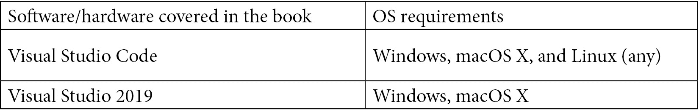

# 零、序言

NET Core是一个强大而有效的开源跨平台框架。它可以帮助您构建支持云计算的现代应用，如 web 应用和服务。*ASP.NET Core 5 初学者版*包含实践教程、项目和自我评估问题，是一本简单易懂的指南，将教您如何使用 ASP.NET Core 5 框架进行开发。您将了解使用 C#8、Visual Studio 2019、Visual Studio 代码、Razor 页面、Blazor、Kestrel、IIS、HTTP.sys、Apache、Docker、AWS 和 Azure 的框架。

您将学习如何编写应用、构建网站以及将 web 应用部署到 AWS 和 Microsoft Azure。您将彻底探索您的编码环境和推荐的最佳实践，我们将提供代码示例，系统地介绍您将在当今行业中面临的顶级场景。在本书结束时，您将能够利用 ASP.NET Core 5 在各种真实场景中构建和部署 web 应用和服务。

# 这本书是给谁的

本书面向希望学习如何使用 ASP.NET Core框架开发基于 web 的应用的开发人员。要充分利用这本书，需要熟悉 C#语言并对 HTML 和 CSS 有基本的了解。

# 这本书涵盖的内容

[*第一章*](01.html#_idTextAnchor017)*ASP.NET Core 5*简介提供了一个简短的历史课程，从.NET 1.0 通过不同的路径，到使用.NET Core 的“一个.NET 来统治所有人”，以及 ASP.NET Core 如何在这一基础上发挥作用。我们将介绍和解释很多术语。在阅读本书的过程中，还有一些工具对您很有价值，因此我们将在这里介绍其中的一些工具。

[*第 2 章*](02.html#_idTextAnchor038)*跨平台设置*解释了在.NET Core 不局限于在 Windows 上运行的情况下，在 Linux 和 Mac 上开发不会成为构建.NET 应用的障碍。对于 Linux，最新的 Windows 10 功能更新为 Windows Subsystem For Linux 2 提供了一个优秀的开发伙伴，它使您能够在 Linux 上本机运行并从 Windows 进行调试。在跨平台时，您需要注意以下几点，这些细节将在本章中指出。

[*第 3 章*](03.html#_idTextAnchor063)*依赖注入*解释了依赖注入（DI）软件设计模式，并演示了如何使用它实现类与其依赖类之间的控制反转（IoC）。我们将介绍框架服务，并解释服务生命周期和注册方法。最后，您将学习如何为 DI 设计服务。

[*第 4 章*](04.html#_idTextAnchor089)*Razor 视图引擎*解释了编码页面比以往任何时候都更容易、更高效的概念，您将了解 Razor 如何驱动不同的 ASP.NET Core web 框架生成 HTML 标记（通过使用统一的标记语法）。为了了解不同的 web 框架，您将使用 Model-View-Controller（MVC）和 Razor 页面构建一个简单的 To-Do 列表应用来创建一个动态 web 应用。此外，您还将了解每个 web 框架的优缺点。

[*第 5 章*](05.html#_idTextAnchor118)*Blazor 入门*介绍了如何熟悉一个框架，使您能够使用.NET 构建交互式 web UI。您可以使用 C#和 JavaScript（而不是 JavaScript）进行编写。您可以共享在.NET 中编写的服务器端和客户端应用逻辑，并且可以将 UI 呈现为 HTML 和 CSS（这对于移动浏览器非常有用）。首先，我们将了解构建强大 web 应用的不同 Blazor 托管模型，并权衡它们的优缺点。然后，我们将看一看高级目标，以实现使用尖端技术构建真实世界应用的目标。在本章中，您将使用 Blazor 创建一个具有实时功能的旅游景点应用。您将开始使用 ASP.NET Core Web API 和 Entity Framework Core 构建应用的后端，最后使用 SignalR 设置实时更新。

[*第 6 章*](06.html#_idTextAnchor134)*探索 Blazor Web 框架*，将剩余的部分放在一起完成[*第 5 章*](05.html#_idTextAnchor118)*中强调的目标，开始 Blazor*的学习。在本章中，您将使用不同的 Blazor 托管模型创建两个不同的 web 应用：Blazor 服务器和 Blazor web 组件。本章是本书的核心，在这里，您将体验使用各种相互连接的技术构建不同应用的过程。一步一步的代码示例和直观的插图使本章有趣、令人兴奋且易于理解。

[*第 7 章*](07.html#_idTextAnchor149)*API 和数据访问*将带您参观，我们将探讨 API 和数据访问如何协同工作以实现两个主要目标：服务和获取数据。我们将带您参观实体框架、RESTAPI、**数据库管理系统**（**DBMSS**）、SQL、LINQ 和 Postman。我们将从理解在实体框架核心（EF 核心）中使用真实数据库时的不同方法开始。然后，我们将研究如何在现有数据库中使用 EF-Core，并将使用 EF-Core 的代码优先方法实现与真实数据库对话的 api。您将与 Entity Framework Core 协同构建一个 ASP.NET Core Web API 应用，以在 SQL Server 数据库中执行基本数据操作。您还将实现用于公开某些 API 端点的最常用 HTTP 方法（谓词），我们将执行一些基本测试。

[*第 8 章*](08.html#_idTextAnchor168)*身份*旨在从前端（用户如何认证）和后端如何验证该身份两个方面传授应用中身份概念的基础知识。它将解释不同的方法，例如基本身份验证和基于声明的身份验证，以及引入现代身份套件（Azure AD）。将解释主要的 OAuth 2 和 OpenID 连接流，以了解在应用中使用哪种连接。

[*第 9 章*](09.html#_idTextAnchor187)*容器*介绍了分解巨石的概念，我们将提供一个基本的理解，为什么今天每个人似乎都在谈论容器。

[*第 10 章*](10.html#_idTextAnchor206)*部署到 AWS 和 Azure*解释了我们说 ASP.NET 天生就是部署到云端的意思，然后我们将探索一些平台，包括 Amazon Web Services（AWS）和 Microsoft Azure（我们将解释为什么我们关注这两个平台）。然后，我们将深入研究并向您展示如何在 AWS 和 Azure 上部署您的项目（以快速和基本的方式）！

[*第 11 章*](11.html#_idTextAnchor227)*浏览器和 Visual Studio 调试*介绍了现代浏览器中用于检测错误原因以及如何解决问题的一些重要功能。我们还将介绍 VisualStudio 对调试的支持，以及 IDE 如何使您成为更好的程序员。

[*第 12 章*](12.html#_idTextAnchor252)*与 CI/CD*集成，探讨了在现代 DevOps 世界中程序员应该熟悉的工具和实践。

[*第 13 章*](13.html#_idTextAnchor276)*云本机*解释了如何在如今很多职位描述中都包含*云*这个词，虽然并非所有生成的代码都会在公共云中运行，但有必要理解*云本机*的含义，以及设计应用以利用云功能需要采取哪些步骤。这可能是云存储与本地磁盘、扩展与缩小，以及以前由 Ops 处理的一些任务现在由开发人员负责。在本章结束时，您应该理解为什么执行现有应用的*升降*与在云中启动有很大不同。

# 充分利用这本书

假设您具备 C 语言的基本工作知识。所有代码都在 Windows10 上进行了测试，并注意到了例外情况。本书中使用的主要软件是 Visual Studio Code 和 Visual Studio 2019，它们都可以从 Microsoft 免费下载。具体说明见以下章节：



**如果您使用的是本书的数字版本，我们建议您自己键入代码或通过 GitHub 存储库访问代码（下一节提供链接）。这样做将帮助您避免与复制和粘贴代码相关的任何潜在错误。**

# 下载示例代码文件

您可以从 GitHub 的[下载本书的示例代码文件 https://github.com/PacktPublishing/ASP.NET-Core-5-for-Beginners](https://github.com/PacktPublishing/ASP.NET-Core-5-for-Beginners) 。如果代码有更新，它将在现有 GitHub 存储库中更新。

我们的丰富书籍和视频目录中还有其他代码包，请访问[https://github.com/PacktPublishing/](https://github.com/PacktPublishing/) 。看看他们！

# 运行中的代码

本书的行动代码视频可在[查看 http://bit.ly/3qDiqYY](http://bit.ly/3qDiqYY) 。

# 下载彩色图片

我们还提供了一个 PDF 文件，其中包含本书中使用的屏幕截图/图表的彩色图像。你可以在这里下载：

[https://static.packt-cdn.com/downloads/9781800567184_ColorImages.pdf](https://static.packt-cdn.com/downloads/9781800567184_ColorImages.pdf)

# 使用的约定

本书中使用了许多文本约定。

`Code in text`：表示文本中的码字、数据库表名、文件夹名、文件名、文件扩展名、路径名、虚拟 URL、用户输入和 Twitter 句柄。下面是一个示例：“前面的代码以`ServerPrerendered`作为默认呈现模式呈现`App.razor`组件。”

代码块设置如下：

```cs
<body>
    <app>
        <component type="typeof(App)"             render-mode="ServerPrerendered" />
    </app>
    @*Removed other code for brevity*@
</body>
```

当我们希望提请您注意代码块的特定部分时，相关行或项目以粗体显示：

```cs
  <script src="_framework/blazor.webassembly.js"></script>
 <script src="storageHandling.js"></script>
</body>)
```

任何命令行输入或输出的编写方式如下：

```cs
dotnet run Base64 encoded: YW5kcmVhczpwYXNzd29yZA==Response: Hello Andreas
```

**粗体**：表示一个新术语、一个重要单词或您在屏幕上看到的单词。例如，菜单或对话框中的单词出现在文本中，如下所示。下面是一个示例：“选择**ASP.NET Core Web 应用**模板并单击**下一步**

提示或重要提示

看起来像这样。

# 联系

我们欢迎读者的反馈。

**一般反馈**：如果您对本书的任何方面有疑问，请在邮件主题中注明书名，并发送电子邮件至`customercare@packtpub.com`。

**勘误表**：尽管我们已尽一切努力确保内容的准确性，但还是会出现错误。如果您在本书中发现错误，如果您能向我们报告，我们将不胜感激。请访问[www.packtpub.com/support/errata](http://www.packtpub.com/support/errata)，选择您的书籍，单击 errata 提交表单链接，然后输入详细信息。

**盗版**：如果您在互联网上发现我们作品的任何形式的非法复制品，请您提供我们的位置地址或网站名称，我们将不胜感激。请通过`copyright@packt.com`与我们联系，并提供该材料的链接。

**如果您有兴趣成为一名作家**：如果您对某个主题有专业知识，并且您有兴趣撰写或贡献一本书，请访问[authors.packtpub.com](http://authors.packtpub.com)。

# 审查

请留下评论。一旦你阅读并使用了这本书，为什么不在你购买它的网站上留下评论呢？然后，潜在读者可以看到并使用您的无偏见意见做出购买决定，我们 Packt 可以了解您对我们产品的看法，我们的作者可以看到您对他们书籍的反馈。非常感谢。

有关 Packt 的更多信息，请访问[Packt.com](http://packt.com)。