# 一、ASP.NET Core 5 简介

.NET 5 是.NET 平台中最新、最强大的。NET5 是.NETCore3.1 的继承者。本章简要介绍了.NET 框架的历史，然后深入讨论了此版本带来的内容。本章最后介绍了在继续探索后续章节中的详细信息之前，您希望使用的实用程序和工具。我们将涵盖广泛的主题，包括.NET 的跨平台使用、创建可视层的不同方法、后端组件（如身份和数据访问）以及云技术。

本章将介绍以下主题：

*   解释 ASP.NET Core
*   进修
*   .NET5 和 C#9 有什么新功能
*   网站和网络服务器
*   Visual Studio 代码
*   Windows 终端

# 技术要求

本章包括简短的代码片段，以演示所解释的概念。需要以下软件：

*   Visual Studio 2019：Visual Studio 可从[下载 https://visualstudio.microsoft.com/vs/community/](https://visualstudio.microsoft.com/vs/community/) 。社区版是免费的，将用于本书的目的。
*   Visual Studio 代码：Visual Studio 代码可从[下载 https://code.visualstudio.com/Download](https://code.visualstudio.com/Download) 。
*   .NET Core 5：.NET Core框架可从[下载 https://dotnet.microsoft.com/download/dotnet/5.0](https://dotnet.microsoft.com/download/dotnet/5.0) 。

确保下载 SDK，而不仅仅是运行时。您可以通过打开命令提示符并运行`dotnet --info`cmd 来验证安装，如图所示：

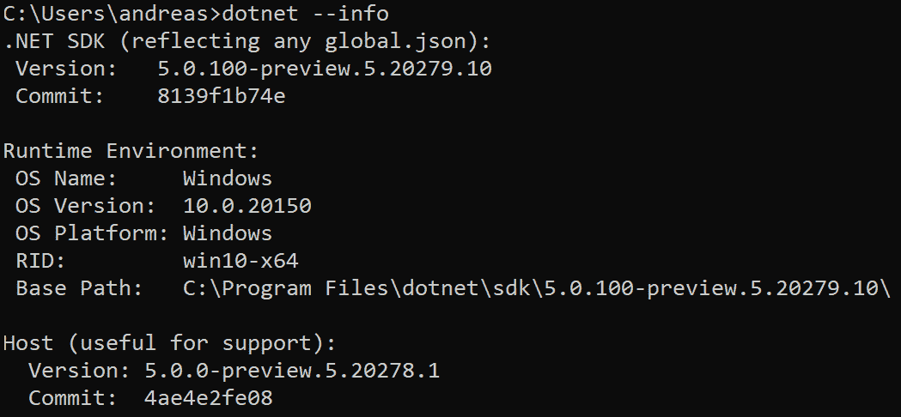

图 1.1–验证.NET 的安装

请访问以下链接查看 CiA 视频：[https://bit.ly/3qDiqYY](https://bit.ly/3qDiqYY)

在[查看本章的源代码 https://github.com/PacktPublishing/ASP.NET-Core-5-for-Beginners/tree/master/Chapter%2001/Chapter_01_HelloWeb](https://github.com/PacktPublishing/ASP.NET-Core-5-for-Beginners/tree/master/Chapter%2001/Chapter_01_HelloWeb) 。

# 讲解 ASP.NET Core

NET 的第一个版本是在 2002 年发布的，所以我们现在的版本 5 听起来并不令人印象深刻，因为它已经是 18 年后的版本了。然而，由于编号系统和各种旁道，它比这稍微复杂一些。一部完整的历史本身可能就是一本书，但为了了解我们现在的处境，我们将带你们沿着记忆之路走一小段路。

当.NET 出现时，根据您的场景，您可以选择几种编程语言。VisualBasic 在介绍性类型编程中很受欢迎，因为顾名思义，它是面向视觉的，并且易于入门。然而，VB 不适合大规模编写高性能的复杂应用，然而，它并不是语言的强项。Windows 本身主要以 C 和 C++编写，是专业级软件的首选路由。虽然这些语言的功能非常强大（现在仍然如此），但它们却因允许程序员自食其果而臭名昭著，因为它们让程序员负责内存管理和其他难以调试和排除故障的低级操作。

与微软直接提供的语言实现并行，Sun Microsystems发布了 Java 作为这些挑战的解决方案。该工具没有生成本机代码，而是生成了托管代码，抽象了内存管理，使事情变得更简单。该语言的语法是 C++风格的，因此对于想要开发它的开发者来说，过渡并不难。编写的代码应可移植到多个平台，这也是一个明确的目标。这是由安装在给定系统上执行的**Java 虚拟机**（**JVM**启用的。

## 托管代码与非托管代码

编程语言经过多年的发展。在第一批计算机通过实际转动开关和控制杆进行编程的地方，你现在可以编写指令，即使是非程序员也能理解某些命令的含义。

一个通常的是指通过调用语言低级（close）或高级（abstract），与计算机的母语（0 和 1）相对接近。在最低层次上，您有像汇编语言这样的语言，从理论上讲，它们的开销最小（前提是您可以找到非常有才华的程序员），但除了复杂之外，汇编语言还不能跨不同的 CPU 体系结构移植。C#更倾向于另一端，语言更自然，许多“困难的事情”对程序员来说是隐藏的。还有一些更高级的语言，比如 Scratch（一种基于块的语言），面向希望进入编程的孩子。（低与高没有正式定义。）

C#用来实现这一点的机制之一是通过一个中间层（对于.NET 来说，这是公共语言运行时）将代码实时转换为计算机能够理解的底层机器代码。这意味着程序员不需要处理分配和释放内存、不干扰其他程序的进程等等，并且通常会做大量繁重的工作。对于.NET Core，这是处理跨平台执行的关键部分–如果没有这个中间人，为 Windows 笔记本电脑编写的代码如果没有重新编译和特定于平台的调整，将无法在手机上运行。

这个概念对于 C#来说并不新鲜，也不是唯一的，它也是 Java 中使用的概念。最初，它是在 IBM 大型机时代构思的。在个人计算机上，这最初是一个挑战，因为托管代码总是会由于发生的转换而产生开销，而在资源受限的计算机上（当.NET 1.0 发布时），它可能运行缓慢。较新的计算机处理这一问题的效率更高，而且.NET 多年来一直在优化，因此对于大多数应用来说，代码是否得到管理不再是一个大问题。

## 介绍.NET 平台

微软从 Java 中汲取灵感，从他们提供的生态系统中汲取经验，提出了.NET。平台结构如*图 1.2*所示。

.NET 也基于托管代码，需要安装一个**公共语言运行库**（**CLR**）才能执行。C#语言在同一时间框架内发布，但.NET 也支持 Visual Basic 和 J#，强调它是一个更通用的框架。其他需要安装额外软件才能运行应用的编程语言面临着让最终用户自己安装的挑战。另一方面，微软有提供操作系统的优势，因此他们可以选择将.NET 作为预装二进制文件。


图 1.2–.NET 平台

正如名称的第二部分所暗示的那样，.NET Framework 的目的是要比口述某种语言必须使用并且只能用于特定类型的应用更完整，因此它本质上是模块化的。如果要创建作为 Windows 服务运行的应用，除了具有图形用户界面的应用外，还需要其他库，但可以使用相同的编程语言。

最初的.NET Framework 设计在技术上并不排除在 Windows 以外的其他操作系统上运行，但由于没有看到为 Linux 和 Apple 产品提供该框架的动机，它很快就依赖于仅在桌面 Windows 上可用的组件。

虽然 Windows 在基于 x86 的 PC 上运行得很好，但它并没有在受限制的设备上运行。这导致微软开发了其他版本的 Windows，如用于智能手机的 Windows Mobile，用于 ATM 和收银机等设备的 Windows CE，等等。为了迎合开发人员的需求，使他们能够以最少的再学习体验创建应用，这些平台需要.NET，但.NET 的构建不是为了在没有可用桌面组件的情况下运行。结果是.NET 被分割成多条路径，智能手机和平板电脑使用.NET Compact Framework，类似 Arduino 的设备使用.NET Micro Framework。

基本上，如果你精通 C#，你可以以多种形式的设备为目标。不幸的是，这在现实世界中并不总是那么容易。

图书馆是不同的。如果您在桌面上编写代码并希望将其移植到移动设备，则必须了解如何实现.NET 精简版中没有的功能。您还可能遇到令人困惑的事情，例如两个平台上都有 XML 生成器，尽管它们看起来很相似，但生成的输出却不一样。

.NET Framework 是随 Windows 操作系统一起发布的，但这通常不是最新版本，因此您仍然需要安装更新才能使其正常工作或安装其他组件。

更糟糕的是，当您必须在同一台机器上运行多个版本的.NET 时，经常会出现这样的情况，即这些版本之间不能很好地配合，您必须确保您的应用调用了正确版本的库。当 Windows 上的 C++出现时，对.NET 进行的挑战可能会听到这被称为“DLL 地狱”。

本书的标题中也使用了术语**ASP**（ASP.NET）。ASP 在本历史课中有自己的轨迹。在 WindowsNT 的旧时代，呈现网页不是服务器的核心组件，而是可以通过一个名为**活动服务器页面**（**ASP**简称）的附加组件安装在 Internet 信息服务器之上。当.NET 发布时，它被作为 ASP.NET 进行保存。与.NET 的基本组件非常相似，多年来，这也见证了各种形式的多次迭代。最初，您使用 ASP.NET Web 表单，在其中编写代码和脚本，引擎将这些代码和脚本呈现为 HTML 输出。2009 年，极具影响力的 ASP.NET MVC 发布，实现了模型-视图-控制器模式，该模式仍然存在。

模式

模式是解决软件中常见问题的一种方法。例如，如果您有一个用于在在线商店订购产品的应用，则会涉及一组通用的对象和操作。产品、订单等通常存储在数据库中。您需要使用这些对象的方法–在客户订购产品时减少库存，由于客户有购买历史记录而应用折扣。您需要在网页上显示一些内容，以便客户可以查看商店及其产品并执行操作。

这通常以所谓的**模型视图控制器**（**MVC**模式）实现。

产品和订单描述为型号。执行的操作（如减少数量、检索定价信息等）在控制器中实现。在视图中实现对最终用户可见的输出的呈现，以及接受来自最终用户的输入。我们将在本书后面的代码中看到这一点。

模式涵盖了一系列问题，通常是通用的，并且独立于它们所用的编程语言。

本书将涉及适用于 ASP.NET Core应用的模式，但不涵盖一般模式。

令人困惑的是，还有另外一些基于网络的项目单独启动，例如 Silverlight，它作为浏览器中的插件运行。当时的想法是，由于浏览器将代码限制在沙箱中，因此这可以作为访问通常仅在浏览器外部可用的功能的桥梁。它并没有成为热门，所以尽管您仍然可以让它运行，但它被认为是不推荐的。

使用 Windows 8 的应用模型，您可以使用 HTML 为用户界面编写可安装在设备上的应用，与实际的 web 应用不直接兼容。依赖 Windows 应用商店进行分发，但并非所有用户都能立即升级到新的 Windows 版本，这一事实阻碍了它的发展，开发人员大多更愿意接触到最大的受众。

在 Windows8 和.NET4.5 发布的同时，微软推出了**.NET 标准**。这是任何.NET 堆栈的基类库中的一组 API。这意味着某些代码在桌面 Windows 应用中的工作效果与用于 Windows Phone 的移动应用一样好。这并没有禁止在顶层使用特定于平台的附加功能，但更容易实现代码的基本可移植性。这并不意味着您实现了*write once run everywhere*用例，而是我们现在看到的跨平台生态系统的开始。

微软主要关注 Windows 生态系统的发展，但在公司之外，Mono 项目致力于创建一个可以在 Linux 上运行应用的开源版本的.NET。Linux 的努力最初并没有取得进展，但当创造者米格尔·德·伊卡扎（Miguel de Icaza）创办了 Xamarin 公司，专注于利用这项工作使.NET 在 iOS 和 Android 设备上运行时，它获得了吸引力。与精简版的.NET 非常相似，它与桌面上的类似，但并不完全相同。

在.NET 领域之外，技术多年来发生了变化。到 2020 年，你可以得到比 2002 年台式机更强大的移动设备。苹果设备在 2020 年随处可见，而在 2002 年，离 iPhone 和 iPad 发布还有几年的时间。另一个重要的事情是，在 2002 年，微软编写的代码将主要由其员工阅读和更新。开源不是从 Redmond 出来的东西。

这些趋势是以不同的方式处理的。微软早在 2008 年就开始对.NET 进行开源，尽管它还不是完整的软件包，而且对所选择的许可证也有抱怨，有些人认为它只是半开源的。

快进到 2016 年.Net Core 发布时。NET 当时的版本是 4.6.2，.NETCore 是从 1.0 开始的。从那时起，最初的.NET 就被称为“经典的.NET”。

Windows mobile/Phone 在市场上的失败部分解决了移动平台问题。Xamarin 也是在 2016 年被收购的，这意味着移动设备意味着谷歌和苹果的操作系统。

此时，微软已经完全致力于开源，甚至开始接受外部对.NET 的贡献。该语言的设计仍由微软负责，但策略是公开的，非微软开发者做出了相当大的贡献。

微软从过去吸取了教训，认识到使用.NETCore 而不是.NETClassic 不会有大的转变。不管开发人员是否同意新版本更好，每个人都不可能在短时间内重写现有代码，特别是因为.NET Core 的初始版本中没有 API。

重新迭代了.NET 标准消息。您可以在.NET 4.6 中针对.NET 标准 1.3 编写代码，这也可以在.NET Core 1.0 中使用。其目的是，这可以用于迁移策略，您可以将代码逐段移动到与.NET 标准兼容的项目中，并在编写与.NET Core 一起使用的新代码时将不兼容的代码留在后面。

不幸的是，人们很难跟踪所有术语--.NET、.NET Classic、.NET Core、.NET Standard 以及所有相应的版本号，但时至今日，将这些术语混合在一起仍然是一种可行的策略。

如前所述，.NET Core 的版本号为 1.0。从那时起，它增加了数量，达到 3.1。乍一看，这意味着下一个版本将被称为.NETCore5 听起来不符合逻辑。放弃此编号的主要原因有三个：

*   .NETCore4.x 很容易与.NET4.x 混淆。
*   因为有一个.NET4.x（非核心），下一个主要的数字是 5。
*   为了说明这两条路径如何“合并”，它们在版本 5 中相遇。为了避免混淆，从版本名中删除了“Core”。

在新版本方面，.NETClassic 已经走到了生命的尽头，因此，今后，（在.NET5 之后）将以.NET6、.NET7 等命名，以.NETCore 作为基础框架。

.NET Classic 不会很快被支持或弃用，因此现有代码将继续工作，但不会进行新功能和投资。

## 保障性策略

传统的.NET Classic版本具有很长的可支持性，尽管没有固定的生命周期，但这取决于 service pack 版本及其发布时使用的操作系统。

借助.NET Core 2.1，微软转向了 Linux 生态系统中常见的模式，其版本被称为**LTS**（**长期支持**）和非 LTS。LTS 版本将有 3 年的支持期，而非 LTS 版本只有一年的支持期。次要版本预计在支持窗口期间发布，但在主要版本发布时设置结束日期。

图 1.3 显示了.NET 发布时间表，重点是其可支持性时间表。


图 1.3–.NET 可保障性计划

显然，我们不能保证每年都会部署一个新版本，但这是当前的计划。从.NET Core 3.1 开始，计划周期为每年 11 月的新版本，每隔一年更新一次。NET 5 于 2020 年 11 月作为非 LTS 版本发布。NET6 的目标是在 2021 年 11 月发布 LTS。

这并不意味着在不受支持的版本中编写的代码会中断或停止工作，但不会发布安全补丁，也不会为较旧的运行时维护库，因此相应地计划升级。（微软在指导如何将代码更新到新版本方面有着良好的记录。）

它有时感觉像是一段颠簸的旅程，但除非您必须处理遗留系统，否则当前的状态比很长一段时间以来更加简洁。

这一节主要是一节历史课，讲的是我们是如何走到现在这一步的。在下一节中，我们将友好地介绍一个基于 C#代码的基本 web 应用。

# 刷新你的 C#知识

C#语言非常广泛，有专门的书籍，而且确实有一些书籍涵盖了从以前从未见过的编程到高级设计模式和优化的所有方面。本书不打算涵盖仅适用于高级开发人员的非常基本的内容或深奥的概念。目标受众是初学者，我们将通过一个`Hello World`类型的示例进行简短的介绍，为您的机器搭建舞台，并确保机器正常工作。

如果您对 VisualStudioWeb 应用模板的工作方式感到满意，并希望深入了解新的内容，请跳过本节。

我们将从以下步骤开始：

1.  启动 Visual Studio 并选择**新建项目**。
2.  选择**ASP.NET Core Web 应用**，点击**下一步**。
3.  将解决方案命名为`Chapter_01_HelloWeb`并为本书练习选择合适的位置（如`C:\Code\Book\Chapter_01`，然后点击**创建**。
4.  在下一个屏幕上，确保 ASP.NET 5 内核 AuthT1。无需检查**Docker 支持**或配置**认证**。
5.  一旦代码加载并准备就绪，您应该通过按*F5*以调试模式运行 web 应用来验证您的安装是否正常工作。第一次可能需要一点时间，但希望没有错误，您的浏览器中会显示以下内容：


图 1.4–运行默认 web 应用模板

没什么特别的，但这意味着你可以在后面的章节中做更复杂的事情。如果在运行时遇到问题，在继续之前，现在是修复问题的时候了。

让我们看一下构成此功能的一些组件和代码。

在 Visual Studio 的右侧，您将看到解决方案中的文件：

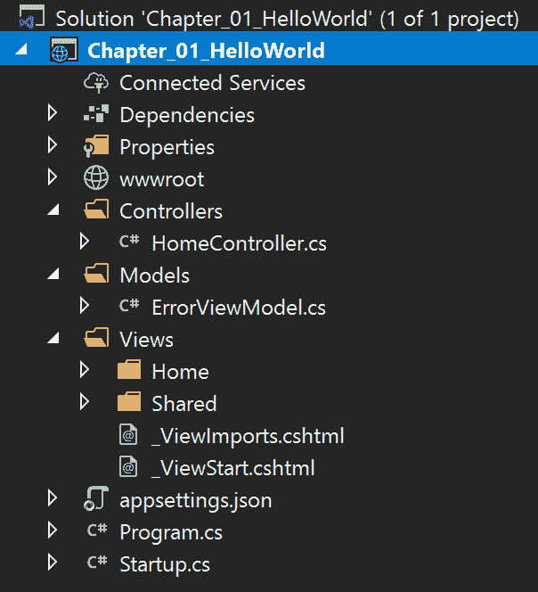

图 1.5–Visual Studio 2019 中 web 应用的文件结构

此结构特定于空的 web 应用模板。您更可能使用 MVC 或 Blazor 模板来构建更高级的内容，除非您想从头开始编写所有内容。

我们来看看`Program.cs`的内容：

```cs
using Microsoft.AspNetCore.Hosting;using Microsoft.Extensions.Hosting;
namespace Chapter_01_HelloWeb {  public class Program   {    public static void Main(string[] args)    {      CreateHostBuilder(args).Build().Run();    }
    public static IHostBuilder CreateHostBuilder(string[] args) =>      Host.CreateDefaultBuilder(args)        .ConfigureWebHostDefaults(webBuilder =>        {          webBuilder.UseStartup<Startup>();        });  }}
```

我们看到一个`Main`方法，在这个文件中，它的唯一目的是启动一个处理 web 请求和进程的进程。您可以运行不同类型的主机进程，因此建议您运行一个通用主机进程，然后进一步自定义它以指定它是一个 web 主机进程。由于这是本书的第一章，您还没有被介绍过其他类型的主机，但是在[*第 2 章*](02.html#_idTextAnchor038)*跨平台设置*中，我们将进入一个旋转不同主机类型的示例。

在本例中，我们使用了`Empty`web 模板，但这是样板代码，与其他基于 web 的模板类似。

在前面的代码片段中有一个引用`Startup`，这是指`Startup.cs`的内容：

```cs
using Microsoft.AspNetCore.Builder;using Microsoft.AspNetCore.Hosting;using Microsoft.AspNetCore.Http;using Microsoft.Extensions.DependencyInjection;using Microsoft.Extensions.Hosting;
namespace Chapter_01_HelloWeb {  public class Startup   {    // This method gets called by the runtime. Use this method     // to add services to the container.    public void ConfigureServices(IServiceCollection services)    {    }
    // This method gets called by the runtime. Use this method     // to configure the HTTP request pipeline.    public void Configure(IApplicationBuilder app,     IWebHostEnvironment env)    {      if (env.IsDevelopment())      {        app.UseDeveloperExceptionPage();      }
      app.UseRouting();      app.UseEndpoints(endpoints =>      {        endpoints.MapGet("/", async context =>        {          await context.Response.WriteAsync("Hello World!");        });      });    }  }}
```

如果您最近没有用 C#编写 web 应用，这可能是您不熟悉的。在.NETClassic 中，为 web 应用设置配置的仪式分布在多个配置文件中，配置类型之间的语法可能略有不同。一个特别令人发指的问题是，当你有一个“隐藏的”`web.config`文件覆盖了你认为应该应用的文件时。这也是一种一刀切的设置，其中包含了与应用无关的 XML 行。

在.NET Core中，这是集中到一个模块化程度更高的文件中。在更复杂的应用中，可能需要使用其他文件，但启动模板不需要这些文件。这里要观察的模式是它的形式为`app.UseFeature`。例如，如果您添加了`app.UseHttpsRedirection`，这意味着如果用户在`http://localhost`中输入，他们将自动重定向到`https://localhost`。（强烈建议所有网站都使用`https`）虽然本示例中没有添加太多逻辑，但您还应该注意检查环境是否为开发环境的`if`语句。可以创建更高级的每环境设置，但对于决定是否应在浏览器中显示详细异常这样的简单事情，这是一个有用的选项。

从代码本身来看并不明显，但引入的这些特性被称为**中间件**。

中间产品比你从这里得到的印象更强大；这将在后面的章节中更详细地介绍。

`Configure`方法作为序列运行，将特性动态加载到 web 托管进程的启动中。这意味着陈述的顺序很重要，如果你不注意，很容易混淆。如果`app.UseB`首先依赖于`app.UseA`加载，请确保代码中也是这样。

需要注意的是，这种方法并不特定于基于 web 的应用，但也适用于其他基于主机的应用。

此处生成可见输出的行如下所示：

```cs
app.UseEndpoints(endpoints =>{  endpoints.MapGet("/", async context =>  {    await context.Response.WriteAsync("Hello World!");  });});
```

让我们将更改为以下内容：

```cs
app.UseEndpoints(endpoints =>{  endpoints.MapGet("/", async context =>  {    await context.Response.WriteAsync("<h2>The time is now:</h2>" +        DateTime.UtcNow.ToString());  });});
```

这段代码意味着我们告诉.NET 运行时连接一个在 URL 根侦听的端点，并直接向 HTTP 会话写入响应。为了证明我们可以比原始的`"Hello World!"`字符串更进一步，除了使用一个生成动态值的变量外，我们还输出 HTML 作为它的一部分。（注意：在本例中，浏览器决定是否呈现 HTML，因此您可能会在计算机上看到没有格式的标记。）

如果再次运行应用，您应该会看到打印的当前时间：

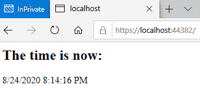

图 1.6–打印当前时间的 Hello World

如果您从事过更多以前端为中心的任务，您可能会注意到，虽然前面的代码段使用 HTML，但它似乎缺少一些内容。通常，您会使用层叠样式表（`.css`文件）将样式应用于 web 页面，但这种方法是一种更精简的版本，我们不涉及它。后面的章节将向您展示比我们在这里看到的更令人印象深刻的造型方法。

如果你以前曾涉猎过任何 web 内容，你可能已经学会了，无论是通过艰苦的方式还是通过被告知，你都不应该将代码和 UI 混为一谈。这个例子似乎很好地违反了这个规则。

一般来说，确实不鼓励以这种方式实现 web 应用，因为软件工程的基本原则之一是分离关注点。例如，您可以让前端专家创建用户界面，而对代码中的幕后工作知之甚少，让后端开发人员处理业务逻辑，只关心应用“引擎”的输入和输出。

不过，上述方法并非完全无用。web 应用具有“健康端点”的情况并不少见。在处理微服务时，可以通过监控解决方案或容器编排解决方案调用该端点。它们通常只寻找 web 应用处于活动状态的静态响应，因此我们不需要为此构建用户界面和复杂的逻辑。要实现这一点，您可以在`Startup.cs`中添加以下内容，同时并行执行“适当”的 web 应用：

```cs
endpoints.MapGet("/health", async context =>{  await context.Response.WriteAsync("OK");});
```

如果您使用过早期版本的 Visual Studio（2017 年之前），您可能已经体验过为代码使用项目和解决方案文件的烦恼。如果您在 VisualStudio 之外添加或编辑了文件，然后尝试返回编译和运行代码，那么在 IDE 中经常会收到关于某些错误的投诉。

这一问题已经解决，您现在可以处理其他应用和其他文件夹中的文件，只需将生成的文件保存在项目结构中的正确位置即可。

.NET 经典 web 应用的项目文件（`.csproj`从 200 多行代码开始。作为比较，我们刚刚创建的 web 应用包含 7 行（其中包括 2 行空格）：

```cs
<Project Sdk="Microsoft.NET.Sdk.Web">
  <PropertyGroup>    <TargetFramework>net5.0</TargetFramework>  </PropertyGroup>
</Project>
```

要在 Visual Studio 中查看此内容，您必须右键单击项目名称并选择**卸载项目**，然后选择**编辑.csproj**。编辑完文件后，需要重新加载项目才能再次使用它。

在这一点上，我们建议您对代码进行修改，并在继续之前查看结果。

在本演练中，我们依靠 Visual Studio 2019 为我们提供了一组模板和图形用户界面，以供点击。NET 不强制使用 VisualStudio，因此如果您想使用其他编辑器，可以从命令行复制它。运行`dotnet new`命令查看可用选项，并提供一些提示：


图 1.7–列出.NET 中可用的模板

要复制我们在 VisualStudio 中所做的工作，请键入`dotnet new web`。默认项目名称将与您所在的文件夹相同，因此请确保命名文件夹并进行相应更改。

这将使您有一些示例代码来测试和验证系统是否正常工作。然而，C 语言还有更多内容，接下来，我们将看看最新版本的 C 语言带来了什么。

学习.NET5 和 C#9 的新功能

一般的经验法则是.NET、C#和 Visual Studio 的新版本在同一时间段发布。这当然是处理它的最简单的方法——获取最新的 VisualStudio，其他两个组件在安装过程中会自动跟进。

该工具并不总是紧密耦合的，因此如果出于某种原因您无法使用最新版本，您可以研究是否有方法使其与 Visual Studio 的早期版本一起工作。（这通常可以在 Microsoft 的需求文档中找到。）

一个常见的误解是.NET 和 C#必须处于同一版本级别，升级一个意味着升级另一个。然而，.NET 和 C#的版本并不是直接耦合的。C#已达到 9 版，而.NET 达到 5 版，这一事实进一步说明了这一点。NET 也与使用 C 语言无关。（在过去，你有 Visual Basic，现在也有 F。）如果你想保持特定的 C 版本（不升级到 C 的最新版本），那么在升级.NET 之后，这种组合通常仍然有效。

C 语言定义的东西通常是向后兼容的，但模式可能不是。

例如，在 C#3 中引入了`var`关键字。这意味着以下声明有效：

```cs
var i = 10; // Implicitly typed.int i = 10; // Explicitly typed.
```

这两种变体都可以，而且.NETCore5 不会强制使用这两种样式。

作为.NET 发展的一个例子，从.NET Core 1.x 到.NET Core 2.x 发生了一些变化，其中 C#的语法没有改变，但.NET 希望在代码中设置身份验证的方式意味着，即使 C#代码完全有效，您的代码也会无法工作。确保您了解.NET 在何处强制使用某种样式，以及 C#是罪魁祸首。

您可以通过编辑项目文件（`.csproj`并添加`LangVersion`属性来指定使用哪个 C#版本：

```cs
<Project Sdk="Microsoft.NET.Sdk">  <PropertyGroup>    <OutputType>Exe</OutputType>    <TargetFramework>net5.0</TargetFramework>  </PropertyGroup>  <PropertyGroup>    <LangVersion>9.0</LangVersion>  </PropertyGroup></Project>
```

很难跟踪代码中可以更改和优化的内容。随着.NET 编译器平台于 2014 年发布，昵称为 Roslyn，通过引入对代码的实时分析，这一点得到了极大的改进。以前您必须为 IDE 编译代码以显示错误和警告，现在在编写代码时会显示这些错误和警告。它不局限于指出阻止代码运行的问题，还将建议进行改进。

例如，考虑以下内容：

```cs
Console.WriteLine("Hello " + name);
```

Roslyn 将建议`String`插值作为选项：

```cs
Console.WriteLine($"Hello {name}");
```

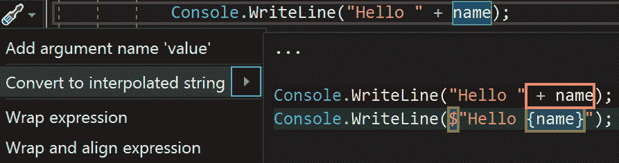

图 1.8–代码改进建议

对于这样一个简单的示例，它可能看起来不像的改进，但它通常会使较长的字符串更具可读性。不管怎样，这都是一个建议，而不是强加给你的东西。

这意味着当主题为“新内容”时，可以将其分为两部分-.NET 和 C。NET 中的新功能将主要在其他章节中介绍。C#中的新功能将在这里介绍，并将在后续章节的代码示例中使用。请注意，并非本书中的所有代码都会在任何地方使用 C#9 语法，只要新语法主要是风格，如果您不是强制执行一组标准的大型开发团队的一员，建议您选择自己的风格。

## 在.NET5 中有什么新功能？

许多改进都在幕后进行，使事情更顺利、更全面。然而，也有一些更明显的改进。本章将只提供几个亮点，因为细节将在本书后面介绍。

### 用.NET Classic 缩小差距

对于.NET Core 1.0，许多项目不可能从.NET 4.x 进行移植，因为对于某些功能根本没有对应的库。NET Core 3.1 在大多数实际应用中消除了这一障碍，而在.NET Core 5 中，该框架被认为是 API 和库端的完整功能。

一些技术已被弃用，因此没有继续使用（参见本章后面的*删除/更改功能*部分）：

*   **统一的.NET 和单一基类库**：以前，Xamarin 应用（移动应用）是基于 Mono BCL 的，但现在它已经迁移到了.NET 5 中，并因此提高了兼容性。
*   **多平台原生应用**：单个项目可以针对多个平台。如果使用 UI 元素，.NET 将以平台本机控件的形式处理此问题。
*   **云本机**：当前的.NET 代码肯定会在云中运行，但将采取进一步的步骤将.NET 标记为云本机框架。这包括减少占用空间，以便在容器和单文件可执行文件中更方便地使用，因此您不需要安装.NET 运行时，并调整云故事和本地开发人员体验，使它们处于功能对等状态。
*   **Blazor WebAssembly**: .NET Core 3.1 introduced Blazor apps that were rendered server-side. With .NET 5, they can also be rendered client-side, enabling offline and standalone apps.

    目标是代码几乎相同，因此很容易从一个托管模型切换到另一个托管模型。

*   **多平台网络应用**：Blazor 应用最初被认为是网络应用的载体，在浏览器中非常有效。我们的目标是，这对于移动设备或本机桌面应用同样有效。
*   **持续改进**：BCL 中更快的算法，运行时中的容器支持，对 HTTP3 的支持，以及其他调整。

在讨论了.NET5 的新功能之后，让我们继续讨论 C#9。

## C#9 有什么新功能？

C#9 的首要目标是简化。这门语言已经足够成熟，你可以用某种方式做你想做的大部分事情，因此与其增加更多的功能，不如让这些功能更可用。在本节中，我们将介绍构造代码的新方法，并解释您可以创建的一些新代码。

### 顶级课程

简化的一个很好的例子是顶级程序。使用 C#8，Visual Studio 模板创建了以下代码作为控制台应用的起点：

```cs
using System;
namespace ConsoleApp2 {
  class Program   {
    static void Main(string[] args)    {                  Console.WriteLine("Hello World");    }  }}
```

有一个原因，为什么有这么多的代码行做这么少，但对于初学者来说，这是一个很大的仪式开始。前面的代码段现在可以这样编写：

```cs
Using System;
Console.WriteLine("Hello World");
```

这不支持在整个程序中省略类和方法。这是关于简化`Main`方法的，该方法通常只会引导应用，并且在给定的应用中只能有一个。

### 仅初始化属性

当处理对象时，您通常会这样定义和创建它们：

```cs
static void Main(string[] args){  InfoMessage foo = new InfoMessage   {    Id = 1,    Message = "Hello World"  };}
public class InfoMessage {  public int Id { get; set; }  public string Message { get; set; }}
```

在这段代码中，属性是可变的，因此如果您以后想要更改 ID，这是可以的（当访问器是公共的）。为了涵盖希望公共属性不可变的情况，引入了一种新类型的属性，其中包含仅限 init 的属性：

```cs
public class InfoMessage {  public int Id { get; init; }  public string Message { get; init; }}
```

这使得属性不可变，因此一旦您定义了它们，它们就不能更改。

### 初始化访问器和只读字段

初始化访问器仅用于初始化期间，但此与只读字段不冲突，如果需要构造函数，则可以同时使用这两个字段：

```cs
public class City {  private readonly int ZipCode;  private readonly string Name; 
  public int ZipCode   {     get => ZipCode;     init => ZipCode = (value ?? throw new         ArgumentNullException(nameof(ZipCode)));  }
  public string Name   {     get => Name;     init => Name = (value ?? throw new       ArgumentNullException(nameof(Name)));  }}
```

### 记录

Init 对单个属性起作用，但如果要使其应用于类中的所有属性，可以使用`record`关键字将类定义为记录：

```cs
public record class City {  public int ZipCode {get; init;}  public string Name {get; init;}
  public City(int zip, string name) => (ZipCode, Name) = (zip,name);}
```

当您将对象声明为记录时，这将为您带来其他新功能的价值。

#### 带着表情

由于对象具有无法更改的值，因此如果值发生更改，则必须创建一个新对象。例如，您可以拥有以下内容：

```cs
City Redmond = new City("98052","Redmond");
//The US runs out of zip codes so every existing code is // assigned //a 0 as a suffix City newRedmond = new City("980520","Redmond");
```

使用`with`表达式可以复制现有属性，只需重新定义更改的值：

```cs
var newRedmond = Redmond with {ZipCode = "980520"};
```

#### 基于价值的平等

新程序员的一个陷阱是平等的概念。给定以下代码，输出是什么？

```cs
City Redmond_01 = new City { Name = "Redmond", ZipCode = 98052 };City Redmond_02 = new City { Name = "Redmond", ZipCode = 98052 };if (Redmond_01 == Redmond_02)  Console.WriteLine("Equals!");else   Console.WriteLine("Not equals!");
```

输出将是`Not equals`，因为即使值相同，它们也不是相同的对象。要实现我们在非编程术语中所称的相等，您必须重写`Equals`方法并比较各个属性：

```cs
class Program {  static void Main(string[] args)  {    City Redmond_01 = new City{ Name = "Redmond", ZipCode = 98052 };    City Redmond_02 = new City{ Name = "Redmond", ZipCode = 98052 };
    if (Redmond_01.Equals(Redmond_02))      Console.WriteLine("City Equals!");    else       Console.WriteLine("City Not equals!");  }}
public class City {  public int ZipCode{get; set;}  public string Name{get; set;}
  public override bool Equals(object obj)  {    //Check for null and compare run-time types.    if ((obj == null) || !this.GetType().Equals(obj.GetType()))    {      return false;    }    else     {      City c = (City)obj;      return (ZipCode == c.ZipCode) && (Name == c.Name);    }              }  …}
```

这将使两个城市的产出相等。

在`Records`中，默认情况下暗示此行为，您不必编写自己的`Equals`方法来实现基于值的比较。代码中有`if (Redmond_01.Equals(Redmond_02))`应该像前面的代码片段一样工作，没有额外的`public override bool Equals(object obj)`部分。

如果需要，您仍然可以覆盖`Equals`，但对于需要基本相等性检查的情况，使用内置功能更容易。

#### 数据成员

对于记录，您通常希望属性是公共的，其目的是首选仅初始化值设置。这也是 C#9 的假设，因此可以进一步简化。

考虑下面的代码：

```cs
public data class City {  public int ZipCode {get; init;}  public string Name {get; init;}}
```

可以这样写：

```cs
public data class City {int ZipCode; string Name;}
```

通过显式添加修饰符，仍然可以使数据成员私有。

#### 位置记录

以下行代码明确设置属性：

```cs
City Redmond = new City{ Name = "Redmond", ZipCode = 98052 };
```

了解属性的定义顺序后，可以将其简化为以下内容：

```cs
City Redmond = new City(98052, "Redmond");
```

仍然存在使用额外代码的有效用例，以使代码的意图更加清晰，因此请谨慎使用。

#### 继承和记录

在进行平等性检查时，继承可能很棘手，因此 C#在后台有一点魔力。让我们添加一个新类：

```cs
public data class City {int ZipCode; string Name;}public data class CityState : City {string State;}
```

由于有一个隐藏的虚拟方法处理对象的克隆，以下代码是有效的：

```cs
City Redmond_01 = new CityState{Name = "Redmond", ZipCode = 98052, State = "Washington" };City Redmond_02 = Redmond_01 with {State = "WA"};
```

如果要比较这两个对象的基于值的相等性，该怎么办？

```cs
City Redmond_01 = new City { Name = "Redmond", ZipCode = 98052 };City Redmond_02 = new CityState { Name = "Redmond", ZipCode = 98052, State = "WA" };
```

这些是平等的吗？`Redmond_02`具有`Redmond_01`的所有属性，但`Redmond_01`缺少属性，因此取决于您的视角。

有一个名为`EqualityContract`的虚拟受保护属性，它在派生记录中被重写。若要相等，两个对象必须具有相同的`EqualityContract`属性。

### 改进的目标类型

当可以从所使用的上下文中获取表达式的类型时，使用术语目标类型。

例如，当编译器有足够的信息来推断正确的类型时，您可以使用`var`关键字：

```cs
var foo = 1 //Same as int foo = 1 var bar = "1" //Same as string bar = "1"
```

### 目标类型的新表达式

当使用`new`实例化新对象时，必须指定类型。如果（编译器）清楚指定给哪种类型，您现在可以省略此：

```cs
//Old City Redmond = new City(98052,"Redmond");
//New City Redmond = new (98052, "Redmond");
//Not valid var Redmond = new (98052,"Redmond");
```

### 参数空值检查

检查参数是否为空值（如果这会导致错误）是方法的一种常见模式。您可以在执行操作之前检查该值是否为 null，也可以抛出错误。通过空检查，可以将此部分作为方法签名：

```cs
//Old – nothing happens if name is null void Greeter(string name){
  if (name != null)    Console.WriteLine($"Hello {name}");}
//Old – exception thrown if name is null void Greeter(string name){
  if (name is null)    throw new ArgumentNullException(nameof(name));  else     Console.WriteLine($"Hello {name}");}
//New void Greeter(string name!){  Console.WriteLine($"Hello {name}");}
```

对于接受多个参数的方法，这应该是一个值得欢迎的改进。

### 模式匹配

C#7 引入了一种称为模式匹配的特性。此功能用于规避这样一个事实，即您不必控制自己代码中内部使用的所有数据结构。您可能会引入不符合对象层次结构的外部库，并重新安排层次结构以与之对齐，这只会带来其他问题。

为了实现这一点，您使用了一个`switch`表达式，它类似于`switch`语句，但是切换是基于类型模式而不是值来完成的。

C#9 通过提供更多可用于匹配的模式对此进行了改进。

### 删除/更改的功能

尝试新功能总是很有趣的，但也有一些功能和技术已经从.NET 中删除。

在推出新的主要版本时，打扫房间是很常见的，并且有许多小的变化。微软在[上维护了一份突破性变化列表（在.NET 5 中）https://docs.microsoft.com/en-us/dotnet/core/compatibility/3.1-5.0](https://docs.microsoft.com/en-us/dotnet/core/compatibility/3.1-5.0) 。

如本章前面所述，.NET Core 1.0 与.NET Classic 相比功能不完整。NETCore2 添加了很多 API，.NETCore3 添加了更多的.NET 框架。转换现在已经完成，因此如果您依赖.NET Classic 的一项功能，而该功能在.NET 5 中找不到，那么以后将不会添加该功能。

### Windows 通信框架

Web 服务已经存在多年了，早期的.NET 框架之一就是**Windows 通信框架**（**WCF**）。WCF 有时可能很难使用，但它在 VisualStudio 中提供了数据交换合同和方便的代码生成实用程序。这在.NET Core 3 中已被弃用，因此如果您想要保留这些服务中的任何一个，则无法将它们移植到.NET 5。这适用于服务器端和客户端。

可以在.NET Core 中手动创建客户机实现，但这并不简单，不推荐使用。推荐的替代方案是转移到另一个称为 gRPC 的框架。这是一个开源远程过程调用（RPC）系统。gRPC 由谷歌开发，支持更现代的协议，如传输层的 HTTP/2，以及通过称为 ProtoBuf 的格式签订的合同。

### 网络表单

Windows 窗体是创建“经典”Windows 桌面应用的框架（经典是 Windows 8 之前的设计语言）。这是用.NETCore3.0 移植的。

这种方法的 web 版本称为 web 表单。也就是说，从技术上讲，代码之间存在差异，但采用所谓“代码隐藏”方法的模型在两者之间是相似的。建议在较新版本的.NETClassic 中也使用 MVC 和 Razor 风格的语法，但仍然支持 Web 表单。这还没有被带到.NETCore 中，您需要研究 MVC 或 Blazor 作为替代方案。

在介绍了新内容和新内容之后，我们现在将更仔细地研究向全世界展示 web 应用的组件。

# 了解网站和网络服务器

Web 服务器是 ASP.NET 应用的重要组成部分，因为根据定义，它们需要有一个在场才能运行。它也是 web 应用“它在我的机器上工作”挑战的主要贡献者（它在你的机器上工作，但不适用于你的客户）。

.NET 的历史与作为**互联网信息服务**（**IIS**的 web 服务器紧密相连。IIS 比.NET 早几年发布，但在更高版本中添加了对.NET 的支持。要使 web 应用正常工作，需要安装一些外部部件，这些部件不是由开发人员编写的代码处理的。这包括域名映射、用于加密流量中数据的证书以及一系列其他内容。IIS 处理所有这些事情，甚至更多。不幸的是，这也意味着创建最佳配置可能需要比一般.NET 开发人员更多的服务器和网络主题知识。

IIS 设计为在服务器操作系统上运行，并且由于 Visual Studio 可以安装在 Windows server 上，因此完全可以设置生产级开发环境。Microsoft 还提供了一个名为 IIS Express 的简化版本，作为 Visual Studio 的一部分，它使您能够在不安装服务器操作系统的情况下测试 ASP.NET 应用。

IIS Express 可以完成开发人员测试 ASP.NET 应用所需的大部分工作，最重要的区别在于，它仅用于处理本地流量。如果您需要从与正在开发的设备不同的设备测试您的 web 应用，IIS Express 并不是为您设计的。

我们将介绍一些您应该了解的配置组件，以及用于对基于 web 的应用进行故障排除的实用程序和方法。

## Web 服务器配置

虽然这本书以开发人员为目标，但在您需要与负责基础设施的人员进行对话时，有一些关于 web 服务器的内容值得您去理解。

在开发 web 应用时，必须能够读取流量，而为了使其更容易，通常要做的一件事就是通过普通 HTTP 运行应用，允许您“通过网络”检查流量。您不应该在生产环境中运行此应用。您应该获得 TLS/SSL 证书，并为生产启用 HTTPS，理想情况下，还应该设置本地开发环境以使用 HTTPS 使这两个环境具有可比性。VisualStudio 支持自动生成可信证书，您需要在初始设置中批准该证书一次，因此这应该很容易配置。

## 证书信托

证书由**公钥基础设施**（**PKI**）颁发，该基础设施以分层方式构建，通常至少有三层。要使证书有效，客户端设备需要能够验证此链。这是在多个级别上完成的：

*   根**证书颁发机构**（**CA**可信吗？这必须安装在设备上。通常，这是预配置了公共 CA 的操作系统的一部分。
*   证书是否颁发给您的站点所在的域？如果您有`northwind.com`的证书，如果您的站点运行在[contoso.com](http://contoso.com)上，则此项操作将不起作用。
*   证书将过期，因此如果您的证书在 2020 年过期，它将无法在 2021 年验证。

作为一名开发人员，您没有简单的方法来确保访问您站点的用户在其设备上正确配置了时钟，但至少要确保服务器设置正确。

## 会话粘性

Web 应用可以是有状态的，也可以是无状态的。如果它们是有状态的，这意味着在客户端和服务器之间有一种对话，其中下一段通信取决于先前的请求或响应。如果它们是无状态的，服务器将响应每个请求，就像这是双方第一次通信一样。（您可以在请求中嵌入 ID，以跨无状态会话维护状态。）

一般来说，您应该努力使会话成为无状态的，但有时您无法避免这种情况。假设您拥有以下记录类：

```cs
public data class City {int ZipCode; string Name;}
```

您还花时间创建了每个州的前 10 个（按人口）城市的列表，并通过 API 将其公开。API 支持查找单个邮政编码或名称，但它也有一个检索所有记录的方法。这不是一个大的数据集，但您进行了一些计算，并发现一次只应发送 100 条记录，以避免超出 HTTP 数据包大小限制的任何限制。

有多种方法可以解决这个问题。您可以在文档中写入客户机应附加开始和结束记录（如果省略，则假定结束为开始+99）：

```cs
https://contoso.com/Cities?start=x&end=y
```

您还可以通过计算返回给客户端的`nextCollectionId`参数使其更高级，这样他们就可以在不重新计算开始和结束的情况下循环多次调用：

```cs
https://contoso.com/Cities?nextCollectionId=x
```

然而，这里有一个潜在的问题发生在服务器级别，您需要注意。

由于您的 API 很流行，因此需要添加第二个 web 服务器来处理负载并提供冗余。（这通常称为 web 场，如果需要，可以扩展到大量服务器。）要在这两个服务器之间分配流量，需要在它们前面放置负载平衡器。如果负载平衡器将第一个请求定向到第一个 web 服务器，将第二个请求定向到第二个服务器，会发生什么情况？

如果您没有任何逻辑使`nextCollectionId`对两台服务器都可用，它可能会失败。对于服务于数百万请求的复杂 API，您可能应该投入时间来实现一个解决方案，该解决方案将允许 web 服务器访问公共缓存。对于简单的应用，您需要的可能是*会话粘性*。这是负载平衡器上的一个常见设置，它将使特定客户机的请求粘附到特定的 web 服务器实例，并且您通常需要要求负责基础结构的人员启用它。这样，第二个请求将与第一个请求转到同一个 web 服务器，事情将按预期进行。

## 与 web 服务器通信故障排除

你最终会遇到这样的情况：你会问自己为什么事情不起作用，以及交通到底发生了什么。在一些用例中，您正在实现服务器，并且需要一种快速的方法来测试客户端，而无需实现客户端应用。这方面的一个有用工具是 Telerik 的 Fiddler，您可以在[找到它 https://www.telerik.com/fiddler](https://www.telerik.com/fiddler) 。

这很可能在后面的章节中有用，所以您应该现在就开始安装它。默认情况下，它只捕获 HTTP 流量，所以您需要进入**工具****选项****HTTPS**并启用**捕获 HTTPS 连接**和**解密 HTTPS 流量**的复选标记，如图所示：

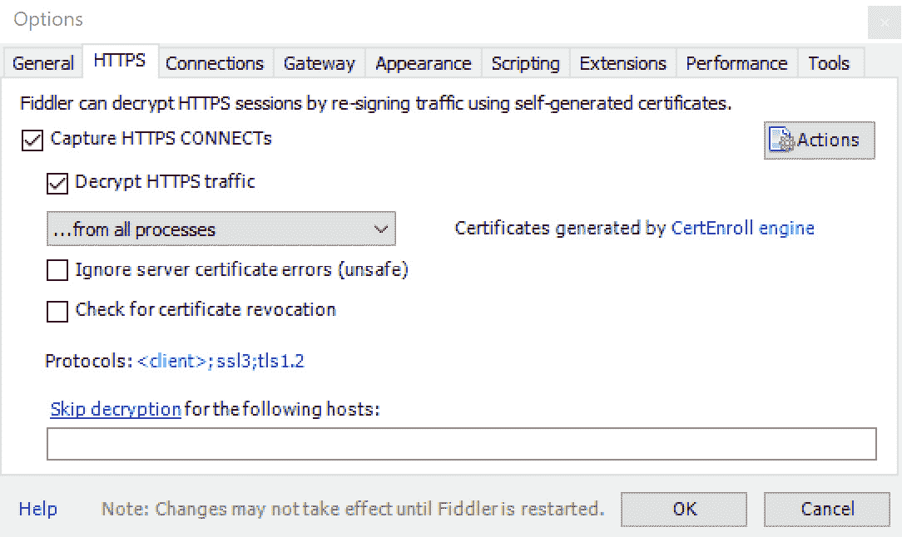

图 1.9–Fiddler HTTPS 捕获设置

将生成一个您需要接受安装的证书，然后您也应该能够监听加密通信。

这种方法在技术上被称为中间人攻击，也可以恶意使用。对于在您自己的开发过程中使用，这不是一个问题，但是对于生产故障排除，您应该使用其他机制来捕获您需要的信息。web 应用将能够截获它接收到的有效流量（即它拥有用于解码的证书），但通过在网络级别捕获的工具，您可能会收集到不应有的额外信息。

Fiddler 还可以用于手工制作 HTTP 请求，因此即使您没有追踪 bug，它也是一个有用的工具：

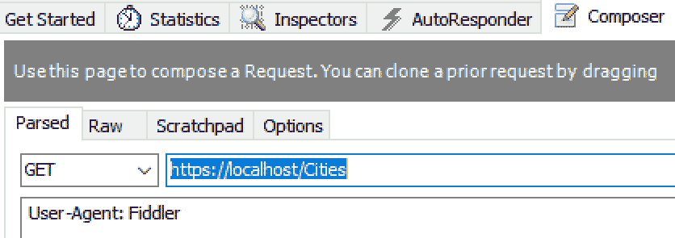

图 1.10–Fiddler HTTP 请求构造函数

如果这是一个错误，您可以通过单击网站来复制自己，VisualStudio 就是您的朋友。您有**输出**窗口，该窗口将提供过程级信息：

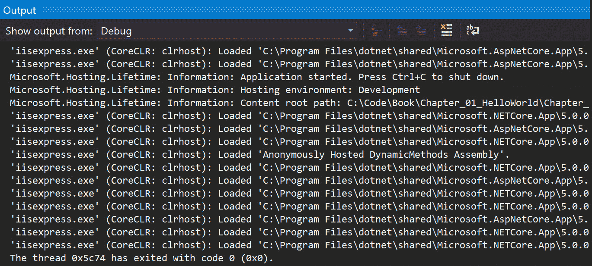

图 1.11–Visual Studio 输出窗口

故障排除通常很复杂，很少有趣，但在处理 web 应用时，直接查看协议级别是一项有用的技能，这些工具应该可以帮助您解决问题。

## 选择 web 服务器选项

如前所述，默认情况下，VisualStudio2019 中包含 IIS Express，如果您正在开发的代码打算在具有 IIS 完整版本的 windows 服务器上运行，则它是一个不错的选择。但是，IIS Express 也有一些缺点：

*   虽然需要的开销比完整的 IIS 要少，但它是“沉重的”，如果您发现自己正在运行调试周期，不断地启动和停止 web 服务器，那么这可能是一个缓慢的过程。
*   IIS Express 是 Windows 唯一的工具。若您的代码在 Linux 上运行（这是一个在.NETCore 中具有跨平台支持的真实场景），那个么它就不能作为选项使用。
*   如果您正在为容器/微服务编写代码，那么当您有多个实例运行各自的 web 服务器时，完整的 IIS 会增加大量开销。（使用微服务，您通常不会在 web 服务器上同时定位多个网站，这就是 IIS 的设计目的。）

为了支持更多的场景，.NETCore 包括一个称为 Kestrel 的精简优化 web 服务器。回到我们在本章前面创建的`Hello World`web 应用，您可以打开根文件夹的命令行并执行命令`dotnet run`：

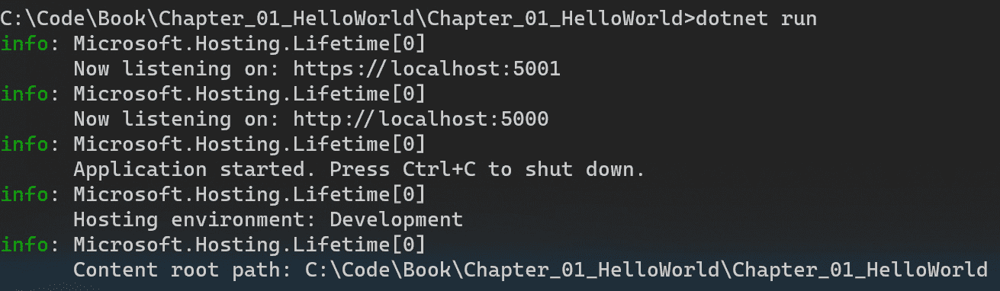

图 1.12–dotnet 运行的输出

如果将浏览器打开至`https://localhost:5001`，则应与从 Visual Studio 启动 IIS Express 相同。

你不必进入命令行就可以使用 Kestrel。您可以在 Visual Studio 中定义多个配置文件——默认情况下都会添加。通过使用 WSL2 安装名为**.NET Core调试的 Visual Studio 扩展，您还可以直接部署到 Linux 安装。（Linux 配置将在[*第 2 章*](02.html#_idTextAnchor038)、*跨平台设置*中介绍）您可以通过打开`launchSettings.json`手动编辑设置：**

```cs
{  "iisSettings": {    "windowsAuthentication": false,    "anonymousAuthentication": true,    "iisExpress": {      "applicationUrl": "http://localhost:65476",      "sslPort": 44372     }  },  "profiles": {    "IIS Express": {      "commandName": "IISExpress",      "launchBrowser": true,      "environmentVariables": {        "ASPNETCORE_ENVIRONMENT": "Development"      }    },    "Chapter_01_HelloWorld": {      "commandName": "Project",      "launchBrowser": true,      "applicationUrl": "https://localhost:5001;          http://localhost:5000",      "environmentVariables": {        "ASPNETCORE_ENVIRONMENT": "Development"      },    "WSL 2": {      "commandName": "WSL2",      "launchBrowser": true,      "launchUrl": "https://localhost:5001",      "environmentVariables": {        "ASPNETCORE_URLS":         "https://localhost:5001;http://localhost:5000",        "ASPNETCORE_ENVIRONMENT": "Development"      }    }  }}
```

此文件仅用于您机器上的开发目的，而不是用于生产的配置。

对于生产使用，Kestrel 和 IIS 是主要的选择。使用哪一个取决于部署到的位置和目标。对于拥有 Windows 服务器的本地场景，部署到 IIS 仍然是一个可行的选择。它附带了现成的有用功能–例如，如果您希望将应用限制为已登录 Active Directory 的用户，则可以在 IIS 中启用此功能，而无需修改代码。（对于细粒度访问控制，您可能还需要代码中的一些机制。）

如果部署到容器中，Kestrel 是一条更容易的路径。但是，在没有生态系统的情况下，您不应该部署到 Kestrel。Kestrel“与代码一起生活”——当代码未运行时，没有可配置的管理界面。这意味着诸如管理证书之类的活动不是现成的。如果您部署到云环境，这通常意味着您将引入其他组件来覆盖 Kestrel 本身没有的组件。证书处理由容器主机或放置在 web 服务器前面的单独服务提供。

# 探索 Visual Studio 代码

NET 中的开发一直与 VisualStudio 相关联，其模式是随着 VisualStudio 的新版本而来的是.NET 的新版本。VisualStudio 仍然是开发人员的好伴侣，因为它经过多年的优化，可以为您提供所需的一切，从编写代码、改进代码到将其引入生产环境。

作为一个纯文本编辑器，它的光芒并不那么强烈。2015 年，微软决定通过发布 Visual Studio 代码来改善这一点。VS 代码提供语法高亮显示、文件的并排比较以及优秀编辑器应该具备的其他功能。提供了一个集成终端，因此如果您正在编写脚本，则不需要切换应用来执行脚本。此外，它还支持使您或其他开发人员能够扩展内置功能的扩展。例如，您可能打开了一个 JSON 文件，却发现它有一些断行和缩进——有一个名为**美化 JSON**的扩展名修复了这个问题。

VS 代码不限于编辑各种基于文本的文件。它具有内置的 Git 支持，可以配置调试器并连接到构建代码的实用程序，等等。它也不局限于.NET 生态系统——它可以用于 JavaScript、Go 和一系列其他语言的编程。事实上，在撰写本文时，它是跨语言和平台的最流行的堆栈溢出开发工具。

在 VS 代码中导航主要在 windows 的左侧完成：

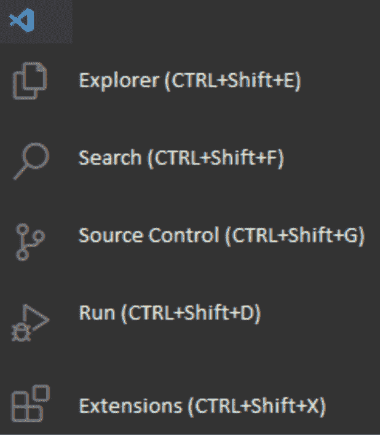

图 1.13–Visual Studio 代码导航菜单

安装扩展时，列表中可能会出现更多图标。（并非所有扩展都有图标。）

在左下角，您还可以找到添加帐户的选项（例如，如果您使用的是利用 Azure 扩展的 Azure帐户）。有关 Visual Studio 帐户图标，请参见图 1.14。


图 1.14–Visual Studio 帐户

在中至右下方窗格中，您可以启用一些控制台窗口：

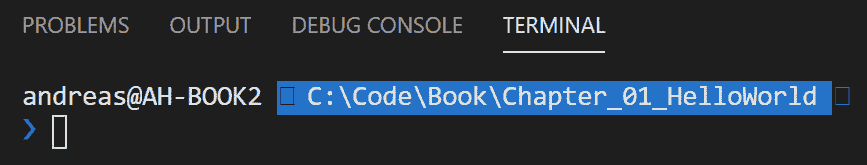

图 1.15–Visual Studio 输出选项卡

请注意，您可能需要第一次通过菜单（**查看****输出**/**调试控制台**/**终端**/**问题**启用这些功能。通过这些，您可以轻松访问应用的运行输出、用于运行命令行操作的终端等。这些文件的相关性取决于您正在编辑的文件类型–对于 JSON 文件之类的文件，**调试控制台**选项卡不会提供任何功能。

在本书的上下文中，您需要安装 C#扩展：


图 1.16–Visual Studio 代码的 C#扩展

这是微软提供的一个扩展，它使 VS 代码能够理解 C#代码和相关工件，如.NET 项目文件。

如果您使用 Git 存储库，还应该查看名为 GitLens 的第三方扩展，它具有跟踪代码更改的有用功能。

# 利用 Windows 终端

在 MS-DOS 的计算时代，一切都围绕着命令行，直到今天，大多数高级用户都必须不时打开 cmd 窗口。问题是，到目前为止，在 Windows 中，这并不总是一种很好的体验。在 Build 2020 期间，微软发布了 1.0 版的**Windows 终端**。虽然您可以完全不用它来完成大部分编程，但我们建议您安装它，因为它有许多优点，我们将在本书后面向您展示。

Windows 终端支持多个选项卡，不仅支持“经典”cmd，还支持 PowerShell、Azure Cloud Shell 和适用于 Linux 的（**WSL**的**Windows 子系统）：**

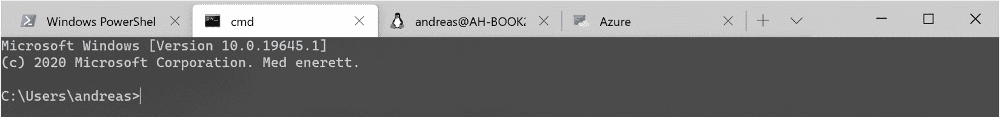

图 1.17–Windows 终端

Azure Cloud Shell 提供了 Azure 的命令行界面实例，即托管在 Azure 中的 Azure CLI。这意味着，与在本地安装 Azure CLI 并使其保持最新不同，您将始终准备好最新版本。您需要一个 Azure 订阅才能使其正常工作，但对于充当包含可执行文件的容器的本地磁盘的存储来说，除了几美分之外，它没有其他成本。

WSL 将在下一章中更详细地介绍，但其简短版本是它为您提供了 Windows 中的 Linux。这是 Linux Shell（不是图形用户界面），因此它也适合 Windows 终端体验。

不管您运行的是哪种类型的终端，它们都有许多可配置的选项，这使它们对程序员特别有用。您可以选择比 Word 文档更适合编程的字体。您可以安装所谓的 glyph，例如，直接在提示符上显示关于您在哪个 Git 分支上的信息。本书不要求您使用 Git，因为它旨在管理和跟踪您的代码，但即使不知道详细的命令，也很容易入门，因此强烈建议您尝试使用它。在当今的大多数开发环境中，它实际上是源代码管理技术。Microsoft 在 Azure DevOps 和 GitHub 中都提供了对 Git 的支持，但也有其他提供商，而且它不是特定于 Microsoft development 或.NET 的。

最终结果可能如下所示：


图 1.18–启用 Git 支持的 Windows 终端

它可以从 Windows 应用商店下载，也可以直接从 GitHub 下载，但是如果您想要自动更新，应用商店会更好。

扩展的 Git 信息需要一些额外的步骤，您可以在[找到这些步骤 https://docs.microsoft.com/en-us/windows/terminal/tutorials/powerline-setup](https://docs.microsoft.com/en-us/windows/terminal/tutorials/powerline-setup) 。

# 总结

我们从一堂历史课开始，让您了解.NET Core的来源，让您能够与经验丰富的.NET 开发人员共享上下文，并对.NET 环境有一个共同的理解。这是一段漫长的旅程，偶尔会有旁敲侧击和奇怪的混乱命名。这一部分的结尾展示了事情是如何简化的，以及微软如何仍在努力使.NET 的故事更易于开发人员理解，无论是大三还是大四的开发人员。

我们还使用了一个基本的 web 应用来更新你的 C#技能。重点主要是展示构成 MVC 模式的 web 应用的不同组件，而不是深入研究一般编程技能。如果您在这一部分遇到了困难，那么在返回本书之前，您可能需要先阅读一篇关于 C 语言的教程。

在学习.NET Core框架和 C#9 版的新功能时，我们引入了一系列新功能。这是一个高级视图，介绍了将在后面章节中更详细介绍的功能。

因为这本书是关于创建 web 应用的，所以我们介绍了一些特定于 web 服务器的细节，以提供在本书后面和现实生活中都有用的背景知识。

本章最后展示了一些推荐用于编程工具带的工具和实用程序。记住，你带的工具越多，你的职业机会就越多！

在下一章中，我们将介绍.NET5 的跨平台故事。这包括在 Linux 和 macOS 上开始使用.NET，以及解释有关跨平台支持的一些概念。

# 问题

1.  为什么引入.NETCore？
2.  .NET Core的可支持性战略是什么？
3.  你能解释一下 MVC 模式吗？
4.  什么是仅限 init 的属性？
5.  你能在.NET5 中使用 WCF 服务吗？

# 进一步阅读

*   *由 Gaurav Aroraa 和 Jeffrey Chilberto 创作的具有 C#和.NET Core的动手设计模式*，来自 Packt Publishing，可在[上获得 https://www.packtpub.com/application-development/hands-design-patterns-c-and-net-core](https://www.packtpub.com/application-development/hands-design-patterns-c-and-net-core)
*   *C#编程：考试 70-483（MCSD）指南*由 Simaranjit Singh Bhalla，Srinivas Madhav Gorthi 编写，来自 Packt 出版社，可在[上获得 https://www.packtpub.com/application-development/programming-c-exam-70-483-mcsd-guide](https://www.packtpub.com/application-development/programming-c-exam-70-483-mcsd-guide)