# *第二章*：跨平台设置

微软在推出.NET Core 时提到的一个主要改进是可以在 Windows 以外的平台上运行.NET 代码。随着每一次迭代，跨平台的故事都得到了改进，除了确保代码可以在其他操作系统上运行之外，在使 Linux 能够在 Windows 上运行方面也有了很大的改进。在运行 web 应用程序的环境中，Linux 是一个很好的主机操作系统，在本章中，我们将介绍如何跨平台开始使用.NET。您将学习如何利用.NET framework，以及如何在 Windows 计算机以及 Linux 和 macOS 上进行设置和启动。我们还将了解如何在 Windows 上对各种 Linux 场景进行故障排除，包括针对 Linux 版本 2（WSL2）的 Windows 子系统。在本章结束时，您将为跨平台开发做好系统准备。

我们将讨论以下主题：

*   利用.NET 框架
*   Windows、Linux 和 macOS 上的入门
*   使用 Visual Studio 2019 在 Windows 上调试 Linux

# 技术要求

本章是关于在不同操作系统上运行代码的，因此，如果您想测试所有选项，您将需要几个设备：

*   Windows 和 Linux 的代码将在 Windows 计算机上运行。
*   macOS 的代码需要一个 Mac 系统。
*   如果使用 Fusion/Parallels 或 Bootcamp，Windows 代码可以在 Mac 上运行。

除设备外，您还需要以下设备：

*   Visual Studio 代码，可用于 Windows、Linux 和 macOS
*   Visual Studio 2019，可用于 Windows 和 macOS

请访问以下链接查看 CiA 视频：[https://bit.ly/3qDiqYY](https://bit.ly/3qDiqYY)

查看本章的源代码：[https://github.com/PacktPublishing/ASP.NET-Core-5-for-Beginners/tree/master/Chapter%2002](https://github.com/PacktPublishing/ASP.NET-Core-5-for-Beginners/tree/master/Chapter%2002)

# 利用.NET 框架

从一些琐事开始，曾经有一段时间微软在其他操作系统上玩得很好。在开发 Windows 3.0 时，微软与 IBM 合作开发了一个名为 OS/2 的操作系统。Windows 运行在 MS-DOS 的之上，所以从技术上讲，它不像今天这样是一个操作系统。相比之下，OS/2 是一个完整的操作系统，不需要先通过 DOS。OS/2 的妙处在于它包含了来自 Windows 的二进制文件，因此它能够在非 MS 操作系统上运行 Windows 应用程序。不仅如此，由于 OS/2 拥有不同的操作模式和更先进的（当时）内存管理，它能够比 Windows 本身更好地运行 Windows 应用程序。当应用程序崩溃时，不是整个计算机都被锁定，而是在继续进行之前终止了应用程序。

这一伙伴关系在文化和技术上并非没有问题。这两家公司有分歧，所以没有持续下去。微软继续为专业市场构建 Windows NT 平台，为消费市场构建 Windows 95 平台，OS/2 也自行消亡。从那时起，微软就不再是一个与“跨平台”一词用在同一句话中的名字了，它的每一点努力都投入到了构建 Windows 生态系统中。

.NET 从 Windows 诞生之初就不存在，多年来它也有自己的成长烦恼，我们在上一章中已经介绍过。

快进到现代，微软将非常高兴地告诉你 Linux 在他们的云计算平台上运行得有多好，并将为你提供使.NET 代码在 Linux 操作系统上运行所需的一切。这艘船花了 20 年的时间才得以扭转，但如今的道路肯定不同了。让我们先看看为什么我们应该跨平台，什么时候不应该跨平台。

## 为什么要跨平台？

当我们使用术语*跨平台*时，我们实际上可能指的是不同的东西。

您拥有开发.NET 应用程序所需的.NET 5 SDK。这在macOS 上起作用的事实意味着开发人员不需要 Windows 计算机来开发 Windows 软件，而且由于 MacBook 在科技界很受欢迎，这就拓宽了.NET 的潜在开发受众。

您还拥有运行.NET 应用程序所需的.NET 运行时。这在 Linux 上工作的事实意味着您不必在 Windows 上运行应用程序，对于服务器来说，这是一件大事。由于经典的 Windows 服务器具有运行 Internet 信息服务的 UI，仅操作系统就占用了数千兆字节的空间。一个精简的 Linux 安装，加上一个命令行，可能只有 50 兆字节。如果你想运行云本地应用程序，这是一个重大的胜利。

## 为什么不跨平台？

OS/2 是一个有趣的实验，但即使合作关系保持友好，从长远来看，启用这种跨平台解决方案可能会变得复杂。我们在第一章中解释了托管代码和本机代码之间的区别，IBM 使用的方法基本上是引入 Windows 来提供本机功能。NET 当时还没有发明，其他框架也不一定具有强大的跨平台功能。随着时间的推移，这将不是一种可持续的方法。想象一下，Windows 中的一个安全缺陷需要 IBM 更新其操作系统，并通过广泛的测试和验证来保持兼容性。

这个解释的简短版本是：如果依赖本机/非托管代码，跨平台可能会很痛苦。

某些应用程序仍然需要本机代码和非托管代码，因此跨平台可能不是这些情况下的最佳选择。例如，在 iPhone 的早期，没有手电筒应用程序，但一些聪明的人发现他们可以与相机互动，并将手电筒用作手电筒。这是在 Xamarin 成为一个可行的选项之前，但这很可能超出了实现它的.NET 托管代码的范围。

如果您想从运行代码的设备中挤出最后一个 CPU 周期，那么收集的内存对象（即垃圾）可能会将您丢弃，因为您无法可靠地预测它们。如果您可以自己处理管理内存的开销，那么您可能希望使用较低级别的语言进行全面优化。一个传统的例子是游戏，早期的 3D 游戏都有用汇编代码编写的关键部分，以及使用库时无法控制的数学运算的算法调整。另一方面，这不仅仅影响跨平台；对于代码中的某些指令，开发人员还必须说明机器运行哪一代 CPU。

## 跨平台编码与单平台编码相结合

你可能会认为，如果你必须跟踪实际的硬件而不依赖于库，那么编写整个游戏听起来很难。这是正确的。这很难，大多数开发人员使用多种语言组合来创建他们的游戏，因为不太重要的部分当然可以用更友好的开发人员语言实现。

这就引出了这样一个问题：是否也可以用.NET 实现这一点。答案是肯定的，这是通过一个名为**平台调用服务**或简称**P/Invoke**的功能实现的。这是一种转义托管.NET 运行时的机制。您可以调用 API 和服务，这些 API 和服务是通过平台本机接口或以.NET 系列以外的语言实现的组件公开的。例如，您可以调用为.NET 不支持的特定硬件编写的驱动程序。

虽然 Microsoft 可以确保.NET 运行时跨平台运行，但当您走出.NET 生态系统时，无法保证这一点。因此，您可能有一个混合了跨平台和单一平台的.NET 应用程序。可以制定处理这一问题的策略，但这一跨平台实现级别超出了本书的范围。然而，我们将在 Blazor 的覆盖范围内探索一个类似的概念，在这里，您可以执行所谓的 JavaScript 互操作，从而超越.NET 提供的功能。

## .NET 跨平台可用性

那么，当我们说跨平台时，我们是指*每个*平台吗？不，不是真的，但是有很多选择：

*   Windows x86/x64/ARM:ARM 在 OEM 中并不广泛可用，但 Microsoft 拥有在 ARM 上运行 Windows 的 Surface Pro X 设备。请注意，并非所有常规 Windows 应用程序都可在此平台上使用，因此即使有仿真选项，您的里程数也可能有所不同。
*   马科斯
*   Linux
*   iOS（通过 Xamarin）
*   Android（通过 Xamarin）

请注意，尽管 macOS 适合于开发.NET web 应用程序，但它并不是为其他环境运行应用程序的一个真正选项，即使从技术上讲，没有什么可以阻止您。Web 应用程序本质上意味着有一个运行后端代码的服务器。苹果没有为服务器用例提供硬件，他们的设备设计成客户端。

### 基于 ARM 的 mac

苹果公司宣布，他们将使用自己设计的 CPU，而不是英特尔的 CPU。此体系结构与当前版本的.NET for macOS 不兼容。NET 不需要 Intel CPU 或特定的CPU 体系结构（如 ARM 体系结构的 Windows 所示），但运行时仍需要更新。

在写这本书的时候，还不知道苹果对未来的设备有什么计划，也不知道微软将采取什么措施来确保.NET 在这些设备上运行。在本书中，我们使用了基于 Intel 的 Mac 设备，目前无法推测未来会发生什么。

## 什么跨平台不适合你

NET 支持跨平台的事实并不意味着您必须实现一个可以在所有操作系统上运行的应用程序。如果您想使用 Windows 开发一个只在 Linux 上工作的应用程序，这是可以的。但是，您应该知道，跨平台支持并不能保证您编写的所有代码都能跨所有平台工作。

例如，如果您的应用程序将文本保存到文件系统，您可能会尝试将文本文件写入`c:\WebApp\HelloWorld.txt`。这种类型的文件引用是 Windows 操作系统工件。编写此代码时不会出现警告，.NET 也不会阻止其编译。只要应用程序在 Windows 上运行，一切都应该是好的。

但是，如果应用程序在 Linux 上运行，则会出现运行时异常，因为 Linux 不理解这种类型的文件系统。Linux 希望您将该文件引用为`/mnt/c/webapp/HelloWorld.txt`。（不同的发行版对实际的文件层次结构有不同的约定。）如果你有良好的异常处理，应用程序可能会优雅地绕过这个问题，但如果没有，它将停止运行，并给你留下糟糕的跨平台体验。

在本章的后面，在我们介绍了在多平台上运行的基本知识之后，我们将重新讨论如何应对这些挑战。

# 在 Windows、Linux 和 macOS 上入门

跨平台之旅的第一步是让基础工作在我们提到的 Windows、Linux 和macOS 平台上运行。我们将在以下部分中介绍这一点，以确保您在多平台故事的这一部分中走上正轨。

## 窗户

在上一章中，我们在开始使用 Windows 上的.NET 5 时提到了，因此，如果您遵循该指南，您应该已经有了该平台的功能设置。因此，我们在此不再重复这些说明。

## Linux

Linux 是一种流行的服务器工作负载操作系统，它为大量在 Azure 中运行的虚拟机提供了动力。对于桌面上的普通终端用户来说，Linux 不像 Windows 那样受欢迎，但是对于开发人员来说，使用 Linux 有很多好处。

在开发在容器中运行的微服务时，Linux 是一个不错的选择，因为在许多情况下，您将能够运行精简的映像。容器不是本章的主题，您可以期待第 8 章[](08.html#_idTextAnchor168)*、*容器*，但 Linux 是.NET 跨平台故事的一部分，即使没有容器。*

 *您可以直接在计算机上安装 Linux，也可以安装.NET 开发所需的一切，但这里我们将向您展示如何通过 Linux 的 Windows 子系统在 Linux 上使用 Windows 进行开发。

## Linux Windows 子系统（WSL）

Linux 非常适合开发，因为程序员所需的许多工具都是操作系统的一部分。但是，对于涉及 Outlook 和 Word 等应用程序的一般办公用途，Windows 通常是大多数人的更好选择。当然，如果你能同时拥有 Linux 和 Windows，那就太好了。

很长一段时间以来，Windows 一直以不同的形式支持虚拟化，而且由于 Linux 与 Windows 在同一硬件上运行（并且在许多情况下是免费的），因此，如果需要，使用 Linux 运行虚拟机是一种常见的选择。然而，虚拟机的意义在于拥有与主机分离的东西。因此，即使是很小的事情，比如文件进出 Linux 虚拟机，也不是很顺利。

2016 年，微软推出了针对 Linux 的**Windows 子系统**（**WSL**），让 Linux 操作系统更接近于 Windows 的一部分，您可以在 Windows 10 中安装所选发行版的特殊版本。WSL2 进一步改进了这一点，它是在 Windows 10 2004 中引入的，在 Windows 10 2004 中，Linux 可以成为 Windows 的一个集成部分。（Windows 10 的当前版本名为 20204，表示该版本首次发布于 2020 年，第四个月为 4 月。）

让我们先安装 WSL2，然后再继续在 Linux 上运行代码。

注意这是自 2020 年 5 月版本的 Windows 10 开始的安装过程。在未来的版本中，情况可能会发生变化。

您的计算机需要能够运行 Hyper-V 和 Windows 10 2004（或更高版本）。大多数现代计算机将能够运行 Hyper-V，但如果您的开发人员机器是虚拟化的，那么启用 WSL2 可能会出现问题。

要安装 WSL2，请执行以下步骤：

1.  以管理员身份打开命令提示符。
2.  运行以下命令安装 WSL:

    ```cs
    dism.exe /online /enable-feature /featurename:Microsoft-Windows-Subsystem-Linux /all /norestart
    ```

3.  使用以下命令启用虚拟机平台：

    ```cs
    dism.exe /online /enable-feature /featurename:VirtualMachinePlatform /all /norestart
    ```

4.  重新启动计算机。
5.  从[下载最新的 WSL2 内核 https://wslstorestorage.blob.core.windows.net/wslblob/wsl_update_x64.msi](https://wslstorestorage.blob.core.windows.net/wslblob/wsl_update_x64.msi) 。
6.  Run the installer, as shown in *Figure 2.1*:

    

    图 2.1–WSL2 内核安装程序

7.  使用以下命令将WSL2 设置为默认版本：

    ```cs
    wsl –-set-default-version 2
    ```

8.  Download a Linux distribution from the Microsoft Store. For this book, we have used Ubuntu 20.04 LTS (see *Figure 2.2*):

    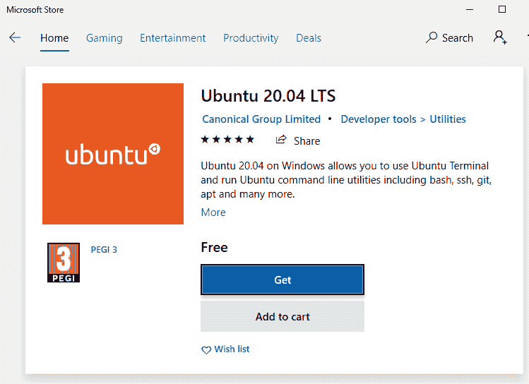

    图 2.2–Microsoft 应用商店中的 Ubuntu 20.04 LTS

9.  Click Launch to start Linux for the first time:

    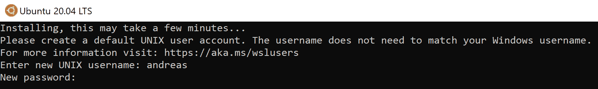

    图 2.3–设置 Linux 的用户名和密码

10.  为 Linux 安装定义用户名和密码（请参见*图 2.3*。（这与您的 Windows 凭据无关，可能会有所不同。）您现在应该在一个普通的 Linux shell 中找到自己。
11.  Since this operating system lives its own life, it is suggested to start by updating to the latest patches by running `sudo apt update && sudo apt upgrade`, as shown in *Figure 2.4*:

    

    图 2.4–更新 Linux 发行版

12.  按*Y*继续，您应该可以出发了。

Windows 还应该自动配置与非 Linux 硬盘驱动器分区的集成。因此，如果打开 Windows 资源管理器，您应该会在那里找到 Tux（Linux 吉祥物）：

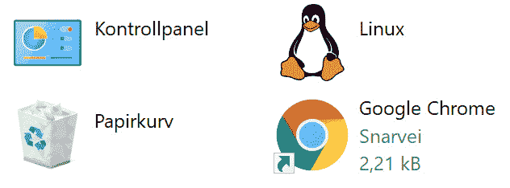

图 2.5–Windows 资源管理器中的 Linux 集成

您还可以从 Windows 浏览 Linux 文件系统，并将文件复制到您的 Linux 分区和从您的 Linux 分区复制文件（请参见*图 2.6*：

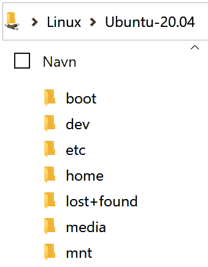

图 2.6–Windows 资源管理器中的 Linux 文件系统

请注意，在后台，Linux 文件系统的处理方式与 Windows 文件系统不同，因此只将您打算在 Linux 内部运行的文件放在这些文件夹中，反之亦然。如果您有在 Linux 内部运行的应用程序，则不应将这些应用程序放在 Windows 分区中。这样做不会导致损坏，但性能可能会降低。

Ubuntu安装程序会自动启动一个命令行，但如果您按照上一章中的说明安装 Windows 终端，Ubuntu 20.04 应该会自动添加。本书将在本章中继续使用 Windows 终端，但这两个选项都可以使用。

### 在 Linux 上安装.NET

我们建议您使用 APT 在 Ubuntu 上安装.NET：

1.  运行以下命令添加 Microsoft 的存储库：

    ```cs
    wget https://packages.microsoft.com/config/ubuntu/20.04/packages-microsoft-prod.deb -O packages-microsoft-prod.deb sudo dpkg -i packages-microsoft-prod.deb
    ```

2.  安装 SDK：

```cs
sudo apt-get update; \sudo apt-get install -y apt-transport-https && \sudo apt-get update && \sudo apt-get install -y dotnet-sdk-5.0
```

笔记

在 Linux 上安装.NET 有几种不同的方法，随着时间的推移，情况可能会发生变化。如果您在安装.NET 时遇到问题，请在线查看[上的说明 https://docs.microsoft.com/en-us/dotnet/core/install/linux-ubuntu](https://docs.microsoft.com/en-us/dotnet/core/install/linux-ubuntu) 。

现在，创建和运行.NET 应用程序所需的一切都已就绪。是时候在实践中检验理论了：

1.  创建新目录并更改为：

    ```cs
    mkdir LinuxHelloWorld && cd LinuxHelloWorld
    ```

2.  在 WSL2 中运行的 Linux 还不支持图形用户界面，因此我们需要通过非图形实用程序进行编辑：

    ```cs
    sudo vi View/Home/Index.cshtml
    ```

3.  Vi 不是完全直观，但按*插入*并编辑代码，如下所示：

    ```cs
    @{    ViewData["Title"] = "LinuxHelloWorld";}<div class="text-center">    <h1 class="display-4">Running on @Environment.        OSVersion</h1></div>
    ```

4.  要保存并退出，请按*Esc*，然后按*：wq*，然后点击*进入*。
5.  Test the app with `sudo dotnet run`. You should see the output indicate that it is running. See *Figure 2.7*:

    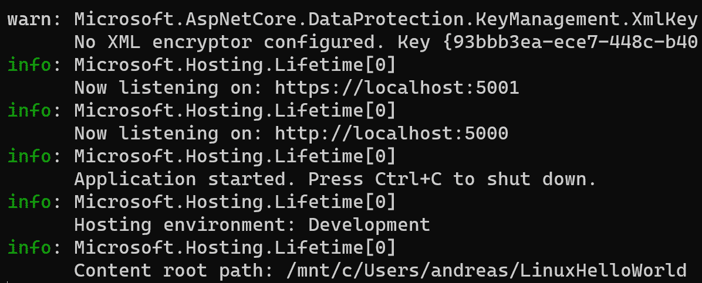

    图 2.7–在 Linux 上运行 dotnet

6.  You can test this with some more cross-platform magic. You do not have a browser running on this Ubuntu. You most likely do have one in Windows 10, so you can open that and browse to `https://locahost:5001`. See *Figure 2.8* for an example of browsing a web app that's running on Linux:

    

    图 2.8–浏览 Linux 上运行的 web 应用程序

7.  返回 Linux shell，用*Ctrl*+*C*终止正在运行的应用程序。

我们看到实用程序足以对代码进行小的编辑，但并不是每个人都想把 Vi 作为编写 C#代码的编辑器。

六“退出战略”

如果您是 Vi 新手，它可能会让人困惑，因为它的工作方式与您在 Windows 世界中可能习惯的大多数文本编辑器不同。您可能最终不确定您实际编辑了什么，或者如何更正它。退出策略（如果您觉得犯了错误）是在不保存更改的情况下退出 Vi。按*Esc*键，按*：*（冒号）（您应该看到它出现在左下角），然后输入*q！*（包括感叹号），后接*回车*。然后，您可以重新尝试使用干净的板岩进行编辑。

幸运的是，这里还有另一个选择。在上一章中，我们向您展示了 VisualStudio 代码是多么有用，因此，如果您还没有安装它，请这样做。我们将逐步介绍如何使用 Visual Studio 代码（VS 代码）作为 Linux 上代码的编辑器：

1.  打开 Visual Studio 代码（在 Windows 10 中）。
2.  Install the **Remote – WSL** extension from within VS Code. See *Figure 2.9*:

    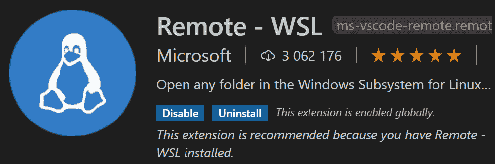

    图 2.9–Visual Studio 代码远程 WSL 扩展

3.  返回 WSL 中的 Linux shell 并键入`code .`（包括标点符号）。
4.  After an initial bit of setup work, Visual Studio Code will load in Windows 10\. You will observe that there's an indicator in the lower-left corner referring to WSL. See *Figure 2.10*:

    

    图 2.10–连接到 WSL 的 Visual Studio 代码

5.  If you have the **C# Extension** installed in VS Code, you can go to the debug pane (at the bottom). See *Figure 2.11*:

    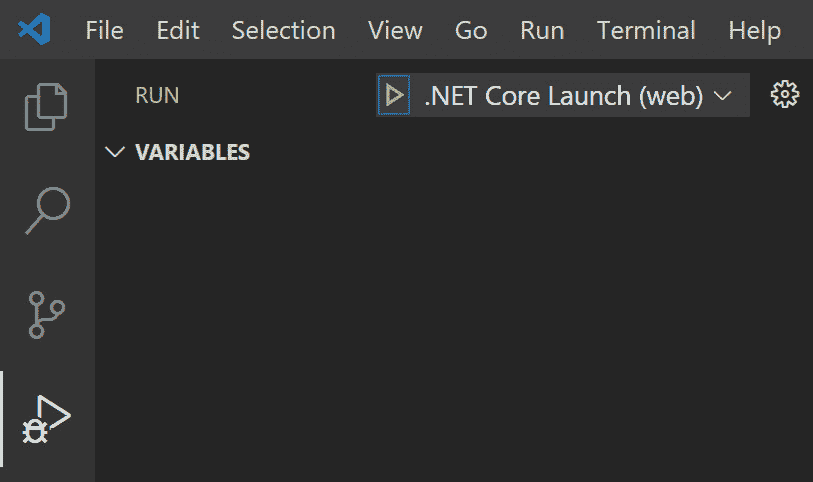

    图 2.11–.NET Linux 调试选项卡

6.  单击绿色小箭头启动调试器。当事情完成构建后，您应该看到与之前相同的输出，并且`LinuxHelloWorld`应用程序在浏览器中运行。（VS 代码为您启动浏览器。）如果您查看终端窗口，您将看到应用程序在 WSL 中启动。参见*图 2.12*：


图 2.12–Visual Studio 代码终端输出

此会话与您在 Windows 终端 shell 中运行的会话是独立的，因此如果您愿意，可以在那里并行工作。

现在您可以在 Windows 中开发代码，该代码在 Windows 上运行的 Linux上执行。这可能需要一点时间来理解，但本节的要点是 Linux 的跨平台故事非常强大。

如果你有一个苹果设备（运行 macOS），那么你现在就可以把它拿出来。接下来，我们来看一下.NET 的 mac 故事。

## 马科斯

有两种主要工具可用于在 Mac 上开发.NET 应用程序。您可以使用 Visual Studio for Mac 或 Visual Studio 代码。我们首先来看一下如何使用 VisualStudio 代码（VS 代码）。您可以从[下载 https://code.visualstudio.com/](https://code.visualstudio.com/) 。

安装 Visual Studio 代码后，我们建议您使其可以从 shell 访问，以便可以从终端启动它。

要使 VS 代码可访问，请执行以下步骤：

1.  启动 VisualStudio 代码。
2.  Open the command palette (*Shift*+*cmd*+*P*) and type `shell command`, as shown in *Figure 2.13*:

    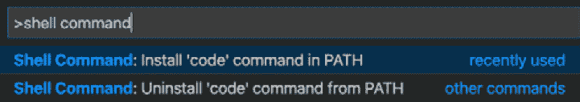

    图 2.13–shell 命令安装程序

3.  You will also want to make sure the C# extension is installed for VS Code. See *Figure 2.14*:

    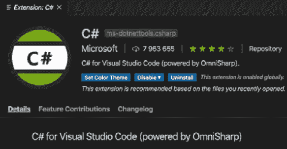

    图 2.14–Visual Studio C#扩展

    完成后，您可以转到[安装.NEThttps://dotnet.microsoft.com/download?initial-os=macos](https://dotnet.microsoft.com/download?initial-os=macos)。

4.  Open the installer, and you will be greeted with a wizard for installing .NET. See *Figure 2.15*:

    

    图 2.15–macOS 的.NET 安装程序

    除非您想修改安装的存储位置，否则您可以通过选择**下一个**选项来点击安装位置。

5.  To verify the .NET version on macOS, open the Terminal and run `dotnet –version`. See *Figure 2.16*:

    

    图 2.16–在 macOS 上验证.NET 版本

6.  You also need to generate certificates to run with HTTPS. This is done with the `sudo dotnet dev-certs https –-trust` command, as shown in *Figure 2.17*:

    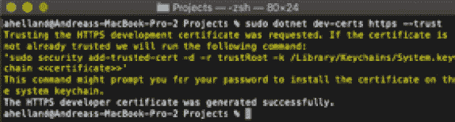

    图 2.17–在 macOS 上生成和安装开发人员证书

7.  创建一个文件夹（`mkdir webapp`）并将其更改为（`cd webapp`）。
8.  运行`dotnet new mvc`生成一个简单的 web 应用程序。然后，运行`code .`在 Visual Studio 代码中打开它。
9.  You might see a notification in the lower-right corner about missing assets. See *Figure 2.18*:

    

    图 2.18–Visual Studio 代码中缺少的资产

    您应该点击**是**添加资产。

10.  VS Code shows the file structure on the left-hand side of the UI. See *Figure 2.19*:

    

    图 2.19–Visual Studio Mac 代码中的文件结构

11.  打开`Index.cshtml`并对

    ```cs
    @{    ViewData["Title"] = "LinuxHelloWorld";}<div class="text-center">    <h1 class="display-4">Running on @Environment.        OSVersion</h1></div>
    ```

    内容进行小编辑
12.  要设置断点，请单击行号（6）旁边的。
13.  There is a separate debug section:

    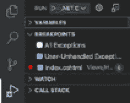

    图 2.20–macOS 上的 Visual Studio 代码调试窗格

14.  单击绿色小箭头启动程序。它应该启动浏览器，如下图所示：


图 2.21–浏览在 macOS 上运行的 web 应用程序

你会注意到它并没有说 Mac 或苹果，但对于初学者来说，你解决的主要问题是你设法让.NET 工作。这就完成了在 Mac 上安装 VS 代码。

如前所述，您还可以在 macOS 上安装更完整的 Visual Studio 版本。

### Visual Studio 2019 for Mac

Visual Studio 代码是一种不错的体验。但是，Visual Studio 2019 在 macOS 上可用，因此您可能更喜欢它。

总的来说，它给人的感觉更像“Mac 风格”。（外观、感觉和交互都与 Mac 的整体体验相似。）文件层次结构在左窗格中，如*图 2.22*所示：

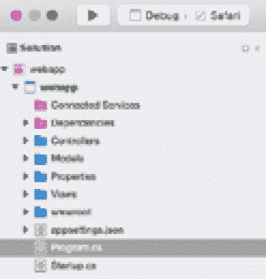

图 2.22–Visual Studio 2019 for Mac 文件层次结构

在 VisualStudio 的中间，主窗格与 Windows 对应的外观略有不同（参见图 2.23）


图 2.23–Visual Studio 2019 for Mac 主窗格

与 Windows 体验一样，VisualStudio2019（VS 2019）中的选项比 VisualStudio 代码更多。因此，对于 web 应用程序开发，主要取决于您喜欢哪种工具，VS2019 中的旋钮和刻度盘比 VS 代码中的多，而基本的功能在这两种工具中都存在。对于 VS2019，Visual Studio Community For Mac 是免费版本。

Visual Studio for Mac 最初基于 Xamarin Studio for Mac。如果您对苹果平台的移动开发感兴趣，那么使用完整版本的 VisualStudio 而不是 VisualStudio 代码可能是更好的选择。我们将在本章后面的*移动设备跨平台*一节中再次讨论此主题。

## 跨平台和集装箱上的一个词

集装箱是当今的热门话题，将在[*第 9 章*](09.html#_idTextAnchor187)、*集装箱*中详细介绍。然而，我们应该解释集装箱和跨平台之间的关系。

前面的部分向我们展示了直接在平台上运行代码。Linux 版本在 Ubuntu 上运行，macOS 版本在 Macbook 上运行。对于更高级的用例，您可能希望将代码容器化，但这并不意味着您可以自由地混合和匹配这些技术。

容器可与*虚拟机 lite*相媲美，它取决于运行它的主机。这意味着 Linux 容器需要在 Linux 主机上运行。运行 Windows Server 2019 容器需要 Windows Server 2019 主机。这也适用于 Windows Server 版本—Windows Server 2016 主机将运行 Windows Server 2016 容器，并且不支持 Windows Server 2019 容器。Windows 10 上的 Linux 容器不包含在跨平台兼容性中。

然而，WSL2 可以作为 Linux 主机运行。因此，您可以在 WSL 之上运行 Linux 容器，并实现跨平台容器开发。我们将在[*第 9 章*](09.html#_idTextAnchor187)*集装箱*中对此进行扩展。

有了合适的硬件，您可以将 Windows 与 Hyper-V 一起使用，并将 Linux 虚拟机作为 Linux 主机，在上面运行基于 Linux 的容器。

难怪您可能会对其中涉及的所有虚拟化层感到困惑。

## 让你的代码跨平台

在开始构建跨平台解决方案时，您需要确保 Hello World web 应用程序在多个 Windows 上运行。然而，享受这些平台带来的好处还有很多。让我们看一下 Microsoft 如何提供内置机制，以及您自己可以做些什么。

### 背景工作者服务

在 ASP.NET web 应用程序中，用户界面中发生的许多事情都是事件驱动的。例如，在上一章中，我们向您展示了 C#9 中的一些新特性，包括美国城市的示例类，它由名称和邮政编码组成。因此，如果将其扩展到 ASP.NET 应用程序，您可能会构建一个网页，其中包括一个用于输入邮政编码的文本框和一个用于查找相应城市名称的按钮。

邮政编码是相当固定的，不是每周都会改变的。但是，您可能仍然希望确保数据库是最新的，因此您可以选择与美国邮政服务的主数据库执行同步（例如）。这不会由最终用户在 UI 中单击来驱动，但会在后台自行发生。

.NET 有一个模板适用于此*工作者*，该模板生成一个控制台应用程序，您可以使用此类功能进行扩展。默认行为是打印当前日期时间，这对于我们的目的来说已经足够了，但是您可以自己使其更高级。

打开命令行，创建一个新目录，然后切换到此目录。完成后，执行以下步骤创建新解决方案：

1.  运行`dotnet new worker`。
2.  运行`dotnet add package Microsoft.Extensions.Hosting.WindowsServices`。
3.  运行`dotnet add package Microsoft.Extensions.Hosting.Systemd`。
4.  Run `dotnet run`:

    

    图 2.24–使用 dotnet 运行辅助服务

5.  运行`code .`以 Visual Studio 代码加载项目。

这很好地工作，但有一个缺少的部分。它目前作为控制台应用程序运行，这意味着它必须在控制台窗口中启动和运行。这不适合一个网站，因为它应该完全在后台完成。

在 Windows 中，这是通过将应用程序作为 Windows 服务安装完成的（请参见*图 2.25*：


图 2.25–Windows 服务

这听起来不像是跨平台的，这可能并不奇怪。

Linux 有一个类似的结构，称为**systemd**，因此是一个操作系统级别，您不会被阻止。在 Linux 中，服务是通过.NET 支持的 systemd 守护进程实现的。

WSL 与 systemd

请注意，在编写本书时，Linux 的 Windows 子系统不支持 systemd。这意味着为了在 Linux 上完全测试此代码，您需要本地运行的 Linux 虚拟机或 Azure 中运行的 Linux 虚拟机的实例。

换句话说，我们需要修改应用程序以支持两个操作系统概念。这听起来很复杂，但实际上相当简单。

回到 VisualStudio 代码，打开`Program.cs`并做一些小的更改，看起来像这样：

```cs
using Microsoft.Extensions.DependencyInjection;using Microsoft.Extensions.Hosting;
namespace Chapter_02_Workers {  public class Program   {    public static void Main(string[] args)    {      CreateHostBuilder(args).Build().Run();    }
    public static IHostBuilder CreateHostBuilder(string[] args)     =>      Host.CreateDefaultBuilder(args)        .UseWindowsService()      .UseSystemd()                    .ConfigureServices((hostContext, services) =>      {        services.AddHostedService<Worker>();      });  }}
```

这里的两个重要部分是`UseWindowsService`和`UseSystemd`。NET 运行时能够理解它是在 Windows 还是 Linux 上执行，然后它将使用相应的版本。它将忽略另一个，因此您不需要使用额外的逻辑来确定使用哪一个。

运行前面的代码将产生与前面相同的输出，因此您不会立即注意到更改。重要的是要理解，尽管前面的代码将使代码跨平台，但它不会自动将自身安装为 Windows 服务或 systemd 守护程序。

要在开发人员计算机上安装 Windows 服务，请在命令行窗口中运行以下命令：

1.  `dotnet publish –configuration Release`
2.  `sc create dotnetService binPath = c:\code\foo.exe`（其中`foo.exe`为上一条命令生成的文件）
3.  `sc start dotnetService`

这将帮助您完成开发目的，但当将代码移动到本地开发人员计算机上未运行的其他环境时，它可能不起作用。在这些情况下，设置服务可能是一个更复杂的过程，因此，如果需要这样做，可以使用另一个配置过程。本章附录中有关于如何设置服务的说明。

对于 Linux，说明如下所示：

1.  运行`sudo nano /etc/systemd/system/dotnetd.service`创建服务。
2.  确保内容与此类似：

    ```cs
    [Unit]
    Description=.NET Chapter 02 systemd daemon
    [Service]
    WorkingDirectory=/var/www/dotnetd
    ExecStart=/usr/local/bin/dotnet /var/www/dotnetd/dotnetd.dll
    Restart=always
    # Restart service after 10 seconds if the dotnet service # crashes.
    RestartSec=10
    KillSignal=SIGINT
    SyslogIdentifier=dotnet-daemon
    User=apache
    Environment=ASPNETCORE_ENVIRONMENT=Production 
    [Install]
    WantedBy=multi-user.target
    ```

3.  启用服务：`sudo systemctl enable kestrel-dotnetd.service`。
4.  启动服务：`sudo systemctl start kestrel-dotnetd.service`。
5.  Verify that the service is running: `sudo systemctl status kestrel-dotnetd.service`.

    输出与此类似：

    ```cs
    kestrel-dotnetd.service - .NET Chapter 02 systemd daemon
        Loaded: loaded (/etc/systemd/system/kestrel-dotnetd.service; enabled)
        Active: active (running) since Thu 2020-10-18 04:09:35 CET; 35s ago
    Main PID: 9021 (dotnet)
        CGroup: /system.slice/kestrel-dotnetd.service
                └─9021 /usr/local/bin/dotnet /var/www/dotnetd/dotnetd.dll
    ```

这是一个很好的例子，说明了.NET 是如何帮助您的，但并不是所有的用例都能那么容易地解决。接下来，我们将介绍一个更详细的跨平台功能示例。

## 更复杂的跨平台示例

在某些情况下，您需要处理跨平台的问题，这些问题比.NET 能够自动处理的要多。我们已经提到 Linux 如何不理解`c:\WebApp\HelloWorld.txt`，所以让我们看一个稍微复杂一点的例子。

假设我们有一个网站，我们依赖于对文本字符串进行加密和/或签名。（这可能是更大的身份系统的一部分。）我们建议使用证书来实现这一点。我们希望这段代码能够在 Windows 和 Linux 上运行，并且大多数使用证书的方法都应该是完全跨平台兼容的。但是，Windows 和 Linux 在操作系统级别上使用证书的方式不同。更具体地说，它们以不同的方式生成和访问。我们将实施这两种选择。

要在 Windows 上生成证书，请执行以下步骤：

1.  使用 PowerShell 选项卡打开 Windows 终端。
2.  运行以下命令：

    ```cs
    $cert = New-SelfSignedCertificate -Type Custom -Subject "CN=Chapter_2_Certificate" -TextExtension @("2.5.29.37={text}1.3.6.1.5.5.7.3.3") -KeyUsage DigitalSignature -KeyAlgorithm RSA -KeyLength 2048 -NotAfter (Get-Date).AddYears(2) -CertStoreLocation "Cert:\CurrentUser\My" $cert.Thumbprint
    ```

3.  记下指纹，因为我们需要它在代码中。参见*图 2.26*：


图 2.26–在 Windows 上生成证书

您还可以验证 Windows 10 中**用户证书**存储中是否存在该证书（请参见*图 2.27*。（可以通过在 Windows 中的搜索栏上开始键入`certificate`来找到它。）：


图 2.27–Windows 10 中的用户证书存储

要在 Linux 上生成证书，请执行以下步骤：

1.  使用 Ubuntu 20.04 选项卡打开 Windows 终端。
2.  Run the following commands:

    ```cs
    openssl req -x509 -newkey rsa:4096 -keyout myKey.pem -out cert.pem -days 365 -nodes openssl pkcs12 -export -out keyStore.p12 -inkey myKey.pem -in cert.pem openssl x509 -in cert.pem -noout -fingerprint
    ```

    生成证书时需要提供一些值，但出于本章的目的，这些值不需要与任何实际数据相一致。

    提示时不要输入密码，只需按*enter*键设置空/空密码即可。

3.  记下指纹，因为我们以后需要它。

您可能会注意到，在 Windows 和 Linux 中，指纹看起来不同。Windows 使用的格式是*12AB…*，而 Linux 则输出*12:AB:…*。这纯粹是视觉表现的问题。Linux 以更可读的格式打印，但实际的指纹格式并不不同。如果从 Linux 版本中删除冒号，您将看到字符数与 Windows 版本相同（如*图 2.28*所示）：


图 2.28–在 Linux 上生成证书

有了 Windows 和 Ubuntu 的证书，我们将创建一个使用它的 web 应用程序。为了不使事情复杂化，此代码只加载证书并打印出指纹和通用名称，以验证代码能够读取（和使用）证书。创建使用证书的应用程序的步骤如下：

1.  打开 Windows 终端并新建目录：`C:\Code\Book\Chapter_02_Certificates`。
2.  切换到目录并运行`dotnet new mvc`。
3.  运行`dotnet add package Microsoft.IdentityModel.Tokens`。
4.  使用`code .`启动 Visual Studio 代码。
5.  打开`HomeController.cs`。
6.  在顶部添加以下两行`using`：

    ```cs
    using System.Security.Cryptography.X509Certificates;using Microsoft.IdentityModel.Tokens;
    ```

7.  Edit the controller to look like this (some parts are omitted for readability):

    ```cs
    public class HomeController : Controller   {    private readonly ILogger<HomeController> _logger;    private static Lazy<X509SigningCredentials>       SigningCredentials;
        public HomeController(ILogger<HomeController> logger)    {      _logger = logger;    }
        public IActionResult Index()    {                  var SigningCertThumbprint = "WindowsThumbprint";      SigningCredentials = new         Lazy<X509SigningCredentials>(() =>                     {        X509Store certStore = new X509Store(StoreName.My,         StoreLocation.CurrentUser);        certStore.Open(OpenFlags.ReadOnly);        X509Certificate2Collection certCollection =          certStore.Certificates.Find(            X509FindType.FindByThumbprint,            SigningCertThumbprint,          false);        // Get the first cert with the thumbprint         if (certCollection.Count > 0)        {           return new             X509SigningCredentials(certCollection[0]);        }        throw new Exception("Certificate not found");      });      var myCert = SigningCredentials.Value;      ViewBag.myCertThumbprint =         myCert.Certificate.Thumbprint.ToString()      ViewBag.myCertSubject =        myCert.Certificate.SubjectName.Name.ToString();;            return View();    }…
    ```

    这里重要的一点是，控制器尝试使用特定于访问 Windows 证书存储的.NET 库（与 Windows 10 和 Windows Server 兼容）。证书被加载到一个数组中。我们指定了一个只对一个证书唯一的指纹。如果您定义了不正确的指纹，或者由于某种原因，应用程序无法访问证书存储，则会抛出一个无法找到证书的错误。

    如果找到证书，则读取值。指纹和主题名称属性存储在`ViewBag`中，以便在视图中检索。

8.  编辑`Index.cshtml`文件，如下所示：

    ```cs
    @{    ViewData["Title"] = "Home Page";}<div class="text-center">    <h1 class="display-4">Certificate info</h1>    <p>Certificate thumbprint: @ViewBag.        myCertThumbprint</p>    <p>Certificate subject: @ViewBag.myCertSubject</p></div>
    ```

9.  运行应用程序。您将看到证书信息，如*图 2.29*所示：


图 2.29–Windows 证书的输出

下一个逻辑步骤是切换到 Linux，执行`dotnet run`并刷新浏览器。遗憾的是，这会给您一个错误，如图 2.30*所示：*


图 2.30–在 Linux 上使用 Windows 证书时出错

失败的原因有两个：

*   我们没有改变指纹。
*   我们尝试通过 Windows 证书存储查找证书。

我们将解决这个问题，但首先需要在 Linux 中准备证书。当我们之前在 Linux 中生成证书时，我们在`home`目录中（如果您在不同的目录中，请在说明中相应地替换它）。

通过执行`ls -l`，我们看到有几个文件用于证书。参见*图 2.31*：


图 2.31–列出 Linux 中的证书文件

我们希望使我们的代码更友好，同时也便于部署。按照以下步骤重命名证书：

1.  使用`mv keyStore.p12 LinuxThumbprint.p12`重命名`.p12`文件。
2.  使用`mv cert.pem LinuxThumbprint.pem`重命名`cert.pem`文件。
3.  这些文件应移动到更合适的位置。在本章中，这将是我们代码所在的目录：

    ```cs
    mv LinuxThumbprint.p12/mnt/c/Code/Book/Chapter_02_Certificates/LinuxThumbprint.p12 mv LinuxThumbprint.cert /mnt/c/Code/Book/Chapter_02_Certificates/LinuxThumbprint.cert
    ```

这意味着我们的代码将能够轻松定位证书文件。

为部署到云中的应用集成证书

这里有一句忠告。只要我们在代码的生命周期内管理证书的生命周期，这种方法就可以工作。对于经常单独管理证书的云部署，它不是最好的解决方案。

Azure 建议将私人证书（`.p12`文件）存储在`/var/ssl/private`中，前提是您在 Azure app Services 中运行应用程序并将证书存储在 Azure 密钥库中。

现在证书已经就位，我们可以修复代码了。执行以下步骤：

1.  返回 Visual Studio 代码（如果愿意，您仍然可以在 Windows 中编辑）并打开`HomeController.cs`。
2.  Change the code here:

    ```cs
    var SigningCertThumbprint = "WindowsThumbprint";
    ```

    对下列事项：

    ```cs
    var SigningCertThumbprint = "LinuxThumbprint";
    ```

3.  注释掉当前证书加载：

    ```cs
    /*SigningCredentials = new Lazy<X509SigningCredentials>(() =>…  throw new Exception("Certificate not found");});*/
    var myCert = SigningCredentials.Value;
    ```

4.  Insert the following code instead:

    ```cs
    public IActionResult Index(){   /*  Windows Certificate Loading   */
      var SigningCertThumbprint = "LinuxThumbprint";  var bytes =    System.IO.File.ReadAllBytes($"{SigningCertThumbprint}.      p12");             var cert = new X509Certificate2(bytes);                
      SigningCredentials = new Lazy<X509SigningCredentials>(()   =>  {    if (cert != null)    {      return new X509SigningCredentials(cert);    }    throw new Exception("Certificate not found");  });
      var myCert = SigningCredentials.Value;
    ```

    此代码的用途与 Windows 版本相同。它读取证书并将其中两个属性写入 ViewBag 以进行渲染。它与处理 Windows 的代码不同之处在于 Linux 没有证书存储。代码只是尝试定位文件并读取字节值。如果文件不存在，或者无法将内容转换为证书，则会抛出一个关于如何找不到证书的错误。

5.  运行应用程序。

打开浏览器，您应该看到一个类似的视图，但其他值如以下屏幕截图所示：

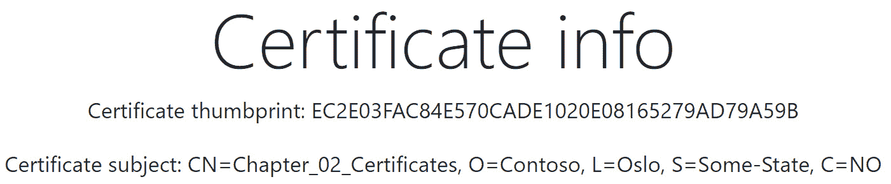

图 2.32–Linux 证书的输出

如果你想拥有一个真正的跨平台应用程序，你可以多做一点，增加代码运行平台的检查。添加一些检查：

```cs
public IActionResult Index(){    //Windows   if (Environment.OSVersion.Platform.ToString() == "Win32NT")  {    //Windows logic     ...  }                           
  //Linux   if (Environment.OSVersion.Platform.ToString() == "Unix")  {    //Linux logic     ...  }
  var myCert = SigningCredentials.Value;  ViewBag.myCertThumbprint =    myCert.Certificate.Thumbprint.ToString();  ViewBag.myCertSubject =    myCert.Certificate.SubjectName.Name.ToString();;
  return View();}
```

这说明在构建跨平台应用程序时可能需要做一些额外的工作，而不仅仅是确保运行.NET5。然而，这是可能的，也可能是值得的。在这里显示的示例中，这意味着您可以让开发人员主要在 Windows 上工作，并且仍然在生产环境中部署到 Linux 主机上（前提是您测试这些边缘情况）。

## 独立的.NET 应用程序

本章到目前为止的讨论围绕着确保所有东西都能跨不同平台工作。然而，有时你没有这种需要，你可能想更具体地说明你将支持什么。

这可能适用的两个示例如下所示：

*   您创建了一个要部署在 Windows 服务器上的 web 应用程序。您无法控制这些服务器，并且拥有这些服务器的操作团队尚未部署.NET 5 运行时。不幸的是，它们的更新计划与您计划的版本不一致。
*   您有一个连接到 Raspberry Pi 的温度传感器，一个.NET 应用程序负责将数据发送到 Azure，以便随时间构建图表。在设备上编译应用程序不是一个选项。

这两个用例都可以通过创建自包含的.NET 应用程序来解决。如果应用程序是自包含的，这意味着它拥有运行所需的一切，而无需安装.NET 运行时。

### 为 Windows Server 生成文件

如果您不控制 Windows 服务器上的操作系统，这意味着您可以部署.NET 5 应用程序，即使服务器上只安装了.NET Core 3.1，或者根本没有.NET 运行时。

要为此生成文件，请运行`dotnet publish -r win-x64`命令。生成的文件可以复制到服务器并执行，而不必抱怨.NET 运行时。

### 为 Raspberry Pi 生成文件

对于 Raspberry Pi，即使您的开发人员机器运行 Windows 10，您也可以为不同的操作系统编译。（这称为交叉编译。）生成的位可以复制到设备并立即运行。

要生成这些文件，请运行`dotnet publish -r linux-arm64`命令。

如果您希望为其他平台生成文件，可以使用一个有效标识符列表，您可以在[找到该列表 https://docs.microsoft.com/en-us/dotnet/core/rid-catalog](https://docs.microsoft.com/en-us/dotnet/core/rid-catalog) 。

这种方法的缺点是应用程序更大，因为没有共享组件。如果您的服务器/设备只运行一个应用程序，那么这可能不是问题，但是如果您有 20 个不同的.NET 应用程序，这些应用程序都是自包含的，那么会有很多开销。这对于存储空间充足的机架式服务器可能不是问题，但对于 Raspberry Pi 来说，这可能是一个问题。

很难给出确切的数字。NET 团队不断迭代改进关于大小的所有方面，无论它是否是自包含的。在使用证书读取示例应用程序（在上一节中）进行测试后，我们确定了下图中给出的金额：


图 2.33–dotnet 发布命令的大小比较

在您的机器上测试时，您可能看不到完全相同的数字，但它给出了大小差异的一般概念。可以对输出进行微调，但即使如此，很明显，使用自包含应用程序并不能为每个应用程序节省空间。

对于已经安装了.NET 运行时的存储受限设备，您可能需要采用结合两种策略中最好的策略。您可以使其依赖于运行时且特定于平台。这意味着您可以创建一个包含跨平台组件的文件，以及一个包含特定于目标平台的组件的不同文件。

您可以通过运行`dotnet publish –r linux-arm64 –-self-contained false`命令来实现这一点。

## 移动设备跨平台

本书没有介绍开发移动应用程序，您也不太可能将 web 应用程序部署到移动设备上。不过，这是跨平台讨论的一部分，因此有必要进行简要介绍。

在上一章中，我们介绍了不同.NET 框架的历史，并提到了一个事实，即支持在移动设备上运行.NET 代码最初并不是微软的倡议。换句话说，尽管你可以使用 C#来创建移动应用程序，但它并不是.NET 技术堆栈的正式组成部分。自从微软收购 Xamarin 以来，Xamarin 已经正式上市，并且在使这些工具与.NET 和 Visual Studio 集成方面做出了重大努力。

我们已经问过，为什么您通常需要跨平台功能，但这个问题值得在移动设备上重复。苹果为 iOS 提供工具和框架，谷歌为 Android 提供工具和框架，那么你为什么要使用.NET 呢？

要回答这个问题，您应该从几个方面来考虑。

首先，你在写什么样的申请？它是一款相当通用的数据输入业务应用程序，还是针对苹果或安卓生态系统进行了高度优化？Xamarin 支持的内容和本机工具支持的内容之间总会有一些差距（就像 Windows 中的.NET 一样），有时候 Xamarin 无法满足您的需要。

您的开发人员具备哪些技能以及团队中有多少开发人员？如果你精通 C#，Xamarin 是很棒的，因为你不必学习新的语言。但是，如果您有很强的 Java 背景，那么使用 Kotlin 创建 Android 应用程序可能会更容易。

如果您的开发团队足够大，能够支持专门的 iOS 开发人员，那么他们使用苹果的 Xcode 也没有什么问题。

尽管有好处，比如跨平台重用代码，但在开始一个新的移动应用程序项目之前，您应该反思这些事情，但出于学习的目的，我们当然鼓励您看看它是如何工作的。

要安装 Xamarin，您需要在**Visual Studio 安装程序**中使用.NET 检查**移动开发。参见*图 2.34*。（您可以在初始安装期间执行此操作，也可以稍后重新打开以修改安装。）：**


图 2.34–支持 Visual Studio 的移动开发

这将为 Android 和 iOS 安装必要的位。

对于 Android，您可以选择安装一个 Android 仿真器并快速启动。

对于 iOS，还有一些额外的障碍。您可以在 Windows 计算机上为 iOS 开发，但要生成和发布代码，您需要一个带有 macOS 的设备。Visual Studio 支持远程连接到 Mac 以完成此任务，因此您无需将 Mac 用作开发人员体验。然而，这是另一件需要解决的事情，特别是如果您是一个单人开发团队。您可以在团队中的开发人员之间共享一台 Mac 电脑，还可以支付“云中 Mac 电脑”的费用

### 创建 HelloWorld iOS 应用程序

出于这个原因，为了创建一个 iOS 应用程序，返回到您的 Mac 并启动 Visual Studio 2019 For Mac 会更容易。执行以下步骤：

1.  创建新的解决方案并选择`iOS-App-Single View App`。
2.  Fill in the app name, the organization identifier, which devices to support (iPhone, iPad, or both), and the operating system level required. See *Figure 2.35*:

    

    图 2.35–配置 iOS 应用程序

3.  Fill in the solution name, as shown in *Figure 2.36*:

    

    图 2.36–配置单视图应用程序

4.  Open `LaunchScreen.storyboard` and add a label with a short message. See *Figure 2.37*:

    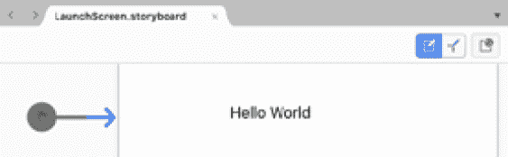

    图 2.37–为 iOS 应用程序创建启动屏幕标签

5.  您还可以查看`Main.cs`文件，确保一切正常：

    ```cs
    using UIKit;
    namespace HelloWorldiOS {      public class Application      {            // This is the main entry point of the application.            static void Main(string[] args)            {                  // if you want to use a different Application       // Delegate class       // from "AppDelegate" you can specify it here.                  UIApplication.Main(args, null, "AppDelegate");    }  }    
    ```

6.  单击播放图标开始调试。将加载一个模拟器，如图 2.38 所示：


图 2.38–启动 HelloWorldiOS 应用程序

为了让这个起作用，你应该已经在你的 Mac 上下载并安装了 Xcode。

为了继续介绍跨平台移动体验，让我们在 Android 上创建一些类似的东西。

### 创建 HelloWorld Android 应用程序

返回到 Windows，一旦您确保为 Visual Studio 安装了必要的组件，您可以按照以下步骤创建 Android 应用程序：

1.  Create a new `HelloWorldAndroid` project in Visual Studio by using the `Mobile App` template. See *Figure 2.39*:

    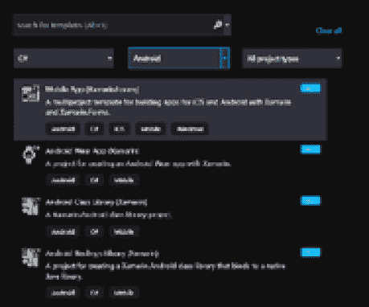

    图 2.39–创建 Android 应用程序

2.  Choose a name for the project, as shown in *Figure 2.40*:

    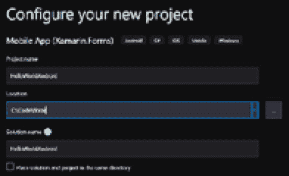

    图 2.40–配置 Android 项目

3.  Select a new UI template, as shown in *Figure 2.41*:

    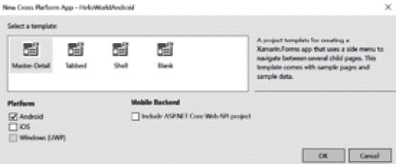

    图 2.41–设置 UI 模板

4.  您还可以查看`MainActivity.cs`文件（为了可读性而省略部分），以确保一切就绪：

    ```cs
    using System;using Android.App;using Android.OS;using Android.Runtime;using Android.Support.Design.Widget;using Android.Support.V7.App;using Android.Views;using Android.Widget;
    namespace AndroidApp {  [Activity(Label = "@string/app_name",     Theme = "@style/AppTheme.NoActionBar", MainLauncher =       true)]
      public class MainActivity : AppCompatActivity   {    protected override void OnCreate(Bundle       savedInstanceState)    {      base.OnCreate(savedInstanceState);      Xamarin.Essentials.Platform.Init(this,         savedInstanceState);      SetContentView(Resource.Layout.activity_main);
          Android.Support.V7.Widget.Toolbar toolbar =      FindViewById<Android.Support.V7.Widget.Toolbar>        (Resource.Id.toolbar);
          SetSupportActionBar(toolbar);
          FloatingActionButton fab =         FindViewById<FloatingActionButton>(Resource.          Id.fab);
          fab.Click += FabOnClick;    }
        public override bool OnCreateOptionsMenu(IMenu menu)    {      …    }
        public override bool OnOptionsItemSelected(IMenuItem       item)    {      …    }
        private void FabOnClick(object sender, EventArgs       eventArgs)    {      …    }
        …  }}
    ```

5.  通过调试器运行app，如*图 2.42*所示：


图 2.42–启动 HelloWorldAndroid 应用程序

在查看了 iOS 和 Android 的代码之后，我们可以看到它可以识别为 C#代码，但样板代码与使用 web 应用程序模板时生成的代码不同。这突出了另一个重要的一点，关于移动平台上的跨平台。如果你对意大利跑车感兴趣，攒钱买一辆法拉利可能是一个好的开始，但拥有一辆法拉利并不意味着你能以最高速度驾驶它。一般来说，通过了解如何驾驶汽车，你将能够完成基本任务，但高速驾驶需要经过培训（如果你想安全驾驶的话）。移动设备也是如此，在编写性能代码之前，您需要了解平台的细微差别。

.NET 也无法解决平台的非编码问题。例如，苹果公司对其设备上运行的应用程序有相当严格的规定。因此，如果你想将被拒绝的几率降到最低，在 App Store 上发布时，你需要先阅读一些指导原则。

这并不是要阻止您创建移动应用程序或为此目的使用.NET，而是我们想强调的是，即使有.NET 提供的帮助，跨平台仍然是复杂的。

即使您无法测试我们在这里介绍的所有内容，如果您发现自己有更多用于开发目的的设备，也可以随时参考这些说明。虽然我们介绍了很多测试和实验，但有一些细节我们没有深入讨论，比如在不使用 VisualStudio 代码和 WSL2 组合的情况下，如何调试 Linux 上运行的代码。因此，接下来我们将为调试过程需要一些额外步骤才能开始工作的用例设置一些东西。

# 使用 Visual Studio 2019 在 Windows 上调试 Linux

在本章前面，我们创建了一个可以作为辅助服务运行的辅助服务，并通过 VisualStudio 代码中的远程扩展运行它。然而，在某些情况下，您无法通过 Visual Studio 代码完成所有需要的操作，或者 Linux 主机甚至没有在您将调试的同一台机器上运行。

这并不妨碍您调试在 Linux 中运行的代码，但还有一些额外的问题需要解决。我们将介绍如何使用 VisualStudio2019 并通过 SSH 进行连接，SSH 是远程连接到 Linux 系统的常用协议。

我们仍然可以使用 WSL2 进行测试，因此在这种情况下，我们仍然将连接到本地机器。可以为其他 Linux 发行版执行类似的设置。以下说明用于在我们已经设置的 Ubuntu 20.04 上启用 SSH：

1.  启用 SSH 服务器：

    ```cs
    sudo apt-get install openssh-server unzip curl
    ```

2.  编辑`sshd_config`以允许密码登录：

    ```cs
    sudo vi /etc/ssh/sshd_config
    ```

3.  找到行`PasswordAuthentication no`并将其更改为`#PasswordAuthentication no`。（按*插入*允许编辑。）
4.  按*Esc*退出`vi`，然后进入*：wq*。
5.  启动的`ssh`服务：

    ```cs
    sudo service ssh restart
    ```

6.  To check the IP address of the Ubuntu installation that we are using, use the command `ip addr`. This is the one found attached to inet. In *Figure 2.43*, it is `172.28.88.220`:

    

    图 2.43–验证 WSL2 中的 IP 地址

7.  测试是否可以使用 Windows 10 SSH 客户端连接到 SSH 服务器。见图 2.44。SSH 客户端是 Windows 中的可选功能，因此请确保已安装它。然后，从 PowerShell 或命令行输入以下命令：

```cs
ssh user@ipaddress
```

以下是输出的样子：


图 2.44–测试 Windows SSH 客户端

请注意，屏幕截图中的第一行显示 Windows 提示符（`C:\`，而最后一行显示Ubuntu shell（`andreas@AH-BOOK`。

一旦到位，您就可以打开 Visual Studio 2019 并连接到我们的代码：

1.  要启动要调试的应用程序，请在 Windows 终端中打开 Linux 实例，并在示例中正确的文件夹`/mnt/c/Code/Book/Chapter_02_Workers`中运行`dotnet run`。
2.  确保它运行时没有任何问题，然后在 Visual Studio 2019 中打开相同的解决方案。
3.  按*Ctrl*+*Alt*+*P*打开**附加过程**窗口。
4.  选择`SSH`作为连接类型。
5.  Connect to the same SSH server as when we were testing it. Connect to user@ipaddress. Refer to *Figure 2.45* as an example of the username and IP address:

    

    图 2.45–附加到流程对话框

6.  You will be prompted to enter your password as well, and if things work you should see a list of running processes. See the following screenshot:

    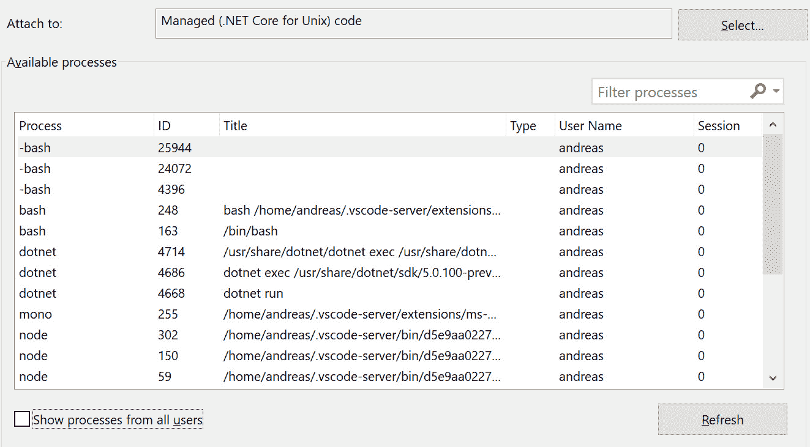

    图 2.46–在远程主机上运行进程

7.  找到`dotnet run`并点击**附加**。
8.  If everything went to plan, you should be able to hit breakpoints, read variables, output, and so on, directly from Visual Studio 2019 on Windows.

    防火墙

    首次打开远程调试下拉列表时（打开**附加到进程**窗口后），系统将提示您允许通过 Windows 防火墙进行连接。接受此选项以允许调试器建立连接。

在本例中，Linux 实例是在 WSL2 上运行的，但 Visual Studio 2019 不认为这是一种特殊情况，因此连接到其他主机并不重要。这可能不像 VisualStudio 代码那样简单，但它对于需要执行更复杂操作的用例非常有用。

我们已经以多种组合方式介绍了跨平台.NET，本章到此结束。

# 总结

在本章中，我们看到跨平台可能是一个复杂的主题，但我们介绍了 Linux 和 macOS 的简单 web 应用程序的基本用例，以及同时支持 Linux 和 Windows 的更高级跨平台 web 应用程序。

Web 应用程序可能非常需要后台的支持应用程序，因此我们还研究了如何创建后端工作者服务。对于这些应用，.NET 提供了处理 Windows 和 Linux 服务的幕后魔术，以实现跨平台服务。在将应用程序作为服务安装时，还需要一些额外的步骤，我们讨论了如何在操作系统中将这些应用程序作为服务安装。

iOS 和 Android 设备的移动应用程序非常流行，尽管它们不是本书的重点，但我们探讨了如何使用.NET 的跨平台功能在这两个平台上启动和运行。我们还解释了这个过程中的一些怪癖。

在本章的最后，我们通过演示在 Windows 上运行的 Visual Studio 2019 如何通过 SSH 连接到远程 Linux 系统，来了解如何启用更高级的 Linux 调试用例。现在，您可以在您可以使用的平台上运行代码了。如果在代码中遇到问题，还应该了解如何调试这些问题。

在下一章中，当我们探索依赖注入时，我们将深入探讨 C 语言的最佳实践。

# 问题

1.  您可以在哪些操作系统上运行.NET 5？
2.  什么是 Linux 的 Windows 子系统？
3.  什么是独立的.NET 应用程序？
4.  什么时候跨平台实现（使用.NET）会变得复杂？

# 附录

在本章前面，我们向您展示了如何在开发机器上安装 Windows 服务。这种方法是一种简化的方法，可能不适用于机器之外的环境。因此，这里有一种更高级的方法可以将应用程序配置为 Windows 服务。

## 将应用程序安装为 Windows 服务–高级方法

对于生产使用，权限可能更细粒度，并且被锁定。执行以下步骤将应用程序设置为服务：

1.  登录到将在其中部署服务的 Windows 服务器。
2.  打开 PowerShell 提示符，并运行以下命令：`New-LocalUser -Name dotnetworker`。
3.  You need to grant permissions to the service account you just created in order to enable it to start the services. Follow these steps:

    A.运行`secpol.msc`打开**本地安全策略**编辑器。

    B 展开**本地策略**节点，选择`User Rights Assignment`。

    C 打开**作为服务登录**策略。

    D 选择`Add User`或`Group`。

    E 使用以下任一方法提供服务帐户的名称（`dotnetworker`。

    F 在对象名称字段中键入用户帐户（{`DOMAIN OR COMPUTER NAME\USER`}），然后选择`OK`将用户添加到策略中。

    G 选择`Advanced`。选择`Find Now`。从列表中选择用户帐户。选择`OK`。再次选择`OK`将用户添加到策略中。

    H 选择`OK`或`Apply`接受更改。

4.  将文件复制到服务器，如`C:\dotnetworker\`。
5.  Run the following PowerShell cmdlets:

    ```cs
    $acl = Get-Acl "C:\dotnetworker"
    $aclRuleArgs = dotnetworker, "Read,Write,ReadAndExecute", "ContainerInherit,ObjectInherit", "None", "Allow"
    $accessRule = New-Object System.Security.AccessControl.FileSystemAccessRule($aclRuleArgs)
    $acl.SetAccessRule($accessRule)
    $acl | Set-Acl "C:\dotnetworker"
    New-Service -Name DotnetWorker -BinaryPathName C:\dotnetworker\dotnetworker.exe -Credential {SERVERNAME\dotnetworker} -Description ".NET Worker Service" -DisplayName ".NET Worker Service" -StartupType Automatic
    ```

    等几秒钟，它应该已经启动了。*