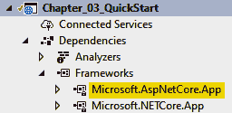
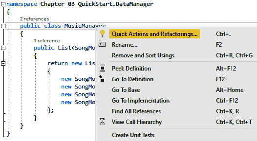
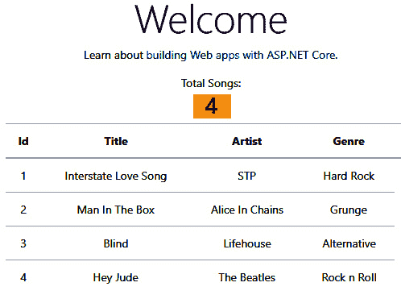
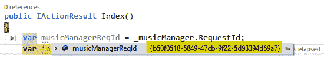
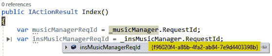
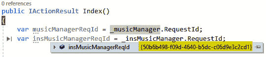
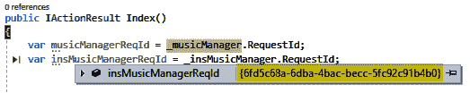
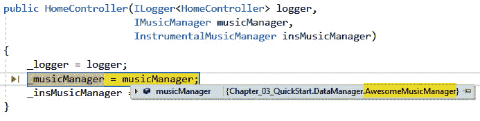
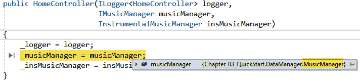

# 三、依赖注入

本章讨论了 ASP.NET Core环境下的**依赖注入**（**DI**）。此外，本章将让您了解 DI 的概念、功能以及如何在 ASP.NET Core应用中使用 DI。我们将通过下面的代码示例来回顾不同类型的 DI，以便您能够理解在可能需要它们的情况下如何以及何时应用它们。在本章中，我们还将介绍 DI 容器、服务生命周期以及如何处理复杂场景。在本章结束时，您将能够通过以下一些实际示例了解 DI 是如何工作的。然后，您应该能够将所学的知识和技能应用于构建真实世界和强大的 ASP.NET Core应用，并利用 DI 提供的好处。

以下是我们将在本章中介绍的主题列表：

*   在 ASP.NET Core中学习依赖注入
*   审查依赖注入的类型
*   理解依赖注入容器
*   理解依赖生存期
*   处理复杂场景

# 技术要求

本章包含用 C#编写的代码片段，用于演示各种场景。请确认您已安装[*第 1 章*](01.html#_idTextAnchor017)*ASP.NET Core 5 简介*中列出的所需软件和工具。

在[查看本章的源代码 https://github.com/PacktPublishing/ASP.NET-Core-5-for-Beginners/tree/master/Chapter%2003/Chapter_03_DI_Examples](https://github.com/PacktPublishing/ASP.NET-Core-5-for-Beginners/tree/master/Chapter%2003/Chapter_03_DI_Examples) 。

在深入阅读本章之前，请确保阅读了前两章，以便大致了解 ASP.NET Core 和 C#，以及它们如何协同工作。

请访问以下链接查看 CiA 视频：[https://bit.ly/3qDiqYY](https://bit.ly/3qDiqYY)

如果你准备好了，我们就开始吧。

# ASP.NET Core中的学习依赖注入

在.NETCore 出现之前，让您了解一下背景，在应用中获得 DI 的唯一方法是通过使用第三方框架，如 Autofac、LightInject、Unity 和许多其他框架。好消息是，在 ASP.NET Core中，DI 被视为一等公民。这仅仅意味着你不需要做很多事情来让它工作。

不过，内置的 MicrosoftDI 容器也有其局限性。例如，默认 DI 不提供高级功能，例如属性注入装饰器、基于名称的注入、子容器、基于约定的注册和自定义生存期管理。因此，如果您发现默认 DI 容器中不可用的特性，那么您需要考虑前面提到的其他第三方 DI 框架作为替代方案。但是，仍然建议使用默认 DI 框架来构建 ASP.NET Core应用，而不需要您实现任何特定功能。这将减少您的应用包依赖性，使您的代码更干净、更易于管理，而无需依赖第三方框架。NET Core团队在为我们提供最常见的功能方面做得很好，您可能不需要其他任何东西。

在本节中，我们将为您进行一些实践编码，使您能够更好地理解 DI 的优点和好处。我们将从一个常见问题开始，然后应用 DI 来解决这个问题。

## 了解 DI 是什么

web 上有大量信息定义了 DI，但一个简单的定义如下：

“依赖项注入是一种设计模式，使开发人员能够编写松散耦合的代码。”

换句话说，DI 通过解决依赖性问题来帮助您编写干净且更易于维护的代码。DI 使模拟对象依赖关系进行单元测试变得很容易，并通过交换或替换依赖关系使应用更加灵活，而无需更改使用类。事实上，ASP.NET Core框架的核心基础很大程度上依赖于 DI，如下图所示：


图 3.1–ASP.NET Core框架提供的服务

所有框架提供的服务，如**托管**、**配置**、**应用生命周期**、**日志记录**、**路由**等许多在引擎盖下使用 DI，默认情况下，在构建应用 web 主机时注册到 DI 容器。

.NET Core中的默认 DI 位于`Microsoft.Extensions.DependencyInjection`名称空间下，其实现打包到一个单独的 NuGet 包中（您可以在[了解更多信息）https://www.nuget.org/packages/Microsoft.Extensions.DependencyInjection/](https://www.nuget.org/packages/Microsoft.Extensions.DependencyInjection/) 。

当您从默认模板创建 ASP.NET Core应用时，该应用引用`Microsoft.AspNetCore.App`NuGet 包，如以下屏幕截图所示：



图 3.2–Microsoft.AspNetCore.App NuGet 软件包

此程序集提供一组 API，包括用于构建 ASP.NET Core应用的`Microsoft.Extensions.DependencyInjection`程序集。

ASP.NET 团队单独设计了DI 框架，这样您仍然能够在 ASP.NET Core应用之外利用其功能。这意味着您将能够在 Azure 函数和 AWS Lamda 等事件驱动的云应用中，甚至在控制台应用中使用 DI。

DI 的使用主要支持以下两个相关概念的实现：

*   **依赖倒置原则****DIP**：这是一个软件设计原则，代表了面向对象编程坚实原则中的“D”。它为避免依赖性风险和解决常见的依赖性问题提供了指南。然而，这一原则并没有规定任何具体的实现技术。
*   **控制反转**（**IoC**）：这是一种遵循 DIP 准则的技术。这个概念是在分离状态下创建应用组件的过程，防止高级组件直接访问低级组件，并允许它们仅通过抽象进行交互。

DI 是一种遵循 IoC 概念的实现技术。它使您能够通过组件注入从较高级别的组件访问较低级别的组件。DI 遵循两个坚实的原则：DIP 和**单一责任原则**（**SRP**）。这些概念对于创建设计良好和解耦的应用至关重要，并且您应该考虑在需要的任何情况下应用它们。查看本章末尾的*进一步阅读*部分，了解更多关于坚实原则的信息。

你可能听说过这些术语和概念，但你仍然觉得它们很混乱。好吧，这里有一个类比可以帮助你更好地理解它们。

假设您正在制作自己的歌曲，并且希望将其上传到 web 上，以便您的朋友可以观看和收听。你可以把 DIP 看作是一种录制音乐的方式。你怎么录这首歌并不重要。你可以使用录像机、照相机、智能手机或录音机。国际奥委会正在选择如何实际录制音乐，并借助一些工具对其进行润色。例如，您可以使用录音机和摄像机的组合来录制歌曲。通常，它们被记录为原始文件。然后，您将使用一个编辑器工具对原始文件进行过滤和润色，以获得良好的输出。现在，如果您想添加一些效果、文本可视化或图形背景，那么这就是 DI 发挥作用的地方。它允许您注入文件所依赖的任何文件，以生成预期的输出。请记住，在这个类比中，IoC 和 DI 都依赖于使用编辑器工具根据原始文件（低级组件）生成最终输出（高级组件）。换句话说，IoC 和 DI 通过使用编辑器工具改进视频输出来引用相同的概念。

为了说明这一点，让我们看一个简单的例子。

## 常见的依赖性问题

考虑一下，我们有下面的一个 To.T0.页面，它显示了一个典型的 MVC Web 应用中的音乐列表：


图 3.3–音乐列表页面

让我们分析一下是如何得出上一个屏幕截图中显示的结果的。为了便于您快速参考，这里有一个名为`MusicManager`的类，它公开了一种获取音乐列表的方法：

```cs
using Chapter_03_QuickStart.Models;
using System.Collections.Generic;
namespace Chapter_03_QuickStart.DataManager
{
    public class MusicManager
    {
        public List<SongModel> GetAllMusic()
        {
            return new List<SongModel>
            {
                new SongModel { Id = 1, Title = "Interstate                 Love Song", Artist ="STP",                 Genre = "Hard Rock" },
                new SongModel { Id = 2, Title = "Man In The                 Box", Artist ="Alice In Chains",                 Genre = "Grunge" },
                new SongModel { Id = 3, Title = "Blind", Artist                 ="Lifehouse", Genre = "Alternative" },
                new SongModel { Id = 4, Title = "Hey Jude",                Artist ="The Beatles", Genre = "Rock n Roll" }
            };
        }
    }
}
```

前面的代码只是一个普通的类，它包含一个方法`GetAllMusic()`。此方法负责从列表中返回所有音乐条目。根据您的数据存储，实现可能会有所不同，您可以从数据库或通过 API 调用获取它们。然而，在这个例子中，为了简单起见，我们只返回一个静态数据列表。

`SongModel`类位于`Models`文件夹中，其结构如下：

```cs
namespace Chapter_03_QuickStart.Models
{
    public class SongModel
    {
        public int Id { get; set; }
        public string Title { get; set; }
        public string Artist { get; set; }
        public string Genre { get; set; }
    }
}
```

没什么特别的。前面的代码只是一个哑类，它包含了`View`所期望的一些属性。

如果没有 DI，我们通常会从类中直接调用一个方法到`Controller`类中来呈现`View`，如下代码块所示：

```cs
public IActionResult Index()
{
    MusicManager musicManager = new MusicManager();
    var songs = musicManager.GetAllMusic();
    return View(songs);
}
```

当您执行 HTTP`GET`请求时，将调用前面代码中的`Index()`方法。该方法负责将数据呈现到`View`中。您可以看到，它通过调用`new`操作符创建了`MusicManager`类的实例。这被称为“依赖关系”，因为`Index()`方法现在依赖于`MusicManager`对象来获取所需的数据。

下面是代码逻辑正在执行的高级图形表示：


图 3.4–紧密耦合的依赖关系

在上图中，`Controller`框表示更高级别的组件，将具体的类实现称为直接依赖，它表示较低级别的组件。

当现有的实现工作时，这种方法可能会导致代码难以管理，因为对象与方法本身紧密耦合。假设您有一组依赖于`MusicManager`对象的方法，并且当您将来重命名它或更改其实现时，您将被迫更新依赖于该对象的所有方法，这可能更难维护，并且在单元测试`Controllers`时会出现问题。请注意，重构糟糕的代码可能非常耗时和昂贵，因此最好从一开始就正确地进行重构。

避免这种混乱的理想方法是清理代码并利用接口和 DI。

利用 DI

为了解决`HomeController`的依赖性问题，我们需要进行一些代码重构。以下是我们目标的图形说明：


图 3.5–松散耦合的依赖关系

从前面的图中可以看到，我们只需要创建一个接口来解决依赖性问题。这种方法避免了对低级组件的直接依赖，相反，它创建了两个组件都依赖的抽象。这使得`Controller`类更易于测试和扩展，并使应用更易于维护。

让我们继续并开始创建一个接口。创建接口有两种方法：要么自己创建，要么使用 VisualStudio2019 提供的内置重构功能。因为我们已经有了一个我们想要提取作为接口的类，所以使用重构特性非常有意义。为此，您需要执行以下步骤：

1.  Just simply right-click on the `MusicManager` class and select **Quick Actions and Refactorings...**, as shown:

    

    图 3.6–内置的快速操作和重构功能

2.  Then, select **Extract interface…**:

    

    图 3.7–内置提取接口功能

3.  Now, you should be presented with a pop-up dialog to configure the interface, as shown in the following screenshot:

    

    图 3.8–提取界面弹出窗口

4.  如果愿意，您可以更改默认配置，但在本练习中，让我们坚持使用默认配置，然后单击**确定**。下面是 Visual Studio 自动创建的生成代码：

    ```cs
    using Chapter_03_QuickStart.Models;
    using System.Collections.Generic;
    namespace Chapter_03_QuickStart.DataManager
    {
        public interface IMusicManager
        {
            List<SongModel> GetAllMusic();
        }
    }
    ```

前面的代码只是一个简单的接口，带有返回类型为`List<SongModel>`的`GetAllMusic()`方法签名。在本书中，我们不会深入探讨接口的细节，但为了给您一个简单的概述，与接口相关的两个好处是，它提供了抽象，帮助减少代码中的耦合，并使我们能够在不影响其他类的情况下为方法提供不同的实现。

现在，当您返回到`MusicManager`类时，您将看到该类已被更新以继承接口：

```cs
public class MusicManager : IMusicManager
```

整洁的只需单击几下，VisualStudio 就会自动为我们设置所有内容。我们在这里要做的是重构`HomeController`类以使用接口和 DI，然后向 DI 容器注册接口映射。让我们继续切换回`HomeController`类，并更新代码，使其看起来类似于以下内容：

```cs
namespace Chapter_03_QuickStart.Controllers
{
    public class HomeController : Controller
    {
        private readonly IMusicManager _musicManager;
        public HomeController(IMusicManager musicManager)
        {
            _musicManager = musicManager;
        }
        public IActionResult Index()
        {
            var songs = _musicManager.GetAllMusic();
            return View(songs);
        }
    }
}
```

前面的代码首先定义了一个`IMusicManager`接口类型的私有`read-only`字段。将其设置为`read-only`和`private`被认为是最佳做法，因为这样可以防止您意外地将字段指定给`class`中的不同值。下一行代码定义了`constructor`类，并使用“构造函数注入”方法初始化依赖对象。在这种情况下，`HomeController`类中的任何方法都将能够访问`_musicManager`字段并调用其所有可用的方法和属性。我们将在本章后面更多地讨论不同类型的 DI。

当前代码现在支持 DI 模式，因为在构建类时，我们不再向`Controller`方法传递具体的依赖关系。通过接口抽象，我们不再需要创建具体类的新实例来直接引用`GetAllMusic()`方法。但是，我们引用`interface`字段来访问该方法。换句话说，我们的方法现在与实际的类实现松散耦合。这有助于我们更容易地维护代码并方便地执行单元测试。

## 注册服务

最后，让我们用 DI 容器注册接口映射。继续导航到`Startup.cs`文件，然后在`ConfigureServices()`方法中添加以下代码：

```cs
public void ConfigureServices(IServiceCollection services)
{
    services.AddTransient<IMusicManager, MusicManager>();
    //register other services here
}
```

前面的代码将`IMusicManager`接口注册为服务类型，并将`MusicManager`具体类映射为 DI 容器中的实现类型。这告诉框架在运行时解析已注入`HomeController`类构造函数的所需依赖项。DI 的美妙之处在于，只要它实现了接口，它就允许您更改任何您想要的组件。这意味着，只要`MucisManager`类实现了`IMusicManager`接口而不影响`HomeController`实现，您就可以始终将其替换为其他类映射。

`ConfigureServices()`方法负责定义应用使用的服务，包括平台特性，如实体框架核心、身份验证、您自己的服务，甚至第三方服务。最初，提供给`ConfigureServices()`方法的`IServiceCollection`接口有框架定义的服务，包括`Hosting`、`Configuration`和`Logging`。我们将在本章后面讨论更多关于 DI 容器的内容。

## 直接投资的好处

正如您从前面的示例中了解到的，DI 带来了许多好处，使您的 ASP.NET Core应用易于维护和发展。这些好处包括：

*   它促进了组件的松散耦合。
*   它有助于分离关注点。
*   它促进了组件的逻辑抽象。
*   它有助于单元测试。
*   它提升了代码的干净性和可读性，这使得代码维护易于管理。

在了解了 DI 是什么并讨论了它的好处之后，我们现在将在下一节继续讨论它的类型。

# 审查依赖注入的类型

在 ASP.NET Core应用中实现 DI 时，有几个选项，这些包括以下方法：

*   构造函数注入
*   方法注入
*   属性注入
*   视图注入

让我们在通信部分详细讨论每种类型。

## 构造函数注入

在前面的音乐列表示例中，我们已经看到了如何实现**构造函数注入**。但总而言之，这种方法基本上允许您将较低级别的依赖组件作为参数传递到`constructor`类中，从而将它们注入到类中。

这种方法是构建 ASP.NET Core应用时最常用的方法。事实上，当您从默认模板创建 ASP.NET Core MVC 项目时，您将看到 DI 在默认情况下是集成的。您可以通过查看`HomeController`类来验证这一点，您应该会看到`ILogger`接口被注入到类构造函数中，如下代码所示：

```cs
public class HomeController : Controller
{
    private readonly ILogger<HomeController> _logger;
    public HomeController(ILogger<HomeController> logger)
    {
        _logger = logger;
    }
}
```

在前面的代码中，请注意这个概念与我们前面的示例非常相似，我们将`MusicManager`类引用与`IMusicManager`接口交换以执行 DI。

`ILogger<HomeController>`接口由日志抽象的基础设施注册，在框架中默认注册为`Singleton`：

```cs
services.AddSingleton(typeof(ILogger<>), typeof(Logger<>));
```

前面的代码将服务注册为`Singleton`，并使用通用的开放类型技术。这允许 DI 容器解析依赖项，而不必显式地用泛型构造的类型注册服务。

## 方法注射

**方法注入**是另一种 DI 方法，它允许您将较低级别的依赖组件作为参数注入到方法中。换句话说，依赖的对象将被传递到方法中，而不是传递到类构造函数中。当类中的各种方法需要调用子对象依赖项来完成其工作时，实现方法注入非常有用。一个典型的例子是根据调用的方法写入不同的日志格式。让我们举一个实际的例子，让您更好地理解这种方法。

让我们扩展前面关于音乐列表的示例，但是这次，我们将实现类似于通知程序的东西来演示方法或函数注入。

首先，创建一个名为`INotifier`的新接口，如下代码块所示：

```cs
namespace Chapter_03_QuickStart.DataManager
{
    public interface INotifier
    {
        bool SendMessage(string message);
    }
}
```

在前面的代码中，我们已经定义了一个简单的接口，其中包含一个名为`SendMessage`的方法。该方法接受表示消息的`string`参数，并返回`boolean`类型以确定操作是否成功。就这么简单。

现在，让我们继续创建一个实现`INotifier`接口的具体类。下面是类声明的内容：

```cs
namespace Chapter_03_QuickStart.DataManager
{
    public class Notifier : INotifier
    {
        public bool SendMessage(string message)
        {
            //some logic here to publish the message

            return true;
        }
    }
} 
```

前面的代码显示了`SendMessage()`方法是如何实现的。请注意，除了返回`true`的`boolean`值之外，方法中实际上没有实现任何逻辑。这是有意的，因为实现与这个主题无关，我们不想让您注意这个领域。但是，在实际应用中，您可能会创建不同的类来实现发送消息的逻辑。例如，您可以使用消息队列、发布/订阅、事件总线、电子邮件、SMS，甚至 REST API 调用来广播消息。

现在，我们已经通过接口抽象了通知程序对象。让我们将`IMusicManager`接口修改为，包括一个名为`GetAllMusicThenNotify`的新方法。更新的`IMusicManager.cs`文件现在应该如下所示：

```cs
using Chapter_03_QuickStart.Models;
using System.Collections.Generic;
namespace Chapter_03_QuickStart.DataManager
{
    public interface IMusicManager
    {
        List<SongModel> GetAllMusic();
        List<SongModel> GetAllMusicThenNotify(INotifier             notifier);
    }
}
```

请注意，`GetAllMusicThenNotify()`方法还返回`SongModel`对象的`List`，但这一次，我们将`INotifier`接口作为参数传递。

让我们继续在`MusicManager`类中实现`GetAllMusicThenNotify()`方法。下面是该方法的代码实现：

```cs
public List<SongModel> GetAllMusicThenNotify(INotifier notifier)
{
    //invoke the notifier method
    var success = notifier.SendMessage("User viewed the music         list page.");
    //return the response
    return success
           ? GetAllMusic()
           : Enumerable.Empty<SongModel>().ToList();
}
```

前面的代码调用`INotifier`接口的`SendMessage()`方法，然后将消息作为参数/参数传递。这个过程称为方法注入，因为我们已经将`INotifier`接口注入`GetAllMusicThenNotify()`方法，因此，不必实例化 notifier 对象的具体实现。请记住，在这个特定的示例中，`SendMessage()`方法总是返回`true`来模拟流程，并且不包含任何实际实现。这仅仅意味着`success`变量的值将始终为`true`。

前面代码中的第二行返回响应，并使用 C#*三元条件运算符*（`?:`）根据表达式值计算方法应返回的数据。`Ternary`运算符是`if-else`语句的简化语法。在这种情况下，如果`success`变量的值为 true，我们调用`GetAllMusic()`方法返回整个音乐列表，否则我们使用`Enumerable.Empty<T>`方法返回空列表。有关三元运算符和`Enumerable.Empty`LINQ 扩展方法的更多信息，请参阅[https://docs.microsoft.com/en-us/dotnet/api/system.linq.enumerable.empty](https://docs.microsoft.com/en-us/dotnet/api/system.linq.enumerable.empty) 。

现在，要执行的最后一步是更新`HomeController`类中的`Index()`action 方法以使用`GetAllMusicThenNotify()`方法。以下是该方法的更新版本：

```cs
public IActionResult Index()
{
    var songs = _musicManager.GetAllMusicThenNotify(new         Notifier());
    return View(songs);
}
```

请注意，在前面的代码中，我们现在正在传递 notifier 对象的具体实例。由于具体实例实现了`INotifier`接口，`GetAllMusicThenNotify()`方法会自动解决。

为了更好地理解点是如何连接到图片上的，下面是我们刚才所做工作的高级图形表示：


图 3.9–方法注入

上图中的重要框为*接口*框。这是因为通过接口抽象实现可以避免直接类访问，并将不同类中的各种实现解耦。例如，如果出现业务需求并要求您根据不同的事件实现不同形式的通知，您可以轻松创建实现`INotifier`接口的`SMSNotifier`、`MessageQueueNotifier`、`EmailNotifier`。然后，执行它需要的任何逻辑来分别满足业务需求。虽然您可能仍然能够在不使用接口的情况下完成方法注入，但它可能会使您的代码变得混乱，并且非常难以管理。如果不使用接口，最终将为每个通知类创建不同的方法，这将导致返回单元测试和代码维护问题。

## 财产注入

**属性注入**（或**setter 注入**允许您在类中将较低级别的依赖组件引用为`property`。只有在依赖关系确实是可选的情况下，您才会使用这种方法。换句话说，如果不提供这些依赖项，您的服务仍然可以正常工作。

让我们再举一个例子，使用我们现有的音乐列表示例。这次，我们将更新`Notifier`样本以使用属性注入而不是方法注入。为了实现这一点，我们需要做的第一件事是更新`IMusicManager`接口。继续并替换现有代码，使其看起来类似于：

```cs
using Chapter_03_QuickStart.Models;
using System.Collections.Generic;
namespace Chapter_03_QuickStart.DataManager
{
    public interface IMusicManager
    {
        INotifier Notify { get; set; }
        List<SongModel> GetAllMusic();
        List<SongModel> GetAllMusicThenNotify();
    }
}
```

在前面的代码中，我们添加了一个名为`Notify`的新属性，然后通过删除`INotifier`参数修改了`GetAllMusicThenNotify()`方法。

接下来，让我们更新`MusicManager`类以反映`IMusicManager`接口中的更改。更新后的类现在应如下所示：

```cs
using Chapter_03_QuickStart.Models;
using System.Collections.Generic;
using System.Linq;
namespace Chapter_03_QuickStart.DataManager
{
    public class MusicManager : IMusicManager
    {
        public INotifier Notify { get; set; };
        public List<SongModel> GetAllMusic()
        {
            //removed code for brevity
        }
        public List<SongModel> GetAllMusicThenNotify()
        {
            // Check if the Notify property has been set
            if (Notify != default)
            {
                //invoke the notifier method
                Notify.SendMessage("User viewed the music list                     page.");
            }
            //return list of music
            return GetAllMusic();
        }
    }
}
```

在前面的代码中，我们实现了`Notify`属性，它使用 C#的**自动实现属性**特性返回一个`INotifier`接口类型。如果您不熟悉自动属性，那么在属性访问器中不需要附加逻辑的情况下，基本上会使属性声明更加简洁。这意味着以下代码行：

```cs
public INotifier Notify { get; set; }
```

仅相当于以下代码：

```cs
private INotifier _notifier;
public INotifier Notify
{
    get { return _notifier };
    set { _notifier = value };
}
```

前面的代码也可以使用 C#7.0 中引入的**表达式 Bodied Property Accessors**重写：

```cs
private INotifier _notifier;
public INotifier Notify
{
    get => _notifier;
    set => _notifier = value;
}
```

当您需要使用不同的实现设置属性时，可以使用前面的代码。然而，在我们的示例中，使用自动属性更有意义，因为它更干净。

回到我们的示例，我们需要实现`Notify`属性，以便`HomeController`类能够在调用`GetAllMusicThenNotify()`方法之前设置其值。

`GetAllMusicThenNotify()`方法非常简单。首先检查`Notify`属性是否已设置为`null`。任何引用类型的`default`关键字值均为`null`。换句话说，根据`null`或`default`进行验证在这里并不重要。如果没有`null`验证检查，当属性未设置时，您将最终得到一个`NullReferenceException`错误。因此，始终检查空值是最佳实践。现在，如果`Notify`属性不是`null`，那么我们调用`SendMessage()`方法。最后，我们将音乐列表返回给调用者。

我们需要修改的最后一步是`HomeController`的`Index()`方法。更新后的代码如下所示：

```cs
public IActionResult Index()
{
    _musicManager.Notify = new Notifier();
    var songs = _musicManager.GetAllMusicThenNotify();
    return View(songs);
}
```

前面的代码使用`Notifier`类的新实例设置`Notify`属性。然后调用`GetAllMusicThenNotify()`方法，最终将结果返回给`View`。

下面是我们刚才所做工作的高级图形表示：


图 3.10–财产注入

在这种方法中需要注意的重要一点是，即使我们不设置`Notify`属性，`Index()`方法仍将工作，并将数据返回给`View`。总之，在代码中集成可选功能时，应该只使用属性注入。

## 视图注入

**视图注入**是 ASP.NET Core支持的另一种 DI 方法。此功能是在 ASP.NET MVC 6 中引入的，它是 ASP.NET Core的第一个版本（以前称为 ASP.NET 5），使用`@inject`指令。`@inject`指令允许您将类或服务中的一些方法调用直接注入`View`。这对于视图特定的服务非常有用，例如本地化或仅用于填充视图元素的数据。

让我们先举几个例子。现在，在`MusicManager`类中添加以下方法：

```cs
public async Task<int> GetMusicCount()
{
    return await Task.FromResult(GetAllMusic().Count);
}
```

前面的代码是一个异步方法，返回`int`的`Task`。虽然本书没有深入介绍 C#异步编程，但提供一点关于它的背景知识可能会有用。方法中的逻辑只是返回`GetAllMusic()`结果中的项目计数。使用`List`集合的`Count`属性获取`Count`的值。由于该方法期望返回一个`Task`，而`GetAllMusic()`方法返回一个`List`类型，因此结果被包装在`Task.FromResult()`调用中。然后，它使用`await`操作符等待`async`方法完成任务，然后在流程完成时异步将结果返回给调用方。换句话说，`await`关键字是事物可以异步的地方。`async`关键字启用该方法中的`await`关键字，并更改处理方法结果的方式。换句话说，`async`关键字只启用`await`关键字。有关 C#的`async`和`await`关键字的更多信息，请查看本章末尾的参考链接。

为了让它工作，我们需要执行的下一步是在`Startup.cs`文件的`ConfigureServices()`方法中将`MusicManager`类注册为服务：

```cs
public void ConfigureServices(IServiceCollection services)
{
    services.AddTransient<MusicManager>();
    //register other services here
}
```

在前面的代码中，我们已经将该服务注册为`Transient`。这意味着每次请求依赖项时，都会创建一个新的服务实例。我们将在本章的*理解依赖生存期*一节中进一步讨论服务生存期。

现在，您将如何将`MusicManager`类作为服务注入`View`：

```cs
@inject Chapter_03_QuickStart.DataManager.MusicManager MusicService
```

下面是我们前面添加的引用`GetMusicCount()`方法的代码：

```cs
Total Songs: <h2>@await MusicService.GetMusicCount()</h2>
```

`@`符号是一种**隐含语法**，允许您在`View`中使用 C#代码。我们将在下一章深入探讨 Razor。

以下是将服务注入`View`后输出的示例屏幕截图：



图 3.11–视图注入输出

请注意，`4`的值已经打印在页面上。这是从`GetMusicCount()`方法返回的值。请记住，在使用这种技术可能有用的时候，你应该考虑分离你的 Ty2 T2 和 AutoT3-逻辑来关注关注的分离。在实践中，建议从您的`Controller`生成数据；`View`不应该关心数据是如何以及在哪里处理的。

现在我们已经看到了不同类型的 DI，并了解了何时使用它们，我们将在下一节继续讨论 DI 容器。

# 理解依赖注入容器

**依赖注入容器**并不是应用 DI 技术的真正要求。然而，随着应用的增长和变得更加复杂，使用它可以简化对所有依赖项的管理，包括它们的生命周期。

.NET Core 附带了一个内置 DI/IoC 容器，简化了 DI 管理。事实上，默认的 ASP.NET Core应用模板广泛使用 DI。您可以通过查看 ASP.NET Core应用的`Startup`类来查看它：

```cs
public class Startup
{
    public IConfiguration Configuration { get; }
    public Startup(IConfiguration configuration)
    {
    	   Configuration = configuration;
    }
    public void ConfigureServices(IServiceCollection services)
    {
        // This method gets called by the runtime. 
        // Use this method to add services to the container.
    }
    public void Configure(IApplicationBuilder app, 
                          IWebHostEnvironment env)
    {
    	   // This method gets called by the runtime. 
	   // Use this method to configure the HTTP request
        // and middleware pipeline.
    }
}
```

在前面的代码中，`IConfiguration`接口已经使用构造函数注入方法传递给`Startup`类构造函数。这允许您访问`appsettings.json`文件中定义的配置值。您不需要自己注册`IConfiguration`，因为在配置`Host`时，框架会为您解决这一问题。您可以通过查看`Program`类的`CreateHostBuilder()`方法来了解这是如何实现的：

```cs
public static IHostBuilder CreateHostBuilder(string[] args) =>
    Host.CreateDefaultBuilder(args)
        .ConfigureWebHostDefaults(webBuilder =>
        {
            webBuilder.UseStartup<Startup>();
        });
```

前面代码中的`CreateDefaultBuilder()`方法使用预先配置的默认值初始化`WebHostBuilder`类的新实例，包括`Hosting`、`Configurations`和`Logging`。最后，`ConfigureWebHostDefaults()`方法添加了典型 ASP.NET Core应用所需的所有其他内容，例如配置`Kestrel`和使用`Startup`类来配置 DI 容器和中间件管道。

请记住，您只能将某些服务注入`Startup`类构造函数，这些服务包括`IWebHostEnvironment`、`IhostEnvironment`和`IConfiguration`。

当应用启动时，其他服务必须注册到 DI 容器。此过程通过向`IServiceCollection`添加服务来完成：


图 3.12–DI 容器

在.NETCore 中，容器管理的依赖项称为服务。我们希望注入容器的任何服务都必须添加到`IServiceCollection`，以便服务提供商能够在运行时解析这些服务。在引擎盖下，微软内置 DI 容器实现`IServiceProvider`接口。构建自己的 IoC/DI 容器框架并不理想，但如果您这样做，`IServiceProvider`接口就是您应该看到的。

`IServiceCollection`有两种主要的服务类型：

*   **框架提供的服务**：表示上图中的紫色框，是.NET Core框架的部分，默认注册。这些服务包括`Hosting`、`Configuration`、`Logging`、`HttpContext`等。
*   **应用服务**：代表白框。此类服务指的是您在 ASP.NET Core应用中创建和使用的服务，这些服务不属于框架本身。由于这些服务通常由您创建，因此您需要在 DI 容器中手动注册它们，以便在应用启动时解析它们。这类服务的一个例子是我们的`IMusicManager`接口示例。

DI 容器管理已注册服务的实例化和配置。通常，此过程分三个步骤执行：

1.  **注册**：需要先注册要注入应用不同区域的服务，以便 DI 容器框架知道将服务映射到哪个实现类型。一个很好的例子是当我们将`IMusicManager`接口映射到名为`MusicManager`的具体类实现时。通常，服务注册是在`Startup.cs`文件的`ConfigureServices()`方法中配置的，如下代码所示：

    ```cs
    public void ConfigureServices(IServiceCollection services)
    {
        services.AddTransient<IMusicManager, MusicManager>();
    }
    ```

2.  **解析**：DI容器通过创建对象实例并将其注入类中，在应用启动时自动解析依赖关系。根据前面的示例，我们使用构造函数注入方法将`IMusicManager`接口注入`HomeController`类构造函数，如下代码所示：

    ```cs
    private readonly IMusicManager _musicManager;
    public HomeController(IMusicManager musicManager)
    {
        _musicManager = musicManager;
    }
    ```

3.  **处置**：注册服务时，DI 容器框架还需要知道依赖项的生存期，以便能够正确管理它们。基于我们前面关于构造函数注入方法的示例，我们在`Startup.cs`文件的`ConfigureServices()`方法中将接口映射注册为`Transient`服务。

有关 ASP.NET Core基础知识以及默认 Microsoft DI 容器如何在后台工作的更多信息，请参阅此处的官方文档：[https://docs.microsoft.com/en-us/aspnet/core/fundamentals/dependency-injection](https://docs.microsoft.com/en-us/aspnet/core/fundamentals/dependency-injection) 。

现在我们已经了解了 DI 是如何工作的，让我们继续下一节讨论服务生命周期。

# 理解依赖生存期

如果您完全不熟悉 ASP.NET Core，或者很长时间没有使用 ASP.NET Core，或者您是一名经验丰富的 ASP.NET 开发人员，但没有详细研究依赖项生命周期，在构建 ASP.NET Core应用时，您可能只使用一种类型的依赖生存期来注册所有服务。这是因为您对使用哪个服务生命周期感到困惑，并且希望安全起见。这是可以理解的，因为选择使用哪种类型的服务生命周期有时会令人困惑。希望本节能让您更好地了解应用中可以使用的不同类型的生命周期，并决定何时使用每个选项。

ASP.NET Core DI 中主要有三种服务生命周期：

*   转瞬即逝的
*   范围
*   独生子女

## 临时服务

`AddTransient()`方法可能是您最常用的方法。如果是这样的话，那么这是一个很好的选择，因为这种类型是在有疑问时使用的最安全的选择。**瞬时**服务在每次请求时创建。换句话说，如果您注册了具有短暂生存期的服务，那么无论是新请求还是相同的请求，只要您将其作为依赖项调用，就会得到一个新对象。此生存期最适用于轻量级和无状态服务，因为它们是在请求结束时处理的。

让我们来看一个例子，让您更好地理解瞬态服务生命周期是如何工作的。为了便于参考，我们将使用现有的音乐列表示例。我们需要做的第一件事是将以下属性添加到`IMusicManager`接口：

```cs
Guid RequestId { get; set; }
```

前面的代码只是一个简单的属性，它返回一个**全局唯一标识符**（**GUID**。我们将使用此属性来确定每个依赖项的行为方式。

现在，让我们通过在现有代码中添加以下代码来实现`MusicManager`类中的`RequestId`属性：

```cs
public Guid RequestId { get; set; }
public MusicManager(): this(Guid.NewGuid()) {}
public MusicManager(Guid requestId)
{
    RequestId = requestId;
}
```

在前面的代码中，我们已经从`IMusicManager`接口实现了`RequestId`属性，然后定义了两个新的构造函数。第一个构造函数设置一个新的`GUID`值，第二个构造函数通过应用构造函数注入方法将`GUID`值初始化为`RequestId`属性。如果没有第一个`constructor`，DI 容器将无法在应用启动时解析我们在`HomeController`类中配置的依赖关系。

为了演示多个依赖项引用，让我们创建一个名为`InstrumentalMusicManager`的新类，然后复制以下代码：

```cs
using System;
namespace Chapter_03_QuickStart.DataManager
{
    public class InstrumentalMusicManager 
    {
        private readonly IMusicManager _musicManager;
        public Guid RequestId { get; set; }
        public InstrumentalMusicManager(IMusicManager             musicManager)
        {
            RequestId = musicManager.RequestId;
        }
    }
}
```

在前面的代码中，我们还应用了`Constructor Injection`方法，将`IMusicManager`接口作为对象依赖注入到类中。然后我们初始化了`RequestId`属性的值，就像我们在`MusicManager`类中所做的那样。`InstrumentalMusicManager`类和`MusicManager`类之间的唯一区别如下：

1.  `InstrumentalMusicManager`类没有实现`IMusicManager`接口。这是有意的，因为我们只对`RequestId`属性感兴趣，并尽可能简化演示。
2.  `InstrumentalMusicManager`类没有 setter 构造函数。原因是我们将让`MusicManager`类设置值。通过将`IMusicManager`接口注入构造函数，我们将能够从中引用`RequestId`属性的值，因为`MusicManager`类实现了该接口，尽管属性的值将根据如何使用生存期类型注册而有所不同，我们将在后面的操作中看到。

现在，导航到`Startup`类并更新`ConfigureServices()`方法，使其看起来类似于以下代码：

```cs
public void ConfigureServices(IServiceCollection services)
{
    services.AddTransient<IMusicManager, MusicManager>();
    services.AddTransient<InstrumentalMusicManager>();
    // Removed for brevity. Register other services here
}
```

在前面的代码中，我们已将这两个服务注册为临时服务。注意，我们选择了`AddTransient()`方法的第二个参数。这是因为`InstrumentalMusicManager`类没有实现任何接口。

我们需要执行的最后一步是更新`HomeController`类，将`InstrumentalMusicManager`具体类作为依赖项注入，并引用我们之前注册的每个服务的`RequestId`值。下面是`HomeController`类代码的样子：

```cs
public class HomeController : Controller
{
    private readonly IMusicManager _musicManager;
    private readonly InstrumentalMusicManager _insMusicManager;
    public HomeController(IMusicManager musicManager,
                          InstrumentalMusicManager                           insMusicManager)
    {
        _musicManager = musicManager;
        _insMusicManager = insMusicManager;
    }
    public IActionResult Index()
    {
        var musicManagerReqId = _musicManager.RequestId;
        var insMusicManagerReqId = _insMusicManager.RequestId;
        _musicManager.Notify = new Notifier();
        var songs = _musicManager.GetAllMusicThenNotify();
        return View(songs);
    }
}
```

在前面的代码中，我们使用`Constructor Injection`方法将`InstrumentalMusicManager`类和`IMusicManager`接口的实例作为依赖项注入。然后我们从两个对象实例中获得每个`RequestId`值。

现在，当您运行应用并在`Index()`方法上设置断点时，我们应该看到`musicManagerReqId`和`insMusicManagerReqId`变量的不同值，如下面的屏幕截图所示：



图 3.13–IMusicManager 接口实例的 RequestId 值

在前面的屏幕截图中，我们可以看到`musicManagerReqId`变量保存了`b50f0518-8649-47cb-9f22-59d3394d59a7`的 GUID 值。让我们看一下在下面的屏幕截图中`insMusicManagerReqId`的值：



图 3.14–InstrumentalMusicManager 类实例的 RequestId 值

如您所见，每个变量都有不同的值，即使只在`MusicManager`类实现中设置了`RequestId`。这就是`Transient`服务的工作方式，DI 容器框架在每次请求它们时为每个依赖项创建一个新实例。这确保了每个请求的每个依赖对象实例的唯一性。虽然此服务生命周期有其自身的好处，但请注意，使用此类型的生命周期可能会潜在地影响应用的性能，特别是当您正在处理依赖项引用庞大而复杂的大型整体式应用时。

## 范围服务

**范围服务**生存期是在每个客户端请求的生存期内创建的服务。换句话说，每个 web 请求都会创建一个实例。使用`Scoped`生存期的常见示例是使用**对象关系映射器**（**ORM**）时，如微软的**实体框架核心**（**EF**）。默认情况下，EF 中的`DbContext`将为每个客户端 web 请求创建一次。这是为了确保处理数据的相关调用将包含在每个请求的相同对象实例中。让我们来看看这个方法是如何通过修改我们以前的例子来工作的。

让我们继续更新`Startup`类的`ConfigureServices()`方法，使其看起来类似于以下代码：

```cs
public void ConfigureServices(IServiceCollection services)
{
    services.AddScoped<IMusicManager, MusicManager>();
    services.AddTransient<InstrumentalMusicManager>();
}
```

我们在前面的代码中实际更改的只是作为作用域服务添加的`MusicManager`类注册。`InstrumentalMusicManager`接口仍然是瞬态的，因为该类依赖于实现`IMusicManager`接口的`MusicManager`类。这意味着 DI 容器将自动应用主组件中正在使用的任何服务生命周期。

现在，当您再次运行应用时，您应该看到`musicManagerReqId`和`insMusicManagerReqId`变量现在都持有相同的`RequestId`值，如以下屏幕截图所示：


图 3.15–IMusicManager 接口实例的 RequestId 值

在前面的屏幕截图中，我们可以看到，`musicManagerReqId`变量保存着`50b6b498-f09d-4640-b5dc-c06d9e3c2cd1`的 GUID 值。`insMusicManagerReqId`变量的值显示在以下屏幕截图中：



图 3.16–InstrumentalMusicManager 接口实例的 RequestId 值

请注意，在前面的屏幕截图中，`musicManagerReqId`和`insMusicManagerReqId`现在具有相同的值。这就是`Scoped`服务的工作方式；在整个客户端请求过程中，这些值将保持不变。

## 单件服务

**单例服务**生命周期是只创建一次的服务，所有依赖项将在应用的整个生命周期中共享同一对象的同一实例。对于实例化成本很高的服务，您将使用这种类型的生存期，因为对象将存储在内存中，并且可以在应用中的所有注入中重用。单例服务的一个典型示例是`ILogger`。某一类型的`ILogger<T>`实例`T`在应用运行期间一直保持不变。这意味着，当将一个`ILogger<HomeController>`实例注入到您的`Controller`中时，每次都会向其传递相同的记录器实例。

让我们看看另一个例子来更好地理解这种类型的服务生命周期。让我们更新`Startup`类中的`ConfigureServices()`方法，并将`MusicManager`添加为单例服务，如下代码所示：

```cs
public void ConfigureServices(IServiceCollection services)
{
    services.AddSingleton<IMusicManager, MusicManager>();
    services.AddTransient<InstrumentalMusicManager>();
}
```

前面代码中的`AddSingleton()`方法只允许创建一次服务。当我们再次运行应用时，我们应该能够看到`musicManagerReqId`和`insMusicManagerReqId`变量现在都具有相同的`RequestId`值，如以下屏幕截图所示：


图 3.17–IMusicManager 接口实例的 RequestId 值

在前面的屏幕截图中，我们可以看到`musicManagerReqId`变量保存了`6fd5c68a-6dba-4bac-becc-5fc92c91b4b0`的 GUID 值。现在，让我们来看看下面的截图中的变量 T2 变量的值：



图 3.18–InstrumentalMusicManager 接口实例的 RequestId 值

正如您在前面的屏幕截图中所注意到的，每个变量的值也是相同的。与`Scoped`服务相比，这种方法的唯一区别在于，无论您向`Index()`操作方法发出多少次请求，您都应该得到相同的值。您可以通过刷新页面以模拟多个 HTTP 请求来验证这一点。在 web 上下文中，这意味着每个后续请求将使用与第一次创建时相同的对象实例。这也意味着它跨越了 web 请求，因此无论是哪个用户发出了请求，他们仍然会得到相同的实例。

请记住，由于在应用的整个生命周期中，单例实例都保存在内存中，因此您应该注意应用内存的使用情况。不过，好的方面是，内存只分配一次，因此垃圾收集器所需的工作更少，并可能为您提供一些性能增益。但是，我建议您只在有意义的时候使用单例，不要将事情变成单例，因为您认为这样可以节省性能。此外，不要将单例服务与其他服务生命周期类型（如瞬态或作用域）混合使用，因为它可能会影响应用行为的复杂场景。

有关更高级和更复杂的场景，请访问 ASP.NET Core 中与 DI 相关的官方文档[https://docs.microsoft.com/en-us/aspnet/core/fundamentals/dependency-injection](https://docs.microsoft.com/en-us/aspnet/core/fundamentals/dependency-injection) 。

学习和理解每个服务生命周期是如何工作的对于应用的正确运行非常重要。现在，让我们快速查看下一节中如何处理复杂场景的服务。

# 处理复杂场景

如果您已经做到了这一点，那么我们可以假设您现在已经更好地了解 DI 是如何工作的，以及如何根据需要在不同的场景中实现它们。在本节中，我们将介绍在编写应用时可能遇到的一些复杂情况。我们将看到如何应用默认 DI 容器提供的可用选项来解决复杂场景。最后，我们将研究在 DI 容器中注册服务时如何改进服务的组织

## 服务描述符

在我们深入研究各种复杂场景之前，了解服务描述符是什么很重要。

**服务描述符**包含有关已在 DI 容器中注册的已注册服务的信息，包括服务类型、实现和生存期。`IServiceCollection`和`IServiceProvider`都在内部使用。我们很少直接使用服务描述符，因为它们通常是通过`IServiceCollection`的各种扩展方法自动创建的。但是，可能会出现需要您直接使用服务描述符的情况。

让我们看看一些例子来理解这一点。在前面的示例中，我们使用`AddSingleton()`通用扩展方法将`IMusicManager`接口映射注册为服务：

```cs
services.AddSingleton<IMusicManager, MusicManager>();
```

在 DI 容器中注册服务时，使用前面代码中的泛型扩展方法非常方便。但是，在某些情况下，您可能希望使用服务描述符手动添加服务。让我们通过看一些例子来了解如何实现这一点。

创建服务描述符有四种可能的方法。第一个是使用`ServiceDescriptor`对象本身，并在构造函数中传递所需的参数，如下代码段所示：

```cs
var serviceDescriptor = new ServiceDescriptor
(
    typeof(IMusicManager),
    typeof(MusicManager),
    ServiceLifetime.Singleton
);
services.Add(serviceDescriptor);
```

在前面的代码中，我们将第一个参数中的`IMusicManager`作为服务类型传递。然后将相应的实现类型设置为`MusicManager`，最后将服务生命周期设置为单例。`ServiceDescriptor`对象还有两个重载构造函数可供使用。您可以在[上阅读更多关于他们的信息 https://docs.microsoft.com/en-us/dotnet/api/microsoft.extensions.dependencyinjection.servicedescriptor](https://docs.microsoft.com/en-us/dotnet/api/microsoft.extensions.dependencyinjection.servicedescriptor) 。

第二个选项是使用`ServiceDescriptor`对象的静态`Describe()`方法，如下面的代码片段所示：

```cs
var serviceDescriptor = ServiceDescriptor.Describe
(
    typeof(IMusicManager),
    typeof(MusicManager),
    ServiceLifetime.Singleton
);
services.Add(serviceDescriptor);
```

在前面的代码中，我们将向方法传递相同的参数，这与我们之前使用`ServiceDescriptor`对象构造函数选项所做的几乎相同。有关`Describe()`方法及其可用重载方法的更多信息，请访问[https://docs.microsoft.com/en-us/dotnet/api/microsoft.extensions.dependencyinjection.servicedescriptor.describe](https://docs.microsoft.com/en-us/dotnet/api/microsoft.extensions.dependencyinjection.servicedescriptor.describe) 。

您可能已经注意到，前面示例中的两个选项都要求我们通过服务生命周期。在这种情况下，我们被迫传递`ServiceLifetime.Singleton`枚举值。为了简化它们，我们可以使用可用的`static`方法来创建具有生命周期的服务描述符。

以下代码演示了其余选项：

```cs
var serviceDescriptor = ServiceDescriptor.Singleton
(
    typeof(IMusicManager),
    typeof(MusicManager)
);
services.Add(serviceDescriptor);
```

前面的代码通过简单地传递服务类型和相应的实现类型，使用了`Singleton()`静态方法。虽然代码现在看起来更干净了，但您可以使用泛型方法进一步简化创建过程，使代码更简洁，如以下代码段所示：

```cs
var serviceDescriptor = ServiceDescriptor
                        .Singleton<IMusicManager,MusicManager>();
services.Add(serviceDescriptor);
```

## 添加对 TryAdd

在前面的示例中，我们学习了如何创建服务描述符。在这一节中，让我们看看在 DI 容器中登记它们的各种方式。

在本章前面，我们已经了解了如何使用通用的`Add`扩展方法，例如`AddTransient`、`AddScoped`和`AddSingleton`方法，在 DI 容器中注册具有指定生存期的服务。这些方法中的每一个都有不同的重载，它们根据您的需要接受不同的参数。但是，随着应用变得越来越复杂，并且需要处理大量服务，当您意外注册相同类型的服务时，使用这些通用方法可能会导致应用的行为有所不同。

例如，多次注册以下服务：

```cs
services.AddSingleton<IMusicManager, MusicManager>();
services.AddSingleton<IMusicManager, AwesomeMusicManager>();
```

前面的代码注册了两个引用`IMusicManager`接口的服务。第一个注册映射到`MusicManager`具体类实现，第二个注册映射到`AwesomeMusicManager`类。

如果运行应用，您会看到注入到`HomeController`类中的实现类型是`AwesomeMusicManager`类，如下图所示：



图 3.19–HomeController 类构造函数注入

这仅仅意味着DI 容器将在您注册相同类型的多个服务的情况下使用最后注册的条目。因此，`ConfigureServices()`方法中服务注册的顺序可能非常重要。为了避免这种情况，我们可以使用各种可用于注册服务的`TryAdd()`通用扩展方法。

因此，如果您想注册同一服务的多个实现，只需执行以下操作：

```cs
services.AddSingleton<IMusicManager, MusicManager>();
services.TryAddSingleton<IMusicManager, AwesomeMusicManager>();
```

在前面的代码中，我们将第二次注册更改为使用`TryAddSingleton()`方法。当您再次运行应用时，您现在应该看到`MusicManager`类实现是被注入的，如下图所示：



图 3.20–HomeController 类构造函数注入

当使用`TryAdd()`方法时，DI 容器只会在没有为给定服务类型定义实现的情况下注册服务。这为您提供了便利，尤其是当您有复杂的应用时，因为您可以在注册服务时更清楚地表达您的意图，并且可以防止您意外地替换以前注册的服务。因此，如果您想安全地登记您的服务，那么请考虑使用 OutT1 方法。

## 处理多个服务实现

之前，我们已经看到了使用`Add()`方法在 DI 容器中注册相同服务类型的多个服务的效果。虽然 DI 容器使用为同一服务类型定义的最后一个实现类型，但您应该知道，定义的第一个服务仍然保留在服务集合条目中。换句话说，对同一接口多次调用`Add()`方法将在服务集合中创建多个条目。这意味着上一个示例中的最后一次注册不会取代第一次注册。

要利用同一接口的多个实现，必须首先更改使用相同服务类型定义服务的方式。这是为了在具有重复的实现实例时避免潜在的副作用。因此，在注册一个接口的多个实例时，建议使用`TryAddEnumerable()`扩展方法，如下例：

```cs
services.TryAddEnumerable(ServiceDescriptor
                         .Singleton<IMusicManager,                           MusicManager>());
services.TryAddEnumerable(ServiceDescriptor
                         .Singleton<IMusicManager,                           AwesomeMusicManager>());
```

在前面的代码中，我们已经将`AddSingleton()`和`TryAddSingleton()`调用替换为`TryAddEnumerable()`方法。`TryAddEnumerable()`方法接受`ServiceDescriptor`参数类型。此方法可防止相同实现的重复注册。更多信息，请参见[https://docs.microsoft.com/en-us/dotnet/api/microsoft.extensions.dependencyinjection.extensions.servicecollectiondescriptorextensions.tryaddenumerable](https://docs.microsoft.com/en-us/dotnet/api/microsoft.extensions.dependencyinjection.extensions.servicecollectiondescriptorextensions.tryaddenumerable) 。

现在，下一步是修改`HomeController`类并将依赖项包含在`IEnumerable`泛型集合类型中，以允许对所有实现进行评估和解析。

下面是一个如何使用前面的示例来实现这一点的示例：

```cs
private readonly IEnumerable<IMusicManager> _musicManagers;
public HomeController(IEnumerable<IMusicManager> musicManagers)
{
    _musicManagers = musicManagers;
}
```

在前面的代码中，我们已将`HomeController`构造函数参数更改为接受`IEnumerable<IMusicManager>`服务类型。当 DI 容器解析此类的服务时，它现在将尝试解析`IMusicManager`的所有实例，并将它们作为`IEnumerable`注入，如以下屏幕截图所示：


图 3.21–解析 IMusicManager 的所有实例

请记住，当类型为`IEnumerable`时，DI 容器将只解析服务实现的多个实例。

## 更换和删除服务注册

在本节中，我们将了解如何替换和删除服务注册。要替换服务注册，可以使用`IServiceCollection`接口的`Replace()`扩展方式，如图所示：

```cs
services.AddSingleton<IMusicManager, MusicManager>();
services.Replace(ServiceDescriptor
                 .Singleton<IMusicManager,                   AwesomeMusicManager>());
```

`Replace()`方法也接受`ServiceDescriptor`参数类型。此方法将查找`IMusicManager`服务类型的第一个服务注册，如果找到，则将其删除。然后，新的实现类型将用于在 DI 容器中创建新的注册。在这种情况下，`MusicManager`实现类型将替换为`AwesomeMusicManager`类实现。这里需要记住的一点是，`Replace()`方法只支持删除集合中的第一个服务类型条目。

在需要删除某个服务类型的所有以前的服务注册的情况下，可以使用`RemoveAll()`扩展方法传递要删除的服务类型。下面是一个例子：

```cs
services.AddSingleton<IMusicManager, MusicManager>();
services.AddSingleton<IMusicManager, AwesomeMusicManager>();
services.RemoveAll<IMusicManager>();
```

前面的代码删除服务集合中`IMusicManager`服务类型的两个注册。

替换或删除 DI 容器中的服务是一种非常罕见的场景，但是如果您想要为框架或其他第三方服务提供自己的实现，那么它可能很有用。

# 总结

DI 是一个巨大的主题，但我们已经解决了大多数主要主题，这些主题应该可以帮助初学者在学习 ASP.NET Core的过程中取得进步。

我们已经介绍了 DI 的概念，它是如何在后台工作的，以及它在 ASP.NET Core环境中的基本用法。这些概念对于创建设计良好且解耦良好的应用至关重要。我们了解到，DI 提供了一些好处，帮助我们构建健壮而强大的应用。通过下面的一些详细示例，我们了解了如何有效地使用 DI 解决各种场景中的潜在问题。

DI 是构建高度可扩展和可维护应用的一种非常强大的技术。通过利用抽象，我们可以轻松地交换依赖项，而不会影响代码的行为。这在轻松集成新功能方面为您提供了更大的灵活性，并使您的代码更易于测试，这对于构建精心设计的应用也至关重要。虽然 DI 容器并不是应用 DI 模式的真正要求，但随着应用的增长和变得更加复杂，使用它可以简化对所有依赖项的管理，包括它们的生命周期。

在下一章中，我们将探讨用于构建强大的 ASP.NET Core web 应用的 Razor 视图引擎。我们将通过从头开始构建应用来进行一些实际操作编码，以便您在开发过程中更好地理解这些主题。

# 问题

1.  DI 的类型是什么？
2.  什么时候应该使用依赖项生存期？
3.  `Add`和`TryAdd`扩展方法有什么区别？

# 进一步阅读

先决条件：

*   了解 ASP.NET Core的基本原理：[https://docs.microsoft.com/en-us/aspnet/core/fundamentals](https://docs.microsoft.com/en-us/aspnet/core/fundamentals)
*   理解坚实的原则：[https://en.wikipedia.org/wiki/SOLID](https://en.wikipedia.org/wiki/SOLID)
*   了解 ASP.NET Core中 DI 的基本原理：[https://docs.microsoft.com/en-us/aspnet/core/fundamentals/dependency-injection](https://docs.microsoft.com/en-us/aspnet/core/fundamentals/dependency-injection)
*   理解 MVC 中的视图注入：[https://docs.microsoft.com/en-us/aspnet/core/mvc/views/dependency-injection](https://docs.microsoft.com/en-us/aspnet/core/mvc/views/dependency-injection)

基本：

*   C#开启和关闭类型指南：[https://docs.microsoft.com/en-us/dotnet/csharp/language-reference/language-specification/types#open-和封闭式](https://docs.microsoft.com/en-us/dotnet/csharp/language-reference/language-specification/types#open-and-closed-types)
*   C#构造类型指南：[https://docs.microsoft.com/en-us/dotnet/csharp/language-reference/language-specification/types#constructed-类型](https://docs.microsoft.com/en-us/dotnet/csharp/language-reference/language-specification/types#constructed-types)
*   理解 LINQ 可枚举项`empty`：[https://docs.microsoft.com/en-us/dotnet/api/system.linq.enumerable.empty](https://docs.microsoft.com/en-us/dotnet/api/system.linq.enumerable.empty)
*   理解 C#三元条件算子：[https://docs.microsoft.com/en-us/dotnet/csharp/language-reference/operators/conditional-operator](https://docs.microsoft.com/en-us/dotnet/csharp/language-reference/operators/conditional-operator)
*   了解 C#自动实现的属性：[https://docs.microsoft.com/en-us/dotnet/csharp/programming-guide/classes-and-structs/auto-implemented-properties](https://docs.microsoft.com/en-us/dotnet/csharp/programming-guide/classes-and-structs/auto-implemented-properties)

高级：

*   了解服务描述符：[https://docs.microsoft.com/en-us/dotnet/api/microsoft.extensions.dependencyinjection.servicedescriptor](https://docs.microsoft.com/en-us/dotnet/api/microsoft.extensions.dependencyinjection.servicedescriptor)
*   理解`TryAddEnumerable`方法：[https://docs.microsoft.com/en-us/dotnet/api/microsoft.extensions.dependencyinjection.extensions.servicecollectiondescriptorextensions.tryaddenumerable](https://docs.microsoft.com/en-us/dotnet/api/microsoft.extensions.dependencyinjection.extensions.servicecollectiondescriptorextensions.tryaddenumerable)
*   理解 C 中的`async`和`await`：[https://docs.microsoft.com/en-us/dotnet/csharp/language-reference/operators/await](https://docs.microsoft.com/en-us/dotnet/csharp/language-reference/operators/await)