# 九、Docker 入门

在上一章中，我们介绍了标识及其如何应用于 ASP.NET 5。身份是 web 应用开发的核心，因此我们介绍了几种形式的身份验证（*您是谁*）和授权（*您可以做什么*）。我们介绍了基本身份验证、OAuth、OIDC、Azure Active Directory 和联邦身份。

本章介绍容器和流行的 Docker 平台。容器是一个软件包，包含代码和运行所需的所有依赖项。这种软件打包技术源于在测试和生产环境中从开发人员的机器可靠地部署和运行软件的需要。通过使用容器，在每个环境中使用相同的包，这大大减少了可能出错的数量。

本章将介绍以下主题：

*   Docker 化概述
*   Docker 入门
*   在 Docker 上运行 Redis
*   访问容器中运行的服务
*   创建 Docker 映像
*   Visual Studio 对 Docker 的支持
*   多容器支持

本章结束时，您将熟悉容器，并将获得在 Docker 中创建容器的实践经验。

# 技术要求

本章包括简短的代码片段，以演示所解释的概念。需要以下软件：

*   **Visual Studio 2019**：Visual Studio 可从[下载 https://visualstudio.microsoft.com/vs/community/](https://visualstudio.microsoft.com/vs/community/) 。社区版是免费的，将用于本书的目的。
*   **.NET 5**：可以从[下载.NET frameworkhttps://dotnet.microsoft.com/download](https://dotnet.microsoft.com/download) 。

确保下载 SDK，而不仅仅是运行时。您可以通过打开命令提示符并运行`dotnet --info`cmd 来验证安装，如*图 9.1*所示：


图 9.1–验证.NET 的安装

作为本章的一部分，我们将安装 Docker。这可能需要一些额外的设置，具体取决于您使用的是 Windows 10 还是 Mac。*安装 Docker*部分中的安装说明是为 Windows 10 编写的。除本章中提供的说明外，请使用以下资源：

*   Mac 上的 Docker 桌面：[https://docs.docker.com/docker-for-mac/install/](https://docs.docker.com/docker-for-mac/install/)
*   Windows 上的 Docker 桌面：[https://docs.docker.com/docker-for-windows/install/](https://docs.docker.com/docker-for-windows/install/)

本章的源代码位于 GitHub 存储库中的[https://github.com/PacktPublishing/ASP.NET-Core-5-for-Beginners/tree/master/Chapter%2009](https://github.com/PacktPublishing/ASP.NET-Core-5-for-Beginners/tree/master/Chapter%2009) 。

请访问以下链接查看 CiA 视频：[https://bit.ly/3qDiqYY](https://bit.ly/3qDiqYY)

## 硬件虚拟化

以下说明和相应的图像是针对 Windows 10 环境编写的。有关在 Mac 上安装的说明，请参阅 Docker 文档。

笔记

对于某些步骤，可能需要管理员权限。

在安装任何软件之前，让我们检查是否支持硬件虚拟化。使用任务管理器，查看**性能**选项卡。虚拟化支持如*图 9.2*所示：


图 9.2–启用了虚拟化

如果未启用硬件虚拟化，将显示如下错误消息：

`Please enable the Virtual Machine Platform Windows feature and ensure virtualization is enabled in the BIOS.`

在桌面 BIOS 中启用硬件虚拟化。请使用主板制造商提供的文档获取说明。

除硬件虚拟化外，还必须启用**Hyper-V**和**容器**Windows 功能，如*图 9.3*所示：


图 9.3–Windows 功能

这涵盖了安装的基础。如果您在虚拟机和/或 Windows Home 上运行，将添加以下两个部分以帮助您。

### 虚拟机安装

在**虚拟机**（**虚拟机**）上安装 Docker 与我们刚刚做的非常相似。必须启用**容器**和**Hyper-V**Windows 功能。此外，虚拟化确实必须向虚拟机公开。这可以通过运行以下命令（使用您自己的虚拟机名称）来完成：

```cs
set-vmprocessor -vmname vmname -exposevirtualizationextensions $true
```

### WSL2 安装

如果您正在运行 Windows Home，您还需要安装 WSL2 来运行 Linux 容器。这需要启用针对 Linux 的**虚拟机平台**和**Windows 子系统**功能，如*图 9.4*所示：

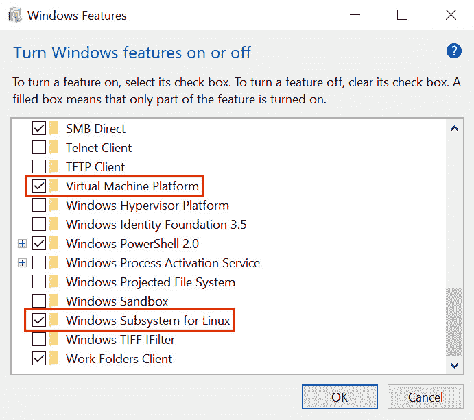

图 9.4–Windows Home 功能

启用这些功能后，应安装最新的 WSL2 Linux 内核。这可以通过下载并运行包来完成。请使用指向适用于 x64 机器的*Linux 内核更新包*Microsoft 文档的链接：[https://docs.microsoft.com/en-us/windows/wsl/install-win10](https://docs.microsoft.com/en-us/windows/wsl/install-win10) 用于 WSL2。

在 Docker Desktop 安装过程中，如果 WSL 2 未按*图 9.5*所示安装，您将看到以下错误消息：


图 9.5–WSL 2 缺少错误消息

谢天谢地，Docker 桌面提供了关于如何安装内核的清晰说明。

# Docker 化概述

将软件从开发机器转移到生产服务器的挑战比听起来要困难。环境的差异可能从硬件到软件不等。Docker 化是解决这一问题的一种方法。通过容器化，应用及其所有依赖项被捆绑到单个包或映像中。然后可以启动此映像，运行的映像或实例称为容器。

为了进一步解释，我们来看一个传统应用，如图 9.6 所示：


图 9.6–传统应用

上图演示了一个传统的应用，其中应用运行在基础架构上托管的操作系统上。当应用需要操作系统的不同功能时，这种方法可能会出现问题。不一定两个应用总是需要相反的特性，更重要的是，很难可靠地捕获一个应用的所有需求。在涉及开发团队和多个环境的组织中，如果没有清晰的文档或工具来帮助管理应用的依赖关系，这将变得难以控制。

VMs 抽象去掉底层基础设施，允许多个 VM 在一台物理机器上运行，如*图 9.7*所示：


图 9.7–虚拟机

上图显示了一个**虚拟机监控程序**用于托管多个虚拟机。每个 VM 都包含应用及其自己的操作系统副本，以运行应用。这种方法将用于运行虚拟机的硬件虚拟化。

Docker 化将虚拟化向前推进了一步，并将操作系统虚拟化，如*图 9.8*所示：

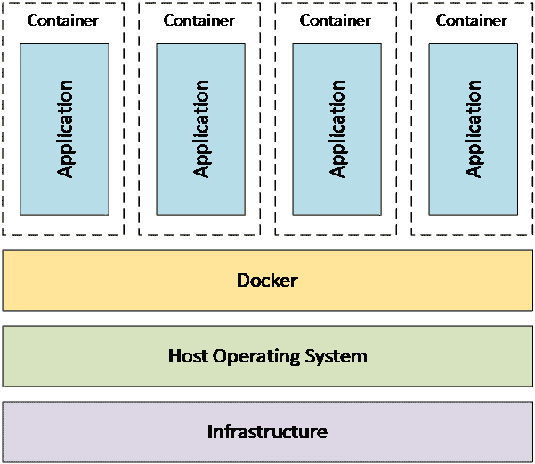

图 9.8–Docker

上图显示了**Docker**，一种流行的 Docker 技术，用于运行多个应用。注意，通过容器化，应用在共享主机操作系统上运行。一个优点是容器的大小比 VM 小得多。容器的启动速度也比 VM 快得多。容器化最显著的优点之一是软件的发布更具可预测性，因为应用及其所有依赖项都捆绑在一起，形成一个版本化的、不可更改的包。

# 与 Docker 一起开始

为了展示一个使用容器的实用示例，我们将使用流行的容器平台 Docker。Docker 之所以被选中，是因为它的受欢迎程度、易用性，以及它作为 Docker 运输行业领导者的地位。本章本节将提供 Docker 的概述和安装 Docker 的说明。

## 什么是码头工人？

Docker 是操作系统级虚拟化的平台，用于管理和执行称为容器的软件包。每个容器都是一个软件包以及运行容器所需的库和配置。该捆绑包称为映像，映像可以本地存储到运行 Docker 的机器或注册表中。Docker 注册表是图像的存储库。注册表可能需要身份验证；这称为私有注册表。不需要身份验证的 Docker 注册表称为公共存储库，Docker Hub 和 Docker Cloud 是两个流行的公共 Docker 注册表。让我们看一个常见的工作流程，以说明我们迄今为止讨论的内容，如图 9.9*所示：*


图 9.9-Docker 注册表

在 Docker 注册表中，存储图像的集合。在 Docker 环境中，比如说开发机器，`pull`命令用于将图像副本带入本地环境。然后，使用`run`*命令创建名为容器的图像实例。可以停止和启动容器，并可以更改其状态。这意味着，如果容器包含数据库，并且数据库中的记录发生了更改，那么如果容器停止并启动，这些更改将存在。但是，一旦创建图像，就无法对其进行更改。但是，一个图像可以存在多个版本。当我们看实际例子时，这将更有意义。*

 *让我们进一步讨论一个场景，在这个场景中，容器被开发、测试，然后发布到生产环境中。每项活动都将在不同的环境中进行。这是一个中央注册表可以帮助我们的例子，如*图 9.10*所示：


图 9.10–Docker 工作流程

图像是在**开发环境**中创建的。在上图中，**提交**命令用于从正在运行的容器创建图像。有几种方法可以创建图像，我们将在本章后面介绍一些方法。然后将图像从**开发环境**推送到**注册表**。从**测试环境**中，使用**pull***命令从注册表引入图像，使用**run**命令启动容器。一旦图像经过测试和批准，就可以在**生产环境**中从注册表和**注册表**中提取相同的图像。*

 *既然我们已经对 Docker 有了一个高层次的理解，让我们花些时间讨论一下它的主要组成部分。

### 形象

理解 Docker 的第一步是区分*图像*和*容器*。图像是一个版本化的文件，无法更改，实际上什么都不做。它是应用的快照，一旦创建，就无法更改。容器是图像的一个实例。容器有一个状态，例如，正在运行或已停止，容器有自己的状态。在某些方面，您可以用类似于 C 中*类*和*对象*之间的关系的方式来思考图像和容器之间的关系。

一个图像可以被认为是由层组成的。每一层都建立在前一层的基础上。例如，第一层可以设置初始环境。为了举例说明，让我们使用 Ubuntu 映像，它是为流行的 Linux 操作系统提供的映像。随后将添加一个后续层，以包含一些必需的组件——比如说一个数据库引擎，如 Microsoft SQL Server。正如我们前面提到的，有几种创建新图像的方法。在上一节中，我们提到可以使用`commit`命令，但是让我们讨论一下使用 Dockerfile。

### Dockerfile

Dockerfile 是一个文本文件，其中包含用于组装图像的命令。以官方的 Microsoft SQL Server 为例，用于创建 Microsoft SQL Server Linux 映像（`mssql-server-linux`的 Dockerfile 包含四个命令。

查看用于创建图像的 Dockerfile。这在位于[的公共 GitHub 存储库中 https://github.com/microsoft/mssql-docker/blob/master/linux/mssql-server-linux/Dockerfile](https://github.com/microsoft/mssql-docker/blob/master/linux/mssql-server-linux/Dockerfile) ：

```cs
# mssql-server-linux
# Maintainers: Microsoft Corporation (LuisBosquez and twright-msft on GitHub)
# GitRepo: https://github.com/Microsoft/mssql-docker
# Base OS layer: Latest Ubuntu LTS.
FROM ubuntu:16.04
# Default SQL Server TCP/Port.
EXPOSE 1433
# Copy all SQL Server runtime files from build drop into
# image.
COPY ./install /
# Run SQL Server process.
CMD [ "/opt/mssql/bin/sqlservr" ]
```

第一个命令`FROM ubuntu:1604`是一个示例，其中第一层被指定为 Ubuntu Docker 官方图像。下一个命令`EXPOSE 1433`将使端口`1433`可用于主机操作系统。此命令后面跟着`COPY ./install /`，它将复制 SQL Server 运行时。最后一个命令启动 SQL Server 进程：`CMD [ "/opt/mssql/bin/sqlservr" ]`。

执行 Dockerfile 时，将创建一个新映像，该映像由文件中的命令组成。稍后我们将更详细地讨论不同的命令。本节的目的只是介绍 Dockerfile 的概念以及图像如何由层组成。

### 容器

映像的运行实例，即容器，是轻量级、安全和可移植的。容器是轻量级的，因为与 VM 不同，它可以访问底层操作系统公开的资源。例如，如果主机系统可以访问 internet，则默认情况下容器可以访问 internet。类似地，默认情况下，容器可以完全访问可用的 RAM 和 CPU 资源。容器还与主机系统上运行的其他容器和进程隔离。这就是为什么端口`1433`在*Dockerfile*部分的 Microsoft SQL Server 示例中显式公开。Docker 容器遵循行业标准，这意味着它可以在不同的平台和容器引擎上运行。

### Docker 引擎

在本章中，我们将使用 Docker 引擎通过 Docker Desktop 运行容器。这一点值得注意，因为 Docker 遵循**开放式 Docker 倡议**（**OCI**标准），这意味着不同的发动机可以用于运行相同的图像。对于本地开发，我们可能使用 Docker Desktop，但我们的测试环境可能托管在云提供商中。在下一章中，我们将介绍如何使用 Azure 容器实例在 Azure 中运行容器。

Docker 引擎和 Azure 容器实例是用于管理隔离容器的强大引擎的示例。对于更高级的场景，需要一个编排引擎。Docker Swarm 和 Kubernetes 是支持扩展和负载平衡等附加功能以及身份验证和更高级监控功能的编排引擎的示例。

现在我们有了 Docker 的概述，让我们来安装它。

## 安装码头工人

Docker 桌面的安装可在 Docker 网站上找到。只需下载最新版本并安装即可。Docker 在[上提供了 Mac、Windows 和 Linux 的全面安装说明 https://docs.docker.com/get-docker/](https://docs.docker.com/get-docker/) ，因此我们不会在这里重复说明和要求。

在本章中，出于几个原因，我们将使用 Linux 容器。首先，它们往往更小，因此下载和启动更快。第二个是说明.NET 能够将相同的源代码编译到 Linux 或 Windows 容器中的能力。

安装并启动 Docker Desktop 后，让我们运行一些命令以确保一切按预期进行。您可以使用 command、Bash 或 PowerShell 来运行本章中的 Docker CLI 命令。首先，通过运行`docker version`确保 Docker 已启动并运行。

答复分为两部分。第一个显示客户端，如*图 9.11*所示：

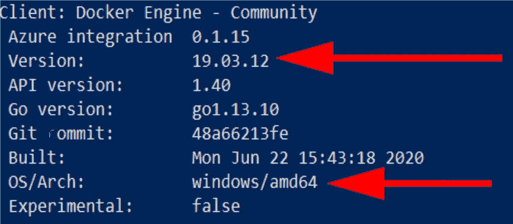

图 9.11-Docker 版本客户端

在这里，您可以看到撰写本文时 Docker Desktop 的版本以及客户端正在运行的操作系统 Windows。

第二部分是服务器，如*图 9.12*所示：

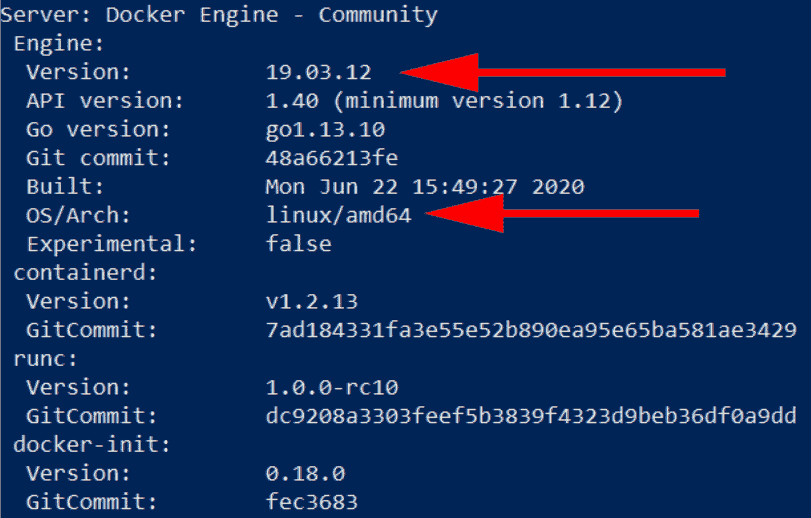

图 9.12-Docker 版本服务器

请注意 Docker Engine 的版本以及运行的体系结构`linux`，这表明 Linux 容器可以运行。

另一个确保所有工作正常的简单测试是`docker hello-world`命令。试一试，如果一切正常，没有错误，让我们在下一节中尝试一些更有趣的东西。

## Windows 安全警报

根据您的特定桌面配置，您可能会收到一个警报，询问 Docker 后端是否可以访问网络，如*图 9.13*所示：


图 9.13–Windows 安全警报

要完成本章中的说明，Docker 需要能够访问 Docker Hub 检索图像。

# 在 Docker 上运行 Redis

在本节中，我们将运行流行的开源内存缓存**Redis**。Redis 是一种数据结构存储，这意味着它存储字符串、列表、集合、排序集和散列等内容，并支持对存储数据的查询。Redis 已经开发了十多年，拥有一个庞大的社区，如果您还没有这样做的话，它值得一看。

将 Redis 作为本地开发的容器运行非常有意义。通过使用容器，我们不必在机器上安装 Redis，也不必担心安全权限。对于容器，设置和安全性已经完成。不过，限制是我们只能访问一些 Redis 选项。如果存在基础 Redis 映像不支持的选项，则建议使用基础 Redis 映像创建自定义 Redis 映像。

## 启动 Redis

使用`run`命令启动 Redis 容器：

```cs
docker run --name myRedis -p 6379:6379 -d redis
```

使用此命令，我们将命名容器`myRedis`并指定要提取的`redis`图像。这将从 Docker Hub 中提取，我们可以看到正在下载的图像。由于我们将在下一节中从应用访问此端口，因此我们需要确保使用*图 9.14*中所示的`-p`选项公开默认的 Redis 端口`6379`：


图 9.14–Redis 的 docker 运行命令

一旦命令完成，Redis 将在容器中运行。您可以使用`docker container ps`命令查看正在运行的容器，如*图 9.15*所示：


图 9.15–docker ps 命令

另一个有用的命令是`docker images`，显示本地图像，如*图 9.16*所示：


图 9.16–docker 图像

上图显示了带有`latest`标签的`redis`图像。

在下一节中，我们将从.NET 应用访问 Redis，但现在，让我们连接到容器并四处看看。我们可以使用`docker exec -it myRedis sh`命令连接到容器。进入容器后，我们需要使用`redis-cli`命令进入 Redis 命令模式。Redis CLI 允许我们对缓存运行命令。

进入 Redis CLI 后，我们将发出一些命令来检查 Redis 是否按预期工作。第一个命令`hset messageFromRedis "absexp" "-1" "sldexp" "-1" "data" "Hello from Redis!"`将以允许.NET 应用检索的格式在 Redis 中创建一个字符串。好消息是使用 Redis SDK 进行设置和检索要简单得多。第二个命令`set key1 value1`将添加一个用`key1`标识的字符串和一个值`value1`。最后一个命令`get key1`显示可以检索`key1`的值，如*图 9.17*所示：

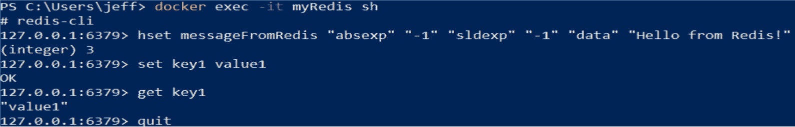

图 9.17–Redis CLI

然后您可以退出 Redis 和容器。

在本节中，我们启动了一个 Redis 容器，并检查它是否按预期运行。在下一节中，我们将从另一个应用访问 Redis。要做到这一点，我们需要确定 Redis 缓存地址。要确定 IP 地址，请使用`ipconfig`命令。如果您不是在虚拟机中运行，则应该看到属于 DockerNet 的网络。例如，您应该看到如下内容：

```cs
Ethernet adapter vEthernet (DockerNAT):   Connection-specific DNS Suffix  . :   IPv4 Address. . . . . . . . . . . : 10.0.73.1    Subnet Mask . . . . . . . . . . . : 255.255.255.0    Default Gateway . . . . . . . . . :
```

在虚拟机上，查找属于`WSL`的网络：

```cs
Ethernet adapter vEthernet (WSL):   Connection-specific DNS Suffix  . :   Link-local IPv6 Address . . . . . : fe80::8411:e43d:c978:9e70%32    IPv4 Address. . . . . . . . . . . : 172.23.160.1    Subnet Mask . . . . . . . . . . . : 255.255.240.0    Default Gateway . . . . . . . . . :
```

在下一节中，记录 IPv4 地址，因为我们需要它来连接 Docker。

# 在容器中运行 ASP.NET Core

在本节中，我们将创建一个简单的 ASP.NET Core 应用，用于访问我们的 Redis 容器。然后，我们将在容器中运行应用。我们将从命令行执行大部分操作，但我们将跳转到 Visual Studio，以展示一些可用的优秀工具：

1.  The first step is to create a new directory and create a basic .NET web application. In the following *Figure 9.18*, we can see what ASP.NET projects are available by using the `dotnet new ASP.NET -l` command:

    

    图 9.18–dotnet 新 ASP.NET-l

2.  Next, we need to create a folder for our solution with the `mkdir Chap9` command and create an empty solution with the `dotnet new sln` command as shown in *Figure 9.19*:

    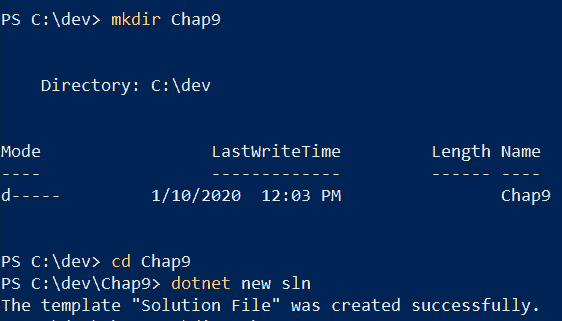

    图 9.19–dotnet 新 sln

3.  Then we create another folder within the previous one called `web` with the `mkdir web` command. Remember to change directory, for example, using `cd web`, into the created folder. Create a new `ASP.NET Core Empty` project using the `dotnet new web` command as shown in *Figure 9.20*:

    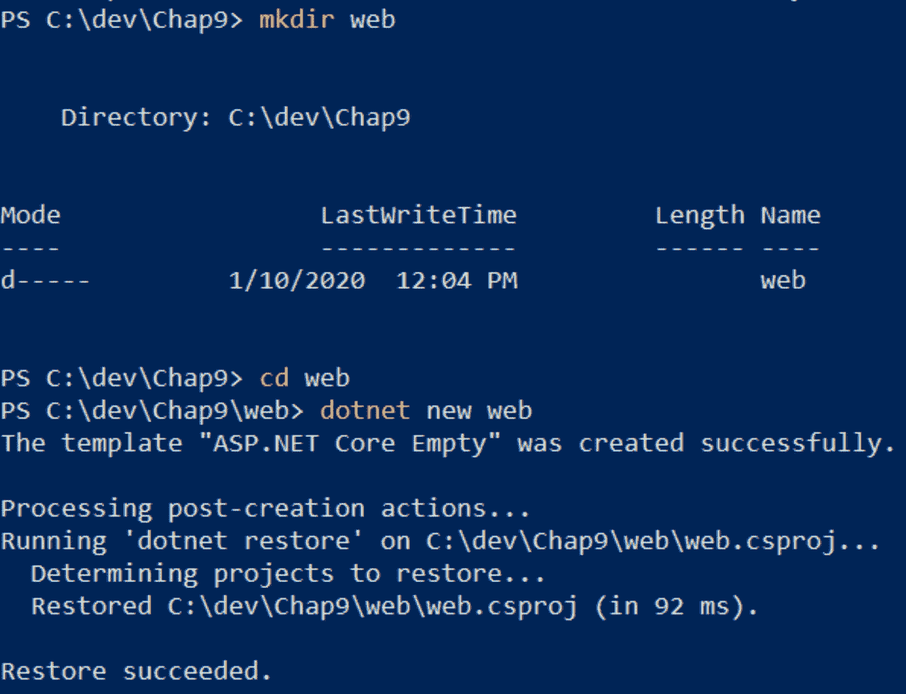

    图 9.20–dotnet 新网站

4.  最后一步是将项目添加到我们的解决方案中，如*图 9.21*所示：

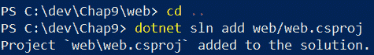

图 9.21–dotnet sln 添加

笔记

在解决方案文件夹中创建 web 的额外步骤将在后面的章节中帮助我们。当以后添加容器编排支持时，VisualStudio 将以一种不那么混乱的方式显示与容器相关的文件。

现在我们已经创建了解决方案和项目，请继续使用`dotnet run`命令运行项目，确保一切正常。您将需要在 web 项目中执行此操作，如*图 9.22*所示：

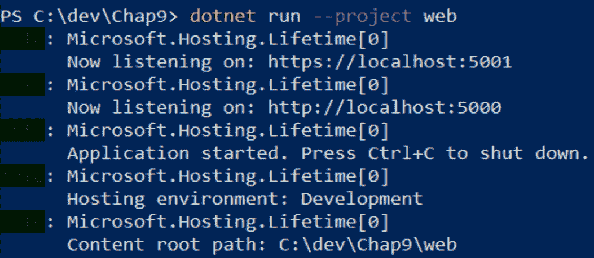

图 9.22–dotnet 运行

在浏览器中，进入`http://localhost:5000`，您会收到一条熟悉的消息，如*图 9.23*所示：


图 9.23–你好，世界！

现在我们有了基本的 web 应用，我们将更改该应用，以便它从 Redis 检索一条自定义消息。

## 访问 Redis

让我们停止正在运行的应用—使用*Ctrl+C*可以停止 dotnet 应用—并编辑一些文件。第一个要编辑的文件是`web.csproj`；使用记事本是可以的。我们要插入以下行：

```cs
<ItemGroup>  <PackageReference Include="Microsoft.Extensions.Caching.
   StackExchangeRedis" Version="3.1.8" />  </ItemGroup>
```

编辑后的文件如图 9.24 所示：

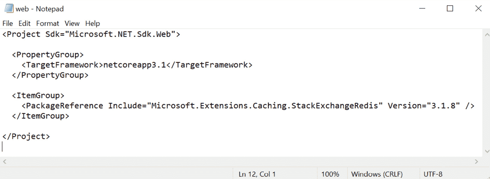

图 9.24–web.csproj

下一个要编辑的文件是`startup.cs`文件。我刚刚用记事本添加了一个新的`using`语句：

```cs
using Microsoft.Extensions.Caching.Distributed;
```

在`ConfigureServices`方法中，我们将链接添加到 Redis。请务必输入您的 Redis IPv4 地址：

```cs
services.AddStackExchangeRedisCache(option => 
    option.Configuration = "172.23.160.1");            
```

`Configure`方法签名需要更新，以允许将缓存注入该方法：

```cs
public void Configure(IApplicationBuilder app,  
    IWebHostEnvironment env, IDistributedCache cache)
```

最后一步是将静态“`Hello World!`”替换为我们来自 Redis 的消息：

```cs
await context.Response.WriteAsync(cache.GetString
    ("messageFromRedis"));
```

下面的*图 9.25*显示了最终的`startup.cs`文件：


图 9.25–Startup.cs

再次运行应用并刷新浏览器以查看更新的消息，如*图 9.26*所示：

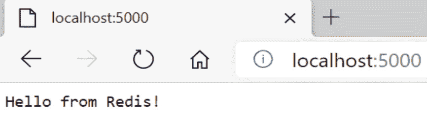

图 9.26–Redis 的您好！

在本节中，我们使用名为*Hello World*模板的空模板创建了一个新的 ASP.NET Core web 应用。然后，我们添加了一个用于从.NET 应用连接到 Redis 的流行包 StackExchangeRedis。这与大型站点（如堆栈溢出）使用的客户端相同。使用这个库，我们必须将缓存添加到 ASP.NET 的依赖项注入中。我们的最后一步是使用缓存从运行在 Docker 容器中的 Redis 缓存中检索字符串。

## 增加 Docker 支架

我们将从两个方面来研究将 ASP.NET Core 应用进行容器化。第一种方法将创建 Dockerfile 和命令，以创建映像并运行容器。第二种方法将使用 VisualStudio。

### Dockerfile 方法

从项目的根文件夹开始，我们将使用`dotnet publish -c Release`命令发布发布版本。这将生成我们的应用的构建，以便它可以复制到我们的容器中，如*图 9.27*所示：


图 9.27–网络发布

在包含我们的应用的`release`文件夹中，我们将创建一个 Dockerfile。

笔记

默认情况下，Docker 将在当前文件夹中查找名为`dockerfile`且没有扩展名的文件。

为此，我使用记事本并输入以下语句：

```cs
FROM mcr.microsoft.com/dotnet/core/aspnet:3.1-buster-slim WORKDIR /app COPY . .EXPOSE 80 ENTRYPOINT ["dotnet", "web.dll"]
```

还记得之前的洋葱比喻吗？我们将从 Microsoft 提供的已加载 ASP.NET 的层开始。下一个命令表示我们正在创建图像的`app`文件夹中工作。`copy`命令将当前文件夹的内容复制到图像的`app`文件夹中。然后，我们使端口`80`在我们的图像之外可用。最后一个命令指出.NET 应该在容器启动时运行`web.dll`。当我们的容器启动时，我们的 ASP.NET Core 应用应该启动并侦听端口`80`。

保存文件后，让我们构建映像：

```cs
docker build . -t myweb
```

如果您收到一个错误，说明找不到该文件，则可能是您将该文件命名为`Dockerfile.txt`。没问题–我们可以使用`-f`参数指定文件名：

```cs
docker build . -f Dockerfile.txt -t myweb
```

如果一切顺利，那么您将收到一条成功消息，说明图像已构建并标记为`myweb:latest`。您可以使用`docker images`命令查看图像，如*图 9.28*所示：


图 9.28–docker 图像

为了启动映像，我们使用`docker run`命令，将本地端口`8080`映射到 Docker 端口`80`：

```cs
docker run -p 8080:80 myweb
```

在浏览器中，我们可以导航到 web 应用，仍然可以看到来自 Redis 的消息，如*图 9.29*所示：


图 9.29–容器中的 ASP.NET Core

当然，我们只是在这里触及表面，但这是一个有力的例子，说明容器是多么容易。那么，VisualStudio 能让体验变得更简单吗？

### VisualStudio 方法

在 VisualStudio 中，打开**解决方案浏览器**。继续并运行项目，如果系统提示您保存解决方案文件，请继续并将其保存在与项目文件相同的文件夹中。VisualStudio 有许多功能支持 Docker 容器开发人员。我们将看到的第一个特性是能够为我们的项目添加 Dockerfile。这位于**添加**子菜单下的**解决方案资源管理器**上下文菜单中，称为**Docker Support…**。如*图 9.30*所示：

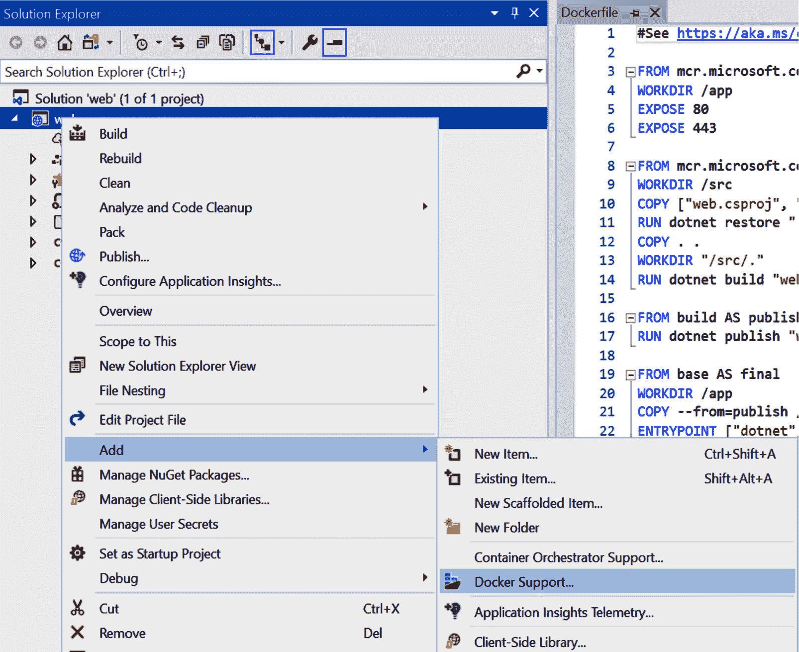

图 9.30-Docker 支持…

通过选择此选项，Visual Studio 将准备将项目制作成图像。VisualStudio 将询问目标映像是针对**Linux**还是**Windows**操作系统，如*图 9.31*所示：


图 9.31–Docker 文件选项

由于我们的 Docker 桌面当前正在运行 Linux 容器，请选择默认的**Linux**选项。现在会发生几件事。首先，请注意，为项目创建了一个名为`Dockerfile`的新文件，如*图 9.32*所示：

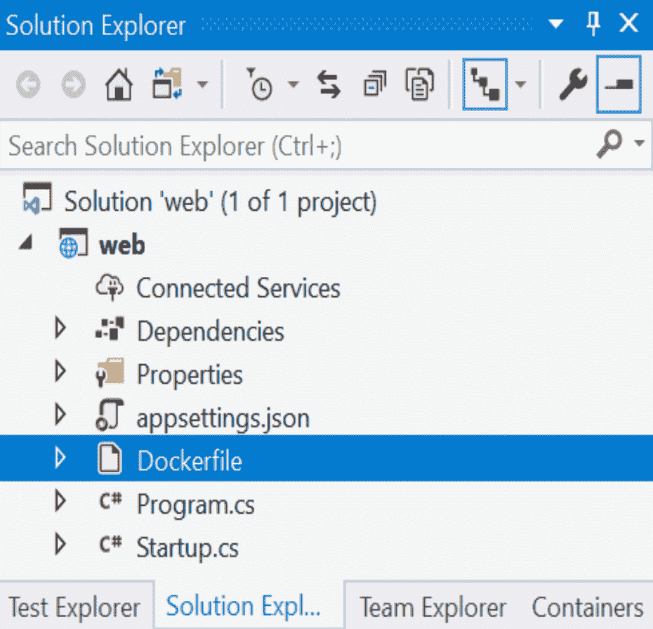

图 9.32–Visual Studio Dockerfile

继续并打开文件，注意与我们在上一节中创建的 Dockerfile 有多么相似。主要区别在于此 Dockerfile 在将版本复制到映像之前执行`dotnet build`和`dotnet release`。

另外，请注意，运行选项已更改为显示 Docker 作为运行目标，如图 9.33 所示：

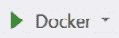

图 9.33–Visual Studio：Docker 运行目标

如果我们现在运行这个项目，将会发生几件事。Visual Studio 将显示一个名为**容器**的新窗口，如*图 9.34*所示：


图 9.34–Visual Studio 容器窗口

此窗口显示正在运行的容器和本地机器上的图像。在上图中，我们可以看到当前有三个容器正在运行。名为`web`的容器就是这个项目容器。您还可以看到名为**myRedis**的 Redis 容器正在运行，以及生成的名称，在本例中为**keen_volhard**。花点时间去探索。例如，如果选择**myRedis**容器，则可以看到端口`6379`已经映射，如*图 9.35*所示：


图 9.35–Visual Studio 容器窗口

哦，如果你想知道的话，我们对正在运行的容器有完全的调试支持。在`Startup.cs`文件中，将`Configure`方法中的断点放在我们从 Redis 检索字符串的行上，如*图 9.36*所示：

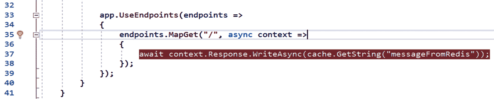

图 9.36–Visual Studio 调试支持

当项目再次运行时，点击调试，我们可以调查运行对象，如*图 9.37*所示：


图 9.37–Visual Studio 调试

我们将在后面的章节中更详细地讨论调试，但我们的目的是展示 VisualStudio 与 Docker 和正在运行的容器的紧密集成。

## Docker 多 Docker 支持

在前面的部分中，我们有一个场景，其中一个容器调用另一个容器。我们使用主机网络实现了从 ASP.NET Core 应用到 Redis 缓存的调用。这是可行的，但有两个明显的缺点。首先，任何有权访问主机网络的人都可以调用 Redis 缓存。第二个缺点是没有任何迹象表明我们的 ASP.NET Core 应用需要 Redis。

在本节中，我们将通过使用 Docker Compose 来解决这两个缺点。Docker Compose 允许我们将多个容器合并到一个定义中。这将允许我们限制对 Redis 的访问，并表明 Redis 是我们的 ASP.NET Core 应用的一项要求。我们可以在没有 VisualStudio 的情况下完成这一部分，但我们将使用 VisualStudio 突出显示一些可用的优秀功能。

### 添加容器编排支持

在解决方案浏览器中，我们可以选择添加`Container Orchestrator Support`。位于**添加**子菜单下的项目上下文菜单中，如*图 9.38*所示：


图 9.38–容器编排支持…

系统将提示您输入所需的`Container Orchestrator Support`类型。有两个选项：**库伯内特斯/赫尔姆**和**码头工人组合**。这两个用例之间的主要区别在于您是需要一组引擎来承载容器，还是需要一个引擎。在大多数情况下，集群将指示单独的 VM 或物理机器。在我们的场景中，我们只想在单个 Docker 引擎实例上托管，所以我们将选择**Docker Compose**，如*图 9.39*所示：


图 9.39-Docker Compose

如果提示输入目标操作系统，请选择**Linux**。此外，Visual Studio 将检测到我们的项目中存在 Dockerfile，如*图 9.40*所示：

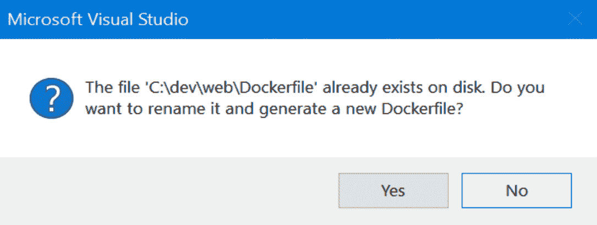

图 9.40–创建新的 Dockerfile

我们不介意覆盖当前的 Dockerfile，因此选择**否**。

现在来看解决方案，我们会注意到一些新的 YAML 文件，如*图 9.41*所示：

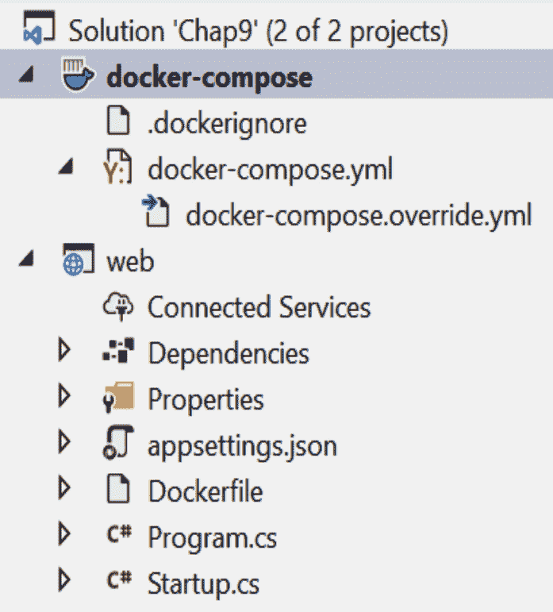

图 9.41–Visual Studio YAML

新的**docker compose**部分中的`docker-compose.yml`文件用于定义我们的编排。在这个文件中，我们将定义编排的容器、网络和其他需求。您还将注意到，`docker-compose.override.yml`折叠在文件下。不要担心这个文件中的细节，它提供了在 VisualStudio 中运行编排的细节。我们要做的是删除这个文件，因为如果我们只查看一个`docker-compose.yml`文件，它会使事情变得更简单。

笔记

一定要删除`docker-compose.override.yml`文件，以免以后混淆。

默认 Docker Compose 文件指定我们有一个名为`web`的服务，并给出其 Dockerfile 的位置：

```cs
version: "3.4"
services:
  web:
    image: ${DOCKER_REGISTRY-}web
    build:
      context: .
      dockerfile: web/Dockerfile
```

文件中的版本号很重要，因为它指示支持的 Docker 引擎版本。例如，3.4 支持 Docker 引擎版本 17.09.0 及更新版本。版本可在[找到 https://docs.docker.com/compose/compose-file/compose-versioning/](https://docs.docker.com/compose/compose-file/compose-versioning/) 。在`services`下，我们有一个名为`web`的服务。将用于`web`服务的图像指定为环境变量`${DOCKER_REGISTRY}`和单词`web`的组合。在新的环境中，不应设置环境变量，因此图像最终将仅为`web`。最后要指出的是，`context`是指向目录的路径，与`dockerfile`选项一起使用。在我们的 Docker Compose 文件中，这将导致 Dockerfile 位于`web`目录中。

### 将 Redis 添加到 Docker Compose 文件

我们需要做的第一件事就是将`redis`服务添加到此编排中。记住要小心缩进，因为 YAML 要求遵循缩进规则。在`web`服务的定义下，我们创建一个新的服务`redis`：

```cs
version: "3.4"
services:
  web:
    image: ${DOCKER_REGISTRY-}web
    build:
      context: .
      dockerfile: web/Dockerfile
  redis:
    image: redis
    ports:
    - 6379:6379
```

请注意，我们使用的是默认端口。保存文件时，在`Output`窗口中查找中的`Container Tools`或`Build`。您应该会看到一个`Bind for 0.0.0.0:6379 failed: port is already allocated`错误，因为您仍然会运行上一个 Redis 容器。

添加隔离网络

我们想要做的是独立于其他示例运行新的编排。为此，我们需要在 Docker Compose 文件中定义一个网络。只需将网络定义添加到文件末尾并在两个服务上设置此网络即可：

```cs
version: "3.4"
services:
  web:
    image: ${DOCKER_REGISTRY-}web
    build:
      context: .
      dockerfile: web/Dockerfile
    networks:
      - chap9
  redis:
    image: redis
    networks:
      - chap9
networks:
  chap9:
```

这些更改将定义一个与主机隔离的新网络。这意味着我们必须进行一些额外的更改，以使我们的示例正常工作。第一个是我们需要公开一个从`chap9`网络到主机网络的端口，以便我们可以浏览站点：

```cs
web:
    image: ${DOCKER_REGISTRY-}web
    build:
      context: .
      dockerfile: web/Dockerfile
    ports:
      - 80
    networks:
      - chap9
```

在前面的代码块中，端口`80`是从`chap9`网络中暴露出来的。

### 修改启动

这也意味着我们在`statup.cs`文件中硬编码的端口将不正确。现在，让我们通过在新 Docker 网络中从使用 IP 地址改为使用服务名称来纠正这个问题。这是通过`startup.cs`文件中的`ConfigureServices`方法完成的：

```cs
public void ConfigureServices(IServiceCollection services)
{
	services.AddStackExchangeRedisCache(option => 
         option.Configuration = "redis");            
}
```

我们需要做的另一件事是在 Redis 缓存中添加一条默认消息。这是以前在手动步骤中完成的，因此，如果消息尚未定义，我们将添加一些逻辑来执行此操作。

为简单起见，这是在`Configure`方法中通过在`app.UserEndpoints`命令之前添加以下行来完成的：

```cs
public void Configure(IApplicationBuilder app, IWebHostEnvironment 
    env, IDistributedCache cache)
{
…           
if(string.IsNullOrEmpty(cache.GetString("messageFromRedis")))
{
cache.SetString("messageFromRedis", "Hello from Redis 
    running in an isolated network!");
}
…
}
```

前面的代码段仅在缺少`messageFromRedis`键时才使用该键设置字符串。这是一个简单的例子，但希望你能看到使用 Redis 缓存是多么简单。

### 潜在错误

如果事情进展不顺利，你可能会遇到一些事情。突出显示的第一个错误是，如果我们没有指定要向主机公开的端口，我们将看到如下对话框，如图 9.42*所示：*


图 9.42–缺少端口

这表示 Docker Compose 文件中的`web`服务下未指定任何端口。

第二件事是，如果 Redis 缓存的地址不匹配，我们在尝试建立与 Redis 的连接时会出现*无法连接*错误。让我们通过将网络位置作为环境变量传入来说明 Docker Compose 的另一个特性。这是通过在`web`服务部分的 Docker Compose 文件中定义变量来实现的。

### 添加 Environmentnt 变量

首先，在`startup.cs`文件中，编辑`ConfigureServices`方法以使用环境变量：

```cs
public void ConfigureServices(IServiceCollection services)
{
	services.AddStackExchangeRedisCache(option => 
         option.Configuration = Environment.
             GetEnvironmentVariable("REDIS_ADDRESS"));            
}
```

然后在 Docker Compose 文件中，编辑`web`服务部分以包括新的`environment`设置：

```cs
web:
  image: ${DOCKER_REGISTRY-}web
  build:
    context: .
    dockerfile: web/Dockerfile
  environment:
    - REDIS_ADDRESS=redis
  ports:
    - 80
  networks:
    - chap9
```

很可能，您不会遇到错误，但要在编排中突出显示的一个重要功能依赖于另一个容器。这可以通过使用`depends_on`设置在 Docker Compose 文件中完成：

```cs
  web:
…
    depends_on:
      - redis
…
```

下面的显示了我们的已完成的`docker-compose.yml`文件：

```cs
version: "3.4"
services:
  web:
    image: ${DOCKER_REGISTRY-}web
    build:
      context: .
      dockerfile: web/Dockerfile
    depends_on:
      - redis
    environment:
      - REDIS_ADDRESS=redis
    ports:
      - 80
    networks:
      - chap9
  redis:
    image: redis
    networks:
      - chap9
networks:
  chap9:
```

在运行项目时，我们会看到新的更新消息，如*图 9.43*所示：

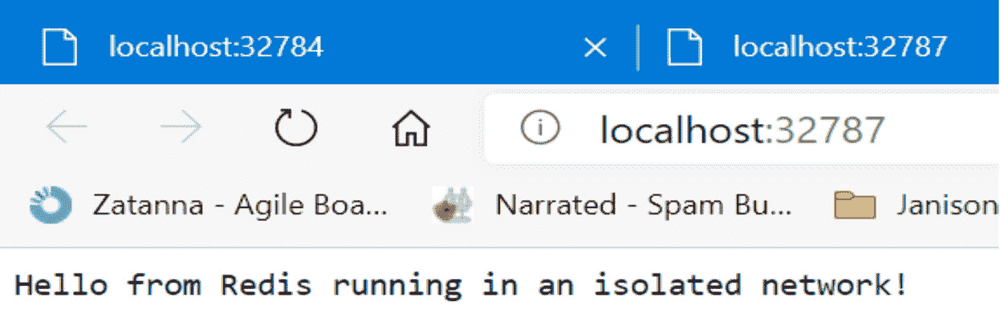

图 9.43–运行在隔离网络中的 Redis 的 Hello！

让我们从第二个角度来看这个问题，这样我们就可以更深入地了解正在发生的事情。

### Docker 网络

让我们来看看当前定义的 OrthT2 网络，通过使用 Tyt T0 命令，如图 9.44 所示，图 4：

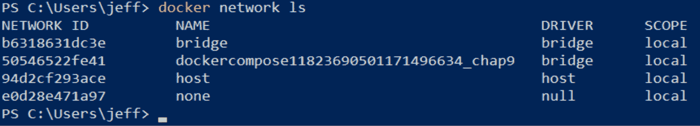

图 9.44-docker 网络 ls

您应该看到几个网络。我们将更详细地了解这两个版本的`bridge`驱动程序。使用`docker network inspect bridge`命令，让我们看看第一个名为`bridge`的网络。现在来看`Containers`部分，如*图 9.45*所示：

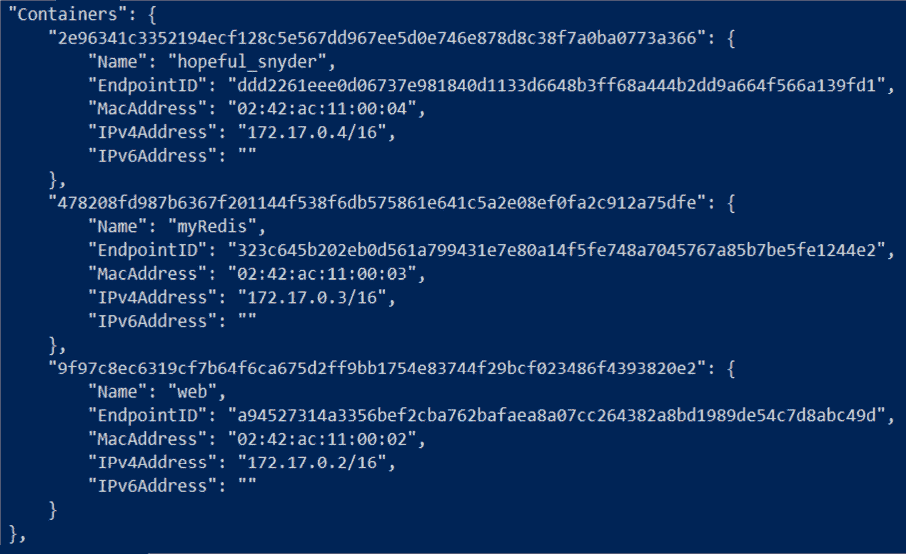

图 9.45-码头网络检查桥-Docker

通过查看容器的名称，我们可以看出这是默认网络，因为这些是我们在本章第一节中创建的容器。这在*图 9.46*所示的`Options`部分中表示：


图 9.46-docker 网络检查网桥-选项

注意，默认的`bridge`选项设置为`true`。当我们使用`docker network inspect network id`命令检查另一个网桥网络时，我们可以看到选项指示这是`chap9``compose`网络，如*图 9.47*所示：


图 9.47-docker 网络检查网络 id

花点时间检查网络中的容器，如*图 9.48*所示：

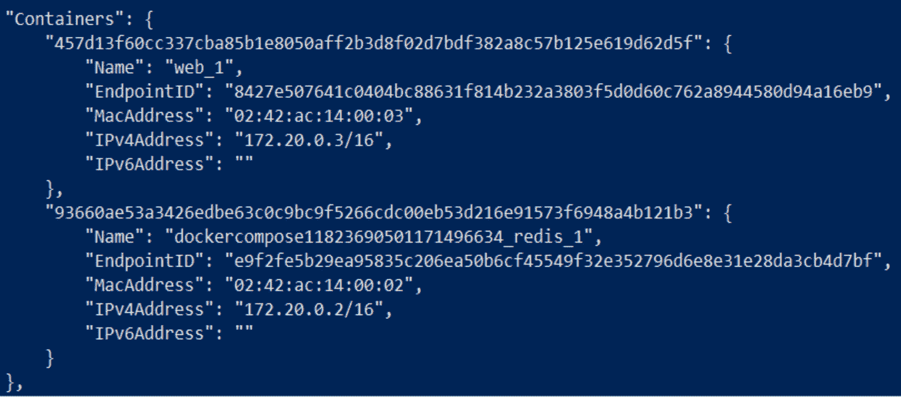

图 9.48-docker 网络检查 chap9 Docker

显示 ASP.NET Core 应用和 Redis 缓存容器及其内部地址。

在本节中，我们介绍了 Docker Compose。这允许我们定义一个包含两个容器的容器编排：ASP.NET 应用和 Redis 缓存。编排是定义的，以说明 Docker Compose 的几个特征。第一个是为两个 Docker 创建了一个隔离网络。我们还确保在 ASP.NET 应用上只公开端口`80`。我们使用`depends_on`设置在 ASP.NET 和 Redis 缓存之间包含了一个依赖项。此外，我们还演示了如何设置环境变量并使其可用于正在运行的容器。

# 总结

在本章中，我们介绍了容器和流行的 Docker 平台。我们概述了 Docker 化以及 Docker 与虚拟机的不同之处。我们研究了 Docker 及其一些主要组件，包括图像、容器、Docker 引擎和 DockerFile。

我们提供了三个运行容器的不同示例。第一个是运行流行的内存缓存 Redis。这表明启动一个新容器是多么简单。接下来，我们仅使用记事本创建了自己的 ASP.NET Core 容器。最后一个示例使用 Visual Studio 对现有 ASP.NET Core 应用进行容器化。这个例子突出了 IDE 在使用 Docker 时提供的一些不错的特性。

Docker 和码头工人是一个大课题。本章的目的是介绍这项强大技术的一些亮点和背景。由于.NET 对 Linux 和 Windows 的可移植性，它是构建容器的理想框架。

下一章将把 ASP.NET 带到云端！我们将看看**亚马逊网络服务**（**AWS**和 Azure 如何托管我们的 ASP.NET 解决方案。

# 问题

1.  您希望应用在容器或 VM 中启动更快吗？
2.  Redis 是关系数据库吗？
3.  能否在 Visual Studio 中查看正在运行的容器？
4.  当创建涉及多个 Docker 引擎实例的业务流程时，应该使用什么业务流程类型？
5.  这一章有趣吗？

# 进一步阅读

*   Docker 拥有大量文档，可在[找到 https://docs.docker.com/](https://docs.docker.com/) 。
*   Microsoft 在其文档[中介绍了 Docker 和 Visual Studio 对容器的支持 https://docs.microsoft.com/en-us/aspnet/core/host-and-deploy/docker](https://docs.microsoft.com/en-us/aspnet/core/host-and-deploy/docker) 。
*   *学习 Docker–Docker 19.x 的基础知识，第二版*由 Gabriel N.Schenker 编写，Packt 出版社，[https://subscription.packtpub.com/book/cloud_and_networking/9781838827472](https://subscription.packtpub.com/book/cloud_and_networking/9781838827472) 。
*   *Docker for Developers* by Richard Bullington-McGuire, Andrew K. Dennis, Michael Schwartz, Packt Publishing,

    [https://subscription.packtpub.com/book/cloud_and_networking/9781789536058](https://subscription.packtpub.com/book/cloud_and_networking/9781789536058) 。**