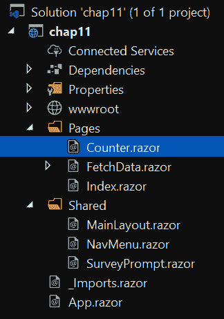

# *章节11*：浏览器和 Visual Studio 调试

在上一章中，我们介绍了将 ASP.NET 核心应用部署到两个领先的云提供商：AWS 和 Azure。这两个云提供商都提供了从 VisualStudio 内部管理云的出色支持。本章是对云计算的介绍，我们将在[*第 13 章*](13.html#_idTextAnchor276)、*云原生*中更详细地介绍云计算。

在本章中，我们将了解浏览器和 Visual Studio 如何帮助我们理解并支持 ASP.NET 核心应用的开发。构建软件非常复杂，知道如何使用可用的工具对于生成高质量代码至关重要。幸运的是，所有主流浏览器都内置了对分析、调试和查看 web 应用的支持。由于 Visual Studio 是我们在大部分章节中使用的**集成开发环境**（**IDE**），因此我们将探讨在开发 ASP.NET 核心应用时您应该注意的功能。我们将使用**渐进式 Web 应用**（**PWA**来说明内置于浏览器和 Visual Studio 中的功能。

本章将介绍以下主题：

*   普华斯
*   使用浏览器工具进行调试
*   使用 VisualStudio 进行调试

在本章末尾，您将很好地理解如何有效地使用浏览器和 VisualStudio 进行调试。通过有效地使用可用的工具，我们可以深入了解正在创建的代码。这将提高您构建和理解 web 应用的能力。本章介绍如何使用浏览器开发人员工具和 Visual Studio 支持，巧妙地进行编码，以调试和分析我们的 ASP.NET 核心应用。

# 技术要求

本章包括简短的代码片段，以演示所解释的概念。需要以下软件：

*   **Visual Studio 2019**：Visual Studio 可从[下载 https://visualstudio.microsoft.com/vs/community/](https://visualstudio.microsoft.com/vs/community/) 。社区版是免费的，将用于本书的目的。
*   **.NET 5**：可以从[下载.NET frameworkhttps://dotnet.microsoft.com/download](https://dotnet.microsoft.com/download) 。

确保下载 SDK，而不仅仅是运行时。您可以通过打开命令提示符并运行`dotnet --info`命令来验证安装，如*图 11.1*所示：


图 11.1–dotnet--信息

前面的屏幕截图显示了编写本章时的版本。

请访问以下链接查看 CiA 视频：[https://bit.ly/3qDiqYY](https://bit.ly/3qDiqYY)

## 浏览器

在本章中，我们将使用 Chrome 展示浏览器的开发工具如何帮助调试 ASP.NET 核心 web 应用。Edge、Safari、Firefox 和其他浏览器也以同样的方式支持开发人员工具。我们鼓励您使用自己选择的浏览器探索开发人员工具。

## GitHub 源

本章的源代码位于 GitHub 存储库中的[https://github.com/PacktPublishing/ASP.NET-Core-5-for-Beginners/tree/master/Chapter%2010](https://github.com/PacktPublishing/ASP.NET-Core-5-for-Beginners/tree/master/Chapter%2010) 。

# 设置示例应用

本章的申请将基于**Blazor WebAssembly**（**WASM**的样本申请。之所以选择此应用，是因为它提供了足够的复杂性，让人感兴趣，并且为实际应用提供了良好的基础。这个 ASP.Net 核心 web 应用示例向我们展示了一个很好的**单页应用**（**SPA**）示例。在许多方面，应用的行为更像一个桌面应用，而不是传统的网站。

当我们在[*第 6 章*](06.html#_idTextAnchor134)*探索 Blazor Web 框架*中构建 PWA 时，PWA 将消息发送到信号中心，信号中心将消息实时分发到服务器。在*第 6 章**探索 Blazor Web 框架*中，我们安装了应用，以显示应用作为本机应用运行，同时仍向服务器发送消息。

在本节中，我们将创建一个类似的 SPA，并使用浏览器中提供的工具，进一步探索 PWS 的含义。在本节结束时，您应该更加了解为什么这项技术令人兴奋。

## 创建渐进式 web 应用

我们将首先使用 Blazor WASM 模板创建 Blazor 应用。我更喜欢从命令行执行此操作，但您将从 Visual Studio 中获得相同的结果：

```cs
dotnet new blazorwasm
```

继续运行创建的应用，如以下命令所示：

```cs
dotnet run
```

应用启动后，导航到该站点以查看其显示是否正确。

笔记

在本章中，我们将使用 Chrome，但这些步骤中的大多数步骤在另一个浏览器中也同样适用。

本章我们要做的重点页面是**计数器**，如*图 11.2*所示：


图 11.2–计数器页面

首先要注意的是，如果您通过按**单击我**来增加计数器，导航到另一页，然后导航回该页，则当前计数将重置回`0`。这是因为当前计数存储在页面内存中。页面刷新后，当前计数的值将重置回`0`。

我们打开项目，导航到计数器页面，如*图 11.3*所示：



图 11.3–计数器。剃须刀

此页面仅使用变量来维护计数。每次单击按钮时，计数都会增加。资料来源如下：

```cs
@page "/counter"<h1>Counter</h1><p>Current count: @currentCount</p><button class="btn btn-primary" @onclick="IncrementCount">Click me</button>@code {    private int currentCount = 0;    private void IncrementCount()    {        currentCount++;    }}
```

需要注意的是变量`currentCount`是一个私有成员变量。未使用变量初始化，且其值未存储在任何位置。这意味着当页面刷新时，它会重置回`0`。

## 保存应用的状态

当执行应用时，应用的内容和信息将发生变化。应用的状态是一组信息，可用于在某个时间点描述应用。这一点很重要，因为如果保存应用的状态，则可以将应用恢复到某个时间点。

计数器是应用存储每页刷新计数器状态的示例。这意味着计数器的状态仅持续到下一次加载页面。

对于 web 应用，我们有几个用于存储应用状态的选项。出于本讨论的目的，让我们只关注用户状态——换句话说，与单个用户相关的状态。

下表总结了一些存储状态的常用方法：


有比我们刚才列出的更多的选项，但即使只有表中的选项，我们也有一些选择。在[*第 7 章*](07.html#_idTextAnchor149)、*API 和数据访问*中，我们研究了在数据库中存储数据。我们还在[*第 9 章*](09.html#_idTextAnchor187)*开始使用容器*中提到了使用 Redis 缓存。这为我们提供了一个在服务器上存储状态的示例。

在本章中，我们将介绍如何访问浏览器的会话和本地存储以存储应用状态。为了解释为什么这很适合 PWA，让我们花些时间讨论一下这些现代 web 应用。

## 理解 PWAs

PWA 是使用通用 web 技术开发的应用，旨在使用符合标准的浏览器，包括 Edge、Chrome、Safari 和 Firefox。这些应用与网站的一些关键特性不同：

*   可安装
*   脱机工作
*   支持后台任务
*   Support for push notifications

    笔记

    在 web 应用开发的早期，通常在服务器上存储用户状态。这些是被称为**有状态**。有状态应用现在不太常见，因为**无状态**应用更具可扩展性，更适合 web 应用场景。

通过使用调试器工具，我们将能够更深入地了解 ASP.NET 核心 Blazor WASM 应用，并了解它如何支持构建 PWA。我们在[*第 6 章*](06.html#_idTextAnchor134)*探索 Blazor Web 框架*中查看了可安装功能。在本章中，我们将使用调试器工具更深入地了解 PWA 与其他 web 应用的区别。我们还将了解如何在浏览器中支持脱机测试。调试器工具的使用还将为如何设计 PWA 应用提供见解。

在*进一步阅读*一节中，我们将提供有关 PWAs 的更多信息。

在我们的示例应用中，我们希望存储计数器的状态。在更传统的网站中，每次计数器增加时，我们都会将应用的状态存储在数据库中，并在加载页面时检索值。在我们的示例 PWA 中，我们将使用浏览器在会话和本地存储中存储信息的能力。

让我们在下一节中添加这个。

## 访问浏览器会话和本地存储

JavaScript 支持访问浏览器会话和本地存储。这种访问采用字符串字典的形式。使用键检索字符串并将其放入存储器。在本例中，我们将获取一个 C#对象，并将其序列化为 JSON 并存储结果。

### storageHandling.js

以下将创建一个 JavaScript文件，用于访问会话和本地存储：

1.  The first step is to add a JavaScript file named `storageHandling.js` in the `wwwroot` folder. *Figure 11.4* screenshot shows the location of the file:

    

    图 11.4–storageHandling.js

2.  We will be creating four functions in this file, and the first function is shown in the following code block:

    ```cs
    function SetLocalStorage(key, value) {    if (key == null) {        console.error("SetLocalStorage called without    
                supplying a key value.");    }    if (localStorage.getItem(key) != null) {        console.warn("Replacing local storage value with         key:" + key);    }    localStorage.setItem(key, value);}
    ```

    `SetLocalStorage`功能将使用提供的键将给定值放入本地存储器。我们添加了两个检查，将使用两个不同的级别写入控制台：错误和警告。我们这样做主要是为了说明它们是如何反映在本章后面的浏览器工具中的。

3.  The following code block retrieves the value stored at a given key:

    ```cs
    function GetLocalStorage(key) {    console.debug("GetLocalStorage called for     key:" + 8key);    return localStorage.getItem(key);}
    ```

    同样，我们向控制台添加了一个写操作，但这次我们是在调试级别进行日志记录。这样做的原因在以后会更有意义。

4.  The following code block contains two functions for setting and retrieving a value from session storage.

    ```cs
    function SetSessionStorage(key, value) {    sessionStorage.setItem(key, value);}function GetSessionStorage(key) {    return sessionStorage.getItem(key);}
    ```

    这四种方法将提供 Blazor 代码来访问本地和会话存储。

5.  For the JavaScript file to be loaded, we will add it to our `Index.html` file located in the `wwwroot` folder:

    <app>装载。。。</app>

    发生未经处理的错误。