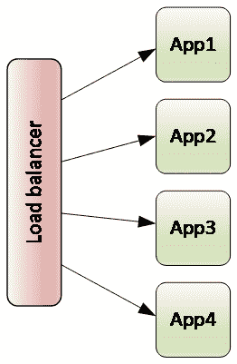
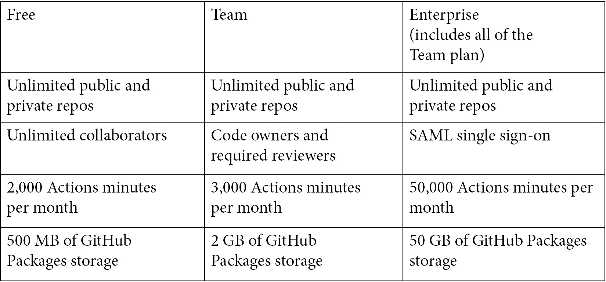
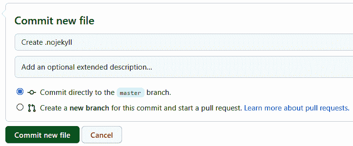
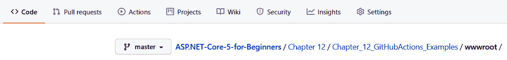
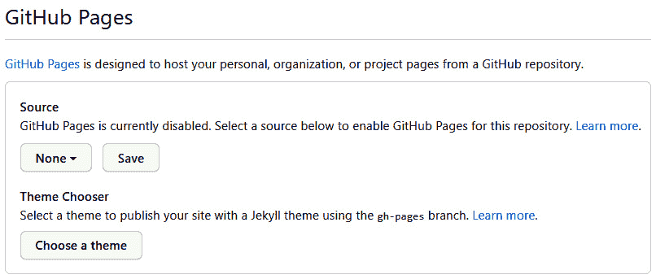
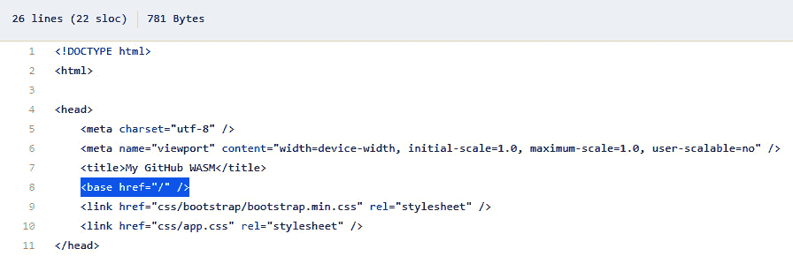
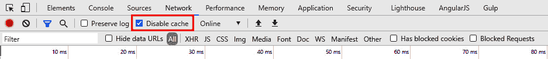
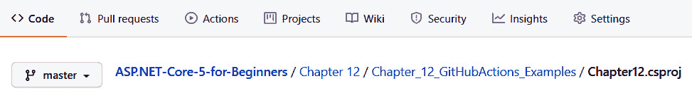
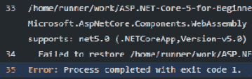
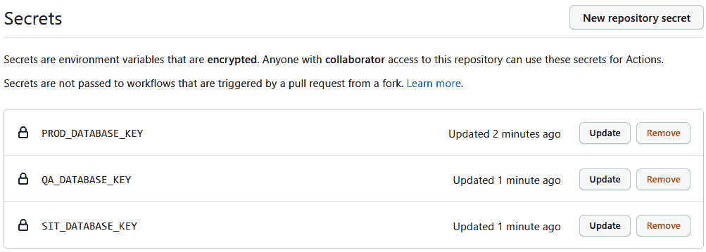

# 十二、与 CI/CD 集成

在上一章中，我们研究了浏览器和 Visual Studio 如何帮助我们开发 ASP.NET Core 应用。正如我们所看到的，优秀的工具和 IDE 帮助我们构建高质量的软件。

在本章中，我们将了解软件开发中的最佳实践如何有助于构建更好的软件。我们的最佳实践示例为**持续集成**（**CI**）和**持续交付**（**CD**）。

本章将介绍以下主题：

*   CI/CD 综述
*   GitHub 概述
*   使用 GitHub 操作的 CI/CD

在本章结束时，您将很好地理解 CI/CD 如何融入**软件交付生命周期**（**SDLC**）。您将了解 CI/CD 的好处，以及应用 CI/CD 可以解决哪些挑战。您将了解 GitHub 如何为构建 CI/CD 工作流提供支持。您还将有一个使用 CI/CD 部署 ASP.NET Core 项目的实际示例。

# 技术要求

在本章中，我们将仅使用 GitHub 来完成部署 ASP.NET Core 项目的实际示例，即使用 GitHub 操作。这意味着您只需要一个现代浏览器，如 Chrome、Edge、Firefox 或 Safari，以及一个 GitHub 帐户。GitHub 提供了一个适用于本章所述所有步骤的免费帐户。

您需要一个 GitHub 帐户来完成这些步骤。页面[https://github.com/join](https://github.com/join) 可用于创建账户。

### GitHub 源代码

本章的源代码位于 GitHub 存储库中的[https://github.com/PacktPublishing/ASP.NET-Core-5-for-Beginners/tree/master/Chapter%2012](https://github.com/PacktPublishing/ASP.NET-Core-5-for-Beginners/tree/master/Chapter%2012) 。

请访问以下链接查看 CiA 视频：[https://bit.ly/3qDiqYY](https://bit.ly/3qDiqYY)

# CI/CD 概述

CI 和 CD 是软件交付的现代方法，自动化用于提高质量和减少延迟。在本节中，我们将定义 CI/CD，并探讨此最佳实践解决的问题。

首先，让我们提供一些背景。

## 理解为什么 CI/CD

为了欣赏 CI/CD，我们来描述一个典型的开发过程*图 12.1*展示了开发过程：


图 12.1–开发过程

在前面的图中，我们展示了如何让一个开发团队在自己的设备上开发软件。然后，开发人员的变更被提升到**系统集成**（**SIT**环境中进行初始测试。一旦这些内容得到验证，更改将进入**用户验收测试**（**UAT**环境。同样，经过一轮测试，这些变化以合理的置信度进入**生产**（**产品**。

在某个时候，团队希望将其最新的更改部署到 SIT 环境中。其中一个开发人员可能负责将最新的更改添加到他们的开发机器上，并为 SIT 环境构建和生成一个包。这样做的一个问题是，当在不同的开发机器上进行更改时，一个更改可能会影响另一个更改。在创建 SIT 的生成之前，可能无法发现此问题。

这种方法的另一个问题是，因为构建是在开发机器上执行的，所以在另一台机器上执行构建之前，可能无法发现所需的构建依赖项。想象一下这样一个场景，通常执行构建的开发人员得到了应得的休息。当然，关于如何执行构建和创建包含最新更改的包的说明已经留下，但是缺少依赖项。寻找缺失的依赖关系可能是一项代价高昂的工作。

这些问题通过 CI 解决。

### 连续积分

CI 通过使用自动化增加了我们对正在生成的代码的信心。构建包的步骤各不相同，但以下是有关 CI 的关键点：

*   源代码保存在版本控制的存储库中。
*   源代码是在已知环境中构建的。
*   源的构建是自动化的。

例如，通过将源代码放在一个版本控制的存储库（如 GitHub）中，我们可以确信只有我们想要更改的内容发生了更改。这确保了我们的开发团队都合并到同一个位置，并且我们可以检查合并以确保它们是完整和准确的。

通过在已知环境中构建源代码，我们可以确保所有必需的依赖项都可用。在大多数情况下，一个已知的环境将是一个专用的构建机器或 VM。在*使用 GitHub 操作构建 CI/CD*部分，我们将使用 GitHub 提供的 Linux 虚拟机。这意味着我们有一个用于构建的一致平台，如果存在任何必需的依赖项，我们负责确保它们可用。例如，我们需要.NET5.0 来构建示例应用，这将作为一个单独的步骤添加到 Linux 虚拟机中。

源的构建将实现自动化。这既提高了效率又提高了可靠性。自动执行一系列步骤更有效，因为这样可以让个人自由活动，从而集中精力从事其他活动。这更可靠，因为我们排除了人类忘记执行步骤的可能性。

笔记

CI 中的一个常见步骤是运行单元测试。单元测试是为验证功能而设计的测试。这些测试可以手动运行，也可以作为构建过程的一部分运行。

通过自动化构建过程并在已知环境中执行解决方案的打包，我们能够提高效率并提高我们对开发团队正在进行的更改的信心。我们从 SDLC 的研究中了解到，问题越早被发现，修复成本就越低。通过在部署更改之前识别任何构建失败或功能中断，我们大大降低了修复这些问题的成本。在 CI 之前，可能只有在需要发布版本之前才检测到已损坏的版本，因此原始更改可能已经进行了几天。在*创建 CI/CD 工作流*部分，我们将设置每次检入存储库时要执行的 CI。

接下来，我们将了解如何使用 CD 来改进交付流程。

### 连续交付

现在，想象一下如果每个环境都由几个服务器组成。举一个负载平衡的例子，如*图 12.2*所示：



图 12.2–负载平衡应用

可能每个环境都有不同数量的服务器。例如，SIT 可能只需要两台服务器，而使用更频繁的 PROD 可能需要 10 台或更多服务器。这里重要的一点是，不同的环境可能会有所不同，对于单个版本，可能需要更新多个服务器。

此外，软件的每个版本可能需要多个步骤。例如，假设我们正在发布一个 ASP.NET Core 应用。对于每个版本，我们可能需要删除以前的版本，添加应用的新版本，然后执行一些自定义配置。细节并不重要。重要的是，我们必须准确地遵循一系列步骤，否则发布的软件可能无法正确运行。在自动化之前，这个过程应该是手工完成的。手动步骤会引入错误和遗漏步骤的可能性。

与 CI 一样，CD 使用自动化大大提高了交付过程的效率和信心。由于每个环境可能需要更新多个服务器，并且对于每个服务器，需要多个步骤，因此避免手动过程对于节省时间以及减少未正确遵循步骤或遗漏步骤时出错的机会是有意义的。

笔记

持续部署是指每次变更通过所有要求的检查后，一直进入最终环境。简言之，整个过程是自动化的，只有未通过自动化测试的更改才能被阻止发布。

简言之，CI/CD 通过使新软件更改的发布更高效、更可预测，使用自动化来极大地改进 SDLC。通过添加自动化测试，我们可以提高信心，即更改不会以意外的方式错误地改变行为。通过尽早发现问题，我们大大降低了解决问题的成本。自动化帮助我们的团队更有效地工作，因为他们不需要手动执行构建和部署步骤。自动化有助于减少由于人为错误导致的手动任务所产生的错误。

现在，我们已经对 CI/CD 有了很好的理解，接下来让我们看看 GitHub 对 CI/CD 有哪些支持。

# 介绍 GitHub

在本节中，我们将了解 GitHub 及其对 CI/CD 的支持。GitHub 是托管工具的提供商，支持软件开发所需的许多功能。GitHub 的主干是 Git，一个可靠的源代码版本控制系统。但是 GitHub 不仅仅是 Git，它还提供满足分布式软件开发的许多需求的在线实用程序。

笔记

Azure DevOps 是另一个用于构建 CI/CD 的 Microsoft 服务。在许多方面，构建 CI/CD 的经验是相同的，我们鼓励您花时间研究 Azure DevOps，因为它可能为您的需求提供更好的 CI/CD 平台。我们将在[*第 13 章*](13.html#_idTextAnchor276)*云本机*中讨论 Azure DevOps。

在下一节中，我们将研究 GitHub 支持的不同计划。

## GitHub 是免费的吗？

是的，提供的基本服务是免费的。对于许多社区项目和/或涉及小型团队的项目，免费订阅效果良好。让我们简单地看一下不同的计划是如何比较的，如下表所示。



请注意，还有一个 GitHub One 计划，它提供了企业计划中的所有内容，同时为大型企业添加了更多功能，如全天候支持、更多指标和学习实验室课程。

最棒的是，您可以通过免费订阅加入，当您的情况发生变化，每月需要更多存储或操作时，您可以将您的计划升级到适当的计划。

在接下来的部分中，我们将在继续我们的 CI/CD 示例之前回顾 GitHub 的一些特性。

## 一些 Git 术语

正如我们在前几章中使用 GitHub 一样，我们假设对 Git 有些熟悉。到目前为止，不需要创建自己的代码*分叉*，就可以完成所有章节。fork 是存储库的副本，通常简称为回购协议，将存放在您的帐户中。这意味着您可以用它做任何事情，包括进行更改。例如，您可能会在将某些包升级到更高版本时发现问题。这将允许您修复变更，验证其是否有效，并将变更发布回原始回购协议，称为*主协议*。

本章还有几个其他术语，您应该熟悉，所以我们在下表中列出了它们：


上表在一定程度上简化了术语，但我们只需为 CI/CD 提供示例即可。我们将在本章末尾的*进一步阅读*一节中包括一些参考文献。

在下一节中，我们将执行 Packt 库的 fork。

## 复制回购协议

如果您尚未创建 fork，可以使用[Packt 源页面上的**fork**按钮来创建 forkhttps://github.com/PacktPublishing/ASP.NET-Core-5-for-Beginners](https://github.com/PacktPublishing/ASP.NET-Core-5-for-Beginners) 如*图 12.3*所示：


图 12.3–叉子

这将在您的 GitHub 帐户中创建您自己的副本。从这里，我们将能够使用 GitHub 操作在 CI/CD 中完成 CI/CD 的设置。

在此之前，我们先介绍一下 GitHub 除了提供 Git 之外的一些其他特性。

## GitHub 对 CI/CD 的支持

GitHub Actions 可用于所有免费订阅，并支持自动构建和部署应用。这些不必是基于 web 的应用，甚至根本不必是应用。例如，一些组织使用 GitHub 进行文档管理，使用 GitHub 操作在组织内分发文档。但我们对使用 GitHub 操作实现 CI/CD 感兴趣，本节将概述 GitHub 操作的功能。

GitHub Actions 允许我们定义一系列步骤，称为工作流，可由指定事件触发。事件可以基于另一个事件、计划事件或手动触发事件。例如，在 Building*CI/CD using GitHub Actions*部分中，我们将使用 Git push 事件触发我们的工作流。

每个工作流可以由一个或多个作业组成。作业是为在指定类型的转轮上运行而设计的一系列连续步骤。将跑步者视为虚拟机的一类。例如，您可能需要构建 Windows 软件包或使用特定类型的硬件。流道定义所需的机器类型。运行程序可以是 GitHub 托管的或自托管的。在我们的 CI/CD 示例中，我们将使用 GitHub 托管的 Linux 虚拟机构建 ASP.NET Core 应用。这是因为我们将在 Linux 中托管应用的目标环境。

在单个工作流中，可以使用多个运行程序的组合。例如，您可能有一个执行两个作业的工作流。第一个是构建 Windows 映像，第二个是构建 Linux 映像。一个工作流将在 Windows 运行程序上运行，而第二个工作流将在 Linux 运行程序上运行。默认情况下，每个作业将并行运行。在我们的 CI/CD 示例中，我们将展示如何在两个作业之间创建依赖关系。创建依赖项时，作业不会并行运行，而是按依赖项顺序运行。

如前所述，作业是一系列步骤。每个步骤都可以是一个操作或一个命令。动作是命令的组合。这些由 GitHub 或社区成员公开。您还可以编写自己的操作。例如，您的组织可能有一个您希望在多个工作流中使用的专有签名流程。然后，您可以编写私人操作并在工作流中引用它。我们将在下一节的 CI/CD 示例中使用操作和命令步骤。

工作流在 YAML 文件中定义。如果您还记得[*第 9 章*](09.html#_idTextAnchor187)*容器*中的内容，YAML 是一种设计为人类可读且语法最少的文件格式。这确实意味着空白，例如制表符和空格字符，是重要的。幸运的是，GitHub 有一个 YAML 编辑器，它既提供 IntelliSense 又提供可视提示，以帮助编写过程。我们将在下一节创建 CI/CD 工作流时使用编辑器。

现在我们已经了解了 CI/CD 和 GitHub 操作的背景，让我们继续下一节，创建 CI/CD 工作流以交付 ASP.NET Core 应用。

# 使用 GitHub 操作构建 CI/CD

我们已经讨论了 CI/CD，并了解了 GitHub 提供的一些功能，现在让我们看看如何使用 GitHub 操作部署 ASP.NET Core 应用。在上一节中，我们已经将 Packt master 分叉到我们自己的回购协议中，*制作了回购协议*的副本，我们准备开始了。

我们的计划是将 ASP.NET Core WASM 应用部署到 GitHub 页面。我们在上一章中介绍了 WASM 应用示例。下一节将概述 GitHub 页面。

## 什么是 GitHub 页面？

GitHub Pages 是一种方便而强大的方式，可以使用 GitHub 的所有功能（包括全球发行版）托管静态网站，而无需担心托管问题。在许多情况下，这是一种方便的方式，可以使用与之相关联的存储库的信息来托管网站。但没有理由不能在其他情况下使用。例如，在 Google 或 Bing 中，以搜索`build a blog in GitHub Pages`为例。而且，由于静态网站源于 GitHub，因此网站内容存储在私有或公共版本控制的存储库中。

静态网站的来源可以是主分支中名为`/docs`的特殊文件夹，也可以是单独的分支。在我们的示例中，我们将把项目的内容发布到一个单独的分支。GitHub 页面通常由静态网站生成器 Jekyll 提供动力。在我们的例子中，我们不需要静态来驱动我们的网站，所以我们需要禁用 Jekyll。

这只需创建一个名为`.nojekyll`的文件即可完成。在 GitHub 中，导航到`Chapter 12 sample project`中的`wwwroot`文件夹。记得在我们之前制作的分叉副本中这样做，如*图 12.4*所示：


图 12.4–创建一个新文件

在前面的屏幕截图中，我们可以看到`wwwroot`文件夹的位置和创建新文件的下拉列表。选择后，只需输入名称`.nojekyll`，并通过提交更改进行保存，如*图 12.5*所示：



图 12.5–提交新文件

通过将文件放置在`wwwroot`文件夹中，该文件将在我们稍后发布网站时包含在内。现在这将让 GitHub 知道我们不需要 Jekyll，让我们开始 GitHub 操作。

## 创建 CI/CD 工作流

GitHub Actions 允许我们构建 CI/CD 工作流。在其他管理 CI/CD 的工具中，比如 Azure DevOps，我们将在[*第 13 章*](13.html#_idTextAnchor276)、*Cloud Native*中讨论，您可以看到这被称为管道。术语 CI/CD 管道或工作流基本上是指一系列自动化操作。在我们的示例中，按此顺序我们将有两项主要工作：构建项目和部署项目。

这些操作包含在 YAML 文件中。让我们继续创建一个。在 GitHub 中点击菜单栏中的**动作**，如*图 12.6*所示：


图 12.6–操作菜单

由于我们的存储库没有任何现有的操作，我们有几个选项，包括几个帮助我们开始的模板。通读它们，了解不同支持的场景，准备好后，选择**选项自行**设置工作流，如*图 12.7*所示：


图 12。7–自己设置工作流程

这将创建一个起始 YAML 文件，但让我们将生成的文件替换为以下内容，以便我们在完成时解释不同部分：

```cs
name: Build and Deploy ASP .NET Core Chapter 12 to GitHub Pages on:  # trigger the workflow only when a push happens in Chapter 12 jobs:    build:        steps:      # steps to build the application     deploy:    steps:      # steps to deploy the application
```

该名称用于描述工作流。好的名称有助于确定工作流的目的。假设您有一个用于部署到开发环境或生产环境的工作流。这应反映在名称中，以避免混淆。

接下来，我们定义触发工作流的因素。这可以从手动触发器到拉取或拉取到存储库，也可以按计划进行。不同的功能可以在本章末尾的*进一步阅读*一节中找到。

继续并替换现有注释，如下所示：

```cs
on:  push:    branches: [ master ]        paths:     - ‘Chapter 12/Chapter_12_GitHubActions_Examples/**’
```

在`Chapter 12`文件夹中的主分支上执行推送操作时，前面的代码段将触发工作流。这意味着无论何时将更改提交到`Chapter 12`下任何文件夹中的存储库，都将运行此工作流。

现在我们已经定义了触发器，让我们在下一节中完成构建工作。

## 创建持续集成作业

在本节中，我们将定义 CI 或构建作业。此作业将包括以下步骤：

1.  从存储库中检索源代码。
2.  设置.NET 环境。
3.  发布 ASP.NET Core 应用。
4.  将发布的应用另存为工件。

在你阅读了这个列表之后，你可能会想，为什么我们有前两个步骤？

答案将我们带到设置工作的第一部分。每个作业都在构建运行程序上运行。这些是预配置的 Windows 或 Linux 虚拟机。您可以使用自己的跑步者，称为自托管跑步者。出于我们的目的，我们将通过添加以下以粗体显示的代码段来使用 Linux VM：

```cs
jobs:  build:    runs-on: ubuntu-latest                  steps:
```

既然我们已经指定构建作业应该在 Linux VM 上运行，那么让我们添加第一步：

1.  After the `steps:` line, add the following code snippet:

    ```cs
    - uses: actions/checkout@v2
    ```

    步骤主要有两种类型：`run`和`uses`。`run`步骤用于在运行程序上执行命令。`uses`命令将执行社区操作。将社区行动视为包含一组为完成任务而创建的`run`语句的存储库。在前面的代码片段中，我们正在执行 checkout 社区操作的版本 2。签出操作将签出存储库，以便工作流可以访问它。

    笔记

    您可以在[上的签出存储库上阅读详细信息 https://github.com/actions/checkout](https://github.com/actions/checkout) 。

2.  The next step sets up .NET on the runner. Unless we set up the .NET environment, the runner will not be able to run any required `dotnet` commands:

    ```cs
    - uses: actions/setup-dotnet@v1       with:        dotnet-version: ‘5.0’
    ```

    在前面的代码片段中，我们将使用社区`setup-dotnet@v1`操作，我们需要指定所需的.NET 版本。

3.  The next step is to run the `publish` command. This is shown in the following code block:

    ```cs
    - name: Publish app       run: dotnet publish -c Release ‘./Chapter 12/Chapter_12_GitHubActions_Examples/Chapter12.csproj’
    ```

    前面的命令说明了如何将名称与步骤相关联，`uses`步骤也支持此操作。发布命令指定了`Release`配置以及我们正在发布的项目文件。

4.  In order to be able to reference the published application in the next job, we are going to publish or save the published application as an artifact. You have 500 MB of storage, so we are going to use some of that to store our published application:

    ```cs
    - name: Save artifacts       uses: actions/upload-artifact@v2       with:        name: myWASM         path: ‘./Chapter 12/Chapter_12_GitHubActions_Examples/bin/Release/net5.0/publish/wwwroot’
    ```

    前面的代码片段将上传`path`参数中指定的内容，作为名为`myWASM`的工件。

这就完成了名为`build`的第一个作业。每当签入发布到`Chapter 12`时，此工作流将运行。源代码将被下载到 Linux 运行程序中并生成，输出将保存为工件。已完成的作业显示在下一个代码段中：

```cs
    steps:    - uses: actions/checkout@v2     - uses: actions/setup-dotnet@v1       with:        dotnet-version: ‘5.0’    - name: Publish app       run: dotnet publish -c Release ‘./Chapter 12/
           Chapter_12_GitHubActions_Examples/Chapter12.csproj’          - name: Save artifacts       uses: actions/upload-artifact@v2       with:        name: myWASM         path: ‘./Chapter 12/Chapter_12_GitHubActions_Examples/            bin/Release/net5.0/publish/wwwroot’
```

既然已经定义了工作流的 CI 部分，那么让我们继续 CD 部分。

## 创建连续部署作业

在本节中，我们将定义一个 CD 作业，以将发布的工件部署到名为`pages`的新存储库中。为此，我们需要设置`pages`存储库，下载工件，然后保存更改。

笔记

CD 作业是使用基本 Git 命令创建的。我们建议探索社区行动，而不是总是写自己的。GitHub 的好处之一是您是大型开发人员社区的一员。GitHub Marketplace 是一个很好的起点。

与 CI 作业一样，我们还必须指定用于运行作业的生成运行程序。我们还将使用 Linux 虚拟机，如以下代码段所示：

```cs
  deploy:    needs: build     runs-on: ubuntu-latest                  steps:
```

另外，请注意前面的代码片段中显示的与 CI 作业相比的差异。我们已经指定，`build`作业需要在没有错误的情况下完成，`deploy`作业才能运行。如果我们没有这样做，`build`和`deploy`作业将并行运行。在我们的例子中，这不起作用，因为我们需要在`build`作业中发布工件，以便部署到 GitHub 页面：

1.  与`build`作业中的第一步一样，我们将首先执行签出，在 VM 上设置 GitHub 工作区：

    ```cs
    - uses: actions/checkout@v2
    ```

2.  Next, we will create a new branch to contain our GitHub Pages WASM application:

    ```cs
    - name: Create pages branch       continue-on-error: true       run: |          git config --global user.name “GitHub Actions”          git config --global user.email “your@email.com”                              git checkout -B pages
    ```

    前面的一系列命令首先设置有关当前用户的信息。这为 GitHub 提供了上下文，并将在执行签入时使用。下一步发出切换到`pages`分支的命令。如果分支不存在，`-B`标志将创建一个新分支。

3.  The next step in our job is to clear the branch of the existing files:

    ```cs
    - name: Clear pages branch       continue-on-error: true       run: |                    git rm -rf .           git commit --allow-empty -m “root commit”           git push -f origin pages
    ```

    前面的代码将删除任何现有文件，将更改提交到存储库，然后将其推回存储库。如果存储库中已有以前部署的文件，则需要执行此步骤。

4.  Now that we have cleaned the folder, we want to download the output that we created in the `build` job:

    ```cs
    - name: Download build artifact       uses: actions/download-artifact@v2       with:        name: myWASM
    ```

    前面的命令使用社区操作下载名为`myWASM`的工件。

5.  The final step will commit the changes back to the `pages` branch:

    ```cs
        - name: Commit changes       run: |           git add .          git commit -m “publishing WASM”                   git push --set-upstream origin pages
    ```

    在前面的命令中，下载的工件中的文件被添加回存储库，提交，然后推回存储库。

这就完成了我们的工作流程。继续保存文件并继续下一节。

## 监测行动

既然我们的 CI/CD 工作流已经定义，现在是我们触发工作流的时候了。由于我们对`Chapter 12`文件夹所做的更改使用了路径过滤器，所以让我们编辑其中一个文件。

在`Code`页签中，导航到`wwwroot`文件夹，如*图 12.8*所示：



图 12.8–wwwroot 文件夹

在该文件夹中，选择`index.html`文件并使用铅笔图标编辑该文件，如*图 12.9*所示：


图 12.9–铅笔图标

继续并更改 title 元素中的文本，如*图 12.10*所示：


图 12.10–编辑标题

提交更改后，导航到**操作**选项卡。您应该会看到类似于*图 12.11*的内容：


图 12.11–所有工作流程

这表明工作流已被触发且当前正在运行。将提供以前运行的历史记录。让我们单击正在运行的工作流以查看正在发生的事情的详细信息。

这将更改视图以显示正在工作流中运行的作业。在*图 12.12*中，**构建并部署 ASP.NET Core 第 12 章至 GitHub Pages**工作流包括**构建**和**部署**两个作业，并已顺利完成工作流：


图 12.12–工作流详细信息

另外，请注意生成的工件**myWASM**是如何显示的。该工件是一个 ZIP 文件，它允许您下载该文件，以防您需要解决任何问题。

在查看 GitHub 页面之前，我们还需要做最后一步。

## 配置 GitHub 页面

在本节中，我们将设置 GitHub 页面。我们将使用 GitHub 页面托管 CI/CD 工作流的输出，幸运的是，GitHub 页面提供了一种灵活的方式来选择内容在存储库中的位置：

1.  GitHub Pages can be configured under the **Settings** tab:

    

    图 12.13–设置

2.  In **Settings**, scroll down until you find the section about **GitHub Pages**, as shown in *Figure 12.13*:

    

    图 12.14–GitHub 页面

    上图显示 GitHub 页面当前已禁用。

3.  To enable it, we select the **pages** branch as shown in *Figure 12.15*:

    

    图 12.15–页面分支

4.  After saving, the URL of your GitHub Pages site will be shown. It should be similar to *Figure 12.16*:

    

    图 12.16–发布的 GitHub 页面 URL

5.  After clicking on the URL, we will encounter an issue as seen in *Figure 12.17*:

    

    图 12.17–装载问题

6.  If you review the errors in the browser’s developer tools (press *F12* to access them), you will see several of the files are not able to be loaded as shown in *Figure 12.18*:

    

    图 12.18–404 错误

7.  继续并导航到**网络**选项卡，然后按刷新再次加载页面。您应该会看到相同的网络错误，但这次如果您单击其中一个失败的请求，您将获得一些附加信息，如*图 12.19*所示：


图 12.19–请求 URL

在上图中，请注意 URL 的构造不正确。正确的 URL 应该包含存储库的名称。在本例中，这将是[https://chilberto.github.io/ASP.NET-Core-5-for-Beginners/css/bootstrap/bootstrap.min.css](https://chilberto.github.io/ASP.NET-Core-5-for-Beginners/css/bootstrap/bootstrap.min.css) 。

幸运的是，解决方法很简单。

## 固定基准基准

在本节中，我们将为我们的网站设置基准参考。我们需要这样做，因为 GitHub 不是在网站的根目录下托管页面，而是在存储库名称下托管页面。这意味着我们需要将存储库名称插入 URL：

1.  Back in the **Code** tab, navigate to the `wwwroot` folder and select the `index.html` file. In the file, locate the `base` element as shown in *Figure 12.20*:

    

    图 12.20–更新基本元素

2.  将此行更新为以下内容：

    ```cs
    <base href=”/ASP.NET-Core-5-for-Beginners/” />
    ```

3.  提交更改后，将再次触发工作流。等待此操作完成。
4.  完成后，刷新 GitHub 页面，您将看到 ASP.NET Core WASM 应用，如图 12.21 所示：


图 12.21–你好，世界！

根据您的浏览器和 GitHub 刷新更改的速度，您可能需要再等一分钟才能注意到更改。如果更改仍然没有反映出来，请尝试清除或禁用浏览器的缓存。

您可以在**网络**页签中选择**禁用缓存**，如*图 12.22*所示：



图 12.22–禁用缓存

在我们禁用了**网络**选项卡上的缓存之后，现在我们运行了一个基本的 CI/CD 工作流，让我们进一步了解一下发生了什么。

## 记录 CI/CD 工作流

不幸的是，有时事情并不顺利。自动化应用的构建和部署的原因之一是为了防止人为错误，但我们如何调查 CI/CD 工作流中出现的问题？本节将打断我们的 CI/CD 工作流，以说明如何在生成步骤中出现问题时进行调查：

1.  To do this, let’s cause a syntax error in our code. In the code branch, navigate to the project file as shown in *Figure 12.23*:

    

    图 12.23——打破项目

2.  Inside the project file, find the section that specifies the target framework as shown in *Figure 12.24*:

    

    图 12.24–目标框架

    上一个屏幕截图显示项目文件指定.NET 5.0 作为目标框架。

3.  Go ahead and change this value to `netcoreapp3.1`,as shown in the next code snippet:

    ```cs
    <TargetFramework>netcoreapp3.1</TargetFramework>
    ```

    提交文件后，工作流将自动启动，但在发布 ASP.NET Core 项目时将失败。

4.  Click on **Actions** and then running workflow and monitor the workflow until it fails as depicted in *Figure 12.25*:

    

    图 12.25–发布应用失败

    前面的屏幕截图显示了失败后工作流的状态。注意**构建**步骤如何指示**发布应用**步骤失败。还要注意，下面的步骤**保存工件**没有运行。而且，下面的作业**部署**也没有运行，因为我们已经指定它依赖于**构建**作业，并且没有错误地完成。

5.  We can expand the **Publish app** step to view additional details. Have a look through the log to find where the error is reported. An example of this is given in *Figure 12.26*:

    

    图 12.26–报告的错误

6.  花点时间找出失败的原因。您应该发现文本*5.0.0 与 netcoreapp3.1*不兼容，这表明我们尝试使用的包与.NET CoreApp3.1 框架不兼容。

我们想强调一个很好的特性。您会注意到日志中的每一行都有编号。如果你点击这个号码，你会注意到 URL 的变化。例如，我们单击第 32 行的第一个失败，我们的 URL 更改为[https://github.com/chilberto/ASP.NET-Core-5-for-Beginners/runs/1409342784?check_suite_focus=true#step:4:32](https://github.com/chilberto/ASP.NET-Core-5-for-Beginners/runs/1409342784?check_suite_focus=true#step:4:32) 。该 URL 可以与其他队友共享，而不是说*构建被破坏，请调查*，可以将该 URL 发送给队友，让他们立即了解报告的问题。

我们将在*进一步阅读*中包含更多关于 GitHub 操作的信息，因为我们只强调了一些基本功能和特性。

## GitHub 操作的下一步

GITHUB 操作胡里有很多值得注意的特性，尤其是考虑企业场景时。在前面几节中使用的示例中，我们将部署到单个环境，在许多企业场景中，将有多个环境。每个环境可能需要不同的配置，例如连接字符串。解决此需求的一种方法是使用**机密**。

存储库秘密是一个加密变量，可以在 GitHub 操作中使用。在公共和私有存储库中，只有具有适当访问权限的用户才能查看和维护机密。在**设置**子菜单中定义了一个秘密，如*图 12.27*所示：


图 12.27–GitHub 机密

一旦定义了秘密，就可以通过 GitHub 操作访问它。例如，假设我们为每个环境的数据库访问定义了三个秘密，如*图 12.27*所示：



图 12.28–定义秘密

在 GitHub 操作中，可以使用以下语法访问该值：

```cs
${{ secrets.QA_DATABASE_KEY }}
```

在前面的代码中，`QA_DATABASE_KEY`秘密中的值将被替换到动作中。这不仅比存储在 YAML 文件中更安全，而且为在多个环境中重用同一脚本提供了一种方便的方法。

要了解为什么它更安全，我们需要查看我们的工作流。在存储库中，导航回存储库的根目录，如*图 12.29*所示：


图 12.29–.github/workflows 文件夹

在前面的截图中，我们可以看到一个文件夹`.github/workflows`已经创建。此位置是 GitHub 在存储库中存储工作流的位置。如果查看文件夹内部，您将看到我们先前创建的工作流：


图 12.30–main.yml

另一个需要强调的特性是 GithubAPI。GitHub API 提供了访问 GitHub 的编程方式。通过基于 GitHub API 事件设置要触发的工作流，可以与 GitHub 操作相结合。例如，假设一个场景，只有在测试负责人批准发布时，才会向生产发布。这可以在另一个设计用于管理测试用例的系统**SystemX**中完成。审批完成后，SystemX 使用 webhook 通过创建标记通知 GitHub。标签是标记发布的常用方式。

笔记

webhook 是一种轻量级 web 服务。参见[https://docs.github.com/en/free-pro-team@最新/休息](https://docs.github.com/en/free-pro-team@latest/rest)了解更多信息。

然后，我们使用以下方法创建一个在创建标记时触发的工作流：

```cs
on:  create
```

这是一个示例，说明了如何将不同的功能结合使用，以构建符合您需求的 CI/CD 流程。

另一个需要提及的重要方面是 CI/CD 流程不必组合到单个工作流中。我们在示例中这样做了，但是我们可以有一个单独的 CI 和 CD 工作流。CI 工作流仍将发布包，而 CD 工作流将在将包添加到注册表时触发。以下代码段提供了所需的触发器：

```cs
on:  registry_package:    types: [published]
```

我们将在*进一步阅读*一节中包含其他链接。

# 总结

在本章中，我们讨论了 CI/CD，并提供了一个使用 GitHub 操作的实际示例。CI/CD 提供了一种更好的方式来交付我们的 ASP.NET Core 项目。它比手动部署更高效，也更不容易出错。即使是我们提供的简单示例应用也有多个部署步骤。对于较大的项目，步骤的数量可能会变得足够多，从而使部署到大型环境变得不切实际。

GitHub 使用 GitHub 操作对 CI/CD 提供了强大的支持。我们自动化了 ASP.NET Core WASM 应用的构建和部署。工作流同时使用了命令和社区操作。我们的示例工作流是由 Git 推送到存储库触发的，在 GitHub 操作的*下一步*部分中，我们强调了 GitHub API 如何通过其他 GitHub 事件触发工作流。

在下一章中，我们将介绍如何构建云本机应用。这不仅仅是选择一种伟大的技术，例如 ASP.NET Core，用于构建应用。我们将研究不同类别的云服务。我们将研究与传统应用相比，在构建云计算时需要做出的设计决策。

# 问题

1.  GitHub 行动是否需要付费计划？
2.  您只能将 GitHub 用于 web 应用吗？
3.  GitHub 操作是否要求 CI 和 CD 位于同一工作流中？
4.  在部署到云提供商时，您可以使用 CI/CD 吗？

# 进一步阅读

*   Git 提供的 Git 概述，网址：[https://git-scm.com/](https://git-scm.com/)
*   GitHub 团队提供的 GitHub 概览，网址：[https://guides.github.com/activities/hello-world/](https://guides.github.com/activities/hello-world/)
*   GitHub 团队在[提供的 GitHub 行动 https://docs.github.com/en/free-pro-team@最新/行动](https://docs.github.com/en/free-pro-team@latest/actions)
*   关于 GitHub 团队触发工作流的信息，网址为：[https://docs.github.com/en/free-pro-team@触发工作流的最新/操作/参考/事件](https://docs.github.com/en/free-pro-team@latest/actions/reference/events-that-trigger-workflows)
*   *Chris Love 的*通过示例进行的渐进式 Web 应用开发，来自 Packt Publishing，可访问：[https://subscription.packtpub.com/book/application_development/9781787125421](https://subscription.packtpub.com/book/application_development/9781787125421)
*   *GitHub Essentials：使用 GitHub 释放协作开发工作流的力量，Achilleas Pipinellis 的第二版*，来自 Packt 出版社，网址：[https://subscription.packtpub.com/book/web-development/9781789138337](https://subscription.packtpub.com/book/web-development/9781789138337)
*   *实施 Azure DevOps 解决方案*，作者：Henry Bee，Maik van der Gaag，来自 Packt 出版社，网址：[https://subscription.packtpub.com/book/cloud_and_networking/9781789619690](https://subscription.packtpub.com/book/cloud_and_networking/9781789619690)