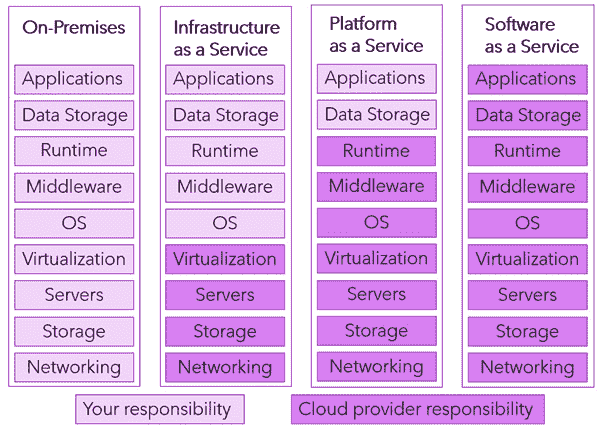
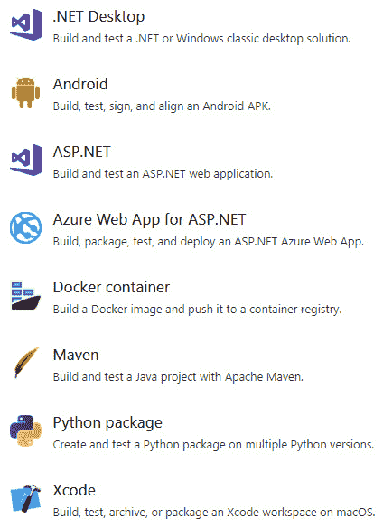
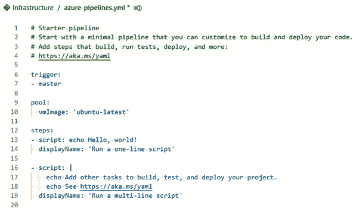
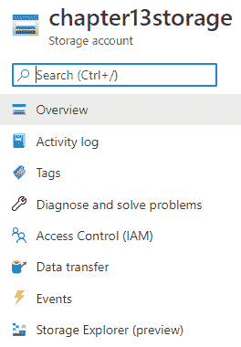

# *第13*章：开发云原生应用

在过去几年中，没有一个流行语比*云*更为突出，对于开发者来说，这一术语已经扩展到*云原生应用*。看看 C#语言中较低级别的细节，你会认为无论代码在哪里执行，它们的工作原理都是一样的，因此你会怀疑它是否有什么意义，或者它是否只是炒作。

[*第 10 章*](10.html#_idTextAnchor206)*部署到 AWS 和 Azure*中，演示了大量云部署。在本章中，我们将深入研究并了解在构建云本地应用程序时需要了解和考虑的事项，以及审查云计算中心的概念。

本章将介绍以下方面：

*   什么使应用程序云成为本机的？
*   DevOps 的作用
*   理解云中的成本
*   云存储与本地磁盘
*   作为代码的基础设施
*   监测和保健

本章介绍了支持云开发者角色的实用代码示例和云架构师领域的理论。目的不是让您在本章末尾成为一名成熟的架构师，而是让您了解一些云范例如何影响您作为一名.NET 开发人员。

# 技术要求

本章包括简短的代码片段，以演示所解释的概念。要使这些功能正常工作，需要以下软件：

*   Visual Studio 2019：Visual Studio 可从[下载 https://visualstudio.microsoft.com/vs/community/](https://visualstudio.microsoft.com/vs/community/) 。社区版是免费的，将用于本书的目的。
*   有些示例要求您拥有 Azure 订阅。如果您还没有，您可以通过转到 Azure 门户（[来创建一个 https://portal.azure.com](https://portal.azure.com) 并注册一个免费帐户。
*   DevOps 示例涉及 Azure DevOps。单个开发者可以在[注册一个免费帐户 https://dev.azure.com](https://dev.azure.com) 。

出于实验室目的，本章中的所有样品都可以免费测试，但区域特定要求可能要求使用信用卡进行验证。

本章的源代码位于 GitHub 存储库中的[https://github.com/PacktPublishing/ASP.NET-Core-5-for-Beginners/tree/master/Chapter%2013](https://github.com/PacktPublishing/ASP.NET-Core-5-for-Beginners/tree/master/Chapter%2013) 。

请访问以下链接查看 CiA 视频：[https://bit.ly/3qDiqYY](https://bit.ly/3qDiqYY)

# 是什么让应用程序云成为原生的？

在深入研究云应用程序是如何实现的，以及您需要考虑的问题之前，我们需要使用 To.t0 来研究云应用程序是什么。这包括云操作模型的一般定义、云与内部部署的区别以及对这些差异的更详细调查。对于术语*云原生*没有标准的教科书答案，也没有勾选复选框的列表，但本章试图阐明与该术语相关的常见实践。

有了云计算，你会听到各种*即服务*后缀，其中一些后缀比更有意义。如[*第 10 章*](10.html#_idTextAnchor206)*部署到 AWS 和 Azure*中所述，这里的支柱是以下三个首字母缩略词：

*   **IaaS**–**基础设施即服务**
*   **PaaS**–**平台即服务**
*   **SaaS**–**软件即服务**

解释这些的经典类比是*比萨饼服务*。在光谱的一端，你有一个场景，你在厨房里开始用面粉、西红柿和所有其他需要的配料。你可以完全控制一切，可以根据自己的喜好定制东西。另一方面，你要去一家餐馆，在那里你指向菜单上的一个条目，等几分钟，然后把它送到你的桌子上。在这两者之间，你可以选择购买预先制作好的面团和酱汁，让它更像是家里的乐高积木体验。

如果你是一个好厨师，你可能会通过从头做起来获得好的效果。然而，即使你碰巧喜欢这项工作，也不可否认，它比外出就餐更重要。如果你碰巧是一个糟糕的厨师，那么最好在当地的比萨饼外卖店点一份。

为了避免偏离技术主题太远，您的责任与云提供商的责任可以在*图 13.1*中说明：



图 13.1–XaaS 责任

正如你所看到的，更多的控制意味着更多的责任。

我们都喜欢拥有内部硬件为我们提供的各种选择，但在实践中，餐厅体验也可以相当不错。早期的云服务通常过于狭窄，无法在严格定义的边界之外使用，但现在通常有很多方法可以根据您的喜好调整服务，因此这不是一个问题。

IaaS 与内部部署模型相比具有优势，但与关注基础设施的个人相比，开发人员对其中大多数模型的兴趣较小。拥有虚拟化的硬件是很好的，但是大多数开发人员已经将他们自己从中抽象出来，不去弄清楚哪根电缆在服务器机架的后面。由于这一事实，顶层五层可以捆绑到**虚拟机**（**虚拟机**）中，因此或多或少可以直接从内部部署到 IaaS。

如果您已经在本地运行虚拟机，那么此操作相当容易，因为只需重新配置一些操作系统设置，就可以按原样上传。如果您没有使用虚拟化并直接在服务器上运行，或者通常称之为*裸机*，那么有一些工具可以将工作负载迁移到虚拟机上，您可以随后迁移到云上。这种云迁移称为**升降**。虽然这是一种可能的、有时是推荐的重新托管模式，但它不被认为是*云本机*。云上运行的 VM 仍然意味着参加*补丁周二*。（微软每个月的第二个星期二发布一次补丁，因此得名。）

SaaS 对最终用户来说是非常好的——这些服务中的一些可以用很少的技术洞察力来购买，而且它们*只起作用*。当然，如果你想学习如何制作一个好的比萨饼，那么购买成品几乎没有什么帮助，因此，即使你享受这些服务，也可能无法帮助你为自己的目的构建新的应用程序。

作为开发人员，PaaS 通常是构建新服务的最佳选择。您可以选择最好的预制组件并在这些组件的基础上进行构建，而不是自己构建堆栈的每一部分。例如，您将需要某种 web 服务器，并且您希望确保它能够运行您的编程语言和相关框架，但您并不真正关心如何提供这种服务的底层细节。在安装应用程序之前，web 服务器本身只是一个空壳，没有任何价值。

可以说，Office 365 这样的服务既是 SaaS 又是 PaaS，因为它提供了丰富的 API 层，可以与您自己的服务进行集成，但这样的观察不会改变基本模型。

这将作为有用的背景信息，当我们深入研究下一个主题时，我们将比较经典的本地特性和云等效特性。

## 比较本地与云的特性

许多人听到云计算时首先说的是，它只是另一个数据中心，只要你安装了正确的软件，它实际上与你自己搭建几个机架没有什么不同。从某种意义上说，这是正确的。虽然大多数公司无法承受 Azure 和 Amazon 的规模，但您可以选择在本地安装各种云解决方案，从而复制体验。

尽管如此，仍然存在一些差异，你可以谈论不同的心态。在*图 13.2*中，您可以看到经典本地软件与云本地模型的特征比较：


图 13.2–本地特性与云特性

可能处于两个极端之间的不同阶段，而这些只是一般特征。如果您没有使用公共云服务提供商，则完全可以使用*云服务*甚至。

让我们在下面的章节中详细阐述这些特性。

## 单片与微服务架构

软件架构是一个大话题，一旦你从*简单的应用程序*转向构建*系统*，有许多设计时决策可能会让你绊倒。当 compute 的 boundary在机架中购买新服务器时，默认情况下，您通常会得到一个整体。如果你告诉运营部门，你希望后端和前端使用不同的服务器，他们会笑着拒绝你的请求。只有当产生的负载需要更多的计算机时，将两者分离才可以。

在云端，这应该不再是一个担忧。如果您为不同的任务设计了一个基于容器的解决方案，并使用微服务，那么您需要为总计算量付费。单片服务器不再是边界，您不应该受到它的约束。这并不是说构建的每一个软件都应该分解成微服务，但通常在规划体系结构时，您会希望对其进行研究。

## 可扩展性规划

知道你需要多少计算能力是很难的。是的，你可以做出有根据的猜测，但仍然存在一些你无法控制的随机性。你是否应该超额供应并购买超过你需要的硬件？如果在负载到达时您没有足够的硬件怎么办？您能以多快的速度将更多服务器放入机架？

亚马逊进入云提供商业务的原因之一是可伸缩性问题。与许多在线零售商一样，亚马逊在圣诞节前的最后一个半年销售的商品比今年剩余时间多，他们需要大量的马力来处理这一问题，因此他们建立了多个数据中心来处理负载。问题是——在 1 月份的大甩卖之后，计算能力闲置了，只不过花了他们的钱。商业机会是，这种过剩的产能肯定可以提供给其他公司，以及数十亿美元的收入，我们可以说这是一个好主意。

如果您有一个云本机应用程序，那么您可以针对这种规模进行设计。订购并交付服务器不需要几周的时间。您可以将创建虚拟机的时间缩短为几分钟，根据您的工作负载，甚至可能只需几秒钟。

请注意，云也有一些限制，因此，如果你知道黑色星期五即将到来，你不应该计划在前一天晚上分配数百台服务器——如果没有云提供商的指导，你可能无法做到这一点。

有两种缩放机制–放大和缩小。

### 放大还是缩小

当增加更多的计算单位时，就可以进行放大。除了有两台服务器处理负载外，您还添加了另一台服务器，这意味着您有三台。

向外扩展是向计算单元添加更多资源。增加更多的内存和存储就是一个很好的例子。服务器的数量保持不变。

要决定哪一种模式适合你，就必须弄清楚是什么驱动了你的资源消耗。如果 CPU 的负载介于 20%到 30%之间，但内存在 90+范围内，请添加更多内存（放大）。如果 CPU 达到最大负载，请添加更多服务器实例（向外扩展）。

具体细节取决于您使用的服务，具体操作方式取决于您使用的服务，但大多数可用服务都可以选择设置某种自动缩放机制，以便在需要时添加更多功能。对于完全动态处理，您通常还可以自动缩小比例，并且您还可以在知道负载很少时将事情安排为关闭。

## 使用不同的数据库类型

当您想到一个本地数据库时，通常它们是 SQL 的一些实现。（这可能是 MS SQL、Oracle、MySQL 或其他数据库）这些是关系数据库，依赖于表的数据库模型以及它们之间的关系。

例如，`Person`实体的表可以类似于 Visual Studio designer 中的*图 13.3*：


图 13.3–人员表

相应的SQL 代码如下：

```cs
CREATE TABLE [dbo].[Person](  [Id] INT NOT NULL PRIMARY KEY,   [FirstName] VARCHAR(50) NULL,   [LastName] VARCHAR(50) NULL,   [Address] VARCHAR(50) NULL,   [ZipCode] VARCHAR(10) NULL,   [State] NCHAR(2) NULL )
```

在 C#代码中，您更可能使用一种语法，比如 Linq，因为它对开发人员更友好，但在这两种情况下，原则是相同的。

这是一个示例，数据在写入时被采用到**模式。当您写入数据库时，SQL 引擎将验证您的数据是否正确–如果您尝试将字符串写入整数字段，则它将无法工作。**

通常还有一些锁定机制来确保应用程序 A 和应用程序 B 不能同时写入同一属性。考虑到数据库服务器上良好的吞吐量，这一点可能不明显，但对于多用户场景，这一点不容忽视。

这对于许多用例来说都很好，因为它确保了高度的完整性和一致性。对于诸如银行帐户之类的用例，这是您想要的。对于资金如何进出账户来说，草率的机制对每个人都是有害的。

缺点是，它要求写入数据库的代码更加复杂，而且即使使用强大的硬件，它在短时间内接收大量数据的能力也会降低。

作为一种选择，更像云的产品将是文档数据库（如 Azure Cosmos DB 和 MongoDB）。

如果你有数千个物联网传感器捕获数据，你的重点是将数据输入数据库。如果一个温度读数下降了一度，这可能不是一个大问题。您需要吞吐量，因此不必在写入时强制使用模式，只需插入一个包含您喜欢的内容的 JSON 文档。

当您需要提取并呈现数据时，您可能需要为数据类型制定一些规则–这称为**模式读取**。这为您提供了处理日期时间值的选项，例如仅用于显示目的的字符串表示形式，以及需要将其作为实际日期时间类型处理的选项。

个人的 JSON 实例可以如下所示：

```cs
{  "FirstName": "John",  "LastName" : "Doe",  "Address" : "One Microsoft Way",  "ZipCode" : "98052",  "State" : "WA"}
```

在本例中，我们看到我们没有遵守为 SQL 记录定义的模式约束。我们只是将属性视为纯文本。

使用 SDK 将其插入 Cosmos DB 数据库中，看起来如下所示：

```cs
ItemResponse<Person> personResponse = await   this.container.CreateItemAsync<Person>(johndoe, new   PartitionKey(person.LastName));
Console.WriteLine("Created item in database with id: {0} ",    personResponse.Resource.Id);
```

注意，这段代码省略了类定义和到数据库的连接，但它说明了如何提供一个 JSON 文档来创建一个新项。

当您拥有一个全球分布的文档数据库时，这种模式使得始终保持同步变得更加困难，这就是为什么我们经常提到**最终一致性**。回到银行账户的例子，这可能不是你想要的，但如果有人在欧洲观看统计仪表盘，与美国相比，延迟了几秒钟，这可能不是问题。

存储数据的延迟不仅仅与数据库技术有关；它还涉及获得正确的同步和多重处理。

## 同步性和多处理任务

并行处理和异步请求不是云所独有的。在硬件方面，多年来有很多抽象，因为真正的并行性很难实现，但作为最终用户，您总是希望体验同时发生的事情，而不依赖于后台发生的其他事情。

云计算就是基于这一点构建的。当您的服务每天需要处理数十亿个请求时，通过一次整洁有序地处理一个请求是不可能的。作为云计算的用户，您可能不必处理大量的请求，但您仍应将其视为默认值。

异步行为在创建 web 应用程序时非常重要，因为您很可能希望为用户提供快速的体验。当您在等待 API 调用超时时阻塞 UI 数秒时，您将遇到不满意的用户。

幸运的是，.NET 模板在这方面可以帮助您生成异步代码（如果适用）。

例如，您可以在 web 应用程序的控制器中使用以下同步代码：

```cs
[HttpGet]public string HelloWorld(){   return "Hello World";}
```

如果要将其重写为异步代码，则可能会改为如下所示：

```cs
[HttpGet]public async Task<string> HelloWorld(){   return "Hello World";}
```

重要的是要意识到，您会遇到更难排除的 bug。例如，如果您在实际接收响应之前实例化 HTTP 客户端调用并处理连接，，那么步进调试器找出答案可能会很有趣。

和往常一样，您需要了解您正在尝试做什么，但一般来说，这是云本机的首选方法。

## 避免失败与预期失败

我们在代码中所做的最困难的事情之一是处理意外情况，这适用于您是在云中运行还是在本地安装的硬件中运行。这两个托管选项的处理方式可能有所不同。

如果您有 10 台企业级服务器，那么除非它们在前几周出现故障，否则它们很可能会工作很长时间。如果其中一个出现故障，请致电硬件供应商，让技术人员到现场维修。

当然，您在代码中内置了冗余，但它可能仅限于假设两台服务器可用，并且如果其中一台服务器出现故障，则需要在它们之间进行手动切换。

如果你有 100000 台服务器，那么仅仅通过概率计算，一年中发生故障的几率就不止一台。云提供商已经将这个问题从开发人员身上抽象出来。他们按容器购买服务器，而运营规模意味着无法保证技术人员能够在足够短的时间内更换出故障的硬件，使其不会产生影响，这就是为什么云计算被设计为保持运行，即使单个部件开始出现故障。

即使硬件没有出现故障，也存在操作系统需要更新的风险。如果发布了重要的安全更新，云提供商不会等到您方便时再应用它——他们会尽快进行。

我们中的许多人都有经验的软件，这些软件假设您始终能够以预期和正确的方式关闭它。可能是它希望在运行时锁定在关机时释放的资源，或者其他假设系统稳定可用的事情。当事情出了问题，你又重新启动它时，你会收到一条信息，说上次关机失败了，所以你会被要求跳过这些障碍，重新启动并运行。

这不是云计算的方式。您应该预计进程可能会以非计划的方式终止，重要的是确保新实例能够尽快启动，而无需手动干预。

请注意，备份是一个单独的考虑事项。您应该始终确保有备份和恢复重要数据的策略，无论系统如何以及何时发生故障。

## 了解云更新计划

由于扩展选项有限，并且需要规划资源的可用性，内部部署世界通常会实施计划内停机。许多公司仍然有维护窗口，您必须点击这些窗口才能更新软件。这通常涉及到开发人员必须随时执行更新，或者在夜间或周末发生不好的事情时随时待命。

有了好的云本地代码和工具，这应该是过去的事了。云提供了部署到暂存站点的机制，在那里您可以进行基本测试，如果测试通过，还可以单击切换将其转换为生产版本。或者，您可以将两个版本部署到生产环境中，并配置所谓的 A/B 测试，其中只有部分用户暴露于新版本中，以查看他们如何响应。

这一切归结为商业需要。如果你以谷歌、Facebook 或 Netflix 的规模运作，那么永远都不会有一个*好时机*离线。一年中的任何一天都可以 24 小时访问这些服务。这也不是一个每季度只进行一次大爆炸式更新的选项——如果你已经准备好对网站进行改进，它应该尽快上线。

使用源代码管理工具，我们已经学会了尽早签入和经常签入。Cloud native 还意味着提前发布和经常发布。

## 服务器和服务的管理

作为开发人员，您不太可能认为管理是为管理员保留的。在某些情况下，这是非常正确的——如果有人在本地或云中为您维护 Windows服务器，您就不必担心它的管理方式。

不幸的是，在现实生活中，开发人员并不总是能够避免所有的管理任务。为了将风险降至最低，您应该创建需要尽可能少的管理的应用程序。如果在重新启动时，有一页说明要按照正确的顺序启动和运行服务，那么当云自动扩展并创建 10 个新实例时，您将如何处理？（提示：您最好学习脚本语言。）

## 宠物对牛

一个经常使用的关于云资源与房屋资源的类比是*宠物与牛*。有了内部硬件，它是一种物理的、可关联的东西。一个频繁的管理员活动是为服务器制定一个命名方案——可能是希腊神、山、超级英雄或福特汽车制造厂的名称。（所有这些都是在实际的服务器环境中观察到的。）也可能观察到某些特性—*服务器的硬盘驱动器/电源/网卡略有不同……*换句话说，服务器是宠物。

在云中，您无法命名硬件资源，坦率地说，您可能也不想知道如何使用单个名称命名一百万台服务器。你也不在乎硬盘或记忆棒的品牌。您希望，当您订购 100 GB 的存储和 8 GB 的 RAM 时，每次订购的存储和 8 GB 的 RAM 基本相同。这是把资源当作牛来对待。当你在杂货店买牛奶时，你真的不在乎是 143 号奶牛还是 517 号奶牛生产的。

这种心态只是其中的一部分。你也需要工具。

当你养宠物时，你可以一个接一个地处理事情。例如，如果我们为您提供在 Azure 中创建 web 应用程序以运行本书中的代码的说明，则说明可能如下所示：

1.  登录 Azure 门户。
2.  点击**创建资源**。
3.  从列表中选择**网络应用**。
4.  在下拉列表中创建一个新的资源组。
5.  选择一个名字和离你最近的地区。
6.  选择**.NET Core 5**作为运行时堆栈，选择**Windows**作为操作系统。
7.  跳过**监控**和**标签**，进入**审核+创建**。
8.  如果没有错误，点击**创建**。

您将看到类似于*图 13.4*的内容：


图 13.4–Azure 门户中的 Web 应用创建向导示例（.NET 5 在撰写本文时不可用）

当你被告知要创建 20 个 web 应用程序时，你如何处理这个问题？你如何确保每次都是一致的，并且总是正确的？如果你想要牛，你需要一个可重复的标准化程序。

您可以从手动方式开始，仍然可以生成云原生的应用程序，但如果您想全力以赴，您可能会希望将**基础设施作为代码**（**IaC**进行调查。（在*引入基础设施代码（IaC）*一节中将有更多关于这方面的内容。）

如前所述，这些都是共同的特征，您可以对您的环境进行自己的触摸，无论是在公共云中还是在您自己的数据中心中。当作为单独的检查表项目处理时，您可以*修复*，但它或多或少会导致一个更广泛的术语，称为**DevOps**。

# 了解 DevOps 的作用

DevOps 的使用通常没有进一步区分它的确切含义，除了它是您为了更加敏捷而需要的东西之外。大多数人都会同意，这是通过使用产品、合适的人员和流程的组合来实现持续价值。

我们不会深入探讨 DevOps 的人员和流程部分，因为这毕竟是一本技术书籍。这里重要的一点是，如果您想提高敏捷性，您需要有反映这一点的流程。例如，您可以准备好工具，每天多次发布新的更新。如果你有一个程序，说每个版本都必须由不同的 QA 和测试团队手动批准，那么这根本不起作用。它非常适合少量和大型更新，但不适合频繁但小型的更新。

在技术方面，您想要的术语是**持续集成**（**CI**）和**持续部署/交付**（**CD**）。在[*第 10 章*](10.html#_idTextAnchor206)*将 ASP.NET 带入云*中，我们展示了如何将您的代码从 VisualStudio 导入 Azure 和 AWS。然而，在 VisualStudio 中有一句话经常被使用，朋友们不会让朋友们右键点击发布。*[*第 12 章*](12.html#_idTextAnchor252)*与 CI/CD*的集成，注意到了这一点，并展示了如何通过*GitHub 动作*实现这一点。*

 *GitHub 多年来一直是开发人员最受欢迎的服务之一，但 GitHub Actions 的加入是在 GitHub 被微软收购后的一个相当新的发展。微软生态系统中的*尝试和测试的*解决方案将是 Azure DevOps。这两项服务都在开发和改进中，但在撰写本文时，Azure DevOps 针对企业场景提供了稍微成熟一点的产品，并提供了更广泛的功能集。

Azure DevOps 并非云本机应用程序的专有。它也可以用于内部部署，甚至还有一个演示，它被用于为 Commodore 64 构建软件（对于那些已经听说过这台计算机的人来说），以说明它决不局限于 Microsoft 语言或框架。

Azure DevOps 有多种功能可用于帮助您在云中构建软件开发生命周期：


图 13.5–Azure DevOps 功能

以下是这些特性的用例：

*   **Azure Boards**用于管理工作项和开发任务的一般流程。
*   **Azure Repos**用于存储您的代码和版本历史记录。
*   **Azure 管道**用于设置构建和发布（CI/CD）。
*   **Azure 测试计划**用于设置代码的测试和 QA。
*   **Azure 工件**用于管理库和模块。这可以用于设置您自己的 NuGet 提要。

在**Azure 管道**下，您有**管道**用于设置构建（命名约定最多是混淆）。您拥有所谓的经典向导，它使您能够以用户友好的方式为一系列解决方案设置构建。此向导允许您从模板列表中进行选择，如*图 13.6*所示：



图 13.6–Azure Pipelines 经典向导

这会让你行动迅速，对探索性工作很有帮助，但从长远来看，这不是推荐的方法。推荐的方法是使用 YAML 文件（基于文本的文件）定义管道。YAML 也是 GitHub 操作的方式，但这两种实现目前并不相同，因此不能来回复制文件的内容。如果您选择 YAML 而不是 classic，您将进入一个文本定义，如图 13.7*所示*：



图 13.7–Azure 管道 YAML 定义

YAML 是一种标记语言，用于 Kubernetes 配置文件和许多其他服务，因此这也不是特定于 Microsoft 的。一般来说，编写 XML 和 JSON 比编写 XML 和 JSON 更方便用户，但另一方面，它对空格和缩进等内容非常挑剔，因此在掌握格式之前，您还需要了解一些内容。（缩进为两个字符：三个字符将中断。）

使用这种方法，您可以将构建定义视为代码的一部分（您可以将其签入与应用程序代码相同的存储库）。

此外，在**Azure 管道**下，您会发现**版本**，它们与构建紧密相连。这是关于获取管道的输出并部署它。让我们看看 Azure 管道向导。

与“生成向导”类似，您有多个选项可供选择代码的存放位置：


图 13.8–Azure Pipelines 发布经典向导

有更多的选项，我们无法在这些截图中捕捉到，因此，如果您需要其他内容，请务必查看。构建和发布基于容器的应用程序不同于非容器化的 C#web 应用程序。Java、Python 和 PHP 也都有各自的特点，无论是如何生成可执行文件还是将其推送到服务器。

发布定义也可以定义为 YAML 文件并签入存储库。

与部署软件时经常涉及的手动步骤相比，这是一个很好的改进。在传统设置中，发布新版本的过程涉及开发人员在本地计算机上构建，然后将结果复制到文件共享，然后登录到从共享复制并部署文件的其他计算机，这并非闻所未闻。试图在这样一个体制下进行完全的 DevOps 是很困难的，但本节中给出的示例表明，不再需要这样做了。代码可以在云中构建、部署和运行，而无需传统方法。

所以，有很多好东西，但也没有免费的云端午餐；一切都有代价。

# 了解云中的成本

计算机比以往任何时候都能为你的钱带来更多的价值，但计算机总是会带来成本，在商业中，成本通常需要一个理由。许多人错误地认为，默认情况下，云计算中的服务比本地运行的服务更便宜，但情况比你第一眼看到的要复杂，因此我们应该解释一下这幅图的部分内容。

为大型解决方案创建评估并成为一名 Excel 忍者超出了本书的范围，但在云计算中，当有人问资金流向何处时，开发人员往往是第一行。

大多数公司都能负担得起购买服务器的费用，这些服务器可以安装在您的办公室中，其规格可以运行一些 web 应用程序或几台虚拟机。与云中的虚拟机相比，您可能会认为这只是支付这些服务器的另一种方式。

在云计算中，有两种主要的客户计费机制——固定定价和基于消费的定价：

*   **固定定价**是指某物每时间单位有成本，可以是小时/天/月；例如，一个 VM 是根据每月的小时数计费的。如果 CPU 被加载到最大值或几乎不做任何事情，成本保持不变。为了省钱，您可以关闭它或缩小它的硬件规模。一个简单的动作，比如在晚上和周末关闭测试环境，可以让你的账单减少 50%。
*   **基于消费的定价**是指您为使用资源的多少付费。这可以是存储系统，您可以按 GB 付费，也可以是消息传递系统，您可以为发生的事件付费。这些资源可以全天候使用，无需任何额外费用——如果你不在夜间使用，也不需要任何费用。

在构建解决方案时，通常需要将它们结合起来。例如，在 Azure 中，您可以拥有一个按时间计费的 Azure 应用程序服务，并 24 小时不间断地运行，而您可以拥有一个 Cosmos DB 实例，用于存储数据，并根据吞吐量付费。

本地服务的成本通常也比物理服务器的成本更复杂。你有一些基本的东西，比如电费和网络连接，但还有很多。你需要网络设备。你需要存储。为了实现高可用性和冗余，您需要复制所有内容。您需要配置所述冗余的知识。如果您是一家小型企业，您甚至可能无法构建与大型企业相媲美的基础设施。所以，确保你在比较苹果和苹果，而不是抱怨香蕉看起来不一样。

如果你做得对，你会在云计算中省钱，如果你做得不对，它的成本可能会比在本地更高。

存储成本是一个考虑因素，但存储在云中的工作方式也不同。

# 云存储与本地磁盘

开发人员计算机上的存储很容易理解。如今，即使是一台廉价笔记本电脑也有一个 SSD，尽管它可能无法与现有的高级选项相比，但对于一个简单的 web 应用程序来说，它通常已经足够了。你把你的东西储存在`C:\foo`里，除非 Windows 崩溃或类似的事情，否则你不会有什么大的担心。

将代码移动到生产环境会改变一些事情。您的代码仍然可以保留在虚拟机的`C:\foo`中，但下面的硬盘可能配置不同。然而，这仍然不是一个问题。

现在存储是便宜的，至少在你考虑到其他东西之前是这样。笔记本电脑中的一个 SSD 可能不会花那么多钱，但是如果你想部署一个在本地运行的 web 应用程序，你可以使用计算器来增加额外的成本。由于一个硬盘驱动器可能会出现故障，因此您需要将两个硬盘驱动器对折并放置在镜像中。但由于这只处理冗余，您需要另外两个驱动器来处理备份（备份还必须能够容忍驱动器故障）。理想情况下，您需要将它们放在不同的计算机中，中间有高速网络，更不用说大楼可能会烧毁，因此您需要更多的物理位置。这是不断给予的礼物。

有一个老笑话说：*你需要多少程序员来更换一个灯泡？没有，这是硬件问题*。

关于存储，我们可以说同样的话，这是一件好事。

如果你是硬件专家，你会喜欢云存储，因为你可以将答案更改为*无—这是其他人的问题*。

云存储的强大之处在于，云提供商已经拥有数千个磁盘、高速网络和多个位置。

我们将不在这里深入讨论细节，但您需要查看可供提供商选择的选项，以便做出正确的选择。在这个范围的低端，您有价格低廉的存档存储，但它只适用于非活动使用的文件（因此命名为*存档*，不能用于运行的 web 应用程序）。在价格较高的一端，您可以在世界多个地区自动复制高速 NVMe 驱动器。

让硬件成为硬件，作为一名开发人员，您还需要了解，在您的终端，情况也在发生轻微变化。

## 短暂储存与持久储存

通常，在云设置中，不能将本地驱动器视为持久驱动器。如果你在基于 Windows 的主机上运行 web 应用程序，你通常会有一个本地驱动器，因此将临时文件写入`c:\foo`文件夹是可行的。当主机重新启动时，您可以预期它会消失，如果它确实是临时的，那么这很好；如果您希望它在重新启动后出现，那么这很糟糕。（请记住，您可能无法控制主机何时在云中重新启动。）

如果您在容器中运行应用程序，则同样适用。每个容器都有一些本地空间来存储应用程序本身，但是容器可以在任何时间点被杀死，所以你需要相应地处理这个事实。

为了避免这种现象，云服务中的一项基本服务是存储。在 Azure 中，最常用的服务是**Azure Blob 存储**。

## 在 Azure Blob 存储中存储和读取文件

如果您跳过了避免覆盖现有文件、检查当前文件夹以及其他一切方面的所有复杂性，您可以通过以下代码片段将字符串输出到文件中，并通过输出到控制台将其读回：

```cs
Using System;using System.IO;
namespace Chapter_13_FileStorage {  class Program   {    static void Main(string[] args)    {                  File.WriteAllText("foo.txt", "Hello World");      Console.WriteLine(File.ReadAllText("foo.txt"));    }  }}
```

这段代码也将在云中运行，但需要注意的是，它可能随时消失。

如果我们对 Azure Blob 存储执行相同的操作，步骤将略有不同：

1.  Use the Azure portal to create a new storage account. To do so, you need to provide the desired configuration for what kind of storage you want, whether to replicate the data geographically, and the location you want it in:

    

    图 13.9–Azure 存储帐户创建

2.  有很多设置可以查看，但是在本练习中，只需直接跳到**创建**。
3.  Go to the resource you just created and step into the **Storage Explorer** option as shown in *Figure 13.9*:

    

    图 13.10–Azure 门户中的存储帐户刀片

4.  右键点击**Blob 容器**并选择**创建 Blob 容器**。命名为`foo`并确保访问级别设置为私有。
5.  转到访问键刀片，复制**键 1**的连接字符串，因为您将需要它作为您的代码。
6.  打开命令行窗口，转到解决方案的根目录，然后键入以下命令：

    ```cs
    dotnet add package Azure.Storage.Blobs
    ```

7.  修改并添加现有代码，如图所示：

    ```cs
    using System;using System.IO;using Azure.Storage.Blobs;using Azure.Storage.Blobs.Models;
    namespace Chapter_13_FileStorage {  class Program   {    static async System.Threading.Tasks.Task Main(string[] 
          args)    {                  File.WriteAllText("foo.txt", "Hello World");      Console.WriteLine(File.ReadAllText("foo.txt"));      //Set up the connection and a blob reference       string connString = "copied-from-Azure-Portal";      BlobServiceClient blobServiceClient = new         BlobServiceClient(connString);      BlobContainerClient blobContainerClient =         BlobServiceClient.GetBlobContainerClient("foo");      BlobClient blobClient =         BlobContainerClient.GetBlobClient("foo.txt");
          //Upload to Blob Storage       using FileStream uploadFileStream = File.OpenRead
            ("foo.txt");      await blobClient.UploadAsync(uploadFileStream,         true); uploadFileStream.Close();
          //Download from Blob Storage       BlobDownloadInfo dl = await blobClient.        DownloadAsync();      using (FileStream dlfs = File.OpenWrite(        "fooBlob.txt"))      {        await dl.Content.CopyToAsync(dlfs);        dlfs.Close();      }      Console.WriteLine(File.ReadAllText("fooBlob.txt"));    }  }}
    ```

8.  如果一切正常，控制台应该打印两次相同的字符串值`Hello World`。

乍一看，这个可能看起来很复杂——一旦你习惯了，它就会变得更容易。从这样一个小例子中看不出这一点，但一旦您开始扩展需要访问文件的组件数量，您就会体会到这一点的好处。

请注意，它确实对性能有影响，因为事情需要经过仔细考虑。

## 处理存储延迟

无论您是在办公桌上的计算机上运行代码，还是在云中运行代码，在存储器之间传输数据都不是即时的。对于少量的数据，你可能不会注意到，但这里和那里加起来只有一毫秒。

如果您的应用程序需要缓存层，您应该研究解决方案，例如*Azure cache for Redis*，它将数据存储在内存中，并减少涉及磁盘的需要。在[*第 9 章*](09.html#_idTextAnchor187)*容器*中，我们考虑了使用 Redis 的预构建图像，这将是一个很好的解决方案。

我们不会在门户中创建下一个 web 应用程序或存储帐户，但我们将在下一步查看 IaC 时，研究如何使用牛方法。

# 引入基础设施代码（IaC）

当提到通过 Azure 门户创建 web 应用时，我们提到了更好的大规模解决方案是研究 IaC，但我们没有进一步解释。那么，IaC 到底是什么意思？

通过 Azure 门户创建 web应用并不是那么糟糕。你会得到一个向导来引导你通过它，它会在你前进的过程中捕捉到一些错误；如果您试图创建一个对 DNS 无效的 web 应用程序，它会这样说。

如果您曾经使用过内部软件安装，或者为此创建了供他人安装的软件，那么您可能会遇到不太友好的过程。可能需要严格遵守安装指南，而且由于您没有研究必备条件列表，因此在向导的第三页上，您发现需要取消安装 SQL server，然后才能返回安装。

这两种方法的共同点是，它们容易出现不一致和不正确的部署，并且如果您想创建更多的安装和实例，它根本无法扩展。

这是 IaC 要解决的主要问题。正如我们在构建和发布定义中看到的，您可以将其签入代码，这同样适用于 IaC 定义。

IaC 有两种基本形式——命令式和声明式。

## 命令式 IaC

使用这种方法，您可以精确地指定您想要的内容以及顺序。这对于自动化来说是很好的，但是你需要自己处理依赖关系。如果您尝试创建一个 web 应用程序而不先创建资源组，则会失败。命令式 IaC 的示例包括 Azure PowerShell 和 Azure CLI。以创建 web 应用程序为例，它在 PowerShell 中的外观如下所示：

```cs
$location = "North Europe"
# Creating Resource group New-AzResourceGroup -Name rg-webapp -Location $location
# Creating App Service Plan New-AzAppServicePlan -Name webapp -Location $location -ResourceGroupName rg-webapp -Tier Free
# Creating web app New-AzWebApp -Name webapp -Location $location -AppServicePlan webapp -ResourceGroupName rg-webapp
```

在Azure CLI 中，它将如下所示：

```cs
# Creating Resource group az group create -l northeurope -n rg-webapp
# Creating App Service Plan az appservice plan create -g rg-webapp-n webapp
# Creating web app az webapp create -g rg-webapp -p webapp -n webapp
```

对于这两种方法中的哪一种是最好的，没有一个明确的答案，您将看到语法有相似之处，但对于这两种方法，您可以看到它是如何遵循菜谱式的方法的。

## 声明性 IaC

使用声明式 IaC，您将更少地关注*如何*，而更多地关注*什么*。您可以定义您想要一个具有给定属性集的 web 应用程序，指定依赖项，并让资源调配引擎处理其余的内容，而不是一步一步的方法。这意味着在 Azure为云的情况下，您让工具在创建 web 应用之前确定应用程序服务计划已经到位。

声明性 IaC 的 Azure 本机版本是 ARM 模板。语法过于冗长，无法包含完整的示例，但它基于 JSON，这将是部署的应用程序服务部分所需的代码：

```cs
"resources": [  {    "type": "Microsoft.Web/serverfarms",    "apiVersion": "2020-06-01",    "name": "[variables('appServicePlanPortalName')]",    "location": "[parameters('location')]",    "sku": {      "name": "[parameters('sku')]"    },    "kind": "linux",    "properties": {      "reserved": true     }  },
```

由于 ARM 可能变得非常复杂，因此对它的感觉复杂多样，但它有两个主要方面：

*   由于它是 Azure 本机的，因此在手动创建资源时，门户中通常会提供一个示例，因此可以将该向导用作生成自定义代码的帮助器。
*   与 Azure 集成后，它会自动跟踪资源的状态。例如，如果在以前的模板上部署模板构建，引擎将知道资源组已经存在，并且不会再次尝试创建它。

另一个支持 Azure 和 Amazon（以及其他一些提供商）的流行工具是 HashiCorp 的*Terraform*。

再一次，在创建 web 应用程序时，一个基本示例如下所示：

```cs
provider "azurerm" {  version = "~>2.0"  features {}}
resource "azurerm_resource_group" "rg" {  name     = "rg-webapp"  location = "northeurope"}
resource "azurerm_app_service_plan" "appserviceplan" {  name                = "webapp"  location            = azurerm_resource_group.rg.location   resource_group_name = azurerm_resource_group.rg.name
  sku {    tier = "free"  }}
resource "azurerm_app_service" "webapp" {  name                = "webapp"  location            = azurerm_resource_group.rg.location   resource_group_name = azurerm_resource_group.rg.name   app_service_plan_id = azurerm_app_service_plan.appserviceplan.id }
```

如果您不熟悉 ARM 模板，从表面上看，这看起来更方便用户使用，但它仍然是一种需要学习的新格式。它还有一个缺点，就是必须通过将状态存储在单独的文件中来手动跟踪状态处理。它仍然是一个非常有用的工具，微软也为 Azure 文档的部分内容提供了地形示例。

更进一步，还有代码为的*IaC（请注意，这不是官方术语）。一个名为*Pulumi*的工具在 Terraform 上提供了一个编码层，使您能够编写 C#代码，用常规编程中熟悉的一切创建基础设施。*

这个主题很大，对于一个专注于构建应用程序而不是周边基础设施的程序员来说，学习它的所有细微差别可能太多了。在较小的组织和单人团队中，您可能也会被指派负责云的这一部分，因此，如果您是那个人，深入研究这一点可能会很有价值。

在本章的最后，我们将快速了解监控和健康。

# 了解监测与健康

关于云计算的工作原理，有一个误解是云计算提供商处理应用程序的运行状况。在本章的第一部分中，我们看到了从 IaaS 到 SaaS 的责任划分，在您向右移动时，提供商承担了更大的责任。如果您一直使用 SaaS，供应商确实必须处理几乎所有不是用户错误的事情，但正如前面所述，开发人员的最佳选择通常是 PaaS，您仍然需要承担一些责任。

这意味着，如果用户体验到的 web 应用的响应时间是不可接受的，那么您需要意识到这一点并找出如何处理它。如果云中的存储出现故障，您需要了解如何补救。这里的*您*部分可能会被以不同的方式处理，这取决于您的组织，但在大多数情况下，不是云提供商负责，即使他们有机制来帮助您。

Azure 中的 Web 应用有一些内置工具供您使用，如*图 13.11*所示：


图 13.11–Azure web app 监控刀片

名称中带有*log*的是跟踪错误条件的不同方法，对于调试非常有用。**日志流**将让您实时查看日志，因此如果您将错误输出到应用程序中的控制台，并且能够在用户界面中复制问题，这是非常有用的。

**指标**可用于规划和实时决策。您可以看到请求的数量、响应时间、抛出多少基于 HTTP 的错误，等等：


图 13.12–Azure web 应用程序的 Azure 指标

警报还有多种用途。例如，如果错误计数太高，它可以发送一条文本消息和/或电子邮件，有人需要查看日志。根据条件列表，还可以向其他 Azure 服务发送详细信息以调用操作。

与监控相关，但不在同一菜单区，您可以找到**放大**和**缩小**（在**设置**下）。我们在前一节中解释了两者之间的区别，这是本机支持的。您可以配置**自动缩放**–这意味着，当某个指标在某个时间范围内高于指定阈值时（以避免短峰值触发），Azure 将自动向您的 web 应用程序添加更多资源。

为了跟踪应用程序的运行状况，如果您在代码中使用更容易在云中正确设置内容的机制，这会有所帮助。我们在[*第 10 章*](10.html#_idTextAnchor206)*中展示了如何将 ASP.NET 带入云*中，向您的应用程序添加健康端点。应将此端点添加到 Azure（或 AWS）中设置的监视和相应的警报机制中。公平地说，也应该在本地考虑添加这样的端点，但用于监视的机制可能会有所不同。

记住我们前面所说的——在构建一些东西的时候，我们期望它们会失败，并构建一个健康和监控策略来帮助您处理这个问题。

# 总结

构建云本地应用程序不仅仅是简单地将比特从一个数据中心迁移到另一个数据中心。

我们在这里并没有深入探讨所有内容，但我们涵盖了广泛的主题，首先了解了 cloud native 是什么，以及内部部署与云的一般特征。我们介绍了数据库和存储选项之间的技术差异，这是一篇简短的 DevOps 简介，并且，在开发人员角色之外，我们简要地深入研究了诸如 IaC 之类的主题，最后给出了一些关于监控和运行状况的指点。

现在您应该了解为什么要使用云应用模型，以及在使用云之前需要考虑哪些东西。您还了解了与内部部署相比，在云思维方式方面的差异，并了解了 DevOps 工具和服务。此外，您已经了解了为什么 IaC 可以使您在云中构建所需服务的工作变得更轻松。

即使你还没有完全投入到云计算中，这里也应该有一些东西可以应用到你的*老式*软件中。

# 问题

1.  云计算的三种基本模型是什么？
2.  写模式和读模式有什么区别？
3.  你为什么要调查 IaC？

# 进一步阅读

*   微软提供的 AZ-900 学习路径，可在[上获得 https://docs.microsoft.com/en-us/learn/paths/az-900-describe-cloud-concepts/](https://docs.microsoft.com/en-us/learn/paths/az-900-describe-cloud-concepts/)
*   Microsoft Azure 架构良好的框架简介，由 Microsoft 提供，网址为[https://docs.microsoft.com/nb-no/learn/modules/azure-well-architected-introduction/](https://docs.microsoft.com/nb-no/learn/modules/azure-well-architected-introduction/)*