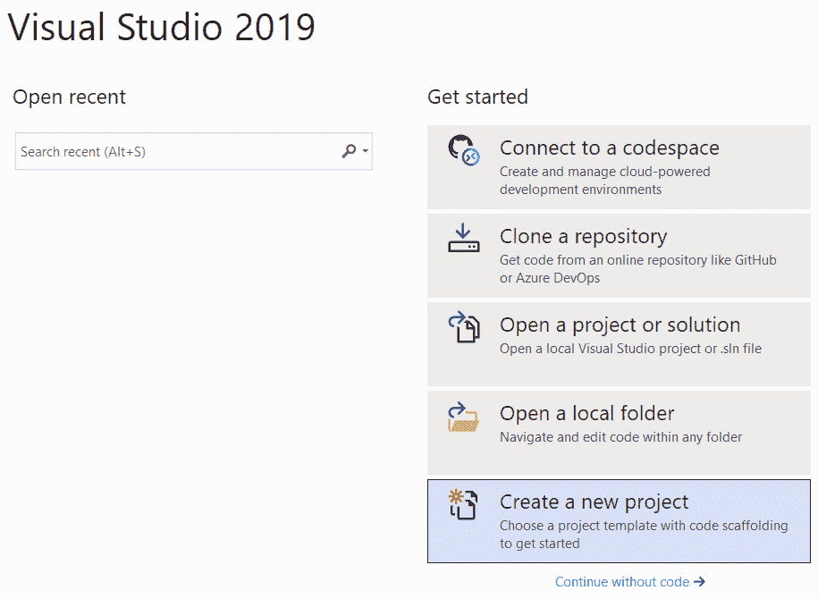
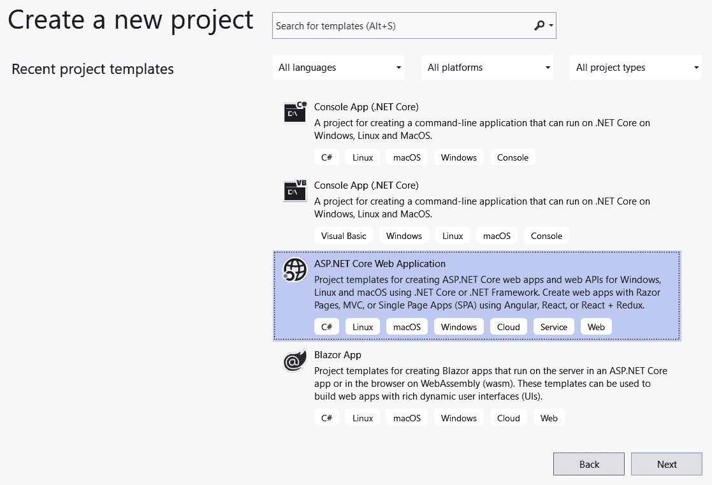
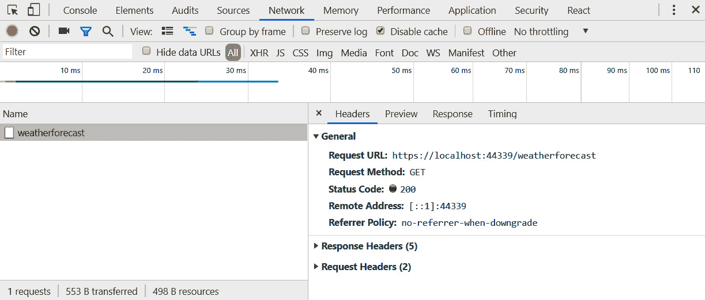
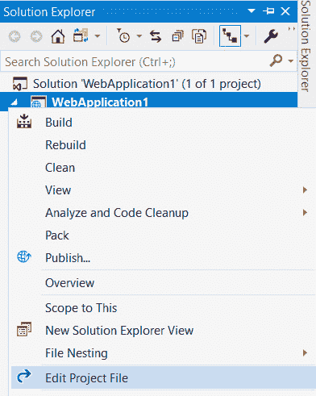
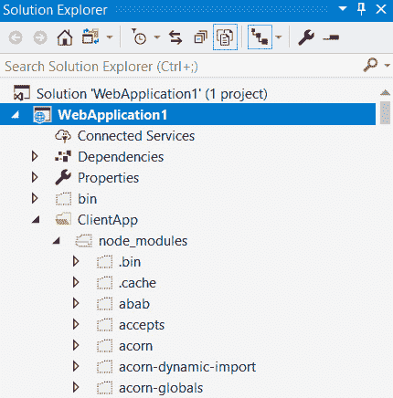
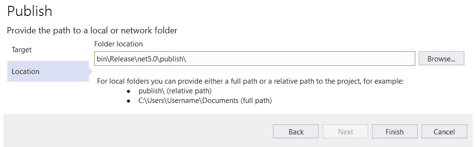
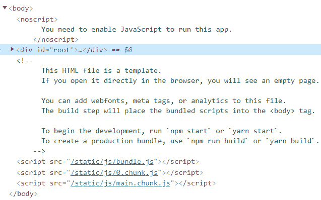
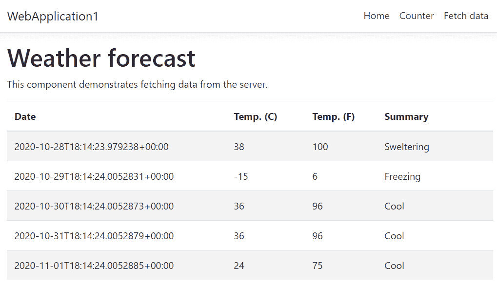

# *第一章*：了解 ASP.NET 5 React 模板

React 是 Facebook 帮助更多人使用 Facebook 代码库并更快交付功能的答案。React 在 Facebook 上运行得非常好，以至于他们最终将其开源（[https://github.com/facebook/react](https://github.com/facebook/react) ）。如今，React 是构建基于组件的前端（在浏览器中运行的客户端代码）的成熟库；它非常受欢迎，拥有庞大的社区和生态系统。在撰写本文时，React 每周的下载量超过了 880 万次，比一年前同期多了 200 万次

ASP.NET Core 于 2016 年首次发布，现在是一个成熟的开源和跨平台 web 应用框架。它是构建后端（在服务器上运行的应用代码）与数据库（如 SQL server）交互的最佳选择。它在微软 Azure 等云平台上也能很好地工作。

在第一章中，我们将从学习**单页应用**（**SPA**架构开始。然后，我们将使用 Visual Studio 中的标准模板创建一个 ASP.NET 核心和 React 应用。我们将使用此工具来回顾和理解 React 和 ASP.NET 核心应用的关键部分。然后，我们将了解 ASP.NET 核心应用和 React 应用的入口点以及它们如何相互集成。我们还将学习 Visual Studio 如何在开发模式下同时运行前端和后端，以及如何将它们打包，以备生产。在本章结束时，我们将获得基础知识，以便开始构建一个使用这两种优秀技术的应用，我们将在这本书中逐步建立的东西。

在本章中，我们将介绍以下主题：

*   温泉建筑
*   了解 ASP.NET 核心后端
*   理解 React 前端

让我们开始吧！

# 技术要求

在本章中，我们需要使用以下工具：

*   **Visual Studio 2019**: This can be downloaded and installed from [https://visualstudio.microsoft.com/vs/](https://visualstudio.microsoft.com/vs/). Make sure that the following features are selected in the installer:

    a） ASP.NET 与 web 开发

    b） Azure 开发

    c） Node.js 开发

*   **.NET 5.0**：可从[下载 https://dotnet.microsoft.com/download/dotnet/5.0](https://dotnet.microsoft.com/download/dotnet/5.0) 。
*   **Node.js 和 npm**：可从[下载 https://nodejs.org/](https://nodejs.org/) 。

本章中的所有代码片段可在网上[找到 https://github.com/PacktPublishing/ASP.NET-Core-5-and-React-Second-Edition](https://github.com/PacktPublishing/ASP.NET-Core-5-and-React-Second-Edition)

查看以下视频以查看代码的运行：[https://bit.ly/3riGWib](https://bit.ly/3riGWib) 。

# 温泉建筑

在本部分中，我们将开始了解**单页应用**（**SPA**架构。

SPA 是一个 web 应用，它加载单个 HTML 页面，当用户与该应用交互时，该页面由 JavaScript 动态更新。设想一个简单的注册表单，用户可以在其中输入姓名和电子邮件地址。当用户填写并提交表单时，不会刷新整个页面。相反，浏览器中的一些 JavaScript 使用 HTTP`POST`请求处理表单提交，然后使用请求的结果更新页面。请参阅下图：


图 1.1–SPA 中的表格

因此，在返回单个 HTML 页面的第一个HTTP 请求之后，后续的 HTTP 请求只针对数据，而不是 HTML 标记。所有页面都通过 JavaScript 在客户端浏览器中呈现。

那么，如何处理具有不同 URL 路径的不同页面呢？例如，如果我在浏览器的地址栏中输入`https://qanda/questions/32139`，它如何进入应用中的正确页面？浏览器的历史 API 允许我们更改浏览器的 URL 并处理 JavaScript 中的更改。这个过程通常被称为路由，在[*第 5 章*](05.html#_idTextAnchor101)*与 React Router*的路由中，我们将学习如何使用不同的页面构建应用。

我们将在本书中使用 SPA 架构。我们将使用 React 来呈现前端，并使用 ASP.NET Core作为后端 API

现在，我们已经对 SPA 体系结构有了基本的了解，我们将进一步了解 VisualStudio 可以为我们创建的 SPA 模板应用。

# 了解 ASP.NET 核心后端

在本节中，我们将首先使用 Visual Studio 中的标准模板创建一个 ASP.NET 核心和 React 应用。此模板非常适合我们查看和理解 ASP.NET 核心 SPA 中的基本后端组件。

一旦我们使用 Visual Studio 模板构建了应用，我们将从 ASP.NET 核心代码的入口点开始检查它。在我们的检查过程中，我们将了解如何配置请求/响应管道，以及如何处理对端点的请求。

## 创建 ASP.NET 核心和 React 模板应用

让我们打开Visual Studio 并执行以下步骤来创建我们的模板化应用：

1.  In the start-up dialog, choose **Create a new project**:

    

    图 1.2–Visual Studio 启动对话框

2.  Next, choose **ASP.NET Core Web Application** in the wizard that opens and click the **Next** button:

    

    图 1.3–在 Visual Studio 中创建新的 web 应用

3.  Give the project a name of your choice and choose an appropriate location to save the project to. Then, click the **Create** button to create the project:

    

    图 1.4–指定项目名称和位置

    另一个对话框将出现，允许我们指定要使用的 ASP.NET核心版本，以及要创建的特定项目类型。

4.  Select **ASP.NET Core 5.0** as the version and **React.js** in the dialog. Then, click the **Create** button, which will create the project: 

    

    图 1.5–项目模板和 ASP.NET 核心版本

    重要提示

    如果未列出 ASP.NET Core 5.0，请确保安装了最新版本的 Visual Studio。这可以通过从**帮助**菜单中选择**检查更新**选项来完成。

5.  既然项目已经创建，按*F5*运行应用。大约一分钟后，应用将出现在浏览器中：


图 1.6–应用的主页

我们将在本章稍后部分了解为什么应用第一次运行时花费了这么长时间。目前，我们已经创建了 ASP.NET 核心。现在，让我们检查一下后端代码

## 了解后端入口点

ASP.NET 核心应用是创建 web 服务器的控制台应用。应用的入口点是一个名为`Program`的类中名为`Main`的方法，可以在项目根目录下的`Program.cs`文件中找到该方法：

```cs
public class Program
{
  public static void Main(string[] args)
  {
    CreateHostBuilder(args).Build().Run();
  }
  public static IHostBuilder CreateHostBuilder(string[] 
   args) =>
    Host.CreateDefaultBuilder(args)
      .ConfigureWebHostDefaults(webBuilder =>
      {
          webBuilder.UseStartup<Startup>();
      });
}
```

此方法使用`Host.CreateDefaultBuilder`创建一个 web 主机，该主机配置如下项：

*   web 内容的根的位置
*   其中，设置用于项目，例如数据库连接字符串
*   日志记录级别和日志输出的位置

我们可以使用以`Use`开头的 fluent API 覆盖默认构建器。例如，要调整 web 内容的根目录，我们可以在以下代码段中添加高亮显示的行：

```cs
public static IHostBuilder CreateHostBuilder(string[] args) =>
  Host.CreateDefaultBuilder(args)
    .ConfigureWebHostDefaults(webBuilder =>
    {
      webBuilder.UseContentRoot("some-path");
      webBuilder.UseStartup<Startup>();
    });
```

构建器中指定的最后一件事是`Startup`类，我们将在下一节中介绍它。

## 了解创业课程

`Startup`类位于`Startup.cs`中的，用于配置应用使用的服务以及请求/响应管道。在本小节中，我们将了解这个类中的两个主要方法。

### ConfigureServices 方法

使用名为`ConfigureServices`的方法配置服务。此方法用于注册以下项目：

*   我们的控制器，将处理请求
*   我们的授权政策
*   我们的 CORS 政策
*   我们自己的类，需要在依赖注入中可用

通过调用`services`参数上的方法添加服务，通常从`Add`开始。注意以下代码片段中对`AddSpaStaticFiles`方法的调用：

```cs
public void ConfigureServices(IServiceCollection services)
{0
  services.AddControllersWithViews();
  services.AddSpaStaticFiles(configuration =>
  {
     configuration.RootPath = "ClientApp/build";
  });
}
```

这是在生产中如何将 React 应用集成到 ASP.NET Core 中的关键部分，因为这指定了 React 应用的位置。

重要提示

了解 ASP.NET 核心应用在服务器上运行，而 React 应用在浏览器的客户端上运行，这一点很重要。ASP.NET 核心应用只提供`ClientApp/Build`文件夹中的文件，而不进行任何解释或操作。

不过，`ClientApp/Build`文件仅在生产模式下使用。接下来，我们将了解 React 应用是如何在开发模式下集成到 ASP.NET 核心中的。

### 配置方法

当一个请求进入 ASP.NET Core时，会通过所谓的**请求/响应管道**，在这里执行一些中间件代码。此管道是使用名为`Configure`的方法配置的。我们将使用此方法精确定义执行哪个中间件以及执行顺序。中间件代码由通常在`app`参数中以`Use`开头的方法调用。因此，我们通常会在`Configure`方法的早期指定诸如身份验证之类的中间件，最后在 MVC 中间件中指定。模板创建的管道如下所示：

```cs
public void Configure(IApplicationBuilder app, IWebHostEnvironment env)
{
    ...
    app.UseStaticFiles();
    app.UseSpaStaticFiles();
    app.UseRouting();
    app.UseEndpoints( ... );
    app.UseSpa(spa =>
    {
        spa.Options.SourcePath = "ClientApp";
        if (env.IsDevelopment())
        {
spa.UseReactDevelopmentServer(npmScript: 
            "start");
        }
    });
}
```

请注意，在路由和端点设置之前，管道中调用了一个名为`UseSpaStaticFiles`的方法。这允许主机为 React 应用和 web API 提供服务。

另外，请注意，在端点中间件之后调用了一个`UseSpa`方法。这是一个中间件，它将处理对 React 应用的请求，而 React 应用只为 React 应用中的单个页面提供服务。它位于`UseEndpoints`之后，因此对 web API 的请求优先于对 React 应用的请求。

`UseSpa`方法有一个参数，该参数实际上是应用第一次运行时执行的函数。此函数包含一个逻辑分支，如果您处于开发模式，它将调用`spa.UseReactDevelopmentServer(npmScript: "start")`。这将告诉 ASP.NET Core 通过运行`npm start`来使用开发服务器。我们将在本章后面深入研究`npm start`命令。因此，在开发模式下，React 应用将在开发服务器上运行，而不是让 ASP.NET Core 为来自`ClientApp/Build`的文件提供服务。我们将在本章后面了解有关此开发服务器的更多信息。

接下来，我们将学习如何将自定义中间件添加到 ASP.NET 核心请求/响应管道中。

## 定制中间件

我们可以使用如下类创建自己的中间件。该中间件记录 ASP.NET 核心应用处理的每个请求的信息：

```cs
public class CustomLogger
{
    private readonly RequestDelegate _next;
    public CustomLogger(RequestDelegate next)
    {
        _next = next ?? throw new 
         ArgumentNullException(nameof(next));
    }
    public async Task Invoke(HttpContext httpContext)
    {
        if (httpContext == null) throw new 
        ArgumentNullException(nameof(httpContext));
        // TODO - log the request
        await _next(httpContext);
        // TODO - log the response 
    }
}
```

此类包含一个名为`Invoke`的方法，该方法是在请求/响应管道中执行的代码。管道中要调用的下一个方法被传递到类中并保存在`_next`变量中，我们需要在`Invoke`方法中的适当点调用该变量。前面的示例是自定义记录器的骨架类。我们将在`Invoke`方法开始时记录请求详细信息，并在`_next`委托执行后记录响应详细信息，这将在管道的其余部分执行时进行。

下图是请求/响应管道的可视化，显示了如何调用管道中的每个中间件：


图 1.7–请求/响应管道的可视化

我们在`IApplicationBuilder`接口上以一个新的源文件的形式提供我们的中间件作为扩展方法：

```cs
public static class MiddlewareExtensions
{
    public static IApplicationBuilder UseCustomLogger(this 
    IApplicationBuilder app)
    {
        return app.UseMiddleware<CustomLogger>();
    }
}
```

`IApplicationBuilder`中的`UseMiddleware`方法用于注册中间件类。中间件现在将在名为`UseCustomLogger`的方法中的`IApplicationBuilder`实例中可用。

因此，可以在`Startup`类的`Configure`方法中将中间件添加到管道中，如下所示：

```cs
public void Configure(IApplicationBuilder app, IWebHostEnvironment env)
{
    app.UseCustomLogger();
    if (env.IsDevelopment())
    {
        app.UseDeveloperExceptionPage();
    }
    else
    {
        app.UseExceptionHandler("/Error");
        app.UseHsts();
    }
    app.UseHttpsRedirection();
    app.UseStaticFiles();
    app.UseSpaStaticFiles();
    app.UseMvc(...);
    app.UseSpa(...);
}
```

在前面的示例中，在管道的开始处调用自定义记录器，以便在任何其他中间件处理请求之前记录请求。我们的中间件中记录的响应也将由所有其他中间件处理。

因此，`Startup`类允许我们配置如何处理所有请求。在 web API 中，当向特定资源发出请求时，我们如何准确地指定发生了什么？让我们看看。

## 了解控制器

Web API 资源使用**控制器**实现。让我们看看模板项目通过在`Controllers`文件夹中打开`WeatherForecastController.cs`创建的控制器。它包含一个名为`WeatherForecastController`的类，该类继承自`ControllerBase`并带有`Route`注释：

```cs
[ApiController]
[Route("[controller]")]
public class WeatherForecastController : ControllerBase
{
  ...
}
```

注释指定控制器处理的 web API 资源 URL。`[controller]`对象是控制器名称的占位符，减去单词`Controller`。该控制器将处理对`weatherforecast`的请求。

类中的`Get`方法称为**动作方法**。操作方法处理特定 HTTP 方法和子路径对资源的特定请求。我们用一个属性来修饰该方法，以指定 HTTP 方法和该方法处理的子路径。在我们的示例中，我们正在处理对资源上根路径（`weatherforecast`的 HTTP`GET`请求：

```cs
[HttpGet]
public IEnumerable<WeatherForecast> Get()
{
  ...
}
```

让我们通过执行以下步骤，在运行时更仔细地了解 web API：

1.  在 Visual Studio 中按*F5*运行应用。
2.  当应用在我们的浏览器中打开后，按*F12*打开浏览器开发者工具并选择**网络**面板。
3.  Select the **Fetch data** option from the top navigation bar. An HTTP `GET` request to `weatherforecast` will be shown:

    

    图 1.8–对浏览器开发人员工具中 weatherforecast 端点的请求

4.  返回状态代码为`200`的 HTTP 响应，其中包含 JSON 内容：


图 1.9–浏览器开发人员工具中 weatherforecast 端点的响应主体

回顾`Get`action 方法，我们返回的是`IEnumerable<WeatherForecast>`类型的对象，MVC 中间件会自动将该对象转换为 JSON，并将其放入响应体中，并为我们提供`200`状态码。

所以，这是模板为我们搭建的后端的快速查看。请求/响应管道在`Startup`类中配置，端点处理程序使用控制器类实现。

在下一节中，我们将介绍 React 前端。

# 了解反应前端

是时候把我们的注意力转向反应前端了。在本节中，我们将检查前端代码，从入口点开始，入口点是一个 HTML 页面。我们将探讨如何在开发模式下执行前端，以及如何构建前端以准备部署。然后，我们将了解如何管理前端依赖项，并了解为什么第一次运行应用需要一分钟的时间。最后，我们将探讨 React 组件如何组合在一起，以及它们如何访问 ASP.NET 核心后端。

## 了解前端入口点

我们对 ASP.NET 核心后端中的`Startup`类进行了检查，从中可以很好地了解到入口点在哪里。在`Configure`方法中，SPA 中间件的源路径设置为`ClientApp`：

```cs
app.UseSpa(spa =>
{
  spa.Options.SourcePath = "ClientApp";
  if (env.IsDevelopment())
  {
    spa.UseReactDevelopmentServer(npmScript: "start");
  }
});
```

如果我们查看`ClientApp`文件夹，我们将看到一个名为`package.json`的文件。这是一个经常在 React 应用中使用的文件，包含有关项目、其`npm`依赖项以及可运行以执行任务的脚本的信息

重要提示

`npm`是一款流行的 JavaScript 包管理器。`package.json`中的依赖项引用`npm`注册表中的包。

如果我们打开`package.json`文件，我们将看到`react`列为依赖项：

```cs
"dependencies": {
  "react": "^16.0.0",
  ...
  "react-scripts": "^3.4.1",
  ...
},
```

针对每个包名指定了一个版本。`package.json`文件中的版本可能与前面代码段中显示的版本不同。根据语义版本控制，版本前面的`^`符号表示可以安全安装最新的次要版本。

重要提示

语义版本分为三部分：`Major.Minor.Patch`。当进行 API 破坏性更改时，会出现主要版本增量。添加向后兼容的功能时，会出现较小的版本增量。最后，当添加向后兼容的 bug 修复时，就会出现补丁版本。更多信息请访问[https://semver.org](https://semver.org) 。

因此，`react 16.14.0`可以安全安装，因为这是撰写本书时 React 16 的最新次要版本。

`react-scripts`依赖项为我们提供了一个关于 React 是如何构建的重要线索。`react-scripts`是由 Facebook 开发者开发的流行**创建 React 应用**（**CRA**工具）中的一组脚本。这个工具为我们做了大量的配置，包括创建开发服务器、绑定、linting 和单元测试。我们将在下一章中进一步了解 CRA。

CRA 构建的应用的根 HTML 页面为`index.html`，可在`ClientApp`文件夹的`public`文件夹中找到。这个页面承载着 React 应用。CRA 构建的应用执行的根 JavaScript 文件是`index.js`，它位于`ClientApp`文件夹中。我们将在本章后面检查`index.html`和`index.js`文件

接下来，我们将学习如何在开发模式下执行 React 前端。

## 以开发模式运行

在以下步骤中，我们将检查 ASP.NET 核心项目文件，查看应用在开发模式下运行时会发生什么情况：

1.  We can open the project file by right-clicking on the web application project in **Solution Explorer** and selecting the **Edit Project File** option:

    

    图 1.10–在 Visual Studio 中打开项目文件

    这是一个 XML 文件，其中包含有关 VisualStudio 项目的信息。

2.  Let's look at the `Target` element, which has a `Name` attribute of `DebugEnsureNodeEnv`:

    ```cs
    <Target Name="DebugEnsureNodeEnv" BeforeTargets="Build" Condition=" '$(Configuration)' == 'Debug' And !Exists('$(SpaRoot)node_modules') ">
      <!-- Ensure Node.js is installed -->
      <Exec Command="node --version" 
        ContinueOnError="true">
        <Output TaskParameter="ExitCode" 
          PropertyName="ErrorCode" />
      </Exec>
      <Error Condition="'$(ErrorCode)' != '0'" 
       Text="Node.js is required to build and run this 
        project. To continue, please install Node.js from 
         https://nodejs.org/, and then restart your
           command prompt or IDE." 
       />
      <Message Importance="high" Text="Restoring 
       dependencies using 'npm'. 
        This may take several minutes..." />
      <Exec WorkingDirectory="$(SpaRoot)" Command="npm 
        install" />
    </Target>
    ```

    当`ClientApp/node-modules`文件夹不存在且 Visual Studio 项目在调试模式下运行时，它会执行任务，这是我们按*F5*时使用的模式。

3.  The first task that is run in the `Target` element is the execution of the following command via an `Exec` task:

    ```cs
    > node --version
    ```

    此命令返回已安装的节点的版本。这样做似乎很奇怪，但其目的是确定是否安装了节点。如果未安装节点，该命令将出错并被`Error`任务捕获，该任务将通知用户节点需要安装该节点以及从何处安装该节点。

4.  The next task in the `Target` element uses a `Message` command, which outputs `Restoring dependencies using 'npm'. This may take several minutes...` to the **Output** window. We'll see this message when we run the project for the first time:

    

    图 1.11–首次运行项目时恢复 npm 依赖项消息

5.  在调试模式下运行项目时执行的最终任务是另一个`Exec`任务。执行以下`npm`命令：

    ```cs
    > npm install
    ```

此命令将`package.json`中列为依赖项的所有包下载到名为`node_modules`的文件夹中：



图 1.12–节点 _ 模块文件夹

如果启用了**显示所有文件**选项，我们可以在**解决方案资源管理器**窗口中看到这一点。请注意，`node_modules`中的文件夹比`package.json`中列出的依赖项多得多。这是因为依赖项将具有依赖项。所以，`node_modules`中的包都是依赖树中的依赖项。

在部分开始时，我们问自己，为什么项目第一次运行应用花了这么长时间。答案是最后一个任务需要一段时间，因为有很多依赖项需要下载和安装。在后续的运行中，`node_modules`将被创建，因此这些任务集不会被调用。

在本章前面，我们了解到 ASP.NET Core 在应用处于开发模式时调用`npm start`命令。如果我们看一下`package.json`中的`scripts`部分，就会看到这个命令的定义：

```cs
"scripts": {
  "start": "rimraf ./build && react-scripts start",
  ...
}
```

此命令删除名为`build`的文件夹，并运行**网页包**开发服务器。

重要提示

Webpack是一种转换、捆绑和打包文件以供浏览器使用的工具。Webpack 还有一个开发服务器。CRA 工具已经为我们配置了 Webpack，因此所有的转换和捆绑配置都已经为我们设置好了。

当我们的 ASP.NET 核心后端已经在 IIS Express 中运行时，为什么要使用 Webpack 开发服务器？答案是缩短反馈循环，这将提高我们的生产率。稍后，我们将看到我们可以对运行在 Webpack 开发服务器中的 React 应用进行更改，并且这些更改会自动加载。没有停止和重新启动应用，因此有一个非常快速的反馈循环和巨大的生产力。

## 出版流程

发布过程是构建工件以在生产环境中运行应用的过程

让我们通过查看`Target`元素继续检查 XML ASP.NET 核心项目文件，该元素的`Name`属性为`PublishRunWebPack`。发布 Visual Studio 项目时，以下代码执行一组任务：

```cs
<Target Name="PublishRunWebpack" AfterTargets="ComputeFilesToPublish">
  <!-- As part of publishing, ensure the JS resources are 
  freshly built in production mode -->

  <Exec WorkingDirectory="$(SpaRoot)" Command="npm install"
   />
  <Exec WorkingDirectory="$(SpaRoot)" Command="npm run 
   build" />
  <!-- Include the newly-built files in the publish output -->
  <ItemGroup>
    <DistFiles Include="$(SpaRoot)build\**" />
    <ResolvedFileToPublish Include="@(DistFiles-
     >'%(FullPath)')" 
     Exclude="@(ResolvedFileToPublish)">
      <RelativePath>%(DistFiles.Identity)</RelativePath>
      <CopyToPublishDirectory>PreserveNewest
        </CopyToPublishDirectory>
    </ResolvedFileToPublish>
  </ItemGroup>
</Target>
```

运行的第一个任务是通过`Exec`任务执行`npm install`命令。这将确保下载并安装所有依赖项。显然，如果我们已经在调试模式下运行了项目，那么依赖项应该已经存在。

下一个任务是一个运行以下`npm`命令的`Exec`任务：

```cs
> npm run build
```

此任务将运行名为`build`的`npm`脚本。如果我们再次查看`package.json`文件，我们将在`scripts`部分看到此脚本：

```cs
"scripts": {
  "start": "rimraf ./build && react-scripts start",
  "build": "react-scripts build",
  "test": "cross-env CI=true react-scripts test --
   env=jsdom",
  "eject": "react-scripts eject",
  "lint": "eslint ./src/"
}
```

这引用了`create-react-app`脚本，它将 React 应用捆绑起来准备生产，优化它以获得更好的性能，并将内容输出到名为`build`的文件夹中

`ItemGroup`元素中定义的下一组任务从`build`文件夹中获取其内容，并将其与要发布的其余内容一起放置在发布位置。

让我们尝试一下，发布我们的应用：

1.  在**解决方案资源管理器**窗口中，右键单击项目并选择**发布。。。**选项。
2.  Choose **Folder** as the target and click **Next**:

    

    图 1.13–发布到文件夹

3.  Enter a folder location to output the content to and click **Finish**:

    

    图 1.14–发布位置

4.  然后创建发布配置文件。点击**发布**按钮，在出现的屏幕上开始发布过程：


图 1.15–发布配置文件屏幕

过一会儿，我们将看到内容出现在指定的文件夹中，包括一个`ClientApp`文件夹。如果我们查看这个`ClientApp`文件夹，我们将看到一个`build`文件夹，其中包含 React 应用，可以在生产环境中运行。请注意，`build`文件夹包含`index.html`，这是将在生产中托管 React 应用的单个页面。

重要提示

需要注意的是，从开发人员的机器上发布并不理想。相反，最好在构建服务器上执行此过程，以确保构建的应用是一致的，并且提交到存储库的代码进入构建。我们将在[*第 15 章*](15.html#_idTextAnchor357)*用 Azure DevOps*实现 CI 和 CD 中介绍这一点。

## 了解前端依赖关系

前面我们了解到，前端依赖项在`package.json`中定义。为什么不将所有依赖项列为`index.html`中的`script`标记？为什么我们需要在我们的项目中增加`npm`包管理的复杂性？答案是很难管理一长串的依赖关系。如果我们使用`script`标签，我们需要确保这些标签订购正确。我们还负责下载软件包，将它们放在本地项目中，并使它们保持最新。我们已经在搭建的项目中列出了大量的依赖项，而我们的应用中没有任何功能。由于这些原因，使用`npm`管理依赖项已成为行业标准。

我们再打开`package.json`看看`dependencies`部分：

```cs
"dependencies": {
  "bootstrap": "^4.1.3",
  "jquery": "3.4.1",
  "merge": "^1.2.1",
  "oidc-client": "^1.9.0", 
  "react": "^16.0.0",
  "react-dom": "^16.0.0",
  "react-router-bootstrap": "^0.24.4",
  "react-router-dom": "^4.2.2",
  "react-scripts": "^3.0.1",
  "reactstrap": "^6.3.0",
  "rimraf": "^2.6.2"
},
```

我们已经观察到了`react`依赖，但是`react-dom`依赖是什么？React 不仅仅针对网络；它还针对本地移动应用。这意味着`react`是用于 web 和移动设备的核心 React 库，`react-dom`是指定用于针对 web 的库。

`react-router-dom`包是**React Router**的`npm`包，帮助我们在 React 前端管理应用中的不同页面，而无需我们往返服务器。我们将在[*第 5 章*](05.html#_idTextAnchor101)*中了解更多关于 React Router 的信息路由与反应路由器。*该`react-router-bootstrap`软件包允许引导与 React 路由器很好地协同工作。

我们可以看到，这个 React 应用对**Bootstrap 4.1**和`bootstrap``npm`包有依赖关系，所以在我们的项目中可以引用 Bootstrap CSS 类和组件来构建前端。`reactstrap`包是一个额外的包，允许我们在 React 应用中很好地使用引导。Bootstrap4.1 依赖于 jQuery，这就是我们拥有`jquery`包依赖性的原因

`merge`包包含一个将对象合并在一起的功能，`oidc-client`是一个与**OpenID Connect**（**OIDC**）和 OAuth2 交互的包。

我们尚未涉及的最后一个依赖项是`rimraf`。这只允许删除文件，而不考虑主机操作系统。我们可以看到，`start`脚本中引用了这一点：

```cs
"scripts": {
  "start": "rimraf ./build && react-scripts start",
  ...
}
```

在本章前面，我们了解到，当我们的应用在开发模式下运行时，会调用此脚本。因此，`rimraf ./build`在开发服务器启动之前删除`build`文件夹及其内容。

如果我们再往下看，我们会看到一个名为`devDependencies`的部分。这些依赖项仅在开发过程中使用，不在生产中使用：

```cs
"devDependencies": {
  "ajv": "^6.9.1",
  "cross-env": "^5.2.0",
  "eslint": "^6.8.0",
  "eslint-config-react-app": "^5.2.1",
  "eslint-plugin-flowtype": "^4.6.0",
  "eslint-plugin-import": "^2.20.0",
  "eslint-plugin-jsx-a11y": "^6.2.3",
  "eslint-plugin-react": "^7.18.3"
},
```

以下是对这些依赖关系的简要说明：

*   `ajv`允许我们验证 JSON 文件。
*   `cross-env`允许我们设置环境变量，而不考虑主机操作系统。如果您查看`package.json`文件的`scripts`部分中的`test`脚本，您将看到它使用`cross-env`来设置`CI`环境变量。
*   其余的依赖项都被设计为使用**ESLint**启用 linting。linting 过程根据一组规则检查代码中有问题的模式。我们将在[*第 3 章*](03.html#_idTextAnchor057)*中了解更多关于 ESLint 的信息，学习 React 和 TypeScript*入门。

让我们继续学习如何为单个页面提供服务，以及如何将 React 应用注入其中。

## 了解单页的服务方式

我们知道承载 React 应用的单页是`index.html`，所以让我们检查一下这个文件。该文件可在`ClientApp`文件夹的`public`文件夹中找到。React app 将被注入`div`标签，标签的`id`为`root`：

```cs
<div id="root"></div>
```

让我们在 Visual Studio 中再次运行我们的应用，通过按*F5*确认情况是否属实。如果我们在打开的浏览器页面中打开开发工具，并在**元素**面板中检查 DOM，我们将看到这个`div`标记，其中包含 React 内容：



图 1.16–根 div 元素和脚本元素

注意`body`元素底部的`script`元素。这包含我们的 React 应用的所有 JavaScript 代码，包括 React 库本身。然而，这些`script`元素在源`index.html`文件中不存在，那么它们是如何在服务页面中到达那里的呢？Webpack 在将所有 JavaScript 捆绑在一起并将其拆分为可按需加载的最佳块后添加了它们。如果我们查看`ClientApp`文件夹和子文件夹，就会发现`static`文件夹不存在。JavaScript 文件也不存在。发生什么事？这些是由 Webpack 开发服务器创建的虚拟文件。请记住，当我们使用 VisualStudio 调试器运行应用时，Webpack 开发服务器为`index.html`服务。因此，JavaScript 文件是 Webpack 开发服务器创建的虚拟文件。

现在，当 Webpack 开发服务器没有运行时，在生产模式下会发生什么？让我们仔细看看我们在本章前面发布的应用。让我们看看`Build`文件夹中的`index.html`文件，它可以在`ClientApp`文件夹中找到。`body`元素底部的`script`元素看起来如下所示：

```cs
<script>
  !function(e){...}([])
</script>
<script src="/static/js/2.f6873cc5.chunk.js"></script>
<script src="/static/js/main.61537c83.chunk.js"></script>
```

前面的代码段中添加了回车符，以使其更具可读性。每次发布应用时，文件名的突出显示部分可能会有所不同。为了打破浏览器缓存，文件名是唯一的。如果我们在项目中查找这些 JavaScript 文件，我们会发现它们确实存在。因此，在生产模式下，web 服务器将为这个物理 JavaScript 文件提供服务。

如果我们打开这个 JavaScript 文件，我们将看到它包含我们应用的所有 JavaScript。此 JavaScript 已缩小，因此可以将文件轻松快速地下载到浏览器中

重要提示

缩小是在不影响浏览器处理的情况下删除文件中不必要字符的过程。这包括代码注释和格式、未使用的代码、使用较短的变量和函数名等

但是，该文件并不小，并且包含大量 JavaScript。这是怎么回事？这个文件不仅包含我们的 JavaScript 应用代码，还包含所有依赖项的代码，包括 React 本身。

## 了解组件如何装配在一起

现在，是时候开始研究 React 应用代码以及组件是如何实现的了。请记住，根 JavaScript 文件位于`ClientApp`文件夹中的`index.js`。让我们打开此文件，仔细查看以下代码块：

```cs
const rootElement = document.getElementById('root');
ReactDOM.render(
  <BrowserRouter basename={baseUrl}>
    <App />
  </BrowserRouter>,
  rootElement);
```

第一条语句选择我们前面发现的`div`元素，该元素包含`root`ID，并将其存储在一个名为`rootElement`的变量中。

下一条语句扩展到多行，并从 React DOM 库调用`render`函数。正是此函数将 React app 内容注入根`div`元素。包含对根元素`div`的引用的`rootElement`变量作为第二个参数传递到此函数中。

传递到`render`函数的第一个参数更有趣。事实上，它看起来甚至不像是合法的 JavaScript！这实际上是**JSX**，我们将在[*第三章*](03.html#_idTextAnchor057)*开始使用 React 和 TypeScript*中详细了解。

重要提示

JSX 通过 Webpack 使用名为**Babel**的工具转换为常规 JavaScript。这是 CRA 在构建应用时为我们配置的众多任务之一。

因此，第一个参数传入根 React 组件`BrowserRouter`，该组件来自 React 路由器库。我们将在[*第 5 章*](05.html#_idTextAnchor101)*与 React 路由器的路由*中了解更多关于该组件的信息。

嵌套在`BrowserRouter`组件中的是一个名为`App`的组件。如果我们查看`index.js`文件的顶部，我们将看到`App`组件是从名为`App.js`的文件导入的：

```cs
import App from './App';
```

重要提示

`import`语句用于导入其他 JavaScript 模块导出的项目。模块由其文件位置指定，省略了扩展名`js`

从`npm`包导入项目的`import`语句不需要指定路径。这是因为 CRA 在网页包中配置了一个`resolver`，在捆绑过程中自动查找`node_modules`文件夹。

因此，`App`组件包含在`App.js`文件中。让我们快速看一下。此文件中定义了一个名为`App`的类：

```cs
export default class App extends Component {
  static displayName = App.name;
  render () {
    return (
      <Layout>
        <Route exact path='/' component={Home} />
        <Route path='/counter' component={Counter} />
        <Route path='/fetch-data' component={FetchData} />
      </Layout>
    );
  }
}
```

注意`class`关键字前面的`export`和`default`关键字。

重要提示

`export`关键字用于从 JavaScript 模块导出项目。`default`关键字将导出定义为默认导出，这意味着可以不使用大括号导入。因此，默认导出可以作为`import App from './App'`而不是`import {App} from './App'`导入。

名为`render`的方法定义组件的输出。此方法返回 JSX，在本例中，JSX 引用我们应用代码中的`Layout`组件和React Router 中的`Route`组件。

因此，我们开始了解如何将 React 组件组合在一起以形成 UI。

现在，让我们通过做一个简单的更改来了解 React 开发体验：

1.  如果应用尚未运行，请在 Visual Studio 中按*F5*运行该应用。
2.  打开`Home.js`文件，可在`ClientApp\src\components`找到。它包含呈现主页的组件。
3.  在应用仍在运行的情况下，在`render`方法中，更改 JSX 中的`h1`标记，使其呈现不同的字符串：

    ```cs
    render () {
      return (
        <div>
          <h1>Hello, React!</h1>
          <p>Welcome to your new single-page application,
             built with:
          </p>
          ...
        </div>
      );
    }
    ```

4.  保存文件并查看正在运行的应用：


图 1.17–主页在浏览器中自动更新

应用会自动更新我们的更改。保存文件时，Webpack 开发服务器会自动使用更改更新正在运行的应用。在开发 React 前端时，看到我们的更改几乎立即得到实施的体验给了我们真正富有成效的体验。

## 了解组件如何访问后端 web API

本章最后一个主题是 React 前端如何使用后端 web API。如果应用未运行，请在 Visual Studio 中按*F5*运行。如果我们点击浏览器中打开的应用顶部导航栏中的**获取数据**选项，我们将看到一个显示天气预报的页面：



图 1.18–天气预报数据

如果我们回想一下本章前面的内容，在*理解控制器*一节中，我们看了一个 ASP.NET 核心控制器，它出现了一个 web API，在`weatherforecast`中公开了数据。因此，这是一个快速了解 React 应用如何调用 ASP.NET 核心 web API 的好地方。

呈现此页面的组件在`FetchData.js`中。让我们打开这个文件，看看`constructor`类：

```cs
constructor (props) {
  super(props);
  this.state = { forecasts: [], loading: true };
}
```

JavaScript 类中的`constructor`类是一种特殊的方法，在创建类实例时自动调用。因此，它是初始化类级变量的好地方。

构造函数初始化一个组件状态，其中包含天气预报数据和一个标志，以指示是否正在获取数据。我们将在[*第 3 章*](03.html#_idTextAnchor057)*中了解更多关于组件状态的信息，并开始使用 React 和 TypeScript*。

我们来看看`componentDidMount`方法：

```cs
componentDidMount() {
  this.populateWeatherData();
}
```

当组件插入到树中时，React 将调用此方法，它是加载数据的最佳位置。这个方法调用了一个`populateWeatherData`方法，我们来看看：

```cs
async populateWeatherData() {
  const response = await fetch('weatherforecast');
  const data = await response.json();
  this.setState({ forecasts: data, loading: false });
}
```

注意`populateWeatherData`函数名前的`async`关键字，同时注意函数内的`await`关键字。

重要提示

`await`关键字用于等待异步函数完成。一个函数必须声明为异步，我们才能在其中使用`await`关键字。这可以通过在函数名前面放置`async`关键字来实现。这与.NET 中的`async`和`await`非常相似。

我们可以看到，在这个方法中使用了一个名为`fetch`的函数。

重要提示

`fetch`函数是用于与 web API 交互的本机JavaScript 函数。`fetch`函数取代了`XMLHttpRequest`，在基于 JSON 的 web API 中工作得更好。

传递给`fetch`函数的参数是 web API 资源的路径；也就是说，`weatherforecast`。可以使用相对路径，因为 React 应用和 web API 的来源相同。

从 web API 获取天气预报数据并解析响应后，数据将置于组件的状态。

请稍等，本机的`fetch`功能没有在**Internet Explorer**（**IE**中实现。这是否意味着我们的应用无法在 IE 中运行？嗯，`fetch`功能在 IE 中不可用，但 CRA已经为此设置了一个 polyfill，因此它工作得非常好

重要提示

**polyfill**是一段代码，它实现了我们期望浏览器本机提供的功能。Polyfills 允许我们针对所有浏览器尚不支持的功能进行开发。

现在我们来关注一下`render`方法：

```cs
render () {
  let contents = this.state.loading
    ? <p><em>Loading...</em></p>
    : FetchData.renderForecastsTable(this.state.forecasts);
  return (
    <div>
      <h1 id="tabelLabel">Weather forecast</h1>
      <p>This component demonstrates fetching data from the 
        server.</p>
      {contents}
    </div>
  );
}
```

代码中可能包含您不熟悉的概念，因此，如果此时您觉得这没有意义，请不要担心。我保证在我们阅读这本书的过程中，这将是有意义的！

我们已经知道 React 组件中的`render`方法返回 JSX，我们可以看到 JSX 也在这个`render`方法中返回。请注意 JSX 中的`{contents}`引用，它将`contents`JavaScript 变量注入`div`标记底部`p`标记下方的标记中。在`render`方法的第一条语句中设置`contents`变量，并将其设置为**加载。。。当 web API 请求发生时显示**，当请求完成时显示`FetchData.renderForecastsTable`的结果。现在，我们将快速了解这一点：

```cs
static renderForecastsTable (forecasts) {
  return (
    <table className='table table-striped' aria-
      labelledby="tabelLabel">
      <thead>
        <tr>
          <th>Date</th>
          <th>Temp. (C)</th>
          <th>Temp. (F)</th>
          <th>Summary</th>
        </tr>
      </thead>
      <tbody>
        {forecasts.map(forecast =>
          <tr key={forecast.dateFormatted}>
            <td>{forecast.dateFormatted}</td>
            <td>{forecast.temperatureC}</td>
            <td>{forecast.temperatureF}</td>
            <td>{forecast.summary}</td>
          </tr>
        )}
      </tbody>
    </table>
  );
}
```

此函数返回 JSX，其中包含一个 HTML 表，其中包含从`forecasts`数据数组中注入的数据。`forecasts`数组上的`map`方法用于迭代数组中的项，并在包含数据的 HTML 表中呈现`tr`标记。

重要提示

`map`方法是在数组中可用的本机 JavaScript 方法。它接受为每个数组元素调用的函数参数。然后，函数调用的返回值组成一个新数组。当需要迭代时，JSX 中通常使用`map`方法。

请注意，我们已经将一个属性应用于每个`tr`标记。这是干什么用的？这不是 HTML 表行上的标准属性，是吗？

重要提示

`key`属性有助于检测元素何时更改或添加或删除。因此，它不是标准的 HTML 表行属性。当我们在循环中输出内容时，最好应用此属性并将其设置为循环中的唯一值，以便 React 可以将其与其他元素区分开来。省略键也可能导致大型数据集上的性能问题，因为 React 将在不需要时不必要地更新 DOM。

再说一次，在这一点上需要考虑的东西很多，所以如果有一些地方你没有完全理解，不要担心。到本书结束时，这一切都将成为你的第二天性。

# 总结

在本章中，我们首先了解到 SPA 中的所有页面都是在诸如 React 之类的框架的帮助下以 JavaScript 呈现的，同时还有数据请求。这是由后端 API 在 ASP.NET Core 等框架的帮助下处理的。我们现在了解到，`Startup`类配置 ASP.NET 核心后端中使用的服务，以及请求/响应管道。对特定后端 API 资源的请求由控制器类处理。

我们还了解了 ASP.NET Core React 模板如何利用 CRA 创建 React 应用。该工具为我们进行了大量的设置和配置，包括创建开发服务器、捆绑、筛选，甚至为 IE 创建密钥多边形填充。我们了解到，React 应用位于 ASP.NET Core React 模板项目的`ClientApp`文件夹中，名为`index.html`的文件是单个页面。名为`package.json`的文件定义 React 应用的关键项目信息，包括其依赖项以及用于运行和构建 React 应用的任务。

本章对 ASP.NET Core React 应用的所有基本部分以及它们如何协同工作进行了详细的概述。在本书中，我们将更深入地探讨本章所涵盖的许多主题。

根据我们从本章中获得的知识，我们现在准备开始创建我们将通过本书构建的应用，我们将在下一章中开始。

# 问题

尝试回答以下问题，以测试您在本章中获得的知识：

1.  ASP.NET 核心应用中的入口点方法是什么？
2.  由模板创建的 ASP.NET Core React 应用中的单个 HTML 页面文件名是什么？此文件夹位于哪个文件夹中？
3.  React 应用依赖项定义在哪个文件中？
4.  什么`npm`命令将在 Webpack 开发服务器中运行 React 应用？
5.  什么`npm`命令构建 React 应用，以便它可以投入生产？
6.  呈现组件的 React 类组件中的方法名是什么？
7.  Have a look at the following code snippet, which configures the request/response pipeline in an ASP.NET Core app: 

    ```cs
    public void Configure(IApplicationBuilder app, IHostingEnvironment env)
    {
      app.UseAuthentication();
      app.UseHttpsRedirection();
      app.UseMvc();
    }
    ```

    在请求/响应管道-身份验证或 MVC 控制器中首先调用哪个？

8.  配置服务和请求/响应管道的类是否需要调用`Startup`？我们能给它取个不同的名字吗？
9.  CRA 创建的 React 应用支持哪些浏览器？

# 答案

1.  `Program`类中名为`Main`的方法是 ASP.NET 核心应用中的入口点方法。
2.  名为`index.html`的文件是单个 HTML 页面文件名。这位于`public`文件夹中，可在`ClientApp`文件夹中找到。
3.  React 应用依赖项在`ClientApp`文件夹中名为`package.json`的文件中定义。
4.  `npm start`是将在 WebPack 开发服务器中运行 React 应用的命令。
5.  `npm run build`是构建 React 应用的命令，以使其可用于生产。
6.  `render`方法呈现 React 类组件。
7.  身份验证将首先在请求/响应管道中调用。
8.  通过在`IHostBuilder`中定义`Startup`类，我们可以给`Startup`类一个不同的名称，如下例所示：

    ```cs
    public static IHostBuilder CreateHostBuilder(string[] args) =>
      Host.CreateDefaultBuilder(args)
        .ConfigureWebHostDefaults(webBuilder =>
        {
            webBuilder.UseStartup<MyStartup>();
        }); 
    ```

9.  包括 IE 在内的所有现代浏览器都由 CRA 创建的 React 应用支持。

# 进一步阅读

以下是一些有用的链接，您可以了解有关本章所涵盖主题的更多信息：

*   **ASP.NET 核心启动**：[https://docs.microsoft.com/en-us/aspnet/core/fundamentals/startup](https://docs.microsoft.com/en-us/aspnet/core/fundamentals/startup)
*   **ASP.NET 核心 web API 控制器**：[https://docs.microsoft.com/en-us/aspnet/core/web-api](https://docs.microsoft.com/en-us/aspnet/core/web-api)
*   **创建反应 app**：[https://facebook.github.io/create-react-app/](https://facebook.github.io/create-react-app/)
*   **网页包开发服务器**：[https://webpack.js.org/configuration/dev-server/](https://webpack.js.org/configuration/dev-server/)
*   **npm**：[https://docs.npmjs.com/](https://docs.npmjs.com/)
*   **JSX**：[https://reactjs.org/docs/introducing-jsx.html](https://reactjs.org/docs/introducing-jsx.html)
*   **JavaScript 模块导入**：[https://developer.mozilla.org/en-US/docs/Web/JavaScript/Reference/Statements/import](https://developer.mozilla.org/en-US/docs/Web/JavaScript/Reference/Statements/import)
*   **JavaScript 模块导出**：[https://developer.mozilla.org/en-US/docs/Web/JavaScript/Reference/Statements/export](https://developer.mozilla.org/en-US/docs/Web/JavaScript/Reference/Statements/export)
*   **JavaScript 获取**：[https://developer.mozilla.org/en-US/docs/Web/API/Fetch_API](https://developer.mozilla.org/en-US/docs/Web/API/Fetch_API)
*   **JavaScript 数组映射**：[https://developer.mozilla.org/en-US/docs/Web/JavaScript/Reference/Global_Objects/Array/map](https://developer.mozilla.org/en-US/docs/Web/JavaScript/Reference/Global_Objects/Array/map)
*   **反应列表及键**：[https://reactjs.org/docs/lists-and-keys.html](https://reactjs.org/docs/lists-and-keys.html)