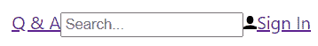
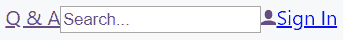
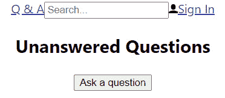
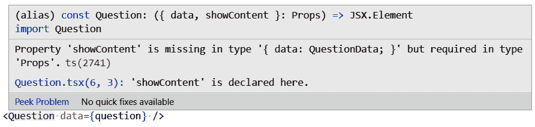
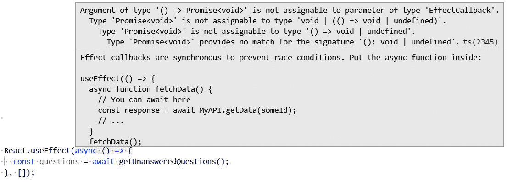
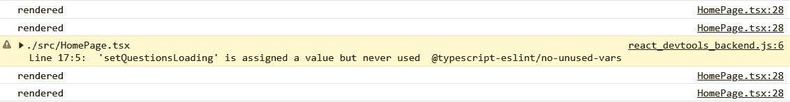
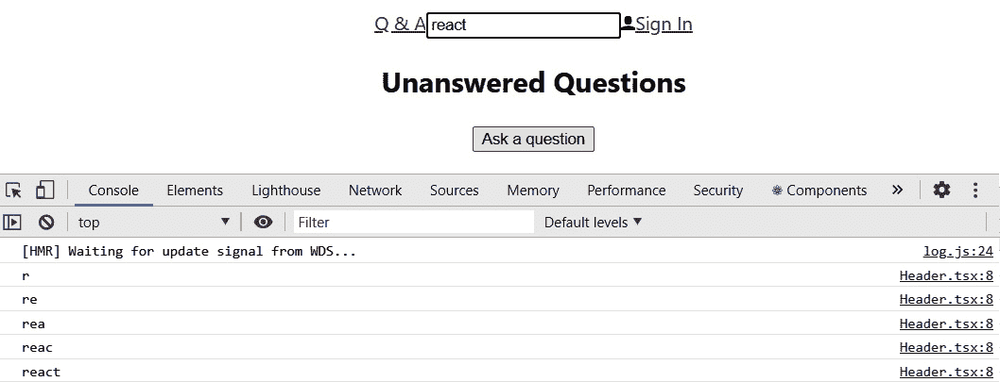

# *第 3 章*：开始使用 React 和打字脚本

在本章中，我们将通过创建一个显示应用程序主页的基于函数的组件，开始使用 TypeScript 构建 Q&A React 前端。这将在列表中显示最近提出的问题。作为本文的一部分，我们将花时间了解 strict 模式和 JSX。然后，我们将继续使用道具创建更多组件，以便在它们之间传递数据。在本章末尾，我们将开始了解组件状态，以及它如何使组件与事件交互。

本章将介绍以下主题：

*   理解 JSX
*   理解并启用 React 严格模式
*   创建基于功能的组件
*   实现组件道具
*   实现组件状态

让我们开始吧！

# 技术要求

在本章中，我们需要以下工具：

*   **Visual Studio 代码**：我们将使用它来编辑我们的 React 代码。可从[下载并安装 https://code.visualstudio.com/](https://code.visualstudio.com/) 。如果您已经安装了它，请确保它至少是 1.52 版。
*   **Node.js 和 npm**：可从[下载 https://nodejs.org/](https://nodejs.org/) 。如果您已经安装了这些，请确保 Node.js 至少为 8.2 版，npm 至少为 5.2 版。安装步骤见[https://treehouse.github.io/installation-guides/windows/node-windows.html](https://treehouse.github.io/installation-guides/windows/node-windows.html) 。
*   **巴别塔回复**：我们将简要地使用这个在线工具来探索 JSX。这可以在[找到 https://babeljs.io/repl](https://babeljs.io/repl) 。
*   **Q&A**：我们将从本章的 Q&A 前端启动器项目开始。这是我们在[*第 2 章*](02.html#_idTextAnchor041)*中完成的项目，创建了解耦的 React 和 ASP.NET 5 应用程序*，并提供了本章需要的图标。这可在 GitHub 的[上获得 https://github.com/PacktPublishing/ASP.NET-Core-5-and-React-Second-Edition `chapter-03/start`文件夹中的](https://github.com/PacktPublishing/ASP.NET-Core-5-and-React-Second-Edition)。

本章中的所有代码片段可在网上[找到 https://github.com/PacktPublishing/ASP.NET-Core-5-and-React-Second-Edition](https://github.com/PacktPublishing/ASP.NET-Core-5-and-React-Second-Edition) 。为了从章节中还原代码，您可以下载源代码库并在相关编辑器中打开相关文件夹。如果代码是前端代码，则可以使用`npm install`在终端中恢复依赖关系。

查看以下视频以查看代码的运行：[https://bit.ly/3mzfoSp](https://bit.ly/3mzfoSp) 。

# 了解 JSX

在本节中，我们将了解 JSX，我们在[*第 1 章*](01.html#_idTextAnchor020)*了解 ASP.NET 5 React 模板*中简要介绍了 JSX。我们已经知道 JSX 不是有效的 JavaScript，我们需要一个预处理器步骤将其转换为 JavaScript。我们将使用 Babel REPL 来使用 JSX，通过执行以下步骤来了解它如何映射到 JavaScript：

1.  Open a browser, go to [https://babeljs.io/repl](https://babeljs.io/repl), and enter the following JSX in the left-hand pane:

    ```cs
    <span>Q and A</span>
    ```

    右侧窗格中显示以下内容，这是我们的 JSX 编译的结果：

    ```cs
    React.createElement("span", null, "Q and A");
    ```

2.  我们可以看到它编译成一个对`React.createElement`的调用，它有三个参数：
    *   元素类型，可以是 HTML 标记名（如`span`）、React 组件类型或 React 片段类型。
    *   包含要应用于元素的属性的对象。
    *   元素的子元素。
3.  让我们通过在`span`：

    ```cs
    <header><span>Q and A</span></header>
    ```

    周围放置一个`header`标记来扩展我们的示例
4.  This compiles down to two calls with `React.createElement`, with `span` being passed in as a child to the `header` element that's created:

    ```cs
    React.createElement(
      "header",
      null,
      React.createElement(
        "span",
        null,
        "Q and A"
      )
    );
    ```

    请注意，代码片段的格式与 Babel REPL 中显示的格式略有不同。前面的代码片段更具可读性，使我们能够清楚地看到嵌套的`React.createElement`语句。

5.  让我们将`span`标记更改为锚定标记，并添加`href`属性：

    ```cs
    <header><a href="/">Q and A</a></header>
    ```

6.  在已编译的 JavaScript 中，我们可以看到嵌套的`React.createElement`调用已更改为将`"a"`作为元素类型传入，同时还有一个包含`href`作为第二个参数的 properties 对象：

    ```cs
    React.createElement(
      "header",
      null,
      React.createElement(
        "a",
        { href: "/" },
        "Q and A"
      )
    );
    ```

7.  This is starting to make sense, but so far, our JSX only contains HTML. Let's start to mix in some JavaScript. We'll do this by declaring and initializing a variable and referencing it inside the anchor tag:

    ```cs
    var appName = "Q and A";
    <header><a href="/">{appName}</a></header>
    ```

    我们可以看到，这通过 JavaScript 代码编译为以下内容：

    ```cs
    var appName = "Q and A";
    React.createElement(
      "header",
      null,
      React.createElement(
        "a",
        { href: "/" },
        appName
      )
    );
    ```

    因此，`appName`变量在第一条语句中声明，与我们定义它的方式完全相同，并作为嵌套的`React.createElement`调用中的子参数传入。

8.  The key point to note here is that we can inject JavaScript into HTML in JSX by using curly braces. To further illustrate this point, let's add the word `app` to the end of `appName`:

    ```cs
    const appName = "Q and A";
    <header><a href="/">{appName + " app"}</a></header>
    ```

    这可归结为以下几点：

    ```cs
    var appName = "Q and A";
    React.createElement(
      "header",
      null,
      React.createElement(
        "a",
        { href: "/" },
        appName + " app"
      )
    );
    ```

因此，JSX 可以被认为是 HTML 与 JavaScript 混合使用大括号。这使得它非常强大，因为可以使用常规 JavaScript 有条件地呈现元素，以及循环中的呈现元素。

现在我们已经了解了 JSX，我们将在下一节学习 React strict 模式

# 理解并启用严格模式

React**严格模式**通过执行某些检查，帮助我们编写更好的 React 组件。这包括对类组件*生命周期方法*的检查。

React 组件可以使用类或函数实现。类组件具有称为*生命周期方法*的特殊方法，可以在组件生命周期的特定时间执行逻辑。

严格模式检查生命周期方法在 React**并发模式**下是否正常工作。

重要提示

React 并发模式是一组功能，可帮助 React 应用程序保持响应速度，即使网络速度较慢。有关并发模式的更多信息，请参见[https://reactjs.org/docs/concurrent-mode-intro.html](https://reactjs.org/docs/concurrent-mode-intro.html) 。

严格模式检查第三方库中的生命周期方法，以及我们编写的生命周期方法。因此，即使我们使用功能组件构建应用程序，也可能会收到关于有问题的生命周期方法的警告。

严格的模式检查还警告使用旧的 API，例如旧的上下文 API。我们将在[*第 12 章*](12.html#_idTextAnchor257)*与 RESTful API 交互*中了解推荐的上下文 API。

strict mode 执行的最后一类检查是检查意外副作用。这些检查还包括内存泄漏和无效应用程序状态。

重要提示

严格的模式检查只发生在开发模式中——它们不会影响生产构建。

严格模式可通过使用React 中的`StrictMode`组件开启。Create React 应用程序已在`index.tsx`中为我们的整个应用程序启用严格模式：

```cs
ReactDOM.render(
  <React.StrictMode>
    <App />
  </React.StrictMode>,
  document.getElementById('root')
);
```

`StrictMode`组件被包裹在将要检查的组件树中的所有 React 组件周围。因此，`StrictMode`组件通常位于组件树的顶部。

让我们暂时将旧 API 的用法添加到`App.tsx`。如果前端项目未在 Visual Studio 代码中打开，请打开它并执行以下步骤：

1.  Add the following code at the bottom of `App.tsx`:

    ```cs
    class ProblemComponent extends React.Component {
      render() {
        return <div ref="div" />;
      }
    }
    ```

    这是一个类组件，它在 React 中使用了一个旧的**refs**API。*参考文献*是*参考文献*的缩写，但在 React 社区中更常被称为参考文献。不要担心完全理解这个组件的语法——关键是它使用 API，这是不推荐的。

    重要提示

    React ref 是一个特性，允许我们访问 DOM 节点。有关 React REF 的更多信息可在[中找到 https://reactjs.org/docs/refs-and-the-dom.html](https://reactjs.org/docs/refs-and-the-dom.html) 。

2.  在`App`组件

    ```cs
    <div className="App">
      <header className="App-header">
        <ProblemComponent />
        …
      </header>
    </div>
    ```

    中引用该组件
3.  在终端中运行以下命令启动应用程序：

    ```cs
    npm start
    ```

4.  Open the browser console; the following message will be displayed:

    

    图 3.1–严格模式警告

    Strict 模式向控制台输出了一条关于正在使用旧 API 的警告。

5.  从`App.tsx`中删除`ProblemComponent`及其引用。
6.  当提示停止应用程序运行时，按*Ctrl+C*并按*Y*。

现在我们已经对严格模式有了很好的理解，我们将开始在我们的应用程序中为主页创建组件。

# 创建基于功能的组件

在本节中，我们将首先为我们的应用程序标题创建一个组件，其中将包含我们的应用程序名称和搜索问题的能力。然后，我们将实现一些组件，以便开始构建应用程序的主页以及一些模拟数据。

## 创建表头组件

我们可以创建一个基本`Header`组件，并通过执行以下步骤将其引用到我们的`App`组件中：

1.  在`src`文件夹中创建一个名为`Header.tsx`的新文件。
2.  Import `React` into the file with the following `import` statement:

    ```cs
    import React from 'react';
    ```

    我们需要导入`React`，因为正如我们在本章开头所了解到的，JSX 被转换成 JavaScript`React.createElement`语句。因此，如果没有`React`，这些语句将出错。

3.  我们的组件将首先呈现单词`header`。因此，输入以下内容作为我们的初始`Header`组件：

    ```cs
    export const Header = () => <div>header</div>;
    ```

祝贺我们已经实现了第一个基于功能的 React 组件！

前面的组件实际上是一个设置为`Header`变量的箭头函数。

重要提示

箭头函数是 ES6 中引入的另一种函数语法。箭头函数语法比原始语法略短，同时保留了`this`的词法范围。函数参数在括号中定义，函数执行的代码遵循`=>`，通常被称为胖箭头。更多信息可在[中找到 https://developer.mozilla.org/en-US/docs/Web/JavaScript/Reference/Functions/Arrow_functions](https://developer.mozilla.org/en-US/docs/Web/JavaScript/Reference/Functions/Arrow_functions) 。

请注意，没有花括号或`return`关键字。相反，我们只定义函数应该在 fat 箭头之后直接返回的 JSX。这就是所谓的隐性回报

我们使用`const`关键字来声明和初始化`Header`变量。

重要提示

`const`关键字可用于声明和初始化一个变量，该变量的引用在以后的程序中不会改变。或者，`let`关键字可用于声明一个变量，该变量的引用可在以后的程序中更改。更多信息请访问[https://developer.mozilla.org/en-US/docs/Web/JavaScript/Reference/Statements/const](https://developer.mozilla.org/en-US/docs/Web/JavaScript/Reference/Statements/const) 。

我们现在可以在`App`组件中使用`Header`组件。

1.  `export`关键字允许在其他文件中使用该组件。那么，让我们在`App`组件中使用它，将其导入`App.tsx`。在`App.tsx`中的其他`import`语句下方添加以下`import`语句：

    ```cs
    import { Header } from './Header';
    ```

2.  现在，我们可以在`App`组件的`return`语句中引用`Header`组件。让我们用`Header`组件替换为我们创建 React 应用程序的`header`标记。让我们同时删除冗余的`logo`导入：

    ```cs
    import React from 'react';
    import './App.css';
    import { Header } from './Header';
    function App() {
      return (
        <div className="App">
          <Header />
        </div>
      );
    };
    export default App;
    ```

3.  在 Visual Studio代码终端中，输入`npm start`运行应用程序。我们将看到，**标题**一词出现在页面顶部，居中如下：


图 3.2–收割台组件

再次祝贺您–我们刚刚消耗了第一个 React 组件！

因此，arrow 函数语法是实现基于函数的组件的一种非常好的方法。隐式返回特性减少了我们需要输入的字符数。在本书中，我们将大量使用带有隐式返回的箭头函数。

## 向收割台组件添加元素

我们将进一步对`Header`组件进行工作，使其最终看起来如下所示：



图 3.3–标题组件中的所有元素

因此，`Header`组件将包含应用程序名称，即**Q&A**、搜索输入和**登录**链接。

在应用程序仍在运行的情况下，执行以下步骤修改`Header`组件：

1.  Add the app name inside an anchor tag inside the `div` tag by replacing the word `header`, which was previously used inside `div`:

    ```cs
    export const Header = () => (
      <div>
        <a href="./">Q & A</a>
      </div>
    );
    ```

    请注意，包含 JSX 的隐式返回语句现在位于括号中

    重要提示

    当隐式 return 语句位于多行上时，需要使用括号。当隐式返回仅在一行上时，我们可以不使用括号。

    如果需要的话，Prettier 会自动在隐式返回中添加括号，所以我们不必担心记住这个规则。

2.  添加一个`input`允许用户进行搜索：

    ```cs
    <div>
      <a href="./">Q & A</a>
      <input type="text" placeholder="Search..." />
    </div>
    ```

3.  添加允许用户登录的链接：

    ```cs
    <div>
      <a href="./">Q & A</a>
      <input type="text" placeholder="Search..." />
      <a href="./signin"><span>Sign In</span></a>
    </div>
    ```

4.  The **Sign In** link needs a user icon next to it. We're going to use `user.svg` for this, which should already be in our project.

    重要提示

    `user.svg`在本章的启动项目中。您可以从[下载 https://github.com/PacktPublishing/NET-5-and-React-17---Second-Edition/blob/master/chapter-03/start/frontend/src/user.svg](https://github.com/PacktPublishing/NET-5-and-React-17---Second-Edition/blob/master/chapter-03/start/frontend/src/user.svg) 如果您没有以启动项目开始本章。

5.  We are going to create a component to host this icon, so create a file called `Icons.tsx` in the `src` folder and enter the following content into it:

    ```cs
    import React from 'react';
    import user from './user.svg';
    export const UserIcon = () => (
      
    );
    ```

    在这里，我们创建了一个名为`UserIcon`的组件，它呈现一个`img`标记，将`src`属性设置为我们从`user.svg`导入的`svg`文件。

6.  让我们回到`Header.tsx`并导入我们刚刚创建的图标组件：

    ```cs
    import { UserIcon } from './Icons';
    ```

7.  现在，我们可以将`UserIcon`组件的一个实例放置在`button`内部的`Header`组件中`span`：

    ```cs
    export const Header = () => (
      <div>
        <a href="./">Q & A</a>
        <input type="text" placeholder="Search..." />
        <a href="./signin">
          <UserIcon />
          <span>Sign In</span>
        </a>
      </div>
    );
    ```

    之前
8.  让我们看看 running 应用程序中的标题：



图 3.4–更新的标题组件

我们的标题看起来不太好，但是我们可以看到我们刚刚创建的`Header`组件中的元素。我们将在下一章中设计我们的`Header`组件，[*第 4 章*](04.html#_idTextAnchor081)，*设计情感反应组件*。

## 创建主页组件

让我们创建另一个组件来更熟悉这个过程。这次，我们将通过执行以下步骤为主页创建一个组件：

1.  Create a file called `HomePage.tsx` in the `src` folder with the following content:

    ```cs
    import React from 'react';
    export const HomePage = () => (
      <div>
        <div>
          <h2>Unanswered Questions</h2>
          <button>Ask a question</button>
        </div>
      </div>
    );
    ```

    我们的主页只包含一个包含文本的标题、**未回答的问题**和一个提交问题的按钮。

2.  打开`App.tsx`并导入我们的`HomePage`组件：

    ```cs
    import { HomePage } from './HomePage';
    ```

3.  现在，我们可以在`render`方法

    ```cs
    <div className="App">
      <Header />
      <HomePage />
    </div>
    ```

    中的`Header`组件下添加一个`HomePage`实例
4.  如果我们看一下running app，我们会看到`Header`组件内容下的标题和按钮：



图 3.5–带有提问按钮的页面标题

我们在`HomePage`组件上有了一个良好的开端。在下一节中，我们将创建一些将在其中使用的模拟数据。

## 创建模拟数据

我们迫切需要一些数据，以便开发前端。在本节中，我们将在前端创建一些模拟数据。我们还将创建一个函数，组件将调用该函数来获取数据。最终，该函数将调用真正的 ASP.NET 核心后端。遵循以下步骤：

1.  Create a new file in the `src` folder called `QuestionsData.ts` with the following interface:

    ```cs
    export interface QuestionData {
      questionId: number;
      title: string;
      content: string;
      userName: string;
      created: Date;
    }
    ```

    在继续之前，让我们先了解一下刚刚输入的代码，因为我们刚刚编写了一些打字脚本。

    重要提示

    **接口**是定义对象结构的类型，包括对象的所有属性和方法。JavaScript 中不存在接口，因此 TypeScript 编译器在类型检查过程中纯粹使用这些接口。我们用`interface`关键字创建一个接口，后面是它的名称，后面是组成该接口的属性和方法（用大括号括起来）。更多信息请访问[https://www.typescriptlang.org/docs/handbook/interfaces.html](https://www.typescriptlang.org/docs/handbook/interfaces.html) 。

    因此，我们的接口被称为`QuestionData`，它定义了我们希望处理的问题的结构。我们已经导出了界面，以便在我们与问题数据交互时可以在整个应用程序中使用。

    请注意在接口中属性名称之后显示的类型。这些被称为**类型注释**，是 JavaScript 中不存在的 TypeScript 特性。

    重要提示

    **类型注释**允许我们使用特定类型声明变量、属性和函数参数。这允许 TypeScript 编译器检查代码是否符合这些类型。简言之，类型注释允许 TypeScript 在代码使用错误类型的情况下捕获 bug，这比我们使用 JavaScript 编写代码的时间要早得多

    请注意，我们已经指定了`created`属性具有`Date`类型。

    重要提示

    `Date`类型是 TypeScript 中的一种特殊类型，表示`Date`JavaScript 对象。此`Date`对象表示时间上的单个时刻，并指定为自 UTC 1970 年 1 月 1 日午夜以来的毫秒数。更多信息请参见[https://developer.mozilla.org/en-US/docs/Web/JavaScript/Reference/Global_Objects/Date](https://developer.mozilla.org/en-US/docs/Web/JavaScript/Reference/Global_Objects/Date) 。

2.  在`QuestionData`下，让我们为预期答案的结构创建另一个界面：

    ```cs
    export interface AnswerData {
      answerId: number;
      content: string;
      userName: string;
      created: Date;
    }
    ```

3.  Now, we can adjust the `QuestionData` interface so that it includes an array of answers:

    ```cs
    export interface QuestionData {
      questionId: number;
      title: string;
      content: string;
      userName: string;
      created: Date;
      answers: AnswerData[];
    }
    ```

    注意`answers`属性的类型注释中的方括号。

    重要提示

    类型后的方括号表示该类型的数组。更多信息请参见[https://www.typescriptlang.org/docs/handbook/basic-types.html](https://www.typescriptlang.org/docs/handbook/basic-types.html) #数组。

4.  Let's create some mock questions below the interfaces. You can copy the code at [https://github.com/PacktPublishing/NET-5-and-React-17---Second-Edition/blob/master/chapter-03/finish/frontend/src/QuestionsData.ts](https://github.com/PacktPublishing/NET-5-and-React-17---Second-Edition/blob/master/chapter-03/finish/frontend/src/QuestionsData.ts) to save yourself typing it all out:

    ```cs
    const questions: QuestionData[] = [
      {
        questionId: 1,
        title: 'Why should I learn TypeScript?',
        content:
          'TypeScript seems to be getting popular so I 
            wondered whether it is worth my time learning
             it? What benefits does it give    
               over JavaScript?',
        userName: 'Bob',
        created: new Date(),
        answers: [
          {
            answerId: 1,
            content: 'To catch problems earlier speeding 
             up your developments',
            userName: 'Jane',
            created: new Date(),
          },
          {
            answerId: 2,
            content:
              'So, that you can use the JavaScript 
               features of tomorrow, today',

            userName: 'Fred',
            created: new Date(),
          },
        ],
      },
      {
        questionId: 2,
        title: 'Which state management tool should 
        I use?',
        content:
          'There seem to be a fair few state management
           tools around for React - React, Unstated, ...
            Which one should I use?',
        userName: 'Bob',
        created: new Date(),
        answers: [],
      },
    ];
    ```

    注意，我们输入了`questions`变量，其中包含我们刚刚创建的`QuestionData`接口的数组。如果我们遗漏了一个属性或拼写错误，TypeScript 编译器会抱怨。

5.  Let's create a function that returns unanswered questions:

    ```cs
    export const getUnansweredQuestions = (): QuestionData[] => {
      return questions.filter(q => q.answers.length === 
       0);
    };
    ```

    此函数使用`array.filter`方法返回我们刚刚创建的问题数组项，其中不包含答案

    重要提示

    数组中的`array.filter`方法执行为每个数组项传递给它的函数，然后使用从函数返回的所有元素创建一个新数组。真实值是除`false`、`0`、`""`、`null`、`undefined`或`NaN`以外的任何值。更多信息请访问[https://developer.mozilla.org/en-US/docs/Web/JavaScript/Reference/Global_Objects/Array/filter](https://developer.mozilla.org/en-US/docs/Web/JavaScript/Reference/Global_Objects/Array/filter) 。

注意，我们在函数参数之后为函数定义了返回类型`QuestionData[]`。

在下一节中，我们将使用`getUnansweredQuestions`函数为主页提供数据。

## 实现组件道具

组件可以有属性，允许使用者将参数传递给它们，就像我们将参数传递给 JavaScript 函数一样。React 函数组件接受一个名为`props`的参数，该参数保存其属性。**道具**是属性的缩写。

在本节中，我们将学习如何实现强类型的道具，包括可选和默认道具。然后，我们将实现主页的其余部分以帮助学习。

## 创建主页子组件

我们将实现`HomePage`组件将使用的一些子组件。我们将通过道具将未回答的问题数据传递给子组件。

### 创建问题列表组件

让我们通过以下步骤来实现`QuestionList`组件：

1.  让我们在`src`文件夹中创建一个名为`QuestionList.tsx`的文件，并添加以下`import`语句：

    ```cs
    import React from 'react';
    import { QuestionData } from './QuestionsData';
    ```

2.  Now, let's define the interface for the component props underneath the `import` statements:

    ```cs
    interface Props {
      data: QuestionData[];
    }
    ```

    我们已经调用了 props 接口`Props`，它包含一个单独的属性来保存问题数组。

3.  Let's start by implementing the `QuestionList` component:

    ```cs
    export const QuestionList = (props: Props) => <ul></ul>;
    ```

    注意函数组件中的参数`props`。我们给了它一个带有类型注释的`Props`类型。这意味着当我们在 JSX 中引用`data`道具时，我们可以将其传递到`QuestionList`。

4.  Now, we can inject the data into the list:

    ```cs
    export const QuestionList = (props: Props) => (
      <ul>
        {props.data.map((question) => (
          <li key={question.questionId}>
          </li>
        ))}
      </ul>
    );
    ```

    我们在`data`数组中使用`map`方法迭代传递到组件中的数据。

    重要提示

    `map`是 JavaScript 数组中可用的标准方法。该方法遍历数组中的项，为每个数组项调用传递给它的函数。函数应返回一个将形成新数组的项。总之，这是一种将一个数组映射到一个新数组的方法。更多信息请访问[https://developer.mozilla.org/en-US/docs/Web/JavaScript/Reference/Global_Objects/Array/map](https://developer.mozilla.org/en-US/docs/Web/JavaScript/Reference/Global_Objects/Array/map) 。

    因此，我们迭代传递到`QuestionList`中的问题，并为每个数组项呈现一个`li`HTML 元素。

    注意我们传递到`li`元素的`key`道具。

    重要提示

    `key`道具帮助 React检测元素何时更改、添加或删除。当我们在 React 中输出循环中的内容时，最好应用此道具并将其设置为循环中的唯一值。这有助于在渲染过程中将其与其他元素区分开来。如果我们不提供关键道具，React 将对 DOM 进行不必要的更改，从而影响性能。更多信息请访问[https://reactjs.org/docs/lists-and-keys.html](https://reactjs.org/docs/lists-and-keys.html) 。

5.  Our `QuestionList` component will work perfectly fine, but we are going to make one small change that will make the implementation a little more succinct. Here, we are going to destructure the props into a `data` variable in the function parameter:

    ```cs
    export const QuestionList = ({ data }: Props) => (
      <ul>
        {data.map((question) => (
          <li key={question.questionId} >
          </li>
        ))}
      </ul>
    );
    ```

    重要提示

    **解构**是一种特殊的语法，允许我们将对象或数组解包为变量。有关解构的更多信息，请参见[https://developer.mozilla.org/en-US/docs/Web/JavaScript/Reference/Operators/Destructuring_assignment](https://developer.mozilla.org/en-US/docs/Web/JavaScript/Reference/Operators/Destructuring_assignment) 。

    请注意，我们直接在 JSX 中引用数据变量，而不是通过 props 变量，就像我们在前面的示例中所做的那样。这是一个很好的模式使用，特别是当有更多的道具。

在完成`QuestionList`组件之前，我们必须先创建它的子组件`Question`，我们接下来会做这个。

### 创建问题组件

按照以下步骤实现`Question`组件：

1.  在`src`文件夹中创建一个名为`Question.tsx`的文件，其中包含以下`import`语句：

    ```cs
    import React from 'react'; 
    import { QuestionData } from './QuestionsData';
    ```

2.  让我们为`Question`组件创建道具类型，它只包含一个用于问题数据的道具：

    ```cs
    interface Props {
      data: QuestionData;
    }
    ```

3.  现在，我们可以创建组件：

    ```cs
    export const Question = ({ data }: Props) => (
      <div>
        <div>
          {data.title}
        </div>
        <div>
          {`Asked by ${data.userName} on
            ${data.created.toLocaleDateString()} ${data.
            created.toLocaleTimeString()}`}
        </div>
      </div>
    );
    ```

因此，我们呈现了问题的标题，是谁提出的问题，以及何时提出的问题。

请注意，当询问问题时，我们正在使用`data.created Date`对象上的`toLocaleDateString`和`toLocaleTimeString`函数进行输出。

重要提示

在不同的国家，日期通常以不同的格式显示。例如，2021 年 2 月 1 日可以在不同的国家/地区显示为 02/01/21 或 01/02/21。`toLocaleDateString`和`toLocaleTimeString`是`Date`对象上的方法，根据浏览器的区域设置格式化日期和时间。更多信息请参见[https://developer.mozilla.org/en-US/docs/Web/JavaScript/Reference/Global_Objects/Date/toLocaleDateString](https://developer.mozilla.org/en-US/docs/Web/JavaScript/Reference/Global_Objects/Date/toLocaleDateString) 和[https://developer.mozilla.org/en-US/docs/Web/JavaScript/Reference/Global_Objects/Date/toLocaleTimeString](https://developer.mozilla.org/en-US/docs/Web/JavaScript/Reference/Global_Objects/Date/toLocaleTimeString) 。

这很好地完成了我们的`Question`组件。

### 给部件布线

现在，我们可以用我们的道具将我们刚刚创建的组件连接起来，这样我们就可以在主页上看到未回答的问题。请按照以下步骤执行此操作：

1.  让我们回到`QuestionList.tsx`并导入我们刚刚创建的`Question`组件：

    ```cs
    import { Question } from './Question';
    ```

2.  现在，我们可以在嵌套在`li`元素

    ```cs
    {data.map((question) => (
      <li key={question.questionId}>
        <Question data={question} />
      </li>
    ))}
    ```

    中的`QuestionList`JSX 中放置一个`Question`组件的实例
3.  转到`HomePage.tsx`中的`HomePage`组件，我们导入`QuestionList`组件。我们还导入前面创建的`getUnansweredQuestions`函数，该函数返回未回答的问题：

    ```cs
    import { QuestionList } from './QuestionList';
    import { getUnansweredQuestions } from './QuestionsData';
    ```

4.  Now, we can place an instance of `QuestionList` inside the `HomePage` component JSX, inside the outermost `div` tag:

    ```cs
    <div>
      <div>
        <h2>Unanswered Questions</h2>
        <button>Ask a question</button>
      </div>
      <QuestionList data={getUnansweredQuestions()} />
    </div>
    ```

    请注意，我们通过调用本章前面创建并导入的`getUnansweredQuestions`函数，将问题数组传递到`data`道具中。

5.  如果我们现在查看正在运行的应用程序，我们将看到一个未回答的问题输出：


图 3.6–未回答的问题

如果我们的模拟数据中有多个未回答的问题，它们将是我们主页上的输出。

我们将通过了解可选和默认道具来完成关于道具的部分，这可以使我们的组件对消费者来说更加灵活。

## 可选和默认道具

道具可以是可选的，这样消费者就不必将道具传递到组件中。例如，我们可以在`Question`组件中有一个可选的道具，允许消费者更改是否呈现问题的内容。我们现在将执行此操作：

1.  We need to add the content to the `Question` component, so add the following code beneath the question title in the JSX:

    ```cs
    export const Question = ({ data }: Props) => (
      <div>
        <div>
          {data.title}
        </div>
        <div>
          {data.content.length > 50
            ? `${data.content.substring(0, 50)}...`
            : data.content}
        </div>
        <div>
          {`Asked by ${data.userName} on
            ${data.created.toLocaleDateString()} ${data.
            created.toLocaleTimeString()}`}
        </div>
      </div>
    );
    ```

    这里，我们使用了一个JavaScript**三元运算符**来截断长度超过50 个字符的内容。

    重要提示

    JavaScript 三元语句是实现条件语句的一种简单方法，它会导致执行逻辑的两个分支之一。该语句包含三个操作数，由问号（`?`和冒号（`:`）分隔。第一个操作数是条件，第二个是条件为`true`时返回的操作数，第三个是条件为`false`时返回的操作数。三元运算符是 JSX 中实现条件逻辑的常用方法。更多信息请参见[https://developer.mozilla.org/en-US/docs/Web/JavaScript/Reference/Operators/Conditional_Operator](https://developer.mozilla.org/en-US/docs/Web/JavaScript/Reference/Operators/Conditional_Operator) 。

    在这个代码片段中，我们还使用了模板文本和**互极化**。

    重要提示

    JavaScript 模板文本是 backticks（```cs中包含的字符串。模板文本可以包含将数据注入字符串的表达式。表达式包含在美元符号后的花括号中。这通常被称为*插值*。更多信息请访问[https://developer.mozilla.org/en-US/docs/Web/JavaScript/Reference/Template_literals](https://developer.mozilla.org/en-US/docs/Web/JavaScript/Reference/Template_literals) 。

2.  在`Question.tsx`的`Props`界面中创建一个附加属性，表示问题的内容是否显示：

    ```
    interface Props {
      data: QuestionData;
      showContent: boolean;
    }
    ```cs

3.  我们来分解`Question`组件参数

    ```
    export const Question = ({ data, showContent }: Props) =>
    ```cs

    中的`showContent`道具
4.  Let's change where we render the question content to the following:

    ```
    <div>
      {data.title}
    </div>
    {showContent && (
      <div>
        {data.content.length > 50
          ? `${data.content.substring(0, 50)}...`
          : data.content}
      </div>
    )}
    <div>
      {`Asked by ${data.userName} on
        ${data.created.toLocaleDateString()} ${data.created.
         toLocaleTimeString()}`}
    </div>
    ```cs

    我们刚刚更改了组件，以便仅当`showContent`道具是使用短路运算符`&&`的`true`时，它才会呈现问题的内容。

    重要提示

    短路运算符（`&&`是表示条件逻辑的另一种方式。它有两个操作数，第一个是条件，第二个是条件求值为`true`时要执行的逻辑。在 JSX 中，如果条件为`true`，则通常使用它有条件地呈现元素。

5.  If we go back to `QuestionList.tsx`, we'll see a TypeScript compilation error where the `Question` component is referenced:

    

    图 3.7–问题组件上的 TypeScript 编译错误

    这是，因为`showContent`是`Question`组件中必需的道具，我们还没有将其传入。在添加道具时，总是要更新消费组件，这可能是一种痛苦。如果我们不传递它，`showContent`就不能默认为`false`吗？这正是我们下一步要做的。

6.  Move back into `Question.tsx` and make the `showContent` prop optional by adding a question mark after the name of the prop in the interface:

    ```
    interface Props {
      data: QuestionData;
      showContent?: boolean;
    }
    ```cs

    重要提示

    可选属性实际上是一个 TypeScript 功能。通过在类型注释之前的参数名称末尾添加问号，也可以使函数参数成为可选参数；例如，`(duration?:number)`。

    现在，`QuestionList.tsx`中的编译错误已经消失，应用程序将呈现没有内容的未回答问题。

    如果我们希望在默认情况下显示问题的内容，并允许消费者在需要时抑制该内容，该怎么办？我们将使用两种不同的默认道具方法来实现这一点。

7.  We can set a special object literal called `defaultProps` on the component to define the default values: 

    ```
    export const Question = ({ data, showContent }: Props) => (
      ...
    );
    Question.defaultProps = {
     showContent: true,
    };
    ```cs

    如果我们查看正在运行的应用程序，我们将看到问题内容按预期呈现：

    

    图 3.8–未回答的内容问题

8.  还有另一种设置默认道具的方法，可以说更整洁。让我们删除`defaultProps`对象文字，并在解构组件的`showContent`参数

    ```
    export const Question = ({ data, showContent = true }: Props) => ( ... )
    ```cs

    后指定默认值

这可以使代码更具可读性，因为默认值就在其参数旁边。这意味着我们的眼睛不需要扫描到函数的底部，就可以看到是参数的默认值。

因此，我们的主页在代码结构方面看起来不错。然而，`HomePage.tsx`中有几个组件可以提取，这样我们可以在开发应用程序的其余部分时重用它们。我们下一步做这个。

## 儿童道具

`children`道具是所有反应组件自动拥有的魔法道具。它可用于渲染子元素。它很神奇，因为它自动存在，我们不需要做任何事情，而且非常强大。在以下步骤中，我们将在创建`Page`和`PageTitle`组件时使用`children`道具：

1.  First, let's create a file called `PageTitle.tsx` in the `src` folder with the following content: 

    ```
    import React from 'react'; 
    interface Props {
      children: React.ReactNode;
    }
    export const PageTitle = ({
      children,
    }: Props) => <h2>{children}</h2>;
    ```cs

    我们使用类型注释`ReactNode`定义`children`道具。这将允许我们使用广泛的子元素，例如其他 React 组件和纯文本。

    我们在`h2`元素中引用了`children`道具。这意味着消费组件指定的子元素将被放置在`h2`元素中。

2.  Let's create a file called `Page.tsx` with the following content: 

    ```
    import React from 'react';
    import { PageTitle } from './PageTitle';
    interface Props {
      title?: string;
      children: React.ReactNode;
    }
    export const Page = ({ title, children }: Props) => (
      <div>
        {title && <PageTitle>{title}</PageTitle>}
        {children}
      </div>
    );
    ```cs

    在这里，组件接受一个可选的`title`道具，并在`PageTitle`组件内呈现该道具

    该组件还包含一个`children`道具。在消费组件中，`Page`组件中嵌套的内容将呈现在我们刚刚放置`children`道具的位置。

3.  现在我们回到`HomePage.tsx`，导入`Page`和`PageTitle`组件：

    ```
    import { Page } from './Page';
    import { PageTitle } from './PageTitle';
    ```cs

4.  让我们在`HomePage`组件中使用`Page`和`PageTitle`组件，如下所示：

    ```
    export const HomePage = () => (
      <Page>
        <div>
          <PageTitle>Unanswered Questions</PageTitle>
          <button>Ask a question</button>
        </div>
        <QuestionList data={getUnansweredQuestions()} />
      </Page>
    );
    ```cs

请注意，我们没有利用`HomePage`中`Page`组件中的`title`道具。这是，因为此页面需要在标题右侧有**提问**按钮，所以我们在`HomePage`中呈现。然而，我们实现的其他页面将利用我们已经实现的`title`道具。

因此，`children`道具允许消费者在组件内呈现自定义内容。这赋予了组件灵活性，并使其高度可重用，我们将在整个应用程序中使用`Page`组件时发现这一点。但是，您可能不知道，`children`道具实际上是一个函数道具。我们将在下一节学习功能道具。

## 功能道具

道具可以由基本类型组成，例如我们在`Question`组件中实现的`boolean``showContent`道具。道具也可以是对象和阵列，正如我们在`Question`和`QuestionList`组件中看到的。这本身就是强大的。然而，道具也可以是功能，这允许我们实现极其灵活的组件。

使用以下步骤，我们将在`QuestionList`组件上实现一个函数道具，允许使用者呈现问题，作为`QuestionList`呈现问题的替代方案：

1.  在`QuestionList.tsx`中，在`Props`界面增加`renderItem`功能道具，如下：

    ```
    interface Props {
      data: QuestionData[];
      renderItem?: (item: QuestionData) => JSX.Element;
    }
    ```cs

2.  因此，`renderItem`prop 是一个函数，它接受一个包含问题的参数并返回一个 JSX 元素。请注意，我们已将其作为可选道具，以便我们的应用程序将继续像以前一样运行。
3.  让我们将函数参数分解为`renderItem`变量：

    ```
    export const QuestionList = ({ data, renderItem }: Props) => …
    ```cs

4.  现在，我们可以在 JSX 中调用`renderItem`函数 prop（如果已传递），如果未传递，则呈现`Question`组件：

    ```
    {data.map((question) => (
      <li key={question.questionId} >
        {renderItem ? renderItem(question) : <Question
          data={question} />}
      </li>
    ))}
    ```cs

5.  Notice that we are using `renderItem` in the ternary condition, even though it isn't a boolean.

    重要提示

    `if`语句和三元组中的条件如果计算结果为**truthy**，将执行第二个操作数，如果计算结果为**falsy**。`true`只是众多 truthy 值中的一个。事实上，`false`、`0`、`""`、`null`、`undefined`，而`NaN`是虚假的价值观，其他一切都是真实的。

    因此，`renderItem`将是真实的，如果它作为道具传递，则将执行。

6.  Our app will render the unanswered questions, just like it did previously, by rendering the `Question` component. Let's try our `renderItem` prop out by opening `HomePage.tsx` and setting this to the following in the `QuestionList` element:

    ```
    <QuestionList 
      data={getUnansweredQuestions()} 
      renderItem={(question) => <div>{question.title}</div>} 
    />
    ```cs

    如果我们看一下running 应用程序，我们会看到这样的效果：

    

    图 3.9–自定义呈现问题

    重要提示

    实现函数道具以允许使用者呈现组件的内部部分的模式通常被称为**呈现道具**。它使组件非常灵活，可用于许多不同的场景。

7.  现在我们了解了渲染道具是什么，我们将恢复此更改，并让`QuestionList`收回对渲染问题的控制。因此，从 JSX 中删除以下突出显示的行：

    ```
    <QuestionList 
      data={getUnansweredQuestions()} 
      renderItem={(question) => <div>{question.title}</div>} 
    />
    ```cs

我们已经看到功能道具非常强大。在本章后面介绍处理事件时，我们将再次使用这些。然而，在我们研究事件之前，我们将讨论组件的另一个基本部分，即状态。

# 实现组件状态

组件可以使用所称的**状态**在组件中的变量发生变化时重新呈现组件。这对于实现交互式组件至关重要。例如，在填写表单时，如果字段值有问题，我们可以使用状态来呈现有关该问题的信息。当外部事物与组件（如 web API）交互时，状态也可用于实现行为。在更改`getUnansweredQuestions`函数以模拟 web API 调用之后，我们将在本节中进行此操作。

更改 getUnansweredQuestions 以使其异步

`getUnansweredQuestions`函数不能很好地模拟 web API 调用，因为它不是异步的。在本节中，我们将改变这一点。请按照以下步骤执行此操作：

1.  Open `QuestionsData.ts` and create an asynchronous `wait` function that we can use in our `getUnansweredQuestions` function:

    ```
    const wait = (ms: number): Promise<void> => {
     return new Promise(resolve => setTimeout(resolve, ms));
    };
    ```cs

    此函数将异步等待传入它的毫秒数。该函数在内部使用本机 JavaScript`setTimeout`函数，以便在指定的毫秒数后返回。请注意，该函数返回一个`Promise`对象。

    重要提示

    **承诺**是一个 JavaScript对象，表示异步操作的最终完成（或失败）及其结果值。TypeScript 中的`Promise`类型与.NET 中的`Task`类型类似。更多信息请访问[https://developer.mozilla.org/en-US/docs/Web/JavaScript/Reference/Global_Objects/Promise](https://developer.mozilla.org/en-US/docs/Web/JavaScript/Reference/Global_Objects/Promise) 。

    注意返回类型注释中的`Promise`类型后面的`<void>`。TypeScript 类型后的尖括号表示这是泛型类型。

    重要提示

    **泛型类型**是一种机制，用于在泛型类型的内部实现中使用使用者自己的类型。尖括号允许将使用者类型作为参数传入。TypeScript 中的泛型与.NET 中的泛型非常相似。更多信息请访问[https://www.typescriptlang.org/docs/handbook/generics.html](https://www.typescriptlang.org/docs/handbook/generics.html) 。

    我们正在将一个`void`类型传递到泛型`Promise`类型。但是什么是`void`类型？

    `void`类型是另一种特定于 TypeScript 的类型，用于表示非返回函数。所以，TypeScript 中的`void`就像.NET 中的`void`。

2.  Now, we can use the `wait` function in our `getUnansweredQuestions` function to wait half a second:

    ```
    export const getUnansweredQuestions = async (): Promise<QuestionData[]> => {
      await wait(500);
      return questions.filter(q => q.answers.length ===
       0);
    };
    ```cs

    注意调用`wait`函数之前的`await`关键字和函数签名之前的`async`关键字。

    `async`和`await`是两个 JavaScript 关键字，我们可以使用它们使异步代码的读取与同步代码几乎相同。`await`停止下一行的执行，直到异步语句完成，而`async`只是指示函数包含异步语句。因此，这些关键字与.NET 中的`async`和`await`非常相似。

    我们返回`Promise<QuestionData[]>`而不是`QuestionData[]`，因为函数不会立即返回问题。相反，它最终会返回问题。

3.  So, the `getUnansweredQuestions` function is now asynchronous. If we open `HomePage.tsx`, which is where this function is consumed, we'll see a compilation error:

    

    图 3.10–数据属性上的类型错误

    这是因为函数的返回类型已更改，不再与我们在`QuestionList`props 接口中定义的类型匹配。

4.  For now, let's comment the instance of `QuestionList` out so that our app compiles: 

    ```
    {/* <QuestionList data={getUnansweredQuestions()} /> */}
    ```cs

    重要提示

    通过高亮显示代码行并按*Ctrl+/*（正斜杠），可以在 Visual Studio 代码中注释掉代码行。

最后，我们将更改`HomePage`，以便我们可以在本地状态中存储问题，然后在本地状态中使用该值传递给`QuestionList`。为此，我们需要在组件首次呈现时调用`getUnansweredQuestions`，并设置返回到状态的值。我们将在下一节中进行此操作。

## 使用 useEffect 执行逻辑

那么，当呈现基于函数的组件时，我们如何执行逻辑？那么，我们可以在 React 中使用一个`useEffect`钩子，这就是我们将在以下步骤中执行的操作：

1.  我们需要更改`HomePage`以便它有一个显式的`return`语句，因为我们希望在组件中编写一些 JavaScript 逻辑，并返回 JSX:

    ```
    export const HomePage = () => {
      return (
        <Page>
          ...
        </Page>
      );
    };
    ```cs

2.  Now, we can call the `useEffect` hook before we return the JSX:

    ```
    export const HomePage = () => {
      React.useEffect(() => {
        console.log('first rendered');
      }, []);
      return (
        ...
      );
    };
    ```cs

    重要提示

    `useEffect`钩子是一个允许在组件中执行副作用（如获取数据）的函数。该函数包含两个参数，第一个参数是要执行的函数。第二个参数确定第一个参数中的函数应在何时执行。这是在变量数组中定义的，如果更改，将导致执行第一个参数函数。如果数组为空，则仅在第一次呈现组件后才执行该函数。更多信息请访问[https://reactjs.org/docs/hooks-effect.html](https://reactjs.org/docs/hooks-effect.html) 。

    所以，当`HomePage`组件第一次渲染时，我们将**第一次渲染**输出到控制台。

3.  在正在运行的应用程序中，让我们打开浏览器开发人员工具并检查控制台：


图 3.11–正在执行的 useEffect

因此，我们的代码是在组件第一次呈现时执行的，这非常好。

注意，我们不应该担心有关未使用的`QuestionList`组件和`getUnansweredQuestions`变量的 ESLint 警告。这是因为当我们取消注释对`QuestionList`组件的引用时，将使用这些。

## 使用 useState 实现组件状态

已经到了在`HomePage`组件中实现状态的时候了，这样我们就可以存储任何未回答的问题。但是我们如何在基于功能的组件中做到这一点呢？答案是使用另一个名为`useState`的 React 钩子。按照`HomePage.tsx`中列出的步骤进行：

1.  将`QuestionData`接口添加到`QuestionsData`导入：

    ```
    import { 
      getUnansweredQuestions, 
      QuestionData 
    } from './QuestionsData';
    ```cs

2.  We'll use this hook just above the `useEffect` statement in the `HomePage` component to declare the state variable:

    ```
    const [
      questions,
      setQuestions,
    ] = React.useState<QuestionData[]>([]);
    React.useEffect(() => {
      console.log('first rendered');
    }, []);
    ```cs

    重要提示

    `useState`函数返回一个数组，该数组包含第一个元素中的状态变量，并返回一个函数来设置第二个元素中的状态。状态变量的初始值作为参数传递到函数中。状态变量的 TypeScript 类型可以作为泛型类型参数传递给函数。更多信息请访问[https://reactjs.org/docs/hooks-state.html](https://reactjs.org/docs/hooks-state.html) 。

    请注意，我们已经将从`useState`返回的数组分解为一个名为`questions`的状态变量（最初是一个空数组）和一个名为`setQuestions`的设置状态的函数。我们可以对数组进行分解以解压缩其内容，就像我们以前对对象所做的那样。

    因此，`questions`状态变量的类型是`QuestionData`的数组。

3.  Let's add a second piece of state called `questionsLoading` to indicate whether the questions are being fetched: 

    ```
    const [
      questions,
      setQuestions,
    ] = React.useState<QuestionData[]>([]);
    const [
      questionsLoading,
      setQuestionsLoading,
    ] = React.useState(true);
    ```cs

    我们已将此状态初始化为`true`，因为问题将在第一个渲染周期中立即提取。请注意，我们没有将类型传递到泛型参数中。这是因为，在本例中，TypeScript 可以巧妙地从我们传递到`useState`参数的默认值`true`推断出这是一个`boolean`状态。

4.  Now, we need to set these pieces of state when we fetch the unanswered questions. First, we need to call the `getUnansweredQuestions` function asynchronously in the `useEffect` hook. Let's add this and remove the `console.log` statement:

    ```
    React.useEffect(() => {
      const questions = await getUnansweredQuestions();
    },[]);
    ```cs

    我们立即得到一个编译错误：

    

    图 3.12–使用效果误差

5.  发生此错误是因为`useEffect`函数回调未标记为`async`。那么，让我们试着去做`async`：

    ```
    React.useEffect(async () => {
      const questions = await getUnansweredQuestions();
    }, []);
    ```cs

6.  Unfortunately, we get another error:

    

    图 3.13–另一个 useEffect 错误

    不幸的是，我们无法在`useEffect`参数中指定异步回调。

7.  错误消息将引导我们找到解决方案。我们可以创建一个异步调用`getUnansweredQuestions`的函数，并在`useEffect`回调函数

    ```
    React.useEffect(() => {
      const doGetUnansweredQuestions = async () => {
    const unansweredQuestions = await 
        getUnansweredQuestions();
      };
      doGetUnansweredQuestions();
    }, []);
    ```cs

    中调用该函数
8.  现在我们需要设置`questions`和`questionsLoading`状态，一旦我们检索到数据：

    ```
    useEffect(() => {
      const doGetUnansweredQuestions = async () => {
        const unansweredQuestions = await 
         getUnansweredQuestions();
        setQuestions(unansweredQuestions);
        setQuestionsLoading(false);
      };
      doGetUnansweredQuestions();
    }, []);
    ```cs

9.  In the `HomePage` JSX, we can uncomment the `QuestionList` reference and pass in our `question` state:

    ```
    <Page>
      <div ... >
        ...
      </div>
      <QuestionList data={questions} />
    </Page>
    ```cs

    如果我们看一下 running 应用程序，我们会发现问题又被很好地呈现出来了

10.  We haven't made use of the `questionsLoading` state yet. So, let's change the `HomePage` JSX to the following:

    ```
    <Page>
      <div>
        ...
      </div>
      {questionsLoading ? (
        <div>Loading…</div>
      ) : (
        <QuestionList data={questions || []} />
      )}
    </Page>
    ```cs

    这里，我们正在呈现一个**加载。。。**获取问题时发送消息。我们的主页将在 running 应用程序中重新呈现，我们将看到一个**加载。。。**在提取问题时发送消息。

11.  Before we move on, let's take some time to understand when components are re-rendered. Still in `HomePage.tsx`, let's add a `console.log` statement before the `return` statement and comment out `useEffect`:

    ```
    // React.useEffect(() => {
    //   ...
    // }, []);
    console.log('rendered');
    return ...
    ```cs

    每次呈现`HomePage`组件时，我们都会在控制台中看到一条呈现的消息：

    

    图 3.14–在无状态更改的情况下渲染两次

    因此，当未设置状态时，组件将渲染两次。

    在开发模式下，如果处于严格模式，并且组件包含状态，则组件将呈现两次。这样 React 就可以检测到意外的副作用。

12.  Comment `useEffect` back in but leave one of the state setter functions commented out:

    ```
    React.useEffect(() => {
      const doGetUnansweredQuestions = async () => {
    const unansweredQuestions = await 
        getUnansweredQuestions();
        setQuestions(unansweredQuestions);
        // setQuestionsLoading(false);
      };
      doGetUnansweredQuestions();
    }, []);
    ```cs

    组件渲染四次：

    

    图 3.15–状态更改时渲染四次

    React 在状态更改时渲染组件，因为我们处于严格模式，所以会得到双重渲染。

    我们在组件首次加载时获得双重渲染，在状态更改后获得双重渲染。因此，我们总共得到四个渲染。

13.  Comment the other state setter back in:

    ```
    React.useEffect(() => {
      const doGetUnansweredQuestions = async () => {
        const unansweredQuestions = await
         getUnansweredQuestions();
        setQuestions(unansweredQuestions);
        setQuestionsLoading(false);
      };
      doGetUnansweredQuestions();
    }, []);
    ```cs

    组件被渲染六次：

    

    图 3.16–当两个状态发生变化时渲染六次

14.  让我们先删除`console.log`语句，然后再继续。

因此，我们开始了解如何使用状态来控制外部事物（如用户或 web API）与组件交互时呈现的内容。我们需要了解的一个关键点是，当我们更改组件中的状态时，React 将自动重新渲染组件。

重要提示

`HomePage`组件称为**容器**组件，其中`QuestionList`和`Question`为**表象**组件。容器组件负责工作方式、从 web API 获取任何数据以及管理状态。呈现组件负责事物的外观。呈现组件通过其道具接收数据，并且还具有属性事件处理程序，以便其容器可以管理用户交互。

将 React 应用程序结构化为容器和呈现组件通常允许在不同的场景中使用呈现组件。在本书的后面部分，我们将看到我们可以在应用程序的其他页面上轻松重用`QuestionList`

在下一节中，我们将学习当用户使用事件与组件交互时如何实现逻辑。

# 事件处理

当用户与 web 应用程序交互时，会调用 JavaScript事件。例如，当用户单击按钮时，将从该按钮引发一个`click`事件。我们可以实现一个 JavaScript 函数，在引发事件时执行一些逻辑。此函数通常被称为作为**事件侦听器**。

重要提示

在 JavaScript 中，事件侦听器使用其`addEventListener`方法连接到元素，并使用其`removeEventListener`方法删除。

React 允许我们使用函数道具在 JSX 中声明性地附加事件，而无需使用`addEventListener`和`removeEventListener`。在本节中，我们将在 React 中实现两个事件侦听器。

## 处理按钮点击事件

在本节中，我们将在`HomePage`组件中的**提问**按钮上实现一个事件侦听器。请按照以下步骤执行此操作：

1.  Open `HomePage.tsx` and add a `click` event listener to the `button` element in the JSX:

    ```
    <button onClick={handleAskQuestionClick}>
      Ask a question
    </button>
    ```cs

    重要提示

    JSX 中的事件监听器可以使用一个函数 prop 进行连接，该函数 prop 在 camel case 中的本机 JavaScript 事件名称之前以`on`命名。因此，可以使用`onClick`函数 prop 附加本机`click`事件。React 将在元素销毁之前自动为我们删除事件侦听器。

2.  让我们实现的`handleAskQuestionClick`函数，就在`HomePage`组件

    ```
    const handleAskQuestionClick = () => {
      console.log('TODO - move to the AskPage');
    };
    return ...
    ```cs

    中`return`语句的上方
3.  如果我们点击 running app 中的**提问**按钮，我们将在控制台中看到以下消息：


图 3.17–点击事件

因此，在 React 中处理事件非常简单！在[*第 5 章*](05.html#_idTextAnchor101)*中，通过 React 路由器*进行路由，我们将完成`handleAskQuestionClick`功能的实现，并导航到页面，在该页面中可以提问。

## 处理输入更改事件

在本节中，我们将处理`input`元素上的`change`事件，并与事件侦听器中的事件参数进行交互。请按照以下步骤执行此操作：

1.  打开`Header.tsx`并将`change`事件侦听器添加到 JSX:

    ```
    <input 
      type="text" 
      placeholder="Search..." 
      onChange={handleSearchInputChange} 
    />
    ```cs

    中的`input`元素中
2.  让我们更改`Header`组件，使其具有显式的`return`语句，并在其上方实现`handleSearchInputChange`函数：

    ```
    export const Header = () => {
      const handleSearchInputChange = (
        e: React.ChangeEvent<HTMLInputElement>
      ) => {
        console.log(e.currentTarget.value);
      };
      return ( ... );
    };
    ```cs

3.  注意事件参数的类型注释`React.ChangeEvent<HTMLInputElement>`。这确保了与事件参数的交互是强类型的。
4.  如果我们在 running 应用程序的搜索框中键入内容，我们将在控制台中看到每个更改：



图 3.18–变更事件

在本节中，我们了解到我们可以实现强类型事件侦听器，这将帮助我们避免在使用`event`参数时出错。我们将在[*第 6 章*](06.html#_idTextAnchor121)*中完成搜索输入的实现，使用表单*。

# 总结

在本章中，我们了解到 JSX 将 JavaScript 嵌套调用编译为 React 中的`createElement`函数，这允许我们混合使用 HTML 和 JavaScript。

我们了解到，我们可以使用带有作为参数传入的强类型道具的函数来创建 React 组件。现在，我们知道一个道具可以是一个函数，它是如何处理事件的。

组件状态用于实现用户或其他外部事物与之交互时的行为。因此，我们了解，当状态更改时，组件及其子组件将重新呈现。

通过完成本章，我们了解 React 可以帮助我们发现应用程序在严格模式下运行时出现的问题。我们还了解，当组件包含状态时，它在严格模式下是双重呈现的。

在下一章中，我们将设计主页的样式。

# 问题

尝试回答以下问题以测试您对本章的知识：

1.  当一个组件的道具改变时，它会重新渲染吗？
2.  我们如何创建一个名为`rating`的状态，该状态最初设置为`0`？
3.  我们将使用什么函数 prop name 来添加`keydown`事件侦听器？
4.  A component has the following props interface:

    ```
    interface Props {
      name: string;
      active: boolean;
    }
    ```cs

    如何解构`Props`参数并将`active`默认为`true`

5.  当我们将`category`传递到`getItems`时，一个名为`category`的状态发生变化时，我们如何使用`useEffect`钩子调用一个名为`getItems`的同步函数？

# 答案

1.  是的，当一个组件的道具改变时，它将重新播放。
2.  状态定义如下：

    ```
    const [rating, setRating] = React.useState(0);
    ```cs

3.  我们将使用`onKeyDown`道具来处理`keydown`事件。
4.  我们可以对 props 参数进行分解，并将`active`设置为`true`，如下所示：

    ```
    export const myComponent = ({name, active = true}: Props) => …
    ```cs

5.  `useEffect`吊钩如下所示：

    ```
    React.useEffect(() => {
      getItems(category)
    }, [category]);
    ```

# 进一步阅读

以下是一些有用的链接，您可以了解有关本章所涵盖主题的更多信息：

*   开始时的反应：[https://reactjs.org/docs/getting-started.html](https://reactjs.org/docs/getting-started.html) 。
*   反应严格模式：[https://reactjs.org/docs/strict-mode.html](https://reactjs.org/docs/strict-mode.html) 。
*   打字稿：[https://www.typescriptlang.org/](https://www.typescriptlang.org/) 。
*   组件和道具：[https://reactjs.org/docs/components-and-props.html](https://reactjs.org/docs/components-and-props.html) 。
*   反应列表和键：[https://reactjs.org/docs/lists-and-keys.html](https://reactjs.org/docs/lists-and-keys.html) 。
*   `useState`吊钩：[https://reactjs.org/docs/hooks-state.html](https://reactjs.org/docs/hooks-state.html) 。
*   `useEffect`吊钩：[https://reactjs.org/docs/hooks-effect.html](https://reactjs.org/docs/hooks-effect.html) 。