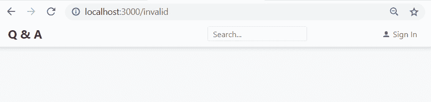
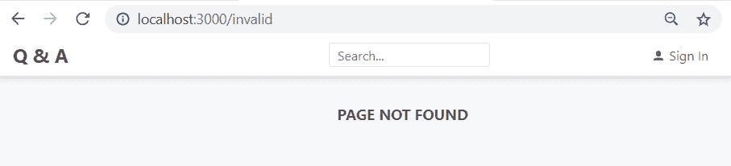
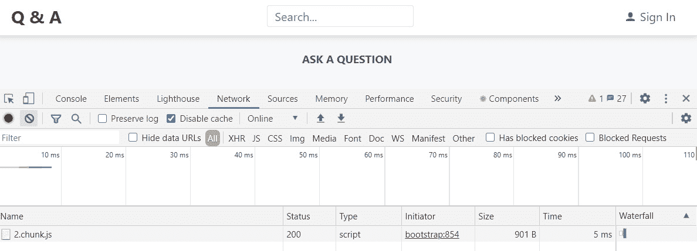
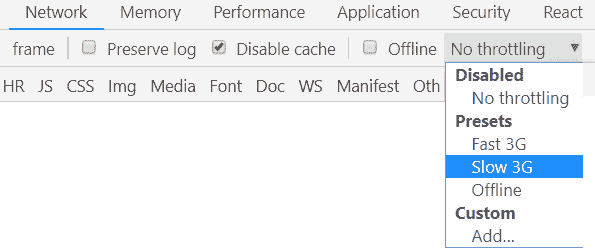

# *第 5 章*：使用 React 路由器进行路由

到目前为止，我们的 Q&A 应用程序只包含一个页面，所以是时候向该应用程序添加更多页面了。在[*第 1 章*](01.html#_idTextAnchor020)*理解 ASP.NET 5 React 模板*中，我们了解到**单页应用程序**（**SPA**中的页面是在浏览器中构建的，不需要向服务器发送任何 HTML 请求。

React Router 是一个很棒的库，它可以帮助我们实现客户端页面以及它们之间的导航。因此，我们将在本章中把它引入我们的项目中。

在本章中，我们将声明性地定义应用程序中可用的路由。我们学习如何在用户导航到不存在的路径时向他们提供反馈。我们将实现一个页面，显示问题的详细信息及其答案。这是我们将学习如何实现路由参数的地方。我们将从实现问题搜索功能开始，在这里我们将学习如何处理查询参数。我们还将开始实现用于提问的页面，并对其进行优化，使其 JavaScript 按需加载，而不是在应用加载时加载。

本章将介绍以下主题：

*   安装 React 路由器
*   申报路线
*   未找到处理路线
*   实施链接
*   使用路线参数
*   使用查询参数
*   延迟加载路径

# 技术要求

在本章中，我们将使用以下工具：

*   **Visual Studio 代码**：我们将使用它来编辑我们的 React 代码。可从[下载 https://code.visualstudio.com/](https://code.visualstudio.com/) 。如果您已经安装了它，请确保它至少是 1.52 版。
*   **Node.js 和 npm**：可从[下载 https://nodejs.org/](https://nodejs.org/) 。如果已经安装了这些，请确保 Node.js 至少为 8.2 版，npm 至少为 5.2 版。
*   **Q&A**：我们将从本章的 Q&A 前端启动器项目开始。这是我们在[*第四章*](04.html#_idTextAnchor081)中完成的项目*造型用情感反应组件*。这可在 GitHub 的[上获得 https://github.com/PacktPublishing/ASP.NET-Core-5-and-React-Second-Edition `chapter-05/start`文件夹中的](https://github.com/PacktPublishing/ASP.NET-Core-5-and-React-Second-Edition)。

本章中的所有代码片段可在网上[找到 https://github.com/PacktPublishing/ASP.NET-Core-5-and-React-Second-Edition](https://github.com/PacktPublishing/ASP.NET-Core-5-and-React-Second-Edition) 。为了从章节中恢复代码，可以下载源代码存储库，并在相关编辑器中打开相关文件夹。如果代码为前端代码，则可在终端中输入`npm install`恢复依赖关系。

查看以下视频以查看代码的运行：[http://bit.ly/34XoKyz](http://bit.ly/34XoKyz )

# 安装 React 路由器

在本节中，我们将通过执行以下步骤来安装具有相应类型脚本的 React Router：

1.  Make sure the frontend project is open in Visual Studio Code and enter the following command to install React Router in the terminal:

    ```cs
    > npm install react-router-dom 
    ```

    重要提示

    确保已安装`react-router-dom`版本 6+，并在`package.json`中列出。如果已安装版本 5，则可通过运行`npm install react-router-dom@next`安装版本 6。

2.  React router has a peer dependency on the `history` package, so let's install this using the terminal as well:

    ```cs
    > npm install history
    ```

    对等依赖项是 npm 不会自动安装的依赖项。这就是为什么我们在项目中安装了它。

就这样简单又好！我们将在下一节开始在应用程序中声明路由。

# 申报航线

我们使用`BrowserRouter`、`Routes`和`Route`组件在应用程序中声明页面。`BrowserRouter`是执行页面间导航的顶级组件。页面路径在嵌套在`Routes`组件中的`Route`组件中定义。`Routes`组件决定应为当前浏览器位置呈现哪个`Route`组件。

我们将从创建空白页开始这一部分，我们最终将在本书中实现这些空白页。然后，我们将使用`BrowserRouter`、`Routes`和`Route`组件在我们的应用程序中声明这些页面。

## 创建一些空白页

让我们创建空白页面，用于登录、提问、查看搜索结果以及查看问题及其答案，具体步骤如下：

1.  Create a file called `SignInPage.tsx` with the following content:

    ```cs
    import React from 'react';
    import { Page } from './Page';
    export const SignInPage = () => (
      <Page title="Sign In">{null}</Page>
    );
    ```

    在这里，我们使用上一章中创建的`Page`组件创建了一个标题为**登录**的空页面。我们将对需要创建的其他页面使用类似的方法。

    请注意，我们目前正在`Page`组件的内容中呈现`null`。这是一种告诉 React to render nothing 的方法。

2.  创建一个名为`AskPage.tsx`的文件，内容如下：

    ```cs
    import React from 'react';
    import { Page } from './Page';
    export const AskPage = () => (
      <Page title="Ask a question">{null}</Page>
    );
    ```

3.  创建一个名为`SearchPage.tsx`的文件，其内容如下：

    ```cs
    import React from 'react';
    import { Page } from './Page';
    export const SearchPage = () => (
      <Page title="Search Results">{null}</Page>
    );
    ```

4.  创建一个名为`QuestionPage.tsx`的文件，其内容如下：

    ```cs
    import React from 'react';
    import { Page } from './Page';
    export const QuestionPage = () => (
      <Page>Question Page</Page>
    );
    ```

问题页面上的标题将采用不同的样式，这就是为什么我们不在`Page`组件上使用`title`道具的原因。我们只是暂时在页面上添加了一些文本，以便能够将此页面与其他页面区分开来。

这就是我们创建的页面。现在，是定义这些页面的所有路由的时候了。

## 创建包含路由的组件

我们将通过执行以下步骤来定义到我们创建的页面的所有路由：

1.  打开`App.tsx`并在现有`import`语句下添加以下`import`语句：

    ```cs
    import { BrowserRouter, Routes, Route } from 'react-router-dom';
    import { AskPage } from './AskPage';
    import { SearchPage } from './SearchPage';
    import { SignInPage } from './SignInPage';
    ```

2.  在`App`组件的 JSX 中，添加`BrowserRouter`作为最外层元素：

    ```cs
    <BrowserRouter>
      <div css={ ... } >
        <Header />
        <HomePage />
      </div>
    </BrowserRouter>
    ```

3.  Let's define the routes in our app under the `Header` component, replacing the previous reference to `HomePage`:

    ```cs
    <BrowserRouter>
      <div css={ ... } >
        <Header />
        <Routes>
          <Route path="" element={<HomePage/>} />
          <Route path="search" element={<SearchPage/>} />
          <Route path="ask" element={<AskPage/>} />
          <Route path="signin" element={<SignInPage/>} />
        </Routes>    
      </div>
    </BrowserRouter>
    ```

    每个路由在`Route`组件中定义，该组件定义了`element`道具中针对`path`道具中给定路径应呈现的内容。将渲染路径与浏览器位置最匹配的管线。

    例如，如果浏览器位置为[http://localhost:3000/search](http://localhost:3000/search) ，则第二个`Route`组件（将`path`设置为`"search"`的组件）将是最佳匹配。这意味着`SearchPage`组件被渲染。

    请注意，路径上不需要前面的斜杠（`/`，因为 React Router 默认执行相对匹配。

4.  通过在 Visual Studio 代码终端中输入`npm start`命令来运行应用程序。我们将看到主页呈现与以前一样，这非常好。
5.  现在，在浏览器位置路径的末尾输入`/search`：


图 5.1–搜索页面

在这里，我们可以看到 React Router 已经确定最佳匹配是路径为`"search"`的`Route`组件，因此呈现`SearchPage`组件。

也可以随意访问其他页面–它们现在将呈现良好效果。

这就是我们的基本路由配置。如果用户在浏览器中输入的路径在我们的应用程序中不存在，会发生什么情况？我们将在下一节中找到答案。

# 未找到处理路线

在本节中，我们将处理任何`Route`组件都无法处理的路径。通过以下步骤，我们将首先了解如果在浏览器中放置未处理的路径会发生什么：

1.  Enter a path that isn't handled in the browser and see what happens:

    

    图 5.2–未处理的路径

    因此，当我们浏览到一个不由`Route`组件处理的路径时，标题下不会呈现任何内容。如果我们仔细想想，这是有道理的。

2.  We'd like to improve the user experience of routes not found and inform the user that this is the case. Let's add the following highlighted route inside the `Routes` component:

    ```cs
    <Routes>
      <Route path="" element={<HomePage/>} />
      <Route path="search" element={<SearchPage/>} />
      <Route path="ask" element={<AskPage/>} />
      <Route path="signin" element={<SignInPage/>} />
      <Route path="*" element={<NotFoundPage/>} />
    </Routes>
    ```

    为了理解这是如何工作的，让我们再考虑一下`Routes`组件的作用–它呈现出与浏览器位置最匹配的`Route`组件。路径`*`将匹配任何浏览器位置，但不是非常具体。因此，`*`将不是`/`、`/search`、`/ask`或`/signin`浏览器位置的最佳匹配，但将捕获无效路由。

3.  `NotFoundPage`尚未实现，我们创建一个名为`NotFoundPage.tsx`的文件，内容如下：

    ```cs
    import React from 'react';
    import { Page } from './Page';
    export const NotFoundPage = () => (
      <Page title="Page Not Found">{null}</Page>
    );
    ```

4.  回到`App.tsx`，让我们导入`NotFoundPage`组件：

    ```cs
    import { NotFoundPage } from './NotFoundPage';
    ```

5.  现在，如果我们在浏览器中输入一个`/invalid`路径，我们将看到我们的`NotFoundPage`组件已经呈现：



图 5.3–未处理的路径

因此，一旦我们了解了`Routes`组件的工作原理，实现一个未找到的页面就非常容易了。我们只需在`Routes`组件内部使用路径为`*`的`Route`组件。

目前，我们正在通过手动更改浏览器中的位置来导航到应用程序中的不同页面。在下一节中，我们将学习如何实现链接以在应用程序本身中执行导航。

# 实施环节

在本节中，我们将使用 React Router 中的组件`Link`在点击应用标题中的应用名称时声明性地执行导航。然后，单击**提问**按钮进入提问页面时，我们将继续以编程方式执行导航。

## 使用链路组件

此时，当我们点击应用程序左上角的**Q 和**时，它正在执行一个 HTTP 请求，返回整个 React 应用程序，然后呈现主页。我们将通过使用 React 路由器的`Link`组件来改变这一点，以便在浏览器中进行导航，而无需 HTTP 请求。我们还将使用`Link`组件作为登录页面的链接。我们将通过执行以下步骤了解如何实现这一点：

1.  在`Header.tsx`中，从 React 路由器导入`Link`组件。在现有的`import`语句下放置以下行：

    ```cs
    import { Link } from 'react-router-dom';
    ```

2.  让我们将`Q & A`文本周围的锚定标记更改为`Link`元素。`href`属性也需要更改为`to`属性：

    ```cs
    <Link
     to="/"
      css={ ... }
    >
      Q & A
    </Link>
    ```

3.  我们还将登录链接更改为以下内容：

    ```cs
    <Link
     to="signin"
      css={ ... }
    >
      <UserIcon />
      <span>Sign In</span>
    </Link>
    ```

4.  如果我们转到 running 应用程序并单击**登录**链接，我们将看到登录页面。现在，点击应用程序标题中的**Q&A**。我们将被带回主页，就像我们想要的那样。
5.  再次执行*步骤 4*，但这次打开浏览器开发工具，查看**网络**选项卡。我们会发现，当点击**登录**和**Q&A**链接时，没有网络请求。

因此，`Link`组件是在 JSX 中声明性地提供客户端导航选项的一种好方法。我们在上一步中执行的任务确认，所有导航都在浏览器中进行，没有任何服务器请求，这对性能非常有利。

## 编程导航

有时，有必要以编程方式进行导航。单击**提问**按钮时，按照以下步骤以编程方式导航至提问页面：

1.  Import `useNavigate` from React Router into `HomePage.tsx`:

    ```cs
    import { useNavigate } from 'react-router-dom';
    ```

    这是一个钩子，它返回一个我们可以用来执行导航的函数。

2.  将`useNavigate`钩子分配给`handleAskQuestionClick`事件处理程序

    ```cs
    const navigate = useNavigate();
    const handleAskQuestionClick = () => {
      ...
    };
    ```

    前面名为`navigate`的函数
3.  在`handleAskQuestionClick`中，我们可以将`console.log`语句替换为导航：

    ```cs
    const handleAskQuestionClick = () => {
      navigate('ask');
    };
    ```

4.  在 running 应用程序中，如果我们尝试一下并单击**提问**按钮，它将成功导航到提问页面。

因此，我们可以使用`Link`组件以声明方式导航，并使用 React Router 中的`useNavigate`钩子以编程方式导航。我们将在下一节继续使用`Link`组件。

# 使用路线参数

在本节中，我们将定义一个`Route`组件，用于导航到问题页面。这将在路径的末尾包含一个名为`questionId`的变量，因此我们需要使用一个名为**的路由参数**。在本节中，我们还将实现更多的问题页面内容。

## 添加问题页面路径

让我们执行以下步骤来添加问题页面路径：

1.  在`App.tsx`中，导入我们在本章前面创建的`QuestionPage`组件：

    ```cs
    import { QuestionPage } from './QuestionPage';
    ```

2.  In the `App` component's JSX, add a `Route` component for navigation to the question page inside the `Routes` component just above the wildcard route:

    ```cs
    <Routes>
      …
      <Route path="questions/:questionId" 
     element={<QuestionPage />} />
      <Route path="*" element={<NotFoundPage/>} />
    </Routes>
    ```

    请注意，我们输入的路径末尾包含`:questionId`。

    重要提示

    路由参数在路径中定义，前面有一个冒号。然后，该参数的值可用于在`useParams`钩子中解构。

    `Route`组件可以放置在`Routes`组件内的任何位置。可以说，将通配符路由保留在底部更具可读性，因为这是最不特定的路径，因此将是最后一个要匹配的路径。

3.  我们转到`QuestionPage.tsx`并从 React 路由器

    ```cs
    import { useParams } from 'react-router-dom';
    ```

    导入`useParams`
4.  We can destructure the value of the `questionId` route parameter from the `useParams` hook:

    ```cs
    export const QuestionPage = () => {
      const { questionId } = useParams();
      return <Page>Question Page</Page>;
    };
    ```

    我们还将`QuestionPage`更改为具有显式返回语句。

5.  For now, we are going to output `questionId` on the page as follows in the JSX:

    ```cs
    <Page>Question Page {questionId}</Page>;
    ```

    我们将返回并全面实施[*第 6 章*](06.html#_idTextAnchor121)*中的问题页面，使用表单*。现在，我们将从`Question`组件链接到此页面。

6.  因此，在`Question.tsx`中，添加以下`import`语句来导入`Link`组件：

    ```cs
    import { Link } from 'react-router-dom';
    ```

7.  现在，我们可以在`Question`JSX 中的标题文本周围包装一个`Link`组件，同时指定导航到的路径：

    ```cs
    <div
      css={css`
        padding: 10px 0px;
        font-size: 19px;
      `}
    >
      <Link 
     css={css`
     text-decoration: none;
     color: ${gray2};
     `}
     to={`/questions/${data.questionId}`}
     >
        {data.title}
     </Link>
    </div>
    ```

8.  转到 running 应用程序并尝试点击**我应该使用哪个状态管理工具？**问题。它将成功导航到问题页面，显示正确的`questionId`：


图 5.4–带路线参数的问题页面

因此，我们通过在路由路径中使用冒号定义变量，然后使用`useParams`钩子拾取值来实现路由参数。

## 实现更多问题页面

让我们再执行一些步骤来进一步实现问题页面：

1.  In `QuestionsData.ts`, add a function that will simulate a web request to get a question:

    ```cs
    export const getQuestion = async (
      questionId: number
    ): Promise<QuestionData | null> => {
      await wait(500);
      const results 
        = questions.filter(q => q.questionId === 
           questionId);
      return results.length === 0 ? null : results[0];
    };
    ```

    我们已经使用数组`filter`方法为传入的`questionId`获取问题。

    请注意函数返回类型的类型注释。传入`Promise`泛型类型的类型为`Question | null`，称为**联合类型**。

    重要提示

    联合类型是一种机制，用于定义包含多个类型值的类型。如果我们将一个类型看作一组值，那么多个类型的并集与值集的并集是相同的。更多信息请访问[https://www.typescriptlang.org/docs/handbook/unions-and-intersections.html#union-类型](https://www.typescriptlang.org/docs/handbook/unions-and-intersections.html#union-types)。

    因此，函数应该异步返回一个`QuestionData`或`null`类型的对象。

2.  转到`QuestionPage.tsx`，我们导入刚才创建的函数，以及问题界面：

    ```cs
    import { QuestionData, getQuestion } from './QuestionsData';
    ```

3.  添加情感`import`语句，并从我们的标准颜色中导入一些灰色。在`QuestionPage.tsx`顶部添加以下行：

    ```cs
    /** @jsxImportSource @emotion/react */
    import { css } from '@emotion/react';
    import { gray3, gray6 } from './Styles';
    ```

4.  In the `QuestionPage` component, create a state for the question:

    ```cs
    export const QuestionPage = () => {
      const [
        question,
        setQuestion,
      ] = React.useState<QuestionData | null>(null);
      const { questionId } = useParams();
      return <Page>Question Page {questionId}</Page>;
    };
    ```

    我们将把问题存储在组件最初渲染时的状态中。

    请注意，我们正在为状态使用联合类型，因为在获取问题时，状态最初是`null`，如果找不到问题，状态也是`null`。

5.  We want to call the `getQuestion` function during the initial render, so let's call it inside a call to the `useEffect` hook:

    ```cs
    export const QuestionPage = () => {
      …
      const { questionId } = useParams();
      React.useEffect(() => {
        const doGetQuestion = async (
          questionId: number,
        ) => {
          const foundQuestion = await getQuestion(
            questionId,
          );
          setQuestion(foundQuestion);
        };
        if (questionId) {
          doGetQuestion(Number(questionId));
        }
      }, [questionId]);
      return ...
    };
    ```

    因此，当第一次呈现时，问题组件将获取问题并将其设置为导致组件第二次呈现的状态。请注意，我们使用`Number`构造函数将`questionId`从`string`转换为`number`。

    另外，请注意，`useEffect`函数中的第二个参数在数组中具有`questionId`。这是因为`useEffect`运行的函数（第一个参数）依赖于`questionId`值，如果该值发生变化，则应重新运行。如果没有提供`[questionId]`，它将进入无限循环，因为每次调用`setQuestion`，它都会导致重新渲染，如果没有`[questionId]`，它将始终重新运行该方法。

6.  Let's start to implement the JSX for the `QuestionPage` component by adding a container element for the page and the question title:

    ```cs
    <Page>
      <div
        css={css`
          background-color: white;
          padding: 15px 20px 20px 20px;
          border-radius: 4px;
          border: 1px solid ${gray6};
          box-shadow: 0 3px 5px 0 rgba(0, 0, 0, 0.16);
        `}
      >
        <div
          css={css`
            font-size: 19px;
            font-weight: bold;
            margin: 10px 0px 5px;
          `}
        >
          {question === null ? '' : question.title}
        </div>
      </div>
    </Page>
    ```

    在`question`状态设置完成之前，我们不会呈现标题。获取问题时，`question`状态为空，如果找不到问题，则状态为空。请注意，我们使用三重等于（`===`来检查`question`变量是否为`null`而不是双等于（`==`。

    重要提示

    当使用三重相等（`===`时，我们检查严格相等。这意味着我们要比较的类型和值必须相同。使用双等于（`==`时，不检查类型。通常，使用三重相等（`===`来执行严格的相等检查是一种良好的做法。

    如果我们查看 running 应用程序，我们将看到问题标题已呈现在一张漂亮的白卡中：

    

    图 5.5–问题页面标题

7.  Let's now implement the question content:

    ```cs
    <Page>
      <div ... >
        <div ... >
          {question === null ? '' : question.title}
        </div>
        {question !== null && (
          <React.Fragment>
            <p
              css={css`
                margin-top: 0px;
                background-color: white;
              `}
            >
              {question.content}
            </p>
          </React.Fragment>
        )}
      </div>
    </Page>
    ```

    因此，如果从获取的数据中设置了`question`状态，我们将在 JSX 中显示问题的输出内容。请注意，这是嵌套在`Fragment`组件中的。这是做什么用的？

    重要提示

    在 React 中，组件只能返回单个元素。此规则适用于条件呈现逻辑，其中只能呈现单个父元素。React`Fragment`允许我们绕过此规则，因为我们可以在其中嵌套多个元素，而无需创建 DOM 节点。

    如果我们尝试在短路操作符之后返回两个元素，我们可以看到`Fragment`解决的问题：

    

    图 5.6–反应碎片的原因

8.  让我们在`Fragment`：

    ```cs
    {question !== null && (
      <React.Fragment>
        <p ... >
          {question.content}
        </p>
        <div
          css={css`
            font-size: 12px;
            font-style: italic;
            color: ${gray3};
          `}
        >
          {`Asked by ${question.userName} on
      ${question.created.toLocaleDateString()} 
      ${question.created.toLocaleTimeString()}`}
        </div>
      </React.Fragment>
    )}
    ```

    中添加提问时间和提问者

现在，问题的所有细节将在问题页面上的跑步应用程序中呈现在一张漂亮的白卡中：


图 5.7–问题页面

因此，问题页面现在看起来不错。我们还没有给出任何答案，所以让我们接下来看看。

## 创建应答器列表组件

按照以下步骤创建一个将呈现答案列表的组件：

1.  Create a new file called `AnswerList.tsx` with the following `import` statements:

    ```cs
    /** @jsxImportSource @emotion/react */
    import { css } from '@emotion/react';
    import React from 'react';
    import { AnswerData } from './QuestionsData';
    import { Answer } from './Answer';
    import { gray5 } from './Styles';
    ```

    因此，我们将使用无序列表来呈现没有要点的答案。我们已经引用了一个组件`Answer`，稍后我们将在这些步骤中创建它。

2.  让我们定义接口，使其包含用于答案数组的`data`道具：

    ```cs
    interface Props {
      data: AnswerData[];
    }
    ```

3.  Let's create the `AnswerList` component, which outputs the answers:

    ```cs
    export const AnswerList = ({ data }: Props) => (
      <ul
        css={css`
          list-style: none;
          margin: 10px 0 0 0;
          padding: 0;
        `}
      >
        {data.map(answer => (
          <li
            css={css`
              border-top: 1px solid ${gray5};
            `}
            key={answer.answerId}
          >
            <Answer data={answer} />
          </li>
        ))}
      </ul>
    );
    ```

    每个答案都输出到`Answer`组件中的无序列表中，我们将在下一步实现该组件。

4.  让我们继续往下看，通过创建一个名为`Answer.tsx`的文件并使用以下`import`语句来实现组件：

    ```cs
    /** @jsxImportSource @emotion/react */
    import { css } from '@emotion/react';
    import React from 'react';
    import { AnswerData } from './QuestionsData';
    import { gray3 } from './Styles';
    ```

5.  `Answer`组件的接口将只包含应答数据：

    ```cs
    interface Props {
      data: AnswerData;
    }
    ```

6.  现在，`Answer`组件将简单地呈现答案内容，以及回答者和回答时间：

    ```cs
    export const Answer = ({ data }: Props) => (
      <div
        css={css`
          padding: 10px 0px;
        `}
      >
        <div
          css={css`
            padding: 10px 0px;
            font-size: 13px;
          `}
        >
          {data.content}
        </div>
        <div
          css={css`
            font-size: 12px;
            font-style: italic;
            color: ${gray3};
          `}
        >
          {`Answered by ${data.userName} on
          ${data.created.toLocaleDateString()} 
          ${data.created.toLocaleTimeString()}`}
        </div>
      </div>
    );
    ```

7.  现在我们回到`QuestionPage.tsx`并导入`AnswerList`：

    ```cs
    import { AnswerList } from './AnswerList';
    ```

8.  Now, we can add `AnswerList` to the `Fragment` element:

    ```cs
    {question !== null && (
      <React.Fragment>
        <p ... >
          {question.content}
        </p>
        <div ... >
          {`Asked by ${question.userName} on
      ${question.created.toLocaleDateString()} 
      ${question.created.toLocaleTimeString()}`}
        </div>
        <AnswerList data={question.answers} />
      </React.Fragment>
    )}
    ```

    如果我们查看`questions/1`问题页面上的 running 应用程序，我们会看到答案呈现得很好：


图 5.8–带答案的问题页面

这就完成了我们在本章问题页面上需要做的工作。但是，我们需要允许用户提交问题的答案，我们将在[*第 6 章*](06.html#_idTextAnchor121)、*处理表单*中介绍。

接下来，我们将了解如何使用 React Router 处理查询参数。

# 使用查询参数

查询参数是允许将其他参数传递到路径的 URL 的一部分。例如，`/search?criteria=typescript`有一个名为`criteria`的查询参数，其值为`typescript`。查询参数有时称为搜索参数。

在本节中，我们将在搜索页面上实现一个名为`criteria`的查询参数，该参数将驱动搜索。我们将在此过程中实现搜索页面。让我们执行以下步骤来执行此操作：

1.  We are going to start in `QuestionsData.ts` by creating a function to simulate a search via a web request:

    ```cs
    export const searchQuestions = async (
      criteria: string,
    ): Promise<QuestionData[]> => {
      await wait(500);
      return questions.filter(
        q =>
          q.title.toLowerCase()
            .indexOf(criteria.toLowerCase()) >= 0 ||
          q.content.toLowerCase()
            .indexOf(criteria.toLowerCase()) >= 0,
      );
    };
    ```

    因此，函数使用数组`filter`方法，并将标准与问题标题或内容的任何部分相匹配。

2.  Let's import this function, along with the other items we need, into `SearchPage.tsx`. Place these statements above the existing `import` statements in `SearchPage.tsx`:

    ```cs
    /** @jsxImportSource @emotion/react */
    import { css } from '@emotion/react'
    import { useSearchParams } from 'react-router-dom';
    import { QuestionList } from './QuestionList';
    import { searchQuestions, QuestionData } from './QuestionsData';
    ```

    React 路由器的`useSearchParams`钩子用于访问查询参数。

3.  Add an explicit `return` statement to the `SearchPage` component and destructure the object from `useSearchParams` that contains the search parameters:

    ```cs
    export const SearchPage = () => {
      const [searchParams] = useSearchParams();
      return (
        <Page title="Search Results">{null}</Page>
      );
    }; 
    ```

    `useSearchParams`钩子返回一个包含两个元素的数组。第一个元素是包含搜索参数的对象，第二个元素是更新查询参数的函数。我们只分解了代码中的第一个元素，因为我们不需要更新这个组件中的查询参数。

4.  我们现在将创建一些状态来保存搜索中匹配的问题：

    ```cs
    export const SearchPage = () => {
      const [searchParams] = useSearchParams();
      const [
        questions,
        setQuestions,
      ] = React.useState<QuestionData[]>([]);
      return … 
    };
    ```

5.  Next, we are going to get the `criteria` query parameter value:

    ```cs
    export const SearchPage = () => {
      const [searchParams] = useSearchParams();
      const [
        questions,
        setQuestions,
      ] = React.useState<QuestionData[]>([]);
      const search = searchParams.get('criteria') || "";
      return …
    };
    ```

    `searchParams`对象包含一个`get`方法，可用于获取查询参数的值。

6.  我们将在组件第一次呈现时以及当`search`变量使用`useEffect`钩子

    ```cs
    const search = searchParams.get('criteria') || '';
    React.useEffect(() => {
      const doSearch = async (criteria: string) => {
        const foundResults = await searchQuestions(
          criteria,
        );
        setQuestions(foundResults);
      };
      doSearch(search);
    }, [search]);
    ```

    更改时调用搜索
7.  我们现在可以在页面标题下呈现搜索条件。将`{null}`替换为突出显示的代码：

    ```cs
    <Page title="Search Results">
      {search && (
        <p
          css={css`
            font-size: 16px;
            font-style: italic;
            margin-top: 0px;
          `}
        >
          for "{search}"
        </p>
      )}
    </Page>
    ```

8.  The last task is to use the `QuestionList` component to render the questions that are returned from the search:

    ```cs
    <Page title="Search Results">
      {search && (
        <p ... >
          for "{search}"
        </p>
      )}
      <QuestionList data={questions} />
    </Page>
    ```

    我们的`QuestionList`组件现在用于具有不同数据源的主页和搜索页面。这个组件的可重用性已经成为可能，因为我们遵循了[*第 3 章*](03.html#_idTextAnchor057)*中简要提到的容器模式，即【React 和 TypeScript 入门】*。

9.  在 running 应用程序中，在浏览器中输入`/search?criteria=type`。搜索将被调用，结果将按预期呈现：


图 5.9–搜索结果

因此，React路由器中的`useSearchParams`钩子使得与查询参数的交互变得轻松愉快。

在[*第 6 章*](06.html#_idTextAnchor121)*处理表单*中，我们将把标题中的搜索框连接到我们的搜索表单。

在下一节中，我们将学习如何按需加载组件。

# 延迟装载路线

目前，我们应用程序的所有JavaScript 都是在应用程序首次加载时加载的。这对于小型应用程序来说很好，但对于大型应用程序来说，这可能会对性能产生负面影响。可能有一些在应用程序中很少使用的大页面，我们希望加载 JavaScript 以便按需使用。这个过程被称为延迟加载。

我们将在本节中延迟加载 ask 页面。延迟加载的用处不大，因为这可能是我们应用程序中的一个流行页面，但它将帮助我们了解如何实现这一点。让我们执行以下步骤：

1.  首先，我们将向`AskPage.tsx`：

    ```cs
    export const AskPage = () => <Page title="Ask a question" />;
    export default AskPage;
    ```

    中的`AskPage`组件添加一个默认导出
2.  打开`App.tsx`并删除`AskPage`组件的当前`import`语句。
3.  为 React:

    ```cs
    import React from 'react';
    ```

    添加一条`import`语句
4.  Add a new `import` statement for the `AskPage` component after all the other `import` statements:

    ```cs
    const AskPage = React.lazy(() => import('./AskPage'));
    ```

    这是文件中最后一条`import`语句，这一点很重要，因为否则，ESLint 可能会抱怨它下面的`import`语句位于模块主体中。

    React 中的`lazy`函数允许我们将*动态导入*作为常规组件呈现。动态导入为请求的模块返回一个承诺，该承诺在获取、实例化和评估模块后解析。

5.  So, the `AskPage` component is being loaded on demand now, but the `App` component is expecting this component to be loaded immediately. If we enter the `ask` path in the browser's address bar and press the *Enter* key, we may receive an error with a clue of how to resolve this:

    

    图 5.10–无悬念组件警告

6.  As suggested by the error message, we are going to use the `Suspense` component from React to resolve this issue. For `ask` `Route`, we wrap the `Suspense` component around the `AskPage` component:

    ```cs
    <Route
      path="ask"
      element={
        <React.Suspense
          fallback={
            <div
              css={css`
                margin-top: 100px;
                text-align: center;
              `}
            >
              Loading...
            </div>
          }
        >
          <AskPage />
        </React.Suspense>
      }
    />
    ```

    `Suspense``fallback`道具允许我们在`AskPage`加载时渲染组件。所以，我们正在呈现**加载。。。加载`AskPage`组件时的**消息。

7.  让我们转到主页上的 running 应用程序，按*F12*打开浏览器开发者工具。
8.  On the **Network** tab, let's clear the previous network activity by clicking the *no entry* icon. Then, if we click the **Ask a question** button, we will see confirmation that additional JavaScript has been downloaded in order to render the `AskPage` component:

    

    图 5.11–按需加载的 AskPage 组件

9.  The `AskPage` component loads so fast that we are unlikely to see the `Loading` component being rendered. In the Chrome browser developer tools, there is an option to simulate a **Slow 3G** network in the **Network** tab:

    

    图 5.12–慢速 3G 选项

10.  如果我们打开此功能，按主页上的*F5*再次加载应用程序，然后单击**提问**按钮，我们将看到**加载。。。**暂时呈现的消息：


图 5.13–悬念回退

在本例中，`AskPage`组件的大小很小，因此这种方法实际上不会对性能产生积极影响。但是，按需加载较大的组件确实可以提高性能，特别是在连接速度较慢的情况下。

# 总结

React Router 为我们提供了一套全面的组件，用于管理应用程序中页面之间的导航。我们了解到，顶级组件是`BrowserRouter`，它在其下方的`Routes`组件中查找`Route`组件，我们在其中定义应为某些路径呈现哪些组件。`Route`组件中与当前浏览器位置最匹配的`path`是渲染的组件。

`useParams`钩子让我们访问路由参数，`useSearchParams`钩子让我们访问查询参数。这些挂钩可用于组件树中`BrowserRouter`下的任何反应组件。

我们了解到，React`lazy`功能及其`Suspense`组件可用于用户很少使用的大型组件，以便按需加载它们。这有助于提高应用程序启动时间的性能。

在下一章中，我们将继续构建问答应用程序的前端，这一次将重点放在实现表单上。

# 问题

以下问题将巩固您在本章中刚刚学到的知识：

1.  We have the following routes defined:

    ```cs
    <BrowserRouter>
      <Routes>
        <Route path="search" element={<SearchPage/>} />
        <Route path="" element={<HomePage/>} />
      </Routes>
    </BrowserRouter>
    ```

    回答以下问题：

    *   在浏览器中输入`/`位置时，将呈现哪些组件？
    *   当在浏览器中输入`/search`位置时，情况如何？
2.  在我们的问答应用程序中，我们需要一个`/login`路径来导航到登录页面，以及`/signin`路径。我们如何实施这一点？
3.  We have the following routes defined:

    ```cs
    <BrowserRouter>
      <Routes>
        <Route path="search" element={<SearchPage/>} />
        <Route path="" element ={<HomePage/>} />
        <Route path="*" element={<NotFoundPage/>} />
      </Routes>
    </BrowserRouter>
    ```

    在浏览器中输入`/signin`位置时，将呈现哪个组件？

4.  We have the following route defined:

    ```cs
    <Route path="users/:userId" component={UserPage} />
    ```

    如何在组件中引用`userId`路由参数？

5.  如何从`/users?id=1`等路径获取`id`查询参数的值？
6.  We have an option that navigates to another page when clicked. The JSX for this option is as follows:

    ```cs
    <a href="/products">Products</a>
    ```

    此时，导航会发出服务器请求。我们如何改变这一点，使导航只在浏览器中进行？

7.  我们需要在流程完成时以编程方式导航到`/success`路径。我们怎样才能做到这一点？

# 答案

1.  当浏览器位置为`/`时呈现`HomePage`组件，当浏览器位置为`/search`时呈现`SearchPage`组件。
2.  为了使`/login`的路径能够呈现登录页面，我们可以定义一个额外的`Route`组件，如下所示：

    ```cs
    <Route path="signin" element={<SignInPage />} />
    <Route path="login" element={<SignInPage />} />
    ```

3.  将呈现`NotFoundPage`组件。
4.  我们可以使用`useParams`钩子参照`userId`路由参数如下：

    ```cs
    const { userId } = useParams();
    ```

5.  我们可以使用`useSearchParams`钩子引用`id`查询参数，如下所示：

    ```cs
    const [searchParams] = useSearchParams();
    const id = searchParams.get('id');
    ```

6.  可以使用`Link`组件，以便只在客户端

    ```cs
    <Link to="products">Products</Link>
    ```

    上进行导航
7.  In order to programmatically navigate, we first need to get a function from the `useNavigate` hook that can perform the navigation:

    ```cs
    const navigate = useNavigate();
    ```

    然后，我们可以在代码中的适当位置使用此功能导航到`/success`路径：

    ```cs
    navigate('success');
    ```

# 进一步阅读

以下是一些有用的链接，可用于了解有关本章所涵盖主题的更多信息：

*   **反应路由器**：[https://reacttraining.com/react-router](https://reacttraining.com/react-router )
*   **JavaScript 数组过滤器**：[https://developer.mozilla.org/en-US/docs/Web/JavaScript/Reference/Global_Objects/Array/filter](https://developer.mozilla.org/en-US/docs/Web/JavaScript/Reference/Global_Objects/Array/filter )
*   **类型脚本联合类型**：[https://www.typescriptlang.org/docs/handbook/advanced-types.html](https://www.typescriptlang.org/docs/handbook/advanced-types.html )
*   **反应片段**：[https://reactjs.org/docs/fragments.html](https://reactjs.org/docs/fragments.html)
*   **反应迟缓**：[https://reactjs.org/docs/code-splitting.html#reactlazy](https://reactjs.org/docs/code-splitting.html#reactlazy)