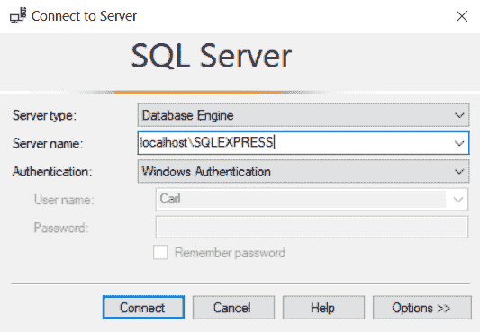
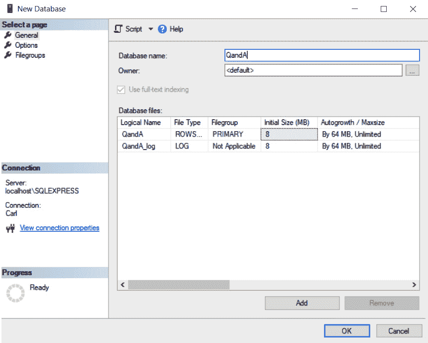
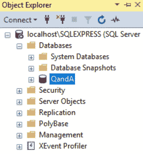
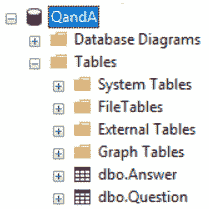
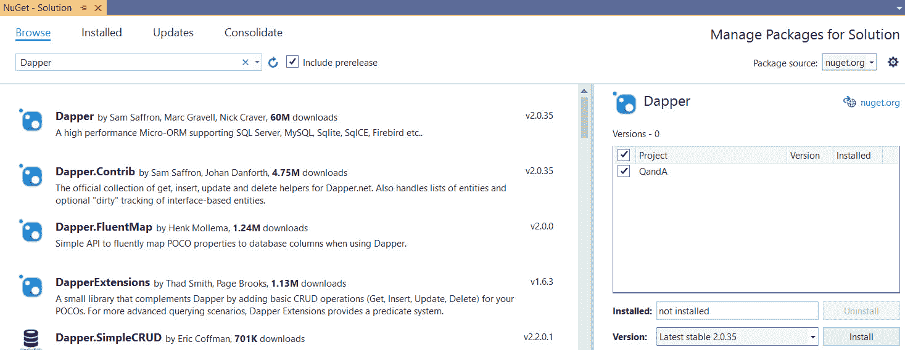
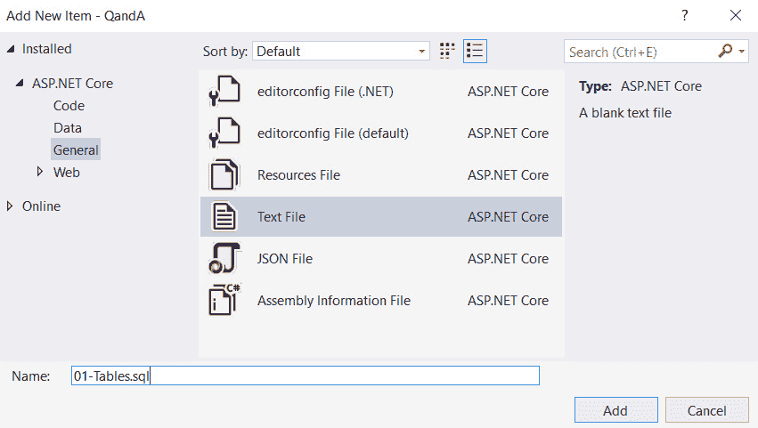
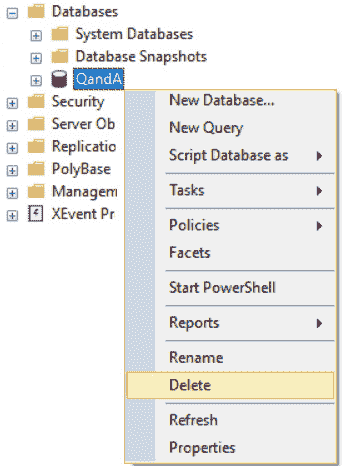
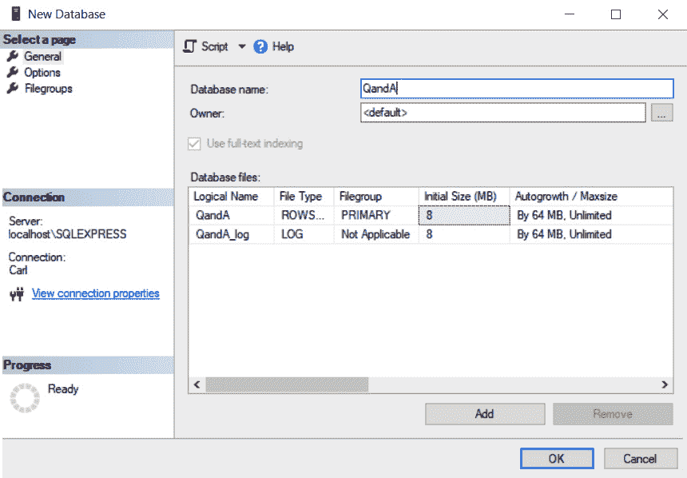
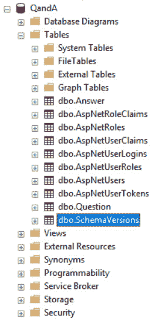
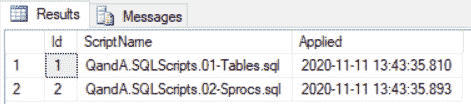

# 八、与数据库的交互

是时候开始我们问答应用的后端工作了。在本章中，我们将为应用构建数据库，并使用名为 Dapper 的库从 ASP.NET Core 与之交互。

我们将从了解什么是 Dapper 以及它给实体框架带来的好处开始。我们将通过学习如何使用 Dapper 将数据从数据库读入模型类，在应用中创建数据访问层。然后，我们将继续从模型类向数据库写入数据。

在我们的应用发布期间部署数据库更改是一项非常重要的任务。因此，在本章末尾，我们将使用一个名为`DbUp`的库来设置数据库迁移的管理。

在本章中，我们将介绍以下主题：

*   实现数据库
*   了解什么是 Dapper 及其好处
*   安装和配置 Dapper
*   使用 Dapper 读取数据
*   使用 Dapper 写入数据
*   使用`DbUp`管理迁移

到本章结束时，我们将创建一个 SQL Server 数据库，用于存储问题和答案以及与之交互的已实现性能数据层。

# 技术要求

在本章中，我们需要使用以下工具：

*   **Visual Studio 2019**：我们将使用它编辑我们的 ASP.NET Core代码。可从[下载并安装 https://visualstudio.microsoft.com/vs/](https://visualstudio.microsoft.com/vs/) 。
*   **.NET 5.0**：可从[下载 https://dotnet.microsoft.com/download/dotnet/5.0](https://dotnet.microsoft.com/download/dotnet/5.0) 。
*   **SQL Server 2019 速成版**：我们将使用它作为我们的数据库。可从[下载并安装 https://www.microsoft.com/en-gb/sql-server/sql-server-editions-express](https://www.microsoft.com/en-gb/sql-server/sql-server-editions-express) 。
*   **SQL Server Management Studio**：我们将使用它来创建数据库。可从[下载并安装 https://docs.microsoft.com/en-us/sql/ssms/download-sql-server-management-studio-ssms](https://docs.microsoft.com/en-us/sql/ssms/download-sql-server-management-studio-ssms) 。
*   **Q 和 A**：我们将从[*第 2 章*](02.html#_idTextAnchor041)*创建解耦 React 和 ASP.NET 5 应用*中创建并完成的 QandA 后端项目开始。这可在 GitHub 的[上获得 https://github.com/PacktPublishing/ASP.NET-Core-5-and-React-Second-Edition](https://github.com/PacktPublishing/ASP.NET-Core-5-and-React-Second-Edition) 。

本章中的所有代码片段可在网上[找到 https://github.com/PacktPublishing/ASP.NET-Core-5-and-React-Second-Edition](https://github.com/PacktPublishing/ASP.NET-Core-5-and-React-Second-Edition) 。要从章节中还原代码，可以下载必要的源代码存储库，并在相关编辑器中打开相关文件夹。如果代码为前端代码，则可以在终端中输入`npm install`来恢复任何依赖关系。

查看以下视频以查看代码的运行：[http://bit.ly/2EVDsv6](http://bit.ly/2EVDsv6) 。

# 数据库的实现

在本节中，我们将为我们的 Q&a 应用创建一个 SQL Server 数据库。然后，我们将在数据库中创建存储问题和答案的表。之后，我们将创建存储过程来读取和写入这些表中的记录。

## 创建数据库

我们将使用**SQL Server Management Studio**（**SSMS**创建数据库，具体步骤如下：

1.  Open SSMS and connect to the SQL Server instance:

    

    图 8.1–连接到 SQL Server Express

2.  在**对象浏览器**中，右键点击**数据库**并点击**新数据库。。。**选项。
3.  Enter `QandA` for the name of the database and click **OK**:

    

    图 8.2–创建问答数据库

4.  一旦创建了数据库，我们将在**对象浏览器**中看到它的列表：



图 8.3–对象资源管理器中的问答数据库

又好又简单！我们将为下一节中的问题和答案创建数据库表。

## 创建数据库表

让我们在 SSMS 的新数据库中为用户、问题和答案创建一些表：

1.  复制[处 SQL 脚本的内容 https://github.com/PacktPublishing/ASP.NET-Core-5-and-React-Second-Edition/blob/master/chapter-08/start/backend/SQLScripts/01-Tables.sql](https://github.com/PacktPublishing/ASP.NET-Core-5-and-React-Second-Edition/blob/master/chapter-08/start/backend/SQLScripts/01-Tables.sql) 。
2.  在 SSMS 中，突出显示**QandA**数据库，单击工具栏上的**新建查询**创建新的 SQL 查询，并粘贴复制脚本的内容。
3.  点击工具栏上的**执行**选项或按*F5*执行查询。
4.  如果我们在**对象资源管理器**中的**表**下查看，应该会看到已经创建了几个表：



图 8.4–对象资源管理器中的问答数据库

这里已经创建了一个`Question`表。这包含已提出的问题，并包含以下字段：

*   一个名为`QuestionId`的基于整数的字段，它是基于 Unicode 的`Title`和`Content`字段的主键。
*   `UserId`和`UserName`字段，引用提出问题的用户。
*   一个名为`Created`的字段，它将保存提问的日期和时间。

还创建了一个`Answer`表。这包含问题的答案，并包含以下字段：

*   基于整数的`AnswerId`字段，是主键。
*   一个基于整数的`QuestionId`字段，引用正在回答的问题。
*   基于 Unicode 的`Content`字段。
*   `UserId`和`UserName`字段，引用回答问题的用户。
*   一个名为`Created`的字段，它将保存提交答案的日期和时间。

SQL 脚本添加了一些示例数据。如果我们右键点击**对象浏览器**中的**问题**表格，选择**编辑前 200 行**选项，我们将看到表格中的数据：


图 8.5–问答数据库中的问题

所以，我们现在有一个包含我们的表的数据库，并且有一些好的数据可以处理。

## 创建存储过程

让我们创建一些存储过程，我们的应用将使用这些存储过程与数据库表进行交互。

复制[处 SQL 脚本的内容 https://github.com/PacktPublishing/ASP.NET-Core-5-and-React-Second-Edition/blob/master/chapter-08/start/backend/SQLScripts/02-Sprocs.sql](https://github.com/PacktPublishing/ASP.NET-Core-5-and-React-Second-Edition/blob/master/chapter-08/start/backend/SQLScripts/02-Sprocs.sql) 。现在，按照以下步骤操作：

1.  点击**新建查询**新建 SQL 查询，粘贴复制脚本内容。
2.  点击工具栏上的**执行**选项。
3.  If we look under **Stored Procedures** under **Programmability** in **Object Explorer**, we should see that several stored procedures have been created:

    

    图 8.6–问答数据库中的存储过程

    我们将使用这些存储过程与 ASP.NET Core应用中的数据库进行交互。

4.  Before we finish this section, let's try to run one of the stored procedures. Click **New Query** to create a new SQL query and enter the following:

    ```cs
    EXEC dbo.Question_GetMany_BySearch @Search = 'type'
    ```

    因此，此 SQL 命令将通过传入带有`type`值的`@Search`参数来执行`Question_GetMany_BySearch`存储过程。此存储过程返回的问题在其内容的标题中具有`@Search`参数的值。

5.  点击工具栏上的**执行**选项。我们应该得到以下结果：


图 8.7–运行存储过程的结果

有了 SQL服务器数据库，我们现在可以将注意力转向 Dapper 了。

# 了解什么是 Dapper 及其好处

Dapper 是一个针对.NET 的以性能为中心的简单对象映射器，它帮助将 SQL 查询输出映射到 C#类的实例。它由 Stack Overflow 团队构建和维护，已作为开源发布，是 Microsoft 实体框架的流行替代方案。

那么，为什么要使用简洁而不是实体框架呢？实体框架的目标是抽象出数据库，因此它将学习 SQL 转换为实体框架特定的对象，如`DBSet`和`DataContext`。我们通常不使用实体框架编写 SQL，而是编写 LINQ 查询，通过实体框架将其转换为 SQL。

如果我们要实现一个服务于大量用户的大型数据库，实体框架可能是一个挑战，因为它生成的查询可能效率低下。我们需要很好地理解实体框架，使其具有可扩展性，这可能是一项重大投资。当我们发现实体框架查询速度较慢时，我们需要理解 SQL 以正确理解根本原因。因此，将时间投入到真正学好 SQL 而不是实体框架提供的抽象上是有意义的。此外，如果我们有一个拥有良好数据库和 SQL 技能的团队，那么不使用它们是没有意义的。

Dapper 比实体框架简单得多。在本章后面，我们将看到，我们只需几行 C#代码就可以从 SQL 数据库读取和写入数据。这允许我们与数据库中的存储过程进行交互，从而自动将 C#类实例与查询结果一起映射到 SQL 参数。在下一节中，我们将安装并开始使用 Dapper 访问数据。

# 安装和配置短节

在部分中，我们将安装并配置 Dapper。我们还将安装 Dapper 使用的 Microsoft SQL Server 客户端包。让我们执行以下步骤：

1.  Let's open the backend project in Visual Studio. Go to the **Tools** menu and then **NuGet Package Manager** and choose **Manage NuGet Packages for Solution...**.

    重要提示

    NuGet 是一个下载第三方和 Microsoft 库并管理对它们的引用的工具，以便可以轻松地更新库。

2.  在**浏览**选项卡上，在搜索框中输入`Dapper`。
3.  Select the **Dapper** package by Sam Saffron, Marc Gravell, and Nick Craver. Tick our project and click the **Install** button with the latest stable version selected. Refer to the following screenshot:

    

    图 8.8–在 NuGet manager 中安装 Dapper

    在 Dapper 可以下载并安装到我们的项目中之前，我们可能会被要求接受许可协议。

4.  Still in the NuGet package manager, search for the `Microsoft.Data.SqlClient` package and install the latest stable version. Refer to the following screenshot:

    

    图 8.9–安装 Microsoft.Data.Client

5.  Next, we are going to define a connection string in our ASP.NET Core project that goes to our database. In **Solution Explorer**, open up a file called `appsettings.json` to add a `ConnectionStrings` field that contains our connection string:

    ```cs
    {
      "ConnectionStrings": {
     "DefaultConnection": 
     "Server=localhost\\SQLEXPRESS;Database=QandA;
     Trusted_Connection=True;"
     },
      ...
    }
    ```

    重要提示

    `appsettings.json`文件是一个 JSON 格式的文件，包含 ASP.NET Core应用的各种配置设置。

显然，更改连接字符串，使其引用 SQL Server 和数据库。

这就是安装的 Dapper以及到位置的数据库的连接字符串。接下来，我们将学习如何使用 Dapper 从数据库中读取数据。

# 使用简洁的方式读取数据

在部分中，我们将编写一些从数据库读取数据的 C#代码。

我们将使用流行的存储库设计模式来构造数据访问代码。这将允许我们对数据层提供一个很好的、集中的抽象。

我们将首先创建一个数据存储库类，该类将保存我们将对数据进行的所有查询。我们将创建 C#类，这些类保存我们从数据库获得的数据，称为模型。

我们将实现获取所有问题、从搜索中获取问题、获取未回答的问题、获取单个问题、获取说明问题是否存在的信息以及获取答案的方法。

## 创建存储库类

让我们创建一个类，它将保存与数据库交互的所有方法：

1.  在**解决方案浏览器**中，右键点击我们的项目，选择**添加**菜单，然后选择**新建文件夹**选项。
2.  将在解决方案树中创建一个新文件夹。将文件夹命名为`Data`。
3.  右键点击`Data`文件夹，选择**添加**菜单。然后，选择**类。。。**选项。
4.  在出现的对话框中，输入`DataRepository`作为文件名，然后单击**添加**按钮。
5.  A skeleton `DataRepository` class will be created:

    

    图 8.10–骨架数据存储库类

6.  现在，我们将为数据存储库创建一个接口，以便在编写单元测试时对其进行模拟。右键点击`Data`文件夹，选择**添加**菜单。然后，选择**类。。。**选项。
7.  这一次，在出现的对话框中选择**界面**选项，并将其命名为`IDataRepository`，然后按下**添加**按钮。
8.  Change the modifier for the interface to `public` and add the following methods:

    ```cs
    public interface IDataRepository
    {
      IEnumerable<QuestionGetManyResponse> GetQuestions();
     IEnumerable<QuestionGetManyResponse> 
     GetQuestionsBySearch(string search);
     IEnumerable<QuestionGetManyResponse> 
     GetUnansweredQuestions();
     QuestionGetSingleResponse 
     GetQuestion(int questionId);
     bool QuestionExists(int questionId);
     AnswerGetResponse GetAnswer(int answerId);
    }
    ```

    在这里，我们将在数据存储库中有六个方法，它们将从我们的数据库中读取不同的数据位。请注意，由于我们引用的是不存在的类，所以这还不能编译。

9.  回到`DataRepository.cs`，指定类必须实现我们刚刚创建的接口：

    ```cs
    public class DataRepository: IDataRepository
    {
    }
    ```

10.  If we click on the class name, a light bulb icon will appear. Click on the light bulb menu and choose **Implement interface**:

    

    图 8.11–自动实现 IDataRepository 接口

    骨架方法将添加到满足接口的 repository 类中。

11.  Create a class-level private variable called `_connectionString` that will store the database connection string:

    ```cs
    public class DataRepository : IDataRepository
    {
      private readonly string _connectionString;
      ...
    }
    ```

    重要提示

    `readonly`关键字防止在类构造函数之外更改变量，这就是我们在本例中想要的。

12.  Let's create a constructor for the repository class that will set the value of the connection string from the `appsettings.json` file:

    ```cs
    public class DataRepository : IDataRepository
    {
      private readonly string _connectionString;
      public DataRepository(IConfiguration configuration)
     {
     _connectionString = 
     configuration["ConnectionStrings:DefaultConnection"];
     }
      ...
    }
    ```

    构造函数中的`configuration`参数允许我们访问`appsettings.json`文件中的项目。访问`configuration`对象时使用的键是从`appsettings.json`文件中指向所需项的路径，冒号用于在 JSON 中导航字段。

    `configuration`参数是如何传递给构造函数的？答案是依赖注入，我们将在下一章中介绍。

13.  我们班还不认识`IConfiguration`，所以，让我们点击它，点击出现的灯泡菜单，然后使用 Microsoft.Extensions.Configuration 选择**；**：


图 8.12–引用 Microsoft.Extensions.Configuration 命名空间

我们在 repository课程上有了一个良好的开端。我们确实有编译错误，但当我们完全实现这些方法时，这些错误就会消失。

## 创建存储库方法获取问题

我们先来实施的`GetQuestions`方法：

1.  让我们在 Microsoft SQL 客户端库的文件顶部添加两个`using`语句，以及简洁的：

    ```cs
    using Microsoft.Data.SqlClient;;
    using Dapper;
    ```

2.  In the `GetQuestions` method, overwrite the statement that throws a `NotImplementedException` by declaring a new database connection:

    ```cs
    public IEnumerable<QuestionGetManyResponse> GetQuestions()
    {
     using (var connection = new
     SqlConnection(_connectionString))
     {

     }
    }
    ```

    请注意，我们使用了一个`using`块来声明数据库连接。

    重要提示

    当程序退出块的作用域时，`using`块自动处理块中定义的对象。这包括是否在块内调用了`return`语句，以及块内发生的错误。

    因此，`using`语句是确保连接被处理的方便方法。请注意，我们使用的是来自 Microsoft SQL 客户机库的`SqlConnection`，因为这是 Dapper 库的扩展。

3.  接下来，让我们打开连接：

    ```cs
    public IEnumerable<QuestionGetManyResponse> GetQuestions()
    {
      using (var connection = new 
        SqlConnection(_connectionString))
      {
        connection.Open();
      }
    }
    ```

4.  Now, we can execute the query:

    ```cs
    public IEnumerable<QuestionGetManyResponse> GetQuestions()
    {
      using (var connection = new
        SqlConnection(_connectionString))
      {
        connection.Open();
        return connection.Query<QuestionGetManyResponse>(
     @"EXEC dbo.Question_GetMany"
     );
     }
    }
    ```

    我们在`connection`对象上使用了 Dapper 的`Query`扩展方法来执行`Question_GetMany`存储过程。然后，我们只需从方法返回此查询的结果。好简单！

    注意我们如何将类`QuestionGetManyResponse`传递到`Query`方法的泛型参数中。这定义了查询结果应存储在其中的模型类。我们将在下一步中定义`QuestionGetManyResponse`。

5.  在**解决方案浏览器**中，右键点击`Data`文件夹，选择**添加**，然后选择**新建文件夹**选项。输入`Models`作为新文件夹的名称。我们将把所有的模型都放在这里。
6.  在**解决方案浏览器**中，右键点击**模型**文件夹，选择**添加**。然后，选择**类。。。**选项。
7.  在出现的对话框中，输入`QuestionGetManyResponse`作为将要创建的文件的名称，然后单击**添加**按钮。将为我们创建一个骨架类。
8.  Add the following properties to the class:

    ```cs
    public class QuestionGetManyResponse
    {
      public int QuestionId { get; set; }
     public string Title { get; set; }
     public string Content { get; set; }
     public string UserName { get; set; }
     public DateTime Created { get; set; }
    }
    ```

    属性名称与从`Question_GetMany`存储过程输出的字段匹配。这允许 Dapper 自动将数据库中的数据映射到此类。还仔细选择了属性类型，以便此简洁的映射过程能够正常工作。

    重要提示

    请注意，该类不需要包含存储过程输出的所有字段的属性。Dapper 将忽略类中没有相应属性的字段。

9.  回到`DataRepository.cs`，添加`using`语句，以便类可以访问模型：

    ```cs
    using QandA.Data.Models;
    ```

10.  我们还要将这个`using`语句添加到`IDataRepository.cs`：

    ```cs
    using QandA.Data.Models;
    ```

    中

祝贺您–我们已经实现了第一个存储库方法！这只包括几行代码，它们打开了数据库连接并执行了查询。这向我们展示了用 Dapper 编写数据访问代码是非常简单的。

## 创建存储库方法，通过搜索获取问题

让我们实现方法，类似于`GetQuestions`方法，但是这次方法和存储过程都有一个参数。让我们执行以下步骤：

1.  开始创建和打开连接的方式与我们实现上一个方法时的方式相同：

    ```cs
    public IEnumerable<QuestionGetManyResponse> GetQuestionsBySearch(string search)
    {
      using (var connection = new 
     SqlConnection(_connectionString))
     {
     connection.Open();
     // TODO - execute Question_GetMany_BySearch stored
     // procedure
     }
    }
    ```

2.  现在，我们可以执行`Question_GetMany_BySearch`存储过程：

    ```cs
    public IEnumerable<QuestionGetManyResponse> GetQuestionsBySearch(string search)
    {
      using (var connection = new SqlConnection(_connectionString))
      {
        connection.Open();
        return connection.Query<QuestionGetManyResponse>(
     @"EXEC dbo.Question_GetMany_BySearch @Search = 
     @Search", 
     new { Search = search }
     );
      }
    }
    ```

注意我们如何传入存储过程参数值。

重要提示

参数值通过一个对象传递到 Dapper 查询，该对象的属性名与参数名匹配。然后 Dapper 将创建并执行一个参数化查询。

在本例中，我们使用一个匿名对象作为参数来保存我们为该对象定义的类。

为什么我们必须将参数传递给 Dapper？为什么我们不能做下面的事情？

```cs
return connection.Query<QuestionGetManyResponse>($"EXEC dbo.Question_GetMany_BySearch '{search}'");
```

嗯，有几个原因，但主要原因是前面的代码容易受到 SQL 注入攻击。因此，最好将参数传递到 Dapper而不是中，而不是自己构造 SQL。

这是我们完成的第二个存储库方法。好简单！

## 创建存储库方法以获取未回答的问题

让我们来实现的`GetUnansweredQuestions`方法，它与`GetQuestions`方法非常相似：

```cs
public IEnumerable<QuestionGetManyResponse> GetUnansweredQuestions()
{
  using (var connection = new 
    SqlConnection(_connectionString))
  {
    connection.Open();
    return connection.Query<QuestionGetManyResponse>(
      "EXEC dbo.Question_GetUnanswered"
    );
  }
}
```

在这里，我们打开了连接，执行了`Question_GetUnanswered`存储过程，并在我们已经创建的`QuestionGetManyResponse`类中返回了结果。

## 创建存储库方法以获取单个问题

现在让我们实施的`GetQuestion`方法：

1.  Start by opening the connection and executing the `Question_GetSingle` stored procedure:

    ```cs
    public QuestionGetSingleResponse GetQuestion(int questionId)
    {
      using (var connection = new 
     SqlConnection(_connectionString))
     {
     connection.Open();
     var question = 
     connection.QueryFirstOrDefault<
     QuestionGetSingleResponse>(
     @"EXEC dbo.Question_GetSingle @QuestionId = 
     @QuestionId", 
     new { QuestionId = questionId }
     );
        // TODO - Get the answers for the question
     return question;
     }
    }
    ```

    此方法与之前的方法稍有不同，因为我们使用`QueryFirstOrDefault`Dapper 方法返回单个记录（如果未找到记录，则返回`null`，而不是记录集合。

2.  我们需要执行第二个存储过程来获取问题的答案，现在我们就这样做：

    ```cs
    public QuestionGetSingleResponse GetQuestion(int questionId)
    {
      using (var connection = new
        SqlConnection(_connectionString))
      {
        connection.Open();
        var question = 
          connection.QueryFirstOrDefault<
             QuestionGetSingleResponse>(
            @"EXEC dbo.Question_GetSingle @QuestionId = 
              @QuestionId", 
            new { QuestionId = questionId }
          );
        question.Answers = 
     connection.Query<AnswerGetResponse>(
     @"EXEC dbo.Answer_Get_ByQuestionId 
     @QuestionId = @QuestionId", 
     new { QuestionId = questionId }
     );
        return question;
      }
    }
    ```

3.  问题可能找不到，返回`null`，所以我们来处理这个案例，只有找到问题时才添加答案：

    ```cs
    public QuestionGetSingleResponse GetQuestion(int questionId)
    {
      using (var connection = new
        SqlConnection(_connectionString))
      {
        connection.Open();
        var question = 
          connection.QueryFirstOrDefault<
            QuestionGetSingleResponse>(
            @"EXEC dbo.Question_GetSingle @QuestionId = 
              @QuestionId", 
            new { QuestionId = questionId }
          );
        if (question != null)
     {
          question.Answers = 
            connection.Query<AnswerGetResponse>(
              @"EXEC dbo.Answer_Get_ByQuestionId 
                @QuestionId = @QuestionId", 
              new { QuestionId = questionId }
            );
        }
        return question;
      }
    }
    ```

4.  Let's create the `QuestionGetSingleResponse` class we referenced in the method in a file called `QuestionGetSingleResponse.cs` in the `Models` folder:

    ```cs
    public class QuestionGetSingleResponse
    {
      public int QuestionId { get; set; }
      public string Title { get; set; }
      public string Content { get; set; }
      public string UserName { get; set; }
      public string UserId { get; set; }
      public DateTime Created { get; set; }
      public IEnumerable<AnswerGetResponse> Answers { get; set; }
    }
    ```

    这些属性与从`Question_GetSingle`存储过程返回的数据匹配。

5.  Let's also create the `AnswerGetResponse` class we referenced in the method in a file called `AnswerGetResponse.cs` in the `Models` folder:

    ```cs
    public class AnswerGetResponse
    {
      public int AnswerId { get; set; }
      public string Content { get; set; }
      public string UserName { get; set; }
      public DateTime Created { get; set; }
    }
    ```

    这些属性与从`Answer_Get_ByQuestionId`存储过程返回的数据匹配。

`GetQuestion`方法现在应该编译良好。

## 创建存储库方法检查是否存在问题

现在，让我们按照与前面方法相同的方法来实现的方法：

```cs
public bool QuestionExists(int questionId)
{
  using (var connection = new 
 SqlConnection(_connectionString))
 {
 connection.Open();
 return connection.QueryFirst<bool>(
 @"EXEC dbo.Question_Exists @QuestionId = 
 @QuestionId", 
 new { QuestionId = questionId }
 );
 }
}
```

我们使用的是简洁的`QueryFirst`方法，而不是`QueryFirstOrDefault`，因为存储过程总是返回一条记录。

## 创建存储库方法以获取答案

本节我们将实施的最后一种方法是`GetAnswer`：

```cs
public AnswerGetResponse GetAnswer(int answerId)
{
  using (var connection = new
 SqlConnection(_connectionString))
 {
 connection.Open();
 return connection.QueryFirstOrDefault<
 AnswerGetResponse>(
 @"EXEC dbo.Answer_Get_ByAnswerId @AnswerId = 
 @AnswerId", 
 new { AnswerId = answerId }
 );
 }
}
```

这里没有什么新东西——实现遵循与前面的方法相同的模式。

我们现在已经实现了数据存储库中用于读取数据的所有方法。在下一节中，我们将把注意力转向编写数据。

# 使用简洁的方式写入数据

在本节中，我们将在数据存储库中实现写入数据库的方法。我们将首先扩展存储库的接口，然后进行实际实现。

执行写入操作的存储过程已在数据库中。我们将使用 Dapper 与这些存储过程交互。

## 添加向存储库接口写入数据的方法

我们将在开始时向存储库界面添加必要的方法：

```cs
public interface IDataRepository
{
  ...
  QuestionGetSingleResponse 
 PostQuestion(QuestionPostRequest question);
 QuestionGetSingleResponse 
 PutQuestion(int questionId, QuestionPutRequest 
 question);
 void DeleteQuestion(int questionId);
 AnswerGetResponse PostAnswer(AnswerPostRequest answer);
}
```

在这里，我们必须实现一些添加、更改和删除问题以及添加答案的方法。

## 创建存储库方法以添加新问题

让我们在`DataRepository.cs`中创建方法，添加一个新问题：

```cs
public QuestionGetSingleResponse PostQuestion(QuestionPostRequest question)
{
  using (var connection = new 
    SqlConnection(_connectionString))
  {
    connection.Open();
    var questionId = connection.QueryFirst<int>(
      @"EXEC dbo.Question_Post 
        @Title = @Title, @Content = @Content, 
        @UserId = @UserId, @UserName = @UserName, 
        @Created = @Created", 
      question
    );
    return GetQuestion(questionId);
  }
}
```

这与读取数据的方法非常相似。我们使用的是`QueryFirst`Dapper 方法，因为存储过程在将新问题插入数据库表后返回其 ID。我们的方法通过调用从`Question_Post`存储过程返回的带有`questionId`的`GetQuestion`方法来返回保存的问题。

我们已经为 Dapper 使用了一个名为`QuestionPostRequest`的模型类来映射到 SQL 参数。让我们在`models`文件夹中创建这个类：

```cs
public class QuestionPostRequest
{
  public string Title { get; set; }
  public string Content { get; set; }
  public string UserId { get; set; }
  public string UserName { get; set; }
  public DateTime Created { get; set; }
}
```

好东西！这是我们创建的第一个 write 方法。

## 创建存储库方法以更改问题

让我们在`DataRepository.cs`中创建这个`PutQuestion`方法来改变一个问题。这与我们刚刚实现的`PostQuestion`方法非常相似：

```cs
public QuestionGetSingleResponse PutQuestion(int questionId, QuestionPutRequest question)
{
  using (var connection = new SqlConnection(_connectionString))
  {
    connection.Open();
    connection.Execute(
      @"EXEC dbo.Question_Put 
        @QuestionId = @QuestionId, @Title = @Title,
         @Content = @Content", 
      new { QuestionId = questionId, question.Title, 
       question.Content }
    );
    return GetQuestion(questionId);
  }
}
```

请注意，我们使用的是Dapper`Execute`方法，因为我们只是执行一个存储过程，不返回任何内容。

我们已经从名为`QuestionPutRequest`的模型类和传递到方法中的`questionId`参数创建了 SQL 参数。让我们在`models`文件夹中创建`QuestionPutRequest`类：

```cs
public class QuestionPutRequest
{
  public string Title { get; set; }
  public string Content { get; set; }
}
```

这是实现的另一种方法。

## 创建存储库方法删除问题

继续，让我们实现一个删除问题的方法：

```cs
public void DeleteQuestion(int questionId)
{
  using (var connection = new 
    SqlConnection(_connectionString))
  {
    connection.Open();
    connection.Execute(
      @"EXEC dbo.Question_Delete 
        @QuestionId = @QuestionId", 
      new { QuestionId = questionId }
    );
  }
}
```

同样，我们使用的是 Dapper`Execute`方法，因为存储过程没有返回任何内容。

## 创建存储库方法以添加答案

我们将要实施的最后一个方法将允许我们添加一个问题的答案：

```cs
public AnswerGetResponse PostAnswer(AnswerPostRequest answer)
{
  using (var connection = new
    SqlConnection(_connectionString))
  {
    connection.Open();
    return connection.QueryFirst<AnswerGetResponse>(
      @"EXEC dbo.Answer_Post 
        @QuestionId = @QuestionId, @Content = @Content, 
        @UserId = @UserId, @UserName = @UserName,
        @Created = @Created", 
      answer
    );
  }
}
```

除了将答案插入数据库表之外，存储过程还返回保存的答案。这里，我们使用 Dapper`QueryFirst`方法执行存储过程并返回保存的答案。

我们还需要在`models`文件夹中创建`AnswerPostRequest`模型类：

```cs
public class AnswerPostRequest
{
  public int QuestionId { get; set; }
  public string Content { get; set; }
  public string UserId { get; set; }
  public string UserName { get; set; }
  public DateTime Created { get; set; }
}
```

完成了我们的数据存储库。我们选择了一个包含所有读写数据的方法的方法。当然，我们可以为数据库的不同区域创建多个存储库，如果应用更大，这将是一个好主意。

当我们向应用添加涉及数据库更改的功能时，我们需要一种机制来部署这些数据库更改。我们将在下一节中介绍这一点。

# 使用 DbUp 管理迁移

DbUp 是一个开放的源代码库，帮助我们将更改部署到 SQL Server 数据库。它跟踪 ASP.NET Core项目中嵌入的 SQL 脚本，以及在数据库上执行的脚本。它包含一些方法，我们可以使用这些方法来执行尚未在数据库上执行的 SQL 脚本。

在本节中，我们将向项目中添加 DbUp，并将其配置为在应用启动时执行数据库迁移。

## 将 DbUp 安装到我们的项目中

让我们从在 Visual Studio 中的后端项目中执行以下步骤开始安装 DbUp：

1.  进入**工具**菜单，然后进入**NuGet Package Manager**。然后，选择**管理解决方案的 NuGet 包。。。**。
2.  在**浏览**选项卡上，在搜索框中输入`DbUp`。
3.  选择 Paul Stovell、Jim Burger、Jake Ginnivan 和 Damian Maclennan 的**dbup**套餐。勾选我们的项目，点击**安装**按钮，选择最新稳定版本：


图 8.13–在 NuGet Manager 中添加 DbUp

在我们的项目中下载和安装 DbUp 之前，可能会要求我们接受许可协议。

配置 DbUp 以在应用启动时执行迁移

现在我们已经在项目中安装了 DbUp，让它在应用启动时进行数据库迁移：

1.  打开`Startup.cs`。从[*第 1 章*](01.html#_idTextAnchor020)*了解 ASP.NET 5 React 模板*可知，当 ASP.NET Core应用运行时，此文件中的代码执行。我们将首先添加一个`using`语句，以便可以引用`DbUp`库：

    ```cs
    using DbUp;
    ```

2.  At the top of the `ConfigureServices` method, add the following two lines:

    ```cs
    public void ConfigureServices(IServiceCollection services)
    {
      var connectionString = 
     Configuration.GetConnectionString("DefaultConnection");

     EnsureDatabase.For.SqlDatabase(connectionString); 
      // TODO - Create and configure an instance of the
        // DbUp upgrader
      // TODO - Do a database migration if there are any 
         // pending SQL 
      //Scripts
      ...
    }
    ```

    这将从`appsettings.json`文件获取数据库连接，并在数据库不存在时创建数据库。

3.  Let's create and configure an instance of the `DbUp` upgrader:

    ```cs
    public void ConfigureServices(IServiceCollection services)
    {
      var connectionString = 
        Configuration.GetConnectionString("DefaultConnection");

      EnsureDatabase.For.SqlDatabase(connectionString); 
      var upgrader = DeployChanges.To
     .SqlDatabase(connectionString, null) 
     .WithScriptsEmbeddedInAssembly(
     System.Reflection.Assembly.GetExecutingAssembly()
     )
     .WithTransaction()
     .Build();
      // TODO - Do a database migration if there are any pending SQL 
      //Scripts
      ...
    }
    ```

    我们已经告诉`DbUp`数据库在哪里，并寻找嵌入到我们项目中的 SQL 脚本。我们还告诉`DbUp`在事务中进行数据库迁移。

4.  最后一步是，如果存在任何挂起的 SQL 脚本，则让`DbUp`执行数据库迁移：

    ```cs
    public void ConfigureServices(IServiceCollection services)
    {
      var connectionString = 
        Configuration.GetConnectionString("DefaultConnection");
      EnsureDatabase.For.SqlDatabase(connectionString); 
      var upgrader = DeployChanges.To
        .SqlDatabase(connectionString, null)
        .WithScriptsEmbeddedInAssembly(
          System.Reflection.Assembly.GetExecutingAssembly()
        )
        .WithTransaction()
        .LogToConsole()
        .Build();
      if (upgrader.IsUpgradeRequired())
     {
     upgrader.PerformUpgrade();
     }

      ...
    }
    ```

我们在`DbUp`升级中使用`IsUpgradeRequired`方法检查是否有挂起的 SQL 脚本，并使用`PerformUpgrade`方法进行实际迁移。

## 在我们的项目中嵌入 SQL 脚本

在前面的小节中，我们告诉 DbUp 寻找嵌入到我们项目中的SQL 脚本。现在，我们将在项目中嵌入表和存储过程的 SQL 脚本，以便 DbUp 在应用加载时执行尚未执行的 SQL 脚本：

1.  在**解决方案资源管理器**中，右键点击项目，选择**添加【新文件夹】**。输入`SQLScripts`作为文件夹名称。
2.  右键点击`SQLScripts`文件夹，选择**添加|新项目。。。**。
3.  In the dialog box that appears, select the **General** tab and then **Text File** and enter `01-Tables.sql` as the filename:

    

    图 8.14–将 SQL 文件添加到 Visual Studio 项目

4.  从[复制脚本的内容 https://github.com/PacktPublishing/ASP.NET-Core-5-and-React-Second-Edition/blob/master/chapter-08/start/backend/SQLScripts/01-Tables.sql](https://github.com/PacktPublishing/ASP.NET-Core-5-and-React-Second-Edition/blob/master/chapter-08/start/backend/SQLScripts/01-Tables.sql) 并将其粘贴到我们刚刚创建的文件中。
5.  右键点击**解决方案资源管理器**中的**01-Tables.sql**，选择**属性**查看该文件的属性。
6.  Change the **Build Action** property to **Embedded resource**:

    

    图 8.15–将文件更改为嵌入式资源

    这将在我们的项目中嵌入SQL 脚本，以便`DbUp`可以找到它。

7.  Let's repeat this process for the stored procedures by creating a file called `02-Sprocs.sql` in the `SQLScripts` folder with the content from [https://github.com/PacktPublishing/ASP.NET-Core-5-and-React-Second-Edition/blob/master/chapter-08/start/backend/SQLScripts/02-Sprocs.sql](https://github.com/PacktPublishing/ASP.NET-Core-5-and-React-Second-Edition/blob/master/chapter-08/start/backend/SQLScripts/02-Sprocs.sql). Let's not forget to embed this file as a project resource.

    重要提示

    `DbUp`将按名称顺序运行 SQL 脚本，因此有一个脚本命名约定来满足这一点很重要。在我们的示例中，我们使用两位数作为脚本名称的前缀。

因此，这些是构成我们数据库的 SQL 脚本。它们已保存在我们的项目中。

## 执行数据库迁移

既然数据库迁移代码已经就绪，现在是测试迁移的时间了。为此，我们将删除数据库表和存储过程，并期望在 API 运行时重新创建它们。

让我们执行以下步骤：

1.  The database that we are working with already contains the tables and stored procedures in our scripts, so we are going to be brave and delete our database. In SSMS, in **Object Explorer**, right-click the database and choose **Delete**:

    

    图 8.16–删除数据库

2.  We are going to create the database again with the same name. So, in **Object Explorer**, right-click on **Databases** and click on the **New Database...** option. Enter `QandA` for the name of the database and click **OK**:

    

    图 8.17–添加数据库

3.  返回Visual Studio 中的，按*F5*运行应用。
4.  Once the app has started, go to SSMS. In **Object Explorer**, we'll see that the tables and stored procedures have been created. We'll also see a table called `SchemaVersions`:

    

    图 8.18–对象资源管理器中的 SchemaVersions 表

5.  Right-click on **dbo.SchemaVersions** and choose **Edit Top 200 Rows**:

    

    图 8.19–方案规避数据

    这是 DbUp 用来管理已执行脚本的表。因此，我们将在这个表中看到我们的两个脚本。

6.  返回 Visual Studio，按*Shift+F5*停止应用。
7.  再次运行应用。该应用将运行良好。
8.  检查 SSMS 中**对象浏览器**中的数据库对象。对象将保持不变。
9.  检查`SchemaVersions`表的内容。我们将发现没有添加新脚本。
10.  我们现在可以在 Visual Studio 中再次停止该应用。

有了这些，我们的项目就可以处理数据库迁移了。我们需要做的就是在`SQLScripts`文件夹中添加必要的 SQL 脚本文件，记住将它们作为资源嵌入。当应用再次运行时，DbUp 将执行迁移。

# 总结

我们现在了解到 Dapper 是一种以性能方式与数据库交互的简单方式。当我们的团队已经具备 SQL Server 技能时，这是一个很好的选择，因为它不会将数据库从我们身边抽象出来。

在本章中，我们了解到 Dapper 向 Microsoft`SqlConnection`对象添加了各种扩展方法，用于读取和写入数据库。Dapper 通过将查询结果中的字段名与类属性匹配，自动将查询结果映射到 C#类的实例。查询参数可以使用 C#类传入，Dapper 会自动将 C#类中的属性映射到 SQL 参数。

然后我们发现`DbUp`是一个简单的开源工具，可用于管理数据库迁移。我们可以在项目中嵌入 SQL 脚本，并编写应用加载时执行的代码，以指示 DbUp 检查并执行任何必要的迁移。

在下一章中，我们将利用本章中编写的数据访问代码为我们的应用创建 RESTful API。

# 问题

回答以下问题以测试您从本章中获得的知识：

1.  哪种简洁的方法可以用来执行不返回结果的存储过程？
2.  在保证记录存在的情况下，可以使用哪种简洁的方法读取单个数据记录？
3.  哪种简洁的方法可以用来读取一组记录？
4.  下面的语句调用了 Dapper`Query`方法，有什么不对？

    ```cs
    return connection.Query<BuildingGetManyResponse>(
      @"EXEC dbo.Building_GetMany_BySearch 
        @Search = @Search", 
      new { Criteria = "Fred"}
    );
    ```

5.  We have the following stored procedure:

    ```cs
    CREATE PROC dbo.Building_GetMany 
    AS
    BEGIN
      SET NOCOUNT ON
      SELECT BuildingId, Name 
      FROM dbo.Building 
    END
    ```

    我们有以下语句，它调用 Dapper`Query`方法：

    ```cs
    return connection.Query<BuildingGetManyResponse>(
      "EXEC dbo.Building_GetMany"
    );
    ```

    我们还有以下模型，在前面的语句中引用了该模型：

    ```cs
    public class BuildingGetManyResponse
    {
      public int Id{ get; set; }
      public string Name { get; set; }
    }
    ```

    当我们的应用运行时，我们发现`BuildingGetManyResponse`类实例中的`Id`属性没有填充。你能发现问题吗？

6.  DbUp 可以用于在表中部署新的引用数据吗？

# 答案

1.  `Execute`是执行存储过程的简洁方法，不返回任何结果。
2.  `QueryFirst`是一种简洁的方法，用于读取保证存在记录的单个数据记录。
3.  `Query`是读取记录集合的简洁方法。
4.  查询的问题是它需要一个名为`Search`的参数，但我们已经向它传递了一个名为`Criteria`的参数。因此，Dapper 将无法映射 SQL 参数。
5.  问题是存储过程返回一个名为`BuildingId`的字段，该字段不会自动映射到类中的`Id`属性，因为名称不同。
6.  对`DbUp`可以执行任意 SQL 脚本，也可以为表部署新的引用数据。

# 进一步阅读

如果您希望了解有关本章所涵盖主题的更多信息，请访问以下有用的链接：

*   **创建 SQL Server 数据库**：[https://docs.microsoft.com/en-us/sql/relational-databases/databases/create-a-database](https://docs.microsoft.com/en-us/sql/relational-databases/databases/create-a-database)
*   **创建 SQL Server 表**：[https://docs.microsoft.com/en-us/sql/t-sql/statements/create-table-transact-sql](https://docs.microsoft.com/en-us/sql/t-sql/statements/create-table-transact-sql)
*   **创建 SQL Server 存储过程**：[https://docs.microsoft.com/en-us/sql/relational-databases/stored-procedures/create-a-stored-procedure](https://docs.microsoft.com/en-us/sql/relational-databases/stored-procedures/create-a-stored-procedure)
*   **C#**`using`**声明**[https://docs.microsoft.com/en-us/dotnet/csharp/language-reference/keywords/using-statement](https://docs.microsoft.com/en-us/dotnet/csharp/language-reference/keywords/using-statement)
*   **整洁**：[https://github.com/StackExchange/Dapper](https://github.com/StackExchange/Dapper)
*   **DbUp**：[https://dbup.readthedocs.io/en/latest/](https://dbup.readthedocs.io/en/latest/)