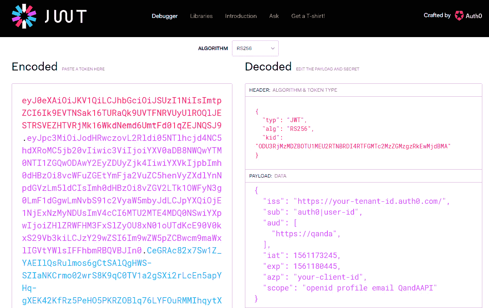
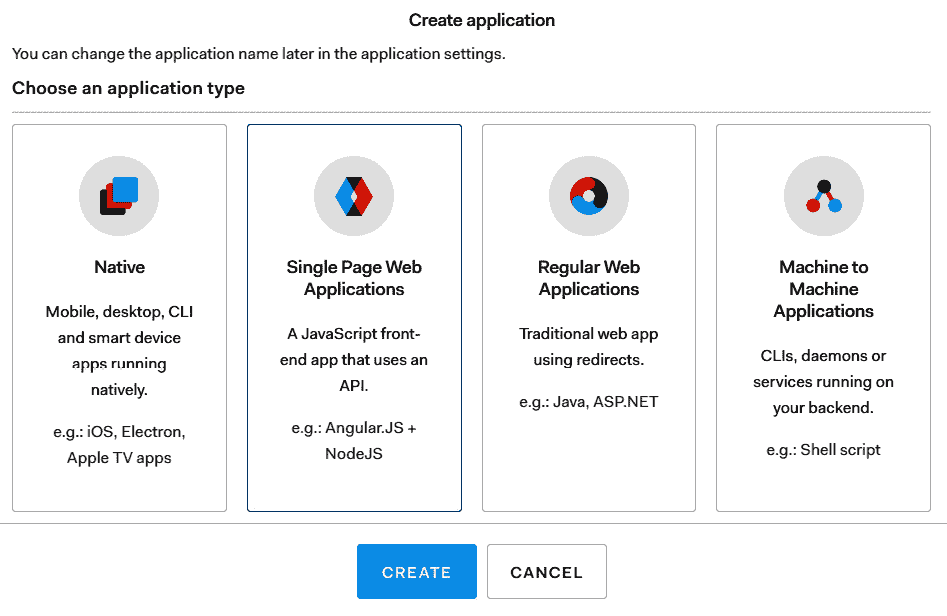
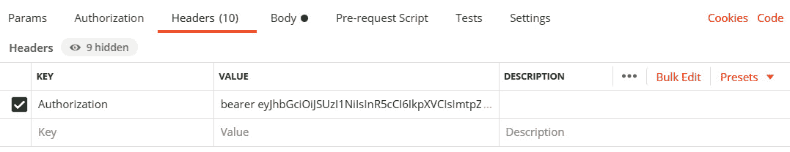
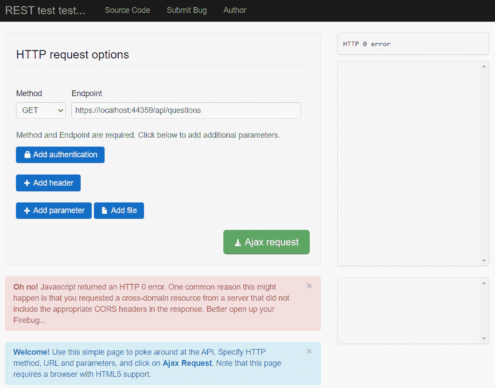
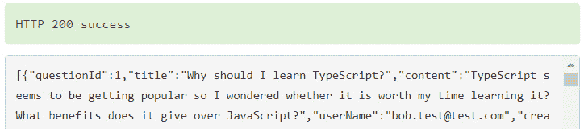

# *第 11 章*：后端安全

在本章中，我们将在问答应用中实现身份验证和授权。我们将使用一个名为 Auth0 的流行服务来帮助我们做到这一点，该服务实现了**OpenID Connect**（**OIDC**）。在让我们的应用与 Auth0 交互之前，我们将首先了解什么是 OIDC 以及为什么它是一个好的选择。

目前，未经验证的用户可以访问我们的 web API，这是一个安全漏洞。我们将通过使用简单授权保护必要的端点来解决此漏洞。这意味着只有经过身份验证的用户才能访问受保护的资源。

不过，经过身份验证的用户不应该访问所有内容。我们将学习如何确保经过身份验证的用户只通过使用自定义授权策略访问他们被允许访问的内容。

我们还将学习如何获取经过身份验证的用户的详细信息，以便在将问题和答案保存到数据库时将其包括在内。

我们将通过启用跨源请求来结束本章，为允许前端访问 RESTAPI 做准备。

在本章中，我们将介绍以下主题：

*   理解 OIDC
*   使用我们的 ASP.NET 后端设置 Auth0
*   保护端点
*   发布问题和答案时使用经过身份验证的用户
*   添加 CORS

# 技术要求

在本章中，我们将使用以下工具和服务：

*   **Visual Studio 2019**：我们将使用它编辑我们的 ASP.NET 代码。可从[下载并安装 https://visualstudio.microsoft.com/vs/](https://visualstudio.microsoft.com/vs/) 。
*   **.NET 5**：可从[下载 https://dotnet.microsoft.com/download/dotnet/5.0](https://dotnet.microsoft.com/download/dotnet/5.0) 。
*   **Auth0**：我们将使用它来验证和管理用户。该服务可以免费尝试并进行一些测试，并且可以在[上创建一个帐户 https://auth0.com/signup](https://auth0.com/signup) 。
*   **邮递员**：在本章中，我们将使用它来尝试对 RESTAPI 的更改。可从[下载 https://www.getpostman.com/downloads/](https://www.getpostman.com/downloads/) 。
*   **Q&A**：我们将从本章的 Q&A 启动项目开始。这是我们在上一章中完成的后端项目，所有控制器方法都是异步的。这可在 GitHub 的[上获得 https://github.com/PacktPublishing/ASP.NET-Core-5-and-React-Second-Edition `chapter-11/start`文件夹中的](https://github.com/PacktPublishing/ASP.NET-Core-5-and-React-Second-Edition)。

本章中的所有代码片段可在网上[找到 https://github.com/PacktPublishing/ASP.NET-Core-5-and-React-Second-Edition](https://github.com/PacktPublishing/ASP.NET-Core-5-and-React-Second-Edition) 。要从章节还原代码，可以下载源代码存储库，并在相关编辑器中打开相关文件夹。如果代码为前端代码，则可在终端中输入`npm install`恢复依赖关系。

查看以下视频以查看代码的运行：[http://bit.ly/2EPQ8DY](http://bit.ly/2EPQ8DY)

# 理解 OIDC

在我们介绍 OIDC 之前，让我们确保了解身份验证和授权。身份验证验证验证用户是否就是他们所说的用户。在我们的应用中，用户将输入他们的电子邮件和密码以证明他们是谁。授权决定用户是否具有访问资源的权限。在我们的应用中，一些 RESTAPI 端点（如发布问题）最终将受到授权检查的保护。

OIDC 是处理身份验证和授权以及其他用户相关操作的行业标准方法。这适用于各种各样的架构，包括**单页应用**（**SPA**），比如我们的架构，其中有一个 JavaScript 客户端和一个服务器端 REST API 需要保护。

下图显示了我们的应用的用户经过身份验证，然后在 REST API 中访问受保护资源的高级流程：


图 11.1–OIDC 身份验证流程

以下是一些发生的步骤的更多细节：

1.  客户端向身份提供者发出授权请求，因为它希望访问 RESTAPI 中受保护的资源。
2.  客户端被重定向到身份提供程序，以便用户可以输入他们的凭据来证明他们是谁。
3.  然后，身份提供程序生成一个代码，并将代码重定向回客户端。
4.  然后，客户机发出包含生成代码的 web API 请求以获取访问代码。身份提供者验证代码并使用访问令牌进行响应。
5.  然后，客户端可以通过在请求中包含访问令牌来访问 REST API 中受保护的资源。

请注意，我们的应用从不处理用户凭据。当需要用户身份验证时，用户将被重定向到身份提供商以执行此过程。我们的应用只处理一个安全令牌，称为**访问令牌**，是一个长编码字符串。此令牌采用**JSON Web 令牌**（**JWT**格式），这也是行业标准。

可使用[检查JWT 的含量 https://jwt.io/](https://jwt.io/) 网站。我们可以将一个 JWT 粘贴到**编码的**框中，然后站点将解码后的 JWT 放入**解码的**框中，如下图所示：



图 11.2–JWT.io 中的 JWT

JWT 有三个部分，由点分隔，它们在`jwt.io`中显示为不同的颜色：

*   **表头**
*   **有效载荷**
*   **签字**

标头通常包含`typ`字段中的令牌类型和`alg`字段中使用的签名算法。因此，前面的令牌是使用 RSA 签名和 SHA-256 非对称算法的 JWT。标头中还有一个`kid`字段，它是一个不透明标识符，可用于标识用于签署 JWT 的密钥。

JWT 的有效载荷各不相同，但通常包括以下字段：

*   `iss`：这是颁发令牌的身份提供者。
*   `sub`：是`subject`的缩写，是用户的标识符。这将是我们应用的`UserId`。
*   `aud`：这是目标受众。对于我们的应用，这将包含 RESTAPI 的名称。
*   `iat`：这是 JWT 发布的时间。这是 Unix epoch 时间格式，即自 1970 年 1 月 1 日以来经过的秒数。
*   `exp`：这是令牌到期时，并且再次是 Unix 历元时间格式。
*   `azp`：这是向其颁发令牌的一方，这是使用 JWT 的客户端的唯一标识符。这将是我们案例中 React 应用的客户端 ID。
*   `scope`：这是客户可以访问的。对于我们的应用，这是 RESTAPI，以及用户配置文件信息和他们的电子邮件地址。
*   `openid`范围允许客户端验证用户的身份。

OIDC 负责安全地存储密码、验证用户、生成访问令牌等。能够利用行业标准技术（如 OIDC）不仅为我们节省了大量时间，而且让我们放心，该实现非常安全，并且会随着攻击者变得更聪明而收到更新。

我们刚刚学到的是由 Auth0 实现的。我们将在下一节中开始使用 Auth0。

# 使用我们的 ASP.NET 后端设置 Auth0

我们将在我们的应用中使用名为**Auth0**的现成身份服务。Auth0 实现了 OIDC，并且对于少量用户也是免费的。使用 Auth0将使我们能够专注于与身份服务集成，而不是花时间构建自己的身份服务。

在本节中，我们将设置 Auth0 并将其集成到我们的 ASP.NET 后端。

## 设置 Auth0

让我们执行以下步骤将 Auth0 设置为我们的身份提供者：

1.  如果您尚未拥有 Auth0 帐户，请在[注册 https://auth0.com/signup](https://auth0.com/signup) 。
2.  Once we have an Auth0 account and have logged in, we need to change the default audience in our tenant settings. To get to your tenant settings, click on the user avatar and choose **Settings**:

    

    图 11.3–Auth0 租户设置选项

    **默认受众**选项位于**API 授权设置**部分。将此更改为`https://qanda`：

    

    图 11.4–Auth0 默认观众设置

    这告诉 Auth0 将`https://qanda`添加到它生成的 JWT 中的`aud`有效负载字段中。此设置触发 Auth0 以 JWT 格式生成访问令牌。我们的ASP.NET 后端还将在授予对受保护资源的访问权限之前检查访问令牌是否包含此数据。

3.  接下来，我们将告诉 Auth0 我们的 React 前端。在左侧导航菜单上，点击**应用**，然后点击**创建应用**按钮。
4.  Select the **Single Page Web Applications** application type and click the **CREATE** button:

    

    图 11.5–创建 SPA Auth0 客户端

    然后将创建我们的 SPA 客户端配置。

5.  我们需要更改 SPA 客户端配置中的一些设置，因此选择**设置**选项卡并设置以下设置。
6.  该名称将出现在登录屏幕上，因此将其更改为`QandA`。
7.  在**允许的 Web 原点**设置中指定前端原点。那么，让我们将其设置为`http://localhost:3000`。
8.  我们需要在**允许的回调 URL**设置中指定成功登录后 Auth0 将重定向回的页面。因此，将其设置为`http://localhost:3000/signin-callback`。我们将在[*第 12 章*](12.html#_idTextAnchor257)*中的前端实现`signin-callback`页面，与 RESTful API*交互。
9.  同样，我们需要在**允许的注销 URL**设置中指定成功注销后 Auth0 将重定向回的页面。因此，将其设置为`http://localhost:3000/signout-callback`。我们将在[*第 12 章*](12.html#_idTextAnchor257)*中的前端实现`signout-callback`页面，与 RESTful API*交互。
10.  输入这些设置后，不要忘记滚动到页面的底部，点击**保存更改**按钮。
11.  我们现在需要告诉 Auth0 关于我们的 ASP.NET 后端。在左侧导航菜单中，点击**API**，然后点击**创建 API**按钮：


图 11.6–创建 API Auth0 客户端

名称可以是我们选择的任何内容，但**标识符**设置必须与我们在租户上设置的默认访问群体匹配。确保**签名算法**设置为**RS256**，然后点击**创建**按钮。

这就完成了 Auth0 的设置。

接下来，我们将把 ASP.NET 后端与 Auth0 集成。

## 将我们的 ASP.NET 后端配置为使用 Auth0 进行身份验证

我们现在可以将 ASP.NET 后端更改为使用Auth0 进行身份验证。让我们在 Visual Studio 中打开后端项目，并执行以下步骤：

1.  Install the following NuGet package:

    ```cs
    Microsoft.AspNetCore.Authentication.JwtBearer
    ```

    重要提示

    确保所选软件包的版本受所用.NET 版本的支持。因此，例如，如果您的目标是.NET 5.0，则选择软件包版本`5.0.*`。

2.  Add the following `using` statement to the `Startup` class:

    ```cs
    using Microsoft.AspNetCore.Authentication.JwtBearer;
    ```

    在`Startup`类中的`ConfigureServices`方法中添加以下行：

    ```cs
    public void ConfigureServices(IServiceCollection services)
    {
      ...
      services.AddAuthentication(options =>
     {
     options.DefaultAuthenticateScheme = 
     JwtBearerDefaults.AuthenticationScheme;
     options.DefaultChallengeScheme = 
     JwtBearerDefaults.AuthenticationScheme;
     }).AddJwtBearer(options =>
     {
     options.Authority = 
     Configuration["Auth0:Authority"];
     options.Audience = 
     Configuration["Auth0:Audience"];
     }); 
    }
    ```

    这增加了基于 JWT 的身份验证，将权限和预期受众指定为`appsettings.json`设置。

3.  Let's add the authentication middleware to the `Configure` method. It needs to be placed between the routing and authorization middleware:

    ```cs
    public void Configure(IApplicationBuilder app, IWebHostEnvironment env)
    {
      ...
      app.UseRouting();
     app.UseAuthentication(); 
      app.UseAuthorization();
      ...
    }
    ```

    这将验证每个请求中的访问令牌（如果存在）。如果检查成功，将设置请求上下文中的用户。

4.  The final step is to add the settings in `appsettings.json`, which we have referenced:

    ```cs
    {
      ...,
     "Auth0": {
     "Authority": "https://your-tentant-id.auth0.com/",
     "Audience": "https://qanda"
     }
    }
    ```

    我们需要将 Auth0 租户 ID 替换为`Authority`字段。租户 ID可以在用户头像左侧的 Auth0 中找到：


图 11.7–Auth0 用户化身

因此，前面承租人的`Authority`为`https://your-tenant-id.auth0.com/`。`Audience`字段需要匹配我们在 Auth0 中指定的受众。

我们的 web API 现在正在验证请求中的访问令牌。

让我们快速回顾一下我们在本节中所做的工作。我们告诉我们的身份提供者到前端的路径以及登录和注销的路径。身份提供者通常为我们提供一个管理页面来提供这些信息。我们还告诉 ASP.NET 使用`Startup`类中`Configure`方法中的`UseAuthentication`方法验证请求中的承载令牌。使用`ConfigureServices`中的`AddAuthentication`方法配置验证。

我们将在下一节中开始保护一些端点。

# 保护端点

我们将通过保护`questions`端点以添加、更新和删除问题以及发布答案来开始本节，以便只有经过身份验证的用户才能执行这些操作。然后，我们将继续实现和使用自定义授权策略，以便只有问题的作者才能更新或删除它。

## 通过简单授权保护端点

让我们通过执行以下步骤来保护`POST`、`PUT`和`DELETE`HTTP 方法的`questions`端点：

1.  打开`QuestionsController`并添加以下`using`语句：

    ```cs
    using Microsoft.AspNetCore.Authorization;
    ```

2.  为了确保操作的安全，我们用一个`Authorize`属性装饰它们。将此属性添加到`PostQuestion`、`PutQuestion`、`DeleteQuestion`和`PostAnswer`方法中：

    ```cs
    [Authorize]
    [HttpPost]
    public async ... PostQuestion(QuestionPostRequest questionPostRequest)
    ...
    [Authorize]
    [HttpPut("{questionId}")]
    public async ... PutQuestion(int questionId, QuestionPutRequest questionPutRequest)
    ...
    [Authorize]
    [HttpDelete("{questionId}")]
    public async ... DeleteQuestion(int questionId) 
    ...
    [Authorize]
    [HttpPost("answer")]
    public async ... PostAnswer(AnswerPostRequest answerPostRequest)
    ...
    ```

3.  按*F5*运行 Visual Studio 项目。当浏览器以`api/questions`路径打开时，我们会注意到数据已成功返回。这意味着`GetQuestions`操作方法是不受保护的，正如我们预期的那样。
4.  Open Postman now and try to post a question:

    

    图 11.8–在未经身份验证的情况下访问 Postman 中的受保护端点

    我们收到状态代码为**401**的响应。这表明此操作方法现在受到保护。

5.  我们可以从 Auth0 获取测试访问令牌，以检查是否可以使用有效令牌发布问题。在 Auth0 中，点击左侧导航菜单中的**API**，然后点击我们的**QandA**API。
6.  点击**测试**选项卡，我们将看到一个可用于测试目的的令牌。
7.  Click the **COPY TOKEN** option to copy the access token to the clipboard:

    

    图 11.9–从 Auth0 获取测试令牌

8.  Back in Postman, we need to add this token to an `Authorization` HTTP header after the `bearer` word and a space:

    

    图 11.10–将 Auth0 承载令牌添加到 Postman 中的授权 HTTP 头中

9.  If we send the request, it will now be successful:

    

    图 11.11–成功访问 Postman 中的受保护端点

10.  按*Shift*+*F5*停止 Visual Studio 项目运行，以便我们可以添加更多代码。

因此，一旦认证中间件就位，`Authorize`属性将保护动作方法。如果需要保护整个控制器，`Authorize`属性可以修饰`controller`类：

```cs
[Authorize]
[Route("api/[controller]")]
[ApiController]
public class QuestionsController : ControllerBase
```

控制器中的所有动作方法都将受到保护，而无需指定`Authorize`属性。我们还可以使用`AllowAnonymous`属性取消受保护控制器中的操作方法的保护：

```cs
[AllowAnonymous]
[HttpGet]
public IEnumerable<QuestionGetManyResponse> GetQuestions(string search, bool includeAnswers, int page =  1, int pageSize = 20) 
```

因此，在我们的示例中，我们可以使用`Authorize`属性保护整个控制器，并使用`AllowAnonymous`属性取消对`GetQuestions`、`GetUnansweredQuestions`和`GetQuestion`动作方法的保护，以实现我们想要的行为。

接下来，我们将学习如何使用端点授权实现策略检查。

## 使用自定义授权策略保护端点

目前，任何经过身份验证的用户都可以更新或删除问题。我们将实现并使用自定义授权策略，并使用它强制执行只有问题的作者才能执行这些操作。让我们执行以下步骤：

1.  In the `Startup` class, let's add the following `using` statements:

    ```cs
    using Microsoft.AspNetCore.Http;
    using Microsoft.AspNetCore.Authorization;
    using QandA.Authorization;
    ```

    注意，`QandA.Authorization`名称空间的引用还不存在。我们将在后面的步骤中实现这一点。

2.  We'll need to eventually call an Auth0 web service, so let's make the HTTP client available in the `ConfigureServices` method:

    ```cs
    public void ConfigureServices(IServiceCollection services)
    {
      ... 
      services.AddHttpClient();
    }
    ```

    授权策略在名为`MustBeQuestionAuthorRequirement`的类中定义了其需求，我们将在后面的步骤中实现。

3.  Let's also add an authorization policy called `MustBeQuestionAuthor`:

    ```cs
    public void ConfigureServices(IServiceCollection services)
    {
      ... 
      services.AddHttpClient();
      services.AddAuthorization(options =>
     options.AddPolicy("MustBeQuestionAuthor", policy 
     => 
     policy.Requirements
     .Add(new MustBeQuestionAuthorRequirement())));
    }
    ```

    授权策略在名为`MustBeQuestionAuthorRequirement`的类中定义了其需求，我们将在后面的步骤中实现。

4.  We also need to have a handler for the requirement, so let's register this for dependency injection:

    ```cs
    public void ConfigureServices(IServiceCollection services)
    {
      ... 
      services.AddHttpClient();
      services.AddAuthorization(...);
      services.AddScoped<
     IAuthorizationHandler, 
     MustBeQuestionAuthorHandler>();
    }
    ```

    因此，`MustBeQuestionAuthorRequirement`的处理程序将在名为`MustBeQuestionAuthorHandler`的类中实现。

5.  Our `MustBeQuestionAuthorHandler` class will need access to the HTTP requests to find out the question that is being requested. We need to register `HttpContextAccessor` for dependency injection to get access to the HTTP request information in a class. Let's do this now:

    ```cs
    public void ConfigureServices(IServiceCollection services)
    {
      ... 
      services.AddHttpClient();
      services.AddAuthorization(...);
      services.AddScoped<
        IAuthorizationHandler, 
        MustBeQuestionAuthorHandler>();
      services.AddHttpContextAccessor();
     }
    ```

    注意，`AddHttpContextAccessor`是`AddSingleton<IHttpContextAccessor,HttpContextAccessor>`的一种方便方法。

6.  我们现在要创建`MustBeQuestionAuthorRequirement`类。让我们在项目的根目录中创建一个名为`Authorization`的文件夹，然后创建一个名为`MustBeQuestionAuthorRequirement`的类，其中包含以下内容：

    ```cs
    using Microsoft.AspNetCore.Authorization;
    namespace QandA.Authorization
    {
      public class MustBeQuestionAuthorRequirement: 
        IAuthorizationRequirement
      {
        public MustBeQuestionAuthorRequirement()
        {
        }
      }
    }
    ```

7.  Next, we'll create the handler class for this requirement. Create a class called `MustBeQuestionAuthorHandler` with the following content in the `Authorization` folder:

    ```cs
    using System;
    using System.Security.Claims;
    using System.Threading.Tasks;
    using Microsoft.AspNetCore.Authorization;
    using Microsoft.AspNetCore.Http;
    using QandA.Data;
    namespace QandA.Authorization
    {
      public class MustBeQuestionAuthorHandler: 
        AuthorizationHandler<MustBeQuestionAuthorRequirement>
      {
        private readonly IDataRepository _dataRepository;
        private readonly IHttpContextAccessor 
         _httpContextAccessor;
        public MustBeQuestionAuthorHandler(
          IDataRepository dataRepository, 
          IHttpContextAccessor httpContextAccessor)
        {
          _dataRepository = dataRepository;
          _httpContextAccessor = httpContextAccessor;
        }
        protected async override Task 
          HandleRequirementAsync(
            AuthorizationHandlerContext context, 
            MustBeQuestionAuthorRequirement requirement)
        {
          // TODO - check that the user is authenticated
          // TODO - get the question id from the request
          // TODO - get the user id from the name 
            // identifier claim
          // TODO - get the question from the data 
            // repository
          // TODO - if the question can't be found go to 
           // the next piece of middleware
          // TODO - return failure if the user id in the
           // question from the data repository is 
            // different to the user id in the request
          // TODO - return success if we manage to get 
            // here
        }
      }
    }
    ```

    这继承自`AuthorizationHandler`类，该类将其正在处理的需求作为通用参数。我们已经将数据存储库和 HTTP 上下文注入到该类中。

8.  We now need to implement the `HandleRequirementAsync` method. The first task is to check that the user is authenticated:

    ```cs
    protected async override Task 
      HandleRequirementAsync(
        AuthorizationHandlerContext context, 
        MustBeQuestionAuthorRequirement requirement)
    {
      if (!context.User.Identity.IsAuthenticated)
     {
     context.Fail();
        return;
     }

      // TODO - get the question id from the request
      // TODO - get the user id from the name identifier
        // claim
      // TODO - get the question from the data repository
      // TODO - if the question can't be found go to the 
       // next piece of middleware
      // TODO - return failure if the user id in the
       //  question from the data repository is different
        // to the user id in the request
      // TODO - return success if we manage to get here
    }
    ```

    方法中的`context`参数包含`Identity`属性中的用户身份信息。我们使用`Identity`对象中的`IsAuthenticated`属性来确定用户是否经过身份验证。我们在`context`参数上调用`Fail`方法，告诉它需求失败。

9.  Next, we need to get `questionId` from the request path:

    ```cs
    protected async override Task 
      HandleRequirementAsync(
        AuthorizationHandlerContext context, 
        MustBeQuestionAuthorRequirement requirement)
    {
      if (!context.User.Identity.IsAuthenticated)
      {
        context.Fail();
        return;
      }
      var questionId = 
     _httpContextAccessor.HttpContext.Request
     .RouteValues["questionId"];
     int questionIdAsInt = Convert.ToInt32(questionId);

      // TODO - get the user id from the name identifier
      //  claim
      // TODO - get the question from the data repository
      // TODO - if the question can't be found go to the 
       //next piece of middleware
      // TODO - return failure if the user id in the 
       //question from the data repository is different 
        // to the user id in the request
      // TODO - return success if we manage to get here
    }
    ```

    我们在 HTTP 上下文请求中使用`RouteValues`字典来获取访问权限，以获取问题 ID。`RoutesValues`字典包含控制器名称、动作方法名称以及动作方法的参数。

10.  Next, we need to get `userId` from the user's identity claims:

    ```cs
    protected async override Task 
      HandleRequirementAsync(
        AuthorizationHandlerContext context, 
        MustBeQuestionAuthorRequirement requirement)
    {
      ...
      var questionId = 
        _httpContextAccessor.HttpContext.Request
          .RouteValues["questionId"];
      int questionIdAsInt = Convert.ToInt32(questionId);
      var userId = 
     context.User.FindFirst(ClaimTypes.NameIdentifier).
     Value;

      // TODO - get the question from the data repository
      // TODO - if the question can't be found go to the
       // next piece of middleware
      // TODO - return failure if the user id in the 
      //question from the data repository is different
        // to the user id in the request
      // TODO - return success if we manage to get here
    }
    ```

    `userId`存储在名称标识符声明中。

    重要提示

    声明是来自可信来源的有关用户的信息。索赔代表的是主体是什么，而不是主体能做什么。ASP.NET 身份验证中间件会自动为我们将`userId`放入名称标识符声明中。

    我们在`context`参数中的`User`对象上使用了`FindFirst`方法来获取名称标识符声明的值。`User`对象在读取访问令牌后，在请求管道的前面由身份验证中间件填充声明。

11.  我们现在可以从数据存储库中获取问题。如果没有找到问题，我们希望通过该要求，因为我们希望返回 HTTP 状态码 404（未找到），而不是 401（未授权）。控制器中的操作方法将能够执行并返回 HTTP 404 状态代码：

    ```cs
    protected async override Task 
      HandleRequirementAsync(
        AuthorizationHandlerContext context, 
        MustBeQuestionAuthorRequirement requirement)
    {
      ...
      var userId = 
        context.User.FindFirst(ClaimTypes.NameIdentifier).Value;
      var question = 
     await _dataRepository.GetQuestion(questionIdAsInt);
     if (question == null)
     {
     // let it through so the controller can return a 404
     context.Succeed(requirement);
        return;
     }

      // TODO - return failure if the user id in the 
        //question from the data repository is different
         // to the user id in the request
      // TODO - return success if we manage to get here
    }
    ```

12.  现在，检查请求中的`userId`是否与数据库中的问题匹配，如果不匹配，则返回`Fail`：

    ```cs
    protected async override Task 
      HandleRequirementAsync(
        AuthorizationHandlerContext context, 
        MustBeQuestionAuthorRequirement requirement)
    {
      ...
      var question = 
        await _dataRepository.GetQuestion(questionIdAsInt);
      if (question == null)
      {
        // let it through so the controller can return 
         // a 404
        context.Succeed(requirement);
        return;
      }
      if (question.UserId != userId)
     {
     context.Fail();
        return;
     }
     context.Succeed(requirement);
    }
    ```

13.  The final task is to add the policy we have just created to the `Authorize` attribute on the relevant action methods in `QuestionsController`:

    ```cs
    [Authorize(Policy = "MustBeQuestionAuthor")]
    [HttpPut("{questionId}")]
    public ... PutQuestion(int questionId, QuestionPutRequest questionPutRequest)
    ...
    [Authorize(Policy = "MustBeQuestionAuthor")]
    [HttpDelete("{questionId}")]
    public ... DeleteQuestion(int questionId) 
    ...
    ```

    现在，我们已将授权策略应用于更新和删除问题。

    不幸的是，我们不能使用 Auth0 提供的测试访问令牌来尝试这个方法，但我们将返回到这里，并确认它在[*第 12 章*](12.html#_idTextAnchor257)*与 RESTful API 交互*中起作用。

自定义授权策略为我们实现复杂的授权规则提供了很大的灵活性和能力。正如我们在示例中所经历的那样，单个策略可以集中实施并用于不同的操作方法。

让我们快速回顾一下我们在本节学到的内容：

*   我们通过使用`Authorize`属性装饰控制器类或操作方法来保护端点或端点内的特定 HTTP 方法。
*   我们可以在`Authorize`属性中引用自定义授权策略，并通过扩展`AuthorizationHandler`类来实现其逻辑。

在下一节中，我们将学习如何在 API 控制器中引用经过身份验证的用户的信息。

# 发布问题和答案时使用认证用户

既然我们的 RESTAPI 知道用户与之交互，我们就可以用它来发布正确的用户问答。让我们执行以下步骤：

1.  我们首先在`QuestionsController.cs`中添加以下`using`语句：

    ```cs
    using System.Security.Claims;
    using Microsoft.Extensions.Configuration;
    using System.Net.Http;
    using System.Text.Json;
    ```

2.  Let's focus on posting a question first by posting it with the authenticated user's ID:

    ```cs
    public async ... 
      PostQuestion(QuestionPostRequest 
       questionPostRequest)
    {
      var savedQuestion = 
        await _dataRepository.PostQuestion(new 
          QuestionPostFullRequest
        {
          Title = questionPostRequest.Title,
          Content = questionPostRequest.Content,
          UserId =
          User.FindFirst(ClaimTypes.NameIdentifier).Value,
          UserName = "bob.test@test.com",
          Created = DateTime.UtcNow
        });
      ...
    }
    ```

    `ControllerBase`包含一个`User`属性，该属性向我们提供有关经过身份验证的用户的信息，包括声明。因此，我们使用`FindFirst`方法来获取名称标识符声明的值。

3.  Unfortunately, the username isn't in the JWT, so we are going to need to get this from Auth0\. Let's create a model that will represent an Auth0 user. Create a new class called `User` in the `Models` folder with the following content:

    ```cs
    namespace QandA.Data.Models
    {
        public class User
        {
            public string Name { get; set; }
        }
    }
    ```

    请注意，我们可以从 Auth0 获得更多用户信息，但我们只对应用中的用户名感兴趣。

4.  现在，将 HTTP 客户端以及从 Auth0 获取用户信息的路径注入`QuestionsController`：

    ```cs
    ...
    private readonly IHttpClientFactory _clientFactory;
    private readonly string _auth0UserInfo;
    public QuestionsController(
      ..., 
     IHttpClientFactory clientFactory, 
     IConfiguration configuration)
    {
      ...
      _clientFactory = clientFactory;
     _auth0UserInfo = 
     $"{configuration["Auth0:Authority"]}userinfo";
    }
    ```

5.  Let's create a method that will call Auth0 to get the username. So, add the following method at the bottom of `QuestionsController`:

    ```cs
    private async Task<string> GetUserName()
    {
        var request = new HttpRequestMessage(
          HttpMethod.Get, 
          _auth0UserInfo);
        request.Headers.Add(
          "Authorization", 
          Request.Headers["Authorization"].First());
        var client = _clientFactory.CreateClient();
        var response = await client.SendAsync(request);
        if (response.IsSuccessStatusCode)
        {
            var jsonContent = 
              await response.Content.ReadAsStringAsync();
            var user = 
              JsonSerializer.Deserialize<User>(
                jsonContent, 
                new JsonSerializerOptions
                {
                  PropertyNameCaseInsensitive = true
                });
            return user.Name;
        }
        else
        {
            return "";
        }
    }
    ```

    从当前请求到 ASP.NET 后端，我们使用`Authorization`HTTP 头向 Auth0 用户信息端点发出 GET HTTP 请求。此 HTTP 标头将包含访问令牌，该令牌将使我们能够访问 Auth0 端点。

    如果请求成功，我们将响应体解析到`User`模型中。请注意，我们在.NET 中使用了新的 JSON 序列化程序。还要注意，我们指定了不区分大小写的属性映射，以便响应中的 camel case 字段正确映射到类中的 title case 属性。

6.  现在使用`PostQuestion`方法中的用户名：

    ```cs
    public async ... PostQuestion(QuestionPostRequest questionPostRequest)
    {
      var savedQuestion = await 
       _dataRepository.PostQuestion(new 
       QuestionPostFullRequest
       {
        Title = questionPostRequest.Title,
        Content = questionPostRequest.Content,
        UserId = 
        User.FindFirst(ClaimTypes.NameIdentifier).Value,
        UserName = await GetUserName(),
        Created = DateTime.UtcNow
      });
      ...
    }
    ```

7.  在`PostAnswer`动作方式

    ```cs
    [Authorize]
    [HttpPost("answer")]
    public ActionResult<AnswerGetResponse> PostAnswer(AnswerPostRequest answerPostRequest)
    {
      ...
      var savedAnswer = _dataRepository.PostAnswer(new 
       AnswerPostFullRequest
      {
        QuestionId = answerPostRequest.QuestionId.Value,
        Content = answerPostRequest.Content,
        UserId = 
     User.FindFirst(ClaimTypes.NameIdentifier).Value,
     UserName = await GetUserName(),   
        Created = DateTime.UtcNow
      });
      ...
    }
    ```

    中也做同样的动作

不幸的是，我们无法使用 Auth0 提供的测试访问令牌来尝试此操作，因为它没有与之关联的用户。但是，我们将返回到这里，并确认它在[*第 12 章*](12.html#_idTextAnchor257)*与 RESTful API 交互*中起作用。

我们的问题控制器现在正在与经过身份验证的用户进行良好的交互。

综上所述，关于经过身份验证的用户的信息可以在 API 控制器的`User`属性中找到。`User`属性中的信息仅限于 JWT 中包含的信息。通过从身份服务提供商中的相关端点请求，可以获得其他信息。

# 添加 CORS

**CORS**代表**跨源资源共享**，是一种使用 HTTP 头通知浏览器让 web 应用在特定的源（域）上运行的机制，以便它有权访问不同源服务器上的特定资源。

在本节中，我们将从尝试从浏览器应用访问 REST API 开始，并发现它不可访问。然后，我们将在 RESTAPI 中添加和配置 CORS，并验证它是否可以从浏览器应用访问。

让我们执行以下步骤：

1.  在 Visual Studio 中按*F5*运行后端项目。
2.  在浏览器中，浏览至[https://resttesttest.com/](https://resttesttest.com/) 地址。这是一个浏览器应用，我们可以使用它来检查 REST API 是否可以从浏览器访问。
3.  Enter the path to the `questions` endpoint and press the **Ajax request** button. We see that the request is unsuccessful:

    

    图 11.12–从浏览器访问 REST API 时出现 CORS 错误

4.  Stop the backend from running by pressing *Shift* + *F5* in Visual Studio and enter the following statement at the bottom of the `ConfigureServices` method in `Startup.cs`:

    ```cs
    public void ConfigureServices(IServiceCollection services)
    {
      ...
      services.AddCors(options => 
     options.AddPolicy("CorsPolicy", builder => 
     builder
     .AllowAnyMethod()
     .AllowAnyHeader()
     .WithOrigins(Configuration["Frontend"])));
    }
    ```

    这定义了一个 CORS 策略，允许`appsettings.json`中指定的源访问 REST API。它还允许使用任何 HTTP 方法和任何 HTTP 头进行请求。

5.  现在，我们可以在`Configure`方法中启用此策略的使用。让我们在`Configure`方法中的路由和身份验证之间添加以下语句：

    ```cs
    public void Configure(IApplicationBuilder app, IHostingEnvironment env)
    {
      ...
      app.Routing();
      app.UseCors("CorsPolicy");
      app.UseAuthentication();
      ...
    }
    ```

6.  在`appsettings.json`中，添加以下设置，允许浏览器应用访问 REST API:

    ```cs
    {
      ...,
     "Frontend": "https://resttesttest.com"
    }
    ```

7.  按*F5*再次运行后端项目。
8.  In the browser app, press the **Ajax request** button again. We see that the request is successful this time:

    

    图 11.13–成功的跨来源请求

9.  在 Visual Studio 中按*Shift*+*F5*停止后端运行。在`appsettings.json`中，将`Frontend`设置更改为我们前端的本地地址：

    ```cs
    {
      ...,
      "Frontend": "http://localhost:3000"
    }
    ```

CORS 可以直接添加到 ASP.NET 中。首先，我们创建一个策略并在请求管道中使用它。重要的是，将`UseCors`方法置于`Configure`方法中的`UseRouting`和`UseEndpoint`方法之间，以使其正确运行。

# 总结

Auth0 是一个 OIDC 身份提供程序，我们可以利用它对客户端进行身份验证和授权。成功登录后，身份提供商可以提供 JWT 格式的访问令牌。可以在访问受保护资源的请求中使用访问令牌。

ASP.NET 可以先在`Startup`类的`ConfigureServices`方法中使用`AddAuthentication`方法，然后在`Configure`方法中使用`UseAuthentication`方法来验证 JWTs。

将身份验证添加到请求管道后，可以通过使用`Authorize`属性修饰控制器和操作方法来保护 REST API 资源。然后可以使用`AllowAnonymous`属性取消受保护的操作方法的保护。我们可以通过控制器的`User`属性访问有关用户的信息，例如他们的声明。

自定义策略是允许某一组用户访问受保护资源的强大方式。必须实现定义策略逻辑的需求和处理程序类。通过将策略名称作为参数传入，可以使用`Authorize`属性将策略应用于端点。

ASP.NET 不允许开箱即用的跨源请求。我们需要为需要访问 RESTAPI 的 web 客户端添加并启用 CORS 策略。

我们的后端现在接近完成。在下一章中，我们将把注意力转回前端，并开始与我们构建的后端进行交互。

# 问题

让我们回答以下问题来实践本章所学内容：

1.  在`Startup`类中的`Configure`方法中，以下有什么问题？

    ```cs
    public void Configure(...)
    {
      ... 

      app.UseEndpoints(...);
      app.UseAuthentication();
    }
    ```

2.  可以向受保护的操作方法添加哪些属性以允许未经身份验证的用户访问它？
3.  We are building an app with an ASP.NET backend and using an identity provider to authenticate users. The default audience has been set to `http://my-app` in the identity provider, and we have configured the authentication service in our ASP.NET backend as follows:

    ```cs
    services.AddAuthentication(options =>
    {
        options.DefaultAuthenticateScheme = 
          JwtBearerDefaults.AuthenticationScheme;
        options.DefaultChallengeScheme = 
          JwtBearerDefaults.AuthenticationScheme;
    }).AddJwtBearer(options =>
    {
        ...
        options.Audience = "https://myapp";
    });
    ```

    当我们尝试访问 ASP.NET 后端中受保护的资源时，会收到 HTTP 401 状态代码。这里有什么问题？

4.  A JWT has the following decoded payload data. On what date and time does it expire?

    ```cs
    {
      "nbf": 1609671475,
      "auth_time": 1609671475,
      "exp": 1609757875,
      ...
    }
    ```

    提示：您可以使用以下网站解码 Unix 日期：[https://www.unixtimestamp.com/index.php](https://www.unixtimestamp.com/index.php) 。

5.  We have a valid access token from an identity provider and are using it to access a protected resource. We have set the following HTTP header in the request:

    ```cs
    Authorisation: bearer some-access-token
    ```

    不过，我们从请求中收到一个 HTTP401 状态代码。有什么问题？

6.  我们如何在 API 控制器之外的类中访问 HTTP 请求信息？
7.  在 API 控制器中，我们如何访问经过身份验证的用户 ID？

# 答案

1.  问题是，在请求管道中处理端点之后才进行身份验证，这意味着即使请求具有有效的访问令牌，用户也将始终在控制器操作方法中未经身份验证。这意味着永远无法访问受保护的资源。在`Configure`方法中`UseAuthentication`应该在`UseEndpoints`之前。
2.  可以向受保护的操作方法添加一个`AllowAnonymous`属性，以允许未经身份验证的用户访问该方法。
3.  问题是 ASP.NET 核心后端验证 JWT 中的访问群体是否为`https://myapp`，但身份提供程序已配置为将访问群体设置为`http://my-app`。这会导致请求未经授权。
4.  `exp`字段给出了失效日期，即 1970 年 1 月 1 日之后的`1609757875`秒，反过来，失效日期是 2021 年 1 月 4 日 10:57:55（GMT）。
5.  问题是 HTTP 头名称必须是`Authorization`——也就是说，我们将其拼写为*s*而不是*z*。
6.  Request information can be accessed by injecting `IHttpContextAccessor` into a class as follows:

    ```cs
    private readonly IHttpContextAccessor _httpContextAccessor;
    public MyClass(IHttpContextAccessor httpContextAccessor)
    {
      _httpContextAccessor = httpContextAccessor;
    }
    public SomeMethod()
    {
      var request = _httpContextAccessor.HttpContext.Request;
    }
    ```

    `HttpContextAccessor`服务必须添加到`Startup`类中的`ConfigureServices`方法中，如下所示：

    ```cs
    services.AddSingleton<IHttpContextAccessor, HttpContextAccessor>();
    ```

7.  我们可以访问控制器的`User`属性中的用户 ID，如下所示：

    ```cs
    User.FindFirst(ClaimTypes.NameIdentifier).Value
    ```

# 进一步阅读

以下是一些有用的链接，以了解有关本章所涵盖主题的更多信息：

*   **开放 ID 连接体 C**：[https://openid.net/connect/](https://openid.net/connect/)
*   **ASP.NET 安全与身份**：[https://docs.microsoft.com/en-us/aspnet/core/security](https://docs.microsoft.com/en-us/aspnet/core/security)
*   **JSON 网络令牌**：[https://jwt.io/introduction/](https://jwt.io/introduction/)
*   **认证 0**：[https://auth0.com/docs](https://auth0.com/docs)