# *第 14 章*：配置并部署到 Azure

在本章中，我们将在 Microsoft Azure 中将应用部署到生产环境中，以便所有用户都可以开始使用它。我们将首先关注后端，对代码进行必要的更改，以便它可以在 Azure 的生产和登台环境中工作。然后，我们将从 Visual Studio 内部将后端**应用编程接口**（**API**）以及**结构化查询语言**（**SQL**）数据库部署到登台和制作中。在第一次部署之后，单击 VisualStudio 中的按钮即可完成后续部署。

然后，我们将把注意力转向前端，再次对代码进行更改，以支持开发、登台和生产环境。然后，我们将把我们的前端部署到 Azure，同时部署到暂存和生产环境。

在本章中，我们将介绍以下主题：

*   Azure 入门
*   为登台和生产配置 ASP.NET 核心后端
*   将我们的 ASP.NET 核心后端发布到 Azure
*   为登台和生产配置 React 前端
*   将 React 前端发布到 Azure

# 技术要求

在本章中，我们将使用以下工具和服务：

*   **Visual Studio 2019**：我们将使用它编辑我们的 ASP.NET 核心代码。可从[下载并安装 https://visualstudio.microsoft.com/vs/](https://visualstudio.microsoft.com/vs/) 。
*   **.NET 5**：可从[下载 https://dotnet.microsoft.com/download/dotnet/5.0](https://dotnet.microsoft.com/download/dotnet/5.0) 。
*   **Visual Studio 代码**：我们将使用它来编辑我们的 React 代码。可从[下载并安装 https://code.visualstudio.com/](https://code.visualstudio.com/) 。
*   **Node.js 和 npm**：可从[下载 https://nodejs.org/](https://nodejs.org/) 。如果已经安装了这些，请确保 Node.js 至少是版本 8.2，`npm`至少是版本 5.2。
*   **Microsoft Azure**：我们将为我们的应用使用多个 Azure 应用服务和 SQL 数据库。可在[创建账户 https://azure.microsoft.com/en-us/free/](https://azure.microsoft.com/en-us/free/) 。
*   **Q 和 A**：我们将从上一章中完成的 Q 和 A 前端和后端项目开始，这些项目可在[上找到 https://github.com/PacktPublishing/ASP.NET-Core-5-and-React-Second-Edition](https://github.com/PacktPublishing/ASP.NET-Core-5-and-React-Second-Edition) 在第 14 章/开始文件夹中。

本章中的所有代码片段可在网上[找到 https://github.com/PacktPublishing/ASP.NET-Core-5-and-React-Second-Edition](https://github.com/PacktPublishing/ASP.NET-Core-5-and-React-Second-Edition) 。要从章节还原代码，可以下载源代码存储库，并在相关编辑器中打开相关文件夹。如果代码为前端代码，则可在终端中输入`npm install`恢复依赖关系。

查看以下视频以查看代码的运行：[https://bit.ly/34u28bd](https://bit.ly/34u28bd)

# 开始使用 Azure

在本节中，如果我们还没有帐户，我们将为 Azure 注册。然后，我们将快速浏览 Azure 门户，了解我们将用于运行应用的服务。

## 注册 Azure

如果你已经拥有 Azure 帐户，那么现在是注册并尝试 Azure 的最佳时机。在撰写本书时，您可以注册 Azure 并通过以下链接获得 12 个月的免费服务：[https://azure.microsoft.com/en-us/free/](https://azure.microsoft.com/en-us/free/) 。

我们需要一个 Microsoft 帐户来注册 Azure，如果您还没有帐户，可以免费创建。然后，您需要填写一份包含以下个人信息的注册表格：

*   原籍国
*   名称
*   电子邮件地址
*   电话号码

然后，您需要经历两个不同的验证过程。第一种是通过短信或电话进行验证。第二是核实你的信用卡详细信息。

重要提示

请注意，除非您从免费试用升级，否则您的信用卡将不收费。

注册过程的最后一步是同意条款和条件。

## 了解我们将要使用的 Azure 服务

在我们拥有Azure 帐户后，我们可以使用Microsoft 帐户登录 Azure 门户。门户的**统一资源定位器**（**URL**为[https://portal.azure.com](https://portal.azure.com) 。

当我们登录 Azure 门户时，我们将看到它包含各种各样的服务，如以下屏幕截图所示：


图 14.1–Azure 主页

我们将仅使用以下几项出色的服务：

*   **应用服务**：我们将使用此服务托管我们的 ASP.NET 核心后端 API 以及我们的 React 前端。
*   **SQL 数据库**：我们将使用此服务托管我们的 SQL Server 数据库。

我们将把所有这些资源放入所谓的**资源组**。现在我们创建资源组，如下所示：

1.  Click on the **Resource groups** option. A list of resource groups appears, which of course will be empty if we have just signed up to Azure. Click on the **Add** option, as illustrated in the following screenshot:

    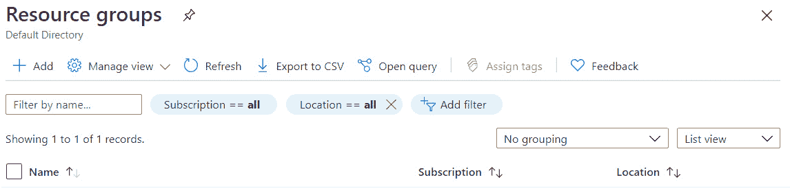

    图 14.2–资源组页面

2.  Fill in the form that opens. Choose an appropriate name for the resource group. We'll need to use this name later in this chapter, so make sure you remember it. Click the **Review + create** button, as illustrated in the following screenshot:

    

    图 14.3–创建资源组

3.  点击打开的查看屏幕上的**创建**按钮。我们的资源组最终将显示在资源组列表中，如以下屏幕截图所示：


图 14.4–资源组列表和我们的新资源组

重要提示

如果几秒钟后资源组没有显示，点击**刷新**选项刷新资源组。

我们的资源组现在已经准备好提供其他服务。在提供任何其他服务之前，我们将在下一节为生产配置后端。

# 为登台和生产配置 ASP.NET 核心后端

在本节中，我们将创建单独的`appsettings.json`文件，用于暂存和生产以及开发中的本地工作。让我们在 Visual Studio 中打开后端项目，并执行以下步骤：

1.  Let's now go to **Solution Explorer**, as illustrated in the following screenshot:

    

    图 14.5–解决方案资源管理器中的 appsettings 文件

    请注意，有两个设置文件以单词`appsettings`开头。

    重要提示

    我们可以为不同的环境提供不同的设置文件。`appsettings.json`文件是默认设置文件，可以包含所有环境通用的设置。当我们在 Visual Studio 中运行后端并覆盖`appsettings.json`文件中的任何重复设置时，在开发过程中使用`appsettings.Development.json`。文件名的中间部分需要匹配名为`ASPNETCORE_ENVIRONMENT`的环境变量，该变量在 Visual Studio 中默认设置为`Development`，在 Azure 中默认设置为`Production`。因此，`appsettings.Production.json`可用于 Azure 中特定于生产环境的设置。

2.  At the moment, all of our settings are in the default `appsettings.json` file. Let's add our `ConnectionStrings` setting and also a frontend setting to the `appsettings.Development.json` file, as follows:

    ```cs
    {
      "ConnectionStrings": {
        "DefaultConnection": 
          "Server=localhost\\SQLEXPRESS;Database=
            QandA;Trusted_Connection=True;"
      },
      "Frontend": "http://localhost:3000"
    }
    ```

    我们将在默认的`appsettings.json`文件中保留 Auth0 设置，因为这些设置将应用于所有环境。

3.  从默认的`appsettings.json`文件中删除`ConnectionStrings`设置。
4.  Let's add an `appsettings.Production.json` file now by right-clicking the **QandA** project in **Solution Explorer**, choosing **Add |** **New Item...**, selecting the **App Settings File** item, naming the file `appsettings.Production.json`, and then clicking the **Add** button, as illustrated in the following screenshot:

    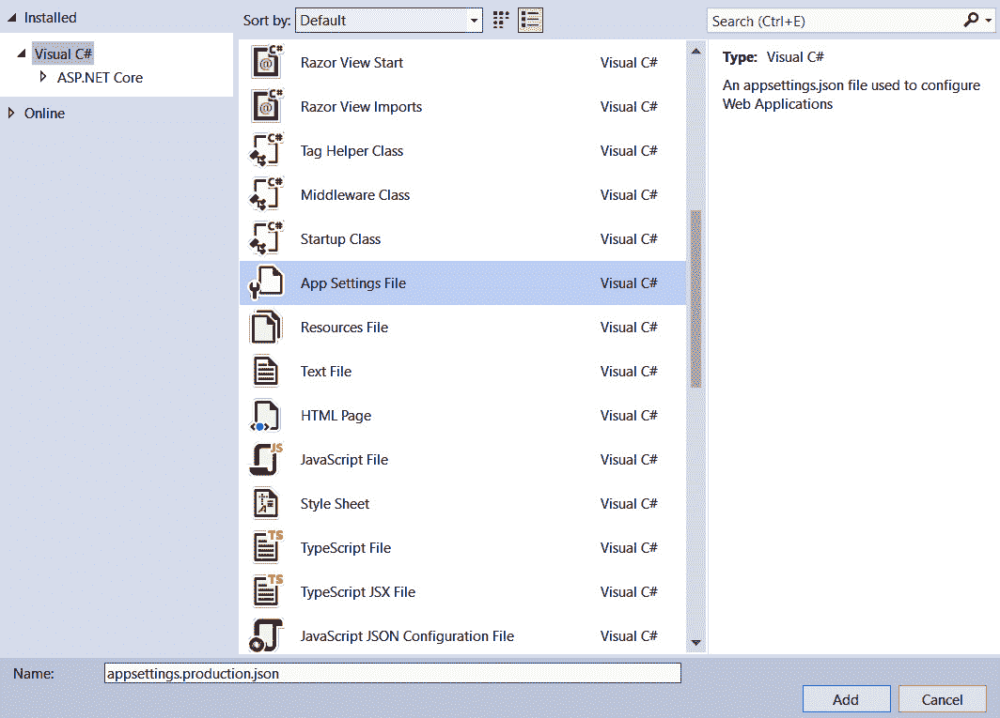

    图 14.6–为生产添加 appsettings 文件

5.  Replace the content in the `appsettings.Production.json` file with the following:

    ```cs
    {
      "Frontend": "https://your-
        frontend.azurewebsites.net"
    }
    ```

    因此，这包含我们将在 Azure 中创建的生产前端 URL。请注意此设置，因为在 Azure 中配置前端时需要它。

6.  类似地，让我们添加一个具有以下 c内容的`appsettings.Staging.json`文件：

    ```cs
    {
      "Frontend": "https://your-frontend-
        staging.azurewebsites.net"
    }
    ```

我们尚未指定生产或暂存连接字符串，因为我们将在 Azure 中存储这些字符串。这是因为这些连接字符串存储秘密用户名和密码，在 Azure 中比我们的源代码更安全。

我们现在已经准备好开始创建 Azure 服务并部署我们的后端。我们将在下一节中进行此操作。

# 将我们的 ASP.NET 核心后端发布到 Azure

在本节中，我们将使用 VisualStudio 将数据库和后端 API 部署到 Azure。我们将创建发布配置文件，以便部署到生产环境和暂存环境。在创建概要文件的过程中，我们将创建所需的 Azure 应用服务和 SQL 数据库。在本节的最后，我们将有两个概要文件，可用于快速部署到我们的暂存和生产环境。

## 从出版到生产

让我们执行以下步骤来创建生产部署配置文件，并使用它将后端部署到生产：

1.  在**解决方案浏览器**中，右键点击**QandA**项目，选择**发布。。。**。
2.  The **Publish** dialog opens, which asks us to choose a publish target. Choose **Azure** and click **Next**, as illustrated in the following screenshot:

    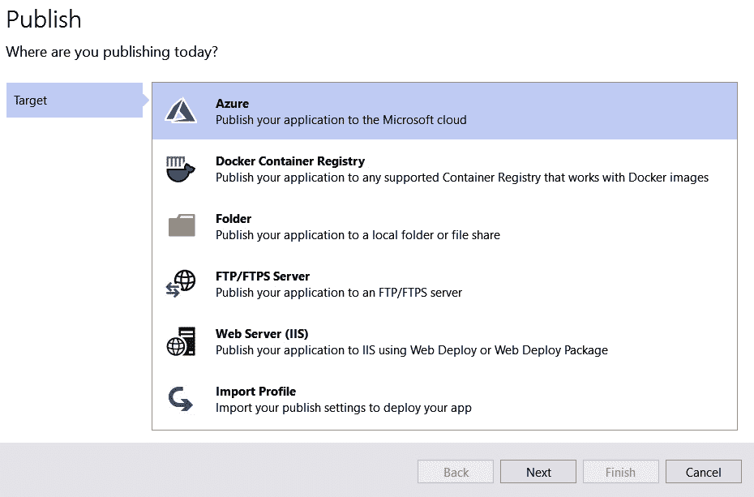

    图 14.7–选择 Azure 作为发布目标

3.  We are then asked which service we want to deploy to in Azure. Select the **Azure App Service (Windows)** option and click **Next**, as illustrated in the following screenshot:

    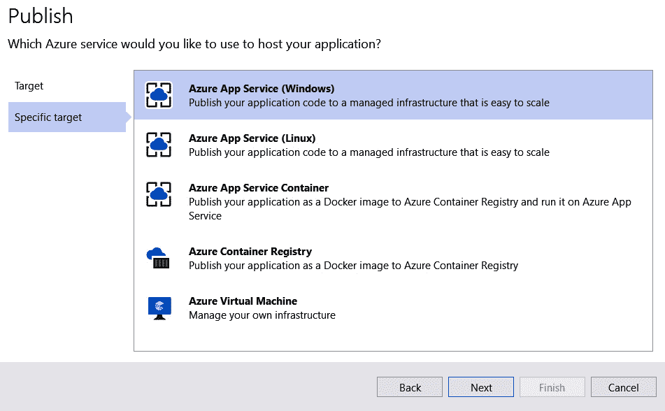

    图 14.8–选择 Azure 应用服务作为发布特定目标

4.  The next step is to specify our Microsoft account. We could then search for and select an existing app service to deploy to. However, we are going to create a new app service, so click the green plus icon, as illustrated in the following screenshot:

    

    图 14.9–选择或创建新的应用服务

5.  Fill in the name for the production app service. This name will form part of the URL to the **REpresentational State Transfer** (**REST**) API, so the name will need to be globally unique. In the example in the following screenshot, the URL will be [https://qanda2021.azurewebsite.net](https://qanda2021.azurewebsite.net). Note down the name you choose, because we'll eventually reference this in the frontend project:

    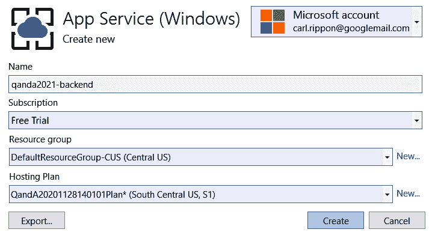

    图 14.10–创建应用服务

6.  您可以选择应用服务的默认托管计划。或者，您可以通过单击**新建…**选项将其与新的关联。
7.  单击**创建**以创建应用服务。这将需要几分钟时间完成。
8.  After the app service has been created, the **Create New App Service** dialog will close and we will see the app service in the **App Service instances** list on the **Publish** dialog. Select the new app service and click **Next**, as illustrated in the following screenshot:

    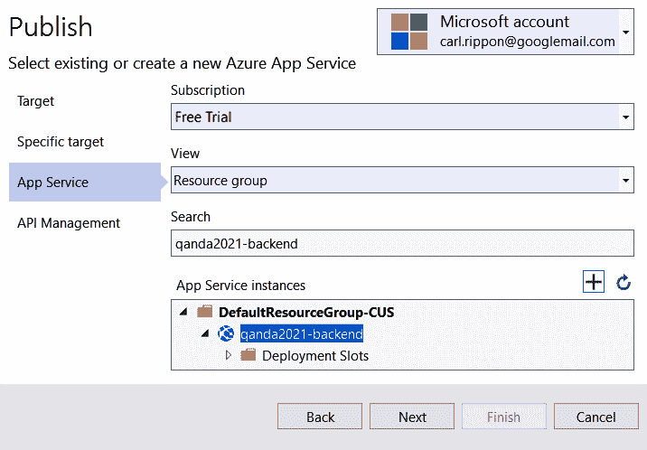

    图 14.11–选择要部署到的应用服务

9.  We will skip the next step for API Management. Check the **Skip this step** checkbox and click **Finish**. The profile for our production deployment is now saved and we are taken to a screen that summarizes it, as illustrated in the following screenshot:

    

    图 14.12–发布配置摘要

10.  Our app service is created but our backend still isn't deployed. We can confirm this by browsing to the link to the right of **Site URL**, which results in the following screen:

    

    图 14.13–未部署站点的应用服务 URL

11.  我们还没有设置任何东西来托管 SQL 数据库。现在，我们将通过在 Visual Studio 中单击概要文件摘要中**服务依赖项**部分的**添加**选项来完成此操作。
12.  The **Add dependency** dialog opens. Choose **Azure SQL Database** and click **Next**, as illustrated in the following screenshot:

    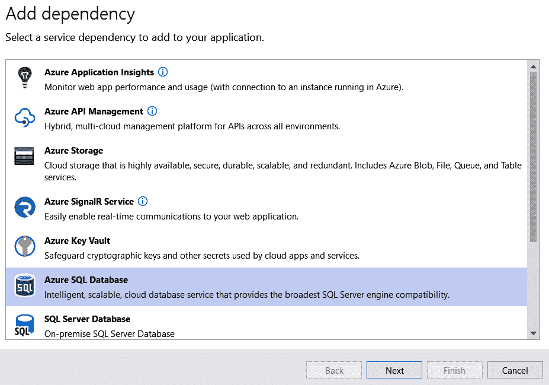

    图 14.14–选择 Azure SQL 数据库

13.  The dialog then shows the SQL databases in our Azure subscription. Click the green plus icon to create a new SQL database, as illustrated in the following screenshot:

    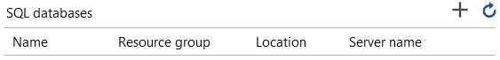

    图 14.15–创建新 SQL 数据库的选项

14.  在打开的对话框中，输入您选择的数据库名称。我们以后会需要这个，所以请记下来。
15.  我们需要创建一个新的数据库服务器，所以点击**新建。。。**数据库服务器**字段右侧的**选项。
16.  Fill in the server details in the dialog that appears. Choose your own server name, username, and password. Take note of these details because we will need these again in a later step. Click the **OK** button to confirm the server details, as illustrated in the following screenshot:

    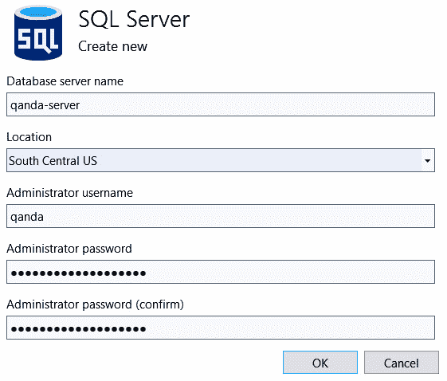

    图 14.16–新建 SQL Server 对话框

17.  Click the **Create** button on the **Azure SQL Database** dialog, as illustrated in the following screenshot. This will create the database in Azure, so it may take a few minutes to complete:

    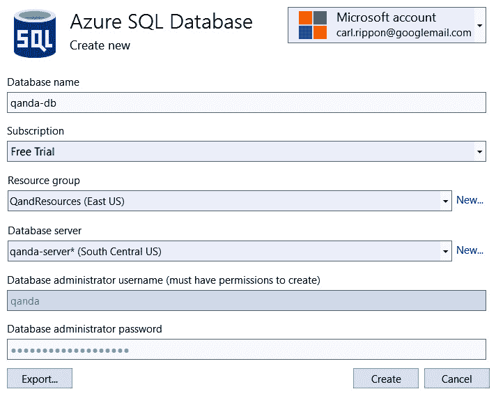

    图 14.17–新建 SQL 数据库对话框

18.  After the database has been created, the **Azure SQL Database** dialog will close. The database will appear in the **SQL databases** list in the **Configure Azure SQL Database** dialog. Click on the database we have just created to select it, and click **Next**, as illustrated in the following screenshot:

    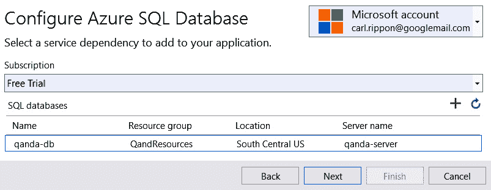

    图 14.18–SQL 数据库列表

19.  Next, we are asked to define our database connection string. Make sure the connection name is `DefaultConnection`, and fill in the username and password we entered earlier when creating our database. Select **Azure App Settings** for where to save the connection string, and click **Next**, as illustrated in the following screenshot:

    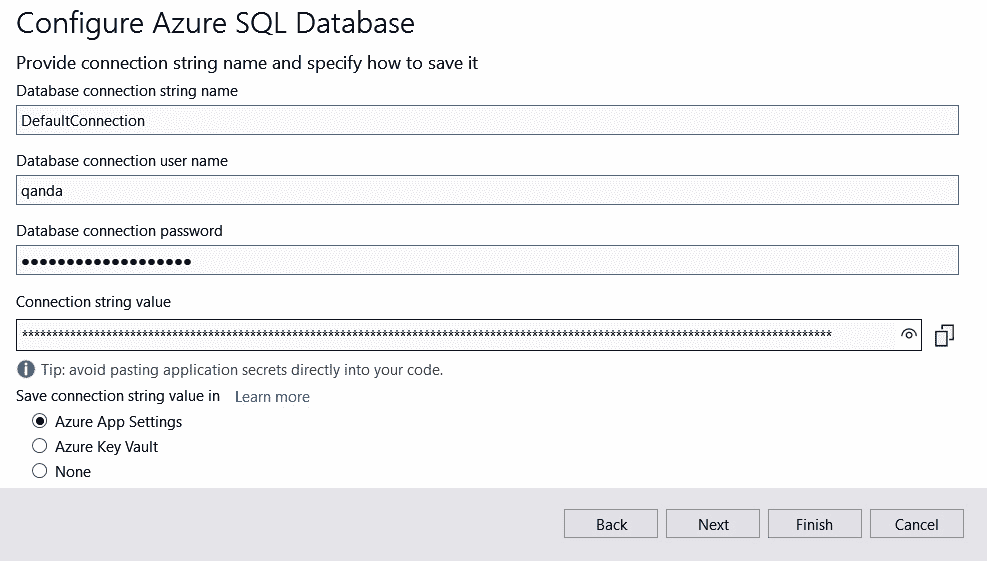

    图 14.19–连接字符串配置

    此连接字符串现在将存储在 Azure 应用服务的**应用设置**部分。

20.  在出现的摘要对话框中按**完成**，然后按**关闭**。
21.  We are taken back to the summary of the publish configuration, with confirmation that the SQL database has been configured, as illustrated in the following screenshot:

    

    图 14.20–发布配置摘要

22.  The last thing to do before we deploy is to configure the deployment so that the .NET Core runtime and libraries are included in the deployment. We do this by clicking the pencil icon against **Deployment mode**, setting **Deployment Mode** to be **Self-Contained** in the dialog that appears, and clicking **Save**, as illustrated in the following screenshot:

    

    图 14.21–将部署模式设置为自包含

23.  单击**发布**按钮将我们的代码部署到 Azure。这需要几分钟才能完成。
24.  最终，将打开一个浏览器窗口，其中包含到已部署后端的路径。在浏览器中的路径中添加`/api/questions`，如下图所示：


图 14.22–Azure 中的 REST API

我们将看到数据库中的默认问题。祝贺我们刚刚在 Azure 中部署了我们的第一个 SQL 数据库和 ASP.NET 核心应用！

让我们导航到[进入 Azure 门户 https://portal.azure.com](https://portal.azure.com) 。选择**所有资源**选项，将出现以下屏幕：

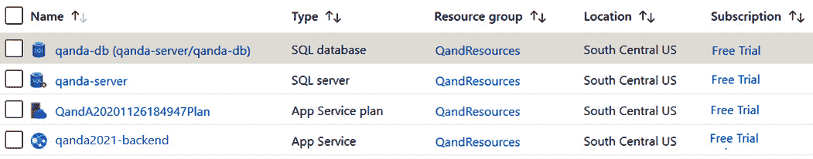

图 14.23–Azure 中提供的服务

正如预期的那样，我们看到了刚才提供的服务。

杰出的我们刚刚在 Azure 中成功部署了我们的后端！

随着后端的进一步开发，我们可以返回此配置文件并使用**发布**按钮快速部署更新的后端。

接下来，让我们按照类似的流程部署到临时环境。

## 发布到登台

让我们执行以下步骤将后端部署到暂存环境：

1.  在**解决方案浏览器**中，右键点击**QandA**项目，选择**发布。。。**。这将打开发布屏幕，在那里我们将看到我们的产品发布配置文件。
2.  选择**新建**选项创建新的发布配置文件。
3.  选择**Azure**作为目标，点击**下一步**。
4.  选择**Azure 应用服务（Windows）**作为具体目标，点击**下一步**。
5.  单击绿色加号图标添加新的 Azure 应用服务。
6.  在出现的对话框中，输入新应用服务的名称。这将是在登台环境中承载后端的服务。记下您选择的名称，因为我们最终将在前端项目中引用此名称。使用与生产环境相同的资源组和托管计划。单击**创建**在 Azure 中创建应用服务。这需要几分钟的时间。
7.  当**App 服务**对话框关闭后，我们将返回**发布**对话框。确保在**应用服务实例**列表中选择了我们的暂存应用服务，然后单击**下一步**。
8.  勾选**跳过此步骤**复选框，跳过**API 管理**步骤。
9.  按**完成**保存发布配置文件。
10.  我们想创建我们的暂存数据库，所以点击**服务依赖项**部分中的**配置**选项。
11.  在出现的对话框中选择**Azure SQL 数据库**，点击**下一步**。
12.  单击绿色加号图标以创建数据库。此时会打开**Azure SQL 数据库**对话框。
13.  输入您选择的数据库名称。我们以后会需要这个，所以请记下来。
14.  我们将为登台环境创建一个新的数据库服务器，因此单击**新建。。。**数据库服务器**字段右侧的**选项。
15.  在出现的对话框中填写服务器详细信息。选择您自己的服务器名称、用户名和密码。请注意这些细节，因为我们将在稍后的步骤中再次需要这些细节。点击**确定**按钮确认这些细节。
16.  点击**Azure SQL 数据库**对话框上的**创建**按钮。这将在 Azure 中创建数据库，因此可能需要几分钟才能完成。
17.  当**Azure SQL 数据库**对话框关闭后，我们将返回**配置 Azure SQL 数据库**对话框。确保选择了我们的暂存数据库，然后单击**下一步**。
18.  接下来，要求我们定义数据库连接字符串。将连接名称保留为`DefaultConnection`，并填写我们之前在创建临时数据库时输入的用户名和密码。选择**Azure 应用设置**并单击**下一步**。
19.  在出现的摘要对话框上按**完成**，然后按**关闭**。
20.  在发布摘要中，点击**部署模式**对应的铅笔图标，并在出现的对话框中将**部署模式**设置为**独立**。点击**保存**。
21.  然后，我们可以通过单击**发布**按钮将代码发布到 Azure 服务。同样，这需要几分钟才能完成。
22.  最终将打开一个浏览器窗口，指向新的暂存应用服务。如果我们在浏览器中的路径中添加`/api/questions`，我们将看到从暂存数据库返回的数据。
23.  我们需要告诉我们的新应用服务，它是暂存环境，而不是生产环境。这是因为它使用了`appsettings.Staging.json`文件，其中包含**跨源资源共享**（**CORS**的`Frontend`设置。默认情况下，Azure 假定环境是生产环境，这意味着目前正在使用`appsettings.Production.json`文件。让我们转到 Azure 门户并在**应用服务**区域中选择登台应用服务。
24.  在**设置**区域，选择**配置**进入**应用设置**页签。
25.  在**应用设置**下，点击**新建应用设置**选项，输入`ASPNETCORE_ENVIRONMENT`作为名称，`Staging`作为值，然后点击**确定**按钮，然后点击**保存**按钮。这将创建一个名为`ASPNETCORE_ENVIRONMENT`的环境变量，该变量具有`Staging`值。ASP.NET Core 将查看此变量，然后使用`appsettings.Staging.json`文件进行配置设置，如以下屏幕截图所示：


图 14.24–Azure 应用服务应用设置

这就完成了将我们的应用部署到登台环境的过程。

这是巨大的进步！Azure 与 VisualStudio 完美配合。在下一节中，我们将把注意力转向前端，并对其进行更改，使其能够在 Azure 暂存和生产环境以及开发中工作。

# 配置 React 前端进行暂存和生产

在本节中，我们将更改前端，以便它在登台和生产中向正确的后端 API 发出请求。目前，restapi 有一个硬编码路径设置为 localhost。我们将像在后端一样使用环境变量来区分不同的环境。让我们在 Visual Studio 代码中打开前端项目，并执行以下步骤：

1.  首先，我们将安装一个名为`cross-env`的库，它允许我们设置环境变量。让我们在终端中执行以下命令：

    ```cs
    > npm install cross-env --save-dev
    ```

2.  让我们在`package.json`中添加以下脚本来执行暂存和生产构建：

    ```cs
    "scripts": {
      ...,
      "build": "react-scripts build",
     "build:production": "cross-env 
     REACT_APP_ENV=production npm run build",
     "build:staging": "cross-env REACT_APP_ENV=staging 
     npm run build",
      ...
    },
    ```

3.  These scripts use the `cross-env` library to set an environment variable called `REACT_APP_ENV` to `staging` and `production` before doing an optimized build.

    因此，`npm run build:staging`将执行一个分段构建，`npm run build:production`将执行一个生产构建。

4.  在`AppSettings.ts`文件中设置`server`变量时，让我们使用`REACT_APP_ENV`环境变量。打开`AppSettings.ts`并进行以下更改：

    ```cs
    export const server =
      process.env.REACT_APP_ENV === 'production'
     ? 'https://your-backend.azurewebsites.net'
     : process.env.REACT_APP_ENV === 'staging'
     ? 'https://your-backend-staging.azurewebsites.net'
     : 'http://localhost:17525';
    ```

我们使用一个三元表达式来设置正确的后端位置，这取决于应用运行的环境。生产服务器设置为`https://your-backend.azurewebsites.net`，暂存服务器设置为`https://your-backend-staging.azurewebsites.net`。

确保输入的暂存和生产位置与已部署后端的位置匹配：

1.  为了让深层链接在 Azure 中工作，我们需要指定 URL 重写规则，将所有请求重定向到前端到我们的`index.html`文件。我们可以通过在`public`文件夹中添加一个`web.config`文件，该文件的内容如下：

    ```cs
    <?xml version="1.0" encoding="utf-8"?>
    <configuration>
      <system.webServer>
        <rewrite>
          <rules>
            <rule name="React Routes" 
              stopProcessing="true">
              <match url=".*" />
              <conditions logicalGrouping="MatchAll">
                <add input="{REQUEST_FILENAME}" 
                  matchType="IsFile" negate="true" />
              </conditions>
              <action type="Rewrite" url="/"
                appendQueryString="true" />
            </rule>
          </rules>
        </rewrite>
      </system.webServer>
    </configuration>
    ```

2.  现在，让我们为部署前端做最后一件事。让我们更改应用以呈现我们所处的环境。让我们打开`Header.tsx`并在首页链接中的应用名称后添加环境名称，如下：

    ```cs
    <Link
      to="/"
      css={ ... }
    >
      Q & A
     <span
     css={css`
     margin-left: 5px;
     font-size: 14px;
     font-weight: normal;
     `}
     >
     {process.env.REACT_APP_ENV || 'dev'}
     </span>
    </Link>
    ```

如果没有填充环境变量，我们假设我们处于开发环境中。

这就完成了我们需要对前端进行的更改。在下一节中，我们将把前端部署到 Azure。

# 将 React 前端发布到 Azure

在本节中，我们将把我们的 React 前端部署到 Azure，同时部署到登台和生产环境。

## 从出版到生产

让我们执行以下步骤将我们的前端发布到生产环境：

1.  我们将从配置 Azure 应用服务开始。因此，让我们在浏览器中转到 Azure 门户，转到**应用服务**区域，然后单击**添加**选项。
2.  选择现有资源组，选择应用名称，选择`.NET 5`作为运行时堆栈，选择`Windows`作为操作系统，完成打开的表单。请注意，我们选择的应用名称需要反映在后端项目的`appsettings.Production.json`文件中的`Frontend`设置中。点击**查看+创建**按钮，然后点击**创建**按钮创建应用服务。
3.  Let's move to Visual Studio Code now and create a production build by running the following command in the Terminal:

    ```cs
    > npm run build:production
    ```

    构建完成后，生产构建将包含`build`文件夹中的所有文件。

4.  We are going to use the **Azure App Service** extension to perform the Azure deployment. So, go to the **Extensions** area in Visual Studio Code (*Ctrl* + *Shift* + *X*), search `Azure App Service`, and install the extension shown in the following screenshot:

    

    图 14.25–Visual Studio 代码中的 Azure 应用服务扩展

5.  Click the Azure icon in the left-hand navigation options to open the Azure App Service panel, as illustrated in the following screenshot:

    

    图 14.26–Azure 应用服务面板

6.  点击**登录 Azure。。。**选项。系统会提示我们输入 Microsoft 帐户凭据，因此让我们输入这些凭据。
7.  We should see the frontend app service listed in the tree. Right-click on this and choose the **Deploy to Web App...** option, as illustrated in the following screenshot:

    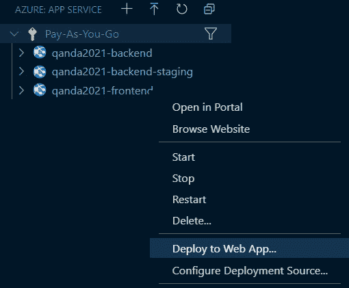

    图 14.27–将应用部署到 Azure 应用服务

8.  当提示部署文件夹时，我们应该选择我们的`build`文件夹。
9.  We are then asked to confirm the deployment, which we do by clicking the **Deploy** button, as illustrated in the following screenshot:

    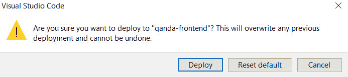

    图 14.28–部署确认

10.  Deployment will take a minute or so before we get confirmation that it is complete, as illustrated in the following screenshot:

    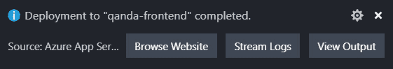

    图 14.29–部署完成确认

11.  如果我们点击**浏览网站**选项，我们在 Azure 中的前端将显示在浏览器中，如以下屏幕截图所示：


图 14.30–生产中运行的问答应用

我们的前端现在很好地部署到了生产环境中。我们将无法成功登录，但我们将在将前端发布到登台环境后解决此问题。

## 发布到登台

让我们执行以下步骤将前端部署到暂存环境：

1.  我们将从提供另一个 Azure 应用服务开始。因此，让我们在浏览器中转到 Azure 门户，转到**应用服务**区域，然后单击**添加**选项。
2.  输入应用名称并选择现有资源组。请记住，我们选择的应用名称需要反映在后端项目中`appsettings.Staging.json`文件的`Frontend`设置中。还要记住，运行时堆栈应该是`.NET 5`，而`Windows`应该是操作系统。点击**查看+创建**按钮，然后点击**创建**按钮创建应用服务。
3.  Let's move to Visual Studio Code now and create a staging build by running the following command in the Terminal:

    ```cs
    > npm run build:staging
    ```

    构建完成后，暂存构建将由覆盖生产构建的`build`文件夹中的所有文件组成。

4.  在Visual Studio 代码中的**Azure 应用服务**部分，我们应该看到树中列出的前端登台应用服务。请注意，我们可能需要单击**刷新**工具栏选项，它才会出现。右键单击前端登台应用服务并选择**部署到 Web 应用。。。**选项。
5.  我们应该在提示部署文件夹时选择我们的`build`文件夹，然后在提示时确认部署。
6.  After a minute or so, we'll get confirmation that the deployment is complete. If we click on the **Browse Website** option, our staging frontend in Azure will show in a browser, as illustrated in the following screenshot:

    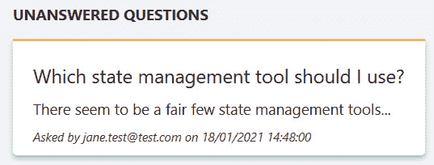

    图 14.31–在暂存中运行的问答应用

7.  Next, let's tell Auth0 about the Azure staging and production URLs it should trust. In Auth0, we need to update the following settings against our Q&A application. Refer to [*Chapter 11*](11.html#_idTextAnchor242), *Securing the Backend,* if you can't remember how to do this.

    **允许的回调 URL**-如下截图所示：


图 14.32–Auth0 允许的回调 URL

**允许的网络来源**-如下截图所示：


图 14.33–Auth0 允许的 web 来源

**允许的注销 URL**-如下截图所示：


图 14.34–Auth0 允许的注销 URL

我们可以通过点击左侧导航菜单中的**应用**项，然后点击**Q 和**应用来找到这些设置。在开发环境 URL 之后，我们为登台和生产环境添加了额外的 URL。不同环境的 URL 需要用逗号分隔。

我们现在应该能够成功登录到我们的生产和登台问答应用。

这就完成了前端在生产环境和暂存环境中的部署。

# 总结

Azure 与 React 和 ASP.NET 核心应用完美配合。在 ASP.NET Core 中，我们可以使用不同的`appsettings.json`文件来存储不同环境的不同设置，例如 CORS 的前端位置。在 React 代码中，我们可以使用环境变量向适当的后端发出请求。我们还需要在我们的 React 应用中包含一个`web.config`文件，以便将深层链接重定向到`index.html`页面，然后由 React 路由器处理。可以在每个环境的特定构建`npm`脚本中设置环境变量。本章中我们使用了三种环境，但前端和后端都可以轻松配置以支持更多环境。

Azure 集成了 Visual Studio 和 Visual Studio 代码，使部署 React 和 ASP.NET 核心应用变得轻而易举。我们使用内置的**发布。。。Visual Studio 中的**选项，为 SQL 数据库提供应用服务，然后执行部署。我们还可以在 Azure 门户中提供应用服务，这是我们为前端所做的。然后，我们可以使用**Azure 应用服务 Visual Studio 代码**扩展将前端部署到应用服务。

虽然将我们的应用部署到 Azure 非常简单，但当我们将代码签入源代码管理时，我们可以通过自动化部署使之更加容易。我们将在下一章中这样做。

# 问题

以下问题将测试我们在本章学到的知识：

1.  在 ASP.NET Core 中，存储特定于生产环境的任何设置的文件名是什么？
2.  我们的 ASP.NET 核心后端需要`Frontend`设置的原因是什么？
3.  Let's pretend we have introduced a QA environment and have created the following `npm` script to execute a build for this environment:

    ```cs
    "build:qa": "cross-env REACT_APP_ENV=qa npm run build"
    ```

    我们将使用哪个`npm`命令生成 QA 构建？

4.  如果我们的 React 前端没有包含`web.config`文件，会有什么问题？
5.  为什么我们不将生产和暂存连接字符串存储在`appsettings.Product.json`或`appsettings.Staging.json`文件中？

# 答案

1.  在 ASP.NET Core 中，存储特定于生产环境的任何设置的文件名称为`appsettings.Production.json`。
2.  我们的 ASP.NET 核心后端需要`Frontend`设置的原因是在 CORS 策略中设置允许的来源。
3.  我们将使用`npm run build:qa`生成 QA 构建。
4.  如果我们的 React 前端没有包含`web.config`文件，我们将无法深入链接到我们的应用，例如，将问题的路径（例如`https://qandafrontend.z19.web.core.windows.net/questions/1`）直接放在浏览器的地址栏中，然后按*Enter*将导致返回**页面未找到**错误。
5.  连接字符串包含一个秘密用户名和密码。将这些存储在 Azure 中比存储在源代码中更安全。

# 进一步阅读

以下资源可用于查找有关将 ASP.NET Core 和 React 应用部署到 Azure 的更多信息：

*   **在 ASP.NET 核心**：[中使用多种环境 https://docs.microsoft.com/en-us/aspnet/core/fundamentals/environments](https://docs.microsoft.com/en-us/aspnet/core/fundamentals/environments)
*   **将 ASP.NET 核心应用部署到 Azure 应用服务**：[https://docs.microsoft.com/en-us/aspnet/core/host-and-deploy/azure-apps](https://docs.microsoft.com/en-us/aspnet/core/host-and-deploy/azure-apps)
*   **从 VS 代码**：[向 Azure 部署静态网站 https://code.visualstudio.com/tutorials/static-website/getting-started](https://code.visualstudio.com/tutorials/static-website/getting-started)