# 十五、使用 Azure DevOps 实现 CI 和 CD

在本章中，我们将使用 Azure DevOps 为我们的 Q&A 应用实现**持续集成**（**CI**）和**持续交付**（**CD**）。在进入 Azure DevOps 之前，我们将首先确切了解 CI 和 CD 是什么。

在 Azure DevOps 中，我们将使用构建管道为前端和后端实现 CI。当开发人员将代码推送到源代码存储库时，将触发 CI 过程。然后，我们将使用一个发布管道为前端和后端实现 CD，该发布管道将在 CI 构建成功完成时自动触发。发布管道将自动向登台环境进行部署，运行后端集成测试，然后将登台部署升级到生产环境。

到本章结束时，我们将拥有一个强大的过程，以难以置信的速度向用户提供功能，并具有极高的可靠性，从而使我们的团队非常高效。

在本章中，我们将介绍以下主题：

*   开始使用 CI 和 CD
*   实施 CI
*   实施 CD

# 技术要求

在本章中，我们将使用以下工具和服务：

*   **GitHub**：本章假设我们应用的源代码托管在 GitHub 上。可在[免费设置账户和存储库 https://github.com](https://github.com) 。
*   **Azure DevOps**：我们将使用它来实现和托管 CI 和 CD 流程。这可以在[找到 https://dev.azure.com/](https://dev.azure.com/) 。
*   **Microsoft Azure**：我们将使用上一章中设置的 Azure 应用服务和 SQL 数据库。Azure 门户可在[找到 https://portal.azure.com](https://portal.azure.com) 。
*   **Visual Studio 代码**：可从[下载安装 https://code.visualstudio.com/](https://code.visualstudio.com/) 。
*   **Node.js 和 npm**：可从[下载 https://nodejs.org/](https://nodejs.org/) 。如果已经安装了这些，请确保 Node.js 至少为 8.2 版，npm 至少为 5.2 版。
*   **Q 和 A**：我们将从上一章中完成的 Q 和 A 前端和后端项目开始，这些项目可在[上获得 https://github.com/PacktPublishing/ASP.NET-Core-5-and-React-Second-Edition `chapter-15/start`文件夹中的](https://github.com/PacktPublishing/ASP.NET-Core-5-and-React-Second-Edition)。

本章中的所有代码片段可在网上[找到 https://github.com/PacktPublishing/ASP.NET-Core-5-and-React-Second-Edition](https://github.com/PacktPublishing/ASP.NET-Core-5-and-React-Second-Edition) 。为了从章节中恢复代码，可以下载源代码存储库，并在相关编辑器中打开相关文件夹。如果代码为前端代码，则可在终端中输入`npm install`恢复依赖关系。

查看以下视频以查看代码的运行：[https://bit.ly/3mE6Qta](https://bit.ly/3mE6Qta) 。

# 开始使用 CI 和 CD

在本节中，我们将首先了解 CI 和 CD 是什么，然后再更改前端代码，以允许前端测试在 CI 中工作。然后，我们将创建 Azure DevOps 项目，它将承载我们的构建和发布管道。

## 理解 CI 和 CD

CI 是开发人员工作副本每天数次合并到源代码系统中的共享主代码分支的过程，自动触发即所谓的**构建**。构建是自动生成成功部署、测试和运行生产软件所需的所有工件的过程。CI 的好处是，它会自动向团队反馈所做更改的质量。

CD 是开发人员以可持续的方式定期、安全地将软件更改投入生产的过程。因此，这是从 CI 获取构建并将其部署到生产环境的过程。CI 构建可以部署到登台环境，在登台环境中，端到端测试在部署到生产环境之前执行并通过。在最极端的情况下，CD 过程是完全自动化的，并在 CI 构建完成时触发。通常，团队成员必须批准将软件部署到生产环境的最后一步，这一步应该已经通过了一系列的自动测试。CD 也不总是在 CI 构建完成时自动触发；有时，它会在一天中的特定时间自动触发。CD 的好处是开发团队更快、更可靠地向软件用户提供价值。

下图显示了我们将要设置的高级 CI 和 CD 流：

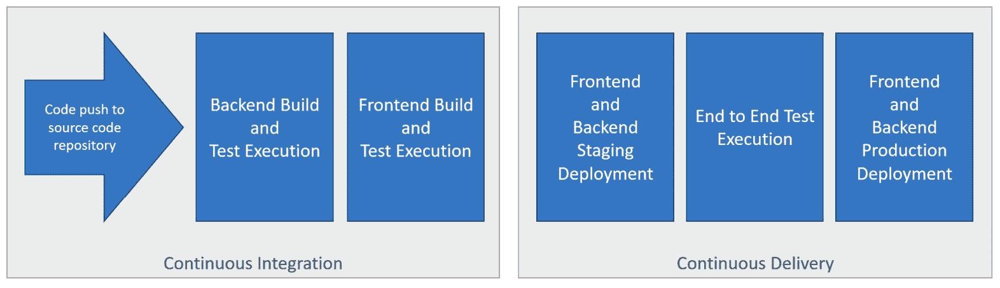

图 15.1–高级 CI 和 CD 流程

当代码被推送到源代码存储库时，我们将构建所有后端和前端构件，并执行 xUnit 和 Jest 测试。如果构建和测试成功，这将自动启动临时部署。Cypress 测试将在临时部署上执行，如果通过，将触发生产部署。

## 使我们的测试能够在 CI 和 CD 中运行

我们需要对前端测试和端到端测试的配置进行一些更改，以便它们在构建和部署管道中正确执行。让我们在 Visual Studio 代码中打开前端项目，并进行以下更改：

1.  First, we'll add a script named `test:ci` in the `package.json` file, which will run the Jest tests in CI mode, as follows:

    ```cs
    ...
    "scripts": {
      ...
      "test": "react-scripts test",
      "test:ci": "cross-env CI=true react-scripts test",
      ...
    },
    ...
    ```

    在运行 Jest 测试之前，该脚本将名为`CI`的环境变量设置为`true`。

2.  Our Cypress tests are going to execute in the deployment pipeline on the staging app after it has been deployed. We need to do a few things to ensure that our Cypress tests run in the deployment pipeline. First, let's create a `cypress.json` file in the `cypress` folder with the following content:

    ```cs
    {
      "baseUrl": "https://your-frontend-
        staging.azurewebsites.net",
      "integrationFolder": "integration",
      "pluginsFile": "plugins/index.js",
      "supportFile": "support/index.js",
      "chromeWebSecurity": false
    }
    ```

    这将是部署后在登台应用上运行测试的`cypress.json`文件。以下是我们添加的设置说明：

    *   `baseUrl`：这是应用的根路径，应该是我们暂存应用的**统一资源定位符**（**URL**）。为您部署的暂存应用适当更改此选项。
    *   `integrationFolder`：相对于`cypress.json`文件，这是我们端到端测试所在的文件夹。在我们的例子中，这是一个名为`integration`的文件夹。
    *   `pluginsFile`：这是一个包含与`cypress.json`文件相关的任何插件的文件。在我们的例子中，这是一个名为`index.js`的文件，可以在`plugins`文件夹中找到。
    *   `supportFile`：这是一个相对于`cypress.json`文件的文件，其中包含测试运行前要执行的代码。在我们的例子中，这是一个名为`index.js`的文件，可以在`support`文件夹中找到。
    *   `chromeWebSecurity`：将其设置为`false`允许 Q&A 应用导航到 Auth0 进行身份验证。
3.  Next, let's create a `package.json` file in the `cypress` folder with the following content:

    ```cs
    {
      "name": "cypress-app-tests",
      "version": "0.1.0",
      "private": true,
      "scripts": {
        "cy:run": "cypress run"
      },
      "devDependencies": {
        "@testing-library/cypress": "^7.0.1",
        "cypress": "^5.4.0"
      }
    }
    ```

    该文件中的关键项是将 Cypress 和 Cypress 测试库声明为开发依赖项和`cy:run`脚本，稍后我们将使用该脚本来运行 Cypress 测试。

4.  接下来，我们将删除 Cypress 最初为我们安装的所有示例测试。那么，让我们从`integration`文件夹中删除`examples`文件夹，它可以在`cypress`文件夹中找到。现在，`integration`文件夹中唯一的文件应该是我们的`qanda.js`文件。

现在，我们的 Jest 和 Cypress 测试将能够在构建和部署期间执行。

## 创建 Azure DevOps 项目

Azure DevOps 可在[找到 https://dev.azure.com/](https://dev.azure.com/) 。如果我们还没有账户，我们可以免费创建一个账户。

要创建新项目，请单击主页上的**新建项目**按钮，并在出现的面板中输入项目名称。在点击**创建**按钮之前，我们可以选择将我们的项目公开或私有，如下图所示：

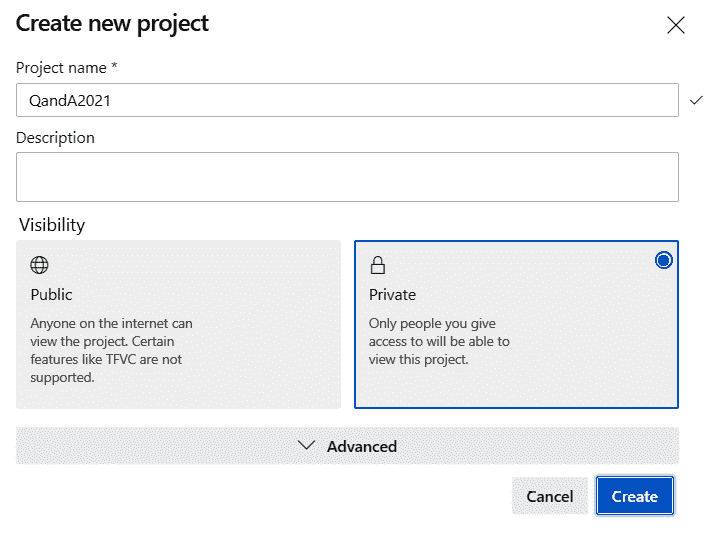

图 15.2–创建新的 Azure DevOps 项目

这就是我们创建的 AzureDevOps 项目。在下一节中，我们将在 Azure DevOps 项目中为 Q&a 应用创建一个构建管道。

# 实施 CI

在本节中，我们将使用 Azure DevOps 中的构建管道为我们的 Q&A 应用实现 CI。我们将从一个模板创建一个构建管道开始，并添加额外的步骤来构建 Q&a 应用的所有工件。当代码被推送到源代码存储库时，我们还将观察构建触发器。

## 创建构建管道

让我们通过执行以下步骤从模板创建构建管道：

1.  点击左侧导航菜单中的**管道**，然后点击**创建管道。**
2.  We will be asked to specify where our code repository is hosted, as illustrated in the following screenshot:

    

    图 15.3–为新构建管道选择代码存储库主机

3.  单击相应的选项。Azure DevOps 将通过授权过程来允许 Azure DevOps 访问我们的存储库。
4.  Then, we will be prompted to choose a specific repository for our code and authorize access to it, as illustrated in the following screenshot:

    

    图 15.4–为新构建管道选择代码存储库

5.  Azure DevOps 将检查存储库中的代码，以便为正在使用的技术建议合适的 CI 模板。选择**ASP.NET Core**模板。不要选择**ASP.NET Core（.NET Framework）**模板。您可能需要单击**显示更多**按钮来查找**ASP.NET Core**模板。
6.  Then, a build pipeline is created for us from the template. The steps in the pipeline are defined in an `azure-pipelines.yml` file, which will be added to our source code repository. We will make changes to this file in the next section, *Implementing CD*, but for now, let's click the **Save and run** button, as illustrated in the following screenshot:

    

    图 15.5–构建管道代码审查步骤

7.  点击出现的确认面板中的保存并运行按钮。将保存管道，并触发生成。构建将失败，但不要担心我们将在下一节*实现 CD*中解决此问题。
8.  After a minute or so, click on the **Pipelines** option in the **Pipelines** section. This lists the build pipelines in our project as well as useful information about when it was last run. We'll see confirmation that the pipeline failed, as illustrated in the following screenshot:

    

    图 15.6–建造管线清单

9.  单击列表中的此生成管道。然后，我们进入构建管道页面，该页面显示了它的运行历史。**编辑**选项允许我们更改构建管道。**运行管道**选项允许我们手动运行构建管道。以下屏幕截图显示了这些选项：


图 15.7–构建管道页面

这就是我们创建的基本构建管道。在下一节中，我们将完全实现 Q&A 应用的构建管道。

## 为我们的 Q&a 应用实现构建管道

我们现在将更改构建管道，以便它构建并发布我们的 Q&A 应用中的所有工件。我们需要的已发布工件如下所示：

*   `backend`：这将包含我们的.NET Core 后端，它将用于暂存和生产环境。
*   `frontend-production`：包含我们针对生产环境的 React 前端。
*   `frontend-staging`：这包含了我们针对登台环境的 React 前端。

让我们执行以下步骤：

1.  In our Azure DevOps project, on our build pipeline, click the **Edit** button to edit the pipeline. The build pipeline is defined in a **YAML Ain't Markup Language** (**YAML**) file called `azure-pipelines`. Azure DevOps lets us edit this file in its YAML editor.

    重要提示

    YAML 通常被用于配置文件，因为它比**JavaScript 对象表示法**（**JSON**）更紧凑，并且可以包含注释。

    以下 YAML 文件由 ASP.NET Core 构建管道模板生成：

    ```cs
    # ASP.NET Core
    # Build and test ASP.NET Core projects targeting .NET Core.
    # Add steps that run tests, create a NuGet package, deploy, and more:
    # https://docs.microsoft.com/azure/devops/pipelines/languages/dotnet-core
    trigger:
    - main
    pool:
      vmImage: 'ubuntu-latest'
    variables:
      buildConfiguration: 'Release'
    steps:
    - script: dotnet build --configuration $(buildConfiguration)
      displayName: 'dotnet build $(buildConfiguration)'
    ```

    重要提示

    构建中的步骤是在`steps:`关键字之后定义的。每个步骤在连字符（`-`后定义。`script:`关键字允许执行命令，而`displayName:`关键字是我们将在日志文件中看到的步骤描述。步骤中使用的变量在`variables:`关键字后声明。`trigger:`关键字决定何时启动构建。

    因此，构建包含一个步骤，该步骤执行`dotnet build`命令，并将`Release`传递到`--configuration`参数中。

2.  The reason our build failed was that the agent couldn't find a .NET solution to build because it isn't in the root directory in our source code repository—it is in a folder called `backend`. So, let's change this step to the following:

    ```cs
    steps:
    - script: dotnet build --configuration $(buildConfiguration)
     workingDirectory: backend
     displayName: 'backend build'
    ```

    我们已经指定工作目录为`backend`文件夹，并稍微更改了步骤名称。

3.  We are also going to make sure the build is using the correct version of .NET Core. Add the following highlighted lines as the first step, before the build step:

    ```cs
    steps:
    - task: UseDotNet@2
     inputs:
     packageType: 'sdk'
     version: '5.0.100'
    - script: dotnet build --configuration $(buildConfiguration)
      workingDirectory: backend
      displayName: 'backend build'
    ```

    如果您使用的是不同版本的.NET Core，请根据需要更改版本。

4.  构建管道的触发器目前设置为一个名为`main`的分支。将其更改为`master`，如下所示：

    ```cs
    trigger:
    - master
    ```

5.  让我们点击**保存**按钮来保存构建配置。
6.  A confirmation dialog appears that allows us to change the Git commit message and branch. Commit this to the master branch and click **Save**, as illustrated in the following screenshot:

    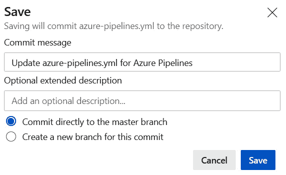

    图 15.8–构建管道保存确认

7.  A build will automatically be triggered because the `azure-pipelines.yml` file has changed in our repository. After a few minutes, go to the build pipeline page again. We'll see that the pipeline has succeeded this time, as illustrated in the following screenshot:

    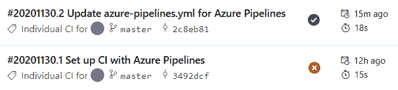

    图 15.9–成功构建管道执行

8.  We need to do more work in our build configuration before it is complete. So, let's edit the build pipeline again and add a step to run the .NET tests, as follows:

    ```cs
    steps:
    - task: UseDotNet@2
      inputs:
        packageType: 'sdk'
        version: '5.0.100'
    - script: dotnet build --configuration $(buildConfiguration)
      workingDirectory: backend
      displayName: 'backend build'
    - script: dotnet test
     workingDirectory: backend
     displayName: 'backend tests'
    ```

    在这里，我们使用命令来运行自动测试。

9.  Next, let's add a step so that we can publish the .NET backend, as follows:

    ```cs
    steps:
    ...
    - script: dotnet publish -c $(buildConfiguration) --self-contained true -r win-x86 
     workingDirectory: backend
     displayName: 'backend publish'
    ```

    在这里，我们使用`dotnet publish`命令来发布代码。`dotnet build`和`dotnet publish`有什么区别？嗯，`dotnet build`命令只是从我们编写的代码中输出工件，而不是任何第三方库，比如 Dapper。

    我们正在 win-86 体系结构下以自包含模式部署后端，就像我们在上一章使用 Visual Studio 时所做的那样。

10.  现在，我们需要使用`ArchiveFile@2`任务对发布的文件进行压缩，如下所示：

    ```cs
    steps:
    ...
    - task: ArchiveFiles@2
     inputs:
     rootFolderOrFile: 'backend/bin/Release/net5.0/win-
     x86/publish' 
     includeRootFolder: false
     archiveType: zip
     archiveFile: '$(Build.ArtifactStagingDirectory)/
     backend/$(Build.BuildId).zip'
     replaceExistingArchive: true 
     displayName: 'backend zip files'
    ```

11.  The last step for our backend build is to publish the ZIP file we have just created to the build pipeline so that it can be picked up by the release pipeline, which we'll configure in the next section. The code for this is illustrated in the following snippet:

    ```cs
    steps:
    ...
    - task: PublishBuildArtifacts@1
     inputs:
     pathtoPublish: '$(Build.ArtifactStagingDirectory)/
     backend' 
     artifactName: 'backend' 
     displayName: 'backend publish to pipeline'
    ```

    这里，我们使用`PublishBuildArtifacts@1`任务将 ZIP 文件发布到管道中。我们把它命名为`backend`。

    这就完成了后端的构建配置。现在让我们转到前端。

12.  In the same YAML file, add the following command to install the frontend dependencies:

    ```cs
    steps:
    ...
    - script: npm install
     workingDirectory: frontend
     displayName: 'frontend install dependencies'
    ```

    在这里，我们使用命令来安装依赖项。请注意，我们已经将工作目录设置为`frontend`，这就是前端代码所在的位置。

13.  The next step is to run the frontend tests, as follows:

    ```cs
    steps:
    ...
    - script: npm run test:ci
     workingDirectory: frontend
     displayName: 'frontend tests'
    ```

    在这里，我们使用`npm run test:ci`命令来运行测试，而不是`npm run test`，因为`CI`环境变量被设置为`true`，这意味着测试将在我们的构建中正确运行。

14.  In the next block of steps, we will produce a frontend build for the staging environment, zip up the files in this build, zip up the Cypress tests, and then publish this to the pipeline, like this:

    ```cs
    steps:
    ...
    - script: npm run build:staging
     workingDirectory: frontend
     displayName: 'frontend staging build'
    - task: ArchiveFiles@2
     inputs:
     rootFolderOrFile: 'frontend/build' 
     includeRootFolder: false
     archiveType: zip
     archiveFile: '$(Build.ArtifactStagingDirectory)/
     frontend-staging/build.zip'
     replaceExistingArchive: true 
     displayName: 'frontend staging zip files'
    - task: ArchiveFiles@2
     inputs:
     rootFolderOrFile: 'frontend/cypress' 
     includeRootFolder: false
     archiveType: zip
     archiveFile: '$(Build.ArtifactStagingDirectory)/
     frontend-staging/tests.zip'
     replaceExistingArchive: true 
     displayName: 'frontend cypress zip files'
    - task: PublishBuildArtifacts@1
     inputs:
     pathtoPublish: '$(Build.ArtifactStagingDirectory)/
     frontend-staging' 
     artifactName: 'frontend-staging' 
     displayName: 'frontend staging publish to pipeline'
    ```

    在这里，我们使用`npm run build:staging`命令生成登台构建，它将`REACT_APP_ENV`环境变量设置为`staging`。我们使用前面使用的`ArchiveFiles@2`任务压缩前端构建和 Cypress 测试，然后使用`PublishBuildArtifacts@1`任务将压缩文件发布到管道中。

15.  Next, we'll produce a build for the production environment, zip it up, and then publish this to the pipeline, as follows:

    ```cs
    steps:
    ...
    - script: npm run build:production
     workingDirectory: frontend
     displayName: 'frontend production build'
    - task: ArchiveFiles@2
     inputs:
     rootFolderOrFile: 'frontend/build' 
     includeRootFolder: false
     archiveType: zip
     archiveFile: '$(Build.ArtifactStagingDirectory)/
     frontend-production/build.zip'
     replaceExistingArchive: true 
     displayName: 'frontend production zip files'
    - task: PublishBuildArtifacts@1
     inputs:
     pathtoPublish: '$(Build.ArtifactStagingDirectory)/
     frontend-production' 
     artifactName: 'frontend-production' 
     displayName: 'frontend production publish to pipeline'
    ```

    这里，我们使用`npm run build:production`命令生成构建，它将`REACT_APP_ENV`环境变量设置为`production`。我们使用前面使用的`ArchiveFiles@2`任务压缩构建，并使用`PublishBuildArtifacts@1`任务将压缩文件发布到管道中。

16.  That completes the build configuration. So, let's save the build pipeline by clicking the **Save** button and then confirming this. The build will trigger and succeed, as illustrated in the following screenshot:

    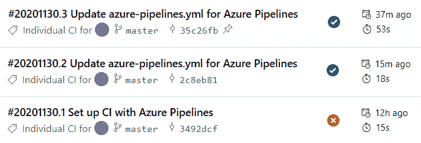

    图 15.10–另一个成功的管道执行

17.  让我们单击最近的管道运行以查看执行的详细信息。单击成功的作业，我们可以看到有关运行的每个步骤的信息，包括花费的时间，如以下屏幕截图所示：


图 15.11–管道步骤执行详细信息

这是我们的建造管道完成。我们将在下一节中使用发布的构建工件，当我们使用发布的管道将这些工件部署到 Azure 时。

# 实施 CD

在本节中，我们将通过为我们的应用实现 CD 流程，在 Azure DevOps 中实现发布管道。此过程包括部署到登台环境，然后在部署升级到生产环境之前执行 Cypress 端到端测试。

## 部署到暂存

在 Azure DevOps 门户中执行以下步骤，以将构建部署到登台环境：

1.  In the **Pipelines** section in the left-hand bar, select **Releases**, as illustrated in the following screenshot:

    

    图 15.12–释放管道

2.  点击**新建管线**按钮。
3.  We will be prompted to select a template for the release pipeline. Let's choose the **Azure App Service deployment** template and click **Apply**, as illustrated in the following screenshot:

    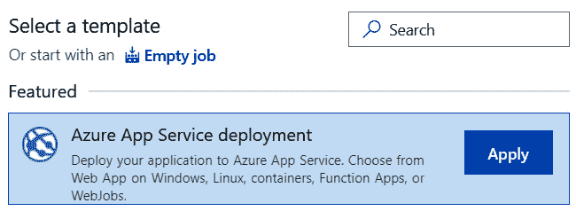

    图 15.13–发布管道模板选择

4.  A nice visual representation of the release pipeline will appear, along with a panel to the right, where we can set some properties of the first stage. Let's call the stage `Staging` since this is where we will deploy our app to the staging environment and execute the automated integration tests. We can close the right-hand panel by clicking the cross icon at the top right of the panel. The process is illustrated in the following screenshot:

    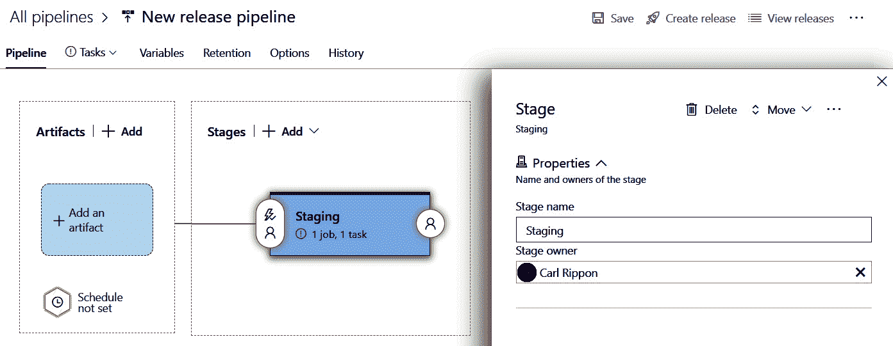

    图 15.14–释放管道的视觉表示

5.  We can change the pipeline name by clicking on it in the breadcrumb section and changing **New release pipeline** to the name of our choice, as illustrated in the following screenshot:

    

    图 15.15–昆达管道

6.  我们需要指定管道将使用的工件。点击**工件**部分的**添加**选项。
7.  In the dialog that appears, make sure our Azure DevOps project is selected. Set the source to our build pipeline and click **Add**, as illustrated in the following screenshot:

    

    图 15.16–添加工件

8.  We are now going to specify the tasks required to deploy the artifacts to the staging environment. Let's click on the **Tasks** tab. We need to deploy to two different app services for the frontend and backend. So, we are going to remove the parameters by clicking the **Unlink all** option, as illustrated in the following screenshot:

    

    图 15.17–取消链接参数

9.  We already have a task from the template to deploy to Azure App Service, but we need to specify some additional information. We are going to use this task to deploy the backend, so let's change the display name to `Backend App Service`. We'll need to specify our Azure subscription and then authorize it. We also need to specify the service name, which is the backend staging service we created in the last chapter. Lastly, we need to specify where the build ZIP file is, which is `$(System.DefaultWorkingDirectory)/**/backend/*.zip`. The process is illustrated in the following screenshot:

    

    图 15.18–后端暂存版本

10.  点击的**保存**选项，保存对任务的更改。
11.  Click the **+** icon at the top of the task list to add a new task. Select the **Azure App Service deploy** task and click **Add**, as illustrated in the following screenshot:

    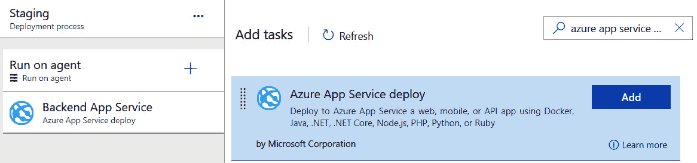

    图 15.19–添加 Azure 应用服务部署任务

12.  Now, we need to set the different properties of the task, just like we did in the backend service. This time, we'll call the task `Frontend App Service` and set the app service and the build ZIP file to the frontend staging ones, as illustrated in the following screenshot:

    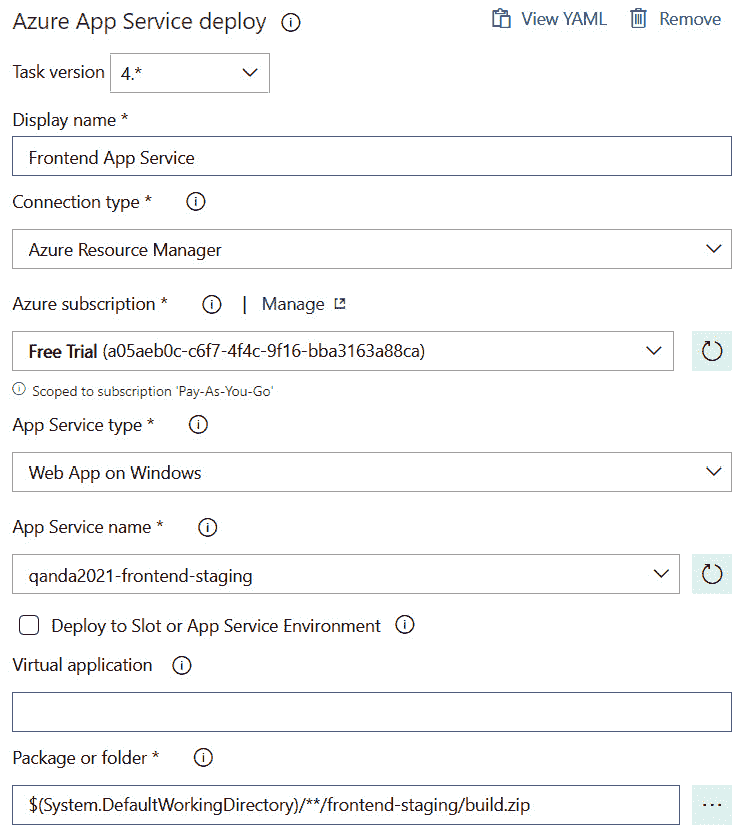

    图 15.20–前端暂存版本

13.  点击**保存**选项保存对任务的更改。
14.  Click the **+** icon at the top of the task list to add a new task. Select the **Extract files** task and click **Add**, as illustrated in the following screenshot:

    

    图 15.21–添加提取文件任务

15.  This task is going to extract the Cypress test files so that they're ready for when the tests are executed in the next task. So, let's call the task `Extract Cypress test files`, set the ZIP file patterns to `$(System.DefaultWorkingDirectory)/**/frontend-staging/tests.zip`, and set the destination folder to `$(System.DefaultWorkingDirectory)/cypress`, as illustrated in the following screenshot:

    

    图 15.22-提取柏树试验

16.  点击**保存**选项保存对任务的更改。
17.  Click the **+** icon at the top of the task list to add a new task. Select the **Command line** task and click **Add**, as illustrated in the following screenshot:

    

    图 15.23–添加命令行任务

18.  This task is going to install the Cypress tests, so let's call it `Install Cypress tests`. The script to execute is shown here:

    ```cs
    > npm install
    ```

    我们需要将工作目录设置为`$(System.DefaultWorkingDirectory)/cypress`，如下图所示：

    

    图 15.24–安装 Cypress 测试的任务

19.  点击的**保存**选项，将这些更改保存到任务中。
20.  点击任务列表顶部的**+**图标添加新任务。选择**命令行**任务，点击**添加**。
21.  This task is going to execute the Cypress tests, so let's call it `Run Cypress tests`. The script to execute is shown here:

    ```cs
    > npm run cy:run
    ```

    我们需要将工作目录设置为`$(System.DefaultWorkingDirectory)/cypress`，如下图所示：

    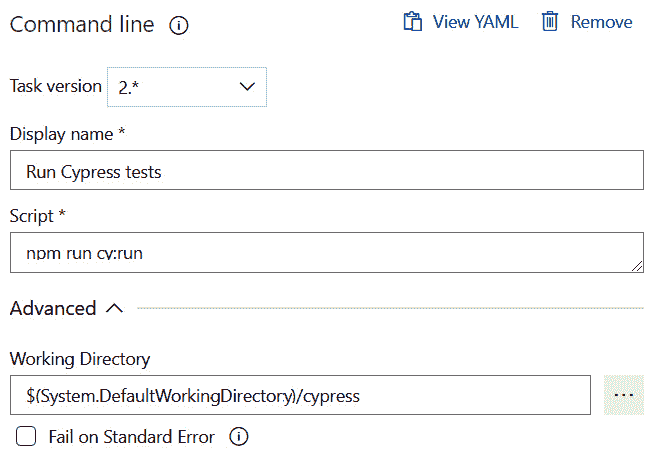

    图 15.25–运行 Cypress 测试的任务

22.  单击**保存**选项保存对任务的这些更改。

这就完成了阶段部署配置和端到端测试的执行。接下来，我们将添加任务以执行生产部署。

## 部署到生产中

在发布管道中执行以下步骤，将构建工件部署到生产环境中：

1.  如果尚未打开，则打开释放管道，选择**管道**选项卡，并显示视觉示意图。
2.  Here, we are going to add a stage for the production deployment. Hover over the **Staging** card, and click on the **Clone** option, as illustrated in the following screenshot:

    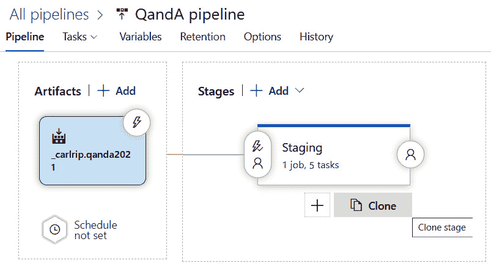

    图 15.26–克隆发布管道阶段

3.  Let's click on the stage we have just created and call it `Production`, as illustrated in the following screenshot:

    

    图 15.27–命名生产阶段

4.  Select the **Tasks** tab so that we can change the tasks for the **Production** stage, as illustrated in the following screenshot:

    

    图 15.28–选择生产任务

5.  The last two tasks can be removed because we don't need to run any tests. To remove a task, click on it and click the **Remove** option, as illustrated in the following screenshot:

    

    图 15.29–删除任务

6.  We need to change the **Backend App Service** task so that it deploys the backend to the production app service, as illustrated in the following screenshot:

    

    图 15.30–更改生产后端应用服务

7.  We also need to change the **Frontend App Service** task so that it deploys to the production frontend app service from the production ZIP file, as illustrated in the following screenshot:

    

    图 15.31–更改生产前端应用服务和包

8.  We want a release to be triggered when a new build has been completed. Click on the lightning icon in the **Artifacts** card and turn the **Enabled** switch on, as illustrated in the following screenshot:

    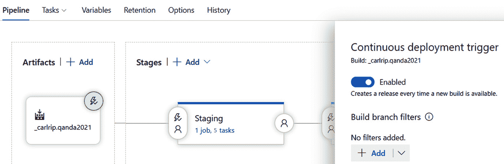

    图 15.32–支持连续部署

9.  点击**保存**保存所有更改。

这就完成了生产部署配置。接下来，我们将测试我们的自动部署。

## 测试自动部署

我们现在将进行代码更改，并将其推送到源代码存储库。这将触发构建和部署。让我们尝试一下，如下所示：

1.  打开前端代码，打开`Header.tsx`。在应用名称后添加感叹号，如以下代码段所示：

    ```cs
    <Link ... >
      Q & A!
      …
    </Link>
    ```

2.  提交更改并将其推送到源代码存储库。
3.  In Azure DevOps, if we go to the build pipelines, we'll see that a build has been triggered, as illustrated in the following screenshot:

    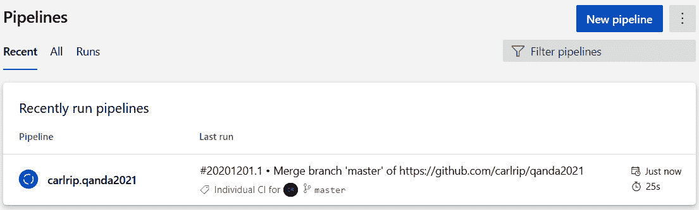

    图 15.33–在建工程

4.  When the build has successfully completed, go to the **Releases** section. We will see the release in progress, as illustrated in the following screenshot:

    

    图 15.34–正在发布

5.  最后，当暂存部署成功完成时，触发生产部署。成功发布将出现在发布历史记录中，如以下屏幕截图所示：

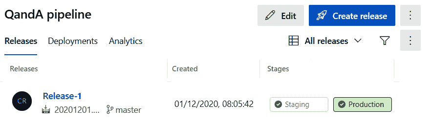

图 15.35–成功完成的发布

这就完成了我们的 CD 管道。

# 总结

在最后一章中，我们了解到 CI 和 CD 是自动化的过程，开发人员在生产中进行代码更改。实施这些过程可以提高我们软件的质量，并帮助我们以极快的速度向软件用户交付价值。

在 Azure DevOps 中实现 CI 和 CD 进程非常简单。CI 是使用构建管道实现的，Azure DevOps 为我们提供了大量用于不同技术的优秀模板。CI 过程在 YAML 文件中编写脚本，我们在其中执行一系列步骤，包括命令行命令和其他任务，如压缩文件。YAML 文件中的步骤必须包括将构建工件发布到构建管道的任务，以便它们可以在 CD 过程中使用。

CD 过程是使用发布管道和可视化编辑器实现的。同样，有很多很好的模板可以让我们开始。我们在管道中定义了阶段，这些阶段对从构建管道发布的工件执行任务。我们可以将多个阶段部署到不同的环境中。我们可以使每个阶段自动执行，或者仅在团队中受信任的成员批准时执行。可以执行许多任务类型，包括部署到 Azure 服务（如应用服务）和运行.NET 测试。

所以，我们已经到了这本书的结尾。我们已经创建了一个性能和安全的**表示状态传输**（**REST**）**应用编程接口**（**API**），它使用 Dapper 与 SQL Server 数据库交互。我们的 React 前端与此 API 进行了完美的交互，并且经过结构化处理，通过在整个过程中使用 TypeScript，它可以扩展复杂性。

我们已经学习了如何管理简单和复杂的前端状态需求，并学习了如何构建可重用组件以帮助加快构建前端的过程。我们通过添加自动化测试完成了应用的开发，并使用 Azure DevOps 将其部署到 Azure 的 CI 和 CD 进程中。

# 问题

以下问题将测试您对本章所涵盖主题的知识：

1.  为使 Jest 测试在 CI 环境中正常工作，需要设置哪个环境变量？
2.  当我们更改`azure-pipelines.yml`文件时，为什么会触发构建？
3.  哪个 YAML 步骤任务可用于执行 npm 命令？
4.  哪个 YAML 步骤任务可用于将工件发布到管道？
5.  为什么我们要为不同的环境构建多个 React 前端？
6.  发布管道阶段中的哪种任务类型可用于将构建构件部署到 Azure 应用服务？

# 答案

1.  一个名为`CI`的环境变量需要设置为`true`，Jest 测试才能在 CI 环境中正常工作。
2.  当我们更改`azure-pipelines.yml`文件时，它会自动提交并推送到源代码存储库中的主分支。文件中的`trigger`选项指定在将代码推送到主分支时应触发构建。因此，发生这种情况时会触发生成。
3.  `-script`任务可用于执行 npm 命令。
4.  `PublishBuildArtifacts@1`任务可用于将工件发布到管道。
5.  前端构建设置了一个名为`REACT_APP_ENV`的环境变量，代码使用该变量来确定它所处的环境。这就是我们有不同前端构建的原因。
6.  发布管道阶段中的`Azure App Service Deploy`任务类型可用于将构建构件部署到 Azure 应用服务。

# 进一步阅读

如果您想了解有关使用 Azure DevOps 实现 CI 和 CD 的更多信息，以下资源非常有用：[https://docs.microsoft.com/en-us/azure/devops/pipelines/?view=azure-devops](https://docs.microsoft.com/en-us/azure/devops/pipelines/?view=azure-devops)。