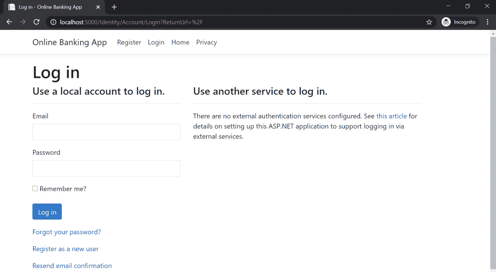

# *第三章*：认证中断

在 ASP.NET web 应用程序中，验证和确认身份可能是最关键的安全要求——身份验证。未能实现强身份验证允许黑客暴露此漏洞并利用它获得禁止访问。

弱密码策略、缺少暴力攻击预防机制、弱哈希密码和长活动会话是这些身份验证缺陷的几个根本原因。正确的凭证管理和会话配置是防止代码中出现这些漏洞的关键。本章将教我们如何解决这些问题。

在本章中，我们将介绍以下配方：

*   修复过度身份验证尝试的不正确限制
*   修复保护不足的凭据
*   修复用户枚举
*   修复弱密码要求
*   修复会话到期时间不足的问题

在本章结束时，您将学习如何实施**验证码**以防止暴力攻击，使用健壮的哈希算法更好地保护您的密码，发送通用消息以避免不必要的信息被暴露，以及配置会话以使其在可接受的时间段内过期。

# 技术要求

这本书是为配合 VisualStudio 代码、Git 和.NET5.0 而编写和设计的。ASP.NET Core Razor 页面中提供了配方中的代码示例。示例解决方案还使用 SQLite 作为数据库引擎，以简化设置。您可以在[找到本章的代码 https://github.com/PacktPublishing/ASP.NET-Core-Secure-Coding-Cookbook/tree/main/Chapter03](https://github.com/PacktPublishing/ASP.NET-Core-Secure-Coding-Cookbook/tree/main/Chapter03) 。

# 修复过度身份验证尝试的不正确限制

对手总是试图访问系统并击败其身份验证机制。最普遍的做法是使用从非法来源收集的泄露凭据，或者简单到拥有一个可以在 web 上找到的常用密码列表。可以使用特制的脚本或工具自动执行这些攻击。

ASP.NET 核心 web 应用程序必须通过实施防御措施来抵御这种攻击。这有助于拒绝过多的身份验证尝试和编写安全代码。

在此配方中，我们将确定代码中漏洞的根本原因，并通过启用锁定功能来缓解问题。

## 准备好了吗

使用 Visual Studio 代码，打开位于`\Chapter03\improper-auth\before\OnlineBankingApp`的示例网上银行应用程序文件夹。

### 测试对过度身份验证尝试的限制

遵循以下步骤：

1.  导航到菜单中的**终端****新终端**或在 Visual Studio 代码中按*Ctrl*+*Shift*+*即可。*
**   在终端中键入以下命令以构建并运行示例应用程序：

    ```cs
    dotnet run
    ```

    *   打开浏览器并转到`http://localhost:5000`。*   The browser will display the **Log in** page:

    

    图 3.1–登录页面

    *   尝试以输入`stanley.s.jobson@lobortis.ca`作为电子邮件地址，输入`password123`作为密码登录。*   You will see an error stating **Invalid login attempt**:

    

    图 3.2–无效登录尝试

    *   重复*步骤 5*五次以上，尝试调用账户锁定。*

 *在多次失败的登录尝试后，请注意该帐户未被锁定。此缺少的锁定功能使 ASP.NET 核心 web 应用程序容易受到暴力攻击。

## 怎么做…

让我们来看看这个食谱的步骤：

1.  使用前面步骤中打开的同一样本解决方案，在终端中键入以下命令来构建样本应用程序，以确认没有编译错误：

    ```cs
    dotnet build
    ```

2.  打开`\Chapter03\improper-auth\before\OnlineBankingApp\Areas\Identity\Pages\Account\Login.cshtml.cs`文件，找到调用`PasswordSignInAsync`方法的代码行：

    ```cs
    public async Task<IActionResult> OnPostAsync(string     returnUrl = null)
    {
        returnUrl ??= Url.Content("~/");
        ExternalLogins = (await         _signInManager.GetExternalAuthenticationScheme             sAsync()).ToList();
        if (ModelState.IsValid)
        {
            var result = await             _signInManager.PasswordSignInAsync(Input.                Email, Input.Password,                    Input.RememberMe,lockoutOnFailure:                        false);
            if (result.Succeeded)
            {
                _logger.LogInformation("User logged in.");
                return LocalRedirect(returnUrl);
            }
    ```

3.  Change the last parameter in the `PasswordSignInAsync` method from `false` to `true`:

    ```cs
    var result = await 
    _signInManager.PasswordSignInAsync(Input.Email, Input.    Password, Input.RememberMe, lockoutOnFailure: true);
    ```

    将`lockoutOnFailure`参数从`false`更改为`true`将在多次密码登录失败时触发用户帐户锁定。

4.  Next, configure the `Identity` service by setting the `DefaultLockoutTimeSpan` and `MaxFailedAttempts` properties:

    ```cs
    services.AddIdentity<Customer,IdentityRole>(options => { 
        options.Lockout.DefaultLockoutTimeSpan =         TimeSpan.FromMinutes(5);
        options.Lockout.MaxFailedAccessAttempts = 3; 
    })
    ```

    设置锁定策略将配置示例网上银行 web 应用程序的锁定行为。`DefaultLockoutTimeSpan`设置用户被锁定的时间，以分钟为单位。此设置的默认值为`5`分钟。

    在锁定用户之前，默认密码尝试失败次数为`5`。通过分配`IdentityOptions`的`MaxFailedAccessAttempts`属性可以覆盖默认值，该属性可以在`AddIdentity`方法中配置，并从`ConfigureServices`方法调用。`MaxFailedAccessAttempts`设置为在*三次登录尝试*失败后锁定用户。这些属性的值应根据组织的锁定策略指定值。

## 它是如何工作的…

`PasswordSignInAsync`是我们用来使用`Input.Email`和`Input.Password`值登录`Customer`的方法调用。它需要一个`lockoutOnFailure`参数，该参数指示如果登录失败了指定次数的尝试，是否应从帐户中锁定`Customer`。

`lockoutOnFailure`参数设置为`true`以启用登录失败时的锁定。这将防止恶意参与者进行自动和过度的身份验证重试。失败尝试的次数可以使用`LockoutOptions`类的`MaxFailedAccessAttempts`属性定义。

提示

确保记录失败的登录尝试和帐户锁定。应记录并监控这些类型的事件，以防潜在的暴力攻击。您将在[*第 11 章*](11.html#_idTextAnchor254)*中了解更多关于正确的日志记录和监控技术，日志记录和监控不足*。

## 还有更多…

另一个有助于防止暴力攻击的安全功能是实施验证码。**验证码**是一种挑战响应测试，有助于确定是人还是计算机执行了该操作。这种类型的测试可以帮助检测滥用和自动登录尝试。

有多种验证码系统可供网络开发者使用，其中谷歌的**reCAPTCHA**最受欢迎。要在 ASP.NET 核心 web 应用程序中使用Google 的**reCAPTCHA**，请执行以下步骤：

1.  在谷歌开发者网站（[上注册*reCAPTCHA*服务 https://developers.google.com/recaptcha/intro](https://developers.google.com/recaptcha/intro) 获取 API 密钥对。此 API 密钥对将用于将 reCAPTCHA 集成到我们的示例解决方案中。
2.  将 localhost 注册为网站时，请选中 reCAPTCHA v2**我不是机器人**复选框。此配方基于 reCAPTCHA 系统的第 2 版。
3.  在终端中键入以下命令以安装*Google reCAPTCHA ASP.NET Core 3*库：

    ```cs
    dotnet add package reCAPTCHA.AspNetCore
    ```

4.  The *Google reCAPTCHA ASP.NET Core 3* library is a third-party and open source NuGet package that helps ASP.NET Core web developers integrate the Google reCAPTCHA system easily.

    警告

    使用任何第三方库都有风险。在将包集成到 ASP.NET 核心 web 应用程序之前，您可能需要查看包的代码。确保您使用的是最新且稳定的版本。

5.  在`appsettings.json`文件

    ```cs
    {
      "RecaptchaSettings": {
        "SecretKey": "secret key",
        "SiteKey": "site key"
      },  
      "https_port": 443,  
    ```

    中为 reCAPTCHA 设置创建新条目
6.  打开`\Chapter03\improper-auth\before\captcha\OnlineBankingApp\Startup.cs`文件并添加对 Google ASP.NET reCAPTCHA 库的引用：

    ```cs
    using reCAPTCHA.AspNetCore;
    ```

7.  在`ConfigureServices`方法

    ```cs
    services.AddRecaptcha(Configuration.GetSection("RecaptchaSettings"));
    ```

    中注册reCAPTCHA 服务
8.  选择要在其中启用 Google reCAPTCHA 的 Razor 页面。通常，这被放置在预期会出现身份验证或注册滥用的页面上。打开`\Chapter03\improper-auth\before\captcha\OnlineBankingApp\Areas\Identity\Pages\Account\Login.cshtml`文件并添加对 reCAPTCHA 命名空间的引用：

    ```cs
    @page
    @using reCAPTCHA.AspNetCore
    @using reCAPTCHA.AspNetCore.Versions;
    ```

9.  包括对`Microsoft.Extensions.Options`的引用。对这个`Microsoft.Extensions.Options`名称空间的引用提供了对实现`Options`模式的类的访问，包括与 reCAPTCHA 相关的配置设置：

    ```cs
    @using Microsoft.Extensions.Options;
    ```

10.  在`submit`按钮下方添加Recaptcha HTML 帮助程序，以便 Razor 页面呈现 Recaptcha 并显示质询：

    ```cs
    <div class="form-group">
    <button type="submit" class="btn btn-primary">    Log in</button>
    </div>
    <div class="form-group">
     @(Html.Recaptcha<RecaptchaV2Checkbox>(Recaptcha     Settings?.Value))
    </div>
    ```

11.  打开相应的页面模型类“`\Chapter03\improper-auth\before\captcha\OnlineBankingApp\Areas\Identity\Pages\Account\Login.cshtml.cs`文件并添加对 reCAPTCHA 命名空间的引用：

    ```cs
    using reCAPTCHA.AspNetCore;
    ```

12.  使用依赖项注入，声明一个私有的`readonly`对象，该对象将保存`IRecaptchaService`的实例。向`LoginModel`构造函数添加一个新参数，该构造函数将在类

    ```cs
    private readonly IRecaptchaService _recaptcha;
    public LoginModel(SignInManager<Customer>         signInManager, 
        ILogger<LoginModel> logger,
        UserManager<Customer> userManager,
        IRecaptchaService recaptcha)
    {
        _userManager = userManager;
        _signInManager = signInManager;
        _logger = logger;
        _recaptcha = recaptcha;
    } 
    ```

    中公开注入的服务
13.  在`OnPostAsync`方法中，在发生账户登录验证的地方调用，并添加以下突出显示的代码行以验证 reCAPTCHA 响应：

    ```cs
    public async Task<IActionResult> OnPostAsync(string     returnUrl = null)
    {
        var recaptcha = await         _recaptcha.Validate(this.HttpContext.Request);
        if (!recaptcha.success)        ModelState.AddModelError("Recaptcha",             "Error Validating Captcha");
    ```

14.  来自 reCAPTCHA 服务的`Validate`方法调用将获取当前 HTTP 上下文，并检查用户的 CAPTCHA 响应是否有效。
15.  重复*测试过度验证尝试的限制*部分的*步骤 1 至 7*并在尝试登录时查看执行验证码测试的结果：


图 3.3–带有 reCAPTCHA 的登录页面

用 reCAPTCHA 服务补充 ASP.NET 核心 web 应用程序现在可以防止自动攻击和暴力强迫。

# 修复保护不足的凭据

密码破坏者和破解者现在比以往任何时候都更强大，拥有先进的硬件和无尽的计算资源。仅仅对密码进行散列已经不够了，现在关键是选择正确的散列函数，以保护凭据在发生数据泄露时不被暴露。

在这个配方中，我们将修改实现弱散列函数的代码，并将其替换为 BCrypt。

## 准备好了吗

使用 Visual Studio 代码，打开位于`\Chapter03\insufficient-protected-creds\before\OnlineBankingApp`的示例网上银行应用程序文件夹。

## 怎么做…

让我们来看看这个食谱的步骤：

1.  在终端中键入以下命令来构建示例应用程序，以确认没有编译错误：

    ```cs
    dotnet build
    ```

2.  Open the `\Chapter03\insufficient-protected-creds\before\OnlineBankingApp\Areas\Identity\PasswordHasher.cs` file. The `PasswordHasher` class is derived from `IPasswordHasher`, which lets you define your own custom hashing mechanism for your ASP.NET Core web application. Notice, however, that the hashing algorithm being used in the `HashPassword` method is **MD5**, which is *a known weak hashing algorithm*:

    ```cs
    public string HashPassword(Customer customer, string     password)
    { 
        using (var md5 = new MD5CryptoServiceProvider()) {
            var hashedBytes = md5.ComputeHash(System.Text             .Encoding.UTF8.GetBytes(password));
            var hashedPassword =             BitConverter.ToString(hashedBytes)                .Replace("-", "").ToLower();
            return hashedPassword;  
        }
    }
    ```

    笔记

    开发人员定制散列过程并选择较弱算法的原因有很多——从遗留应用程序迁移和向后兼容性就是其中之一。将您的密码迁移到一个更健壮的算法中仍然是明智的，也是值得的。

3.  在Visual Studio 代码终端中，键入以下命令以安装`Bcrypt.Net`NuGet 软件包：

    ```cs
    dotnet add package BCrypt.Net-Next
    ```

4.  `Bcrypt.Net` is a .NET library implementation of the **Bcrypt** hashing function based on the **Blowfish** cipher. The BCrypt hashing function implements a strong security measure as it adds **salt** to the hashing process. Bcrypt.Net lets developers define their own salt in the hash, but it is advisable to just let the library generate its own salt.

    注:

    有关**BCrypt**哈希算法的更多信息和细节，请参见 USENIX 网站上由BCrypt 算法设计者*Niels Provos 和 David Mazieres*撰写的名为*A Future Adaptive Password Scheme*的官方出版物：

    [https://www.usenix.org/legacy/events/usenix99/provos/provos_html/node1.html](https://www.usenix.org/legacy/events/usenix99/provos/provos_html/node1.html) 。

5.  添加对 Bcrypt.NET 命名空间的引用：

    ```cs
    using BC = BCrypt.Net.BCrypt;
    ```

6.  使用`AddSingleton`方法

    ```cs
    services.AddSingleton<IEmailSender, EmailSender>();
    services.Configure<AuthMessageSenderOptions>(Configuration);
    services.AddSingleton<IPasswordHasher<Customer>, 
      PasswordHasher>();
    ```

    注册我们的定制`IPasswordHasher`服务
7.  将中的`HashPassword`和`VerifyHashedPassword`方法替换为以下代码：

    ```cs
    public class PasswordHasher : IPasswordHasher<Customer>
    {
        public string HashPassword(Customer customer,         string password)
        { 
            return BC.HashPassword(password);
        }
        public PasswordVerificationResult         VerifyHashedPassword(Customer customer,            string hashedPassword, string password)
        {
            if (BC.Verify(password, hashedPassword))
                return PasswordVerificationResult.Success;
            else
                return PasswordVerificationResult.Failed;
        }
    }
    ```

在这里，我们分别使用**BCrypt**库的`HashPassword`和`Verify`方法对密码进行散列，并验证散列。

## 它是如何工作的…

我们的示例应用程序通过创建一个`PasswordHasher`类并从`IPasswordHasher`接口继承来定制散列算法实现，以修改密码的散列方式。已知**MD5**散列算法是一种弱密码。我们可以通过实现**bcrypt**算法来替换这个易受攻击的哈希函数。

我们通过`BCrypt.Net-Next`NuGet 包安装了 BCrypt.NET 库实现，添加了对`BCrypt.Net.BCrypt`命名空间的引用，并重写了整个`HashPassword`函数来调用 BCrypt.NET 的`HashPassword`方法。

注:

大多数安全专家更喜欢**Argon2**，这是 2015 年 7 月推出的一种较新的哈希函数，具有计算密集型硬内存功能，使其*能够抵御基于硬件的攻击*。`Isopoh.Cryptography.Argon2`是一个开源项目，支持 Argon2 哈希函数实现，ASP.NET 核心开发人员可以使用该库，如果他们喜欢使用这种哈希方法。您可以按照安装.NET Core Argon2 库的说明操作：[https://github.com/mheyman/Isopoh.Cryptography.Argon2](https://github.com/mheyman/Isopoh.Cryptography.Argon2) 。

另一方面，**Bcrypt**仍然是一个不错的选择，因为它的过程非常耗时，很难打破；但是，它可能容易出现基于 GPU 的开裂。

# 固定用户枚举

每一条信息对恶意行为者都至关重要。知道用户是否存在于 web 应用程序中，使攻击者能够利用此漏洞执行更具破坏性和更成功的攻击。通过在身份验证失败期间显示常规消息来不提供此信息，从而保护 ASP.NET 核心 web 应用程序。

在此配方中，我们将更改显示非常规错误消息的代码，以防止用户枚举攻击。

## 准备好了吗

使用 Visual Studio 代码，打开位于`\Chapter03\user-emumeration\before\OnlineBankingApp`的示例网上银行应用程序文件夹。

### 测试用户枚举

遵循以下步骤：

1.  导航到菜单中的**终端****新终端**或在 Visual Studio 代码中按*Ctrl*+*Shift*+*即可。*
**   在终端中键入以下命令以构建并运行示例应用程序：

    ```cs
    dotnet run
    ```

    *   打开浏览器并转到`http://localhost:5000`。*   浏览器将显示登录页面（参见*图 3.1*。*   以`ginger.knowles@bank.com`为用户名，以`password123`为密码登录。*   注意错误消息**客户不存在**：*

 *

图 3.4–用户枚举

此错误消息向攻击者提供系统中不存在特定电子邮件地址的信息。然后，攻击者可以使用此信息收集具有帐户或记录的电子邮件地址。

## 怎么做…

让我们看看这个食谱的步骤：

1.  在终端中键入以下命令来构建示例应用程序，以确认没有编译错误：

    ```cs
    dotnet build
    ```

2.  打开`\Chapter03\user-enumeration\before\OnlineBankingApp\Areas\Identity\Pages\Account\Login.cshtml.cs`文件，找到抛出`Customer does not exist.`错误消息的`OnPostAsync`方法调用中的代码行：

    ```cs
    if (result.IsLockedOut)
    {
        _logger.LogWarning("Customer account locked out.");
        return RedirectToPage("./Lockout");
    }
    else
    {
    var user = await         _userManager.FindByEmailAsync(Input.Email);
        if (user == null)
        {
            ModelState.AddModelError(string.Empty,             "Customer does not exist.");
            return Page();
        }
    }
    ```

3.  修改代码，使其返回一般消息；也就是说，`Invalid login attempt.`：

    ```cs
    if (result.IsLockedOut)
    {
        _logger.LogWarning("Customer account locked out.");
        return RedirectToPage("./Lockout");
    }
    else
    {
        ModelState.AddModelError(string.Empty,         "Invalid login attempt.");
        return Page();
    }
    ```

更改登录尝试失败时显示的错误消息将防止用户枚举攻击。

## 它是如何工作的…

对手可以通过分析应用程序的行为来收集信息，尤其是 ASP.NET 核心 web 应用程序向其用户显示的消息。消息*“客户不存在”*表示数据库中不存在电子邮件地址（在本例中用作用户名）。然后，这个恶意参与者可以列出一个有效用户名和电子邮件地址列表，用于其他恶意活动。

在这里，我们用一个通用的方法替换了对`AddModel`方法调用中的错误消息，以避免这种枚举。我们还阻止了现有客户帐户和不存在客户帐户之间的确定。

# 修复弱密码要求

用户凭证或密码的复杂性决定了字典攻击成功的可能性。如果密码不够复杂，对手只需几分钟就可以猜到用于使用*自动化*在 ASP.NET 核心 web 应用程序中进行身份验证的凭据。

在此配方中，我们将更改 ASP.NET Identity 的密码属性，以实现更强大的密码策略。

## 准备好了吗

使用 Visual Studio 代码，打开位于`\Chapter03\weak-password-policy\before\OnlineBankingApp`的示例网上银行应用程序文件夹。

### 测试弱密码策略

遵循以下步骤：

1.  导航到菜单中的**终端****新终端**或在 Visual Studio 代码中按*Ctrl*+*Shift*+*即可。*
**   在终端中键入以下命令以构建并运行示例应用程序：

    ```cs
    dotnet run
    ```

    *   打开浏览器并转到`http://localhost:5000/Identity/Account/Register`。*   The browser will display the registration page:

    

    图 3.5–注册页面

    *   填写表格并输入`password123`作为密码。*

 *请注意，web 应用程序创建了该帐户，尽管密码很弱。

## 怎么做…

让我们来看看这个食谱的步骤：

1.  在终端中键入以下命令来构建示例应用程序，以确认没有编译错误：

    ```cs
    dotnet build
    ```

2.  打开`\Chapter03\weak-password-policy\before\OnlineBankingApp\Startup.cs`文件，进入`ConfigureServices`方法，检查`IdentityOptions`：

    ```cs
    public void ConfigureServices(IServiceCollection services)
    {
        services.Configure<IdentityOptions>(options =>
        {
            options.Password.RequireDigit = true;
                options.Password.RequireLowercase = false;
                options.Password.RequireNonAlphanumeric =                 false;
                options.Password.RequireUppercase = false;
                options.Password.RequiredLength = 6;
                options.Password.RequiredUniqueChars = 1;
        });
    ```

    的`Password`属性
3.  ASP.NET Core 的`IdentityOptions`配置为具有弱密码策略，因此覆盖了`RequireLowercase`、`RequireNonAlphanumeric`和`RequireUppercase`属性的默认安全值。
4.  将`RequireLowercase`、`RequireNonAlphanumeric`和`RequireUppercase`属性的值更改为`true`，以实施更强大的密码策略：

    ```cs
    public void ConfigureServices(IServiceCollection   services)
    {
        services.Configure<IdentityOptions>(options =>
        {
            options.Password.RequireDigit = true;
            options.Password.RequireLowercase = true;
            options.Password.RequireNonAlphanumeric =true;
            options.Password.RequireUppercase = true;
            options.Password.RequiredLength = 6;
            options.Password.RequiredUniqueChars = 1;
        });
    ```

5.  重复*测试弱密码策略*部分的*1 至*5 步，查看是否可以在使用`pasword123`作为密码时创建用户帐户。

## 它是如何工作的…

不需要小写、字母数字和大写字符不再是可接受的密码策略。需要一个可靠的密码策略来阻止成功的基于凭证的暴力攻击，因为这有助于阻止我们的客户帐户被破坏。在前面的步骤中，我们通过将 ASP.NET 核心身份服务的`RequireLowercase`、`RequireNonAlphanumeric`和`RequireUppercase`属性设置为`true`来启用强密码策略。

您可以在 ASP.NET 核心 web 应用程序中实现的另一层防御是**多因素身份验证**（**MFA**。ASP.NET Core 中的 MFA 超出了本书的范围，但要了解更多有关 MFA 的信息，请查看 ASP.NET Core 中的*多因素认证*主题，该主题位于[的 ASP.NET 官方在线文档中 https://docs.microsoft.com/en-us/aspnet/core/security/authentication/mfa?view=aspnetcore-5.0](https://docs.microsoft.com/en-us/aspnet/core/security/authentication/mfa?view=aspnetcore-5.0)。

# 修复会话到期不足

通常，web 应用程序创建会话，以维护用户在多个请求之间与 web 服务器的交互。这些会话绑定用户的身份并支持跟踪经过身份验证的用户。ASP.NET 核心 web 应用程序必须将经过身份验证的用户会话的长度保持在最小值。这有助于避免在发生基于会话的攻击时，给坏参与者带来很大机会的风险。

在此配方中，我们将缩短会话的有效性，以降低基于会话的攻击的风险。

## 准备好了吗

使用 Visual Studio 代码，打开位于`\Chapter03\improper-session\before\OnlineBankingApp`的示例网上银行应用程序文件夹。

## 怎么做…

让我们来看看这个食谱的步骤：

1.  在终端中键入以下命令来构建示例应用程序，以确认没有编译错误：

    ```cs
    dotnet build
    ```

2.  打开`\Chapter03\weak-password-policy\before\OnlineBankingApp\Startup.cs`文件，找到设置应用程序 cookie 的代码。注意`ExpireTimeSpan`，它配置 cookie 保持有效的时间长度。设置为 24 小时：

    ```cs
    services.ConfigureApplicationCookie(options =>
    {
        options.LoginPath = $"/Identity/Account/Login";
        options.LogoutPath = $"/Identity/Account/Logout";
        options.AccessDeniedPath =        $"/Identity/Account/AccessDenied";
        options.ExpireTimeSpan = TimeSpan.FromHours(24);
    });
    ```

3.  为`ExpireTimeSpan`属性分配较短的超时时间：

    ```cs
    services.ConfigureApplicationCookie(options =>
    {
        options.LoginPath = $"/Identity/Account/Login";
        options.LogoutPath = $"/Identity/Account/Logout";
        options.AccessDeniedPath =         $"/Identity/Account/AccessDenied";
        options.ExpireTimeSpan = TimeSpan.FromMinutes(15);
    });
    ```

`ExpireTimeSpan`的值现在变短了，这使得对手很难利用一个开放且有效的会话。

## 它是如何工作的…

ASP.NET 核心 web应用程序的 cookie 设置通过调用`ConfigureApplicationCookie`方法进行设置。此方法接受`CookieAuthenticationOptions`，包括确定 cookie 行为的属性。指定会话 cookie 有效性的`ExpireTimeSpan`属性已设置为`15`分钟，而不是 24 小时。

注:

由于您公司的业务性质，您的 ASP.NET 核心 web 应用程序可能受您的组织或法规设置的信息安全标准的约束。例如，对于支付卡行业，您必须遵守*支付卡行业数据安全标准（PCI-DSS*）第 6.5.10 节关于中断身份验证和会话管理的要求。

要了解更多关于 PCI-DSS 的信息，请阅读 PCI-DSS 官方文档：[https://www.pcisecuritystandards.org/documents/PCI_DSS_v3-2-1.pdf?agreement=true &时间=1612424525744](https://www.pcisecuritystandards.org/documents/PCI_DSS_v3-2-1.pdf?agreement=true&time=1612424525744)。***