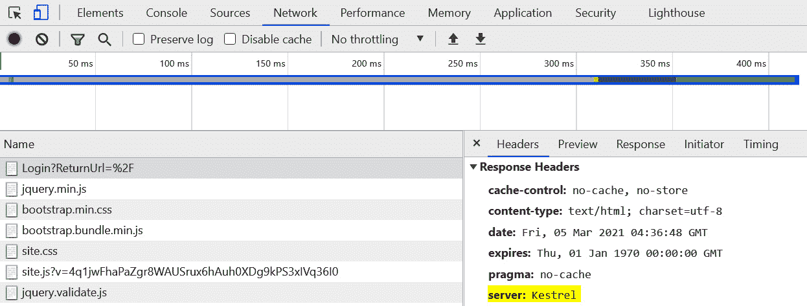
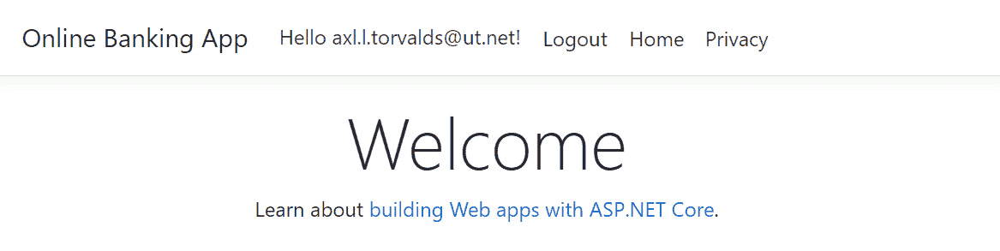
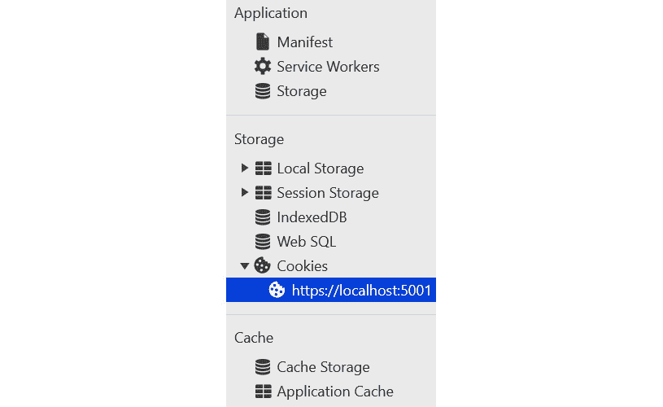

# 七、安全配置错误

如果在任何应用层（尤其是代码层）中禁用安全控制时出现疏忽，可能会使 ASP.NET Core web 应用容易受到各种各样的攻击。忽略在生产中禁用调试、无意中记录跟踪、cookie 中缺少必要的属性以及 HTTP 安全头只是安全配置错误的几个根本原因。强化 web 应用的安全性从代码开始，如果操作不正确，也可能是应用的薄弱环节。

在本章中，我们将介绍以下配方：

*   在非开发环境中禁用调试功能
*   修复禁用的安全功能
*   禁用不必要的功能
*   通过错误消息修复信息暴露
*   通过不安全的 cookie 修复信息泄露

在本章结束时，您将了解如何通过关闭代码中的调试、添加安全功能以及通过正确的应用设置阻止不必要的信息泄漏，从而防止安全配置错误。

# 技术要求

这本书是为配合 VisualStudio 代码、Git 和.NET5.0 而编写和设计的。ASP.NET Core Razor 页面中提供了配方中的代码示例。示例解决方案还使用 SQLite 作为数据库引擎，以简化设置。本章的完整代码示例可在[上找到 https://github.com/PacktPublishing/ASP.NET-Core-Secure-Coding-Cookbook/tree/main/Chapter07](https://github.com/PacktPublishing/ASP.NET-Core-Secure-Coding-Cookbook/tree/main/Chapter07) 。

# 在非开发环境中禁用调试功能

**在编写代码和运行测试时，调试**是web 开发人员任务中必不可少的部分。ASP.NET Core 使开发人员能够轻松访问配置，该配置将使用配置文件或代码在特定环境中快速启用或禁用调试。但是，疏忽或配置管理不当可能导致在非开发环境中启用调试，例如**暂存**或**生产**。在此配方中，我们将修复非开发环境中启用的调试功能。

## 准备好了吗

对于本章中的食谱，我们需要一个在线银行应用示例。

通过克隆 ASP.NET Secure Codeing Cookbook 存储库，打开命令 shell 并下载示例网上银行应用，如下所示：

```cs
git clone https://github.com/PacktPublishing/ASP.NET-Core-Secure-Coding-Cookbook.git
```

运行示例应用以验证没有生成或编译错误。在命令 shell 中，导航到位于`\Chapter07\debug-enabled\before\OnlineBankingApp`的示例应用文件夹，并运行以下命令：

```cs
dotnet build
```

`dotnet build`命令将构建示例`OnlineBankingApp`项目及其依赖项。

## 怎么做…

让我们来看看这个食谱的步骤：

1.  在起始练习文件夹中，通过键入以下命令启动 Visual Studio 代码：

    ```cs
    code .
    ```

2.  Open `OnlineBankingApp\Startup.cs` and go to the `Configure` startup method. The `Configure` method makes a call to `UseDeveloperExceptionPage` even if it is in a non-development environment:

    ```cs
    public void Configure(IApplicationBuilder appBuilder,    IWebHostEnvironment environment)
    {
        if (environment.IsDevelopment())
        {
            appBuilder.UseDeveloperExceptionPage();
        }
        else
        {
            appBuilder.UseDeveloperExceptionPage();
            // appBuilder.UseExceptionHandler("/Error");
            appBuilder.UseHsts();
        }
    // code removed for brevity
    ```

    `UseDeveloperExceptionPage`将生成一个包含`SystemException`详细信息的 HTML 页面。异常可以从堆栈跟踪及其显示的调试信息向攻击者提供重要信息，因此在*暂存*或*生产*环境中暴露这些信息并不理想。

3.  We avoid the unnecessary exception details shown either in *Staging* or *Production* by removing the line of code that calls `UseDeveloperExceptionPage` and uncommenting the line that invokes `UseExceptionHandler`:

    ```cs
    public void Configure(IApplicationBuilder appBuilder,    IWebHostEnvironment environment)
    {
        if (environment.IsDevelopment())
        {
            appBuilder.UseDeveloperExceptionPage();
        }
        else
        {
            appBuilder.UseExceptionHandler("/Error");
            appBuilder.UseHsts();
        }
    ```

    对`UseExceptionHandler`中间件进行调用将捕获异常并处理异常以返回更友好的`OnlineBankingApp\Pages\Error.cshtml`页面。

## 它是如何工作的…

调试对于 ASP.NET web 开发人员了解其应用的运行情况非常有用。在我们的示例网上银行 web 应用中，将对`UseDeveloperExceptionPage`方法的调用错放在代码中将允许在*暂存*或*生产*中显示异常详细信息。

我们通过将`UseDeveloperExceptionPage`方法置于使用`environment.IsDevelopment`方法的开发环境下是否运行 web 应用的条件检查下来修复代码。这可以防止在*暂存*或*生产*中进行调试和检查，从而避免向黑客暴露易受攻击的信息。

# 修复禁用的安全功能

添加防御和保护层有助于 ASP.NET Core web 应用免受攻击。Web 应用服务器具有内置的安全功能，例如配置为作为 HTTP 响应的一部分发送回客户端的安全头，指示浏览器启用安全机制。默认情况下，并不是所有这些安全头都是打开或添加的，因此在代码中启用它将由 web 开发人员掌握。

在此配方中，我们将添加缺少的 HTTP 安全头，以在我们的示例网上银行应用中启用保护。

## 准备好了吗

我们将使用上一个配方中使用的网上银行应用。使用 Visual Studio 代码，打开位于`\Chapter07\disabled-security-features\before\OnlineBankingApp\`的示例网上银行应用文件夹。

您可以执行此文件夹中的步骤来修复此配方中缺少的安全功能。

## 怎么做…

让我们来看看这个食谱的步骤：

1.  在起始练习文件夹中，通过键入以下命令启动 Visual Studio 代码：

    ```cs
    code .
    ```

2.  Open `Startup.cs` and look at the `Use` method call in `Configure`. The middleware is adding the `X-XSS-Protection` HTTP security header but the value is set to `0`:

    ```cs
    app.Use(async (context, next) =>
    {
        context.Response.Headers.Add("X-XSS-Protection", "0"      );
        await next();
    });
    ```

    将`X-XSS-Protection`响应头的值设置为`0`将指示浏览器*禁用其 XSS 过滤*及其对**跨站点脚本（XSS）**的保护。XSS过滤器是一种浏览器安全功能，可保护用户免受跨站点脚本攻击。修复 XSS 漏洞将在[*第 8 章*](08.html#_idTextAnchor203)*跨站点脚本*中介绍。

    其他安全头，如`X-Content-Type-Options`和`X-Frame-Options`也丢失了，这使得我们的示例网上银行应用缺乏针对攻击的保护。

3.  To include these missing security features, we replace the old code with the following lines, which will protect our sample Online Banking web application:

    ```cs
    app.Use(async (context, next) =>
    {
        context.Response.Headers.Add("X-XSS-Protection",        "1; mode=block");
        context.Response.Headers         .Add("X-Content-Type-Options", "nosniff");
        context.Response.Headers         .Add("X-Frame-Options", "DENY");
        context.Response.Headers.Add("Referrer-Policy",        "no-referrer");
        await next();
    });
    ```

    这些 HTTP 响应头中的每一个都有一个安全目的，这将在*如何工作*一节中解释。

    笔记

    虽然`X-XSS-Protection`已经被弃用，但如果您预计用户仍将使用较旧的浏览器，那么它仍然是一个有用的 HTTP 头，可以在您的web 应用中启用。另一种选择是实施**内容安全策略**，我们将在[*第 13 章*](13.html#_idTextAnchor302)、*最佳实践*中介绍。

### 正在验证安全标头

以下是步骤：

1.  在菜单中导航至**终端****新终端**，或在 Visual Studio 代码中按*Ctrl*+*Shift*+*即可。*
**   在终端中键入以下命令以构建并运行示例应用：

    ```cs
    dotnet run
    ```

    *   打开浏览器并转到`https://localhost:5001/`。*   Log in using the following credentials:

    a） 。电邮：`stanley.s.jobson@lobortis.ca`

    b） 。密码：`rUj5jtV8jrTyHnx!`

    *   Once authenticated, you will be redirected to the **Home page**:

    

    图 7.1–主页验证

    *   按*F12*打开浏览器的开发者工具。*   进入**网络**页签并在流量列表中选择第一个 HTTP 流量。*   选择单个 HTTP 流量后，在右侧窗格中滚动以查看相应的 HTTP 响应安全标头：*

 *

图 7.2–安全标头

安全标头现在作为从示例网上银行 web 应用发送的 HTTP 响应的一部分添加。

## 它是如何工作的…

当 HTTP 安全头被指定为 web 服务器或 web 应用发送的响应的一部分时，这将指示 web 浏览器启用对 XSS、clickjacking 和其他类型的 web 应用相关漏洞的保护。在前面的代码中，我们添加了以下 HTTP 安全标头：

*   `X-XSS-Protection`：当指令设置为`1`时，`X-XSS-Protection`安全头告诉浏览器启用 XSS 过滤器。当检测到 XSS 时，XSS 筛选器可以防止 XSS 并停止加载页面。
*   `X-Content-Type-Options`: The `X-Content-Type-Options` header, if assigned with a `nosniff` directive, prevents *MIME sniffing*. MIME-type sniffing is a browser behavior where it guesses what the MIME-type is of a resource of a page, but this behavior can be tricked into executing malicious content. This response header tells the browser to believe the `Content-Type` header's value and not attempt to guess the page's mime type implicitly.

    大多数动态应用安全测试工具通常将缺少`Content-Type`响应头标记为漏洞发现。将`X-Content-Type-Options: nosniff`与明确声明的`Content-Type`响应头结合使用。所有主要浏览器都支持`X-Content-Type-Options`标题，如 Firefox、Chrome 和 Edge。

*   `X-Frame-Options`: `X-Frame-Options` is also an HTTP response header, which when set to `DENY` will tell the browser to not allow the page to be rendered or embedded in any of the following HTML elements: `<iframe>`, `<frame>`, `<embed>`, or `<object>`. Malicious websites abuse these HTML elements to masquerade as authentic by embedding or framing the legitimate websites inside. Users are tricked in to clicking on the UI on what they presume rendered in front of the browser is a legit website. This attack is called **Click-Jacking**.

    提示：

    若要允许您的一个网页在源代码相同的 web 应用中被框接，请将`X-Frame-Options`标题的值指定为`SAMEORIGIN`：

    `context.Response.Headers.Add("X-Frame-Options", "SAMEORIGIN");`

*   `Referrer-Policy`：最后，为了防止 ASP.NET Core web 应用 URL 中的敏感信息在跨站点请求期间暴露，请将您的`Referrer-Policy`设置为`no-referrer`。`Referrer`头显示了用户请求发起的 URL，`no-referrer`值明确指示浏览器从 HTTP 头中删除`Referrer`。

其他值可能更适合您的 ASP.NET Core web 应用要求。请访问*Mozilla 开发者网络*中的*推荐人政策*文档，以获取[中的替代值 https://developer.mozilla.org/en-US/docs/Web/HTTP/Headers/Referrer-Policy](https://developer.mozilla.org/en-US/docs/Web/HTTP/Headers/Referrer-Policy) 。

# 禁用不必要的功能

大多数 ASP.NET Coreweb 应用功能都是有用的，但有些功能可能是不必要的，有时甚至是有害的。Web 开发人员必须考虑是否需要在代码中启用 Web 服务器或应用功能。我们需要删除一些功能以确保 ASP.NET Core web 应用的安全。

在此配方中，我们将删除`Server`HTTP 头以防止 web 服务器信息泄露。

## 准备好了吗

我们将使用上一个配方中使用的网上银行应用。使用 Visual Studio 代码，打开位于`\Chapter07\unnecessary-features\before\OnlineBankingApp\`的示例网上银行应用文件夹。

您可以执行此文件夹中的步骤来禁用此配方中不必要的功能。

## 怎么做…

让我们来看看这个食谱的步骤：

1.  在起始练习文件夹中，通过键入以下命令启动 Visual Studio 代码：

    ```cs
    code .
    ```

2.  Open `Program.cs` and notice the value of one of the properties of the `KestrelOptions` `AddServerHeader`:

    ```cs
    public static IHostBuilder CreateHostBuilder(string[]  args) =>
        Host.CreateDefaultBuilder(args)
            .ConfigureWebHostDefaults(webHost =>
            {
                webHost.UseKestrel(kestrelOptions =>
                {
                    kestrelOptions.AddServerHeader = true;
                    kestrelOptions.ConfigureHttpsDefaults                     (https =>
                        {
                            https.SslProtocols =                            SslProtocols.Tls12 |                                SslProtocols.Tls13;
                        });
                }); 
                webHost.UseStartup<Startup>();
            });
    ```

    当此布尔属性设置为`true`时，`AddServerHeader`属性在响应中添加`Server`HTTP 头。此标头不是必需的，但会提供恶意参与者有关构建 web 应用的平台的信息。

3.  We remove this unnecessary HTTP header by setting the value of the `AddServerHeader` property to `false`:

    ```cs
    public static IHostBuilder CreateHostBuilder(string[]  args) =>
        Host.CreateDefaultBuilder(args)
            .ConfigureWebHostDefaults(webHost =>
            {
                webHost.UseKestrel(kestrelOptions =>
                {
                   kestrelOptions.AddServerHeader = false;
                   kestrelOptions.ConfigureHttpsDefaults                   (https =>
                   {
                   https.SslProtocols = SslProtocols.Tls12                    | SslProtocols.Tls13;
                   });
                }); 
                webHost.UseStartup<Startup>();
            });
    ```

    当设置为`false`时，`Server`HTTP 头将不再作为响应发送给客户端，从而限制提供给坏参与者的信息。

    笔记

    其他不需要的 HTTP 头包括**X-Powered-By**和**X-AspNet-Version**。这两个 HTTP 头都会泄露有关 web 主机的软件信息，这可能会使威胁参与者受益。

    如果您在 IIS 中托管 ASP.NET Core web 应用，则默认情况下通常会显示这些标头，最好将其删除。要删除`X-Powered-By`或`X-AspNet-Version`标题，请按照 Microsoft 官方文档[中 IIS 参考的*customheaders*部分中的步骤进行操作 https://docs.microsoft.com/en-us/iis/configuration/system.webServer/httpProtocol/customHeaders/](https://docs.microsoft.com/en-us/iis/configuration/system.webServer/httpProtocol/customHeaders/) 。

## 它是如何工作的…

默认情况下，Kestrel 是与我们的示例网上银行应用一起使用的 web 服务器，但`Server`头可用于任何 web 服务器类型。一些 web 服务器的默认实例中已经有了它，或者通过 web 应用的代码进行了配置。使用浏览器的开发工具，我们可以看到我们的 ASP.NET Core web 应用发送了一个服务器 HTTP 头，向我们提供了 web 服务器正在运行 Kestrel 的详细信息：



图 7.3–服务器 HTTP 头

在我们的方法中，我们禁用将此`Server`头作为响应发送回浏览器，从而限制恶意代理关于 web 应用运行在何种平台上的信息。了解这个细节可以让坏角色利用它可以针对应用执行的特定漏洞。

# 通过错误消息修复信息泄露

日志可以帮助确定在应用内部发生的事件。应用跟踪、调试信息、错误、警告和其他信息也可用，并写入日志中。不幸的是，在 ASP.NET Core web 应用中，敏感数据也可能被不小心地记录，无意中泄露会带来风险。

在此配方中，我们将更改配置错误的日志提供程序属性，以防止过于敏感而无法存储在日志中的日志信息。

## 准备好了吗

我们将使用上一个配方中使用的网上银行应用。使用 Visual Studio 代码，打开位于`\Chapter07\information-exposure1\before\OnlineBankingApp\`的示例网上银行应用文件夹。

您可以执行此文件夹中的步骤，通过错误消息修复信息泄露。

## 怎么做…

让我们来看看这个食谱的步骤：

1.  在起始练习文件夹中，通过键入以下命令启动 Visual Studio 代码：

    ```cs
    code .
    ```

2.  Open `appsettings.json` and look at the current `LogLevel` values:

    ```cs
    {
      "Logging": {
        "LogLevel": {
          "Default": "Trace",
          "Microsoft": "Trace",
          "Microsoft.Hosting.Lifetime": "Trace"
        }
      },
      "AllowedHosts": "*",
      "ConnectionStrings": {
        "OnlineBankingAppContext": "Data Source         = OnlineBank.db"
      }
    }
    ```

    `Trace`值指定我们的示例网上银行 web 应用将向所有日志提供程序写入跟踪日志。该值为最低级别的*，它指定还将记录任何更高级别的内容，包括敏感调试信息。*

3.  We fix the issue by setting these values to `Warning`, which is levels higher than `Trace`:

    ```cs
    {
      "Logging": {
        "LogLevel": {
          "Default": "Warning",
          "Microsoft": "Warning",
          "Microsoft.Hosting.Lifetime": "Warning"
        }
      },
      "AllowedHosts": "*",
      "ConnectionStrings": {
        "OnlineBankingAppContext": "Data         Source=OnlineBank.db"
      }  
    }
    ```

    为这些类别分配`Warning`属性值将指示记录器写入由于意外事件而发生的错误日志，这些意外事件不会导致我们的示例网上银行 web 应用崩溃。

## 它是如何工作的

登录 ASP.NET Core web 应用在`appsettings.json`的`Logging`部分配置。在此文件中定义的每个日志类别（`Default`、`Microsoft`、`Microsoft.Hosting.Lifetime`）中，它们的值都设置为`Trace`，这是最低的`LogLevel`，值为`0`。此`LogLevel`不适合生产环境，这就是我们修改值并将其更改为`Warning`的原因。

# 通过不安全的 cookie 修复信息泄露

Cookie对于在 ASP.NET Core web 应用中维护状态至关重要。敏感 cookie，如用于认证会话的 cookie，应仅通过 HTTPS 传输，并标记为`HTTP-Only`，以防止攻击者窃取存储在这些 cookie 中的信息。

在此配方中，我们将配置 cookie 策略，以防止 ASP.NET Core示例 web 应用生成持久 cookie。

## 准备好了吗

我们将使用上一个配方中使用的网上银行应用。使用 Visual Studio 代码，打开位于`\Chapter07\information-exposure2\before\OnlineBankingApp\`的示例网上银行应用文件夹。

您可以执行此文件夹中的步骤，通过持久 cookie 配方修复信息暴露。

## 怎么做…

让我们来看看这个配方的步骤：

1.  在起始练习文件夹中，通过键入以下命令启动 Visual Studio 代码：

    ```cs
    code .
    ```

2.  Open `Startup.cs` and look at the following sections of code under `ConfigureServices`:

    ```cs
    services.AddSession(options =>
    {
        options.Cookie.Name = ".OnlineBanking.Session";
        options.IdleTimeout = TimeSpan.FromSeconds(10);
        options.Cookie.HttpOnly = false;
        options.Cookie.SecurePolicy =        CookieSecurePolicy.None;
        options.Cookie.IsEssential = true;
    });
    ```

    将`CookiePolicyOptions`的`SecurePolicy`属性设置为枚举值`CookieSecurePolicy.None`，此配置表示我们示例应用中的会话 cookie 将不具有**安全**属性。

    此外，将会话 cookie 的`HttpOnly`属性分配给`false`值，使得客户端脚本可以读取会话 cookie。

3.  为了防止恶意的任意 JavaScript 代码读取我们会话 cookie 的值，我们将会话状态服务的`HttpOnly`属性设置为`true`：

    ```cs
    services.AddSession(options =>
    {
        options.Cookie.Name = ".OnlineBanking.Session";
        options.IdleTimeout = TimeSpan.FromSeconds(10);
        options.Cookie.HttpOnly = true;
    ```

4.  To also ensure that the cookie policy middleware will mark the cookies of our sample Online Banking web application with a **Secure** attribute, we assign the `SecurePolicy` property of the `CookiePolicyOptions` with `CookieSecurePolicy.Always`:

    ```cs
    options.Cookie.SecurePolicy =  CookieSecurePolicy.Always;
        options.Cookie.IsEssential = true;
    });
    ```

    启用`HttpOnly`属性将使用`HttpOnly`属性标记会话 cookie。

### 正在验证会话 cookie 属性

以下是步骤：

1.  在菜单中导航至**终端****新终端**，或在 Visual Studio 代码中按*Ctrl*+*Shift*+*即可。*
**   在终端中键入以下命令以构建并运行示例应用：

    ```cs
    dotnet run
    ```

    *   打开浏览器并转到`https://localhost:5001/`。*   Log in using the following credentials:

    a） 。电邮：`axl.l.torvalds@ut.net`

    b） 。密码：`6GKqqtQQTii92ke!`

    *   Once authenticated, you will be redirected to the **Home page**:

    

    图 7.4–主页验证

    *   按*F12*打开浏览器的开发者工具。*   Expand the **Cookies** tree on the left pane of the developer tools:

    

    图 7.5–Cookies 部分

    *   转到的**应用**选项卡（Firefox 中的**存储**选项卡），注意**HttpOnly**和**安全**属性的列被选中：*

 *

图 7.6–会话 cookie

这表明在 cookie 中启用了`Secure`和`HttpOnly`属性。

## 它是如何工作的

`HttpOnly`和`Secure`是 Cookie 中最重要的两个属性，但都是可选的。这些 cookie 属性必须作为 cookie 策略中间件的一部分显式声明和配置。通过将`HttpOnly`属性设置为`true`，我们在会话 cookie 中追加`HttpOnly`属性：

```cs
options.Cookie.HttpOnly = true;
```

如果没有`HttpOnly`属性，任意客户端脚本可以读取可能包含敏感数据的 cookie 值。没有 JavaScript 代码能够从属性中检索值。

笔记

我们通常用`HttpOnly`属性标记的 Cookie 包含的值可能会受到**会话劫持**或**跨站点脚本（XSS）**等攻击的攻击。

通过在中间件服务管道中配置 cookie 策略，我们还将`Szecure`属性包括在应用 cookie 中：

```cs
options.Cookie.SecurePolicy = CookieSecurePolicy.Always;
```

`CookieSecurePolicy.Always`确保 cookie 仅通过**HTTPS**发送。**