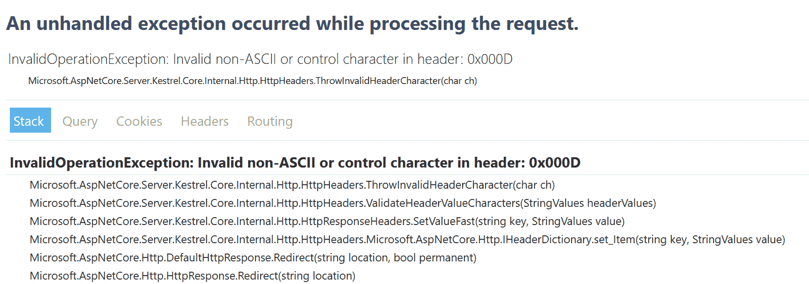
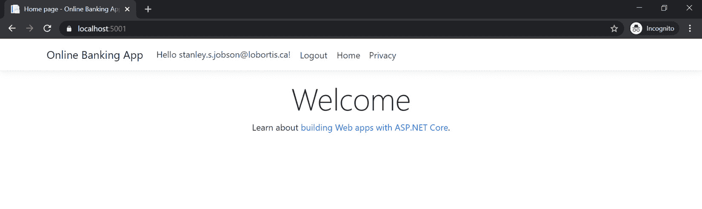

# *第 12 章*：其他漏洞

**OWASP Top 10**实际上是安全专业人员用来了解最常见 web 应用漏洞的列表标准。它是**开放式 Web 应用安全项目**（**OWASP**组织的旗舰项目之一。正如您可能已经注意到的，本书第*2-11*章涵盖了 2017 年 OWASP 十大安全风险。根据 OWASP 中安全专家收集的信息，此报告每 3 到 4 年更改一次。新的或旧的风险可能会被引入或从此集合中删除，但本文档不是一个完整的列表，并且还有其他未涵盖的漏洞。本章将讨论更多的现有风险，其中一些风险已不再是 OWASP 前 10 名的一部分，但仍需了解。

在本章中，我们将介绍以下配方：

*   修复禁用的反跨站点请求伪造保护
*   防止服务器端请求伪造
*   防止原木注入
*   防止 HTTP 响应拆分
*   防止点击劫持
*   修正随机性不足

在本章中，您将学习如何使用 ASP.NET Core 的保护功能来防止**跨站点请求伪造**（**CSRF**）。您还将了解如何在您的代码中引入**服务器端请求伪造**（**SSRF**）以及防止其发生的方法。此外，您还将了解**响应拆分**是如何发生的，以及如何使用安全编码的基本原理之一，即验证，来增加保护。接下来，您将实施从 ASP.NET Core web 应用作为 HTTP 响应发送的`frame-ancestor`**内容安全策略**（**CSP**，以阻止点击劫持攻击。此外，您将练习一种基本的消毒技术，以阻止攻击者注入和伪造您的日志。最后，您将学习如何生成加密安全的随机数，以保护哈希密码不被解密。

# 技术要求

本书是为使用 Visual Studio 代码 Git、.NET 5.0 编写和设计的。ASP.NET Core Razor 页面中提供了配方中的代码示例。示例解决方案还将使用 SQLite 作为数据库引擎，以简化设置。本章完整的代码示例可在[上找到 https://github.com/PacktPublishing/ASP.NET-Core-Secure-Coding-Cookbook/tree/main/Chapter12](https://github.com/PacktPublishing/ASP.NET-Core-Secure-Coding-Cookbook/tree/main/Chapter12) 。

# 修复禁用的防跨站点请求伪造保护

浏览器和 web 服务器之间有一种固有的信任，对手经常会滥用这种信任。web 应用的用户（通常由 ASP.NET Core web 应用发出经过身份验证的会话）被攻击者诱骗，通过访问恶意网站或与恶意网站交互来执行无意行为。这种攻击方法通过使浏览器从恶意网站发送巧尽心思构建的请求，滥用用户已建立的身份验证状态。此**跨站点请求伪造**（**CSRF**）漏洞提示我们检查代码并启用请求验证，我们将在本配方中了解这一点。

## 准备好了吗

对于本章中的食谱，我们需要一个在线银行应用示例。

打开命令 shell 并通过克隆 ASP.NET Secure Codeing Cookbook 存储库下载示例网上银行应用，如下所示：

```cs
git clone https://github.com/PacktPublishing/ASP.NET-Core-Secure-Coding-Cookbook.git
```

运行示例应用以验证没有生成或编译错误。在命令 shell 中，导航到位于`\Chapter12\cross-site-request-forgery\before\OnlineBankingApp`的示例应用文件夹，并运行以下命令：

```cs
dotnet build
```

`dotnet build`命令将构建示例`OnlineBankingApp`项目及其依赖项。

在此配方中，我们将修复禁用 CSRF 保护的剃须刀页面。

## 怎么做…

让我们来看看这个食谱的步骤：

1.  在启动练习文件夹中，通过键入以下命令启动 Visual Studio 代码：

    ```cs
    code .
    ```

2.  Open `Startup.cs` and locate the code in `ConfigureServices` that configures the filter to skip the anti-forgery token validation process:

    ```cs
    services.AddRazorPages(options =>
    {
        options.Conventions.AuthorizeAreaFolder("Identity,        "/Account/Manage");
        options.Conventions.AuthorizeAreaPage("Identity",        "/Account/Logout");
    })
    .AddRazorPagesOptions(options =>
    {
    options.Conventions.ConfigureFilter(new             IgnoreAntiforgeryTokenAttribute());
    });
    ```

    将`IgnoreAntiforgeryTokenAttribute`的实例传递给`ConfigureFilter`方法会将该属性全局添加到我们的示例网上银行 web 应用中。

3.  Change the type of token attribute that you pass into the `ConfigureFilter` method and replace it with `AutoValidateAntiforgeryTokenAttribute`:

    ```cs
    .AddRazorPagesOptions(options =>
    {
        options.Conventions.ConfigureFilter(new             AutoValidateAntiforgeryTokenAttribute());
    });
    ```

    `AutoValidateAntiforgeryTokenAttribute`将要求使用从 HTTP POST 等不安全 HTTP 谓词接收的防伪令牌进行请求验证。

4.  Next, open `Pages\Loans\Create.cshtml.cs` and find the `IgnoreAntiforgeryToken` attribute, which annotates the `OnlineBankingApp.Pages.Loans.CreateModel` view model:

    ```cs
    using OnlineBankingApp.Models;
    using System.Security.Claims;
    namespace OnlineBankingApp.Pages.Loans
    {
        [IgnoreAntiforgeryToken(Order = 1001)]
        public class CreateModel : PageModel
        {
            private readonly OnlineBankingApp.Data             .OnlineBankingAppContext _context;
     // code removed for brevity
    ```

    虽然我们已经在`Startup.cs`中全局重新启用了请求验证，但我们仍然可以使用`IgnoreAntiforgeryToken`在每个视图模型上禁用 CSRF 保护。

5.  Replace this attribute from `PageModel` with `AutoValidateAntiforgeryToken` to explicitly enable anti-forgery tokens to be sent to unsafe HTTP requests:

    ```cs
    using OnlineBankingApp.Models;
    using System.Security.Claims;
    namespace OnlineBankingApp.Pages.Loans
    {
        [AutoValidateAntiforgeryToken]
        public class CreateModel : PageModel
        {
            private readonly OnlineBankingApp.Data             .OnlineBankingAppContext _context;
     // code removed for brevity
    ```

    笔记

    因为我们已经从`Startup.cs`全局启用了`AutoValidateAntiforgeryToken`，所以很高兴知道我们可以在操作级别使用此属性。

## 它是如何工作的…

在处理跨站点请求时，常见的错误是禁用防伪令牌的验证，以使此请求能够跨不同的域进行。在我们的示例网上银行 web 应用中，我们在配置 Razor 视图的`AddRazorPagesOptions`中全局禁用了此功能，并将过滤器设置为`IgnoreAntiforgeryTokenAttribute`，从而从每个页面中删除请求验证：

```cs
.AddRazorPagesOptions(options =>
{
    options.Conventions         .ConfigureFilter(new             IgnoreAntiforgeryTokenAttribute());
});
```

类似地，您可以在类级别通过使用`IgnoreAntiforgeryToken`注释类来禁用此功能。与此属性一起指定一个编号为`1001`的`Order`，以确定过滤器的执行顺序：

```cs
[IgnoreAntiforgeryToken(Order = 1001)]
```

每种方法都会带来巨大的风险，因此必须生成防伪令牌，并由 web 服务器验证请求，以防止 CSRF 并验证其真实性。因此，我们使用`AutoValidateAntiforgeryTokenAttribute`来配置过滤器：

```cs
.AddRazorPagesOptions(options =>
{
    options.Conventions         .ConfigureFilter(new             AutoValidateAntiforgeryTokenAttribute());
});
```

另一种方法是在类级别，您可以在类定义的顶部用`AutoValidateAntiforgeryToken`注释类：

```cs
[AutoValidateAntiforgeryToken]
public class CreateModel : PageModel
```

前面的代码支持对不安全 HTTP 方法的防伪令牌进行验证，这些方法是除`GET`、`OPTIONS`、`HEAD`和`TRACE`之外的 HTTP 谓词。

## 还有更多…

**同步器令牌模式**（**STP**是一种安全编码和开发模式，其中令牌作为请求的一部分发送到 web 服务器，以证明其真实性。然后，web 服务器验证令牌以确认其真实性。可以使用**全局唯一标识符**（**GUID**）手动创建令牌，但建议依赖.NET Framework 生成的内置令牌。

反伪造令牌也以隐藏字段的形式从 HTML 元素生成。单独生成这些令牌并不是阻止代码中 CSRF 漏洞的完整解决方案。还必须启用服务器端的请求验证。

基于 JavaScript 的应用可以进行 AJAX 调用，以使用这些防伪令牌发送 HTTP 请求。客户端脚本将显式查找`__RequestVerificationToken`隐藏的表单字段并检索其值。下面是一个例子，展示了在 HTML 页面中呈现时`__RequestVerificationToken`的样子：

```cs
<input name="__RequestVerificationToken" type="hidden" value="CfDJ8NZYeppsy75Pga3ZTfYs_GOXLIV7qV8nWInxNkWX2KTNH5O6U08mXz8qZYB3UPum5QFFO0zm E1IyE8her6r0wf85eobep6SYfJCP6UBDeTe9Jpao8cEgdiUYK yY5IWfQX4MhzYupGn5uciC74mbfQ0U" />
```

如果请求验证失败，则可能是表单标记帮助器的`asp-antiforgery`值设置为`false`。始终注意此标记，将其设置为`true`或删除`asp-antiforgery`属性，使`__RequestVerificationToken`隐藏表单字段默认自动呈现：

```cs
<form method="post" asp-antiforgery="true" > 
```

在 Razor 页面中生成令牌的另一种方法是使用`AntiForgeryToken`HTML 助手方法。将以下代码放入标记中：

```cs
@Html.AntiForgeryToken()
```

`AntiForgeryToken`HTML 帮助程序将使用加密值创建`__RequestVerificationToken`隐藏表单字段。

# 防止服务器端请求伪造

ASP.NET Coreweb 应用由不同的层和组件组成，使其成为一个完整的工作系统。大多数情况下，它需要一个后端服务来处理或向基础 web 应用提供数据。这些不同的服务相互连接，形成一个内聚的、功能强大的 web 应用。这可以通过 web 服务或系统内部或外部托管的基于 REST 的 API 的形式完成，然后我们的代码调用这些 API 和 web 服务（或微服务）的操作。

但是，如果没有适当的筛选或无法验证发送到这些服务的数据，主机可能会开始执行意外操作。此漏洞也称为服务器端请求伪造**服务器端请求伪造**（**SSRF**），对手利用缺乏有效验证或清理的漏洞进行攻击。

## 准备好了吗

运行示例应用以验证没有生成或编译错误。在命令 shell 中，导航到位于`\Chapter12\server-side-request-forgery \before\OnlineBankingApp`的示例应用文件夹，并运行以下命令：

```cs
dotnet build
```

`dotnet build`命令将构建示例`OnlineBankingApp`项目及其依赖项。

我们还需要安装旧版本的 MongoDB（3.4 版）。按照[上的*安装 MongoDB*说明进行操作 https://docs.mongodb.com/v3.4/installation](https://docs.mongodb.com/v3.4/installation) 。

安装后，确保`mongod`服务可执行文件与`--rest`开关一起运行。这将启用 MongoDB 的 RESTAPI。请参见以下示例：

```cs
C:\Program Files\MongoDB\Server\3.4\bin\mongod.exe" --rest --service --config="C:\Program Files\MongoDB\Server\3.4\mongod.cfg"
```

通过运行以下命令，使用数据填充 MongoDB：

```cs
db.createCollection('Payees')
```

另外，运行以下命令：

```cs
db.Payees.insertMany([{'Name':'Mint Mobile','Address':'P.O. Box 15124 Albany, NY 12212-5124','PhoneNo':'1(800) 683-7392','AccountNo':'8244-1044','Description':'Business Line'},{'Name':'Private Internet Access VPN','Address':'5555 DTC Parkway, Suite 360\. Greenwood Village, CO 80111','PhoneNo':'(720) 277-9121','AccountNo':'6510-2236','Description':'VPN Personal Subscription'}])
```

第一个 MongoDB 命令`db.createCollection`创建了我们的`Payees`集合，我们将在示例网上银行应用中使用它。`db.Payees.insertMany`将数据添加到我们的`Payees`集合中。

现在，我们准备完成这个食谱。

## 怎么做…

让我们来看看这个食谱的步骤：

1.  在起始练习文件夹中，通过键入以下命令启动 Visual Studio 代码：

    ```cs
    code .
    ```

2.  Open `\Pages\Payees\Index.cshtml.cs` and go to the `OnGetAsync` method, where a call to `PayeeService` is executed:

    ```cs
    public async Task OnGetAsync()
    {
        var mongouri = Request.Query["mongouri"];
        mongouri = string.IsNullOrWhiteSpace(mongouri) 
                ? "http://localhost:28017/test/Payees/" 
                : Request.Query["mongouri"];
        Roots = await _payeeService.GetPayeesAsync          (mongouri);
    }
    ```

    注意，代码接受来自`mongouri`查询字符串参数的输入。`mongouri`是 MongoDB REST 接口的 URL，在该接口中检索收款人列表。攻击者可能会利用此漏洞，并使用其可用的 REST API 操作将任意 URL 或滥用发送到 MongoDB 实例。这不需要访问控制或检查。

3.  为了修复易受攻击的代码，我们可以使用正则表达式添加验证，以确保 URL 的格式符合我们的预期。我们将首先添加对`Regex`类名称空间的引用；也就是说，`System.Text.RegularExpression`：

    ```cs
    using System.Text.RegularExpressions;
    ```

4.  接下来，创建一个新方法，并使用以下代码将其命名为`IsValidMongoRestUri`：

    ```cs
    private bool IsValidMongoRestUri(string mongouri)
    {
        string pattern = @"^http://localhost:28017/        test/Payees/\\?$";
        Regex regex = new Regex(pattern, RegexOptions         .IgnoreCase);
        return regex.IsMatch(mongouri);
    }
    ```

5.  添加对`System.Http.Net`命名空间的引用。
6.  Invoke the `IsValidMongoRestUri` method to validate the `mongouri` string that was passed via the query string:

    ```cs
    public async Task OnGetAsync()
    {
        var mongouri = Request.Query["mongouri"];

        if (string.IsNullOrWhiteSpace(mongouri))
        {
            mongouri =            "http://localhost:28017/test/Payees/";
        }
    else 
        {
            if(!IsValidMongoRestUri(mongouri))
            {
                throw new HttpRequestException("Invalid                 Request");
            }
        }
        Roots = await _payeeService.GetPayeesAsync         (mongouri);
    }
    ```

    前面的代码在`mongouri`为意外格式时也会抛出一个`HttpRequestException`。

## 它是如何工作的…

当我们盲目地允许控制一个`querystring`参数时，这种攻击向量为坏行为人提供了利用我们的示例网上银行 web 应用的途径。我们使用`mongouri`查询字符串检索 REST API 端点。由于缺少验证，恶意用户可以传递可能执行不需要的操作的 URI。例如，我们可以将此值赋给`mongouri`参数，MongoDB REST API 将执行此操作：

```cs
mongouri=http://localhost:28017/admin/$cmd/?
    filter_eval=function()
    {ifdb.version().charAt(0)=='3'){sleep(2000)}}&limit=1';
```

分解`mongouri`的值，它包含一系列连续的 MongoDB 语句和函数，如果 MongoDB 版本的第一个字符（在本例中为`3`）等于 true，将导致 JavaScript 执行上下文暂停 2 秒。如果我们要以一种漂亮的格式打印它，下面是这些连续语句和函数的样子：

```cs
filter_eval=function(){
    if(db.version().charAt(0)=='3'){
        sleep(2000)
        }
    }
```

为了防止不必要地执行任意命令，我们可以使用正则表达式验证 URL 是否符合我们预期的格式，从而阻止任何人通过其 HTTP 接口使用 MongoDB 的`db`命令。我们创建了一个名为`IsValidMongoRestUri`的布尔方法，用于检查它接收到的`mongouri`值是否与我们期望的 URL 匹配：

```cs
private bool IsValidMongoRestUri(string mongouri)
{
    string pattern = @"^http://localhost:28017/test/
    Payees/\\?$";
    Regex regex = new Regex(pattern,         RegexOptions.IgnoreCase);
    return regex.IsMatch(mongouri);
}
```

在这种情况下，使用安全编码的基础之一是正确的输入验证，以防止 SSRF。

## 还有更多…

除了 URI 验证之外，还可以使用`Uri.CheckHostName`或`IPAddress.TryParse`方法。`Uri.CheckHostName`帮助我们检查 DNS 或域是否有效，`IPAddress.TryParse`验证 IP 地址是否有效。

# 防止日志注入

在[*第 11 章*](11.html#_idTextAnchor254)**记录和监控不足*中，我们了解了记录的重要性。日志记录为我们提供了必要的可见性，以了解 ASP.NET Core web 应用中的一系列重要事件。但是，如果我们创建的用户控制的日志信息未经验证，黑客也可以利用日志记录进行攻击。如果日志条目中存在恶意输入，还可以利用日志查看器的漏洞（如果存在）。*

 *例如，基于 web 的日志查看器可能存在跨站点脚本漏洞，使用 XSS 负载以及数据查看日志条目可以利用此漏洞。在此配方中，我们将通过实现输入清理来防止代码中的日志注入漏洞。

## 准备好了吗

运行示例应用以验证没有生成或编译错误。在命令 shell 中，导航到位于`\Chapter12\log-injection\before\OnlineBankingApp`的示例应用文件夹，并运行以下命令：

```cs
dotnet build
```

`dotnet build`命令将构建示例`OnlineBankingApp`项目及其依赖项。

## 怎么做…

让我们来看看这个食谱的步骤：

1.  在起始练习文件夹中，通过键入以下命令启动 Visual Studio 代码：

    ```cs
    code .
    ```

2.  Open `Pages\Loans\Create.cshtml.cs` and locate the code in `OnPostAsync`, where it logs a warning when the app is unable to submit a loan:

    ```cs
    if (await TryUpdateModelAsync<Loan>(
        emptyLoan,
        "loan",
        l => l.ID, l => l.CustomerID, l => l.Amount, l =>            l.PeriodInMonths, l => l.TransactionDate,                 l => l.Note))
    {
        _context.Loan.Add(emptyLoan);
        await _context.SaveChangesAsync();
    }
    else {
        _logger.LogWarning("Problem creating loan:" +        emptyLoan.CustomerID + ";" + emptyLoan.Amount             + ";" + emptyLoan.PeriodInMonths + ";"+                emptyLoan.Note);
    }
    ```

    在不清理输入的情况下创建日志条目可能会使我们的示例网上银行web 应用暴露于日志注入。

3.  Applying what we have learned from the basics of secure coding from [*Chapter 1*](01.html#_idTextAnchor015), *Secure Coding Fundamentals*, we can use methods such as `String.Replace` or `Regex.Replace` to replace malicious characters from the input. We will begin by validating whether `Note` is not empty or null before we sanitize the input:

    ```cs
    else {
        if (!String.IsNullOrEmpty(emptyLoan.Note)) {        emptyLoan.Note = Regex.Replace(value, @"^[a             zA-Z0-9 ]+$", string.Empty); 
        }
        _logger.LogWarning("Problem creating loan:" +        emptyLoan.CustomerID + ";" 
                + emptyLoan.Amount + ";" 
                + emptyLoan.PeriodInMonths + ";" 
                + emptyLoan.Note);
    }
    ```

    通过使用`Regex.Replace`方法，我们可以使用模式匹配来替换日志中潜在的危险字符。

## 它是如何工作的…

在我们的示例网上银行 web 应用中，我们有一个贷款申请页面，可以在其中提交贷款申请。在此页面上，我们可以输入诸如贷款金额、贷款期限和可选注释等信息，这些信息以自由格式文本形式提供。

如果在保存贷款提交时出现问题，我们可以记录输入的信息，包括未验证的`Note`数据：

```cs
_logger.LogWarning("Problem creating loan:" + emptyLoan     .CustomerID + ";" 
            + emptyLoan.Amount + ";" 
            + emptyLoan.PeriodInMonths + ";" 
            + emptyLoan.Note);
```

虽然可以为该银行事务创建一个日志条目，以了解其未能保存的原因，但该注释可以作为日志注入的入口点。我们可以通过使用`Replace.Regex`方法对`Note`字段进行消毒来防止日志注入：

```cs
if (!String.IsNullOrEmpty(emptyLoan.Note)) 
{
    emptyLoan.Note = Regex.Replace(value, @"^[a-zA-Z0-9         ]+$", string.Empty);
}
```

我们可以在调用`Regex.Replace`方法之前验证`Note`是否为 null 或空。我们可以在这里使用*^[a-zA-Z0-9]+$*正则表达式模式，它指定字母数字字符和空格仅允许作为`Note`的有效输入。

## 还有更多…

如果日志条目的某些部分由用户控制且未经验证或消毒，则攻击者可以通过向日志提供伪造和虚假信息来利用此漏洞。对手可以向我们的日志中注入非敏感信息，并留下大量噪音，从而阻止有效的安全事件分析。此漏洞称为**原木伪造**。此配方中提供的代码也应该能够缓解此安全漏洞。

# 防止 HTTP 响应拆分

**HTTP 响应拆分**或**CRLF 注入**是另一个注入漏洞，攻击者可以发送未过滤的 HTTP 请求，其中包括回车符和换行符。在请求中允许回车符（*%0d*，URL 编码形式）和换行符（*%0a*，同样 URL 编码形式）会在 HTTP 响应头中引入*拆分*，从而改变 ASP.NET Core web 应用的行为。此 HTTP 响应头修改可能导致利用许多其他漏洞，例如开放重定向或跨站点脚本等。

在此配方中，我们将通过向*\n*和*\r*字符添加验证检查来防止代码中的 HTTP 响应分裂。

## 准备好了吗

运行示例应用以验证没有生成或编译错误。在命令 shell 中，导航到位于`\Chapter12\crlf-injection\before\OnlineBankingApp`的示例应用文件夹，并运行以下命令：

```cs
dotnet build
```

`dotnet build`命令将构建示例`OnlineBankingApp`项目及其依赖项。

## 怎么做…

让我们来看看这个食谱的步骤：

1.  在起始练习文件夹中，通过键入以下命令启动 Visual Studio 代码：

    ```cs
    code .
    ```

2.  打开`Areas\Identity\Pages\Account\Login.cshtml.cs`并找到代码行，在这些代码行中，参数可能会被注入回车符和换行符。
3.  注意`OnGetAsync`方法

    ```cs
    public async Task OnGetAsync(string returnUrl = null)
    {
        if (!string.IsNullOrEmpty(ErrorMessage))
        {
            ModelState.AddModelError(string.Empty,            ErrorMessage);
        }

        returnUrl ??= Url.Content("~/");
    //code removed for brevity
    ```

    中突出显示的代码
4.  Also, notice the highlighted code in the `OnPostAsync` method:

    ```cs
    public async Task<IActionResult> OnPostAsync(string 
        returnUrl = null)
    {
        returnUrl ??= Url.Content("~/");
        ExternalLogins = (await         _signInManager.GetExternalAuthentication             SchemesAsync()).ToList();
    //code removed for brevity
    ```

    在这两种方法中，`returnUrl`是我们需要验证的论点。

5.  为了弥补潜在的安全漏洞，我们将添加一个名为`SplitExist`的新方法。helper 是一个名为`SplitExist`的布尔方法，它将字符串作为输入，并验证每个字符，以检查是否有任何 CRLF 注入尝试：

    ```cs
    private bool SplitExist(string input)
    {
        return input.FirstOrDefault(c => c == 0x13 ||         c == 0x10) != 0 
            ? true
            : false;
    }
    ```

6.  使用`SplitExist`方法验证`returnUrl`。重构`OnGetAsync`中的代码，如下所示：

    ```cs
    public async Task OnGetAsync(string returnUrl = null)
    {
        if (!string.IsNullOrEmpty(ErrorMessage))
        {
            ModelState.AddModelError(string.Empty,
                ErrorMessage);
        }
        if (!string.IsNullOrEmpty(returnUrl))
        {
            if(SplitExist(returnUrl))
            {
    throw new                 InvalidOperationException(string                     .Format("Invalid character in the                         return URL")); 
            }
        }
    else 
        {
            returnUrl = Url.Content("~/");
        }
    ```

7.  Also, refactor the code in `OnPostAsync`, as follows:

    ```cs
    public async Task<IActionResult> OnPostAsync(string returnUrl = null)
    {
        if (!string.IsNullOrEmpty(returnUrl))
        {
            if(SplitExist(returnUrl))
            {
    throw new InvalidOperationException                 (string.Format("Invalid character                     in the return url")); 
            }
        }
    else 
        {
            returnUrl = Url.Content("~/");
        }
        ExternalLogins = (await _signInManager         .GetExternalAuthenticationSchemes             Async()).ToList();
    ```

    如果`returnUrl`参数不为空，则调用`SplitExist`方法检查字符串是否包含**回车符**或**换行符**字符。

## 它是如何工作的…

如果存在 HTTP 响应拆分漏洞，这是由于缺少或不正确地验证可能的入口点和输入造成的。在此配方中，我们指出`returnUrl`是一个潜在目标，因此我们添加了一个名为`SplitExist`的新方法，用于检查字符串中的回车符和换行符：

```cs
private bool SplitExist(string input)
{
    return input.FirstOrDefault(c => c == 0x13 ||         c == 0x10) != 0 
        ? true
        : false;
}
```

此方法逐个字符检查`returnUrl`字符串，并验证其任何字符既不是`0x13`（相当于回车符的 ASCII 码），也不是`0x10`（相当于换行符的 ASCII 码）。

笔记

此漏洞以前存在于 ASP.NET Core 早期版本（ASP.NET Core 版本 5，候选版本 1）的框架内，但在后续版本中已解决。

## 还有更多…

考虑到 ASP.NET Core团队已经实施了他们自己的角色验证，可能不再需要实施此配方中的验证方法。

例如，当示例网上银行应用处于运行状态时，尝试打开浏览器并转到[https://localhost:5001/Identity/Account/Login?ReturnUrl=%2FAccount%0D%0ALocation%3A%20http%3A%2F%2Fwww.packtpub.com](https://localhost:5001/Identity/Account/Login?ReturnUrl=%2FAccount%0D%0ALocation%3A%20http%3A%2F%2Fwww.packtpub.com) 。

请注意页面上显示的异常：



图 12.1–无效操作异常

web 应用抛出了一个**InvalidOperationException**，因为 ASP.NET 框架检测到 URL 中存在回车符和换行符。如果请求成功，它将拆分 HTTP 请求，添加一个`location`HTTP 头并将用户重定向到`www.packtpub.com`：

```cs
HTTP/2 302 Found
cache-control: no-cache, no-store
date: Tue, 11 May 2021 17:18:39 GMT
pragma: no-cache
content-type: text/html; charset=utf-8
location: http://www.packtpub.com
server: Kestrel
x-xss-protection: 1; mode=block
x-content-type-options: nosniff
```

尽管有检查，ASP.NET Core框架是一个不断增长和变化的平台。将来可能在代码中引入或不引入漏洞。

# 防止点击劫持

**点击劫持**发生时，您的 web 应用允许自己在恶意网站中呈现（通常通过 iFrame），从而改变整个 UI。然后，用户将看到一个外观不同的页面，通过让用户认为他们正在与欺骗页面交互，而实际上他们正在输入信息并单击 web 应用上的按钮，诱使他们在 web 应用上执行未知操作。

为了防止 ASP.NET Core web 应用成为点击劫持攻击的受害者，您可以实施 CSP，以阻止恶意网站的 IFrame 呈现您的 web 应用。

## 准备好了吗

我们将使用上一个配方中使用的网上银行应用。运行示例应用以验证没有生成或编译错误。在命令 shell 中，导航到位于`\Chapter12\clickjacking\before\OnlineBankingApp`的示例应用文件夹，并运行以下命令：

```cs
dotnet build
```

`dotnet build`命令将构建示例`OnlineBankingApp`项目及其依赖项。

## 概念验证（PoC）

要了解点击劫持的威胁，请遵循并遵守以下步骤：

1.  打开`wwwroot\iframe-demo.html`并注意，我们的示例网上银行 web 应用已放置在 IFrame:

    ```cs
    <!DOCTYPE html>
    <html>
    <body>
    <h1>iframe Demo</h1>
    <iframe src="https://localhost:5001/Identity/Account /Login?ReturnUrl=%2F" title="iFrame Demo"></iframe>
    </body>
    </html>
    ```

    中
2.  导航至菜单中的**终端****新终端**，或在 Visual Studio 代码中按*Ctrl*+*Shift*+*即可。*
**   Type the following command in the Terminal to build and run the sample app:

    ```cs
    dotnet run
    ```

    此步骤对于我们在 IFrame 中查看示例网上银行 web 应用是必要的。

    *   在浏览器中打开`wwwroot\iframe-demo.html`，观察我们的示例网上银行 web 应用在 IFrame 中呈现：*

 *

图 12.2–IFrame 内的网上银行 web 应用

想象一个对手使其网页比我们的**概念验证**（**PoC**更具欺骗性。这可能导致您在我们的示例网上银行 web 应用中单击或执行不需要的交易。

笔记

clickjacking 漏洞是通过错误地抑制`X-Frame-Options: sameorigin`HTTP 响应头（默认情况下随每个响应一起发送）而实现的：

`services.AddAntiforgery(options =>{`

`options.SuppressXFrameOptionsHeader = true;`

`});`

## 怎么做…

使用 Visual Studio代码，打开`\Chapter12\click-jacking\before\OnlineBankingApp\`处的样本网银应用文件夹。

在此文件夹中执行以下步骤以添加内容安全策略，以防止 web 应用在 IFrame 中呈现：

1.  在起始练习文件夹中，通过键入以下命令启动 Visual Studio 代码：

    ```cs
    code .
    ```

2.  Open `Startup.cs` and look at the `Use` method call in `Configure`. The middleware is adding the necessary security headers, as we learned in [*Chapter 7*](07.html#_idTextAnchor181), *Security Misconfiguration*:

    ```cs
    app.Use(async (context, next) =>
    {
        context.Response.Headers.Add("X-XSS-        Protection",  "1; mode=block");
            context.Response.Headers.Add              ("X-Content-Type-Options", "nosniff");
        await next();
    });
    ```

    请注意，没有 HTTP 响应头阻止 web 应用在 IFrame 中呈现。

3.  To include a content security policy HTTP header, we can add a new line:

    ```cs
    app.Use(async (context, next) =>
    {
        context.Response.Headers.Add("X-XSS-        Protection",  "1; mode=block");
        context.Response.Headers.Add("X-Content-Type-        Options", "nosniff");
        context.Response.Headers.Add("X-Frame-Options",         "DENY");
        context.Response.Headers.Add("Content-Security-        Policy", " frame-ancestors 'none'");
        await next();
    });
    ```

    这些 HTTP响应头用于安全目的，将在下一节中解释。

4.  删除以下抑制`X-Frame-Options: sameorigin`标题的代码行：

    ```cs
    services.AddAntiforgery(options =>
    {
        options.SuppressXFrameOptionsHeader = true;
    });
    ```

5.  Alternatively, you can assign `SuppressXFrameOptionHeader` with a value of `false`:

    ```cs
    services.AddAntiforgery(options =>
    {
        options.SuppressXFrameOptionsHeader = false;
    });
    ```

    这将取消抑制`X-Frame-Options`报头，并将其作为 HTTP 响应的一部分提供。

### 验证 CSP HTTP 头

遵循以下步骤：

1.  导航到菜单中的**终端****新终端**或在 Visual Studio 代码中按*Ctrl*+*Shift*+*即可。*
**   在终端中键入以下命令以构建并运行示例应用：

    ```cs
    dotnet run
    ```

    *   打开浏览器并转到`https://localhost:5001/`。*   Log in using the following credentials:

    a） 。电邮：`stanley.s.jobson@lobortis.ca`

    b） 。密码：`rUj5jtV8jrTyHnx!`

    *   Once authenticated, you will be redirected to the Online Banking app's **Home page:**

    

    图 12.3–主页验证

    *   按*F12*打开浏览器的开发者工具。*   进入**网络**选项卡，在流量列表中选择第一条 HTTP 流量。*   Once you've selected a form of HTTP traffic, scroll through the right-hand pane to view the corresponding HTTP response security headers:

    

    图 12.4–CSP HTTP 响应头

    内容安全策略 HTTP 安全标头现在已添加为从我们的示例网上银行 web 应用发送的 HTTP 响应的一部分，从而保护其免受点击劫持攻击。

    *   重复本配方*点击劫持概念验证（PoC）*部分中提供的步骤，注意我们的示例网上银行 web 应用不再在 IFrame 中呈现：*

 *

图 12.5–框架被拒绝

为`frame-ancestors`添加 CSP 并重新启用**X-Frame-Options**HTTP 头将阻止我们的在线银行 web 应用示例被框接。

## 它是如何工作的…

安全性标题，如**内容安全策略**和**X-Frame-Options**有助于保护我们的 ASP.NET Core web 应用免受各种漏洞的攻击，包括点击劫持。如果启用或禁用此类服务，此漏洞会传播。

还有一些有效的理由来考虑为什么你想让你的 Web 应用呈现在 iFrAME 中。与内容管理系统的某些集成需要框架，因此解决这一问题的最佳方法是在 CSP 中指定白名单主机：

```cs
Content-Security-Policy: frame-ancestors 'self' https://www.packpub.com
```

`self`值表示我们允许我们的示例网上银行 web 应用在 IFrame 中呈现，该 IFrame 来自我们自己的来源（不包括子域）。`https://www.packpub.com`的值指定我们允许 Packt 网站将我们的 web 应用放置在其 IFrame 中。

# 修正随机性不足

伪随机数字可能足以用于不太关键的操作，但这些数字并不是真正的随机数字。计算机使用数学公式来产生这些伪随机数，但它们的随机性不足以用于加密操作，如创建 salt。这些随机方法和函数生成器生成的数据的可预测性和确定性增加了密码哈希被破解的可能性，从而导致哈希冲突攻击。

## 准备好了吗

使用 Visual Studio 代码，打开位于`\Chapter13\insufficient-randomness\before\OnlineBankingApp`的示例网上银行应用文件夹。

## 怎么做…

让我们来看看这个食谱的步骤：

1.  在终端中键入以下命令来构建示例应用，以确认没有编译错误：

    ```cs
    dotnet build
    ```

2.  打开`\Chapter13\insufficient-randomness\before\OnlineBankingApp\Areas\Identity\PasswordHasher.cs`文件，注意`CreateSalt`方法：

    ```cs
    private byte[] CreateSalt()
    {
        var buffer = new byte[SaltBytes];
        Random rnd = new Random();
        rnd.NextBytes(buffer);
        return buffer;
    }
    ```

3.  `CreateSalt`方法使用`Random`类生成 salt，并调用`NextBytes`填充缓冲区，缓冲区是一个字节数组。虽然`NextBytes`方法在生成数字和字节的随机序列方面做得不错，但对于我们的 salt 生成来说，它还不够强大。
4.  We can refactor our code to use `RNGCryptoServiceProvider` to generate a cryptographically secure and random number instead, replacing the `Random` class we used previously:

    ```cs
    private byte[] CreateSalt()
    {
        var buffer = new byte[SaltBytes];
        var rng = new RNGCryptoServiceProvider();
        rng.GetBytes(buffer);
        rng.Dispose();
        return buffer;
    }
    ```

    `GetBytes`方法加载一个加密强的随机字节数组。

## 它是如何工作的…

salt 是一段随机数据，包含在敏感信息（如密码）中，然后将其输入哈希方法或函数并保存在持久性存储中。Salt 提供了额外的保护，因为这段任意数据会降低密钥或密码的可预测性。

我们可以使用类`RNGCryptoServiceProvider`生成随机数，以保护散列密码不被破译：

```cs
    var rng = new RNGCryptoServiceProvider();
    rng.GetBytes(buffer);
```

笔记

与**伪随机数生成器（PRNG****类，如`Random`相比，使用`RNGCryptoServiceProvider`生成字节随机数组时存在性能差异，但`RNGCryptoServiceProvider`提供了更多的随机性质量，并且在加密方面更好。**

 **下面是代码的其余部分，它调用了`CreateSalt`方法。有一个`GetHash`方法期望散列作为第二个参数，以及要散列的密码。如果 salt 为`null`，则会调用`CreateSalt`方法生成 salt：

```cs
private string GetHash(string password, byte[] salt)
{
    var saltBytes = salt ?? CreateSalt();
    var argon2 = new Argon2id(Encoding.UTF8         .GetBytes(password))
    {
        Salt = saltBytes,
        DegreeOfParallelism = Threads,
        Iterations = Iterations,
        MemorySize = Memory
    };
```

`saltBytes`的值是用来配置`Argon2id`类构造函数的`Salt`属性来散列密码。*****