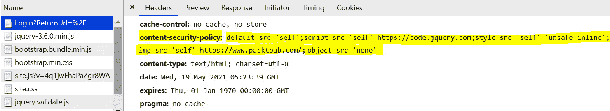

# *第 13 章*：最佳实践

总的来说，ASP.NET 核心 web 应用程序的安全性通常取决于开发人员实施安全措施和编写安全代码所采取的步骤。在本书前面的章节和菜谱中，我们已经了解了不安全的代码是什么样子，这些弱点带来的风险，以及最重要的是，如何缓解这些安全问题。但是，除了安全编码的基础知识之外，还有一些行之有效的安全编码方法。这是因为它们支持.NET 框架中可用的必要防御或保护机制，我们将在本章中对所有这些机制进行研究。

在最后一章中，我们将介绍以下配方：

*   正确的异常处理
*   使用与安全相关的 cookie 属性
*   使用内容安全策略
*   修复剩余的调试代码

在本章结束时，您将学习如何安全地处理错误和异常，在 cookie 中使用有助于保护您的应用程序免受各种安全威胁的属性，应用**内容安全策略**（**CSP**）在 ASP.NET 核心 web 应用程序中使用的资源中创建信任边界，最后学习如何正确编写调试代码。

# 技术要求

本书是为配合 VisualStudio 代码、Git 和.NET5.0 而编写和设计的。这些配方中的代码示例将在 ASP.NET Core Razor 页面中提供。示例解决方案还使用 SQLite 作为数据库引擎，以简化设置。本章的完整代码示例可在[上找到 https://github.com/PacktPublishing/ASP.NET-Core-Secure-Coding-Cookbook/tree/main/Chapter13](https://github.com/PacktPublishing/ASP.NET-Core-Secure-Coding-Cookbook/tree/main/Chapter13) 。

## 准备好了吗

对于本章中的食谱，我们需要一个在线银行应用程序示例。

打开命令 shell 并通过克隆 ASP.NET Secure Codeing Cookbook 存储库下载示例网上银行应用程序，如下所示：

```cs
git clone https://github.com/PacktPublishing/ASP.NET-Core-Secure-Coding-Cookbook.git
```

运行示例应用程序以验证没有生成或编译错误。在命令 shell 中，导航到位于`\Chapter13\exception-handling\before\OnlineBankingApp`的示例应用程序文件夹，并运行以下命令：

```cs
dotnet build
```

`dotnet build`命令将构建示例`OnlineBankingApp`项目及其依赖项。

# 正确的异常处理

处理错误和异常的实践是干净高效编码的一部分。这项技术是在开发中添加的，以使我们的代码更具可读性和可维护性。但通常情况下，由于错误处理不当，代码中会出现错误。这句话不仅适用于普通的 bug。但也有安全漏洞。错误处理异常是因为捕捉这些异常的方法不正确，从而导致不必要的利用。

在此配方中，我们将修复异常的不当处理，并防止我们的示例网上银行 web 应用吞咽异常。

## 准备好了吗

使用 Visual Studio 代码，打开位于`\Chapter13\exception-handling\before\OnlineBankingApp\`的示例网上银行应用程序文件夹。

## 怎么做…

让我们来看看这个食谱的步骤：

1.  在起始练习文件夹中，通过键入以下命令启动 Visual Studio 代码：

    ```cs
    code .
    ```

2.  Open `Services\KnowledgebaseService.cs` and observe the `try-catch` block in the `Search` method:

    ```cs
    using (XmlReader reader = XmlReader.Create(file,  settings))
    {
        try {
            XDocument xmlDoc = XDocument.Load(reader);
         // code removed for brevity
                return searchResult;
        }
        catch (Exception){
            return searchResult;
        }
    }
    ```

    请注意，`try-catch`块只捕获一个通用异常。catch 块还通过*吞咽*异常来忽略我们的示例网上银行 web 应用程序中可能发生的异常。

    作为最佳实践，我们需要对异常处理进行具体说明。因此，让我们通过指定一种可能发生的类型`Exception`来重构代码，该类型最接近代码块试图执行的内容。

3.  To apply the best practice in exception handling, we must add new catch blocks and rethrow the exception by instantiating its corresponding `FileFormatException` and `XmlException` types:

    ```cs
    using (XmlReader reader = XmlReader.Create(file,   settings))
    {
        try {
            XDocument xmlDoc = XDocument.Load(reader);
               // code removed for brevity
            return searchResult;
        }
        catch (XmlException ex){
            _logger.LogCritical(String.Format("Reader             error: {0}", ex.Message));
            throw new XmlException(ex.Message);
        }
        catch (Exception ex){
            _logger.LogCritical(String.Format("Reader             error: {0}", ex.Message));
            throw new XmlException(ex.Message);
        }
    }
    ```

    笔记

    抛出一个新的`Exception`或`XmlException`实例将使我们丢失异常的原始细节，其中包括堆栈跟踪信息。这种方法的缺点是，如果在生产过程中出现问题，那么调试应用程序将更加困难。但是，从堆栈跟踪泄漏敏感信息的风险将降至最低。

## 它是如何工作的…

忽略异常而不捕获它们是不好的做法，也是 ASP.NET 核心 web 开发人员应该避免的习惯。忽略错误条件是坏行为人利用并导致恶意行为被发现或标记的途径。确保以较少的细节重新显示异常，以防止信息泄漏。我们可以通过捕获特定的异常并收集异常的`Message`属性来实现这一点，这样就可以将其传递到我们使用 rethrow 创建的新实例中：

```cs
catch (XmlException ex) {
    throw new XmlException(ex.Message);
}
```

由于我们正在处理 XML 文件，我们应该预料到可能会出现`XmlException`类型。我们可以为这个特定的异常类型添加一个新的 catch 语句。如果我们有处理每种类型异常的特定方法，那么对泛型`Exception`类型使用单个 catch 是没有用的。

## 还有更多…

未处理的异常也由 web 服务器处理。对于我们的示例网上银行 web 应用程序，Kestrel web 服务器处理应用程序引发的异常，并在发送其余 HTTP 头之前发送 HTTP`500 Internal Error`状态代码响应。红隼随后关闭连接。如果跟踪作为响应的一部分发送，则此事件可能导致暴露异常详细信息中的堆栈跟踪。遵循此配方中的步骤将防止泄漏异常详细信息。

# 使用安全相关 cookie 属性

Cookie 是 web 应用程序开发的重要组成部分。它是一种在无状态 HTTP 协议中维护状态的方法，并携带在安全性中使用的最重要的信息，如令牌和会话数据。正如我们在[*第 7 章*](07.html#_idTextAnchor181)、*安全配置错误*的*通过不安全 cookie*修复信息暴露的配方中所了解的，我们启用或禁用 cookie 的保护以防滥用的 cookie 属性。在这个配方中，我们了解了安全和仅 HTTP 属性如何限制我们的 cookie，因为它们要么只能通过安全传输发送，要么保存在浏览器中，要么防止任意客户端脚本读取它们的敏感值。

在这个配方中，我们将学习如何使用另一个与安全相关的 cookie 属性**SameSite**。SameSite 是一个相对较新的 cookie 属性（在撰写本文时），用于限制第三方网站访问标有第一方上下文的 cookie。

## 准备好了吗

我们将使用上一个配方中使用的在线银行应用程序。使用 Visual Studio 代码，打开位于`\Chapter13\secure-cookie-policy\before\OnlineBankingApp\`的示例网上银行应用程序文件夹。

## 怎么做…

让我们来看看这个食谱的步骤：

1.  在起始练习文件夹中，通过键入以下命令启动 Visual Studio 代码：

    ```cs
    code .
    ```

2.  打开`Startup.cs`并开始向中间件全局添加 cookie 策略，方法是添加对`Microsoft.AspNetCore.CookiePolicy`命名空间的引用：

    ```cs
    using Microsoft.AspNetCore.Mvc;
    using Microsoft.AspNetCore.CookiePolicy;
    ```

3.  Next, we must add the following lines of code under the `ConfigureServices` method:

    ```cs
    public void ConfigureServices(IserviceCollection   services)
    {
        services.Configure<CookiePolicyOptions>(options =>
        {
            options.MinimumSameSitePolicy =            SameSiteMode.Strict;
            options.Secure = Environment.IsDevelopment()
    ? CookieSecurePolicy.None :                 CookieSecurePolicy.Always; 
            options.HttpOnly = HttpOnlyPolicy.Always;
        });
    // truncated
    ```

    前面的示例为我们的样本网上银行 web app 生成的 cookie 添加了必要的安全相关 cookie 属性，并添加了`MinimumSameSitePolicy`，用于控制我们的样本网上银行 web app cookie 的`SameSite`属性的行为。cookie 策略选项的`MinimumSameSitePolicy`属性被分配了`SameSiteMode.Strict`值，将`SameSite`cookie 属性标记为`Strict`值。

4.  要使用存储在 cookie 中的反 CSRF 令牌实现相同的安全 cookie 策略，请将`SecurePolicy`属性分配给`CookieSecurePolicy.Always`枚举值：

    ```cs
    services.AddAntiforgery(options => 
    {
        options.SuppressXFrameOptionsHeader = false;
        options.Cookie.SecurePolicy =         CookieSecurePolicy.Always;
    });
    ```

5.  虽然通过`ConfigureServices`设置的全局 cookie 策略将使 cookie 中的反 CSRF 令牌标记为`SameSite`属性，但您也可以将此属性显式指示给`SameSiteMode.Strict`。这意味着，如果反 CSRF cookie 位于同一站点请求中，则仅将其发送到服务器：

    ```cs
    services.AddAntiforgery(options => 
    {
        options.SuppressXFrameOptionsHeader = false;
        options.Cookie.SecurePolicy =         CookieSecurePolicy.Always;
        options.Cookie.SameSite = SameSiteMode.Strict;
    });
    ```

6.  如果关注来自会话中间件的会话状态 cookie，您可以通过将相同的`SameSite`属性分配给`SameSiteMode.Strict`：

    ```cs
    services.AddSession(options =>
    {
        options.Cookie.Name = ".OnlineBanking.Session";
    options.Cookie.SameSite = SameSiteMode.Strict;
        options.Cookie.SecurePolicy = 
            CookieSecurePolicy.Always;
        options.IdleTimeout = TimeSpan.FromSeconds(10);
    });
    ```

    来将会话状态 cookie 限制在第一方上下文中
7.  Execute the cookie policy middleware by making a call to the `UseCookiePolicy` method in `Configure`:

    ```cs
    app.UseRouting();
    app.UseCookiePolicy();
    app.UseAuthentication();
    ```

    `UseCookiePolicy`在被调用时，应用我们在`ConfigureServices`中定义的全局 cookie 策略。

## 它是如何工作的…

将`SameSite`cookie 属性设置为`Strict`将限制 cookie 何时作为请求的一部分发送的上下文。顾名思义，cookie 仅在同一站点和第一方请求中严格发送，从而防止第三方网站或 web 应用程序在启动请求时发送 cookie。这可以通过会话和反伪造服务选项进行配置：

```cs
options.Cookie.SameSite = SameSiteMode.Strict;
```

这也可以在全局 cookie 策略选项中完成：

```cs
options.MinimumSameSitePolicy = SameSiteMode.Strict;
```

关于 SameSite 属性的一些细微差别，有几点需要注意：

*   使用 SameSite 属性需要使用**安全**属性。如果 SameSite 属性没有安全属性，现代浏览器将*自动拒绝*cookie。
*   如果没有明确指定值，现代浏览器*默认情况下*会将 cookie 的 SameSite 属性设置为 Lax。Lax 允许在用户跟随链接时在请求中发送 cookie。

将 Cookie 限制为第一方请求还可以防止 ASP.NET 核心 web 应用程序受到跨站点攻击和漏洞，如**跨站点请求伪造**（**CSRF**）。

笔记

一个合理的警告：如果您的 ASP.NET 核心 web 应用程序与第三方网站广泛集成，并且这些网站需要使用您的 Cookie，则由于**Strict**SameSite 属性的限制性，用户可能会遇到一些故障。

根据您的 web 应用的风险级别，您可能希望将限制降低到`SameSiteMode.Lax`。

# 使用内容安全策略

web 安全生态系统的核心是我们每天用来与 ASP.NET 核心 web 应用程序（现代浏览器）交互的软件。浏览器具有内置的安全机制来保护用户免受攻击，从而使整个用户体验免受基于 web 的漏洞的攻击。此外，我们如何在 web 应用程序中编写代码对于指导浏览器如何启用这些安全功能至关重要。

在[*第 7 章*](07.html#_idTextAnchor181)*安全配置错误*的*修复禁用安全功能*配方中，我们了解到我们可以发送特殊的 HTTP 响应头来触发安全功能并告诉浏览器如何操作。我们可以告诉浏览器哪些主机可以安全地从中提取资源，以及在哪里可以安全地执行脚本。这些白名单规则可以使用**CSP**定义。

在本教程中，我们将学习如何实现基本的 CSP，以便我们可以将浏览器检索 web 资源的位置列为白名单。

## 准备好了吗

我们将使用上一个配方中使用的在线银行应用程序。使用 Visual Studio 代码，打开位于`\Chapter13\content-security-policy\before\OnlineBankingApp\`的示例网上银行应用程序文件夹。

## 怎么做…

让我们来看看这个食谱的步骤：

1.  在起始练习文件夹中，通过键入以下命令启动 Visual Studio 代码：

    ```cs
    code .
    ```

2.  打开`Startup.cs`查看`Configure`中的`Use`方法调用。中间件在*修复禁用的安全特性*配方

    ```cs
    app.Use(async (context, next) =>
    {
        context.Response.Headers.Add("X-XSS-Protection",        "1; mode=block");
        context.Response.Headers.Add("X-Content-Type-        Options", "nosniff");
        context.Response.Headers.Add("X-Frame-Options",         "DENY");
        await next();
    });
    app.UseHttpsRedirection(); 
    app.UseStaticFiles();
    ```

    中添加了我们在[*第 7 章*](07.html#_idTextAnchor181)、*安全配置错误*中了解的 HTTP 安全头
3.  Let's add an additional layer of defense by adding a CSP to the collection of HTTP response headers:

    ```cs
    app.Use(async (context, next) =>
    {
        context.Response.Headers.Add("X-XSS-Protection",        "1; mode=block");
        context.Response.Headers.Add("X-Content-Type-        Options", "nosniff");
        context.Response.Headers.Add("X-Frame-Options",        "DENY");
    string scriptSrc = "script-src 'self'     https://code.jquery.com;";
    string styleSrc = "style-src 'self' 'unsafe-inline';";
    string imgSrc = "img-src 'self'     https://www.packtpub.com/;";
    string objSrc = "object-src 'none'";
    string defaultSrc = "default-src 'self';"; 
    string csp = $"{defaultSrc}{scriptSrc}{styleSrc}    {imgSrc}{objSrc}";  
    context.Response.Headers.Add($"Content-Security-    Policy", csp);
        await next();
    });
    ```

    在这里，我们定义了字符串变量来保存每个最常见的 CSP 头及其源位置。然后，我们将它们作为`Content-Security-Policy`HTTP 头添加到 HTTP 响应头集合中。

### 验证内容安全策略 HTTP 头

按照以下步骤验证 CSP 现在是否作为 HTTP 响应的一部分发送：

1.  从菜单中导航到**终端****新终端**，或在 Visual Studio 代码中按*Ctrl*+*Shift*+*即可。*
**   在终端中键入以下命令以构建并运行示例应用程序：

    ```cs
    dotnet run
    ```

    *   打开浏览器并转到`https://localhost:5001/`。*   Log in using the following credentials:

    a） 电邮：`stanley.s.jobson@lobortis.ca`

    b） 密码：`rUj5jtV8jrTyHnx!`

    *   Once authenticated, you will be redirected to the home page:

    

    图 13.1–主页验证

    *   按*F12*打开浏览器的开发者工具。*   进入**网络**选项卡，在流量列表中选择第一条 HTTP 流量。*   选择 HTTP 通信形式后，滚动右侧窗格以查看相应的 HTTP 响应安全标头：*

 *

图 13.2–内容安全策略

通过这样做，安全头将被添加为我们的示例网上银行 web 应用程序发送的 HTTP 响应的一部分。

## 它是如何工作的…

每个字符串变量对应一个 CSP 头。

`scriptSrc`定义要从中加载 JavaScript 的可信源位置列表。`self`值属于我们的样本网上银行 web 应用程序本身和主机（[https://code.jquery.com](https://code.jquery.com) 我们下载 jQuery 库的地方：

```cs
string scriptSrc = "script-src 'self' https://code.jquery.com;";
```

`styleSrc`定义用于加载样式表的可信源位置列表。我们在这里使用`self`表示可以将样式表本地加载到我们的 web 应用程序，但我们也使用`unsafe-inline`允许使用内联`<style>`元素。使用`unsafe-inline`通常是不安全的，但由于没有用户控制的输入会影响我们样本网上银行 web app 的样式表，我已批准其使用，如下所示：

```cs
string styleSrc = "style-src 'self' 'unsafe-inline';";
```

笔记

我们不能说**CSS 注入**不会发生。示例 web 应用的未来版本可能允许用户控制的数据管理样式表属性。

有关 CSS 注入的更多信息，请访问*OWASP Web 安全测试指南*（*WSTG*中的*CSS 注入测试*部分：

[https://owasp.org/www-project-web-security-testing-guide/stable/4-Web_Application_Security_Testing/11-Client-side_Testing/05-Testing_for_CSS_Injection.html](https://owasp.org/www-project-web-security-testing-guide/stable/4-Web_Application_Security_Testing/11-Client-side_Testing/05-Testing_for_CSS_Injection.html) 。

接下来，我们必须为`img-src`CSP 头定义可接受的值。我们可以添加[https://www.packtpub.com/](https://www.packtpub.com/) 主机作为我们图像的可信来源：

```cs
string imgSrc = "img-src 'self' https://www.packtpub.com/;";
```

要获得安全的 CSP，`object-src`需要设置为`none`。此 CSP 标题将列出可接受的插件来源，并保留用于遗留小程序，这是一种过时的技术。不放置此标题表示**谷歌 CSP 验证器**对不安全的严重性很高（有关此工具的更多信息，请参见本配方的*部分，还有更多…*部分）：

```cs
string objSrc = "object-src 'none'";
```

最后，`default-src`CSP 头是所有其他未定义的 CSP 头的回退。

```cs
string defaultSrc = "default-src 'self';"; 
string csp = $"{defaultSrc}{scriptSrc}{styleSrc}    {imgSrc}{objSrc}";  
context.Response.Headers.Add($"Content-Security-Policy", csp);
```

前面的代码还使用字符串插值连接 CSP 头，并将它们添加到 HTTP 响应头集合中。

## 还有更多…

如果需要在页面中放置内联脚本和样式，则必须包含一个*nonce*作为`script-src`或`style-src`的源。此加密字符串*在每个请求*中必须是唯一的，以确保恶意参与者不会注入通过 ASP.NET 核心 web 应用程序中的 XSS 漏洞执行和呈现的内联脚本或样式。要快速启用此安全功能并减轻生成不可用的 nonce 的任务，请通过执行以下步骤使用`NWebsec TagHelpers for ASP.NET Core`：

1.  安装必要的软件包：

    ```cs
    dotnet add package NWebsec.AspNetCore.Mvc.TagHelpers
    ```

2.  Import the `NWebSec` tag helpers into `_ViewImports.cshtml`:

    ```cs
    @addTagHelper *, Microsoft.AspNetCore.Mvc.TagHelpers
    @addTagHelper *, NWebsec.AspNetCore.Mvc.TagHelpers
    ```

    然后，在您的`script`或`style`标签中使用`nws-csp-add-nonce`助手：

    ```cs
    @model IndexModel
    @{
        ViewData["Title"] = "Home page";
    }
    <style nws-csp-add-nonce="true"></style>
    <script nws-csp-add-nonce="true">
        console.log('nonce added');
    </script>
    this in turn will render the following markup
    <style nonce="QqTsxf7Oqqu0GOLPa36y21IV"></style>
    <script nonce="HlbkIsOBsmI66GXwH5635KBk">
        console.log('nonce added');
    </script>
    ```

此外，我们在本配方中使用的 CSP 标头并不全面。要了解更多关于其他 CSP 头的信息，请阅读*Mozilla 开发者网络（MDN）*网站[上的*CSP*文档 https://developer.mozilla.org/en-US/docs/Web/HTTP/Headers/Content-Security-Policy](https://developer.mozilla.org/en-US/docs/Web/HTTP/Headers/Content-Security-Policy) 。

您可以使用在线工具生成自己的 CSP。Report URI CSP Generator 允许您简单地勾选要包含在 CSP 中的 CSP 标题，并在文本框中填入可接受的主机，如下所示：


图 13.3–报告 URI CSP 生成器

这是在线工具的链接：[https://report-uri.com/home/generate](https://report-uri.com/home/generate) 。

另一个可以用来验证生成的 CSP 安全性的优秀工具是谷歌的 CSP 验证器，可在[上找到 https://csp-evaluator.withgoogle.com/](https://csp-evaluator.withgoogle.com/) ：


图 13.4–谷歌的 CSP 验证程序

CSP 验证器由*Lukas Weichselbaum*开发，他是谷歌员工信息安全工程师之一。使用此工具，您可以针对不同版本的 CSP 验证您放入框中的策略，并验证您的 CSP 是否具有针对**跨站点脚本**（**XSS**的强防御能力。

# 修复剩余调试代码

调试和测试代码是构建 ASP.NET 核心 web 应用程序整个周期的一部分。NET 平台提供了大量用于调试的库和组件，包括有效的诊断和跟踪。但是，对于开发人员来说，让调试代码保持原样而忽略从存储库中删除代码或添加条件检查是一种不好的做法，从而导致在生产环境中部署不必要的代码。

在这个配方中，我们将学习如何确保应用环境验证来验证是否调用了必要的调试方法。

## 准备好了吗

我们将使用上一个配方中使用的在线银行应用程序。使用 Visual Studio 代码，打开位于`\Chapter13\leftover-debug-code\before\OnlineBankingApp\`的示例网上银行应用程序文件夹。

## 怎么做…

让我们来看看这个食谱的步骤：

1.  在起始练习文件夹中，通过键入以下命令启动 Visual Studio 代码：

    ```cs
    code .
    ```

2.  Open `Startup.cs` and, at `Configure`, notice the call to the following function:

    ```cs
    app.UseStatusCodePages(  "text/plain", "Status code page, status code: {0}");
    ```

    `UseStatusCodePages`是一个中间件，提供`status code`作为响应。这有助于确定我们的示例网上银行应用程序返回了什么状态代码，但这些状态代码对我们的用户没有用处。

3.  In the same `Startup.cs` file, notice the call to the following statement:

    ```cs
    services.AddDatabaseDeveloperPageExceptionFilter();
    ```

    `AddDatabaseDeveloperPageExceptionFilter`是一个异常过滤器，提供与数据库操作相关的异常详细信息。此方法对于调试和查找 DB 相关问题的解决方案非常有用。但是，不能在生产环境中调用它。

4.  为了防止在生产环境中执行这些调试方法，请在进行这些调用之前添加一个检查，以验证当前上下文是否正在开发环境中运行：

    ```cs
    if (Environment.IsDevelopment())
    {
       services.AddDatabaseDeveloperPageExceptionFilter();
    }
    ```

5.  `UseStatusCodePages` is also placed in a code block that will only be invoked when the environment is in development due to the `IsDevelopment()` method:

    ```cs
    if (env.IsDevelopment())
    {
        app.UseDeveloperExceptionPage();
        app.UseStatusCodePages(        "text/plain", "Status code page, status code:             {0}");
    }
    else
    {
        app.UseExceptionHandler("/Error");
        app.UseHsts();
    }
    ```

    这可以防止我们的示例网上银行 web 应用程序在发生意外错误时泄露敏感信息。

## 它是如何工作的…

`IsDevelopment`方法检查代码是否在开发环境的上下文中运行。在我们执行调试方法（如`UseStatusCodePages`和`AddDatabaseDeveloperPageExceptionFilter`之前，此方法是一个有用的测试。

当被数据库错误调用时，`AddDatabaseDeveloperPageExceptionFilter`可能会暴露敏感信息。作为开发周期的一部分，定期执行安全代码审查和执行静态应用程序安全测试有助于及早发现这些问题。

## 还有更多…

安全软件开发是一个广泛的主题，编写安全代码只是这个实践的一个子集。每个 ASP.NET 核心 web 开发人员必须确保在代码中应用安全性的基本原则（*机密性*、*完整性*、以及*可用性*）。编写代码时要牢记这些安全性要求。

虽然本章讨论了如何修复安全问题和 bug，但我们在这里学到的技术可以用于在过程的早期主动检查代码和搜索漏洞。提前检测代码中的安全问题，并让*左移*文化有助于开发人员进一步降低风险，从而在每个周期结束时产生更具攻击弹性的 ASP.NET 核心 web 应用程序。*