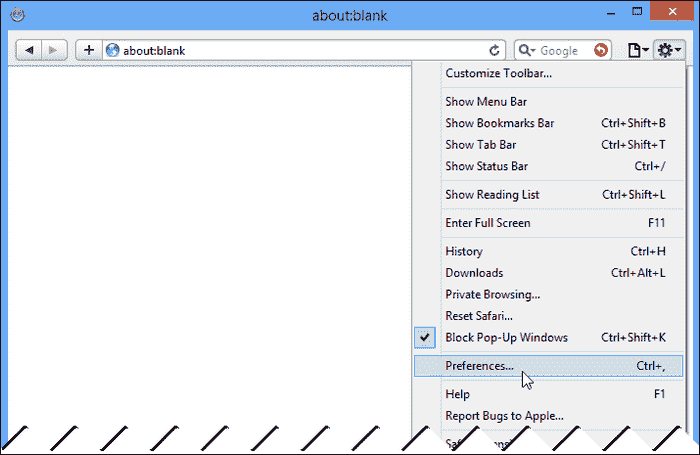

# 一、面向移动网络的开发

如果你对未来开发网络应用感兴趣，了解移动设备扮演的越来越重要的角色，以及如何开发适合其功能的应用是很重要的。我这么说不是为了吓你买我的书(尽管我希望你现在正在阅读你购买的书)，而是为了强调一个事实，即移动计算将在每个有联系的人的生活中发挥越来越大的作用。

要欣赏手机使用量的增长，应该考虑一下 iPhone。通常被誉为开启当前移动计算革命的智能手机的 iPhone，直到 2007 年才推出。2008 年底，也就是发布一年多后，移动流量占全球互联网流量的比例还不到 1%，算不上什么大革命。

然而，到 2010 年底，移动流量占所有互联网流量的近 5%，到 2012 年底，这一比例接近 13%。2013 年过半，移动流量已经超过了全部互联网流量的 15%。这一趋势大致是 1.5 的倍数，同比增长，并且有可能加速。

2012 年第四季度，iPad 总出货量达到约 140，000，000 台，约为 iPhones 总出货量的 3 倍。iPad 是在 iPhone 推出 3 年后推出的，而就在 iPad 发起平板电脑革命 3 年后，2012 年第四季度平板电脑的总出货量超过了台式机和笔记本电脑的出货量。

作为开发人员，重要的是我们要理解并拥抱这场移动革命，否则我们将被它挤垮。

在本书中，我们将使用ASP.NET MVC 4、HTML5 和 CSS3 构建一个功能齐全的网络应用，以支持桌面和移动计算平台。我们将从构建桌面版本的 web 应用开始，但会将移动考虑因素考虑在内。

一旦我们的桌面应用完成，我们将使用响应设计和媒体查询等概念对其进行修改，以支持移动网络。在这次修改中，我们将研究 ASP.NET MVC 4 的新特性，我们可以用它来更好地定位移动网络设备。

在本书的最后几章中，我们将修改应用，以支持使用 jQuery Mobile 的真正移动体验。我的目标是，到本书最后一章结束时，您将完全了解为移动网络开发需要什么，以及将您的移动网络应用提升到下一个水平的工具。

在这一章中，我们将从研究移动网络的历史开始。这种理解对于理解过去几年前所未有的增长至关重要。本章还将强调过去、现在和将来针对移动设备时存在的一些限制。最后，我们将预览微软 ASP.NET MVC 4 中的新平台支持。

我们进入移动网络的旅程现在开始了。

# 移动网络的历史

如果不知道移动网络是如何开始的，就不可能理解我们可以为移动设备开发的便利性。如果移动网络真的有用，那它本身就是一个壮举，它需要多种技术的融合才能实现。

## 诺基亚 9000

可以说，诺基亚 9000 是第一款移动网络设备。这款手机由诺基亚在 1996 年开发，重达 14 盎司(397 克)，由英特尔 i386 驱动。它配备了 640 x 200 像素灰度液晶显示器。这款手机允许用户发送传真、收发电子邮件和上网。它还配备了用于访问大型机系统的终端和远程登录应用。

## 市场碎片化

在此期间，诺基亚与爱立信等竞争移动数据空间的控制权。诺基亚 9000 被设计成使用窄带插座，这是一种由诺基亚开发和倡导的通信协议。要在诺基亚 9000 上显示的信息使用**标记文本标记语言** ( **TTML** ) 返回到手机，这是一种标记语言，内容提供商可以通过从显示和传输中移除无关信息来优化移动设备的网页。

大约在同一时间，爱立信开发了**智能终端传输协议**(**【ITTP】**)。ITTP 是爱立信对移动网络的专有标记。

对主要手机制造商来说，很明显，除非他们能够开发一个通用标准，在他们的设备上启用移动网络，否则市场分裂将不可避免。

## WAP 1.0 和 WML

1997 年 6 月 26 日，诺基亚、爱立信、摩托罗拉和 Unwired Planet 公开宣布他们将在一个**无线应用协议** ( **WAP** )上合作。WAP 1.0 是一个开放的协议，任何供应商都可以实现，这个新协议将使移动设备制造商能够从通信过程中数据丢失率本来就很高的移动设备连接到基于 IP 的互联网世界。

**无线标记语言** ( **WML** ) 成为了设计在 WAP 1.0 上运行的应用的标准，是 HTML 和 XML 的二代衍生。

然而，WAP 和 WML 有一些缺点。协议和伴随的标记语言是为非常慢的数据网络和非常有限的显示能力而设计的。如果你的设备只有有限的数据输入能力和低分辨率显示器，那么 WML 可以很好地为你服务，但是随着智能手机和移动网络浏览器的出现，它们的桌面衍生产品，WAP 1.0 和 WML 变得不那么相关了。

## WAP 2.0 和 XHTML MP

随着手机和掌上电脑的融合势头越来越大，需要新的标准来支持越来越多的网络移动设备。为了支持开始随移动设备提供的新浏览器，需要一种新的标记语言。

2001 年，WAP 论坛(现为开放移动联盟的一部分)将**可扩展超文本标记语言移动配置文件** ( **XHTML MP** )改编自 XHTML Basic，取代 WML 成为 WAP 的默认协议。

### 注

当 WAP 成为美国、英国和欧洲的标准时，日本的标准 i-mode 是由 NTT DoCoMo 开发的。

新标准是短暂的。如今，大多数移动设备都附带支持最新 HTML 标准(包括 HTML5 和 CSS3)的浏览器，但向尽可能广泛的市场提供内容仍然是一种良好的做法。

# 持续发展制约

在我们的手机、平板电脑和其他移动设备上安装现代浏览器并不意味着我们不应该为移动网络用户提供便利。在移动设备上仍然有许多实时限制，作为开发者，我们在编写移动网络应用时应该考虑这些限制。我们不能简单地缩小网络应用的桌面版本，为用户提供满意的体验。在开发移动应用时，我们必须记住，运行我们的应用的移动设备与桌面应用相比，具有不同的处理、网络和呈现限制。

## 加工约束

今天的移动设备的处理能力是将人类送上月球的阿波罗导航计算机的几倍。然而，它们并没有无限的处理能力，而且处理能力比普通电脑要低得多。

为了适应处理能力的不足，移动网络应用应该避免在应用中运行高度密集的 JavaScript 函数、图像处理或任何其他处理器密集型操作，除非这对应用的功能是绝对必要的。

减轻客户端负载的一种方法是在将内容返回到移动设备之前在服务器上做出某些确定。这种做法被称为服务器端浏览器嗅探，允许应用返回针对特定设备的网页和内容，并限制了在客户端进行浏览器功能检查的需要。在此期间，您还可以对返回给客户端进行处理的数据进行预处理。这与当前的 web 开发趋势不同，在当前的 web 开发趋势中，数据通常被提交给客户端进行处理。

通过减少服务器返回给客户端的内容量，您还可以缓解移动设备固有的一些网络限制。

## 网络约束

虽然今天的移动网络与家庭宽带网络的速度相当，在某些情况下甚至超过了家庭宽带网络，但您的用户可能会受到数据限制、速度管理、公司政策或其他限制的约束，无法在移动设备上检索数据。

移动网络也固有地在传输中比陆基通信丢失更多的网络数据。这种数据丢失对应用和用户体验有两个影响。首先，数据包丢失要求 TCP/IP 堆栈实现请求重新发送丢失的数据包，并增加了必须通过网络发送的数据量。其次，你的应用需要被编写成能够经受住失败的请求，因为它肯定会发生。

作为开发者，我们如何确保我们的移动网络应用在这样的网络上提供出色的用户体验？

### 内容压缩

我们可以从开始，通过在服务器端压缩代表我们发送给客户端的内容的数据量。

#### 服务器到客户端的压缩

内容压缩可以作为客户端应用和支持它的网络服务器之间通信的一部分。内容压缩的工作原理是提供静态内容，偶尔也提供动态内容，并使用 **gzip** 或 **deflate** 进行压缩，然后将其返回到请求应用。

为了让客户端表明它可以接受和处理内容，它必须发送一个`Accept-Encoding` HTTP 头，该头带有它将接受的编码类型的请求。

```cs
Accept-Encoding: gzip, deflate
```

在服务器上启用压缩是特定于供应商和版本的。应该注意的是，虽然在服务器上启用通信压缩确实减少了服务器必须发送的数据量，但它提高了服务器处理器的利用率。

除了压缩，我们还可以通过名为 **缩小**的流程，减少需要发送给客户端的数据量。

#### 缩小

缩小是从我们的 HTML、CSS 和 JavaScript 文件中移除无关空白的行为。缩小不是典型意义上的压缩。缩小的好处是，虽然您减少了发送到客户端的数据量，但它可以立即使用，因为该数据中的任何功能都没有被删除。

一些缩小技术也可以作为一种混淆 JavaScript 的方式，让那些不怀好意的人更难破译你的代码在做什么。这是通过解析正在缩小的内容并将长变量重命名为 1 到 3 个字符来实现的。

### 类型

**思考安全**

切勿在客户端上执行任何要求您公开密钥、用户名、密码或其他敏感信息的操作。向客户端传输此信息会招致恶作剧。

### 图像优化

图像在你的应用将要提供给客户的内容中占了很大的比例。除了缩小之外，图像优化可能是缩小应用大小的最快方法之一。

#### 较低的色深

或许在你的网站上优化图片最简单的方法就是降低图片的色深。网络上的大多数图像都是图标，可以很容易地用 8 位或 16 位色深的图像来表示。话虽如此，与其说它是一门科学，不如说它是一门艺术。随着当今移动设备显示器像素深度的增加，质量差的图像可能会降低您网站的功能，并可能会阻止一些用户使用它。

#### CSS 图像喷溅

图像精灵是可能在一个站点上使用的单个图像(包含多个图像)。然后，样式表使用不同的图像偏移量来引用图像子画面，以仅显示该图像的一部分。来自帕克特出版网站([www.packtpub.com](http://www.packtpub.com))的以下图像是图像精灵的示例:


这张图片实际上是一张包含两张图片的图片，供网站使用。两幅图像都是 31 x 31 像素。从该图像中，我们可以创建以下两种样式:

```cs
.white-go
{
    width:31px;
    background:url('img-sprite.png') 0 0;
}

.orange-go
{
    width: 31px;
    background:url('img-sprite.png') -32px 0;
}
```

首先要注意的是，这两种风格的宽度都是以我们想要显示的实际图像的宽度为限，也就是 31 像素。

`white-go`类设置应用于子画面的元素的背景图像，并将图像的偏移量设置为左上角，即 0，0。由于图像被限制为 31 像素宽，图像的观看者将只看到图像中包含白色 go 按钮的部分。

`orange-go`类对图像显示有负偏移，告诉浏览器从像素 32 开始显示图像的 31 个像素。这仅显示橙色图像。

应用可以通过将定义的样式应用于 HTML 标记中的元素来重用这两个图像，但真正的好处是应用只向服务器发出一个请求来检索这两个图像。

#### 数据 URIs

数据 URIs ( **通用资源标识符**)允许您将内容数据直接放入 URI 链接。URI 是使用`data:[<mediatype>][;base64],<data>`格式格式化的。根据 RFC 2397，数据 URI 方案定义如下:

> *<媒体类型>是互联网媒体类型规范(可选参数)。的样子”；base64”意味着数据被编码为 base64。无”；base64”，对于安全 URL 字符范围内的八位字节使用 ASCII 编码，对于该范围外的八位字节使用 URL 的标准%xx 十六进制编码来表示数据(作为八位字节序列)。如果省略<中介类型>，则默认为文本/纯文本；字符集=美国-ASCII。*

假设我们希望使用数据 URI 在页面中嵌入以下简单图像:


如果你将上面的图片作为一个 64 位编码的 URI 巴布亚新几内亚数据嵌入到你网站的一个页面中，你将在你的 HTML 源中构建一个数据 URI。


这为浏览器提供了不必单独请求检索图像的好处。通过一些巧妙的 JavaScript 和 CSS，您可以重用 URI 的内容，而无需提交另一个请求来检索图像或将图像嵌入页面两次。

作为页面内容的一部分，还有第二个额外的好处:作为 web 服务器 gzip 压缩的一部分，图像数据从服务器发送到客户端时会被压缩。

### 注

并非所有浏览器都支持数据 URIs。如果您选择在您的网站中使用数据 URIs，请确保您的目标市场的主要浏览器支持它们。

### 内容交付网络

一个 **内容交付网络** ( **CDN** )是一个分布式服务器网络，只为返回静态内容而存在。cdn 可以通过托管通常缓存的静态内容并减少应用为任何给定请求发送和接收的数据量来减少网络负载。

#### 缓存数据

如果您正在使用常见的第三方库(如 jQuery)，执行您的应用的移动设备可能已经从第三方 CDN 加载了该库。如果设备已经检索到您想要加载的数据，客户端就不需要再次从服务器检索它。它可以简单地从缓存中加载它。有几个免费的 CDN 网络可用于公共内容。截至本文撰写之时，微软在其 CDN 上托管了大量常见的第三方内容，其中一个列表可能在[http://www.asp.net/ajaxlibrary/cdn.ashx](http://www.asp.net/ajaxlibrary/cdn.ashx)找到。

作为日常维护，您需要确保您用于共享内容的 CDN 继续提供内容。如果他们删除内容，你的应用最终会降级或失败。

#### 车流量减少

一个 CDN对你的专有静态内容也很有用。如果您在站点内使用 cookie，那么对 cookie 中指定的域的每个 HTTP 请求都将重新传输 cookie 数据。静态内容不需要这些数据，它消耗的带宽可以用在其他地方。如果您将站点的静态内容移动到 cookies 所在域之外的其他域，则可以减少发送到应用和从应用接收的数据量。

### 类型

**不要让他们等**

虽然限制用户等待加载应用内容的时间至关重要，但移动网络应用尤其如此。

## 呈现约束

处理约束和网络约束有助于定义如何实现后台服务，但通常是用户看到的东西定义了他们的体验。当向用户展示应用的内容时，您需要记住，在如何向用户展示信息方面存在非常现实的限制。

### 单窗

首先，你只有一个可以工作的窗口。这意味着您不应该创建需要弹出窗口的内容。弹出窗口将在大多数移动浏览器的新标签中打开，这些浏览器在任何给定时间打开的标签数量可能有限制。

坚持使用简单的导航模式要好得多，并且减少您在任何给定时间向用户呈现的数据量。用户可能会有一些更多的屏幕触摸来浏览你的应用，但是如果你使行为一致，那么你的用户不太可能会注意到。

### 更低的分辨率

除了市场上最新的移动设备之外，大多数设备都没有桌面设备的分辨率。

对比标准手机外形，iPhone 5 的屏幕分辨率为 1136 x 640 像素，三星 Galaxy S3 的分辨率为 1280 x 720。在受欢迎的 7 英寸平板电脑中，Kindle Fire HD 和谷歌 Nexus 7 的屏幕分辨率都是 1280 x 800。只有最大的平板电脑，如 10 英寸的第三代 iPad (2048 x 1536)和 8.9 英寸的 Kindle Fire HD (1920 x 1200)，才能接近台式机的显示能力。

相比之下，iPhone 4 和 iPhone 4S 的分辨率为 960 x 640。

虽然这些分辨率对于移动设备来说似乎是值得尊敬的，但您必须记住，这些分辨率呈现在比桌面显示器小得多的屏幕上，这意味着不仅应用在这些较小的显示器上可用的像素数量减少了，而且您的应用需要呈现比桌面浏览器更大的内容、文本和按钮。这部分是因为移动设备的像素密度增加，部分是因为这些设备的输入机制是用户的手指。

### 内容间距

设计一个支持触摸而不是传统的鼠标和键盘输入方式的系统意味着你的按钮需要更大，更大的填充区域必须围绕屏幕上为与用户交互而设计的任何区域。这意味着您的用户界面和用户体验必须占很大比例的空间。

# 查看移动网络

虽然我们大多数人拥有一个、两个，或者三个或更多的移动设备来浏览网页，但我们需要开发我们的移动网络应用来支持尽可能多的设备。

## 市场百分比

重要的是让我们看看正在使用什么技术来浏览移动网络，以便我们可以适当地定位我们的移动应用。目前，安卓和 iOS 主导着移动操作系统市场，但最新版本的视窗移动正在获得市场份额。支持这些操作系统上的通用浏览器应该足以满足大多数应用的需求。

## 浏览器变体和兼容性

一个人如何针对这些特定的浏览器？所有这些系统都允许在其上安装第三方浏览器，因此我们在考虑兼容性时不能将操作系统百分比作为唯一的决定因素。

幸运的是，虽然这些平台有多种浏览器可用，但我们必须关注的布局引擎屈指可数。

### 网络工具包

WebKit 是大部分网页的布局引擎。Safari、Chrome、安卓网络浏览器、Dolphin HD(流行的第三方安卓网络浏览器)、Blackberry Browser 6.0+，甚至是 PS3 软件的一个版本都使用 WebKit。如果您的目标是没有任何特定于供应商的扩展的网络工具包，那么您将支持一个巨大的网络部分。

### 三叉戟

互联网浏览器使用三叉戟引擎布局 HTML 内容。如果你做过任何视窗桌面开发，你可能知道这个引擎的名字是 MSHTML。

自 Internet Explorer 7 以来，三叉戟在每次发布 Internet Explorer 时都会收到一个新版本。Windows 和 Windows Mobile 共享相同版本的引擎。Internet Explorer 10 和 Internet Explorer Mobile 10 使用了 6.0 版的三叉戟引擎。

### 壁虎

gecko从网景 6 开始就有了，是目前 Firefox，以及其他几个 Mozilla Foundation 项目中的布局引擎。

### 快点

Opera 浏览器和任天堂 DS/DSi 使用的是 Presto 引擎。该引擎仅作为 Opera 的一部分提供，但不可忽视。Opera 是移动网络上的主流浏览器，根据你所相信的统计数据，它仍然是目前使用的第二或第三大移动浏览器，拥有超过 20%的市场份额(目前没有一款浏览器超过 25%)。

## 模仿移动网络

由于我们将在台式机或笔记本电脑上实现我们的移动应用，我们将希望模仿我们瞄准的移动设备。我们可以通过在我们的开发机器上为每个平台安装仿真器，或者通过在我们的计算机浏览器中伪造移动浏览器体验来做到这一点。

### 移动设备和浏览器模拟器

移动设备模拟器为我们提供了在移动浏览器中测试应用功能的最佳方式，而无需访问物理移动设备。

#### 歌剧

Opera 移动仿真器是所有仿真器中占地面积最小的。这在很大程度上是因为没有模拟移动操作系统。该安装支持各种设备和浏览器版本变体，允许您在提供 Opera Mobile 的任何设备上测试应用的外观和感觉。还有一个可选的蜻蜓歌剧院安装。蜻蜓允许你调试你的 CSS 和 JavaScript，并在模拟器中调整你的应用的性能。

歌剧手机模拟器可以在[http://www.opera.com/developer/tools/mobile/](http://www.opera.com/developer/tools/mobile/)下载。

#### 安卓

安卓软件开发工具包在[http://developer.android.com/sdk](http://developer.android.com/sdk)提供，附带有移动设备仿真器，您可以使用它在安卓平台上测试您的应用。该软件开发工具包需要您安装几个第三方工具，最值得注意的是 JDK 6，才能完全发挥作用。

#### iOS

如果您无法访问运行 OS X 的机器，您就无法使用苹果官方 SDK 工具模拟 iOS 环境。第三方模拟器确实存在，您可以通过咨询本地搜索引擎找到它们。苹果用户可以在 https://developer.apple.com/xcode/index.php 下载 iOS 模拟器作为 Xcode(苹果的 IDE)的一部分。

#### Windows Mobile

微软通过其 Windows Mobile SDK 提供了一套相当全面的工具。您可以在[http://dev.windowsphone.com/](http://dev.windowsphone.com/)下载安装 Windows Mobile SDK。

### 用户代理

在模拟器之外，我们查看多种浏览器和设备变体的移动网络的最简单方法是操纵桌面浏览器的用户代理。用户代理包含在浏览器与任何标准内容请求一起发送给网络服务器的 HTTP 头中。下面一行是 Internet Explorer 10 随每个请求提交给网络服务器的用户代理 HTTP 头的表示:

```cs
User-Agent: Mozilla/5.0 (compatible; MSIE 10.0; Windows NT 6.2; Trident/6.0)
```

改变用户代理对测试应用的益处微乎其微，这一点怎么强调都不为过。即使移动浏览器通常建立在桌面浏览器的布局引擎之上，你也不能认为这些引擎会表现相同。移动引擎通常是桌面引擎的端口，并且可能由于移动设备的限制而被更改或调整。它们甚至可能不是用同一种语言写的。由于这些问题，不能假设`WebKit == WebKit`。它没有。因此，在将产品推送到生产系统之前，您需要使用实际的移动设备以及您的移动 web 应用所针对的所有浏览器变体来测试您的应用。

说了这么多，让我们来看看如何设置 Internet Explorer、Safari 和 Chrome 的用户代理字符串，以便它们将自己标识为网络服务器，作为它们的移动版本。

#### 模仿互联网浏览器手机

要从桌面上模拟 Internet Explorer Mobile，您需要访问开发人员工具。为此，您可以在互联网浏览器中按下 *F12* 或点击窗口左上角的设置轮，并从菜单选项中选择 **F12 开发者工具**。


然后，Internet Explorer 将显示一个包含 Internet Explorer 开发人员工具的可停靠窗口。在工具窗口中，从菜单中点击**工具**，然后选择**更改用户代理字符串**菜单选项。您将在 Internet Explorer 中看到一个预配置的用户代理字符串列表。您也可以通过选择**自定义…** 菜单选项来输入自定义用户代理字符串。


关闭所有浏览器窗口并退出进程后，Internet Explorer 将恢复为默认的用户代理字符串。当您使用 Internet Explorer 调试移动应用时，这一点非常重要。

#### 模拟移动游猎

要在移动 Safari 中设置用户代理字符串，我们首先必须启用移动工具。为此，按下 *Ctrl* + *、*或单击窗口左上角的设置图标，然后单击**首选项…** ，打开 Safari 的首选项面板。



在首选项窗口中，单击标记为**高级**的图标以显示高级首选项窗格，并确保勾选了菜单栏中标题为**显示桌面菜单的复选框。**


关闭窗口后，会有一个新的**开发**菜单可用。点击菜单并悬停在**用户代理**上将打开 Safari 内置支持的已知用户代理字符串。如果您没有看到您希望定位的用户代理字符串，您可以通过单击标记为**其他…** 的菜单项来提供自定义用户代理字符串。


需要注意的是，Safari 和 Internet Explorer 一样，会在您关闭浏览器窗口后将用户代理字符串的值恢复为默认值。

#### 为手机模仿 Chrome

和 Safari 一样，Chrome 也有内置的开发者工具，通过按*Ctrl*+*Shift*+*I*或者点击右上角的自定义图标，选择**工具**，然后点击**开发者工具**菜单项，即可立即访问这些工具。


点击**开发工具**菜单项将在浏览器底部显示一个停靠窗口。在这个窗口的左下角是一个小齿轮图标。单击图标将在一个覆盖的窗口中显示开发人员工具的设置。窗口有三个选项卡:**常规**、**覆盖**和**快捷方式**。单击**覆盖**选项卡，选中标记为**用户代理**的复选框，然后从下拉菜单中选择您想要使用的用户代理字符串。


像 Safari 和 Internet Explorer 一样，您可以创建供浏览器使用的自定义用户代理字符串。与那些浏览器不同，如果关闭所有窗口，谷歌 Chrome 会记住要使用的用户代理字符串。

#### 本书中的仿真

当使用用户代理仿真时，本书中的所有示例都将从 Chrome 内部仿真 iOS 使用的移动 Safari 浏览器。这在很大程度上是由于 Chrome 使用了与 Safari 相同的布局引擎，但主要是由于浏览器本身内置的开发工具，以及它比 Safari 更广泛地安装在运行 Windows 的计算机上。

当使用移动模拟器时，我们将使用 Opera Mobile 模拟三星 Galaxy S II——一款屏幕分辨率为 480 x 800，每英寸 216 像素的设备。

我们还将展示一些物理设备的屏幕，如 iPhone 4、iPhone 5 和华硕 Nexus 7 安卓平板电脑。

您应该可以在上面提到的任何浏览器或模拟器上运行书中的示例。

# 支持 ASP.NET MVC 4 中的移动 web

微软凭借 Visual Studio 2012 和 ASP.NET MVC 4.0 对移动网络有着前所未有的开发支持。现成的最新环境支持:

*   HTML5 和 CSS3(开发响应性移动网络应用的关键标准)
*   能够合并、压缩和转换 JavaScript 和 CSS 文件，以最大限度地减少浏览器请求和带宽需求
*   针对特定移动平台的新约定支持
*   作为新移动应用项目模板的一部分，jQuery Mobile 集成到您的移动应用项目中

所有这些对微软开发环境的改进直接解决了我们作为开发人员、工程师、架构师和内容设计人员必须关注的约束。如果将这些改进与。NET 4.5，。像我们这样的网络用户现在可以比以往任何时候都更好地瞄准移动网络。

# 总结

在这一章中，我们了解了为什么作为开发人员，拥抱移动网络并确保我们的应用支持它是很重要的。我们首先简要介绍了移动网络的历史，以及像我们这样的开发人员在通过移动浏览器查看我们的网站时仍然面临的限制，以确保最佳的用户体验。我们还学习了如何从我们的桌面模拟常见的移动浏览器，并了解了微软通过新的 ASP.NET MVC 4 工具 Visual Studio 2012 和提供了什么来支持移动网络。NET 4.5。

在下一章中，我们将为我们的应用——一个名为“酿酒”的自制配方共享应用——创建外壳，并配置我们的环境以在模拟器中运行该应用。