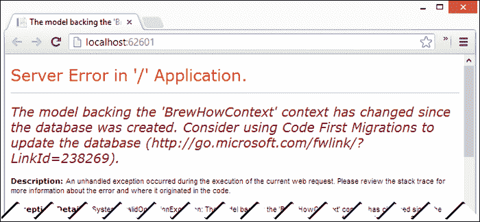
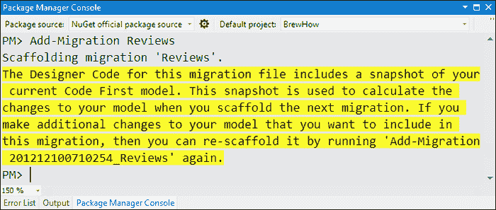
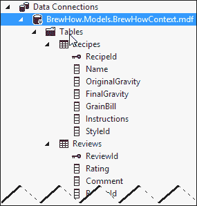
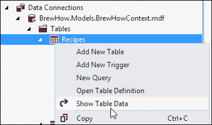
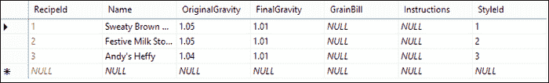
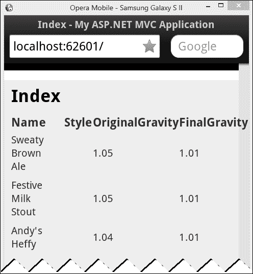

# 四、在 EF5 中建模酿酒

如果你正在开发一个新的应用，微软非常希望你使用**实体框架 5.0** ( **EF5** )。实体框架是微软官方支持的**对象-关系映射** ( **ORM** )工具，在经过了一段饱受诟病的介绍之后，终于独立出来了。NET 3.5 SP1。

与任何 ORM 一样，实体框架旨在将应用的域模型与实际的存储机制分开。这使得开发人员能够专注于他们试图解决的实际问题，并减少担心模型下的表和列的时间。

让框架提供底层存储机制确实有其自身的一系列问题。几乎任何数据库管理员都会告诉您，表单通常会生成不符合标准的存储模型，实体框架也不排除这个问题。然而，实体框架允许您定制域和数据库之间的转换，以匹配几乎任何可能的底层数据存储，从而允许您和您的数据库管理员相对和谐地工作。

在本章中，我们将使用实体框架 5 为 BrewHow 应用创建持久层。我们将探讨迁移以及如何使用它们来应用和删除对数据库的更改。此外，我们将查看实体框架 5.0 使用的一些约定和配置，以根据我们或我们的数据库管理员更喜欢的数据库映射来定制我们的模型。

# 实体框架 5.0 有什么新功能？

实体框架的 5.0 版本是对微软 ORM 的一个相当大的更新。虽然有一些改进和增加，我们将只简要地检查这些改进，因为它们与在我们的酿酒应用开发中使用 EF5 有关。

## 性能增强

在引擎盖下，微软已经把它能做到的每一分性能都挤出了框架。关键的性能增强之一是编译查询的自动使用——在这种查询中，LINQ 到实体表达式树已被转换为纯 SQL。为了实现这一点，在第一次调用 EF5 时，框架配置查询所需的所有组件，缓存查询的某些组件，并将它们本地存储在内存中，以便任何后续调用都不需要翻译或加载资源。这大大提高了预热应用的性能。

## 本地数据库支持

现在在 EF5 代码优先开发模型中支持 LocalDB。事实上，它是 Visual Studio 2012 中使用的默认服务器。

如果你不熟悉 LocalDB，它是面向开发人员的新版 SQL Server。它旨在介于 SQL Server Express 和 SQL Server Compact 之间。你可能会问自己，“这不就是 SQL Server Express 的用途吗？”尽管微软的初衷是让 SQL Server Express 成为开发人员的数据库标准，但随着 SQL Server 系列的改进，维护开发人员的低开销、小占用空间的要求变得更加困难，因为其完全许可的兄弟公司对 SQL Server Express 提出了要求。为了纠正这种情况，微软创建了本地数据库，这是一个与快速版和其他版本的 SQL Server 相同的 SQL Server 可执行文件的重新打包，但没有 SQL Server 系列的大量占用和配置。重新打包允许我们作为开发人员在开发中维护 SQL Server 兼容性，而不必安装和配置 SQL Server Express 或其中一个企业变体。

LocalDB 与 SQL Server Compact 的不同之处在于，它是一个独立的进程(SQL Server Compact 是一个 in-proc DLL)，并在 SQL Server Compact 不支持的情况下为存储过程和扩展数据类型提供支持。

## 枚举支持

EF5 终于获得了对枚举的支持，这是实体框架最早版本就要求的特性。框架对枚举的支持是通过将枚举值映射到数据库中的整数值和从数据库中的整数值映射来提供的。如果您需要一个查找表，想要在不重新编译的情况下添加或更改值，或者是不希望在其数据库中使用神奇整数的人，您仍然需要使用映射到查找表的类来表示枚举值。

关于枚举支持有一个重要的警告；仅当您的目标是的 4.5 版时，它才可用。NET 框架。如果您的目标是 4.0 版本，您将收到一条错误消息，指出框架无法映射枚举属性。但是，如果您的目标是的 4.5 版或更高版本。NET Framework 中，枚举是我们作为开发人员喜欢的那些漂亮的小“它就是工作”特性之一。

# 酿酒模式

实体框架支持三种不同的数据建模方式:**数据库优先**、**模型优先**和**代码优先**。

*   当数据库已经存在并且支持从现有数据库模式派生模型时，使用数据库优先
*   “模型优先”方法支持可视化地建模我们的数据，并根据模型生成数据库
*   代码优先允许我们从代码中定义的模型生成数据库模式

由于我们正在开发一个新的应用，数据库优先的数据建模方法并不真正适用。在 Visual Studio 2010 中引入的模型优先方法可以用于 BrewHow 应用，但是我们将选择更敏捷的代码优先方法。

代码优先的方法还允许我们使用迁移以(基本上)非破坏性的方式更新模式。这很重要，因为我们将调整模型，以更好地映射我们的领域，因为我们不断增强我们的应用。另外，它很酷，我们喜欢新的闪亮的玩具，对吗？因此，让我们启用 EF5，并开始在我们的应用中使用它。

## 建模数据

使用 EF5 的代码优先特性，类将决定用于建模我们的领域的数据库模式。我们将从三个班级开始:`Recipe`、`Review`和`Style`。这些类中的每一个都将被添加到我们的酿酒应用的`Models`文件夹中。

### 食谱

`Recipe`类包含所有关于我们食谱的信息。这是上一章中介绍的类的稍加修改的版本。

```cs
public class Recipe
{
    public int RecipeId { get; set; }
    public string Name { get; set; }
    public Style Style { get; set; }
    public float OriginalGravity { get; set; }
    public float FinalGravity { get; set; }
    public string GrainBill { get; set; }
    public string Instructions { get; set; }
}
```

### 审核

`Review`类包含与配方评审相关的信息。

```cs
public class Review
{
    public int ReviewId { get; set; }
    public int Rating { get; set; }
    public string Comment { get; set; }
}
```

### 风格

`Style`类将允许我们将一种风格与特定的啤酒配方联系起来。啤酒风格的例子有印度淡啤酒、牛奶/甜啤酒、比尔斯纳啤酒和波特啤酒。

```cs
public class Style
{
    public int StyleId { get; set; }
    public Category Category { get; set; }
    public string Name { get; set; }
}
```

### 类别

`Category`类是一个枚举，将用于定义啤酒为淡啤酒或淡啤酒。我们使用枚举，因为这些值不会改变。

```cs
public enum Category
{
    Ale,
    Lager
}
```

### 酿酒厂的背景

我们现在有了代表我们模型的类。我们需要一种方法将这些类映射到持久存储。为此，我们将创建一个名为`BrewHowContext`的类来扩展`DbContext`类。

`DbContext`是存储库和工作单元模式的组合。它提供了将代码优先模型映射到数据库的粘合剂。它还提供了更改跟踪，允许您对上下文中的一个或多个实体进行多次编辑，并将它们批量提交给数据库。

然而`DbContext`并不神奇。它需要对模型中存在的实体有所了解，对它负责的实体有所了解。`DbContext`使用特殊的集合类将实体映射到数据库中的表。这个班是`DbSet<T>`。

`DbSet<T>`类是实体框架中的一个特殊类，用于表示一组类型化对象，您可以在其上执行**【CRUD】**(**创建**、**检索**、**更新**和**删除**)操作。这些操作可以使用 LINQ 来执行，因为`DbSet<T>`实现了`IQueryable`界面。

在我们应用的`Models`文件夹中创建`BrewHowContext`。您需要在`BrewHowContext.cs`的`using`声明中添加`System.Data.EntityFramework`。

```cs
public class BrewHowContext : DbContext
{
    public DbSet<Recipe> Recipes { get; set; }
    public DbSet<Review> Reviews { get; set; }
    public DbSet<Style> Styles { get; set; }
}
```

### 注

不能直接构造`DbSet<T>`类。只有`DbContext`类可以创建`DbSet<T>`的新实例。

## 生成我们的数据库

为了生成我们的数据库，我们只需要运行我们的应用，但是如果我们现在尝试运行它，我们将会得到一个编译错误。出现错误是因为我们更改了`Recipe`类的定义。在`Controllers`文件夹中找到`RecipeController`类，并用以下内容替换`Index`动作方法:

```cs
public ActionResult Index()
{
    List<Recipe> recipes = null;

    using (var context = new BrewHowContext())
    {
        recipes = (from recipe in context.Recipes
                   select recipe).ToList();
    }

    return View(recipes);
}
```

我们的应用现在应该编译并运行了。按 *Ctrl* + *F5* 启动我们的应用。


当然，没什么好看的。我们的表格标题在那里，但没有太多其他的。我们真正做的是创建数据库——一个空的数据库，但仍然是一个数据库。

要查看我们的数据库和其中的表格，请单击**解决方案资源管理器**工具栏上的**查看所有文件**图标。


展开`App_Data`文件夹，双击名为`BrewHow.Models.BrewHowContext.mdf`的文件。


我们新的数据库现在在**数据库浏览器**窗口中打开。


当您检查每个表的结构时，您会注意到实体框架足够聪明来识别表的键。这是一个超越常规配置的特性。以`Id`结尾且与包含它的类同名的类型为`int`或`Guid`的任何属性都将用作表的主键。

## 改变模型

当我们继续检查我们的新数据库时，有些事情我们需要改变。

目前，`Review`类与`Recipe`类没有关联。这似乎是我们的一个重大疏忽。我们需要提供一种从`Recipe`类导航到`Review`类的方法。

`Style`和`Recipe`的关系也需要修改。我们可以通过创建类型`ICollection<T>`的属性来表示`Style`和`Recipe`之间以及`Recipe`和`Review`之间的一对多关系。

至于约定，在`Recipe`类中有一个`Style_StyleId`的外键似乎有点多余。实体框架中的约定是在格式`[EntityName][EntityKeyName]`中寻找外键属性。在这种情况下，它正在寻找一个名为`StyleStyleId`的物业。由于该属性不存在，它创建了一个名为`Style_StyleId`的外键，以满足由`Recipe`类的`Style`属性标识的外键关系。

### 添加关系

以下代码显示了修改后的`Review`和`Recipe`类:

```cs
public class Recipe
{
    public int RecipeId { get; set; }
    public string Name { get; set; }
    public Style Style { get; set; }
    public decimal OriginalGravity { get; set; }
    public decimal FinalGravity { get; set; }
    public string GrainBill { get; set; }
    public string Instructions { get; set; }

 public virtual ICollection<Review> Reviews { get; set; }
}

public class Style
{
    public int StyleId { get; set; }
    public Category Category { get; set; }
    public string Name { get; set; }

 public virtual ICollection<Recipe> Recipes { get; set; }
}
```

### 超越常规

要覆盖约定，我们可以覆盖`BrewHowContext`类中`DbContext`的`OnModelCreating`方法。实体框架将在创建第一个`BrewHowContext`实例时调用该方法，并将其传递给`DbModelBuilder`实例。

`DbModelBuilder`为我们提供了支持，可以将模型的实体流畅地映射到它们所保存的数据库中。借助`DbModelBuilder`我们可以更改属性的列名或关系使用的键。我们甚至可以更改实体映射到的表的名称。

以下是修改`Recipe`到`Review`关系和`Style`到`Recipe`关系的模型映射的代码。

```cs
protected override void OnModelCreating(DbModelBuilder modelBuilder)
{
    // Add a foreign key to Recipe from Review 
    // to account for the new relationship.
    modelBuilder.Entity<Recipe>()
        .HasMany(r => r.Reviews)
        .WithRequired()
        .Map(m => m.MapKey("RecipeId"));

    // Adjust the relationship between Style 
    // and Recipe to fix the key name.
    modelBuilder.Entity<Recipe>()
        .HasRequired(s => s.Style)
        .WithMany(s => s.Recipes)
        .Map(m => m.MapKey("StyleId"));

    base.OnModelCreating(modelBuilder);
}
```

现在运行我们的应用会产生一条错误消息，告诉我们我们的上下文已经改变。这是因为我们对模型进行了更改。该模型现在不再与数据库中保存的模型匹配。



幸运的是，EF5 提供了一种机制来改变我们的数据库，以匹配我们调整后的模型。这种机制就是迁徙。

### 启用迁移

在 EF5 中使用迁移需要我们使用**包管理器控制台**。打开**包管理器控制台**，点击**工具**菜单，点击**库包管理器**，然后点击**包管理器控制台**。


在控制台中，输入`Enable-Migrations –ContextTypeName BrewHow.Models.BrewHowContext`并点击*进入*。


### 注

通常，您可以在**包装管理器控制台**中键入`Enable-Migrations`，而无需指定`-ContextTypeName`参数。然而，我们的应用基于`Internet Application`模板，它也创建了一个`Context`类。当一个项目中存在多个`Context`类时，必须指定要启用迁移的`Context`类的名称。

启用迁移会在解决方案中添加一个新的`Migrations`文件夹。该文件夹包含两个控制模式和配置的文件。


#### 初始创建迁移

最初的迁徙被命名为`InitialCreate`。它是为我们生成的，因为实体框架的迁移需要一个基线来工作。在我们启用迁移之前，我们的数据库已经初始化，因此该框架对数据库的`InitialCreate`迁移进行了逆向工程。

```cs
public partial class InitialCreate : DbMigration
{
    public override void Up()
    {
        CreateTable(
            "dbo.Recipes",
            c => new
                {
                    RecipeId = c.Int(nullable: false, identity: true),
                    Name = c.String(),
                    OriginalGravity = c.Decimal(nullable: false, precision: 18, scale: 2),
                    FinalGravity = c.Decimal(nullable: false, precision: 18, scale: 2),
                    GrainBill = c.String(),
                    Instructions = c.String(),
                    Style_StyleId = c.Int(),
                })
            .PrimaryKey(t => t.RecipeId)
            .ForeignKey("dbo.Styles", t => t.Style_StyleId)
            .Index(t => t.Style_StyleId);

        CreateTable(
            "dbo.Styles",
            c => new
                {
                    StyleId = c.Int(nullable: false, identity: true),
                    Category = c.Int(nullable: false),
                    Name = c.String(),
                })
            .PrimaryKey(t => t.StyleId);

        CreateTable(
            "dbo.Reviews",
            c => new
                {
                    ReviewId = c.Int(nullable: false, identity: true),
                    Rating = c.Int(nullable: false),
                    Comment = c.String(),
                })
            .PrimaryKey(t => t.ReviewId);

    }

    public override void Down()
    {
        DropIndex("dbo.Recipes", new[] { "Style_StyleId" });
        DropForeignKey("dbo.Recipes", "Style_StyleId", "dbo.Styles");
        DropTable("dbo.Reviews");
        DropTable("dbo.Styles");
        DropTable("dbo.Recipes");
    }
}
```

通过检查`InitialCreate`类中的代码，我们可以看到生成的代码有两种方法:`Up`和`Down`。每种方法都使用流畅的应用编程接口。实体框架使用`Up`方法对数据库进行迁移。`Down`方法用于撤消迁移。

#### 配置类

`Configuration`类为我们提供了一种控制迁移行为的方法。

```cs
internal sealed class Configuration : DbMigrationsConfiguration<BrewHow.Models.BrewHowContext>
{
    public Configuration()
    {
        AutomaticMigrationsEnabled = false;
    }

    protected override void Seed(BrewHow.Models.BrewHowContext context)
    {
        /* … */
    }
}
```

通过这个类，我们可以配置一些东西，比如通过迁移启用自动数据丢失，或者命令在超时前可以执行多长时间。您在代码中看到的两种用法是这个类最常见的两种用法:自动迁移支持和种子数据。

### 添加种子数据

`Configuration`类的`Seed`方法用于在迁移过程中插入样本数据。因为我们希望在启动应用时有一点可用的数据，所以让我们用以下代码替换`Seed`方法(您需要将`BrewHow.Models`添加到`using`语句中)。

```cs
protected override void Seed(BrewHow.Models.BrewHowContext context)
{
    var brownAle = new Style 
    { 
        Name = "Brown Ale", 
        Category = Models.Category.Ale 
    };

    var milkStout = new Style 
    { 
        Name = "Sweet/Milk Stout", 
        Category = Models.Category.Ale 
    };
    var heffeweisen = new Style 
    { 
        Name = "Heffeweisen", 
        Category = Models.Category.Ale 
    };

    context.Styles.AddOrUpdate (
        style => style.Name,
        brownAle,
        milkStout,
        heffeweisen
    );

    context.Recipes.AddOrUpdate(
        recipe => recipe.Name,
        new Recipe 
        { 
            Name = "Sweaty Brown Ale", 
            Style = brownAle, 
            OriginalGravity = 1.05M, FinalGravity = 1.01M 
        },
        new Recipe 
        { 
            Name = "Festive Milk Stout", 
            Style = milkStout, 
            OriginalGravity = 1.058M, 
            FinalGravity = 1.015M 
        },
        new Recipe 
        { 
            Name = "Andy's Heffy", 
            Style = heffeweisen, 
            OriginalGravity = 1.045M, 
            FinalGravity = 1.012M 
        }
    );
}
```

这段代码向我们的`BrewHowContext`类`DbSet`添加了新的实体。这些实体将在执行`Seed`方法后交付存储。

非常重要的是要注意，每次我们应用迁移时都会执行这个方法。这意味着我们必须保持`Seed`方法与我们对模型所做的任何更改同步。

### 添加迁移

我们快到了。我们需要添加一个新的迁移，以反映我们所做的更改。我们使用**包管理器控制台**中的`Add-Migration`命令来完成此操作。

`Add-Migration`将用一个参数调用:迁移的名称。因为我们做的最大的改变是从`Review`到`Recipe`的外键引用，我们称之为`Reviews`。在**包装管理器控制台**中，输入`Add-Migration Reviews`并点击*进入*。



在我们项目的`Migrations`文件夹中打开新文件。您会发现一个名为`Reviews`的新迁移类。

```cs
public partial class Reviews : DbMigration
{
    public override void Up()
    {
        /* Fluent Migrations Up */
    }

    public override void Down()
    {
        /* Fluent Migrations Down */
    }
}
```

我们再次看到，我们支持通过`Up`方法从之前的模型迁移到这个模型，或者我们可以通过`Down`方法从这个模型迁移到之前的模型。

从数据库中为我们创建的`Reviews`迁移和`InitialCreate`迁移之间有一个关键的区别:`Reviews`迁移没有被应用。这允许我们在应用迁移之前对其进行一些最后的调整。让我们去掉外键的级联删除。更新两个`AddForeignKey`方法调用，将命名参数`cascadeDelete`设置为假并保存文件。

```cs
AddForeignKey(
    "dbo.Recipes", 
    "StyleId", 
    "dbo.Styles", 
    "StyleId", 
 cascadeDelete: false);

AddForeignKey(
    "dbo.Reviews", 
    "RecipeId", 
    "dbo.Recipes", 
    "RecipeId", 
 cascadeDelete: false);

```

剩下的就是我们应用迁移。

### 应用迁移

应用迁移实际上只是将迁移的`Up`或`Down`方法应用到数据库。在**包管理器控制台**中，输入`Update-Database`并点击*进入*。


当在没有参数的情况下执行`Update-Database`命令时，将对任何未应用的迁移应用`Up`方法。

### 类型

**获取迁移命令的帮助**

所有迁移命令都有帮助。只需在包管理器控制台中输入`help`然后输入需要帮助的命令，点击*进入*(例如`help Update-Database`)。花一些时间研究这些命令，因为您可以使用它们来生成 SQL 脚本、定位特定的迁移以及许多其他有用的东西。

要查看我们工作的输出，在**数据库浏览器**中打开 BrewHow 数据库。



我们可以看到我们在`OnModelCreating`中创建的映射已经成功应用。我们成功地将外键重命名为`StyleId`，`Reviews`表现在有了一个引用`Recipes`表的名为`RecipeId`的外键。

我们可以在数据库中查找，以确保我们的`Seed`方法按照我们认为的方式执行。要查看我们的`Recipes`表格的内容，右键单击`Recipes`表格，并从上下文菜单中选择**显示表格数据**。



我们的样本数据确实在那里。



## 消费模型

当我们在本章开始修改我们的`RecipeController`类时，我们替换了`Index`动作方法中的代码，以使用新的`Recipe`模型和`BrewHowContext`。如果您按下 *Ctrl* + *F5* 启动该应用，您将看到我们确实正在通过`BrewHowContext`使用数据库中的数据。



这令人印象深刻，但是我们的实现存在一些问题。首先，记下食谱的顺序。一个都没有。数据似乎是按照它被插入数据库的顺序。现在或多或少是这样，但这有三个很大的问题:

*   我们没有提供项目插入列表的日期。
*   查看按输入日期排序的食谱列表(最早的优先)对用户没有什么价值。
*   SQL Server 可以并且将会更改数据的返回顺序。这几乎可以保证。

还需要注意的是，主页每次都会加载并显示数据库中的每个配方。这对小数据集和少量用户的影响微乎其微，但如果我们的数据库中有数百或数千个食谱和数百个用户——让我们谦虚一点——我们的应用性能将会受到影响。

这些问题的解决方案非常简单。我们可以从为菜谱提供默认的排序顺序开始。如果我们按照菜谱的名称进行订购，用户应该能够相当容易地找到他们想要的东西——至少在我们的数据库中只有几个菜谱的情况下。我们可以把改变排序顺序作为以后要解决的问题。

至于把主页上的食谱分成易于管理的小块，我们需要为分页提供支持。

### 分页

允许用户浏览食谱是一种屡试不爽的方法，可以将数据检索和展示分解成可消化的部分。

### 类型

**分页选项**

当用户接近页面底部时，可以使用永久滚动等技术来加载下一页数据。其他选项包括一个按钮，允许用户检索下一页数据并将其附加到当前视图。然而，传呼机是一个久经考验的选择，仍然被大多数网络用户所采用。随意实验。

为了支持分页，我们需要一个可以向视图返回分页结果的类。此类不仅需要提供页面的项目列表(在本例中是菜谱)，还必须提供当前页面和支持分页控件的总页数。以下是`PagedResult`类:

```cs
public class PagedResult<T> : List<T>, IPagedResult
{
    private const int PageSize = 10;

    public PagedResult(IQueryable<T> query, int page)
    {
        this.Page = page;
        this.TotalPages = (int) Math.Ceiling(
            query.Count() / (double)PageSize);

        this.AddRange(query
            .Skip(page * PageSize)
            .Take(PageSize));
    }
    public int Page { get; private set; }
    public int TotalPages { get; private set; }
}
```

`PagedResult`类扩展了通用列表类，为视图提供食谱列表或任何其他内容。类本身也实现了一个名为`IPagedResult`的接口。

`IPagedResult`界面的存在允许我们在任何页面上创建一个通用的分页控件。界面本身非常简单，只包含`Page`和`TotalPages`属性。

```cs
public interface IPagedResult
{
    int Page { get; }
    int TotalPages { get; }
}
```

传递给实现`IPagedResult`的视图的任何模型都有提供分页信息所必需的信息。我们可以构建一个以`IPagedResult`的实现为模型的控件。我们的分页控件`PagingPartial`的代码如下所示:

```cs
@model BrewHow.Models.IPagedResult

<div id="pager">

@if (Model.Page > 0)
{
    @Html.RouteLink("<< Prev", new
    { 
        page = Model.Page - 1,
        controller = ViewContext.RouteData.Values["controller"],
        action = ViewContext.RouteData.Values["action"]
    },
    new
    {
        id = "paging-prev"
    });
}
<span>Page @(Model.Page + 1) of @Model.TotalPages</span>
@if (Model.Page +1 != Model.TotalPages)
{
    @Html.RouteLink("Next >>", new
    {
        page = Model.Page + 1,
        controller = ViewContext.RouteData.Values["controller"],
        action = ViewContext.RouteData.Values["action"]
    },
    new
    {
        id = "paging-next"
    });
}
</div>
```

`PagingPartial`部分视图，如果第一页还没有，则显示查看上一页数据的链接，如果最后一页还没有，则显示查看下一页数据的链接，并显示当前页码和总页数。

为了构建到上一页和下一页的链接，控件使用`RouteLink` HTML 帮助器。`RouteLink`可以基于命名路由或任何路由值构建链路。我们将在后面的章节中详细讨论路由，但是请注意，我们正在传递用于构建路由的控制器和操作的值。这些都是我们在[第 3 章](03.html "Chapter 3. Introducing ASP.NET MVC 4")、*介绍 ASP.NET MVC 4*的默认路由中讨论过的相同变量。

在`RecipeController`类的`Index`视图上加载`PagingPartial`控件很简单。

```cs
@{ Html.RenderPartial("PagingPartial", Model); }
```

剩下要做的就是修改`Index`动作，将页码作为参数，并返回一个`PagedResult`对象作为视图的模型。

```cs
public ActionResult Index(int page = 0)
{
    PagedResult<Recipe> recipes = null;

    using (var context = new BrewHowContext())
    {
        recipes = new PagedResult<Recipe>(
 context.Recipes.OrderBy(r => r.Name),
            page);
    }

    return View(recipes);
}
```

您会注意到，我们将我们的默认顺序，配方名称，应用于从`BrewHowContext`检索的配方。如果我们在`PagedResult`类中将页面大小设置为只包含一个配方，输出看起来类似于以下内容:


在发布你的作品之前，一定要把页面大小设置得合理一点。

# 总结

本章简要介绍了实体框架。向您展示了关于创建域模型和使用实体框架将该模型映射到数据库的信息。您还学习了如何更改模型的映射以及如何用样本数据播种数据库。

在接下来的章节中，当我们调整模型以支持新需求的实现时，我们将重新讨论 EF5。

在下一章中，我们将研究**领域驱动设计**，以及我们如何利用它的一些原则来帮助我们编写更易维护的代码，以及这些原则对我们如何构建代码的影响。然后，我们将修改我们的应用，以遵守这些原则。