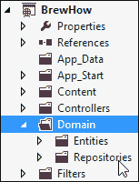
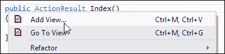
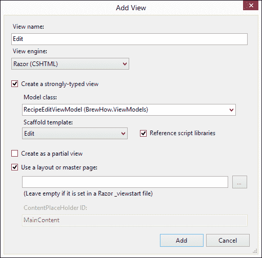

# 五、酿酒领域和领域驱动设计

当我们开始讨论酿酒应用时，我们经历了一段相当长的关于啤酒和酿造过程的描述。虽然我承认我喜欢和任何愿意听的人谈论啤酒，偶尔也会和那些不愿意听的人谈论啤酒，但我还是提供了这些信息来帮助你理解与啤酒及其生产相关的概念。为什么知道如何酿造好啤酒对编写酿酒程序很重要？

我将用另一个问题来回答这个问题。如果有人让你写一个应用来确定一只空载燕子的风速，你能做到吗？如果你单干，你需要的不仅仅是软件开发技能。你需要很好地理解空气动力学和运动学。考虑到这种情况不太可能发生——亲爱的读者，如果是这样的话，你应该向领域专家咨询。

同样的原理也适用于设计软件；不仅仅是关于啤酒或燕子(非洲、欧洲或其他)的软件，而是任何领域的任何软件。如果你不了解这个领域，你就不能编写软件来支持它。

**领域驱动设计**(**【DDD】**)一句由 Eric Evans 首创的短语，是一种将领域及其抽象模型置于前沿的开发方法。在本章中，我们将学习 DDD 的基本概念和模式。然后，我们将把这些知识应用到我们的酿酒应用中。

# DDD 的信条

对 DDD 的详细讨论可以，事实上也确实值得写一整本书。由于我们正在这里开发一个小应用，我们将重点关注与我们的开发工作相关的 DDD 部分。

## 领域模型

域模型顾名思义。这是一个领域的模型。不幸的是，这个术语也很模糊。如果有人谈论模型，大多数开发人员会立即想到应用的底层存储。这里不是这样。

简单来说，一个领域模型就是把问题空间翻译成一种通用语言。它可用于定义适用于实体、值、集合、属性、操作、事件或问题域中任何其他项目的通用术语。如果做得好，领域模型将没有技术指导或实现。领域模型提供的澄清使它成为一个优秀的工具，有助于跨组织所有级别的沟通。

## 实体

实体是领域模型的块，它们在领域内是唯一可区分的。它们的唯一性不是组成对象的属性的集合，而是它们在应用的整个生命周期中的持续存在。

在我们的应用中，配方是实体的一个例子。虽然配方的一个实例可能与许多其他配方共享相同的属性，但它在应用中是唯一可识别的，并且将贯穿其整个生命周期。

## 价值对象

价值对象是不能单独存在的对象。它们只存在于其他对象的上下文中。与实体不同，值对象不是唯一可识别的。值对象的另一个特征是它是不可变的——值对象的值不能改变。

重力是我们应用中价值对象的一个例子。虽然我们目前将原始重力和最终重力表示为浮点值，但我们可以将它们表示为更有意义的类型。重力类型将没有识别特征，并且在配方实体(值对象的定义)的上下文之外没有意义。

## 骨料

聚合是由单个父对象控制的对象的集合。你可以把它们想象成一个对象图或树。聚合的父级称为聚合根。对聚合中任何子对象的访问都是通过聚合根获得的。

当我们在[第 4 章](04.html "Chapter 4. Modeling BrewHow in EF5")、*中为 BrewHow 创建模型时，我们在 EF5* 中构建了一个由`Style`、`Recipe`和`Reviews`集合组成的集合。在这个聚合中，`Recipe`类是聚合根。`Reviews`离不开`Recipe`，同样，如果没有与`Style`相关联的`Recipes`，`Style`在我们的领域内缺乏目标。

## 工厂

当聚合或实体变得过于复杂而无法简单构建时，工厂就被用来创建。它们提供了一种方法来封装对象所需的引导，并强制执行任何关于创建实体或聚合的规则。

工厂与基础设施没有联系，只处理实体或集合的创建。

## 储存库

与处理聚合和实体创建的工厂不同，存储库用于聚合和实体的持久化和检索。它们为存储库的客户端提供了一种通过实体或集合的标识特征来检索对其的引用的方法，或者为客户端提供了一种将新的集合或实体保存到存储中的方法。

存储库应该为客户端提供一个简单的界面，该界面不包含任何标识用于存储的底层基础架构的信息。换句话说，存储库的存在是为了将一个领域的实体从领域模型映射到数据模型。它们是领域模型及其持久性之间的边界。

## 服务

虽然DDD 的大部分域逻辑存在于实体本身，但有时某些域规则或决策不一定属于某个对象。一个常见的例子是两个账户之间的资金转移。您会将转移这些资金的责任分配给哪个实体？

服务就是为了满足这种需求。它们封装了可以在多个聚合或实体之间共享的域逻辑。

### 类型

**了解 DDD 更多信息**

正如引言中所说，领域驱动设计本身就是一个主题。如果你想了解更多，这里有几个资源，但是我建议你从 *InfoQ 的快速领域驱动设计*开始，然后阅读*的领域驱动设计*和*的 *Eric Evan 的*解决软件核心的复杂性*或者*的*Jimmy nilson 的*应用领域驱动设计和模式*，在 C#和. NET 中有例子。

# 酿酒设计

自从埃里克·埃文斯对 DDD 的开创性工作以来，分布式拒绝服务中出现了许多对模式和实践的变化和改编。今天，有许多实现宣称自己是 DDD，就像有许多 DDD 实践者一样。在设计我们的应用时，我们将专注于遵守前面描述的租户。变体在创建时会被记录下来。

在本章中，所有与我们的领域相关的代码都将放在项目中的`Domain`文件夹中。`Domain`文件夹将包含每个代码分组的子文件夹。



## 酿造实体

在这一点上，酿酒领域模型中的实体几乎是数据模型的镜像。我们有分别名为`CategoryEntity`、`RecipeEntity`、`ReviewEntity`和`StyleEntity`的`Category`、`Recipe`、、`Review`、和`Style`数据模型的域实体。这些实体负责特定于其在域中角色的业务规则和逻辑。

## 酿酒仓库

我们当前的模型有三个我们需要担心的实体:配方、评论和风格。假设配方是聚合根，那么就可以为配方聚合创建一个单独的存储库。然而，我们将改变这种做法。

虽然聚合根的管理对于连接的系统(状态被维护的系统)或小型聚合的根很有效，但是在不引入糟糕的编码实践和增加维护成本的情况下，将完整的实现放入这样大小的书中是不可能的。为了简单起见，我们将采用 DDD 变体，在大型集合上分解领域模型。每个断点都将提供一个参考点，以继续导航域模型到相关实体。

举个例子，我可以用第二个请求从一个`Style`实体中`StyleId`检索该样式的所有`Recipes`。第二个请求是经过深思熟虑的，它消除了我们对属于特定的`Style`的`Recipes`的急装和懒装的管理的担心。当从`Recipe`实体的`Recipe`导航到`Reviews`时，同样的规则适用。

### 注

我们采用的变体在实现上类似于本书范围之外的其他两种 DDD 模式:**有界上下文**和**命令查询责任隔离** ( **CQRS** ) 。如果你对这些模式感到好奇，我建议你看看埃里克·埃文斯(是的，又是他)在《有限语境》中的作品，以及格雷格·杨在《CQRS》中的作品。

我们的领域模型可以分解如下:

*   一个`Style`实体有多个`Recipes`和一个`Category`
*   一个`Recipe`实体有一个`Style`和多个`Reviews`
*   一个`Review`实体属于单个`Recipe`

基于这个细分，我们的应用需要三个存储库:`StyleRepository`、`RecipeRepository`和`ReviewRepository`。

下面的`RecipeRepository`类说明了如何管理域实体和数据模型之间的边界:

```cs
public class RecipeRepository : RepositoryBase
{
  public IQueryable<RecipeEntity> GetRecipes()
  {
    /* ... */
  }

  public IQueryable<RecipeEntity>
    GetRecipesByStyle(string styleName)
    {
      /* ... */
    }

  public RecipeEntity GetRecipe(int recipeId)
  {
    /* ... */
  }

  public void Save(RecipeEntity recipe)
  {
    /* ... */
  }

  // Consult the code accompanying this book for the 
  // full listing of this class.
}
```

在前几章中，我们直接在酿酒厂的模型上操作。通过放置一个存储库，我们可以直接对域的实体进行操作。存储库负责将模型(通常称为**概念验证对象** ( **普通旧 CLR 对象**)发送到域实体和从域实体接收模型。

### 注

如果我们选择这样做，我们可以使用我们为数据模型创建的概念验证操作系统来维护这个边界。也就是说，如果我们使用概念验证操作系统作为我们的域实体，我们将引入一种反模式，称为 aenemic 域模型，并增加无意中将数据持久性信息泄露到我们应用其他部分的可能性。

存储库对概念验证对象的封送是纯分布式拒绝服务的另一种变体。典型地，这是工厂的领域，但是我们的实体在这一点上构造起来相当简单，并且将工厂引入我们的应用可能有点多余。

## 消耗域

从存储库，我们现在可以在我们的控制器中使用域模型的实体和它们的封装逻辑。

在前一章中，我们将概念验证从`BrewHowContext`直接返回视图。由于已经在存储库中抽象出了`BrewHowContext`类，我们需要改变我们的`RecipeController`来使用`RecipeRepository`来检索和持久化配方实体。我们还希望将这些配方实体映射到视图本身可以使用的类。这将防止我们无意中允许对视图中的域实体执行代码。这个视图特定的类称为视图模型。

### 配方视图模型

设计用于显示食谱的视图的视图模型很简单。这实际上是`RecipeEntity`类到概念验证类的字段到字段的映射:

```cs
public class RecipeDisplayViewModel
{
  [Key]
  public int RecipeId { get; set; }

  [Display(Name = "Name")]
  public string Name { get; set; }

  [Display(Name = "Style")]
  public string Style { get; set; }

  [Display(Name = "Category")]
  public string Category { get; set; }

  [Display(Name = "Original Gravity")]
  [DisplayFormat(DataFormatString = "{0:0.00##}")]
  public float OriginalGravity { get; set; }
  [Display(Name = "Final Gravity")]
  [DisplayFormat(DataFormatString = "{0:0.00##}")]
  public float FinalGravity { get; set; }

  [Display(Name = "Grain Bill")]
  [DataType(DataType.MultilineText)]
  public string GrainBill { get; set; }

  [Display(Name = "Instructions")]
  [DataType(DataType.MultilineText)]
  public string Instructions { get; set; }

  [Display(Name = "ABV")]
  [DisplayFormat(DataFormatString = "{0:0.00}")]
  public float PercentAlcoholByVolume { get; set; }
}
```

您可能已经注意到视图模型类被大量的属性修饰。这些属性是在`System.ComponentModel.DataAnnotations`中找到的数据注释库的一部分，将在下一节中讨论。

你可能也注意到了班级的名字是`RecipeDisplayViewModel`。该类仅用于向消费者显示食谱。我们有一个单独的视图模型类，允许编辑或创建新的配方:

```cs
public class RecipeEditViewModel
{
  [Key]
  public int RecipeId { get; set; }

  [Display(Name = "Style")]
  public int StyleId { get; set; }

  [Display(Name = "Name")]
  public string Name { get; set; }

  [Display(Name = "Original Gravity")]
  [DisplayFormat(DataFormatString = "{0:0.00##}")]
  public float OriginalGravity { get; set; }

  [Display(Name = "Final Gravity")]
  [DisplayFormat(DataFormatString = "{0:0.00##}")]
  public float FinalGravity { get; set; }

  [Display(Name = "Grain Bill")]
  [DataType(DataType.MultilineText)]
  public string GrainBill { get; set; }
  [Display(Name = "Instructions")]
  [DataType(DataType.MultilineText)]
  public string Instructions { get; set; }

  public SelectList StyleList { get; set; }
}
```

视图模型的只读版本和读/写版本之间的差异是存在的，因为我们不想将衍生属性(如酒精体积百分比)显示为可修改的。同样，当显示只读信息时，我们不希望将模型数据返回到仅在尝试创建或编辑实体时有用的视图。

### 注

由于`RecipeController`的`Index`操作会将一个`RecipeDisplayViewModels`列表返回到视图中，`IPagedResult`已被稍微修改并移动到`ViewModels`文件夹中。如果您对这些变化感到好奇，请查阅本书附带的代码。

现在，让我们讨论应用于视图模型属性的所有属性。

#### 数据标注

数据注释用于向运行库或属性化类和属性的使用者提供关于其行为的提示。这些提示可以帮助运行时验证分配给属性的信息，例如`RangeAttribute`数据注释。像我们的视图模型类中使用的`DisplayAttribute`这样的属性为用户界面提供了关于如何给特定属性添加标题的提示—`Html.DisplayFor`助手使用这个属性。

一个特别有用的属性是`DataTypeAttribute`。在[第三章](03.html "Chapter 3. Introducing ASP.NET MVC 4")、*介绍 ASP.NET MVC 4*中，我们了解了显示模板和编辑器模板。如果某个属性存在，那么`DisplayFor`和`EditorFor`助手实际上将使用该属性的`DataTypeAttribute`。在我们的视图模型类中，我们使用`DataTypeAttribute`并指定`GrainBill`和`Instructions`属性应该被视为多行文本。现在，每当对这些属性调用`DisplayFor`时，运行时将在视图中呈现一个`textarea`控件，代替用于字符串值的标准文本`input`。

当然，对于要在视图中渲染为`textarea`元素的`GrainBill`和`Instructions`属性，我们需要首先为视图提供视图模型。

### 点击此处注册。

我们的控制器应该正在从存储库中检索实体并将它们返回到视图中。因为我们的存储库在实体上运行，而我们的视图在视图模型上运行，所以我们的控制器的工作之一就是执行这种转换。

需要修改`RecipeController`类来使用`RecipeRepository`方法，从存储库中检索并保存`RecipeEntity`对象，并提供这些实体和返回到视图的视图模型之间的映射。修改后的`RecipeController`类的一部分现在出现在代码中，如下所示:

```cs
public class RecipeController : Controller
{
  private RecipeRepository _recipeRepository = new RecipeRepository();

  public ActionResult Index(int page = 0)
  {
    var model =new PagedResult<RecipeEntity, RecipeDisplayViewModel>(_recipeRepository.GetRecipes(),page,ToDisplayModel);

    return View(model);
  }

  public ActionResult Details(int id)
  {
    /* ... */
  }

  public ActionResult Create()
  {
    /* ... */
  }

  public ActionResult Create(RecipeEditViewModel recipe)
  {
    /* ... */
  }
  public ActionResult Edit(int id)
  {
    /* ... */
  }

  public ActionResult Edit(RecipeEditViewModel recipe)
  {
    /* ... */
  }

  private RecipeDisplayViewModel ToDisplayModel(RecipeEntity entity)
  {
    if (entity == null)
    {
      throw new ArgumentNullException("entity","Cannot convert null to a view model.");
    }

    return new RecipeDisplayViewModel
    {
      RecipeId = entity.RecipeId,
      Name = entity.Name,
      Category = entity.Style.Category.ToString(),
      Style = entity.Style.Name,
      OriginalGravity = entity.OriginalGravity,
      FinalGravity = entity.FinalGravity,
      PercentAlcoholByVolume = entity.PercentAlcoholByVolume,
      GrainBill = entity.GrainBill,
      Instructions = entity.Instructions,
    };
  }

  // Consult the code accompanying this book 
  // for the full listing of this class.
}
```

您会注意到我们已经填写了一些附加操作。`Details`、`Create`和`Edit`操作允许用户分别检索特定配方的详细信息、创建新配方或编辑现有配方。其中两个动作`Create`和`Edit`重载了方法签名，每个签名都应用了不同的属性。

用`[HttpPost]`修饰的动作方法将只响应通过 HTTP POST 发生的请求。没有属性的操作方法隐式响应使用 HTTP GET 动词发出的 HTTP 请求。这些行动虽然名称相同，但有两个不同的目的。

#### GET 与 POST

未修饰的动作，即没有`[HttpPost]`的，对 HTTP GET 动词进行操作，并处理`Create`和`Edit`视图的呈现。它们只是提供一个界面，通过这个界面，我们的用户可以创建或编辑食谱。

响应 HTTP POST 动词的动作是用于创建或修改实体的动作。这些操作有一个参数，该参数对应于 RecipeEntity 视图模型的编辑版本。为了将运行时接收到的 HTTP POST 的内容转换成我们作为动作方法的参数使用的对象，控制器利用了 MVC 运行时的模型绑定基础结构。只有在响应 HTTP POST 时，才应该修改信息。

#### 模型绑定

模型绑定是运行时将查询字符串或 POST 参数映射到动作方法属性的方式。当一个动作方法被调用时，模型绑定器检查传入请求的内容，并试图确定它是否需要将值映射到简单或复杂的属性——复杂的属性采用`[parent].[property]`的形式。然后，模型绑定器递归地开始构建模型，如果动作方法支持接收它们，那么模型将被传递回动作方法。

举例来说，假设一个视图包含一个表单来调用一些操作。表单本身包含一个名为`MyProperty`的`input`字段:

```cs
<input type="text" name="MyProperty" />
```

当用户单击提交时，运行时将查看正在调用的操作，并尝试将 POST 请求正文中的值封送到该操作的参数中。如果动作采用名为`MyProperty`的参数，模型绑定器将把提交时输入的任何值传递给动作参数`MyProperty`。如果动作采用复杂类型，并且复杂类型具有名为`MyProperty`的属性，则模型绑定器将构造复杂类型(如果可以的话)，并将其`MyProperty`属性设置为从表单提交的值。

模型绑定是可扩展的，允许您为自定义类型创建新的绑定。如果它不能绑定到您的特定参数，您可以给它一点帮助。

### 配方视图

现在视图需要修改以接受一个视图模型，而不是数据模型的概念验证。为了创建这些视图，我们简单地利用 Visual Studio 提供的脚手架，我们在[第 3 章](03.html "Chapter 3. Introducing ASP.NET MVC 4")、*介绍 ASP.NET MVC 4*中使用了这个脚手架。右键单击操作方法中的任意位置，调出我们的上下文菜单，然后单击**添加视图...**。



但是，这一次，我们将创建一个强类型视图，并选择视图模型作为我们的模型类。如果您正在跟进，请确保在**添加视图**对话框中选择合适的脚手架模板。下图显示了创建`Edit`视图的适当设置:



以下是我们`Edit`视图的代码。代码中突出显示的部分说明了我们是如何消耗我们的`RecipeEditViewModel`的`StyleList`财产的:

```cs
@model BrewHow.ViewModels.RecipeEditViewModel

@{
  ViewBag.Title = "Edit";
}

<h2>Edit</h2>

@using (Html.BeginForm()) {
  @Html.ValidationSummary(true)

  <fieldset>
    <legend>RecipeEditViewModel</legend>

    <div class="editor-label">
      @Html.LabelFor(model => model.Name)
    </div>
    <div class="editor-field">
      @Html.EditorFor(model => model.Name)
      @Html.ValidationMessageFor(model => model.Name)
    </div>

    <div class="editor-label">
      @Html.LabelFor(model => model.StyleId)
    </div>
    <div class="editor-field">
 @Html.DropDownListFor(model => model.StyleId, Model.StyleList)
    </div>
    <!—See accompanying code for the full listing -->
    <p>
      <input type="submit" value="Save" />
    </p>
  </fieldset>
}

<div>
  @Html.ActionLink("Back to List", "Index")
</div>
@section Scripts {
  @Scripts.Render("~/bundles/jqueryval")
}
```

当我们调用视图时，运行时将`Instruction`和`GrainBill`属性的输入显示为多行输入，正如我们的`DataTypeAttribute`建议的那样。


# 总结

你现在对 DDD 有了基本的了解，我们已经将这种了解应用到我们的应用中。我们的应用现在加强了持久性、逻辑和显示之间的界限。我们已经识别并实现了与我们的领域模型相对应的实体。领域模型通过我们的存储库公开的实体被持久化和恢复。我们模型中的每个实体都可以包含特定于它的逻辑，如果需要，我们将实现服务来处理跨实体和工厂的交互，以构建复杂的实体。我们的控制器在我们的领域模型的实体和向用户展示的领域模型之间提供了粘合剂，如果用户选择的话，他们可以对其进行操作。

在下一章中，我们将构建我们的应用来使用控制反转和依赖注入。我们还将研究遵循 SOLID 原则的设计代码。利用这些模式将为我们提供一个更易维护的代码库。